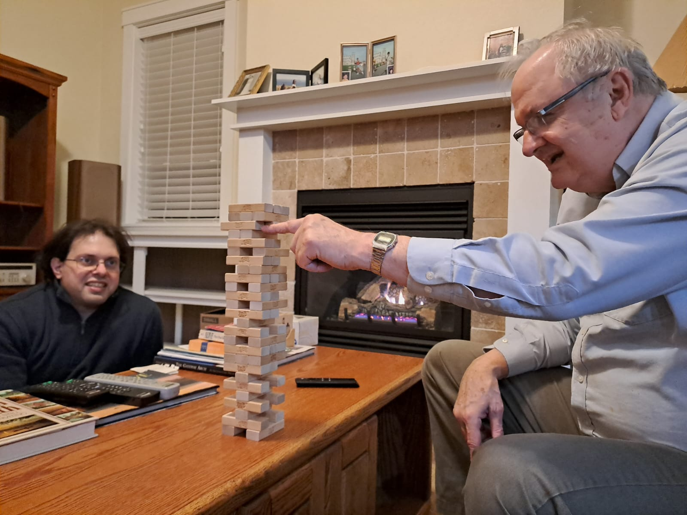
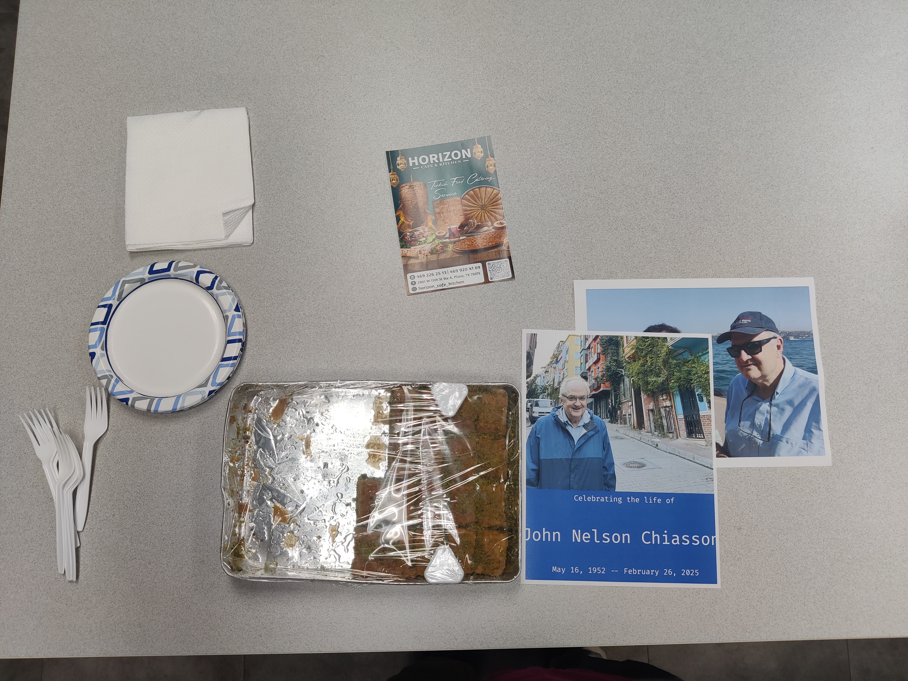

::: {.column-margin}
{.lightbox}
:::

I am not as kind as John - how could I be, how could anyone be? Still, John
lives in my heart. He was a gift to this world.  I brought some sweets in the
memory of John and shared them with everyone at UT Dallas that knew John. 
See picture below.

{.lightbox width=60%}

It's been a year without his incessant mocking and teasing... I miss you and I
love you John!

You are gone, John. We spread some of your ashes in the Stanley Lake and Boise
River.  I know it is a thought in vain. Even though you and I both do not
believe in a higher power, your passing made me wish there was one so much! I
know it is highly unlikely you're in a better place but I want to believe it so
much nevertheless!

Goodbye my elderly friend! I will visit you again next year today!

