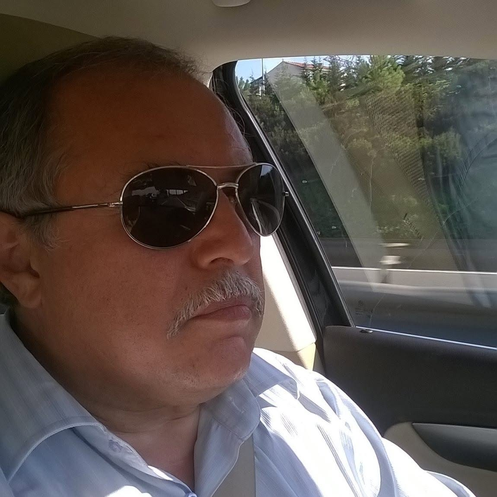

::: {.column-margin}
{.lightbox}
:::

I sent this song to my father today. I really love him so much!
<iframe width="560" height="315" src="https://www.youtube.com/embed/ABbLtpM-CAk?si=JG8Ox54NrJ1wnqcv" title="YouTube video player" frameborder="0" allow="accelerometer; autoplay; clipboard-write; encrypted-media; gyroscope; picture-in-picture; web-share" referrerpolicy="strict-origin-when-cross-origin" allowfullscreen></iframe>  
He is an amazing and kind person. He really is like John in many ways.

Here are the lyrics, both in English and Turkish, for those who are interested:

| Turkish | English                               |
|:-----------|:------------                       |
| bir bakarsın oyuncağın kırılmış		  | One day you may find that your toy is broken,          |
| arkadaşın sana küsmüş darılmış                  | your friend is angry and upset with you,               |
| kavga etmiş kaşın gözün yarılmış                | you’ve been in a fight, your brow and eye are cut.      |
| yaşlı gözlerle bana gelip sakın üzülme yavrum	  | Don't come to me w/ teary eyes; don't be sad, my child.	 	   |
| böyle büyür insanlar ağlamak çare değil         | This is how people grow; crying is no solution.        |
| zaman değirmenini durdurmak kolay değil         | It is not easy to halt the mill of time.
|                                                 |							   |
| sendeki sen sana soru sorunca                   | When the innerself within you begins questioning you,  | 
| ortaçağı galile'yi bilince                       | when you learn about the Middle Ages and Galileo,      |
| okuduğun Ince Memed olunca                      | when the book you are reading is Ince Memed,           |
| yaşlı gözlerle bana gelip sakın üzülme yavrum   | Don't come to me w/ teary eyes; don't be sad, my child.|
| böyle büyür insanlar ağlamak çare değil         | This is how people grow; crying is no solution.        |
| zaman değirmenini durdurmak kolay değil         | It is not easy to halt the mill of time.		   |
|                                                 | 							   |
| pırıl pırıl bir ilkbahar gününde                | On a bright, sparkling spring day, 			   |
| ilk aşkının gerçeğinde düşünde                  | amid the reality and dreams of your first love,        |
| bir burukluk varsa eğer içinde		  | if there is a bittersweet ache within you,             |
| yaşlı gözlerle bana gelip sakın üzülme yavrum	  | Don't come to me w/ teary eyes; don't be sad, my child.|
| böyle büyür insanlar ağlamak çare değil	  | This is how people grow; crying is no solution.        |
| zaman değirmenini durdurmak kolay değil	  | It is not easy to halt the mill of time.		   |
|                                                 | 							   |
| yaşadığın gördüklerin dışında                   | When, beyond all that you have lived and seen, 	   |
| mutluluğu kuytularda bulunca                    | you find happiness in hidden corners		   |
| bir de şöyle etrafına bakınca                   | and then pause to look around you, 			   |
| yaşlı gözlerle bana gelip sakın üzülme yavrum   | Don't come to me w/ teary eyes; don't be sad, my child.|
| böyle büyür insanlar ağlamak çare değil         | This is how people grow; crying is no solution.        |
| zaman değirmenini durdurmak kolay değil	  | It is not easy to halt the mill of time.		   |
|                                                 | 							   |
| bir gün gelip dünya sana uymazsa		  | If one day the world no longer suits you, 		   |
| değiştirmek eğer elden gelmezse                 | if changing it is beyond your power, 		   |
| şarkılarım sana miras kalmışsa		  | if my songs have become your legacy,        	   |
| yaşlı gözlerle bana gelip sakın üzülme yavrum	  | Don't come to me w/ teary eyes; don't be sad, my child.|
| böyle büyür insanlar ağlamak çare değil 	  | This is how people grow; crying is no solution.        |
| zaman değirmenini durdurmak kolay değil 	  | It is not easy to halt the mill of time. 		   |


