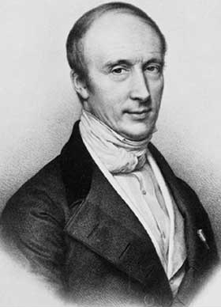

::: {.column-margin}
{.lightbox}
:::

::: {#exr-interesting-inequality}
## Interesting Inequality

Let $f: \R_4^+ \to \R$ be the function defined by $\bm{z} \mapsto z_1^2 z_2 z_3 + z_2^2 z_3 z_4 + z_3^2 z_4 z_1 + z_4^2 z_1 z_2$. Show that 
$$
f(\bm{z}) \le \norm{\bm{z}}{4}^4 = z_1^4 + z_2^4 + z_3^4 + z_4^4.
$$
:::

::: {.proof}
Define the two vectors 
$$
\bm{u} = \bmat{z_1^2 & z_2^2 & z_3^2 & z_4^2}, \quad \bm{v} = \bmat{z_2 z_3 & z_3 z_4 & z_4 z_1 & z_1 z_2}.
$$
We can write $f(\bm{z})$ as the inner product of these two vectors:
$$
f(\bm{z}) = \bm{u} \cdot \bm{v}.
$$
By the Cauchy-Schwarz inequality, we have
$$
(\bm{u} \cdot \bm{v})^2 \le \|\bm{u}\|^2 \|\bm{v}\|^2 = (z_1^4 + z_2^4 + z_3^4 + z_4^4)\left( (z_2 z_3)^2 + (z_3 z_4)^2 + (z_4 z_1)^2 + (z_1 z_2)^2 \right).
$$ {#eq-cs1}
Now, let us define the shifted version $\bm{u}_s$ of the vector $\bm{u}$
$$
\bm{u}_s = \bmat{z_2^2 & z_3^2 & z_4^2 & z_1^2}.
$$
Clearly $\norm{\bm{u}_s}{} = \norm{\bm{u}}{}$. Apply Cauchy-Schwarz inequality
once more, this time to the vectors $\bm{u}$ and $\bm{u}_s$. We have
$$
\left( (z_2 z_3)^2 + (z_3 z_4)^2 + (z_4 z_1)^2 + (z_1 z_2)^2 \right) = \bm{u} \cdot \bm{u}_s \le \|\bm{u}\|^2 = z_1^4 + z_2^4 + z_3^4 + z_4^4.
$$ {#eq-cs2}
Substituting from @eq-cs2 into @eq-cs1, we obtain
$$
(\bm{u} \cdot \bm{v})^2 \le (z_1^4 + z_2^4 + z_3^4 + z_4^4)^2 \; \Leftrightarrow f(\bm{z}) \le z_1^4 + z_2^4 + z_3^4 + z_4^4.
$$
:::

