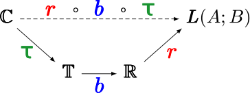

::: {.faculty-home}

::: {.faculty-intro}

::: {.intro-copy}

[THE UNIVERSITY OF TEXAS AT DALLAS]{.eyebrow}

# Aykut C. Satici {.faculty-name}

[Associate Professor of Systems Engineering]{.appointment}

Erik Jonsson School of Engineering and Computer Science

::: {.intro-statement}

I study robotics, nonlinear control, and machine learning. My research combines mathematical models, optimization, and learning to understand and control robotic systems, with applications in locomotion and manipulation. I lead [Robot Control Lab](#robot-control-lab) at UT Dallas.

:::

::: {.intro-links}

[Publications](publications.qmd){.primary-link}
[About me](about.qmd)
[Email](mailto:aykut.satici@utdallas.edu)

:::

:::

::: {.portrait-wrap}

{.faculty-portrait fig-alt="Aykut C. Satici" width=380 height=480}

:::

:::

::: {.home-section #research-directions}

[RESEARCH]{.eyebrow}

## Mathematics, dynamics, and learning

::: {.research-grid}

::: {.research-item}
### Robotics
Locomotion and manipulation in robotic systems, with an emphasis on using their natural dynamics.

[Robotics and control →](research/robotics_and_control.qmd)

:::

::: {.research-item}

### Nonlinear control
Energy shaping and passivity-based methods for controlling underactuated mechanical systems.

[Selected work →](#selected-work)

:::

::: {.research-item}

### Machine learning
Data-driven control design, neural models, and Bayesian approaches to uncertainty and robustness.

[Publications →](publications.qmd)

:::

:::

:::

::: {.home-section #selected-work}

[SELECTED WORK]{.eyebrow}

## A closer look at the research

::: {.paper-list}

::: {.paper-row}
[2022]{.paper-year}

::: {.paper-detail}

### [Robust Passivity-Based Control of Underactuated Systems via Neural Approximators and Bayesian Inference](publications.qmd#ref-ashenafi2022robust)
Nardos Ayele Ashenafi, Wankun Sirichotiyakul, and Aykut C. Satici

*IEEE Control Systems Letters*

:::

:::

::: {.paper-row}

[2021]{.paper-year}

::: {.paper-detail}

### [Combining Energy-Shaping Control of Dynamical Systems with Data-Driven Approaches](publications.qmd#ref-sirichotiyakul2021combining)
Wankun Sirichotiyakul and Aykut C. Satici

*IEEE Conference on Control Technology and Applications*

:::

:::

::: {.paper-row}

[2016]{.paper-year}

::: {.paper-detail}

### [A coordinate-free framework for robotic pizza tossing and catching](publications.qmd#ref-satici2016coordinate)
Aykut C. Satici, Fabio Ruggiero, Vincenzo Lippiello, and Bruno Siciliano

*IEEE International Conference on Robotics and Automation*

:::

:::

:::

[View all publications →](publications.qmd){.section-link}

:::

::: {.home-section .lab-section #robot-control-lab}

::: {.lab-copy}
[RESEARCH GROUP]{.eyebrow}

## Robot Control Lab

Our group conducts foundational research in robotics, nonlinear control, and machine learning, drawing on Bayesian statistics, optimization, and algebraic and differential geometry.

::: {.intro-links}

[Meet the people →](people/index.qmd)
[Opportunities →](positions/index.qmd)

:::

:::

::: {.lab-mark}

{fig-alt="Robot Control Lab logo" width=440}

:::

:::

::: {.home-section .teaching-section}

[TEACHING]{.eyebrow}

## Learning through models and systems

Course materials in robotics, optimization, deep learning, system modeling and control, and systems architecture.

::: {.course-links}

[Deep learning](teaching/grad_courses/deep_learning/index.qmd)
[System modeling and control](teaching/ug_courses/smac/index.qmd)
[Systems architecture](teaching/ug_courses/systems_architecture/index.qmd)

:::

[Explore all courses →](teaching/index.qmd){.section-link}

:::

:::
