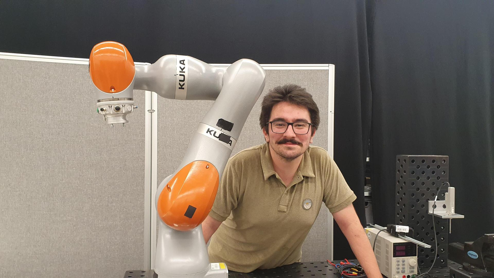
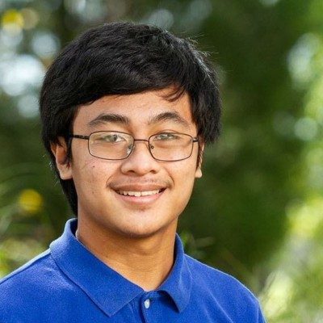

::: {.grid}

::: {.g-col-12 .g-col-md-6}
::: {style="text-align: center;"}
{.lightbox height=220}
:::

::: {.callout-tip collapse="true"}
## Yunus Emre Danabas
PhD Student, joined Fall 2026

B.S. (double major), Mechatronics Engineering and Electronics Engineering — Sabanci University, Istanbul
:::
:::

::: {.g-col-12 .g-col-md-6}
::: {style="text-align: center;"}
{.lightbox height=220}
:::

::: {.callout-tip collapse="true"}
## Angelo Matthew Mariano Pimienta
PhD Student, joined Fall 2026

B.S. and M.S. in Computer Science — The University of Texas at Dallas
:::
:::

:::
