## The task {.smaller}

{.fig-tall fig-alt="A disk pushes a box along the floor, into a step, topples it ninety degrees onto the upper platform, relocates to the new back face, and pushes it to the goal."}

::: footnote
The planner is given a start pose and a goal set. It is not given the contacts.
:::

::: {.notes}
Nobody told the planner that the riser was useful, or that the box would have
to be released and re-acquired on a face that was not a pushing surface a
moment earlier. The query is a goal set. Everything else is invented.
:::

## Two problems at once

::: {.cols2}
::: {.card}
[Continuous]{.cardh}

A trajectory and a control signal satisfying non-penetration, unilateral
contact, friction, and dynamics.
:::

::: {.card}
[Discrete]{.cardh}

*Which* contacts are held, and in what order they are made and broken.
:::
:::

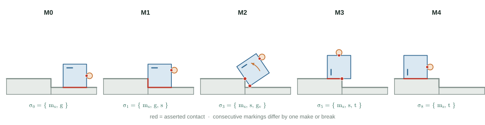{.fig-wide fig-alt="Five snapshots of the task, each labelled with the set of contacts asserted at that moment."}

::: claim
Get the sequence wrong and no amount of trajectory optimization recovers it.
:::

## What the discrete object should be

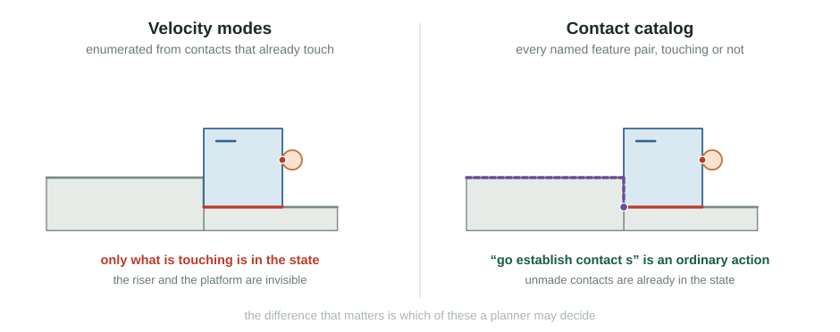{fig-alt="Left: only the contacts that are currently touching are in the state. Right: the full catalog, including the riser and platform contacts that do not exist yet."}

::: claim
Carrying unmade **environment** contacts in the state, and gating their release
by statics, is the structural difference — everything else follows from it.
:::

::: {.notes}
A *velocity mode* assigns, to each contact collision detection has already
found, a separating or maintaining normal velocity and — if maintaining — a
sticking or sliding cell of the friction cone. Huang, Cheng and Mason enumerate
those cells; Cheng and coauthors use them as primitives in an RRT and in
Monte-Carlo tree search. Graphs of convex sets differ but share the shape of
the limitation: vertices are modes, enumerated up front. Either is a good
discrete object for contacts you already have; neither can express "go and
establish contact with the riser."

The claim has to be narrower than that, though, because of Xie, Xiang, Posa
and Jin. Their hierarchy splits manipulation along the same seam — learned
geometry above, model-based contact dynamics below — and their interface, a
*contact intention* of a surface location plus a post-contact object subgoal,
does establish new contacts. It solves a box pivoted against a step at 95 to 98
per cent, with zero-shot transfer to a Franka.

Two things sit outside that interface. Object–environment contacts are declared
**passive** and never enter their action space, so the riser and the platform
are consequences of a chosen subgoal rather than decisions. And the manoeuvre
between contacts — disengage, travel, re-acquire — is a scripted
lift-and-reposition, so nothing asks whether releasing is admissible at the
current pose. Those two are exactly what this construction makes explicit, and
they are what the next act is about.
:::

## The method at a glance {.smaller}

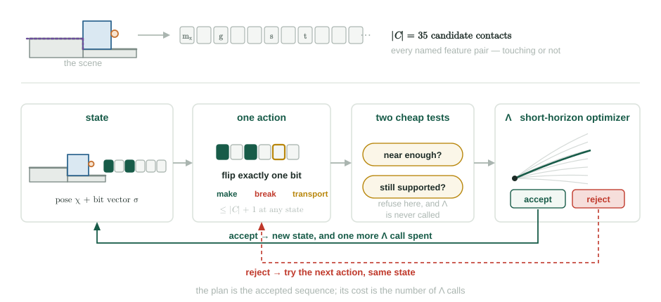{.fig-tall fig-alt="Top: the scene fixes a catalog of 35 candidate contacts. Below, a loop: state is a pose plus a bit vector; one action flips one bit; two cheap tests; the short-horizon optimizer accepts or rejects; accept returns a new state, reject tries the next action."}

::: claim
Everything that follows expands one box of this picture.
:::

# The construction {.divider}

Five objects. Nothing else is needed to state the method.

## Features {.smaller}

[Object 1]{.objtag}

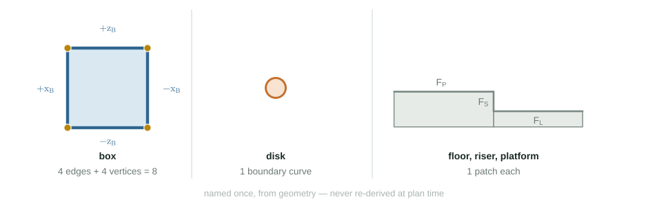{fig-alt="The box contributes four edges and four vertices; the disk one boundary curve; the floor, riser, and platform one patch each."}

::: claim
Fixed by geometry, once, before planning. Finite by construction.
:::

## Templates and gaps {.smaller}

[Object 2]{.objtag}

{fig-alt="Two named features approach, touch, penetrate, and separate, while a signed gap value tracks the distance between them."}

::: claim
$\varphi_c(\chi)$ is a function of configuration alone, so it is **defined
whether or not the pair touches**. That is what lets an unmade contact sit in
the state.
:::

## The catalog {.smaller}

[Object 3]{.objtag}

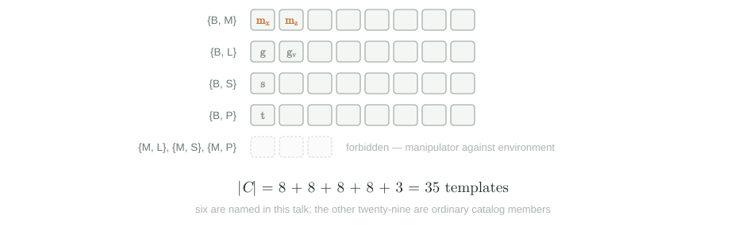{fig-alt="Thirty-five contact templates grouped by body pair: eight each for box-manipulator, box-floor, box-riser, box-platform, and three forbidden manipulator-environment pairs."}

::: claim
Most of these will never be touched. That is fine — the state is a bit vector
over all of them, not a list of the ones in use.
:::

::: {.notes}
This is where the construction is most exposed, in two ways.

In three dimensions a box alone has 26 features — 6 faces, 12 edges, 8 vertices
— so a box against a multi-link arm is already thousands of templates. Beyond
the planar case, pruning to pairs that realize a closest-point somewhere in the
workspace is mandatory, not an optimization.

And any cost term that sums over the whole catalog inside an optimizer rollout
is expensive at that scale and largely redundant with what the simulator
already enforces. Read the active set from the simulator's broadphase.
:::

## The state {.smaller}

[Object 4]{.objtag}

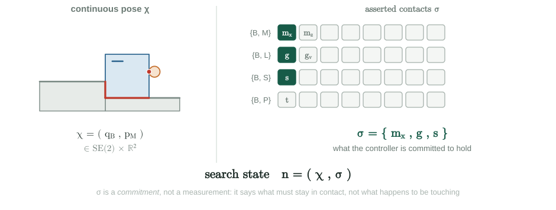{.fig-tall fig-alt="Left, the continuous pose of the box and disk. Right, a grid of catalog entries with three lit, forming the bit vector of asserted contacts."}

::: claim
Not an enumerated set of formations — there are $2^{35}$ of those — but the bit
vector itself, carried alongside the pose.
:::

::: {.notes}
"Asserted" is doing real work. Sigma is a *commitment*, not a measurement: it
says which gaps the controller is required to hold near zero over the next
horizon. What happens to be touching is a different set, measured from the
pose. They are allowed to differ, and that difference is the difference between
a constraint being enforced and an observation about the world.
:::

## The actions {.smaller}

[Object 5]{.objtag}

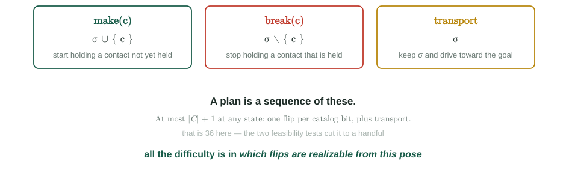{.fig-tall fig-alt="Three action cards — make, break, transport — and a note that a plan is a walk on the graph of markings."}

::: {.notes}
One correction against the earlier draft of the report. Transport must be
allowed to make partial progress. If the only goal-seeking action is
all-or-nothing — reach the goal set within one horizon or be rejected — then a
long transport across the platform has no legal decomposition and the search
dead-ends. Transport succeeds when it keeps the marking and reduces the goal
residual.
:::

## What the marking graph actually is {.smaller}

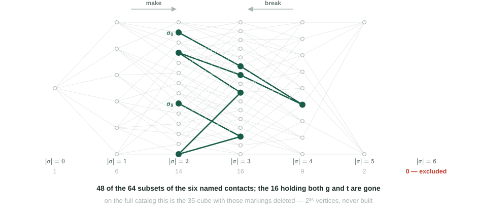{.fig-tall fig-alt="Valid markings arranged in columns by how many contacts they hold, joined by single-bit edges, with the plan drawn as a path through them and the last column empty."}

::: claim
Validity is hereditary, so the graph is connected and the distance between two
markings is exactly their Hamming distance. **There is nothing here to search.**
:::

::: {.notes}
"Hypercube" alone is not quite right. The vertices are the *valid* markings —
no excluded pair, no forbidden template — and the edges are single bit flips.
So this is the induced subgraph of the Boolean cube on those subsets: the cube
exactly when there are no exclusions, otherwise the cube with the offending
vertices deleted. Here, 48 of 64: the sixteen holding both the floor sit and
the platform sit are gone, which is why the last column is empty.

On the full catalog this same object has $2^{35}$ vertices and is never built:
only the edges leaving the current marking are ever enumerated.
:::

## The plan is a walk on that graph {.smaller}

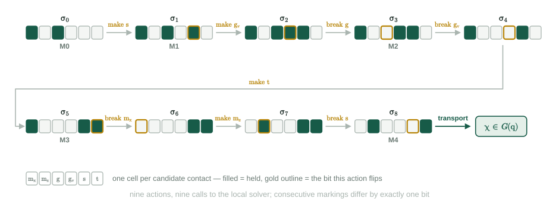{fig-alt="The nine markings of the running example drawn as bit-vector chips, joined by arrows labelled with the action that flips each bit, ending in the goal set."}

::: claim
Nine actions, nine calls to the local solver. That count is the quantity this
project is trying to reduce.
:::

::: {.notes}
The same plan as the opening animation, seen as a walk: M0–M4 are those five
snapshots. It passes through markings no snapshot shows — a single make or
break is often not a visible event — and the last arrow, transport, flips no
bit at all.
:::

## Realizing one action {.smaller}

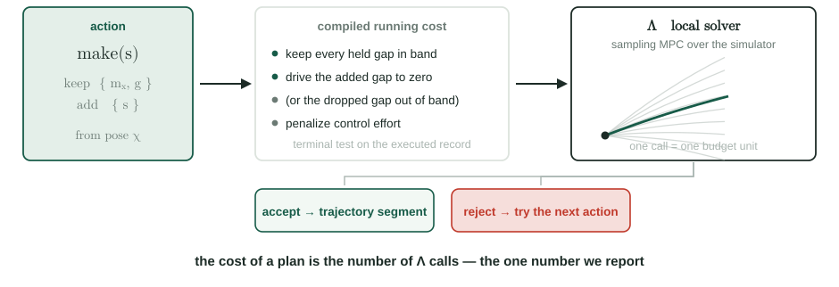{fig-alt="An action is compiled into a running cost, handed to a sampling model-predictive controller over the simulator, and either accepted with a trajectory segment or rejected."}

::: claim
$\Lambda$ is an oracle we call and count. Everything else exists to call it
fewer times.
:::

::: {.notes}
Deliberately uninterpreted: MPPI against MuJoCo here, but a convex quasidynamic
stepper or inference in a contact factor graph realizes the same compiled cost
and drops in without touching anything else.

The sampling solver applies directly to the simulator's own integrator, with no
second contact model to keep in sync. Its weakness is that it is local and
budget-limited, so **a rejection is not a proof of infeasibility** — it can fail
on an action that is perfectly realizable. Every training label inherits that.
:::

## Two cheap tests come first {.smaller}

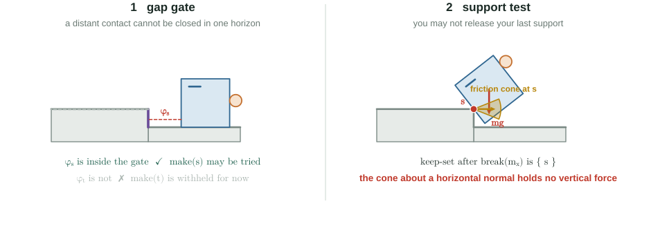{fig-alt="Left, the gap gate withholds actions whose new contact is too far away. Right, the support test refuses to release the last supporting contact."}

::: claim
Both are products of local factors, so both cost microseconds and run before
any optimization.
:::

# Two things the construction buys {.divider}

Both decide whether an action is legal from *this* pose, not from its name.

## When the manipulator may let go

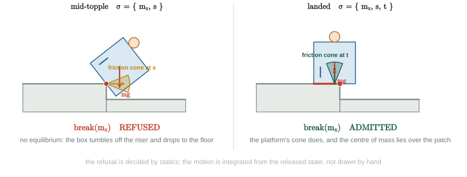{fig-alt="Mid-topple, the riser's friction cone holds no vertical force and the box tumbles clear; after landing, the platform's cone balances gravity and the release is admitted."}

::: {.notes}
The test is asked of the *keep-set*: the contacts that survive the action.
Mid-topple that is the riser alone, and the argument is the one the figure
draws. The riser's face is vertical, so with no other horizontal force the
balance forces its normal force to zero — and a Coulomb cone with zero normal
force carries no tangential force either. The riser therefore holds *no*
vertical load, at any pose and whatever its contact patch. That is stronger
than it first looks: the refusal needs no hypothesis about a single contact
point, so it holds throughout the topple, not just at one configuration.

It does rest on one modelling choice, worth naming. The normal is taken from
the *environment* feature — the vertical riser face — and during the pivot the
realized contact is the riser's top corner bearing on the box face, where a
corner has no geometric normal of its own. Take the box face's normal instead
and the cone tilts with theta; the refusal then follows from the weaker
line-of-action argument, which needs the contact patch to be a single point off
the vertical through the centre of mass. Both readings refuse the release here.
They differ in how much more they refuse.

The left panel's motion is integrated, not keyframed — a penalty-contact model
released from rest. It slides on the step corner for about a fifth of a second,
loses that contact, and lands flat well clear of the riser. Shown because it
can be computed; the test itself claims nothing about it.
:::

## Geometry fixes the order

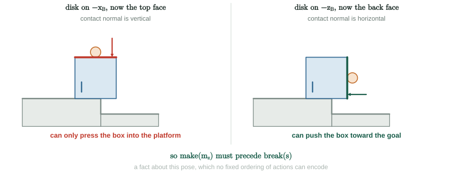{fig-alt="After landing, the contact normal on the old pushing face is vertical and can only press down, while the normal on the new back face is horizontal and can push toward the goal."}

::: claim
Only the new back face has a horizontal normal, so `make` must precede `break`
— a fact about *this pose*, which no fixed ordering of actions could encode.
:::

## That is already a planner {.smaller}

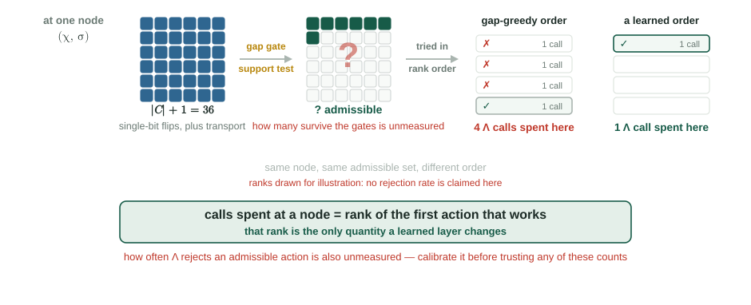{fig-alt="At one node, at most 36 candidate actions are narrowed by the two gates to an unmeasured admissible set, then tried in rank order; the same set costs four solver calls under a gap-greedy order and one under a learned order."}

::: claim
Everything so far runs with nothing learned in it, and what it returns is
certified by the records that produced it.
:::

::: {.notes}
Everything up to here — catalog, bit vector, gated actions, the local solver,
the search over (marking, quantized pose) — is a complete planner. No network,
no training data, no teacher.

Two cautions about this slide, both deliberate. It is *sound* but not
*complete*: what it returns is certified, but a rejection by $\Lambda$ is not a
proof of infeasibility, `Imp` is sound-and-incomplete, and a marking with an
empty realization set surfaces only as a solver failure. And the two ranks on
the right are a mechanism, not a measurement — four versus one illustrates that
rank is the cost, and nothing here claims how often rejections actually happen.
That number is Phase I½'s job.

Gap-greedy is the named baseline, not a stand-in for "any old order": it prefers
the legal make whose added contact is already closest. That is why it defers the
still-distant riser at the root and prefers doing nothing after landing — the two
hops where a learned order has to beat it.
:::

# Learning, as an accelerator {.divider}

It reorders the candidate list. It changes nothing else, and it has to earn its
place.

## The graph

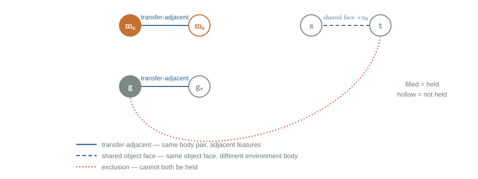{.fig-tall fig-alt="Six contacts as vertices, joined by transfer-adjacent, shared-object-face, and exclusion edges."}

::: claim
Not the search space — that was the marking graph. This is the message-passing
substrate of a learned heuristic **over** it, and conflating the two is the
fastest way to make the method incomprehensible.
:::

::: {.notes}
Vertices are contacts; edges say which contacts should exchange information:
same body pair with adjacent features, same face of the moving object against
different environment bodies, and mutually impossible pairs. The shared-face
edge is the one that is not standard, and the next slide shows what it buys.
:::

## A neighbourhood, not the whole catalog

{.fig-tall fig-alt="The seed grows from the held contacts, to the gap-gated contacts, to everything one hop away, bringing the platform contact into view."}

::: claim
The platform contact enters the network's view through a shared-face edge while
the box is still on the floor — long before it is close enough to attempt.
:::

## Ranking the available actions

{.fig-tall fig-alt="Attention over the live subgraph produces a score for each available action, drawn as a ranked bar chart."}

::: claim
It cannot make $\Lambda$ succeed more often, and it cannot make an illegal
action legal. It can only move the action that works to the front of the list.
:::

::: {.notes}
Trained from teacher rollouts: the teacher tries every legal action at every
node and records what worked.

One design correction. An early version scored every off-path success as a
negative — exactly wrong for the case that matters, since the ranker is
consulted after a rejection, which is off the certified path, where every label
said "bad". Label by calls-to-goal instead and the mismatch disappears.
:::

## Why a learned order is worth anything

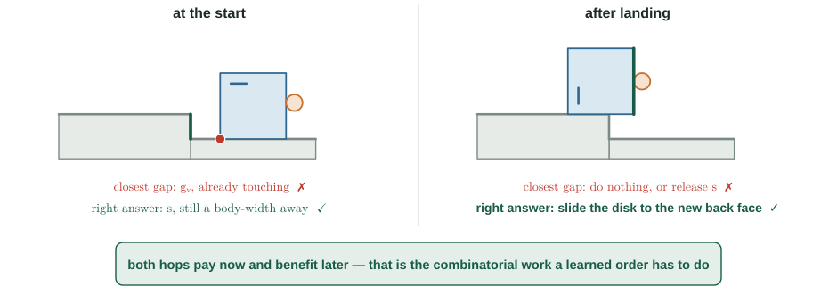{.fig-tall fig-alt="At the start a closest-gap rule prefers the floor vertex over the distant riser; after landing it prefers doing nothing over relocating the disk."}

::: claim
Both hops pay now for a benefit several actions later. A learning claim needs a
baseline it can lose to, and this is it.
:::

::: {.notes}
"Pay now, benefit later" is the definition of a value function, which is what
makes a cost-to-go head over (pose, marking) the natural instrument: closed-loop,
re-evaluated at every node, one extra head on the same backbone.
:::

# What we measure {.divider}

## The whole system

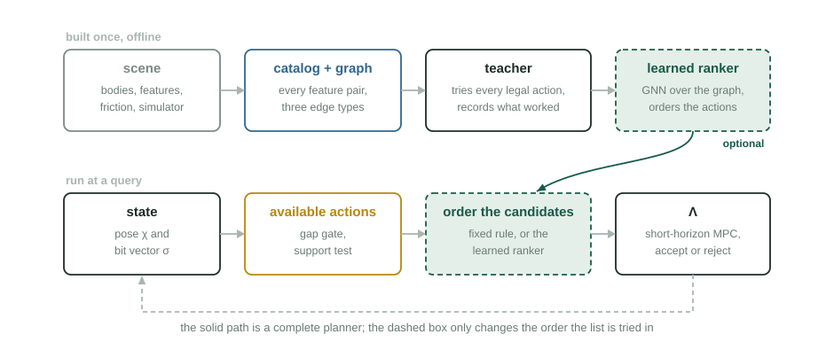{.fig-tall fig-alt="Offline: scene, catalog and graph, teacher, learned ranker. At a query: state, available actions, ranking, local solver, loop."}

## One number

{.fig-tall fig-alt="Bar chart of solver calls for each baseline, with the no-discrete-search baseline not yet measured."}

::: {.notes}
Not wall time, which is dominated by implementation detail, and not success
rate alone, which hides how much search was spent.

The top row is the one that has to be run first: smoothing the contact dynamics
and running a sampling planner through the smoothed model, with no discrete
search at all. If that solves this family, the discrete layer needs a harder
family to justify itself. Comparing only against variants of your own planner
is not evidence.
:::

## The experiment that decides the project {.smaller}

::: {.openq}
**Before anything is trained**, run the teacher and the closest-gap baseline on
a family of step scenes, with no network at all.
:::

::: {.cols2}
::: {.card}
[If the gap is large]{.cardh}

There is a learning problem. Train the ranker and try to close it.
:::

::: {.card}
[If the gap is small]{.cardh}

Closest-gap-first plus the support test already solves the family, and no
architecture will produce a result worth reporting.
:::
:::

::: {.warn}
Calibrate $\Lambda$ first: measure how often a much larger retry budget reverses
a rejection. Until that false-negative rate is known, every teacher label and
every baseline number is unquantified.
:::

::: {.small}
Then two comparisons against something other than a variant of this planner: a
method that does no discrete search at all, and a **different discrete
object** — the contact-intention interface, which solves a task of this shape
with a surface location plus an object subgoal.
:::

::: {.notes}
This slide has no picture, which is the point. Everything before it is a
construction, and constructions are cheap. Whether the discrete decisions in
this family are hard enough that a learned ordering saves solver calls is
measurable in a week, with no network involved — and it has not been measured.
:::

## What is actually new {.smaller}

::: {.cols2}
::: {.card}
[1 · Unmade contacts are decisions &#8212; planner]{.cardh}

A bit vector over *all* candidate contacts, so acquiring one is an ordinary
action rather than a consequence of motion.
:::

::: {.card}
[2 · Release is gated by statics &#8212; planner]{.cardh}

Refused when the surviving contacts cannot hold the object — before any
optimization, not by simulating a fall.
:::

::: {.card}
[3 · Shared-face edges &#8212; learning layer]{.cardh}

Two supports of the same object face, against different environment bodies,
exchange information. This is what puts a contact in view before it is
reachable.
:::

::: {.card}
[4 · Cost measured in oracle calls &#8212; methodology]{.cardh}

Against a greedy constructor on the same state space, and against a planner
that does no discrete search at all.
:::
:::

::: {.small}
Not claimed as new: multi-relational graphs, attention on them, feature-pair
catalogs, make/break generators, sampling MPC, or the teacher–student split.
:::

## Open questions {.smaller}

::: {.cols2}
::: {.card}
[Does the learning problem exist?]{.cardh}

Unmeasured. The gating experiment answers it.
:::

::: {.card}
[How reliable is the oracle?]{.cardh}

A local, budget-limited solver rejects realizable actions at an unknown rate,
and everything downstream inherits that noise.
:::

::: {.card}
[Does the catalog survive 3D?]{.cardh}

Only with aggressive pruning, which is then load-bearing rather than an
optimization.
:::

::: {.card}
[Ranker, or lookahead?]{.cardh}

Generating a whole future sequence of markings is the richer option — and the
one that has to prove it beats the cheap head.
:::
:::

::: claim
The construction is worth building. That learning helps is, so far, a hypothesis
with a designed experiment attached and no data.
:::

## Planning through contact {.smaller}

::: {.closing}
::: {.lead}
When the contacts are the plan, the planner has to invent them — including the
ones that do not exist yet.
:::

::: {.cols2}
::: {.card}
[Two separable claims]{.cardh}
**The planner**: unmade contacts are decisions, and statics gates release.
**The accelerator**: a learned order costs fewer solver calls. The first does
not depend on the second.
:::

::: {.card}
[Next]{.cardh}
Teacher against the geometric baseline, with $\Lambda$'s false-negative rate
calibrated first — before anything is trained.
:::
:::

::: {.small}
Aykut C. Satici · Robot Control Lab · UT Dallas ·
[aykut.satici@utdallas.edu](mailto:aykut.satici@utdallas.edu)
:::
:::

::: footnote
Figures are generated from the scene geometry by `assets/make_figures.py`, in
the report's convention: $+x_W$ left, $+z_W$ up, positive $\theta$ the
counterclockwise topple.
:::
