## Two regimes, one optimization problem {.smaller}

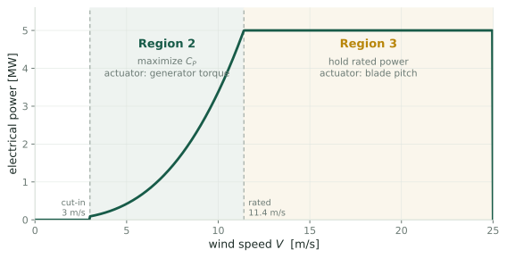{.fig-wide fig-alt="Power curve of a 5 MW turbine. Between cut-in at 3 m/s and rated at 11.4 m/s, power rises as the cube of wind speed; above rated it is held flat at 5 MW."}

::: {.cols2}
::: {.card}
[Region 3: above rated]{.cardh}

There is more wind than the machine can use. Throw the excess away and hold
rated power. A setpoint, an error signal and a PI controller.
:::

::: {.card}
[Region 2: below rated]{.cardh}

Take everything the wind offers. There is no setpoint, only an efficiency to
maximize. **This is the only regime containing an extremum to seek.**
:::
:::

::: {.notes}
Everything in this deck is Region 2. The machine spends most of its operating
hours there.
:::

## The hill {.smaller}

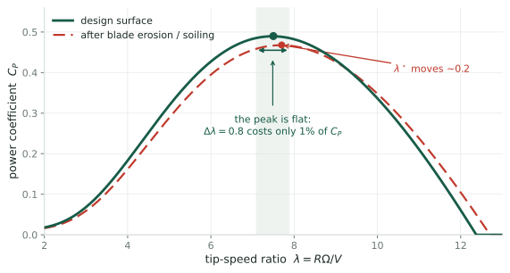{fig-alt="Power coefficient versus tip-speed ratio. A single smooth peak of 0.49 at lambda 7.5, steep on the left and gentle on the right. A dashed red curve shows the same rotor after erosion: peak lower and shifted right by 0.2."}

::: claim
The rotor's efficiency depends on one number, the **tip-speed ratio**
$\lambda = R\Omega/V$, which is blade tip speed divided by wind speed. Hold
$\lambda$ at $\lambda^\star$ and you capture the most power available.
:::

::: {.notes}
Two features of this curve set up everything that follows. The peak is *flat*:
being wrong by half a unit in lambda costs about one per cent of the power, so
power is a weak signal about where you are. The curve also *moves*. Blades
erode, insects accumulate, and the factory value of lambda-star stops being
right.
:::

## You cannot measure either axis {.smaller}

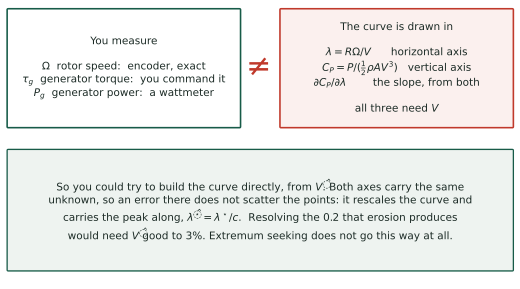{.fig-tall fig-alt="Left box: measurable signals are rotor speed, generator torque and generator power. Right box: the objective needs lambda and C_P, both of which require the wind speed. They are not equal."}

::: claim
Both coordinates of the hill are written in terms of $V$, the wind speed
actually reaching the rotor, which is exactly what a turbine cannot measure.
:::

::: {.notes}
Concretely: an anemometer on the nacelle sits behind the rotor, in air the
rotor has already slowed, and how much it has slowed depends on the thrust,
which depends on the control parameter. The measurement responds to the thing
you are trying to tune. That circularity is why this line of work is
model-free.
:::

# Sitting on a hill you cannot see {.divider}

How the controller finds the peak without measuring where it is.

## The $k\Omega^2$ law {.smaller}

The generator is commanded to resist the rotor with a torque quadratic in speed,

$$\tau_{\text{gen}} = k\,\Omega^2 .$$

Balance it against the aerodynamic torque $T_{\text{aero}} = \tfrac12\rho\pi R^3V^2\,C_Q(\lambda)$,
with $C_Q = C_P/\lambda$, and the equilibrium condition is

$$\boxed{\ \frac{C_P(\lambda)}{\lambda^3} \;=\; \frac{2k}{\rho\pi R^5}\ }$$

::: claim
The wind speed **cancels**. Try $\tau_{\text{gen}} = k\Omega^n$ and you get
$C_Q(\lambda)/\lambda^{n} \propto V^{\,n-2}$. Only $n = 2$ removes $V$, so it
is the unique exponent for which the equilibrium tip-speed ratio does not
depend on the wind.
:::

::: {.notes}
Read the boxed equation carefully: the left side is a pure function of lambda,
the right side is a constant you choose. So picking k picks an equilibrium
lambda, permanently, without anyone measuring anything.
:::

## There is no rotor speed to regulate to {.smaller}

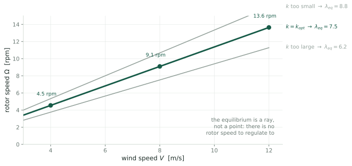{fig-alt="Rotor speed versus wind speed. Three straight lines through the origin, one per torque gain. The middle line is the optimal one; points on it at 4, 8 and 12 m/s show three different rotor speeds."}

::: claim
The equilibrium of the rotor equation is a **ray**, not a point. Every wind
speed gets its own $\Omega$; all of them share the same $\lambda$. The controller
never rejects the wind. It makes the desired behaviour an attracting manifold
and lets the wind slide the machine along it.
:::

::: {.notes}
This inverts the usual picture. In ordinary regulation you form an error and
drive it to zero. Here there is no error signal: the closed loop was *designed*
so that its natural resting place is the set you want. The wind is a parameter
that moves you along that set rather than a disturbance pushing you off it.

Region 3 is the opposite and matches the textbook picture, with a real speed
setpoint tracked by blade pitch.
:::

## So the problem reduces to one number {.smaller}

::: {.cols2}
::: {.card}
[What we have]{.cardh}

A single scalar knob $k$, and a monotone map from $k$ to the tip-speed ratio the
machine settles at.
:::

::: {.card}
[What we want]{.cardh}

The $k$ that lands us on the peak. The factory value is wrong at commissioning
and gets worse as the blades age.
:::
:::

::: claim
Find the maximum of a function you cannot evaluate, by turning a knob and
watching a noisy meter. That is **extremum seeking control**, and it is what
the last decade of work at UTD has been about.
:::

# Extremum seeking {.divider}

Estimate a derivative you cannot measure by wiggling the input.

## The loop {.smaller}

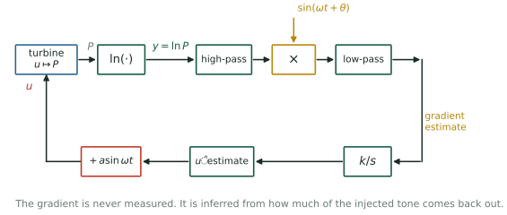{.fig-tall fig-alt="Block diagram: the control parameter enters the turbine, power comes out, is passed through a logarithm, high-pass filtered, multiplied by a phase-shifted copy of the dither, low-pass filtered, and integrated back onto the parameter."}

::: claim
Add a slow sinusoid $a\sin\omega t$ to the knob. If the output wiggles **in
phase**, you are on the uphill side; **out of phase**, the downhill side. Multiply
and average, and what survives is proportional to the slope.
:::

::: {.notes}
The multiply-and-average step is a lock-in amplifier, the same device used to
pull tiny optical signals out of noise. Its whole purpose is to answer one
question: how much of the tone I injected came back out, and with what sign?
:::

## The one identity that made it practical {.smaller}

Power is proportional to the cube of the wind speed, so the gradient of power is
too, and the wind varies by 3:1 across Region 2. A loop tuned at 8 m/s is
27 times too slow at 4 m/s and 27 times too aggressive at 12 m/s.

Rotea's 2017 observation is one line. Since
$\ln P = \ln(\tfrac12\rho A) + 3\ln V + \ln C_P(u)$, and the wind term does not
depend on $u$:

$$\frac{\partial \ln P}{\partial u} \;=\; \frac{1}{C_P}\frac{\partial C_P}{\partial u}$$

::: claim
Feed the algorithm $\ln P$ instead of $P$ and the loop bandwidth becomes
$\nu_c = (\kappa/C_P^{\max})\,|\partial^2 C_P/\partial u^2|$, free of both the
wind speed and the air density. **Tune it once; it works everywhere.**
:::

## What the logarithm fixes {.smaller}

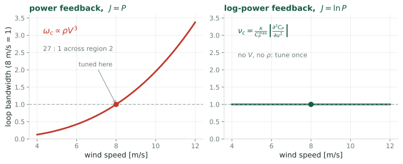{fig-alt="Two panels. Left, power feedback: loop bandwidth rises as the cube of wind speed, spanning 27 to 1. Right, log-power feedback: a flat line."}

::: {.notes}
Note also a small free bonus. The 1/C_P factor is a state-dependent gain: far
from the peak, C_P is small, so the step is large. The algorithm accelerates
itself during the transient and settles down near the optimum, with nothing to
tune.
:::

## It holds up in high-fidelity simulation {.smaller}

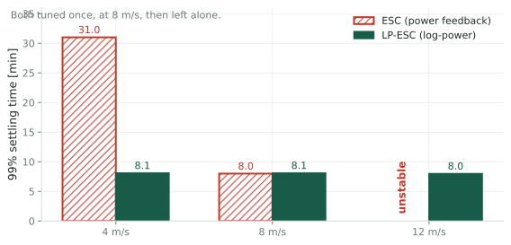{.fig-wide fig-alt="Bar chart of settling time at 4, 8 and 12 m/s under shear and 10 percent turbulence. Plain ESC takes 31 minutes at 4 m/s, 8 minutes at 8 m/s, and is unstable at 12. Log-power ESC takes about 8 minutes at all three."}

::: {.cols2}
::: {.card}
[Ciri, Leonardi & Rotea 2019]{.cardh}

Large-eddy simulation of the full flow around an NREL 5 MW rotor, with shear and
10% turbulence. No analytic gradient anywhere.
:::

::: {.card}
[The result]{.cardh}

Log-power holds 8 minutes across a 3:1 wind range. Plain ESC is four times
slower at the bottom and **goes unstable** at the top.
:::
:::

## Making it fast: LP-PIESC {.smaller}

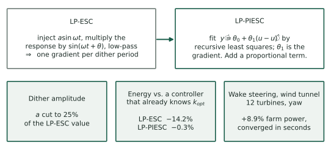{.fig-tall fig-alt="Comparison: LP-ESC demodulates a dither; LP-PIESC fits a two-parameter model by recursive least squares. Three result cards: smaller dither, energy loss cut from 14.2 to 0.3 per cent, and 8.9 per cent farm power gain in a wind tunnel."}

::: claim
Replace demodulation with **recursive least squares** on
$\dot y = \theta_0 + \theta_1(u-\hat u)$ and add a proportional term. The
gradient $\theta_1$ now comes with a covariance matrix $\Sigma$ that the
algorithm already propagates, and that none of these papers reports.
:::

::: {.notes}
On the energy number: LP-ESC, measured against a controller that already knows
the optimal gain, loses 14.2% of the energy. That is the cost of searching.
LP-PIESC brings it to 0.3%, which is what makes the approach deployable.

The wind tunnel result is a twelve-turbine array steering wakes by yaw, and the
algorithms converge in seconds at model scale.
:::

## Where things stand {.smaller}

::: {.cols3}
::: {.card}
[Solved]{.cardh}

Consistency across wind speed. The logarithm removes the $V^3$ dependence
exactly, in theory, in LES, and in the tunnel.
:::

::: {.card}
[Solved]{.cardh}

Speed. LP-PIESC converges fast enough that the search costs 0.3% of energy
rather than 14%.
:::

::: {.card}
[Not solved]{.cardh}

Everything to do with **noise**. "The enemy is process noise", and none of
these papers reports a variance.
:::
:::

::: claim
Extremum seeking works well when the process noise is negligible. Otherwise
you must average, and averaging costs convergence time. That trade-off has not
been quantified for this problem.
:::

# Five things nobody has settled {.divider}

Each one is a well-posed question with an answer somebody could get.

## Q1 · What is the estimator estimating? {.smaller}

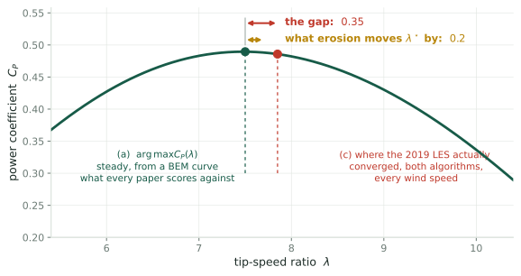{fig-alt="The C_P curve near its peak. A green marker at lambda 7.5 labelled the steady BEM optimum; a red marker at 7.85 where the 2019 LES actually converged. The 0.35 gap between them is drawn against the 0.2 shift that blade erosion produces."}

::: {.warn}
In the 2019 LES, **both** algorithms converge to $\bar\lambda \approx 7.85$
against a design value of $7.5$, at every wind speed, in every condition. The
paper calls this "close to the ideal optimum" and moves on.
:::

::: {.notes}
Three candidate targets, and they are not the same number:

(a) the argmax of the steady C_P curve, which is what every paper scores against;
(b) the argmax of the expected log-power under turbulence, which differs by a
Jensen gap plus rotor inertial lag;
(c) the algorithm's actual fixed point, which adds a finite-difference bias.

The gap between (a) and (c) in the published data is 0.35 in lambda. The effect
everybody wants to detect, blade erosion, is 0.2. You cannot do estimation
theory when the ambiguity in the definition of the target exceeds the signal.
:::

## Q1 · Why it is a variance problem {.smaller}

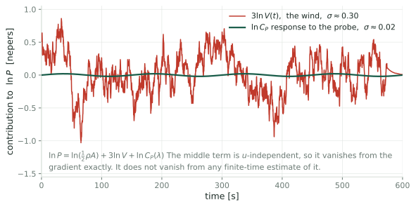{.fig-wide fig-alt="Time series over ten minutes. The wind contribution to log power swings with standard deviation 0.30 nepers; the turbine's response to the probe is a small clean sinusoid of amplitude 0.02."}

::: claim
$3\ln V$ is independent of the knob, so it vanishes from the gradient
**exactly**. It does not vanish from any finite-time *estimate* of that
gradient, and it is fifteen times larger than the signal.
:::

::: {.notes}
Writing the estimator out: one dither period produces one number,

  g-hat = (1/aT) times the integral of ln P against the dither.

Substituting the decomposition, the constant drops out by symmetry and two terms
survive: the projection of the turbulence onto the dither, which has nothing to
do with the turbine, and the projection of the C_P response, which carries the
signal. A back-of-the-envelope for the first gives

  sigma(g-hat) is about 3 · TI · sqrt(tau_c/T) / a

which falls as one over root T, the averaging Rotea mentions, and as one over
a.
:::

## Q1 · The trade that was never computed {.smaller}

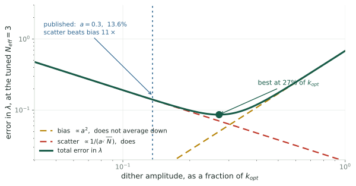{fig-alt="Log-log plot of mean-square error against dither amplitude. Bias squared rises as the fourth power; variance falls as the inverse square; the sum has a clear minimum. Vertical lines mark the amplitudes chosen in the two published papers."}

::: {.openq}
A central difference estimates $J'(q) + \tfrac{a^2}{6}J'''(q)$, so its zero sits
off the true optimum by $-\tfrac{a^2}{6}\,J'''/J''$. Bigger dither, less noise,
more bias. There is an optimal $a$, and both published values were chosen by
trial and error.
:::

::: {.notes}
This is Kiefer-Wolfowitz structure, and it has not been written down for wind
turbines.

It also suggests the experiment that settles Q1. Run the existing setup at two
or three dither amplitudes with several independent turbulence seeds. If the
offset from 7.5 scales as a-squared, it is estimator bias. If it is flat in a,
the turbulent optimum has moved, and the reference value these papers score
against is wrong. Either answer is publishable, and the seed spread gives you
the error bars none of them report.
:::

## Q2 · What sets the stability limit? {.smaller}

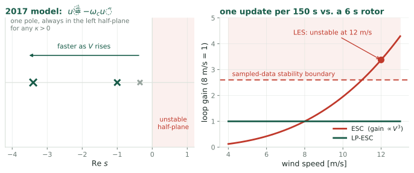{fig-alt="Left: the 2017 model has a single pole on the negative real axis that just moves further left as wind speed rises, so it can never go unstable. Right: loop gain versus wind speed crossing a sampled-data stability boundary, with the LES instability at 12 m/s marked."}

::: {.warn}
The 2017 model is first order: $\dot{\tilde u} = -\omega_c\tilde u$. It cannot
go unstable for **any** positive gain. The LES did, twice: in uniform flow and
in turbulence.
:::

::: {.notes}
So the failure mode that actually kills the algorithm in practice has no theory
behind it in this line of work.

The likely mechanism is sampled data. One parameter update per 150-second dither
period, against a rotor whose own time constant is about six seconds, with the
loop gain tripling between 8 and 12 m/s. That is a discrete-time stability
boundary, and a continuous first-order model is blind to it.

This boundary, rather than the noise, is the ceiling on how fast any of these
algorithms can be made to converge, which is the quantity Rotea says he cares
about.
:::

## Q3 · Does the turbine need to probe at all? {.smaller}

The rotor equation is $I\dot\Omega = T_{\text{aero}} - \tau_{\text{gen}}$. Every term on
the right is known: $\tau_{\text{gen}}$ is commanded, $\Omega$ is measured, and $I$ is
a design constant. So

$$T_{\text{aero}}(t) \;=\; I\dot\Omega(t) + \tau_{\text{gen}}(t)$$

is **exactly reconstructible without any anemometer**. And turbulence already
swings $\lambda$ between 6 and 8.5 all day long, for free.

::: claim
The dither exists because the excitation is *unknown*, not because excitation is
lacking. So: are $V(t)$ and the curve $C_Q(\cdot)$ jointly identifiable from the
record of $(\Omega,\,T_{\text{aero}})$ alone?
:::

::: {.notes}
This is the question with the largest payoff, because a yes would dissolve the
probing-versus-loads trade-off rather than optimize it. Without a dither there
is no fatigue cost to probing and no amplitude to choose.
:::

## Q3 · Exactly one blind direction {.smaller}

{fig-alt="Left: two different C_P curves, one a rescaled copy of the other. Right: both produce an identical aerodynamic torque record, so the data cannot distinguish them."}

Substituting $\tilde V = cV$ into $T_{\text{aero}} = \tfrac12\rho\pi R^3V^2C_Q(R\Omega/V)$:

$$\tilde C_Q(x) = \frac{C_Q(cx)}{c^2}
\quad\Longrightarrow\quad
\tilde C_P(x) = \frac{C_P(cx)}{c^3}
\quad\Longrightarrow\quad
\tilde\lambda^\star = \frac{\lambda^\star}{c}$$

::: claim
There is one unidentifiable direction, an overall scaling of the wind, and it
maps straight onto a scaling of $\lambda^\star$. Everything else about the curve is
determined. Air density errors, by contrast, scale $C_P$ uniformly and **do not
move the peak**.
:::

::: {.notes}
If this holds, you do not need a fast rotor-effective wind estimate. You need
*one slowly updated absolute wind scale* to pin the constant c: a met mast, a
lidar, or a long-run SCADA average. The fast fluctuations come free from the
rotor itself.

A slow reference is also harder to contaminate with the control parameter,
because the induction response you would worry about is fast. That sidesteps the
circularity that makes nacelle wind estimates unusable.

Caveat: this sits close to the wind-speed-estimator literature, which assumes
C_P known and solves for V. The joint version is what would be new, and it needs
checking against that literature before anyone builds on it.
:::

## Q4 · What the curvature is doing {.smaller}

Look again at the 2017 result:

$$\nu_c \;=\; \frac{\kappa}{C_P^{\max}}\left|\frac{\partial^2 C_P}{\partial u^2}(u_o)\right|$$

::: {.warn}
Choosing the gain $\kappa$ to hit a target settling time **requires the
curvature at the peak**, currently taken from a design curve that the LES says
is wrong by 10% in $C_P$. The gain calibration is not self-consistent, and
"it takes too long to tune" is partly a symptom of that.
:::

The curvature also sets the terminal scatter, $\sigma_\lambda \approx \sigma_{\hat g}/|H|$,
and the energy lost to mistuning is quadratic in $\sigma_\lambda$. The same
number sets the gain, the achievable accuracy and the cost of missing.

## Q4 · Two routes to the same covariance {.smaller}

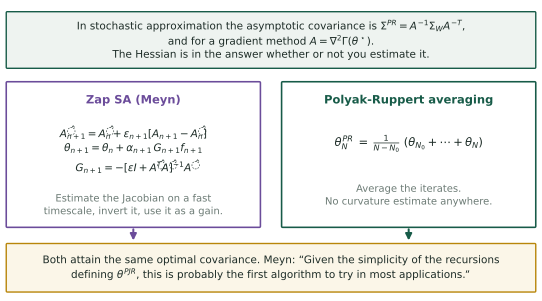{.fig-tall fig-alt="Top: the asymptotic covariance in stochastic approximation is A-inverse Sigma A-inverse-transpose, and A is the Hessian. Below, two boxes: Zap stochastic approximation estimates the Jacobian and inverts it; Polyak-Ruppert averaging simply averages the iterates. Both reach the same optimal covariance."}

::: claim
**Meyn does not estimate the Hessian in the ESC papers.** It appears in the
*analysis*, as the matrix $A = \nabla^2\Gamma(\theta^\star)$ governing the
asymptotic covariance. Where he does estimate it, in Zap SA, it is a
two-timescale recursive Jacobian estimate used as a matrix gain: stochastic
Newton-Raphson.
:::

::: {.notes}
Polyak-Ruppert averaging attains the *same* optimal asymptotic covariance
without estimating any curvature. You average the iterates. Meyn's own
recommendation is that this is the first thing to try.

So if the goal is optimal terminal variance, the Hessian is not needed. A matrix
gain buys transient behaviour and stability under weak assumptions, which are
worth having but are not what the variance question asks for.

Which raises a question to settle early: how much of what looks open in wind is
already answered in stochastic approximation and simply has not been imported?
:::

## Q5 · How good could any algorithm be? {.smaller}

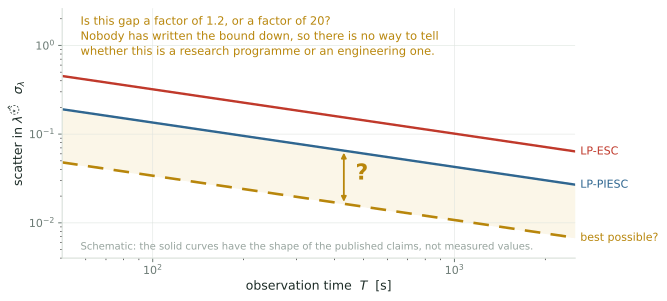{fig-alt="Log-log schematic of terminal scatter against observation time. Two solid curves for the published algorithms and a dashed gold curve far below them labelled best possible, with the gap between them marked by a question."}

::: {.openq}
Given a turbulence spectrum, an observation time and a fatigue budget, how well
can **anyone** locate $\lambda^\star$? Nobody has written the bound down.
:::

::: {.notes}
Without it there is no way to know whether LP-PIESC is within twenty per cent of
optimal, in which case this is engineering rather than research, or a factor of
twenty off, in which case there is a great deal of work here.

The structure suits a Cramer-Rao argument: the measurement equation is known,
the noise spectrum is measurable, and the nuisance parameter is the wind. I
would want this before committing to anything else, since it is the only item
that says whether the other four are worth doing.
:::

## Why turbulence is not ordinary noise {.smaller}

::: {.cols2}
::: {.card}
[In classical stochastic approximation]{.cardh}

Noise is pure nuisance. It corrupts the measurement and you average it away.
:::

::: {.card}
[Here]{.cardh}

Turbulence is **simultaneously the noise and the excitation**. It is what
corrupts the gradient estimate *and* what sweeps the rotor across the curve for
free.
:::
:::

::: claim
That duality is what the stochastic-approximation literature does not cover,
and it is what makes Q3, estimating the curve without probing it, plausible.
:::

## The experiment I would run first {.smaller}

::: {.openq}
Take the existing simulation setup. Run it at two or three dither amplitudes,
with several **independent, non-repeating** turbulence seeds. Look at where the
torque gain lands.
:::

::: {.cols2}
::: {.card}
[If the offset scales as $a^2$]{.cardh}

It is estimator bias. The algorithm is systematically missing the peak, and the
fix is a known one.
:::

::: {.card}
[If it is flat in $a$]{.cardh}

The turbulent optimum has moved, and the published results have been scored
against a reference that is off.
:::
:::

::: {.small}
Either way the seed spread yields $\sigma(\hat g)$ and $\sigma_\lambda$, which none
of these papers reports. Two outcomes, both publishable, a few days of compute.
:::

::: {.notes}
One methodological point: the 2019 LES recycles a twenty-minute precursor wind
field, so a sixty-minute run contains three copies of the same turbulence. No
variance estimate survives that, so the inflow has to be fixed first.
:::

## Climbing a hill you cannot see {.smaller}

::: {.closing}
::: {.lead}
The algorithms work. What is missing is the statistics of the quantity they
compute.
:::

::: {.cols2}
::: {.card}
[What exists]{.cardh}

A model-free loop, consistent across wind speed and fast enough to deploy, with
results from large-eddy simulation, a wind tunnel and a field test.
:::

::: {.card}
[What does not]{.cardh}

A definition of the estimand, a variance for it, an account of the stability
limit, a performance bound, and an answer on whether the dither is needed.
:::
:::

::: {.small}
Rotea, *IFAC* 2017 · Ciri, Leonardi & Rotea, *Wind Energy* 2019 ·
Kumar & Rotea, *Energies* 2022 · Rotea et al., *TORQUE* 2024 ·
Lauand & Meyn, *IEEE CSM* 2023
:::
:::

::: footnote
Prepared for a collaboration with M. A. Rotea, UTD Wind Energy Center.
:::
