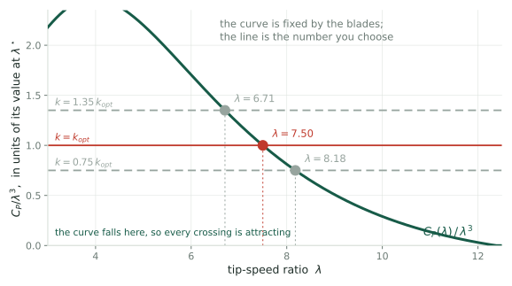
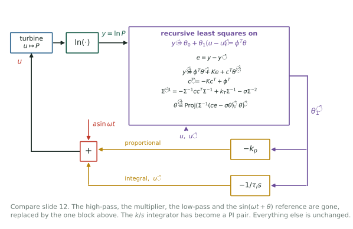

## Two regimes, one optimization problem {.smaller}

{.fig-band fig-alt="Power curve of a 5 MW turbine. Between cut-in at 3 m/s and rated at 11.4 m/s, power rises as the cube of wind speed; above rated it is held flat at 5 MW."}

::: {.cols2}
::: {.card}
[Region 3: above rated]{.cardh}

There is more wind than the machine can use. Throw the excess away and hold
rated power. A setpoint, an error signal and a PI controller.
:::

::: {.card}
[Region 2: below rated]{.cardh}

Take everything the wind offers. There is no setpoint, only an efficiency to
maximize. **This is the only regime containing an extremum to seek.**
:::
:::

::: {.notes}
Everything in this deck is Region 2. The machine spends most of its operating
hours there.
:::

## The hill {.smaller}

{.fig-band fig-alt="Power coefficient versus tip-speed ratio. A single smooth peak of 0.49 at lambda 7.5, steep on the left and gentle on the right. A dashed red curve shows the same rotor after erosion: peak lower and shifted right by 0.2."}

::: claim
With the blades held at their design pitch, the rotor's efficiency depends on one
number: the **tip-speed ratio** $\lambda = R\Omega/V$, blade tip speed divided by
wind speed. Hold $\lambda$ at $\lambda^\star$ and you capture the most power
available.
:::

::: {.notes}
Two features of this curve set up everything that follows. The peak is *flat*:
being wrong by half a unit in lambda costs about one per cent of the power, so
power is a weak signal about where you are. The curve also *moves*. Blades
erode, insects accumulate, and the factory value of lambda-star stops being
right.

Worth being precise about the qualifier, because it matters later. C_P is really
a surface in tip-speed ratio and blade pitch, and it also depends on yaw
misalignment and on the condition of the blades. Region 2 pins the pitch at its
design value and the yaw at zero, which is what collapses the surface to this
curve.

Under real inflow even that is an idealization. Blade sections see different
angles of attack at different azimuths, so what you measure is an average over
that variation rather than a point on a curve. In the large-eddy simulations the
realized C_P falls from 0.49 to 0.44 for exactly that reason, which is a ten per
cent violation of the picture on this slide.
:::

## You cannot measure either axis {.smaller}

{.fig-tall fig-alt="Left box: measurable signals are rotor speed, generator torque and generator power. Right box: the objective needs lambda and C_P, both of which require the wind speed. They are not equal."}

::: claim
Both coordinates of the hill are written in terms of $V$, the wind speed
actually reaching the rotor, which is exactly what a turbine cannot measure.
**So this is the route extremum seeking declines to take.**
:::

::: {.notes}
Concretely: an anemometer on the nacelle sits behind the rotor, in air the
rotor has already slowed, and how much it has slowed depends on the thrust,
which depends on the control parameter. The measurement responds to the thing
you are trying to tune.

Be careful how this slide is used. It is not saying that extremum seeking
estimates the wind badly. Extremum seeking never estimates the wind at all. This
slide rules out the obvious alternative, which is to reconstruct the curve from a
wind estimate and find its peak, and it is worth ruling out because the error
there is systematic rather than random: it rescales the curve, so no amount of
averaging removes it.

Where wind accuracy does still matter, later: reporting the answer as a
tip-speed ratio rather than a torque gain, and the dither-free identification in
Q3. Neither is the main loop.
:::

# Sitting on a hill you cannot see {.divider}

How the controller finds the peak without measuring where it is.

## The $k\Omega^2$ law {.smaller}

The rotor is one rigid body, so what governs it is

$$I\dot\Omega \;=\; \tau_{\text{aero}} - \tau_g,
\qquad
\tau_{\text{aero}} = \tfrac12\rho\pi R^3 V^2\,C_Q(\lambda),
\qquad \tau_g = k\Omega^2$$

Put $\dot\Omega = 0$, substitute $\Omega = \lambda V/R$, and divide through by
$V^2$. Both $V$ and $\Omega$ disappear, leaving a condition on $\lambda$ alone:

$$\boxed{\;\frac{C_P(\lambda)}{\lambda^3} \;=\; \frac{2k}{\rho\pi R^5}\;}$$

::: claim
So $\dot\Omega = 0$ does not leave the speed free to have drifted anywhere. The
left side is a **function** of $\lambda$ whose shape is set by the blade
geometry; the right side is a genuine constant, the one you pick with $k$. The
rotor can only rest where the two meet.
:::

::: {.notes}
This is the point to make slowly, because it is the one that is easy to
misread. Setting Omega-dot to zero looks like it only says the speed stopped
changing, which would leave the speed itself unconstrained. It does not, because
after the substitution neither Omega nor V survives. What is left is an equation
in the ratio alone, and its solutions are isolated rather than a continuum.

Second, why the wind cancels at all. It goes in the step where you divide by V
squared, and that works only because the generator torque is quadratic in speed.
Try k times Omega to the n and you are left with something proportional to V to
the n minus two. Only n equal to two removes it, so the quadratic law is the
unique exponent that makes the resting tip-speed ratio independent of the wind.

Third, on a real machine V never holds still, so Omega-dot is never exactly
zero. The rotor tracks a slowly moving root with a lag, which is what the next
slide is about.
:::

## Picking $k$ picks a resting point {.smaller}

{fig-alt="The function C_P over lambda cubed, normalized, falling steeply across the plotted range. Three horizontal lines at three torque gains cross it once each, at tip-speed ratios of 6.71, 7.50 and 8.18."}

::: claim
Raise $k$ and the line rises, so the crossing slides left to a lower $\lambda$.
Nothing here needed the wind speed, and nothing needed a measurement.
:::

::: {.notes}
This is the picture behind the boxed equation, and it answers the obvious
objection to it. The left-hand side is not a constant, and of course it is not:
lambda moves with rotor speed, so the value of C_P over lambda cubed moves too.
What is fixed is the shape of the curve, which is a property of the blades.

So the equation is not saying a quantity equals a number. It is saying: here is
a curve, here is a horizontal line at a height you chose, and the rotor rests
where they intersect. Reading it that way also makes the next slide obvious,
because whether a crossing attracts depends on which way the curve is going
through it.
:::

## Why the rotor goes to that root {.smaller}

Resting there is not the same as being drawn there. Write the net torque as a
function of the state, $I\dot\Omega = F(\Omega)$ with

$$F(\Omega) \;=\; \tfrac12\rho\pi R^3 V^2\,C_Q\!\left(\frac{R\Omega}{V}\right) - k\Omega^2$$

A small perturbation $\delta = \Omega - \Omega_{eq}$ obeys
$I\dot\delta = F'(\Omega_{eq})\,\delta$, so it decays exactly when
$F'(\Omega_{eq}) < 0$. Substituting the equilibrium relation collapses that to a
statement about the curve alone:

$$F'(\Omega_{eq}) < 0
\qquad\Longleftrightarrow\qquad
\frac{d}{d\lambda}\!\left(\frac{C_P}{\lambda^3}\right) < 0
\qquad\Longleftrightarrow\qquad
\frac{d \ln C_P}{d \ln \lambda} < 3$$

::: claim
At the peak $C_P' = 0$, so the middle expression is $-3C_P^{\max}/\lambda^4$,
negative for **any** turbine. The design point is always attracting, whatever
the blades look like.
:::

::: {.notes}
The log-slope form is the one worth remembering: the rotor is drawn to a resting
point wherever C_P grows more slowly than lambda cubed, and pushed away from it
wherever C_P grows faster.

A caveat I should flag rather than gloss. Real power-coefficient curves have a
cut-in tip-speed ratio with a steep rise just above it, and in that region the
log slope can exceed three, which would give a second root that repels. That is
the usual textbook reason a turbine needs help getting started rather than being
left to spin up from rest. But the analytic surface these figures are drawn from
does not reproduce it: its C_P stays positive down to very small lambda, so the
condition never flips and there is exactly one root. So treat the second
equilibrium as physically expected and not demonstrated here.
:::

## There is no rotor speed to regulate to {.smaller}

{.fig-band fig-alt="Rotor speed versus wind speed. Three straight lines through the origin, one per torque gain. The middle line is the optimal one; points on it at 4, 8 and 12 m/s show three different rotor speeds."}

The crossing gives $\lambda_{\text{eq}}(k)$, with no $V$ in it. Convert back through
$\lambda = R\Omega/V$:

$$\Omega_{eq}(V) \;=\; \frac{\lambda_{\text{eq}}(k)}{R}\,V$$

::: claim
So **the crossing is this ray**, in rotor-speed coordinates: one point there,
one line here, every point on it the same $\lambda$. The controller never rejects
the wind. It makes that line an attracting manifold and lets the wind slide the
machine along it.
:::

::: {.notes}
This inverts the usual picture. In ordinary regulation you form an error and
drive it to zero. Here there is no error signal: the closed loop was *designed*
so that its natural resting place is the set you want. The wind is a parameter
that moves you along that set rather than a disturbance pushing you off it.

Region 3 is the opposite and matches the textbook picture, with a real speed
setpoint tracked by blade pitch.

Two things worth adding if anyone asks. The stability argument carries over for
free: at fixed V, Omega is just lambda rescaled by V over R, so the condition on
the slope of the curve is the same condition either way.

And the ray is not quite as fixed as the picture suggests. Air density survives
in the equilibrium relation, so the slope drifts slowly with temperature and
altitude. That is why the expression for the optimal torque gain carries a rho.
It is small and seasonal, and extremum seeking re-tunes straight through it.
:::

## So the problem reduces to one number {.smaller}

::: {.cols2}
::: {.card}
[What we have]{.cardh}

A single scalar knob $k$, and a monotone map from $k$ to the tip-speed ratio the
machine settles at.
:::

::: {.card}
[What we want]{.cardh}

The $k$ that lands us on the peak. The factory value is wrong at commissioning
and gets worse as the blades age.
:::
:::

::: claim
Find the maximum of a function you cannot evaluate, by turning a knob and
watching a noisy meter. That is **extremum seeking control**, and it is what
the last decade of work at UTD has been about.
:::

# Extremum seeking {.divider}

Estimate a derivative you cannot measure by wiggling the input.

## The loop {.smaller}

{.fig-tall fig-alt="Block diagram: the control parameter enters the turbine, power comes out, is passed through a logarithm, high-pass filtered, multiplied by a phase-shifted copy of the dither, low-pass filtered, and integrated back onto the parameter."}

::: claim
Add a slow sinusoid $a\sin\omega t$ to the knob. If the output wiggles **in
phase**, you are on the uphill side; **out of phase**, the downhill side. Multiply
and average, and what survives is proportional to the slope.
:::

::: {.notes}
The multiply-and-average step is a lock-in amplifier, the same device used to
pull tiny optical signals out of noise. Its whole purpose is to answer one
question: how much of the tone I injected came back out, and with what sign?
:::

## The one identity that made it practical {.smaller}

Power is proportional to the cube of the wind speed, so the gradient of power is
too, and the wind varies by 3:1 across Region 2. A loop tuned at 8 m/s is
27 times too slow at 4 m/s and 27 times too aggressive at 12 m/s.

Rotea's 2017 observation is one line. Since
$\ln P = \ln(\tfrac12\rho A) + 3\ln V + \ln C_P(u)$, and the wind term does not
depend on $u$:

$$\frac{\partial \ln P}{\partial u} \;=\; \frac{1}{C_P}\frac{\partial C_P}{\partial u}$$

::: claim
Feed the algorithm $\ln P$ instead of $P$ and the loop bandwidth becomes
$\nu_c = (\kappa/C_P^{\max})\,|\partial^2 C_P/\partial u^2|$, free of both the
wind speed and the air density. **Tune it once; it works everywhere.**
:::

## What the logarithm fixes {.smaller}

{fig-alt="Two panels. Left, power feedback: loop bandwidth rises as the cube of wind speed, spanning 27 to 1. Right, log-power feedback: a flat line."}

::: {.notes}
Note also a small free bonus. The 1/C_P factor is a state-dependent gain: far
from the peak, C_P is small, so the step is large. The algorithm accelerates
itself during the transient and settles down near the optimum, with nothing to
tune.
:::

## It holds up in high-fidelity simulation {.smaller}

{.fig-band fig-alt="Bar chart of settling time at 4, 8 and 12 m/s under shear and 10 percent turbulence. Plain ESC takes 31 minutes at 4 m/s, 8 minutes at 8 m/s, and is unstable at 12. Log-power ESC takes about 8 minutes at all three."}

::: {.cols2}
::: {.card}
[Ciri, Leonardi & Rotea 2019]{.cardh}

Large-eddy simulation of the full flow around an NREL 5 MW rotor, with shear and
10% turbulence. No analytic gradient anywhere.
:::

::: {.card}
[The result]{.cardh}

Log-power holds 8 minutes across a 3:1 wind range. Plain ESC is four times
slower at the bottom and **goes unstable** at the top.
:::
:::

## Making it fast: LP-PIESC {.smaller}

{.fig-tall fig-alt="Comparison: LP-ESC demodulates a dither; LP-PIESC fits a two-parameter model by recursive least squares. Three result cards: smaller dither, energy loss cut from 14.2 to 0.3 per cent, and 8.9 per cent farm power gain in a wind tunnel."}

::: claim
Replace demodulation with **recursive least squares** on
$\dot y = \theta_0 + \theta_1(u-\hat u)$ and add a proportional term. The
gradient $\theta_1$ now comes with a covariance matrix $\Sigma$ that the
algorithm already propagates, and that none of these papers reports.
:::

::: {.notes}
On the energy number: LP-ESC, measured against a controller that already knows
the optimal gain, loses 14.2% of the energy. That is the cost of searching.
LP-PIESC brings it to 0.3%, which is what makes the approach deployable.

The wind tunnel result is a twelve-turbine array steering wakes by yaw, and the
algorithms converge in seconds at model scale.
:::

## LP-PIESC in full {.smaller}

{.fig-tall fig-alt="Block diagram. The control law combines a proportional term, an integrated term and the dither. The turbine output passes through a log to give y, which feeds a recursive least squares estimator with its prediction error, filtered regressor and covariance recursions. The estimator returns theta-1-hat, which drives both the proportional path and the integrator."}

::: claim
The whole demodulation chain is gone: no multiplier, no high-pass, no low-pass,
no phase angle. The gradient is $\hat\theta_1$, read directly out of a
least-squares fit to $\dot y = \theta_0 + \theta_1(u - \hat u)$.
:::

::: {.notes}
Walk the loop once. The control law at top left is Equation 5 of Kumar & Rotea [\[KR22\]](#references)
paper: a proportional term in the gradient estimate, an integrated term, and the
dither. The turbine responds, power is normalized by rated and logged, and that
signal y is the only measurement the estimator sees.

Inside the estimator, the prediction error e drives the parameter update, c is a
filtered version of the regressor, and Sigma is a covariance that is propagated
in inverse form. The projection operator keeps the estimates inside a set you
specify in advance.

Then theta-1-hat comes back out and does two jobs: it feeds the proportional
path directly, and it feeds the integrator that produces u-hat.
:::

## What the estimator is fitting {.smaller}

The local model is affine in the distance from the current estimate:

$$\dot y \;=\; \theta_0 + \theta_1\,(u - \hat u) \;=\; \phi^{T}\theta,
\qquad
\phi = \begin{bmatrix} 1 \\ u - \hat u\end{bmatrix},
\qquad
\theta = \begin{bmatrix}\theta_0 \\ \theta_1\end{bmatrix}$$

so $\phi$ and $\theta$ are **two-vectors**, and $\theta_1$ is the gradient we are
after. Everything else in the box has a shape forced by these:

::: {.cols3}
::: {.card}
[vectors in $\mathbb{R}^2$]{.cardh}
$\phi$, $\theta$, $\hat\theta$, and $c$
:::
::: {.card}
[scalars]{.cardh}
$y$, $\hat y$, $e$, and the constants $K$, $k_T$, $\sigma$
:::
::: {.card}
[$2\times2$ matrices]{.cardh}
$\Sigma$ and $\Sigma^{-1}$
:::
:::

::: {.warn}
The obstacle: the model is written in $\dot y$, and $\dot y$ is not measured.
Differentiating a turbulent power signal to get it would be hopeless.
:::

## Why there is a filtered regressor {.smaller}

Predict $y$ with $\dot{\hat y} = \phi^{T}\hat\theta + Ke + c^{T}\dot{\hat\theta}$
and let $\tilde\theta = \theta - \hat\theta$. Subtracting from $\dot y = \phi^T\theta$,

$$\dot e \;=\; \phi^{T}\tilde\theta - Ke - c^{T}\dot{\hat\theta}$$

Now define $\eta = e - c^{T}\tilde\theta$ and differentiate, using
$\dot{\tilde\theta} = -\dot{\hat\theta}$ and $\dot c^{T} = -Kc^{T} + \phi^{T}$:

$$\dot\eta = \underbrace{\phi^{T}\tilde\theta - Ke - c^{T}\dot{\hat\theta}}_{\dot e}
\;-\;\underbrace{(-Kc^{T} + \phi^{T})\tilde\theta}_{\dot c^{T}\tilde\theta}
\;+\;\underbrace{c^{T}\dot{\hat\theta}}_{-c^{T}\dot{\tilde\theta}}
\;=\; -K\big(e - c^{T}\tilde\theta\big) \;=\; -K\eta$$

::: claim
Everything cancels but $-K\eta$. So $\eta \to 0$ exponentially, which means
$e \to c^{T}\tilde\theta$: the **measurable** error becomes the regressor $c$
dotted with the parameter error. The odd $c^{T}\dot{\hat\theta}$ term in the
predictor is there for exactly this, since it is what cancels
$c^{T}\dot{\tilde\theta}$.
:::

::: {.notes}
This is the whole trick, and it is worth saying plainly. You cannot regress on
y-dot because you cannot measure it. So you build a predictor whose error obeys
a regression you can run, and the filtered regressor c is what appears in it.

The obvious question is where the filter came from, and the answer is that it
was reverse-engineered. Run the derivation backwards: differentiate eta,
substitute, and you are left with eta-dot equal to phi transpose minus c-dot
transpose, all times theta-tilde, minus K e. Demand that this equal minus K eta
and the requirement collapses to c-dot transpose equals minus K c transpose plus
phi transpose. The filter is forced. There is no freedom in it once the goal is
chosen, and the same is true of the c-transpose theta-hat-dot term in the
predictor, which exists only to cancel its counterpart.

This is the augmented error idea from adaptive control, going back to Monopoli
in the mid-1970s for model-reference adaptive systems. Worth naming, because it
makes the box look like standard machinery rather than something invented for
this paper.

It also explains the value of K. It is the rate at which the regression becomes
exact, and Kumar and Rotea set it to 20 radians per second, a fifty millisecond
time constant against a dither period of 314 seconds. So eta is zero on every
timescale that matters and the regression holds exactly. That is not a tuning
compromise, it is fast enough to be instantaneous.
:::

## Which makes it a ridge regression {.smaller}

Rearranging $e = c^{T}\theta - c^{T}\hat\theta$ and defining $z := e + c^{T}\hat\theta$,
we get $z = c^{T}\theta$: known regressor, computable observation, unknown
parameter. Fit it with forgetting **and** a penalty on the size of $\hat\theta$:

$$J(t,\hat\theta) = \int_0^t e^{-k_T(t-s)}\Big[\,\big|z - c^{T}\hat\theta\big|^2
\;+\; \sigma\big|\hat\theta\big|^2\,\Big]ds$$

Setting $\partial J/\partial\hat\theta = 0$ gives the normal equations
$\Sigma\hat\theta = b$, where, with $w = e^{-k_T(t-s)}$,

$$\Sigma = \underbrace{\int_0^t w\,cc^{T}ds}_{A} \;+\; \sigma\underbrace{\int_0^t w\,ds}_{m}I,
\qquad
b = \int_0^t w\,c\,z\;ds$$

::: claim
$\Sigma$ is the information matrix of a **ridge**-regularized least squares, and
it is the $\Sigma$ of the block diagram. The next slide shows that both places
$\sigma$ appears in the algorithm come from the one penalty written here.
:::

## One cost, two equations {.smaller}

**The $\Sigma$ recursion.** Since $\dot A = cc^{T} - k_TA$ and $\dot m = 1 - k_Tm$,

$$\dot\Sigma = \big(cc^{T} - k_TA\big) + \sigma\big(1 - k_Tm\big)I
= cc^{T} - k_T\underbrace{\big(A + \sigma mI\big)}_{\Sigma} + \sigma I$$

**The parameter update.** Differentiate $\hat\theta = \Sigma^{-1}b$, substitute
$\dot\Sigma$ and $\dot b = cz - k_Tb$, and the $k_T$ terms cancel:

$$\dot{\hat\theta}
= -\Sigma^{-1}\dot\Sigma\,\hat\theta + \Sigma^{-1}\dot b
= \Sigma^{-1}c\big(z - c^{T}\hat\theta\big) - \sigma\Sigma^{-1}\hat\theta
= \Sigma^{-1}\big(ce - \sigma\hat\theta\big)$$

::: claim
**That is why $c$ multiplies $e$**, and why the same $\sigma$ appears twice.
It is not a robustness patch bolted on in two places: it is one ridge penalty,
showing up once through $\Sigma$ and once through the shrinkage of $\hat\theta$.
:::

::: {.notes}
What sigma is actually doing is shrinkage, not slowing. In Sigma it puts a floor
of sigma m under the information matrix, so the gain cannot diverge. In the
update it pulls theta-hat toward zero at rate sigma times Sigma inverse. Those
are the same statement from either side of the inverse.

The floor matters more than it looks. c is a two-vector, so c c-transpose is
rank one at every instant and the instantaneous problem is always
underdetermined. Only accumulation over time, or sigma, makes it invertible, and
when excitation fades the accumulation stops and sigma is all that is left.

Kumar and Rotea use sigma equal to ten to the minus six, and m tends to one over
k-T, which is 0.05, so the floor is about five times ten to the minus eight.
Small enough that the ridge bias is negligible and it is doing pure conditioning
work.

The projection is the one genuinely separate piece. It confines theta-hat to a
compact set for the boundedness argument, and it needs a priori bounds that the
cost does not supply.

Intuition for the update itself: e is a scalar, so it says how wrong the
prediction is but not which parameter is at fault. c is the sensitivity of the
error to each parameter, so the product spreads one scalar across the parameter
vector, and Sigma inverse weights it by what is already known in each direction.
:::

## So why is demodulation still the default? {.smaller}

::: {.cols2}
::: {.card}
[What LP-PIESC assumes]{.cardh}

That $\dot y$ is affine in $(u - \hat u)$, that the regressor stays persistently
exciting, and that you can bound the parameters in advance for the projection.
:::

::: {.card}
[What demodulation assumes]{.cardh}

That the plant is roughly static at one frequency and the peak is locally
unimodal. No model structure at all.
:::
:::

::: {.warn}
And the count goes the wrong way. LP-ESC has six parameters: $a$, $\omega$,
$\theta$, two cutoffs, $k$. LP-PIESC has seven: $a$, $\omega$, $k_T$, $K$,
$\sigma$, $k_p$, $\tau_I$, and Rotea's 2024 multi-row paper says all but two
were set by
trial and error.
:::

::: claim
Which is exactly the complaint we were given. The fast algorithm is the one that
"takes too long to tune its parameters."
:::

::: {.notes}
Four more things on the other side of the ledger, worth having ready.

Persistent excitation is a real requirement, not a formality. The 2024
multi-row paper
computes it and reports rho equal to about 0.011 for one turbine. If excitation
dies, as it tends to near convergence with a small dither, the covariance
recursion misbehaves, which is what the forgetting factor and the sigma
regularization are there to prevent.

The projection operator needs a priori bounds on the parameters. That is model
knowledge the demodulation route never asks for.

Frequency selectivity. A lock-in listens in one narrow bin, which you place
where turbulence is weak. Least squares on y-dot is broadband, so it is exposed
to the whole spectrum including the energy-containing range.

And for the curvature question, demodulation hands you the second harmonic for
free, whereas a regressor that is linear in the parameter gives the gradient and
nothing else.

Set against all of that: in this application LP-PIESC simply wins. Energy loss
of 0.3 per cent against 14.2, with a dither a quarter the size. That is why the
UTD group moved to it, and why the question is not whether to use it but how to
tune it without trial and error.
:::

## Where things stand {.smaller}

::: {.cols3}
::: {.card}
[Solved]{.cardh}

Consistency across wind speed. The logarithm removes the $V^3$ dependence
exactly, in theory, in LES, and in the tunnel.
:::

::: {.card}
[Solved]{.cardh}

Speed. LP-PIESC converges fast enough that the search costs 0.3% of energy
rather than 14%.
:::

::: {.card}
[Not solved]{.cardh}

Everything to do with **noise**. "The enemy is process noise", and none of
these papers reports a variance.
:::
:::

::: claim
Extremum seeking works well when the process noise is negligible. Otherwise
you must average, and averaging costs convergence time. That trade-off has not
been quantified for this problem.
:::

# Five questions, audited {.divider}

Two of them closed under inspection. Q1 turned out not to be a control problem
and Q2 was fixed in 2017. What is left is Q3, Q4 and Q5.

## Q1 · Where does the torque gain converge? {.smaller}

{.fig-band fig-alt="The C_P curve near its peak. A green marker at lambda 7.5 labeled the design optimum; a red marker at 7.85 where the 2019 LES actually settled. The 0.35 gap between them is drawn against the 0.2 shift that blade erosion produces."}

| offset from $\lambda^\star = 7.5$ | |
|---|---|
| [\[CLR19\]](#references) Table 4, shear $+10\%$ TI | $+0.22$ to $+0.35$ |
| [\[CLR19\]](#references) Table 3, **uniform** inflow | $+0.10$ to $+0.25$ |
| finite-difference bias, computed | $-0.013$ |
| turbulent peak shift, computed | $+0.005$ to $+0.037$ |

::: claim
Most of the gap is already there in inflow with **no turbulence**, where neither
computed candidate can act, and the scatter is bounded at
$\sigma_\lambda \lesssim 0.14$. What is left is the reference: design
$\lambda^\star$ is a blade-element number, the LES rotor is actuator-line.
**Closed as a control question, open as a modeling one.**
[Worked through in the Q1 deck.](q1-estimand.html)
:::

::: {.notes}
Two things to say out loud. First, extremum seeking never adjusts, estimates or
holds lambda. It adapts k, and lambda is the state that follows. The anomaly is
in k: 7.7 per cent low, which is 0.19 in lambda.

Second, why this matters beyond bookkeeping. Blade erosion moves lambda-star by
about 0.2. If the reference itself is uncertain at 0.1 to 0.25, the detection
problem this work is aimed at is harder than the published framing suggests.

The deck also carries two results worth more than the anomaly: a constant-gain
loop never averages down, so N is a tuning rather than a run length; and
predicting the gradient-estimate scatter from the turbulence overshoots the
published spread by 24 to 40 times, which is unresolved.
:::

## Q2 · What sets the stability limit? {.smaller}

{.fig-band fig-alt="Left: the 2017 model has a single pole on the negative real axis that just moves further left as wind speed rises, so it can never go unstable. Right: loop gain versus wind speed crossing a sampled-data stability boundary, with the LES instability at 12 m/s marked."}

::: {.warn}
[\[R17\]](#references) Eq. 8 reduces the loop to $\dot{\tilde u} = -\omega_c\tilde u$ with
$\omega_c \propto \rho V^3$. One pole, negative real, for **any** gain: it
cannot go unstable. [\[CLR19\]](#references) report plain ESC unstable at 12 m/s, in uniform
inflow and again in turbulence.
:::

::: claim
[\[R17\]](#references) p. 4506 names the effect and cannot model it: *"an increase in crossover
frequency implies a decrease of the stability margins."* **A first-order lag has
no margin to lose.** The missing element is that the loop is *sampled*: one
update per 150 s dither period, so $\tilde u_{n+1} = (1-K)\tilde u_n$ with
$K = \kappa_{\text{eff}}|J''|$, giving $0 < K < 2$ where the continuous model
gives no bound at all. Since $K \propto V^3$, high wind walks across it.
:::

::: {.openq}
**Closed, and closed by the existing fix.** The logarithm removes the $V^3$
exactly, so LP-ESC holds one $K$ at every wind speed. Nor is $K<2$ a speed
ceiling: $K=1$ is deadbeat in one update. What survives is that
$K = \kappa_{\text{eff}}|J''|$ still needs a curvature nobody measures, which is
Q4.
:::

::: {.notes}
Why the rotor is not the answer: linearizing the rotor ODE gives a time constant
of 11 seconds at 4 meters per second, 5.6 at 8 and 3.7 at 12, against a
150-second dither period. It is fully settled between updates.

The number worth quoting is that nothing has to be fitted. Their own settling
time places K at 8 meters per second between 0.44 and 1.57. Cube that band for
12 and 86 per cent of it exceeds 2. The boundary lands between 8.7 and 13.3, and
any further phase in the loop, rotor lag or the blanked 27 per cent of each
period, moves it down.

The sharp test costs nothing: above K of one the pole is negative, so the torque
gain should flip sign on consecutive updates, a five-minute square oscillation
in the existing 12 meter per second series.

But say the verdict plainly. This diagnoses a published anomaly and the remedy
already exists, so it is not a research direction. The residual is the curvature
in K, and that hands over to Q4.

And this is what the logarithm really bought. Its effect on the loop gain is to
remove the V-cubed, so LP-ESC holds one K at every wind speed and never
approaches the boundary. That is a stability story, not a convergence-rate story,
and it is not how the benefit is usually described.
:::

## Q3 · Does the turbine need to probe at all? {.smaller}

Two things are true and encouraging. $\tau_{\text{aero}}$ is **observable from
the encoder alone**, no wind sensor and no $C_P$: augment it as a state on
$I_{\text{eff}}\dot\Omega = \tau_{\text{aero}} - \tau_g$ and $[C;CA]$ has rank 2.
And turbulence already moves $\lambda$ about as far as the probe does,
$\sigma_\lambda = 0.41$ against $0.34$, verified in simulation.

::: {.warn}
Neither helps. Given a candidate curve, each instant supplies **one equation and
one unknown** $V(t)$, so the curve is unconstrained pointwise. The degeneracy is
not a direction, it is the whole function space.
:::

| posited curve | solvable | implied mean $V$ | implied TI | corr. with true $V$ |
|---|---|---|---|---|
| true | $100\%$ | $8.00$ | $9.3\%$ | $1.0000$ |
| **peak flattened $30\%$** | $100\%$ | $7.99$ | $9.3\%$ | $0.9999$ |

::: claim
A curve that is simply **wrong** reproduces the record exactly, with an implied
wind indistinguishable from the real one. **This is why extremum seeking
exists.** A known excitation is not a convenience; it is the only thing that
breaks the degeneracy. The answer to Q3 is yes, and structurally so.
:::

::: {.notes}
Worth stating as a positive result rather than a failure. The published record
does not say why probing is necessary, it just probes. This says why: an unknown
wind absorbs any curve you propose, at any noise level, so no identification
scheme on operating data alone can work. That is a cleaner justification for the
whole method than anything currently written down.

The near-miss is instructive too. The one invariance I first found, scaling the
wind by c and reshaping the curve to match, leaves the optimal torque gain
exactly fixed, so had the degeneracy really been one-dimensional the scheme
would have worked without any absolute wind reference. It is not
one-dimensional.
:::

## Q4 · What the curvature is doing {.smaller}

Look again at the result of Rotea (2017):

$$\nu_c \;=\; \frac{\kappa}{C_P^{\max}}\left|\frac{\partial^2 C_P}{\partial u^2}(u_o)\right|$$

::: {.warn}
Choosing the gain $\kappa$ to hit a target settling time **requires the
curvature at the peak**, currently taken from a design curve that the LES says
is wrong by 10% in $C_P$. The gain calibration is not self-consistent, and
"it takes too long to tune" is partly a symptom of that.
:::

The curvature also sets the terminal scatter, $\sigma_\lambda \approx \sigma_{\hat g}/|H|$,
and the energy lost to mistuning is quadratic in $\sigma_\lambda$. The same
number sets the gain, the achievable accuracy and the cost of missing.

## Q4 · Two routes to the same covariance {.smaller}

{.fig-tall fig-alt="Top: the asymptotic covariance in stochastic approximation is A-inverse Sigma A-inverse-transpose, and A is the Hessian. Below, two boxes: Zap stochastic approximation estimates the Jacobian and inverts it; Polyak-Ruppert averaging simply averages the iterates. Both reach the same optimal covariance."}

::: claim
**Meyn does not estimate the Hessian in the ESC papers.** It appears in the
*analysis*, as $A = \nabla^2\Gamma(\theta^\star)$ in the asymptotic covariance.
Where he does estimate it, in Zap SA, it is a two-timescale Jacobian estimate
used as a matrix gain.
:::

::: {.notes}
Polyak-Ruppert averaging attains the *same* optimal asymptotic covariance
without estimating any curvature. You average the iterates. Meyn's own
recommendation is that this is the first thing to try.

So if the goal is optimal terminal variance, the Hessian is not needed. A matrix
gain buys transient behavior and stability under weak assumptions, which are
worth having but are not what the variance question asks for.

Which raises a question to settle early: how much of what looks open in wind is
already answered in stochastic approximation and simply has not been imported?
:::

## Q5 · How good could any algorithm be? {.smaller}

{fig-alt="Log-log schematic of terminal scatter against observation time. Two solid curves for the published algorithms and a dashed gold curve far below them labeled best possible, with the gap between them marked by a question."}

::: {.openq}
Given a turbulence spectrum, an observation time and a fatigue budget, how well
can **anyone** locate $\lambda^\star$? Nobody has written the bound down.
:::

::: {.notes}
Without it there is no way to know whether LP-PIESC is within twenty per cent of
optimal, in which case this is engineering rather than research, or a factor of
twenty off, in which case there is a great deal of work here.

The structure suits a Cramer-Rao argument: the measurement equation is known,
the noise spectrum is measurable, and the nuisance parameter is the wind. I
would want this before committing to anything else, since it is the only item
that says whether the other four are worth doing.
:::

## Why turbulence is not ordinary noise {.smaller}

::: {.cols2}
::: {.card}
[In classical stochastic approximation]{.cardh}

Noise is pure nuisance. It corrupts the measurement and you average it away.
:::

::: {.card}
[Here]{.cardh}

Turbulence is **simultaneously the noise and the excitation**. It is what
corrupts the gradient estimate *and* what sweeps the rotor across the curve for
free.
:::
:::

Both sides are now measured, and they are the same size:

| | $\sigma_\lambda$ contributed |
|---|---|
| turbulence, through the rotor high-pass at $0.029$ Hz | $0.41$ |
| the probe, at the published $a = 13.6\%$ of $k_{\text{opt}}$ | $0.34$ |

::: claim
The excitation the wind supplies for free is **comparable to the one the
controller pays for**. That is what made Q3 worth asking. It still fails, but
on identifiability rather than on signal strength: an unknown wind absorbs any
curve you propose, so excitation of unknown magnitude cannot substitute for
excitation you chose.
:::

## The experiment I would run first {.smaller}

::: {.openq}
**Open the loop.** Hold the torque gain at a series of fixed values, run each
long enough to average the turbulence, and measure the **simulator's own**
$C_P(\lambda)$. Then ask where its peak is.
:::

::: {.cols2}
::: {.card}
[Why this one]{.cardh}

Every published offset is scored against a blade-element $\lambda^\star = 7.5$.
Q1 showed the offset survives in inflow with no turbulence, so the reference is
the only candidate left. This measures it directly.
:::

::: {.card}
[What it costs]{.cardh}

No new machinery, no closed loop, a few days of compute. And the same runs give
$\sigma_\lambda$ at each gain, which is the $K_v$ nobody can currently predict.
:::
:::

::: {.small}
Note the earlier obvious experiment, sweeping the dither amplitude to look for
an $a^2$ scaling in the offset, is **not** worth running: the predicted effect
is $0.013$ against a seed spread larger than that.
:::

::: {.notes}
One methodological prerequisite. The LES of Ciri et al. recycles a twenty-minute
precursor wind field, so a sixty-minute run contains three copies of the same
turbulence. No variance estimate survives that, so non-repeating inflow has to
come first whatever else is run.
:::

::: {.notes}
:::

## Where this leaves things {.smaller}

::: {.closing}
::: {.lead}
The algorithms work. What is missing is the statistics of the quantity they
compute.
:::

::: {.cols2}
::: {.card}
[What exists]{.cardh}

A model-free loop, consistent across wind speed, with results from LES, a wind
tunnel and a field test.
:::

::: {.card}
[What does not]{.cardh}

A variance for the gradient estimate, a reference the simulations can honestly
be scored against, and a performance bound.
:::
:::

| | verdict |
|---|---|
| **Q1** estimand | closed; the offset is in the reference, not the algorithm. A measurement, not a program |
| **Q2** stability limit | closed; sampling explains it and the $\ln$ of 2017 already fixes it |
| **Q3** is the dither needed | closed; an unknown wind absorbs any curve, so a known probe is the only thing that identifies one |
| **Q4** matrix gain | **open, and simulated.** The curvature does leave the loop gain |
| **Q5** performance bound | untouched |

:::

## References {.smaller}

::: {.refs}
**[R17]**&nbsp; M. A. Rotea, *Logarithmic power feedback for extremum seeking
control of wind turbines*, IFAC-PapersOnLine **50**(1) (2017) 4504--4509.
[doi:10.1016/j.ifacol.2017.08.381](https://doi.org/10.1016/j.ifacol.2017.08.381)

**[CLR19]**&nbsp; U. Ciri, S. Leonardi & M. A. Rotea, *Evaluation of
log-of-power extremum seeking control for wind turbines using large eddy
simulations*, Wind Energy **22** (2019) 992--1002.
[doi:10.1002/we.2336](https://doi.org/10.1002/we.2336)

**[KR22]**&nbsp; D. Kumar & M. A. Rotea, *Wind turbine power maximization using
log-power proportional-integral extremum seeking*, Energies **15** (2022) 1004.
[doi:10.3390/en15031004](https://doi.org/10.3390/en15031004)

**[KR24]**&nbsp; D. Kumar & M. A. Rotea, *Optimal tip-speed ratio for degraded
blades*, Wind Energy Science **9** (2024) 2133--2146.
[doi:10.5194/wes-9-2133-2024](https://doi.org/10.5194/wes-9-2133-2024)

**[RKAJ24]**&nbsp; M. A. Rotea, D. Kumar, E. J. Aju & Y. Jin, *Multi-row
extremum seeking for wind farm power maximization*, J. Phys. Conf. Ser.
**2767** (2024) 032043.
[doi:10.1088/1742-6596/2767/3/032043](https://doi.org/10.1088/1742-6596/2767/3/032043)

**[MGR24]**&nbsp; S. P. Mulders, N. Gallo & M. A. Rotea, *Analysis of extremum
seeking control for wind turbine torque controller optimization by aerodynamic
and generator power objectives*, ACC (2024).
[arXiv:2407.08059](https://arxiv.org/abs/2407.08059)

**[GKN12]**&nbsp; A. Ghaffari, M. Krsti&#263; & D. Ne&#353;i&#263;, *Multivariable
Newton-based extremum seeking*, Automatica **48** (2012) 1759--1767.
[doi:10.1016/j.automatica.2012.05.059](https://doi.org/10.1016/j.automatica.2012.05.059)

**[S00]**&nbsp; J. C. Spall, *Adaptive stochastic approximation by the
simultaneous perturbation method*, IEEE Trans. Automat. Contr. **45** (2000)
1839--1853. [PDF](https://www.jhuapl.edu/spsa/PDF-SPSA/Spall_TAC00.pdf)

**[LM23]**&nbsp; C. Lauand & S. Meyn, *Quasi-stochastic approximation: design
principles with applications to extremum seeking control*, IEEE Control Systems
Magazine **43** (2023).
[doi:10.1109/MCS.2023.3291884](https://doi.org/10.1109/MCS.2023.3291884)

**[A22]**&nbsp; N. J. Abbas et al., *A reference open-source controller for
fixed and floating offshore wind turbines*, Wind Energy Science **7** (2022)
53--73. [doi:10.5194/wes-7-53-2022](https://doi.org/10.5194/wes-7-53-2022)

**[J09]**&nbsp; J. Jonkman, S. Butterfield, W. Musial & G. Scott, *Definition of
a 5-MW reference wind turbine*, NREL/TP-500-38060 (2009).
[PDF](https://www.nrel.gov/docs/fy09osti/38060.pdf)
&nbsp;&middot;&nbsp; **[IEC]**&nbsp; IEC 61400-1 ed. 3, normal turbulence model.
:::
