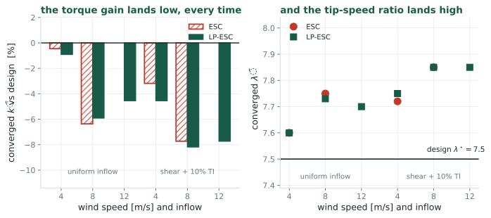
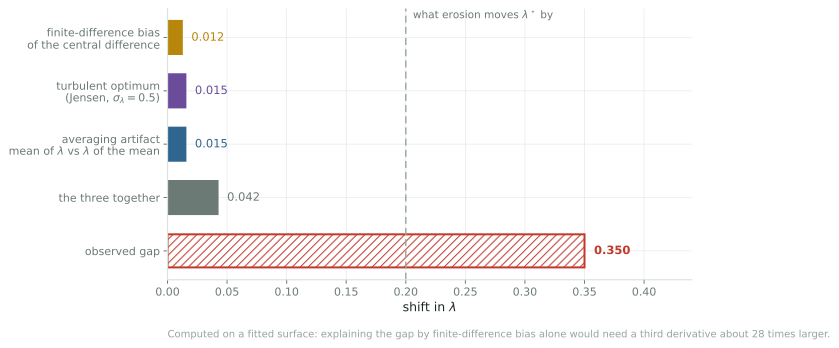

## What is actually being adapted {.smaller}

The controller has **one knob**: the torque gain $k$ in $\tau_g = k\Omega^2$.
Everything else follows from it. Setting $\dot\Omega = 0$ gave

$$\frac{C_P(\lambda)}{\lambda^3} = \frac{2k}{\rho\pi R^5}$$

so choosing $k$ chooses the tip-speed ratio $\lambda_{\text{eq}}(k)$ the rotor settles
at. Extremum seeking estimates $\partial \ln P/\partial k$ and integrates until
that estimate is zero.

::: claim
So the quantity that **converges** is $k$. The tip-speed ratio is not adjusted,
estimated, or held. It is what you read off afterward, through the monotone map
$k \mapsto \lambda_{\text{eq}}$.
:::

::: {.notes}
Worth being firm about this, because CLR19 reports lambda-bar and it is easy
to read that as the thing being controlled. It is not. Lambda is a state. The
algorithm never forms it, because forming it would need the wind speed, which is
the whole reason extremum seeking is being used.
:::

## What it is scored against {.smaller}

The reference value comes from the design power-coefficient curve:

$$k_{\text{opt}} = \tfrac12\rho\pi R^5\,\frac{C_P^{\max}}{\lambda_\star^3}
\;=\; 2.2, \qquad\text{from}\quad C_P^{\max} = 0.49,\ \ \lambda_\star = 7.5$$

::: {.cols2}
::: {.card}
[Where that curve comes from]{.cardh}

**Blade-element momentum**: chop each blade into spanwise strips, look up the
lift and drag of the airfoil at each strip's angle of attack, and integrate.
That gives $C_P(\lambda,\beta)$ for the NREL 5 MW reference rotor.
:::

::: {.card}
[What that makes it]{.cardh}

A prediction from blade geometry and airfoil tables, in steady uniform flow.
Not a measurement of the rotor in the simulation.
:::
:::

::: {.warn}
So $k_{\text{opt}} = 2.2$ inherits whatever that curve gets wrong. If its peak sits at
the wrong $\lambda$, the reference is wrong and every convergence claim is scored
against the wrong number.
:::

## The anomaly {.smaller}

{fig-alt="Left, converged torque gain against design for six LES conditions, every bar negative, from half a percent to eight percent low. Right, converged tip-speed ratio for the same six, every point above the design value of 7.5, reaching 7.85."}

::: {.warn}
Every converged torque gain in the large-eddy simulations of [\[CLR19\]](#references) sits **below** the
design value, and every tip-speed ratio sits **above** it. Two algorithms, three
wind speeds, two inflow conditions, and the sign never changes.
:::

::: {.notes}
This is not a criticism of CLR19. The offsets are small enough to read as
agreement, and nothing in it depends on them. They become interesting
only once you want to resolve 0.2 in lambda.

Six runs, two independent algorithms, sign never flips. That is bias, not
scatter.
:::

## Why the wind does not cancel {.smaller}

One dither period produces one number, a correlation:

$$\hat g \;=\; \frac{1}{aT}\int_0^T \ln P(t)\,g(t)\,dt,
\qquad
\ln P = \underbrace{\ln(\tfrac12\rho A)}_{\text{constant}}
+ \underbrace{3\ln V(t)}_{\text{the wind}}
+ \underbrace{\ln C_P(\lambda)}_{\text{the turbine}}$$

::: {.cols2}
::: {.card}
[the constant does cancel]{.cardh}

$\int_0^T g\,dt = 0$ by symmetry, so a constant contributes exactly nothing.
:::

::: {.card}
[the wind does not]{.cardh}

$3\ln V(t)$ is not a constant. What survives is
$\tfrac{3}{aT}\int_0^T \ln V\,g\;dt$, which is zero **in expectation** and
nonzero in **any one window**.
:::
:::

::: claim
Flip a fair coin ten times: heads minus tails has expectation zero, and you
still get $+2$ or $-4$. Over 150 s the turbulence leans one way or the other
against the square wave by chance. The wind does not **bias** the gradient. It
adds **scatter**.
:::

## And the scatter is large {.smaller}

{.fig-wide fig-alt="Time series over ten minutes. The wind contribution to log power swings with standard deviation 0.30 nepers; the turbine's response to the probe is a small clean sinusoid of amplitude 0.02."}

::: {.warn}
In the raw record the irrelevant term is about **fifteen times** the signal:
$3\ln V$ has $\sigma \approx 3\,\mathrm{TI} = 0.30$ nepers, against a probe
response near $0.02$.
:::

::: {.notes}
Correlating against the dither over a window of length T shrinks that by roughly
the square root of the correlation time over T, giving

  sigma of g-hat, about 3 times TI times root tau-c over T, divided by a.

It falls as one over root T, which is exactly the averaging Rotea says is
unavoidable, and as one over the dither amplitude. Neither ever drives it to
zero.
:::

## So which $k$ should it find? {.smaller}

::: {.cols3}
::: {.card}
[(a) the design $k$]{.cardh}

$k_{\text{opt}} = 2.2$, the gain that peaks the blade-element curve in steady uniform
flow. What every paper scores against.
:::

::: {.card}
[(b) the turbulent $k$]{.cardh}

The gain maximizing $\mathbb{E}[\ln P]$ under the inflow the machine actually
sees. Differs from (a) by a Jensen gap plus rotor lag.
:::

::: {.card}
[(c) the algorithm's fixed point]{.cardh}

The gain where the *gradient estimate* vanishes, which adds whatever bias the
demodulator carries.
:::
:::

::: claim
Three different numbers. The runs all land near $2.03$. Asking "how accurate is
the estimator" is premature until we say which of these it was supposed to hit.
:::

::: {.notes}
And note the reporting convention. The papers quote lambda-bar rather than
k-bar, because lambda is the interpretable coordinate. But the two are the same
fact: a torque gain 7.7 percent below design puts the rotor at a tip-speed ratio
about 0.19 above design, and that is most of the 0.35 offset in the figures.
:::

## Candidate one: estimator bias {.smaller}

[\[CLR19\]](#references) dithers with a square wave, so the correlation is a two-point central
difference. The slides that follow derive
$\hat g = J' + \tfrac{a^2}{6}J''' + O(a^4)$ and the displacement
$\Delta u = -\tfrac{a^2}{6}\,J'''/J''$ it leaves; the numbers are below.

Every term is computable: invert $\varphi(\lambda) = C_P(\lambda)/\lambda^3 = c\,u$
for $\lambda_{\text{eq}}(u)$, with $c$ pinned by $\varphi(\lambda_\star) = c\,u_{\text{opt}}$; form
$J(u) = \ln C_P(\lambda_{\text{eq}}(u))$ and differentiate at the peak. Units below are
Ciri et al.'s, $u_{\text{opt}} = 2.2$ N$\cdot$m$\cdot$rpm$^{-2}$.

::: {.cols2}
::: {.card}
[read off the curve]{.cardh}

| | |
|---|---|
| $J''$ | $-0.145$ |
| $J'''$ | $0.108$ |
| ratio | $-0.748$ |
| $d\lambda/du$ | $-1.13$ $\;(=-\lambda_\star/3u_{\text{opt}})$ |
| $a$ (Ciri 2019) | $13.6\%$ of $k_{\text{opt}}$ |
:::

::: {.card}
[the result]{.cardh}

$$\Delta u = +0.0112$$

$$\Delta\lambda = \Delta u\cdot\frac{d\lambda}{du} = -0.013$$

Against an observed $+0.35$, and with the wrong sign.
:::
:::

## Candidate two: the peak moved {.smaller}

Rotor inertia is $3.5\times10^7$ kg m², so $\lambda$ swings rather than sits.
Expanding $\mathbb{E}[C_P(\bar\lambda+\delta)] \approx C_P + \tfrac12\sigma_\lambda^2 C_P''$
and maximizing over $\bar\lambda$,

$$\Delta\lambda \;=\; -\frac{\sigma_\lambda^2}{2}\,\frac{C_P'''}{C_P''},
\qquad C_P'' = -0.0551,\quad C_P''' = 0.0065$$

| $\sigma_\lambda$ | $0.3$ | $0.5$ | $0.8$ |
|---|---|---|---|
| $\Delta\lambda$ | $+0.005$ | $+0.015$ | $+0.037$ |

::: claim
Same shape as candidate one, a third derivative over a second scaled by a
variance, but opposite in meaning: one says the algorithm misses a fixed target,
the other says the target moved. Note $\sigma_\lambda$ is **estimated**, from the
share of turbulence energy above the rotor's own pole, not measured.
:::

## The arithmetic {.smaller}

{.fig-wide fig-alt="Horizontal bars: finite-difference bias 0.012, turbulent optimum 0.015, averaging artifact 0.015, the three together 0.042, against an observed gap of 0.350."}

::: {.warn}
Both fail, by more than an order of magnitude. Adding a third effect, that the
reported $\bar\lambda$ is a time average and $\lambda(u)$ is curved, brings the
total to $0.042$ against an observed $0.350$.
:::

::: {.notes}
Computed on the map from normalized torque gain to settled tip-speed ratio, using
the dither amplitude [\[CLR19\]](#references) actually used (Appendix A2, $a = 0.3$).

The honest caveat, and it should be said out loud: the third derivative comes
from an analytic surface fitted through the peak, not from the NREL tables. So
quote the sensitivity rather than the number. To explain the whole gap by
finite-difference bias you would need that third derivative about 28 times
larger. A fitted surface can be wrong by a factor of two or three. Not by 28.
:::

# Costing it out {.divider}

Where the $a^2/6$, the $-1/3$ and the amplitude trade actually come from.

## Splitting the objective {.smaller}

$C_P$ is naturally a function of $\lambda$, but $\lambda$ is not settable. You
turn the gain $u$, and $\lambda$ follows through $\lambda_{\text{eq}}(u)$. So split
$\ln P$ into the part that moves with $u$ and the part that does not:

$$\ln P(t) \;=\; \underbrace{\ln(\tfrac12\rho A) + 3\ln V(t)}_{C(t),\ \text{no } u \text{ in it}}
\;+\; \underbrace{\ln C_P\big(\lambda_{\text{eq}}(u)\big)}_{J(u)}$$

A term with no $u$ in it has zero derivative in $u$, so

$$\frac{\partial^n(\ln P)}{\partial u^n} = \frac{\partial^n J}{\partial u^n}
\qquad\text{for every } n\ge 1$$

::: claim
$\ln P$ needs the wind and cannot be evaluated; $J$ needs only the $C_P$ curve.
They have identical derivatives, so **derivatives** may be taken on $J$ alone.
That is not the same as saying $C$ disappears from the estimator.
:::

## What the estimator actually returns {.smaller}

The 2019 dither is a **square wave**: the knob sits at $u+a$ for the first
half-period, $u-a$ for the second. The correlation is a difference of two
half-period means,
$\hat g = \big[\bar y(u{+}a) - \bar y(u{-}a)\big]/2a$. Substituting the split:

$$\hat g \;=\;
\underbrace{\frac{J(u{+}a) - J(u{-}a)}{2a}}_{\text{the turbine}}
\;+\;
\underbrace{\frac{\bar C^{+} - \bar C^{-}}{2a}}_{\text{the wind}}$$

::: {.warn}
$\bar C^{\pm}$ are means of the **same** $C(t)$ over **different** windows, so
they do not cancel. This is the coin-flip term: zero mean, nonzero variance.
It is where all the scatter comes from, and it is not part of any Taylor series.
:::

::: claim
Bias from the first term, scatter from the second. The next slides take them in
turn.
:::

## Why the bias is $a^2/6$ {.smaller}

Taylor-expand the turbine term about $u$:

$$J(u+a) = J + aJ' + \tfrac{a^2}{2}J'' + \tfrac{a^3}{6}J''' + \tfrac{a^4}{24}J'''' + \cdots$$
$$J(u-a) = J - aJ' + \tfrac{a^2}{2}J'' - \tfrac{a^3}{6}J''' + \tfrac{a^4}{24}J'''' - \cdots$$

Subtracting, **every even power cancels**, which is what "central" difference
means. Then divide by $2a$: every term drops one order, $O(a^5)$ included.

$$J(u{+}a) - J(u{-}a) = 2aJ' + \tfrac{a^3}{3}J''' + O(a^5)
\;\;\Longrightarrow\;\;
\frac{J(u{+}a) - J(u{-}a)}{2a} = J' + \frac{a^2}{6}J''' + O(a^4)$$

That is the turbine term alone. Adding back the wind term from the previous
slide gives the whole estimator:

$$\hat g \;=\; J' + \frac{a^2}{6}J''' + O(a^4)
\;+\; \underbrace{\frac{\bar C^{+} - \bar C^{-}}{2a}}_{\text{the wind}}$$

::: claim
The algorithm stops where $\hat g = 0$, not where $J' = 0$. Linearizing
$J' \approx J''\Delta u$ gives $\Delta u = -\tfrac{a^2}{6}\,J'''/J''$.
:::

::: {.notes}
The leading error is a-squared rather than a because the even terms cancel. A
one-sided difference would be order a and far worse.

And the bias is not an artifact of the square wave. Sinusoidal dithering, as in
Kumar and Rotea 2022, expands J of u plus a sine and demodulates against a sine,
picking up the fourth moment of a sine, three eighths, and gives a-squared over
eight instead of over six. Same order, different constant.
:::

## From a gain error to a tip-speed ratio {.smaller}

The bias lives in $u$, the torque gain the algorithm turns; Ciri et al. report
$\lambda$. The equilibrium relation converts between them. With
$\varphi(\lambda) := C_P(\lambda)/\lambda^3$ it reads $\varphi(\lambda_{\text{eq}}) = c\,u$,
where $c$ is a rotor constant that also carries whatever units $u$ is quoted in.
Differentiate implicitly:

$$\varphi'(\lambda)\,\frac{d\lambda}{du} = c
\qquad\Longrightarrow\qquad
\frac{d\lambda}{du} = \frac{c}{\varphi'(\lambda)}$$

You never have to evaluate $c$: the optimum pins it, $c = \varphi(\lambda_\star)/u_{\text{opt}}$.
And at the peak $C_P' = 0$, so $\varphi'(\lambda_\star) = -3C_P^{\max}/\lambda_\star^4$.
Everything cancels:

$$\frac{d\lambda}{du}\bigg|_\star
= \frac{C_P^{\max}\big/(\lambda_\star^3\,u_{\text{opt}})}{-3C_P^{\max}\big/\lambda_\star^4}
= -\frac{\lambda_\star}{3\,u_{\text{opt}}}
\qquad\Longleftrightarrow\qquad
\frac{d\ln\lambda}{d\ln u}\bigg|_\star = -\frac13$$

::: claim
Negative: more braking torque, slower rotor, lower $\lambda$. And the leverage is
**exactly** $-1/3$ in elastic terms, free of $c$, $\rho$, $R$, the gearbox and the
choice of units. With Ciri et al.'s $u_{\text{opt}} = 2.2$ N$\cdot$m$\cdot$rpm$^{-2}$ that
is $d\lambda/du = -1.14$.
:::

::: {.notes}
Where the one third comes from: at the peak C_P is flat, so near it phi is
essentially C_P-max over lambda cubed. The equilibrium then says u goes like
lambda to the minus three, and inverting a cube root is where the third comes
from. Nothing about the blades enters.

This is also why quoting a slope in absolute units is a trap. Minus 1.14 per
newton-meter-per-rpm-squared sounds small and minus 39.8 would sound large, but
they are the same physical statement in two unit systems. The elasticity is the
number that means something.

Linearizing is safe here. At the predicted bias, half a percent in u, linear and
exact agree to three decimals at minus 0.012. At the observed anomaly, 7.7 per
cent, linear gives 0.191 and exact 0.196.

And the sign is the point. The anomaly has the gain landing low, so lambda high.
The bias predicts delta-u positive, gain high, lambda low. Opposite sign. That
conclusion survives any error in the magnitude.
:::

## Sizing the scatter {.smaller}

The wind term is $(\bar C^{+} - \bar C^{-})/2a$. Let $\sigma_y$ be the standard
deviation of the fluctuating part of $y = \ln P$, and let $\tau_c$ be its
**correlation time**: the lag beyond which the signal has forgotten itself, so a
window of length $T_w$ carries about $T_w/\tau_c$ independent samples rather than
$T_w/\Delta t$. Each half-period average has $T_w = T/2$:

$$\operatorname{Var}(\bar C^{\pm})
= \frac{\sigma_y^2}{\underbrace{(T/2)/\tau_c}_{\text{independent samples}}}
= \frac{2\sigma_y^2\tau_c}{T}$$

The two windows are disjoint, so treat them as independent and add variances.
Then divide by $2a$:

$$\operatorname{Var}(\hat g_{\text{noise}}) = \frac{1}{4a^2}\cdot\frac{4\sigma_y^2\tau_c}{T}
\;\;\Longrightarrow\;\;
\boxed{\;\sigma_{\hat g} = \frac{\sigma_y}{a}\sqrt{\frac{\tau_c}{T}}\;}$$

::: claim
The $1/a$ is the whole difficulty: the wind does not care how hard you dither,
so shrinking the probe to kill bias amplifies the noise one for one. The
$\sqrt{\tau_c/T}$ is weaker than it looks, and **only holds for
$\tau_c \ll T/2$**, which this turbine does not satisfy.
:::

::: {.notes}
Sigma-y: log-power is a constant plus three log V plus J, so its fluctuation is
three times delta-V over V, three times the turbulence intensity. At ten per
cent that is 0.30 nepers. It is an upper bound, because the rotor averages over
the whole disk and its own inertia filters, so rotor-effective wind is smoother
than a point measurement. Tau-c gets its own slide next.
:::

## Choosing $\tau_c$ {.smaller}

Taylor's frozen-turbulence picture: eddies of size $L$ sweep past at $U$, so the
signal decorrelates in $\tau_{\text{int}} = L/U$. IEC 61400-1 fixes $L$ from hub
height [\[IEC\]](#references): $\Lambda_1 = 0.7\min(z,60)$ m, $L = 8.1\Lambda_1$.
At $h = 90$ m $\ge 60$ m the scale parameter is $\Lambda_1 = 42$ m and the
longitudinal integral length is $L = 8.1\Lambda_1$:

$$L = 8.1(42) = 340\ \text{m}
\;\;\Longrightarrow\;\;
\tau_{\text{int}} = \frac{340}{8} = 42.5\ \text{s}
\;\;\Longrightarrow\;\;
\tau_c = 2\tau_{\text{int}} = 85\ \text{s}$$

The factor of two is the convention: independent samples sit $2\tau_{\text{int}}$
apart, not $\tau_{\text{int}}$.

::: {.warn}
$\tau_c = 85$ s exceeds the half-period $T/2 = 75$ s, so $\sigma_{\hat g}$ is
outside the regime it was derived in. Wind slower than $T$ is **common to both
half-windows and cancels in their difference**, so the formula over-states the
scatter: exactly, by $1.5\times$ at $\tau_{\text{int}} = 42.5$ s and $2.4\times$
at $85$ s.
:::

::: claim
$L$ is a design standard, not a measurement of this inflow, so $\tau_c$ is good
to a factor of two. That costs $12\%$ in the answer, since
$a_\star \propto \tau_c^{1/6}$.
:::

::: {.notes}
Sanity check against the simulation domain of Ciri, Leonardi and Rotea. Their
Appendix A1 of [\[CLR19\]](#references) gives a precursor box of 9.6 rotor diameters
streamwise, 1210 meters, which caps the largest eddy it can hold; at eight
meters per second that is a 151-second flow-through. So 340 meters is
comfortably inside what the box can represent, and the IEC number is not
contradicted by the simulation setup.

The exponents are what make this reportable. Tau-c enters the scatter as a
square root and the optimal amplitude as a sixth root, so a scale estimate is
enough where a measurement would be needed if it entered linearly.
:::

## How big should the dither be? {.smaller}

**Bias**, from the previous slides, converted to $\lambda$:

$$|\Delta\lambda| = \underbrace{\tfrac16\left|\tfrac{J'''}{J''}\right|\left|\tfrac{d\lambda}{du}\right|}_{K_b}\,a^2
= \tfrac16(0.748)(1.13)\,a^2 = 0.141\,a^2
\;\;\longrightarrow\;\; 0.68\,\alpha^2$$

**Scatter.** One period gives gradient noise $\sigma_y\sqrt{\tau_c/T}/a$; a
gradient error displaces the settled gain by $\delta g/|J''|$; $N$ periods
average it down:

$$\sigma_\lambda = \underbrace{\frac{\sigma_y\sqrt{\tau_c/T}}{|J''|}\left|\tfrac{d\lambda}{du}\right|}_{K_v}\,\frac{1}{a\sqrt N}
\;\;\longrightarrow\;\; \frac{K_v/u_{\text{opt}}}{\alpha\sqrt N}$$

Writing $a = \alpha\,u_{\text{opt}}$ puts both in the units the figure plots:
$\alpha$ is the dither as a fraction of the optimal gain. $K_b$ follows from the
$C_P$ curve alone. $K_v$ does not, and the next slide is why.

::: claim
$K_b$ carries no $N$; $K_v$ does. **Bias survives averaging, scatter does not.**
:::

::: {.notes}
Inputs, all in the units of Ciri et al. 2019 where u-opt is 2.2: J-triple-prime over
J-double-prime is minus 0.748 and d-lambda-d-u is minus 1.13, both from the
fitted surface. Sigma-y is three times turbulence intensity, 0.30 nepers. Tau-c
85 seconds from the previous slide, T the 150-second period, J-double-prime
0.145.

The alpha forms are the ones to trust. Rescaling u multiplies K-b and K-v by
compensating powers, so the alpha-form coefficients are the same whatever units
anyone quotes the gain in. K-b over u-opt squared is 0.68 from the curve; K-v
over u-opt is at most 0.033 from the data.
:::

## $K_v$ has to be calibrated, not predicted {.smaller}

Feeding $\sigma_y = 3\,\text{TI} = 0.30$ and $\tau_c = 85$ s into
$\sigma_{\hat g}$ gives $K_v/u_{\text{opt}} = 0.80$, hence
$\sigma_\lambda = 3.4$ at their dither. The rotor would wander the whole curve.
The converged tip-speed ratios reported in [\[CLR19\]](#references) say otherwise:

| converged $\bar\lambda$ | $U=4$ | $U=8$ | $U=12$ | spread |
|---|---|---|---|---|
| **[\[CLR19\]](#references) Table 4**, shear $+$ $10\%$ TI | 7.72, 7.75 | 7.85, 7.85 | 7.85 | $0.13$ |
| **[\[CLR19\]](#references) Table 3**, uniform inflow | 7.60, 7.60 | 7.75, 7.73 | 7.70 | $0.15$ |

Each cell is ESC then LP-ESC; at $U=12$ only LP-ESC is listed, because plain ESC
did not converge there.

::: {.warn}
Turbulence adds **nothing** to the spread of the converged means. The 40-minute
mean covers $\approx 2$ independent realizations, so $\sigma_\lambda \lesssim 0.14$
and $K_v/u_{\text{opt}} \lesssim 0.033$: the prediction is too big by
$\mathbf{24}$ to $\mathbf{40\times}$.
:::

::: claim
The demodulator rejects far more of the wind than $\sigma_y\sqrt{\tau_c/T}$
allows for, because that form counts the whole spectrum while the correlation
sees a narrow band at $1/T$, sited in a spectral valley on purpose. **Quantifying
that rejection is the open problem**, and until it is done $K_v$ is an upper
bound read off the data.
:::

::: {.notes}
Both rows are [\[CLR19\]](#references): Table 3 is the uniform-inflow campaign, Table 4 the
shear-plus-turbulence one, same three wind speeds and same two algorithms.

Two things not to overstate. The spread across runs is a bound, not a
measurement: the three wind speeds genuinely converge to different lambda, so
some of the 0.13 is physics rather than noise, which only makes the bound
tighter. And no standard deviations are published, which is the whole reason a
bound is the best available.

Redoing the demodulator against a Kaimal spectrum instead of a single
correlation time brings sigma-g-hat from 0.75 to 0.43. That is the right method
and it closes only a factor of 1.7 of the 24. The rest is in sigma-y.
:::

## Trading bias against scatter {.smaller}

Bias and scatter are now both errors in $\lambda$, so they are comparable. What
a run actually delivers is the **mean-squared error**, bias squared plus
variance:

$$M(a) = \underbrace{\big(K_b a^2\big)^2}_{\text{bias}^2}
+ \underbrace{\left(\frac{K_v}{a\sqrt N}\right)^2}_{\text{variance}}
= K_b^2 a^4 + \frac{K_v^2}{a^2 N}$$

One term climbs with $a$ and the other falls, so the minimum is interior. Set
the derivative to zero:

$$\frac{dM}{da} = 4K_b^2a^3 - \frac{2K_v^2}{a^3N} = 0
\;\;\Longrightarrow\;\;
a_\star^6 = \frac{K_v^2}{2K_b^2N}
\;\;\Longrightarrow\;\;
a_\star \propto N^{-1/6}$$

Substituting $a_\star$ back gives what that amplitude actually achieves:

$$M(a_\star) = \left(2^{-2/3} + 2^{1/3}\right)K_b^{2/3}K_v^{4/3}N^{-2/3}
\;\;\Longrightarrow\;\;
\sqrt{M(a_\star)} \propto N^{-1/3}$$

::: claim
Both limits are bad: $a\to0$ kills the bias but sends the scatter to infinity,
$a\to\infty$ does the reverse. Two different exponents fall out and they are
easy to confuse: the **amplitude** goes as $N^{-1/6}$, the **error it buys**
goes as $N^{-1/3}$.
:::

::: {.notes}
The sixth root is the part with teeth. It says you cannot buy your way out of a
badly chosen dither by running longer: thirty times the run length moves the
optimum by less than a factor of two. Amplitude is a design choice that has to
be made correctly up front.
:::

## The loop is a constant-gain recursion {.smaller}

Equations 11 and 12 of Ciri, Leonardi & Rotea [\[CLR19\]](#references) take one step per
dither period:

$$u_{n+1} = u_n + \kappa\int_0^{T} y(t)\,g_c(t)\,dt$$

The demodulator $g_c$ is $+1$ on the first half-period and $-1$ on the second,
blanked for $T_r$ after each step. So the integral is exactly the half-window
difference from before, $(\tfrac T2 - T_r)(\bar y^{+} - \bar y^{-})$, and since
$\hat g = (\bar y^{+}-\bar y^{-})/2a$:

$$u_{n+1} = u_n + \kappa_{\text{eff}}\,\hat g_n,
\qquad \kappa_{\text{eff}} := 2a\kappa\left(\tfrac T2 - T_r\right)$$

::: claim
The correlate-and-step loop **is** a gradient ascent whose step size is
$\kappa_{\text{eff}}$. There is no $1/n$ anywhere, so the step never decays.
:::

::: {.notes}
The units do not quite close in Table 2 of [\[CLR19\]](#references). The LP-ESC integrand is
log-power, which is dimensionless, so its kappa should be gain per second. The
table lists watts per rpm squared for both rows, which is what the plain-ESC row
needs. That is why the value of kappa-eff below is pinned from the reported
settling time rather than read off the table.
:::

## Linearizing about the peak {.smaller}

$\hat g_n$ is an estimate of $J'(u_n)$, and two facts turn the update into a
linear recursion. First, at the peak $J'(u^\star)=0$, so for
$\tilde u_n := u_n - u^\star$ small,

$$J'(u_n) = J'(u^\star) + J''\tilde u_n + O(\tilde u_n^2) \approx J''\,\tilde u_n$$

Second, the estimator does not return $J'$ cleanly. It returns it plus the wind
term derived earlier, which is what $w_n$ is:

$$\hat g_n = J''\tilde u_n + \underbrace{w_n}_{(\bar C^{+}-\bar C^{-})/2a},
\qquad \mathbb{E}[w_n]=0,
\qquad \operatorname{Var}(w_n) = \sigma_{\hat g}^2 = \frac{\sigma_y^2\tau_c}{a^2T}$$

Substitute into the update and subtract $u^\star$ from both sides:

$$\tilde u_{n+1} = \big(1 + \kappa_{\text{eff}}J''\big)\tilde u_n + \kappa_{\text{eff}}w_n
= \rho\,\tilde u_n + \kappa_{\text{eff}}w_n,
\qquad \rho := 1 - g,\;\; g := \kappa_{\text{eff}}|J''|$$

::: claim
$J''<0$ at a maximum, which is why $1+\kappa_{\text{eff}}J''$ is $1-g$. The loop
is a scalar AR(1) driven by gradient-estimate noise.
:::

## What $N$ is, and what it is not {.smaller}

An AR(1) has a stationary variance. Take variances of both sides, use
independence of $w_n$ from $\tilde u_n$, and set $V_{n+1}=V_n=V$:

$$V = \rho^2 V + \kappa_{\text{eff}}^2\sigma_{\hat g}^2
\;\;\Longrightarrow\;\;
V = \frac{\kappa_{\text{eff}}^2\sigma_{\hat g}^2}{1-\rho^2}
= \frac{g}{2-g}\cdot\frac{\sigma_{\hat g}^2}{J''^2}$$

using $\kappa_{\text{eff}} = g/|J''|$ and $1-\rho^2 = g(2-g)$. Averaging $N$
periods instead would give $\sigma_{\hat g}^2/(N J''^2)$. Equating the two:

$$\boxed{\;N_{\text{eff}} = \frac{2}{g} - 1\;}$$

::: claim
$N$ is a **tuning**, not a run length. Table 2 of [\[CLR19\]](#references), with $k$ going
$4.5 \to 2.2$ and $99\%$ of steady power in 10 min $=$ 4 periods, gives
$g \approx 0.49$, so $N_{\text{eff}} \approx 3$. An hour instead of ten minutes
changes nothing.
:::

::: {.notes}
This is the part that is easy to get wrong and worth saying out loud on Friday.
A constant-gain stochastic approximation does not converge to a point. It
converges to a stationary distribution whose spread is set by the gain alone.
Halving the gain halves the variance and doubles the settling time, which is
the trade the tuning actually makes.

Only a decaying gain, or Polyak-Ruppert averaging of the iterates on top of a
constant gain, turns run length into accuracy. Neither is in this algorithm,
which is one of the concrete things to propose.
:::

## And the answer {.smaller}

{.fig-band fig-alt="Log-log plot of error in lambda against dither amplitude as a fraction of the optimal torque gain. Bias rises as the square of amplitude, scatter falls as one over amplitude, and the total has a minimum near 27 percent. The published value of 13.6 percent is marked to the left of it."}

::: claim
With $K_v$ bounded from Table 4 of [\[CLR19\]](#references) and $N_{\text{eff}} = 3$: $a_\star \lesssim 27\%$
of $k_{\text{opt}}$, against the published $13.6\%$. **Within a factor of two**,
and scatter still beats bias by $11\times$ there, so the loop is
variance-limited but not wildly mistuned.
:::

::: {.warn}
$a_\star$ is an upper bound, because $K_v$ is. The honest statement is that the
published amplitude is on the small side of optimal and that nobody, here
included, can yet compute $K_v$ from the turbulence.
:::

::: {.notes}
The sixth root is what makes this survivable. K-v is known only as an upper
bound, and a-star goes as K-v to the one third, so even an order of magnitude of
slack in K-v is about a factor of two in the amplitude. That is why a bound is
still worth quoting.

A separate point about the reported numbers, worth raising on Friday. In that
same paper the steady-state statistics are averaged from twenty to sixty
minutes, forty minutes, over a precursor that repeats every twenty. So every quoted mean,
including the converged lambda-bar of 7.85 that Q1 is about, rests on two
independent wind realizations. That is not a criticism of the simulations, it is
the reason the published numbers carry no error bars and the concrete argument
for rerunning with non-repeating seeds.

Three soft spots. K-b inherits the fitted C-P surface through a third
derivative, which is what a fit reproduces worst, and that one cuts both ways.
The root-N averaging assumes independent periods, but the period is 150 seconds
against a correlation time of 85, a ratio of 1.8, so consecutive periods are
correlated and the effective N is below 3, which pushes a-star up further. And the step
from gradient scatter to gain scatter is a linearization in the curvature.

The obvious defense of a small dither is loads. Nobody states that trade either.
:::

## How wrong would the curve have to be? {.smaller}

Both estimates hinge on a third derivative, and third derivatives are what a
fitted surface reproduces worst.

::: {.warn}
To explain the whole $0.35$ by estimator bias you would need the ratio
$J'''/J''$ to be $-20.8$, against the fitted $-0.748$. **A factor of 28.**
:::

::: {.cols2}
::: {.card}
[What is solid]{.cardh}

The formulas, the inversion of the equilibrium relation, and the dither
amplitude, read straight out of [\[CLR19\]](#references).
:::

::: {.card}
[What is not]{.cardh}

The $C_P$ surface. These figures use Heier's analytic curve remapped onto
$(7.5,\,0.49)$, not the NREL table, and both third derivatives inherit that.
:::
:::

::: claim
An order-of-magnitude argument, good to a factor of a few, not verified against
the real rotor. Enough to motivate the test, which settles the question without
needing either curve.
:::

::: {.notes}
What would firm this up is recomputing the two derivatives from the actual NREL
5 MW power-coefficient table rather than an analytic fit. Those tables are in the
reference-turbine reports, which our own scoping note already lists under missing
and wanted. Worth chasing for this alone.

A fit that matches the peak's location and curvature being wrong by a factor of
28 in the third derivative is implausible. But implausible is not verified, and
it should be said that way rather than glossed.
:::

## What survives {.smaller}

::: {.cols2}
::: {.card}
[The decisive split]{.cardh}

[\[CLR19\]](#references) Table 3 runs the same machine in **uniform** inflow: no turbulence, no
peak shift, negligible scatter. The offset is still $+0.10$ to $+0.25$.
:::

::: {.card}
[What that leaves]{.cardh}

Turbulence can account for at most the difference between the two campaigns,
about $0.1$. The rest is present when nothing stochastic is happening at all.
:::
:::

::: claim
Neither candidate can act in uniform inflow, yet most of the gap is already
there. The design curve is **already known to be wrong about the level**, $0.44$
realized against $0.49$. Nobody has checked whether it is also wrong about the
**location**, and that is the one explanation the arithmetic cannot touch.
:::

::: {.notes}
This inverts what I would have proposed a week ago. The obvious experiment was to
vary the dither amplitude and look for an a-squared scaling in the offset. I now
expect that experiment to return nothing, because the predicted effect is 0.012
and seed-to-seed scatter will be larger.
:::

## The test {.smaller}

::: {.openq}
Stop closing the loop. Hold the torque gain at a series of fixed values, run each
long enough to average out the turbulence, and **measure the simulator's own
$C_P(\lambda)$ curve.** Then ask where its peak is.
:::

::: {.cols2}
::: {.card}
[If the peak is at 7.5]{.cardh}

The gap is real and none of the three candidates explain it. That is a more
interesting outcome than confirming one of them.
:::

::: {.card}
[If the peak is near 7.85]{.cardh}

There is no estimator bias. The algorithms were right, the reference was wrong,
and every convergence claim in the line needs restating against the new number.
:::
:::

::: {.small}
A few days of compute, no new code, and it is the same measurement the
simulator-fidelity question needs anyway.
:::

## Why this one comes first {.smaller}

::: {.cols3}
::: {.card}
[It gates the bound]{.cardh}

You cannot write a performance bound for the estimation of a quantity that has
not been defined.
:::

::: {.card}
[It gates stability]{.cardh}

Calling a run unstable presumes you know what it failed to converge to.
:::

::: {.card}
[It gates the application]{.cardh}

Detecting a $0.2$ shift from erosion is hopeless if the reference carries an
unexplained $0.35$.
:::
:::

::: claim
Cheapest of the open questions, and the one the others rest on. **Worked
through, it closes**: most of the offset survives in uniform inflow where no
estimator effect can act, so the residual is in the reference, not the
algorithm. What it leaves behind is a measurement, not a research program.
:::

## Where does the torque gain converge? {.smaller}

::: {.closing}
::: {.lead}
Two explanations, costed out, both dead by an order of magnitude, and most of
the offset survives in inflow where neither can act.
:::

::: {.cols2}
::: {.card}
[The claim]{.cardh}

The offset is not estimator bias, not a Jensen shift, and not scatter: the
scatter is bounded at $\sigma_\lambda \lesssim 0.14$ by the run-to-run spread.
What remains is that the simulated rotor's peak is not at $7.5$.
:::

::: {.card}
[The caveat]{.cardh}

The third derivative behind that arithmetic comes from a fitted surface. The
sensitivity is stated on the arithmetic slide: it would have to be wrong by
$28\times$.
:::
:::

::: {.small}
Sources: [\[CLR19\]](#references) Tables 2--4 and Appendices A1--A2; [\[IEC\]](#references) for the turbulence
length scale. Full list on the next slide.
:::
:::

## References {.smaller}

::: {.refs}
**[R17]**&nbsp; M. A. Rotea, *Logarithmic power feedback for extremum seeking
control of wind turbines*, IFAC-PapersOnLine **50**(1) (2017) 4504--4509.
[doi:10.1016/j.ifacol.2017.08.381](https://doi.org/10.1016/j.ifacol.2017.08.381)

**[CLR19]**&nbsp; U. Ciri, S. Leonardi & M. A. Rotea, *Evaluation of
log-of-power extremum seeking control for wind turbines using large eddy
simulations*, Wind Energy **22** (2019) 992--1002.
[doi:10.1002/we.2336](https://doi.org/10.1002/we.2336)

**[KR22]**&nbsp; D. Kumar & M. A. Rotea, *Wind turbine power maximization using
log-power proportional-integral extremum seeking*, Energies **15** (2022) 1004.
[doi:10.3390/en15031004](https://doi.org/10.3390/en15031004)

**[KR24]**&nbsp; D. Kumar & M. A. Rotea, *Optimal tip-speed ratio for degraded
blades*, Wind Energy Science **9** (2024) 2133--2146.
[doi:10.5194/wes-9-2133-2024](https://doi.org/10.5194/wes-9-2133-2024)

**[RKAJ24]**&nbsp; M. A. Rotea, D. Kumar, E. J. Aju & Y. Jin, *Multi-row
extremum seeking for wind farm power maximization*, J. Phys. Conf. Ser.
**2767** (2024) 032043.
[doi:10.1088/1742-6596/2767/3/032043](https://doi.org/10.1088/1742-6596/2767/3/032043)

**[MGR24]**&nbsp; S. P. Mulders, N. Gallo & M. A. Rotea, *Analysis of extremum
seeking control for wind turbine torque controller optimization by aerodynamic
and generator power objectives*, ACC (2024).
[arXiv:2407.08059](https://arxiv.org/abs/2407.08059)

**[GKN12]**&nbsp; A. Ghaffari, M. Krsti&#263; & D. Ne&#353;i&#263;, *Multivariable
Newton-based extremum seeking*, Automatica **48** (2012) 1759--1767.
[doi:10.1016/j.automatica.2012.05.059](https://doi.org/10.1016/j.automatica.2012.05.059)

**[S00]**&nbsp; J. C. Spall, *Adaptive stochastic approximation by the
simultaneous perturbation method*, IEEE Trans. Automat. Contr. **45** (2000)
1839--1853. [PDF](https://www.jhuapl.edu/spsa/PDF-SPSA/Spall_TAC00.pdf)

**[LM23]**&nbsp; C. Lauand & S. Meyn, *Quasi-stochastic approximation: design
principles with applications to extremum seeking control*, IEEE Control Systems
Magazine **43** (2023).
[doi:10.1109/MCS.2023.3291884](https://doi.org/10.1109/MCS.2023.3291884)

**[A22]**&nbsp; N. J. Abbas et al., *A reference open-source controller for
fixed and floating offshore wind turbines*, Wind Energy Science **7** (2022)
53--73. [doi:10.5194/wes-7-53-2022](https://doi.org/10.5194/wes-7-53-2022)

**[J09]**&nbsp; J. Jonkman, S. Butterfield, W. Musial & G. Scott, *Definition of
a 5-MW reference wind turbine*, NREL/TP-500-38060 (2009).
[PDF](https://www.nrel.gov/docs/fy09osti/38060.pdf)
&nbsp;&middot;&nbsp; **[IEC]**&nbsp; IEC 61400-1 ed. 3, normal turbulence model.
:::

::: footnote
See also [the matrix gain](q4-matrix-gain.html).
:::
