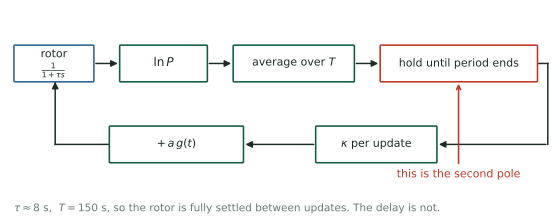
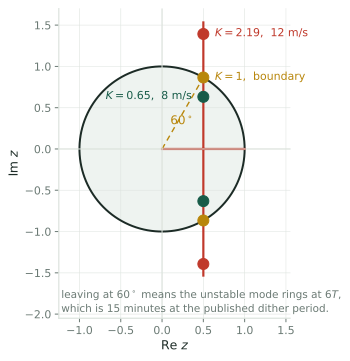
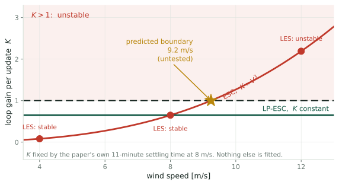

## Speed is the complaint {.smaller}

::: {.cols2}
::: {.card}
[What we were told]{.cardh}

A version of extremum seeking that "converges very fast but takes too long to
tune its parameters."
:::

::: {.card}
[What the papers show]{.cardh}

Settling times from 8 minutes to 46, and at one wind speed no settling time at
all, because the algorithm goes unstable.
:::
:::

::: claim
So the governing question is not only how noisy the gradient is. It is **what
sets the ceiling on convergence rate**, and whether anyone knows where that
ceiling is.
:::

## The puzzle {.smaller}

The 2017 analysis reduces the whole loop to one equation,

$$\dot{\tilde u} = -\omega_c\,\tilde u,
\qquad
\omega_c = \kappa\left|\frac{\partial^2 C_P}{\partial u^2}\right| P_{\text{wind}}$$

One pole, on the negative real axis, for **any** positive gain. Raise $\kappa$,
or raise the wind, and it moves further left. It converges faster and it never
rings.

::: {.warn}
The 2019 large-eddy simulations report plain ESC as **unstable at 12 m/s**, in
uniform inflow and again under shear with turbulence, with the torque gain
oscillating hard enough to stall the turbine repeatedly.
:::

::: claim
A first-order model cannot produce that behaviour at any gain. Whatever sets the
limit is not in the published analysis.
:::

## What is actually around the loop {.smaller}

{.fig-wide fig-alt="Block diagram: rotor as a first-order lag, log power, an averaging block over the dither period, a hold block marked as the second pole, then the gain per update and the dither injection back to the rotor."}

::: claim
The rotor settles in about 8 s and the dither period is 150 s, so the rotor is
**not** the missing dynamics. It is fully settled between updates.
:::

## The missing element is a delay {.smaller}

You cannot act on a measurement until its averaging window has closed.

::: {.cols2}
::: {.card}
[Why it is unavoidable]{.cardh}

The gradient estimate for period $n$ exists only once period $n$ has finished.
The soonest it can change the parameter is period $n+1$.
:::

::: {.card}
[What it is, in the loop]{.cardh}

One sample of pure delay, which is a second pole. Continuous-time analysis does
not see it because it assumes the estimate is available instantaneously.
:::
:::

::: claim
This is the same structure as the 27% of each period the 2019 scheme blanks out
to avoid transients. Both are the loop paying for the fact that measurement takes
time.
:::

## One line of algebra {.smaller}

With the rotor settled, the loop is a discrete integrator plus a one-sample
delay. The characteristic equation is

$$z^2 - z + K = 0, \qquad K = \kappa |H| \ \text{per update}$$

Jury's criterion for $z^2 + b_1 z + b_0$ requires $|b_0| < 1$ and
$|b_1| < 1 + b_0$, which here gives

$$\boxed{\;0 < K < 1\;}$$

::: {.cols3}
::: {.card}
[continuous first order]{.cardh}
no bound at all
:::
::: {.card}
[discrete integrator alone]{.cardh}
$K < 2$
:::
::: {.card}
[with the delay]{.cardh}
$K < 1$
:::
:::

## Where the poles go {.smaller}

{.fig-tall fig-alt="Unit circle in the z plane. The two roots start on the real axis, meet, and travel vertically along the line Re z equals one half, crossing the unit circle at sixty degrees. Markers at K equals 0.65 inside, K equals 1 on the circle, and K equals 2.19 outside."}

::: claim
The pair leaves the unit circle at $60^\circ$, so the mode that goes unstable
rings at $6T$. At the published dither period that is a **15 minute**
oscillation, which is a signature you can look for in the existing time series.
:::

## Calibrate on their own numbers {.smaller}

The 2019 paper tunes for a 99% settling time of 11 minutes at 8 m/s, with
$T = 150$ s. That is $4.4$ updates, so $(1-K)^{4.4} = 0.01$ and

$$K(8\ \text{m/s}) = 0.649$$

Nothing else is fitted. Plain ESC has $K \propto V^3$:

::: {.cols3}
::: {.card}
[4 m/s]{.cardh}
$K = 0.081$, stable.

**LES: stable.**
:::

::: {.card}
[8 m/s]{.cardh}
$K = 0.649$, stable.

**LES: stable.**
:::

::: {.card}
[12 m/s]{.cardh}
$K = 2.19$, unstable.

**LES: unstable.**
:::
:::

## And it predicts the edge {.smaller}

{fig-alt="Loop gain per update against wind speed. The ESC curve rises as the cube of wind speed and crosses the K equals one boundary at 9.2 metres per second, with the three LES observations marked. The LP-ESC line is flat at 0.649 and never crosses."}

::: claim
The boundary sits at **9.2 m/s**. And because the logarithm makes $K$ independent
of wind speed, LP-ESC stays at $0.649$ everywhere and never crosses, which is
exactly what the LES found at all three speeds.
:::

::: {.notes}
One model, one constant taken from their own settling time, four observations
reproduced: ESC stable at 4 and 8, unstable at 12, LP-ESC stable throughout.

Nothing was tuned to fit the instability. It falls out.
:::

## The test {.smaller}

::: {.openq}
Run plain ESC at **10 m/s** in the existing setup. One run. The model says
unstable. A stable result falsifies it cleanly, and tells us something specific
is missing from the loop.
:::

::: {.cols2}
::: {.card}
[Second, cheaper check]{.cardh}

Look at the existing 12 m/s time series. The model says the oscillation should
have a period near $6T$, about 13 minutes at that gain. No new runs needed.
:::

::: {.card}
[Third, on the other side]{.cardh}

The model says the ceiling moves with $T$. Halving the dither period should move
the boundary up by $2^{1/3}$, to about 11.6 m/s.
:::
:::

## What it buys beyond the puzzle {.smaller}

::: {.cols2}
::: {.card}
[A hard ceiling]{.cardh}

$K < 1$ bounds convergence rate **independently of noise**. No amount of variance
reduction moves it. It is set by how long you must average.
:::

::: {.card}
[A design equation]{.cardh}

$K = \kappa|H| < 1$ ties the gain, the curvature and the update period together
in one inequality. That is the tuning rule this line currently obtains by trial
and error.
:::
:::

::: claim
It also explains why the logarithm helped so much. Its real effect is to stop
$K$ from scaling with $V^3$, which is what was pushing the loop across the
boundary at high wind.
:::

## What bounds the speed? {.smaller}

::: {.closing}
::: {.lead}
The instability is not a numerical artifact. It is a sampled-data loop crossing
its stability boundary.
:::

::: {.cols2}
::: {.card}
[The claim]{.cardh}

$K < 1$, calibrated at $K = 0.649$ from their own settling time, reproduces all
three reported outcomes and puts the boundary at $9.2$ m/s.
:::

::: {.card}
[The caveat]{.cardh}

The model assumes the rotor is fully settled between updates, which holds at
$T = 150$ s and fails if the dither is sped up. Then the rotor pole returns and
the bound tightens.
:::
:::

::: {.small}
Ciri, Leonardi & Rotea, *Wind Energy* 2019 · Rotea, *IFAC* 2017 ·
Mulders, Gallo & Rotea, *ACC* 2024
:::
:::

::: footnote
One of three: see also [the estimand](q1-estimand.html) and
[whether probing is needed](q3-probing.html).
:::
