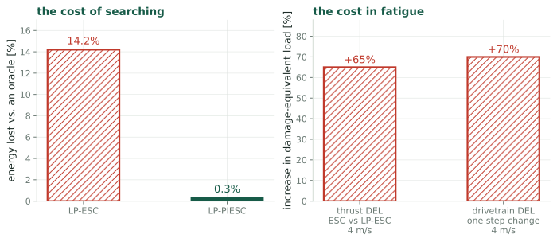
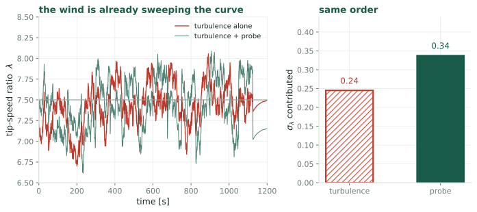
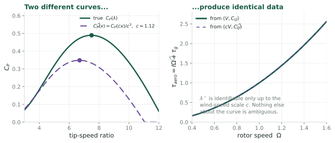

## What probing costs {.smaller}

{.fig-wide fig-alt="Left, energy lost against an oracle controller: 14.2 per cent for LP-ESC and 0.3 per cent for LP-PIESC. Right, increases in damage-equivalent load: 65 per cent in thrust for ESC versus LP-ESC at 4 metres per second, and 70 per cent in drivetrain torsion from a single step change."}

::: claim
Searching is not free. It costs energy while you search, and it costs fatigue
whether or not you find anything. Every design choice in this line is a trade
against those two numbers.
:::

::: {.notes}
The energy figure is measured against a controller that already knows the optimal
gain, so it is the pure cost of not knowing. LP-PIESC brings it to 0.3 per cent,
which is what makes the approach deployable at all.

The load figures are worth keeping in view because they do not shrink with better
estimation. They are the price of moving the machine.
:::

## What comes for free {.smaller}

The rotor equation is $I\dot\Omega = T_{\text{aero}} - \tau_{\text{gen}}$, and
every term on the right is known. $\tau_{\text{gen}}$ is commanded, $\Omega$ is
measured by an encoder, $I$ is a design constant. So

$$T_{\text{aero}}(t) \;=\; I\dot\Omega(t) + \tau_{\text{gen}}(t)$$

is **exactly reconstructible with no anemometer**, and it satisfies

$$T_{\text{aero}} \;=\; \tfrac12\rho\pi R^3 V^2\, C_Q\!\left(\frac{R\Omega}{V}\right)$$

::: claim
Two unknowns: the wind path $V(t)$ and the function $C_Q(\cdot)$. The question is
whether the record of $(\Omega,\,T_{\text{aero}})$ determines them.
:::

::: {.notes}
Note what this quietly resolves. The generator-versus-aerodynamic-power problem,
the one the 2024 ACC paper is about, disappears here: the inertial term is not a
contaminant to be filtered out, it is the signal being used.
:::

## The wind is already doing the experiment {.smaller}

{fig-alt="Left, tip-speed ratio against time under turbulence alone and under turbulence plus the probe, both swinging by a similar amount around 7.5. Right, two bars: turbulence contributes 0.24 to the standard deviation of lambda, the probe 0.34."}

::: claim
Turbulence sweeps $\lambda$ with $\sigma_\lambda \approx 0.24$, against the
probe's $0.34$. **Same order.** The dither is not supplying excitation the wind
lacks. It is supplying excitation the controller *knows about*.
:::

::: {.notes}
The estimate is the fraction of turbulence energy above the rotor's own pole,
which is what the rotor cannot follow and so passes straight into lambda. At ten
per cent intensity and a pole near 0.18 radians per second, roughly a ninth of
the variance gets through.

Order of magnitude, not a measurement, and it does not need to be tight to make
the point: the machine is swept across its own curve all day, and the fatigue
cost of that sweep is being paid whether or not anyone uses it.
:::

## Exactly one blind direction {.smaller}

Substitute $\tilde V = cV$ and ask which curve explains the same data:

$$\tilde C_Q(x) = \frac{C_Q(cx)}{c^2}
\;\;\Longrightarrow\;\;
\tilde C_P(x) = \frac{C_P(cx)}{c^3}
\;\;\Longrightarrow\;\;
\tilde\lambda^\star = \frac{\lambda^\star}{c}$$

{.fig-wide fig-alt="Left, two different C_P curves, one a rescaled copy of the other. Right, both produce an identical aerodynamic torque record, so the data cannot distinguish them."}

::: claim
One unidentifiable direction, an overall scaling of the wind, mapping straight
onto a scaling of $\lambda^\star$. Everything else about the curve is determined.
:::

## And one thing that does not matter {.smaller}

Air density enters as a prefactor, so an error in $\rho$ scales $C_P$ uniformly:

$$\tilde C_P(x) = \frac{C_P(x)}{d}
\;\;\Longrightarrow\;\;
\tilde\lambda^\star = \lambda^\star$$

::: {.cols2}
::: {.card}
[Wind speed scale]{.cardh}

Moves the estimated peak. Must be pinned.
:::

::: {.card}
[Air density]{.cardh}

Does **not** move the peak. Can be left unknown.
:::
:::

::: claim
Useful, because density is the quantity that varies with temperature and
altitude and is usually estimated badly. It turns out not to matter for locating
$\lambda^\star$.
:::

## What breaks the degeneracy {.smaller}

::: {.cols2}
::: {.card}
[What you do not need]{.cardh}

A fast rotor-effective wind estimate. Those are reconstructed through a presumed
$C_P$ surface, which makes the whole exercise circular.
:::

::: {.card}
[What you do need]{.cardh}

**One slowly updated absolute wind scale**, to pin the constant $c$. A met mast,
a nacelle lidar, or a long-run SCADA average.
:::
:::

::: claim
A slow reference is also far harder to contaminate with the control parameter.
The induction response that makes nacelle estimates circular is fast, and it does
not reach a monthly average.
:::

::: {.notes}
This is the part that makes the idea practical rather than merely elegant. The
usual objection is that you cannot separate the wind from the curve, and that is
true, but it is true in exactly one direction, and that direction is the one a
site already has an instrument for.
:::

## The test {.smaller}

::: {.openq}
Take an existing simulation run with the dither **switched off**. Reconstruct
$T_{\text{aero}} = I\dot\Omega + \tau_{\text{gen}}$, fit a parametrized
$C_Q(\cdot)$ jointly with the wind path, pin the scale with the known mean wind,
and compare the recovered peak against the simulator's own answer.
:::

::: {.cols2}
::: {.card}
[What makes it cheap]{.cardh}

No new runs. Every quantity needed is already logged in the existing output, and
the dither-off case is the baseline condition.
:::

::: {.card}
[What decides it]{.cardh}

Whether the recovered $\lambda^\star$ lands within the tolerance the erosion
problem needs, which is about $0.1$.
:::
:::

## Risks, stated plainly {.smaller}

::: {.cols3}
::: {.card}
[Prior art]{.cardh}

This sits close to the wind-speed-estimator literature, which assumes $C_P$ known
and solves for $V$. The joint version is what would be new, and that claim needs
checking first.
:::

::: {.card}
[Differentiation]{.cardh}

$T_{\text{aero}}$ needs $\dot\Omega$, and differentiating a noisy encoder signal
is where this could fail in practice rather than in principle.
:::

::: {.card}
[Identifiability in practice]{.cardh}

One blind direction in theory does not guarantee a well-conditioned fit. The
degeneracy could be nearly degenerate in more directions than one.
:::
:::

::: claim
Of the three questions this is the riskiest and the one with the largest payoff.
It does not improve the probing trade-off. It removes it.
:::

## Does the turbine need to probe? {.smaller}

::: {.closing}
::: {.lead}
The dither exists because the excitation is unknown, not because excitation is
lacking.
:::

::: {.cols2}
::: {.card}
[The claim]{.cardh}

Aerodynamic torque is reconstructible with no wind sensor, turbulence supplies
comparable excitation to the probe, and the joint estimation problem has exactly
one blind direction, which a slow absolute reference pins.
:::

::: {.card}
[If it holds]{.cardh}

No dither. No fatigue cost of probing, no amplitude to choose, no frequency plan,
and the bias-variance trade of the estimand question disappears with it.
:::
:::

::: {.small}
Kumar & Rotea, *Energies* 2022 · Ciri, Leonardi & Rotea, *Wind Energy* 2019 ·
Mulders, Gallo & Rotea, *ACC* 2024 · Soltani et al. on rotor-effective wind
estimation
:::
:::

::: footnote
One of three: see also [the estimand](q1-estimand.html) and
[the speed limit](q2-speed-limit.html).
:::
