## Two answers, and only one needs a Hessian {.smaller}

Stochastic approximation offers two routes to the same asymptotic covariance.
They differ entirely in what they cost to build.

::: {.cols2}
::: {.card}
[Polyak-Ruppert averaging]{.cardh}

Average the iterates. Attains the optimal asymptotic covariance with no
curvature estimate anywhere.
:::

::: {.card}
[Zap stochastic approximation]{.cardh}

Estimate the Jacobian on a fast timescale, invert it, use it as a matrix gain.
A stochastic Newton-Raphson method.
:::
:::

::: claim
Both reach the optimal covariance $\Sigma^{PR} = A^{-1}\Sigma_W A^{-\top}$.
Averaging gets there for four lines of code and no curvature estimate at all.
**So if the case for a matrix gain is argued on terminal variance, it loses.**
What it can be argued on is transient behavior and conditioning, and this deck
asks whether that survives contact with a turbine.
:::

::: {.notes}
The honest framing is that Zap is not the cheapest route to low variance. What
it offers is transient behavior, stability under weak conditions, and
conditioning in more than one dimension. Those are the goods worth chasing here,
and they line up with a tuning-effort complaint rather than a noise complaint.

This slide is here to set up that comparison, which the deck returns to and
settles later under Zap against averaging.
:::

## Zap in four lines {.smaller}

$$
\begin{aligned}
\hat A_{n+1} &= \hat A_n + \varepsilon_{n+1}\big[A_{n+1} - \hat A_n\big] \\[0.15em]
\theta_{n+1} &= \theta_n + \alpha_{n+1}\, G_{n+1}\, f_{n+1}(\theta_n) \\[0.15em]
A_{n+1} &= \partial_\theta f_{n+1}(\theta_n) \\[0.15em]
G_{n+1} &= -\big[\varepsilon I + \hat A^{\!\top}_{n+1}\hat A_{n+1}\big]^{-1}\hat A_{n+1}
\end{aligned}
$$

with the two step sizes satisfying $\varepsilon_n/\alpha_n \to \infty$.

::: {.warn}
Line three is the whole problem. `A` is the Jacobian of the **sample** update
direction, differentiated in the parameter. In Q-learning $f_{n+1}$ is
piecewise linear in $\theta$, so that derivative is free and rank one. A
demodulated gradient estimate has no such closed form.
:::

## The dictionary {.smaller}

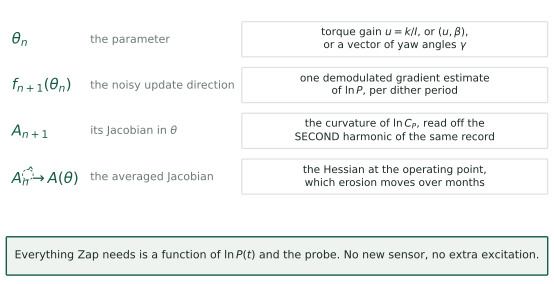{.fig-tall fig-alt="Four rows mapping Zap objects to turbine quantities: theta is the torque gain or yaw vector; f is one demodulated gradient estimate per dither period; A is the curvature of log C_P read off the second harmonic; A-hat is the Hessian at the operating point."}

::: {.notes}
Read the third row twice. It is the claim that makes the rest of the deck
possible, and the next three slides are its derivation.
:::

## What $f$ is, precisely {.smaller}

The objective is the turbulence-averaged log-power,
$\Gamma(\theta) = \mathbb{E}\big[\ln P(\theta)\big]$, and because $3\ln V$ does
not depend on $\theta$ this equals $\mathbb{E}[\ln C_P]$ up to a constant.

The mean field is $\bar f(\theta) = \nabla\Gamma(\theta)$. The sample is one
dither period of demodulation:

$$f_{n+1}(\theta_n) \;=\; \hat g_n \;=\; \frac{2}{aT}\int_{nT}^{(n+1)T}\ln P(t)\,\sin\omega t\;dt$$

::: claim
So $f$ is exactly what LP-ESC already computes. Nothing changes in the forward
path. Zap only changes what multiplies $\hat g_n$ before it reaches the
integrator.
:::

## What $A$ is, precisely {.smaller}

$$A(\theta) \;=\; \partial_\theta \bar f(\theta) \;=\; \nabla^2\Gamma(\theta)$$

For the torque-gain problem this is the scalar
$\partial^2 \ln C_P/\partial u^2$ at the operating point. It is the **same
number** that appears in Rotea's 2017 crossover frequency,

$$\nu_c \;=\; \frac{\kappa}{C_P^{\max}}\left|\frac{\partial^2 C_P}{\partial u^2}(u_o)\right|$$

::: claim
The curvature is not a new quantity being introduced. It is already in the
tuning formula, taken on faith from a design curve. Zap proposes to measure it
instead.
:::

# Where $A_{n+1}$ comes from {.divider}

The probe already writes the curvature into the data. Nobody reads it.

## Expand around the operating point {.smaller}

$\theta(t) = \theta_n + a\sin\omega t$ is the **ordinary ESC dither**: $\theta_n$
the current estimate, held across the period, with the probe riding on it. It is
$d_1(t) = a\sin(\omega t)$ of [\[KR22\]](#references) §2, nothing added. Put it into a local
quadratic model of $y = \ln P$, with $g$ the slope and $H$ the curvature at
$\theta_n$:

$$y(t) \;=\; \text{const} \;+\; g\,a\sin\omega t \;+\; \tfrac12 H a^2 \sin^2\!\omega t$$

Now use $\sin^2\omega t = \tfrac12(1 - \cos 2\omega t)$:

$$y(t) \;=\; \underbrace{\Big[\,\cdot\, + \tfrac14 H a^2\Big]}_{\text{DC}}
\;+\; \underbrace{g\,a\,\sin\omega t}_{\text{first harmonic}}
\;-\; \underbrace{\tfrac14 H a^2\cos 2\omega t}_{\text{second harmonic}}$$

::: claim
The gradient sits at $\omega$. The curvature sits at $2\omega$. Same record,
separated in frequency, one probe generating both.
:::

::: {.warn}
This needs the dither to be a **sinusoid**. For the square wave of [\[CLR19\]](#references),
$g(t) = \pm1$ so $g(t)^2 \equiv 1$: the quadratic term is a constant and
**carries no harmonic at all**. The method applies to the [\[KR22\]](#references) line, which
dithers sinusoidally, and not to the 2019 square-wave line.
:::

## In the spectrum {.smaller}

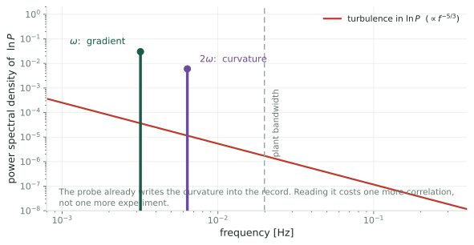{fig-alt="Power spectral density of log power. A red turbulence continuum falling as f to the minus five thirds, with a tall green line at the dither frequency labeled gradient and a shorter violet line at twice that frequency labeled curvature, both well inside the plant bandwidth."}

::: {.notes}
Two things to note on this picture. The curvature line is smaller than the
gradient line by roughly a over four times the distance from the peak, so close
to the optimum it is the larger of the two. And the second harmonic does sit in
a quieter part of the spectrum than the first, which is a real advantage for the
Hessian channel, though the deck should not lean on it: at 150 seconds the
fundamental is already sitting on the peak of f S of f, so the comparison is
between bad and slightly less bad.
:::

## The two demodulators {.smaller}

$$
\hat g_n \;=\; \Big\langle\, y\cdot \tfrac{2}{a}\sin\omega t \,\Big\rangle,
\qquad
\hat H_n \;=\; \big\langle\, y \cdot N(t) \,\big\rangle,
\qquad
N(t) = \frac{16}{a^2}\left(\sin^2\!\omega t - \frac12\right)
$$

Check the second: $N(t) = -\tfrac{8}{a^2}\cos 2\omega t$, averaged against the
$-\tfrac14 Ha^2\cos2\omega t$ term of the expansion, gives
$\tfrac14 Ha^2\cdot\tfrac{8}{a^2}\cdot\tfrac12 = H$. For $p$ parameters the same
construction is a matrix, Eqs. 20--21 of [GKN12]:

$$N_{i,i}(t) = \frac{16}{a_i^2}\left(\sin^2\!\omega_i t - \frac12\right),
\qquad
N_{i,j}(t) = \frac{4}{a_ia_j}\sin\omega_i t\,\sin\omega_j t \quad (i \ne j)$$

::: claim
$A_{n+1} = \hat H_n$. One extra correlation against a signal the loop already
generates: no new sensor, no extra excitation, no additional load.
:::

::: {.warn}
Two conditions, both checked later by simulation. The dither must be a
**sinusoid**, since a square wave has $g(t)^2 \equiv 1$ and no second harmonic
at all. And $2\omega$ must sit inside the rotor's passband, or $\hat H$ reads
low: $21\%$ low at the published $T = 150$ s.
:::

::: {.notes}
Say this one out loud before anything else. The demodulation pair is not new
and neither is the conclusion that it takes the curvature out of the loop gain.
Both are Ghaffari, Krstic and Nesic, Automatica 48 (2012) 1759 to 1767,
verified, which also supplies a Riccati filter converging to the inverse of H
without ever inverting a matrix, and which states the convergence rate becoming
user-assignable as its headline result. Krstic is not someone to accidentally
re-derive in front of this audience.

What is not in that paper: the wind turbine feasibility limit on the next
slides, the p-squared frequency budget for the multi-turbine yaw problem, and
the pairing with Zap, whose asymptotic covariance theory and regularized
pseudo-inverse their Riccati filter lacks. That is the honest boundary of the
contribution.
:::

## More than one parameter {.smaller}

For $\theta \in \mathbb{R}^p$, dither each component at its own frequency and
demodulate with a matrix:

$$
N_{ii}(t) = \frac{16}{a_i^2}\left(\sin^2\!\omega_i t - \frac12\right),
\qquad
N_{ij}(t) = \frac{4}{a_i a_j}\,\sin\omega_i t\,\sin\omega_j t \quad (i\neq j)
$$

::: {.openq}
The frequencies must satisfy the usual separation conditions, and now also
$2\omega_i$ must not collide with any $\omega_j$ or $\omega_j \pm \omega_k$. For
six yawed turbines that is a real combinatorial constraint on a narrow usable
band.
:::

## The loop, assembled {.smaller}

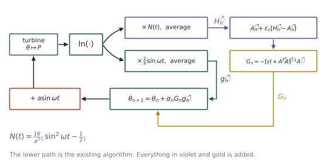{.fig-tall fig-alt="Block diagram. Log power splits into two demodulation branches. The upper one produces H-hat which feeds the averaged Jacobian and then the regularized matrix gain. The lower one produces g-hat. Both meet at the parameter update, which feeds back through the dither to the turbine."}

::: claim
The lower path is LP-ESC exactly as published. Everything added is a second
correlation and two recursions, all on signals already in hand.
:::

# What it buys {.divider}

Three things, and only one of them is about noise.

## The curvature leaves the loop gain {.smaller}

Write $\delta = \theta - \theta^\star$, so $g = H\delta$ with $H<0$ at a maximum.
Gradient ascent linearizes to $\dot\delta = \kappa H\delta$: **the closed-loop
rate is $\kappa|H|$, so it inherits the plant's curvature.** Meyn's gain carries
its own sign, $G = -H/(\varepsilon+H^2)$, and with $\varepsilon\to0$ the update
gives $\dot\delta = -\kappa\delta$, rate $\kappa$ regardless of $H$.

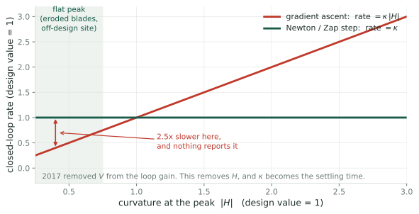{.fig-band fig-alt="Closed-loop rate against the curvature at the peak, both normalized to the value the loop was tuned at. Gradient ascent is a rising diagonal, so a flatter peak makes it 2.5 times too slow and a sharper peak 2.5 times too fast. The Newton step is a flat line at one."}

::: claim
Read the diagonal: tune at $|H| = 1$, and if erosion or an off-design site
flattens the peak to $|H| = 0.4$ the loop runs $2.5\times$ **too slow**; sharpen
it to $2.5$ and it runs $2.5\times$ **too fast**, toward the stability edge.
Nothing in the loop reports either. The flat line is what a Newton step buys:
$\kappa$ **is** the settling time rather than merely influencing it.
:::

## Which is the tuning complaint, answered {.smaller}

::: {.cols2}
::: {.card}
[What Rotea wrote]{.cardh}

A version of ESC that "converges very fast but it takes too long to tune its
parameters."
:::

::: {.card}
[What [\[RKAJ24\]](#references) says]{.cardh}

"All parameters with the exception of dither frequency and amplitude were
obtained by trial and error."
:::
:::

::: claim
Under gradient ascent, $\kappa$ has to be re-found whenever $H$ changes, and $H$
changes with the site, with the blade condition, and with the operating point.
Under a matrix gain, $\kappa$ is set once from the settling time you want.
:::

::: {.notes}
This is the strongest single argument in the deck, because it addresses the
thing he actually complained about rather than the thing the literature is
organized around. Note that it holds even in the scalar case, where the matrix
gain is just division by an estimated number.
:::

## Where a matrix really pays {.smaller}

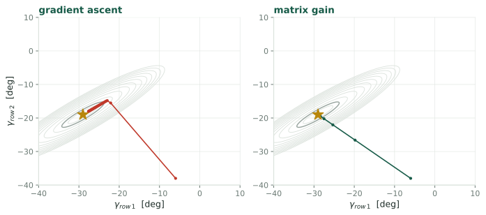{fig-alt="Two contour plots of farm power against two row yaw angles, with a long narrow tilted ridge. Left, gradient ascent crawls along the ridge in many small steps. Right, the matrix gain reaches the peak in a few."}

::: claim
Gradient methods converge at a rate set by the **smallest** Hessian eigenvalue.
The measured farm power maps in the twelve-turbine tunnel experiment are long
narrow ridges in the yaw angles, which is precisely the case where that hurts.
:::

::: {.notes}
In the scalar torque-gain problem a matrix gain is a convenience. In the yaw
problem it is the difference between converging and crawling, because the wake
interaction makes the objective strongly anisotropic and there is no reason the
principal axes should line up with individual turbines.
:::

## Regularization is doing real work {.smaller}

In the scalar case $G = -\hat A/(\varepsilon + \hat A^2)$, so the effective rate
is

$$\kappa\,\frac{H^2}{\varepsilon + H^2}$$

::: claim
On a flat peak $\hat A \to 0$ and an unregularized Newton step would explode. This
form does the opposite: it backs off to a small step, degrading gracefully into
gradient ascent exactly where curvature cannot be seen.
:::

::: {.notes}
Worth stressing because the C_P peak is flat by design and gets flatter as the
blades degrade. A naive inverse-Hessian method on this plant would be dangerous.
The epsilon in Meyn's formula is not a numerical detail here, it is the safety
property that makes the method usable.
:::

# What it costs {.divider}

Three objections. One of them is a hard precondition, not a matter of degree.

## Why the curvature is better conditioned near the peak {.smaller}

Signal amplitudes are $ga$ at $\omega$ and $\tfrac14Ha^2$ at $2\omega$; the
demodulators divide by $a$ and $a^2/8$. With $D$ the distance from the peak and
$g \approx HD$ near it:

$$\frac{\sigma(\hat H)}{\sigma(\hat g)} = \frac{8}{a}\,2^{-5/6},
\qquad
\frac{\text{rel}_H}{\text{rel}_g}
= \frac{\sigma(\hat H)/|H|}{\sigma(\hat g)/|g|}
= D\,\frac{\sigma(\hat H)}{\sigma(\hat g)}$$

::: claim
$\text{rel}_g$ **diverges** at the optimum because $g \to 0$ there.
$\text{rel}_H$ does not, because $H$ does not. So there is always a
neighborhood inside which the curvature is the better conditioned of the two,
and it ends at $D = a\,2^{5/6}/8 = 3.0\%$ of $u_{\text{opt}}$.
:::

::: {.warn}
$\sigma(\hat H)/\sigma(\hat g)$ carries units of $1/u$, so it is not a bare
number: $33$ per $u_{\text{opt}}$, $15$ per N$\cdot$m$\cdot$rpm$^{-2}$. Only $D$
is unit-free.
:::

## The crossover, and where the loop sits {.smaller}

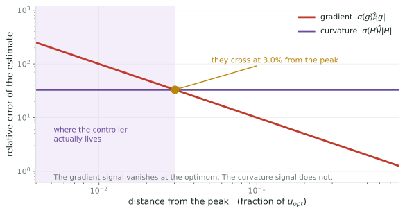{.fig-tall fig-alt="Relative error against distance from the peak, on log axes. The gradient's relative error rises steeply as the peak is approached; the curvature's is a flat line. They cross at about three per cent from the peak."}

::: claim
After convergence the loop sits about $0.5\%$ out, the finite-difference bias
from Q1. That is comfortably inside the crossover. **The regime where Newton
methods are supposed to be impossible is the regime the turbine operates in.**
:::

::: {.notes}
The spectral tilt is a secondary help, not the mechanism. Turbulence falling as
f to the minus five thirds makes the second harmonic quieter than the first by
two to the minus five sixths in amplitude, widening the crossover by a factor of
1.78. Flat noise would still give a crossover, at 1.7 per cent.

So the received wisdom that second-order information is hopeless under noise is
right in absolute terms and misleading here, because it compares the wrong
quantity. What a Newton step needs is relative accuracy in H, not absolute.
:::

## The second harmonic has to fit inside the rotor {.smaller}

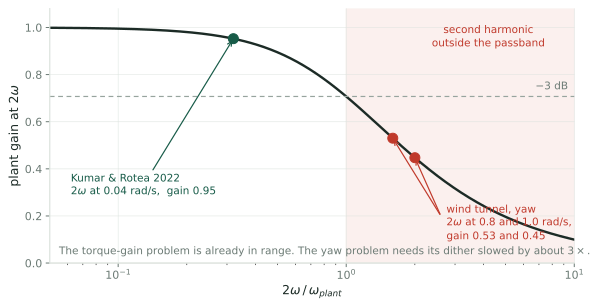{fig-alt="Plant gain at the second harmonic against the ratio of two omega to the plant bandwidth. The Kumar and Rotea 2022 setting sits at 0.32 with gain 0.95. The two wind tunnel settings sit at 1.6 and 2.0, with gains 0.53 and 0.45, inside a shaded region marked outside the passband."}

::: {.warn}
The rotor is a low-pass filter. If $2\omega$ falls outside its passband the
second harmonic is attenuated and phase-shifted, and the curvature estimate is
biased by an amount nobody is tracking.
:::

| $V$ | rotor $1/\tau$ | $(1/\tau)/2\omega$ at $T=150$ s | $T$ needed for $2\times$ margin |
|---|---|---|---|
| 4 m/s | $0.078$ | $0.93$ | $321$ s |
| 8 m/s | $0.157$ | $1.87$ | $160$ s |
| 12 m/s | $0.235$ | $2.80$ | $107$ s |

::: {.warn}
At $4$ m/s the second harmonic is **above** the rotor corner: the Hessian
channel is outside the plant. And shortening $T$ to converge faster pushes
$2\omega$ further out, so speed and curvature pull in opposite directions.
:::

::: {.notes}
The numbers decide feasibility case by case. For the torque-gain problem in
Kumar and Rotea 2022, the plant time constant is 8 seconds and the dither is
0.02 radians per second, so two omega lands at 0.32 of the bandwidth: gain 0.95,
phase lag 18 degrees. That is comfortably usable.

For the wind tunnel yaw work the plant time constant is 2 seconds and the dither
is 0.4 to 0.5 radians per second, so two omega lands at 1.6 to 2.0 times the
bandwidth: gain 0.45 to 0.53, phase lag close to 60 degrees. Not usable as
tuned. The dither would have to be slowed by roughly a factor of three, which
costs convergence time and partly undoes the reason LP-PIESC was attractive
there.

This also sharpens the earlier observation about dither frequencies creeping
upward across this line of work. Reading the second harmonic halves the usable
dither band.
:::

## The timescales are reversed, and that is mostly good {.smaller}

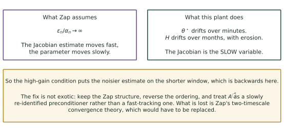{.fig-tall fig-alt="Two boxes: what Zap assumes, the Jacobian estimate fast and the parameter slow; and what this plant does, the optimum drifting over minutes and the curvature over months, so the Jacobian is the slow variable. A third box keeps Meyn's recursion and feeds it the demodulated Hessian as innovation."}

::: claim
Zap's separation is structurally unavailable here: $\hat H$ and $\theta$ both
update once per dither period. It is also **not needed**, because $H$ barely
moves where it matters, only a $20\%$ swing across the terminal scatter.
:::

## Sizing the rolling estimate {.smaller}

Do not use the demodulated $\hat H_n$ as the gain. Use it as the **innovation**
in Meyn's own recursion, with a small $\gamma$:

$$\hat A_{n+1} = \hat A_n + \gamma\big(\hat H_n - \hat A_n\big),
\qquad
\operatorname{Var}(\hat A) = \frac{\gamma}{2-\gamma}\operatorname{Var}(\hat H),
\qquad N_H = \frac{2}{\gamma}-1$$

One period of $\hat H$ is far too noisy to use raw, so the recursion is not an
optimization but the only thing that makes the estimate exist. Sizing it from
the spectral argument, with $\sigma(\hat H) = 7.1\,|H|$ per period:

| target rel. error | $N_H$ | $1/\gamma$ (periods) | wall clock at $T=600$ s |
|---|---|---|---|
| $50\%$ | 201 | 101 | $17$ h |
| $20\%$ | 1255 | 628 | $4.4$ d |

::: {.warn}
Simulation says this is **optimistic by about $4\times$ in $\sigma(\hat H)$**.
The measured requirement is on the *Simulated* slides below. Quote those, not
this table.
:::

::: claim
Meyn's structure survives intact; only the ordering flips. An estimator running
at days against erosion at months is still a two-timescale separation, though
the measured margin below is nearer $5$--$10\times$ than $100\times$.
:::

::: {.warn}
It cannot help the transient. Over $u: 4.5\to2.2$, $|H|$ moves $1.8\times$ and
not monotonically, dipping to $0.72\times$ near $u=3$. A day-long estimator
cannot track minutes, so early convergence stays uncalibrated.
:::

::: {.notes}
This is the shape of the proposal, and it is a much more modest object than
"Zap on a turbine". Keep the recursion, keep the regularized inverse, run the
gain slowly, and claim only that a calibrated preconditioner beats an
uncalibrated one. Meyn's two-timescale convergence theory does not cover the
reversed ordering and is not needed for that claim.

Note the 26 hours is not a cost in lost production. The estimator rides the
dither that is already there; it simply takes that long to average down. The
turbine keeps operating throughout.
:::

## Zap against averaging {.smaller}

::: {.cols2}
::: {.card}
[What averaging gives you]{.cardh}

The optimal asymptotic covariance. Free. No Jacobian, no second demodulator, no
frequency budget, no bandwidth constraint.
:::

::: {.card}
[What the matrix gain adds]{.cardh}

Gain calibration, transient behavior, and conditioning in more than one
dimension. It does **not** improve the terminal variance.
:::
:::

Both reach the same asymptotic covariance, the one no unbiased scheme beats:

$$\Sigma^{\text{PR}} = A^{-1}\Sigma_W A^{-\top},
\qquad
A = \nabla^2 J(\theta^\star), \quad \Sigma_W = \text{covariance of the estimator noise}$$

Averaging gets there by keeping a running mean of the iterates, $\bar\theta_n =
\tfrac1n\sum_{k\le n}\theta_k$, and needs no $A$ at all. Zap gets there by
estimating $A$ and inverting it.

::: claim
So the case for a matrix gain here rests on **tuning effort and conditioning**,
not on terminal variance. Argued on variance it loses to a running mean. And
note neither is in the published turbine loops, which are constant-gain and so
do not average down at all.
:::

## What averaging cannot do {.smaller}

Averaging is optimal in exactly one respect and silent on the rest. Four
shortcomings, in rising order of how much they matter here:

::: {.cols2}
::: {.card}
[1 · it is asymptotic]{.cardh}

$\Sigma^{\text{PR}}$ is a central-limit statement as $n\to\infty$. The
**transient** is still governed by the raw iterate, whose rate is $\kappa|H|$
and therefore still uncalibrated.
:::

::: {.card}
[2 · it needs a decaying step]{.cardh}

Textbook Polyak-Ruppert wants $\alpha_n \to 0$. A turbine has to keep
**tracking** a $\lambda^\star$ that drifts with blade condition, and a decaying
gain eventually stops tracking anything.
:::
:::

::: {.cols2}
::: {.card}
[3 · it does not straighten the path]{.cardh}

With $p>1$ and an ill-conditioned $H$, steepest ascent takes a curved route and
its slowest mode is set by the **smallest** eigenvalue. Averaging quiets the
scatter around that route without shortening it. [GKN12] sells exactly this:
straight trajectories on elongated level sets.
:::

::: {.card}
[4 · it never tells you $\kappa$]{.cardh}

You still have to choose the step size, and $K = \kappa|H| < 2$ needs $|H|$.
**This is the actual complaint** — retuning effort — and averaging leaves it
untouched.
:::
:::

::: claim
So the two are **complementary, not competing**. Averaging buys terminal
variance and no calibration; the Hessian buys calibration and no variance. Zap
with a Polyak-Ruppert tail is both, and costs one extra correlation plus the
$15$ days of averaging that $\hat A$ needs.
:::

::: {.notes}
Point two is the one specific to this plant and the easiest to miss. Every
convergence result for Polyak-Ruppert assumes a stationary optimum. Blade
erosion moves lambda-star by about 0.2 over the life of the blade, so the
problem is not stationary, and a scheme whose step size decays to zero stops
following. Constant gain plus averaging tracks, but then the average is taken
across the drift and is biased toward where the optimum used to be. That is a
bias-variance trade in the averaging window, and nobody has written it down for
this problem either.

Point three is the one that decides the farm-scale case, because that is where
p is large enough for conditioning to dominate.
:::

# Without extremum seeking {.divider}

Drop the demodulation apparatus and run stochastic approximation directly.

## What is left when ESC goes {.smaller}

::: {.cols2}
::: {.card}
[What gets deleted]{.cardh}

The dither frequency, the phase compensation $\theta$, the high-pass and
low-pass filters, the lock-in multiplier, the requirement that $2\omega$ fit
inside the plant passband.
:::

::: {.card}
[What is left]{.cardh}

$$\theta_{n+1} = \theta_n + \alpha_n\,G_n\,\hat g_n$$

Perturb, hold, measure, update. The SA recursion with nothing wrapped around
it.
:::
:::

::: claim
An iteration is now a small number of **held operating points**, each averaged
long enough to see through the turbulence, rather than a continuous sinusoid the
machine rides.
:::

::: {.notes}
This is a different algorithm, not extremum seeking with the tone replaced by
noise. Worth being clear about, because the objection from the QSA literature is
aimed at the second thing and does not transfer cleanly to the first.
:::

## The gradient: SPSA {.smaller}

Draw $\Delta_n$ with independent $\pm1$ entries, perturb **every** parameter at
once, and take one difference:

$$\hat g_n \;=\; \frac{\bar y(\theta_n + c\Delta_n) - \bar y(\theta_n - c\Delta_n)}{2c}
\begin{bmatrix}\Delta_{n1}^{-1}\\ \vdots \\ \Delta_{np}^{-1}\end{bmatrix}$$

where $\bar y$ is the mean of $\ln P$ over a held window.

::: claim
**Two measurements, whatever $p$ is.** That is the property the deterministic
scheme cannot match, and it is the entire case for going stochastic on this
plant.
:::

## Two replacements for the second harmonic {.smaller}

The second harmonic is gone with the tone. Two replacements:

::: {.cols2}
::: {.card}
[Spall's 2SPSA]{.cardh}

A second perturbation $\tilde\Delta_n$, two more gradient estimates, and a
symmetrized outer product

$$\hat H_n = \tfrac12\Big[\tfrac{\delta \hat g_n}{2\tilde c}\tilde\Delta_n^{-\top} + (\cdot)^{\!\top}\Big]$$

Rank two per iteration, four measurements.
:::

::: {.card}
[Gaussian probe and Stein]{.cardh}

For $\xi \sim N(0,I)$, the second-order Stein identity gives

$$\mathbb{E}\big[\,y\,(\xi\xi^{\!\top} - I)\,\big] = a^2\,\nabla^2\Gamma$$

so $\hat H_n = \langle y(\xi\xi^{\!\top}-I)\rangle/a^2$. No second perturbation.
:::
:::

::: claim
Either way $A_{n+1} = \hat H_n$, the running average is Zap's (8.51a), and the
regularized inverse is unchanged. **Spall's 2SPSA is Zap with SPSA supplying the
Jacobian.**
:::

::: {.notes}
The 2SPSA measurement count needs checking against Spall's 2000 TAC paper, which
is not in our folder. I have it as four per iteration with reuse, but the
accounting varies between presentations.
:::

## The Bernoulli trap {.smaller}

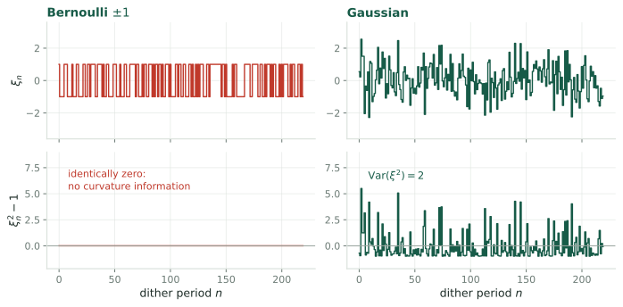{.fig-tall fig-alt="Four panels. Left column, a Bernoulli plus-minus-one probe and its square minus one, which is identically zero. Right column, a Gaussian probe and its square minus one, which fluctuates with variance two."}

::: {.warn}
The natural stochastic analogue of the [\[CLR19\]](#references) square wave is a random $\pm1$ sign
sequence. It gives the gradient, but $\xi^2 \equiv 1$, so $\mathrm{Var}(\xi^2)=0$
and the Stein estimator **divides by zero**. Bernoulli probing carries no
curvature information at all.
:::

::: {.notes}
Verified numerically: with a plus-minus-one probe, g-hat recovers the true
gradient to four decimals while the curvature estimate is undefined. With a
Gaussian probe of the same amplitude, both come back correct.

So the choice of perturbation distribution is not cosmetic. If you want the
Hessian for one extra correlation rather than four extra measurements, the probe
must have a non-degenerate fourth moment.
:::

## Where each scheme weights the turbulence {.smaller}

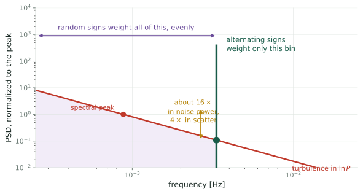{fig-alt="Turbulence spectrum on log axes. A violet bracket spans everything below the sign-sequence Nyquist frequency, labeled random signs weight all of this evenly. A green line at that frequency is labeled alternating signs weight only this bin. A gold arrow between them marks a factor of sixteen in noise power."}

Both schemes difference two windows, so both reject DC. The difference is
*where* each weights the turbulence.

::: {.warn}
An alternating sign sequence concentrates the estimator's noise weighting in one
bin; a random sequence is white and weights everything below its Nyquist evenly.
The tone therefore *can* be placed clear of the energy-containing range.

::: {.warn}
Two problems with pressing this. The ratio depends entirely on how long each
random sign is held, which sets how many independent samples a run contains, and
it swings from $0.4\times$ at a $28$ s hold to $2.3\times$ at a full $150$ s
hold. And the published tone is not placed clear of anything: Kaimal $fS(f)$
peaks at $U/4L = 0.0059$ Hz and the dither sits at $0.0067$ Hz. **It is on the
peak.**
:::
:::

::: {.notes}
There is a second cost that does not show on this plot. ESC dithers
continuously and treats the rotor response as part of a transfer function, with
phase compensation absorbing the lag. Holding a perturbed operating point means
waiting out the rotor, about six seconds of time constant, so roughly thirty
seconds of dead time before the averaging window can even start. At four to six
measurements per iteration that is two to three minutes of the budget spent
settling rather than measuring.
:::

## Frequency slots against measurements {.smaller}

The deterministic Hessian needs a separate channel for every entry of
$\nabla^2\Gamma$, at a distinct frequency product, none colliding with any
$\omega_k$ or $2\omega_k$, all inside the plant bandwidth.

| parameters $p$ | frequency slots needed | 2SPSA measurements |
|---|---|---|
| 1, torque gain | 2 | 4 |
| 2, torque and pitch | 6 | 4 |
| 6, yaw, optimized jointly | **58** | **4** |

::: claim
At $p=1$ the tone wins on every axis. At $p=6$ the plan needs 58 slots, so the
averaging window has to stretch to 49 minutes before noise is even considered,
and the stochastic version becomes the only one that runs.
:::

# The two Hessians, compared {.divider}

Same matrix, two ways of measuring it, and the difference is combinatorial.

## Why frequencies at all {.smaller}

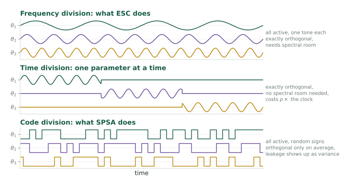{.fig-tall fig-alt="Three stacked panels showing how three parameters can be separated in one scalar measurement: frequency division with three tones, time division with one parameter active per block, and code division with three overlapping random sign sequences."}

::: claim
There is one measurement, $\ln P(t)$, and $p$ unknowns. The dither frequencies
are a **multiplexing scheme**, nothing more. Distinct $\omega_i$ make the
demodulation channels orthogonal, since
$\langle \sin\omega_i t\,\sin\omega_j t\rangle = \tfrac12\delta_{ij}$.
:::

::: {.notes}
Share a frequency between two parameters and the cross term stops vanishing, so
you read back the sum of two gradient components with no way to split them. Same
tone means same channel.

Seen this way the whole tone-versus-random question is a choice of multiplexing.
Frequency division is exactly orthogonal but needs spectral room. Code division
needs none, but random codes are orthogonal only in expectation, so the leakage
between parameters survives in any finite sample and appears as variance. That
leakage is the extra scatter we costed out two slides ago.
:::

## What the Hessian costs in frequency {.smaller}

The quadratic term produces products, and
$\sin\omega_i t \sin\omega_j t = \tfrac12[\cos(\omega_i-\omega_j)t - \cos(\omega_i+\omega_j)t]$.
So $H_{ij}$ appears at **sum and difference** frequencies and $H_{ii}$ at $2\omega_i$.
Every member of

$$\{\omega_k\} \;\cup\; \{2\omega_k\} \;\cup\; \{\omega_i \pm \omega_j\}$$

must be distinct, and all of it must fit below $\omega_{plant}$.

::: {.warn}
That is stronger than a Sidon set, because the gradient tones must also avoid
every second-order product. A plain Golomb ruler is necessary and not
sufficient.
:::

## And it grows quadratically {.smaller}

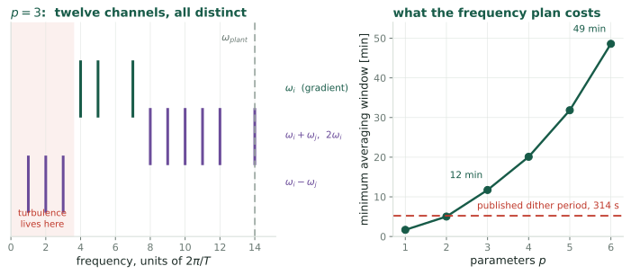{fig-alt="Left, the frequency plan for three parameters: three gradient tones, six sum and double frequencies, and three difference frequencies sitting down near DC where turbulence is strongest, all below the plant bandwidth. Right, the minimum averaging window rising from two minutes at one parameter to forty-nine minutes at six."}

| $p$ | a valid tone set | widest product | minimum window |
|---|---|---|---|
| 1 | $\{1\}$ | 2 | 101 s |
| 3 | $\{4,5,7\}$ | 14 | 704 s |
| 6 | $\{4,10,17,26,28,29\}$ | 58 | **2915 s** |

::: {.notes}
Computed by exhaustive search over the full condition, not from the asymptotic
Sidon bound, with the widest product required to sit inside a plant bandwidth of
0.125 radians per second.

Two things to take from the left panel. The band fills from both ends, and the
difference frequencies land close to DC, which is exactly where turbulence is
strongest. So the off-diagonal Hessian channels are placed in the worst part of
the spectrum by the algebra rather than by choice.

And note where 314 seconds sits on the right panel. The published tuning has
room for two parameters and no more.
:::

## Head to head {.smaller}

| | ESC, second harmonic | SA, 2SPSA or Stein |
|---|---|---|
| separation | frequency division | code division |
| orthogonality | exact, over one period | in expectation only |
| measurements per update | 0 extra, same window | 4 extra |
| spectral demand | grows as $p^2$ | none |
| noise weighting | one chosen bin | whole band below Nyquist |
| scatter in $\hat g$ | reference | $0.4$ to $2.3\times$, hold-dependent |
| settling dead time | none, rides continuously | about $5\tau$ per held point |
| perturbation seen by the drivetrain | smooth sinusoid | step changes |
| degenerate cases | tones colliding with products | Bernoulli probe, $\mathrm{Var}(\xi^2)=0$ |

::: claim
The tone wins on orthogonality, measurement count and actuation smoothness, and
loses on spectral demand, which is the row that decides the farm-scale problem.
**Noise weighting is a draw**, not a win: it would favor the tone only if the
tone were placed off the turbulence peak, and at $T = 150$ s it is not.
:::

## Reading the table honestly {.smaller}

::: {.cols2}
::: {.card}
[$p \le 2$]{.cardh}

The frequency plan is trivial and the tone is better on every axis that matters.
There is no argument for random probing here.
:::

::: {.card}
[$p \ge 4$]{.cardh}

The plan needs a 20 to 50 minute window before noise even enters. Random probing
is not merely competitive, it is the only scheme that runs.
:::
:::

::: {.warn}
The load row deserves more weight than it usually gets. Kumar and Rotea 2022,
Figure 13 of [\[RKAJ24\]](#references): the **single** step in torque gain when the controller switches on
raises drivetrain torsion DEL by 70% at 4 m/s. SPSA makes a step like that every
iteration, in both directions, and nobody has costed that out.
:::

## The synthesis this points to {.smaller}

Both columns assume the Hessian must be measured at the same rate as the
gradient. Nothing in the problem requires that.

::: {.cols3}
::: {.card}
[Gradient]{.cardh}

Keep the tone. Continuous, gentle, low-noise, and only $p$ frequencies are
needed when no products have to be resolved.
:::

::: {.card}
[Curvature]{.cardh}

A deliberate experiment, run rarely. $H$ drifts with erosion, over months. Once
a week is often enough.
:::

::: {.card}
[In between]{.cardh}

Use the last estimate as a slowly refreshed preconditioner, which is Zap with
the timescales put the right way round.
:::
:::

::: claim
Run rarely, the curvature experiment can be **time-division multiplexed**: sweep
one parameter at a time. No frequency plan, no $2\omega$ constraint, no
$p^2$ bandwidth, and no random probing either.
:::

::: {.notes}
This is the answer the two halves of the deck converge on. The whole
tone-against-noise argument is a fight over how to squeeze p-squared channels
through a narrow band every single iteration, and the premise of that fight is
wrong. The gradient needs to be fast because it is chasing a moving optimum. The
curvature does not, because it is tracking blade wear.

Separate the two rates and the combinatorial problem dissolves, because
sequential excitation is admissible once you are not in a hurry.
:::

# Simulated {.divider}

Everything so far is algebra on a fitted curve. This section runs it.

## How the simulation is built {.smaller}

::: {.cols2}
::: {.card}
[The plant]{.cardh}

NREL 5 MW rotor. $I_{\text{eff}}\dot\Omega = \tau_{\text{aero}}(V,\Omega) - k\Omega^2$
integrated with **diffrax** (Tsit5, adaptive, rtol $10^{-6}$). Heier $C_P$
remapped to $(\lambda^\star, C_P^{\max}) = (7.5, 0.49)$.
:::

::: {.card}
[The loop]{.cardh}

Sinusoidal dither $u_n + a\sin\omega t$ at $a = 13.6\%$ of $u^\star$, the [KR22]
amplitude. Demodulate $\ln P$ at $\omega$ and $2\omega$ over each period, then
update. Turbulence is an IEC Kaimal realization at $\mathrm{TI} = 10\%$.
:::
:::

::: claim
One knob, `sharpness`, scales the deviation of $C_P$ from its peak. It leaves
$\lambda^\star$ and $C_P^{\max}$ untouched and multiplies $|H|$ at the optimum
by exactly that factor, verified to three digits. That is how the plant
curvature is varied without changing anything else.
:::

::: {.notes}
Source is in the rotea repository under src, as a small JAX package plus four
experiment scripts that write npz files. The figures on the next three slides
read those files directly, so a slide cannot drift away from the number the
simulation produced.

One implementation note worth keeping. The equilibrium tip-speed ratio is found
by bisection on phi of lambda equals C times u, and bisection is a chain of
comparisons, so autodiff through it returns zero. The derivative is supplied
instead by the implicit function theorem, as a custom JVP. Without that, every
gradient and curvature in the model is silently zero.
:::

## Simulated: the demodulator, and what the rotor does to it {.smaller}

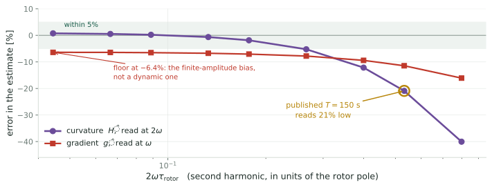{.fig-hero fig-alt="Error in the demodulated estimates against the second harmonic in units of the rotor pole, on a log x axis. The curvature error is within 5 percent for 2 omega tau below 0.27 and falls to minus 40 percent at 0.8. The published 150 second dither sits at 0.53, where the curvature reads 21 percent low. The gradient error has a floor near minus 6.4 percent."}

::: claim
Gain held $5\%$ off the peak in steady wind, so the true $J''$ is known and the
only error is the estimator's. $\hat H$ is **exact to $0.8\%$** once
$2\omega\tau_{\text{rotor}} \lesssim 0.1$, so the identity survives the rotor
dynamics. At the published $T = 150$ s, $\hat H = 0.79\,J''$: right sign, right
shape, magnitude a fifth too small.
:::

## Why it reads low, and how to undo it {.smaller}

Fitting the whole sweep, the bias is
$\hat H/J'' = \big(1+(2\omega\tau)^2\big)^{-1} = |G(2\omega)|^2$, to $1.2$
percentage points rms. **Two** factors of $|G|$, for two separate reasons:

::: {.cols2}
::: {.card}
[attenuation]{.cardh}

The rotor is a low-pass between torque gain and power, so the second harmonic
arrives smaller by $|G(2\omega)| = (1+(2\omega\tau)^2)^{-1/2}$.
:::

::: {.card}
[phase mismatch]{.cardh}

It also arrives late, by $\phi = -\arctan 2\omega\tau$. Correlating against an
in-phase $\cos2\omega t$ recovers $\cos\phi$, which is the same factor again.
:::
:::

::: {.warn}
The gradient is attenuated too, just less, so the two **partly cancel** in
$\hat g/\hat H$. Dynamic parts only: $\hat g/g = 0.946$, $\hat H/H = 0.791$, so
the Newton step is inflated by $1.20\times$, matching the predicted
$|G(\omega)|^2/|G(2\omega)|^2 = 1.199$.
:::

::: {.openq}
So **divide it out**: $\hat H_{\text{corr}} = \hat H\,(1+(2\omega\tau)^2)$, with
$\tau$ from the rotor model you already have. A calibration, not a stability
threat: at the published $K=0.4$ the inflated gain is $0.48$ against a bound of
$2$. But left uncorrected it defeats the point of a matrix gain, which was to
make $\kappa$ **be** the settling time.
:::

## Simulated: the curvature does leave the loop gain {.smaller}

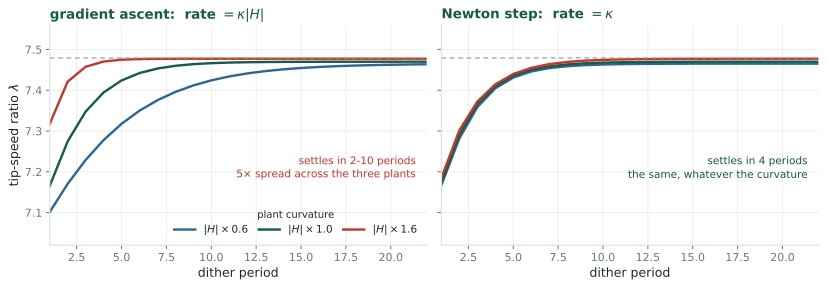{.fig-hero fig-alt="Two panels of tip-speed ratio against dither period. Left, gradient ascent on three plants whose curvature differs by a factor of 0.6, 1.0 and 1.6: the three trajectories settle in 10, 5 and 2 periods respectively. Right, the Newton step on the same three plants: all three settle in 4 periods and lie on top of one another."}

::: claim
$\kappa$ tuned **once**, for $K = 0.4$ on the $|H|\times1.0$ plant, never
retuned; all six runs start at $1.2\,u^\star$ in steady wind. Gradient ascent
settles in $10$, $5$ and $2$ periods as $|H|$ goes $0.6 \to 1.0 \to 1.6$, a
**$5\times$ spread**. The Newton step settles in $4$ on all three, a
**$1.0\times$ spread**. The central claim of the deck, and it holds.
:::

## Simulated: what the gain estimate costs {.smaller}

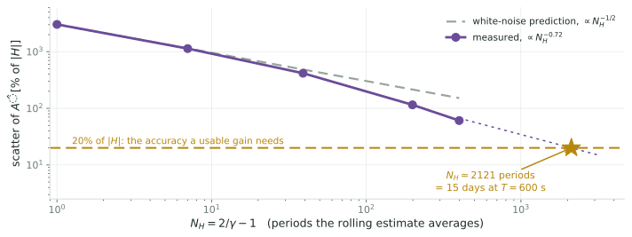{.fig-hero fig-alt="Scatter of the rolling curvature estimate against the number of periods it averages, on log axes. Measured points fall from 3000 percent at one period to 61 percent at 399, faster than the white-noise square-root line. Reaching 20 percent needs about 2100 periods, 15 days at a 600 second dither."}

::: {.warn}
Gain held at $u^\star$, open loop, $300$ periods of Kaimal turbulence. One
period's $\hat H$ scatters by **$3000\%$** of $|H|$, four times the spectral
estimate. Useless on its own.
:::

::: claim
The rolling filter rescues it **faster than white noise would**, $N_H^{-0.72}$
against $N_H^{-1/2}$, because consecutive errors are negatively correlated in
band-limited turbulence. Reaching $20\%$ needs $N_H \approx 2100$ periods,
about **15 days** at $T = 600$ s.
:::

::: {.notes}
Fifteen days is the number that decides whether this is worth doing, and it is
much worse than the 26 hours the spectral estimate suggested. It is still a
separation against blade erosion at months, but perhaps five to ten times rather
than a hundred, so it is a real constraint rather than a comfortable one.

Two honest caveats on it. The 20 per cent target is a judgement, chosen because
the plant curvature itself swings 20 per cent across the terminal scatter, so
resolving finer buys nothing. And 2100 periods is extrapolated along the fitted
slope from 399, which is the longest run made here.

The turbine is not idle for those fifteen days. It rides the dither that is
already there; the estimate simply takes that long to average down.
:::

## Simulated: what happens if $\hat A$ is under-averaged {.smaller}

A Newton step uses $G = -\hat A/(\varepsilon + \hat A^2)$. If $\hat A$ comes back
with the **wrong sign**, $G$ reverses and the loop runs *downhill*. Two
ingredients, neither from a closed-loop run:

::: {.cols2}
::: {.card}
[algebra]{.cardh}

Sign correctness needs $\sigma(\hat A) < |H|$, i.e. relative error under
$100\%$. Nothing about the turbine enters.
:::

::: {.card}
[the previous slide]{.cardh}

That slide's curve is an **open-loop** measurement, gain held fixed, no feedback
to saturate. It converts the $100\%$ into a period count.
:::
:::

| what it buys | $\sigma(\hat A)/\lvert H\rvert$ | $N_H$ | at $T = 600$ s |
|---|---|---|---|
| sign correct at $1\sigma$ | $100\%$ | $229$ | $1.6$ days |
| sign safe at $2\sigma$ | $50\%$ | $597$ | $4.1$ days |
| gain calibrated to a fifth | $20\%$ | $2121$ | $14.7$ days |

::: claim
So **1.6 days is the hard minimum**, not the 15. Below it the matrix gain is not
merely imprecise, it is occasionally the wrong sign, and a plain gradient loop
is strictly better. Above it the calibration improves smoothly.
:::

::: {.warn}
A closed-loop run at $\gamma = 0.05$ ($N_H = 39$, $\sigma(\hat A)/|H| \approx 3.6$)
shows the failure concretely: $\hat A$ ran from $+7.9$ to $-5.5$ times
$H_{\text{true}}$ and flipped sign 10 times in 60 periods. That run is only an
**illustration** — its loop gain was also far too high and it saturated — so no
number is taken from it. Rerun below with both fixed.
:::

::: {.notes}
Worth being straight about this one in the room. The experiment was run to test
whether the two recursions compound and it failed to answer that, because the
gain estimate was too noisy to keep its sign and both loops ran into their
limits. What it did produce is better than what it was aimed at: a
first-principles floor on the averaging, from the sign of the gain rather than
from a target accuracy someone picked.

It also reverses the naive reading. Under-averaged, a matrix gain is worse than
no matrix gain, because a sign error sends the loop the wrong way while a
badly-scaled gradient step only sends it the wrong distance.
:::

## Simulated: what a Polyak-Ruppert tail buys {.smaller}

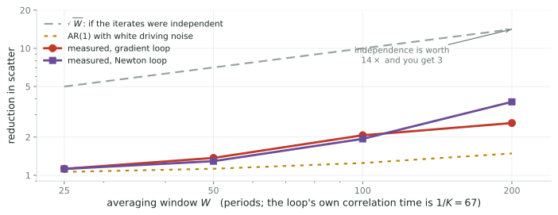{.fig-hero fig-alt="Reduction in scatter against averaging window, log axes. The square-root-of-W line rises to 14 at W equals 200. The AR(1) prediction with white driving noise rises only to 1.5. The two measured curves, gradient and Newton loops, lie between at about 2.6 and 3.8."}

$K = 0.015$ so the loop holds its optimum ($0\%$ of updates on the limits),
$\gamma = 0.005$ so $\hat A$ keeps its sign. $420$ periods, started at $u^\star$.

::: claim
Averaging helps **both** loops, $2.6\times$ and $3.8\times$ at $W = 200$. The
$1.07\times$ from the earlier run was entirely the saturation artifact. But it
is nowhere near the $\sqrt{W} = 14\times$ of independent samples, because the
iterate is strongly autocorrelated: $1/K = 67$ periods.
:::

## Reading that honestly {.smaller}

| $W$ | $\sqrt{W}$ ideal | AR(1), white noise | gradient | Newton |
|---|---|---|---|---|
| 25 | $5.0\times$ | $1.06\times$ | $1.12\times$ | $1.12\times$ |
| 100 | $10.0\times$ | $1.25\times$ | $2.07\times$ | $1.94\times$ |
| 200 | $14.1\times$ | $1.49\times$ | $2.58\times$ | $3.79\times$ |

::: claim
The measurement sits **between** the two predictions, and beats the AR(1) one
for the same reason $\hat A$ averaged down faster than $N_H^{-1/2}$ earlier:
the driving noise is negatively correlated in band-limited turbulence, so the
iterate is less persistent than $\rho = 1-K$ implies. Both of my predictions
were too pessimistic, and both assumed white driving noise.
:::

::: {.warn}
The comparison that matters: raw scatter is $0.082\,u^\star$ for the gradient
loop and $0.219\,u^\star$ for the Newton loop at matched design gain. The matrix
gain is **$2.7\times$ noisier**, because $\hat A$'s own error modulates the step
size. After averaging at $W=200$ the gradient loop still wins, $0.032$ against
$0.058$.
:::

::: {.openq}
So on terminal variance the matrix gain **costs** rather than buys, measured,
not argued. Its case rests entirely on rate calibration and conditioning. That
is the same conclusion as the earlier slide, now with numbers behind it.
:::

::: {.notes}
Worth saying plainly in the room. We set out to test whether stacking the two
compounds, and the answer is that they do not conflict but the matrix gain
enters the variance budget on the wrong side. It buys a settling time you can
predict and pays for it in scatter, and the scatter it costs is roughly what a
200-period average buys back.

The honest residual is that all of this is at one operating point, one
turbulence realization and one wind speed.
:::

# Modeling the wind as a process {.divider}

Rotea's suggestion: write $V = \bar V(1+\varepsilon)$ with $\varepsilon$ a
Kaimal process, and push it through analytically.

## Step 1: what is actually noisy {.smaller}

From Q1, $\ln P = \ln(\tfrac12\rho A) + 3\ln V + \ln C_P(\lambda)$. Split the
wind into mean and fluctuation, $V = \bar V(1+\varepsilon)$ with
$\varepsilon = \tilde v/\bar V$, so $\sigma_\varepsilon = \mathrm{TI} = 0.10$:

$$3\ln V = 3\ln\bar V + 3\ln(1+\varepsilon)
= \underbrace{3\ln\bar V}_{\text{constant}} + 3\varepsilon
\underbrace{- \tfrac32\varepsilon^2 + \cdots}_{\sim 1\%,\ \text{drop}}$$

The tip-speed ratio fluctuates too, so $\ln C_P(\lambda)$ ought to contribute.
It does not, to first order:

$$\ln C_P(\bar\lambda + \delta\lambda)
= \ln C_P(\bar\lambda) + \underbrace{\frac{C_P'}{C_P}}_{=\,0\ \text{at the peak}}\delta\lambda
+ O(\delta\lambda^2)$$

::: claim
**Near the optimum the entire first-order noise in $y$ is $3\varepsilon(t)$.**
That is the simplification the whole calculation rests on, and it is a
consequence of sitting at a maximum.
:::

## Step 2: push it through the demodulator {.smaller}

$$\hat g = \frac{1}{T}\int_0^T y(t)\,\frac{2}{a}\sin\omega t\,dt
\qquad\Longrightarrow\qquad
\hat g_{\text{noise}} = \frac{6}{aT}\underbrace{\int_0^T \varepsilon(t)\sin\omega t\,dt}_{=:\,I}$$

$I$ is a linear functional of $\varepsilon$, so by Parseval, with
$w(t) = \sin\omega t$ on $[0,T]$ and $\hat w$ its transform,

$$\operatorname{Var}(I) = \int_{-\infty}^{\infty} S^{2s}_\varepsilon(f)\,|\hat w(f)|^2\,df,
\qquad
\int|\hat w|^2 df = \int_0^T\!\sin^2\omega t\,dt = \frac{T}{2}$$

For $T$ a whole number of dither periods $|\hat w|^2$ is sharply peaked at
$f = \pm f_1$, so that energy $T/2$ splits as $T/4$ at each. $S_\varepsilon$ is
smooth there, so it comes outside:

$$\operatorname{Var}(I) = 2\cdot S^{2s}_\varepsilon(f_1)\cdot\frac{T}{4}
= S_\varepsilon(f_1)\,\frac{T}{4}
\quad\text{using } S^{2s} = \tfrac12 S \text{ (one-sided)}$$

## Step 3: assemble, and check it {.smaller}

$$\operatorname{Var}(\hat g) = \left(\frac{6}{aT}\right)^{\!2}\!\cdot S_\varepsilon(f_1)\frac{T}{4}
= \frac{9\,S_\varepsilon(f_1)}{a^2T}
\qquad\Longrightarrow\qquad
\boxed{\;\sigma(\hat g) = \frac{3}{a}\sqrt{\frac{S_\varepsilon(1/T)}{T}}\;}$$

with $S_\varepsilon(f) = \mathrm{TI}^2\,(4L/\bar V)\big/(1+6fL/\bar V)^{5/3}$,
the IEC Kaimal form divided by $\bar V^2$, and $L = 8.1\Lambda_1 = 340$ m at a
$90$ m hub.

| $T$ | $S_\varepsilon(1/T)$ | predicted | simulated | ratio |
|---|---|---|---|---|
| 150 s | $0.325$ | $4.59\times10^{-7}$ | $5.48\times10^{-7}$ | $1.19$ |
| 300 s | $0.610$ | $4.45\times10^{-7}$ | $5.09\times10^{-7}$ | $1.14$ |
| 600 s | $0.942$ | $3.91\times10^{-7}$ | $3.83\times10^{-7}$ | $0.98$ |

::: claim
Within $20\%$ across a $4\times$ range of $T$, **with nothing fitted**. This is
the $K_v$ that $\sigma_y\sqrt{\tau_c/T}$ was groping at: what matters is the
spectral density **at the dither frequency**, not a total variance and a
correlation time.
:::

## And it says to slow the dither {.smaller}

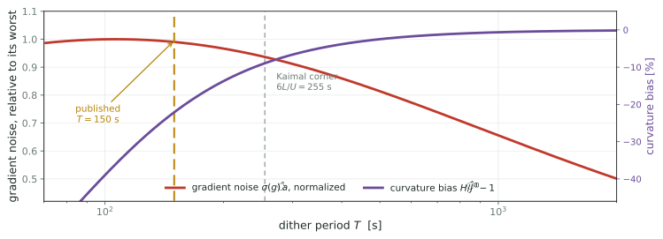{.fig-hero fig-alt="Two curves against dither period on a log axis. Gradient noise, normalized, peaks near 175 seconds and falls away on both sides. Curvature bias rises from minus 50 percent at 70 seconds toward zero beyond 600. The published 150 second period sits essentially on the noise maximum."}

Below the Kaimal corner $S_\varepsilon \propto f^{-5/3}$, so
$\sigma \propto T^{1/3}$; above it $S_\varepsilon$ flattens and
$\sigma \propto T^{-1/2}$. The turnover is a **maximum**, at $T \approx 6L/U$.

::: claim
The published $T = 150$ s sits essentially **on the worst point for gradient
noise**. Longer *and* shorter are quieter, and longer also fixes the curvature
bias. For once the two constraints agree: $T = 600$ s is $15\%$ quieter on the
gradient and moves $\hat H$ from $-21\%$ to $-2\%$.
:::

## What it does not do: close the gap {.smaller}

::: {.warn}
Feeding the published setup through the same closed form gives
$\sigma_\lambda = 2.1$, against the $\lesssim 0.14$ the LES implies. **A factor
of 15, now analytic rather than simulated**, so it is not an artifact of my
solver.
:::

Two candidate explanations tested and eliminated:

::: {.cols2}
::: {.card}
[the inflow spectrum]{.cardh}

For consistency $S_\varepsilon(1/150\,\text{s})$ would have to be $227\times$
smaller, i.e. a turbulence intensity of $0.7\%$ against the stated $10\%$.
:::

::: {.card}
[the power signal]{.cardh}

Demodulating generator power $k\Omega^3$ rather than aerodynamic
$\tau_{\text{aero}}\Omega$ changes $\sigma(\hat g)$ by $2\%$. Not this either.
:::
:::

::: {.openq}
What is left: $|J''|$ wrong by $15\times$, an effective $N$ far larger than the
settling time implies, or the LES inflow genuinely much quieter at
$1/150$ Hz than IEC Kaimal at $10\%$. **The cheapest discriminator is their own
Figure 3**, which plots the inflow PSD: read its value at $6.7\times10^{-3}$ Hz.
:::

## Verdict {.smaller}

::: {.cols3}
::: {.card}
[Tone, feasible now]{.cardh}

Single-turbine torque gain, $p=1$, so no frequency plan to solve. But
**slow the dither**: simulation puts $2\omega\tau = 0.53$ at $T=150$ s, where
$\hat H$ reads $21\%$ low. $T = 600$ s brings that under $1\%$.
:::

::: {.card}
[Tone, after retuning]{.cardh}

Two parameters, $(u,\beta)$. Three demodulation channels to place, and the
bandwidth is there for them.
:::

::: {.card}
[Random probing]{.cardh}

Yaw across a farm, optimized jointly. This is not what the tunnel experiment
does: it runs six scalar loops on clusters, which is how it keeps $p=1$.
:::
:::

::: {.openq}
Both versions share everything downstream of the Jacobian: the averaging
recursion, the regularized inverse, the Polyak-Ruppert tail. Only the way
$A_{n+1}$ is measured changes, so the two are the same program with two front
ends.
:::

## What I would test first {.smaller}

::: {.cols2}
::: {.card}
[P0, two weeks]{.cardh}

Run the existing LP-ESC at a fixed torque gain, demodulate at $2\omega$, and
compare $\hat H$ against the curvature of the simulator's own $C_P$ surface.
Pure measurement, no loop closed.
:::

::: {.card}
[Fitting $2\omega$ inside the rotor]{.cardh}

Does $\hat H$ converge to within, say, 20% over a plausible averaging window,
and does its scatter match the $(8/a)2^{-5/6}$ prediction?
:::
:::

::: claim
If $\hat H$ can be measured open-loop, everything else in this deck is
engineering. If it cannot, the matrix gain is dead and Polyak-Ruppert averaging
is the whole answer to Rotea's question.
:::

::: {.notes}
Note what this test does not require: closing the loop, retuning anything, or
committing to Zap. It asks only whether the second harmonic carries usable
curvature on this plant, which is the single fact everything else depends on.
:::

## A matrix gain for extremum seeking {.smaller}

::: {.closing}
::: {.lead}
The Jacobian Zap needs is measurable: one octave up from the gradient, or in
the second moment of a random probe.
:::

::: {.cols2}
::: {.card}
[The mapping]{.cardh}

$f$ is a gradient estimate, from a tone or from a random perturbation. $A$ is
the curvature of $\ln C_P$, read at $2\omega$ or from a second moment. $\hat A$ is
the Hessian that erosion moves.
:::

::: {.card}
[The open part]{.cardh}

Which front end to use is set by $p$, not by taste. Still open: a convergence
theory for the reversed timescale ordering this plant actually wants.
:::
:::

::: {.small}
Meyn, *Control Systems and Reinforcement Learning*, §8.5 ·
Ghaffari, Krstic & Nesic, *Automatica* 2012 ·
Spall, *IEEE TAC* **45** (2000) 1839--1853 ·
Kumar & Rotea, *Energies* 2022 ·
Rotea, Kumar, Aju & Jin, *J. Phys. Conf. Ser.* 2767 (2024) 032043
:::
:::

## References {.smaller}

::: {.refs}
**[R17]**&nbsp; M. A. Rotea, *Logarithmic power feedback for extremum seeking
control of wind turbines*, IFAC-PapersOnLine **50**(1) (2017) 4504--4509.
[doi:10.1016/j.ifacol.2017.08.381](https://doi.org/10.1016/j.ifacol.2017.08.381)

**[CLR19]**&nbsp; U. Ciri, S. Leonardi & M. A. Rotea, *Evaluation of
log-of-power extremum seeking control for wind turbines using large eddy
simulations*, Wind Energy **22** (2019) 992--1002.
[doi:10.1002/we.2336](https://doi.org/10.1002/we.2336)

**[KR22]**&nbsp; D. Kumar & M. A. Rotea, *Wind turbine power maximization using
log-power proportional-integral extremum seeking*, Energies **15** (2022) 1004.
[doi:10.3390/en15031004](https://doi.org/10.3390/en15031004)

**[KR24]**&nbsp; D. Kumar & M. A. Rotea, *Optimal tip-speed ratio for degraded
blades*, Wind Energy Science **9** (2024) 2133--2146.
[doi:10.5194/wes-9-2133-2024](https://doi.org/10.5194/wes-9-2133-2024)

**[RKAJ24]**&nbsp; M. A. Rotea, D. Kumar, E. J. Aju & Y. Jin, *Multi-row
extremum seeking for wind farm power maximization*, J. Phys. Conf. Ser.
**2767** (2024) 032043.
[doi:10.1088/1742-6596/2767/3/032043](https://doi.org/10.1088/1742-6596/2767/3/032043)

**[MGR24]**&nbsp; S. P. Mulders, N. Gallo & M. A. Rotea, *Analysis of extremum
seeking control for wind turbine torque controller optimization by aerodynamic
and generator power objectives*, ACC (2024).
[arXiv:2407.08059](https://arxiv.org/abs/2407.08059)

**[GKN12]**&nbsp; A. Ghaffari, M. Krsti&#263; & D. Ne&#353;i&#263;, *Multivariable
Newton-based extremum seeking*, Automatica **48** (2012) 1759--1767.
[doi:10.1016/j.automatica.2012.05.059](https://doi.org/10.1016/j.automatica.2012.05.059)

**[S00]**&nbsp; J. C. Spall, *Adaptive stochastic approximation by the
simultaneous perturbation method*, IEEE Trans. Automat. Contr. **45** (2000)
1839--1853. [PDF](https://www.jhuapl.edu/spsa/PDF-SPSA/Spall_TAC00.pdf)

**[LM23]**&nbsp; C. Lauand & S. Meyn, *Quasi-stochastic approximation: design
principles with applications to extremum seeking control*, IEEE Control Systems
Magazine **43** (2023).
[doi:10.1109/MCS.2023.3291884](https://doi.org/10.1109/MCS.2023.3291884)

**[A22]**&nbsp; N. J. Abbas et al., *A reference open-source controller for
fixed and floating offshore wind turbines*, Wind Energy Science **7** (2022)
53--73. [doi:10.5194/wes-7-53-2022](https://doi.org/10.5194/wes-7-53-2022)

**[J09]**&nbsp; J. Jonkman, S. Butterfield, W. Musial & G. Scott, *Definition of
a 5-MW reference wind turbine*, NREL/TP-500-38060 (2009).
[PDF](https://www.nrel.gov/docs/fy09osti/38060.pdf)
&nbsp;&middot;&nbsp; **[IEC]**&nbsp; IEC 61400-1 ed. 3, normal turbulence model.
:::

::: footnote
Companion to [Extremum Seeking Control of Wind Turbines](gradient-estimation.html).
:::
