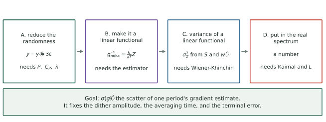
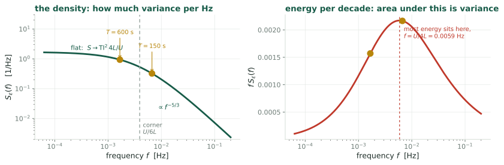
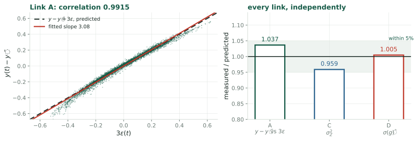
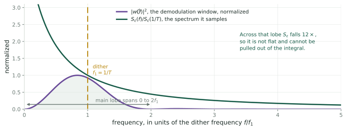

## The number we are trying to compute {.smaller}

Extremum seeking perturbs the generator's torque gain and correlates the
measured power against the perturbation (both defined in Link A and Link B).
One period of that correlation returns one number, $\hat g$, an estimate of the
slope of the objective. **Because the wind is random, $\hat g$ is random.**

$$\sigma(\hat g) := \text{standard deviation of one period's gradient estimate}$$

::: claim
$\sigma(\hat g)$ is the quantity this deck computes. Three design choices turn
on it: the probe amplitude, how long to average, and how widely the gain
scatters about its optimum once the adaptation has settled. Each of those dependences is **derived** in the closing section, once
the machinery to do so exists.
:::

::: {.warn}
In the companion decks $\sigma(\hat g)$ was **measured**: read off a simulation,
or bounded from a published table. Here it is **predicted** from the turbulence.
:::

## Why it takes four links {.smaller}

$$\hat g = \frac{1}{T}\int_0^T \ln P(t)\,\frac{2}{a}\sin\omega t\;dt
\qquad\text{(symbols defined in Links A and B)}$$

$P$ depends on the wind, which is a **random process**: a random function of
time. So $\hat g$ is an integral of a random process against a deterministic weight, and
its variance depends on how the wind's randomness is distributed **in time**.
A gust lasting an hour and a gust lasting a second contribute quite differently
to the same integral.

::: claim
Three things are therefore needed, and none of them is optional:

1. a way to describe *how a random process distributes its variance over
   timescales*: the spectral density;
2. a *model* of which spectrum turbulence actually has: Kaimal;
3. a rule for *pushing a process through a linear integral*: Wiener-Khinchin
   together with Fubini.
:::

## The route {.smaller}

{.fig-hero fig-alt="Four boxes left to right with arrows between them. A: reduce the randomness, y minus its mean equals three epsilon, needs P, C_P and lambda. B: make it a linear functional, g-hat noise equals six over aT times Z, needs the estimator. C: variance of a linear functional, sigma squared Z from S and w-hat, needs Wiener-Khinchin. D: put in the measured frequency content of turbulence, a number. Below, a banner giving the goal."}

::: claim
Four links. **A** shows that although log-power depends on the wind three
separate ways, at the optimum only one survives. **B** uses that to write the
estimator's noise as a single integral of one random process. **C** is the
general rule for the variance of such an integral. **D** puts in the measured
frequency content of atmospheric turbulence and produces a number. Each is stated, then checked
against simulation at the end.
:::

# Link A: reduce the randomness {.divider}

Log-power depends on the wind three separate ways. At the optimum only
one of them survives, and that is what makes the rest tractable.

## What we need from the turbine {.smaller}

A wind turbine below rated wind speed. Write $\bar V$ for the mean wind speed,
$R$ for the rotor radius, $\Omega$ for the rotor angular speed, $\rho$ for air
density and $A = \pi R^2$ for the swept area. Define the **tip-speed ratio** and
the **power coefficient**:

$$\lambda := \frac{R\Omega}{V},
\qquad
P = \tfrac12\rho A V^3\,C_P(\lambda)$$

$C_P$ is a property of the blades. For the rotor studied here it has a single
maximum $C_P^{\max}$ at $\lambda = \lambda^\star$; where that curve comes from,
and what is physics versus measurement in it, is Appendix A.0b. The controller's only actuator is the **torque gain**
$u$ in the generator-torque law $\tau_g = u\Omega^2$; setting $\dot\Omega = 0$
makes the rotor rest where $C_P(\lambda)/\lambda^3 = c\,u$ for a rotor constant
$c$ (derived in Appendix A.0), so $u$ selects an equilibrium
$\lambda_{\text{eq}}(u)$.

::: claim
Define the **objective** $J(u) := \ln C_P\big(\lambda_{\text{eq}}(u)\big)$, and
write $J'$, $J''$ for its first two derivatives in $u$. The optimum $u^\star$
is where $J'(u^\star) = 0$, equivalently $\lambda_{\text{eq}}(u^\star) =
\lambda^\star$. Numerically, for the NREL 5 MW rotor at $\bar V = 8$ m/s,
$J'' = -1.41\times10^{-13}$ in SI units.
:::

## The decomposition {.smaller}

Split the wind into a mean and a fluctuation about it:

$$V(t) = \bar V\big(1 + \varepsilon(t)\big),
\qquad
\varepsilon(t) := \frac{\tilde v(t)}{\bar V},
\qquad
\mathrm{TI} := \frac{\sigma_{\tilde v}}{\bar V} = \sigma_\varepsilon$$

$\tilde v$ is the fluctuating part in m/s, $\varepsilon$ its dimensionless
counterpart, and $\mathrm{TI}$ the **turbulence intensity**, $0.10$ in the case
studied here. For a random variable $x$, $\sigma_x :=
\sqrt{\mathbb{E}[x^2] - (\mathbb{E}[x])^2}$ is its **standard deviation**, written $\sigma(x)$ when $x$ is a compound
expression. For
a process $x(t)$ it is evaluated at a fixed $t$; the assumption that makes it
independent of $t$ is stated on *Link A, standing assumptions*. Since $\bar V :=
\mathbb{E}[V]$, both $\tilde v$ and $\varepsilon$ have mean zero, so
$\sigma_{\tilde v}^2 = \mathbb{E}[\tilde v^2]$ and $\sigma_\varepsilon^2 =
\mathbb{E}[\varepsilon^2]$.

::: {.remark}
The standard form is additive, $V = \bar V + \tilde v$, with the
statistics written for $\tilde v$ [\[IEC\]](#references). Dividing by the constant
$\bar V$ gives the form above: $\varepsilon = \tilde v/\bar V$ and
$\sigma_\varepsilon = \sigma_{\tilde v}/\bar V = \mathrm{TI}$.
:::

::: {.cols2}
::: {.card}
[$\varepsilon$ is small]{.cardh}

$\sigma_\varepsilon = 0.10$, so a series in $\varepsilon$ converges quickly: its
second-order terms are of size $\sigma_\varepsilon^2 = 0.01$ against
$\sigma_\varepsilon = 0.10$ for the first.
:::

::: {.card}
[$\varepsilon$ is dimensionless]{.cardh}

Every statistic of $\varepsilon$ is a pure number, $\mathrm{TI}$ among them.
From here on the wind enters only through $\varepsilon$, and $\bar V$ appears
explicitly wherever it does.
:::
:::

## Link A, executed {.smaller}

From the definitions, $y = \ln P = \ln(\tfrac12\rho A) + 3\ln V + \ln C_P(\lambda)$.
Substituting $V = \bar V(1+\varepsilon)$ into the middle term, the logarithm of
the product splits, and $\ln(1+\varepsilon) = \varepsilon - \tfrac12\varepsilon^2 +
O(\varepsilon^3)$ for $|\varepsilon| < 1$:

$$3\ln V = 3\ln\bar V + 3\ln(1+\varepsilon)
= \underbrace{3\ln\bar V}_{\text{constant}} + 3\varepsilon
\;\underbrace{-\;\tfrac32\varepsilon^2 + O(\varepsilon^3)}_{\text{second order}}$$

The second-order part has typical size $\tfrac32\sigma_\varepsilon^2 = 0.015$,
against $3\sigma_\varepsilon = 0.30$ for the linear term $3\varepsilon$.

The third term, $\ln C_P(\lambda)$, also depends on the wind, through
$\lambda = R\Omega/V$. Both wind-dependent terms are expanded under four
standing assumptions, stated on the next slide; the third term is then handled
on the slide after.

## Link A, standing assumptions {.smaller}

In force through Links A and B.

1. **The gain is held fixed**: $u(t) = u$ on the whole interval considered.
   The dither the estimator adds is treated on *Link A under the dither*.
2. **$\varepsilon$ is strictly stationary**: for every $k$, every
   $s_1,\dots,s_k$ and every shift $\tau$, the vector
   $(\varepsilon(s_1+\tau),\dots,\varepsilon(s_k+\tau))$ has the same joint
   distribution as $(\varepsilon(s_1),\dots,\varepsilon(s_k))$.
3. **$\mathbb{E}[\cdot]$ is the expectation with respect to that law.** For
   fixed $t$, $\mathbb{E}[\lambda(t)]$ averages the random variable $\lambda(t)$
   over the distribution of the wind. It is a number.
4. **The rotor has forgotten its initial condition.** Linearized about its
   equilibrium (A.0c), the rotor equation reads $\dot{\delta\Omega} +
   \delta\Omega/\tau_{\text{rotor}} = b\,\varepsilon(t)$, with $\delta\Omega :=
   \Omega - \Omega_{\text{eq}}$, $\tau_{\text{rotor}} = 6.4$ s at $8$ m/s, and $b$ a
   constant (both in A.0c). Its solution from $t = 0$ is
   $$\delta\Omega(t) = e^{-t/\tau_{\text{rotor}}}\,\delta\Omega(0)
   + b\int_0^t e^{-(t-s)/\tau_{\text{rotor}}}\,\varepsilon(s)\,ds$$
   The first term is deterministic and falls below $1\%$ of $\delta\Omega(0)$
   after $5\tau_{\text{rotor}} = 32$ s. Assumption 4 is that this has happened,
   so $\Omega(t)$ is the second term alone: a causal, time-invariant functional
   of the wind path $\{\varepsilon(s): s\le t\}$. The rotor still lags the wind;
   the lag is the exponential weight itself.

::: claim
Under 1 to 4, $V(t) = \bar V(1+\varepsilon(t))$, $\Omega(t)$, hence
$\lambda(t) = R\Omega(t)/V(t)$ and $y(t)$, are obtained from the wind path up to
$t$ by rules that do not change with $t$. Assumption 2 then gives each of them
the same law at every $t$, so $\mathbb{E}[\lambda(t)]$ and $\mathbb{E}[y(t)]$ are
constants.
:::

## Link A, executed, continued {.smaller}

With $u$ fixed, $\lambda(t)$ fluctuates only because the wind does. Write
$\bar\lambda := \mathbb{E}[\lambda(t)]$, a constant by the previous slide, and
$\delta\lambda := \lambda - \bar\lambda$. Two limits of the rotor's response
bracket $\delta\lambda$:

- **Frozen $\Omega$.** With $\lambda_0 := R\Omega/\bar V$ and $1/(1+\varepsilon) = 1 - \varepsilon + O(\varepsilon^2)$,
  $$\lambda = \frac{R\Omega}{\bar V(1+\varepsilon)} = \lambda_0\big(1 - \varepsilon + O(\varepsilon^2)\big),
  \qquad \bar\lambda = \lambda_0\big(1 + O(\sigma_\varepsilon^2)\big),
  \qquad \delta\lambda = -\bar\lambda\,\varepsilon + O(\varepsilon^2)$$
- **$\Omega$ tracking the equilibrium.** $\delta\lambda = 0$, since
  $\lambda_{\text{eq}}(u)$ depends on $u$ alone (A.0).

In both, and in between, $\delta\lambda = O(\varepsilon)$. Expanding about $\bar\lambda$:

$$\ln C_P(\bar\lambda + \delta\lambda)
= \ln C_P(\bar\lambda)
+ \frac{C_P'(\bar\lambda)}{C_P(\bar\lambda)}\,\delta\lambda
+ O(\delta\lambda^2)$$

::: claim
The next slide evaluates the two terms of this expansion at the optimum. Away
from it, $C_P'(\bar\lambda)$ is a fixed nonzero number, $\delta\lambda = O(\varepsilon)$,
and their product, the linear term, is $O(\varepsilon)$: a fluctuation of the same
order as $3\varepsilon$, with a coefficient set by how far off the gain sits.
:::

## Link A, executed, concluded {.smaller}

**At the optimum**, $u = u^\star$ (*What we need from the turbine*), so
$\lambda_{\text{eq}}(u) = \lambda^\star$, and $d := \bar\lambda - \lambda^\star$ is a
number with $d = O(\sigma_\varepsilon^2)$ (A.0d). Three steps.

1. **The coefficient of the linear term.** Taylor-expand $C_P'$ about $\lambda^\star$,
   where $C_P'(\lambda^\star) = 0$ and $C_P''(\lambda^\star) = -0.055$ is a fixed number
   (A.0b, continued):
   $$C_P'(\bar\lambda) = C_P'(\lambda^\star) + C_P''(\lambda^\star)\,d + O(d^2)
   = C_P''(\lambda^\star)\,d + O(\sigma_\varepsilon^4) = O(\sigma_\varepsilon^2)$$
2. **The linear term.** $\dfrac{C_P'(\bar\lambda)}{C_P(\bar\lambda)}\,\delta\lambda
   = O(\sigma_\varepsilon^2)\cdot O(\varepsilon) = O(\sigma_\varepsilon^2\,\varepsilon)$.
3. **The Taylor remainder.** $O(\delta\lambda^2) = O(\varepsilon^2)$, because
   $\delta\lambda = O(\varepsilon)$ (previous slide).

Collecting the three terms of $y$ from *Link A, executed*:

$$y = \underbrace{\ln(\tfrac12\rho A) + 3\ln\bar V + \ln C_P(\bar\lambda)}_{\text{constant}}
\;+\; 3\varepsilon(t) \;+\; r(t),
\qquad
r := -\tfrac32\varepsilon^2 + O(\varepsilon^3) + O(\sigma_\varepsilon^2\,\varepsilon) + O(\delta\lambda^2)$$

::: claim
$\mathbb{E}[3\varepsilon] = 0$, so $\mathbb{E}[y]$ is the constant plus
$\mathbb{E}[r]$, and
$$y(t) - \mathbb{E}[y] = 3\varepsilon(t) + \big(r(t) - \mathbb{E}[r]\big)$$
Every piece of $r$ is a product of at least two factors of size
$\sigma_\varepsilon$, so $\sigma(r - \mathbb{E}r) = O(\sigma_\varepsilon^2)
\approx 0.01$ against $\sigma(3\varepsilon) = 3\sigma_\varepsilon = 0.30$.
This is what $y - \mathbb{E}[y] = 3\varepsilon + O(\varepsilon^2)$ means
wherever it is quoted below: **one term, one random process.**
:::

# Link B: make it a linear functional {.divider}

Link A leaves a single random process. This writes the estimator's noise
as one integral of it.

## What we need from the estimator {.smaller}

Extremum seeking perturbs the gain with a sinusoid of **amplitude** $a$ and
**period** $T$. Time is cut into dither periods $[nT,(n+1)T)$, $n = 0,1,2,\dots$;
$u_n$ is the gain about which the $n$-th period dithers, and the measured
log-power is correlated against the sinusoid over exactly that period (written
below with the period's own clock, $t \in [0,T]$):

$$u(t) = u_n + a\sin\omega t,
\qquad
\omega := \frac{2\pi}{T},
\qquad
f_1 := \frac{1}{T} = \frac{\omega}{2\pi}$$

$\omega$ is the dither's angular frequency (rad/s) and $f_1$ the **dither
frequency** in hertz; both are fixed numbers throughout, $f_1 = 6.7\times10^{-3}$
Hz at $T = 150$ s.

$$y(t) := \ln P(t),
\qquad
\hat g_n := \frac{1}{T}\int_0^T y(t)\,\frac{2}{a}\sin\omega t\;dt$$

Why that integral is a gradient estimate, and why the factor is $2/a$, is
Appendix A.1.

::: claim
$\hat g_n$ is an estimate of $J'(u_n)$. Its **mean** error is the
finite-amplitude bias $\tfrac{a^2}{8}J'''$, derived on *The bias grows as $a^2$*; its **scatter**, which is what this
deck computes, comes entirely from the wind. Published values for the NREL 5 MW
case [\[CLR19\]](#references): $T = 150$ s and $a = 13.6\%$ of $u^\star$.
:::

::: {.notes}
Two conventions fixed here and used throughout. The correlation window is
exactly one dither period, which matters in Link C because it fixes the
shape of the frequency window. And the demodulating signal is in phase with the
dither, which is what makes the estimator pick out the first harmonic.
:::

## Link B, executed {.smaller}

Write the log-power over one period as three parts. $y_0(t)$ is its value with
$\varepsilon \equiv 0$, a deterministic $T$-periodic function of the dither; the
wind adds $3\varepsilon(t)$ and the remainder $r(t)$ of *Link A, executed,
concluded*. That decomposition holds **at the optimum**, so Link B and
everything built on it describe the estimator's noise with the gain at
$u^\star$: the terminal scatter. (With a rotor that tracks its equilibrium it
holds at every $u$, since $\ln C_P(\lambda_{\text{eq}}(u))$ is then constant.)

$$y(t) = y_0(t) + 3\varepsilon(t) + r(t)$$

The estimator is linear in $y$, so it splits the same way:

$$\hat g = \underbrace{\frac{2}{aT}\int_0^T y_0\sin\omega t\,dt}_{\hat g_{\text{det}}}
+ \underbrace{\frac{6}{aT}\int_0^T \varepsilon(t)\sin\omega t\,dt}_{\hat g_{\text{noise}}}
+ \underbrace{\frac{2}{aT}\int_0^T r\sin\omega t\,dt}_{\hat g_r}$$

$\hat g_{\text{det}}$ is a number (its value is Appendix A.1); $\hat g_r$ is
treated on *Link B, the remainder term*. This deck computes the scatter of the middle term:

$$\hat g_{\text{noise}} = \frac{6}{aT}\,Z,
\qquad
Z := \int_0^T \varepsilon(t)\,\sin\omega t\,dt$$

## Link B, executed, continued {.smaller}

$Z$ is a scalar random variable: the wind fluctuation over one period, weighted
by the dither and integrated.

- **Mean.** $\sin\omega t$ is deterministic and $\mathbb{E}[\varepsilon(t)] = 0$ at every $t$, so
  $$\mathbb{E}[Z] = \int_0^T \mathbb{E}[\varepsilon(t)]\,\sin\omega t\,dt = 0,
  \qquad\text{hence}\qquad \operatorname{Var}(Z) = \mathbb{E}[Z^2]$$
- **$Z^2$ as a double integral.** $Z^2 = Z\cdot Z$; name the two dummy variables
  $t$ and $s$. For a fixed realization each factor is a number independent of the
  other's variable, so each moves inside the other's integral. The iterated
  integral equals the double integral over $[0,T]^2$, the integrand being
  bounded there.
- **The autocovariance.** Under standing assumption 2,
  $\mathbb{E}[\varepsilon(t)\varepsilon(s)]$ depends on $t, s$ only through $t-s$.
  Define $\Gamma(t-s) := \mathbb{E}[\varepsilon(t)\varepsilon(s)]$; then $\Gamma(0) = \sigma_\varepsilon^2$.
- **Expectation inside the integral.**
  $$\operatorname{Var}(Z)
  = \mathbb{E}\!\left[\iint_{[0,T]^2}\! \sin\omega t\,\sin\omega s\;\varepsilon(t)\varepsilon(s)\,dt\,ds\right]
  = \iint_{[0,T]^2}\! \sin\omega t\,\sin\omega s\;\Gamma(t-s)\,dt\,ds$$

## Link B, executed, the exchange of $\mathbb{E}$ and $\iint$ {.smaller}

The rule that permits moving $\mathbb{E}$ inside the double integral, and the
check that it applies here:

1. **Fubini's theorem** (the form used here). Let $X(t,s)$ be a random quantity
   for each $(t,s) \in [0,T]^2$. If $\mathbb{E}\iint_{[0,T]^2}|X(t,s)|\,dt\,ds < \infty$,
   then $\mathbb{E}\iint X\,dt\,ds = \iint \mathbb{E}[X]\,dt\,ds$.
2. **Here** $X(t,s) = \sin\omega t\,\sin\omega s\,\varepsilon(t)\varepsilon(s)$. For a
   nonnegative integrand the exchange is always allowed (Tonelli), so
   $$\mathbb{E}\iint|X|\,dt\,ds = \iint |\sin\omega t\,\sin\omega s|\;\mathbb{E}\big|\varepsilon(t)\varepsilon(s)\big|\,dt\,ds$$
3. **Bound the expectation.** By Cauchy-Schwarz,
   $\mathbb{E}|\varepsilon(t)\varepsilon(s)| \le \sqrt{\mathbb{E}[\varepsilon(t)^2]\,\mathbb{E}[\varepsilon(s)^2]}
   = \sqrt{\sigma_\varepsilon^2\cdot\sigma_\varepsilon^2} = \sigma_\varepsilon^2$,
   using $\mathbb{E}[\varepsilon(t)^2] = \sigma_\varepsilon^2$ at every $t$ (slide *The decomposition*).
4. **Bound the weights.** $|\sin\omega t\,\sin\omega s| \le 1$ on $[0,T]^2$, a square of area $T^2$.
5. **Assemble.**
   $$\mathbb{E}\iint|X|\,dt\,ds \;\le\; \iint 1\cdot\sigma_\varepsilon^2\,dt\,ds \;=\; \sigma_\varepsilon^2\,T^2 \;<\; \infty$$
   so the condition in step 1 holds, and the exchange on the previous slide is
   justified. Link C is about what $\Gamma$ is.

## Link B, the remainder term $\hat g_r$ {.smaller}

Both wind-driven parts of $\hat g$ are the same linear operation, correlation
with the dither over one period, applied to different inputs:

$$\hat g_{\text{noise}} = \frac{2}{aT}\int_0^T 3\varepsilon(t)\,\sin\omega t\,dt,
\qquad
\hat g_r = \frac{2}{aT}\int_0^T r(t)\,\sin\omega t\,dt$$

Appendix A.10 derives
$$\frac{\sigma(\hat g_r)}{\sigma(\hat g_{\text{noise}})} = \frac{q}{3}\,\sigma_\varepsilon\,C_T,
\qquad q \in \big[\tfrac32,\ \tfrac{3+\kappa_2}{2}\big],\quad C_{150} = 1.23$$
with $q$ set by how much the rotor tracks and $C_T$ a pure number fixed by $T$
and $L/\bar V$: between $0.06$ and $0.19$ at $\mathrm{TI} = 0.10$, and $0.078$
measured (*Every link holds, continued*), with correlation $0.30$ between
$\hat g_r$ and $\hat g_{\text{noise}}$, so $\sigma(\hat g) = 1.026\,\sigma(\hat g_{\text{noise}})$.

::: claim
The remainder adds under $3\%$ to the scatter at $\mathrm{TI} = 0.10$, and its
size scales as $\sigma_\varepsilon$ relative to the main term. The rest of the
deck computes $\sigma(\hat g_{\text{noise}})$; the validation measures the total.
:::

## Link A under the dither {.smaller}

**Goal of the next four slides.** Standing assumption 1 held $u$ fixed; the
estimator dithers it, $u(t) = u^\star + a\sin\omega t$. Link B inserts Link A's
$y = y_0 + 3\varepsilon + r$ anyway, so the term the dither adds to $y - \mathbb{E}[y]$
must be found and bounded. The dither moves the point $\bar\lambda$ about which
Link A expanded; how much:

1. **Equilibrium relation, logarithmic form.** From A.0, the equilibrium tip-speed
   ratio is the function $\lambda_{\text{eq}}(u)$ defined by $C_P(\lambda_{\text{eq}})/\lambda_{\text{eq}}^3 = c\,u$, hence
   $$\ln C_P\big(\lambda_{\text{eq}}(u)\big) - 3\ln\lambda_{\text{eq}}(u) = \ln c + \ln u$$
2. **Differentiate with respect to $u$.** Both sides are functions of $u$. With
   $d\ln C_P(\lambda_{\text{eq}}) = (C_P'/C_P)\,d\lambda_{\text{eq}} = (\lambda_{\text{eq}}C_P'/C_P)\,d\ln\lambda_{\text{eq}}$,
   $$\Big(\frac{\lambda_{\text{eq}}\,C_P'(\lambda_{\text{eq}})}{C_P(\lambda_{\text{eq}})} - 3\Big)\,\frac{d\ln\lambda_{\text{eq}}}{d\ln u} = 1$$
3. **Evaluate at $u = u^\star$.** There $\lambda_{\text{eq}}(u^\star) = \lambda^\star$, the
   maximum of $C_P$, so $C_P'(\lambda_{\text{eq}}(u^\star)) = C_P'(\lambda^\star) = 0$ and
   $$\frac{d\ln\lambda_{\text{eq}}}{d\ln u}\Big|_{u = u^\star} = -\frac13
   \qquad\text{(a 1\% rise in $u$ lowers $\lambda_{\text{eq}}$ by 1/3\%)}$$
4. **The dithered operating point.** Step 3 reads $(u/\lambda_{\text{eq}})\,d\lambda_{\text{eq}}/du = -1/3$
   at $u^\star$, so $\lambda_{\text{eq}}'(u^\star) = -\lambda^\star/(3u^\star)$. Taylor-expand
   $\lambda_{\text{eq}}$ about $u^\star$ with $\delta u = a\sin\omega t$:
   $$\lambda_{\text{eq}}\big(u^\star + a\sin\omega t\big)
   = \lambda^\star + \lambda_{\text{eq}}'(u^\star)\,a\sin\omega t + O(a^2)
   = \lambda^\star\Big(1 - \frac{a}{3u^\star}\sin\omega t\Big) + O(a^2)$$

## Link A under the dither, continued  The cross term {.smaller}

**What $\bar\lambda$ means now.** On *Link A, executed, continued*, $\bar\lambda :=
\mathbb{E}[\lambda(t)]$ was a constant because $u$ was fixed. Under the dither
$u(t)$ varies, so the expectation over the wind at a fixed time is a
deterministic function of time, $\bar\lambda(t) := \mathbb{E}[\lambda(t)]$:

- tracking rotor: $\lambda(t) = \lambda_{\text{eq}}(u(t))$ exactly, a deterministic
  function of time since $\lambda_{\text{eq}}$ depends on $u$ alone, so
  $\bar\lambda(t) = \lambda_{\text{eq}}(u(t))$, the expression of step 4;
- lagging rotor: $\lambda$ depends on the wind as well; $\bar\lambda(t)$ is
  $\lambda_{\text{eq}}(u(t))$ passed through the rotor's low-pass filter of A.0c,
  attenuated and delayed, plus the $O(\sigma_\varepsilon^2)$ shift of A.0d;
- either way $\bar\lambda(t) - \lambda^\star = O(a)$, and the tracking case is the larger.

Recall the expansion of *Link A, executed, continued*:
$$\ln C_P(\bar\lambda + \delta\lambda) = \ln C_P(\bar\lambda)
+ \underbrace{\frac{C_P'(\bar\lambda)}{C_P(\bar\lambda)}\,\delta\lambda}_{\text{the linear term}}
+ O(\delta\lambda^2)$$
At $u = u^\star$ with $u$ fixed, $C_P'(\bar\lambda) = O(\sigma_\varepsilon^2)$ made the
linear term negligible. Under the dither $\bar\lambda$ moves (step 4), and:

5. **$C_P'(\bar\lambda)$ is no longer small.** Taylor about $\lambda^\star$, with
   $\bar\lambda(t) - \lambda^\star$ from step 4 (tracking case, the larger):
   $$C_P'(\bar\lambda) = C_P''(\lambda^\star)\,(\bar\lambda - \lambda^\star) + O(a^2)
   = -C_P''(\lambda^\star)\,\lambda^\star\,\frac{a}{3u^\star}\sin\omega t + O(a^2)$$

## Link A under the dither, continued  Dividing by $C_P$ {.smaller}

6. **Divide by $C_P(\bar\lambda)$ and name the curvature.** Since $C_P'(\lambda^\star) = 0$,
   $C_P(\bar\lambda) = C_P(\lambda^\star) + O(a^2)$, so dividing step 5 by it changes
   nothing at first order:
   $$\frac{C_P'(\bar\lambda)}{C_P(\bar\lambda)}
   = -\frac{C_P''(\lambda^\star)}{C_P(\lambda^\star)}\,\lambda^\star\,\frac{a}{3u^\star}\sin\omega t + O(a^2)$$
   Define $\kappa_2 := -\lambda^{\star2}C_P''(\lambda^\star)/C_P(\lambda^\star)$, a pure
   number measuring how sharply $C_P$ falls off its maximum ($6.3$ here, computed
   in A.0b, continued). Then $-C_P''(\lambda^\star)/C_P(\lambda^\star) = \kappa_2/\lambda^{\star2}$ and
   $$\frac{C_P'(\bar\lambda)}{C_P(\bar\lambda)} = \frac{\kappa_2}{\lambda^{\star2}}\,\lambda^\star\,\frac{a}{3u^\star}\sin\omega t + O(a^2)
   = \frac{\kappa_2}{\lambda^\star}\,\frac{a}{3u^\star}\sin\omega t + O(a^2)$$

## Link A under the dither, concluded  Its size {.smaller}

7. **The linear term.** Multiply step 6 by $\delta\lambda$. Frozen rotor, $\delta\lambda = -\bar\lambda\varepsilon = -\lambda^\star\varepsilon + O(a\varepsilon)$:
   $$\frac{C_P'(\bar\lambda)}{C_P(\bar\lambda)}\,\delta\lambda
   = -\kappa_2\,\frac{a}{3u^\star}\,\varepsilon\,\sin\omega t + O(a^2\varepsilon)$$
   Tracking rotor, $\delta\lambda = 0$: the linear term
   $\dfrac{C_P'(\bar\lambda)}{C_P(\bar\lambda)}\,\delta\lambda$ is zero whatever
   $C_P'(\bar\lambda)$ is, so the dither adds no term of order $a\varepsilon$.

8. **Size against $3\varepsilon$.** The coefficient of $\varepsilon$ is at most
   $\kappa_2\,a/(3u^\star)$, so relative to $3\varepsilon$:
   $$\frac{\kappa_2\,a/(3u^\star)}{3} = \frac{6.3\times0.136}{9} = 0.10 \quad\text{(frozen)},\qquad 0\quad\text{(tracking)}$$

::: claim
**Result.** With the dither on,
$$y - \mathbb{E}[y] = 3\varepsilon(t)\,\big[1 + m(t)\big] + r(t),
\qquad m(t) = -\frac{\kappa_2\,a}{9u^\star}\sin\omega t \ \text{(frozen)},\quad m \equiv 0 \ \text{(tracking)}$$
so the dither modulates the wind term by at most $|m| \le 0.10$, a term of order
$a\varepsilon$ that belongs to the remainder $r$ of Link B. The validation runs
with the dither on and measures $\sigma(y)/\sigma(3\varepsilon) = 1.037$, which
includes it.
:::

# Link C: $\operatorname{Var}(Z)$ in the frequency domain {.divider}

Rewrite Link B's double integral over time as one integral over frequency,
$\int S^{2s}(f)\,|\hat w(f)|^2\,df$. Two Fourier transforms are needed: of $\Gamma$
and of the dither window.

## The power spectral density {.smaller}

Standing assumption 2 (*Link A, standing assumptions*): $\varepsilon$ is
**strictly stationary**, meaning that for every $k$, every $s_1,\dots,s_k$ and
every shift $\tau$, $(\varepsilon(s_1+\tau),\dots,\varepsilon(s_k+\tau))$ has the same
joint distribution as $(\varepsilon(s_1),\dots,\varepsilon(s_k))$. Two consequences,
together called **wide-sense stationarity**:

- **One time point** ($k = 1$ in the definition): $\varepsilon(t)$ has the same law
  at every $t$, so $\mathbb{E}[\varepsilon] = 0$ by construction of $\varepsilon$.
- **Two time points** ($k = 2$): shifting by $\tau = -s$,
  $\mathbb{E}[\varepsilon(t)\varepsilon(s)] = \mathbb{E}[\varepsilon(t-s)\varepsilon(0)] =: \Gamma(t-s)$,
  the autocovariance of *Link B, executed, continued*. Shifting by $\tau$ instead,
  $\Gamma(-\tau) = \mathbb{E}[\varepsilon(t)\varepsilon(t-\tau)] = \mathbb{E}[\varepsilon(t+\tau)\varepsilon(t)] = \Gamma(\tau)$:
  $\Gamma$ is even.

Define, as the Fourier transform of $\Gamma$, the **power spectral density**.
The superscript $2s$ marks it as **two-sided**: a function of every $f \in
\mathbb{R}$, negative frequencies included. Standards tabulate a one-sided
version $S$ on $f > 0$, related on the next slide.

$$\Gamma(\tau) := \mathbb{E}\big[\varepsilon(t)\,\varepsilon(t+\tau)\big],
\qquad
S^{2s}(f) := \int_{-\infty}^{\infty}\! \Gamma(\tau)e^{-i2\pi f\tau}d\tau,
\qquad
\Gamma(\tau) = \int_{-\infty}^{\infty}\! S^{2s}(f)e^{i2\pi f\tau}df$$

::: claim
The pair is the **Wiener-Khinchin theorem**: for $\Gamma \in L^1(\mathbb{R})$
the transform $S^{2s}$ exists, is real, even and **nonnegative**, and the
inversion formula holds. Setting $\tau = 0$ in the inversion gives
$\Gamma(0) = \sigma_\varepsilon^2 = \int S^{2s}df$. "Density" means density of
**variance over frequency**, in units of variance per hertz: $S^{2s}(f)\,df$ is the
variance carried by frequencies in $[f, f+df]$, made precise in A.11 (a filter
passing only a band leaves a process of variance $\int_{\text{band}}S^{2s}df$).
It is the Fourier transform of $\Gamma$, with the units and the meaning of a
variance per hertz. How a given integral weights that variance across frequency is what Link C computes, with
$|\hat w|^2$ as the weight.
:::

::: {.notes}
Links C and D use only wide-sense stationarity. Strict stationarity entered
once, on Link A, to make the means of nonlinear functions of the path constant
in time. Stationarity is defensible over the ten-minute scales the
dither operates on and false over a day, which is a limit on the result rather
than on the derivation.
:::

## Two conventions, and a factor of two {.smaller}

**Frequency in hertz.** Transforms are taken over $f$ (cycles per second), with
$e^{\mp i2\pi f\tau}$ in the kernels, for two reasons: IEC 61400-1 and the
turbulence literature tabulate spectra as $S(f)$ in Hz with
$\int_0^\infty S\,df = \sigma_\varepsilon^2$, so the constants below match the standard
without factors of $2\pi$; and with this kernel the transform pair, Parseval and
Wiener-Khinchin carry no $1/2\pi$ anywhere.

**One-sided and two-sided.** $\Gamma$ is real and even, so $S^{2s}$ is real and even. Tables therefore fold the
negative frequencies onto the positive ones and quote the **one-sided** density:

$$S(f) := 2\,S^{2s}(f)\quad (f>0),
\qquad\text{so}\qquad
\sigma_\varepsilon^2 = \int_{-\infty}^{\infty}\!S^{2s}(f)\,df = \int_0^{\infty}\! S(f)\,df$$

::: {.warn}
Everything quoted from a standard is **one-sided**; every integral over all of
$\mathbb{R}$ below needs **two-sided**. The conversion $S^{2s} = \tfrac12 S$ is
applied once, explicitly, at the point of use.
:::

Units follow from the definition: $\varepsilon$ is dimensionless, so
$[\Gamma] = 1$, $[S] = \text{Hz}^{-1}$, and $\int S\,df$ is dimensionless as it must
be.

## How $\varepsilon$ is synthesized, and its distribution {.smaller}

Slide *The power spectral density* went from a process to its density: given
$\varepsilon$, compute $\Gamma$, transform it. This slide goes the other way.

- **Converse question.** Given any function $S(f) \ge 0$ on $f > 0$ with
  $\int_0^\infty S\,df < \infty$, is there a stationary process whose one-sided
  density is $S$? The construction below answers yes by building one; the
  bullets after it verify the claim.
- **Which $S$.** That is an empirical question: the density of the real wind is
  what atmospheric measurements say it is. The Kaimal formula (Link D) is a fit
  to autocovariances measured in the atmosphere, and the synthesized $\varepsilon$
  is a surrogate process sharing the real wind's mean and autocovariance.

For a record of length $D$ sampled every $\Delta t$:

- **Construction.** $N := D/(2\Delta t)$ bins, $f_k := k/D$, $\Delta f := 1/D$, and
  $$\varepsilon(t) := \sum_{k=1}^{N} A_k\cos(2\pi f_k t + \phi_k),
  \qquad A_k := \sqrt{2\,S(f_k)\,\Delta f},
  \qquad \phi_k \ \text{independent, uniform on } [0,2\pi)$$
  In the runs here $D = 36\,600$ s, $\Delta t = 0.5$ s, $N = 36\,600$.

## How $\varepsilon$ is synthesized, continued {.smaller}

- **Mean.** $\mathbb{E}\cos(2\pi f_k t + \phi_k) = 0$ for uniform $\phi_k$, so
  $\mathbb{E}[\varepsilon(t)] = 0$.
- **Autocovariance.** Independent phases remove every cross term, so
  $$\Gamma(\tau) = \sum_{k=1}^{N} \tfrac12 A_k^2\cos(2\pi f_k\tau)
  = \sum_{k=1}^{N} S(f_k)\cos(2\pi f_k\tau)\,\Delta f
  \;\xrightarrow{\ \Delta f\to0\ }\; \int_0^\infty S(f)\cos(2\pi f\tau)\,df$$
  the cosine form of the inversion formula, derived on *The integral length
  scale*, step 2. At
  $\tau = 0$, $\operatorname{Var}\varepsilon = \sum_k S(f_k)\Delta f \to \int_0^\infty S\,df = \sigma_\varepsilon^2$.

- **Strict stationarity.** Shifting $t$ by $\tau$ shifts $\phi_k$ to
  $\phi_k + 2\pi f_k\tau$; a uniform phase shifted modulo $2\pi$ is uniform, so
  the joint law of $(\phi_1,\dots,\phi_N)$, and with it of the whole path, is
  shift invariant. This is assumption 2 of *Link A, standing assumptions*.
- **Distribution at fixed $t$.** $\varepsilon(t)$ is a sum of $N$ independent
  terms, each bounded by $A_k$ with variance $\tfrac12 A_k^2$. As $N \to \infty$
  with $\max_k A_k \to 0$, the central limit theorem gives
  $\varepsilon(t) \to \mathcal{N}(0,\sigma_\varepsilon^2)$. This matches IEC 61400-1,
  whose **normal turbulence model** takes the fluctuation at a fixed time to be
  Gaussian [\[IEC\]](#references).

::: claim
Every result in this deck uses $\varepsilon$ through $\mathbb{E}[\varepsilon] = 0$,
$\Gamma$, and $\mathbb{E}[\varepsilon^4] < \infty$ only, so it holds for the
synthesized process and for any other process with the same $\Gamma$.
:::

## Link C, executed {.smaller}

Start from Link B, $\operatorname{Var}(Z) = \iint_{[0,T]^2}\sin\omega t\,\sin\omega s\;\Gamma(t-s)\,dt\,ds$.

1. **Substitute the inversion formula** $\Gamma(t-s) = \int_{\mathbb{R}} S^{2s}(f)\,e^{i2\pi f(t-s)}df$
   and split the exponential, $e^{i2\pi f(t-s)} = e^{i2\pi ft}\,e^{-i2\pi fs}$:
   $$\operatorname{Var}(Z) = \iint_{[0,T]^2}\sin\omega t\,\sin\omega s\int_{\mathbb{R}} S^{2s}(f)\,e^{i2\pi ft}\,e^{-i2\pi fs}\,df\,dt\,ds$$
2. **Move the $f$-integral outside** (Fubini; the condition is checked below). The
   $t$ and $s$ integrals then separate:
   $$\operatorname{Var}(Z) = \int_{\mathbb{R}} S^{2s}(f)
   \left[\int_0^T\sin\omega t\,e^{i2\pi ft}dt\right]\left[\int_0^T\sin\omega s\,e^{-i2\pi fs}ds\right]df$$
3. **Name the brackets.** Define the **window** $w(t) := \sin\omega t$ for $0 \le t \le T$
   and $w(t) := 0$ otherwise, and its Fourier transform
   $\hat w(f) := \int_{\mathbb{R}} w(t)\,e^{-i2\pi ft}dt = \int_0^T\sin\omega t\,e^{-i2\pi ft}dt$
   (closed form in A.3). The second bracket is $\hat w(f)$; the first is its complex
   conjugate $\overline{\hat w(f)}$, because $w$ is real. Their product is $|\hat w(f)|^2$:
   $$\boxed{\;\operatorname{Var}(Z) = \int_{\mathbb{R}} S^{2s}(f)\,|\hat w(f)|^2\,df\;}$$
4. **Fubini's condition.** $\iiint|S^{2s}(f)\,\sin\omega t\,\sin\omega s\,e^{i2\pi f(t-s)}|\,dt\,ds\,df
   \le T^2\int_{\mathbb{R}}S^{2s}\,df = \sigma_\varepsilon^2T^2 < \infty$, using $S^{2s} \ge 0$
   and $|\sin|, |e^{i\theta}| \le 1$.

## Link C, executed, continued  What the formula says {.smaller}

- **Why extend by zero.** The Fourier transform is an integral over all of
  $\mathbb{R}$; setting $w = 0$ outside $[0,T]$ turns the finite integral of step 2
  into one. The truncation carries the content: an unending sine has a transform
  concentrated at $f_1 = 1/T$ alone, one period of it spreads over a band of
  frequencies (A.3 gives the band).
- **Reading.** $\operatorname{Var}(Z)$ is an ordinary integral over $f$ of a
  deterministic function: the wind's spectral density $S^{2s}$, weighted by
  $|\hat w|^2$, how much of each frequency one period of the dither lets through.
- **Total weight of the window** (Parseval, A.4), used as a check below:
  $$\int_{\mathbb{R}}|\hat w(f)|^2\,df = \int_0^T\sin^2\omega t\,dt = \frac{T}{2}$$

## Link C, away from the optimum  Strategy {.smaller}

- Link C needs the spectral density of the wind-driven part of $y$. At $u^\star$ that part
  is $3\varepsilon$, density $3^2S^{2s} = 9S^{2s}$ (Link C carried the $3$ outside, in $6/aT$).
- Away from $u^\star$ a second term appears, $c\,\delta\lambda/\bar\lambda$, and
  $\delta\lambda/\bar\lambda$ is a convolution of $\varepsilon$.
- A convolution with kernel $\ell$ multiplies the density by $|L(f)|^2$, $L$ the
  transform of $\ell$ (A.11).
- Plan: write the whole wind-driven part as one convolution of $\varepsilon$, read
  off $L$, use $|L|^2S^{2s}$ in Link C.

## Link C, away from the optimum, continued  The kernel {.smaller}

1. **The extra term.** $y - \mathbb{E}[y] = 3\varepsilon + \dfrac{C_P'(\bar\lambda)}{C_P(\bar\lambda)}\,\delta\lambda + O(\varepsilon^2)$.
   With $c := \bar\lambda\,C_P'(\bar\lambda)/C_P(\bar\lambda)$, the logarithmic slope of
   $C_P$ at the operating point ($c = 0$ at $u^\star$, $c \approx -\kappa_2(\bar\lambda-\lambda^\star)/\lambda^\star$ nearby),
   the term is $c\,\delta\lambda/\bar\lambda$.
2. **$\delta\lambda/\bar\lambda$ in terms of $\delta\Omega$ and $\varepsilon$.** Deviations from
   the wind-free operating point: $\delta\Omega := \Omega(t) - \Omega_{\text{eq}}$ with
   $\Omega_{\text{eq}} = \lambda_{\text{eq}}(u)\bar V/R$ the equilibrium rotor speed
   (standing assumption 4), $\delta\lambda := \lambda - \bar\lambda$ (*Link A, executed,
   continued*), $\delta V = \bar V\varepsilon$. From $\lambda = R\Omega/V$,
   $\ln\lambda = \ln R + \ln\Omega - \ln V$; taking first-order variations with
   $\delta\ln V = \ln(1+\varepsilon) = \varepsilon + O(\varepsilon^2)$,
   $$\frac{\delta\lambda}{\bar\lambda} = \frac{\delta\Omega}{\Omega_{\text{eq}}} - \varepsilon + O(\varepsilon^2)$$
3. **$\delta\Omega$ as a filtered $\varepsilon$.** Standing assumption 4 gave, after
   the transient, $\delta\Omega(t) = b\int_0^\infty e^{-s/\tau_{\text{rotor}}}\varepsilon(t-s)\,ds$.
   Divide by $\Omega_{\text{eq}}$ and name the kernel:
   $$\frac{\delta\Omega}{\Omega_{\text{eq}}}(t) = \int_0^\infty g(s)\,\varepsilon(t-s)\,ds,
   \qquad g(s) := \frac{b}{\Omega_{\text{eq}}}\,e^{-s/\tau_{\text{rotor}}},
   \qquad G(f) := \int_0^\infty g(s)\,e^{-i2\pi fs}ds = \frac{b\,\tau_{\text{rotor}}/\Omega_{\text{eq}}}{1 + i2\pi f\tau_{\text{rotor}}}$$
   A.0c shows $b\,\tau_{\text{rotor}} = \Omega_{\text{eq}}$ (because $\Omega_{\text{eq}}$ is
   proportional to $V$ at fixed $u$), so $G(0) = 1$: a slow change of $V$ is
   followed exactly.

## Link C, away from the optimum, continued {.smaller}

4. **One convolution for the whole wind-driven part.** The identity is itself a
   convolution: with $\delta(s)$ the unit impulse, $\varepsilon(t) = \int\delta(s)\,\varepsilon(t-s)\,ds$.
   So both pieces of steps 1 to 3 are convolutions of $\varepsilon$, and their sum is one:
   $$3\varepsilon + c\,\frac{\delta\lambda}{\bar\lambda}
   = \int 3\delta(s)\,\varepsilon(t-s)\,ds + c\int\big(g(s) - \delta(s)\big)\,\varepsilon(t-s)\,ds
   = \int \underbrace{\big[3\delta + c\,(g-\delta)\big]}_{=:\ \ell}(s)\,\varepsilon(t-s)\,ds
   \;=:\; X(t)$$
   $X$ is the whole wind-driven part of $y$: $y - \mathbb{E}[y] = X + O(\varepsilon^2)$.
   The transform is linear, $\delta$ transforms to $1$ and $g$ to $G$, so
   $$L(f) := \int\ell(s)\,e^{-i2\pi fs}ds = 3 + c\,\big(G(f) - 1\big) =: 3 + c\,H(f),
   \qquad H(f) = \frac{-i2\pi f\tau_{\text{rotor}}}{1 + i2\pi f\tau_{\text{rotor}}}$$
   $H$ is a high-pass: $H(0) = 0$ (a slow wind change is tracked, $\delta\lambda = 0$),
   $H \to -1$ at high frequency (the rotor is frozen, $\delta\lambda/\bar\lambda = -\varepsilon$).

## Link C, away from the optimum, concluded {.smaller}

5. **Density of $X$** (A.11). A convolution of a wide-sense stationary process is
   wide-sense stationary with density $S_X^{2s}(f) = |L(f)|^2\,S^{2s}(f)$.
6. **Link C for $X$.** Repeat Link C with $S_X^{2s}$ in place of $9\,S^{2s}$:

::: claim
**Result.** At an operating point with logarithmic slope $c$,
$$\operatorname{Var}(\hat g_{\text{noise}}) = \Big(\frac{2}{aT}\Big)^2\int_{\mathbb{R}} S^{2s}(f)\,|3 + c\,H(f)|^2\,|\hat w(f)|^2\,df$$
Check at $c = 0$: $|3 + 0|^2 = 9$, so the right side is
$(2/aT)^2\cdot 9\int S^{2s}|\hat w|^2df = (6/aT)^2\operatorname{Var}(Z) = \operatorname{Var}(\hat g_{\text{noise}})$
by Link C and by Link B's $\hat g_{\text{noise}} = (6/aT)Z$. Below: the ratio to
this value for $c \ne 0$.
:::

The ratio of $\sigma(\hat g_{\text{noise}})$ away from the optimum to its value at
$u^\star$, from the Result:

| $T$ | $\lvert H(f_1)\rvert$ | $\sigma$ ratio, $c=-1$ | $c=-\tfrac12$ | $c=+\tfrac12$ | $c=+1$ |
|---|---|---|---|---|---|
| $48$ s | $0.64$ | $1.09$ | $1.04$ | $0.96$ | $0.93$ |
| $150$ s | $0.26$ | $1.02$ | $1.01$ | $0.99$ | $0.99$ |
| $600$ s | $0.07$ | $1.00$ | $1.00$ | $1.00$ | $1.00$ |

::: claim
$c = \pm1$ is an operating point about $15\%$ off $\lambda^\star$. At the published
$T = 150$ s the noise changes by under $2\%$: $|H(f_1)| = 0.26$ is small, and $H$
is nearly imaginary there, so the cross term $6c\operatorname{Re}H$ in
$|3 + cH|^2 = 9 + 6c\operatorname{Re}H + c^2|H|^2$ is second order in
$2\pi f_1\tau_{\text{rotor}}$. The main line therefore works at $u^\star$; these
slides replace it when a short dither period is considered.
:::

## Link C, bottom line {.smaller}

::: claim
**Result.** For a wide-sense stationary $\varepsilon$ with two-sided density $S^{2s}$,
$$\operatorname{Var}(Z) = \int_{\mathbb{R}} S^{2s}(f)\,|\hat w(f)|^2\,df,
\qquad
\sigma(\hat g_{\text{noise}}) = \frac{6}{aT}\sqrt{\int_{\mathbb{R}} S^{2s}(f)\,|\hat w(f)|^2\,df}$$
with $|\hat w(f)|^2 = 4\omega^2\sin^2(\pi fT)/(\omega^2 - 4\pi^2f^2)^2$ in closed form (A.3).
:::

- **What it says.** The estimator's noise variance is the wind's spectral density,
  weighted by how much of each frequency one period of the dither lets through.
  The weight has its main lobe on $[0, 2f_1]$ and total area $T/2$.
- **What it needs.** Only $S^{2s}$ of the actual wind. That is Link D.
- **What it rules out.** Reading $S^{2s}$ at $f_1$ alone, as if the window were
  narrow, is $22\%$ low in variance for the actual wind at $T = 150$ s (*The
  answer*), because the lobe reaches down to $f = 0$ where the density is $12\times$
  larger.
- **Away from $u^\star$.** Replace $S^{2s}$ by $S^{2s}\,|3 + cH(f)|^2/9$; under $2\%$
  change at $T = 150$ s.

# Link D: the wind's spectral density {.divider}

Link C needs $S^{2s}(f)$ for the actual wind: the Kaimal spectrum. Substitute it
and evaluate the integral.

## The integral length scale {.smaller}

One more definition before the wind model, because it is the model's only free
parameter.

1. **Definitions.** The **normalized autocovariance**, the **integral time scale**
   and the **integral length scale**:
   $$\varrho(\tau) := \frac{\Gamma(\tau)}{\Gamma(0)},
   \qquad
   \mathcal{T} := \int_0^{\infty}\!\varrho(\tau)\,d\tau,
   \qquad
   L := \bar V\,\mathcal{T}$$
   $\mathcal{T}$ is the lag over which the wind retains memory of itself;
   $L = \bar V\mathcal{T}$ converts it to a length by Taylor's frozen-turbulence
   hypothesis: eddies of size $L$ are carried past the rotor at speed $\bar V$.
2. **The one-sided density as a cosine transform.** $\Gamma$ is real and even, so
   in $S^{2s}(f) = \int_{\mathbb{R}}\Gamma(\tau)\,e^{-i2\pi f\tau}d\tau$ the sine part of
   $e^{-i2\pi f\tau} = \cos2\pi f\tau - i\sin2\pi f\tau$ integrates to zero and the
   two half-lines contribute equally:
   $$S(f) = 2S^{2s}(f) = 2\int_{\mathbb{R}}\Gamma(\tau)\cos(2\pi f\tau)\,d\tau = 4\int_0^\infty\Gamma(\tau)\cos(2\pi f\tau)\,d\tau$$
3. **Evaluate at $f = 0$.** With $\Gamma = \sigma_\varepsilon^2\varrho$ and step 1,
   $$S(0) = 4\int_0^{\infty}\Gamma(\tau)\,d\tau = 4\sigma_\varepsilon^2\int_0^\infty\varrho(\tau)\,d\tau
   = 4\sigma_\varepsilon^2\,\mathcal{T} = \frac{4L}{\bar V}\,\sigma_\varepsilon^2$$

::: claim
Any density with integral length scale $L$ has the value $4L\sigma_\varepsilon^2/\bar V$
at $f = 0$. That is where the prefactor of the Kaimal formula on the next slide
comes from.
:::

## The Kaimal spectrum {.smaller}

A specific one-parameter model for $S$, fitted by Kaimal, Wyngaard, Izumi and
Cot&eacute; [\[KWIC72\]](#references) to the 1968 Kansas boundary-layer measurements and adopted
by IEC 61400-1 [\[IEC\]](#references) as its normal turbulence model. In terms of $\varepsilon$:

$$\boxed{\;S_\varepsilon(f) = \mathrm{TI}^2\;\frac{4L/\bar V}{\big(1+6fL/\bar V\big)^{5/3}}\;}
\qquad f \ge 0,\ \text{one-sided}$$

Every piece is forced or measured:

::: {.cols3}
::: {.card}
[$4L/\bar V$]{.cardh}

The value at $f = 0$ that the previous slide requires of any spectrum with
integral scale $L$.
:::

::: {.card}
[exponent $5/3$]{.cardh}

Kolmogorov's inertial-subrange law, $S\propto f^{-5/3}$, which the data follow
above the corner.
:::

::: {.card}
[the $6$]{.cardh}

The one empirical number. It places the **corner**, the frequency
$f = \bar V/6L$ at which $6fL/\bar V = 1$: below it the density is flat, above
it the density falls.
:::
:::

::: claim
It is correctly normalized: substituting $x = 6fL/\bar V$,
$\int_0^{\infty}\! S_\varepsilon df = \tfrac{2}{3}\int_0^\infty (1+x)^{-5/3}dx
= \tfrac23\cdot\tfrac32\,\mathrm{TI}^2 = \mathrm{TI}^2$, as the definition of
$\mathrm{TI}$ demands.
:::

## What it looks like, and where the dither sits {.smaller}

{.fig-hero fig-alt="Two panels. Left, the Kaimal one-sided density on log-log axes: flat below a corner frequency, then falling as f to the minus five thirds, with the 150 and 600 second dither frequencies marked on it. Right, f times S against log frequency, a single broad peak at U over 4L, showing where the variance actually accumulates."}

[\[IEC\]](#references) fixes $L$ from the hub height $z$ alone:
$L = 8.1\Lambda_1$ with $\Lambda_1 = 0.7\min(z,60)$ m. For the NREL 5 MW rotor,
$z = 90$ m gives $\Lambda_1 = 42$ m and $L = 340$ m.

::: claim
At $\bar V = 8$ m/s that puts the corner at $\bar V/6L = 3.9\times10^{-3}$ Hz.
The right panel plots $fS_\varepsilon$ against $\ln f$, whose area is the
variance ($S\,df = fS\,d\ln f$); it peaks at $\bar V/4L = 5.9\times10^{-3}$ Hz
(both shown in A.7). **The
published dither, $f_1 = 1/150\,\text{s} = 6.7\times10^{-3}$ Hz, sits directly
on that peak.** The last part of this deck returns to that.
:::

## The answer {.smaller}

The exact integral, evaluated numerically, against a direct simulation of the
turbine under a synthesized Kaimal inflow ($240$ periods per row, so a simulated
$\sigma$ carries a sampling uncertainty of about $1/\sqrt{2\cdot240} = 4.6\%$).
The **shortcut** columns read the density at $f_1$ alone (A.12 explains why one might, and why it fails):

| $T$ | exact $\operatorname{Var}(Z)$ | shortcut | $\sigma(\hat g)$ exact | shortcut | simulated | exact/sim |
|---|---|---|---|---|---|---|
| $150$ s | $15.65$ | $12.18$ | $5.21{\times}10^{-7}$ | $4.59{\times}10^{-7}$ | $5.23{\times}10^{-7}$ | $0.995$ |
| $300$ s | $53.08$ | $45.73$ | $4.80{\times}10^{-7}$ | $4.45{\times}10^{-7}$ | $4.84{\times}10^{-7}$ | $0.992$ |
| $600$ s | $152.9$ | $141.3$ | $4.07{\times}10^{-7}$ | $3.91{\times}10^{-7}$ | $4.12{\times}10^{-7}$ | $0.988$ |

::: claim
$$\boxed{\;\sigma(\hat g) = \frac{6}{aT}\sqrt{\int_{\mathbb{R}}\tfrac12 S_\varepsilon(f)\,|\hat w(f)|^2\,df}\;}$$
Agreement with simulation is within $\mathbf{1.2\%}$ across a fourfold range of
$T$, inside the $4.6\%$ sampling uncertainty, with no fitted parameter. Reading the density at $f_1$ alone would be low by $12\%$ at $T = 150$ s (A.12); Link C keeps the integral.
:::

## Link D, bottom line {.smaller}

::: claim
**Result.** With the Kaimal density $S_\varepsilon(f) = \mathrm{TI}^2\,(4L/\bar V)\,(1+6fL/\bar V)^{-5/3}$,
$L = 340$ m, $\bar V = 8$ m/s, $\mathrm{TI} = 0.10$, and the published $T = 150$ s,
$a = 0.136\,u^\star$:
$$\sigma(\hat g) = \frac{6}{aT}\sqrt{\int_{\mathbb{R}}\tfrac12 S_\varepsilon(f)\,|\hat w(f)|^2\,df} = 5.2\times10^{-7},
\qquad
\frac{\sigma(\hat g)}{|J''|} = 1.7\,u^\star$$
:::

- **In words.** One period of dithering yields a gradient estimate whose noise,
  converted to a position error through the curvature $J''$, is $1.7$ times the
  optimal gain itself. Everything the loop achieves beyond that comes from
  averaging over periods and from the loop gain $K$ (*What it decides*).
- **No fitted parameter.** $\mathrm{TI}$, $L$ and the exponent $5/3$ are set by the
  standard and by turbulence theory; $T$ and $a$ by the published design.
- **Checked.** Against the full nonlinear turbine under synthesized Kaimal
  inflow, within $1.2\%$ across $T = 150$, $300$, $600$ s (*The answer*, *Does it hold?*).

# Does it hold? {.divider}

Each link checked separately against a simulation of the full nonlinear
turbine, so a failure can be attributed to one link rather than to the chain.

## How the check is set up {.smaller}

The turbine is integrated with an adaptive solver under a synthesized Kaimal
inflow (*How $\varepsilon$ is synthesized*), $240$ periods of $T = 150$ s at $\bar V = 8$ m/s, realized
$\mathrm{TI} = 9.86\%$. The gain is held at $u^\star$, with no adaptation between periods, so
what is measured is the estimator alone.

::: {.cols3}
::: {.card}
[testing A]{.cardh}

Record $y(t)$ and the $\varepsilon(t)$ that drove it. Regress one on the other:
the slope should be $3$.
:::

::: {.card}
[testing C]{.cardh}

Form $Z = \int\varepsilon w\,dt$ each period, take its sample variance, compare
with $\int S^{2s}|\hat w|^2 df$.
:::

::: {.card}
[testing D]{.cardh}

Take the sample standard deviation of $\hat g$ itself and compare with
$\tfrac{6}{aT}\sqrt{\operatorname{Var}Z}$.
:::
:::

::: claim
Link B is algebra given A: $\hat g_{\text{noise}} = \tfrac{6}{aT}Z$ follows from
$y = y_0 + 3\varepsilon + r$ by linearity of the estimator, so it is tested
through D, which compares the scatter of $\hat g$ itself with the prediction.
:::

## Every link holds {.smaller}

{.fig-hero fig-alt="Left, a scatter of the log-power fluctuation against three times the wind fluctuation, with the predicted unit-slope line and a fitted line of slope 3.08 lying almost on top of each other, correlation 0.9915. Right, three bars giving measured over predicted for links A, C and D: 1.037, 0.959 and 1.005, all inside a shaded five percent band."}

| link | claim | predicted | measured | ratio |
|---|---|---|---|---|
| **A** | $y-\bar y = 3\varepsilon$ | slope $3$ | slope $3.083$, $r = 0.9915$ | $1.037$ |
| **C** | $\operatorname{Var}Z = \int S^{2s}\vert\hat w\vert^2 df$ | $15.65$ | $15.01$ | $0.959$ |
| **D** | $\sigma(\hat g) = \tfrac{6}{aT}\sqrt{\operatorname{Var}Z}$ | $5.21{\times}10^{-7}$ | $5.23{\times}10^{-7}$ | $1.005$ |

::: claim
All three within $5\%$, and the assembled prediction within $0.5\%$. The
$3.7\%$ excess on A has two parts, both predicted on *Link A, executed,
concluded*. The slope exceeds $3$ by $2.8\%$: a term linear in $\varepsilon$,
which is the $O(\sigma_\varepsilon^2\varepsilon)$ term, $\kappa_2\sigma_\varepsilon^2\varepsilon
= 0.063\,\varepsilon$ in the frozen-rotor limit (slope $3.06$) and $0$ if the
rotor tracks. The rest is the remainder uncorrelated with $\varepsilon$: $r =
0.9915$ means a residual of $\sqrt{1-r^2} = 13\%$ of $\sigma(y)$,
adding in quadrature, $\sqrt{1.028^2 + 0.13^2} = 1.037$. Its predicted size,
from $-\tfrac32\varepsilon^2$ and $\tfrac{C_P''}{2C_P}\delta\lambda^2 =
-\tfrac{\kappa_2}{2}(\delta\lambda/\lambda)^2$, is between $7\%$ (tracking) and
$22\%$ (frozen) of $\sigma(3\varepsilon)$.
:::

## Every link holds, continued  The remainder term {.smaller}

Link B split $\hat g$ into $\hat g_{\text{det}} + \hat g_{\text{noise}} + \hat g_r$, and
the prediction covers $\hat g_{\text{noise}}$ only. The same run measures the
third term directly, period by period, as $\hat g_r = \hat g - \bar{\hat g} -
\tfrac{6}{aT}Z$, with $Z$ computed from the recorded $\varepsilon$:

| quantity | measured | note |
|---|---|---|
| $\sigma(\hat g_{\text{noise}}) = \tfrac{6}{aT}\sigma(Z)$ | $5.10\times10^{-7}$ | Link C's $\sigma(Z)$ is $4\%$ below prediction ($0.959$ in variance) |
| $\sigma(\hat g_r)$ | $3.99\times10^{-8}$ | $0.078$ of $\sigma(\hat g_{\text{noise}})$; A.10 predicts $0.061$ (tracking) to $0.19$ (frozen) |
| $\operatorname{Corr}(\hat g_r,\hat g_{\text{noise}})$ | $+0.30$ | the two add partly in phase |
| $\sigma(\hat g)/\sigma(\hat g_{\text{noise}})$ | $1.026$ | $\sqrt{1 + 2(0.30)(0.078) + 0.078^2}$ |

::: claim
The remainder adds $2.6\%$ to the scatter of $\hat g$ at $\mathrm{TI} = 0.10$.
Row D of the previous slide compares the **total** measured $\sigma(\hat g)$ with
the predicted $\sigma(\hat g_{\text{noise}})$, and its $1.005$ is the product of
the two effects, $1.026 \times \sqrt{0.959} = 1.005$: the remainder's excess and
Link C's shortfall happen to offset. The link-by-link numbers are the ones to
read; the assembled ratio is closer to one than either.
:::

# What it decides {.divider}

With $\sigma(\hat g)$ in hand, the three design dependences can be derived. Each
uses only what the four links established.

## Bias and standard deviation: the definitions {.smaller}

Link B split the estimator into a part present with no wind and two parts the
wind adds; with $y_0 = \text{const} + J(u + a\sin\omega t)$ from A.1,

$$\hat g = \underbrace{\frac{2}{aT}\int_0^T J\big(u + a\sin\omega t\big)\sin\omega t\,dt}_{\hat g_{\text{det}},\ \text{deterministic}}
\;+\; \underbrace{\frac{6}{aT}Z}_{\hat g_{\text{noise}},\ \text{random}}
\;+\; \underbrace{\hat g_r}_{\text{random},\ 0.078\,\sigma(\hat g_{\text{noise}})}$$

$$\operatorname{Bias}(\hat g) := \mathbb{E}[\hat g] - J'(u),
\qquad
\sigma(\hat g) := \sqrt{\operatorname{Var}(\hat g)}
= \sqrt{\mathbb{E}\big[(\hat g - \mathbb{E}\hat g)^2\big]}$$

::: claim
$\hat g_{\text{det}}$ is a number; $\mathbb{E}[Z] = 0$ (*Link B, executed, continued*);
and $\mathbb{E}[\hat g_r] = (2/aT)\int_0^T\mathbb{E}[r]\sin\omega t\,dt = 0$ because
$\mathbb{E}[r(t)]$ is a constant under the standing assumptions. So the two
quantities **separate**:
$$\operatorname{Bias}(\hat g) = \hat g_{\text{det}} - J'(u),
\qquad
\operatorname{Var}(\hat g) = \operatorname{Var}(\hat g_{\text{noise}} + \hat g_r)
= \Big(\frac{6}{aT}\Big)^2\operatorname{Var}(Z)\times(1.026)^2$$
The bias comes only from the probe; the scatter only from the wind, $97\%$ of
it through $Z$. The slides below work with $\hat g_{\text{noise}}$.
:::

## The bias grows as $a^2$ {.smaller}

Assume $J$ is four times differentiable near $u$ and $a$ is small enough for
the Taylor series to be used. Write $s := \sin\omega t$ and
$\langle\cdot\rangle := \tfrac1T\int_0^T(\cdot)\,dt$. The moments of a sine over
a whole period are

$$\langle s\rangle = 0,\qquad \langle s^2\rangle = \tfrac12,\qquad
\langle s^3\rangle = 0,\qquad \langle s^4\rangle = \tfrac38,\qquad
\langle s^5\rangle = 0$$

Expand $J(u + as) = J + J'as + \tfrac{J''}{2}a^2s^2 + \tfrac{J'''}{6}a^3s^3 +
O(a^4)$ and multiply by $\tfrac{2}{a}s$ before averaging:

$$\hat g_{\text{det}} = \frac2a\Big[J\langle s\rangle + J'a\langle s^2\rangle
+ \tfrac{J''}{2}a^2\langle s^3\rangle + \tfrac{J'''}{6}a^3\langle s^4\rangle\Big] + O(a^4)
= J' + \frac{a^2}{8}J''' + O(a^4)$$

::: claim
$$\operatorname{Bias}(\hat g) = \frac{a^2}{8}\,J'''(u) + O(a^4)$$
Every even power of $a$ is killed by an odd moment of $s$, which is why the
leading term is $a^2$. Checked numerically on a cubic $J$, where
$J'''$ is exact: agreement to six digits at $a = 0.02$, $0.05$, $0.10$.
:::

::: {.warn}
The $\tfrac18$ is specific to a sinusoidal dither, through
$\langle s^4\rangle = \tfrac38$. A square-wave dither gives $\tfrac16$.
:::

## The standard deviation falls as $1/a$ {.smaller}

From the separation, $\operatorname{Var}(\hat g) = (6/aT)^2\operatorname{Var}(Z)$
with $Z = \int_0^T\varepsilon\sin\omega t\,dt$.

::: claim
$Z$ is built from the wind fluctuation and the fixed weight $\sin\omega t$ on
$[0,T]$. **The amplitude $a$ does not appear in it.** Therefore
$$\sigma(\hat g) = \frac{6}{aT}\sqrt{\operatorname{Var}(Z)} \;\propto\; \frac1a$$
exactly for $\hat g_{\text{noise}}$. The full scatter also carries $\hat g_r$ from
the remainder $r$ of *Link A, executed, concluded*, with $\sigma(r -
\mathbb{E}r) = O(\sigma_\varepsilon^2)$; the validation measures both together.
:::

Why $1/a$: the wind's contribution to log-power is $3\varepsilon(t)$ whatever
the gain does, and the estimator divides by $a$ to turn a power change into a
slope. A fixed disturbance divided by a smaller number is a larger result.

::: {.warn}
The two scalings pull opposite ways. Bias wants $a$ small; scatter wants $a$
large. Balancing them needs the constant in the second relation, which is what
Links C and D supplied.
:::

## Averaging over $N$ periods {.smaller}

Average $N$ consecutive estimates, $\bar{\hat g}_N := \tfrac1N\sum_{n=1}^N \hat g_n$.
Each has the same variance $\sigma^2 := \operatorname{Var}(\hat g)$; if they
were independent, $\operatorname{Var}(\bar{\hat g}_N) = \sigma^2/N$. They are
slightly correlated, because the same wind spans adjacent periods. The exact statement
uses the correlation between estimates $k$ periods apart, which Link C also
gives with the window shifted by $kT$ (derived in A.8), and the variance of a
mean of correlated samples (derived in A.9):

$$\rho_k := \frac{\operatorname{Cov}(Z_0,Z_k)}{\operatorname{Var}(Z)}
= \frac{\int S^{2s}(f)\,|\hat w(f)|^2\cos(2\pi fkT)\,df}{\int S^{2s}(f)\,|\hat w(f)|^2\,df},
\qquad
\operatorname{Var}(\bar{\hat g}_N) = \frac{\sigma^2}{N}\Big[1 + 2\sum_{k=1}^{N-1}\big(1-\tfrac kN\big)\rho_k\Big]$$

| $T$ | $\rho_1$ | $\rho_2$ | $\sigma$ reduction at $N=3$ | at $N=8$ | at $N=24$ | if independent |
|---|---|---|---|---|---|---|
| $150$ s | $-0.099$ | $-0.008$ | $1.87\times$ | $3.14\times$ | $5.51\times$ | $1.73$, $2.83$, $4.90$ |
| $600$ s | $-0.036$ | $-0.001$ | $1.78\times$ | $2.93\times$ | $5.09\times$ | same |

::: claim
Adjacent estimates are **slightly negatively correlated**: in the numerator of
$\rho_1$ the factor $\cos(2\pi fT)$ is negative over the middle of the lobe, near
$f_1$, where $|\hat w|^2$ peaks, and positive only near its ends; the weighted
integral comes out slightly below zero. So averaging does a little *better*
than $\sqrt N$. Measured lag-1 correlation of $\hat g$ over
$300$ simulated periods at $T = 600$ s: $-0.024$, against the predicted
$-0.036$.
:::

## The terminal error of the closed loop {.smaller}

Close the loop with a constant gain $\kappa > 0$, $u_{n+1} = u_n + \kappa\hat g_n$
(a step up the gradient). Near the optimum $J'(u_n) = J''\,\tilde u_n +
O(\tilde u_n^2)$ with $\tilde u_n := u_n - u^\star$, and $\hat g_n = J'(u_n) +
\tfrac{a^2}{8}J''' + \hat g_{\text{noise},n}$ by the bias and noise results. The
bias is a constant: it shifts the fixed point to $\tilde u = -a^2J'''/(8J'')$ and
leaves the variance unchanged, so it is dropped here. Then, since $J'' < 0$:

$$\tilde u_{n+1} = (1-K)\,\tilde u_n + \kappa\,\hat g_{\text{noise},n},
\qquad K := \kappa|J''|$$

a first-order autoregression. Its stationary variance, taking the noise
uncorrelated across periods (the $\rho_k$ above are small):

$$\operatorname{Var}(\tilde u) = \frac{\kappa^2\sigma^2(\hat g)}{1-(1-K)^2}
= \frac{K}{2-K}\cdot\frac{\sigma^2(\hat g)}{J''^2}
\qquad\Longrightarrow\qquad
\sigma(\tilde u) = \sqrt{\frac{K}{2-K}}\;\frac{\sigma(\hat g)}{|J''|}$$

::: claim
This is the sense in which the terminal error is "$\sigma(\hat g)$ divided by
the curvature": the ratio $\sigma(\hat g)/|J''|$, scaled by a factor that
depends only on the loop gain $K$. It is a **stationary distribution**: running longer leaves its width
unchanged.
:::

::: {.warn}
Checked in closed loop at $K = 0.015$, $T = 600$ s: predicted
$\sigma(\tilde u) = 0.106\,u^\star$, measured $0.082$, ratio $0.777$. That
shortfall comes from the record length: with $\alpha = 1-K = 0.985$ the loop's
correlation time is $67$ periods, the run's $270$ post-transient samples span
only four of them, and the sample variance of such a series is biased low by an
expected factor of $0.79$ in standard deviation (Appendix A.6). Prediction and
measurement agree once that is accounted for.
:::

# Consequences {.divider}

One design rule, and one open discrepancy.

## The dither period has a worst case {.smaller}

{.fig-hero fig-alt="Gradient noise and second-harmonic curvature bias against dither period on a logarithmic axis. Noise rises to a broad maximum near 110 seconds and falls slowly for longer periods; the curvature bias rises from minus fifty percent toward zero as the period lengthens. The published 150 second period sits one percent below the noise maximum."}

For the trend only, take $\operatorname{Var}(Z) \approx S_\varepsilon(f_1)\,T/4$
with $f_1 = 1/T$. Above the corner (short $T$), $S_\varepsilon \propto f^{-5/3}
\propto T^{5/3}$, so $\operatorname{Var}(Z) \propto T^{8/3}$ and
$\sigma(\hat g) = \tfrac{6}{aT}\sqrt{\operatorname{Var}Z} \propto T^{1/3}$: rising
with $T$. Below the corner (long $T$), $S_\varepsilon$ is flat, so
$\operatorname{Var}(Z) \propto T$ and $\sigma(\hat g) \propto T^{-1/2}$: falling.
The turnover is therefore a **maximum**. The exact integral (figure) puts it at
$T \approx 110$ s, with $\sigma(\hat g)$ within $1\%$ of that maximum for
$80 \le T \le 150$ s.

## The dither period, continued  What a longer period buys {.smaller}

::: claim
The published $T = 150$ s sits $1\%$ below that maximum. **At fixed $K$ per
period**, lengthening the period reduces the noise (the Design section shows
the opposite at fixed tracking time), and it also helps a second estimator this loop
can run: $\hat H$, the curvature read from the **second harmonic** $2\omega$ of
the same dither (the subject of the [matrix-gain deck](q4-matrix-gain.html)). The rotor is a low-pass
filter with time constant $\tau_{\text{rotor}} = 6.4$ s at $8$ m/s (A.0c), and it
attenuates that harmonic, so

$$\frac{\hat H}{J''} - 1 \;=\; \frac{1}{1+(2\omega\tau_{\text{rotor}})^2} - 1 \;<\; 0$$

At $T = 600$ s the gradient noise is $22\%$ lower ($4.07$ against
$5.21\times10^{-7}$, the table on *The answer*) and this bias moves from $-22\%$
to $-2\%$.
:::

## What remains open: the factor of 17 {.smaller}

Feed the published configuration [\[CLR19\]](#references) through the closed-loop
result: $T = 150$ s, $a = 13.6\%$ of $u^\star$, $J'' = -1.41\times10^{-13}$, and a
loop that settles in about three periods, which for $\tilde u_{n+1} = (1-K)\tilde u_n$
means $(1-K)^3 \approx 1/8$, $K = 0.5$, so $\sqrt{K/(2-K)} = 1/\sqrt3$. With
$\sigma(\tilde u) = \sigma(\hat g)/(\sqrt3\,|J''|)$ and, from $d\ln\lambda_{\text{eq}}/d\ln u = -1/3$
(*Link A under the dither*), $\sigma(\lambda) = \tfrac13\lambda^\star\,\sigma(\tilde u)/u^\star$:

$$\sigma(\tilde u) = \frac{5.21\times10^{-7}}{\sqrt3\times1.41\times10^{-13}} = 0.96\,u^\star
\qquad\Longrightarrow\qquad
\sigma(\lambda) = \tfrac13\times7.5\times0.96 = 2.4
\qquad\text{against}\qquad
\sigma(\lambda) \lesssim 0.14 \ \text{(published table)}$$

::: {.cols2}
::: {.card}
[Kaimal at lower TI: eliminated]{.cardh}

Reconciling with a Kaimal-shaped inflow would need $S_\varepsilon$ smaller by
$292\times$, i.e. $\mathrm{TI} = 0.58\%$ against the stated $10\%$. An inflow of
a different shape stays open: [\[CLR19\]](#references) generates its wind by
large-eddy simulation, and the deck's $S_\varepsilon$ is the IEC model, so the two
spectra have never been compared.
:::

::: {.card}
[power signal: eliminated]{.cardh}

Demodulating generator power $u\Omega^3$ rather than aerodynamic
$\tau_{\text{aero}}\Omega$ changes $\sigma(\hat g)$ by $2\%$ in simulation.
:::
:::

::: {.openq}
The factor of $17$ is now analytic, independent of the solver, and two
explanations are gone. The Design section shows a settling time of one day
instead of three periods reproduces the published scatter. What remains: $|J''|$ wrong by that factor, an effective
averaging far longer than the reported settling time permits, or an LES inflow
genuinely far quieter at $f_1$ than IEC Kaimal at $10\%$ (a finite precursor
domain suppresses the lowest frequencies; disk averaging acts only above
$\bar V/D \approx 0.06$ Hz, well above $f_1$). **Figure 3 of
[\[CLR19\]](#references) plots the inflow PSD**; its value at $6.7\times10^{-3}$ Hz decides
among them.
:::

## Where this leaves the program {.smaller}

::: {.cols3}
::: {.card}
[established]{.cardh}

$\sigma(\hat g)$ from the inflow spectrum to $1.2\%$ at three dither periods,
with no fitted parameter. The
$\lambda$ channel drops out **at the optimum** and only there.
:::

::: {.card}
[actionable]{.cardh}

$T = 150$ s is near the worst available dither period. Lengthening it reduces
gradient noise and curvature bias together.
:::

::: {.card}
[open]{.cardh}

A factor of $17$ against the published scatter, with two of four candidate
explanations eliminated.
:::
:::

::: {.notes}
The derivation assumes the iteration $u_n$ has reached its stationary distribution about $u^\star$, so it gives terminal scatter and says nothing about the
transient. It assumes wide-sense stationarity over the averaging window. It
uses a point-wise Kaimal spectrum where the rotor actually sees a spatial
average over the disc, which would reduce the high-frequency content. And the
simulation it is checked against uses the same spectrum, so the agreement
tests the algebra rather than the wind model.
:::

# Design: choosing the algorithm's parameters {.divider}

What $\sigma(\hat g)$ decides. One objective, one requirement, then the period,
the amplitude and the gain, each as a rule with its number.

## Design, the objective  Power lost, in two parts {.smaller}

1. **Loss in terms of $J$.** $J = \ln C_P$, so $J(u) - J(u^\star) = \ln\big(C_P(u)/C_P^{\max}\big)$
   is the relative power loss at gain $u$ (for small loss, $\ln(1-x) \approx -x$).
2. **Expand about $u^\star$.** With $u = u^\star + \tilde u + a\sin\omega t$ and
   $J'(u^\star) = 0$:
   $$J(u) - J(u^\star) = \tfrac12 J''\,(\tilde u + a\sin\omega t)^2 + O\big((\tilde u + a)^3\big)$$
3. **Average** over the wind ($\mathbb{E}$, with $\mathbb{E}[\tilde u] = 0$ at the fixed
   point) and over one period ($\langle\sin^2\rangle = \tfrac12$, $\langle\sin\rangle = 0$):
   $$\boxed{\;\text{loss} = \tfrac12|J''|\operatorname{Var}(\tilde u) + \tfrac14|J''|\,a^2\;}$$
   the first from wandering about $u^\star$, the second from the dither itself.
4. **Scale.** $|J''|u^{\star2} = 0.70$ (NREL 5 MW), so $\sigma(\tilde u) = 0.10\,u^\star$
   costs $0.35\%$ and $a = 0.136\,u^\star$ costs $0.32\%$.

::: claim
The second quantity in every trade is the **tracking time** $\tau_c := T/K$: the
loop $\tilde u_{n+1} = (1-K)\tilde u_n + \dots$ forgets its state as $(1-K)^n \approx
e^{-nK}$, so in $\tau_c$ seconds. Smaller $K$ lowers the loss and lengthens $\tau_c$.
:::

## Design, the requirement  How fast must the loop track? {.smaller}

1. **What moves $u^\star$.** From A.0, $\lambda_{\text{eq}}(u)$ involves $u$ and the blades
   only, so $u^\star$ and $J(u)$ are the same at every mean wind speed. The optimum
   moves only when the blades change: erosion, icing, fouling, over weeks
   [\[KR24\]](#references).
2. **When the loop must re-converge.** After start-up, and after a spell above
   rated wind speed with the loop paused; both are events of order a day.
3. **The requirement adopted here:** $\tau_c = 1$ day $= 86\,400$ s, hence
   $$K = \frac{T}{\tau_c}: \qquad K = 0.0007\ (T = 60\text{ s}),\quad 0.0017\ (150\text{ s}),\quad 0.0069\ (600\text{ s})$$
4. **Terminal scatter at this $K$**, from *The terminal error of the closed loop*
   with $K \ll 1$:
   $$\operatorname{Var}(\tilde u) = \frac{K}{2-K}\frac{\sigma(\hat g)^2}{J''^2}
   \approx \frac{T}{2\tau_c}\,\frac{\sigma(\hat g)^2}{J''^2}
   = \frac{18}{a^2\,\tau_c\,J''^2}\cdot\frac{\operatorname{Var}(Z)}{T}$$
   using $\sigma(\hat g) = (6/aT)\sqrt{\operatorname{Var}Z}$. At fixed $\tau_c$ the
   period enters only through $\operatorname{Var}(Z)/T$, the **noise per unit time**.

## Design, the period  Noise per unit time, and the rotor's lag {.smaller}

1. **The rotor attenuates the dither's effect.** $\Omega$ follows the dithered $u$
   through the low-pass of A.0c, so the power's response at $f_1$ is scaled and
   delayed, and the in-phase demodulation returns $\hat g_{\text{det}} = G_1\,J'$ with
   $G_1 := 1/(1 + (2\pi\tau_{\text{rotor}}/T)^2)$: $0.93$ at $150$ s, $0.69$ at $60$ s.
   Multiplying $\hat g$ by $1/G_1$ restores the slope and multiplies the noise by
   the same factor.
2. **Figure of merit** at fixed $\tau_c$: $Q(T) := \operatorname{Var}(Z)/(T\,G_1^2)$.

| $T$ | $\operatorname{Var}Z/T$ | $G_1$ | $Q(T)$ | $Q/Q(150)$ |
|---|---|---|---|---|
| $60$ s | $0.040$ | $0.69$ | $0.085$ | $0.71$ |
| $90$ s | $0.064$ | $0.83$ | $0.091$ | $0.76$ |
| $150$ s | $0.104$ | $0.93$ | $0.120$ | $1$ |
| $300$ s | $0.177$ | $0.98$ | $0.183$ | $1.5$ |
| $600$ s | $0.255$ | $1.00$ | $0.257$ | $2.1$ |

::: claim
**Two metrics, two answers.** At fixed $K$ per period (*The dither period,
continued*) a longer $T$ lowers $\sigma(\hat g)$: fewer, quieter estimates. At fixed
tracking time, a shorter $T$ lowers the noise per unit time, because the Kaimal
density falls with frequency, until the rotor's lag takes over near $T \approx 60$ s.
The requirement of one day makes the second metric the relevant one: $T = 60$ s
carries $29\%$ less noise variance than $150$ s, $T = 600$ s twice as much.
:::

## Design, the amplitude  The bias budget is loose, the loss is flat {.smaller}

1. **Loss as a function of $a$** at fixed $\tau_c$, from the two previous slides:
   $$\text{loss}(a) = \tfrac12|J''|\,\frac{K}{2-K}\,\frac{36\operatorname{Var}Z}{a^2T^2G_1^2J''^2} + \tfrac14|J''|\,a^2$$
   The first term falls as $1/a^2$, the second rises as $a^2$; setting $d\,\text{loss}/da = 0$,
   $$a_{\text{opt}}^4 = \frac{K}{2-K}\cdot\frac{72\operatorname{Var}Z}{T^2G_1^2J''^2}$$
   and at the optimum the two terms are equal.
2. **The bias it costs.** The dither shifts the fixed point to $\tilde u = -a^2J'''/(8J'')$
   (*The terminal error*); with $J'''u^{\star3} = 1.13$ and $|J''|u^{\star2} = 0.70$ this is
   $0.20\,(a/u^\star)^2\,u^\star$.

| $T$ | $a_{\text{opt}}/u^\star$ | $\sigma(\tilde u)/u^\star$ | noise loss | dither loss | total | bias shift |
|---|---|---|---|---|---|---|
| $60$ s | $0.092$ | $0.065$ | $0.15\%$ | $0.15\%$ | $0.30\%$ | $0.002\,u^\star$ |
| $150$ s | $0.100$ | $0.071$ | $0.18\%$ | $0.18\%$ | $0.35\%$ | $0.002\,u^\star$ |
| $600$ s | $0.122$ | $0.086$ | $0.26\%$ | $0.26\%$ | $0.52\%$ | $0.003\,u^\star$ |

::: claim
At $\tau_c = 1$ day the loss-minimizing amplitude is $9$ to $12\%$ of $u^\star$: the
published $13.6\%$ is close to optimal, and its bias shift, $0.004\,u^\star$
($0.1\%$ in $\lambda$), is negligible. The total loss is $0.3$ to $0.5\%$ of the power,
and the choice of $T$ moves it by a factor $1.7$ across the table.
:::

## Design, the gain  $K$ from the requirement, and why $J''$ needs no estimate {.smaller}

1. **$K$ is set**, by $K = T/\tau_c$: $0.0017$ per period at $T = 150$ s. The update
   is $u_{n+1} = u_n + \kappa\hat g_n$ with $\kappa = K/(G_1|J''|)$, the $1/G_1$
   undoing the rotor's attenuation of step 1 on the period slide.
2. **What is fixed about $J''$, and what varies.** $J(u) = \ln C_P(\lambda_{\text{eq}}(u))$
   with $\lambda_{\text{eq}}$ from $C_P(\lambda)/\lambda^3 = c\,u$ (A.0): the function $J$
   is set by the blades alone, the same at every wind speed. Its curvature does
   vary along the curve: $J''(u)/J''(u^\star) = 2.0$ at $u = 0.7u^\star$, $1.2$ at
   $0.9u^\star$, $0.79$ at $1.2u^\star$, $1.6$ at $2u^\star$. Within the terminal
   scatter, $|\tilde u| \lesssim 0.1u^\star$, it stays within $\pm20\%$ of
   $J''(u^\star) = -1.41\times10^{-13}$, a number computable once from the design
   curve. The variation matters during the transient, far from $u^\star$.
3. **Consequence for recursive estimation.** A Newton or recursive-least-squares
   loop that estimates $J''$ online from the second harmonic
   ([matrix-gain deck](q4-matrix-gain.html)) buys robustness against a wrong $C_P$
   curve, at the price of a curvature estimate whose per-period scatter is thirty
   times its value and needs hundreds of periods to settle. With fixed blades the
   estimate is unnecessary; with degrading blades ([\[KR24\]](#references)) its
   forgetting factor should match the degradation time scale, weeks, so that
   $N_H \approx 2/\gamma$ periods is of that order.

::: claim
**Rule.** Set $\kappa = T/(\tau_c\,G_1\,|J''(u^\star)|)$ from the design curve. Near
$u^\star$ this is within $20\%$ of the local Newton step; far from it the step is
off by up to a factor $2$, which a transient of a day absorbs. Re-estimate
$|J''|$ only on the time scale on which the blades change.
:::

## Design, the gain, continued  If the curvature is estimated {.smaller}

When robustness to the $C_P$ curve is wanted, the second-harmonic estimate
$\hat H$ (per-period scatter $30\times$ its value) is the weakest way to get it.
Better, in order of leverage:

1. **Estimate the slope of the gradient, not the second harmonic.** The loop already
   produces $\hat g_n$ at gains $u_n$; a recursive least-squares fit of $\hat g$
   against $u$ over the recent window is a secant estimate of $J''$. Its noise is
   $\sigma(\hat g)$ divided by the spread of the $u_n$ visited, $1.7u^\star/\Delta u$
   per period: informative during the transient, when $\Delta u$ is large, which is
   also when the curvature is needed.
2. **Regularize toward the design value.** Ridge (Bayesian) RLS with the design
   $J''(u^\star)$ as prior mean and the blade-degradation uncertainty as prior
   width; the estimate leaves the design value only when the data insist.
3. **Estimate one scalar, not a curve.** Degradation ([\[KR24\]](#references)) scales
   $C_P$ and shifts $\lambda^\star$ slowly; one scale factor with a forgetting time of
   weeks carries that information.
4. **Schedule the forgetting factor** to the state: short memory while $|\hat g|$ is
   large (transient), long memory once $\hat g$ fluctuates about zero.
5. **Remove the known biases analytically.** Divide $\hat H$ by $1/(1+(2\omega\tau_{\text{rotor}})^2)$
   and $\hat g$ by $G_1$ (A.0c); neither needs data.
6. **Project.** Constrain the estimate to $[2, 0.5]\times J''(u^\star)$, the range the
   curve spans over $0.7u^\star$ to $2u^\star$; a sign flip or a near-zero value
   can then never inflate the step.

## Design, what remains  Two levers, and the factor of $17$ revisited {.smaller}

- **Reject the frequencies that carry no gradient.** At $T = 150$ s, $26\%$ of
  $\operatorname{Var}(Z)$ comes from $|f| < f_1/2$ (the low-frequency side of the lobe,
  where the Kaimal density is largest). Averaging over periods removes it slowly
  ($\rho_1 < 0$ on *Averaging*); a demodulation weight with less response below
  $f_1/2$ removes it directly. Bound on the gain: $26\%$ of the variance.
- **Cancel the wind rather than average it.** Link A: the noise is $3\varepsilon$.
  A measurement $\hat\varepsilon$ correlated with the rotor-effective wind at
  coefficient $\varrho$ (nacelle anemometer, LiDAR), subtracted as
  $3\ln(\hat V/\bar V)$ before demodulation, leaves $(1 - \varrho^2)$ of the variance:
  $\varrho = 0.8$ halves $\sigma(\hat g)$ with $a$, $T$, $K$ unchanged.

::: claim
**The factor of $17$, revisited.** With the published $a = 0.136\,u^\star$, $T = 150$ s
and $\tau_c = 1$ day, the noise model of this deck gives $\sigma(\tilde u) = 0.052\,u^\star$,
that is $\sigma(\lambda) = \tfrac13\lambda^\star\times0.052 = 0.13$. The published table
reports about $0.14$. The discrepancy on *What remains open* rests entirely on the
assumed settling time of three periods; a loop settling in about a day reproduces
the published scatter with no change to the wind model. The decisive datum is the
paper's loop gain.
:::

# Appendices {.divider}

The derivations the main line leaned on without stopping to do.

## A.0  Where the equilibrium relation comes from {.smaller}

The rotor is a rigid body of inertia $I$, driven by aerodynamic torque and
braked by the generator: $I\dot\Omega = \tau_{\text{aero}} - \tau_g$ with
$\tau_g = u\Omega^2$. Power is torque times angular speed, and
$\Omega = \lambda V/R$, so with $A = \pi R^2$

$$\tau_{\text{aero}} = \frac{P}{\Omega}
= \frac{\tfrac12\rho\pi R^2V^3C_P(\lambda)}{\lambda V/R}
= \tfrac12\rho\pi R^3V^2\,\frac{C_P(\lambda)}{\lambda}$$

At rest $\dot\Omega = 0$, so $\tau_{\text{aero}} = \tau_g = u\lambda^2V^2/R^2$.
The $V^2$ on the two sides cancels, and dividing through:

$$\boxed{\;\frac{C_P(\lambda)}{\lambda^3} = \frac{2}{\rho\pi R^5}\,u =: c\,u\;}$$

::: claim
A curve set by the blades meets a line set by the gain at
$\lambda_{\text{eq}}(u)$, and $V$ is gone. That cancellation is the reason for
the $\Omega^2$ law: any other power of $\Omega$ leaves a factor of $V$ behind.
:::

::: {.warn}
$C_P/\lambda^3$ is not monotone; it peaks near $\lambda \approx 4$. The physical
root is on the falling branch, the other is unstable, and $\lambda_{\text{eq}}(u)$
means the falling-branch root throughout.
:::

## A.0b  Where the shape of $C_P(\lambda)$ comes from {.smaller}

Three layers, from what is a theorem down to what is a fit.

::: {.cols3}
::: {.card}
[physics fixes the envelope]{.cardh}

$C_P \ge 0$, and $C_P \le 16/27 \approx 0.593$ for any rotor: the **Betz
limit**, from momentum conservation on the stream tube alone. At $\lambda \to 0$
the rotor is stopped and extracts nothing; at large $\lambda$ the blades run
faster than the wind can feed them and drag dominates. So $C_P$ must rise from
zero and fall back, and has at least one maximum.
:::

::: {.card}
[blade design fixes the curve]{.cardh}

For a *given* blade, $C_P(\lambda)$ is computed by **blade-element momentum**
theory: slice the blade spanwise, look up each section's lift and drag against
its local angle of attack from wind-tunnel airfoil tables, integrate. The
result is empirical in its inputs and deterministic in its arithmetic. For a
well-designed blade at fixed pitch it has one peak.
:::

::: {.card}
[what this deck uses]{.cardh}

Heier's closed-form fit to typical BEM curves [\[H98\]](#references), remapped so its maximum sits
at $(\lambda^\star, C_P^{\max}) = (7.5,\,0.49)$, the design values of the NREL
5 MW rotor from [\[J09\]](#references). A stand-in with the right peak and the right asymmetry,
steep on the stall side and gentle above.
:::
:::

::: claim
So "single maximum" is an empirical property of good blades, and the specific
curve here is a fit. Two consequences the main line depends on
survive any such curve: $C_P' = 0$ at the maximum $\lambda^\star$, which is what Link A uses, and
$C_P/\lambda^3$ being non-monotone, which is why A.0 must pick a branch.
:::

## A.0b, continued  The curve in formula, and its curvature $\kappa_2$ {.smaller}

1. **Heier's fit at zero pitch** [\[H98\]](#references), in its own variable $\ell$:
   $$h(\ell) = 0.5176\Big(\frac{116}{\ell_i} - 5\Big)e^{-21/\ell_i} + 0.0068\,\ell,
   \qquad \frac{1}{\ell_i} = \frac{1}{\ell} - 0.035$$
   Its maximum is at $\ell^\star = 8.100$ with $h(\ell^\star) = 0.480$.
2. **Remap to the NREL 5 MW design point.** The deck uses
   $C_P(\lambda) := \dfrac{0.49}{0.48048}\,h\big(8.1226\,\lambda/7.5\big)$, a
   rescaling of the argument and of the amplitude.

## A.0b, continued  The curvature number {.smaller}

3. **The curvature number.** With $C_P(\lambda) = A\,h(k\lambda)$, $C_P'' = Ak^2h''$, so
   $$\kappa_2 := -\frac{\lambda^{\star2}C_P''(\lambda^\star)}{C_P(\lambda^\star)}
   = -\frac{(k\lambda^\star)^2\,h''(k\lambda^\star)}{h(k\lambda^\star)}$$
   independent of $A$ and $k$: a property of the shape of Heier's curve. Here
   $k\lambda^\star = 8.1226$, within $0.3\%$ of $\ell^\star = 8.100$; evaluated at
   either point,
   $$\kappa_2 = \frac{8.10^2\times0.0462}{0.480} = 6.3 \quad (6.32 \text{ at } \ell^\star,\ 6.34 \text{ at } 8.1226)$$
4. **What $\kappa_2$ measures.** Taylor about the maximum, where $C_P' = 0$:
   $$\frac{C_P(\lambda)}{C_P^{\max}} = 1 - \frac{\kappa_2}{2}\Big(\frac{\lambda-\lambda^\star}{\lambda^\star}\Big)^2 + O\big((\lambda-\lambda^\star)^3\big)$$
   so a $10\%$ error in $\lambda$ costs $\kappa_2/2\times1\% = 3.2\%$ of the power.

::: claim
The rescaling in step 2 assumes the fit's maximum at $\ell = 8.1226$; it is at
$8.100$, so the remapped maximum sits at $\lambda = 7.479$, $C_P = 0.4895$, and
the deck's $\lambda^\star = 7.5$ is $0.3\%$ above it. The residual slope
$C_P'(7.5) = -0.0011$ corresponds to $c = \lambda C_P'/C_P = -0.018$ on *Link C,
away from the optimum*, which changes $\sigma(\hat g)$ by under $0.05\%$; every
number in the deck is computed on this curve as it stands.
:::

## A.0c  The rotor time constant {.smaller}

Write the rotor equation of A.0 at fixed $u$ as $I\dot\Omega = F(\Omega,V) :=
\tau_{\text{aero}}(\Omega,V) - u\Omega^2$, with equilibrium $F(\Omega_{\text{eq}},\bar V)
= 0$. For $\delta\Omega := \Omega - \Omega_{\text{eq}}$ and $\delta V := V - \bar V
= \bar V\varepsilon$, to first order

$$I\,\dot{\delta\Omega} = F_\Omega\,\delta\Omega + F_V\,\delta V,
\qquad F_\Omega := \partial F/\partial\Omega,\ F_V := \partial F/\partial V
\ \text{at the equilibrium.}$$

From A.0, $\tau_{\text{aero}} = \tfrac12\rho\pi R^3V^2\,C_P(\lambda)/\lambda$ with
$\lambda = R\Omega/V$, so $\partial\lambda/\partial\Omega = R/V$ and

$$\frac{\partial\tau_{\text{aero}}}{\partial\Omega}
= \tfrac12\rho\pi R^3V^2\,\frac{\lambda C_P'(\lambda) - C_P(\lambda)}{\lambda^2}\,\frac{R}{V}
= \tfrac12\rho\pi R^4V\,\frac{\lambda C_P' - C_P}{\lambda^2},
\qquad
2u\Omega_{\text{eq}} = \frac{2\tau_{\text{aero}}}{\Omega_{\text{eq}}}
= \rho\pi R^4V\,\frac{C_P}{\lambda^2}$$

the second using $u\Omega_{\text{eq}}^2 = \tau_{\text{aero}}$ at equilibrium. Therefore

$$F_\Omega = -\tfrac12\rho\pi R^4\bar V\,\frac{3C_P - \lambda C_P'}{\lambda^2} < 0,
\qquad
\tau_{\text{rotor}} := -\frac{I}{F_\Omega}
= \frac{2I\lambda^2}{\rho\pi R^4\bar V\,\big(3C_P(\lambda) - \lambda C_P'(\lambda)\big)},
\qquad
b := \frac{F_V\bar V}{I}$$

::: claim
At the maximum of $C_P$, $\lambda = \lambda^\star$, $C_P' = 0$, so $\tau_{\text{rotor}} = 2I\lambda^{\star2}/(3\rho\pi R^4\bar V
C_P^{\max}) = 6.4$ s for $I = 4.05\times10^{7}$ kg m$^2$ (rotor $3.54\times10^{7}$
plus $97^2\times534$ from the generator through the gearbox, [\[J09\]](#references))
and $\bar V = 8$ m/s. Dividing the linearized equation by $I$ gives
$\dot{\delta\Omega} + \delta\Omega/\tau_{\text{rotor}} = b\,\varepsilon(t)$, the
form on *Link A, standing assumptions*. Also $b\,\tau_{\text{rotor}} = -F_V\bar V/F_\Omega
= \bar V\,d\Omega_{\text{eq}}/dV = \Omega_{\text{eq}}$: the first equality from the
definitions, the second by differentiating $F(\Omega_{\text{eq}}(V),V) = 0$ in $V$,
the third because $\Omega_{\text{eq}} = \lambda_{\text{eq}}V/R$ is proportional to $V$. The full equation is stable about the
same equilibrium and forgets $\Omega(0)$ in the same way; the linearization
makes the rate explicit.
:::

## A.0c, continued  The rotor as a low-pass filter {.smaller}

For a single-frequency input $\varepsilon(t) = \cos(2\pi f t)$ the steady-state
solution of $\dot{\delta\Omega} + \delta\Omega/\tau_{\text{rotor}} = b\,\varepsilon$ is

$$\delta\Omega(t) = \frac{b\,\tau_{\text{rotor}}}{\sqrt{1+(2\pi f\tau_{\text{rotor}})^2}}
\cos\big(2\pi f t - \varphi\big),
\qquad \varphi = \arctan(2\pi f\tau_{\text{rotor}})$$

a first-order low-pass with corner frequency $1/(2\pi\tau_{\text{rotor}}) = 0.025$ Hz.

::: claim
Below the corner, $\Omega$ follows the wind and $\lambda$ stays near
$\lambda_{\text{eq}}(u)$; above it, $\Omega$ barely moves and $\lambda$ follows
$1/V$. These are the two limits bracketing $\delta\lambda$ on *Link A, executed,
continued*. A harmonic of the dither at frequency $f$ is attenuated by
$1/\sqrt{1+(2\pi f\tau_{\text{rotor}})^2}$ and delayed by $\varphi$; demodulating
it in phase with the dither projects onto $\cos\varphi = 1/\sqrt{1+(2\pi
f\tau_{\text{rotor}})^2}$ a second time. The product at the second harmonic
$2\omega$ is $1/(1+(2\omega\tau_{\text{rotor}})^2)$, the factor on *The dither period, continued*.
:::

## A.0d  Why $\bar\lambda - \lambda^\star$ is second order {.smaller}

Under the standing assumptions $\lambda(t)$ is a functional of the wind path,
and the next slide derives its expansion in powers of $\varepsilon$ about
$\varepsilon \equiv 0$, where $\lambda = \lambda_{\text{eq}}(u)$:

$$\lambda(t) = \lambda_{\text{eq}}(u) + \Lambda_1[\varepsilon](t) + \Lambda_2[\varepsilon](t) + O(\varepsilon^3)$$

$$\Lambda_1[\varepsilon](t) = \int_0^\infty h(s)\,\varepsilon(t-s)\,ds,
\qquad
\Lambda_2[\varepsilon](t) = \iint_0^\infty k(s_1,s_2)\,\varepsilon(t-s_1)\,\varepsilon(t-s_2)\,ds_1\,ds_2$$

with $h$ and $k$ fixed kernels set by the rotor equation. Taking expectations,

$$\mathbb{E}\,\Lambda_1 = \int_0^\infty h(s)\,\mathbb{E}[\varepsilon(t-s)]\,ds = 0,
\qquad
\big|\mathbb{E}\,\Lambda_2\big| = \Big|\iint k(s_1,s_2)\,\Gamma(s_1-s_2)\,ds_1ds_2\Big|
\le \|k\|_{1}\,\Gamma(0) = \|k\|_{1}\,\sigma_\varepsilon^2$$

the first because $\mathbb{E}[\varepsilon] = 0$, the second because $|\Gamma(\tau)| \le
\Gamma(0)$ (Cauchy-Schwarz). At $u = u^\star$, $\lambda_{\text{eq}}(u^\star) =
\lambda^\star$, so $\bar\lambda - \lambda^\star = \mathbb{E}\,\Lambda_2 + O(\mathbb{E}|\varepsilon|^3)
= O(\sigma_\varepsilon^2)$.

::: claim
**In the two rotor limits.** Frozen $\Omega$: $\lambda = \lambda^\star/(1+\varepsilon)
= \lambda^\star(1 - \varepsilon + \varepsilon^2 - \dots)$, so $\Lambda_1 =
-\lambda^\star\varepsilon$ has mean zero and $\Lambda_2 = \lambda^\star\varepsilon^2$
has mean $\lambda^\star\sigma_\varepsilon^2 = 0.01\,\lambda^\star$. Tracking
$\Omega$: $\lambda = \lambda^\star$ and the difference is zero. With the linearized
rotor of A.0c, $\lambda = \lambda^\star(1 + \delta\Omega/\Omega_{\text{eq}})(1 -
\varepsilon + \varepsilon^2 - \dots)$; the first-order part
$\delta\Omega/\Omega_{\text{eq}} - \varepsilon$ has mean zero, and the second-order
part $\varepsilon^2 - \varepsilon\,\delta\Omega/\Omega_{\text{eq}}$ has mean
$\sigma_\varepsilon^2 - \mathbb{E}[\varepsilon\,\delta\Omega]/\Omega_{\text{eq}}$ with
$|\mathbb{E}[\varepsilon\,\delta\Omega]| = \big|b\int_0^\infty e^{-s/\tau_{\text{rotor}}}\Gamma(s)\,ds\big|
\le b\,\tau_{\text{rotor}}\,\sigma_\varepsilon^2$.
:::

## A.0d, continued  Where the expansion comes from {.smaller}

$\Omega(t)$ solves $I\dot\Omega = F(\Omega,V)$, $F := \tau_{\text{aero}} - u\Omega^2$,
driven by $V = \bar V(1+\varepsilon)$, with $F$ smooth and the equilibrium stable
($F_\Omega < 0$, A.0c). Seek the solution ordered by powers of $\varepsilon$,
$\Omega = \Omega_{\text{eq}} + \Omega_1 + \Omega_2 + \dots$ with $\Omega_n$ of order
$n$, expand $F$ about $(\Omega_{\text{eq}},\bar V)$, and collect equal orders:

- **Order 1.** $I\dot\Omega_1 = F_\Omega\Omega_1 + F_V\bar V\varepsilon$, the linearized
  equation of A.0c, so
  $$\Omega_1(t) = b\int_0^\infty e^{-s/\tau_{\text{rotor}}}\,\varepsilon(t-s)\,ds$$
  linear in the path, with kernel $b\,e^{-s/\tau_{\text{rotor}}}$.
- **Order 2.** $I\dot\Omega_2 = F_\Omega\Omega_2 + \tfrac12F_{\Omega\Omega}\Omega_1^2
  + F_{\Omega V}\bar V\,\Omega_1\varepsilon + \tfrac12F_{VV}\bar V^2\varepsilon^2$: the
  same stable operator, forced by products of two first-order quantities, so
  $$\Omega_2(t) = \frac1I\int_0^\infty e^{-s/\tau_{\text{rotor}}}
  \Big[\tfrac12F_{\Omega\Omega}\Omega_1^2 + F_{\Omega V}\bar V\,\Omega_1\varepsilon
  + \tfrac12F_{VV}\bar V^2\varepsilon^2\Big](t-s)\,ds$$
  With $\Omega_1$ itself an integral of $\varepsilon$, this is a double integral
  of $\varepsilon(t-s_1)\varepsilon(t-s_2)$ against a fixed kernel $k(s_1,s_2)$.
- **Order 3 and higher** are forced by cubic and higher products: $O(\varepsilon^3)$.

::: claim
Time invariance of $F$ makes the kernels depend on lags only; causality puts the
integrals on $s \ge 0$; stability makes $e^{-s/\tau_{\text{rotor}}}$ integrable,
so each $\Omega_n$ is bounded by a constant times $\max|\varepsilon|^n$ over the
filter's memory.
:::

## A.0d, continued  From $\Omega$ to $\lambda$ {.smaller}

With $R\Omega_{\text{eq}}/\bar V = \lambda_{\text{eq}}(u)$ and $1/(1+\varepsilon)
= 1 - \varepsilon + \varepsilon^2 - \dots$,
$$\lambda = \frac{R\Omega}{\bar V(1+\varepsilon)}
= \lambda_{\text{eq}}\Big(1 + \frac{\Omega_1}{\Omega_{\text{eq}}} + \frac{\Omega_2}{\Omega_{\text{eq}}} + \dots\Big)\big(1 - \varepsilon + \varepsilon^2 - \dots\big)$$
$$\Lambda_1 = \lambda_{\text{eq}}\Big(\frac{\Omega_1}{\Omega_{\text{eq}}} - \varepsilon\Big),
\qquad
\Lambda_2 = \lambda_{\text{eq}}\Big(\frac{\Omega_2}{\Omega_{\text{eq}}} - \varepsilon\frac{\Omega_1}{\Omega_{\text{eq}}} + \varepsilon^2\Big)$$

::: claim
These are the functionals $\Lambda_1$, $\Lambda_2$ of A.0d: $\Lambda_1$ is linear
in the path because $\Omega_1$ is; $\Lambda_2$ is quadratic because $\Omega_2$,
$\varepsilon\Omega_1$ and $\varepsilon^2$ are. The frozen rotor is the case
$\Omega_1 = \Omega_2 = 0$, which gives $\Lambda_1 = -\lambda_{\text{eq}}\varepsilon$
and $\Lambda_2 = \lambda_{\text{eq}}\varepsilon^2$ as on A.0d.
:::

## A.1  The estimator is a Fourier coefficient {.smaller}

Let $y$ be $T$-periodic with Fourier series $y = \tfrac{a_0}{2} +
\sum_{k\ge1}(a_k\cos k\omega t + b_k\sin k\omega t)$, $\omega := 2\pi/T$.
Multiply by $\sin\omega t$, integrate over one period, and use three
product-to-sum identities:

$$\int_0^T\!\sin\omega t\,dt = 0,
\qquad
\int_0^T\!\cos k\omega t\,\sin\omega t\,dt = \tfrac12\!\int_0^T\!\big[\sin(k{+}1)\omega t - \sin(k{-}1)\omega t\big]dt = 0,$$
$$\int_0^T\!\sin k\omega t\,\sin\omega t\,dt
= \tfrac12\!\int_0^T\!\big[\cos(k{-}1)\omega t - \cos(k{+}1)\omega t\big]dt
= \begin{cases} T/2, & k = 1\\ 0, & k \ne 1\end{cases}$$

because a non-constant sinusoid integrates to zero over whole periods, while
for $k = 1$ the first cosine is $\cos0 = 1$. Every term dies except one:

$$\int_0^T y(t)\sin\omega t\,dt = b_1\cdot\frac{T}{2}
\qquad\Longrightarrow\qquad
b_1 = \frac{2}{T}\int_0^T y(t)\sin\omega t\,dt$$

::: claim
Now the estimator, with the constants pulled out of the integral:
$$\hat g = \frac{1}{T}\int_0^T y(t)\,\frac{2}{a}\sin\omega t\,dt
= \frac{1}{a}\cdot\underbrace{\frac{2}{T}\int_0^T y(t)\sin\omega t\,dt}_{=\;b_1}
= \frac{b_1}{a}$$
**The estimator is the first sine coefficient of the measured log-power,
divided by the probe amplitude.** Its $2/a$ is the Fourier $2/T$ times the
$1/a$ that turns a power swing into a slope.
:::

## A.1, continued  From log-power to $J$ {.smaller}

Two idealizations, both stated: $\varepsilon \equiv 0$, so $V = \bar V$ is
constant; and the rotor sits at its equilibrium at every instant, so
$\lambda(t) = \lambda_{\text{eq}}(u(t))$ with $u(t) = u + a\sin\omega t$. From
*What we need from the turbine*, $P = \tfrac12\rho A\bar V^3C_P(\lambda)$ and
$J(u) := \ln C_P(\lambda_{\text{eq}}(u))$. Therefore

$$y(t) = \ln P(t)
= \ln\big(\tfrac12\rho A\bar V^3\big) + \ln C_P\big(\lambda_{\text{eq}}(u(t))\big)
= \underbrace{\ln\big(\tfrac12\rho A\bar V^3\big)}_{\text{a constant}}
+ J\big(u + a\sin\omega t\big)$$

::: claim
The constant contributes nothing to $b_1$, because
$\int_0^T\sin\omega t\,dt = 0$ (A.1). So for the purpose of computing $b_1$,
**$y$ may be replaced by $J(u + a\sin\omega t)$**, which is what the next slide
expands. Both idealizations are relaxed in the main line: the first by Links A
through D, the second by the rotor-dynamics correction on
*The dither period, continued*.
:::

## A.1, continued  What that coefficient is {.smaller}

Taylor-expand $J(u + a\sin\omega t)$ in $a$:

$$J(u + a\sin\omega t) = J + J'a\sin\omega t + \frac{J''}{2}a^2\sin^2\omega t
+ \frac{J'''}{6}a^3\sin^3\omega t + O(a^4)$$

To read off $b_1$, each power of $\sin\omega t$ must be rewritten as a sum of
harmonics. Two identities, the second from $\sin3\theta = 3\sin\theta -
4\sin^3\theta$ rearranged:

$$\sin^2\theta = \tfrac12 - \tfrac12\cos2\theta,
\qquad
\sin^3\theta = \tfrac34\sin\theta - \tfrac14\sin3\theta$$

Now collect the coefficient of $\sin\omega t$ term by term:

| term | its $\sin\omega t$ content | contribution to $b_1$ |
|---|---|---|
| $J$ | none | $0$ |
| $J'a\sin\omega t$ | itself | $J'a$ |
| $\tfrac{J''}{2}a^2\sin^2\omega t$ | constant and $\cos2\omega t$ only | $0$ |
| $\tfrac{J'''}{6}a^3\sin^3\omega t$ | $\tfrac34\sin\omega t$ | $\tfrac{J'''}{6}\cdot\tfrac34\,a^3 = \tfrac{a^3}{8}J'''$ |

::: claim
$$b_1 = aJ' + \frac{a^3}{8}J''' + O(a^5)
\qquad\Longrightarrow\qquad
\hat g = \frac{b_1}{a} = J' + \frac{a^2}{8}J''' + O(a^4)$$
Every even power of $\sin$ is a constant plus cosines (A.2), so only odd
powers of $a$ reach $b_1$, and after the division only even powers reach
$\hat g$. Same $a^2/8$ as on *The bias grows as $a^2$*, by a different route.
:::

## A.2  Moments of a sine over a whole period {.smaller}

With $s = \sin\omega t$ and $\langle\cdot\rangle = \tfrac1T\int_0^T(\cdot)\,dt$
over one period:

$$\langle s^{2m+1}\rangle = 0 \quad\text{for every } m \ge 0$$

because $\sin\omega t$ is odd about $t = T/2$ and the interval is symmetric
about that point, so the two halves cancel. For the even moments,

$$\langle s^2\rangle = \Big\langle\tfrac{1-\cos2\omega t}{2}\Big\rangle = \tfrac12,
\qquad
\langle s^4\rangle = \Big\langle\tfrac{3 - 4\cos2\omega t + \cos4\omega t}{8}\Big\rangle = \tfrac38$$

using $\sin^4\theta = \tfrac18(3 - 4\cos2\theta + \cos4\theta)$ and that every
non-constant cosine averages to zero over a whole period. These are the only
moments the bias derivation uses.

## A.3  The window's transform, in closed form {.smaller}

The window is $w(t) = \sin\omega_1 t$ on $[0,T]$ with $\omega_1 = 2\pi/T$, and
zero elsewhere. Write $\beta := 2\pi f$ and
$\sin\omega_1 t = (e^{i\omega_1 t} - e^{-i\omega_1 t})/2i$:

$$\hat w(f) = \int_0^T \sin\omega_1 t\,e^{-i\beta t}\,dt
= \frac{1}{2i}\left[\frac{e^{i(\omega_1-\beta)T}-1}{i(\omega_1-\beta)}
+ \frac{e^{-i(\omega_1+\beta)T}-1}{i(\omega_1+\beta)}\right]$$

Since $\omega_1T = 2\pi$, both exponentials equal $e^{-i\beta T}$ and the
fractions combine:

$$\boxed{\;\hat w(f) = \frac{\omega_1\big(1 - e^{-i2\pi fT}\big)}{\omega_1^2 - (2\pi f)^2}\;}
\qquad\Longrightarrow\qquad
|\hat w(f)|^2 = \frac{4\omega_1^2\sin^2(\pi fT)}{\big(\omega_1^2 - 4\pi^2f^2\big)^2}$$

::: claim
At $f = f_1 = 1/T$ numerator and denominator both vanish; the limit is
$|\hat w(f_1)|^2 = T^2/4$. The main lobe lies between the first two zeros of
$\sin^2(\pi fT)$, at $f = 0$ and $f = 2f_1$, which is the $[0, 2f_1]$ used in A.12. Checked against a numerical transform at
four frequencies to all printed digits.
:::

## A.4  Parseval for the window {.smaller}

Parseval's identity for square-integrable $w$ states
$\int_{\mathbb{R}}|\hat w(f)|^2\,df = \int_{\mathbb{R}}|w(t)|^2\,dt$. The right
side is elementary:

$$\int_{\mathbb{R}}|\hat w(f)|^2\,df = \int_0^T\sin^2\omega_1 t\,dt
= \int_0^T\frac{1-\cos2\omega_1 t}{2}\,dt = \frac{T}{2}$$

the cosine integrating to zero over the two full cycles it completes on $[0,T]$.
This fixes the total weight the window places on the spectrum, and it is what
the shortcut columns of *The answer* use when they pull $S$ outside the integral.

## A.5  Stationary variance of a first-order autoregression {.smaller}

Let $x_{n+1} = \alpha x_n + e_n$ with $|\alpha| < 1$, $e_n$ zero-mean with variance
$\sigma_e^2$ and uncorrelated with $x_n$. If $x$ is stationary then
$\operatorname{Var}(x_{n+1}) = \operatorname{Var}(x_n) =: \Sigma$, and taking
variances of both sides,

$$\Sigma = \alpha^2\Sigma + \sigma_e^2 \qquad\Longrightarrow\qquad \Sigma = \frac{\sigma_e^2}{1-\alpha^2}$$

::: claim
On *The terminal error of the closed loop*, $\alpha = 1 - K$ and
$e_n = \kappa\hat g_{\text{noise},n}$, so $\sigma_e^2 = \kappa^2\sigma^2(\hat g)$
and $1-\alpha^2 = 1-(1-K)^2 = K(2-K)$. Substituting $\kappa = K/|J''|$ gives the
boxed result there. Stationarity requires $|1-K| < 1$, that is $0 < K < 2$,
which is the loop's stability condition.
:::

## A.6  Why a short record under-measures a persistent process {.smaller}

Take $N$ consecutive samples of a stationary process with variance $\sigma^2$
and autocorrelations $\rho_k$, and form the sample variance
$s^2 := \tfrac1N\sum_{n=1}^N(x_n - \bar x)^2$ with $\bar x := \tfrac1N\sum_n x_n$
the sample mean. Take the process zero-mean (subtract the mean otherwise).
Expanding the square, $\sum_n(x_n-\bar x)^2 = \sum_n x_n^2 - 2\bar x\sum_n x_n +
N\bar x^2 = \sum_n x_n^2 - N\bar x^2$, so

$$\mathbb{E}[s^2] = \frac1N\sum_{n=1}^N\mathbb{E}[x_n^2] - \mathbb{E}[\bar x^2]
= \sigma^2 - \operatorname{Var}(\bar x),
\qquad
\operatorname{Var}(\bar x) = \frac{\sigma^2}{N}\Big[1 + 2\sum_{k=1}^{N-1}\big(1-\tfrac kN\big)\rho_k\Big]\ \text{(A.9)}$$

::: claim
For an AR(1), $\rho_k = \alpha^k$. With $\alpha = 0.985$ and $N = 270$ the bracket
is $170$, so $\mathbb{E}[s^2] = 0.628\,\sigma^2$ and the expected sample
**standard deviation** is $0.79\,\sigma$. A persistent series sampled for only a
few correlation times has not had room to wander as far as it eventually will,
and the sample variance records that. The measured/predicted ratio of $0.777$ on
the terminal-error slide is this effect.
:::

## A.7  Variance per decade, and the peak of $fS_\varepsilon$ {.smaller}

**Variance per decade.** With $u := \ln f$, $df = f\,du$, so
$$\sigma_\varepsilon^2 = \int_0^\infty S(f)\,df = \int_{-\infty}^{\infty} f\,S(f)\,d(\ln f)$$
On a logarithmic frequency axis the area under $fS$ is the variance; the
contribution of one decade is the area of $fS$ over that decade.

**The peak.** Write $c := 6L/\bar V$, so $S_\varepsilon = \mathrm{TI}^2(4L/\bar V)(1+cf)^{-5/3}$
and $fS_\varepsilon \propto f(1+cf)^{-5/3}$. Differentiate:
$$\frac{d}{df}\Big[f(1+cf)^{-5/3}\Big]
= (1+cf)^{-5/3} - \tfrac53\,cf\,(1+cf)^{-8/3}
= (1+cf)^{-8/3}\Big[(1+cf) - \tfrac53 cf\Big]
= (1+cf)^{-8/3}\Big[1 - \tfrac23 cf\Big]$$
which vanishes at $cf = 3/2$, that is $f = \tfrac{3}{2c} = \tfrac{3\bar V}{12L} = \tfrac{\bar V}{4L}$,
and changes sign from positive to negative there: a maximum. At $\bar V = 8$ m/s,
$L = 340$ m this is $5.9\times10^{-3}$ Hz, against the corner $\bar V/6L = 3.9\times10^{-3}$ Hz.

## A.8  Correlation between estimates $k$ periods apart {.smaller}

The estimate from period $k$ uses the window shifted by $kT$, $w_k(t) :=
w(t-kT)$, so $Z_k := \int_{\mathbb{R}}\varepsilon(t)\,w_k(t)\,dt$. Substituting
$t' = t - kT$, the shift becomes a phase on the transform:
$\hat w_k(f) = \int w(t-kT)\,e^{-i2\pi ft}dt = e^{-i2\pi fkT}\int w(t')\,e^{-i2\pi ft'}dt'
= e^{-i2\pi fkT}\,\hat w(f)$. Repeating Link C's calculation with the two windows
$w$ and $w_k$,

$$\operatorname{Cov}(Z_0,Z_k)
= \iint w(t)\,w(s-kT)\,\Gamma(t-s)\,dt\,ds
= \int_{\mathbb{R}} S^{2s}(f)\,\overline{\hat w(f)}\,e^{-i2\pi fkT}\hat w(f)\,df
= \int_{\mathbb{R}} S^{2s}(f)\,|\hat w(f)|^2\,e^{-i2\pi fkT}\,df$$

::: claim
$S^{2s}|\hat w|^2$ is even in $f$, so the sine part of $e^{-i2\pi fkT}$ integrates
to zero and
$$\rho_k := \frac{\operatorname{Cov}(Z_0,Z_k)}{\operatorname{Var}(Z)}
= \frac{\int S^{2s}(f)\,|\hat w(f)|^2\cos(2\pi fkT)\,df}{\int S^{2s}(f)\,|\hat w(f)|^2\,df}$$
the formula on *Averaging over $N$ periods*. Dividing by $6/aT$ on both sides
leaves the ratio unchanged, so $\rho_k$ is also the correlation of
$\hat g_{\text{noise}}$ across periods.
:::

## A.9  Variance of the mean of $N$ correlated samples {.smaller}

Let $x_1,\dots,x_N$ have common variance $\sigma^2$ and correlations
$\operatorname{Corr}(x_n,x_m) = \rho_{|n-m|}$, and $\bar x := \tfrac1N\sum_n x_n$.
Variance of a sum is the sum of all covariances:

$$\operatorname{Var}(\bar x) = \frac1{N^2}\sum_{n=1}^N\sum_{m=1}^N\operatorname{Cov}(x_n,x_m)
= \frac{\sigma^2}{N^2}\sum_{n=1}^N\sum_{m=1}^N\rho_{|n-m|}$$

Count the pairs by lag $k := |n-m|$: there are $N$ pairs with $k = 0$ and
$2(N-k)$ pairs with lag $k \ge 1$ (each unordered pair twice). Hence

$$\operatorname{Var}(\bar x) = \frac{\sigma^2}{N^2}\Big[N + 2\sum_{k=1}^{N-1}(N-k)\rho_k\Big]
= \frac{\sigma^2}{N}\Big[1 + 2\sum_{k=1}^{N-1}\Big(1-\frac kN\Big)\rho_k\Big]$$

::: claim
With all $\rho_k = 0$ the bracket is $1$ and $\operatorname{Var}(\bar x) = \sigma^2/N$,
the independent case. Applied to $\hat g_n$ with the $\rho_k$ of A.8 this is the
formula on *Averaging over $N$ periods*; applied to the closed-loop iterates with
$\rho_k = \alpha^k$ it is the bracket in A.6.
:::

## A.10  The size of $\hat g_r$ {.smaller}

From *Link A, executed, concluded*, the second-order part of $y - \mathbb{E}[y]$ at
the optimum is $-\tfrac32\varepsilon^2 + \tfrac{C_P''(\lambda^\star)}{2C_P}\delta\lambda^2$
about its mean (the $O(\sigma_\varepsilon^2\varepsilon)$ piece is linear in
$\varepsilon$ and is the slope excess, counted separately). With $\delta\lambda =
-\bar\lambda\varepsilon$ (frozen rotor) or $0$ (tracking), and $\kappa_2 =
-\lambda^{\star2}C_P''/C_P$,

$$r_2 = -q\,(\varepsilon^2 - \sigma_\varepsilon^2),
\qquad q \in \Big[\tfrac32,\ \tfrac{3+\kappa_2}{2}\Big] = [1.5,\ 4.7],
\qquad
\hat g_r = -\frac{2q}{aT}\,Z_2,\quad Z_2 := \int_0^T(\varepsilon^2 - \sigma_\varepsilon^2)\sin\omega t\,dt$$

- **Variance of $Z_2$.** For zero-mean jointly Gaussian $X, Y$,
  $\mathbb{E}[X^2Y^2] = \mathbb{E}[X^2]\mathbb{E}[Y^2] + 2(\mathbb{E}[XY])^2$, so
  $\operatorname{Cov}(\varepsilon(t)^2,\varepsilon(s)^2) = 2\Gamma(t-s)^2$ and, by
  Link B's step, $\operatorname{Var}(Z_2) = 2\iint\sin\omega t\,\sin\omega s\,\Gamma(t-s)^2\,dt\,ds$.
- **Its spectrum.** The transform of a product is the convolution of the
  transforms, so $\Gamma^2$ has density $S^{2s}\!\ast S^{2s}$, and by Link C's step
  $$\operatorname{Var}(Z_2) = 2\int_{\mathbb{R}}\big(S^{2s}\!\ast S^{2s}\big)(f)\,|\hat w(f)|^2\,df$$

## A.10, continued  The ratio {.smaller}

- **The ratio.** Write $S^{2s} = \sigma_\varepsilon^2\tilde S$ with $\tilde S$ of unit
  area, so $S^{2s}\!\ast S^{2s} = \sigma_\varepsilon^4\,\tilde S\ast\tilde S$. Then
  $$\frac{\sigma(\hat g_r)}{\sigma(\hat g_{\text{noise}})}
  = \frac{2q/aT}{6/aT}\sqrt{\frac{\operatorname{Var}Z_2}{\operatorname{Var}Z}}
  = \frac{q}{3}\,\sigma_\varepsilon\,C_T,
  \qquad
  C_T := \sqrt{\frac{2\int(\tilde S\ast\tilde S)\,|\hat w|^2\,df}{\int\tilde S\,|\hat w|^2\,df}}$$

::: claim
$C_T$ is a pure number depending on $T$ and $L/\bar V$ alone: $C_{150} = 1.23$,
$C_{600} = 0.95$ for Kaimal at $L/\bar V = 42.5$ s. At $\mathrm{TI} = 0.10$ the
ratio is $0.061$ (tracking) to $0.19$ (frozen) at $T = 150$ s; the measured
$0.078$ lies inside, near the tracking end, as it should where
$|H(f_1)| = 0.26$. The Gaussian step is the one place a distribution enters; for
another distribution $2\Gamma^2$ acquires the fourth cumulant of $\varepsilon$.
:::

## A.11  The density of a filtered process {.smaller}

Let $\varepsilon$ be wide-sense stationary with autocovariance $\Gamma$ and density
$S^{2s}$, and let $X(t) := \int_{\mathbb{R}}\ell(s)\,\varepsilon(t-s)\,ds$ with $\ell$ a
fixed absolutely integrable kernel and $L(f) := \int\ell(s)e^{-i2\pi fs}ds$.

1. **Mean.** $\mathbb{E}[X(t)] = \int\ell(s)\,\mathbb{E}[\varepsilon(t-s)]\,ds = 0$.
2. **Autocovariance.** Two copies with dummy variables $a$ and $b$, expectation
   inside (Fubini, as on *Link B, executed, the exchange*):
   $$\mathbb{E}[X(t)X(t+\tau)] = \iint\ell(a)\,\ell(b)\,\mathbb{E}[\varepsilon(t-a)\varepsilon(t+\tau-b)]\,da\,db
   = \iint\ell(a)\,\ell(b)\,\Gamma(\tau - b + a)\,da\,db =: \Gamma_X(\tau)$$
   which depends on $\tau$ alone: $X$ is wide-sense stationary.
3. **Density.** Substitute the inversion formula $\Gamma(\tau - b + a) = \int S^{2s}(f)\,e^{i2\pi f(\tau-b+a)}df$
   and move the $f$-integral outside:
   $$\Gamma_X(\tau) = \int_{\mathbb{R}} S^{2s}(f)\,
   \underbrace{\Big[\int\ell(a)e^{i2\pi fa}da\Big]}_{\overline{L(f)}}
   \underbrace{\Big[\int\ell(b)e^{-i2\pi fb}db\Big]}_{L(f)}\,e^{i2\pi f\tau}\,df
   = \int_{\mathbb{R}} |L(f)|^2\,S^{2s}(f)\,e^{i2\pi f\tau}\,df$$
   Comparing with the inversion formula for $X$, its density is $S_X^{2s} = |L|^2\,S^{2s}$.

::: claim
Link C is the case $\ell = w$: then $X(T) = \int_0^T\sin\big(\omega(T-t')\big)\varepsilon(t')\,dt' = -Z$
(substitute $t' = T - s$ and use $\sin(2\pi - \theta) = -\sin\theta$), so
$\operatorname{Var}(Z) = \Gamma_X(0) = \int|\hat w|^2S^{2s}\,df$: the same computation.
Used on *Link C, away from the optimum* with $L = 3 + cH$, and in A.0c's
low-pass statement with $L = G$.
:::

## A.12  Why the density cannot be read at the dither frequency alone {.smaller}

A natural question about Link C: the estimator extracts the Fourier coefficient
at $f_1$ (A.1), so why is $\operatorname{Var}(Z)$ an integral over all $f$ rather than
$S^{2s}(f_1)$ times a constant?

{.fig-hero fig-alt="The squared magnitude of the window transform against frequency in units of the dither frequency, overlaid on the Kaimal density normalized at the dither frequency. The window's main lobe runs from zero to twice the dither frequency; across that range the density falls by a factor of twelve."}

- **Purple:** $|\hat w(f)|^2$, normalized. A wind component $\cos(2\pi ft + \phi)$
  contributes $\int_0^T\cos(2\pi ft+\phi)\sin(2\pi f_1 t)\,dt$ to $Z$, of magnitude
  $|\hat w(f)|$ (A.3): $T/2$ at $f = f_1$, zero at $2f_1$. Over one period the
  estimator responds to every frequency in the lobe $[0, 2f_1]$.
- **Green:** $S_\varepsilon(f)/S_\varepsilon(f_1)$, the wind's variance at $f$ relative to the dither frequency.

## A.12, continued  The approximation and its error {.smaller}

1. **If the density were flat across the lobe,** $S^{2s}$ could be replaced by
   $S^{2s}(f_1)$ and taken outside Link C's integral, and Parseval (A.4) would give
   $$\operatorname{Var}(Z) \approx S^{2s}(f_1)\int_{\mathbb{R}}|\hat w|^2df = S^{2s}(f_1)\,\frac{T}{2} = S_\varepsilon(f_1)\,\frac{T}{4}$$
   This is the answer for a window of infinitely many periods, whose lobe is a
   spike at $f_1$.
2. **It is far from flat.** Across $[0, 2f_1]$ the Kaimal density changes by
   $S_\varepsilon(0)/S_\varepsilon(2f_1) = (1 + 12L/(\bar VT))^{5/3} = 11.8$ at $T = 150$ s,
   largest near $f = 0$.
3. **The error.** The shortcut columns of *The answer* evaluate it: low by $22\%$ in
   variance and $12\%$ in $\sigma(\hat g)$ at $T = 150$ s, $7\%$ at $300$ s, $4\%$ at
   $600$ s, the window collecting the larger density below $f_1$ that the
   approximation ignores.

## References {.smaller}

::: {.refs}
**[R17]**&nbsp; M. A. Rotea, *Logarithmic power feedback for extremum seeking
control of wind turbines*, IFAC-PapersOnLine **50**(1) (2017) 4504--4509.
[doi:10.1016/j.ifacol.2017.08.381](https://doi.org/10.1016/j.ifacol.2017.08.381)

**[CLR19]**&nbsp; U. Ciri, S. Leonardi & M. A. Rotea, *Evaluation of
log-of-power extremum seeking control for wind turbines using large eddy
simulations*, Wind Energy **22** (2019) 992--1002.
[doi:10.1002/we.2336](https://doi.org/10.1002/we.2336)

**[KR22]**&nbsp; D. Kumar & M. A. Rotea, *Wind turbine power maximization using
log-power proportional-integral extremum seeking*, Energies **15** (2022) 1004.
[doi:10.3390/en15031004](https://doi.org/10.3390/en15031004)

**[KR24]**&nbsp; D. Kumar & M. A. Rotea, *Optimal tip-speed ratio for degraded
blades*, Wind Energy Science **9** (2024) 2133--2146.
[doi:10.5194/wes-9-2133-2024](https://doi.org/10.5194/wes-9-2133-2024)

**[RKAJ24]**&nbsp; M. A. Rotea, D. Kumar, E. J. Aju & Y. Jin, *Multi-row
extremum seeking for wind farm power maximization*, J. Phys. Conf. Ser.
**2767** (2024) 032043.
[doi:10.1088/1742-6596/2767/3/032043](https://doi.org/10.1088/1742-6596/2767/3/032043)

**[MGR24]**&nbsp; S. P. Mulders, N. Gallo & M. A. Rotea, *Analysis of extremum
seeking control for wind turbine torque controller optimization by aerodynamic
and generator power objectives*, ACC (2024).
[arXiv:2407.08059](https://arxiv.org/abs/2407.08059)

**[GKN12]**&nbsp; A. Ghaffari, M. Krsti&#263; & D. Ne&#353;i&#263;, *Multivariable
Newton-based extremum seeking*, Automatica **48** (2012) 1759--1767.
[doi:10.1016/j.automatica.2012.05.059](https://doi.org/10.1016/j.automatica.2012.05.059)

**[S00]**&nbsp; J. C. Spall, *Adaptive stochastic approximation by the
simultaneous perturbation method*, IEEE Trans. Automat. Contr. **45** (2000)
1839--1853. [PDF](https://www.jhuapl.edu/spsa/PDF-SPSA/Spall_TAC00.pdf)

**[LM23]**&nbsp; C. Lauand & S. Meyn, *Quasi-stochastic approximation: design
principles with applications to extremum seeking control*, IEEE Control Systems
Magazine **43** (2023).
[doi:10.1109/MCS.2023.3291884](https://doi.org/10.1109/MCS.2023.3291884)

**[A22]**&nbsp; N. J. Abbas et al., *A reference open-source controller for
fixed and floating offshore wind turbines*, Wind Energy Science **7** (2022)
53--73. [doi:10.5194/wes-7-53-2022](https://doi.org/10.5194/wes-7-53-2022)

**[H98]**&nbsp; S. Heier, *Grid Integration of Wind Energy Conversion Systems*,
Wiley (1998). Source of the analytic $C_P(\lambda,\beta)$ fit.

**[J09]**&nbsp; J. Jonkman, S. Butterfield, W. Musial & G. Scott, *Definition of
a 5-MW reference wind turbine*, NREL/TP-500-38060 (2009).
[PDF](https://www.nrel.gov/docs/fy09osti/38060.pdf)

**[IEC]**&nbsp; IEC 61400-1 ed. 3, *Wind turbines, Part 1: Design requirements*, normal turbulence model (2005).
[IEC](https://webstore.iec.ch/publication/5426)

**[KWIC72]**&nbsp; J. C. Kaimal, J. C. Wyngaard, Y. Izumi & O. R. Cot&eacute;, *Spectral characteristics of surface-layer turbulence*, Q. J. R. Meteorol. Soc. 98, 563&ndash;589 (1972).
[DOI](https://doi.org/10.1002/qj.49709841707)
:::

::: footnote
Companion to [Extremum Seeking Control of Wind Turbines](gradient-estimation.html).
:::
