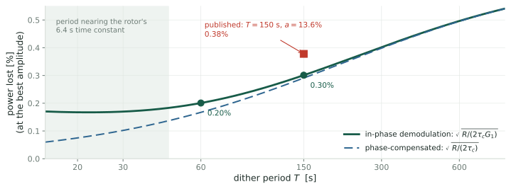

## The published program, and what it leaves open {.smaller}

Rotea's group maximizes the power of a turbine below rated wind speed by
extremum seeking [\[R17\]](#references), [\[CLR19\]](#references), [\[KR22\]](#references):

1. **The actuator** is the gain $u$ in the generator-torque law $\tau_g = u\Omega^2$,
   $\Omega$ the rotor speed. One gain, $u^\star$, maximizes the power.
2. **The probe.** A sinusoid of amplitude $a$ and period $T$, the **dither**, is added to $u$.
3. **The estimate.** Correlating the measured log-power with the dither over one
   period gives $\hat g$, an estimate of the slope of log-power with respect to $u$.
4. **The step.** Period after period, the gain moves along $\hat g$ toward $u^\star$.
5. **Published design** for the NREL 5 MW turbine [\[CLR19\]](#references): $T = 150$ s,
   $a = 13.6\%$ of $u^\star$, and a step size tuned in simulation.

::: claim
**What it leaves open.** The wind is random, so $\hat g$ scatters, the gain
scatters about $u^\star$ with it, and that costs power. The scatter has been
measured in simulation, never predicted, so $T$, $a$ and the step have no rule.
This deck predicts the scatter from the measured spectrum of atmospheric
turbulence and chooses the $T$, $a$ and step that lose the least power.
:::

## What the deck derives, in order {.smaller}

| part | goal | result (NREL 5 MW, $8$ m/s, turbulence intensity $10\%$) |
|---|---|---|
| **Links A, B** | reduce the wind's effect on $\hat g$ to one integral of the relative wind fluctuation | the noise in $\hat g$ is linear in the wind |
| **Links C, D** | the variance of that integral, from the spectrum of turbulence | the scatter of $\hat g$, within $1.2\%$ of simulation, with no fitted parameter |
| **The closed loop** | the noise that a loop settling over many periods actually averages | the wind's spectral density at the dither frequency, and nothing else |
| **Design** | the power lost as a function of $T$, $a$ and the tracking time, and its minimum | at a tracking time of one day, $T = 60$ s and $a = 9\%$ of $u^\star$ lose $0.20\%$ of the power; the published design loses $0.38\%$ |

::: claim
The same analysis accounts for the scatter reported in [\[CLR19\]](#references),
and it supplies the one number that a least-squares gradient estimator needs in
order to report its own error bars (companion deck
[Least Squares for the Gradient](q6-least-squares.html)).
:::

# Link A: reduce the randomness {.divider}

**Goal.** Show that at the optimum the wind enters log-power through a single
term, three times the relative wind fluctuation. **Why.** The noise in $\hat g$
then depends on the wind through one random process, whose spectrum is measured.

## What we need from the turbine {.smaller}

A wind turbine below rated wind speed. Write $\bar V$ for the mean wind speed,
$R$ for the rotor radius, $\Omega$ for the rotor angular speed, $\rho$ for air
density and $A = \pi R^2$ for the swept area. Define the **tip-speed ratio** and
the **power coefficient**:

$$\lambda := \frac{R\Omega}{V},
\qquad
P = \tfrac12\rho A V^3\,C_P(\lambda)$$

$C_P$ is a property of the blades. For the rotor studied here it has a single
maximum $C_P^{\max}$ at $\lambda = \lambda^\star$ (the curve's origin: A.0b). The controller's only actuator is the **torque gain**
$u$ in the generator-torque law $\tau_g = u\Omega^2$; setting $\dot\Omega = 0$
makes the rotor rest where $C_P(\lambda)/\lambda^3 = c\,u$ for a rotor constant
$c$ (derived in Appendix A.0), so $u$ selects an equilibrium
$\lambda_{\text{eq}}(u)$.

::: claim
Define the **objective** $J(u) := \ln C_P\big(\lambda_{\text{eq}}(u)\big)$, and
write $J'$, $J''$ for its first two derivatives in $u$. The optimum $u^\star$
is where $J'(u^\star) = 0$, equivalently $\lambda_{\text{eq}}(u^\star) =
\lambda^\star$. Numerically, for the NREL 5 MW rotor at $\bar V = 8$ m/s,
$J'' = -1.41\times10^{-13}$ in SI units.
:::

## The decomposition {.smaller}

Split the wind into a mean and a fluctuation about it:

$$V(t) = \bar V\big(1 + \varepsilon(t)\big),
\qquad
\varepsilon(t) := \frac{\tilde v(t)}{\bar V},
\qquad
\mathrm{TI} := \frac{\sigma_{\tilde v}}{\bar V} = \sigma_\varepsilon$$

$\tilde v$ is the fluctuating part in m/s, $\varepsilon$ its dimensionless
counterpart, and $\mathrm{TI}$ the **turbulence intensity**, $0.10$ in the case
studied here. For a random variable $x$, $\sigma_x :=
\sqrt{\mathbb{E}[x^2] - (\mathbb{E}[x])^2}$ is its **standard deviation**, written $\sigma(x)$ when $x$ is a compound
expression. For
a process $x(t)$ it is evaluated at a fixed $t$; the assumption that makes it
independent of $t$ is stated on *Link A, standing assumptions*. Since $\bar V :=
\mathbb{E}[V]$, both $\tilde v$ and $\varepsilon$ have mean zero, so
$\sigma_{\tilde v}^2 = \mathbb{E}[\tilde v^2]$ and $\sigma_\varepsilon^2 =
\mathbb{E}[\varepsilon^2]$.

::: {.remark}
The standard form is additive, $V = \bar V + \tilde v$, with the
statistics written for $\tilde v$ [\[IEC\]](#references). Dividing by the constant
$\bar V$ gives the form above: $\varepsilon = \tilde v/\bar V$ and
$\sigma_\varepsilon = \sigma_{\tilde v}/\bar V = \mathrm{TI}$.
:::

$\sigma_\varepsilon = 0.10$, so terms of second order in $\varepsilon$ have typical size
$\sigma_\varepsilon^2 = 0.01$ against $\sigma_\varepsilon = 0.10$ at first order. From
here on the wind enters only through $\varepsilon$.

## Link A, executed {.smaller}

From the definitions, $y = \ln P = \ln(\tfrac12\rho A) + 3\ln V + \ln C_P(\lambda)$.
Substituting $V = \bar V(1+\varepsilon)$ into the middle term, the logarithm of
the product splits, and $\ln(1+\varepsilon) = \varepsilon - \tfrac12\varepsilon^2 +
O(\varepsilon^3)$ for $|\varepsilon| < 1$:

$$3\ln V = 3\ln\bar V + 3\ln(1+\varepsilon)
= \underbrace{3\ln\bar V}_{\text{constant}} + 3\varepsilon
\;\underbrace{-\;\tfrac32\varepsilon^2 + O(\varepsilon^3)}_{\text{second order}}$$

The second-order part has typical size $\tfrac32\sigma_\varepsilon^2 = 0.015$,
against $3\sigma_\varepsilon = 0.30$ for the linear term $3\varepsilon$.

The third term, $\ln C_P(\lambda)$, also depends on the wind, through
$\lambda = R\Omega/V$. Both wind-dependent terms are expanded under four
standing assumptions, stated on the next slide; the third term is then handled
on the slide after.

## Link A, standing assumptions {.smaller}

In force through Links A and B.

1. **The gain is held fixed**: $u(t) = u$ on the whole interval considered.
   A.10 adds the dither and bounds its effect.
2. **$\varepsilon$ is strictly stationary**: for every $k$, every
   $s_1,\dots,s_k$ and every shift $\tau$, the vector
   $(\varepsilon(s_1+\tau),\dots,\varepsilon(s_k+\tau))$ has the same joint
   distribution as $(\varepsilon(s_1),\dots,\varepsilon(s_k))$.
3. **$\mathbb{E}[\cdot]$ is the expectation with respect to that law.** For
   fixed $t$, $\mathbb{E}[\lambda(t)]$ averages the random variable $\lambda(t)$
   over the distribution of the wind. It is a number.
4. **The rotor has forgotten its initial condition.** Linearized about its
   equilibrium (A.0c), the rotor equation reads $\dot{\delta\Omega} +
   \delta\Omega/\tau_{\text{rotor}} = b\,\varepsilon(t)$, with $\delta\Omega :=
   \Omega - \Omega_{\text{eq}}$, $\tau_{\text{rotor}} = 6.4$ s at $8$ m/s, and $b$ a
   constant (both in A.0c). Its solution from $t = 0$ is
   $$\delta\Omega(t) = e^{-t/\tau_{\text{rotor}}}\,\delta\Omega(0)
   + b\int_0^t e^{-(t-s)/\tau_{\text{rotor}}}\,\varepsilon(s)\,ds$$
   The first term is deterministic and falls below $1\%$ of $\delta\Omega(0)$
   after $5\tau_{\text{rotor}} = 32$ s. Assumption 4 is that this has happened,
   so $\Omega(t)$ is the second term alone: a causal, time-invariant functional
   of the wind path $\{\varepsilon(s): s\le t\}$. The rotor still lags the wind;
   the lag is the exponential weight itself.

::: claim
Under 1 to 4, $V(t) = \bar V(1+\varepsilon(t))$, $\Omega(t)$, hence
$\lambda(t) = R\Omega(t)/V(t)$ and $y(t)$, are obtained from the wind path up to
$t$ by rules that do not change with $t$. Assumption 2 then gives each of them
the same law at every $t$, so $\mathbb{E}[\lambda(t)]$ and $\mathbb{E}[y(t)]$ are
constants.
:::

## Link A, executed, continued {.smaller}

With $u$ fixed, $\lambda(t)$ fluctuates only because the wind does. Write
$\bar\lambda := \mathbb{E}[\lambda(t)]$, a constant by the previous slide, and
$\delta\lambda := \lambda - \bar\lambda$. Two limits of the rotor's response
bracket $\delta\lambda$:

- **Frozen $\Omega$.** With $\lambda_0 := R\Omega/\bar V$ and $1/(1+\varepsilon) = 1 - \varepsilon + O(\varepsilon^2)$,
  $$\lambda = \frac{R\Omega}{\bar V(1+\varepsilon)} = \lambda_0\big(1 - \varepsilon + O(\varepsilon^2)\big),
  \qquad \bar\lambda = \lambda_0\big(1 + O(\sigma_\varepsilon^2)\big),
  \qquad \delta\lambda = -\bar\lambda\,\varepsilon + O(\varepsilon^2)$$
- **$\Omega$ tracking the equilibrium.** $\delta\lambda = 0$, since
  $\lambda_{\text{eq}}(u)$ depends on $u$ alone (A.0).

In both, and in between, $\delta\lambda = O(\varepsilon)$. Expanding about $\bar\lambda$:

$$\ln C_P(\bar\lambda + \delta\lambda)
= \ln C_P(\bar\lambda)
+ \frac{C_P'(\bar\lambda)}{C_P(\bar\lambda)}\,\delta\lambda
+ O(\delta\lambda^2)$$

::: claim
The next slide evaluates the two terms of this expansion at the optimum. Away
from it, $C_P'(\bar\lambda)$ is a fixed nonzero number, $\delta\lambda = O(\varepsilon)$,
and their product, the linear term, is $O(\varepsilon)$: a fluctuation of the same
order as $3\varepsilon$, with a coefficient set by how far off the gain sits.
:::

## Link A, executed, concluded {.smaller}

**At the optimum**, $u = u^\star$ (*What we need from the turbine*), so
$\lambda_{\text{eq}}(u) = \lambda^\star$, and $d := \bar\lambda - \lambda^\star$ is a
number with $d = O(\sigma_\varepsilon^2)$ (A.0d). Three steps.

1. **The coefficient of the linear term.** Taylor-expand $C_P'$ about $\lambda^\star$,
   where $C_P'(\lambda^\star) = 0$ and $C_P''(\lambda^\star) = -0.055$ is a fixed number
   (A.0b, continued):
   $$C_P'(\bar\lambda) = C_P'(\lambda^\star) + C_P''(\lambda^\star)\,d + O(d^2)
   = C_P''(\lambda^\star)\,d + O(\sigma_\varepsilon^4) = O(\sigma_\varepsilon^2)$$
2. **The linear term.** $\dfrac{C_P'(\bar\lambda)}{C_P(\bar\lambda)}\,\delta\lambda
   = O(\sigma_\varepsilon^2)\cdot O(\varepsilon) = O(\sigma_\varepsilon^2\,\varepsilon)$.
3. **The Taylor remainder.** $O(\delta\lambda^2) = O(\varepsilon^2)$, because
   $\delta\lambda = O(\varepsilon)$ (previous slide).

Collecting the three terms of $y$ from *Link A, executed*:

$$y = \underbrace{\ln(\tfrac12\rho A) + 3\ln\bar V + \ln C_P(\bar\lambda)}_{\text{constant}}
\;+\; 3\varepsilon(t) \;+\; r(t),
\qquad
r := -\tfrac32\varepsilon^2 + O(\varepsilon^3) + O(\sigma_\varepsilon^2\,\varepsilon) + O(\delta\lambda^2)$$

::: claim
$\mathbb{E}[3\varepsilon] = 0$, so $\mathbb{E}[y]$ is the constant plus
$\mathbb{E}[r]$, and
$$y(t) - \mathbb{E}[y] = 3\varepsilon(t) + \big(r(t) - \mathbb{E}[r]\big)$$
Every piece of $r$ is a product of at least two factors of size
$\sigma_\varepsilon$, so $\sigma(r - \mathbb{E}r) = O(\sigma_\varepsilon^2)
\approx 0.01$ against $\sigma(3\varepsilon) = 3\sigma_\varepsilon = 0.30$.
This is what $y - \mathbb{E}[y] = 3\varepsilon + O(\varepsilon^2)$ means
wherever it is quoted below: **one term, one random process.**
:::

# Link B: make it a linear functional {.divider}

**Goal.** Write the noise in $\hat g$ as one integral of $\varepsilon$ against the
dither. **Why.** The variance of such an integral follows from $\varepsilon$'s
spectrum, which is Link C.

## What we need from the estimator {.smaller}

Extremum seeking perturbs the gain with a sinusoid of **amplitude** $a$ and
**period** $T$. Time is cut into dither periods $[nT,(n+1)T)$, $n = 0,1,2,\dots$;
$u_n$ is the gain about which the $n$-th period dithers, and the measured
log-power is correlated against the sinusoid over exactly that period (written
below with the period's own clock, $t \in [0,T]$):

$$u(t) = u_n + a\sin\omega t,
\qquad
\omega := \frac{2\pi}{T},
\qquad
f_1 := \frac{1}{T} = \frac{\omega}{2\pi}$$

$\omega$ is the dither's angular frequency (rad/s) and $f_1$ the **dither
frequency** in hertz; both are fixed numbers throughout, $f_1 = 6.7\times10^{-3}$
Hz at $T = 150$ s.

$$y(t) := \ln P(t),
\qquad
\hat g_n := \frac{1}{T}\int_0^T y(t)\,\frac{2}{a}\sin\omega t\;dt$$

Why that integral is a gradient estimate, and why the factor is $2/a$, is
Appendix A.1.

::: claim
$\hat g_n$ is an estimate of $J'(u_n)$. Its **mean** error is the
finite-amplitude bias $\tfrac{a^2}{8}J'''$, derived on *The bias grows as $a^2$*; its **scatter**, which is what this
deck computes, comes entirely from the wind. Published values for the NREL 5 MW
case [\[CLR19\]](#references): $T = 150$ s and $a = 13.6\%$ of $u^\star$.
:::

::: {.notes}
Two conventions fixed here and used throughout. The correlation window is
exactly one dither period, which matters in Link C because it fixes the
shape of the frequency window. And the demodulating signal is in phase with the
dither, which is what makes the estimator pick out the first harmonic.
:::

## Link B, executed {.smaller}

Write the log-power over one period as three parts. $y_0(t)$ is its value with
$\varepsilon \equiv 0$, a deterministic $T$-periodic function of the dither; the
wind adds $3\varepsilon(t)$ and the remainder $r(t)$ of *Link A, executed,
concluded*. That decomposition holds **at the optimum**, so Link B and
everything built on it describe the estimator's noise with the gain at
$u^\star$: the terminal scatter. (With a rotor that tracks its equilibrium it
holds at every $u$, since $\ln C_P(\lambda_{\text{eq}}(u))$ is then constant.)

$$y(t) = y_0(t) + 3\varepsilon(t) + r(t)$$

The estimator is linear in $y$, so it splits the same way:

$$\hat g = \underbrace{\frac{2}{aT}\int_0^T y_0\sin\omega t\,dt}_{\hat g_{\text{det}}}
+ \underbrace{\frac{6}{aT}\int_0^T \varepsilon(t)\sin\omega t\,dt}_{\hat g_{\text{noise}}}
+ \underbrace{\frac{2}{aT}\int_0^T r\sin\omega t\,dt}_{\hat g_r}$$

$\hat g_{\text{det}}$ is a number (A.1). $\hat g_r$ adds $2.6\%$ to the scatter at
$\mathrm{TI} = 0.10$ (A.8); the dither's own effect on the wind term is part of $r$
and modulates it by at most $10\%$ (A.10). The deck computes the scatter of the middle term:

$$\hat g_{\text{noise}} = \frac{6}{aT}\,Z,
\qquad
Z := \int_0^T \varepsilon(t)\,\sin\omega t\,dt$$

## Link B, executed, continued {.smaller}

$Z$ is a scalar random variable: the wind fluctuation over one period, weighted
by the dither and integrated.

- **Mean.** $\sin\omega t$ is deterministic and $\mathbb{E}[\varepsilon(t)] = 0$ at every $t$, so
  $$\mathbb{E}[Z] = \int_0^T \mathbb{E}[\varepsilon(t)]\,\sin\omega t\,dt = 0,
  \qquad\text{hence}\qquad \operatorname{Var}(Z) = \mathbb{E}[Z^2]$$
- **$Z^2$ as a double integral.** $Z^2 = Z\cdot Z$; name the two dummy variables
  $t$ and $s$. For a fixed realization each factor is a number independent of the
  other's variable, so each moves inside the other's integral. The iterated
  integral equals the double integral over $[0,T]^2$, the integrand being
  bounded there.
- **The autocovariance.** Under standing assumption 2,
  $\mathbb{E}[\varepsilon(t)\varepsilon(s)]$ depends on $t, s$ only through $t-s$.
  Define $\Gamma(t-s) := \mathbb{E}[\varepsilon(t)\varepsilon(s)]$; then $\Gamma(0) = \sigma_\varepsilon^2$.
- **Expectation inside the integral** (Fubini's theorem; its condition is checked in A.11).
  $$\operatorname{Var}(Z)
  = \mathbb{E}\!\left[\iint_{[0,T]^2}\! \sin\omega t\,\sin\omega s\;\varepsilon(t)\varepsilon(s)\,dt\,ds\right]
  = \iint_{[0,T]^2}\! \sin\omega t\,\sin\omega s\;\Gamma(t-s)\,dt\,ds$$

# Link C: $\operatorname{Var}(Z)$ in the frequency domain {.divider}

**Goal.** The variance of an integral of $\varepsilon$ against any fixed weight,
from $\varepsilon$'s spectral density. **Why.** The estimator is such an integral
over one period, and the loop, as shown later, is one over many periods.

## The power spectral density {.smaller}

Standing assumption 2 (*Link A, standing assumptions*): $\varepsilon$ is
**strictly stationary**, meaning that for every $k$, every $s_1,\dots,s_k$ and
every shift $\tau$, $(\varepsilon(s_1+\tau),\dots,\varepsilon(s_k+\tau))$ has the same
joint distribution as $(\varepsilon(s_1),\dots,\varepsilon(s_k))$. Two consequences,
together called **wide-sense stationarity**:

- **One time point** ($k = 1$ in the definition): $\varepsilon(t)$ has the same law
  at every $t$, so $\mathbb{E}[\varepsilon] = 0$ by construction of $\varepsilon$.
- **Two time points** ($k = 2$): shifting by $\tau = -s$,
  $\mathbb{E}[\varepsilon(t)\varepsilon(s)] = \mathbb{E}[\varepsilon(t-s)\varepsilon(0)] =: \Gamma(t-s)$,
  the autocovariance of *Link B, executed, continued*. Shifting by $\tau$ instead,
  $\Gamma(-\tau) = \mathbb{E}[\varepsilon(t)\varepsilon(t-\tau)] = \mathbb{E}[\varepsilon(t+\tau)\varepsilon(t)] = \Gamma(\tau)$:
  $\Gamma$ is even.

Define, as the Fourier transform of $\Gamma$, the **power spectral density**.
The superscript $2s$ marks it as **two-sided**: a function of every $f \in
\mathbb{R}$, negative frequencies included. Standards tabulate a one-sided
version $S$ on $f > 0$, related on the next slide.

$$\Gamma(\tau) := \mathbb{E}\big[\varepsilon(t)\,\varepsilon(t+\tau)\big],
\qquad
S^{2s}(f) := \int_{-\infty}^{\infty}\! \Gamma(\tau)e^{-i2\pi f\tau}d\tau,
\qquad
\Gamma(\tau) = \int_{-\infty}^{\infty}\! S^{2s}(f)e^{i2\pi f\tau}df$$

::: claim
The pair is the **Wiener-Khinchin theorem**: for $\Gamma \in L^1(\mathbb{R})$
the transform $S^{2s}$ exists, is real, even and **nonnegative**, and the
inversion formula holds. Setting $\tau = 0$ in the inversion gives
$\Gamma(0) = \sigma_\varepsilon^2 = \int S^{2s}df$. "Density" means density of
**variance over frequency**, in units of variance per hertz: $S^{2s}(f)\,df$ is the
variance carried by frequencies in $[f, f+df]$, made precise in A.9 (a filter
passing only a band leaves a process of variance $\int_{\text{band}}S^{2s}df$).
:::

::: {.notes}
Links C and D use only wide-sense stationarity. Strict stationarity entered
once, on Link A, to make the means of nonlinear functions of the path constant
in time. Stationarity is defensible over the ten-minute scales the
dither operates on and false over a day, which is a limit on the result rather
than on the derivation.
:::

## One-sided and two-sided densities {.smaller}

**Frequency in hertz.** Transforms are taken over $f$ (cycles per second), with
$e^{\mp i2\pi f\tau}$ in the kernels: the turbulence standards tabulate spectra
this way, and the transform pair then carries no factor $1/2\pi$.

**One-sided and two-sided.** $\Gamma$ is real and even, so $S^{2s}$ is real and
even. Tables therefore fold the negative frequencies onto the positive ones and
quote the **one-sided** density:

$$S(f) := 2\,S^{2s}(f)\quad (f>0),
\qquad\text{so}\qquad
\sigma_\varepsilon^2 = \int_{-\infty}^{\infty}\!S^{2s}(f)\,df = \int_0^{\infty}\! S(f)\,df$$

::: {.warn}
Everything quoted from a standard is **one-sided**; every integral over all of
$\mathbb{R}$ below needs **two-sided**. The conversion $S^{2s} = \tfrac12 S$ is
applied once, explicitly, at the point of use.
:::

Units: $\varepsilon$ is dimensionless, so $[\Gamma] = 1$, $[S] = \text{Hz}^{-1}$, and
$\int S\,df$ is dimensionless.

## Link C, executed {.smaller}

Start from Link B, $\operatorname{Var}(Z) = \iint_{[0,T]^2}\sin\omega t\,\sin\omega s\;\Gamma(t-s)\,dt\,ds$.

1. **Substitute the inversion formula** $\Gamma(t-s) = \int_{\mathbb{R}} S^{2s}(f)\,e^{i2\pi f(t-s)}df$
   and split the exponential, $e^{i2\pi f(t-s)} = e^{i2\pi ft}\,e^{-i2\pi fs}$:
   $$\operatorname{Var}(Z) = \iint_{[0,T]^2}\sin\omega t\,\sin\omega s\int_{\mathbb{R}} S^{2s}(f)\,e^{i2\pi ft}\,e^{-i2\pi fs}\,df\,dt\,ds$$
2. **Move the $f$-integral outside** (Fubini; the condition is checked below). The
   $t$ and $s$ integrals then separate:
   $$\operatorname{Var}(Z) = \int_{\mathbb{R}} S^{2s}(f)
   \left[\int_0^T\sin\omega t\,e^{i2\pi ft}dt\right]\left[\int_0^T\sin\omega s\,e^{-i2\pi fs}ds\right]df$$
3. **Name the brackets.** Define the **window** $w(t) := \sin\omega t$ for $0 \le t \le T$
   and $w(t) := 0$ otherwise, and its Fourier transform
   $\hat w(f) := \int_{\mathbb{R}} w(t)\,e^{-i2\pi ft}dt = \int_0^T\sin\omega t\,e^{-i2\pi ft}dt$
   (closed form in A.3). The second bracket is $\hat w(f)$; the first is its complex
   conjugate $\overline{\hat w(f)}$, because $w$ is real. Their product is $|\hat w(f)|^2$:
   $$\boxed{\;\operatorname{Var}(Z) = \int_{\mathbb{R}} S^{2s}(f)\,|\hat w(f)|^2\,df\;}$$
4. **Fubini's condition.** $\iiint|S^{2s}(f)\,\sin\omega t\,\sin\omega s\,e^{i2\pi f(t-s)}|\,dt\,ds\,df
   \le T^2\int_{\mathbb{R}}S^{2s}\,df = \sigma_\varepsilon^2T^2 < \infty$, using $S^{2s} \ge 0$
   and $|\sin|, |e^{i\theta}| \le 1$.

## Link C, bottom line {.smaller}

::: claim
**Result.** Steps 1 to 4 used only that the weight is real, bounded and zero
outside a finite interval. So for any such weight $w$,
$$\operatorname{Var}\Big(\int_{\mathbb{R}} w(t)\,\varepsilon(t)\,dt\Big) = \int_{\mathbb{R}} S^{2s}(f)\,|\hat w(f)|^2\,df$$
and for one period, $w = \sin\omega t$ on $[0,T]$,
$$\sigma(\hat g_{\text{noise}}) = \frac{6}{aT}\sqrt{\int_{\mathbb{R}} S^{2s}(f)\,|\hat w(f)|^2\,df},
\qquad |\hat w(f)|^2 = \frac{4\omega^2\sin^2(\pi fT)}{(\omega^2 - 4\pi^2f^2)^2}\ \text{(A.3)}$$
:::

- **Reading.** The noise variance is the wind's density, weighted by how much of
  each frequency the window lets through.
- **The window.** An unending sine admits the frequency $f_1$ alone. One period of
  it admits the band $[0, 2f_1]$, with total weight $T/2$ (Parseval, A.3). The loop
  section turns on this difference.
- **Needed next:** $S^{2s}$ of the actual wind, which is Link D.
- **Away from $u^\star$** the wind also enters through $\lambda$; within the loop's
  terminal scatter this changes the noise by about $1\%$ (A.14).

# Link D: the wind's spectral density {.divider}

**Goal.** Put in the measured spectrum of atmospheric turbulence, evaluate the
variance, and check it against simulation.

## The Kaimal spectrum {.smaller}

A specific one-parameter model for $S$, fitted by Kaimal, Wyngaard, Izumi and
Cot&eacute; [\[KWIC72\]](#references) to the 1968 Kansas boundary-layer measurements and adopted
by IEC 61400-1 [\[IEC\]](#references) as its normal turbulence model. In terms of $\varepsilon$:

$$\boxed{\;S_\varepsilon(f) = \mathrm{TI}^2\;\frac{4L/\bar V}{\big(1+6fL/\bar V\big)^{5/3}}\;}
\qquad f \ge 0,\ \text{one-sided}$$

$L$ is the **integral length scale**: $\bar V$ times the wind's correlation time
$\int_0^\infty\Gamma(\tau)\,d\tau/\Gamma(0)$, the size of the eddies carried past the
rotor. Every piece of the formula is forced or measured:

::: {.cols3}
::: {.card}
[$4L/\bar V$]{.cardh}

The value at $f = 0$ that any density with integral length scale $L$ must
take (A.13).
:::

::: {.card}
[exponent $5/3$]{.cardh}

Kolmogorov's inertial-subrange law, $S\propto f^{-5/3}$, which the data follow
above the corner.
:::

::: {.card}
[the $6$]{.cardh}

The one empirical number. It places the **corner**, the frequency
$f = \bar V/6L$ at which $6fL/\bar V = 1$: below it the density is flat, above
it the density falls.
:::
:::

::: claim
It is correctly normalized: substituting $x = 6fL/\bar V$,
$\int_0^{\infty}\! S_\varepsilon df = \tfrac{2}{3}\int_0^\infty (1+x)^{-5/3}dx
= \tfrac23\cdot\tfrac32\,\mathrm{TI}^2 = \mathrm{TI}^2$, as the definition of
$\mathrm{TI}$ demands.
:::

## Where the dither frequencies sit {.smaller}

{.fig-hero fig-alt="The Kaimal one-sided density on log-log axes: flat below a corner frequency near 0.004 Hz, then falling as f to the minus five thirds. The dither frequencies of 600, 150 and 60 second periods are marked on the curve, the shorter periods on the falling part."}

[\[IEC\]](#references) fixes $L$ from the hub height $z$: $L = 8.1\Lambda_1$ with
$\Lambda_1 = 0.7\min(z,60)$ m. For the NREL 5 MW rotor, $z = 90$ m gives $L = 340$ m.

::: claim
At $\bar V = 8$ m/s the corner sits at $\bar V/6L = 3.9\times10^{-3}$ Hz. Above it the
density falls as $f^{-5/3}$: at the published $f_1 = 1/150$ s it is $3.0$ times its
value at $1/60$ s. The Design section exploits that fall.
:::

## The answer {.smaller}

The exact integral, evaluated numerically, against a direct simulation of the
turbine under synthesized Kaimal inflow, at the published $a = 0.136\,u^\star$
($240$ periods per row, so a simulated $\sigma$ carries a sampling uncertainty of
about $1/\sqrt{2\cdot240} = 4.6\%$):

| $T$ | $\operatorname{Var}(Z)$ | $\sigma(\hat g)$ predicted | $\sigma(\hat g)$ simulated | predicted/simulated |
|---|---|---|---|---|
| $150$ s | $15.65$ | $5.21{\times}10^{-7}$ | $5.23{\times}10^{-7}$ | $0.995$ |
| $300$ s | $53.08$ | $4.80{\times}10^{-7}$ | $4.84{\times}10^{-7}$ | $0.992$ |
| $600$ s | $152.9$ | $4.07{\times}10^{-7}$ | $4.12{\times}10^{-7}$ | $0.988$ |

::: claim
$$\boxed{\;\sigma(\hat g) = \frac{6}{aT}\sqrt{\int_{\mathbb{R}}\tfrac12 S_\varepsilon(f)\,|\hat w(f)|^2\,df}\;}$$
Within $1.2\%$ of simulation across a fourfold range of $T$, with no fitted
parameter: $\mathrm{TI}$, $L$ and the exponent $5/3$ come from the standard and from
turbulence theory, $T$ and $a$ from the published design. In units of the gain,
$\sigma(\hat g)/|J''| = 1.7\,u^\star$ at $T = 150$ s: one period's estimate is far
too noisy to step on alone, and the loop reaches a scatter of a few percent of
$u^\star$ only by averaging over many periods (next section).
:::

## Every link holds {.smaller}

The turbine is integrated with an adaptive solver under synthesized Kaimal inflow
(A.12): $240$ periods of $T = 150$ s at $\bar V = 8$ m/s, with realized turbulence
intensity $9.86\%$ and the gain held at $u^\star$ so that the estimator is
tested alone. Each link is tested separately, so that a failure can be attributed.

| link | claim | test | predicted | measured | ratio |
|---|---|---|---|---|---|
| **A** | $y-\mathbb{E}[y] = 3\varepsilon$ | regress $y$ on the recorded $\varepsilon$ | slope $3$ | slope $3.083$, $r = 0.9915$ | $1.037$ |
| **C** | $\operatorname{Var}Z = \int S^{2s}\vert\hat w\vert^2 df$ | sample variance of $Z$ | $15.65$ | $15.01$ | $0.959$ |
| **D** | $\sigma(\hat g) = \tfrac{6}{aT}\sqrt{\operatorname{Var}Z}$ | sample deviation of $\hat g$ | $5.21{\times}10^{-7}$ | $5.23{\times}10^{-7}$ | $1.005$ |

::: claim
All three within $5\%$. Link B is algebra given A, $\hat g_{\text{noise}} = \tfrac{6}{aT}Z$
by linearity of the estimator, and is tested through D. The ratio on A is
$\sigma(y)/\sigma(3\varepsilon)$.
:::

## Every link holds, continued {.smaller}

{.fig-hero fig-alt="Left, a scatter of the log-power fluctuation against three times the wind fluctuation, with the predicted unit-slope line and a fitted line of slope 3.08 lying almost on top of each other, correlation 0.9915. Right, three bars giving measured over predicted for links A, C and D: 1.037, 0.959 and 1.005, all inside a shaded five percent band."}

- **The $3.7\%$ on A.** The slope exceeds $3$ by $2.8\%$: the $O(\sigma_\varepsilon^2\varepsilon)$
  term of *Link A, executed, concluded*, $\kappa_2\sigma_\varepsilon^2\varepsilon = 0.063\,\varepsilon$ for a
  frozen rotor and $0$ for a tracking one. The rest is the remainder uncorrelated
  with $\varepsilon$, $\sqrt{1-r^2} = 13\%$ of $\sigma(y)$: $\sqrt{1.028^2 + 0.13^2} = 1.037$.
- **Row D** compares the total scatter, remainder included, with the prediction
  for $\hat g_{\text{noise}}$ alone: the remainder adds $2.6\%$ (A.8) and Link C's
  sample falls $2\%$ short, $1.026\times\sqrt{0.959} = 1.005$.

# The closed loop {.divider}

**Goal.** The loop steps on hundreds of estimates before it settles. Find the
noise it actually averages, and the scatter it leaves in the gain: that scatter
is what costs power.

## The bias grows as $a^2$ {.smaller}

Link B wrote $\hat g = \hat g_{\text{det}} + \hat g_{\text{noise}} + \hat g_r$. Both
wind-driven parts have mean zero, $\mathbb{E}[Z] = 0$ and
$\mathbb{E}[\hat g_r] = \tfrac{2}{aT}\mathbb{E}[r]\int_0^T\sin\omega t\,dt = 0$, so
$\mathbb{E}[\hat g] = \hat g_{\text{det}}$ and the **bias** is
$\operatorname{Bias} := \hat g_{\text{det}} - J'(u)$. By A.1,
$\hat g_{\text{det}} = \tfrac{2}{aT}\int_0^T J(u + a\sin\omega t)\sin\omega t\,dt$.

With $s := \sin\omega t$, $\langle\cdot\rangle := \tfrac1T\int_0^T(\cdot)\,dt$, and the moments
of a sine over a whole period (A.2),

$$\langle s\rangle = 0,\qquad \langle s^2\rangle = \tfrac12,\qquad
\langle s^3\rangle = 0,\qquad \langle s^4\rangle = \tfrac38$$

expand $J(u + as) = J + J'as + \tfrac{J''}{2}a^2s^2 + \tfrac{J'''}{6}a^3s^3 +
O(a^4)$, multiply by $\tfrac{2}{a}s$ and average:

$$\hat g_{\text{det}} = \frac2a\Big[J\langle s\rangle + J'a\langle s^2\rangle
+ \tfrac{J''}{2}a^2\langle s^3\rangle + \tfrac{J'''}{6}a^3\langle s^4\rangle\Big] + O(a^4)
= J' + \frac{a^2}{8}J''' + O(a^4)$$

::: claim
$$\operatorname{Bias}(\hat g) = \frac{a^2}{8}\,J'''(u) + O(a^4),
\qquad
\sigma(\hat g_{\text{noise}}) = \frac{6}{aT}\,\sigma(Z) \propto \frac1a$$
The bias grows with the probe; the scatter falls with it, because $Z$ does not
involve $a$. Checked numerically on a cubic $J$, where $J'''$ is exact: agreement
to six digits at $a = 0.02$, $0.05$, $0.10$.
:::

## The closed loop {.smaller}

1. **The update.** $u_{n+1} = u_n + \kappa\,\hat g_n$, with a constant step $\kappa > 0$
   and $\tilde u_n := u_n - u^\star$.
2. **The mean of $\hat g_n$ near $u^\star$.** $J'(u_n) = J''\tilde u_n + O(\tilde u_n^2)$ with
   $J'' < 0$. The rotor follows the dither with a lag, which scales the part of the
   power in phase with the dither by (A.0c, continued)
   $$G_1 := \frac{1}{1 + (2\pi\tau_{\text{rotor}}/T)^2}:\qquad
   \mathbb{E}[\hat g_n] = G_1\big(J''\tilde u_n + \operatorname{Bias}\big)$$
   $G_1 = 0.93$ at $T = 150$ s and $0.69$ at $60$ s. The bias shifts the fixed point to
   $\tilde u = -a^2J'''/(8J'')$ and is set aside here.
3. **The recursion.** With $K := \kappa\,G_1|J''|$, the fraction of the error removed per period,
   $$\tilde u_{n+1} = (1-K)\,\tilde u_n + \kappa\,e_n,
   \qquad e_n := \hat g_{\text{noise},n} + \hat g_{r,n}$$
4. **Its stationary variance** (A.4), with $\rho_k$ the correlation between
   estimates $k$ periods apart (A.6):
   $$\operatorname{Var}(\tilde u) = \frac{\kappa^2\sigma^2(\hat g)}{K(2-K)}\Big[1 + 2\sum_{k\ge1}(1-K)^k\rho_k\Big]$$

::: claim
**Two regimes.** A **fast loop**, $K$ near $1$, weights only $k = 0$: one period's
$\sigma(\hat g)$ sets the scatter. A **slow loop**, $K \ll 1$, has $(1-K)^k \approx 1$
wherever $\rho_k$ is nonzero, and the bracket tends to $1 + 2\sum_{k\ge1}\rho_k$: the
scatter is set by the **long-run variance**
$\sigma_\infty^2(\hat g) := \sigma^2(\hat g)\big[1 + 2\sum_{k\ge1}\rho_k\big]$, and
$\operatorname{Var}(\tilde u) \approx \tfrac{K}{2}\,\sigma_\infty^2(\hat g)/(G_1J'')^2$.
:::

## The noise a slow loop averages {.smaller}

**Goal:** $\sigma_\infty^2$ in closed form. **Route:** the mean of $N$ consecutive
estimates is a single estimate over a window $N$ periods long, and Link C gives
its variance.

1. **The mean of $N$ estimates is one window.** The dither $\sin\omega t$ runs on
   across period boundaries, so
   $$\bar{\hat g}_N := \frac1N\sum_{n=0}^{N-1}\hat g_n = \frac{2}{aNT}\int_0^{NT}y(t)\sin\omega t\,dt,
   \qquad \text{noise part } \frac{6}{aNT}\int_0^{NT}\varepsilon(t)\sin\omega t\,dt$$
2. **Its variance,** by Link C with the window $w_N := \sin\omega t$ on $[0, NT]$ (A.3):
   $$\operatorname{Var}(\bar{\hat g}_N) = \Big(\frac{6}{aNT}\Big)^2\int_{\mathbb{R}} S^{2s}(f)\,|\hat w_N(f)|^2\,df,
   \qquad |\hat w_N(f)|^2 = \frac{4\omega^2\sin^2(\pi fNT)}{(\omega^2 - 4\pi^2f^2)^2}$$
3. **The window narrows onto $\pm f_1$.** Its total area is $NT/2$ (Parseval, A.3).
   Away from $\pm f_1$ it stays below $4\omega^2/(\omega^2 - 4\pi^2f^2)^2$, a bound free of
   $N$, so as $N$ grows its area gathers at $\pm f_1$, $NT/4$ at each:
   $\int S^{2s}|\hat w_N|^2df = S^{2s}(f_1)\,NT/2 + o(N)$.
4. **Multiply by $N$ and let $N \to \infty$.** By A.7, $N\operatorname{Var}(\bar{\hat g}_N) \to \sigma_\infty^2(\hat g)$. Hence
   $$\boxed{\;\sigma_\infty^2(\hat g) = \lim_{N\to\infty}N\Big(\frac{6}{aNT}\Big)^2S^{2s}(f_1)\,\frac{NT}{2} = \frac{2R}{a^2T},
   \qquad R := 9\,S^{2s}(f_1)\;}$$
   $R$ is the two-sided density, at the dither frequency, of the wind's term $3\varepsilon$ in log-power.

## The noise a slow loop averages, continued {.smaller}

{.fig-hero fig-alt="Window weights against frequency in units of the dither frequency, over the Kaimal density normalized at the dither frequency. One period's window is a broad lobe from zero to twice the dither frequency; four periods' window is a narrow peak at the dither frequency. The density rises steeply toward zero frequency."}

- **One period** (violet) admits the band $[0, 2f_1]$, and below $f_1$ the density (green)
  rises to $5.2$ times its value at $f_1$: one period's variance exceeds the long-run value.
  **Four periods** (red) already admit little beyond $f_1$.
- In time: adjacent estimates correlate at $\rho_1 = -0.10$ ($T = 150$ s, A.6), so their
  low-frequency parts cancel in the average. $\sigma_\infty^2/\sigma^2(\hat g) = 0.66$, $0.78$, $0.92$ at $T = 60$, $150$, $600$ s.

## Checked: the scatter of the loop {.smaller}

The linearized loop of *The closed loop*, driven period by period by $Z_n$ from
synthesized Kaimal wind (A.12), with $a = 0.136\,u^\star$ and $K = T/86\,400$ s (the loop
forgets its state in one day); $24$ records of $20$ days per row, so a measured
$\sigma(\tilde u)$ carries a sampling uncertainty of about $3.5\%$:

| $T$ | $\sigma(\tilde u)/u^\star$ measured | predicted from $\sigma_\infty$ | predicted from one period's $\sigma$ | long-run variance of $Z$: measured / $S^{2s}(f_1)T/2$ |
|---|---|---|---|---|
| $60$ s | $0.0257$ | $0.0247$ | $0.0304$ | $1.585$ / $1.608$ |
| $150$ s | $0.0427$ | $0.0431$ | $0.0488$ | $12.02$ / $12.18$ |
| $600$ s | $0.0693$ | $0.0735$ | $0.0764$ | $133.7$ / $141.3$ |

::: claim
The long-run prediction holds to within $4\%$ at $60$ and $150$ s, where one period's
variance overstates the scatter by $18\%$ and $14\%$. On the full nonlinear turbine
in closed loop ($K = 0.015$, $T = 600$ s, $270$ periods) the measured scatter is $0.76$
of the prediction, against $0.79$ expected from so short a record (A.5).
:::

# Design {.divider}

**Goal.** Choose the period, the amplitude and the step so that the loop loses
the least power while still tracking the optimum in a required time.

## Design, the objective: Power lost, in two parts {.smaller}

1. **Loss in terms of $J$.** $J = \ln C_P$, so $J(u^\star) - J$ is the relative power
   loss at the operating point (for a small loss, $-\ln(1-x) \approx x$).
2. **What the rotor sees.** The gain is $u^\star + \tilde u + a\sin\omega t$. The rotor
   follows the slow $\tilde u$ fully and the dither through its lag, which scales the
   dither's effect on $\lambda$ by $|G| = \sqrt{G_1}$ and delays it by $\varphi$ (A.0c,
   continued). So $\lambda$ sits at $\lambda_{\text{eq}}\big(u^\star + \tilde u + a\sqrt{G_1}\sin(\omega t - \varphi)\big)$.
3. **Expand about $u^\star$**, where $J' = 0$:
   $$J(u^\star) - J = \tfrac12|J''|\big(\tilde u + a\sqrt{G_1}\sin(\omega t-\varphi)\big)^2 + O\big((\tilde u + a)^3\big)$$
4. **Average** over the wind ($\mathbb{E}[\tilde u] = 0$ at the fixed point, up to the bias
   shift) and over one period ($\langle\sin^2\rangle = \tfrac12$, $\langle\sin\rangle = 0$):
   $$\boxed{\;\text{loss} = \tfrac12|J''|\operatorname{Var}(\tilde u) + \tfrac14|J''|\,G_1a^2\;}$$
   the first term from the gain wandering about $u^\star$, the second from the dither itself.
5. **Scale.** $|J''|u^{\star2} = 0.70$ (NREL 5 MW), so $\sigma(\tilde u) = 0.10\,u^\star$ costs
   $0.35\%$, and $a = 0.136\,u^\star$ at $T = 150$ s costs $0.30\%$.

## Design, the requirement: How fast must the loop track? {.smaller}

1. **What moves $u^\star$.** $\lambda_{\text{eq}}(u)$ involves $u$ and the blades only (A.0),
   so $u^\star$ is the same at every mean wind speed. It moves only when the blades
   change, by erosion, icing or fouling, over weeks [\[KR24\]](#references).
2. **When the loop must re-converge:** after start-up, and after a spell above
   rated wind speed with the loop paused. Both are events of order a day.
3. **Tracking time.** The error forgets its initial value as $(1-K)^n \approx e^{-nK}$,
   that is, in $\tau_c := T/K$ seconds. Adopted here: $\tau_c = 1$ day $= 86\,400$ s, so
   $K = T/\tau_c = 0.0007$ at $T = 60$ s and $0.0017$ at $150$ s: a slow loop.
4. **The scatter at that tracking time.** From *The closed loop* with
   $\kappa = K/(G_1|J''|)$ and $\sigma_\infty^2 = 2R/(a^2T)$:
   $$\operatorname{Var}(\tilde u) = \frac K2\,\frac{\sigma_\infty^2(\hat g)}{G_1^2J''^2}
   = \frac{T}{2\tau_c}\cdot\frac{2R}{a^2T}\cdot\frac{1}{G_1^2J''^2}
   \;\Longrightarrow\;
   \boxed{\;\operatorname{Var}(\tilde u) = \frac{R}{a^2\,G_1^2\,\tau_c\,J''^2}\;}$$

::: claim
At a fixed tracking time the period enters only through $R(T) = 9\,S^{2s}(1/T)$,
the wind's density at the dither frequency, and through the rotor's $G_1(T)$.
:::

## Design, the amplitude: The two losses balance {.smaller}

1. **Loss as a function of $a$,** from the two previous slides: the first term falls as
   $1/a^2$, the second rises as $a^2$,
   $$\text{loss}(a) = \frac{R}{2a^2G_1^2\tau_c|J''|} + \tfrac14|J''|\,G_1a^2$$
2. **Minimize.** $d\,\text{loss}/da = -R/(a^3G_1^2\tau_c|J''|) + \tfrac12|J''|G_1a = 0$ gives
   $a_{\text{opt}}^4 = 2R/(G_1^3\,\tau_c\,J''^2)$, at which the two terms are equal.
3. **The least loss** is therefore twice the second term:
   $$\boxed{\;\text{loss}_{\min} = \tfrac12|J''|\,G_1a_{\text{opt}}^2 = \sqrt{\frac{R}{2\,\tau_c\,G_1}}\;}$$
   free of $J''$: the curvature sets where the optimum lies, not what it costs.

::: {.cols2}
::: {}
| $T$ | $a_{\text{opt}}/u^\star$ | $\sigma(\tilde u)/u^\star$ | $\text{loss}_{\min}$ |
|---|---|---|---|
| $60$ s | $0.091$ | $0.054$ | $0.20\%$ |
| $150$ s | $0.096$ | $0.066$ | $0.30\%$ |
| $600$ s | $0.119$ | $0.084$ | $0.50\%$ |
:::
::: {}
**The bias shift**, $-a^2J'''/(8J'') = 0.20\,(a/u^\star)^2u^\star$ from $J'''u^{\star3} = 1.13$,
is $0.002\,u^\star$ at $a_{\text{opt}}$: negligible.
:::
:::

## Design, the period: Short, until the rotor's lag takes over {.smaller}

{.fig-hero fig-alt="Least power lost at a one-day tracking time against dither period on a log axis. The in-phase curve falls from 0.54 percent at 900 seconds to 0.30 percent at 150 and 0.20 percent at 60, then flattens near 0.17 percent below 45 seconds, a shaded region. A dashed phase-compensated curve keeps falling. The published design sits above the curve at 0.38 percent."}

::: claim
$\text{loss}_{\min} \propto \sqrt{R/G_1}$. From $150$ s to $60$ s the density $R$ falls $3.0$
times while $G_1$ falls only from $0.93$ to $0.69$: the loss drops from $0.30\%$ to $0.20\%$.
:::

## Design, the period, continued: Where to stop {.smaller}

- **The curve flattens below $45$ s**: $0.18\%$ at $45$ s, $0.17\%$ at its minimum near
  $22$ s. There the period nears the rotor's $6.4$ s time constant, where the static
  $C_P(\lambda)$ curve and the first-order rotor model on which this section rests are
  least reliable (the wake's induction also lags, on a time of order $R/\bar V = 8$ s).
- **$T = 60$ s** takes most of the gain with a margin of ten rotor time constants.
- **Phase compensation** (dashed curve). Demodulate against the dither delayed by the
  rotor's phase lag $\varphi$ (A.0c, continued):
  $$\hat g_{\text{pc}} := \frac{2}{aT}\int_0^T y\,\sin(\omega t - \varphi)\,dt \;\to\; J'\sqrt{G_1},
  \qquad \varphi = \arctan\frac{2\pi\tau_{\text{rotor}}}{T}$$
  instead of $J'G_1$. The long-run noise is the same, so $G_1$ leaves the loss:
  $\sqrt{R/(2\tau_c)} = 0.17\%$ at $T = 60$ s. It needs $\tau_{\text{rotor}}$, which scales as $1/\bar V$ (A.0c).

## Design, the step size: From the design curve {.smaller}

1. **The step** follows from $K = T/\tau_c$: $\kappa = K/(G_1|J''|)$, evaluated at $u^\star$.
2. **$J''$ is a property of the blades.** $J(u) = \ln C_P(\lambda_{\text{eq}}(u))$ with
   $\lambda_{\text{eq}}$ from $C_P(\lambda)/\lambda^3 = c\,u$ (A.0): the same function at every
   wind speed, with $J''(u^\star) = -1.41\times10^{-13}$ in SI units, computed once from
   the design curve.
3. **Its variation along the curve.** $J''(u)/J''(u^\star) = 2.0$ at $0.7u^\star$, $1.2$ at
   $0.9u^\star$, $0.79$ at $1.2u^\star$, $1.6$ at $2u^\star$. Within the terminal scatter,
   $|\tilde u| \lesssim 0.1u^\star$, it stays within $\pm20\%$; far from $u^\star$, during the
   transient, the step is off by up to a factor $2$, which a tracking time of a day absorbs.

::: claim
**Rule.** $\kappa = T/\big(\tau_c\,G_1\,|J''(u^\star)|\big)$, with no tuning and no online
curvature estimate. If the blades degrade, re-estimate $|J''|$ on the weeks-long time
scale on which they change (A.15).
:::

## Design, the published loop {.smaller}

| | published [\[CLR19\]](#references) | derived here |
|---|---|---|
| period $T$ | $150$ s | $60$ s |
| amplitude $a$ | $13.6\%$ of $u^\star$ | $9.1\%$ of $u^\star$ |
| step $\kappa$ | tuned in simulation | $T/(\tau_c\,G_1\,\vert J''(u^\star)\vert)$ |
| power lost, tracking time one day | $0.38\%$ | $0.20\%$ |

**The published scatter.** [\[CLR19\]](#references) reports a tip-speed-ratio scatter
$\sigma(\lambda) \lesssim 0.14$. Since $d\ln\lambda_{\text{eq}}/d\ln u = -1/3$ at $u^\star$ (A.10),
$$\sigma(\lambda) = \tfrac13\lambda^\star\,\sigma(\tilde u)/u^\star$$
and at the published $T$ and $a$:

- a loop settling in three periods ($K = 0.5$) would give $\sigma(\lambda) = 2.4$, $17$ times the report;
- a loop with $\tau_c = 1$ day gives $0.12$, and $\tau_c = 16$ h gives $0.14$.

::: claim
The published scatter implies a loop that averages over most of a day. The paper's
loop gain, which it does not report, would settle the question.
:::

## Bottom line {.smaller}

1. **The scatter of one period's estimate** follows from $\mathrm{TI}$, $L$ and $\bar V$ alone,
   $\sigma(\hat g) = \tfrac{6}{aT}\sqrt{\int S^{2s}|\hat w|^2df}$, within $1.2\%$ of simulation.
2. **A slow loop averages less noise**, set by the wind's density at the dither
   frequency alone: $\sigma_\infty^2 = 2R/(a^2T)$, $R = 9\,S^{2s}(f_1)$.
3. **The least power lost** at tracking time $\tau_c$ is $\sqrt{R/(2\tau_cG_1)}$. $T \approx 60$ s and
   $a_{\text{opt}} \approx 9\%$ of $u^\star$ reach it: $0.20\%$ against $0.38\%$ for the published design.
4. **The step** follows from the design curve, $\kappa = T/(\tau_cG_1|J''(u^\star)|)$.
5. **Two further levers.** Phase-compensated demodulation, $0.17\%$ at $60$ s. And
   subtracting $3\ln(\hat V/\bar V)$ from a wind measurement $\hat V$ (nacelle anemometer,
   lidar) whose coherence with the rotor's wind at $f_1$ is $\varrho$: this multiplies $R$
   by $1 - \varrho^2$ and the loss by $\sqrt{1-\varrho^2}$.

::: {.notes}
Limits of the analysis. It assumes the gain has reached its stationary
distribution about u*, so it describes the terminal scatter, not the transient.
It assumes wide-sense stationarity over the averaging time, defensible over hours
and false over seasons. It uses a point-wise Kaimal spectrum where the rotor sees
an average over the disk, which reduces the content above about 0.06 Hz, well
above the dither frequencies considered. The simulation it is checked against
uses the same spectrum, so the agreement tests the algebra rather than the wind
model. Dynamic inflow and drivetrain dynamics are outside the model.
:::

# Appendices {.divider}

The derivations the main line cites.

## A.0: Where the equilibrium relation comes from {.smaller}

The rotor is a rigid body of inertia $I$, driven by aerodynamic torque and
braked by the generator: $I\dot\Omega = \tau_{\text{aero}} - \tau_g$ with
$\tau_g = u\Omega^2$. Power is torque times angular speed, and
$\Omega = \lambda V/R$, so with $A = \pi R^2$

$$\tau_{\text{aero}} = \frac{P}{\Omega}
= \frac{\tfrac12\rho\pi R^2V^3C_P(\lambda)}{\lambda V/R}
= \tfrac12\rho\pi R^3V^2\,\frac{C_P(\lambda)}{\lambda}$$

At rest $\dot\Omega = 0$, so $\tau_{\text{aero}} = \tau_g = u\lambda^2V^2/R^2$.
The $V^2$ on the two sides cancels, and dividing through:

$$\boxed{\;\frac{C_P(\lambda)}{\lambda^3} = \frac{2}{\rho\pi R^5}\,u =: c\,u\;}$$

::: claim
A curve set by the blades meets a line set by the gain at
$\lambda_{\text{eq}}(u)$, and $V$ is gone. That cancellation is the reason for
the $\Omega^2$ law: any other power of $\Omega$ leaves a factor of $V$ behind.
:::

::: {.warn}
$C_P/\lambda^3$ is not monotone; it peaks near $\lambda \approx 4$. The physical
root is on the falling branch, the other is unstable, and $\lambda_{\text{eq}}(u)$
means the falling-branch root throughout.
:::

## A.0b: Where the shape of $C_P(\lambda)$ comes from {.smaller}

Three layers, from what is a theorem down to what is a fit.

::: {.cols3}
::: {.card}
[physics fixes the envelope]{.cardh}

$C_P \ge 0$, and $C_P \le 16/27 \approx 0.593$ for any rotor: the **Betz
limit**, from momentum conservation on the stream tube alone. At $\lambda \to 0$
the rotor is stopped and extracts nothing; at large $\lambda$ the blades run
faster than the wind can feed them and drag dominates. So $C_P$ must rise from
zero and fall back, and has at least one maximum.
:::

::: {.card}
[blade design fixes the curve]{.cardh}

For a *given* blade, $C_P(\lambda)$ is computed by **blade-element momentum**
theory: slice the blade spanwise, look up each section's lift and drag against
its local angle of attack from wind-tunnel airfoil tables, integrate. The
result is empirical in its inputs and deterministic in its arithmetic. For a
well-designed blade at fixed pitch it has one peak.
:::

::: {.card}
[what this deck uses]{.cardh}

Heier's closed-form fit to typical BEM curves [\[H98\]](#references), remapped so its maximum sits
at $(\lambda^\star, C_P^{\max}) = (7.5,\,0.49)$, the design values of the NREL
5 MW rotor from [\[J09\]](#references). A stand-in with the right peak and the right asymmetry,
steep on the stall side and gentle above.
:::
:::

::: claim
So "single maximum" is an empirical property of good blades, and the specific
curve here is a fit. Two consequences the main line depends on
survive any such curve: $C_P' = 0$ at the maximum $\lambda^\star$, which is what Link A uses, and
$C_P/\lambda^3$ being non-monotone, which is why A.0 must pick a branch.
:::

## A.0b, continued: The curve in formula, and its curvature $\kappa_2$ {.smaller}

1. **Heier's fit at zero pitch** [\[H98\]](#references), in its own variable $\ell$:
   $$h(\ell) = 0.5176\Big(\frac{116}{\ell_i} - 5\Big)e^{-21/\ell_i} + 0.0068\,\ell,
   \qquad \frac{1}{\ell_i} = \frac{1}{\ell} - 0.035$$
   Its maximum is at $\ell^\star = 8.100$ with $h(\ell^\star) = 0.480$.
2. **Remap to the NREL 5 MW design point.** The deck uses
   $C_P(\lambda) := \dfrac{0.49}{0.48048}\,h\big(8.1226\,\lambda/7.5\big)$, a
   rescaling of the argument and of the amplitude.

## A.0b, continued: The curvature number {.smaller}

3. **The curvature number.** With $C_P(\lambda) = A\,h(k\lambda)$, $C_P'' = Ak^2h''$, so
   $$\kappa_2 := -\frac{\lambda^{\star2}C_P''(\lambda^\star)}{C_P(\lambda^\star)}
   = -\frac{(k\lambda^\star)^2\,h''(k\lambda^\star)}{h(k\lambda^\star)}$$
   independent of $A$ and $k$: a property of the shape of Heier's curve. Here
   $k\lambda^\star = 8.1226$, within $0.3\%$ of $\ell^\star = 8.100$; evaluated at
   either point,
   $$\kappa_2 = \frac{8.10^2\times0.0462}{0.480} = 6.3 \quad (6.32 \text{ at } \ell^\star,\ 6.34 \text{ at } 8.1226)$$
4. **What $\kappa_2$ measures.** Taylor about the maximum, where $C_P' = 0$:
   $$\frac{C_P(\lambda)}{C_P^{\max}} = 1 - \frac{\kappa_2}{2}\Big(\frac{\lambda-\lambda^\star}{\lambda^\star}\Big)^2 + O\big((\lambda-\lambda^\star)^3\big)$$
   so a $10\%$ error in $\lambda$ costs $\kappa_2/2\times1\% = 3.2\%$ of the power.

::: claim
The rescaling in step 2 assumes the fit's maximum at $\ell = 8.1226$; it is at
$8.100$, so the remapped maximum sits at $\lambda = 7.479$, $C_P = 0.4895$, and
the deck's $\lambda^\star = 7.5$ is $0.3\%$ above it. The residual slope
$C_P'(7.5) = -0.0011$ corresponds to $c = \lambda C_P'/C_P = -0.018$ in A.14, which changes $\sigma(\hat g)$ by under $0.05\%$; every
number in the deck is computed on this curve as it stands.
:::

## A.0c: The rotor time constant {.smaller}

Write the rotor equation of A.0 at fixed $u$ as $I\dot\Omega = F(\Omega,V) :=
\tau_{\text{aero}}(\Omega,V) - u\Omega^2$, with equilibrium $F(\Omega_{\text{eq}},\bar V)
= 0$. For $\delta\Omega := \Omega - \Omega_{\text{eq}}$ and $\delta V := V - \bar V
= \bar V\varepsilon$, to first order

$$I\,\dot{\delta\Omega} = F_\Omega\,\delta\Omega + F_V\,\delta V,
\qquad F_\Omega := \partial F/\partial\Omega,\ F_V := \partial F/\partial V
\ \text{at the equilibrium.}$$

From A.0, $\tau_{\text{aero}} = \tfrac12\rho\pi R^3V^2\,C_P(\lambda)/\lambda$ with
$\lambda = R\Omega/V$, so $\partial\lambda/\partial\Omega = R/V$ and

$$\frac{\partial\tau_{\text{aero}}}{\partial\Omega}
= \tfrac12\rho\pi R^3V^2\,\frac{\lambda C_P'(\lambda) - C_P(\lambda)}{\lambda^2}\,\frac{R}{V}
= \tfrac12\rho\pi R^4V\,\frac{\lambda C_P' - C_P}{\lambda^2},
\qquad
2u\Omega_{\text{eq}} = \frac{2\tau_{\text{aero}}}{\Omega_{\text{eq}}}
= \rho\pi R^4V\,\frac{C_P}{\lambda^2}$$

the second using $u\Omega_{\text{eq}}^2 = \tau_{\text{aero}}$ at equilibrium. Therefore

$$F_\Omega = -\tfrac12\rho\pi R^4\bar V\,\frac{3C_P - \lambda C_P'}{\lambda^2} < 0,
\qquad
\tau_{\text{rotor}} := -\frac{I}{F_\Omega}
= \frac{2I\lambda^2}{\rho\pi R^4\bar V\,\big(3C_P(\lambda) - \lambda C_P'(\lambda)\big)},
\qquad
b := \frac{F_V\bar V}{I}$$

::: claim
At the maximum of $C_P$, $\lambda = \lambda^\star$, $C_P' = 0$, so $\tau_{\text{rotor}} = 2I\lambda^{\star2}/(3\rho\pi R^4\bar V
C_P^{\max}) = 6.4$ s for $I = 4.05\times10^{7}$ kg m$^2$ (rotor $3.54\times10^{7}$
plus $97^2\times534$ from the generator through the gearbox, [\[J09\]](#references))
and $\bar V = 8$ m/s. Dividing the linearized equation by $I$ gives
$\dot{\delta\Omega} + \delta\Omega/\tau_{\text{rotor}} = b\,\varepsilon(t)$, the
form on *Link A, standing assumptions*. Also $b\,\tau_{\text{rotor}} = -F_V\bar V/F_\Omega
= \bar V\,d\Omega_{\text{eq}}/dV = \Omega_{\text{eq}}$: the first equality from the
definitions, the second by differentiating $F(\Omega_{\text{eq}}(V),V) = 0$ in $V$,
the third because $\Omega_{\text{eq}} = \lambda_{\text{eq}}V/R$ is proportional to $V$. The full equation is stable about the
same equilibrium and forgets $\Omega(0)$ in the same way; the linearization
makes the rate explicit.
:::

## A.0c, continued: The rotor's response at the dither frequency {.smaller}

1. **Linearize in the gain.** At fixed wind, linearizing $I\dot\Omega = \tau_{\text{aero}} - u\Omega^2$
   in $u$ as A.0c did in $V$ gives $\tau_{\text{rotor}}\dot{\delta\Omega} + \delta\Omega = \beta\,\delta u$,
   with $\beta := -\tau_{\text{rotor}}\Omega_{\text{eq}}^2/I$.
2. **Static limit.** For a slow $\delta u$ the rotor settles, $\delta\Omega = \beta\,\delta u$, and
   $\lambda$ and log-power follow the equilibrium: $\delta y = J'\,\delta u$.
3. **At the dither frequency.** For $\delta u = a\sin\omega t = a\operatorname{Im}e^{i\omega t}$ the steady
   response is $\delta\Omega = \beta a\operatorname{Im}\big(Ge^{i\omega t}\big)$, with
   $$G := \frac{1}{1 + i\omega\tau_{\text{rotor}}} = |G|\,e^{-i\varphi},
   \qquad |G| = \frac{1}{\sqrt{1 + (\omega\tau_{\text{rotor}})^2}},
   \qquad \varphi = \arctan(\omega\tau_{\text{rotor}})$$
   so the swing of $\lambda$ is scaled by $|G|$ and delayed by $\varphi$, and
   $y_{\text{det}} = J'a|G|\sin(\omega t - \varphi) = J'a\big[\operatorname{Re}G\sin\omega t + \operatorname{Im}G\cos\omega t\big]$.
4. **What the estimator reads.** Correlating with $\sin\omega t$ keeps the in-phase part,
   $$\hat g_{\text{det}} = J'\operatorname{Re}G = J'G_1,\qquad G_1 := \operatorname{Re}G = \frac{1}{1+(\omega\tau_{\text{rotor}})^2} = |G|^2$$
   Correlating with $\sin(\omega t - \varphi)$ reads $J'|G| = J'\sqrt{G_1}$.

::: claim
With $\tau_{\text{rotor}} = 6.4$ s: $G_1 = 0.93$ at $T = 150$ s and $0.69$ at $60$ s. The corner
$1/(2\pi\tau_{\text{rotor}}) = 0.025$ Hz also separates the two limits of
*Link A, executed, continued*: below it $\Omega$ follows the wind and $\lambda$ stays
near $\lambda_{\text{eq}}(u)$; above it $\Omega$ barely moves and $\lambda$ follows $1/V$.
:::

## A.0d: Why $\bar\lambda - \lambda^\star$ is second order {.smaller}

Under the standing assumptions $\lambda(t)$ is a functional of the wind path,
and the next slide derives its expansion in powers of $\varepsilon$ about
$\varepsilon \equiv 0$, where $\lambda = \lambda_{\text{eq}}(u)$:

$$\lambda(t) = \lambda_{\text{eq}}(u) + \Lambda_1[\varepsilon](t) + \Lambda_2[\varepsilon](t) + O(\varepsilon^3)$$

$$\Lambda_1[\varepsilon](t) = \int_0^\infty h(s)\,\varepsilon(t-s)\,ds,
\qquad
\Lambda_2[\varepsilon](t) = \iint_0^\infty k(s_1,s_2)\,\varepsilon(t-s_1)\,\varepsilon(t-s_2)\,ds_1\,ds_2$$

with $h$ and $k$ fixed kernels set by the rotor equation. Taking expectations,

$$\mathbb{E}\,\Lambda_1 = \int_0^\infty h(s)\,\mathbb{E}[\varepsilon(t-s)]\,ds = 0,
\qquad
\big|\mathbb{E}\,\Lambda_2\big| = \Big|\iint k(s_1,s_2)\,\Gamma(s_1-s_2)\,ds_1ds_2\Big|
\le \|k\|_{1}\,\Gamma(0) = \|k\|_{1}\,\sigma_\varepsilon^2$$

the first because $\mathbb{E}[\varepsilon] = 0$, the second because $|\Gamma(\tau)| \le
\Gamma(0)$ (Cauchy-Schwarz). At $u = u^\star$, $\lambda_{\text{eq}}(u^\star) =
\lambda^\star$, so $\bar\lambda - \lambda^\star = \mathbb{E}\,\Lambda_2 + O(\mathbb{E}|\varepsilon|^3)
= O(\sigma_\varepsilon^2)$.

::: claim
**In the two rotor limits.** Frozen $\Omega$: $\lambda = \lambda^\star/(1+\varepsilon)
= \lambda^\star(1 - \varepsilon + \varepsilon^2 - \dots)$, so $\Lambda_1 =
-\lambda^\star\varepsilon$ has mean zero and $\Lambda_2 = \lambda^\star\varepsilon^2$
has mean $\lambda^\star\sigma_\varepsilon^2 = 0.01\,\lambda^\star$. Tracking
$\Omega$: $\lambda = \lambda^\star$ and the difference is zero. With the linearized
rotor of A.0c, $\lambda = \lambda^\star(1 + \delta\Omega/\Omega_{\text{eq}})(1 -
\varepsilon + \varepsilon^2 - \dots)$; the first-order part
$\delta\Omega/\Omega_{\text{eq}} - \varepsilon$ has mean zero, and the second-order
part $\varepsilon^2 - \varepsilon\,\delta\Omega/\Omega_{\text{eq}}$ has mean
$\sigma_\varepsilon^2 - \mathbb{E}[\varepsilon\,\delta\Omega]/\Omega_{\text{eq}}$ with
$|\mathbb{E}[\varepsilon\,\delta\Omega]| = \big|b\int_0^\infty e^{-s/\tau_{\text{rotor}}}\Gamma(s)\,ds\big|
\le b\,\tau_{\text{rotor}}\,\sigma_\varepsilon^2$.
:::

## A.0d, continued: Where the expansion comes from {.smaller}

$\Omega(t)$ solves $I\dot\Omega = F(\Omega,V)$, $F := \tau_{\text{aero}} - u\Omega^2$,
driven by $V = \bar V(1+\varepsilon)$, with $F$ smooth and the equilibrium stable
($F_\Omega < 0$, A.0c). Seek the solution ordered by powers of $\varepsilon$,
$\Omega = \Omega_{\text{eq}} + \Omega_1 + \Omega_2 + \dots$ with $\Omega_n$ of order
$n$, expand $F$ about $(\Omega_{\text{eq}},\bar V)$, and collect equal orders:

- **Order 1.** $I\dot\Omega_1 = F_\Omega\Omega_1 + F_V\bar V\varepsilon$, the linearized
  equation of A.0c, so
  $$\Omega_1(t) = b\int_0^\infty e^{-s/\tau_{\text{rotor}}}\,\varepsilon(t-s)\,ds$$
  linear in the path, with kernel $b\,e^{-s/\tau_{\text{rotor}}}$.
- **Order 2.** $I\dot\Omega_2 = F_\Omega\Omega_2 + \tfrac12F_{\Omega\Omega}\Omega_1^2
  + F_{\Omega V}\bar V\,\Omega_1\varepsilon + \tfrac12F_{VV}\bar V^2\varepsilon^2$: the
  same stable operator, forced by products of two first-order quantities, so
  $$\Omega_2(t) = \frac1I\int_0^\infty e^{-s/\tau_{\text{rotor}}}
  \Big[\tfrac12F_{\Omega\Omega}\Omega_1^2 + F_{\Omega V}\bar V\,\Omega_1\varepsilon
  + \tfrac12F_{VV}\bar V^2\varepsilon^2\Big](t-s)\,ds$$
  With $\Omega_1$ itself an integral of $\varepsilon$, this is a double integral
  of $\varepsilon(t-s_1)\varepsilon(t-s_2)$ against a fixed kernel $k(s_1,s_2)$.
- **Order 3 and higher** are forced by cubic and higher products: $O(\varepsilon^3)$.

::: claim
Time invariance of $F$ makes the kernels depend on lags only; causality puts the
integrals on $s \ge 0$; stability makes $e^{-s/\tau_{\text{rotor}}}$ integrable,
so each $\Omega_n$ is bounded by a constant times $\max|\varepsilon|^n$ over the
filter's memory.
:::

## A.0d, continued: From $\Omega$ to $\lambda$ {.smaller}

With $R\Omega_{\text{eq}}/\bar V = \lambda_{\text{eq}}(u)$ and $1/(1+\varepsilon)
= 1 - \varepsilon + \varepsilon^2 - \dots$,
$$\lambda = \frac{R\Omega}{\bar V(1+\varepsilon)}
= \lambda_{\text{eq}}\Big(1 + \frac{\Omega_1}{\Omega_{\text{eq}}} + \frac{\Omega_2}{\Omega_{\text{eq}}} + \dots\Big)\big(1 - \varepsilon + \varepsilon^2 - \dots\big)$$
$$\Lambda_1 = \lambda_{\text{eq}}\Big(\frac{\Omega_1}{\Omega_{\text{eq}}} - \varepsilon\Big),
\qquad
\Lambda_2 = \lambda_{\text{eq}}\Big(\frac{\Omega_2}{\Omega_{\text{eq}}} - \varepsilon\frac{\Omega_1}{\Omega_{\text{eq}}} + \varepsilon^2\Big)$$

::: claim
These are the functionals $\Lambda_1$, $\Lambda_2$ of A.0d: $\Lambda_1$ is linear
in the path because $\Omega_1$ is; $\Lambda_2$ is quadratic because $\Omega_2$,
$\varepsilon\Omega_1$ and $\varepsilon^2$ are. The frozen rotor is the case
$\Omega_1 = \Omega_2 = 0$, which gives $\Lambda_1 = -\lambda_{\text{eq}}\varepsilon$
and $\Lambda_2 = \lambda_{\text{eq}}\varepsilon^2$ as on A.0d.
:::

## A.1: The estimator is a Fourier coefficient {.smaller}

Let $y$ be $T$-periodic with Fourier series $y = \tfrac{a_0}{2} +
\sum_{k\ge1}(a_k\cos k\omega t + b_k\sin k\omega t)$, $\omega := 2\pi/T$.
Multiply by $\sin\omega t$, integrate over one period, and use three
product-to-sum identities:

$$\int_0^T\!\sin\omega t\,dt = 0,
\qquad
\int_0^T\!\cos k\omega t\,\sin\omega t\,dt = \tfrac12\!\int_0^T\!\big[\sin(k{+}1)\omega t - \sin(k{-}1)\omega t\big]dt = 0,$$
$$\int_0^T\!\sin k\omega t\,\sin\omega t\,dt
= \tfrac12\!\int_0^T\!\big[\cos(k{-}1)\omega t - \cos(k{+}1)\omega t\big]dt
= \begin{cases} T/2, & k = 1\\ 0, & k \ne 1\end{cases}$$

because a non-constant sinusoid integrates to zero over whole periods, while
for $k = 1$ the first cosine is $\cos0 = 1$. Every term dies except one:

$$\int_0^T y(t)\sin\omega t\,dt = b_1\cdot\frac{T}{2}
\qquad\Longrightarrow\qquad
b_1 = \frac{2}{T}\int_0^T y(t)\sin\omega t\,dt$$

::: claim
Now the estimator, with the constants pulled out of the integral:
$$\hat g = \frac{1}{T}\int_0^T y(t)\,\frac{2}{a}\sin\omega t\,dt
= \frac{1}{a}\cdot\underbrace{\frac{2}{T}\int_0^T y(t)\sin\omega t\,dt}_{=\;b_1}
= \frac{b_1}{a}$$
**The estimator is the first sine coefficient of the measured log-power,
divided by the probe amplitude.** Its $2/a$ is the Fourier $2/T$ times the
$1/a$ that turns a power swing into a slope.
:::

## A.1, continued: From log-power to $J$ {.smaller}

Two idealizations, both stated: $\varepsilon \equiv 0$, so $V = \bar V$ is
constant; and the rotor sits at its equilibrium at every instant, so
$\lambda(t) = \lambda_{\text{eq}}(u(t))$ with $u(t) = u + a\sin\omega t$. From
*What we need from the turbine*, $P = \tfrac12\rho A\bar V^3C_P(\lambda)$ and
$J(u) := \ln C_P(\lambda_{\text{eq}}(u))$. Therefore

$$y(t) = \ln P(t)
= \ln\big(\tfrac12\rho A\bar V^3\big) + \ln C_P\big(\lambda_{\text{eq}}(u(t))\big)
= \underbrace{\ln\big(\tfrac12\rho A\bar V^3\big)}_{\text{a constant}}
+ J\big(u + a\sin\omega t\big)$$

::: claim
The constant contributes nothing to $b_1$, because
$\int_0^T\sin\omega t\,dt = 0$ (A.1). So for the purpose of computing $b_1$,
**$y$ may be replaced by $J(u + a\sin\omega t)$**, which *The bias grows as $a^2$*
expands. Both idealizations are relaxed in the main line: the first by Links A
through D, the second by the rotor's response at the dither frequency,
A.0c, continued.
:::

## A.2: Moments of a sine over a whole period {.smaller}

With $s = \sin\omega t$ and $\langle\cdot\rangle = \tfrac1T\int_0^T(\cdot)\,dt$
over one period:

$$\langle s^{2m+1}\rangle = 0 \quad\text{for every } m \ge 0$$

because $\sin\omega t$ is odd about $t = T/2$ and the interval is symmetric
about that point, so the two halves cancel. For the even moments,

$$\langle s^2\rangle = \Big\langle\tfrac{1-\cos2\omega t}{2}\Big\rangle = \tfrac12,
\qquad
\langle s^4\rangle = \Big\langle\tfrac{3 - 4\cos2\omega t + \cos4\omega t}{8}\Big\rangle = \tfrac38$$

using $\sin^4\theta = \tfrac18(3 - 4\cos2\theta + \cos4\theta)$ and that every
non-constant cosine averages to zero over a whole period. These are the only
moments the bias derivation uses.

## A.3: The window's transform, and Parseval {.smaller}

The window is $w_N(t) = \sin\omega_1 t$ on $[0,NT]$ with $\omega_1 = 2\pi/T$, and zero
elsewhere; $N = 1$ is one period. Write $\beta := 2\pi f$ and
$\sin\omega_1 t = (e^{i\omega_1 t} - e^{-i\omega_1 t})/2i$:

$$\hat w_N(f) = \int_0^{NT} \sin\omega_1 t\,e^{-i\beta t}\,dt
= \frac{1}{2i}\left[\frac{e^{i(\omega_1-\beta)NT}-1}{i(\omega_1-\beta)}
+ \frac{e^{-i(\omega_1+\beta)NT}-1}{i(\omega_1+\beta)}\right]$$

Since $\omega_1NT = 2\pi N$, both exponentials equal $e^{-i\beta NT}$ and the fractions combine:

$$\boxed{\;\hat w_N(f) = \frac{\omega_1\big(1 - e^{-i2\pi fNT}\big)}{\omega_1^2 - (2\pi f)^2}\;}
\qquad\Longrightarrow\qquad
|\hat w_N(f)|^2 = \frac{4\omega_1^2\sin^2(\pi fNT)}{\big(\omega_1^2 - 4\pi^2f^2\big)^2}$$

::: claim
At $f = f_1 = 1/T$ numerator and denominator both vanish; the limit is
$|\hat w_N(f_1)|^2 = (NT)^2/4$. For $N = 1$ the main lobe lies between the first two
zeros of $\sin^2(\pi fT)$, at $f = 0$ and $f = 2f_1$. **Parseval**,
$\int|\hat w_N|^2df = \int|w_N|^2dt$, gives the total weight:
$\int_0^{NT}\sin^2\omega_1t\,dt = \int_0^{NT}\tfrac12(1-\cos2\omega_1t)\,dt = NT/2$.
:::

## A.4: Stationary variance of the loop, with correlated noise {.smaller}

The recursion $x_{n+1} = \alpha x_n + \kappa e_n$, $|\alpha| < 1$, with $e_n$ stationary, of mean
zero, variance $\sigma^2$ and correlations $\rho_k := \operatorname{Corr}(e_n, e_{n+k})$.

1. **Unroll.** In the stationary state $x_n = \kappa\sum_{j\ge0}\alpha^j e_{n-1-j}$.
2. **Variance of a sum** is the sum of all covariances:
   $$\operatorname{Var}(x) = \kappa^2\sum_{j\ge0}\sum_{l\ge0}\alpha^{j+l}\,\sigma^2\rho_{|j-l|}$$
3. **Count the pairs by lag** $k := |j-l|$. For $k = 0$: $\sum_j\alpha^{2j} = 1/(1-\alpha^2)$. For
   $k \ge 1$: the pairs $(j, j+k)$ and $(j+k, j)$ give $2\sum_j\alpha^{2j+k} = 2\alpha^k/(1-\alpha^2)$. Hence
   $$\operatorname{Var}(x) = \frac{\kappa^2\sigma^2}{1-\alpha^2}\Big[1 + 2\sum_{k\ge1}\alpha^k\rho_k\Big]$$

::: claim
On *The closed loop*, $\alpha = 1 - K$, so $1 - \alpha^2 = K(2-K)$. With every $\rho_k = 0$ the
bracket is $1$, the textbook result for independent noise. Stationarity requires
$|1-K| < 1$, that is $0 < K < 2$, the loop's stability condition.
:::

## A.5: Why a short record under-measures a persistent process {.smaller}

Take $N$ consecutive samples of a stationary process with variance $\sigma^2$
and autocorrelations $\rho_k$, and form the sample variance
$s^2 := \tfrac1N\sum_{n=1}^N(x_n - \bar x)^2$ with $\bar x := \tfrac1N\sum_n x_n$
the sample mean. Take the process zero-mean (subtract the mean otherwise).
Expanding the square, $\sum_n(x_n-\bar x)^2 = \sum_n x_n^2 - 2\bar x\sum_n x_n +
N\bar x^2 = \sum_n x_n^2 - N\bar x^2$, so

$$\mathbb{E}[s^2] = \frac1N\sum_{n=1}^N\mathbb{E}[x_n^2] - \mathbb{E}[\bar x^2]
= \sigma^2 - \operatorname{Var}(\bar x),
\qquad
\operatorname{Var}(\bar x) = \frac{\sigma^2}{N}\Big[1 + 2\sum_{k=1}^{N-1}\big(1-\tfrac kN\big)\rho_k\Big]\ \text{(A.7)}$$

::: claim
For an AR(1), $\rho_k = \alpha^k$. With $\alpha = 0.985$ and $N = 270$ the bracket
is $170$, so $\mathbb{E}[s^2] = 0.628\,\sigma^2$ and the expected sample
**standard deviation** is $0.79\,\sigma$. A persistent series sampled for only a
few correlation times has not had room to wander as far as it eventually will,
and the sample variance records that. The measured/predicted ratio of $0.76$ on
*Checked: the scatter of the loop* is this effect.
:::

## A.6: Correlation between estimates $k$ periods apart {.smaller}

The estimate from period $k$ uses the window shifted by $kT$, $w_k(t) :=
w(t-kT)$, so $Z_k := \int_{\mathbb{R}}\varepsilon(t)\,w_k(t)\,dt$. Substituting
$t' = t - kT$, the shift becomes a phase on the transform:
$\hat w_k(f) = \int w(t-kT)\,e^{-i2\pi ft}dt = e^{-i2\pi fkT}\int w(t')\,e^{-i2\pi ft'}dt'
= e^{-i2\pi fkT}\,\hat w(f)$. Repeating Link C's calculation with the two windows
$w$ and $w_k$,

$$\operatorname{Cov}(Z_0,Z_k)
= \iint w(t)\,w(s-kT)\,\Gamma(t-s)\,dt\,ds
= \int_{\mathbb{R}} S^{2s}(f)\,\overline{\hat w(f)}\,e^{-i2\pi fkT}\hat w(f)\,df
= \int_{\mathbb{R}} S^{2s}(f)\,|\hat w(f)|^2\,e^{-i2\pi fkT}\,df$$

::: claim
$S^{2s}|\hat w|^2$ is even in $f$, so the sine part of $e^{-i2\pi fkT}$ integrates
to zero and
$$\rho_k := \frac{\operatorname{Cov}(Z_0,Z_k)}{\operatorname{Var}(Z)}
= \frac{\int S^{2s}(f)\,|\hat w(f)|^2\cos(2\pi fkT)\,df}{\int S^{2s}(f)\,|\hat w(f)|^2\,df}$$
the $\rho_k$ of *The closed loop*. Dividing by $6/aT$ on both sides
leaves the ratio unchanged, so $\rho_k$ is also the correlation of
$\hat g_{\text{noise}}$ across periods.
:::

## A.7: Variance of the mean of $N$ correlated samples {.smaller}

Let $x_1,\dots,x_N$ have common variance $\sigma^2$ and correlations
$\operatorname{Corr}(x_n,x_m) = \rho_{|n-m|}$, and $\bar x := \tfrac1N\sum_n x_n$.
Variance of a sum is the sum of all covariances:

$$\operatorname{Var}(\bar x) = \frac1{N^2}\sum_{n=1}^N\sum_{m=1}^N\operatorname{Cov}(x_n,x_m)
= \frac{\sigma^2}{N^2}\sum_{n=1}^N\sum_{m=1}^N\rho_{|n-m|}$$

Count the pairs by lag $k := |n-m|$: there are $N$ pairs with $k = 0$ and
$2(N-k)$ pairs with lag $k \ge 1$ (each unordered pair twice). Hence

$$\operatorname{Var}(\bar x) = \frac{\sigma^2}{N^2}\Big[N + 2\sum_{k=1}^{N-1}(N-k)\rho_k\Big]
= \frac{\sigma^2}{N}\Big[1 + 2\sum_{k=1}^{N-1}\Big(1-\frac kN\Big)\rho_k\Big]$$

::: claim
With all $\rho_k = 0$ the bracket is $1$ and $\operatorname{Var}(\bar x) = \sigma^2/N$,
the independent case. When $\sum_k|\rho_k|$ converges, each $1 - k/N \to 1$ and
$N\operatorname{Var}(\bar x) \to \sigma^2\big[1 + 2\sum_{k\ge1}\rho_k\big]$, the long-run variance of
*The noise a slow loop averages*. With $\rho_k = \alpha^k$ it is the bracket in A.5.
:::

## A.8: The size of $\hat g_r$ {.smaller}

From *Link A, executed, concluded*, the second-order part of $y - \mathbb{E}[y]$ at
the optimum is $-\tfrac32\varepsilon^2 + \tfrac{C_P''(\lambda^\star)}{2C_P}\delta\lambda^2$
about its mean (the $O(\sigma_\varepsilon^2\varepsilon)$ piece is linear in
$\varepsilon$ and is the slope excess, counted separately). With $\delta\lambda =
-\bar\lambda\varepsilon$ (frozen rotor) or $0$ (tracking), and $\kappa_2 =
-\lambda^{\star2}C_P''/C_P$,

$$r_2 = -q\,(\varepsilon^2 - \sigma_\varepsilon^2),
\qquad q \in \Big[\tfrac32,\ \tfrac{3+\kappa_2}{2}\Big] = [1.5,\ 4.7],
\qquad
\hat g_r = -\frac{2q}{aT}\,Z_2,\quad Z_2 := \int_0^T(\varepsilon^2 - \sigma_\varepsilon^2)\sin\omega t\,dt$$

- **Variance of $Z_2$.** For zero-mean jointly Gaussian $X, Y$,
  $\mathbb{E}[X^2Y^2] = \mathbb{E}[X^2]\mathbb{E}[Y^2] + 2(\mathbb{E}[XY])^2$, so
  $\operatorname{Cov}(\varepsilon(t)^2,\varepsilon(s)^2) = 2\Gamma(t-s)^2$ and, by
  Link B's step, $\operatorname{Var}(Z_2) = 2\iint\sin\omega t\,\sin\omega s\,\Gamma(t-s)^2\,dt\,ds$.
- **Its spectrum.** The transform of a product is the convolution of the
  transforms, so $\Gamma^2$ has density $S^{2s}\!\ast S^{2s}$, and by Link C's step
  $$\operatorname{Var}(Z_2) = 2\int_{\mathbb{R}}\big(S^{2s}\!\ast S^{2s}\big)(f)\,|\hat w(f)|^2\,df$$

## A.8, continued: The ratio {.smaller}

- **The ratio.** Write $S^{2s} = \sigma_\varepsilon^2\tilde S$ with $\tilde S$ of unit
  area, so $S^{2s}\!\ast S^{2s} = \sigma_\varepsilon^4\,\tilde S\ast\tilde S$. Then
  $$\frac{\sigma(\hat g_r)}{\sigma(\hat g_{\text{noise}})}
  = \frac{2q/aT}{6/aT}\sqrt{\frac{\operatorname{Var}Z_2}{\operatorname{Var}Z}}
  = \frac{q}{3}\,\sigma_\varepsilon\,C_T,
  \qquad
  C_T := \sqrt{\frac{2\int(\tilde S\ast\tilde S)\,|\hat w|^2\,df}{\int\tilde S\,|\hat w|^2\,df}}$$

::: claim
$C_T$ is a pure number depending on $T$ and $L/\bar V$ alone: $C_{150} = 1.23$,
$C_{600} = 0.95$ for Kaimal at $L/\bar V = 42.5$ s. At $\mathrm{TI} = 0.10$ the
ratio is $0.061$ (tracking) to $0.19$ (frozen) at $T = 150$ s. Measured on the
validation run, $\hat g_r = \hat g - \bar{\hat g} - \tfrac{6}{aT}Z$ period by period: $0.078$,
near the tracking end, as it should be where $|H(f_1)| = 0.26$ (A.14); its correlation
with $\hat g_{\text{noise}}$ is $0.30$, so $\sigma(\hat g)/\sigma(\hat g_{\text{noise}}) =
\sqrt{1 + 2(0.30)(0.078) + 0.078^2} = 1.026$. The Gaussian step is the one place a distribution enters; for
another distribution $2\Gamma^2$ acquires the fourth cumulant of $\varepsilon$.
:::

## A.9: The density of a filtered process {.smaller}

Let $\varepsilon$ be wide-sense stationary with autocovariance $\Gamma$ and density
$S^{2s}$, and let $X(t) := \int_{\mathbb{R}}\ell(s)\,\varepsilon(t-s)\,ds$ with $\ell$ a
fixed absolutely integrable kernel and $L(f) := \int\ell(s)e^{-i2\pi fs}ds$.

1. **Mean.** $\mathbb{E}[X(t)] = \int\ell(s)\,\mathbb{E}[\varepsilon(t-s)]\,ds = 0$.
2. **Autocovariance.** Two copies with dummy variables $a$ and $b$, expectation
   inside (Fubini, A.11):
   $$\mathbb{E}[X(t)X(t+\tau)] = \iint\ell(a)\,\ell(b)\,\mathbb{E}[\varepsilon(t-a)\varepsilon(t+\tau-b)]\,da\,db
   = \iint\ell(a)\,\ell(b)\,\Gamma(\tau - b + a)\,da\,db =: \Gamma_X(\tau)$$
   which depends on $\tau$ alone: $X$ is wide-sense stationary.
3. **Density.** Substitute the inversion formula $\Gamma(\tau - b + a) = \int S^{2s}(f)\,e^{i2\pi f(\tau-b+a)}df$
   and move the $f$-integral outside:
   $$\Gamma_X(\tau) = \int_{\mathbb{R}} S^{2s}(f)\,
   \underbrace{\Big[\int\ell(a)e^{i2\pi fa}da\Big]}_{\overline{L(f)}}
   \underbrace{\Big[\int\ell(b)e^{-i2\pi fb}db\Big]}_{L(f)}\,e^{i2\pi f\tau}\,df
   = \int_{\mathbb{R}} |L(f)|^2\,S^{2s}(f)\,e^{i2\pi f\tau}\,df$$
   Comparing with the inversion formula for $X$, its density is $S_X^{2s} = |L|^2\,S^{2s}$.

::: claim
Link C is the case $\ell = w$: then $X(T) = \int_0^T\sin\big(\omega(T-t')\big)\varepsilon(t')\,dt' = -Z$
(substitute $t' = T - s$ and use $\sin(2\pi - \theta) = -\sin\theta$), so
$\operatorname{Var}(Z) = \Gamma_X(0) = \int|\hat w|^2S^{2s}\,df$: the same computation.
Used in A.14 with $L = 3 + cH$.
:::

## A.10: Link A under the dither {.smaller}

**Why.** Standing assumption 1 held $u$ fixed; the estimator dithers it,
$u(t) = u^\star + a\sin\omega t$. This appendix bounds the term the dither adds to $y - \mathbb{E}[y]$.

1. **Equilibrium relation, logarithmic form.** From A.0,
   $\ln C_P(\lambda_{\text{eq}}(u)) - 3\ln\lambda_{\text{eq}}(u) = \ln c + \ln u$.
2. **Differentiate in $\ln u$.** With $d\ln C_P = (\lambda C_P'/C_P)\,d\ln\lambda$,
   $$\Big(\frac{\lambda_{\text{eq}}C_P'(\lambda_{\text{eq}})}{C_P(\lambda_{\text{eq}})} - 3\Big)\frac{d\ln\lambda_{\text{eq}}}{d\ln u} = 1$$
3. **At $u^\star$**, $C_P'(\lambda^\star) = 0$, so $d\ln\lambda_{\text{eq}}/d\ln u = -1/3$ (a $1\%$ rise in $u$ lowers
   $\lambda_{\text{eq}}$ by $1/3\%$), $\lambda_{\text{eq}}'(u^\star) = -\lambda^\star/(3u^\star)$, and
   $$\lambda_{\text{eq}}(u^\star + a\sin\omega t) = \lambda^\star\Big(1 - \frac{a}{3u^\star}\sin\omega t\Big) + O(a^2)$$
4. **The mean tip-speed ratio now moves.** $\bar\lambda(t) := \mathbb{E}[\lambda(t)]$ is a deterministic
   function of time: $\lambda_{\text{eq}}(u(t))$ for a tracking rotor, a delayed and attenuated copy
   of it for a lagging one (A.0c, continued). Either way $\bar\lambda(t) - \lambda^\star = O(a)$,
   the tracking case the larger.

## A.10, continued: The cross term and its size {.smaller}

5. **The coefficient of the linear term** of *Link A, executed, continued* is no longer
   $O(\sigma_\varepsilon^2)$. Taylor about $\lambda^\star$ with step 3, and the curvature number of A.0b,
   $\kappa_2 = -\lambda^{\star2}C_P''(\lambda^\star)/C_P(\lambda^\star) = 6.3$:
   $$\frac{C_P'(\bar\lambda)}{C_P(\bar\lambda)} = \frac{C_P''(\lambda^\star)}{C_P(\lambda^\star)}\,(\bar\lambda - \lambda^\star) + O(a^2)
   = \frac{\kappa_2}{\lambda^\star}\,\frac{a}{3u^\star}\sin\omega t + O(a^2)$$
6. **Multiply by $\delta\lambda$.** Frozen rotor, $\delta\lambda = -\lambda^\star\varepsilon + O(a\varepsilon)$: the linear term is
   $-\kappa_2\frac{a}{3u^\star}\,\varepsilon\sin\omega t$. Tracking rotor, $\delta\lambda = 0$: it is zero.
7. **Size against $3\varepsilon$:** $\kappa_2a/(9u^\star) = 6.3\times0.136/9 = 0.10$ (frozen), $0$ (tracking).

::: claim
**Result.** $y - \mathbb{E}[y] = 3\varepsilon(t)\big[1 + m(t)\big] + r(t)$ with
$m(t) = -\tfrac{\kappa_2a}{9u^\star}\sin\omega t$ (frozen) or $m \equiv 0$ (tracking): a modulation of
at most $10\%$, of order $a\varepsilon$, counted in the remainder $r$. The validation runs
with the dither on and includes it.
:::

## A.11: Exchanging $\mathbb{E}$ and $\iint$ {.smaller}

The rule that permits moving $\mathbb{E}$ inside the double integral, and the
check that it applies here:

1. **Fubini's theorem** (the form used here). Let $X(t,s)$ be a random quantity
   for each $(t,s) \in [0,T]^2$. If $\mathbb{E}\iint_{[0,T]^2}|X(t,s)|\,dt\,ds < \infty$,
   then $\mathbb{E}\iint X\,dt\,ds = \iint \mathbb{E}[X]\,dt\,ds$.
2. **Here** $X(t,s) = \sin\omega t\,\sin\omega s\,\varepsilon(t)\varepsilon(s)$. For a
   nonnegative integrand the exchange is always allowed (Tonelli), so
   $$\mathbb{E}\iint|X|\,dt\,ds = \iint |\sin\omega t\,\sin\omega s|\;\mathbb{E}\big|\varepsilon(t)\varepsilon(s)\big|\,dt\,ds$$
3. **Bound the expectation.** By Cauchy-Schwarz,
   $\mathbb{E}|\varepsilon(t)\varepsilon(s)| \le \sqrt{\mathbb{E}[\varepsilon(t)^2]\,\mathbb{E}[\varepsilon(s)^2]}
   = \sqrt{\sigma_\varepsilon^2\cdot\sigma_\varepsilon^2} = \sigma_\varepsilon^2$,
   using $\mathbb{E}[\varepsilon(t)^2] = \sigma_\varepsilon^2$ at every $t$ (slide *The decomposition*).
4. **Bound the weights.** $|\sin\omega t\,\sin\omega s| \le 1$ on $[0,T]^2$, a square of area $T^2$.
5. **Assemble.**
   $$\mathbb{E}\iint|X|\,dt\,ds \;\le\; \iint 1\cdot\sigma_\varepsilon^2\,dt\,ds \;=\; \sigma_\varepsilon^2\,T^2 \;<\; \infty$$
   so the condition in step 1 holds, and the exchange on *Link B, executed,
   continued* is justified.

## A.12: How $\varepsilon$ is synthesized, and its distribution {.smaller}

Slide *The power spectral density* went from a process to its density: given
$\varepsilon$, compute $\Gamma$, transform it. This slide goes the other way.

- **Converse question.** Given any function $S(f) \ge 0$ on $f > 0$ with
  $\int_0^\infty S\,df < \infty$, is there a stationary process whose one-sided
  density is $S$? The construction below answers yes by building one; the
  bullets after it verify the claim.
- **Which $S$.** That is an empirical question: the density of the real wind is
  what atmospheric measurements say it is. The Kaimal formula (Link D) is a fit
  to autocovariances measured in the atmosphere, and the synthesized $\varepsilon$
  is a surrogate process sharing the real wind's mean and autocovariance.

For a record of length $D$ sampled every $\Delta t$:

- **Construction.** $N := D/(2\Delta t)$ bins, $f_k := k/D$, $\Delta f := 1/D$, and
  $$\varepsilon(t) := \sum_{k=1}^{N} A_k\cos(2\pi f_k t + \phi_k),
  \qquad A_k := \sqrt{2\,S(f_k)\,\Delta f},
  \qquad \phi_k \ \text{independent, uniform on } [0,2\pi)$$
  In the runs here $D = 36\,600$ s, $\Delta t = 0.5$ s, $N = 36\,600$.

## A.12, continued {.smaller}

- **Mean.** $\mathbb{E}\cos(2\pi f_k t + \phi_k) = 0$ for uniform $\phi_k$, so
  $\mathbb{E}[\varepsilon(t)] = 0$.
- **Autocovariance.** Independent phases remove every cross term, so
  $$\Gamma(\tau) = \sum_{k=1}^{N} \tfrac12 A_k^2\cos(2\pi f_k\tau)
  = \sum_{k=1}^{N} S(f_k)\cos(2\pi f_k\tau)\,\Delta f
  \;\xrightarrow{\ \Delta f\to0\ }\; \int_0^\infty S(f)\cos(2\pi f\tau)\,df$$
  the cosine form of the inversion formula, derived in A.13, step 2. At
  $\tau = 0$, $\operatorname{Var}\varepsilon = \sum_k S(f_k)\Delta f \to \int_0^\infty S\,df = \sigma_\varepsilon^2$.

- **Strict stationarity.** Shifting $t$ by $\tau$ shifts $\phi_k$ to
  $\phi_k + 2\pi f_k\tau$; a uniform phase shifted modulo $2\pi$ is uniform, so
  the joint law of $(\phi_1,\dots,\phi_N)$, and with it of the whole path, is
  shift invariant. This is assumption 2 of *Link A, standing assumptions*.
- **Distribution at fixed $t$.** $\varepsilon(t)$ is a sum of $N$ independent
  terms, each bounded by $A_k$ with variance $\tfrac12 A_k^2$. As $N \to \infty$
  with $\max_k A_k \to 0$, the central limit theorem gives
  $\varepsilon(t) \to \mathcal{N}(0,\sigma_\varepsilon^2)$. This matches IEC 61400-1,
  whose **normal turbulence model** takes the fluctuation at a fixed time to be
  Gaussian [\[IEC\]](#references).

::: claim
Every result in this deck uses $\varepsilon$ through $\mathbb{E}[\varepsilon] = 0$,
$\Gamma$, and $\mathbb{E}[\varepsilon^4] < \infty$ only, so it holds for the
synthesized process and for any other process with the same $\Gamma$.
:::

## A.13: The integral length scale {.smaller}

The Kaimal model's only free parameter, and where its value at $f = 0$ comes from.

1. **Definitions.** The **normalized autocovariance**, the **integral time scale**
   and the **integral length scale**:
   $$\varrho(\tau) := \frac{\Gamma(\tau)}{\Gamma(0)},
   \qquad
   \mathcal{T} := \int_0^{\infty}\!\varrho(\tau)\,d\tau,
   \qquad
   L := \bar V\,\mathcal{T}$$
   $\mathcal{T}$ is the lag over which the wind retains memory of itself;
   $L = \bar V\mathcal{T}$ converts it to a length by Taylor's frozen-turbulence
   hypothesis: eddies of size $L$ are carried past the rotor at speed $\bar V$.
2. **The one-sided density as a cosine transform.** $\Gamma$ is real and even, so
   in $S^{2s}(f) = \int_{\mathbb{R}}\Gamma(\tau)\,e^{-i2\pi f\tau}d\tau$ the sine part of
   $e^{-i2\pi f\tau} = \cos2\pi f\tau - i\sin2\pi f\tau$ integrates to zero and the
   two half-lines contribute equally:
   $$S(f) = 2S^{2s}(f) = 2\int_{\mathbb{R}}\Gamma(\tau)\cos(2\pi f\tau)\,d\tau = 4\int_0^\infty\Gamma(\tau)\cos(2\pi f\tau)\,d\tau$$
3. **Evaluate at $f = 0$.** With $\Gamma = \sigma_\varepsilon^2\varrho$ and step 1,
   $$S(0) = 4\int_0^{\infty}\Gamma(\tau)\,d\tau = 4\sigma_\varepsilon^2\int_0^\infty\varrho(\tau)\,d\tau
   = 4\sigma_\varepsilon^2\,\mathcal{T} = \frac{4L}{\bar V}\,\sigma_\varepsilon^2$$

::: claim
Any density with integral length scale $L$ has the value $4L\sigma_\varepsilon^2/\bar V$
at $f = 0$. That is the prefactor of the Kaimal formula on *The Kaimal spectrum*.
:::

## A.14: Link C away from the optimum {.smaller}

- Link C needs the spectral density of the wind-driven part of $y$. At $u^\star$ that part
  is $3\varepsilon$, density $3^2S^{2s} = 9S^{2s}$ (Link C carried the $3$ outside, in $6/aT$).
- Away from $u^\star$ a second term appears, $c\,\delta\lambda/\bar\lambda$, and
  $\delta\lambda/\bar\lambda$ is a convolution of $\varepsilon$.
- A convolution with kernel $\ell$ multiplies the density by $|L(f)|^2$, $L$ the
  transform of $\ell$ (A.9).
- Plan: write the whole wind-driven part as one convolution of $\varepsilon$, read
  off $L$, use $|L|^2S^{2s}$ in Link C.

## A.14, continued: The kernel {.smaller}

1. **The extra term.** $y - \mathbb{E}[y] = 3\varepsilon + \dfrac{C_P'(\bar\lambda)}{C_P(\bar\lambda)}\,\delta\lambda + O(\varepsilon^2)$.
   With $c := \bar\lambda\,C_P'(\bar\lambda)/C_P(\bar\lambda)$, the logarithmic slope of
   $C_P$ at the operating point ($c = 0$ at $u^\star$, $c \approx -\kappa_2(\bar\lambda-\lambda^\star)/\lambda^\star$ nearby),
   the term is $c\,\delta\lambda/\bar\lambda$.
2. **$\delta\lambda/\bar\lambda$ in terms of $\delta\Omega$ and $\varepsilon$.** Deviations from
   the wind-free operating point: $\delta\Omega := \Omega(t) - \Omega_{\text{eq}}$ with
   $\Omega_{\text{eq}} = \lambda_{\text{eq}}(u)\bar V/R$ the equilibrium rotor speed
   (standing assumption 4), $\delta\lambda := \lambda - \bar\lambda$ (*Link A, executed,
   continued*), $\delta V = \bar V\varepsilon$. From $\lambda = R\Omega/V$,
   $\ln\lambda = \ln R + \ln\Omega - \ln V$; taking first-order variations with
   $\delta\ln V = \ln(1+\varepsilon) = \varepsilon + O(\varepsilon^2)$,
   $$\frac{\delta\lambda}{\bar\lambda} = \frac{\delta\Omega}{\Omega_{\text{eq}}} - \varepsilon + O(\varepsilon^2)$$
3. **$\delta\Omega$ as a filtered $\varepsilon$.** Standing assumption 4 gave, after
   the transient, $\delta\Omega(t) = b\int_0^\infty e^{-s/\tau_{\text{rotor}}}\varepsilon(t-s)\,ds$.
   Divide by $\Omega_{\text{eq}}$ and name the kernel:
   $$\frac{\delta\Omega}{\Omega_{\text{eq}}}(t) = \int_0^\infty g(s)\,\varepsilon(t-s)\,ds,
   \qquad g(s) := \frac{b}{\Omega_{\text{eq}}}\,e^{-s/\tau_{\text{rotor}}},
   \qquad G(f) := \int_0^\infty g(s)\,e^{-i2\pi fs}ds = \frac{b\,\tau_{\text{rotor}}/\Omega_{\text{eq}}}{1 + i2\pi f\tau_{\text{rotor}}}$$
   A.0c shows $b\,\tau_{\text{rotor}} = \Omega_{\text{eq}}$ (because $\Omega_{\text{eq}}$ is
   proportional to $V$ at fixed $u$), so $G(0) = 1$: a slow change of $V$ is
   followed exactly.

## A.14, continued: One convolution {.smaller}

4. **One convolution for the whole wind-driven part.** The identity is itself a
   convolution: with $\delta(s)$ the unit impulse, $\varepsilon(t) = \int\delta(s)\,\varepsilon(t-s)\,ds$.
   So both pieces of steps 1 to 3 are convolutions of $\varepsilon$, and their sum is one:
   $$3\varepsilon + c\,\frac{\delta\lambda}{\bar\lambda}
   = \int 3\delta(s)\,\varepsilon(t-s)\,ds + c\int\big(g(s) - \delta(s)\big)\,\varepsilon(t-s)\,ds
   = \int \underbrace{\big[3\delta + c\,(g-\delta)\big]}_{=:\ \ell}(s)\,\varepsilon(t-s)\,ds
   \;=:\; X(t)$$
   $X$ is the whole wind-driven part of $y$: $y - \mathbb{E}[y] = X + O(\varepsilon^2)$.
   The transform is linear, $\delta$ transforms to $1$ and $g$ to $G$, so
   $$L(f) := \int\ell(s)\,e^{-i2\pi fs}ds = 3 + c\,\big(G(f) - 1\big) =: 3 + c\,H(f),
   \qquad H(f) = \frac{-i2\pi f\tau_{\text{rotor}}}{1 + i2\pi f\tau_{\text{rotor}}}$$
   $H$ is a high-pass: $H(0) = 0$ (a slow wind change is tracked, $\delta\lambda = 0$),
   $H \to -1$ at high frequency (the rotor is frozen, $\delta\lambda/\bar\lambda = -\varepsilon$).

## A.14, concluded {.smaller}

5. **Density of $X$** (A.9). A convolution of a wide-sense stationary process is
   wide-sense stationary with density $S_X^{2s}(f) = |L(f)|^2\,S^{2s}(f)$.
6. **Link C for $X$.** Repeat Link C with $S_X^{2s}$ in place of $9\,S^{2s}$:

::: claim
**Result.** At an operating point with logarithmic slope $c$,
$$\operatorname{Var}(\hat g_{\text{noise}}) = \Big(\frac{2}{aT}\Big)^2\int_{\mathbb{R}} S^{2s}(f)\,|3 + c\,H(f)|^2\,|\hat w(f)|^2\,df$$
Check at $c = 0$: $|3 + 0|^2 = 9$, so the right side is
$(2/aT)^2\cdot 9\int S^{2s}|\hat w|^2df = (6/aT)^2\operatorname{Var}(Z) = \operatorname{Var}(\hat g_{\text{noise}})$
by Link C and by Link B's $\hat g_{\text{noise}} = (6/aT)Z$. Below: the ratio to
this value for $c \ne 0$.
:::

The ratio of $\sigma(\hat g_{\text{noise}})$ away from the optimum to its value at
$u^\star$, from the Result:

| $T$ | $\lvert H(f_1)\rvert$ | $\sigma$ ratio, $c=-1$ | $c=-\tfrac12$ | $c=+\tfrac12$ | $c=+1$ |
|---|---|---|---|---|---|
| $60$ s | $0.55$ | $1.07$ | $1.03$ | $0.97$ | $0.95$ |
| $150$ s | $0.26$ | $1.02$ | $1.01$ | $0.99$ | $0.99$ |
| $600$ s | $0.07$ | $1.00$ | $1.00$ | $1.00$ | $1.00$ |

::: claim
$c = \pm1$ is an operating point about $15\%$ off $\lambda^\star$. Within the loop's
terminal scatter, $\sigma(\tilde u) \approx 0.05\,u^\star$, $\lambda$ stays within about $2\%$ of
$\lambda^\star$ and $|c| \approx 0.1$: the noise changes by about $1\%$ at $T = 60$ s and less at
longer periods, where $|H(f_1)|$ is smaller and $H$ nearly imaginary, so that the cross
term $6c\operatorname{Re}H$ in $|3 + cH|^2 = 9 + 6c\operatorname{Re}H + c^2|H|^2$ is second order.
:::

## A.15: Estimating the curvature online, if it is wanted {.smaller}

The design fixes $|J''(u^\star)|$ from the blade curve. Where robustness to a wrong
or degrading curve is wanted, in order of leverage:

1. **Estimate the slope of the gradient.** The loop already produces $\hat g_n$ at gains
   $u_n$; a recursive least-squares fit of $\hat g$ against $u$ over a recent window is a
   secant estimate of $J''$, informative during the transient, when the gains visited
   spread widely, which is also when the curvature matters.
2. **Regularize toward the design value.** A ridge (Bayesian) fit with the design
   $J''(u^\star)$ as prior mean and the degradation uncertainty as prior width leaves the
   design value only when the data insist.
3. **Estimate one scalar.** Degradation [\[KR24\]](#references) scales $C_P$ and shifts $\lambda^\star$
   slowly; one scale factor with a forgetting time of weeks carries that information.
4. **Project.** Constrain the estimate to $[0.5, 2]\times J''(u^\star)$, the range the curve spans
   from $0.7u^\star$ to $2u^\star$, so that a near-zero or sign-flipped value never inflates the step.

## References {.smaller}

::: {.refs}
**[R17]**&nbsp; M. A. Rotea, *Logarithmic power feedback for extremum seeking
control of wind turbines*, IFAC-PapersOnLine **50**(1) (2017) 4504--4509.
[doi:10.1016/j.ifacol.2017.08.381](https://doi.org/10.1016/j.ifacol.2017.08.381)

**[CLR19]**&nbsp; U. Ciri, S. Leonardi & M. A. Rotea, *Evaluation of
log-of-power extremum seeking control for wind turbines using large eddy
simulations*, Wind Energy **22** (2019) 992--1002.
[doi:10.1002/we.2336](https://doi.org/10.1002/we.2336)

**[KR22]**&nbsp; D. Kumar & M. A. Rotea, *Wind turbine power maximization using
log-power proportional-integral extremum seeking*, Energies **15** (2022) 1004.
[doi:10.3390/en15031004](https://doi.org/10.3390/en15031004)

**[KR24]**&nbsp; D. Kumar & M. A. Rotea, *Optimal tip-speed ratio for degraded
blades*, Wind Energy Science **9** (2024) 2133--2146.
[doi:10.5194/wes-9-2133-2024](https://doi.org/10.5194/wes-9-2133-2024)

**[H98]**&nbsp; S. Heier, *Grid Integration of Wind Energy Conversion Systems*,
Wiley (1998). Source of the analytic $C_P(\lambda,\beta)$ fit.

**[J09]**&nbsp; J. Jonkman, S. Butterfield, W. Musial & G. Scott, *Definition of
a 5-MW reference wind turbine*, NREL/TP-500-38060 (2009).
[PDF](https://www.nrel.gov/docs/fy09osti/38060.pdf)

**[IEC]**&nbsp; IEC 61400-1 ed. 3, *Wind turbines, Part 1: Design requirements*, normal turbulence model (2005).
[IEC](https://webstore.iec.ch/publication/5426)

**[KWIC72]**&nbsp; J. C. Kaimal, J. C. Wyngaard, Y. Izumi & O. R. Cot&eacute;, *Spectral characteristics of surface-layer turbulence*, Q. J. R. Meteorol. Soc. 98, 563&ndash;589 (1972).
[DOI](https://doi.org/10.1002/qj.49709841707)
:::

::: footnote
Companion to [Extremum Seeking Control of Wind Turbines](gradient-estimation.html).
:::
