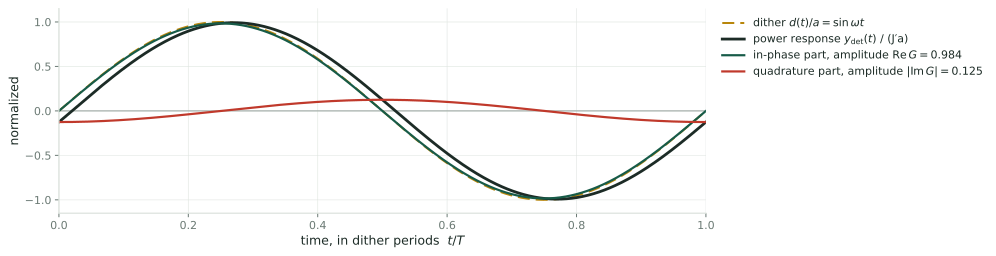
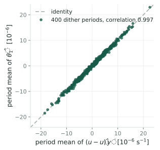
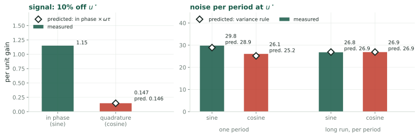
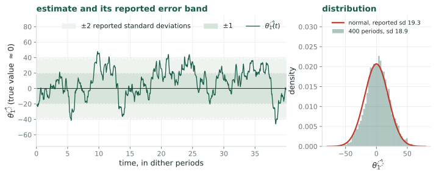
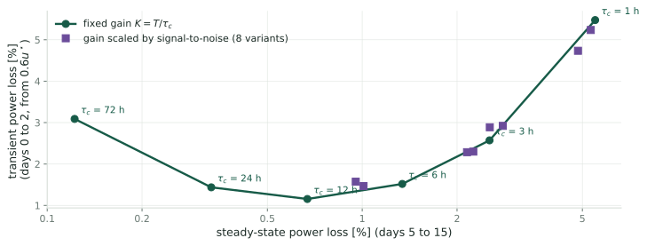

## The question {.smaller}

LP-PIESC [\[KR22\]](#references) replaces the demodulation of extremum seeking with a
**recursive least-squares** fit, built on the estimator of Guay and Dochain
[\[GD17\]](#references). The wind deck ([Wind as a Stochastic Process](q5-wind-process.html))
gives the variance of the wind's effect on the measured power. Two questions:

1. **What does the least-squares estimate $\hat\theta_1$ measure** on the turbine, with
   the published tuning?
2. **What does a model of the noise variance add** to a least-squares estimator?

::: claim
**Answers, derived below and checked by simulation.**

- With the published tuning, $\hat\theta_1$ reads only the part of the power's
  response that lags the dither by a quarter period, $12.5\%$ of the whole
  response. For equal signal it needs $62$ times the averaging time of an
  estimator that reads the in-phase part.
- Regressing the power itself, instead of its time derivative, reads the in-phase part.
- Given the wind's noise density at the dither frequency, the estimator's own
  matrix $\Sigma^{-1}$ becomes the covariance of its estimate, to within $2\%$, and
  its memory and ridge follow by formula.
:::

## What this deck takes from the wind deck {.smaller}

Four facts, each derived there:

1. **The wind's fluctuation.** $V(t) = \bar V(1 + \varepsilon(t))$, with $\varepsilon$ a
   stationary random process of mean zero and standard deviation
   $\sigma_\varepsilon = \mathrm{TI} = 0.10$, and two-sided spectral density $S^{2s}(f)$: the
   Kaimal density, $S^{2s}(f) = \tfrac12\mathrm{TI}^2\,(4L/\bar V)\,(1 + 6|f|L/\bar V)^{-5/3}$, $L = 340$ m.
2. **The wind's effect on log-power.** Near the optimum, the wind adds $3\varepsilon(t)$ to
   $y = \ln P$ (Link A). The objective is $J(u) := \ln C_P(\lambda_{\text{eq}}(u))$ and its
   derivative $J'$ is the gradient extremum seeking drives to zero.
3. **The variance rule.** For a fixed weight $w(t)$ and $X := \int w(t)\,\varepsilon(t)\,dt$,
   $$\operatorname{Var}(X) = \int_{\mathbb{R}} S^{2s}(f)\,|\hat w(f)|^2\,df,
   \qquad \hat w(f) := \int w(t)\,e^{-i2\pi ft}\,dt \qquad\text{(Link C)}$$
4. **What a slow average sees.** Averaged over many dither periods, the demodulated
   noise depends on the density at the dither frequency $f_1$ alone
   (*The noise a slow loop averages*).

# Part 1: least squares from first principles {.divider}

**Goal.** The estimator of LP-PIESC is a least-squares fit. Its equations, from
the cost they minimize, so that what it computes can be read off.

## The fit and the normal equations {.smaller}

- **Data and model.** A measured signal $y(t)$ and a known **regressor** $\phi(t) \in \mathbb{R}^2$;
  $y(t) = \phi(t)^T\theta + v(t)$, with $\theta$ the unknown **parameters** and $v$ the **noise**.
- **Example used throughout.** Extremum seeking dithers the gain, $u(t) = \hat u + d(t)$
  with $d(t) = a\sin\omega t$. With $\phi = [1,\ d]^T$ and $\theta = [\theta_0,\ \theta_1]^T$, the model
  $y = \theta_0 + \theta_1 d + v$ is a straight line in $d$: $\theta_1$ is the slope of $y$
  with respect to the gain, the gradient extremum seeking needs.
- **Units.** $y = \ln(P/P_{\text{rated}})$; $u$ is the normalized gain of
  [\[KR22\]](#references), optimum $u^\star = 0.061$; published dither $a = 0.005$ ($8.2\%$ of $u^\star$)
  at $\omega = 0.02$ rad/s, period $T = 2\pi/\omega = 314$ s.

1. **The cost.** $C(\theta) = \int_0^t \big(y(s) - \phi(s)^T\theta\big)^2\,ds$.
2. **Set its derivative to zero:** $-2\int_0^t\phi\,(y - \phi^T\theta)\,ds = 0$, so
   $$\underbrace{\int_0^t \phi\,\phi^T\,ds}_{=:\ A}\;\hat\theta = \underbrace{\int_0^t \phi\,y\,ds}_{=:\ b},
   \qquad\text{the normal equations}$$
3. **When $A$ is invertible.** $A$ is a sum of rank-one matrices $\phi\phi^T$, invertible
   only if $\phi$ points in two different directions over the record: $d$ must vary,
   or the level $\theta_0$ and the slope $\theta_1$ cannot be separated.

## Forgetting, the ridge, and the recursion {.smaller}

1. **Forgetting.** Weight recent data more, with $w(s) := e^{-k_T(t-s)}$; the **memory** is $1/k_T$.
2. **Ridge penalty** $\sigma|\theta|^2$, $\sigma > 0$. The cost and its minimizer:
   $$C(\theta) = \int_0^t w\Big[\big(y - \phi^T\theta\big)^2 + \sigma\,|\theta|^2\Big]ds,
   \qquad \Sigma\,\hat\theta = b,\quad \Sigma := A + \sigma mI$$
   with $A = \int_0^t w\,\phi\phi^Tds$, $b = \int_0^t w\,\phi\,y\,ds$, $m = \int_0^t w\,ds \approx 1/k_T$. The added
   $\sigma mI$ makes $\Sigma$ invertible even when $A$ is not; where $A$ is small, $\sigma$ decides the answer.
3. **The recursion.** Differentiating $\Sigma\hat\theta = b$ in $t$ (A.1):
   $$\dot\Sigma = \phi\phi^T - k_T\,\Sigma + \sigma I,
   \qquad
   \dot{\hat\theta} = \Sigma^{-1}\Big(\phi\,\big(y - \phi^T\hat\theta\big) - \sigma\,\hat\theta\Big)$$
   This is **recursive least squares** (RLS) in continuous time: the first equation
   accumulates information and forgets it at rate $k_T$; the second corrects $\hat\theta$ in
   proportion to the prediction error, most strongly where little is known.

# Part 2: how uncertain the estimate is {.divider}

**Goal.** The covariance of $\hat\theta$, which RLS knows only up to one number, the
noise density $R$, and that number for the turbine.

## The error, and its covariance for white noise {.smaller}

Take $\sigma$ negligible, so $\Sigma = A$.

1. **The error is a weighted integral of the noise.** Substituting $y = \phi^T\theta + v$
   into $b$ gives $b = A\theta + \int_0^t w\,\phi\,v\,ds$, so
   $$\hat\theta - \theta = \Sigma^{-1}\int_0^t w(s)\,\phi(s)\,v(s)\,ds$$
   the structure of $Z$ in the wind deck: noise integrated against a known weight.
2. **White noise** of intensity $R$: $\mathbb{E}[v(s)v(s')] = R\,\delta(s - s')$, a flat density $S_v^{2s} = R$. Then
   $$\operatorname{Cov}(\hat\theta) = \Sigma^{-1}\Big[\iint w(s)w(s')\,\phi(s)\phi(s')^T\,\mathbb{E}[v(s)v(s')]\,ds\,ds'\Big]\Sigma^{-1}
   = R\,\Sigma^{-1}\Big[\int_0^t w^2\,\phi\phi^T ds\Big]\Sigma^{-1}$$
3. **The squared weight** $w^2 = e^{-2k_T(t-s)}$ has half the memory, so
   $\int w^2\phi\phi^Tds \approx \tfrac12\Sigma$ when $\phi\phi^T$ averages to the same matrix over either memory (A.3):
   $$\boxed{\;\operatorname{Cov}(\hat\theta) \approx \frac{R}{2}\,\Sigma^{-1}\;}$$

::: claim
RLS computes $\Sigma^{-1}$ but never $R$: it knows the covariance of its own estimate
only up to the noise intensity. Supplying $R$ is what a noise model can do.
:::

## For the wind, $R$ is the density at the dither frequency {.smaller}

1. **The slope error** is $\frac{1}{\Sigma_{22}}\int w\,d\,v\,ds$ with $d = a\sin\omega t$, once the memory
   spans a dither period (then the off-diagonal entries of $\Sigma$ are small).
2. **Its variance,** by the variance rule, is $\frac{1}{\Sigma_{22}^2}\int S_v^{2s}(f)\,|W(f)|^2df$, with $W$ the
   transform of $w(s)\,d(s)$: two bands at $\pm f_1$ ($f_1 := 1/T$), each about $k_T/2\pi$ wide.
3. **Only the density in those bands enters.** The wind noise then acts as white noise with
   $$R = S_v^{2s}(f_1),\qquad S_v^{2s} = 9\,S^{2s}\ \text{(fact 2: } v = 3\varepsilon\text{)}$$
   the same $R$ the wind deck's slow loop sees. With memory one period the flat-density
   value and the exact integral differ by $0.5\%$ (A.3).
4. **For the turbine,** at $f_1 = 1/314$ s $= 3.18\times10^{-3}$ Hz, $\mathrm{TI} = 0.10$, $L = 340$ m, $\bar V = 8$ m/s:
   $$S^{2s}(f_1) = \tfrac12\cdot0.01\cdot\frac{4\cdot340/8}{(1 + 6\cdot3.18\times10^{-3}\cdot340/8)^{5/3}} = 0.316\ \text{Hz}^{-1},
   \qquad \boxed{\;R = 9\times0.316 = 2.84\ \text{Hz}^{-1}\;}$$

# Part 3: the LP-PIESC estimator {.divider}

**Goal.** What LP-PIESC fits, and why it is built that way.

## The estimator of [\[KR22\]](#references) {.smaller}

The model is written for the **time derivative** of $y$ [\[GD17\]](#references):

$$\dot y = \theta_0 + \theta_1\,\big(u - \hat u\big) = \phi^T\theta,
\qquad \phi = \begin{bmatrix}1\\ u - \hat u\end{bmatrix}$$

$\dot y$ is not measured, so the estimator runs on a **filtered regressor** $c$ and a
predictor $\hat y$ (Eqs. 6 to 11 of [\[KR22\]](#references), projection omitted):

$$\dot c = -Kc + \phi,\qquad
\dot{\hat y} = \phi^T\hat\theta + Ke + c^T\dot{\hat\theta},\qquad e = y - \hat y$$
$$\dot\Sigma = cc^T - k_T\Sigma + \sigma I,\qquad
\dot{\hat\theta} = \Sigma^{-1}\big(c\,e - \sigma\hat\theta\big)$$

- **Published values** (Table 3 of [\[KR22\]](#references)): $K = k_T = 20$ rad/s,
  $\sigma = 10^{-6}$, dither $a = 0.005$ at $\omega = 0.02$ rad/s.
- **The control law** that uses the estimate (Eq. 5 of [\[KR22\]](#references)):
  $u = -k_p\hat\theta_1 + \hat u + d(t)$, $\dot{\hat u} = -\hat\theta_1/\tau_I$: a proportional
  and an integral path in $\hat\theta_1$, with gains $k_p$, $\tau_I$ tuned by trial and error.

## Why $\dot y$, and why the filtered regressor {.smaller}

- **Why $\dot y$.** The gain enters the rotor's equation of motion directly,
  $I\dot\Omega = \tau_{\text{aero}}(\Omega, V) - u\,\Omega^2$, and $y$ depends on $u$ only through
  $\Omega$. Differentiating, $\dot y = \frac{\partial y}{\partial\Omega}\dot\Omega + \frac{\partial y}{\partial V}\dot V$ is exactly
  affine in $u$ at every instant: $\theta_0$ collects everything that does not
  multiply $u$, $\theta_1 = -\frac{\Omega^2}{I}\frac{\partial y}{\partial\Omega}$.
- **Why the filter.** Differentiating a turbulent measured $y$ to obtain $\dot y$
  would amplify the noise. The
  filter $c$ and the predictor $\hat y$ are built so that the measurable error
  obeys $e = c^T(\theta - \hat\theta)$ after a transient of duration $1/K$; the
  gradient-estimation deck derives this
  ([What the estimator is fitting](gradient-estimation.html)).
- **What it is, then.** For signals slow compared with $K = 20$ rad/s, $c \approx \phi/K$
  and $e + c^T\hat\theta \approx \dot y/K$. The recursion is then Part 1's RLS applied
  to the regression of $\dot y$ on $\phi$, with memory $1/k_T$ and ridge
  coefficient $\gamma := \sigma K^2$ (A.1):
  $$\text{minimize}\ \int_0^t w\Big[\big(\dot y - \phi^T\theta\big)^2 + \gamma\,|\theta|^2\Big]ds,
  \qquad \gamma = 10^{-6}\times20^2 = 4\times10^{-4}$$

# Part 4: what it computes on the turbine {.divider}

**Goal.** Evaluate the published estimator on the turbine. With a $50$ ms memory and
a $314$ s dither, the fit cannot separate level from slope; the ridge decides, and
the answer is a quadrature demodulation.

## Rank one, so the ridge picks the minimum-norm solution {.smaller}

1. **Over one memory,** $1/k_T = 0.05$ s, the dither changes by at most $a\omega/k_T = 5\times10^{-6}$,
   a thousandth of its amplitude: $\phi = [1, d]^T$ is constant over the memory, and
   $A \approx \phi\phi^T/k_T$ is **rank one**. The data cannot separate $\theta_0$ from $\theta_1$.
2. **Only the ridge makes $\Sigma$ invertible.** In the slope direction the ridge adds
   $\sigma/k_T = 5\times10^{-8}$, $16$ times the information, at most $a^2/(K^2k_T) = 3.1\times10^{-9}$. The
   simulation reads $\Sigma^{-1}_{22} = 2.0000\times10^7 = k_T/\sigma$ exactly, independent of the data.
3. **Solve.** With $b \approx \phi\,\dot y/k_T$ the equations are $(\phi\phi^T + \gamma I)\hat\theta = \phi\,\dot y$, and
   $(\phi\phi^T + \gamma I)^{-1}\phi = \phi/(|\phi|^2 + \gamma)$ (A.2), so
   $$\hat\theta_1 = \frac{d(t)\,\dot y(t)}{1 + d^2 + \gamma} = d(t)\,\dot y(t)\,\big(1 - 4\times10^{-4}\big)$$
4. **Read it.** Of all $\theta$ that fit the single equation $\dot y = \theta_0 + \theta_1 d$, the ridge picks
   the shortest; since $|d| \ll 1$, nearly all of $\dot y$ goes to $\theta_0$, and $\hat\theta_1$ is the
   product $d\,\dot y$: a demodulation of $\dot y$ by the dither, updated every $50$ ms.

## What $d\,\dot y$ averages to {.smaller}

The control law integrates $\hat\theta_1$ (the $\dot{\hat u}$ equation), so what
matters is its average over a dither period, $\langle d\,\dot y\rangle := \frac1T\int_0^T d\,\dot y\,dt$.

1. **Split $y$** into the response to the dither, $y_{\text{det}}$, and the wind's part.
2. **The response to a slow dither** (A.4): the rotor follows the gain through a
   first-order lag with time constant $\tau = 6.36$ s, $G := 1/(1 + i\omega\tau)$, so
   $$y_{\text{det}}(t) = J'\,a\,\big[\operatorname{Re}G\,\sin\omega t + \operatorname{Im}G\,\cos\omega t\big]$$
   with $J'$ the gradient of the objective, $\operatorname{Re}G = \frac{1}{1+(\omega\tau)^2}$, $\operatorname{Im}G = \frac{-\omega\tau}{1+(\omega\tau)^2}$.
3. **Differentiate and average** with $\langle\sin^2\rangle = \langle\cos^2\rangle = \tfrac12$, $\langle\sin\cos\rangle = 0$:
   $$\dot y_{\text{det}} = J'a\omega\big[\operatorname{Re}G\cos\omega t - \operatorname{Im}G\sin\omega t\big],
   \qquad
   \langle d\,\dot y_{\text{det}}\rangle = \frac{a^2\omega}{2}\,J'\,|\operatorname{Im}G|$$
   Only the **quadrature** part, $\operatorname{Im}G\cos\omega t$, survives: the in-phase part
   of $y$ becomes $\cos\omega t$ in $\dot y$, orthogonal to $d$.

## The rotor splits the response into two parts {.smaller}

{.fig-hero fig-alt="One dither period. The dashed dither is a unit sine. The power response, nearly coincident with it, is split into an in-phase sine of amplitude 0.984 and a quadrature cosine of amplitude 0.125."}

- **In phase** with the dither (green): amplitude $\operatorname{Re}G = 0.984$. Read by
  correlating $y$ with $\sin\omega t$, which is what demodulation does.
- **In quadrature** (red): amplitude $|\operatorname{Im}G| = \omega\tau/(1+(\omega\tau)^2) = 0.125$,
  present only because the rotor lags. This is all the published estimator reads.

## So $\hat\theta_1$ is a scaled quadrature demodulation {.smaller}

1. **Its mean.** From the last two slides,
   $$\langle\hat\theta_1\rangle = \frac{a^2\omega}{2}\,J'\,\frac{\omega\tau}{1+(\omega\tau)^2}
   = \underbrace{2.5\times10^{-7}}_{a^2\omega/2}\times\underbrace{0.125}_{|\operatorname{Im}G|}\times J'$$
   At $u = 0.9\,u^\star$, $J' = 1.28$ gives $4.00\times10^{-8}$; the simulation reads $4.02\times10^{-8}$.
2. **Its noise.** Integrating by parts over a period ($d(0) = d(T) = 0$),
   $\langle d\,\dot y\rangle = -\langle\dot d\,y\rangle = -a\omega\,\langle y\cos\omega t\rangle$: the
   correlation of $y$ with $\cos\omega t$. The wind enters through the same
   correlation, so the noise is that of a demodulator reading $\cos\omega t$.
3. **Name the two channels.** Per period,
   $$\hat g_{\sin} := \frac{2}{a}\langle y\sin\omega t\rangle \to J'\operatorname{Re}G,
   \qquad
   \hat g_{\cos} := \frac{2}{a}\langle y\cos\omega t\rangle \to J'\operatorname{Im}G,
   \qquad
   \langle\hat\theta_1\rangle = -\frac{a^2\omega}{2}\,\hat g_{\cos}$$

::: claim
The published $\hat\theta_1$ is the cosine channel times the constant
$-a^2\omega/2 = -2.5\times10^{-7}$. That constant is absorbed by the PI gains, set by
trial and error in [\[KR22\]](#references).
:::

## The cost: $62$ times the variance {.smaller}

1. **Signal.** The two channels read $J'\operatorname{Re}G$ and $J'|\operatorname{Im}G|$; their ratio is
   $|\operatorname{Im}G|/\operatorname{Re}G = \omega\tau = 0.127$ exactly.
2. **Noise, as the loop sees it.** The control law integrates $\hat\theta_1$ over many periods,
   so its noise is the long-run variance. Averaged over $N$ periods, both the sine and the
   cosine window gather their weight at $\pm f_1$, where both have magnitude $T/2$ (A.5): the
   two channels carry the **same** long-run noise, $2R/(a^2T)$ per period.
3. **Hence** the variance for equal signal is $1/(\omega\tau)^2 = 62$ times larger in quadrature:
   $62$ times the averaging time, or $7.9$ times the dither amplitude, for the same scatter.

| per period, $T = 314$ s | in phase, $\hat g_{\sin}$ | quadrature, $\hat g_{\cos}$ |
|---|---|---|
| signal per unit $J'$ | $\operatorname{Re}G = 0.984$ | $\vert\operatorname{Im}G\vert = 0.125$ |
| noise $\sigma$, long run | $26.9$ | $26.9$ |
| noise $\sigma$, one period alone | $28.9$ | $25.2$ |

::: claim
The factor is $1/(\omega\tau)^2$: a property of reading $\dot y$ with a dither slower than the
rotor. Over a single period the two windows admit different low-frequency wind and the
factor is $47$; over the long averaging the integrator performs, it is $62$.
:::

# Part 5: the fix, and what $R$ adds {.divider}

**Goal.** Recover the in-phase channel, then use $R$ for error bars and for the tuning.

## Regress $y$, not $\dot y$ {.smaller}

1. **The model the time scales justify.** With $\omega\tau = 0.127 \ll 1$ the rotor
   follows the dither nearly at once, so $y$ is nearly a static function of the
   gain: $y = \theta_0 + \theta_1 d + v$, the fitting problem of Part 1, with
   $\theta_1 = J'\operatorname{Re}G$ (and a quadrature remainder of relative size $0.125$
   that the fit averages out).
2. **The estimator.** Part 1's RLS on $y$ with $\phi = [1, d]^T$. $y$ is measured, so no
   filtered regressor is needed.
3. **The memory** must span at least a dither period, so that $d$ varies within it
   and $A$ has full rank. Then the off-diagonal entries of $\Sigma$ average out,
   $\Sigma_{22} \approx a^2/(2k_T)$, and the slope is identified from the data.
4. **Recover $J'$.** Divide by the known $\operatorname{Re}G = 0.984$ (the rotor time constant is
   a turbine constant, wind deck A.0c).

::: claim
With memory one period and negligible ridge, the simulation gives
$\hat\theta_1 = 1.259$ at $0.9\,u^\star$, against $1.260$ from sine demodulation of the same
record.
:::

## What $R$ adds: error bars, and the tuning {.smaller}

1. **Calibrated error bars.** The estimator computes $\Sigma^{-1}$ at every instant; multiplying
   by $R/2$ turns it into the variance of its estimate,
   $$\hat s(t) := \sqrt{\tfrac{R}{2}\,\Sigma^{-1}_{22}(t)},\qquad R = 2.84\ \text{Hz}^{-1}$$
   which updates with $\mathrm{TI}$ and $\bar V$ through the Kaimal formula if those are measured.
2. **The ridge** shrinks the slope: with $\Sigma_{22} = a^2/(2k_T) + \sigma/k_T$ and $b_2 \approx \theta_1a^2/(2k_T)$,
   $$\hat\theta_1 = \frac{a^2/2}{a^2/2 + \sigma}\,\theta_1$$
   A shrinkage below $1\%$ needs $\sigma \le 0.01\,a^2/2 = 1.25\times10^{-7}$; the published $\sigma = 10^{-6}$ would
   shrink this estimator by $7\%$.
3. **The memory.** $\operatorname{Var}(\hat\theta_1) \approx \tfrac{R}{2}\Sigma^{-1}_{22} = Rk_T/a^2$, the variance of the wind deck's
   loop with tracking time $\tau_c = 1/k_T$ (wind deck, *Design, the requirement*): the memory is the tracking
   time, and the wind deck's Design section chooses it, and $a$ and $T$ with it.
4. **At memory one period,** $k_T = 1/T$: $\sqrt{Rk_T/a^2} = \sqrt{2.84/(314\times2.5\times10^{-5})} = 19.0$.

::: claim
Tested in Part 6: over 400 dither periods at $u^\star$ the actual scatter of $\hat\theta_1$ is $18.9$,
and the reported $\hat s$ averages $19.3$. Told $R$, the estimator knows its own error to within $2\%$.
:::

# Part 6: simulations {.divider}

**Goal.** Check every claim above on the NREL 5 MW rotor under synthesized Kaimal inflow.

## How the simulations are set up {.smaller}

- **Plant.** The rotor $I\dot\Omega = \tau_{\text{aero}}(\Omega, V) - u\Omega^2$ of the wind deck, Euler
  step $5$ ms; $y = \ln(\tau_{\text{aero}}\Omega/P_{\text{rated}})$. Wind: Kaimal, $\bar V = 8$ m/s, $\mathrm{TI} = 0.10$.
- **Open loop.** $\hat u$ is held fixed and $u = \hat u + a\sin\omega t$ with the published $a$ and $\omega$,
  so each estimator is tested alone.
- **Three estimators on the same record:** the published one (Eqs. 6 to 11 of
  [\[KR22\]](#references), $K = k_T = 20$ rad/s, $\sigma = 10^{-6}$); Part 1's RLS on $y$ with memory one
  period and $\sigma = 10^{-12}$; and sine and cosine demodulation of $y$ per period.
- **Runs.** Calm wind ($\mathrm{TI} \to 0$) at $0.9\,u^\star$ and $1.1\,u^\star$, 12 periods each, for the signal;
  turbulent wind at $u^\star$, 400 periods, for the noise; and, for the long-run noise, $24$
  synthesized wind records of $20$ days demodulated period by period.
- **Code.** `rotea/src/experiments/exp7_piesc_estimator.py`, `exp9_long_run.py`.

## The published estimate is the minimum-norm product {.smaller}

::: {.cols2}
::: {}
{fig-alt="Scatter of 400 dither periods: the period mean of the published theta-1-hat against the period mean of (u minus u-hat) times y-dot, lying on the identity line, correlation 0.997."}
:::
::: {}
**Turbulent wind at $u^\star$** (left): period by period, the published estimate
equals the minimum-norm product $d\,\dot y$, correlation $0.997$.

**Calm wind** (no noise), the mean response:

| | $0.9\,u^\star$ | $1.1\,u^\star$ |
|---|---|---|
| $\langle\hat\theta_1\rangle$, published | $4.016\times10^{-8}$ | $-3.349\times10^{-8}$ |
| $\langle d\,\dot y\rangle$ | $4.011\times10^{-8}$ | $-3.344\times10^{-8}$ |
| $\frac{a^2\omega}{2}J'|\operatorname{Im}G|$, predicted | $4.00\times10^{-8}$ | |
| $\Sigma^{-1}_{22}$ | $2.0000\times10^7$ | $2.0000\times10^7$ |
:::
:::

## In phase against quadrature {.smaller}

{.fig-band fig-alt="Left, signal: the in-phase channel responds 1.15 per 0.1 u-star offset, the quadrature channel 0.147, against 0.146 predicted from the in-phase value times omega tau. Right, noise per period: over one period 29.8 in phase and 26.1 in quadrature against 28.9 and 25.2 predicted; in the long run 26.8 and 26.9 against 26.9 predicted for both."}

- **Signal ratio** in phase over quadrature: $7.83$ measured, $1/(\omega\tau) = 7.87$ predicted.
- **Noise:** one period, $29.8$ and $26.1$ against $28.9$ and $25.2$ predicted; long run, $26.8$ and
  $26.9$ against $26.9$ for both.
- **Variance ratio** for equal signal: $62$ in the long run (measured $7.83^2\times(26.9/26.8)^2 = 61.8$);
  $47.5$ measured over one period, $47$ predicted.

## The static-map RLS: unbiased and calibrated {.smaller}

{.fig-hero fig-alt="Left, 40 dither periods of the static-map estimate at u-star wandering inside a band of plus and minus one and two reported standard deviations. Right, the histogram of 400 periods matching a normal density with the reported standard deviation."}

- **Signal:** $1.259$ at $0.9\,u^\star$ and $-1.042$ at $1.1\,u^\star$, against sine demodulation's $1.260$ and $-1.042$.
- **Error bar:** actual scatter $18.9$, reported $\sqrt{(R/2)\Sigma^{-1}_{22}} = 19.3$, with $R = 2.84$ from Kaimal.

## Using the error bar in the step: a fixed gain does better {.smaller}

- **The idea.** Move $u$ in proportion to how sure the gradient is: with $m_n$ an
  exponential average of the per-period estimates (memory $M$ periods) and $v$ its
  variance from the noise model, step with gain $K_{\max}\,w_n$,
  $w_n := \max\big(0,\ 1 - c\,v/m_n^2\big)$ (the positive-part James-Stein weight).
- **The test.** Per-period loop on the turbine's nonlinear $J(u)$, noise from synthesized
  wind, 200 runs from $0.6\,u^\star$; power loss over the first two days and over days
  5 to 15 (`exp8_snr_gain.py`).

{.fig-band fig-alt="Transient loss against steady-state loss. Fixed gains trace a curve from 1 hour to 72 hours of tracking time; every signal-to-noise-scheduled variant is beaten in both losses by some fixed gain."}

::: claim
Every scheduled variant is beaten in both losses by a fixed gain (best scheduled:
$1.47\%$ and $1.01\%$; fixed at $12$ h: $1.16\%$ and $0.67\%$). Near $u^\star$ the per-period
signal-to-noise is too low (noise $2.5\,u^\star$ per period) for the weight to separate
"at the optimum" from "not yet".
:::

## Bottom line {.smaller}

1. **The published estimator reads the quadrature channel.** With a $50$ ms memory and
   a $314$ s dither, the least-squares problem is rank one; the ridge returns
   $\hat\theta_1 = d\,\dot y$, whose average is $-\frac{a^2\omega}{2}\hat g_{\cos}$.
2. **That costs a factor $62$ in variance**, $1/(\omega\tau)^2$, because the dither is slower than
   the rotor and both channels carry the same long-run noise.
3. **Regressing $y$ with a memory of at least a period** reads the in-phase channel: an
   unbiased slope, $J'\operatorname{Re}G$.
4. **The wind model supplies $R = 9\,S^{2s}(f_1) = 2.84$ Hz$^{-1}$**, which turns the estimator's
   $\Sigma^{-1}$ into its covariance ($2\%$) and sets $\sigma$ and $k_T$ by formula: the memory is the
   tracking time of the wind deck's Design section.
5. **A fixed gain beats a step scaled by the error bar** here.

# Appendices {.divider}

The derivations the main line cites.

## A.1: From the cost to the recursion {.smaller}

1. **The minimizer.** $\Sigma\hat\theta = b$ with $\Sigma = A + \sigma mI$, $A = \int_0^t w\phi\phi^T$,
   $b = \int_0^t w\phi y$, $m = \int_0^t w$, $w = e^{-k_T(t-s)}$.
2. **Differentiate in $t$.** The upper limit contributes the integrand at $s = t$
   (where $w = 1$); the weight contributes $-k_T$ times the integral:
   $$\dot A = \phi\phi^T - k_TA,\qquad \dot b = \phi y - k_Tb,\qquad \dot m = 1 - k_Tm$$
   so $\dot\Sigma = \dot A + \sigma\dot m I = \phi\phi^T - k_T\Sigma + \sigma I$.
3. **The parameter.** Differentiate $\Sigma\hat\theta = b$: $\dot\Sigma\hat\theta + \Sigma\dot{\hat\theta} = \dot b$, so
   $$\dot{\hat\theta} = \Sigma^{-1}\big(\dot b - \dot\Sigma\hat\theta\big)
   = \Sigma^{-1}\big(\phi y - k_Tb - \phi\phi^T\hat\theta + k_T\Sigma\hat\theta - \sigma\hat\theta\big)
   = \Sigma^{-1}\big(\phi(y - \phi^T\hat\theta) - \sigma\hat\theta\big)$$
   using $k_T\Sigma\hat\theta = k_Tb$.
4. **LP-PIESC.** The same steps with $c$ for $\phi$ and $z := e + c^T\hat\theta$ for $y$ give
   Eqs. 6 and 11 of [\[KR22\]](#references). With $c \approx \phi/K$ and $Kz \approx \dot y$, the cost
   $\int w[(z - c^T\theta)^2 + \sigma|\theta|^2]$ equals $\frac{1}{K^2}\int w[(\dot y - \phi^T\theta)^2 + \sigma K^2|\theta|^2]$:
   the regression of $\dot y$ with ridge $\gamma = \sigma K^2$.

## A.2: The minimum-norm solution {.smaller}

1. **Claim.** For a vector $\phi$ and $\gamma > 0$, $(\phi\phi^T + \gamma I)^{-1}\phi = \phi/(|\phi|^2 + \gamma)$.
2. **Proof.** Multiply the candidate by the matrix:
   $$(\phi\phi^T + \gamma I)\,\frac{\phi}{|\phi|^2 + \gamma} = \frac{\phi\,(\phi^T\phi) + \gamma\phi}{|\phi|^2 + \gamma} = \phi$$
3. **Meaning.** The equation $\dot y = \phi^T\theta$ has a line of solutions. As $\gamma \to 0$,
   $\hat\theta = \phi\dot y/(|\phi|^2 + \gamma)$ tends to $\phi\dot y/|\phi|^2$, the solution of smallest
   length $|\theta|$: the ridge chooses the shortest parameter vector consistent with
   the data.

## A.3: Covariance with exponential weights {.smaller}

1. **White noise.** With $\phi\phi^T$ replaced by its average $\overline{\phi\phi^T}$ over a memory,
   $$\int_0^t w\,\phi\phi^T ds \approx \frac{1}{k_T}\overline{\phi\phi^T},\qquad
   \int_0^t w^2\,\phi\phi^T ds \approx \frac{1}{2k_T}\overline{\phi\phi^T} = \frac12\int_0^t w\,\phi\phi^T ds$$
   since $\int_0^\infty e^{-k_Ts}ds = 1/k_T$ and $\int_0^\infty e^{-2k_Ts}ds = 1/(2k_T)$. With $\sigma$
   negligible, $\operatorname{Cov}(\hat\theta) = R\,\Sigma^{-1}(\tfrac12\Sigma)\Sigma^{-1} = \tfrac{R}{2}\Sigma^{-1}$.
2. **Colored noise, the slope.** With $\Sigma_{22} \approx a^2/(2k_T)$ and $d = a\sin\omega(t-s)$, the
   phase-averaged $|W(f)|^2 = \frac{a^2}{4}\big[\ell(f - f_1) + \ell(f + f_1)\big]$ with $\ell(\Delta) = 1/(k_T^2 + (2\pi\Delta)^2)$, so
   $$\operatorname{Var}(\hat\theta_1) = \frac{k_T^2}{a^2}\int_{\mathbb{R}} S_v^{2s}(f)\big[\ell(f-f_1) + \ell(f+f_1)\big]df$$
   For flat $S_v^{2s} = R$, $\int\ell = 1/(2k_T)$ and this is $Rk_T/a^2 = \tfrac{R}{2}\Sigma^{-1}_{22}$.
3. **Numbers at memory one period.** Exact integral with Kaimal: $\sigma = 19.12$; flat value: $19.02$.

## A.4: The rotor's response at the dither frequency {.smaller}

1. **Linearize** the rotor about its equilibrium (wind deck A.0c): $\tau\,\delta\dot\Omega + \delta\Omega = \beta\,\delta u$
   for a constant $\beta$, $\tau = \tau_{\text{rotor}} = 6.36$ s at $8$ m/s.
2. **$y$ depends on $u$ only through $\Omega$** (aerodynamic power $\tau_{\text{aero}}\Omega$), so
   $\delta y = y_\Omega\,\delta\Omega$ with $y_\Omega := \partial y/\partial\Omega$.
3. **Static limit.** For slow $\delta u$, $\delta\Omega = \beta\,\delta u$ and $\delta y = J'\delta u$ by definition of $J$, so
   $y_\Omega\beta = J'$.
4. **At frequency $\omega$.** For $\delta u = a\sin\omega t = a\operatorname{Im}e^{i\omega t}$ the steady response is
   $\delta\Omega = \beta\,a\operatorname{Im}\big(G\,e^{i\omega t}\big)$ with $G = 1/(1 + i\omega\tau)$, hence
   $$y_{\text{det}} = J'a\operatorname{Im}\big(G e^{i\omega t}\big) = J'a\big[\operatorname{Re}G\sin\omega t + \operatorname{Im}G\cos\omega t\big]$$
5. **Values.** $\omega\tau = 0.02\times6.36 = 0.127$: $\operatorname{Re}G = 1/(1 + 0.0162) = 0.984$,
   $\operatorname{Im}G = -0.127/1.0162 = -0.125$.

## A.5: The two windows {.smaller}

The per-period channels are $\hat g_{\sin} = \frac{2}{aT}\int_0^T y\sin\omega t\,dt$ and
$\hat g_{\cos} = \frac{2}{aT}\int_0^T y\cos\omega t\,dt$. Their wind parts are $\frac{6}{aT}\int_0^T\varepsilon\,w\,dt$
with $w = \sin\omega t$ or $\cos\omega t$ on $[0, T]$.

1. **Transforms** (as in wind deck A.3, with $\beta = 2\pi f$), over $N$ periods:
   $$\hat w_{\sin,N}(f) = \frac{\omega\,(1 - e^{-i\beta NT})}{\omega^2 - \beta^2},\qquad
   \hat w_{\cos,N}(f) = \frac{i\beta\,(1 - e^{-i\beta NT})}{\omega^2 - \beta^2}$$
   Both have magnitude $NT/2$ at $f = \pm f_1$; for $N = 1$ they differ in how much of the
   low-frequency wind they admit.
2. **One period,** by the variance rule with the Kaimal density at $T = 314$ s:
   $\sigma(\hat g_{\sin}) = \frac{6}{aT}\sqrt{\int S^{2s}|\hat w_{\sin}|^2df} = 28.9$, $\sigma(\hat g_{\cos}) = 25.2$.
3. **Long run.** As $N$ grows both windows gather their area, $NT/2$, at $\pm f_1$ (wind deck,
   *The noise a slow loop averages*), so both channels have the long-run variance
   $\big(\frac{6}{aT}\big)^2S^{2s}(f_1)\,\frac T2 = \frac{2R}{a^2T}$ per period: $\sigma = 26.9$.

## References {.smaller}

::: {.refs}
**[KR22]**&nbsp; D. Kumar & M. A. Rotea, *Wind turbine power maximization using
log-power proportional-integral extremum seeking*, Energies **15** (2022) 1004.
[doi:10.3390/en15031004](https://doi.org/10.3390/en15031004)

**[GD17]**&nbsp; M. Guay & D. Dochain, *A proportional-integral extremum-seeking
controller design technique*, Automatica **77** (2017) 61&ndash;67.
[doi:10.1016/j.automatica.2016.11.018](https://doi.org/10.1016/j.automatica.2016.11.018)
:::

::: footnote
Companion to [Extremum Seeking Control of Wind Turbines](gradient-estimation.html) and
[Wind as a Stochastic Process](q5-wind-process.html).
:::
