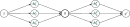
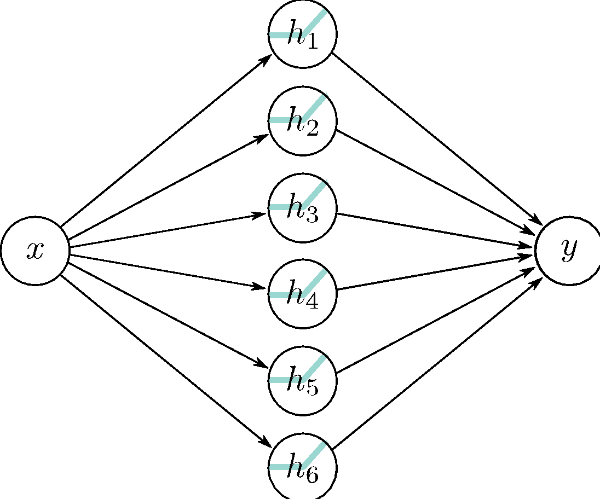
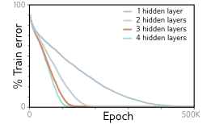
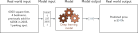
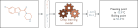
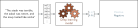
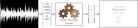

::: {.panel-tabset}

## Deep Neural Networks

::: {.column-margin}
Image credits: [Understanding Deep Learning](https://udlbook.github.io/udlbook) by Simon J. D. Prince, [CC BY 4.0]
:::

These are networks with more than one hidden layer, making intuitive understanding more difficult.

### Composing neural networks

::: {layout="[16, 42, 42]" layout-valign="center"}
Network 1:

$$
\begin{split}
h_1 &= \sigma(\theta_{10} + \theta_{11}x) \\
h_2 &= \sigma(\theta_{20} + \theta_{21}x) \\
h_3 &= \sigma(\theta_{30} + \theta_{31}x)
\end{split}
$$

$$
y = \phi_0 + \phi_1h_1 + \phi_2h_2 + \phi_3h_3
$$
:::

::: {layout="[16, 42, 42]" layout-valign="center"}
Network 2:

$$
\begin{split}
h_1^\prime &= \sigma(\theta_{10}^\prime + \theta_{11}^\prime y) \\
h_2^\prime &= \sigma(\theta_{20}^\prime + \theta_{21}^\prime y) \\
h_3^\prime &= \sigma(\theta_{30}^\prime + \theta_{31}^\prime y)
\end{split}
$$

$$
y^\prime = \phi_0^\prime + \phi_1^\prime h_1 + \phi_2^\prime h_2 + \phi_3^\prime h_3
$$
:::

![
  a) The output $y$ of the first network constitutes the input to the second network
  b) The first network maps inputs $x \in [-1, 1]$ to outputs $y \in [-1, 1]$
  using a function comprising three linear regions that are chosen so that they
  alternate the sign of their slope.  Multiple inputs $x$ (gray circles) now map to 
  the same output $y$ (cyan circle).
  c) The second network defines a function comprising three lienar regions that takes
  $y$ and returns $y^\prime$ (i.e., the cyan circle is mapped to the brown circle).
  d) The combined effect of these two functions when composed is that (i) three 
  different inputs $x$ are mapped to any given value of $y$ by the first network and 
  (ii) are processed in the same way by the second network; the result is that the 
  function defined by the second network in panel (c) is duplicated three times, 
  variously flipped and rescaled according to the slope of the regions of panel (b).
](assets/images/DeepConcat.svg){.lightbox width=80%}

::: {layout="[80, 20]" layout-valign="center"}
{.lightbox width=100% fig-align="center"}

* 20 parameters
* (at least) 9 regions
:::

::: {layout="[80, 20]" layout-valign="center"}
{.lightbox width=300 fig-align="center"}

* 19 parameters
* max 7 regions
:::

### Combining the two networks into one
![
  a) The first network has three hidden units and takes inputs $x_1$ and $x_2$ and returns a scalar output $y$. 
  This is passed into a second network with two hidden units to produce $y^\prime$.
  b) The first network produces a function consisting of seven linear regions, one of which is flat.
  c) The second network defines a function comprising two linear regions in $y \in [-1, 1]$.
  d) Then these networks are composed, each of the six non-flat regions from the first network is divided into two new regions by the second network to create a total of $13$ linear regions.
](assets/images/DeepTwoLayer2D.svg){.lightbox width=100% fig-align="center"}

::: {layout="[16, 42, 42]" layout-valign="center"}
Network 1:

$$
\begin{split}
h_1 &= \sigma(\theta_{10} + \theta_{11}x) \\
h_2 &= \sigma(\theta_{20} + \theta_{21}x) \\
h_3 &= \sigma(\theta_{30} + \theta_{31}x)
\end{split}
$$

$$
y = \phi_0 + \phi_1h_1 + \phi_2h_2 + \phi_3h_3
$$
:::

::: {layout="[16, 42, 42]" layout-valign="center"}
Network 2:

$$
\begin{split}
h_1^\prime &= \sigma(\theta_{10}^\prime + \theta_{11}^\prime y) \\
h_2^\prime &= \sigma(\theta_{20}^\prime + \theta_{21}^\prime y) \\
h_3^\prime &= \sigma(\theta_{30}^\prime + \theta_{31}^\prime y)
\end{split}
$$

$$
y^\prime = \phi_0^\prime + \phi_1^\prime h_1 + \phi_2^\prime h_2 + \phi_3^\prime h_3
$$
:::

Hidden units of the second network in terms of the first:
$$
\begin{split}
h_1^\prime &= \sigma(\theta_{10}^\prime + \theta_{11}^\prime y) = \sigma\left(\theta_{10}^\prime + \theta_{11}^\prime \phi_0 + \theta_{11}^\prime \phi_1h_1 + \theta_{11}^\prime\phi_2h_2 + \theta_{11}^\prime\phi_3h_3 \right) \\
h_2^\prime &= \sigma(\theta_{20}^\prime + \theta_{21}^\prime y) = \sigma\left(\theta_{20}^\prime + \theta_{21}^\prime \phi_0 + \theta_{21}^\prime \phi_1h_1 + \theta_{21}^\prime\phi_2h_2 + \theta_{21}^\prime\phi_3h_3 \right) \\
h_3^\prime &= \sigma(\theta_{30}^\prime + \theta_{31}^\prime y) = \sigma\left(\theta_{30}^\prime + \theta_{31}^\prime \phi_0 + \theta_{31}^\prime \phi_1h_1 + \theta_{31}^\prime\phi_2h_2 + \theta_{31}^\prime\phi_3h_3 \right) 
\end{split}
$$

which we can rewrite as

$$
\begin{split}
h_1^\prime &= \sigma\left(\psi_{10} + \psi_{11}h_1 + \psi_{12}h_2 + \psi_{13}h_3 \right) \\
h_2^\prime &= \sigma\left(\psi_{20} + \psi_{21}h_1 + \psi_{22}h_2 + \psi_{23}h_3 \right) \\
h_3^\prime &= \sigma\left(\psi_{30} + \psi_{31}h_1 + \psi_{32}h_2 + \psi_{33}h_3 \right) 
\end{split}
$$

### Two-layer network

::: {layout="[50, 50]" layout-valign="center"}
$$
\begin{split}
h_1 &= \sigma(\theta_{10} + \theta_{11}x) \\
h_2 &= \sigma(\theta_{20} + \theta_{21}x) \\
h_3 &= \sigma(\theta_{30} + \theta_{31}x)
\end{split}
$$ {#eq-first}

$$
\begin{split}
h_1^\prime &= \sigma\left(\psi_{10} + \psi_{11}h_1 + \psi_{12}h_2 + \psi_{13}h_3 \right) \\
h_2^\prime &= \sigma\left(\psi_{20} + \psi_{21}h_1 + \psi_{22}h_2 + \psi_{23}h_3 \right) \\
h_3^\prime &= \sigma\left(\psi_{30} + \psi_{31}h_1 + \psi_{32}h_2 + \psi_{33}h_3 \right) 
\end{split}
$$ {#eq-preact}
:::

$$
y^\prime = \phi_0^\prime + \phi_1^\prime h_1^\prime + \phi_2^\prime h_2^\prime + \phi_3^\prime h_3^\prime
$$ {#eq-final}

---

{#fig-deeptwolayer .lightbox width=100% fig-align="center"}

1. The three hidden units $h_1$, $h_2$, and $h_3$ in the first layer are computed as usual by 
forming linear functions of the input and passing these through ReLU activation functions (@eq-first).
2. The pre-activations at the second layer are computed by taking three new linear functions 
of these hidden units (arguments of the activation functions in @eq-preact). At this point, we 
effectively have a shallow network with three outputs; we have computed three piecewise linear 
functions with the "joints" between linear regions in the same places.
3. At the second hidden layer, another ReLU function $\sigma(\cdot)$ is applied to each function 
(@eq-preact), which clips them and adds new "joints" to each.
4. The final output is a linear combination of these hidden units (@eq-final).

* Regardless, it's important not to lose sight of the fact that this is still merely an equation 
relating input $x$ to output $y^\prime$. Indeed, we can combine equations @eq-first--@eq-final 
to get one expression:

$$
\begin{split}
y^\prime &= \phi_0^\prime + \phi_1^\prime \sigma\left( \psi_{10} + \psi_{11}\sigma(\theta_{10} + \theta_{11}x) + \psi_{12}\sigma(\theta_{20} + \theta_{21}x) + \psi_{13}\sigma(\theta_{30} + \theta_{31}x) \right) \\
&\quad + \, \phi_2^\prime \sigma \left( \psi_{20} + \psi_{21}\sigma(\theta_{10} + \theta_{11}x) + \psi_{22}\sigma(\theta_{20} + \theta_{21}x) + \psi_{23}\sigma(\theta_{30} + \theta_{31}x) \right) \\
&\quad + \, \phi_3^\prime \sigma \left( \psi_{30} + \psi_{31}\sigma(\theta_{10} + \theta_{11}x) + \psi_{32}\sigma(\theta_{20} + \theta_{21}x) + \psi_{33}\sigma(\theta_{30} + \theta_{31}x) \right).
\end{split}
$$

although this is admittedly rather difficult to understand.

{.lightbox width=80% fig-align="center"}

::: {.callout-tip}
### Hyperparameters
_Hyperparameters_ are parameters that are chosen before the training of the network such as

* $K$ layers: [depth of the network]{style="color: orange;"}
* $D_k$ hidden units/neurons per layer: [width of the network]{style="color: orange;"}

Typically different hyperparameters are probed by retraining: [hyperparameter optimization]{style="color: orange;"}
:::

### Matrix notation

$$
\begin{aligned}
\begin{split}
h_1 &= \sigma(\theta_{10} + \theta_{11}x) \\
h_2 &= \sigma(\theta_{20} + \theta_{21}x) \\
h_3 &= \sigma(\theta_{30} + \theta_{31}x)
\end{split}
&\quad {\color{DodgerBlue} \class{thick-arrow}{\xrightarrow{\hspace{1cm}}}} \quad 
\bmat{
  h_1 \\ h_2 \\ h_3
} = \bm{\sigma}\left(
  \bmat{
    \theta_{10} \\ \theta_{20} \\ \theta_{30}
  } + 
  \bmat{
    \theta_{11} \\ \theta_{21} \\ \theta_{31}
  } x
\right)
\end{aligned}
$$

$$
\begin{aligned}
\begin{split}
h_1^\prime &= \sigma\left(\psi_{10} + \psi_{11}h_1 + \psi_{12}h_2 + \psi_{13}h_3 \right) \\
h_2^\prime &= \sigma\left(\psi_{20} + \psi_{21}h_1 + \psi_{22}h_2 + \psi_{23}h_3 \right) \\
h_3^\prime &= \sigma\left(\psi_{30} + \psi_{31}h_1 + \psi_{32}h_2 + \psi_{33}h_3 \right) 
\end{split}
&\quad {\color{DodgerBlue} \class{thick-arrow}{\xrightarrow{\hspace{1cm}}}} \quad 
\bmat{
  h_1^\prime \\ h_2^\prime \\ h_3^\prime
} = \bm{\sigma}\left(
  \bmat{
    \psi_{10} \\ \psi_{20} \\ \psi_{30}
  } + 
  \bmat{
    \psi_{11} & \psi_{12} & \psi_{13} \\ 
    \psi_{21} & \psi_{22} & \psi_{23} \\ 
    \psi_{31} & \psi_{32} & \psi_{33}
  }
  \bmat{
    h_1 \\ h_2 \\ h_3
  } 
\right)
\end{aligned}
$$

$$
\begin{aligned}
y^\prime = \phi_0^\prime + \phi_1^\prime h_1^\prime + \phi_2^\prime h_2^\prime + \phi_3^\prime h_3^\prime
&\quad {\color{DodgerBlue} \class{thick-arrow}{\xrightarrow{\hspace{1cm}}}} \quad 
y^\prime = \phi_0^\prime + \bmat{\phi_1^\prime & \phi_2^\prime & \phi_3^\prime}\bmat{h_1^\prime \\ h_2^\prime \\ h_3^\prime}
\end{aligned}
$$

---

$$
\begin{aligned}
\begin{split}
\bmat{
  h_1 \\ h_2 \\ h_3
} = \bm{\sigma}\left(
  \bmat{
    \theta_{10} \\ \theta_{20} \\ \theta_{30}
  } + 
  \bmat{
    \theta_{11} \\ \theta_{21} \\ \theta_{31}
  } x
\right)
\end{split}
&\quad {\color{DodgerBlue} \class{thick-arrow}{\xrightarrow{\hspace{1cm}}}} \quad 
\bm{h} = \bm{\sigma}\left( \bm{\theta}_0 + \bm{\theta}x \right)
\end{aligned}
$$

$$
\begin{aligned}
\begin{split}
\bmat{
  h_1^\prime \\ h_2^\prime \\ h_3^\prime
} = \bm{\sigma}\left(
  \bmat{
    \psi_{10} \\ \psi_{20} \\ \psi_{30}
  } + 
  \bmat{
    \psi_{11} & \psi_{12} & \psi_{13} \\ 
    \psi_{21} & \psi_{22} & \psi_{23} \\ 
    \psi_{31} & \psi_{32} & \psi_{33}
  }
  \bmat{
    h_1 \\ h_2 \\ h_3
  } 
\right)
\end{split}
&\quad {\color{DodgerBlue} \class{thick-arrow}{\xrightarrow{\hspace{1cm}}}} \quad 
\bm{h}^\prime = \bm{\sigma}\left( \bm{\psi}_0 + \bm{\Psi}\bm{h} \right)
\end{aligned}
$$

$$
\begin{aligned}
y^\prime = \phi_0^\prime + \bmat{\phi_1^\prime & \phi_2^\prime & \phi_3^\prime}\bmat{h_1^\prime \\ h_2^\prime \\ h_3^\prime}
&\quad {\color{DodgerBlue} \class{thick-arrow}{\xrightarrow{\hspace{1cm}}}} \quad 
y = \phi_0^\prime + \bm{\phi}^\prime \bm{h}^\prime
\end{aligned}
$$

---

$$
\begin{aligned}
\bm{h} = \bm{\sigma}\left( \bm{\theta}_0 + \bm{\theta}x \right)
&\quad {\color{DodgerBlue} \class{thick-arrow}{\xrightarrow{\hspace{1cm}}}} \quad 
\bm{h}_1 = \sigma\left(\bm{\beta}_0 + \bm{\Omega}_0 \bm{x} \right)
\end{aligned}
$$

$$
\begin{aligned}
\bm{h}^\prime = \bm{\sigma}\left( \bm{\psi}_0 + \bm{\Psi}\bm{h} \right)
&\quad {\color{DodgerBlue} \class{thick-arrow}{\xrightarrow{\hspace{1cm}}}} \quad 
\bm{h}_2 = \sigma\left( \bm{\beta}_1 + \bm{\Omega}_1 \bm{h}_1 \right)
\end{aligned}
$$

$$
\begin{aligned}
y = \phi_0^\prime + \bm{\phi}^\prime \bm{h}^\prime
&\quad {\color{DodgerBlue} \class{thick-arrow}{\xrightarrow{\hspace{1cm}}}} \quad 
\bm{y} = \bm{\beta}_2 + \bm{\Omega}_2\bm{h}_2
\end{aligned}
$$

:::{.callout-note}
### General equations for a deep fully-connected $K$-layer neural network
Let $\bm{h}_0 = \bm{x}$, where $\bm{x}$ is the input to the neural network.
$$
\bm{h}_{k+1} = \sigma\left(\bm{\beta}_{k} + \bm{\Omega}_{k}\bm{h}_k\right), \;\; k = 0, \ldots, K-1; \quad \bm{y} = \bm{\beta}_K + \bm{\Omega}_K\bm{h}_K.
$$
:::

{.lightbox width=80% fig-align="center"}

### Shallow vs. deep neural networks

The best results are achieved by deep neural netws with many layers.

* 50-1000 layers for many applications
* Best results in 
$$
\begin{rcases}
\text{• Computer vision} \\
\text{• Natural language processing} \\
\text{• Graph neural networks} \\
\text{• Generative models} \\
\text{• Reinforcement Learning}
\end{rcases} 
\quad 
\begin{array}{l} 
\text{All use deep networks} \\ 
\text{What is the reason?}
\end{array}
$$

1. Ability to approximate different functions?

Both obey the universal approximation theorem.

_Argument_: One layer is enough, and deep netwoorks could arrange for the other layers to compute the identity function.

2. Number of linear regions per parameter?

{.lightbox width=80% fig-align="center"}

* Deep networks create many more regions per parameter
* But, there are dependencies between them
  - Perhaps symmetries in the real-world help? Unknown.

3. Depth efficiency?

* There are some known functions that require a shallow network with exponentially more hidden units than a deep network to achieve an equivalent approximation.
* This is known as the [depth efficiency]{style="color: orange;"} of deep networks.
* But do the real-world functions we want to approximate have this property? Unknown.

4. Large structured networks

* Think about images as input - might be 1M pixels.
* Fully connected networks are not practical.
* Solution is to have weights that only operate locally, and share across image.
* This idea leads to [convolutional networks]{style="color: orange;"}.
* Gradually integrate information from across the image - needs multiple layers.

5. Fitting and generalization

* Fitting of deep models seems to be easier up to about 20 layers
* Then needs various tricks to train deeper networks, so fitting becomes harder.
* Generalization is good in deep networks. Why?

{.lightbox width=70% fig-align="center"}

## Loss Functions

::: {.column-margin}
Image credits: [Understanding Deep Learning](https://udlbook.github.io/udlbook) by Simon J. D. Prince, [CC BY 4.0]
:::

* Training dataset of $I$ pairs of input/output examples: $\left\{\bm{x}_i, \bm{y}_i\right\}_{i=1}^I$

* [Loss function]{style="color: orange;"} measures how bad the model performs $\mc{L}(\bm{\phi}) \triangleq \mc{L}\left(\bm{\phi}, f(\bm{x}; \bm{\phi}), \left\{\bm{x}_i, \bm{y}_i\right\}_{i=1}^I\right)$

* Find the parameters that minimize the loss: $\hat{\bm{\phi}} = \argmin_{\bm{\phi}}\; \mc{L}(\bm{\phi})$

{.lightbox width=80% fig-align="center"}

{.lightbox width=80% fig-align="center"}

{.lightbox width=80% fig-align="center"}

{.lightbox width=80% fig-align="center"}

### Maximum likelihood

* <del>Model predicts output $\bm{y}$ given input $\bm{x}$.</del>
* Model predicts a [conditional probability distribution]{style="color: orange;"}: $\P(\bm{y} \mid \bm{x})$ over outputs $\bm{y}$ given inputs $\bm{x}$.
* Loss function aims to make the outputs have high probability!

![
 a) Regression task, where the goal is to predict a $\R$-valued output $y$ from the input $x$ based on training data $\{x_i, y_i\}$ (orange points).
 For each input value $x$, the ML model predicts a distribution $\P(y \mid x)$ over the output $y \in \R$ (cyan curves show distributions 
 for $x = 2.0$ and $x=7.0$). Minimizing the loss function corresponds to maximizing the probability of the training outputs $y_i$ under the 
 distribution predicted from the corresponding inputs $x_i$.
 b) To predict discrete classes $y \in \{1, 2, 3, 4\}$ in a classification task, we use a discrete probability distribution, so the model 
 predicts a different histogram over the four possible values of $y_i$ for each value of $x_i$.
 c) To predict counts $y \in \{0, 1, 2, \ldots\}$ and d) direction $y \in (-\pi, \pi]$, we use distributions defined over positive 
 integers and circular domains, respectively.
](assets/images/LossDataTypes.svg){.lightbox width=80% fig-align="center"}

#### Computing a distribution over outputs

1. Pick a known distribution to model output $y$ with parameters $\theta$
    - Example: Normal distribution $\mc{N}(y; \bm{{\theta}}) = \mc{N}(y; \mu, \sigma^2)$
2. Use model to precit the parameters $\bm{\theta}$ of this probability distribution.

#### Maximum likelihood criterion

We choose the model parameters $\bm{\phi}$ so that they maximize the combined probability across all $I$ training examples:

$$
\begin{aligned}
\begin{split}
\hat{\bm{\phi}} &= \argmax_\phi \left[ \prod_{i=1}^I \P(\bm{y}_i \mid \bm{x}_i; \bm{\theta}_i)\right] \\
&= \argmax_\phi \left[ \prod_{i=1}^I \P(\bm{y}_i \mid f(\bm{x}_i ; \bm{\phi}))\right]
\end{split}
\end{aligned}
$$

:::{.callout-warning}
### Assumptions: independent and identically distributed (i.i.d)
1. The data is identically distributed
2. Conditional distributions $\P(\bm{y}_i \mid \bm{x}_i)$ of the output given the input are [independent]{style="color: DodgerBlue;"}
so the total likelihood of the training data decomposes as 
$$
\P(\bm{y}_1, \bm{y}_2, \ldots, \bm{y}_I \mid \bm{x}_1, \bm{x}_2, \ldots, \bm{x}_I) = \prod_{i=1}^I \P(\bm{y}_i \mid \bm{x}_i).
$$
:::

#### Maximizing log-likelihood

* Each term $\P(\bm{y}_i \mid f(\bm{x}_i; \bm{\phi}))$ can be small, so the product of many of these is numerically unstable (too small).
* Instead, we (equivalently) maximize the logarithm of the likelihood:

$$
\begin{aligned}
\begin{split}
\hat{\bm{\phi}} &= \argmax_\phi \left[ \prod_{i=1}^I \P(\bm{y}_i \mid f(\bm{x}_i ; \bm{\phi}))\right] \\
&= \argmax_\phi \left[ \log \left( \prod_{i=1}^I \P(\bm{y}_i \mid f(\bm{x}_i ; \bm{\phi})) \right) \right] \\
&= \argmax_\phi \left[  \sum_{i=1}^I \log \left( \P(\bm{y}_i \mid f(\bm{x}_i ; \bm{\phi})) \right) \right].
\end{split}
\end{aligned}
$$

* The log-likelihood has the practical advantage of using a sum of terms, not a product, so representing it with finite precision is not problematic.

{.lightbox width=80% fig-align="center"}

:::{.callout-caution}
### Minimizing negative log-likelihood
By convention, we minimize things (i.e., a loss)
$$
\begin{aligned}
\begin{split}
\hat{\bm{\phi}} &= \argmax_\phi \left[  \sum_{i=1}^I \log \left( \P(\bm{y}_i \mid f(\bm{x}_i ; \bm{\phi})) \right) \right] \\
&= \argmin_\phi \left[ -\sum_{i=1}^I \log \left( \P(\bm{y}_i \mid f(\bm{x}_i ; \bm{\phi})) \right) \right] \\
&= \argmin_\phi \; \mc{L}(\bm{\phi}).
\end{split}
\end{aligned}
$$
:::

#### Inference

* The network no longer directly predicts the outputs $\bm{y}$ but instead a probability distribution over $\bm{y}$.
* To obtain a point estimate, we (typically, not necessarily) return the maximum of the distribution
$$
\hat{\bm{y}} = \argmax_y \; \P(\bm{y} \mid f(\bm{x}; \hat{\bm{\phi}})).
$$
* Often, it is possible to find a closed-form expression for this in terms of the distribution parameters $\bm{\theta}$, predicted by the model.

### Recipe for constructing loss functions

1. Choose a suitable probability distriburtion $\P(\bm{y} \mid \bm{\theta})$ defined over the domain of the predictions $\bm{y}$
with distribution parameters $\bm{\theta}$.
2. Set the ML model $f(\bm{x}; \bm{\phi})$ to predict one or more of these parameters so $\bm{\theta} = f(\bm{x}; \bm{\phi})$.
3. To train the model, find the network parameters $\hat{\bm{\phi}}$ that minimize the negative log-likelihood loss function 
over the training dataset pairs $\{\bm{x}_i, \bm{y}_i\}$
$$
\hat{\bm{\phi}} = \argmin_\phi \; \mc{L}(\bm{\phi}) = \argmin_\phi \left[ -\sum_{i=1}^I \log \left( \P(\bm{y}_i \mid f(\bm{x}_i ; \bm{\phi})) \right) \right].
$$
4. To perform inference for a new test example $\bm{x}$, return either the full distribution $\P(\bm{y} \mid f(\bm{x}; \bm{\phi}))$ or 
the value where this distribution is maximized.

### Example 1: Univariate regression

* Goal: predict a scalar output $y \in \R$ from an input $\bm{x}$ using a model $f(\bm{x}; \bm{\phi})$.
* Select the Normal distribution $\mc{N}(y; \mu, \sigma^2)$ 

::: {layout="[70, 30]" layout-valign="center"}
$$
\P(y \mid \mu, \sigma^2) = \mc{N}(y; \mu, \sigma^2) = \frac{1}{\sqrt{2\pi\sigma^2}} \exp\left( -\frac{(y - \mu)^2}{2\sigma^2} \right)
$$
$$
\P(y \mid f(\bm{x}; \bm{\phi}), \sigma^2) = \frac{1}{\sqrt{2\pi\sigma^2}} \exp\left( -\frac{(y - f(\bm{x}; \bm{\phi}))^2}{2\sigma^2} \right).
$$

{.lightbox width=100% fig-align="center"}
::: 

* Find the network parameters $\hat{\bm{\phi}}$ that minimize the negative log-likelihood loss function over the training dataset pairs $\{\bm{x}_i, y_i\}$
$$
\begin{aligned}
\begin{split}
\hat{\bm{\phi}} &= \argmin_\phi \; \mc{L}(\bm{\phi}) \\
&= \argmin_\phi \left[ -\sum_{i=1}^I \log \left( \P(y_i \mid f(\bm{x}_i ; \bm{\phi}), \sigma^2) \right) \right] \\
&= \argmin_\phi \left[ \sum_{i=1}^I \left( \frac{(y_i - f(\bm{x}_i; \bm{\phi}))^2}{2\sigma^2} + \frac{1}{2} \log(2\pi\sigma^2) \right) \right] \\
&= \argmin_\phi \left[ \sum_{i=1}^I (y_i - f(\bm{x}_i; \bm{\phi}))^2 \right] \quad {\color{DodgerBlue} \class{thick-arrow}{\xleftarrow{\hspace{1cm}}}} \quad \text{Least squares!}
\end{split}
\end{aligned}
$$

* To perform inference for a new test example $\bm{x}$, return the mean of the predicted distribution, 
which corresponds to the maximum of this distribution.

![
  Equivalence between minimizing the negative log-likelihood for a homoscedastic normal distribution and least squares regression.
  a) The least-squares criterion minimizes the sum-of-squares of the deviations (dashed lines) between the model predictions
  f(x_i; \phi) (green line) and the true output values $y_i$ (orange points). Here, the fit is good, so these deviations 
  are small (e.g. for the two highlighted points).
  b) For these parameters, the fit is bad, and the squared deviations are large.
  c) The least-squares criterion follows from the assumption that the model predicts the mean of a homoscedastic normal distribution
  over the outputs and that we maximize the probability. For the first case, the model fits well, so the 
  probability $\P(y_i \mid x_i)$ of the data (horizontal orange dashed lines) is large (and the negative log-probability small).
  d) For the second case, the model fits badly, so the probability is small and the negative log-probability large.
](assets/images/LossNormalRegression.svg){.lightbox width=80% fig-align="center"}

::: {.callout-tip}
### Heteroscedastic regression
When the uncertainty of the model varies as a function of the input data, we refer to this as _heteroscedastic_.
Note that we could have learned the variance $\sigma^2$ as well by having the model predict it too!
$$
\mu = f_1(\bm{x}; \bm{\phi}), \quad \sigma^2 = f_2(\bm{x}; \bm{\phi}).
$$
which results in the loss function
$$
\mc{L}(\bm{\phi}) = \sum_{i=1}^I \left( \frac{(y_i - f_1(\bm{x}_i; \bm{\phi}))^2}{2f_2(\bm{x}_i; \bm{\phi})} + \frac{1}{2} \log(2\pi f_2(\bm{x}_i; \bm{\phi})) \right).
$$

{.lightbox width=80% fig-align="center"}
:::

### Example 2: Binary classification

{.lightbox width=80% fig-align="center"}

1. Choose a suitable prob. distribution $\P(\bm{y} \mid \bm{\theta})$ defined over the domain of the predictions $\bm{y}$ with distribution parameters $\bm{\theta}$.
    * Domain: $y \in \{0, 1\}$
    * Bernoulli distribution:
    * One parameter $\lambda \in [0, 1]$ (probability of class $y=1$)
    $$
    \P(y \mid \lambda) = \lambda^y (1 - \lambda)^{1-y}
    $$

::: {layout="[70, 30]" layout-valign="center"}
2. Set the ML model $f(\bm{x}; \bm{\phi})$ to predict one or more of these parameters so $\bm{\theta} = f(\bm{x}; \bm{\phi})$.
    * Output of the neural net is unconstrained, whereas the parameter $\lambda \in [0, 1]$.
    * Pass through function that maps $\R \to [0, 1]$:
    $$
    \lambda = \operatorname{sig}(z) = \frac{1}{1 + \exp(-z)}, \quad z = f(\bm{x}; \bm{\phi}).
    $$

{#fig-bern .lightbox width=100% fig-align="center"}
:::

$$
\P(y \mid \lambda) = \lambda^y (1 - \lambda)^{1-y} = \operatorname{sig}(f(\bm{x}; \bm{\phi}))^y (1 - \operatorname{sig}(f(\bm{x}; \bm{\phi})))^{1-y}.
$$

![
  a) The network output is a piecewise linear function that can take arbitrary $\R$-values.
  b) This is transformed by the logistic sigmoid function which compresses these values into the range $[0, 1]$.
  c) The transformed output predicts the probability $\lambda$ that $y=1$ (solid line).
  For any fixed $x$, we retrieve the two values of a Bernoulli distribution similar to @fig-bern.
](assets/images/LossBinaryClassification.svg){.lightbox width=80% fig-align="center"}

3. To train the model, find the network parameters $\hat{\bm{\phi}}$ that minimize the negative log-likelihood loss function over the training dataset pairs $\{\bm{x}_i, y_i\}$
    * This is the [binary cross-entropy loss]{style="color: orange;"}.
$$
\begin{aligned}
\begin{split}
\hat{\bm{\phi}} &= \argmin_\phi \; \mc{L}(\bm{\phi}) \\
&= \argmin_\phi \left[ -\sum_{i=1}^I \log \left( \P(y_i \mid f(\bm{x}_i ; \bm{\phi})) \right) \right] \\
&= \argmin_\phi \left[ -\sum_{i=1}^I \left( y_i \log(\operatorname{sig}(f(\bm{x}_i; \bm{\phi}))) + (1 - y_i) \log(1 - \operatorname{sig}(f(\bm{x}_i; \bm{\phi}))) \right) \right]
\end{split}
\end{aligned}
$$

4. To perform inference for a new test example $\bm{x}$, return the class with the highest predicted probability
$$
\hat{y} = \begin{cases}
1, & \text{if } \operatorname{sig}(f(\bm{x}; \hat{\bm{\phi}})) \geq 0.5, \\
0, & \text{otherwise}.
\end{cases}
$$

### Example 3: Multiclass classification

{.lightbox width=80% fig-align="center"}

::: {layout="[70, 30]" layout-valign="center"}
1. Choose a suitable prob. distribution $\P(\bm{y} \mid \bm{\theta})$ defined over the domain of the predictions $\bm{y}$ with distribution parameters $\bm{\theta}$.
    * Domain: $y \in \{1, 2, \ldots, K\}$
    * Categorical distribution
    * $K$ parameters $\lambda_k \in [0, 1]$, $k=1, \ldots, K$ (probability of class $k$), with $\sum_{k=1}^K \lambda_k = 1$
    $$
    \P(y = k \mid \lambda_1, \ldots, \lambda_K) = \lambda_k
    $$

![
  Categorical distribution with $K=5$ classes. Each $\lambda_k = \P(y=k \mid \lambda_1, \ldots, \lambda_K) \in [0, 1]$.
](assets/images/LossCategorical.svg){#fig-cat .lightbox width=100% fig-align="center"}
:::

2. Set the ML model $f(\bm{x}; \bm{\phi})$ to predict one or more of these parameters so $\bm{\theta} = f(\bm{x}; \bm{\phi})$.
    * Output of the neural net is unconstrained, whereas the parameters $\lambda_k \in [0, 1]$ with $\sum_{k=1}^K \lambda_k = 1$.
    * Pass through function that maps $\R^K \to [0, 1]^K$ with sum 1: the [softmax function]{style="color: orange;"}
    $$
    \P(y=k \mid \bm{x}) = \lambda_k = \operatorname{softmax}_k(\bm{z}) = \frac{\exp(z_k)}{\sum_{j=1}^K \exp(z_j)}, \quad z_k = f_k(\bm{x}; \bm{\phi}).
    $$

{.lightbox width=100% fig-align="center"}

3. To train the model, find the network parameters $\hat{\bm{\phi}}$ that minimize the negative log-likelihood loss function over the training dataset pairs $\{\bm{x}_i, y_i\}$
    * This is the [categorical (multiclass) cross-entropy loss]{style="color: orange;"}.
$$
\begin{aligned}
\begin{split}
\hat{\bm{\phi}} &= \argmin_\phi \; \mc{L}(\bm{\phi}) \\
&= \argmin_\phi \left[ -\sum_{i=1}^I \log \left( \P(y_i \mid f(\bm{x}_i ; \bm{\phi})) \right) \right] \\
&= \argmin_\phi \left[ -\sum_{i=1}^I \log \left( \operatorname{softmax}_{y_i}(f(\bm{x}_i; \bm{\phi})) \right) \right] \\
&= \argmin_\phi \left[ -\sum_{i=1}^I \log \left( \frac{\exp(f_{y_i}(\bm{x}_i; \bm{\phi}))}{\sum_{j=1}^K \exp(f_j(\bm{x}_i; \bm{\phi}))} \right) \right] \\
&= \argmin_\phi \left[ -\sum_{i=1}^I \left( f_{y_i}(\bm{x}_i; \bm{\phi}) - \log \left( \sum_{j=1}^K \exp(f_j(\bm{x}_i; \bm{\phi})) \right) \right) \right]
\end{split}
\end{aligned}
$$

4. To perform inference for a new test example $\bm{x}$, return the class with the highest predicted probability
    * Choose the class with the largest probability.
$$
\hat{y} = \argmax_{k=1, \ldots, K} \; \operatorname{softmax}_k(f(\bm{x}; \hat{\bm{\phi}})).
$$

#### Other data types

| Data Type | Domain | Distribution | Use |
| :--- | :--- | :--- | :--- |
| univariate, continuous, unbounded | $y \in \mathbb{R}$ | univariate normal | regression |
| univariate, continuous, unbounded | $y \in \mathbb{R}$ | Laplace or t-distribution | robust regression |
| univariate, continuous, unbounded | $y \in \mathbb{R}$ | mixture of Gaussians | multimodal regression |
| univariate, continuous, bounded below | $y \in \mathbb{R}^+$ | exponential or gamma | predicting magnitude |
| univariate, continuous, bounded | $y \in [0, 1]$ | beta | predicting proportions |
| multivariate, continuous, unbounded | $\mathbf{y} \in \mathbb{R}^K$ | multivariate normal | multivariate regression |
| univariate, continuous, circular | $y \in (-\pi, \pi]$ | von Mises | predicting direction |
| univariate, discrete, binary | $y \in \{0, 1\}$ | Bernoulli | binary classification |
| univariate, discrete, bounded | $y \in \{1, 2, \dots, K\}$ | categorical | multiclass classification |
| univariate, discrete, bounded below | $y \in \{0, 1, 2, 3, \dots\}$ | Poisson | predicting event counts |
| multivariate, discrete, permutation | $\mathbf{y} \in \text{Perm}[1, 2, \dots, K]$ | Plackett-Luce | ranking |

: Distributions for loss functions for different prediction types. {#tbl-distributions}

### Cross-entropy loss

{.lightbox width=80% fig-align="center"}

* The distance between two probability distributions $q(z)$ and $p(z)$ can be measured using the [Kullback-Leibler (KL) divergence]{style="color: orange;"}
$$
\begin{split}
\mathrm{D}_{\mathrm{KL}}(q \parallel p) &= \int q(z) \log\left( \frac{q(z)}{p(z)} \right) dz \\ 
&= \int q(z) \log{q(z)} dz - \int q(z) \log{p(z)} dz = -\mathbb{E}_{z \sim q}[\log p(z)] + \mathbb{E}_{z \sim q}[\log q(z)].
\end{split}
$$

* When we observe empirical data distribution at points $\{y_i\}_{i=1}^I$, we can represent this using the empirical distribution
$$
q(y) = \frac{1}{I} \sum_{i=1}^I \delta(y - y_i),
$$
where $\delta(\cdot)$ is the [Dirac delta function]{style="color: orange;"}.

* The KL divergence between the empirical distribution and a model distribution $p(y \mid \bm{\theta})$ is
$$
\mathrm{D}_{\mathrm{KL}}(q \parallel p) = -\mathbb{E}_{y \sim q}[\log p(y \mid \bm{\theta})] + \mathbb{E}_{y \sim q}[\log q(y)] 
= -\frac{1}{I} \sum_{i=1}^I \log p(y_i \mid \bm{\theta}) + \text{const.}
$$

Note how, $\E_{y \sim q}\log p(y \mid \bm{\theta}) = \frac{1}{I}\sum_{i=1}^I \int \log p(y \mid \bm{\theta}) \delta(y - y_i) dy = \frac{1}{I} \sum_{i=1}^I \log p(y_i \mid \bm{\theta})$.
Hence, minimizing the KL divergence is equivalent to maximizing the log-likelihood! Indeed,
$$
\hat{\bm{\theta}} = \argmin_{\bm{\theta}} \; \mathrm{D}_{\mathrm{KL}}(q \parallel p) = \argmin_{\bm{\theta}} \left[ -\frac{1}{I} \sum_{i=1}^I \log p(y_i \mid \bm{\theta}) \right] 
= \argmax_{\bm{\theta}} \left[ \sum_{i=1}^I \log p(y_i \mid \bm{\theta}) \right]
$$

* When we train a neural network, the distribution parameters $\bm{\theta}$ are 
computed by the mode $f(\bm{x}; \bm{\phi})$, so we have 
$$
\hat{\bm{\phi}} = \argmin_{\bm{\phi}} \; \mathrm{D}_{\mathrm{KL}}(q \parallel p) = \argmin_{\bm{\phi}} \left[ -\frac{1}{I} \sum_{i=1}^I \log p(y_i \mid f(\bm{x}_i; \bm{\phi})) \right].
$$

:::