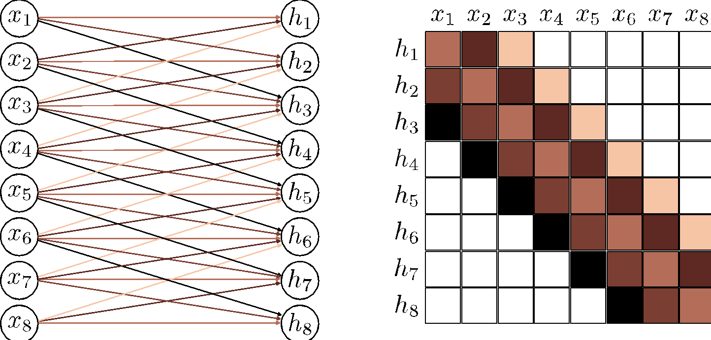
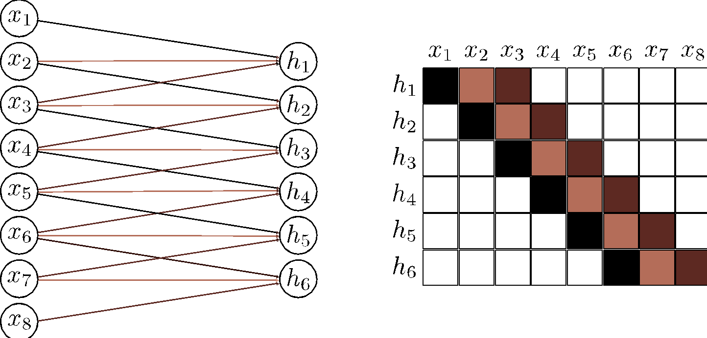
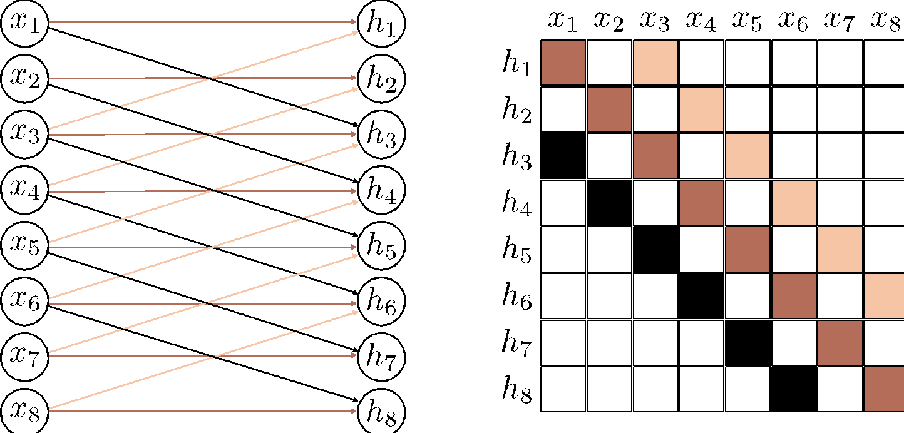
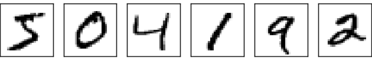
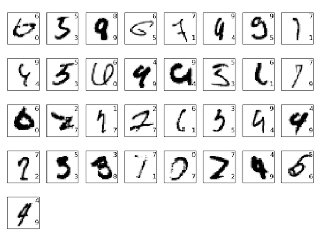
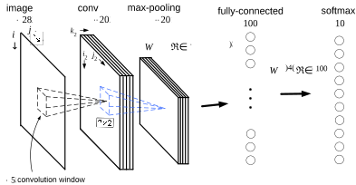
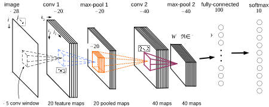
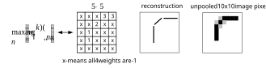
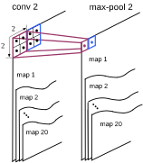
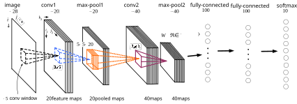

::: {.panel-tabset}

## Basics of Convolutional Neural Networks

::: {.column-margin}
Image credits: [Understanding Deep Learning](https://udlbook.github.io/udlbook) by Simon J. D. Prince, [CC BY 4.0]
:::

* A function $f(\cdot)$ is [invariant]{style="color: orange;"} to a transformation $t(\cdot)$ if
$$
f(t(x)) = f(x),
$$
that is, the function output is the same even after the transformation is applied.

* A function $f(\cdot)$ is [equivariant]{style="color: orange;"} to a transformation $t(\cdot)$ if
$$
f(t(x)) = t(f(x)),
$$
that is, the function output is transformed in the same way as the input.

![
  Invariance and equivariance for translation. 
  (a-b) In image classification, the goal is to categorize both images as "mountain" regardless of the horizontal 
  shift that has occurred. In other words, we require the network prediction to be invariant to translation.
  (c, e) The goal of semantic segmentation is to associate a label with each pixel.
  (d, f) When the input image is translated, we want the output (colored overlay) to translate in the same way. 
  In other words, we require the output to be equivariant with respect to translation.
](assets/images/ConvEquiInv.svg){.lightbox width=100% fig-align="center"}

### Convolutional Neural Networks for $1$D inputs

* Convolutional networks consist of convolutional layers, each of which is equivariant to translation.
  - If we translate the input $x$, then the corresponding output $z$ is translated in the same way.
  - For example, for a kernel size of three, we have
  $$
  z_i = \omega_1 x_{i-1} + \omega_2 x_i + \omega_3 x_{i+1}, 
  $$
  where $\bm{\omega} = \bmat{\omega_1 & \omega_2 & \omega_3}^\top$ is the kernel.
* They also typically include pooling mechanisms that induce partial invariance to translation.

![
  $1$D convolution with kernel size three. Each output $z_i$ is a weighted sum of the nearest three inputs 
  $x_{i-1}$, $x_i$, and $x_{i+1}$, where the weights are $\bm{\omega} = \bmat{\omega_1 & \omega_2 & \omega_3}$. 
  a) Output $z_2$ is computed as $z_2 = \omega_1 x_1 + \omega_2 x_2 + \omega_3 x_3$. b) Output $z_3$ is computed as 
  $z_3 = \omega_1 x_2 + \omega_2 x_3 + \omega_3 x_4$. c) At position $z_1$, the kernel extends beyond the first 
  input $x_1$. This can be handled by zero-padding, in which we assume values outside the input are zero. The final 
  output is treated similarly. d) Alternatively, we could only compute outputs where the kernel fits within the 
  input range ("valid" convolution); now, the output will be smaller than the input.
](assets/images/Conv1.svg){.lightbox width=100% fig-align="center"}

* [Stride]{style="color: orange;"} is the shift by $k$ positions for each output
  - Decreases size of output relative to input
* [Kernel size]{style="color: orange;"} weighs a different number of inputs for each output
  - Combine information from a smaller/larger area
  - Larger kernel sizes uses more parameters
* [Dilated]{style="color:orange;"} or [atrous]{style="color:orange;"} convolution intersperse kernel values with zeros
  - Combine information from a larger area
  - Fewer parameters

![
  Stride, kernel size, and dilation. 
  a) With a stride of two, we evaluate the kernel at every other position, so the first output $z_1$ is computed 
  from a weighted sum centered at $x_1$, and b) the second output $z_2$ is computed from a weighted sum centered 
  at $x_3$ and so on. c) The kernel size can also be changed. With a kernel size of five, we take a weighted sum 
  of the nearest five inputs. d) In dilated or atrous convolution, we intersperse zeros in the weight vector to 
  allow us to combine information over a large area using fewer weights.
](assets/images/Conv1a.svg){.lightbox width=100% fig-align="center"}

#### Convolutional Layers

* A convolutional layer computes its output by convolving the input, adding a bias $\beta$, and 
passing each result through an activation function $\sigma(\cdot)$.

$$
\begin{aligned}
\begin{split}
h_i &= \sigma(\beta + \omega_1 x_{i-1} + \omega_2 x_i + \omega_3 x_{i+1}) \\
&= \sigma\left( \beta + \sum_{j=1}^3 \omega_j x_{i+j-2} \right)
\end{split}
&\quad {\color{DodgerBlue} \class{thick-arrow}{\xleftarrow{\hspace{1cm}}}} \quad 
\text{3 weights, 1 bias}
\end{aligned}
$$

* This is a special case of a fully connected layer that computes the $i^{\text{th}}$ hidden unit as:
$$
\begin{aligned}
h_i &= \sigma\left( \beta_i + \sum_{j=1}^3 \omega_{ij} x_j \right)
&\quad {\color{DodgerBlue} \class{thick-arrow}{\xleftarrow{\hspace{1cm}}}} \quad 
\text{$D^2$ weights, D biases}
\end{aligned}
$$

* A fully connected layer can reproduce this exactly if most weights are set to zero and others are constrained 
to be identical.

![
  Fully connected vs. convolutional layers. \
  a) A fully connected layer has a weight connecting each input $x$ to each hidden unit $h$ (colored arrows)
  and a bias for each hidden unit (not shown).
  b) Hence, the associated weight matrix $\bm{\Omega}$ has 36 weights relating the six inputs to the six hidden 
  units.
  c) A convolutional layer with kernel size three computes each hidden unit as the same weighted sum of the three 
  neighboring inputs (arrows) plus a bias (not shown).
  d) The weight matrix is a special case of the fully connected matrix where many weights are zero and others are 
  repeated (same colors indicate same value, white indicates zero weight).
  e) A convolutional layer with kernel size three and stride two computes a weighted sum at every other position.
  f) This is also a special case of a fully connected network with a different sparse weight structure.
](assets/images/Conv2a.svg){.lightbox width=100% fig-align="center"}

::: {.callout-tip}
### Exercises
What are the kernel sizes, strides, dilations? Which ones are valid convolutions?

{.lightbox width=70% fig-align="center"}

{.lightbox width=70% fig-align="center"}

{.lightbox width=70% fig-align="center"}
:::

#### Channels

* If we only apply a single convolution, information will likely be lost
  * We are averaging nearby inputs
  * ReLU activation function clips results that are less than zero.
* It is usual to compute several convolutions in parallel.
  * Each convlution produces a new set of hidden variables, termed a [feature map]{style="color: orange;"} or [channel]{style="color: orange;"}.

![
  Channels. Typically, multiple convolutions are applied to the input $\bm{x}$ and stored in channels. \
  a) A convolution is applied to create hidden units $h_1$ to $h_6$, which form the first channel.
  b) A second convolution operation isa pplied to create hidden units $h_7$ to $h_{12}$, which form the 
  second channel. The channels are stored in a $2$D array $\bm{H}_1$ that contain all the hidden units 
  in the first hidden layer.
  c) If we add a further convolutional layer, there are now two channels at each input position. Here 
  the $1$D convolution defines a weighted sum over both input channels at the three closest positions 
  to create each new output channel.
](assets/images/Conv4a.svg){.lightbox width=100% fig-align="center"}

* In general, the input and the hidden layers all have multiple channels.
* If the incoming layer has $C_i$ channels and we select a kernel size $K$ per channel, 
the hidden units in each output channel are computed as a weighted sum over all $C_i$ channels 
and $K$ kernel entries using a weight matrix $\bm{\Omega} \in \R^{C_i \times K}$ and one bias.
  - Hence, if there are $C_o$ channels in the next layer, then we need 
  $\bm{\Omega} \in \R^{C_i \times C_o \times K}$ weights $\bm{\beta} \in \R^{C_o}$ biases.

#### Receptive fields

* Similar to fully connected networks, convolutional networks comprise a sequence of convolutional layers.
* The __receptive field__ of a hidden unit in the network is the region of the original input that feeds into it.

::: {.left-caption}
![
  Receptive fields for network with kernel width of three. \ 
  a) An input with eleven dimensions feeds into a hidden layer with three channels and convolution kernel 
  of size three. The pre-activations of the three lighlighted hidden units in the first hidden layer $\bm{H}_1$
  are different weighted sums of the nearest three inputs, so the receptive field in $\bm{H}_1$ has size three. \
  b) The pre-activations of the four highlights hidden units in layer $\bm{H}_2$ each take a weighted sum of the 
  three channels in layer $\bm{H}_1$ at each of the three nearest positions. Each hidden unit in layer $\bm{H}_1$
  weights the nearest three input positions. Hence, hidden units in $\bm{H}_2$ have a receptive field size of five. \
  c) The hidden units in the third layer (kernel size three, stride two) increases the receptive field size to seven. \
  d) By the time we add a fourth layer, the receptive field of the hidden units at position three have a 
  receptive field that covers the entire input.
](assets/images/ConvNetworkRF.svg){.lightbox width=100% fig-align="center"}
:::

#### Example: MNIST-1D

* The input $\bm{x}$ is a $40$D vector, and the output $\bm{f}$ is a $10$D vector, which is passed through a 
softmax layer to produce class probabilities.

{.lightbox width=100% fig-align="center"}

* Let us recall the performance of a fully-connected network we looked at in the previous chapters.

::: {.callout-tip}
### Fully Connected Network for MNIST-1D
* $D_i = 40$ inputs, $D_o = 10$ outputs, passed through $\operatorname{softmax}$ activation function.
* Two hidden layers with $D = 100$ hidden units each.
* Trained using SGD with batch size $100$ and learning rate $\eta = 0.1$ for $6000$ steps ($150$ epochs).
* Loss: multiway cross-entropy.
:::

{.lightbox width=100% fig-align="center"}

* Instead, let us try a convolutional network with three hidden layers as in the next figure.

::: {.left-caption}
![
  Convolutional network for classifying MNIST-1D data. The first convolutional layer has 15 channels, 
  kernel size three, stride two, and only retains "valid" positions to make a hidden layer with 
  nineteen positions and fifteen channels. The following two convolutional layers have the same setting, 
  gradually reducing the representation size at each subsequent hidden layer. Finally, a fully connected 
  layer takes all sixty hidden units from the third hidden layer. It outputs ten activations that are 
  subsequently passed through a $\operatorname{softmax}$ layer to produce the ten class probabilities.
](assets/images/ConvDrawMNIST1D.svg){.lightbox width=100% fig-align="center"}
:::

* This network was trained for $100,000$ steps using SGD without momentum, a learning rate of $0.01$, 
and a batch size of $100$ on a dataset of $4,000$ examples.
* The CNN has $2,050$ parameters, whereas a fully connected network with layer sizes $\bmat{285 & 135 & 60}$ 
would have $59,065$ parameters.
* The next figure shows both models fit the training data perfectly. However, the test error for the 
convolutional network is much less than for the fully connected network.

![
  MNIST-1D results. \
  a) The convolutional network from the previous figure eventually fits the training data perfectly and has 
  $\sim 17\%$ test error. \
  b) A fully connected network with the same number of hidden layers and the number of hidden units in each learns 
  the training data faster, but fails to generalize well with $\sim 40\%$ test error. \
  The latter model can reproduce the convolutional model in theory, but fails to do so. The convolutional 
  structure restricts the possible mappings to those that process every position similarly, and this restriction 
  improves performance.
](assets/images/ConvMNIST1D.svg){.lightbox width=100% fig-align="center"}

::: {.callout-note}
### Why does CNN outperform the fully-connected network?
* Better [inductive bias]{style="color: orange;"}, i.e., interpolates between the training data better
  - Because we have embodied some prior knowledge in the architecture:
    - forced the network to process each position in the input the same way.
* The fully connected network has to learn what each digit template looks like at every position.
* In contrast, the convolutional network shares information across positions and hence learns to 
identify each category more accurately.
* Searches through a smaller family of input/output mappings, all of which are plausible.
:::

### Convolutional Neural Networks for $2$D inputs

* The convolutional kernel is now a $2$D object.
* For example, a $3 \times 3$ kernel $\Omega \in \R^{3 \times 3}$ applied to a $2$D input 
comprising of elements $x_{ij}$ computes a single layer of hidden units $h_{ij}$ as 
$$
h_{ij} = \sigma\left( \beta + \sum_{m=-1}^{1} \sum_{n=-1}^{1} \omega_{mn} x_{i+m, j+n} \right)
$$

::: {.left-caption}
{.lightbox width=100% fig-align="center"}
:::

* Often, the input is an RGB image, which is treated as a $2$D signal with three channels.
* Here, a $3 \times 3$ kernel would have $3 \times 3 \times 3$ weights and be applied to the 
three input channels at each of the $3 \times 3$ positions to create a $2$D output that is the 
same height and width as the input image (assuming zero-padding).
* To generate multiple output channels, we repeat this process with different kernel weights and 
append the result to form a $3$D [tensor]{}{style="color: dodgerblue;"}
* If the kernel size is $K \times K$, and there are $C_i$ input channels, each output channel is a 
weighted sum of $C_i \times K \times K$ quantities plus one bias.
  - It follows that to compute $C_o$ output channels, we need $C_i \times C_o \times K \times K$ 
  weights and $C_o$ biases.

::: {.left-caption}
![
  2D convolutional layer applied to an image. The image is treated as a $2$D input with three channels 
  corresponding to red, green, and blue components. With a $3 \times 3$ kernel, each pre-activation in 
  the first hidden layer is computed by pointwise multiplying the $3 \times 3 \times 3$ kernel weights 
  with the $3 \times 3$ RGB image patch centered at the same position, summing, and adding the bias. 
  To calculate all the pre-activations in the hidden layer, we "slide" the kernel over the image in both
  horizontal and vertical directions. The output is a $2$D layer of hidden units. To create multiple 
  output channels, we would repeat this process with multiple kernels, resulting in a $3$D tensor of 
  hidden units at hidden layer $\bm{H}_1$.
](assets/images/ConvImage.svg){.lightbox width=100% fig-align="center"}
:::

### Downsampling and upsampling

#### Downsampling

* Note that the _max pooling_ operation induces some level of invariance to translation.
  - If the input is shifted by one pixel, many of these maximum values remain the same.

::: {.left-caption}
![
  Methods for scaling down representation size (downsampling). \
  a) Subsampling. The original $4 \times 4$ representation (left) is reduced to size $2 \times 2$ 
  (right) by retaining every other input. Colors on the left indicate which inputs contribute to 
  the outputs on the right. This is effectively what happens with a kernel of stride two, except 
  that the intermediate values are never computed. \
  b) Max pooling. Each output comprises the maximum value of the corresponding $2 \times 2$ block. \
  c) Mean pooling. Each output is the mean of the values in the $2 \times 2$ block.
](assets/images/ConvDown.svg){.lightbox width=100% fig-align="center"}
:::

#### Upsampling

::: {.left-caption}
{.lightbox width=100% fig-align="center"}
:::

* There is yet a fourth approach, which is roughly analogous to downsampling using a stride of two.
  - Recall: in that method there were half as many outputs as inputs.
  - For kernel size three, each output was a weighted sum of the three closest inputs.
* In _transposed convolution_, this picture is reversed.
  - There are twice as many outputs as inputs
  - Each input contributes to three of the outputs.
* When we consider the associated weight matrix of this upsampling mechanism, we see that it is 
the transpose of the matrix for the downsampling mechanism!

::: {.left-caption}
{.lightbox width=100% fig-align="center"}
:::

#### Changing the number of channels

* Sometimes we want to change the number of channels between one hidden layer and the next without further 
spatial pooling. 
   - Usually done so we can combine the representation with another parallel computation (ResNets).
* To accomplish this, we apply convolution with kernel size one. 
  - Each element of the output layer is computed by taking a weighted sum of all the channels at the same 
  position.
  - We can repeat this multiple times with different weights to generate as many output channels as we need.
* The associated convolution weights have size $1 \times 1 \times C_i \times C_o$. 
  - Hence, this is known as $1 \times 1$ _convolution_.
* Combined with a bias and activation function, it is equivalent to running the same fully connected 
network on the input channels at every position.

::: {.left-caption}
{.lightbox width=100% fig-align="center"}
:::

## Convolutional Neural Networks for MNIST

::: {.column-margin}
Image credits: [Deep Learning](http://neuralnetworksanddeeplearning.com) by Michael Nielsen
:::

We will use convolutional nets to classify the digits of MNIST

{.lightbox width=80% fig-align="center"}

* State of the art: \nicefrac{9,967}{10,000} = 99.67\% MNIST test digits can be correctly classified.
* The incorrect classifications are shown below:
  - The number at the top right is the correct classification.
  - The number at the bottom right is the network's classification.

{.lightbox width=80% fig-align="center"}

#### First CNN trial

* Recall, we previously obtained approximately $98\%$ accuracy on the test data
  - That was a $\bmat{784 & 100 & 10}$ network using BCE loss.
  - Hyperparameters: $\lambda = 5.0$, $\eta = 0.1$, $\abs{\mc{B}} = 10$, $n_{\text{epochs}}  = 60$.

* Let's start with a simple conv/pool layer.
* Next, go from a max-pool maps to a fully-connected layer with $100$ neurons.
* The final layer is to connect the $100$ neurons to $10$ $\operatorname{softmax}$ neurons.

{.lightbox width=80% fig-align="center"}

* M. Nielsen obtains an accuracy of $98.78\%$ on the test data with this configuration.

#### Second CNN iteration

{.lightbox width=80% fig-align="center"}

* Second convolution layer: function from the $20$ pooling maps to $40$ output maps.
* The activations feeding into the second convolution layer are the outputs from the max-pool neurons.

::: {.callout-important}
### Interpreting the Weight Tensor
* Suppose the first conv layer has only $4$ maps instead of $20$.
* $w_{\ell, m, n}^{(k)} \in \R^{5 \times 5 \times 4}$, $k = 1, \dots, 40$: weight tensors from the 
$1^{\text{st}}$ conv/pool layer to the $2^{\text{nd}}$ conv layer.
* Assume that the network has been trained. What could the kernels $w_{\ell, m, n}^{(k)}$ be looking for?
* For each fixed $(\ell, m)$ one of the four weights $w_{\ell, m, 1}^{(k)}, w_{\ell, m, 2}^{(k)}, w_{\ell, m, 3}^{(k)}, w_{\ell, m, 4}^{(k)}$ will be close to $1$ and the other three will be close to $-1$ (or perhaps all four weights 
are close to $-1$).

{.lightbox width=80% fig-align="center"}

* Choose (reconstruct) direction $1$ if $w_{\ell, m, 1}^{(k)}$ is maximum, direction $2$ if $w_{\ell, m, 2}^{(k)}$ is maximum, etc.

{.lightbox width=80% fig-align="center"}
:::

* The max-pool window is $2 \times 2$ with a _stride_ of $2$.

{.lightbox width=40% fig-align="center"}

* Map 1 of conv 2 goes to map 1 of max-pool 2, etc.

* The $4 \times 4 \times 20$ max-pool 2 neurons are fully connected to a layer of $100$ neurons
* These $100$ neurons are fully connected to the $10$ $\operatorname{softmax}$ neurons
* These are trained with the BCE loss to yield an **accuracy** on the test data of $98.7\%$.

::: {.callout-note}
### Why a second convolutional-pooling layer?
* The $2^{\text{nd}}$ conv layer constructs the $40$ tensors $w^{(k)} \in \R^{5 \times 5 \times 20}$ for $k = 1, \dots, 40$.
* The input to the $2^{\text{nd}}$ conv layer are the $20$ pooled "images" (features) from the $1^{\text{st}}$ conv/pool layer.
* These $20$ pooled "images" are abstract and condensed, but have a lot of spatial structure.
* The $2^{\text{nd}}$ conv layer develops $40$ tensors to characterize this spatial structure.
:::

* If we further
  - add regularization to the training,
  - use ReLU instead of sigmoid activations on the hidden layers
* We obtain an accuracy on the test data of $99.2\%$!
* Note that the classification accuracy on the __test data__ should be done using the weights 
from the training epoch with the best classification accuracy on the __validation data__.
* Empirically ReLUs give better classification accuracy than sigmoids.
* We further apply dropout on the fully connected layers.

#### Final Network

* We add a secondary fully connected layer of $100$ neurons before the $\operatorname{softmax}$ output layer.
* We augment the $50,000$ training images with $200,000$ distorted images (translations, rotations, scaling, etc.)

{.lightbox width=80% fig-align="center"}

* Training this final CNN on the augmented dataset yields a test accuracy of $99.6\%$!

::: {.callout-important}
### Why are we able to train?
* We set up a loss function and update weights/bias according to gradient descent.
* Output layer: changed from a squared error to BCE loss to avoid vanishing gradients
* Hidden layer: changed from sigmoid to ReLU to avoid vanishing gradients
* Used conv/pool layers to find patterns (representation learning)
  - These use a lot fewer weights than FC layers.
* Weight regularization to reduce overfitting
* Use dropout to force all the neurons to be involved in the learning.
* Used data augmentation to force the network to learn the right stuff.
:::

:::