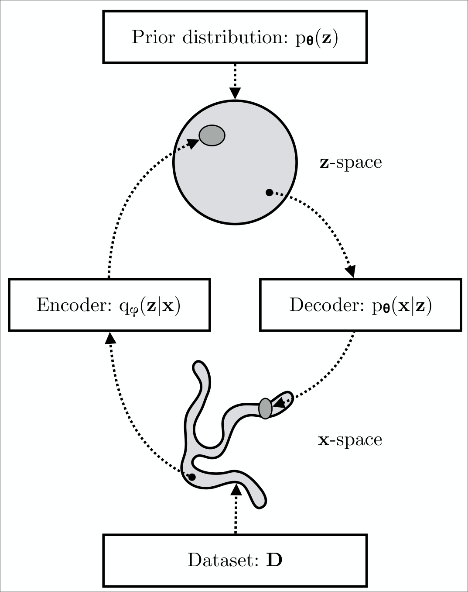

* _Variational autoencoders_ (VAEs) are _probabilisitic generative models_.
  - They aim to learn a distribution $p(x)$ over the data.
  - After training, it is possible to draw (generate) samples from this distribution.
  - Unfortunately, it is not possible to compute the log-likelihood of a sample $x^*$ exactly.
* It is possible to define a lower bound on the likelihood. 
  - The VAE approximates this bound using a Monte Carlo sampling approach.

::: {.panel-tabset}

## Theory

::: {.column-margin}
Image credits: 
[Understanding Deep Learning](https://udlbook.github.io/udlbook) by Simon J. D. Prince, [CC BY 4.0] and \
[An Introduction to Variational Autoencoders](https://arxiv.org/abs/1906.02691) by Kingma, D. P. and Welling, M.
:::

### Linear latent variable models

* LVMs model a joint distribution $p(\bm{x}, \bm{z})$ of the data $\bm{x}$ and a _latent variable_ $\bm{z}$.
* They then describe $p(\bm{x})$ as the marginal distribution of the joint distribution:
$$
    p(\bm{x}) = \int p(\bm{x}, \bm{z}) d\bm{z} = \int p(\bm{x} | \bm{z}) p(\bm{z}) d\bm{z}.
$$
* This is a rather indirect approach to describint $p(\bm{x})$.
  - Useful because expressions for $p(\bm{x} | \bm{z})$ and $p(\bm{z})$ are often much simpler than that for $p(\bm{x})$.

::: {.callout-tip}
### Example: Gaussian Mixture Models
* Let's take a $1$D mixture of Gaussians
  - $z$ is discrete: $p(z)$ is a categorical distribution with probability $\lambda_n$ for every possible value of $z$.
  - The likelihood $p(x \mid z = n)$ of the data is normally distributed with mean $\mu_n$ and variance $\sigma_n^2$.
$$
\begin{aligned}
  p(z = n) &= \lambda_n \\
  p(x \mid z = n) &= \mathcal{N}(x \mid \mu_n, \sigma_n^2).
\end{aligned}
$$
* The data likelihood is given by marginalizing over the latent variable $z$
$$
    p(x) = \sum_{n=1}^N p(x, z=n) = \sum_{n=1}^N p(x \mid z=n) p(z=n) = \sum_{n=1}^N \lambda_n \mathcal{N}(x \mid \mu_n, \sigma_n^2).
$$
* Note that the likelihood and prior are both simple expressions, but the resulting data likelihood is multimodal!
:::

::: {.left-caption}
{.lightbox width="80%" fig-align="center"}
:::

### Nonlinear latent variable models

In a nonlinear latent variable model, both the data $\bm{x}$ and the latent variable $\bm{z}$ are continuous and multivariate.

* Both the prior $p(\bm{z})$ and the likelihood $p(\bm{x} \mid \bm{z})$ are normally distributed.
  - $p(\bm{z}) = \mathcal{N}(\bm{z} \mid \bm{0}, \bm{I})$
  - $p(\bm{x} \mid \bm{z}, \bm{\theta}) = \mathcal{N}(\bm{x} \mid \mu(\bm{z}), \Sigma(\bm{z}))$
* Say, the likelihood is modeling a continuous variable: the mean and covariance are given by neural networks
  - Many times the covariance is fixed and assumed to be diagonal: $\Sigma(\bm{z}) = \sigma^2 \bm{I}$ ($\sigma$ can be learned, too)
  - The mean is given by a neural network: $\mu(\bm{z}) = f(\bm{z}; \bm{\theta})$
* The latent variable $\bm{z}$ is lower dimensional than the data $\bm{x}$.
* In this example, the data probability $p(\bm{x} \mid \bm{\theta})$ is found by marginalizing over the latent variable $\bm{z}$
$$ p(\bm{x} \mid \bm{\theta}) = \int p(\bm{x} \mid \bm{z}, \bm{\theta}) p(\bm{z}) d\bm{z} = \int \mathcal{N}\left(\bm{x} \mid f(\bm{z}; \bm{\theta}), \sigma^2 \bm{I}\right) \mathcal{N}(\bm{z} \mid \bm{0}, \bm{I}) d\bm{z} $$

::: {.left-caption}
![
  Nonlinear latent variable model. A complex $2$D density $p(\bm{x})$ (right) is created as 
  the marginalization of the joint distribution $p(\bm{x}, z)$ (left) over the latent 
  variable $z$; to create $p(\bm{x})$, we integrate the $3$D volume over the dimension $z$. 
  For each $z$, the distribution over $\bm{x}$ is a spherical Gaussian (two slices shown) 
  with a mean $f(\bm{z}; \bm{\theta})$ that is a nonlinear function of $z$ and depends 
  on parameters $\theta$. The distribution $p(\bm{x})$ is a weighted sum of these Gaussians.
](assets/images/VAENonLinearLVM_th.svg){.lightbox width="80%" fig-align="center"}
:::

* This can be viewed as an infinite weighted sum (i.e., an infinite mixture)
  - Mixture is of spherical Gaussians with different means
  - The weights are $p(\bm{z})$ and the means are $f(\bm{z}; \bm{\theta})$

#### Generation

A new example $\bm{x}^*$ is generated by [ancestral sampling]{style="color:dodgerblue;"}.

* Draw $\bm{z}^* \sim p(\bm{z})$
* Draw $\bm{x}^* \sim p(\bm{x} \mid \bm{z}^*)$
  - Pass $\bm{z}^*$ through the decoder network $f(\bm{z}^*; \bm{\theta})$ to compute the mean of $p(\bm{x} \mid \bm{z}^*)$
  - Draw $\bm{x}^*$ from $\mathcal{N}(\bm{x}^* \mid f(\bm{z}^*; \bm{\theta}), \sigma^2 \bm{I})$

::: {.left-caption}
{.lightbox width="80%" fig-align="center"}
:::

### Training

* We want to maximize the log-likelihood over a training dataset $\{ \bm{x}_i \}_{i=1}^I$ with respect to $\bm{\theta}$
$$ 
    \bm{\theta}^* = \arg\max_{\bm{\theta}} \sum_{i=1}^I \log p(\bm{x}_i \mid \bm{\theta}) = \argmax_{\bm{\theta}} \sum_{i=1}^I \log \int p(\bm{x}_i \mid \bm{z}, \bm{\theta}) p(\bm{z}) d\bm{z},
$$ {#eq-loglikelihood}
where for the Gaussian likelihood example, we would have 
$$
    p(\bm{x}_i \mid \bm{\theta}) = \int \mathcal{N}\left(\bm{x}_i \mid f(\bm{z}; \bm{\theta}), \sigma^2 \bm{I}\right) \mathcal{N}(\bm{z} \mid \bm{0}, \bm{I}) d\bm{z}.
$$
* Unfortunately, this is intractable to compute directly.
  - No closed-form expression for the integral
  - No easy way to evaluate it for a particular value of $\bm{x}$
* To make progress, we define a _lower bound_ on the log-likelihood.
  - Always less than or equal to the log-likelihood for a given value of $\bm{\theta}$
  - Depends on some other parameters $\bm{\phi}$
  - We will build a network to compute this lower bound and optimize it.

::: {.callout-important}
### Jensen's inequality
A [concave function]{style="color:dodgerblue;"} $g(\cdot)$ of the expectation of data $y$ 
is greater than or equal to the expectation of the function of the data:
$$
    g\left(\mathbb{E}[y]\right) \geq \mathbb{E}[g(y)].
$$
:::

* Using Jensen's equality with $g = \log$, we obtain
$$
\log \E(y) = \log \int p(y)y dy \geq \int p(y) \log{(y)} dy = \E \log{y}.
$$
* In fact, the slightly more general statement is true:
$$
\log \int p(y)h(y)dy \geq \int p(y) \log{(h(y))}dy,
$$
for some function $h(y)$ of $y$.

* The intractability of $p(\bm{x} \mid \theta)$ is related to the intractability 
of the posterior distribution $p(\bm{z} \mid \bm{x}, \bm{\theta})$.
  - Note that the joint distribution $p(\bm{x}, \bm{z} \mid \theta)$ is 
  efficient to compute and we have
$$
p(\bm{z} \mid \bm{x}, \bm{\theta}) = \frac{p(\bm{x}, \bm{z} \mid \bm{\theta})}{p(\bm{x} \mid \bm{\theta})}
$$
  - Since $p(\bm{x}, \bm{z} \mid \bm{\theta})$ _is_ tractable to compute, a tractable marginal 
  likelihood $p(\bm{x} \mid \bm{\theta})$ leads to a tractable posterior $p(\bm{z} \mid \bm{x}, \bm{\theta})$, 
  and vice versa. Both are _intractable_!

::: {.left-caption}
![
  Posterior distribution over the latent variable. a) The posterior distribution $p(z \mid \bm{x}^*, \bm{\theta})$
  is the distribution over the values of the latent variable $z$ that could be responsible for a data point $\bm{x}^*$. 
  We calculate this via Bayes's rule $p(z \mid \bm{x}^*, \bm{\theta}) \propto p(\bm{x}^* \mid z, \bm{\theta}) p(z)$.
  b) We compute the first term on the right hand side (the likelihood) by assessing the probability of $\bm{x}^*$ 
  against the symmetric Gaussian associated with each value of $z$. Here, it was more likely to have been created 
  from $z_1$ than $z_2$. The second term is the prior probability $p(z)$ over the latent variable. Combining these 
  two factors and normalizing so the distribution sums to one gives us the posterior distribution $p(z \mid \bm{x}^*, \bm{\theta})$.
](assets/images/VAENonLinearLVMPost2_th.svg){.lightbox width="80%" fig-align="center"}
:::

* Let us introduce a parametric _inference model_ $q(\bm{z} \mid \bm{x}, \bm{\phi})$.
  - Also called an _encoder_ or _recognition model_.
  - With $\bm{\phi}$, we indicate the _variational parameters_. 
  - We optimize the variational parameters $\bm{\phi}$ such that $$ q(\bm{z} \mid \bm{x}, \bm{\phi}) \approx p(\bm{z} \mid \bm{x}, \bm{\theta}). $$ 

* For any choice of inference model $q(\bm{z} \mid \bm{x}, \bm{\phi})$, including the choice of 
variational parameters $\bm{\phi}$, we have
$$
\begin{aligned}
\log p(\bm{x} \mid \bm{\theta}) &= \E_{q(\bm{z} \mid \bm{x}, \bm{\phi})}[\log p(\bm{x} \mid \bm{\theta})] \\
&= \E_{q(\bm{z} \mid \bm{x}, \bm{\phi})}\left[ \log \left( \frac{p(\bm{x}, \bm{z} \mid \bm{\theta})}{p(\bm{z} \mid \bm{x}, \bm{\theta})} \right) \right] \\
&= \E_{q(\bm{z} \mid \bm{x}, \bm{\phi})}\left[ \log \left( \frac{p(\bm{x}, \bm{z} \mid \bm{\theta})}{q(\bm{z} \mid \bm{x}, \bm{\phi})} 
\frac{q(\bm{z} \mid \bm{x}, \bm{\phi})}{p(\bm{z} \mid \bm{x}, \bm{\theta})} \right) \right] \\
&= \underbrace{\E_{q(\bm{z} \mid \bm{x}, \bm{\phi})}\left[ \log \left( \frac{p(\bm{x}, \bm{z} \mid \bm{\theta})}{q(\bm{z} \mid \bm{x}, \bm{\phi})} \right) \right]}_{=\mc{L}_{\theta, \phi}(x) \\[1pt] \text{(ELBO)}} + \underbrace{\E_{q(\bm{z} \mid \bm{x}, \bm{\phi})}\left[ \log \left( \frac{q(\bm{z} \mid \bm{x}, \bm{\phi})}{p(\bm{z} \mid \bm{x}, \bm{\theta})} \right) \right]}_{=D_{\text{KL}}(q(\bm{z} \mid \bm{x}, \bm{\phi})\;\Vert\; p(\bm{z} \mid \bm{x}, \bm{\theta}))}
\end{aligned}
$$ {#eq-evidence}

* The second term is the Kullback-Leibler (KL) divergence which is nonnegative:
$$
D_{\text{KL}}(q(\bm{z} \mid \bm{x}, \bm{\phi})\;\Vert\; p(\bm{z} \mid \bm{x}, \bm{\theta})) \geq 0 $$
and zero if and only if $q(\bm{z} \mid \bm{x}, \bm{\phi}) = p(\bm{z} \mid \bm{x}, \bm{\theta})$.

* The first term is the _variational lower bound_, also called the _evidence lower bound_ (ELBO):
$$
\mc{L}_{\theta, \phi}(x) = \E_{q_\phi(\bm{z} \mid \bm{x})} \left[ \log p_\theta(\bm{x}, \bm{z}) - \log q_\phi(\bm{z} \mid \bm{x}) \right]
$$ {#eq-elbo}

* Due to the nonnegativity of the KL divergence, the ELBO is a lower bound on the 
log-likelihood of the data:
$$
\mc{L}_{\theta, \phi}(\bm{x}) = \log p_\theta(\bm{x}) - D_{\text{KL}}\left(q_\phi(\bm{z} \mid \bm{x})\,\Vert\,p_\theta(\bm{z} \mid \bm{x})\right)
\leq \log p_\theta(\bm{x}).
$$ {#eq-tightness}

* Hence, the KL divergence $D_{\text{KL}}\left(q_\phi(\bm{z} \mid \bm{x})\,\Vert\,p_\theta(\bm{z} \mid \bm{x})\right)$ determines two "distances":
  1. By definition, the KL divergence of the approximate posterior from the true posterior.
  2. The gap between the ELBO $\mc{L}_{\theta, \phi}(\bm{x})$ and the marginal likelihood $\log p_\theta(\bm{x})$.
    - The latter is also called the _tightness_ of the bound.
    - The better $q_\phi(\bm{z} \mid \bm{x})$ approximates the true (posterior) distribution $p_\theta(\bm{z} \mid \bm{x})$, 
    in terms of the KL divergence, the smaller the gap.

::: {.left-caption}
![
  Variational approximation. The posterior $p(\bm{z} \mid \bm{x}^*, \bm{\theta})$ is intractable 
  to compute. The variational approximation chooses a family of distributions $q(\bm{z} \mid \bm{x}, \bm{\phi})$
  (here Gaussians) and tries to find the closest member of this family to the true posterior. a) Sometimes, the 
  approximation (cyan curve) is good and lies close tot he true posterior (orange curve). b) However, if the 
  posterior is multi-modal (as in the previous figure), then the Gaussian approximation will be poor.
](assets/images/VAEVariational_swap.svg){.lightbox width="80%" fig-align="center"}
:::

::: {.callout-tip}
### Two for One
By looking at @eq-tightness, it can be understood that maximization of the ELBO $\mc{L}_{\theta, \phi}(x)$ with respect to 
$\bm{\theta}$ and $\bm{\phi}$, will concurrently optimize the two things we care about:

1. It will approximately maximize the marginal likelihood $p_\theta(\bm{x})$. This means that our _generative model_ or 
_decoder_ will become better. 
2. It will minimize the KL divergence of the approximation $q_\phi(\bm{z} \mid \bm{x})$ from the true posterior 
$p_\theta(\bm{z} \mid \bm{x})$, so $q_\phi(\bm{z} \mid \bm{x})$ becomes better.
:::

::: {.callout-caution}
### ELBO through Jensen's inequality
We can also see that the ELBO is a lower bound on the log-likelihood by using Jensen's inequality. 
$$
\begin{aligned}
\log p(\bm{x} \mid \bm{\theta}) &= \log \int p(\bm{x}, \bm{z} \mid \bm{\theta}) d\bm{z} 
= \log \int p(\bm{x}, \bm{z} \mid \bm{\theta}) \frac{q(\bm{z} \mid \bm{x}, \bm{\phi})}{q(\bm{z} \mid \bm{x}, \bm{\phi})} d\bm{z}
= \log \E_{q(\bm{z} \mid \bm{x}, \bm{\phi})} \left[ \frac{p(\bm{x}, \bm{z} \mid \bm{\theta})}{q(\bm{z} \mid \bm{x}, \bm{\phi})} \right] \\
&\geq \E_{q(\bm{z} \mid \bm{x}, \bm{\phi})} \left[ \log \frac{p(\bm{x}, \bm{z} \mid \bm{\theta})}{q(\bm{z} \mid \bm{x}, \bm{\phi})} \right] 
= \mc{L}_{\theta, \phi}(x)
\end{aligned}
$$
:::

::: {.left-caption}
![
  Evidence lower bound (ELBO). The goal is to maximize the log-likelihood $\log p_\theta(\bm{x})$ (black curve)
  with respect to the parameters $\bm{\theta}$. The ELBO is a function that lies everywhere below the log-likelihood.
  It is a function of both $\bm{\theta}$ and a second set of parameters $\bm{\phi}$. For fixed $\bm{\phi}$, we get 
  a function of $\bm{\theta}$ (two colored curves for different values of $\bm{\phi}$). Consequently, we can 
  increase the log-likelihood by either improving the ELBO with respect to a) the new parameters $\bm{\phi}$ 
  (moving from colored curve to colored curve) or b) the original parameters $\bm{\theta}$ (moving along the 
  current colored curve).
](assets/images/VAEELBO_th.svg){.lightbox width="80%" fig-align="center"}
:::

::: {.callout-warning}
### Two Models to Learn
1. Encoder or Recognition or Inference Model
$$
\begin{aligned}
(\bm{\mu}, \log \bm{\sigma}) &= \operatorname{EncoderNeuralNet}_\phi(\bm{x}) \\
q_\phi(\bm{z} \mid \bm{x}) &= \mc{N}(\bm{z}; \bm{\mu}, \operatorname{diag}{(\bm{\sigma})}).
\end{aligned}
$$

2. Decoder or Generative Model (Binary Data)
$$
\begin{aligned}
\bm{p} &= \operatorname{DecoderNeuralNet_\theta(\bm{z})} \\
\log p_\theta(\bm{x} \mid \bm{z}) &= \sum_{j=1}^D \log p(x_j \mid \bm{z}) = \sum_{j=1}^D \operatorname{Bernoulli(x_j; p_j)} \\
&= \sum_{j=1}^D \left[ x_j \log p_j + (1-x_j) \log(1-p_j) \right]
\end{aligned}
$$
where $\forall p_j \in \bm{p}; 0 \leq p_j \leq 1$ (e.g. implemented through a sigmoid nonlinearity 
as the last layer of the $\operatorname{DecoderNeuralNet}_\theta(\cdot)$), where $D$ is the dimensionality 
of $\bm{x}$, and $\operatorname{Bernoulli}(\cdot; p)$ is the probability mass function of the Bernoulli 
distribution.
:::

{.lightbox width=80% fig-align="center"}

::: {.callout-note}
### Summary
Since we the log-likelihood is intractable to compute, we cannot perform the
optimization in @eq-loglikelihood.  Instead, we will maximize the ELBO
$\mc{L}_{\theta, \phi}(x)$ with respect to both the decoder and encoder
$(\bm{\theta}, \bm{\phi})$ as a proxy.
:::

::: {.left-caption}
![
  Variational autoencoder. The encoder $g(\bm{x}; \bm{\theta})$ takes a training 
  example $\bm{x}$ and predicts the parameters $\bm{\mu}, \bm{\Sigma}$ of the 
  variational distribution $q_\theta(\bm{z} \mid \bm{x})$. We sample from this 
  distribution and then use the decoder $f(\bm{z}; \bm{\phi})$ to predict the 
  data $\bm{x}$. The loss function is the negative ELBO, which depends on how accurate 
  this prediction is and how similar the variational distribution $q_\phi(\bm{z} \mid \bm{x})$
  is to the prior $p(\bm{z})$.
](assets/images/VAEArch_swap.svg){.lightbox width=80% fig-align="center"}
:::

### How to maximize ELBO?

* Unbiased gradients of the ELBO with respect to the generative model parameters $\bm{\theta}$ 
are simple to obtain:
$$
\begin{aligned}
\nabla_\theta \mc{L}_{\theta, \phi}(x) &= \nabla_\theta \E_{q_\phi(\bm{z} \mid \bm{x})} \left[\log p_\theta(\bm{x}, \bm{z}) - \log q_\phi(\bm{z} \mid \bm{x}) \right] \\
&= \E_{q_\phi(\bm{z} \mid \bm{x})} \left[\nabla_\theta\left( \log p_\theta(\bm{x}, \bm{z}) - \log q_\phi(\bm{z} \mid \bm{x}) \right) \right] \\
&\simeq \nabla_\theta\left( \log p_\theta(\bm{x}, \bm{z}) - \log q_\phi(\bm{z} \mid \bm{x}) \right) \\
&= \nabla_\theta \log p_\theta(\bm{x}, \bm{z}).
\end{aligned}
$$
The last line is a simple Monte Carlo estimator of the second line, where $\bm{z}$ in the last two lines is a 
random sample from $q_\phi(\bm{z} \mid \bm{x})$.

* Unbiased gradients with respect to the _variational_ parmaeters $\bm{\phi}$ are more 
difficult to obtain.
  - ELBO's expectation is taken with respect to the distribution $q_\phi(\bm{z} \mid \bm{x})$.
  - This is a function of $\bm{\phi}$!

$$
\begin{aligned}
\nabla_\phi \mc{L}_{\theta, \phi}(\bm{x}) &= \nabla_\phi \E_{q_\phi(\bm{z} \mid \bm{x})} \left[\log p_\theta(\bm{x}, \bm{z}) - \log q_\phi(\bm{z} \mid \bm{x}) \right] \\
&\neq \E_{q_\phi(\bm{z} \mid \bm{x})} \left[\nabla_\phi \left( \log p_\theta(\bm{x}, \bm{z}) - \log q_\phi(\bm{z} \mid \bm{x}) \right) \right]
\end{aligned}
$$

::: {.callout-important}
### The reparametrization trick (law of the unconscious statistician: lotus)
For continuous latent variables and a differentiable encoder and 
generative model, the ELBO can be straightforwardly differentiated with respect to 
both $\bm{\phi}$ and $\bm{\theta}$ through a change of variables, also called the 
_reparametrization trick_.

* Express the random variable $\bm{z} \sim q_\phi(\bm{z} \mid \bm{x})$ as some 
differentiable (and invertible) transformation.
  - This is a function of another random variable $\bm{\varepsilon}$, given $\bm{z}$ and $\bm{\phi}$:
  $$ \bm{z} = \bm{h}(\bm{\varepsilon}, \bm{\phi}, \bm{x}) $$
  - The random variable $\bm{\varepsilon}$ is independent of $\bm{x}$ or $\bm{\phi}$.
* Now, the expectations can be rewritten in terms of $\bm{\varepsilon}$:
$$ \E_{q_\phi(\bm{z} \mid \bm{x})}[f(\bm{z})] = \E_{p(\bm{\varepsilon})}[f(\bm{z})]. $$
* This makes the expectation and gradient operators commutative, and we can form a simple 
Monte Carlo estimator:
$$
\begin{aligned}
\nabla_\phi \E_{q_\phi(\bm{z} \mid \bm{x})}[f(\bm{z})] &= \nabla_\phi \E_{p(\bm{\varepsilon})}[f(\bm{z})] \\
&= \E_{p(\bm{\varepsilon})}[\nabla_\phi f(\bm{z})] \\
&\simeq \nabla_\phi f(\bm{z})
\end{aligned}
$$
where in the last line, $\bm{z} = h(\bm{\varepsilon}, \bm{\phi}, \bm{x})$ with random noise sample $\bm{\varepsilon} \sim p(\bm{\varepsilon})$.
:::

::: {.left-caption}
![
  Reparametrization trick. The variational parameters $\bm{\phi}$ affect the objective $f$ through the 
  random variable $\bm{z} \sim q_\phi(\bm{z} \mid \bm{x})$. We wish to compute gradients $\nabla_\phi f$ 
  to optimize the objective with SGD. In the original form (left), we cannot differentiate $f$ w.r.t. 
  $\bm{\phi}$, because we cannot directly backpropagate gradients through the random variable $\bm{z}$. 
  We can "externalize" the randomness in $\bm{z}$ by re-parametrizing the variable as a deterministic and 
  differentiable function of $\bm{\phi}$, $bm{x}$, and a newly introduced random variable $\bm{\varepsilon}$ 
  (right). This allows us to "backprop through $\bm{z}$," and compute gradients $\nabla_\phi f$.
](assets/images/trick.png){.lightbox width=80% fig-align="center"}
:::

::: {.callout-note}
### Gradient of ELBO
* Under the reparametrization, we can replace an expectation with respect to $q_\phi(\bm{z} \mid \bm{x})$ with 
one with respect to $p(\bm{\varepsilon})$.
  - Now, the ELBO can be written as
$$
\begin{aligned}
\mc{L}_{\theta, \phi}(\bm{x}) &= \E_{q_\phi(\bm{z} \mid \bm{x})} \left[ \log p_\theta(\bm{x}, \bm{z}) - \log q_\phi(\bm{z} \mid \bm{x}) \right] \\
&= \E_{p(\bm{\varepsilon})} \left[ \log p_\theta(\bm{x}, \bm{z}) - \log q_\phi(\bm{z} \mid \bm{x}) \right],
\end{aligned}
$$
where $\bm{z} = \bm{h}(\bm{\varepsilon}, \bm{\phi}, \bm{x})$.

* As a result, we can form a simple Monte Carlo estimator $\tilde{\mc{L}}_{\theta, \phi}(\bm{x})$:
$$
\begin{aligned}
\bm{\varepsilon} &\sim p(\bm{\varepsilon}) \\
\bm{z} &= \bm{h}(\bm{\varepsilon}, \bm{\phi}, \bm{x}) \\
\tilde{\mc{L}}_{\theta, \phi}(\bm{x}) &= \log p_\theta(\bm{x}, \bm{z}) - \log q_\phi(\bm{z} \mid \bm{x})
\end{aligned}
$$

* The resulting gradient $\nabla_\phi \tilde{\mc{L}}_{\theta, \phi}(\bm{x})$ is used to optimize the ELBO using minibatch SGD.
:::

::: {.left-caption}
{.lightbox width=80% fig-align="center"}
:::

{.lightbox width=80% fig-align="center"}

## Additional Perspectives

::: {.column-margin}
Credits: [Introduction to Flow Matching and Diffusion Models](https://diffusion.csail.mit.edu/) by Peter Holderrieth
:::

* Both the encoder and the decoder give rise to a joint distribution over both $x$ and the latent $z$, that is,
$$
\begin{aligned}
q_\phi(x, z) &= p_{\text{data}}(x) q_\phi(z \mid x) \\
p_\theta(x, z) &= p_\theta(x \mid z) p_{\text{prior}}(z)
\end{aligned}
$$

* Conceptualize training the VAE as learning $\phi$ and $\theta$ so that the encoder and decoder joint distributions
are reasonably similar. 
  * Do this via minimizing the KL-divergence of the joint latent and data distributions:
$$ 
\begin{aligned}
D_{\text{KL}}\left(q_\phi(x, z)\, \|\, p_\theta(x, z)\right) &= D_{\text{KL}}\left( p_{\text{data}}(x) q_\phi(z \mid x)\, \|\, p_\theta(x \mid z) p_{\text{prior}}(z) \right) \\
&= \E_\blacksquare \left[ \log \left( \frac{p_{\text{data}}(x) q_\phi(z \mid x)}{p_\theta(x \mid z) p_{\text{prior}}(z)} \right) \right] \\
&= \textcolor{#1f77b4}{\E_\blacksquare\left[\log p_{\text{data}}(x)\right]} + \textcolor{#ff7f0e}{\E_\blacksquare\left[\log \frac{q_\phi(z \mid x)}{p_{\text{prior}}(z)}\right]} - \textcolor{#2ca02c}{\E_\blacksquare\left[\log p_\theta(x \mid z)\right]} \\
\blacksquare &= x \sim p_{\text{data}}(x), \, z \sim q_\phi(z \mid x)
\end{aligned}
$$ 

* Analyze the first term:
$$
\textcolor{#1f77b4}{\E_\blacksquare\left[\log p_{\text{data}}(x)\right]
  = \E_{x \sim p_{\text{data}}(x)}[\log p_{\text{data}}(x)] = C,
}
$$
for some constant $C$ independent of $\phi$ and $\theta$.

* Analyze the second term:
$$
\textcolor{#ff7f0e}{\E_\blacksquare\left[\log \frac{q_\phi(z \mid x)}{p_{\text{prior}}(z)}\right]
= \E_{x \sim p_{\text{data}}(x)} \left[ D_{\text{KL}}(q_\phi(z \mid x)\, \|\, p_{\text{prior}}(z)) \right]
}
$$
encourages $q_\phi(z \mid x)$ to resemble the prior $p_{\text{prior}}(z)$.

* Analyze the third term:
$$
-\textcolor{#2ca02c}{\E_\blacksquare\left[\log p_\theta(x \mid z)\right]
= -\E_{x \sim p_{\text{data}}(x), z \sim q_\phi(z \mid x)}[\log p_\theta(x \mid z)]
}
$$
corresponds to the average negative log-likelihood, and thus serves to minimize the reconstruction loss.

* Ignoring the constant term, we combine the \textcolor{#ff7f0e}{prior penalty} and \textcolor{#2ca02c}{reconstruction} terms to obtain 
that the VAE loss is actually simply the KL-divergence in joint data and latent space:
$$
\begin{aligned}
\mc{L}_{\text{VAE}}(\theta, \phi) &= \underbrace{\textcolor{#ff7f0e}{\E_{x \sim p_{\text{data}}(x)} 
\left[ D_{\text{KL}}(q_\phi(z \mid x)\, \|\, p_{\text{prior}}(z)) \right]}}_{\text{prior enforcement loss}} - 
\underbrace{\textcolor{#2ca02c}{\E_{x \sim p_{\text{data}}(x), z \sim q_\phi(z \mid x)}[\log p_\theta(x \mid z)]}}_{\text{reconstruction loss}} \\
&= D_{\text{KL}}\left(q_\phi(x, z)\, \|\, p_\theta(x, z)\right) + \text{const}
\end{aligned}
$$
Therefore, we can interpret the VAE as a KL-divergence in the joint space of latents and images.

### VAEs as generative models

Another interpretation of VAEs is as a generative model. 

* We can generate a sample by setting $z \sim p_{\text{prior}}(z) = \mathcal{N}(0, I)$ and sampling $x \sim p_\theta(\cdot \mid z)$ from the decoder.
* The distribution that we would get is given by
$$ p_\theta(x) = \int p_\theta(x \mid z) p_{\text{prior}}(z) dz. $$

::: {#prp-chain-rule}
## Chain rule
Let $q(x, z)$, $p(x, z)$ be distributions over two variables $x \in \R^{l_1}$, $\R^{l_2}$. Then, it holds that
$$
D_{\text{KL}}(q(x, z)\, \|\, p(x, z)) = \E_{x \sim q(x)} \left[ D_{\text{KL}}(q(z \mid x)\, \|\, p(z \mid x)) \right] + 
D_{\text{KL}}(q(x)\, \|\, p(x)).
$$
In particular, as the second summand is nonnegative, we obtain the data-processing inequality
$$
D_{\text{KL}}(q(x)\, \| \, p(x)) \le D_{\text{KL}}(q(x, z)\, \|\, p(x, z)).
$$
:::

::: {.proof}
$$
\begin{aligned}
D_{\text{KL}}\left(q(x, z) \,\|\, p(x, z)\right) &= \E_{(x, z) \sim q(x, z)} \left[ \log \frac{q(x, z)}{p(x, z)} \right] \\
&= \E_{(x, z) \sim q(x, z)} \left[ \log \frac{q(x) q(z \mid x)}{p(x) p(z \mid x)} \right] \\
&= \E_{x \sim q(x)} \left[ \log \frac{q(x)}{p(x)}\right] + \E_{(x, z) \sim q(x, z)} \left[ \log \frac{q(z \mid x)}{p(z \mid x)} \right] \\
&= D_{\text{KL}}(q(x) \,\|\, p(x)) + \E_{x \sim q(x)} \left[ D_{\text{KL}}(q(z \mid x) \,\|\, p(z \mid x)) \right]
\end{aligned}
$$
where we have repeatedly applied the definition of KL-divergence. [$\square$]{style="float: right;"}
:::

By @prp-chain-rule, we can now show that 
$$
\mc{L}_{\text{VAE}}(\phi, \theta) = D_{\text{KL}}\left( q_\phi(x, z) \,\|\, p_\theta(x, z) \right) + \text{const} \ge D_{\text{KL}}(p_{\text{data}}(x) \,\|\, p_\theta(x)) + \text{const}.
$$ {#eq-amortization-data}
where we used the fact that the $x$-marginal of $q_\phi(x, z)$ is $p_{\text{data}}(x)$.

* In other words, the VAE loss inimizes an upper bound on the KL-divergence between the data distribution $p_{\text{data}}$ and the 
distribution $p_\theta(x)$ generated by the VAE.
  * Hence, we can look at VAEs as generative models in their own right.

* In the same way, we can show that 
$$ 
\mc{L}_{\text{VAE}}(\phi, \theta) = D_{\text{KL}}\left( q_\phi(x, z) \,\|\, p_\theta(x, z) \right) + \text{const} \ge D_{\text{KL}}(q_\phi(z) \,\|\, p_{\text{prior}}(z)) + \text{const}.
$$ {#eq-amortization-latent}
In other words, the VAE objective minimize an upper bound on the KL-divergence between the latent distribution and the prior.

### Why not stop at VAEs?

* VAEs can be realized as generative models in their own right
  * Encoder facilitates the training of a complementary decoder.
  * Decoder transforms a Gaussian into the desired distribution
  * Samples can be obtained by sampling $z \sim p_{\text{prior}}(z)$ and then $x \sim p_\theta(\cdot \mid z)$.
* Why then do we need other models, such as diffusion models?

* The answer has to do with the so-called **amortization gap** between the left and right-hand sides of both @eq-amortization-data and @eq-amortization-latent.
  * This gap is zero if and only if $q_\phi(z \mid x) = p_\theta(z \mid x)$, in which case the encoder represents the true posterior.
  * While $D_{\text{KL}}(q_\phi(x, z) \,\|\, p_\theta(x, z))$ is minimized implies $D_{\text{KL}}(q_\phi(z) \,\|\, p_{\text{prior}}(z))$ is 
  minimized (see @eq-amortization-latent), a decrease in the former does not necessarily imply an equal decrease in the latter.
  * Consequently, at the end of training, it is simultaneously true that both $D_{\text{KL}}(q_\phi(x, z) \,\|\, p_\theta(x, z))$ and the 
  amortization gap
  $$
  D_{\text{KL}}(q_\phi(x, z) \,\|\, p_\theta(x, z)) - D_{\text{KL}}(q_\phi(z) \,\|\, p_{\text{prior}}(z))
  $$
  are not completely minimized, so that $q_\phi(z) \ne p_{\text{prior}}(z)$ and $p_\theta(x) \ne p_{\text{data}}(x)$.

* Finally, observe that during training, the decoder learns to reconstruct from $q_\phi(z)$ rather than $p_{\text{prior}}(z)$.
  * Hence, switching to reconstruction from $p_{\text{prior}}(z)$ during inference would amount to going out of distribution from training.
  * In practice, however, this is a feature, rather than a bug.
    * Practice has shown flow and diffusion models to be more capable models, in general, than the convolutional stacks used to implement the VAE
    decoder.

## Application to MNIST

::: {.column-margin}
Image credits: [Understanding Deep Learning](https://udlbook.github.io/udlbook) by Simon J. D. Prince, [CC BY 4.0]
:::

:::