::: {.panel-tabset}

## Introduction

A new generation of AI systems are "creative" they generate new objects.

Goal of these notes:

1. Flow and diffusion models from _first_ principles.
2. The _minimal_ but necessary amount of mathematics for 1.
3. How to implement and apply these algorithms.

::: {.column-margin}
Credits: [Introduction to Flow Matching and Diffusion Models](https://diffusion.csail.mit.edu/) by Peter Holderrieth
:::

### From Generation to Sampling

::: {.grid}

::: {.g-col-12 .g-col-md-4}
::: {.card .p-3 .h-100 .shadow-sm}
**Images**

- Height $H$ and Width $W$
- 3 color channels (RGB)

$$\mathbf{z} \in \mathbb{R}^{H \times W \times 3}$$

{.rounded .mx-auto .d-block style="max-height: 200px; object-fit: contain;"}
:::
:::

::: {.g-col-12 .g-col-md-4}
::: {.card .p-3 .h-100 .shadow-sm}
**Videos**

- $T$ time frames
- Each frame is an image

$$\mathbf{z} \in \mathbb{R}^{T \times H \times W \times 3}$$

{.rounded .mx-auto .d-block style="max-height: 200px; object-fit: contain;"}
:::
:::

::: {.g-col-12 .g-col-md-4}
::: {.card .p-3 .h-100 .shadow-sm}
**Molecular structures**

- $N$ atoms
- Each atom has 3 coordinates

$$\mathbf{z} \in \mathbb{R}^{N \times 3}$$

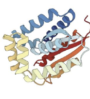{.rounded .mx-auto .d-block style="max-height: 200px; object-fit: contain;"}
:::
:::

:::

 

::: {.callout-important appearance="minimal" icon=false}
[**We represent the objects we want to generate as vectors:**]{style="font-size: 1.25em;"}

$$\mathbf{z} \in \mathbb{R}^d$$
:::

### What does it mean to successfully generate something?

Prompt: *"A picture of a dog"*

::: {.grid}

::: {.g-col-12 .g-col-md-3}
::: {.card .h-100 .text-center .p-2 .border-light}
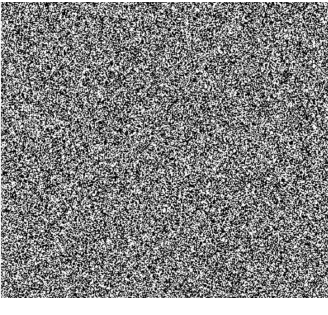{.rounded .mb-2}
**Useless**  
*(Impossible)*
:::
:::

::: {.g-col-12 .g-col-md-3}
::: {.card .h-100 .text-center .p-2 .border-light}
{.rounded .mb-2}
**Bad**  
*(Rare)*
:::
:::

::: {.g-col-12 .g-col-md-3}
::: {.card .h-100 .text-center .p-2 .border-light}
{.rounded .mb-2}
**Wrong animal**  
*(Unlikely)*
:::
:::

::: {.g-col-12 .g-col-md-3}
::: {.card .h-100 .text-center .p-2 .border-light}
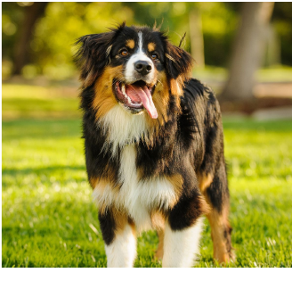{.rounded .mb-2}
**Great!**  
*(Very likely)*
:::
:::

:::

::: {.callout-note appearance="simple" icon=false}
**Key Insight**: How "good" an image is $\approx$ how "likely" it is under the data distribution.
:::

### Generation as Sampling the Data Distribution

We think of the objects we want to generate as following a **data distribution** $p_{\text{data}}$. This is a probability density function:

$$p_{\text{data}} : \mathbb{R}^d \to \mathbb{R}_{\ge 0}, \quad \mathbf{z} \mapsto p_{\text{data}}(\mathbf{z})$$

::: {.callout-warning appearance="simple"}
**Crucial Note**: In practice, we do not know the analytical form of $p_{\text{data}}$!
:::

In this framework, **generation means sampling** from the data distribution:

::: {.text-center .p-4 .bg-light .rounded .shadow-sm .mb-4}
[$\mathbf{z} \sim p_{\text{data}}$]{style="font-size: 2em; color: #dc3545;"} $\quad \implies \quad$ $\mathbf{z} =$ {width=150px .rounded .shadow-sm}
:::

### What consists a Dataset?

Since we don't know $p_{\text{data}}$, we rely on a **dataset**: a finite collection of samples drawn from it.

- **Images**: Publicly available images from the internet (e.g., LAION, ImageNet).
- **Videos**: Large-scale video repositories (e.g., YouTube).
- **Molecular structures**: Scientific repositories (e.g., Protein Data Bank).

Mathematically, a dataset is a collection:
$$\{\mathbf{z}_1, \dots, \mathbf{z}_N\} \sim p_{\text{data}}$$

### Conditional Generation

Standard (unconditional) generation samples from $p_{\text{data}}$. However, we often want to **condition** our generation on a prompt or label $y$ (e.g., $y = \text{"Dog"}$).

::: {.grid}

:::: {.g-col-12 .g-col-md-6}
::::: {.card .p-4 .h-100 .shadow-sm}
#### Unconditional ($p_{\text{data}}$)
[Fixed prompt "Dog" — diverse samples of the same category:]{.text-muted .small}

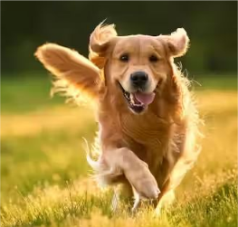

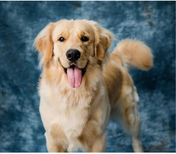

:::::
::::

:::: {.g-col-12 .g-col-md-6}
::::: {.card .p-4 .h-100 .shadow-sm}
#### Conditional ($p_{\text{data}}(\cdot|y)$)
[Changing $y$ gives different targeted categories:]{.text-muted .small}

$y=\text{"Dog"}$

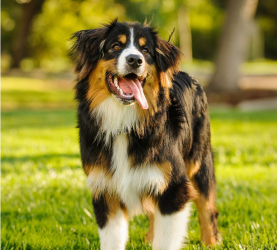

$y=\text{"Cat"}$

$y=\text{"Landscape"}$

:::::
::::

:::

::: {.text-center .p-3 .mt-3 .bg-danger .bg-opacity-10 .border .border-danger .rounded}
[**Conditional generation means sampling the conditional data distribution:**]{style="color: #a71d5d; font-weight: bold; font-size: 1.1em;"}
$$ \color{#a71d5d}{\mathbf{z} \sim p_{\text{data}}(\cdot | y)} $$
:::

::: {.callout-tip}
We will first focus on **unconditional generation** and then learn how to translate an unconditional model to a conditional one.
:::

### Generative Models as Transformers

A generative model converts samples from a simple **initial distribution** $p_{\text{init}}$ into samples from the complex **data distribution** $p_{\text{data}}$.

::: {.grid .text-center .align-items-center}

::: {.g-col-12 .g-col-md-4}
::: {.p-3 .border .rounded .bg-light}
**Initial State**

$$\mathbf{x} \sim p_{\text{init}}$$

$\mathcal{N}(0, \mathbf{I}_d)$

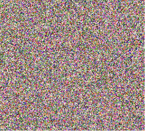{width=140px .rounded .mt-2 .shadow-sm}
:::
:::

::: {.g-col-12 .g-col-md-4}
[$\implies$]{style="font-size: 3em; color: #6c757d;"}
 
[**Generative Model**]{.badge .bg-primary .p-3 .fs-5}
 
[$\implies$]{style="font-size: 3em; color: #6c757d;"}
:::

::: {.g-col-12 .g-col-md-4}
::: {.p-3 .border .rounded .bg-light}
**Target Sample**

$$\mathbf{z} \sim p_{\text{data}}$$

(Real Object)

{width=140px .rounded .mt-2 .shadow-sm}
:::
:::

:::

## Flow Models

::: {.column-margin}
Credits: [Introduction to Flow Matching and Diffusion Models](https://diffusion.csail.mit.edu/) by Peter Holderrieth \ 

[Flow Matching](https://mariogemoll.com/flow-matching) by Mario Gemoll
:::

<figure class="mx-auto d-block" style="width: 100%; max-width: 500px; margin-top: 1em;">
  <video src="assets/misc/flow_animation.mp4" autoplay loop muted playsinline class="rounded w-100"></video>
  <figcaption class="figure-caption text-center mt-2">Example: ODE Trajectory</figcaption>
</figure>

<!-- TODO: Flow Example -->

 

### Existence and Uniqueness Theorem ODEs

::: {.card .p-3 .mb-3 .border .border-dark}
**Theorem (Picard–Lindelöf theorem)**: If the vector field $u_t(x)$ is continuously differentiable with bounded derivatives, then a _unique_ solution to the ODE

$$ X_0 = x_0, \quad \frac{\mathrm{d}}{\mathrm{d}t}X_t = u_t(X_t) $$

exists. In other words, a flow map exists. More generally, this is true if the vector field is [**Lipschitz**]{style="color: #007bff;"}.
:::

::: {.card .p-3 .border .border-dark}
[Key takeaway: In the cases of practical interest for machine learning, **unique solutions to ODE/flows exist.**]{style="color: #a30000; font-size: 1.1em;"}
:::

 

### Example: Linear ODE

::: {.grid}

::: {.g-col-12 .g-col-md-7}
**Simple vector field:**

$$ u_t(x) = -\theta x \quad (\theta > 0) $$

**Claim:** Flow is given by

$$ \psi_t(x_0) = \exp(-\theta t) x_0 $$

**Proof:**

1. Initial condition:
$$ \psi_t(x_0) = \exp(0)x_0 = x_0 $$

2. ODE:
$$ \frac{\mathrm{d}}{\mathrm{d}t} \psi_t(x_0) = \frac{\mathrm{d}}{\mathrm{d}t} \left(\exp(-\theta t) x_0\right) = -\theta \exp(-\theta t) x_0 = -\theta \psi_t(x_0) = u_t(\psi_t(x_0)) $$
:::

::: {.g-col-12 .g-col-md-5 .d-flex .align-items-center}
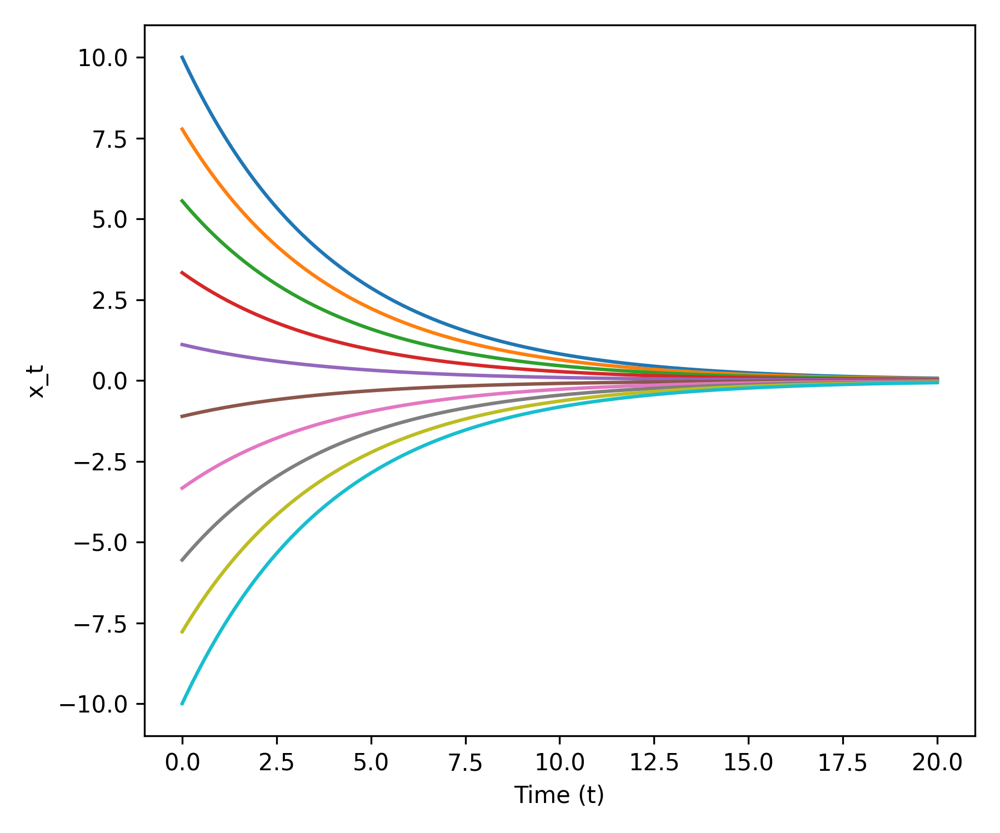{.img-fluid .rounded .shadow-sm}
:::
:::

 

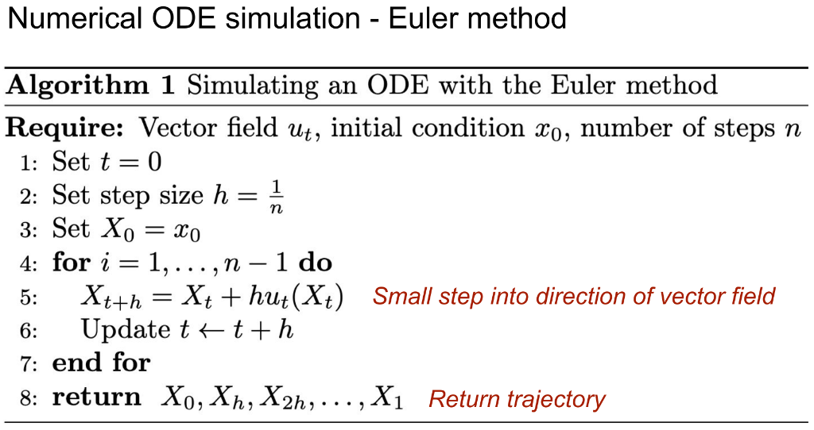{.lightbox width="80%"}

 

### Euler Method: Coarse vs Fine Steps

::: {.grid .text-center}

::: {.g-col-12 .g-col-md-6}
**Large step size**
<figure class="mt-2">
  <video src="assets/misc/euler_course.mp4" autoplay loop muted playsinline class="rounded shadow-sm w-100"></video>
  <figcaption class="figure-caption text-center mt-2 text-muted" style="font-size: 0.95em;"><em>more efficient but higher error</em></figcaption>
</figure>
:::

::: {.g-col-12 .g-col-md-6}
**Small step size**
<figure class="mt-2">
  <video src="assets/misc/euler_fine.mp4" autoplay loop muted playsinline class="rounded shadow-sm w-100"></video>
  <figcaption class="figure-caption text-center mt-2 text-muted" style="font-size: 0.95em;"><em>lower error but less efficient</em></figcaption>
</figure>
:::

:::

 

### Toy example

<figure class="text-center mt-3">
  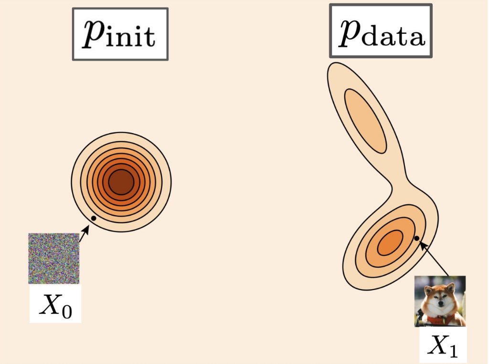{.lightbox width="100%" .rounded .shadow-sm style="max-width: 600px;"}
  <figcaption class="figure-caption text-center mt-2 text-muted" style="font-size: 0.9em;">
    <em>Figure credits: Yaron Lipman</em>
  </figcaption>
</figure>

<!-- TODO: Toy flow model insert -->

 

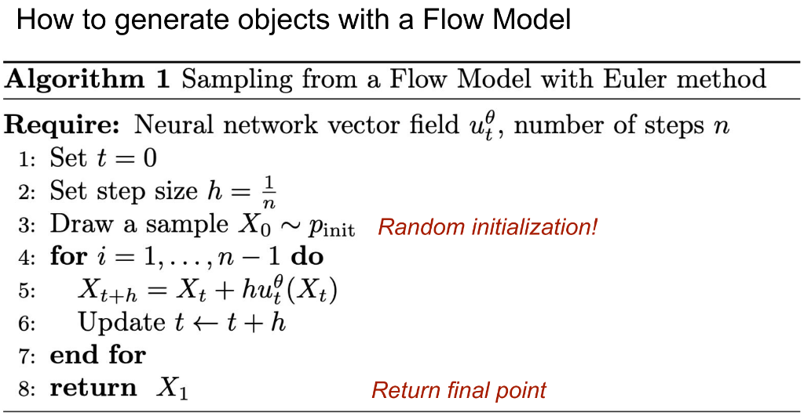{.lightbox width="100%"}

## Diffusion Models

::: {.column-margin}
Credits: [Introduction to Flow Matching and Diffusion Models](https://diffusion.csail.mit.edu/) by Peter Holderrieth \ 

[Flow Matching](https://mariogemoll.com/flow-matching) by Mario Gemoll
:::

### Brownian Motion or the Wiener Process

Brownian motion describes the random motion of particles in fluids or gases. It is basically a random walk. Mathematically it can be modeled as a Wiener process. For our purposes, we can think of this as a path starting at the origin at $t = 0$, and then proceeding with step size $h$, adding noise from a standard Gaussian scaled by $\sqrt{h}$ at each step, until $t = 1$:

$$
W_{t+h} = W_t + \sqrt{h}\epsilon_t, \quad \epsilon_t \sim \mathcal{N}(0, Id) \quad (t = 0, h, 2h, \dots, 1 - h)
$$

 

::: {.grid .text-center}

::: {.g-col-12 .g-col-md-4}
**Sample 1**
<figure class="mt-2">
  <video src="assets/misc/diffusion_sample_1.mp4" autoplay loop muted playsinline class="rounded shadow-sm w-100"></video>
</figure>
:::

::: {.g-col-12 .g-col-md-4}
**Sample 2**
<figure class="mt-2">
  <video src="assets/misc/diffusion_sample_2.mp4" autoplay loop muted playsinline class="rounded shadow-sm w-100"></video>
</figure>
:::

::: {.g-col-12 .g-col-md-4}
**Sample 3**
<figure class="mt-2">
  <video src="assets/misc/diffusion_sample_3.mp4" autoplay loop muted playsinline class="rounded shadow-sm w-100"></video>
</figure>
:::

:::

**Note:** A single stochastic process can give rise to many trajectories as the evolution becomes random.

### Stochastic Differential Equations (SDEs)

We can add some Brownian motion to the paths taken by particles moving along a vector field described by an ODE, which gives rise to the concept of a stochastic differential equation (SDE):

$$
\begin{align*}
\mathrm{d}X_t &= u_t(X_t)\mathrm{d}t + \sigma_t \mathrm{d}W_t \\
X_0 &= x_0
\end{align*}
$$

For the details about the $\mathrm{d}X$ notation, see [Holderrieth & Erives, 2025](https://diffusion.csail.mit.edu/).

The $\sigma_t$ in the above equation is called the diffusion coefficient and controls the amount of randomness (the ODE term $u_t(X_t)$ is also called the drift coefficient).

Such an SDE can be approximated by the Euler-Maruyama method (basically the Euler method with some randomness added to it):

$$
x_{t+h} = x_t + h u_t(x_t) + \sqrt{h} \sigma_t \epsilon_t, \quad \epsilon_t \sim \mathcal{N}(0, I_d)
$$

 

::: {.grid .text-center}

::: {.g-col-12 .g-col-md-4}
**$\sigma = 0.15$**
<figure class="mt-2">
  <video src="assets/misc/stoc_proc_sigma-15.mp4" autoplay loop muted playsinline class="rounded shadow-sm w-100"></video>
</figure>
:::

::: {.g-col-12 .g-col-md-4}
**$\sigma = 0.44$**
<figure class="mt-2">
  <video src="assets/misc/stoc_proc_sigma-44.mp4" autoplay loop muted playsinline class="rounded shadow-sm w-100"></video>
</figure>
:::

::: {.g-col-12 .g-col-md-4}
**$\sigma = 0.87$**
<figure class="mt-2">
  <video src="assets/misc/stoc_proc_sigma-87.mp4" autoplay loop muted playsinline class="rounded shadow-sm w-100"></video>
</figure>
:::

:::

 

### Existence and Uniqueness Theorem SDEs

::: {.card .p-3 .mb-3 .border .border-dark}
**Theorem**: If the vector field $u_t(x)$ is continuously differentiable with bounded derivatives and the diffusion coeff. is continuous, then a _unique_ solution (in distribution) to the SDE

$$ X_0 = x_0, \quad \mathrm{d}X_t = u_t(X_t)\mathrm{d}t + \sigma_t\mathrm{d}W_t $$

exists. More generally, this is true if the vector field is [**Lipschitz**]{style="color: #007bff;"}.
:::

::: {.card .p-3 .mb-3 .border .border-dark}
[Key takeaway: In the cases of practical interest for machine learning, **unique solutions to SDEs exist.**]{style="color: #a30000; font-size: 1.1em;"}
:::

[Stochastic calculus class: Construct solutions via stochastic integrals and Ito-Riemann sums]{style="color: #6c757d; font-style: italic;"}
 

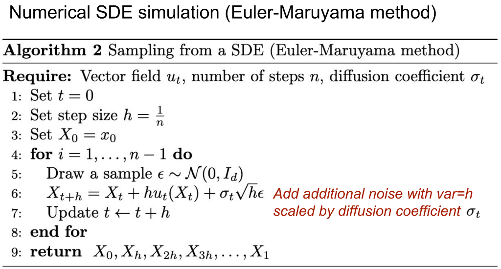{.lightbox width="100%"}

### Ornstein-Uhlenbeck Process

$$
\dd X_t = -\theta X_t \dd t + \sigma \dd W_t
$$

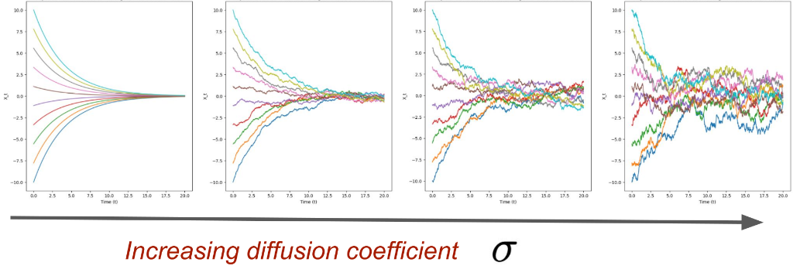{.lightbox width="100%"}
 

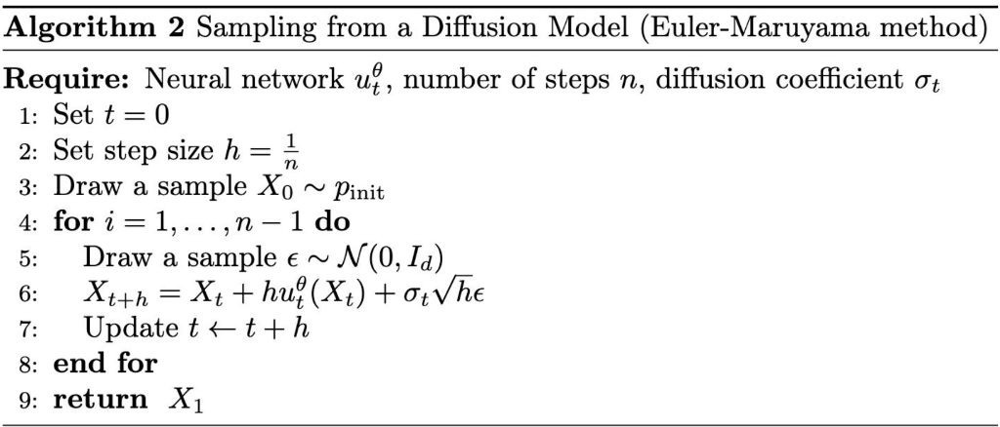{.lightbox width="100%"}

## Flow Matching

::: {.column-margin}
Credits: [Introduction to Flow Matching and Diffusion Models](https://diffusion.csail.mit.edu/) by Peter Holderrieth \ 

[Flow Matching](https://mariogemoll.com/flow-matching) by Mario Gemoll
:::

### Reminder: Flow and Diffusion Models

::: {.grid .align-items-center .border .rounded .p-3 style="background:#fafafa;"}

::: {.g-col-2 .text-center .border .rounded .p-2 style="color:#a30000; font-weight:bold; border-color:#a30000 !important;"}
Flow\
Model
:::

::: {.g-col-4}
**Initialize:**

$$X_0 \sim \underbrace{p_{\text{init}}}_{\color{#a30000}{\text{e.g. Gaussian}}}$$
:::

::: {.g-col-6}
**ODE:**

$$\mathrm{d}X_t = \underbrace{u_t^{\theta}(X_t)}_{\substack{\color{#a30000}{\text{neural network}} \\ \color{#a30000}{\text{vector field}}}}\mathrm{d}t$$
:::

:::

::: {.grid .align-items-center .border .rounded .p-3 .mt-2 style="background:#fafafa;"}

::: {.g-col-2 .text-center .border .rounded .p-2 style="color:#a30000; font-weight:bold; border-color:#a30000 !important;"}
Diffusion\
Model
:::

::: {.g-col-4}
**Initialize:**

$$X_0 \sim \underbrace{p_{\text{init}}}_{\color{#a30000}{\text{e.g. Gaussian}}}$$
:::

::: {.g-col-6}
**SDE:**

$$\mathrm{d}X_t = \underbrace{u_t^{\theta}(X_t)}_{\substack{\color{#a30000}{\text{neural network}} \\ \color{#a30000}{\text{vector field}}}}\mathrm{d}t + \underbrace{\sigma_t}_{\color{#a30000}{\text{diffusion coeff.}}}\mathrm{d}W_t$$
:::

:::

::: {.callout-important appearance="minimal" icon=false}
**To get samples, simulate ODE/SDE from $t=0$ to $t=1$ and return $X_1$**
:::

### Next Step: Training a Flow Model

::: {.callout-note appearance="simple" icon=false}
Without training, the model produces "non-sense" $\to$ **We need to train $u_t^\theta$**
:::

**Training = Finding parameters $\theta$ such that**

::: {.grid .align-items-center .text-center style="column-gap: 0;"}

::: {.g-col-4}
$$\underbrace{X_0 \sim p_{\text{init}}}_{\color{#a30000}{\small\textit{Start with initial distribution}}}$$
:::

::: {.g-col-3}
$$\underbrace{\mathrm{d}X_t = u_t^{\theta}(X_t)\mathrm{d}t}_{\color{#a30000}{\small\textit{Follow along the vector field}}}$$
:::

::: {.g-col-2 .text-center}
$\Rightarrow$\
[Implies]{style="font-size:0.75em; color:#555;"}
:::

::: {.g-col-3}
$$\underbrace{X_1 \sim p_{\text{data}}}_{\substack{\color{#a30000}{\small\textit{Distribution of final}} \\ \color{#a30000}{\small\textit{point = data dist.}}}}$$
:::

:::

### The Flow Matching Matrix

::: {.border .rounded .p-3 .mb-3}

::: {.grid .align-items-center .text-center .mb-3}

::: {.g-col-3 .border .rounded .p-2 style="background:#f0f0f0;"}
[**Conditional**]{style="color:#1a6faf;"}\
**Probability Path**
:::

::: {.g-col-1 .text-center}
$\rightarrow$
:::

::: {.g-col-3 .border .rounded .p-2 style="background:#f0f0f0;"}
[**Conditional**]{style="color:#1a6faf;"}\
**Vector Field**
:::

::: {.g-col-1 .text-center}
$\rightarrow$
:::

::: {.g-col-4 .border .rounded .p-2 style="background:#f0f0f0;"}
[**Conditional**]{style="color:#1a6faf;"}\
**Flow Matching Loss**
:::

:::

::: {.grid .align-items-center .text-center}

::: {.g-col-3 .border .rounded .p-2 style="background:#f0f0f0;"}
[**Marginal**]{style="color:#2a9a2a;"}\
**Probability Path**
:::

::: {.g-col-1 .text-center}
$\rightarrow$
:::

::: {.g-col-3 .border .rounded .p-2 style="background:#f0f0f0;"}
[**Marginal**]{style="color:#2a9a2a;"}\
**Vector Field**
:::

::: {.g-col-1 .text-center}
$\rightarrow$
:::

::: {.g-col-4 .border .rounded .p-2 style="background:#f0f0f0;"}
[**Marginal**]{style="color:#2a9a2a;"}\
**Flow Matching Loss**
:::

:::

:::

::: {.border .rounded .p-3 .text-center}
"Conditional" = "Per single data point"

"Marginal" = "Across distribution of data points"
:::

### Probability Paths: The Path from Noise to Data

::: {.grid .align-items-center .text-center style="--bs-columns: 9; column-gap: 0.3rem;"}

::: {.g-col-1 style="font-size:0.8em; font-weight:bold;"}
**Noise**
:::

::: {.g-col-1}
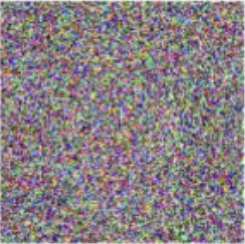{.img-fluid .rounded}
:::

::: {.g-col-1}
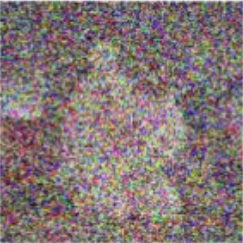{.img-fluid .rounded}
:::

::: {.g-col-1}
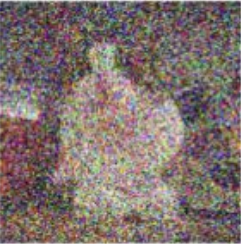{.img-fluid .rounded}
:::

::: {.g-col-1}
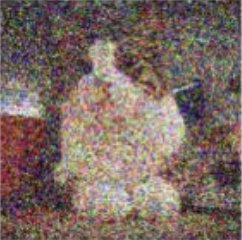{.img-fluid .rounded}
:::

::: {.g-col-1}
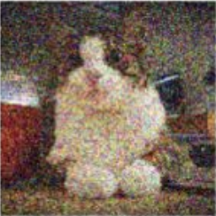{.img-fluid .rounded}
:::

::: {.g-col-1}
{.img-fluid .rounded}
:::

::: {.g-col-1}
{.img-fluid .rounded}
:::

::: {.g-col-1 style="font-size:0.8em; font-weight:bold;"}
**Data**
:::

:::

::: {.grid .text-center style="--bs-columns: 9; column-gap: 0.3rem; font-size:0.8em; margin-top: -0.5rem;"}
::: {.g-col-1}
$t=0$
:::
::: {.g-col-3 .text-center}
$\longleftarrow$ time $\longrightarrow$
:::
::: {.g-col-4}
:::
::: {.g-col-1}
$t=1$
:::
:::

 

::: {.grid .align-items-center .text-center style="--bs-columns: 5; column-gap: 0.5rem;"}

::: {.g-col-1}
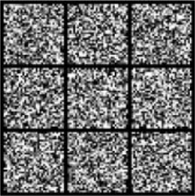{.img-fluid .rounded}
:::

::: {.g-col-1}
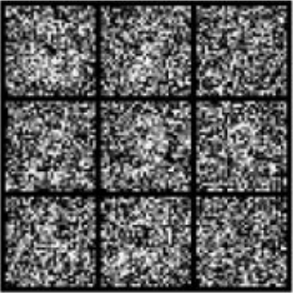{.img-fluid .rounded}
:::

::: {.g-col-1}
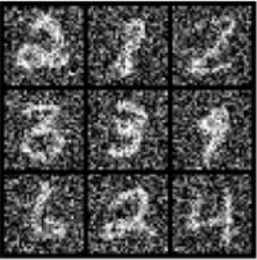{.img-fluid .rounded}
:::

::: {.g-col-1}
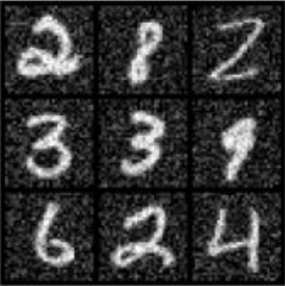{.img-fluid .rounded}
:::

::: {.g-col-1}
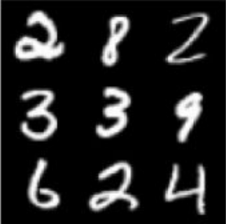{.img-fluid .rounded}
:::

:::

### Conditional Probability Path $p_t(\cdot | z)$

::: {.grid .align-items-center style="--bs-columns: 12; column-gap: 0.3rem;"}

::: {.g-col-1 .text-center}
$p_{\text{init}}$
:::

::: {.g-col-2 .text-center style="font-size:0.8em; color:#555;"}
$t = 0.00$\
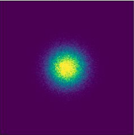{.img-fluid .rounded}
:::

::: {.g-col-2 .text-center style="font-size:0.8em; color:#555;"}
$t = 0.25$\
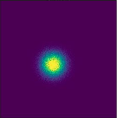{.img-fluid .rounded}
:::

::: {.g-col-2 .text-center style="font-size:0.8em; color:#555;"}
$t = 0.50$\
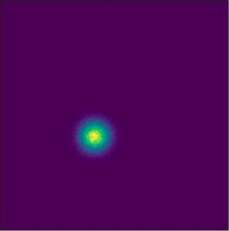{.img-fluid .rounded}
:::

::: {.g-col-2 .text-center style="font-size:0.8em; color:#555;"}
$t = 0.75$\
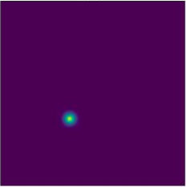{.img-fluid .rounded}
:::

::: {.g-col-2 .text-center style="font-size:0.8em; color:#555;"}
$t = 1.00$\
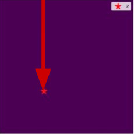{.img-fluid .rounded}
:::

::: {.g-col-1 .text-center}
$z$\
[↓]{style="color:#cc0000; font-size:1.3em;"}
:::

:::

::: {.grid style="--bs-columns: 12; column-gap: 0; font-size:0.85em; font-weight:bold; margin-top:0.25rem;"}
::: {.g-col-1}
:::
::: {.g-col-2}
**t=0**
:::
::: {.g-col-7 .text-center}
$\longrightarrow$
:::
::: {.g-col-2 .text-end}
**t=1**
:::
:::

<figure class="mx-auto d-block" style="width: 100%; max-width: 500px; margin-top: 1em;">
  <video src="assets/misc/cond_prob_path.mp4" autoplay loop muted playsinline class="rounded w-100"></video>
  <figcaption>Samples from a conditional probability path over time</figcaption>
</figure>

::: {.callout-note appearance="simple" icon=false}
A probability path only specifies the marginals (each snapshot). It says *nothing about the evolution of a single particle* in time (no dynamics).
:::

### Conditional vs. Marginal Probability Path

::: {.grid .align-items-center style="--bs-columns: 12; column-gap: 0.3rem; font-size:0.85em; margin-bottom:0.25rem;"}
::: {.g-col-12 .text-center .border .rounded .p-1 style="background:#f0f0f0;"}
Conditional Probability Path $p_t(\cdot | z)$
:::
:::

::: {.grid .align-items-center style="--bs-columns: 12; column-gap: 0.3rem; row-gap: 0.3rem;"}

::: {.g-col-1 .text-center style="font-size:0.85em;"}
$p_{\text{init}}$
:::
::: {.g-col-2 .text-center style="font-size:0.75em; color:#555;"}
$t=0.00$\
{.img-fluid .rounded}
:::
::: {.g-col-2 .text-center style="font-size:0.75em; color:#555;"}
$t=0.25$\
{.img-fluid .rounded}
:::
::: {.g-col-2 .text-center style="font-size:0.75em; color:#555;"}
$t=0.50$\
{.img-fluid .rounded}
:::
::: {.g-col-2 .text-center style="font-size:0.75em; color:#555;"}
$t=0.75$\
{.img-fluid .rounded}
:::
::: {.g-col-2 .text-center style="font-size:0.75em; color:#555;"}
$t=1.00$\
{.img-fluid .rounded}
:::
::: {.g-col-1 .text-center style="font-size:0.85em;"}
$z$\
[↓]{style="color:#cc0000; font-size:1.3em;"}
:::

::: {.g-col-1 .text-center style="font-size:0.85em;"}
$p_{\text{init}}$
:::
::: {.g-col-2 .text-center style="font-size:0.75em; color:#555;"}
$t=0.00$\
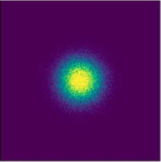{.img-fluid .rounded}
:::
::: {.g-col-2 .text-center style="font-size:0.75em; color:#555;"}
$t=0.25$\
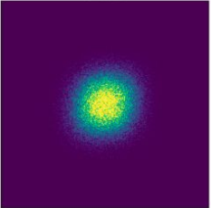{.img-fluid .rounded}
:::
::: {.g-col-2 .text-center style="font-size:0.75em; color:#555;"}
$t=0.50$\
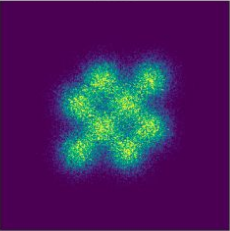{.img-fluid .rounded}
:::
::: {.g-col-2 .text-center style="font-size:0.75em; color:#555;"}
$t=0.75$\
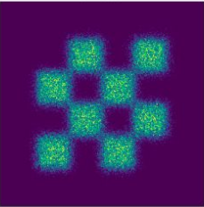{.img-fluid .rounded}
:::
::: {.g-col-2 .text-center style="font-size:0.75em; color:#555;"}
$t=1.00$\
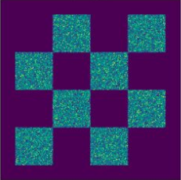{.img-fluid .rounded}
:::
::: {.g-col-1 .text-center style="font-size:0.85em;"}
$p_{\text{data}}$
:::

:::

::: {.grid .align-items-center style="--bs-columns: 12; column-gap: 0.3rem; font-size:0.85em; margin-top:0.25rem;"}
::: {.g-col-12 .text-center .border .rounded .p-1 style="background:#f0f0f0;"}
Marginal Probability Path $p_t$
:::
:::

### Conditional Probability Path

|  | Notation | Key property | Gaussian example |
|---|:---:|---|---|
| Conditional Probability Path | $p_t(\cdot\|z)$ | Interpolates $p_{\text{init}}$ and a data point $z$ | $\mathcal{N}(\alpha_t z,\, \beta_t^2 I_d)$ |
| Conditional Vector Field | $u_t^c(x,z)$ | | |

: {.striped .hover tbl-colwidths="[20,15,30,35]"}

### Marginal Probability Path

|  | Notation | Key property | Formula |
|---|:---:|---|---|
| Marginal Probability Path | $p_t$ | Interpolates $p_{\text{init}}$ and $p_{\text{data}}$ | $\int p_t(x\|z)\, p_{\text{data}}(z)\,\mathrm{d}z$ |
| Marginal Vector Field | | | |

: {.striped .hover tbl-colwidths="[20,15,30,35]"}

### Example — Conditional Vector Field for Gaussian

::: {.text-center .border .rounded .p-3 .mb-3}
$$u_t^{\text{target}}(x|z) = \left(\dot{\alpha}_t - \frac{\dot{\beta}_t}{\beta_t}\alpha_t\right)z + \frac{\dot{\beta}_t}{\beta_t}x$$
:::

::: {.border .rounded .p-3 style="border-style: dashed !important;"}
*Proof Sketch:*

**Step 1:** By checking ODE, show that the flow of the vector field is given by

$$\psi_t^{\text{target}}(x_0|z) = \alpha_t z + \beta_t x_0$$

**Step 2:** If $X_0 = x_0 \sim \mathcal{N}(0, I_d)$ is random, then we know that then:

$$X_t = \psi_t(X_0|z) = \alpha_t z + \beta_t X_0 \sim \mathcal{N}(\alpha_t z,\, \beta_t^2 I_d) = p_t(\cdot|z)$$
:::

::: {.grid .align-items-center}

::: {.g-col-12 .g-col-md-3}
**Gaussian Conditional Probability Path And Conditional Vector Field**

[*Figure credit: Yaron Lipman*]{.text-muted style="font-size:0.85em;"}
:::

::: {.g-col-12 .g-col-md-9}
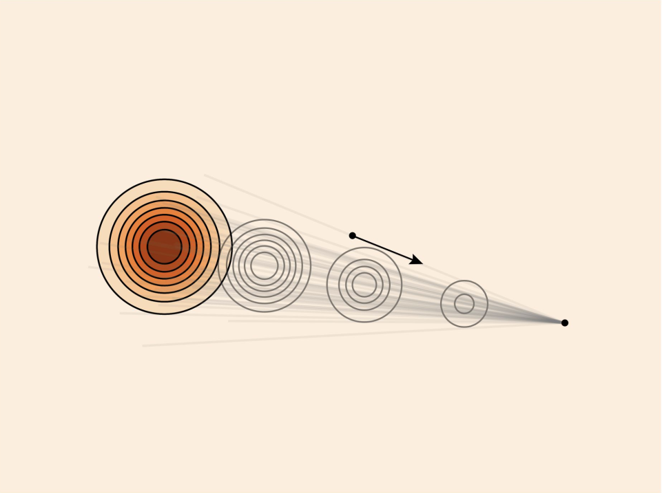{.img-fluid .rounded}
:::

:::

::: {.grid .align-items-center .text-center style="--bs-columns: 13; column-gap: 0.3rem; row-gap: 0.3rem;"}

::: {.g-col-1}
:::
::: {.g-col-4 style="font-weight:bold; color:#a30000;"}
Ground truth
:::
::: {.g-col-4 style="font-weight:bold; color:#a30000;"}
ODE samples
:::
::: {.g-col-4 style="font-weight:bold; color:#a30000;"}
ODE Trajectories
:::

::: {.g-col-1 .text-start style="font-style:italic; font-size:1.1em;"}
$p_t(\cdot|z)$
:::
::: {.g-col-4}
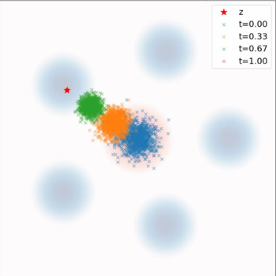{.img-fluid .rounded}
:::
::: {.g-col-4}
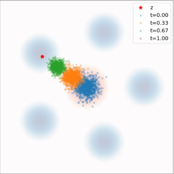{.img-fluid .rounded}
:::
::: {.g-col-4}
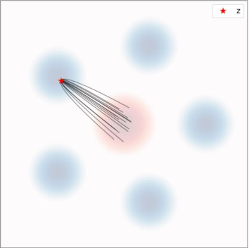{.img-fluid .rounded}
:::

::: {.g-col-1 .text-start style="font-style:italic; font-size:1.1em;"}
$p_t$
:::
::: {.g-col-4}
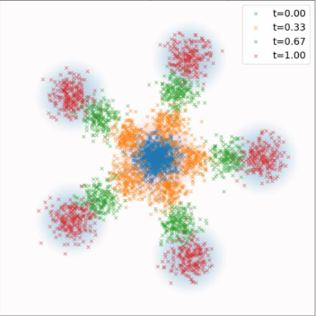{.img-fluid .rounded}
:::
::: {.g-col-4}
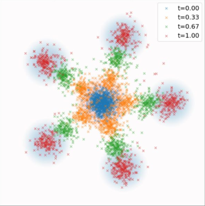{.img-fluid .rounded}
:::
::: {.g-col-4}
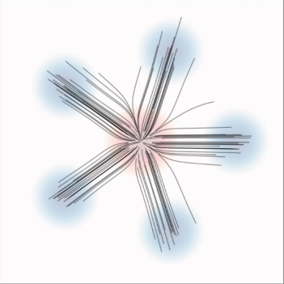{.img-fluid .rounded}
:::

:::

### Continuity Equation

::: {.text-center}
[*Randomly initialized ODE*]{style="color:#a30000; font-style:italic;"}

**Given:** $\quad X_0 \sim p_{\text{init}}, \qquad \dfrac{\mathrm{d}}{\mathrm{d}t}X_t = u_t(X_t)$
:::

---

::: {.grid .align-items-center}

::: {.g-col-2 .text-center style="font-size:2em; color:#aaa;"}
:::

::: {.g-col-8}
::: {.border .rounded .p-3 .mb-1}
**Follow probability path:**

$$X_t \sim p_t \qquad (0 \le t \le 1)$$
:::
:::

::: {.g-col-2 style="font-size:0.9em;"}
[*Marginals are $p_t$*]{style="color:#a30000; font-style:italic;"}
:::

:::

::: {.text-center style="font-size:2em; color:#aaa; margin: 0.2em 0;"}
$\Longleftrightarrow$ [equivalent]{style="font-size:0.4em; color:#555; vertical-align:middle;"}
:::

::: {.grid .align-items-center}

::: {.g-col-2}
:::

::: {.g-col-8}
::: {.border .rounded .p-3 .mb-1}
**Continuity equation holds**

$$\frac{\mathrm{d}}{\mathrm{d}t}p_t(x) = -\operatorname{div}(p_t u_t)(x)$$
:::
:::

::: {.g-col-2 style="font-size:0.9em;"}
[*PDE holds*]{style="color:#a30000; font-style:italic;"}
:::

:::

**Continuity Equation**

$$\frac{\mathrm{d}}{\mathrm{d}t}p_t(x) = -\operatorname{div}(p_t u_t)(x)$$

::: {.grid style="--bs-columns: 2; font-size:0.9em;"}
::: {.g-col-1}
[*Change of probability mass at $x$*]{style="color:#a30000; font-style:italic;"}
:::
::: {.g-col-1}
[*Outflow - inflow of probability mass from $u$*]{style="color:#a30000; font-style:italic;"}
:::
:::

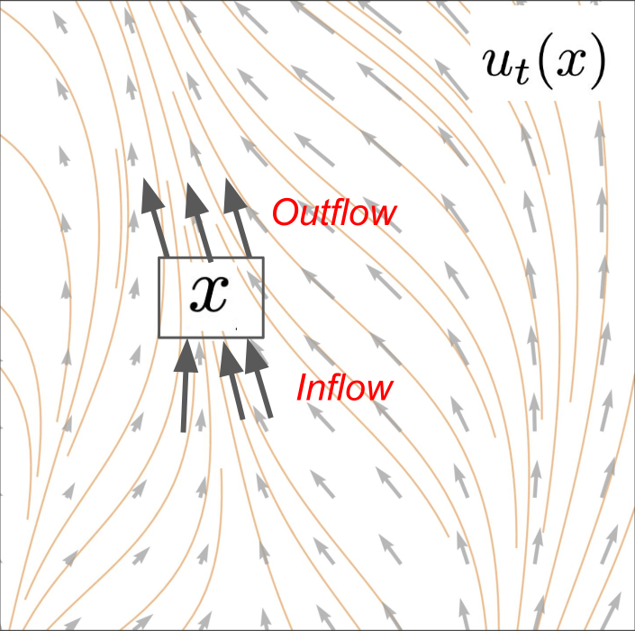{.img-fluid .rounded style="max-width:85%; display:block; margin:auto;"}

::: {.callout-note appearance="minimal" icon=false}
**Algorithm 3** Flow Matching Training Procedure (General)

---

**Require:** A dataset of samples $z \sim p_{\text{data}}$, neural network $u_t^\theta$

| | |
|---|---|
| 1: | **for** each mini-batch of data **do** |
| 2: | $\quad$ Sample a data example $z$ from the dataset. |
| 3: | $\quad$ Sample a random time $t \sim \text{Unif}_{[0,1]}$. |
| 4: | $\quad$ Sample $x \sim p_t(\cdot|z)$ |
| 5: | $\quad$ Compute loss |

$$\mathcal{L}(\theta) = \|u_t^\theta(x) - u_t^{\text{target}}(x|z)\|^2$$

| | |
|---|---|
| 6: | $\quad$ Update the model parameters $\theta$ via gradient descent on $\mathcal{L}(\theta)$ |
| 7: | **end for** |

: {tbl-colwidths="[5,95]"}
:::

### Conditional Flow Matching for Gaussian Probability Path

::: {.grid .align-items-center style="--bs-columns: 12; column-gap: 0.5rem; row-gap: 0.5rem;"}

::: {.g-col-2 .border .rounded .p-2 .text-center style="color:#555;"}
Prob. path
:::
::: {.g-col-4}
$\mathcal{N}(\alpha_t z,\, \beta_t^2 I_d)$
:::
::: {.g-col-2 .border .rounded .p-2 .text-center style="color:#555;"}
Conditional VF
:::
::: {.g-col-4}
$u_t^{\text{target}}(x|z) = \left(\dot{\alpha}_t - \dfrac{\dot{\beta}_t}{\beta_t}\alpha_t\right)z + \dfrac{\dot{\beta}_t}{\beta_t}x$
:::

::: {.g-col-2 .border .rounded .p-2 .text-center style="color:#555;"}
Noise Sampling
:::
::: {.g-col-10}
$x \sim p_t(\cdot|z) \quad \Leftrightarrow \quad x = \alpha_t z + \beta_t \epsilon, \quad \epsilon \sim \mathcal{N}(0, I_d)$
:::

:::

::: {.border .rounded .p-2 .mb-2}
Plugging in Noise Sampling into CFM Loss results in:
:::

$$
\begin{align}
L_{\text{CFM}}(\theta)
&= \mathbb{E}_{t \sim \text{Unif},\, z \sim p_{\text{data}},\, x \sim p_t(\cdot|z)} \left[\|u_t^\theta(x) - u_t^{\text{target}}(x|z)\|^2\right] \\
&= \mathbb{E}_{t \sim \text{Unif},\, z \sim p_{\text{data}},\, \epsilon \sim \mathcal{N}(0,I_d)} \left[\|u_t^\theta(\alpha_t z + \beta_t \epsilon) - u_t^{\text{target}}(\alpha_t z + \beta_t \epsilon|z)\|^2\right] \\
&= \mathbb{E}_{t \sim \text{Unif},\, z \sim p_{\text{data}},\, \epsilon \sim \mathcal{N}(0,I_d)} \left[\|\underbrace{u_t^\theta(\alpha_t z + \beta_t \epsilon)}_{\color{#a30000}{\textbf{noise+data}}} - \underbrace{(\dot{\alpha}_t z + \dot{\beta}_t \epsilon)}_{\color{#a30000}{\textbf{velocity}}}\|^2\right]
\end{align}
$$

### Straight Line Schedule

$$
\begin{align}
L_{\text{CFM}}(\theta)
&= \mathbb{E}_{t \sim \text{Unif},\, z \sim p_{\text{data}},\, \epsilon \sim \mathcal{N}(0,I_d)} \left[\|u_t^\theta(\alpha_t z + \beta_t \epsilon) - (\dot{\alpha}_t z + \dot{\beta}_t \epsilon)\|^2\right] \\
&= \mathbb{E}_{t \sim \text{Unif},\, z \sim p_{\text{data}},\, \epsilon \sim \mathcal{N}(0,I_d)} \left[\|\underbrace{u_t^\theta(tz + (1-t)\epsilon)}_{\substack{\color{#a30000}{\textbf{Linear interpolation}} \\ \color{#a30000}{\textbf{of noise and data}}}} - \underbrace{(z - \epsilon)}_{\substack{\color{#a30000}{\textbf{Difference between}} \\ \color{#a30000}{\textbf{noise and data}}}}\|^2\right]
\end{align}
$$

<figure class="mx-auto d-block" style="width: 100%; max-width: 700px; margin-top: 1em;">
  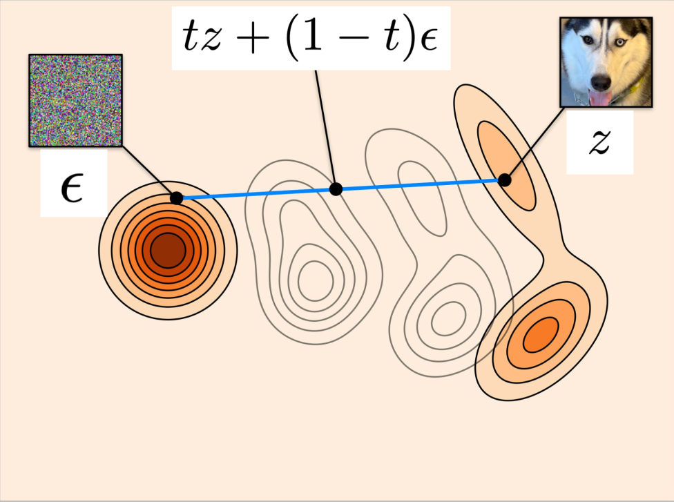{.img-fluid .rounded .lightbox}
  <figcaption>Figure credit: Yaron Lipman</figcaption>
</figure>

::: {.callout-note appearance="minimal" icon=false}
**Algorithm 4** Flow Matching Training for CondOT path

---

**Require:** A dataset of samples $z \sim p_{\text{data}}$, neural network $u_t^\theta$

| | |
|---|---|
| 1: | **for** each mini-batch of data **do** |
| 2: | $\quad$ Sample a data example $z$ from the dataset. |
| 3: | $\quad$ Sample a random time $t \sim \text{Unif}_{[0,1]}$. |
| 4: | $\quad$ Sample noise $\epsilon \sim \mathcal{N}(0, I_d)$ |
| 5: | $\quad$ Set $x = tz + (1-t)\epsilon$ |
| 6: | $\quad$ Compute loss |

$$\mathcal{L}(\theta) = \|u_t^\theta(x) - (z - \epsilon)\|^2$$

| | |
|---|---|
| 7: | $\quad$ Update the model parameters $\theta$ via gradient descent on $\mathcal{L}(\theta)$. |
| 8: | **end for** |

: {tbl-colwidths="[5,95]"}
:::

### Example Flow Matching — Stable Diffusion 3

::: {.grid style="--bs-columns: 3; column-gap: 0.4rem;"}
::: {.g-col-1}
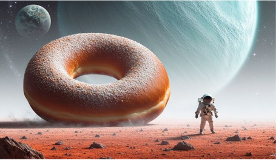{.img-fluid .rounded}
:::
::: {.g-col-1}
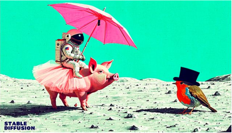{.img-fluid .rounded}
:::
::: {.g-col-1}
{.img-fluid .rounded}
:::
:::

::: {.border .rounded .p-3 .mt-3 .text-center style="font-weight:bold; color:#a30000; font-size:1.1em;"}
The neural network that generates these images was trained with the algorithm just shown
:::

### Reminder: Sampling Algorithm for Flow Model

::: {.callout-note appearance="minimal" icon=false}
**Algorithm 1** Sampling from a Flow Model with Euler method

---

**Require:** Neural network vector field $u_t^\theta$, number of steps $n$

| | | |
|---|---|---|
| 1: | Set $t = 0$ | |
| 2: | Set step size $h = \tfrac{1}{n}$ | |
| 3: | Draw a sample $X_0 \sim p_{\text{init}}$ | [*Random initialization!*]{style="color:#a30000; font-style:italic;"} |
| 4: | **for** $i = 1, \dots, n-1$ **do** | |
| 5: | $\quad X_{t+h} = X_t + h u_t^\theta(X_t)$ | |
| 6: | $\quad$ Update $t \leftarrow t + h$ | |
| 7: | **end for** | |
| 8: | **return** $X_1$ | [*Return final point*]{style="color:#a30000; font-style:italic;"} |

: {tbl-colwidths="[5,60,35]"}
:::

::: {.border .rounded .p-2 .text-center .mb-3 style="border-color:#a30000 !important;"}
[**The Flow Matching Matrix**]{style="color:#a30000; font-size:1.3em;"}
:::

::: {.border .rounded .p-3}

::: {.grid .align-items-center .text-center .mb-2 style="--bs-columns: 11; column-gap: 0.3rem;"}
::: {.g-col-3 .border .rounded .p-2 style="background:#f0f0f0;"}
[**Conditional**]{style="color:#1a6faf;"}\
**Probability Path**
:::
::: {.g-col-1}
$\rightarrow$
:::
::: {.g-col-3 .border .rounded .p-2 style="background:#f0f0f0;"}
[**Conditional**]{style="color:#1a6faf;"}\
**Vector Field**
:::
::: {.g-col-1}
$\rightarrow$
:::
::: {.g-col-3 .border .rounded .p-2 style="background:#f0f0f0;"}
[**Conditional**]{style="color:#1a6faf;"}\
**Flow Matching Loss**
:::
:::

::: {.grid .align-items-center .text-center .mb-3 style="--bs-columns: 11; column-gap: 0.3rem;"}
::: {.g-col-3 .border .rounded .p-2 style="background:#f0f0f0;"}
[**Marginal**]{style="color:#2a9a2a;"}\
**Probability Path**
:::
::: {.g-col-1}
$\rightarrow$
:::
::: {.g-col-3 .border .rounded .p-2 style="background:#f0f0f0;"}
[**Marginal**]{style="color:#2a9a2a;"}\
**Vector Field**
:::
::: {.g-col-1}
$\rightarrow$
:::
::: {.g-col-3 .border .rounded .p-2 style="background:#f0f0f0;"}
[**Marginal**]{style="color:#2a9a2a;"}\
**Flow Matching Loss**
:::
:::

::: {.grid .text-center style="--bs-columns: 3; column-gap: 0.5rem;"}
::: {.g-col-1 .border .rounded .p-3 style="color:#a30000; font-weight:bold;"}
Defines distributions from noise to data
:::
::: {.g-col-1 .border .rounded .p-3 style="color:#a30000; font-weight:bold;"}
Defines training target that we want to learn
:::
::: {.g-col-1 .border .rounded .p-3 style="color:#a30000; font-weight:bold;"}
Loss function that we want to minimize during training
:::
:::

:::

### Conditional Probability Path, Vector Field, and Flow Matching Loss

|  | Notation | Key property | Gaussian example |
|---|:---:|---|---|
| Conditional Probability Path | $p_t(\cdot\|z)$ | Interpolates $p_{\text{init}}$ and a data point $z$ | $\mathcal{N}(\alpha_t z,\, \beta_t^1 I_d)$ |
| Conditional Vector Field | $u_t^{\text{target}}(x\|z)$ | ODE follows conditional path | $\left(\dot{\alpha}_t - \dfrac{\dot{\beta}_t}{\beta_t}\alpha_t\right)z + \dfrac{\dot{\beta}_t}{\beta_t}x$ |
| Conditional FM Loss | $L_{\text{CFM}}(\theta)$ | Loss we minimize during training | $\mathbb{E}_{t,z,x}\left[\|u_t^\theta(x) - u_t^{\text{target}}(x\|z)\|^1\right]$ |

: {.striped .hover tbl-colwidths="[19,15,25,40]"}

::: {.border .rounded .p-3 .text-center style="border-color:#a30000 !important;"}
[**All these objects are tractable. Just analytical formulas!**]{style="color:#a29999; font-weight:bold;"}
:::

### Marginal Probability Path, Vector Field, and Flow Matching Loss

|  | Notation | Key property | Formula |
|---|:---:|---|---|
| Marginal Probability Path | $p_t$ | Interpolates $p_{\text{init}}$ and $p_{\text{data}}$ | $\int p_t(x\|z)\, p_{\text{data}}(z)\,\mathrm{d}z$ |
| Marginal Vector Field | $u_t^{\text{target}}(x)$ | ODE follows marginal path | $\int u_t^{\text{target}}(x\|z)\,\dfrac{p_t(x\|z)\,p_{\text{data}}(z)}{p_t(x)}\,\mathrm{d}z$ |
| Marginal FM Loss | $L_{\text{FM}}(\theta)$ | Implicitly minimized via cond FM loss | $\mathbb{E}_{t,z,x}\left[\|u_t^\theta(x) - u_t^{\text{target}}(x)\|^2\right]$ |

: {.striped .hover tbl-colwidths="[20,15,25,40]"}

::: {.border .rounded .p-2 .text-center style="border-color:#a30000 !important;"}
[**None of these objects are tractable. But we can still learn them!**]{style="color:#a30000; font-weight:bold;"}
:::

## Score Matching

::: {.column-margin}
Credits: [Introduction to Flow Matching and Diffusion Models](https://diffusion.csail.mit.edu/) by Peter Holderrieth
:::

## Guidance

::: {.column-margin}
Credits: [Introduction to Flow Matching and Diffusion Models](https://diffusion.csail.mit.edu/) by Peter Holderrieth
:::

:::