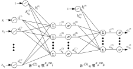

::: {.panel-tabset}

## Recognizing handwritten digits

MNIST: **M**odified **N**ational **I**nstitute of **S**tandards and **T**echnology \
Consider handwritten digits from the MNIST database.
Each digit is made up of $28 \times 28 = 784$ grayscale pixels.

{.lightbox width=80% fig-align="center"}

* Consider the $784$ pixel values as the input values to a function.
* Is there a function $y = f(x)$ whose output gives the digit number?
* Specifically, with $x \in \R^{784}$ and $y \in \R^{10}$ we want a function $f(x)$ as follows:

$$
f(x) = \left\{ \begin{array}{cl}
\bmat{1 & 0 & \cdots & 0} & \text{if } x \text{ is an image of a } 0 \\
\bmat{0 & 1 & \cdots & 0} & \text{if } x \text{ is an image of a } 1 \\
\vdots & \vdots \\
\bmat{0 & 0 & \cdots & 1} & \text{if } x \text{ is an image of a } 9
\end{array} \right.
$$

* A neural network is a way to construct such a function $f(x)$.

### Network to identify handwritten digits

:::: {.columns style="display: flex; align-items: center;"}

::: {.column style="width: 40%; min-width: 0; white-space: normal; overflow-wrap: break-word;"}
::: {style="font-size: 0.9em;"}
* Pixel values: $x \in \R^{784}$.
* Outputs: $a = f\left(x; {W}, {b}\right) \in \R^{10}$.
* ${W}^{(2)} \in \R^{15 \times 784}$ ${b}^{(2)} \in \R^{15}$
* ${W}^{(3)} \in \R^{10 \times 15}$ ${b}^{(3)} \in \R^{10}$

* $z^{(2)} = {W}^{(2)} x + {b}^{(2)}$ with output $\sigma\left(z^{(2)}\right)$
  * $x \in \R^{784}$
  * ${W}^{(2)} \in \R^{15 \times 784}$
  * ${b}^{(2)} \in \R^{15}$
* $z^{(3)} = {W}^{(3)} \sigma\left(z^{(2)}\right) + {b}^{(3)}$ with output $a = \sigma\left(z^{(3)}\right)$
  * ${W}^{(3)} \in \R^{10 \times 15}$
  * ${b}^{(3)} \in \R^{10}$
:::
:::

::: {.column style="width: 60%; min-width: 0;"}
{.lightbox width=100% fig-align="center"}
:::

::::

::: {.callout}
### Short Hand Notation
$$ 
a = y(x) =  f(x; W^{(2)}, b^{(2)}, W^{(3)}, b^{(3)}): \R^{784} \to \R^{10} 
$$

* The total number of parameters is $15 \times 784 + 15 + 10 \times 15 + 10 = 11,935$.
:::

### Stochastic Gradient Descent

Let $\mathcal{D} = \left(x^{(\ell)}, y^{(\ell)}\right)$ for $\ell = 1, \ldots, n$ denote the image-label pairs in the MNIST data set.

We will use gradient descent to find $W^{(2)} \in \R^{15 \times 784}$, $b^{(2)} \in \R^{15}$, $W^{(3)} \in \R^{10 \times 15}$, $b^{(3)} \in \R^{10}$
that minimize a cost function, say MSE loss:
$$
\begin{aligned}
C(W, b) &= \frac{1}{n} \sum_{\ell = 1}^n \frac{1}{2}\lVert f\left(x^{(\ell)}; W^{(2)}, b^{(2)}, W^{(3)}, b^{(3)}\right) - y^{(\ell)} \rVert^2 \\
&= \frac{1}{n}\sum_{(x,y) \in \mathcal{D}} \underbrace{\frac{1}{2} \lVert f\left(x; W^{(2)}, b^{(2)}, W^{(3)}, b^{(3)}\right) - y \rVert^2}_{C_{x, y}}
\end{aligned}
$$

::: {.callout}
### Weight updates
$$
\begin{aligned}
w_{ij}^{(2)} &\leftarrow w_{ij}^{(2)} - \eta \pd{C}{w_{ij}^{(2)}}, \quad b_{j}^{(2)} &\leftarrow b_{j}^{(2)} - \eta \pd{C}{b_{j}^{(2)}} \\
w_{ij}^{(3)} &\leftarrow w_{ij}^{(3)} - \eta \pd{C}{w_{ij}^{(3)}}, \quad b_{j}^{(3)} &\leftarrow b_{j}^{(3)} - \eta \pd{C}{b_{j}^{(3)}}
\end{aligned}
$$

* As there are 11,935 weights and biases, each iteration has this many updates!
:::

#### Computational Challenges

* As $C(W, b) = \frac{1}{n}\sum_{\ell = 1}^n C_{x^\ell, y^\ell}$, we need to compute
$$
\nabla C(W, b) = \frac{1}{n}\sum_{\ell = 1}^n \nabla C_{x^{(\ell)}, y^{(\ell)}} \in \R^{11,935}.
$$
 
* In other words, for each update of the weights and biases, we need to compute
$$
\nabla \left(\frac{1}{2} \lVert f\left(x; W^{(2)}, b^{(2)}, W^{(3)}, b^{(3)}\right) - y \rVert^2\right) \in \R^{11,935}
$$
for each training image!

* Notice that 
$$
\frac{1}{n} \sum_{\ell = 1}^n \nabla \left( \frac{1}{2}\lVert f\left(x^{(\ell)}; W^{(2)}, b^{(2)}, W^{(3)}, b^{(3)}\right) - y^{(\ell)} \rVert^2 \right)
$$
is an **average** value of the gradient over all the training images.

* As $n \simeq 50,000$, perhaps we can get a good estimate of the average gradient using (say) $100$ training images?

::: {.callout-tip}
### SGD in action
* Randomly shuffle the MNIST dataset $\mathcal{D} = \left\{ \left(x^{(1)}, y^{(1)}\right), \ldots, \left(x^{(50,000)}, y^{(50,000)}\right) \right\}$
* Let $m = 100$ be the size of the **mini-batch**.
* Denote by $B^{(k)} = \left\{ \left(x^{(km+1)}, y^{(km+1)}\right), \ldots, \left(x^{((k+1)m)}, y^{((k+1)m)}\right) \right\}$ the $k^{\text{th}}$ mini-batch for $k = 0, \ldots, 499$.
* Continue to obtain $\nicefrac{n}{m} = 500$ mini-batches.

The idea is that 
$$
\begin{aligned}
\nabla C(W, b) &= \frac{1}{n} \sum_{\ell = 1}^n \nabla \left( \frac{1}{2}\lVert f\left(x^{(\ell)}; W^{(2)}, b^{(2)}, W^{(3)}, b^{(3)}\right) - y^{(\ell)} \rVert^2 \right) \\
&\approx \frac{1}{m} \sum_{j = km+1}^{(k+1)m} \nabla \left( \frac{1}{2}\lVert f\left(x^{(j)}; W^{(2)}, b^{(2)}, W^{(3)}, b^{(3)}\right) - y^{(j)} \rVert^2 \right) \quad \text{(sum over mini-batch k)}
\end{aligned}
$$

* Estimate the gradient of $C(W, b)$ by averaging the gradients over a mini-batch of data.
* Greatly speeds up learning (updating the weights)

**New updates**
$$
\begin{aligned}
w_{ij}^{(2)} &\leftarrow w_{ij}^{(2)} - \frac{\eta}{m} \sum_{(x, y) \in B^{(k)}} \pd{C_{x,y}}{w_{ij}^{(2)}}, \quad b_{j}^{(2)} &\leftarrow b_{j}^{(2)} - \frac{\eta}{m} \sum_{(x, y) \in B^{(k)}} \pd{C_{x,y}}{b_{j}^{(2)}} \\
w_{ij}^{(3)} &\leftarrow w_{ij}^{(3)} - \frac{\eta}{m} \sum_{(x, y) \in B^{(k)}} \pd{C_{x,y}}{w_{ij}^{(3)}}, \quad b_{j}^{(3)} &\leftarrow b_{j}^{(3)} - \frac{\eta}{m} \sum_{(x, y) \in B^{(k)}} \pd{C_{x,y}}{b_{j}^{(3)}}
\end{aligned}
$$

* After running through all the mini-batches, we have updated the weights $\nicefrac{n}{m} = 500$ times and gone through all the MNIST data **once**.
  - This is called an **epoch** of training.
* Next epoch: Reshuffle the MNIST data and repeat the above.
* After many epochs of training, we hope the neural network can identify handwritten digits.
:::

## Backpropagation

### Network Structure

We have the following network structure

{.lightbox width=100% fig-align="center"}

corresponding to the following equations
$$
\begin{aligned}
z^{(2)} &= W^{(2)} a^{(1)} + b^{(2)}, \quad a^{(2)} = \sigma(z^{(2)}) \\
z^{(3)} &= W^{(3)} a^{(2)} + b^{(3)}, \quad a^{(3)} = \sigma(z^{(3)})
\end{aligned}
$$ 

Let the cost function be
$$ C(W, b) = \frac{1}{2} \lVert a^{(3)} - y \rVert^2 = \frac{1}{2} \sum_{j=1}^{n_o} (a_j^{(3)} - y_j)^2. $$

**Back-propagation algorithm:** Systematic way to compute
$$
\begin{aligned}
&\pd{C}{w_{ij}^{(3)}}, \quad \pd{C}{b_{j}^{(3)}}, \quad \text{for } i = 1, 2, \ldots, n_o, \; j = 1, 2, \ldots, n_h \\
&\pd{C}{w_{ij}^{(2)}}, \quad \pd{C}{b_{j}^{(2)}}, \quad \text{for } i = 1, 2, \ldots, n_h, \; j = 1, 2, \ldots, n_I.
\end{aligned}
$$

**Key trick:** First compute 
$$
\delta^{(3)} = \pd{C}{z^{(3)}} = \bmat{
  \pd{C}{z_1^{(3)}} \\
  \pd{C}{z_2^{(3)}} \\
  \vdots \\
  \pd{C}{z_{n_o}^{(3)}}
}, \quad 
\delta^{(2)} = \pd{C}{z^{(2)}} = \bmat{
  \pd{C}{z_1^{(2)}} \\
  \pd{C}{z_2^{(2)}} \\
  \vdots \\
  \pd{C}{z_{n_h}^{(2)}}
}.
$$

### Compute $\delta^{(3)} \triangleq \pd{C}{z^{(3)}}$

Let's start chasing the signal. Note first that 

$$
\pd{C}{a_j^{(3)}} = \pd{}{a_j^{(3)}} \left( \frac{1}{2} \sum_{k=1}^{n_o} (a_k^{(3)} - y_k)^2 \right) = (a_j^{(3)} - y_j).
$$

so that

$$
\pd{C}{z_j^{(3)}} = \pd{C}{a_j^{(3)}} \pd{a_j^{(3)}}{z_j^{(3)}}
= \pd{C}{a_j^{(3)}} \sigma'(z_j^{(3)})
= \left(a_j^{(3)} - y_j\right) \sigma'(z_j^{(3)}).
$$

In matrix form

$$
\delta^{(3)} = \underbrace{\left(a^{(3)} - y\right)}_{\nabla_a C = \pd{C}{a^{(3)}}} \odot \sigma'(z^{(3)})
$$ {#eq-bp1}

### Compute $\delta^{(2)} \triangleq \pd{C}{z^{(2)}}$

By the chain rule, we have 

$$
\bmat{
  \pd{C}{a_1^{(2)}} & \pd{C}{a_2^{(2)}} & \cdots & \pd{C}{a_{n_h}^{(2)}} 
} = 
\underbrace{\bmat{
  \pd{C}{z_1^{(3)}} & \pd{C}{z_2^{(3)}} & \cdots & \pd{C}{z_{n_o}^{(3)}} 
}}_{\left(\delta^{(3)}\right)^\top}
\underbrace{\bmat{
  \pd{z_1^{(3)}}{a_1^{(2)}} & \pd{z_2^{(3)}}{a_1^{(2)}} & \cdots & \pd{z_{n_o}^{(3)}}{a_1^{(2)}} \\
  \pd{z_1^{(3)}}{a_2^{(2)}} & \pd{z_2^{(3)}}{a_2^{(2)}} & \cdots & \pd{z_{n_o}^{(3)}}{a_2^{(2)}} \\
  \vdots & \vdots & \ddots & \vdots \\
  \pd{z_1^{(3)}}{a_{n_h}^{(2)}} & \pd{z_2^{(3)}}{a_{n_h}^{(2)}} & \cdots & \pd{z_{n_o}^{(3)}}{a_{n_h}^{(2)}} 
}}_{W^{(3)}}
$$

Another application of the chain rule gives

$$
\begin{aligned}
\underbrace{\bmat{
  \pd{C}{z_1^{(2)}} & \pd{C}{z_2^{(2)}} & \cdots & \pd{C}{z_{n_h}^{(2)}} 
}}_{\left(\delta^{(2)}\right)^\top} &= 
\bmat{
  \pd{C}{a_1^{(2)}}\pd{a_1^{(2)}}{z_1^{(2)}} & \pd{C}{a_2^{(2)}}\pd{a_2^{(2)}}{z_2^{(2)}} & \cdots & \pd{C}{a_{n_h}^{(2)}}\pd{a_{n_h}^{(2)}}{z_{n_h}^{(2)}} 
} \\
&= \bmat{
  \pd{C}{a_1^{(2)}}\sigma'(z_1^{(2)}) & \pd{C}{a_2^{(2)}}\sigma'(z_2^{(2)}) & \cdots & \pd{C}{a_{n_h}^{(2)}}\sigma'(z_{n_h}^{(2)}) 
} \\
&= \underbrace{\bmat{
  \pd{C}{a_1^{(2)}} & \pd{C}{a_2^{(2)}} & \cdots & \pd{C}{a_{n_h}^{(2)}} 
}}_{\left(\delta^{(3)}\right)^\top W^{(3)}} \odot \bmat{
  \sigma'(z_1^{(2)}) & \sigma'(z_2^{(2)}) & \cdots & \sigma'(z_{n_h}^{(2)}) 
}
\end{aligned}
$$

Taking the transpose, we obtain
$$
\delta^{(2)} = \left(W^{(3)}\right)^\top \delta^{(3)} \odot \sigma'(z^{(2)}).
$$ {#eq-bp2}

### Compute $\pd{C}{b_{j}^{(3)}}$

$$
\begin{aligned}
\pd{C}{b_j^{(3)}} = \sum_{k=1}^{n_o} \pd{C}{z_k^{(3)}} \pd{z_k^{(3)}}{b_j^{(3)}} &= \pd{C}{z_j^{(3)}}\pd{z_j^{(3)}}{b_j^{(3)}} \quad \text{as } z_k^{(3)} = \sum_{\ell=1}^{n_h} w_{k\ell}^{(3)} a_{\ell}^{(2)} + b_k^{(3)} \\
&= \pd{C}{z_j^{(3)}} \cdot 1 \quad \text{as } z_j^{(3)} = \sum_{\ell=1}^{n_h} w_{j\ell}^{(3)} a_{\ell}^{(2)} + b_j^{(3)}.
\end{aligned}
$$

More succinctly, 

$$
\pd{C}{b^{(3)}} = \bmat{
  \pd{C}{b_1^{(3)}} \\
  \pd{C}{b_2^{(3)}} \\
  \vdots \\
  \pd{C}{b_{n_o}^{(3)}}
} = \bmat{
  \pd{C}{z_1^{(3)}} \\
  \pd{C}{z_2^{(3)}} \\
  \vdots \\
  \pd{C}{z_{n_o}^{(3)}}
} = \delta^{(3)}.
$$ {#eq-bp3}

### Compute $\pd{C}{w_{ij}^{(3)}}$

$$
\begin{alignedat}{2}
\pd{C}{w_{ij}^{(3)}} &= \mathrlap{\sum_{k=1}^{n_o} \pd{C}{z_k^{(3)}} \pd{z_k^{(3)}}{w_{ij}^{(3)}}} \\
&= \pd{C}{z_j^{(3)}} \pd{z_j^{(3)}}{w_{ij}^{(3)}} && \quad \text{as} \quad z_k^{(3)} = \sum_{\ell=1}^{n_h} w_{k\ell}^{(3)} a_{\ell}^{(2)} + b_k^{(3)} \\
&= \pd{C}{z_j^{(3)}} \cdot a_i^{(2)} && \quad \text{as} \quad z_j^{(3)} = \sum_{\ell=1}^{n_h} w_{j\ell}^{(3)} a_{\ell}^{(2)} + b_j^{(3)}.
\end{alignedat}
$$

More succinctly, 

$$
\pd{C}{W^{(3)}} = \bmat{
  \pd{C}{w_{11}^{(3)}} & \pd{C}{w_{12}^{(3)}} & \cdots & \pd{C}{w_{1n_h}^{(3)}} \\
  \pd{C}{w_{21}^{(3)}} & \pd{C}{w_{22}^{(3)}} & \cdots & \pd{C}{w_{2n_h}^{(3)}} \\
  \vdots & \vdots & \ddots & \vdots \\
  \pd{C}{w_{n_o1}^{(3)}} & \pd{C}{w_{n_o2}^{(3)}} & \cdots & \pd{C}{w_{n_on_h}^{(3)}} 
} = \bmat{
  \pd{C}{z_1^{(3)}} \\
  \pd{C}{z_2^{(3)}} \\
  \vdots \\
  \pd{C}{z_{n_o}^{(3)}} 
} \bmat{
  a_1^{(2)} & a_2^{(2)} & \cdots & a_{n_h}^{(2)} 
} = \delta^{(3)} \left(a^{(2)}\right)^\top.
$$ {#eq-bp4}

### Compute $\pd{C}{b_{j}^{(2)}}$

$$
\begin{aligned}
\pd{C}{b_j^{(2)}} = \sum_{k=1}^{n_h} \pd{C}{z_k^{(2)}} \pd{z_k^{(2)}}{b_j^{(2)}} &= \pd{C}{z_j^{(2)}}\pd{z_j^{(2)}}{b_j^{(2)}} \quad \text{as } z_k^{(2)} = \sum_{\ell=1}^{n_I} w_{k\ell}^{(2)} a_{\ell}^{(1)} + b_k^{(2)} \\
&= \pd{C}{z_j^{(2)}} \cdot 1 \quad \text{as } z_j^{(2)} = \sum_{\ell=1}^{n_I} w_{j\ell}^{(2)} a_{\ell}^{(1)} + b_j^{(2)}.
\end{aligned}
$$

More succinctly, 

$$
\pd{C}{b^{(2)}} = \bmat{
  \pd{C}{b_1^{(2)}} \\
  \pd{C}{b_2^{(2)}} \\
  \vdots \\
  \pd{C}{b_{n_h}^{(2)}}
} = \bmat{
  \pd{C}{z_1^{(2)}} \\
  \pd{C}{z_2^{(2)}} \\
  \vdots \\
  \pd{C}{z_{n_h}^{(2)}}
} = \delta^{(2)}.
$$ {#eq-bp5}

### Compute $\pd{C}{w_{ij}^{(2)}}$

$$
\begin{alignedat}{2}
\pd{C}{w_{ij}^{(2)}} &= \mathrlap{\sum_{k=1}^{n_h} \pd{C}{z_k^{(2)}} \pd{z_k^{(2)}}{w_{ij}^{(2)}}} \\
&= \pd{C}{z_j^{(2)}} \pd{z_j^{(2)}}{w_{ij}^{(2)}} && \quad \text{as} \quad z_k^{(2)} = \sum_{\ell=1}^{n_I} w_{k\ell}^{(2)} a_{\ell}^{(1)} + b_k^{(2)} \\
&= \pd{C}{z_j^{(2)}} \cdot a_i^{(1)} && \quad \text{as} \quad z_j^{(2)} = \sum_{\ell=1}^{n_I} w_{j\ell}^{(2)} a_{\ell}^{(1)} + b_j^{(2)}.
\end{alignedat}
$$

More succinctly, 

$$
\pd{C}{W^{(2)}} = \bmat{
  \pd{C}{w_{11}^{(2)}} & \pd{C}{w_{12}^{(2)}} & \cdots & \pd{C}{w_{1n_I}^{(2)}} \\
  \pd{C}{w_{21}^{(2)}} & \pd{C}{w_{22}^{(2)}} & \cdots & \pd{C}{w_{2n_I}^{(2)}} \\
  \vdots & \vdots & \ddots & \vdots \\
  \pd{C}{w_{n_h1}^{(2)}} & \pd{C}{w_{n_h2}^{(2)}} & \cdots & \pd{C}{w_{n_hn_I}^{(2)}} 
} = \bmat{
  \pd{C}{z_1^{(2)}} \\
  \pd{C}{z_2^{(2)}} \\
  \vdots \\
  \pd{C}{z_{n_h}^{(2)}} 
} \bmat{
  a_1^{(1)} & a_2^{(1)} & \cdots & a_{n_I}^{(1)} 
}
= \delta^{(2)} \left(a^{(1)}\right)^\top.
$$ {#eq-bp6}

### Equations of Back Propagation 

$$
C = \frac{1}{2} \| a^{(3)} - y \|^2 = \frac{1}{2} \sum_{j=1}^{n_o} (a_j^{(3)} - y_j)^2
$$

By @eq-bp1
$$
\delta^{(3)} = \nabla_a C \odot \sigma'(z^{(3)}) = (a^{(3)} - y) \odot \sigma'(z^{(3)})
$$ 

By @eq-bp3
$$
\pd{C}{b^{(3)}} = \delta^{(3)}
$$

By @eq-bp4
$$
\pd{C}{W^{(3)}} = \delta^{(3)} (a^{(2)})^\top
$$

By @eq-bp2
$$
\delta^{(2)} = (W^{(3)})^\top \delta^{(3)} \odot \sigma'(z^{(2)})
$$

By @eq-bp5
$$
\pd{C}{b^{(2)}} = \delta^{(2)}
$$

By @eq-bp6
$$
\pd{C}{W^{(2)}} = \delta^{(2)} (a^{(1)})^\top
$$

### Activation Function Calculus

::: {.callout}
### Step Function 
$$
\sigma(z) = \begin{cases} 1 & \text{if } z \ge 0 \\ 0 & \text{if } z < 0 \end{cases}, \quad 
\sigma'(z) = \begin{cases} 1 & \text{if } z = 0 \\ 0 & \text{if } z \ne 0 \end{cases}
$$
:::

::: {.callout}
### Sigmoid Function
$$
\sigma(z) = \frac{1}{1 + e^{-z}}, \quad 
\sigma'(z) = \sigma(z)(1 - \sigma(z))
$$
:::

::: {.callout}
### Tanh (Hyperbolic Tangent) Function 
$$
\sigma(z) = \tanh(z) = \frac{e^z - e^{-z}}{e^z + e^{-z}}, \quad 
\sigma'(z) = 1 - \sigma(z)^2
$$
:::

::: {.callout}
### ReLU (Rectified Linear Unit) Function
$$
\sigma(z) = \max(0, z), \quad 
\sigma'(z) = \begin{cases} 1 & \text{if } z > 0 \\ 0 & \text{if } z \le 0 \end{cases}
$$
:::

:::