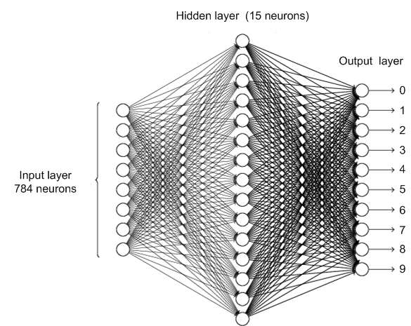

::: {.panel-tabset}

## Recognizing handwritten digits

::: {.column-margin}
Image credits: [Deep Learning](http://neuralnetworksanddeeplearning.com) by Michael Nielsen
:::

MNIST: **M**odified **N**ational **I**nstitute of **S**tandards and **T**echnology \
Consider handwritten digits from the MNIST database.
Each digit is made up of $28 \times 28 = 784$ grayscale pixels.

{.lightbox width=80% fig-align="center"}

* Consider the $784$ pixel values as the input values to a function.
* Is there a function $y = f(x)$ whose output gives the digit number?
* Specifically, with $x \in \R^{784}$ and $y \in \R^{10}$ we want a function $f(x)$ as follows:

$$
f(x) = \left\{ \begin{array}{cl}
\bmat{1 & 0 & \cdots & 0} & \text{if } x \text{ is an image of a } 0 \\
\bmat{0 & 1 & \cdots & 0} & \text{if } x \text{ is an image of a } 1 \\
\vdots & \vdots \\
\bmat{0 & 0 & \cdots & 1} & \text{if } x \text{ is an image of a } 9
\end{array} \right.
$$

* A neural network is a way to construct such a function $f(x)$.

### Network to identify handwritten digits

:::: {.columns style="display: flex; align-items: center;"}

::: {.column width="40%" style="flex: 0 0 40%; min-width: 0; white-space: normal; overflow-wrap: break-word;"}
::: {style="font-size: 0.9em;"}
* Pixel values: $x \in \R^{784}$.
* Outputs: $a = f\left(x; {W}, {b}\right) \in \R^{10}$.
* ${W}^{(2)} \in \R^{15 \times 784}$ ${b}^{(2)} \in \R^{15}$
* ${W}^{(3)} \in \R^{10 \times 15}$ ${b}^{(3)} \in \R^{10}$

* $z^{(2)} = {W}^{(2)} x + {b}^{(2)}$ with output $\sigma\left(z^{(2)}\right)$
  * $x \in \R^{784}$
  * ${W}^{(2)} \in \R^{15 \times 784}$
  * ${b}^{(2)} \in \R^{15}$
* $z^{(3)} = {W}^{(3)} \sigma\left(z^{(2)}\right) + {b}^{(3)}$ with output $a = \sigma\left(z^{(3)}\right)$
  * ${W}^{(3)} \in \R^{10 \times 15}$
  * ${b}^{(3)} \in \R^{10}$
:::
:::

::: {.column width="60%" style="flex: 0 0 60%; min-width: 0;"}
{.lightbox width=100% fig-align="center"}
:::

::::

## Demonstrations

:::