::: {.panel-tabset}

## Measuring Performance

::: {.column-margin}
Image credits: [Deep Learning](http://neuralnetworksanddeeplearning.com) by Michael Nielsen
:::

With sufficient capacity (i.e., number of hidden units), a neural network will often perform 
perfectly on the training data. However, this does not guarantee good performance on 
unseen (new test) data.

Test errors have three distinct causes:

1. the inherent uncertainty in the data,
2. the amount of training data,
3. the choice of model.

The latter dependency raises the issue of hyperparameter selection.

### Training a simple model

{.lightbox width=100% fig-align="center"}

::: {.callout-tip}
### Neural Network for MNIST-1D
* $D_i = 40$ inputs, $D_o = 10$ outputs, passed through $\operatorname{softmax}$ activation function.
* Two hidden layers with $D = 100$ hidden units each.
* Trained using SGD with batch size $100$ and learning rate $\eta = 0.1$ for $6000$ steps ($150$ epochs).
* Loss: multiway cross-entropy.
:::

{.lightbox width=100% fig-align="center"}

### Sources of error

::: {.column-body .snug-figure-row}
::: {.side-caption}
Regression function. Solid black line shows ground truth function. To generate $I$ training examples 
$\{x_i, y_i\}$, the input space $x \in [0, 1]$ is divided into $I$ equal segments and one sample $x_i$
is drawn from a uniform distribution within each segment. The corresponding value $y_i$ is created by 
evaluating the function at $x_i$ and adding Gaussian noise (gray region shows $\pm 2\sigma$). The 
test data are generated in the same way.
:::

{.lightbox width="350px"}
:::

We fit a simplified shallow neural network to this data.

* The weights and biases are chosen so that the "joints" of the function are evenly spaced across the interval.
* If there are $D$ hidden units, then these joints will be at $0, \nicefrac{1}{D}, \nicefrac{2}{D}, \ldots \nicefrac{(D-1)}{D}$.

![
  a) The weights and biases between the input and hidden layer are fixed (dashed arrows).
  b-d) They are chosen so that the hidden unit activations have slope one, and their joints are 
  equally spaced across the interval, with joints at $x = 0$, $x = \nicefrac{1}{3}$, $x = \nicefrac{2}{3}$, resp.
  Modifying the remaining parameters $\bm{\phi} = \{\beta, \omega_1, \omega_2, \omega_3\}$ can create 
  any piecewise linear function over $x \in [0, 1]$ with joints at $\nicefrac{1}{3}$ and $\nicefrac{2}{3}$. 
  e-g) Three example functions with different values of the parameters $\bm{\phi}$.
](assets/images/PerfModel.svg){.lightbox}

#### Noise, bias, and variance

::: {.callout-note}
#### Noise
The data generation process includes noise, so there are multiple possible valid outputs $y$ for each input $x$.
This source of error is insurmountable for the test data. However, it does not necessarily limit the training 
performance; we will likely never see the same input $x$ twice during training, so it is still possible to fit 
the training data perfectly.

Noise may arise because there is a genuine element to the data generation process, because some of the data are 
mislabeled, or because there are further explanatory variables that were not observed.
:::

![
  a) Noise. Data generation is noisy, so even if the model exactly replicates the true underlying function 
  (black line), the noise in the test data (gray points) means that some error will remain (gray region 
  represents $2\sigma$). 
  b) Bias. Even with the best possible parameters, the three-region model (cyan line) cannot exactly fit 
  the true function (black line) (gray regions represent signed error).
  c) Variance. In practice, we have limited noisy training data (orange points). When we fit the model, 
  we don't recover the best possible function from panel (b) but a slightly different function (cyan line) 
  that reflects idiosyncrasies of the trainin data (gray region represents $2\sigma$).
](assets/images/PerfNoiseBiasVariance.svg){.lightbox}

::: {.callout-tip}
#### Bias
The model is not flexible enough to fit the true function perfectly. For example, the three-region 
neural network model cannot exactly describe the quasi-sinusoidal function, even when the parameters are 
chosen optimally.
:::

::: {.callout-important}
#### Variance
We have limited training examples, and there is no way to distinguish systematic changes in the 
underlying function from noise in the underlying data. When we fit a model, we do not get the closest 
possible approximation to the true underlying function. Indeed, for different training datasets, the 
results will be slightly different each time. In practice, there may also be additional variance due to 
the stochastic learning algorithm, which does not necessarily converge to the same solution each time.
:::

#### Mathematical formulation of test error

Consider a 1D regression problem where the data generation process has additive noise with variance $\sigma^2$.
For each $x$, there is a distribution $p(y \mid x)$ with [expected value]{style="color: dodgerblue;"} (mean) $\mu(x)$:
$$
\mu(x) = \E_y[y(x)] = \int y(x) p(y \mid x) dy
$$
and fixed noise $\sigma^2 = \E_y\left[ (\mu(x) - y(x))^2 \right]$.

Now, consider a least squares loss between the model prediction $f(x; \bm{\phi})$ at position $\bm{x}$
and the observed value $y(x)$ at that position
$$
\begin{aligned}
    \mathcal{L}(x, y; \bm{\phi}) &= \left( f(x; \bm{\phi}) - y(x) \right)^2 \\
    &= \left( f(x; \bm{\phi}) - \mu(x) + \mu(x) - y(x) \right)^2 \\
    &= \left( f(x; \bm{\phi}) - \mu(x) \right)^2 + 2 \left( f(x; \bm{\phi}) - \mu(x) \right) \left( \mu(x) - y(x) \right) + \left( \mu(x) - y(x) \right)^2
\end{aligned}
$$

The underlying function is stochastic, so this loss depends on the particular $y(x)$ we observe. The
expected loss is:
$$
\begin{aligned}
\E_y[\mc{L}(x)] &= \E_y\left[\left( f(x; \bm{\phi}) - \mu(x) \right)^2 + \left( \mu(x) - y(x) \right)^2 + 2 \left( f(x; \bm{\phi}) - \mu(x) \right) \left( \mu(x) - y(x) \right)\right] \\
&= \left( f(x; \bm{\phi}) - \mu(x) \right)^2 + \sigma^2 + 2 \left( f(x; \bm{\phi}) - \mu(x) \right) \E_y[\mu(x) - y(x)] \\
&= \left( f(x; \bm{\phi}) - \mu(x) \right)^2 + \sigma^2 + 2 \left( f(x; \bm{\phi}) - \mu(x) \right) \left( \mu(x) - \E_y[y(x)] \right) \\
&= \left( f(x; \bm{\phi}) - \mu(x) \right)^2 + \sigma^2
\end{aligned}
$$ {#eq-expectedloss}

We can see that the expected loss has been broken down into two terms: the first term is the 
squared deviation between the model and the true function mean, and the second term is the noise.

The first term can be further partitioned into bias and variance. The parameters $\bm{\phi}$ of
the model $f(x; \bm{\phi})$ depend on the training dataset $\mc{D} = \{x_i, y_i\}$. The training 
dataset is a random sample from the data generation process. The expected model output $f_\mu(x)$ 
with respect to all possible datasets is hence:
$$f_\mu(x) = \E_\mc{D}[f(x; \bm{\phi})(\mc{D})].$$

Returning to the first term of @eq-expectedloss, we add and subtract $f_\mu(x)$ and expand
$$
\begin{aligned}
    \left( f(x; \bm{\phi}) - \mu(x) \right)^2 &= \left( f(x; \bm{\phi}) - f_\mu(x) + f_\mu(x) - \mu(x) \right)^2 \\
    &= \left( f(x; \bm{\phi}) - f_\mu(x) \right)^2 + 2 \left( f(x; \bm{\phi}) - f_\mu(x) \right) \left( f_\mu(x) - \mu(x) \right) + \left( f_\mu(x) - \mu(x) \right)^2
\end{aligned}
$$

Taking the expectation with respect to the training dataset $\mc{D}$ yields
$$
\E_\mc{D}\left[\left( f(x; \bm{\phi}) - \mu(x) \right)^2\right] = \E_\mc{D}\left[\left( f(x; \bm{\phi}) - f_\mu(x) \right)^2\right] + \left( f_\mu(x) - \mu(x) \right)^2.
$$

Finally, substitute this result into @eq-expectedloss:
$$
\E_y[\mc{L}(x)] = \sigma^2 + \text{Bias}^2 + \text{Variance},
$$
where $\text{Bias}^2 = \left( f_\mu(x) - \mu(x) \right)^2$ and $\text{Variance} = \E_\mc{D}\left[\left( f(x; \bm{\phi}) - f_\mu(x) \right)^2\right]$.

This equation says that the expected loss after considering the uncertainty in the training data $\mc{D}$
and the test data $y$ consists of three additive components. The variance is the uncertainty in the fitted 
model due to the particular training dataset we sample. The bias is the systematic deviation of the model 
from the mean of the function we are modeling. The noise is the inherent uncertainty in the true mapping 
from input to output.

### Reducing error

The noise component is insurmountable; there is nothing to do to circumvent this, and it represents a 
fundamental limit on expected model performance. However, it is possible to reduce the other two terms.

#### Reducing variance

Fitting the model to two different training sets results in slightly different parameters.
It follows that we can reduce the variance by increasing the quantity of training data. This 
averages out the inherent noise and ensures that the input space is well sampled.

![
  a-c) The three region model fitted to the three different randomly sampled datasets of six points. 
  The fitted model is quite different each time.
  d) We repeat this experiment many times and plot the mean model predictions (cyan line) and the 
  variance of the model predictions (gray area shows two standard devications). 
  e-h) We do the same experiment, but this time with datasets of size ten. The variance of the 
  predictions is reduced.
  i-l) We repeat this experiment with datasets of size 100.  Now the fitted model is always 
  similar, and the variance is small.
](assets/images/PerfVariance.svg){.lighbox}

#### Reducing bias 

The bias term results from the inability of the model to describe the true underlying function. 
This suggests that we can reduce this error by making the model more flexible. This is usually done 
by increasing the model __capacity__. For neural nets, this means adding more hidden units and/or
hidden layers.

{.lightbox}

#### Bias-variance trade-off

For a fixed-size training dataset, the variance term typically increases as the model capacity increases.
Consequently, increasing the model capacity does not necessarily reduce the test error!

![
  Overfitting.
  a-c)  A model with three regions is fit to three different datasets of fifteen points each.
  The result is similar in all three cases (i.e., the variance is low).
  d-f) A model with ten regions is fit to the same atasets. The additional flexibility does not 
  necessarily produce better predictions. While these three models each describe the training 
  data better, they are not necessarily closer to the true underlying function (black curve). 
  Instead, they overfit the data and describe the noise, and the variance (difference between 
  fitted curves) is larger.
](assets/images/PerfCapacityVariance.svg){.lightbox}

We have seen that as we add capacity to the model, the bias decreases, but the variance 
increases for a fixed-size training dataset. This suggests that there is an optimal capacity 
where the bias is not too large and the variance is still relatively small.

{.lightbox width=50%}

## Improving Performance

:::: {.columns style="display: flex; align-items: center;"}

::: {.column style="width: 40%; min-width: 0; white-space: normal; overflow-wrap: break-word;"}
::: {style="font-size: 0.9em;"}
* Pixel values: $x \in \R^{784}$.
* Outputs: $a^{(3)} = f\left(x; {W}, {b}\right) \in \R^{10}$.
* ${W}^{(2)} \in \R^{30 \times 784}$ ${b}^{(2)} \in \R^{30}$
* ${W}^{(3)} \in \R^{10 \times 30}$ ${b}^{(3)} \in \R^{10}$
* Total number of parameters: $30 \times 784 + 30 + 10 \times 30 + 10 = 23,860$.

::: {.callout}
### Overfitting
* The network learns with the (noisy) training data.
* However, the network does not perform well on new (noisy) test data.
:::

**Are we using too many parameters?** \
* Are the parameters being adjusted to learn the noisy training data? \
* The parameters should be adjusted for classification of new (unseen) data.

:::
:::

::: {.column style="width: 60%; min-width: 0;"}
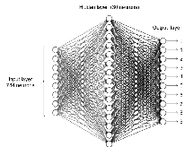{.lightbox width=100% fig-align="center"}
:::

::::

### Overfitting

* Suppose we train the network using on $1000$ training images, instead of $50,000$.
* Let the mini-batch size be $10$ so there are only $100$ weight updates per epoch.
* $400$ epochs for a total of $400 \times 100 = 40,000$ weight updates.

We are going to use the binary cross-entropy loss function for this demonstration
$$
\mc{L} = -\frac{1}{1000}\sum_x \sum_{j=1}^{10} \left[ y_j \log\left(a_j^{(3)}\right) + \left(1 - y_j\right)\log\left(1 - a_j^{(3)}\right)\right].
$$

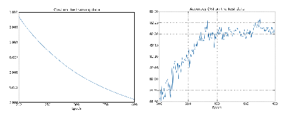{.lightbox width="100%" fig-align="center"}

* Left side is cost on **training data** from epoch $200$ to epoch $400$. 
* Right side is the percent accuracy on the $10,000$ **test digits**.
* After about epoch $280$, the accuracy on the test data only fluctuates at about $82\%$.
* We say the network is **overfitting** or **overtraining** beyond epoch $280$.

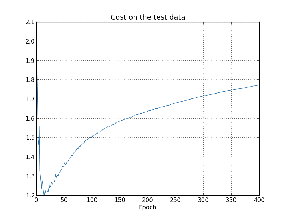{.lightbox width="70%" fig-align="center"}

* Cost on the **test data** gets worse after epoch $15$!
* Does overfitting start at epoch $15$ rather than $280$?
* Practical point of view
  - Improve the **classification accuracy** on the **test data**!
  - Take overfitting to start at epoch $280$.

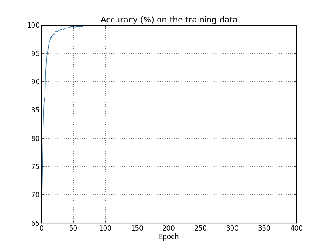{.lightbox width="70%" fig-align="center"}

* After about $75$ epochs, the network correctly classifies all $1000$ **training images**.
* The classification accuracy on the **test images** is only about $82\%$ ($8200$ correct out of $10,000$).
  - The network learns peculiarities/idiosyncracies (due to noise) of the training set.
  - Not recognizing digits in general.

* Overfitting is a major problem in neural networks.
* We do not want the weights and biases adjusted to fit the noise in the training data.
* Use the [validation_data]{style="color: dodgerblue;"} (instead of [test_data]{style="color: dodgerblue;"}) to monitor and prevent overfitting.

::: {.callout-tip}
#### Detect Overfitting

1. Compute classification accuracy on the [validation_data]{style="color: dodgerblue;"} after each epoch.
2. If the accuracy on the [validation_data]{style="color: dodgerblue;"} no longer improves, stop training.
:::

Why use `validation_data` rather than `test_data` to prevent overfitting?

* The MNIST set has $60,000$ training images and $10,000$ testing images.
* The [test_data]{style="color: dodgerblue;"} represents the data **after** the network is trained, e.g., 
the network used by the Post Office to read zip codes.
* The $60,000$ training images are _subdivided_ into $50,000$ images for the [training_data]{style="color: dodgerblue;"}
and $10,000$ images for the [validation_data]{style="color: dodgerblue;"}.
* Recall the hyperparameters: $n_h$ number of hidden neurons, $\eta$ learning rate, number of epochs, mini-batch size, etc.
* Use the [validation_data]{style="color: dodgerblue;"} to tune the hyperparameters.
* The **final evaluation** is done using the [test_data]{style="color: dodgerblue;"}.

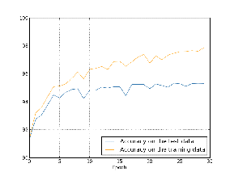{.lightbox width="70%" fig-align="center"}

* Mini-batch size is $10$, $\eta = 0.5$, $30$ hidden neurons, binary cross-entropy loss.
* $50,000$ training images $\rightarrow$ $5000$ mini-batches.
* $30$ epochs $\rightarrow$ $15000$ weight updates.
* $97.86\%$ classification accuracy on the $50,000$ training images.
* $95.49\%$ classification accuracy on the $10,000$ test images.

Recall: overfitting gave $100\%$ on the $1000$ training images, but only $82\%$ on the $10,000$ test images.

### Regularization: Keep the weights from getting too large

* Add a _regularization_ term to the loss function:
$$
\begin{aligned}
\mc{L} &= \mc{L}_0 + \mc{L}_{\text{reg}} \\
\mc{L}_0 &= -\frac{1}{n}\sum_x \sum_{j=1}^{n_o} \left[ y_j \log\left(a_j^{(3)}\right) + \left(1 - y_j\right)\log\left(1 - a_j^{(3)}\right)\right] \\
\mc{L}_{\text{reg}} &= \frac{\lambda}{2}\frac{1}{n}\sum_w w^2
\end{aligned}
$$

or with the mini-batch:
$$
\begin{aligned}
\mc{L} &= \mc{L}_0 + \mc{L}_{\text{reg}} \\
\mc{L}_0 &= -\frac{1}{m}\sum_{x \in \mc{B}} \sum_{j=1}^{n_o} \left[ y_j \log\left(a_j^{(3)}\right) + \left(1 - y_j\right)\log\left(1 - a_j^{(3)}\right)\right] \\
\mc{L}_{\text{reg}} &= \frac{\lambda}{2}\frac{1}{n}\sum_w w^2
\end{aligned}
$$

Note that the regularization terms stayed the same.

* $\lambda > 0$ is the _regularization parameter_.
* This can be done on the quadratic cost as well:
$$
\mc{L} = \frac{1}{m} \sum_{x \in \mc{B}} \frac{1}{2} \left(\hat{y} - y\right)^2 + \frac{\lambda}{2}\frac{1}{n}\sum_w w^2
$$
* Minimizing $\mc{L}$ is a compromise between small weights and small $\mc{L}_0$.
* Regularization is done to reduce overfitting.

The gradients of the regularized loss are 
$$
\begin{aligned}
\pd{\mc{L}}{w} &= \pd{\mc{L}_0}{w} + \frac{\lambda}{n}w \\
\pd{\mc{L}}{b} &= \pd{\mc{L}_0}{b}
\end{aligned}
$$

The learning rule (parameter update) becomes
$$
\begin{aligned}
w &\leftarrow w - \eta \pd{\mc{L}_0}{w} - \eta \frac{\lambda}{n}w = \left(1 - \eta \frac{\lambda}{n}\right)w - \eta \pd{\mc{L}_0}{w} \\
b &\leftarrow b - \eta \pd{\mc{L}_0}{b}.
\end{aligned}
$$

* At each update, each weight is scaled by $\left(1 - \eta \frac{\lambda}{n}\right)$, where $\eta$ and $\lambda$ are 
chosen so that 
$$ 0 < \left(1 - \eta \frac{\lambda}{n}\right) < 1. $$
* This rescaling is often called _weight decay_ or _L2 regularization_.

:::: {.columns}

::: {.column width="50%"}
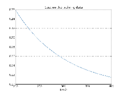{.lightbox width="100%" fig-align="center"}
:::

::: {.column width="50%"}
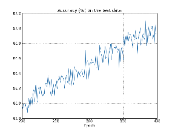{.lightbox width="100%" fig-align="center"}
:::

::::

* Recall that previously classification accuracy stopped at about epoch $280$.
* With regularization the classification accuracy is still increasing at epoch $400$.
* Classification accuracy is now $87\%$ (without regularization it was $82\%$) at epoch $400$.

{.lightbox width="100%" fig-align="center"}

* Classification accuracy is now $96.49\%$ with regularization (right figure).
* It was $95.49\%$ without regularization (left figure).
* Further training with $100$ hidden neurons instead of $30$ neurons increases the classification 
accuracy to $97.92\%$.

::: {.callout-tip}
### Why don't we include the biases in regularization?
* Empirically, it does not seem to help.
* Biases are not sensitive to input noise.
* Large weights multiplying the (noisy) input makes the neuron sensitive to the noise.
:::

### Dropout

1. Randomly choose $p$ of the hidden neurons to "drop out."
2. Forward propagate the input $x$ through the modified network.
3. Backpropagate the error, also through the modified network.
4. Do this over a mini-batch.
5. Update the **appropriate** weights and biases.

* Repeat the above on the next minibatch.
  - That is, randomly choose another $p$ of the hidden neurons to dropout, etc.

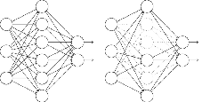{.lightbox width="80%" fig-align="center"}

* At each update, only a proportion $p$ of the weights are updated.
* Ater training, run the **full** network.
  - $\frac{1}{1-p}$ as many hidden neurons will be active compared to training.
  - Compensate this by scaling the weights **outgoing** from the hidden neurons by $1-p$.
* We can look at dropout as __averaging__ over different networks.
* Dropout means that the network learns without relying on being connected to specific other neurons.
* Dropout makes the model robust to the loss of any individual piece of evidence.

### Weight Initialization

:::: {.columns}

::: {.column width="60%"}
* Initializing the weights as independent standard Gaussian random variables $\mc{N}(0, 1)$ may be naively appropriate.
* Unfortunately, this is not such a good idea.
* Consider a binary picture of $1000$ pixels, so $x_j \in \{0, 1\}$ for $j = 1, \ldots, 1000$.
* Let $z = \sum_{j=1}^{1000} w_j x_j + b$ be the input to one of the hidden neurons.
* Suppose half the input neurons are on and the other half are off.

$$
\begin{aligned}
\E[z] &= \E\left[\sum_{j=1}^{1000} w_j x_j + b\right] = \sum_{j=1}^{1000} \E[w_j] x_j + \E[b] = 0, \\
\E\left[z^2\right] &= \E\left[\left(\sum_{j=1}^{1000} w_j x_j + b\right)^2\right] = \sum_{j=1}^{1000} \E[w_j^2]x_j^2 + \E[b^2] = 501.
\end{aligned}
$$
:::

::: {.column width="40%" fig-align="center"}
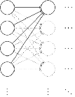{.lightbox width="200px" fig-align="center"}
:::

::::

* Thus, $z = \sum_{j=1}^{1000} w_j x_j + b \sim \mc{N}(0, 501)$. That is, $z$ has a standard deviation of $\sigma = \sqrt{501} \approx 22.4$.

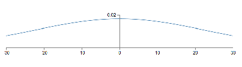{.lightbox width="80%" fig-align="center"}

* At initialization, we will often have $z \gg 1$ or $z \ll -1$ $\;\Longrightarrow\;$ $\sigma(z) \approx 1$ or $\sigma(z) \approx 0$.
* Thus $\sigma^\prime(z) \approx 0$, making learning slow.
  - Slow learning just means that weights do not change much at each update.
  - Cross-entropy loss only eliminates the problem of $\sigma^\prime(z) \approx 0$ at the **output** layer.
  - This problem will be at all the hidden layers.

#### A better initialization scheme

* Let $n_{\text{in}}$ denote the number of input pixels.
* Now, choose the weights as independent Gaussian random variables $\mc{N}(0, \frac{1}{n_{\text{in}}})$.
* Then
$$
\sigma^2 = \E\left[z^2\right] = \sum_{j=1}^{1000} \E[w_j^2]x_j^2 + \E[b^2] = 500 \times \frac{1}{1000} + 1 = \frac{3}{2}.
$$

{.lightbox width="80%" fig-align="center"}

#### Comparison of old and new weight initialization

::: {layout="[50, 50]" layout-valign="center"}
{.lightbox width="500px" fig-align="center"}

{.lightbox width="500px" fig-align="center"}
::: 

### Choosing Hyperparameters

General approach to choosing hyperparameters is to simplify the problem.

* Eliminate all the data except the digits $0$ and $1$.
  - This reduces the data by $80\%$, speeding up the training.
* Try a simple network. Perhaps $[784 10]$ instead of $[784 30 10]$
* Increase the frequency of monitoring
  - E.g. try monigoring the validation accuracy after $1000$ images instead of waiting to do so after $50,000$ images (1 epoch).
* Use fewer validation images.
  - Instead of computing accuracy on $10,000$ validation images, use only $1000$ images.

Let us fix $30$ hidden neurons, $30$ epochs, mini-batch size: $10$, BCE loss

| $\lambda$ | $\eta$ | Test Speed | Accuracy | Comments |
|:---:|:---:|:---:|:---:|:---:|
|$1000.0$ | $10.0$ | Slow | $\nicefrac{967}{10000}$ | |
|$1000.0$ | $10.0$ | Fast | $\nicefrac{10}{100}$ | Decrease validation dataset size |
|$20.0$ | $10.0$ | Fast | $\nicefrac{18}{100}$ | Have somthing though not very good |
|$20.0$ | $100.0$ | Fast | $\nicefrac{10}{100}$ | Back to noise! Need to reduce $\eta$ |
|$20.0$ | $1.0$ | Fast | $\nicefrac{61}{100}$ | Better! Keep going, adjust other hyperparameters |

{.lightbox width="80%" fig-align="center"}

Oscillations occur if $\eta$ is too large.

* Theoretically, we want to update the weights until $\pd{\mc{L}_0}{w} = 0$.
* However, with $\eta$ too large, we can keep overshooting the minimum, i.e. oscillate.
* If $\eta$ is too small, then it will take "forever" to descent to the minimum value.

::: {.callout-tip}
### Learning Rate
* Choose $\eta$ based on the training cost.
  - The purpose of $\eta$ is to control the step size. 
  - Monitoring the training cost is the best weay to detect if the step size is too large.
* First, estimate the **threshold** (maximum value) of $\eta$ as the value at which 
the cost on the training data decreases during the first few epochs, i.e., the cost 
should not be oscillating or increasing.
* For example, try $\eta = 0.01$. If the cost decreases during the first few epochs, then 
successively try $\eta = 0.1$, $\eta = 1.0$, $\ldots$
* Keep increasing $\eta$ until the cost oscillates or increases during the first few epochs.
* If the cost oscillates or increases with $\eta = 0.01$, then successively try 
$\eta = 0.001$, $\eta = 0.0001$, $\ldots$ until the cost decreases during the first few epochs.
* The **threshold** is then the largest $\eta$ at which the cost decreases during the first few epochs.
* To use $\eta$ over many epochs one perhaps divides it by $2$ after (say) $5$ epochs so the 
steps are smaller as you get closer to the minimum.
:::

::: {.callout-tip}
### Early Stopping
* At the end of each epoch, compute the classification accuracy on the validation data.
* If the accuracy does not improve for (say) $10$ epochs, stop training.
  - The stopping rule gives a new hyperparameter.
:::

::: {.callout-tip}
### Learning Rate Schedule
How do we schedule the decreases for the learning rate $\eta$?

* Hold the learning rate constant until the validation accuracy starts to get worse.
* Then decrease the learning rate by (say) a factor of two.
* Continue until (say) $\eta$ is $2^{10} = 1024$ times lower than its initial value.
* Then terminate.
:::

::: {.callout-note}
### Regularization Parameter 
How do we choose $\lambda$?

* Set $\lambda = 0$ and determine the value of $\eta$.
* Then select a good value of $\lambda$ using the validation data.
  - Set $\lambda = 1$.
  - If the accuracy goes up, increase $\lambda$ by a factor of $10$.
  - Else, decrease $\lambda$ by a factor of $10$.
:::

### Better Optimizers

Recall the update rule for gradient descent:

$$w^{\text{new}} = w^{\text{old}} - \eta \nabla_w \mc{L}(w)$$

#### Gradient Descent via the Hessian

We have the Taylor-series approximation

$$
\mc{L}(w + \Delta w) \approx \mc{L}(w) + \nabla_w \mc{L}(w)^\top \Delta w + \frac{1}{2} \Delta w^\top H \Delta w, 
$$

where $H = \nabla_w^2 \mc{L}(w)$ is the Hessian matrix of second-order partial derivatives.
Let us take the derivative with respect to $\Delta w$ and set equal to zero:

$$
\pd{\mc{L}(w+\Delta w)}{\Delta w}(w) = \pd{\mc{L}}{w}(w) + \pdd{\mc{L}}{w}(w)\Delta w = 0
$$

and solve for $\Delta w$:

$$
\Delta w = -\left( \pdd{\mc{L}}{w}(w) \right)^{-1} \pd{\mc{L}}{w}(w) = -H^{-1} \nabla_w \mc{L}(w)
$$

This motivates the following update rule, known as the **Newton update rule**:

$$
w^{\text{new}} = w^{\text{old}} - \eta H^{-1} \nabla_w \mc{L}(w),
$$

where $\eta$ is chosen so that $\norm{\Delta w}{} = \norm{\eta H^{-1} \nabla_w \mc{L}(w)}{}$ is not too large.

* The Hessian matrix $H \in \S^d$ is a $d \times d$ symmetric matrix, where $d$ is the number of weights in the neural network.
* Computing the Hessian matrix and its inverse is computationally expensive.
  - $d$ diagonal elements and $\frac{d(d-1)}{2}$ off-diagonal elements to compute
  - Requires $d + \frac{d(d-1)}{2} = \frac{d(d+1)}{2}$ computations
  - E.g. if $d \approx 24,000$, then computing $H$ requires $288 \times 10^6$ computations!
    - Further, we must then invert this matrix!
* Hessian approach is thus avoided due to the computations requirements.

#### Momentum Based Gradient Descent

Momentum-based gradient descent uses a similar idea to the Hessian approach, but avoids the computation and inversion of a large matrix.

::: {.callout-important}
### Key Idea
* Think of $\mc{L}(w)$ as the potential function of a partical of mass $m$ with $w$ the particle's position.
* Then $-\nabla_w \mc{L}(w)$ is the force acting on the particle, and $-\nicefrac{1}{m}\nabla_w \mc{L}(w)$ is the acceleration.
* The change in velocity is $v^{\text{(new)}} - v^{\text{(old)}} = \Delta v = (\Delta t)\nicefrac{1}{m}\nabla_w \mc{L}(w)$, 
* The change in position is then $w^{\text{(new)}} - w^{\text{(old)}} = \Delta w = (\Delta t) v^{\text{(new)}}$.
:::

::: {.callout-important}
### Momentum Based Gradient Descent
$$
\begin{aligned}
v^{\text{(new)}} &= \mu v^{\text{(old)}} - \eta \nabla_w \mc{L}(w)^{(\text{old})} = v^{(old)} - \underbrace{(1-\mu)v^{(old)}}_{\text{viscous friction}} - \eta \nabla_w \mc{L}(w)^{(\text{old})}, && \eta = (\Delta t) \frac{1}{m},\\
w^{\text{(new)}} &= w^{\text{(old)}} + v^{\text{(new)}}, && \Delta t = 1.
\end{aligned}
$$
:::

* $0 < \mu < 1$ is the **momentum coefficient** hyperparameters.
* $1 - \mu$ represents the "viscous friction" coefficient.
* If $\mu = 0$, we simply recover standard gradient descent:

$$
\begin{aligned}
v^{\text{(new)}} &= - \eta \nabla_w \mc{L}(w)^{(\text{old})}, \\
w^{\text{(new)}} &= w^{\text{(old)}} + v^{\text{(new)}}.
\end{aligned}
$$

* Define the concetanated vector $\xi = \bmat{v & w}^\top \in \R^{2d}$ and the vector
$g = \nabla_w \mc{L}(w) \otimes \bmat{1 & 1}^\top \in \R^{2d}$, where $\otimes$ is the Kronecker product.
* Then the update rule can be written as
$$
\xi^{(k+1)} = A \xi^{(k)} - \eta g^{(k)},
$$
where
$$
A = A_2 \otimes I_d \triangleq \bmat{\mu & 0 \\ \mu & 1} \otimes I_d.
$$

* Rolling out the recursive definition of $\xi^{(k)}$ gives
$$
\xi^{(k)} = A^k \xi^{(0)} - \eta \sum_{j=0}^{k-1} A^{k-j-1} g^{(j)}.
$$

::: {.callout-warning}
* What is the problem with choosing $\mu > 1$?
* What is the problem with choosing $\mu < 0$?

Note that by the geometric progression formula, we have
$$
A_2^k = \bmat{\mu^k & 0 \\ \mu \frac{1-\mu^k}{1-\mu} & 1}.
$$
as long as $\abs{\mu} < 1$.
:::

::: {.callout-tip}
### More content
[More details can be found in this document](assets/misc/Nielsen_Slides_chap3_24.pdf).
:::

## Spiral Example

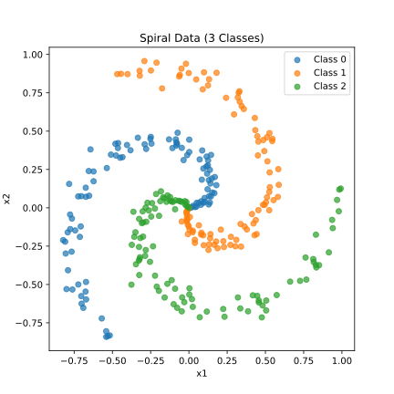{.lightbox width="100%" fig-align="center"}

* The training data is in $\R^2$ and has three categories (three classifications).
* The data is **not** linearly separable.

:::: {.columns style="display: flex; align-items: center;"}

::: {.column width="30%"}

::: {.callout}
## One Hot Labels
* Spiral 1: $y = \bmat{1 & 0 & 0 }^\top$
* Spiral 2: $y = \bmat{0 & 1 & 0 }^\top$
* Spiral 3: $y = \bmat{0 & 0 & 1 }^\top$
:::

:::

::: {.column width="70%"}
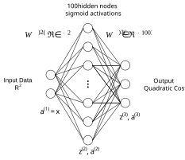{.lightbox width="70%" fig-align="center"}
:::

::::

#### Softmax Activation

$$
\begin{aligned}
z_1^{(3)} &= \sum_{j=1}^{100} w_{1j}^{(3)} a_j^{(2)} + b_1^{(3)}, && a_1^{(3)} = \frac{e^{z_1^{(3)}}}{\sum_{k=1}^3 e^{z_k^{(3)}}}, \\
z_2^{(3)} &= \sum_{j=1}^{100} w_{2j}^{(3)} a_j^{(2)} + b_2^{(3)}, && a_2^{(3)} = \frac{e^{z_2^{(3)}}}{\sum_{k=1}^3 e^{z_k^{(3)}}}, \\
z_3^{(3)} &= \sum_{j=1}^{100} w_{3j}^{(3)} a_j^{(2)} + b_3^{(3)}, && a_3^{(3)} = \frac{e^{z_3^{(3)}}}{\sum_{k=1}^3 e^{z_k^{(3)}}}.
\end{aligned}
$$

* For $i = 1, 2, 3$, the activation $a_i^{(3)}$ is a function of $z_1^{(3)}, z_2^{(3)}, z_3^{(3)}$!
* $a_1^{(3)}, a_2^{(3)}, a_3^{(3)} > 0$ and $a_1^{(3)} + a_2^{(3)} + a_3^{(3)} = 1$.
* Remember that $y$'s are one-hot labels.
* **Maximum Likelihood Cost** is $\mc{L} = -\sum_j y_j \log(a_j^{(3)}) = -y_1 \log(a_1^{(3)}) - y_2 \log(a_2^{(3)}) - y_3 \log(a_3^{(3)})$.

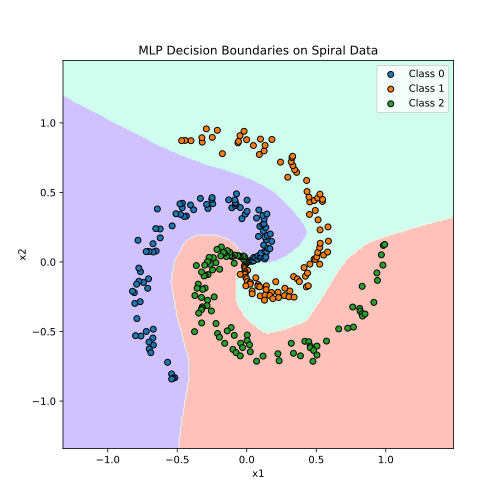{.lightbox width="100%" fig-align="center"}

:::