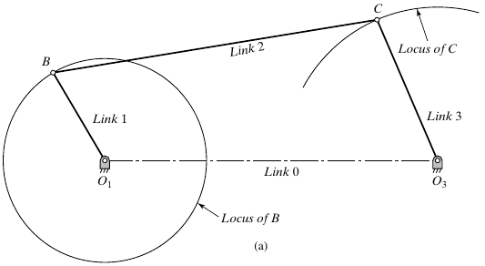
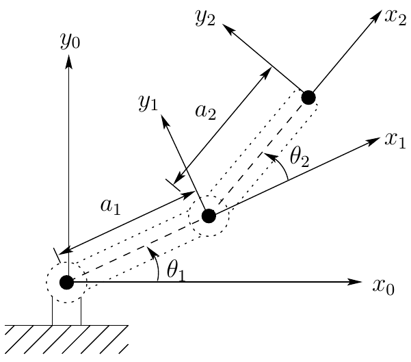

## Chapter overview

- Machines and mechanisms
- Kinematics, dynamics, and statics
- Analysis and synthesis
- Links, joints, and kinematic chains
- Planar and spatial motion

::: {.notes}
Source: Aykut C. Satici, Kinematics and Machine Dynamics, Fall 2020 compiled notes, Chapter 1, §1.1, printed pp. 3–4. This chapter follows Wilson and Sadler (2013).
:::

## Machines and mechanisms

A **machine** combines interconnected parts with definite motions to perform useful work.

A **mechanism** is an arrangement of rigid bodies whose connections constrain their relative motion: moving one member causes others to move.

**Example:** A motor-driven windshield-wiper assembly is a machine. Its linkage transmits motion from the motor to the wiper arms.

::: {.notes}
Source: compiled notes, Chapter 1, Definitions 1.1–1.2. The windshield-wiper example is an instructional illustration of these definitions. A mechanism describes the motion-constraining arrangement; the larger machine also includes actuation and the useful task.
:::

## A four-bar mechanism

::: {.columns}
::: {.column width="55%"}
{width=100% fig-alt="Four-bar crank-rocker with fixed pivots O1 and O3, moving links 1, 2, and 3, and fixed link 0."}

::: {.side-caption}
Compiled notes, Fig. 3.1. Link 0 joins the fixed pivots.
:::
:::
::: {.column width="45%"}
- Link 1 rotates about O~1~.
- Link 2 connects the moving joints B and C.
- Link 3 oscillates about O~3~.
- The connections transmit motion through the assembly.
:::
:::

::: {.notes}
Source: compiled notes, Fig. 3.1, printed p. 7; original asset Textbook/gfx/crank_rocker.png. The figure is introduced here only as a concrete example of a mechanism. Conditions for full rotation and four-bar classification are deferred to Chapter 3.
:::

## Kinematics

**Kinematics** describes motion without considering the forces that produce it.

For a specified mechanism and input motion, determine:

- The positions and orientations of its links.
- Their velocities and accelerations.
- The paths traced by selected points.

**Wiper example:** Determine blade angle and angular speed from the motor's rotation.

::: {.notes}
Source: compiled notes, Definition 1.3. The listed motion quantities and wiper application elaborate the definition.
:::

## Dynamics and statics

**Dynamics** relates motion to the forces and torques acting on a mechanism.

**Statics** studies forces and torques in stationary systems.

| Wiper operating condition | Analysis |
|---|---|
| Moving blade, with inertia and resistance | Dynamics: find the required motor torque |
| Blade held at rest under an applied load | Statics: find holding torque and support reactions |

::: {.notes}
Source: compiled notes, Definitions 1.4–1.5. A moving mechanism may sometimes admit a quasi-static approximation, but that is an additional modeling assumption. The examples here distinguish actual stationary equilibrium from dynamic motion.
:::

## Analysis and synthesis

**Analysis:** Specify a candidate mechanism, then determine its behavior and check whether it meets the requirements.

**Synthesis:** Choose a mechanism and its dimensions to satisfy prescribed requirements.

| Given | Task | Process |
|---|---|---|
| Link lengths and motor motion | Calculate the wiper's sweep | Analysis |
| Required sweep and packaging space | Choose the linkage and link lengths | Synthesis |

::: {.notes}
Source: compiled notes, Definitions 1.6–1.7. Wiper examples illustrate the direction of each process; they are not textbook worked problems. Design usually alternates between synthesis and analysis.
:::

## Links and the fixed frame

A **link** is a rigid body or member in a kinematic chain.

- A link may be a single part or several parts fastened rigidly together.
- The rigid-body idealization neglects deformation within the link.
- The **ground link** is the fixed member used as the reference for motion.

In the four-bar example, links 1–3 move; link 0 is the fixed frame connecting the two supports.

::: {.notes}
Source: compiled notes, Definition 1.8, supplemented by the fixed-link convention used in Chapter 2 and Fig. 3.1. Multiple fastened parts count as one link only when their relative motion is neglected.
:::

## Joints

A **joint**, also called a **pair**, connects links while permitting constrained relative motion.

| Ideal joint | Relative motion permitted | Example |
|---|---|---|
| Revolute | Rotation about one common axis | Pin or hinge |
| Prismatic | Translation along one common axis | Guided slider |

The joint model describes permitted motion; it does not specify the actuator that drives it.

::: {.notes}
Source: compiled notes, Definition 1.9. Revolute and prismatic examples preview the common pairs shown in Fig. 2.1. Ideal joints suppress clearance and elastic deformation. Mobility and constraint counting are reserved for Chapter 2.
:::

## Kinematic chains

A **kinematic chain** is an assembly of links connected by joints.

- An **open chain** has a branch that does not close back on itself.
- A **closed chain** contains a loop of connected links.
- A mechanism may contain both open branches and closed loops.

For the simple closed-loop chains considered here, every link connects to at least two other links.

::: {.notes}
Source: compiled notes, Definitions 1.10–1.11. The text states its closed-loop criterion in terms of every link connecting to two or more others. The slide adds a topology clarification: a general mechanism can combine open branches and closed loops, so the presence of one loop does not imply that every branch is closed.
:::

## Example: an open-chain arm

::: {.columns}
::: {.column width="50%"}
{height=365px fig-alt="Two-link planar arm with a fixed base, shoulder and elbow joints, and a free endpoint."}

::: {.side-caption}
Compiled notes, Fig. 6.1. Coordinate frames will be used in later chapters.
:::
:::
::: {.column width="50%"}
**Links:** the fixed base and two moving members.

**Joints:** shoulder and elbow revolute joints.

**Topology:** the free tip is not connected back to the base. The chain is open.
:::
:::

::: {.notes}
Source: compiled notes, Definition 1.11 and Fig. 6.1, printed p. 36; original asset Textbook/gfx/two_link_manipulator.png. The diagram supports topology identification here; coordinate transformations and forward kinematics are deferred to Chapters 5–6.
:::

## Example: the closed four-bar chain

Follow the connections around the loop:

**Ground → link 1 → link 2 → link 3 → ground**

- The fixed frame closes the chain between the two grounded pivots.
- The moving links cannot be positioned independently.
- Every configuration must satisfy the geometry of the entire loop.

::: {.notes}
Source: compiled notes, Definition 1.10 and Fig. 3.1. The loop sequence is a connectivity description, not a direction of force transmission. Loop-closure equations are developed in Chapter 6.
:::

## Planar motion

A linkage has **planar motion** when all its points move in parallel planes.

- Translation takes place parallel to one reference plane.
- Rotation takes place about axes perpendicular to that plane.
- The physical links can have thickness and occupy offset parallel planes.

The illustrated four-bar and two-link arm are planar mechanisms.

::: {.notes}
Source: compiled notes, Definition 1.12. Planarity concerns the motion, not whether the hardware is a flat object. Physical thickness does not by itself require a spatial model.
:::

## Spatial motion

A linkage has **spatial motion** when its motion cannot be confined to parallel planes.

**Example:** A robot arm with a rotating base and a shoulder joint about a horizontal axis generally moves through three-dimensional space.

The model must describe both position and orientation in space. A single planar drawing is no longer sufficient to represent its general motion.

::: {.notes}
Source: compiled notes, Definition 1.13. The robot example is an instructional extension. The stated spatial behavior refers to general motion with both joints active; a restricted trajectory may happen to lie in a plane.
:::

## Describing a mechanism

1. Identify the useful task and the machine that performs it.
2. Select rigid links and a fixed reference frame.
3. Identify the joints and their permitted motions.
4. Identify open branches and closed loops.
5. Decide whether the motion is planar or spatial.
6. State whether the task requires synthesis, kinematic analysis, static analysis, or dynamic analysis.

::: {.notes}
Instructional synthesis of Chapter 1, Definitions 1.1–1.13. This is a model-description workflow, not a new theorem or a prescribed textbook algorithm.
:::

## References and next chapter

**Reading:** Aykut C. Satici, *Kinematics and Machine Dynamics*, Fall 2020 compiled notes, Chapter 1, §1.1, pp. 3–4.

**Chapter source:** Charles E. Wilson and J. Peter Sadler, *Kinematics and Dynamics of Machinery*, Pearson New International Edition, 2013.

**Next:** Degrees of Freedom (Mobility) — quantifying how many independent coordinates are needed to describe a mechanism's configuration.

::: {.notes}
The compiled notes explicitly attribute Chapter 1 to Wilson and Sadler. Figure provenance is provided on the corresponding slides. The deck paraphrases all 13 definitions and adds labeled instructional examples.
:::
