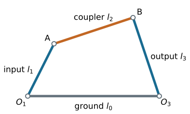

## Chapter overview

- Check whether four lengths form a movable closed linkage.
- Apply Grashof's criterion.
- Identify the effect of choosing a different fixed link.
- Evaluate the transmission angle.

::: {.notes}
Source: Satici, compiled Kinematics and Machine Dynamics notes (Fall 2020), Chapter 3, pp. 7–9; supporting Lecture01 slides. Original worked examples and clarifications are documented in _planning/remaining-chapters-coverage.md.
:::

## Name the links before sorting lengths

{height=340}

Use $l_0$ for ground, $l_1$ for input, $l_2$ for coupler, and $l_3$ for output. Sorted lengths are $s\leq p\leq q\leq l$.

::: {.notes}
Source: Satici, compiled Kinematics and Machine Dynamics notes (Fall 2020), Chapter 3, pp. 7–9; supporting Lecture01 slides. Original worked examples and clarifications are documented in _planning/remaining-chapters-coverage.md.
:::

## Can the linkage close?

A nondegenerate quadrilateral requires

$$\boxed{l<s+p+q.}$$

If $l>s+p+q$, the links cannot close.

If $l=s+p+q$, they can only lie collinearly in a degenerate assembly; this is not an ordinary moving four-bar.

::: {.notes}
Source: Satici, compiled Kinematics and Machine Dynamics notes (Fall 2020), Chapter 3, pp. 7–9; supporting Lecture01 slides. Original worked examples and clarifications are documented in _planning/remaining-chapters-coverage.md.
:::

## Grashof's criterion

For an assemblable four-bar:

| Length test | Motion class |
|---|---|
| $s+l<p+q$ | Strict Grashof |
| $s+l=p+q$ | Change-point case |
| $s+l>p+q$ | Non-Grashof |

In the strict Grashof case, at least one link can rotate completely relative to an adjacent link. Rotation relative to **ground** depends on which link is fixed.

::: {.notes}
Source: Satici, compiled Kinematics and Machine Dynamics notes (Fall 2020), Chapter 3, pp. 7–9; supporting Lecture01 slides. Original worked examples and clarifications are documented in _planning/remaining-chapters-coverage.md.
:::

## Inversion: choosing the fixed link

Keep the same four lengths and the same cyclic connectivity, but fix a different link.

For a strict Grashof chain with a unique shortest link:

| Position of shortest link | Ground-referenced motion |
|---|---|
| Fixed | Double crank (drag link) |
| Adjacent to ground | Crank-rocker |
| Opposite ground, as the coupler | Double rocker |

::: {.notes}
Source: Satici, compiled Kinematics and Machine Dynamics notes (Fall 2020), Chapter 3, pp. 7–9; supporting Lecture01 slides. Original worked examples and clarifications are documented in _planning/remaining-chapters-coverage.md.
:::

## Crank-rocker

{height=330}

The shortest link is adjacent to ground and can rotate continuously. The other ground-connected link oscillates.

The driver must be chosen consistently with the desired continuous input.

::: {.notes}
Source: Satici, compiled Kinematics and Machine Dynamics notes (Fall 2020), Chapter 3, pp. 7–9; supporting Lecture01 slides. Original worked examples and clarifications are documented in _planning/remaining-chapters-coverage.md.
:::

## Double crank and double rocker

**Double crank:** ground is shortest; both ground-connected links can rotate fully.

**Grashof double rocker:** the coupler is shortest; both ground-connected links rock, even though the chain satisfies Grashof's condition.

**Non-Grashof:** no inversion supplies a fully rotating ground-connected crank; the moving links have bounded rotation relative to ground.

::: {.notes}
Source: Satici, compiled Kinematics and Machine Dynamics notes (Fall 2020), Chapter 3, pp. 7–9; supporting Lecture01 slides. Original worked examples and clarifications are documented in _planning/remaining-chapters-coverage.md.
:::

## Change points

$$s+l=p+q.$$

The links can pass through an all-collinear configuration. The continuation of motion can become ambiguous at this posture.

A parallelogram is a familiar example. An additional constraint or suitable drive arrangement may be needed to maintain the intended branch.

Treat equality separately from strict Grashof motion.

::: {.notes}
Source: Satici, compiled Kinematics and Machine Dynamics notes (Fall 2020), Chapter 3, pp. 7–9; supporting Lecture01 slides. Original worked examples and clarifications are documented in _planning/remaining-chapters-coverage.md.
:::

## Worked example: classify one assembly

Let $(l_0,l_1,l_2,l_3)=(100,40,120,90)\ \mathrm{mm}$.

$$s=40,\quad l=120,\quad p=90,\quad q=100.$$

Closure: $120<40+90+100$.

Grashof: $40+120=160<190=90+100$.

The shortest link is the input, adjacent to ground: **crank-rocker**.

::: {.notes}
Source: Satici, compiled Kinematics and Machine Dynamics notes (Fall 2020), Chapter 3, pp. 7–9; supporting Lecture01 slides. Original worked examples and clarifications are documented in _planning/remaining-chapters-coverage.md.
:::

## Worked example: change the ground link

Use the same cyclic chain with lengths $100,40,120,90\ \mathrm{mm}$.

- Fix the $40$ mm link: double crank.
- Fix the opposite $90$ mm link: Grashof double rocker.
- Fix either adjacent link, $100$ or $120$ mm: crank-rocker.

Sorting the lengths alone does not identify the inversion.

::: {.notes}
Source: Satici, compiled Kinematics and Machine Dynamics notes (Fall 2020), Chapter 3, pp. 7–9; supporting Lecture01 slides. Original worked examples and clarifications are documented in _planning/remaining-chapters-coverage.md.
:::

## Worked example: a variable ground length

Let $(l_1,l_2,l_3)=(100,200,300)\ \mathrm{mm}$ and let ground length be $d>0$.

Closure requires $d<600$ mm. Applying the sorted Grashof test piecewise gives

$$\boxed{200\leq d\leq400.}$$

The endpoints $200,400$ mm are change-point cases.

Strict crank-rocker operation occurs for $200<d<400$ mm, with the $100$ mm link as crank.

::: {.notes}
Source: Satici, compiled Kinematics and Machine Dynamics notes (Fall 2020), Chapter 3, pp. 7–9; supporting Lecture01 slides. Original worked examples and clarifications are documented in _planning/remaining-chapters-coverage.md.
:::

## Transmission angle

Let $\mu$ be the included angle between coupler and output link, $0\leq\mu\leq\pi$.

For an ideal two-force coupler exerting axial force $F$,

$$|\tau_3|=|F|l_3|\sin\mu|.$$

Torque transmission is strongest near $90^\circ$. Near collinearity, large coupler and bearing forces produce little output torque.

::: {.notes}
Source: Satici, compiled Kinematics and Machine Dynamics notes (Fall 2020), Chapter 3, pp. 7–9; supporting Lecture01 slides. Original worked examples and clarifications are documented in _planning/remaining-chapters-coverage.md.
:::

## Compute the angle from a triangle

Let $d_A$ be the distance from input endpoint $A$ to output pivot $O_3$.

$$d_A^2=l_0^2+l_1^2-2l_0l_1\cos\theta_1.$$

The triangle with sides $l_2,l_3,d_A$ gives

$$\boxed{\cos\mu=\frac{l_2^2+l_3^2-d_A^2}{2l_2l_3}.}$$

A supplementary angle convention gives the same $|\sin\mu|$ and hence the same torque magnitude.

::: {.notes}
Source: Satici, compiled Kinematics and Machine Dynamics notes (Fall 2020), Chapter 3, pp. 7–9; supporting Lecture01 slides. Original worked examples and clarifications are documented in _planning/remaining-chapters-coverage.md.
:::

## Worked example: force transmission

For $(100,40,120,90)$ mm and $\theta_1=90^\circ$:

$$d_A^2=11600\ \mathrm{mm^2},\qquad \cos\mu=\frac{10900}{21600}.$$

Thus $\mu\approx59.7^\circ$.

With $F=500$ N and $l_3=0.09$ m:

$$|\tau_3|\approx500(0.09)\sin59.7^\circ=38.9\ \mathrm{N\,m}.$$

::: {.notes}
Source: Satici, compiled Kinematics and Machine Dynamics notes (Fall 2020), Chapter 3, pp. 7–9; supporting Lecture01 slides. Original worked examples and clarifications are documented in _planning/remaining-chapters-coverage.md.
:::

## Design implications

The compiled notes suggest keeping $45^\circ\leq\mu\leq135^\circ$ as a useful preliminary guideline.

Check the **entire operating cycle**, not a single configuration.

Also check branch changes, clearances, bearing forces, friction, and link strength. The angle guideline alone does not establish a safe design.

::: {.notes}
Source: Satici, compiled Kinematics and Machine Dynamics notes (Fall 2020), Chapter 3, pp. 7–9; supporting Lecture01 slides. Original worked examples and clarifications are documented in _planning/remaining-chapters-coverage.md.
:::

## References and next chapter

Satici, *Kinematics and Machine Dynamics*, Chapter 3, pp. 7–9; Lecture01 classification slides, following Wilson and Sadler.

The crank-rocker figure is from the compiled notes, Fig. 3.1. Other diagrams and numerical examples are instructional additions.

**Next:** [Chapter 4: Slider-Crank and Quick-Return Linkages](chapter04.html).

::: {.notes}
Source: Satici, compiled Kinematics and Machine Dynamics notes (Fall 2020), Chapter 3, pp. 7–9; supporting Lecture01 slides. Original worked examples and clarifications are documented in _planning/remaining-chapters-coverage.md.
:::

