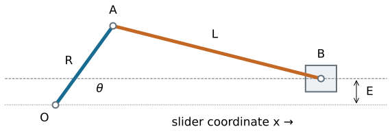
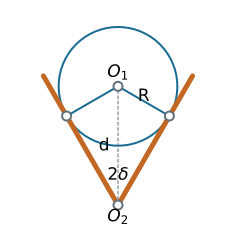

## Chapter overview

- Locate dead-center positions and calculate stroke.
- Compare in-line and offset slider-cranks.
- Compute working and return times at constant crank speed.
- Relate quick return to linkage geometry.

::: {.notes}
Source: Satici, compiled Kinematics and Machine Dynamics notes (Fall 2020), Chapter 4, pp. 11–13; supporting Lecture01 slides. Original worked examples and clarifications are documented in _planning/remaining-chapters-coverage.md.
:::

## Geometry and sign convention

{height=340}

Crank center $O=(0,0)$, crank pin $A=(R\cos\theta,R\sin\theta)$, slider pin $B=(x,E)$. The right-hand assembly uses $x>R\cos\theta$.

::: {.notes}
Source: Satici, compiled Kinematics and Machine Dynamics notes (Fall 2020), Chapter 4, pp. 11–13; supporting Lecture01 slides. Original worked examples and clarifications are documented in _planning/remaining-chapters-coverage.md.
:::

## Position from the rod-length constraint

$$(x-R\cos\theta)^2+(E-R\sin\theta)^2=L^2.$$

For the right-hand branch,

$$\boxed{x=R\cos\theta+\sqrt{L^2-(E-R\sin\theta)^2}.}$$

A sufficient strict condition for full crank rotation on this branch is

$$L>R+|E|.$$

Equality is a limiting singular case.

::: {.notes}
Source: Satici, compiled Kinematics and Machine Dynamics notes (Fall 2020), Chapter 4, pp. 11–13; supporting Lecture01 slides. Original worked examples and clarifications are documented in _planning/remaining-chapters-coverage.md.
:::

## In-line limiting positions

Set $E=0$ and assume $L>R$.

The crank and connecting rod are collinear at $\theta=0$ and $\theta=\pi$:

$$x_{\max}=L+R,\qquad x_{\min}=L-R.$$

$$\boxed{S=x_{\max}-x_{\min}=2R.}$$

Each stroke occupies half a revolution, so their times are equal at constant crank speed.

::: {.notes}
Source: Satici, compiled Kinematics and Machine Dynamics notes (Fall 2020), Chapter 4, pp. 11–13; supporting Lecture01 slides. Original worked examples and clarifications are documented in _planning/remaining-chapters-coverage.md.
:::

## Dead center: velocity and force

At either smooth limiting position, $dx/d\theta=0$, hence

$$\dot x=\frac{dx}{d\theta}\omega=0.$$

An ideal slider force has input-equivalent torque

$$\tau=F_x\frac{dx}{d\theta}=0$$

at dead center. A force on the slider alone cannot initiate crank rotation from this exact posture.

::: {.notes}
Source: Satici, compiled Kinematics and Machine Dynamics notes (Fall 2020), Chapter 4, pp. 11–13; supporting Lecture01 slides. Original worked examples and clarifications are documented in _planning/remaining-chapters-coverage.md.
:::

## Zero velocity does not mean zero acceleration

For constant $\omega$, $\ddot x=\omega^2x''(\theta)$.

For the in-line mechanism:

$$\ddot x(0)=-\omega^2\left(R+\frac{R^2}{L}\right),$$
$$\ddot x(\pi)=\omega^2\left(R-\frac{R^2}{L}\right).$$

Acceleration and inertia forces can be substantial even though slider velocity vanishes.

::: {.notes}
Source: Satici, compiled Kinematics and Machine Dynamics notes (Fall 2020), Chapter 4, pp. 11–13; supporting Lecture01 slides. Original worked examples and clarifications are documented in _planning/remaining-chapters-coverage.md.
:::

## Offset limiting positions

Assume $0<E<L-R$ and $L>R$.

At dead center the distance $OB$ is either $L+R$ or $L-R$. Since the guide is at height $E$,

$$x_{\max}=\sqrt{(L+R)^2-E^2},$$
$$x_{\min}=\sqrt{(L-R)^2-E^2}.$$

The stroke is their difference. It exceeds $2R$ for nonzero offset under these assumptions.

::: {.notes}
Source: Satici, compiled Kinematics and Machine Dynamics notes (Fall 2020), Chapter 4, pp. 11–13; supporting Lecture01 slides. Original worked examples and clarifications are documented in _planning/remaining-chapters-coverage.md.
:::

## The crank angles between limits

Define the acute angles

$$\phi_1=\arcsin\frac{E}{L-R},\qquad
\phi_2=\arcsin\frac{E}{L+R}.$$

With positive counterclockwise rotation, the longer stroke interval is

$$\alpha=\pi+\phi_1-\phi_2,$$

and the shorter interval is $\beta=\pi-\phi_1+\phi_2$. Their sum is $2\pi$.

::: {.notes}
Source: Satici, compiled Kinematics and Machine Dynamics notes (Fall 2020), Chapter 4, pp. 11–13; supporting Lecture01 slides. Original worked examples and clarifications are documented in _planning/remaining-chapters-coverage.md.
:::

## Time ratio

For constant input speed magnitude $|\omega|$:

$$t_{\mathrm{long}}=\frac{\alpha}{|\omega|},\qquad
 t_{\mathrm{short}}=\frac{\beta}{|\omega|}.$$

$$\boxed{Q=\frac{t_{\mathrm{long}}}{t_{\mathrm{short}}}
=\frac{\pi+\phi_1-\phi_2}{\pi-\phi_1+\phi_2}.}$$

Reverse the input direction to exchange which physical stroke is slower. For variable speed, integrate $dt=d\theta/\omega(\theta)$.

::: {.notes}
Source: Satici, compiled Kinematics and Machine Dynamics notes (Fall 2020), Chapter 4, pp. 11–13; supporting Lecture01 slides. Original worked examples and clarifications are documented in _planning/remaining-chapters-coverage.md.
:::

## Worked example: offset and stroke

Choose $R=30$ mm, $L=120$ mm, and $E=40$ mm.

Full rotation is possible: $120>30+40$.

$$x_{\max}=\sqrt{150^2-40^2}=144.57\ \mathrm{mm},$$
$$x_{\min}=\sqrt{90^2-40^2}=80.62\ \mathrm{mm}.$$

$$\boxed{S=63.95\ \mathrm{mm}>60\ \mathrm{mm}.}$$

::: {.notes}
Source: Satici, compiled Kinematics and Machine Dynamics notes (Fall 2020), Chapter 4, pp. 11–13; supporting Lecture01 slides. Original worked examples and clarifications are documented in _planning/remaining-chapters-coverage.md.
:::

## Worked example: stroke times

For the same geometry:

$$\phi_1=26.39^\circ,\quad\phi_2=15.47^\circ.$$

$$\alpha=190.92^\circ,\qquad\beta=169.08^\circ,\qquad Q=1.129.$$

At 120 rpm, one revolution takes 0.500 s:

$$t_{\mathrm{long}}=0.2652\ \mathrm{s},\qquad
 t_{\mathrm{short}}=0.2348\ \mathrm{s}.$$

::: {.notes}
Source: Satici, compiled Kinematics and Machine Dynamics notes (Fall 2020), Chapter 4, pp. 11–13; supporting Lecture01 slides. Original worked examples and clarifications are documented in _planning/remaining-chapters-coverage.md.
:::

## Quick-return mechanisms

A working stroke takes longer than the unloaded return stroke, even with uniform input rotation.

The unequal times come from unequal input-angle intervals between the output limits.

Applications include reciprocating cutting and shaping motions. The return can be faster because it is lightly loaded.

Instantaneous force capability still depends on geometry, losses, and input torque.

::: {.notes}
Source: Satici, compiled Kinematics and Machine Dynamics notes (Fall 2020), Chapter 4, pp. 11–13; supporting Lecture01 slides. Original worked examples and clarifications are documented in _planning/remaining-chapters-coverage.md.
:::

## Slotted-lever quick return

{height=340}

The block on the rotating crank slides in a lever pivoted at $O_2$. The extreme lever directions are tangents to the crank circle centered at $O_1$.

::: {.notes}
Source: Satici, compiled Kinematics and Machine Dynamics notes (Fall 2020), Chapter 4, pp. 11–13; supporting Lecture01 slides. Original worked examples and clarifications are documented in _planning/remaining-chapters-coverage.md.
:::

## Timing from the tangent construction

Let $d=O_1O_2>R$ and $\delta=\arcsin(R/d)$.

The crank intervals between the two lever extremes are

$$\alpha=\pi+2\delta,\qquad\beta=\pi-2\delta.$$

For $R/d=1/2$, $\delta=30^\circ$ and

$$Q=\frac{240^\circ}{120^\circ}=2.$$

An attached output linkage determines the slider stroke; it is not universally $2R$ or twice an arbitrarily named link.

::: {.notes}
Source: Satici, compiled Kinematics and Machine Dynamics notes (Fall 2020), Chapter 4, pp. 11–13; supporting Lecture01 slides. Original worked examples and clarifications are documented in _planning/remaining-chapters-coverage.md.
:::

## Other quick-return arrangements

A drag-link four-bar has two rotating ground-connected links with a generally nonuniform speed relation.

Coupling its output to a suitable slider mechanism can produce unequal stroke times.

To analyze any arrangement, locate its actual output extrema, find the corresponding input angles, and compute the elapsed times.

::: {.notes}
Source: Satici, compiled Kinematics and Machine Dynamics notes (Fall 2020), Chapter 4, pp. 11–13; supporting Lecture01 slides. Original worked examples and clarifications are documented in _planning/remaining-chapters-coverage.md.
:::

## Checks before using the result

- The branch exists through the complete intended input cycle.
- The two stroke intervals add to one revolution.
- Both strokes have the same travel distance.
- Offset $E\to0$ gives $S\to2R$ and $Q\to1$.
- Large timing ratios can bring poor transmission or large accelerations.

::: {.notes}
Source: Satici, compiled Kinematics and Machine Dynamics notes (Fall 2020), Chapter 4, pp. 11–13; supporting Lecture01 slides. Original worked examples and clarifications are documented in _planning/remaining-chapters-coverage.md.
:::

## References and transition to kinematics

Satici, *Kinematics and Machine Dynamics*, Chapter 4, pp. 11–13; Lecture01 quick-return slides, following Wilson and Sadler.

Position, acceleration, tangent construction, and numerical examples are derived here to support the source discussion.

**Next:** [Chapter 5: Rigid Body Motion](chapter05.html).

::: {.notes}
Source: Satici, compiled Kinematics and Machine Dynamics notes (Fall 2020), Chapter 4, pp. 11–13; supporting Lecture01 slides. Original worked examples and clarifications are documented in _planning/remaining-chapters-coverage.md.
:::

