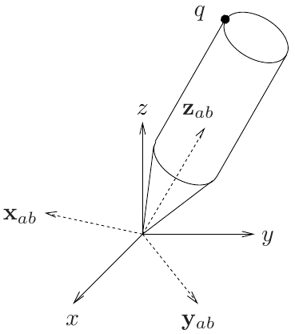
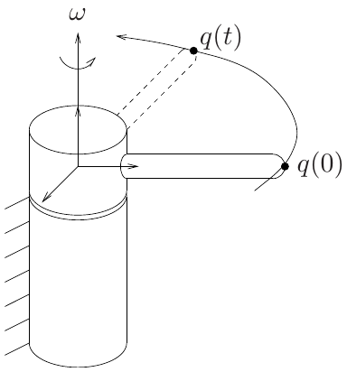
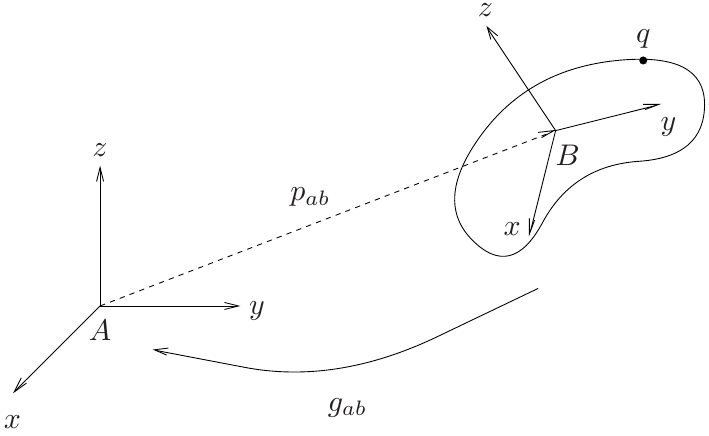
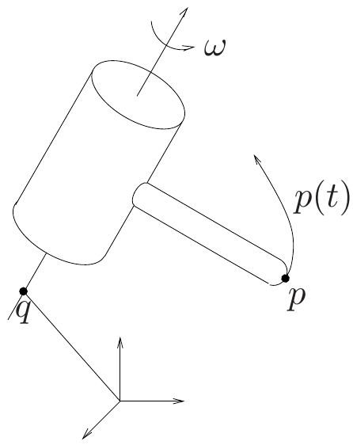
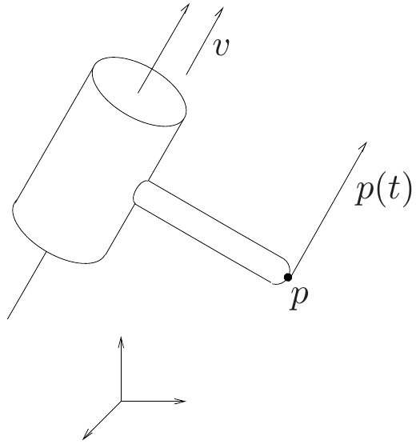

## Chapter overview

1. Rigid transformations and coordinate frames (§5.1)
2. Rotation matrices and their properties (§5.2.1)
3. Axis-angle, exponential coordinates, and Euler angles (§§5.2.2–5.2.3)
4. Homogeneous transformations (§5.3.1)
5. Twists and exponential rigid motion (§5.3.2)

**Goal:** express the position and orientation of a rigid body without ambiguity about frames or rotation order.

::: {.notes}
Source: Satici, Kinematics and Machine Dynamics, Fall 2020 compiled notes, Chapter 5, pp. 17–33. The chapter follows Murray, Li, and Sastry, A Mathematical Introduction to Robotic Manipulation.
:::

## The rigid-body idealization

A rigid body maintains the distance between every pair of material points:

$$\|p(t)-q(t)\|=\|p(0)-q(0)\|.$$

- A **rigid motion** is a continuous history of configurations.
- A **rigid displacement** relates an initial and a final configuration.
- A general displacement combines translation and rotation.

Deformation is neglected; individual points can still move relative to the fixed reference frame.

::: {.notes}
Source: Satici, Kinematics and Machine Dynamics, Fall 2020 compiled notes, §5.1, pp. 17–19. Clarification: body-fixed coordinates are constant; separation vectors may rotate when expressed in a fixed frame.
:::

## Points, vectors, and frames

A **point** specifies a location. A **free vector** specifies a magnitude and direction.

$$v=q-p.$$

The same vector can connect different pairs of points.

A frame supplies an origin and three orthonormal axes. We use right-handed frames:

$$e_1\times e_2=e_3.$$

Coordinates have meaning only after a frame has been specified.

::: {.notes}
Source: Satici, Kinematics and Machine Dynamics, Fall 2020 compiled notes, §5.1, pp. 17–19.
:::

## Distance preservation is not enough

The map $(x,y,z)\mapsto(x,y,-z)$ preserves lengths but reflects the body.

A proper rigid transformation $g$ must preserve both:

$$\|g(p)-g(q)\|=\|p-q\|,$$
$$g_*(v\times w)=g_*(v)\times g_*(w),$$

where $g_*(q-p)=g(q)-g(p)$ is the induced transformation of vectors.

The second condition preserves the handedness of coordinate frames.

::: {.notes}
Source: Satici, Kinematics and Machine Dynamics, Fall 2020 compiled notes, §5.1, Definition 5.1, pp. 18–19.
:::

## Inner products and angles

Lengths determine inner products through the polarization identity:

$$v\cdot w=\frac14\left(\|v+w\|^2-\|v-w\|^2\right).$$

For the induced linear map on free vectors,

$$g_*(v)\cdot g_*(w)=v\cdot w.$$

Consequently, a rigid transformation preserves angles and orthogonality. A right-handed orthonormal body frame remains right-handed and orthonormal.

::: {.notes}
Source: Satici, Kinematics and Machine Dynamics, Fall 2020 compiled notes, §5.1, Proposition 5.2, pp. 18–19. The induced map on free vectors is linear; translations cancel when subtracting points.
:::

## Orientation of a body frame

::: {.columns}
::: {.column width="48%"}
{height=340px fig-alt="Fixed frame A and rotated body frame B sharing an origin, with point q on the body."}

::: {.side-caption}
Compiled notes, Fig. 5.1; chapter based on Murray, Li, and Sastry.
:::
:::
::: {.column width="52%"}
Let $A$ be the reference frame and $B$ the body frame.

The columns of $R_{ab}$ are the axes of $B$, expressed in $A$:

$$R_{ab}=\begin{bmatrix}x_{ab}&y_{ab}&z_{ab}\end{bmatrix}.$$

With coincident origins,

$$q_a=R_{ab}q_b.$$
:::
:::

::: {.notes}
Source: Satici, Kinematics and Machine Dynamics, Fall 2020 compiled notes, §5.2.1, pp. 20–23.
:::

## Reading the frame subscripts

$$\boxed{v_a=R_{ab}v_b}$$

$R_{ab}$ maps coordinates **from $B$ to $A$**.

- The right subscript matches the input coordinates.
- The left subscript identifies the output coordinates.
- The physical vector is unchanged; its coordinate description changes.

The same matrix can describe an active rotation of a vector in a fixed frame. State which interpretation is being used.

::: {.notes}
Source: Satici, Kinematics and Machine Dynamics, Fall 2020 compiled notes, §5.2.1, pp. 20–23.
:::

## The rotation group

Orthonormal columns imply

$$R^\mathsf{T}R=I,\qquad R^{-1}=R^\mathsf{T}.$$

A right-handed frame also requires $\det R=+1$.

$$\boxed{SO(3)=\{R\in\mathbb R^{3\times3}:R^\mathsf{T}R=I,\ \det R=1\}.}$$

An orthogonal matrix with determinant $-1$ includes a reflection.

More generally, $SO(n)$ uses the same conditions for $n\times n$ matrices.

::: {.notes}
Source: Satici, Kinematics and Machine Dynamics, Fall 2020 compiled notes, §5.2.1, pp. 20–23.
:::

## Why rotations form a group

For $R_1,R_2\in SO(3)$:

- **Closure:** $(R_1R_2)^\mathsf{T}(R_1R_2)=I$ and $\det(R_1R_2)=1$.
- **Identity:** $I$ leaves every vector unchanged.
- **Inverse:** $R^{-1}=R^\mathsf{T}\in SO(3)$.
- **Associativity:** $(R_1R_2)R_3=R_1(R_2R_3)$.

The configurations of a body rotating about a fixed point form $SO(3)$. Its motion is a curve $R(t)$ in that space.

::: {.notes}
Source: Satici, Kinematics and Machine Dynamics, Fall 2020 compiled notes, §5.2.1, pp. 20–23.
:::

## Elementary rotations

With $c=\cos\theta$ and $s=\sin\theta$,

$$R_x(\theta)=\begin{bmatrix}1&0&0\\0&c&-s\\0&s&c\end{bmatrix},\qquad
R_y(\theta)=\begin{bmatrix}c&0&s\\0&1&0\\-s&0&c\end{bmatrix},$$

$$R_z(\theta)=\begin{bmatrix}c&-s&0\\s&c&0\\0&0&1\end{bmatrix}.$$

Positive angles follow the right-hand rule; angles in formulas are in radians.

::: {.notes}
Source: Satici, Kinematics and Machine Dynamics, Fall 2020 compiled notes, §5.2.3, p. 26. Elementary matrices are introduced here before composition and reused for Euler angles.
:::

## Worked example: a quarter-turn

Rotate $q=(2,1,0)^\mathsf{T}$ actively by $90^\circ$ about the fixed $+z$ axis:

$$q'=R_z(\pi/2)q=
\begin{bmatrix}0&-1&0\\1&0&0\\0&0&1\end{bmatrix}
\begin{bmatrix}2\\1\\0\end{bmatrix}
=\begin{bmatrix}-1\\2\\0\end{bmatrix}.$$

**Checks:** both vectors have length $\sqrt5$; applying $R_z(-\pi/2)$ recovers $q$.

If $R_{ab}=R_z(\pi/2)$ instead describes a frame orientation, the same multiplication converts $q_b$ into $q_a$.

::: {.notes}
Source: Satici, Kinematics and Machine Dynamics, Fall 2020 compiled notes, §5.2.1. Numerical example added for this deck; values are instructional, not textbook data.
:::

## Composing rotations

$$q_a=R_{ab}q_b,\qquad q_b=R_{bc}q_c$$

therefore

$$\boxed{R_{ac}=R_{ab}R_{bc}.}$$

Apply the rightmost transformation first.

For active rotations: a rotation about a **fixed-frame** axis premultiplies the current orientation; a rotation about a **body-frame** axis postmultiplies it.

::: {.notes}
Source: Satici, Kinematics and Machine Dynamics, Fall 2020 compiled notes, §5.2.1, pp. 20–23.
:::

## Rotation order matters

Let $e_z=(0,0,1)^\mathsf{T}$ and use active fixed-axis rotations.

$$R_z(\pi/2)R_x(\pi/2)e_z=e_x,$$
$$R_x(\pi/2)R_z(\pi/2)e_z=-e_y.$$

Thus $R_zR_x\ne R_xR_z$ in general.

Associativity lets us regroup products. It does **not** let us exchange their order.

::: {.notes}
Source: Satici, Kinematics and Machine Dynamics, Fall 2020 compiled notes, §5.2.1, composition rule. Quarter-turn example added to make noncommutativity explicit.
:::

## The hat map and the cross product

For $a=(a_1,a_2,a_3)^\mathsf{T}$, define

$$\widehat a=\begin{bmatrix}0&-a_3&a_2\\a_3&0&-a_1\\-a_2&a_1&0\end{bmatrix}.$$

Then

$$\widehat a\,b=a\times b,\qquad \widehat a^\mathsf{T}=-\widehat a.$$

The **vee map** reverses the construction: $(\widehat a)^\vee=a$.

The set of $3\times3$ skew-symmetric matrices is denoted $\mathfrak{so}(3)$.

::: {.notes}
Source: Satici, Kinematics and Machine Dynamics, Fall 2020 compiled notes, §§5.2.1–5.2.2, pp. 22–24.
:::

## Rotations preserve cross products

For $R\in SO(3)$,

$$R(v\times w)=(Rv)\times(Rw),$$
$$\boxed{R\widehat wR^\mathsf{T}=\widehat{Rw}.}$$

Lengths are preserved because

$$\|R(q-p)\|^2=(q-p)^\mathsf{T}R^\mathsf{T}R(q-p)=\|q-p\|^2.$$

Together these properties establish that rotations are proper rigid transformations.

::: {.notes}
Source: Satici, Kinematics and Machine Dynamics, Fall 2020 compiled notes, §5.2.1, pp. 20–23.
:::

## Rotation about an axis

::: {.columns}
::: {.column width="45%"}
{height=345px fig-alt="Point p rotating around an axis with direction omega."}

::: {.side-caption}
Compiled notes, Fig. 5.2.
:::
:::
::: {.column width="55%"}
Let $u$ be a **unit vector** along an axis through the origin, and let $\theta$ be the rotation angle.

$$\frac{dq}{d\theta}=u\times q=\widehat u q.$$

The solution is

$$q(\theta)=e^{\widehat u\theta}q(0).$$

Hence $R(u,\theta)=e^{\widehat u\theta}$.
:::
:::

::: {.notes}
Source: Satici, Kinematics and Machine Dynamics, Fall 2020 compiled notes, §5.2.2, pp. 23–24. The deck uses u for the unit rotation axis (omega in the source), reserving omega for angular velocity in Chapter 7.
:::

## The matrix exponential

$$e^{\widehat u\theta}=I+\theta\widehat u+
\frac{\theta^2}{2!}\widehat u^2+\frac{\theta^3}{3!}\widehat u^3+\cdots.$$

For a unit axis $u$,

$$\widehat u^2=uu^\mathsf{T}-I,\qquad \widehat u^3=-\widehat u.$$

Higher powers reduce to $I$, $\widehat u$, and $\widehat u^2$. Grouping odd and even powers produces the sine and cosine series.

::: {.notes}
Source: Satici, Kinematics and Machine Dynamics, Fall 2020 compiled notes, §5.2.2, pp. 24–25.
:::

## Rodrigues' formula

For $\|u\|=1$,

$$\boxed{R(u,\theta)=I+\widehat u\sin\theta+\widehat u^2(1-\cos\theta).}$$

For a general rotation vector $\phi$, put $\vartheta=\|\phi\|$:

$$e^{\widehat\phi}=I+\frac{\sin\vartheta}{\vartheta}\widehat\phi
+\frac{1-\cos\vartheta}{\vartheta^2}\widehat\phi^2.$$

At $\vartheta=0$, take the continuous limit: $e^0=I$. Near zero, use series or numerically stable implementations.

::: {.notes}
Source: Satici, Kinematics and Machine Dynamics, Fall 2020 compiled notes, §5.2.2, p. 25. Uses the vector norm in the general formula and explicitly includes the zero-angle limit.
:::

## Why the exponential is a rotation

Since $\widehat u^\mathsf{T}=-\widehat u$,

$$(e^{\widehat u\theta})^\mathsf{T}e^{\widehat u\theta}
=e^{-\widehat u\theta}e^{\widehat u\theta}=I.$$

The determinant is $+1$: it varies continuously from $\det I=1$ and an orthogonal matrix's determinant is always $\pm1$.

Every rotation in $SO(3)$ has an axis-angle representation, though that representation is not unique.

::: {.notes}
Source: Satici, Kinematics and Machine Dynamics, Fall 2020 compiled notes, §5.2.2, Propositions 5.6–5.7, pp. 25–26.
:::

## Recovering axis and angle

For a valid $R\in SO(3)$, choose the principal angle $0\le\theta\le\pi$:

$$\theta=\cos^{-1}\!\left(\frac{\operatorname{tr}R-1}{2}\right).$$

When $0<\theta<\pi$,

$$u=\frac{1}{2\sin\theta}
\begin{bmatrix}r_{32}-r_{23}\\r_{13}-r_{31}\\r_{21}-r_{12}\end{bmatrix}.$$

In floating-point arithmetic, clip the inverse-cosine argument to $[-1,1]$ after checking that $R$ is a valid rotation.

::: {.notes}
Source: Satici, Kinematics and Machine Dynamics, Fall 2020 compiled notes, §5.2.2, Eq. (5.13), p. 26. Corrects the missing subscript in r31 and restricts the axis formula to 0 < theta < pi.
:::

## Axis-angle special cases

- **$\theta=0$:** $R=I$; the axis is arbitrary.
- **$\theta=\pi$:** the formula dividing by $\sin\theta$ is undefined. Find a unit eigenvector satisfying $Ru=u$, or use $R+I=2uu^\mathsf{T}$.
- **Nonuniqueness:** $(u,\theta)$ and $(-u,-\theta)$ produce the same rotation; adding $2\pi$ also preserves it.

**Example:** $R=\operatorname{diag}(1,-1,-1)$ is a half-turn about $e_x$.

The rotation vector is $\phi=u\theta$; it is a coordinate representation, not a globally unique label.

::: {.notes}
Source: Satici, Kinematics and Machine Dynamics, Fall 2020 compiled notes, §5.2.2, p. 26. The pi case repairs an omission in the compiled notes; diagonal example is an instructional addition.
:::

## ZYZ Euler angles

Starting with coincident frames, rotate about the **moving** axes:

1. $z$ by $\alpha$;
2. the new $y$ by $\beta$;
3. the new $z$ by $\gamma$.

$$\boxed{R=R_z(\alpha)R_y(\beta)R_z(\gamma).}$$

The axes and their order are part of the definition. Three numbers without a convention do not specify an orientation.

::: {.notes}
Source: Satici, Kinematics and Machine Dynamics, Fall 2020 compiled notes, §5.2.3, pp. 26–27.
:::

## ZYZ matrix and angle recovery

Write $c_\alpha=\cos\alpha$, $s_\alpha=\sin\alpha$, and similarly for the other angles.

$$R=\begin{bmatrix}
c_\alpha c_\beta c_\gamma-s_\alpha s_\gamma&-c_\alpha c_\beta s_\gamma-s_\alpha c_\gamma&c_\alpha s_\beta\\
s_\alpha c_\beta c_\gamma+c_\alpha s_\gamma&-s_\alpha c_\beta s_\gamma+c_\alpha c_\gamma&s_\alpha s_\beta\\
-s_\beta c_\gamma&s_\beta s_\gamma&c_\beta
\end{bmatrix}.$$

For the branch $0<\beta<\pi$,

$$\begin{aligned}
\beta&=\operatorname{atan2}(\sqrt{r_{31}^2+r_{32}^2},r_{33}),\\
\alpha&=\operatorname{atan2}(r_{23},r_{13}),\qquad
\gamma=\operatorname{atan2}(r_{32},-r_{31}).
\end{aligned}$$

::: {.notes}
Source: Satici, Kinematics and Machine Dynamics, Fall 2020 compiled notes, §5.2.3, Eq. (5.14) and following formulas, p. 27. atan2 is simplified on the stated positive-sine beta branch.
:::

## Euler singularities and other conventions

At $\beta=0$,

$$R_z(\alpha)R_y(0)R_z(\gamma)=R_z(\alpha+\gamma).$$

Only the sum is determined: $\alpha$ and $\gamma$ cannot be recovered separately. ZYZ also has a singularity at $\beta=\pi$.

A common yaw–pitch–roll convention is

$$R=R_z(\psi)R_y(\vartheta)R_x(\varphi).$$

This is intrinsic ZYX, equivalently fixed-axis roll, then pitch, then yaw. Do not mix it with intrinsic XYZ.

::: {.notes}
Source: Satici, Kinematics and Machine Dynamics, Fall 2020 compiled notes, §5.2.3, p. 27. Explicitly resolves the source wording about body versus fixed axes; singularity explanation is added for completeness.
:::

## Position and orientation together

::: {.columns}
::: {.column width="52%"}
{width=100% fig-alt="Frame B has translated by p_ab and rotated relative to reference frame A."}

::: {.side-caption}
Compiled notes, Fig. 5.3.
:::
:::
::: {.column width="48%"}
Let $p_{ab}$ locate the origin of $B$ in $A$.

$$\boxed{q_a=p_{ab}+R_{ab}q_b.}$$

A configuration is described by translation and orientation:

$$SE(3)\cong\mathbb R^3\times SO(3)$$

as a set of configurations.
:::
:::

::: {.notes}
Source: Satici, Kinematics and Machine Dynamics, Fall 2020 compiled notes, §5.3, pp. 27–29. The group product is a semidirect product, not componentwise addition/multiplication; the displayed identification is explicitly at the set level.
:::

## Homogeneous coordinates

Represent points and free vectors differently:

$$\bar q=\begin{bmatrix}q\\1\end{bmatrix},\qquad
\bar v=\begin{bmatrix}v\\0\end{bmatrix}.$$

The affine map becomes a matrix multiplication:

$$g_{ab}=\begin{bmatrix}R_{ab}&p_{ab}\\0&1\end{bmatrix},\qquad
\bar q_a=g_{ab}\bar q_b.$$

For a vector, $g_{ab}\bar v_b=(R_{ab}v_b,0)^\mathsf{T}$: translation cancels.

::: {.notes}
Source: Satici, Kinematics and Machine Dynamics, Fall 2020 compiled notes, §5.3.1, pp. 29–30.
:::

## Composing and inverting rigid transforms

$$\boxed{g_{ac}=g_{ab}g_{bc}
=\begin{bmatrix}R_{ab}R_{bc}&p_{ab}+R_{ab}p_{bc}\\0&1\end{bmatrix}.}$$

Rotate $p_{bc}$ into frame $A$ before adding it to $p_{ab}$.

$$\boxed{g_{ab}^{-1}=g_{ba}
=\begin{bmatrix}R_{ab}^\mathsf{T}&-R_{ab}^\mathsf{T}p_{ab}\\0&1\end{bmatrix}.}$$

Closure, identity, inverses, and associativity make these matrices the group $SE(3)$.

::: {.notes}
Source: Satici, Kinematics and Machine Dynamics, Fall 2020 compiled notes, §5.3.1, pp. 29–30.
:::

## Worked example: a transformed point

Let $R_{ab}=R_z(\pi/2)$, $p_{ab}=(1,2,0)^\mathsf{T}$, and $q_b=(2,0,0)^\mathsf{T}$ m.

$$q_a=\begin{bmatrix}1\\2\\0\end{bmatrix}
+\begin{bmatrix}0&-1&0\\1&0&0\\0&0&1\end{bmatrix}
\begin{bmatrix}2\\0\\0\end{bmatrix}
=\begin{bmatrix}1\\4\\0\end{bmatrix}\ \mathrm m.$$

The inverse check is $q_b=R_{ab}^\mathsf{T}(q_a-p_{ab})$.

For the free vector $v_b=(2,0,0)^\mathsf{T}$ m, $v_a=(0,2,0)^\mathsf{T}$ m. Do not add $p_{ab}$ to it.

::: {.notes}
Source: Satici, Kinematics and Machine Dynamics, Fall 2020 compiled notes, §5.3.1. Numerical example added for this deck.
:::

## Rotation about an offset axis

::: {.columns}
::: {.column width="40%"}
{height=355px fig-alt="Revolute axis through point q, with point p moving around it."}

::: {.side-caption}
Compiled notes, Fig. 5.4(a); axis direction $\omega$ in the figure is $u$ here.
:::
:::
::: {.column width="60%"}
For unit axis $u$ through a fixed point $q$,

$$\frac{dp}{d\theta}=u\times(p-q)
=\widehat u p+v,$$
$$v=-u\times q.$$

This motion includes a translation when the axis does not pass through the coordinate origin.
:::
:::

::: {.notes}
Source: Satici, Kinematics and Machine Dynamics, Fall 2020 compiled notes, §5.3.2, pp. 31–32. Corrects the source homogeneous-matrix typo: the constant column is -u cross q, not -u cross p.
:::

## Twist coordinates

Use the **linear-first** ordering of the textbook:

$$\xi=\begin{bmatrix}v\\u\end{bmatrix}\in\mathbb R^6,\qquad
\widehat\xi=\begin{bmatrix}\widehat u&v\\0&0\end{bmatrix}\in\mathfrak{se}(3).$$

The wedge map builds $\widehat\xi$ from $\xi$; the vee map reverses it.

$$\frac{d\bar p}{d\theta}=\widehat\xi\bar p
\quad\Longrightarrow\quad
\bar p(\theta)=e^{\widehat\xi\theta}\bar p(0).$$

A twist is a generator of rigid motion. For a revolute axis, $v$ is generally not the velocity of the selected body origin.

::: {.notes}
Source: Satici, Kinematics and Machine Dynamics, Fall 2020 compiled notes, §5.3.2, pp. 31–33. Here the normalized generator is multiplied by joint displacement; actual velocity additionally includes the joint rate.
:::

## Prismatic motion

::: {.columns}
::: {.column width="42%"}
{height=340px fig-alt="Prismatic joint translating a point along a fixed direction."}

::: {.side-caption}
Compiled notes, Fig. 5.4(b).
:::
:::
::: {.column width="58%"}
For a unit translation direction $v$, use

$$\widehat\xi=\begin{bmatrix}0&v\\0&0\end{bmatrix}.$$

Since $\widehat\xi^2=0$,

$$e^{\widehat\xi s}=\begin{bmatrix}I&sv\\0&1\end{bmatrix}.$$

Here $s$ is a length, not an angle.
:::
:::

::: {.notes}
Source: Satici, Kinematics and Machine Dynamics, Fall 2020 compiled notes, §5.3.2, pp. 32–33.
:::

## Computing a twist exponential

For $\|u\|=1$ and $\widehat\xi=\begin{bmatrix}\widehat u&v\\0&0\end{bmatrix}$,

$$e^{\widehat\xi\theta}=\begin{bmatrix}R(\theta)&V(\theta)v\\0&1\end{bmatrix},$$
$$V(\theta)=I\theta+(1-\cos\theta)\widehat u
+(\theta-\sin\theta)\widehat u^2.$$

For a pure revolute joint through $q$, $v=-u\times q$, so

$$V(\theta)v=(I-R(\theta))q.$$

The closed form follows by integrating $R(\tau)v$ from $0$ to $\theta$.

::: {.notes}
Source: Satici, Kinematics and Machine Dynamics, Fall 2020 compiled notes, §5.3.2. Closed-form evaluation is an instructional extension of the source exponential definition; it is derived by integrating the rotation exponential.
:::

## Worked example: an offset revolute joint

Let $u=e_z$, let the axis pass through $q=(1,0,0)^\mathsf{T}$ m, and rotate by $\pi/2$.

$$v=-e_z\times q=(0,-1,0)^\mathsf{T}\ \mathrm m,$$
$$p_{\rm trans}=(I-R_z(\pi/2))q=(1,-1,0)^\mathsf{T}\ \mathrm m.$$

For an initial point $p(0)=(2,0,0)^\mathsf{T}$ m,

$$p(\pi/2)=R_z(\pi/2)p(0)+p_{\rm trans}=(1,1,0)^\mathsf{T}\ \mathrm m.$$

Its distance from the axis remains $1$ m.

::: {.notes}
Source: Satici, Kinematics and Machine Dynamics, Fall 2020 compiled notes, §5.3.2. Numerical example added to check the offset-axis sign and finite transformation.
:::

## Displacement versus frame conversion

A frame transformation relates two coordinate descriptions:

$$\bar q_a=g_{ab}\bar q_b.$$

An exponential displacement moves points while keeping one reference frame:

$$\bar p(\theta)=e^{\widehat\xi\theta}\bar p(0).$$

For a generator expressed in the fixed frame,

$$\boxed{g_{ab}(\theta)=e^{\widehat\xi\theta}g_{ab}(0).}$$

The initial pose need not be the identity. Every proper rigid displacement can be represented by a twist exponential.

::: {.notes}
Source: Satici, Kinematics and Machine Dynamics, Fall 2020 compiled notes, §5.3.2, Eq. (5.27) and final proposition, p. 33.
:::

## Chapter summary and references

- $SO(3)$ represents orientation; $SE(3)$ represents position and orientation.
- Frame subscripts determine valid matrix products.
- Axis-angle and Euler coordinates need special-case handling.
- Homogeneous coordinates distinguish points from vectors.
- Twist exponentials describe joint displacements.

**Reading:** compiled notes, Chapter 5, pp. 17–33; Murray, Li, and Sastry, *A Mathematical Introduction to Robotic Manipulation*, Chapter 2 ([author's book page](https://www.cds.caltech.edu/~murray/books/MLS/)).

**Next:** [Chapter 6 — Position-Level Analysis](chapter06.html).

::: {.notes}
Source: Satici, Kinematics and Machine Dynamics, Fall 2020 compiled notes, Chapter 5. The original bibliography lists a 2017 edition under Murray; the author page confirms the complete authorship and 1994 first edition.
:::
