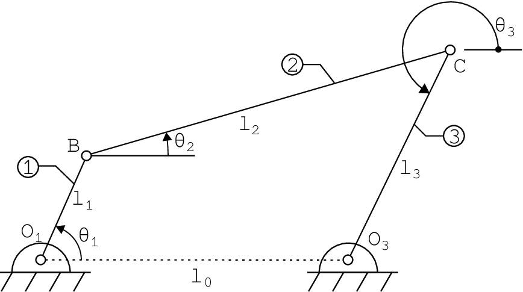
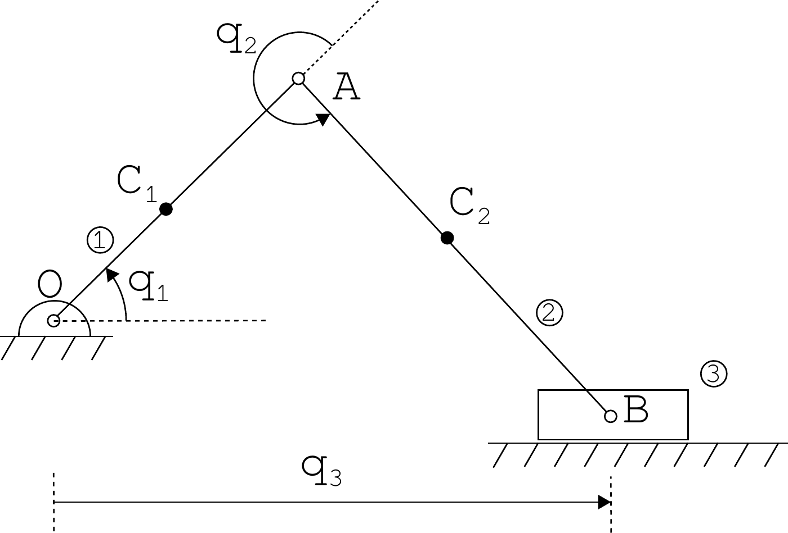

## Chapter overview

1. Forward and inverse kinematics
2. Two-link planar arm: transformations and position
3. Four-bar mechanism: two paths to the same point
4. Offset slider-crank: closure and assembly branches
5. Analytical inverse kinematics and numerical solution

**Goal:** write a consistent position model and determine which configurations actually exist.

::: {.notes}
Source: Satici, Kinematics and Machine Dynamics, Fall 2020 compiled notes, Chapter 6, pp. 35–42. Numerical solution details draw on Appendix C.
:::

## Forward and inverse kinematics

**Forward kinematics:** given joint coordinates, compute the tool configuration.

$$q\longmapsto g_{0n}(q).$$

**Inverse kinematics:** given a desired configuration $H$, solve

$$g_{0n}(q)=H.$$

For a closed mechanism, both directions must also satisfy the loop constraints. Solutions may be absent, unique, or multiple.

::: {.notes}
Source: Satici, Kinematics and Machine Dynamics, Fall 2020 compiled notes, §§6.1–6.3, pp. 35–42.
:::

## Frames and notation

We retain Chapter 5's convention:

$$p_i=R_{ij}p_j+p_{ij},\qquad
 g_{ij}=\begin{bmatrix}R_{ij}&p_{ij}\\0&1\end{bmatrix}.$$

- $p_{ij}$ is expressed in frame $i$.
- A planar mechanism still fits within $SE(3)$: all $z$ coordinates are zero and rotations are about $z$.
- Use $c_1=\cos\theta_1$, $s_1=\sin\theta_1$.
- Use $c_{12}=\cos(\theta_1+\theta_2)$, not $c_1c_2$.

::: {.notes}
Source: Satici, Kinematics and Machine Dynamics, Fall 2020 compiled notes, §6.2, pp. 35–40.
:::

## Constructing a forward model

1. Identify each rigid link, including the base.
2. Attach a frame to a specified point on each link.
3. Express adjacent-frame transformations.
4. Compose transformations from base to tool.
5. For a closed mechanism, equate alternative paths to the same point or frame.

Record angle reference directions before writing trigonometric equations.

::: {.notes}
Source: Satici, Kinematics and Machine Dynamics, Fall 2020 compiled notes, §6.2, pp. 35–40.
:::

## The two-link planar arm

::: {.columns}
::: {.column width="48%"}
{height=350px fig-alt="Planar elbow arm with lengths a1 and a2 and relative joint angles theta1 and theta2."}

::: {.side-caption}
Compiled notes, Fig. 6.1.
:::
:::
::: {.column width="52%"}
$a_1,a_2>0$ are fixed link lengths.

$\theta_1$: first link relative to the base.

$\theta_2$: second link relative to the first.

The second link's absolute orientation is $\theta_1+\theta_2$.

Frames 1 and 2 have origins at the elbow and tip.
:::
:::

::: {.notes}
Source: Satici, Kinematics and Machine Dynamics, Fall 2020 compiled notes, §6.2, Example 6.1, pp. 36–37. Uses the original figure already introduced in Chapter 1.
:::

## First adjacent transformation

The elbow lies $a_1$ units along the first link's $x$ axis:

$$p_{01}=R_z(\theta_1)\begin{bmatrix}a_1\\0\\0\end{bmatrix}
=\begin{bmatrix}a_1c_1\\a_1s_1\\0\end{bmatrix}.$$

$$g_{01}=\begin{bmatrix}
c_1&-s_1&0&a_1c_1\\s_1&c_1&0&a_1s_1\\0&0&1&0\\0&0&0&1
\end{bmatrix}.$$

Both the rotation and translation are expressed consistently relative to frame 0.

::: {.notes}
Source: Satici, Kinematics and Machine Dynamics, Fall 2020 compiled notes, §6.2, pp. 35–40.
:::

## Second adjacent transformation

The tip lies $a_2$ units along the second link's $x$ axis:

$$p_{12}=R_z(\theta_2)\begin{bmatrix}a_2\\0\\0\end{bmatrix}
=\begin{bmatrix}a_2c_2\\a_2s_2\\0\end{bmatrix}.$$

$$g_{12}=\begin{bmatrix}
c_2&-s_2&0&a_2c_2\\s_2&c_2&0&a_2s_2\\0&0&1&0\\0&0&0&1
\end{bmatrix}.$$

Here $p_{12}$ is expressed in frame 1, not in the fixed frame.

::: {.notes}
Source: Satici, Kinematics and Machine Dynamics, Fall 2020 compiled notes, §6.2, pp. 35–40.
:::

## Composing the arm transformations

$$g_{02}=g_{01}g_{12}
=\begin{bmatrix}
c_{12}&-s_{12}&0&a_1c_1+a_2c_{12}\\
s_{12}&c_{12}&0&a_1s_1+a_2s_{12}\\
0&0&1&0\\0&0&0&1
\end{bmatrix}.$$

Thus the tool position and orientation are

$$\boxed{x=a_1c_1+a_2c_{12},\qquad y=a_1s_1+a_2s_{12},}$$
$$\boxed{\phi=\theta_1+\theta_2.}$$

A two-joint arm cannot generally prescribe all three planar pose variables independently.

::: {.notes}
Source: Satici, Kinematics and Machine Dynamics, Fall 2020 compiled notes, §6.2, pp. 35–40.
:::

## Worked example: arm position

Choose $a_1=1$ m, $a_2=0.5$ m, $\theta_1=30^\circ$, and $\theta_2=60^\circ$.

$$\phi=90^\circ,$$
$$x=1\cos30^\circ+0.5\cos90^\circ=0.8660\ \mathrm m,$$
$$y=1\sin30^\circ+0.5\sin90^\circ=1.0000\ \mathrm m.$$

The second link is vertical. Its contribution to $x$ is zero and its contribution to $y$ is $0.5$ m.

The distance from the base to the tip is $\sqrt{1.75}=1.3229$ m.

::: {.notes}
Source: Satici, Kinematics and Machine Dynamics, Fall 2020 compiled notes, §6.2. Worked numerical example added for this deck.
:::

## The four-bar mechanism

::: {.columns}
::: {.column width="52%"}
{width=100% fig-alt="Four-bar linkage with fixed pivots O1 and O3 and moving joints B and C."}

::: {.side-caption}
Compiled notes, Fig. 6.2. The figure's $\theta_3$ points from $C$ to $O_3$.
:::
:::
::: {.column width="48%"}
Use absolute angles from $+x$:

- $\alpha$: $O_1\to B$
- $\beta$: $B\to C$
- $\gamma$: $O_3\to C$

Thus $\gamma=\theta_3+\pi$ relative to the figure's reversed output axis.

The textbook's relative coupler angle satisfies $\beta=\theta_1+\theta_2$.
:::
:::

::: {.notes}
Source: Satici, Kinematics and Machine Dynamics, Fall 2020 compiled notes, §6.2, Example 6.2, pp. 38–39. Explicit absolute-angle notation resolves the mismatch between the figure’s angle mark at B and the relative-angle convention in the textbook equations.
:::

## Two paths to the coupler joint

Set $O_1=(0,0)$ and $O_3=(l_0,0)$.

Along the left chain,

$$C=\begin{bmatrix}l_1\cos\alpha+l_2\cos\beta\\
l_1\sin\alpha+l_2\sin\beta\end{bmatrix}.$$

Along the right chain,

$$C=\begin{bmatrix}l_0+l_3\cos\gamma\\l_3\sin\gamma\end{bmatrix}.$$

Both expressions locate the same physical point in the same frame.

::: {.notes}
Source: Satici, Kinematics and Machine Dynamics, Fall 2020 compiled notes, §6.2, pp. 35–40.
:::

## Four-bar closure equations

Equating the two paths gives

$$\boxed{F(\beta,\gamma;\alpha)=
\begin{bmatrix}
l_1\cos\alpha+l_2\cos\beta-l_0-l_3\cos\gamma\\
l_1\sin\alpha+l_2\sin\beta-l_3\sin\gamma
\end{bmatrix}=0.}$$

Given $\alpha$, solve for the two unknown angles $\beta,\gamma$.

Then compute $C$ using either path. The residual difference between the paths is a direct consistency check.

::: {.notes}
Source: Satici, Kinematics and Machine Dynamics, Fall 2020 compiled notes, §6.2, pp. 35–40.
:::

## Assembly modes and feasibility

Once $\alpha$ is fixed, $B$ is known. Point $C$ must lie on:

- the circle centered at $B$ with radius $l_2$;
- the circle centered at $O_3$ with radius $l_3$.

Let $d=\|O_3-B\|$. A configuration exists only when

$$|l_2-l_3|\le d\le l_2+l_3.$$

Typically there are two intersections, hence two assembly modes. Tangency gives a limiting configuration; coincident circles are a special degenerate case.

::: {.notes}
Source: Satici, Kinematics and Machine Dynamics, Fall 2020 compiled notes, §6.2, four-bar example. Circle-intersection interpretation and feasibility test added to explain nonlinear solution branches.
:::

## Worked example: four-bar closure

Use $l_0=2$, $l_1=1$, $l_2=2$, $l_3=1$ m and $\alpha=60^\circ$.

One assembly mode has $\beta=0$ and $\gamma=60^\circ$:

$$C_{\rm left}=\begin{bmatrix}1\cos60^\circ+2\\1\sin60^\circ\end{bmatrix}
=\begin{bmatrix}2.5\\0.8660\end{bmatrix}\ \mathrm m,$$

$$C_{\rm right}=\begin{bmatrix}2+1\cos60^\circ\\1\sin60^\circ\end{bmatrix}
=\begin{bmatrix}2.5\\0.8660\end{bmatrix}\ \mathrm m.$$

The residual is zero. This verifies one configuration, not uniqueness.

::: {.notes}
Source: Satici, Kinematics and Machine Dynamics, Fall 2020 compiled notes, §6.2. Numerical example added; positive link lengths and residual are checked independently.
:::

## Newton iteration for a closed mechanism

Let $z=(\beta,\gamma)^\mathsf{T}$. Linearize around the current guess $z_k$:

$$F(z_k+\Delta z)\approx F(z_k)+J_F(z_k)\Delta z.$$

Solve the linear system and update:

$$\boxed{J_F(z_k)\Delta z=-F(z_k),\qquad z_{k+1}=z_k+\Delta z.}$$

For the four-bar,

$$J_F=\begin{bmatrix}-l_2\sin\beta&l_3\sin\gamma\\
l_2\cos\beta&-l_3\cos\gamma\end{bmatrix}.$$

::: {.notes}
Source: Satici, Kinematics and Machine Dynamics, Fall 2020 compiled notes, §6.2 and Appendix C.2. Newton–Raphson is expanded here as a practical solution method; solve a linear system rather than explicitly forming an inverse.
:::

## Convergence and branch tracking

- Supply an initial guess near the desired assembly mode.
- Use radians in the residual and Jacobian.
- Check both the residual norm and the step size; impose an iteration limit.
- For a sequence of input angles, start from the previous converged configuration.

$$\det J_F=l_2l_3\sin(\beta-\gamma).$$

When the coupler and output link become collinear, the position solve is singular. A small step or a solver success flag alone does not establish a valid configuration.

::: {.notes}
Source: Satici, Kinematics and Machine Dynamics, Fall 2020 compiled notes, §6.2 and Appendix C.2–C.3. Practical checks and the Jacobian determinant are derived additions.
:::

## The offset slider-crank

::: {.columns}
::: {.column width="52%"}
{height=350px fig-alt="Offset slider-crank with crank angle q1, relative rod angle q2, and slider coordinate q3."}

::: {.side-caption}
Compiled notes, Fig. 6.3. Slider height is $-a_0$ relative to $O$.
:::
:::
::: {.column width="48%"}
- Crank length: $a_1$
- Connecting-rod length: $a_2$
- Fixed offset: $a_0$
- Input angle: $q_1$
- Relative rod angle: $q_2$
- Slider position: $q_3$

Let $\psi=q_1+q_2$ be the rod's absolute angle.
:::
:::

::: {.notes}
Source: Satici, Kinematics and Machine Dynamics, Fall 2020 compiled notes, §6.2, Example 6.3, p. 40. Standardizes the source’s mixed a/l and theta/q notation.
:::

## Slider-crank closure

Along the two rotating links,

$$B=\begin{bmatrix}a_1\cos q_1+a_2\cos\psi\\
a_1\sin q_1+a_2\sin\psi\end{bmatrix}.$$

The slider guide requires $B=(q_3,-a_0)^\mathsf{T}$, so

$$\boxed{\begin{aligned}
a_1\cos q_1+a_2\cos\psi-q_3&=0,\\
a_1\sin q_1+a_2\sin\psi+a_0&=0.
\end{aligned}}$$

The horizontal equation contains **$-q_3$** for a coordinate increasing to the right.

::: {.notes}
Source: Satici, Kinematics and Machine Dynamics, Fall 2020 compiled notes, §6.2, Eq. (6.9), p. 40. Corrects the printed +q3 sign to agree with the stated point B=(q3,-a0).
:::

## Slider position and branch selection

Define $h=-a_0-a_1\sin q_1$. Then $a_2\sin\psi=h$ and

$$\boxed{q_3=a_1\cos q_1\ \pm\sqrt{a_2^2-h^2}.}$$

- A real solution requires $|h|\le a_2$.
- Choose the sign according to the physical assembly.
- Recover the rod angle with

$$\psi=\operatorname{atan2}(h,q_3-a_1\cos q_1),\qquad q_2=\psi-q_1.$$

The plus branch places the slider to the right of the crank pin.

::: {.notes}
Source: Satici, Kinematics and Machine Dynamics, Fall 2020 compiled notes, §6.2, slider-crank example. Closed-form branch formulas derived from the corrected closure equations.
:::

## Worked example: offset slider-crank

Let $a_1=0.1$ m, $a_2=0.3$ m, $a_0=0.05$ m, and $q_1=30^\circ$.

$$h=-0.05-0.1\sin30^\circ=-0.1\ \mathrm m.$$

For the right-hand assembly,

$$q_3=0.1\cos30^\circ+\sqrt{0.3^2-0.1^2}=0.36945\ \mathrm m,$$
$$\psi=\operatorname{atan2}(-0.1,0.28284)=-19.471^\circ,$$
$$q_2=\psi-q_1=-49.471^\circ.$$

The vertical check is $0.1\sin30^\circ+0.3\sin\psi=-0.05$ m.

::: {.notes}
Source: Satici, Kinematics and Machine Dynamics, Fall 2020 compiled notes, §6.2. Numerical example added and checked against both closure components.
:::

## Inverse kinematics of the two-link arm

For a desired tip position $(x,y)$, expand $x^2+y^2$:

$$x^2+y^2=a_1^2+a_2^2+2a_1a_2\cos\theta_2.$$

Define

$$D=\frac{x^2+y^2-a_1^2-a_2^2}{2a_1a_2}.$$

Then

$$\boxed{\theta_2=\operatorname{atan2}\!\left(\pm\sqrt{1-D^2},D\right).}$$

The two signs correspond to two elbow configurations when $|D|<1$.

::: {.notes}
Source: Satici, Kinematics and Machine Dynamics, Fall 2020 compiled notes, §6.3, Example 6.4, pp. 41–42.
:::

## Recovering the shoulder angle

Rewrite the position as a rotated vector:

$$\begin{bmatrix}x\\y\end{bmatrix}
=\begin{bmatrix}\cos\theta_1&-\sin\theta_1\\
\sin\theta_1&\cos\theta_1\end{bmatrix}
\begin{bmatrix}a_1+a_2\cos\theta_2\\a_2\sin\theta_2\end{bmatrix}.$$

Therefore,

$$\boxed{\theta_1=\operatorname{atan2}(y,x)
-\operatorname{atan2}(a_2\sin\theta_2,a_1+a_2\cos\theta_2).}$$

Evaluate this expression separately for each elbow branch, then verify with forward kinematics.

::: {.notes}
Source: Satici, Kinematics and Machine Dynamics, Fall 2020 compiled notes, §6.3, Example 6.4. Adds the derivation left as an exercise in the compiled notes.
:::

## Reachability and pose constraints

The two-link arm can reach a position only if

$$\boxed{|a_1-a_2|\le\sqrt{x^2+y^2}\le a_1+a_2.}$$

- If $|D|>1$, the position is unreachable.
- At $D=\pm1$, the usual two branches merge into a collinear configuration.
- If $a_1=a_2$ and $(x,y)=(0,0)$, the shoulder angle is undetermined with a folded elbow.

A specified tool orientation must also satisfy $\phi=\theta_1+\theta_2$. Position solutions need not satisfy an independently prescribed orientation.

::: {.notes}
Source: Satici, Kinematics and Machine Dynamics, Fall 2020 compiled notes, §6.3. Explicit feasibility and degenerate cases clarify the distinction between solving position and a full pose.
:::

## Worked example: two inverse solutions

Let $a_1=a_2=1$ m and $(x,y)=(1,1)$ m.

$$D=0,\qquad \theta_2=\pm90^\circ.$$

| Elbow angle | Shoulder angle | Tool orientation |
|---|---|---|
| $\theta_2=90^\circ$ | $\theta_1=0^\circ$ | $\phi=90^\circ$ |
| $\theta_2=-90^\circ$ | $\theta_1=90^\circ$ | $\phi=0^\circ$ |

Both give the same tip position. If the desired orientation is $90^\circ$, only the first satisfies the full pose.

::: {.notes}
Source: Satici, Kinematics and Machine Dynamics, Fall 2020 compiled notes, §6.3. Numerical example added to illustrate position ambiguity and orientation compatibility.
:::

## Inverse kinematics of the four-bar

Given $C=(x,y)$, the output-link circle imposes

$$(x-l_0)^2+y^2=l_3^2.$$

Solve the left two-link chain with lengths $l_1,l_2$:

$$D=\frac{x^2+y^2-l_1^2-l_2^2}{2l_1l_2},\qquad
\delta=\operatorname{atan2}(\pm\sqrt{1-D^2},D),$$
$$\alpha=\operatorname{atan2}(y,x)-\operatorname{atan2}(l_2\sin\delta,l_1+l_2\cos\delta),$$
$$\beta=\alpha+\delta,\qquad \gamma=\operatorname{atan2}(y,x-l_0).$$

Reject candidates violating either reachability or the right-hand circle constraint.

::: {.notes}
Source: Satici, Kinematics and Machine Dynamics, Fall 2020 compiled notes, §6.3, Example 6.5, p. 42. Uses the deck’s absolute angles; delta is the relative elbow angle. Adds the necessary output-circle feasibility check.
:::

## Inverse kinematics of the slider-crank

Given a slider location $q_3$, the target for the two-link chain is $(q_3,-a_0)$.

$$D=\frac{q_3^2+a_0^2-a_1^2-a_2^2}{2a_1a_2},$$
$$q_2=\operatorname{atan2}(\pm\sqrt{1-D^2},D),$$
$$q_1=\operatorname{atan2}(-a_0,q_3)
-\operatorname{atan2}(a_2\sin q_2,a_1+a_2\cos q_2).$$

The physical assembly, travel limits, and joint limits select admissible solutions. Substitute the result into both closure equations.

::: {.notes}
Source: Satici, Kinematics and Machine Dynamics, Fall 2020 compiled notes, §6.3, Example 6.6, p. 42. Expands the source’s instruction to solve the two-link equations for the prescribed slider position.
:::

## Position-analysis workflow

1. Define frames, angle directions, lengths, and the desired output.
2. Derive the transformations or vector loops.
3. Solve for all relevant branches.
4. Apply reachability, assembly, and joint-limit constraints.
5. Substitute the solution into the original equations.

A position model is also the starting point for velocity and acceleration analysis: differentiate its constraints without changing conventions.

::: {.notes}
Source: Satici, Kinematics and Machine Dynamics, Fall 2020 compiled notes, Chapter 6 synthesis.
:::

## References and next chapter

**Primary reading:** compiled notes, Chapter 6, pp. 35–42.

**Supporting material:** original Lecture 03; Appendix C for nonlinear equations and Newton iteration.

The compiled chapter cites Kane and Levinson, *Dynamics: Theory and Applications* (1985). Its rigid-transform conventions also continue the material of Chapter 5.

**Next:** [Chapter 7 — Velocity- and Acceleration-Level Analysis](chapter07.html).

::: {.notes}
Source: Satici, Kinematics and Machine Dynamics, Fall 2020 compiled notes, Chapter 6 and its bibliography. Numerical examples and explicit feasibility checks are instructional additions, not quotations from the reference.
:::
