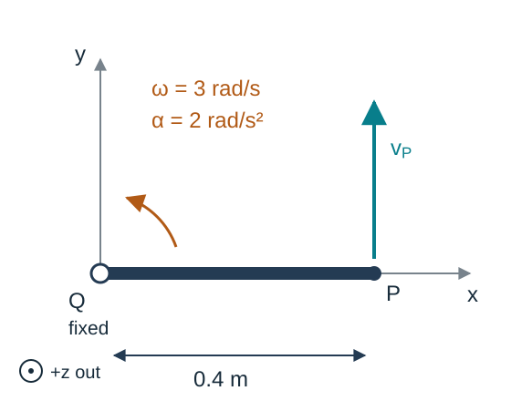
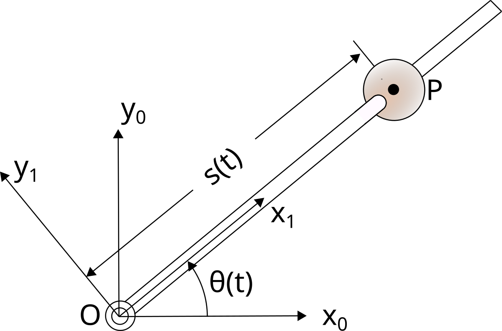
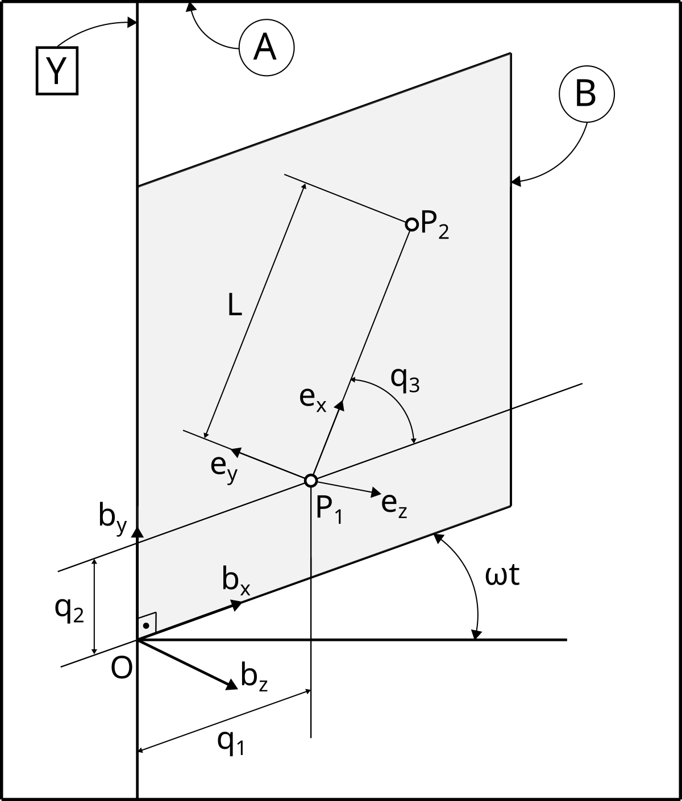

## Chapter overview

1. Angular velocity and vector differentiation
2. Simple rotations and auxiliary frames
3. Angular acceleration
4. Velocities and accelerations of points
5. Two points fixed on one rigid body
6. A point moving relative to a rigid body

**Goal:** obtain kinematic quantities needed for equations of motion, with every derivative tied to a reference frame.

::: {.notes}
Source: Satici, Kinematics and Machine Dynamics, Fall 2020 compiled notes, Chapter 7, pp. 43–48.
:::

## Differentiation depends on the frame

Write $\left(\dfrac{dv}{dt}\right)_A$ for the derivative observed in frame $A$.

A vector fixed in a rotating body $B$ satisfies

$$\left(\frac{dv}{dt}\right)_B=0,$$

but generally

$$\left(\frac{dv}{dt}\right)_A\ne0.$$

A constant length does not imply a constant vector: its direction can change.

::: {.notes}
Source: Satici, Kinematics and Machine Dynamics, Fall 2020 compiled notes, §7.1 and Appendix B, differentiation in two reference frames.
:::

## Definition of angular velocity

Let $b_1,b_2,b_3$ be a right-handed orthonormal basis fixed in $B$. Dots denote differentiation in $A$.

$$\boxed{{}^A\omega^B=
 b_1(\dot b_2\cdot b_3)+b_2(\dot b_3\cdot b_1)+b_3(\dot b_1\cdot b_2).}$$

The vector ${}^A\omega^B$ describes the instantaneous rotation of body $B$ relative to frame $A$.

Changing the body-fixed orthonormal basis does not change that physical angular-velocity vector.

::: {.notes}
Source: Satici, Kinematics and Machine Dynamics, Fall 2020 compiled notes, §7.1, Eq. (7.1), pp. 43–44.
:::

## Derivative of a body-fixed vector

For any vector $r$ fixed in $B$,

$$\boxed{\left(\frac{dr}{dt}\right)_A={}^A\omega^B\times r.}$$

In particular, $\dot b_i={}^A\omega^B\times b_i$.

Since $r=r_1b_1+r_2b_2+r_3b_3$ with constant $r_i$,

$$\dot r=\sum_i r_i\dot b_i
={}^A\omega^B\times\sum_i r_i b_i.$$

This converts differentiation of a rotating direction into a cross product.

::: {.notes}
Source: Satici, Kinematics and Machine Dynamics, Fall 2020 compiled notes, §7.1, Eq. (7.2) and derivation, pp. 43–44.
:::

## Why the basis derivative is a cross product

Differentiating the orthonormality relations gives

$$\dot b_1\cdot b_1=0,\qquad
\dot b_3\cdot b_1=-\dot b_1\cdot b_3.$$

Using the definition of angular velocity,

$$\begin{aligned}
{}^A\omega^B\times b_1
&=-b_3(\dot b_3\cdot b_1)+b_2(\dot b_1\cdot b_2)\\
&=b_3(\dot b_1\cdot b_3)+b_2(\dot b_1\cdot b_2)\\
&=\dot b_1.
\end{aligned}$$

The missing $b_1$ component is zero. The other two basis vectors follow cyclically.

::: {.notes}
Source: Satici, Kinematics and Machine Dynamics, Fall 2020 compiled notes, §7.1, derivation following Eq. (7.3), pp. 43–44.
:::

## The transport theorem

For a vector that may also change relative to $B$,

$$v=v_1b_1+v_2b_2+v_3b_3.$$

Differentiating coefficients and basis vectors separately gives

$$\boxed{\left(\frac{dv}{dt}\right)_A
=\left(\frac{dv}{dt}\right)_B+{}^A\omega^B\times v.}$$

The first term measures change relative to the moving frame; the second accounts for rotation of that frame.

All terms are vectors. Express their components in a common basis before adding them.

::: {.notes}
Source: Satici, Kinematics and Machine Dynamics, Fall 2020 compiled notes, Appendix B.8, used in §§7.3–7.7. Included here as prerequisite support, rather than assuming the appendix has already been taught.
:::

## Connecting angular velocity to rotation matrices

Let $R=R_{ab}(t)$. Its columns are the body axes expressed in $A$.

$$\dot R=\widehat{\omega_a}R,$$
$$\boxed{\widehat{\omega_a}=\dot RR^\mathsf{T},\qquad
\widehat{\omega_b}=R^\mathsf{T}\dot R.}$$

Here $\omega_a$ and $\omega_b$ are coordinates of the **same** ${}^A\omega^B$ in different bases, with $\omega_a=R\omega_b$.

Differentiating $R^\mathsf{T}R=I$ shows that these matrices are skew-symmetric.

::: {.notes}
Source: Satici, Kinematics and Machine Dynamics, Fall 2020 compiled notes, §7.1 and Chapter 5. Derived connection between the basis definition and the rotation-matrix representation; not a separate angular velocity.
:::

## Simple angular velocity

Suppose a unit vector $k$ has fixed direction in both $A$ and $B$ throughout an interval.

Then $B$ has a **simple angular velocity** in $A$:

$$\boxed{{}^A\omega^B=\dot\theta k.}$$

The angle $\theta$ follows the right-hand rule about $k$.

$\dot\theta$ is a signed angular rate; the magnitude of the angular velocity is $|\dot\theta|$.

::: {.notes}
Source: Satici, Kinematics and Machine Dynamics, Fall 2020 compiled notes, §7.2, Eq. (7.5), pp. 44–45. Distinguishes the source’s signed scalar angular speed from the nonnegative vector magnitude.
:::

## Deriving the simple-rotation formula

Take $b_3=a_3=k$ and

$$b_1=\cos\theta\,a_1+\sin\theta\,a_2,$$
$$b_2=-\sin\theta\,a_1+\cos\theta\,a_2.$$

Differentiating in $A$ gives

$$\dot b_1=\dot\theta b_2,\qquad
\dot b_2=-\dot\theta b_1,\qquad \dot b_3=0.$$

Substitution into the angular-velocity definition yields ${}^A\omega^B=\dot\theta b_3$.

::: {.notes}
Source: Satici, Kinematics and Machine Dynamics, Fall 2020 compiled notes, §7.2, derivation, p. 45. Corrects the source’s last derivative label from b1 to b3.
:::

## Auxiliary reference frames

Introduce an intermediate frame $C$. Angular velocities add as vectors:

$$\boxed{{}^A\omega^B={}^A\omega^C+{}^C\omega^B.}$$

For a chain of intermediate frames, continue the sum along the chain.

- An auxiliary frame need not be attached to a physical body.
- Simple relative rotations can make each term easy to construct.
- Express the terms in one common basis before adding components.

There is one resultant angular velocity of $B$ in $A$, not several simultaneous ones.

::: {.notes}
Source: Satici, Kinematics and Machine Dynamics, Fall 2020 compiled notes, §7.3, Eqs. (7.6)–(7.7), pp. 45–46.
:::

## Deriving angular-velocity addition

For every vector $r$ fixed in $B$,

$$\left(\frac{dr}{dt}\right)_A={}^A\omega^B\times r.$$

The transport theorem through $C$ also gives

$$\left(\frac{dr}{dt}\right)_A
={}^C\omega^B\times r+{}^A\omega^C\times r.$$

Their difference has zero cross product with every body-fixed vector. Therefore,

$${}^A\omega^B={}^A\omega^C+{}^C\omega^B.$$

::: {.notes}
Source: Satici, Kinematics and Machine Dynamics, Fall 2020 compiled notes, §7.3, derivation, pp. 45–46.
:::

## Example: a yawing base and pitching arm

Frame $C$ yaws through $\psi$ about the fixed $a_z$ axis. Body $B$ pitches through $\theta$ about $c_y$.

$$\boxed{{}^A\omega^B=\dot\psi a_z+\dot\theta c_y.}$$

Since $c_y=-\sin\psi\,a_x+\cos\psi\,a_y$,

$$\omega_a=\begin{bmatrix}-\dot\theta\sin\psi\\
\dot\theta\cos\psi\\\dot\psi\end{bmatrix}.$$

Euler-angle rates are coefficients along different axes; they are not generally the Cartesian components of angular velocity.

::: {.notes}
Source: Satici, Kinematics and Machine Dynamics, Fall 2020 compiled notes, §7.3. Worked symbolic example added to illustrate the auxiliary-frame theorem.
:::

## Angular acceleration

The angular acceleration of $B$ in $A$ is

$$\boxed{{}^A\alpha^B=\left(\frac{d\,{}^A\omega^B}{dt}\right)_A.}$$

The transport theorem also gives

$$\left(\frac{d\,{}^A\omega^B}{dt}\right)_A
=\left(\frac{d\,{}^A\omega^B}{dt}\right)_B
+{}^A\omega^B\times{}^A\omega^B.$$

The cross product vanishes, so either derivative frame can be used **for this particular vector**.

::: {.notes}
Source: Satici, Kinematics and Machine Dynamics, Fall 2020 compiled notes, §7.4, Eqs. (7.8)–(7.9), p. 46.
:::

## Changing direction contributes to acceleration

Write $\omega=\Omega k$, where $k$ is a time-varying unit direction.

$$\alpha=\dot\Omega k+\Omega\left(\frac{dk}{dt}\right)_A.$$

A constant angular-speed magnitude does not imply zero angular acceleration.

For a simple rotation, $k$ is fixed, so

$$\boxed{\omega=\dot\theta k,\qquad \alpha=\ddot\theta k.}$$

Outside this special case, $\alpha$ need not be parallel to $\omega$.

::: {.notes}
Source: Satici, Kinematics and Machine Dynamics, Fall 2020 compiled notes, §7.4, Eq. (7.10), pp. 46–47.
:::

## Angular accelerations do not simply add

Differentiate ${}^A\omega^B={}^A\omega^C+{}^C\omega^B$ in $A$:

$$\boxed{{}^A\alpha^B={}^A\alpha^C+{}^C\alpha^B
+{}^A\omega^C\times{}^C\omega^B.}$$

The additional term accounts for the rotation of the intermediate frame.

For the yaw–pitch example,

$${}^A\alpha^B=\ddot\psi a_z+\ddot\theta c_y
+\dot\psi\dot\theta(a_z\times c_y).$$

Even constant $\dot\psi$ and $\dot\theta$ can produce nonzero angular acceleration.

::: {.notes}
Source: Satici, Kinematics and Machine Dynamics, Fall 2020 compiled notes, §7.4. Explicit two-frame acceleration formula derived from the source’s warning that angular accelerations are not simply additive.
:::

## Velocity and acceleration of a point

Choose an origin $O$ fixed in reference frame $A$, and let $p=\overrightarrow{OP}$.

$$\boxed{{}^Av^P=\left(\frac{dp}{dt}\right)_A,\qquad
{}^Aa^P=\left(\frac{d\,{}^Av^P}{dt}\right)_A.}$$

A reference frame is essential: a point can be stationary in one frame and moving in another.

From here, $v_P,a_P,\omega,\alpha$ refer to motion observed in $A$ unless a different frame is shown.

::: {.notes}
Source: Satici, Kinematics and Machine Dynamics, Fall 2020 compiled notes, §7.5, Eqs. (7.11)–(7.12), p. 47.
:::

## Two points fixed on one rigid body

Let $Q$ and $P$ be fixed on body $B$, and let $r=\overrightarrow{QP}$.

$$\boxed{v_P=v_Q+\omega\times r.}$$

Differentiate $p=q+r$ in $A$ and use $\dot r=\omega\times r$.

The points have different velocities in general, but share the same body's angular velocity.

For pure translation, $\omega=0$ and all body-fixed points have the same velocity.

::: {.notes}
Source: Satici, Kinematics and Machine Dynamics, Fall 2020 compiled notes, §7.6, Eq. (7.13), pp. 47–48.
:::

## Acceleration of two body-fixed points

Differentiate the velocity relation in $A$:

$$a_P=a_Q+\alpha\times r+\omega\times\dot r.$$

Since $\dot r=\omega\times r$,

$$\boxed{a_P=a_Q+\alpha\times r+\omega\times(\omega\times r).}$$

- $a_Q$: acceleration of the reference point.
- $\alpha\times r$: tangential contribution.
- $\omega\times(\omega\times r)$: normal contribution.

::: {.notes}
Source: Satici, Kinematics and Machine Dynamics, Fall 2020 compiled notes, §7.6, Eq. (7.14) and derivation, pp. 47–48.
:::

## Interpreting the normal term

The vector triple-product identity gives

$$\omega\times(\omega\times r)
=\omega(\omega\cdot r)-\|\omega\|^2r.$$

For $r$ perpendicular to a fixed rotation axis,

$$\omega\times(\omega\times r)=-\omega^2r.$$

This term points toward the axis. A point can accelerate even while its speed is constant.

Do not replace the double cross product with $-\omega^2r$ when $r$ has an axial component.

::: {.notes}
Source: Satici, Kinematics and Machine Dynamics, Fall 2020 compiled notes, §7.6. Triple-product interpretation added to make the general three-dimensional formula explicit.
:::

## Worked example: a rotating link

At an instant, $Q$ is fixed, $r=0.4e_x$ m, $\omega=3e_z$ rad/s, and $\alpha=2e_z$ rad/s².

:::: {.columns}
::: {.column width="43%"}
{fig-alt="Q is fixed; P is 0.4 m along positive x. Omega and alpha point out of the page, and P's velocity points along positive y." width="100%"}
:::
::: {.column width="57%"}

$$v_P=\omega\times r=1.2e_y\ \mathrm{m/s}.$$

$$a_P=\underbrace{\alpha\times r}_{0.8e_y}
+\underbrace{\omega\times(\omega\times r)}_{-3.6e_x}.$$
$$\boxed{a_P=-3.6e_x+0.8e_y\ \mathrm{m/s^2}.}$$

The normal and tangential components are perpendicular:

$$\|a_P\|=\sqrt{3.6^2+0.8^2}=3.688\ \mathrm{m/s^2}.$$
:::
::::

::: {.notes}
Source: Satici, Kinematics and Machine Dynamics, Fall 2020 compiled notes, §7.6; see also Kane and Levinson, Dynamics: Theory and Applications, §2.7, pp. 30–32. Numerical example and schematic added; assumes Q is fixed in the reference frame. The schematic is original, not a reproduction of Kane's Fig. 2.6.1, which depicts a different moving-line example.
:::

## A point moving relative to the body

Let $Q$ be fixed in $B$, but allow $r=\overrightarrow{QP}$ to change in $B$.

Define

$$v_{\rm rel}=\left(\frac{dr}{dt}\right)_B,\qquad
 a_{\rm rel}=\left(\frac{dv_{\rm rel}}{dt}\right)_B.$$

Then the transport theorem gives

$$\boxed{v_P=v_Q+\omega\times r+v_{\rm rel}.}$$

The body-fixed formula is recovered only when $v_{\rm rel}=0$.

::: {.notes}
Source: Satici, Kinematics and Machine Dynamics, Fall 2020 compiled notes, §7.7, p. 48. Expresses the source’s coincident-point theorem using a body-fixed reference point Q.
:::

## Deriving the Coriolis term

Differentiate each part of $v_P=v_Q+\omega\times r+v_{\rm rel}$ in $A$:

$$\left(\frac{dr}{dt}\right)_A=\omega\times r+v_{\rm rel},$$
$$\left(\frac{dv_{\rm rel}}{dt}\right)_A=a_{\rm rel}+\omega\times v_{\rm rel}.$$

Thus

$$\boxed{a_P=a_Q+\alpha\times r+\omega\times(\omega\times r)
+2\omega\times v_{\rm rel}+a_{\rm rel}.}$$

One $\omega\times v_{\rm rel}$ term comes from each derivative. Their sum is the **Coriolis acceleration**.

::: {.notes}
Source: Satici, Kinematics and Machine Dynamics, Fall 2020 compiled notes, §7.7, Eq. (7.16). Derivation supplied using the transport theorem; the textbook refers to Kane and Levinson §2.8.
:::

## The coincident material point

Let $\bar B$ be the material point of body $B$ coincident with $P$ at the instant considered.

$$\boxed{{}^Av^P={}^Av^{\bar B}+{}^Bv^P,}$$
$$\boxed{{}^Aa^P={}^Aa^{\bar B}+{}^Ba^P
+2\,{}^A\omega^B\times{}^Bv^P.}$$

Coincidence of positions does not imply equality of velocities.

The identity of the coincident material point can change as $P$ moves across the body.

::: {.notes}
Source: Satici, Kinematics and Machine Dynamics, Fall 2020 compiled notes, §7.7, Eqs. (7.15)–(7.16), p. 48. These are the source’s original forms, equivalent to the expanded reference-point formulas.
:::

## Example: bead on a rotating wire

::: {.columns}
::: {.column width="43%"}
{height=340px fig-alt="Bead sliding along a wire that rotates about a vertical axis, with displacement s and angle theta."}

::: {.side-caption}
Original Lecture 04, bead-on-wire example.
:::
:::
::: {.column width="57%"}
Let the wire rotate in a horizontal plane about a fixed pivot.

$$r=s e_r,\qquad \omega=\dot\theta e_z.$$

The rotating basis satisfies

$$\dot e_r=\dot\theta e_\theta,\qquad
\dot e_\theta=-\dot\theta e_r.$$

Here $s$ changes as the bead slides along the wire.
:::
:::

::: {.notes}
Source: Satici, Kinematics and Machine Dynamics, Fall 2020 compiled notes, §7.7 and Lectures/Lecture04/slides/vel_acc_pts.tex. Retains the lecture’s mechanism, but this chapter treats kinematics only; energy and equations of motion belong to dynamics.
:::

## Bead velocity and acceleration

The velocity is

$$\boxed{v_P=\dot s\,e_r+s\dot\theta\,e_\theta.}$$

Differentiating again gives

$$\boxed{a_P=(\ddot s-s\dot\theta^2)e_r
+(s\ddot\theta+2\dot s\dot\theta)e_\theta.}$$

| Term | Meaning |
|---|---|
| $\ddot s\,e_r$ | Relative acceleration along the wire |
| $-s\dot\theta^2e_r$ | Normal acceleration |
| $s\ddot\theta e_\theta$ | Tangential acceleration of the wire |
| $2\dot s\dot\theta e_\theta$ | Coriolis acceleration |

::: {.notes}
Source: Satici, Kinematics and Machine Dynamics, Fall 2020 compiled notes, §7.7 and original Lecture 04 bead example. Derivation and term-by-term decomposition added.
:::

## Worked example: sliding bead

At an instant, $s=0.5$ m, $\dot s=0.2$ m/s, $\ddot s=0$, $\dot\theta=2$ rad/s, and $\ddot\theta=0$.

$$v_P=0.2e_r+1.0e_\theta\ \mathrm{m/s},$$
$$\boxed{a_P=-2.0e_r+0.8e_\theta\ \mathrm{m/s^2}.}$$

The $0.8e_\theta$ term remains even though both rates are constant.

If the bead is locked to the wire, $\dot s=\ddot s=0$ and the Coriolis term disappears.

::: {.notes}
Source: Satici, Kinematics and Machine Dynamics, Fall 2020 compiled notes, §7.7. Numerical values added for this deck and verified by differentiating the Cartesian trajectory.
:::

## Example: a line moving in a rotating plane

::: {.columns}
::: {.column width="45%"}
{height=370px fig-alt="Line segment P1P2 moving in rotating plane B, with coordinates q1 q2 and relative line angle q3."}

::: {.side-caption}
Original Lecture 04, moving-line example.
:::
:::
::: {.column width="55%"}
The plane rotates with constant angular velocity $\Omega b_y$ about a fixed axis through $O$.

$$p_1=q_1b_x+q_2b_y,$$
$$p_2=p_1+Le_x.$$

The segment's frame $E$ rotates relative to $B$ by $q_3$ about $b_z$:

$${}^A\omega^E=\Omega b_y+\dot q_3b_z.$$
:::
:::

::: {.notes}
Source: Satici, Kinematics and Machine Dynamics, Fall 2020 compiled notes, Lectures/Lecture04/slides/vel_acc_pts.tex, moving-line example. O is fixed in A. Uses Omega for the plane’s constant angular rate.
:::

## Velocity of the moving line endpoints

For $P_1$, transport through frame $B$ gives

$$v_{P_1}=\dot q_1b_x+\dot q_2b_y-\Omega q_1b_z.$$

For $P_2$, the fixed-length vector $Le_x$ rotates with frame $E$:

$$v_{P_2}=v_{P_1}+{}^A\omega^E\times Le_x.$$

Using $e_x=\cos q_3\,b_x+\sin q_3\,b_y$,

$$\boxed{v_{P_2}=(\dot q_1-L\dot q_3\sin q_3)b_x
+(\dot q_2+L\dot q_3\cos q_3)b_y
-\Omega(q_1+L\cos q_3)b_z.}$$

The two terms use different relative motions; neither is omitted.

::: {.notes}
Source: Satici, Kinematics and Machine Dynamics, Fall 2020 compiled notes, Original Lecture 04 moving-line example. The result is expressed in B rather than E; rotating the components reproduces the lecture’s result.
:::

## Differentiating the Chapter 6 constraints

For a mechanism with dependent coordinates $z$ and input $u$,

$$F(z,u)=0.$$

One derivative gives the velocity equations:

$$\boxed{F_z\dot z+F_u\dot u=0.}$$

A second derivative gives

$$\boxed{F_z\ddot z+F_u\ddot u+\dot F_z\dot z+\dot F_u\dot u=0.}$$

Solve linear systems at the already-known position. A singular $F_z$ can prevent a unique velocity or acceleration solution.

::: {.notes}
Source: Satici, Kinematics and Machine Dynamics, Fall 2020 compiled notes, Instructional connection between Chapter 6 closure equations and Chapter 7 differentiation. The source chapter develops vector theorems; these equations show their complementary constraint-based use.
:::

## Example: four-bar velocity equations

Using Chapter 6's absolute angles $\alpha,\beta,\gamma$,

$$\begin{bmatrix}-l_2\sin\beta&l_3\sin\gamma\\
l_2\cos\beta&-l_3\cos\gamma\end{bmatrix}
\begin{bmatrix}\dot\beta\\\dot\gamma\end{bmatrix}
=\begin{bmatrix}l_1\sin\alpha\\-l_1\cos\alpha\end{bmatrix}\dot\alpha.$$

For the earlier configuration $(\alpha,\beta,\gamma)=(60^\circ,0,60^\circ)$ and $(l_1,l_2,l_3)=(1,2,1)$ m,

$$\dot\alpha=1\ \mathrm{rad/s}
\quad\Longrightarrow\quad \dot\beta=0,\ \dot\gamma=1\ \mathrm{rad/s}.$$

This is the parallelogram assembly: the coupler translates without rotating.

::: {.notes}
Source: Satici, Kinematics and Machine Dynamics, Fall 2020 compiled notes, Derived extension of the Chapter 6 worked four-bar example; velocity equations verified against the constraint Jacobian.
:::

## Example: four-bar acceleration equations

With the same matrix $J$ from the velocity solve,

$$J\begin{bmatrix}\ddot\beta\\\ddot\gamma\end{bmatrix}
=\begin{bmatrix}
l_1\sin\alpha\,\ddot\alpha+l_1\cos\alpha\,\dot\alpha^2
+l_2\cos\beta\,\dot\beta^2-l_3\cos\gamma\,\dot\gamma^2\\
-l_1\cos\alpha\,\ddot\alpha+l_1\sin\alpha\,\dot\alpha^2
+l_2\sin\beta\,\dot\beta^2-l_3\sin\gamma\,\dot\gamma^2
\end{bmatrix}.$$

For the preceding example with $\ddot\alpha=0$, the right-hand side vanishes:

$$\ddot\beta=\ddot\gamma=0.$$

The coupler points still have nonzero normal acceleration because the crank rotates at nonzero speed.

::: {.notes}
Source: Satici, Kinematics and Machine Dynamics, Fall 2020 compiled notes, Derived by differentiating the Chapter 6 closure twice. The example distinguishes angular acceleration from the acceleration of a moving point.
:::

## Selecting the appropriate relation

| Motion being described | Relation |
|---|---|
| Vector fixed in a body | $\dot r=\omega\times r$ |
| Vector changing in a moving frame | Transport theorem |
| Two body-fixed points | $v_P=v_Q+\omega\times r$ |
| A point sliding relative to a body | Add relative velocity and Coriolis acceleration |
| A closed mechanism | Differentiate its closure equations |

Always identify the reference frame, the vector direction, and whether the point is fixed in the body.

::: {.notes}
Source: Satici, Kinematics and Machine Dynamics, Fall 2020 compiled notes, Chapter 7 synthesis.
:::

## References and transition to dynamics

**Reading:** compiled notes, Chapter 7, pp. 43–48; Appendix B for vector differentiation.

**Primary reference:** Thomas R. Kane and David A. Levinson, *Dynamics: Theory and Applications* (1985).

**Lecture examples:** original Lecture 04, moving line in a rotating plane and bead on a rotating wire.

The kinematics block is complete: configurations, velocities, and accelerations are now available for force and moment balances.

**Next:** Chapter 8 — Mass Distribution.

::: {.notes}
Source: Satici, Kinematics and Machine Dynamics, Fall 2020 compiled notes, Chapter 7 and original Lecture 04. The upcoming dynamics chapter is planned, not linked before it exists.
:::
