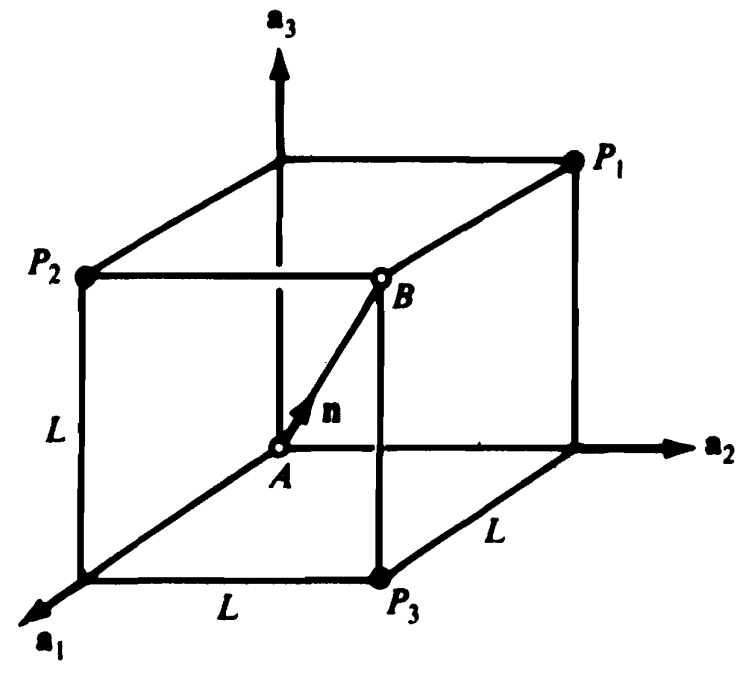
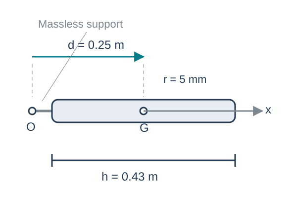

## Chapter overview

1. Mass centers of particles and continuous bodies
2. Inertia vectors, scalars, and matrices
3. Changes of basis and parallel axes
4. Principal axes and principal moments

**Goal:** describe a rigid body's mass distribution about a stated point and in a stated basis.

::: {.notes}
Source: Satici, Kinematics and Machine Dynamics, Fall 2020 compiled notes, Chapter 8, §§8.1–8.7, pp. 51–57.
:::

## Why the mass distribution matters

Two bodies can have the same mass and respond differently to the same torque.

Mass far from a rotation axis contributes more strongly to the moment of inertia:

$$I=\sum_i m_i d_i^2.$$

For a rigid body, the mass, mass-center location, and central inertia matrix supply the mass properties needed for Newton–Euler equations.

::: {.notes}
Source: Satici, Kinematics and Machine Dynamics, Fall 2020 compiled notes, Chapter 8 introduction and §8.3, pp. 51–53.
:::

## The mass center of particles

Let $p_i$ locate particle $i$ from an arbitrary origin $O$, and let $m=\sum_i m_i>0$.

$$\boxed{p_G=\frac{1}{m}\sum_i m_i p_i.}$$

Relative to the mass center $G$, $r_i=p_i-p_G$, so

$$\sum_i m_i r_i=\sum_i m_i p_i-mp_G=0.$$

The mass-weighted position vectors balance about $G$.

::: {.notes}
Source: Satici, Kinematics and Machine Dynamics, Fall 2020 compiled notes, §8.1, Eq. (8.1), p. 51. G replaces S* for consistency with later dynamics slides.
:::

## Worked example: particles on a cube

:::: {.columns}
::: {.column width="46%"}
{fig-alt="Three particles at three corners of a cube, with diagonal AB and basis a1, a2, a3." height="380"}
:::
::: {.column width="54%"}

The cube has side length $L$. The masses at $P_1,P_2,P_3$ are $m,2m,\mu$.

$$p_G=\frac{L\left[(2m+\mu)a_1+(m+\mu)a_2+3ma_3\right]}{3m+\mu}.$$

The unit direction of diagonal $AB$ is

$$n=\frac{a_1+a_2+a_3}{\sqrt3}.$$

:::
::::

::: {.notes}
Source: Satici, Kinematics and Machine Dynamics, Fall 2020 compiled notes, §8.1. Example and unchanged cube figure from Lectures/Lecture05/slides/com.tex and figures/cube.png. The figure is in the source lecture; no independent artwork credit is provided.
:::

## Distance from the mass center to the diagonal

The perpendicular distance is $D=\|p_G\times n\|$.

With $u=\mu/m\geq0$,

$$D^2=\frac{2L^2}{3}\frac{u^2-3u+3}{(u+3)^2},\qquad
\frac{dD^2}{du}=\frac{2L^2(3u-5)}{(u+3)^3}.$$

The derivative changes from negative to positive at $u=5/3$:

$$\boxed{\mu=\frac53m,\qquad D_{\min}=\frac{L}{\sqrt{42}}.}$$

::: {.notes}
Source: Satici, Kinematics and Machine Dynamics, Fall 2020 compiled notes, §8.1. Lecture05 mass-center example, with the optimization completed for the lecture deck.
:::

## Curves, surfaces, and solids

For a continuous body,

$$\boxed{m=\int_B dm,\qquad p_G=\frac1m\int_B p\,dm.}$$

| Model | Mass element | Density units |
|---|---|---|
| Slender wire | $dm=\lambda\,ds$ | kg/m |
| Thin plate | $dm=\sigma\,dA$ | kg/m² |
| Solid | $dm=\rho\,dV$ | kg/m³ |

For uniform density, the mass center coincides with the geometric centroid.

::: {.notes}
Source: Satici, Kinematics and Machine Dynamics, Fall 2020 compiled notes, §8.2, Eq. (8.2), pp. 51–52. Separate density symbols make their units explicit.
:::

## Worked example: a nonuniform rod

A rod occupies $0\leq x\leq L$, with linear density $\lambda(x)=\lambda_0(1+x/L)$.

$$m=\int_0^L\lambda_0(1+x/L)\,dx=\frac32\lambda_0L.$$

$$x_G=\frac{\int_0^L x\lambda_0(1+x/L)\,dx}{m}
=\frac{(5/6)\lambda_0L^2}{(3/2)\lambda_0L}
=\boxed{\frac59L}.$$

The heavier end shifts the mass center beyond the midpoint.

::: {.notes}
Source: Satici, Kinematics and Machine Dynamics, Fall 2020 compiled notes, §8.2. Original integration example added.
:::

## Composite bodies and cutouts

For components with known masses $m_j$ and mass centers $p_{G_j}$,

$$p_G=\frac{\sum_j m_jp_{G_j}}{\sum_jm_j}.$$

A cutout can be treated algebraically as a removed mass with a negative sign.

For a 6 kg plate centered at $x=0.30$ m, with a 1 kg cutout centered at $x=0.50$ m,

$$x_G=\frac{6(0.30)-1(0.50)}{6-1}=\boxed{0.26\ \mathrm m}.$$

::: {.notes}
Source: Satici, Kinematics and Machine Dynamics, Fall 2020 compiled notes, §8.2, p. 52. Original one-coordinate composite example. Negative mass is a subtraction device, not a physical material.
:::

## Inertia as a vector-valued operation

Choose a point $O$ and a unit vector $n$. If $p$ runs from $O$ to a mass element,

$$\boxed{\mathcal I_O(n)=\int_B p\times(n\times p)\,dm.}$$

The triple-product identity gives

$$p\times(n\times p)=\left[(p^Tp)\mathbf1-pp^T\right]n.$$

The inertia vector is linear in $n$, but it need not point along $n$.

::: {.notes}
Source: Satici, Kinematics and Machine Dynamics, Fall 2020 compiled notes, §8.3, Eqs. (8.3), (8.5), pp. 52–53. Here bold 1 is the identity tensor.
:::

## Inertia scalars and the radius of gyration

For unit directions $n_a,n_b$,

$$I_{ab}=n_b\cdot\mathcal I_O(n_a)
=\int_B(p\times n_a)\cdot(p\times n_b)\,dm=I_{ba}.$$

For one axis through $O$,

$$\boxed{I_{aa}=\int_B d_\perp^2\,dm=mk_a^2,\qquad k_a=\sqrt{I_{aa}/m}.}$$

$I_{aa}$ has units kg·m². The radius of gyration $k_a$ is a length.

::: {.notes}
Source: Satici, Kinematics and Machine Dynamics, Fall 2020 compiled notes, §8.3, Eqs. (8.4), (8.6), (8.7), pp. 52–53. Eq. (8.6) has an extraneous p in the PDF integrand, removed here by the vector identity.
:::

## Three orthogonal directions are enough

In an orthonormal basis $e_1,e_2,e_3$, write $n_a=\sum_j a_je_j$.

$$\mathcal I_O(n_a)=\sum_{j=1}^3 a_j\mathcal I_O(e_j).$$

If $n_b=\sum_k b_ke_k$,

$$\boxed{I_{ab}=\sum_{j,k}a_jI_{jk}b_k=a^TI_Ob.}$$

Symmetry leaves six independent inertia scalars.

::: {.notes}
Source: Satici, Kinematics and Machine Dynamics, Fall 2020 compiled notes, §8.4, Eqs. (8.8)–(8.10), pp. 53–54. Coordinate vectors are columns in this deck.
:::

## The inertia matrix in Cartesian coordinates

For $p=(x,y,z)^T$ measured from $O$,

$$\boxed{I_O=\int_B
\begin{bmatrix}
y^2+z^2&-xy&-xz\\
-xy&x^2+z^2&-yz\\
-xz&-yz&x^2+y^2
\end{bmatrix}dm.}$$

The off-diagonal entries use the **negative** integral convention, for example $I_{xy}=-\int xy\,dm$.

Always specify both the reference point and the coordinate basis.

::: {.notes}
Source: Satici, Kinematics and Machine Dynamics, Fall 2020 compiled notes, §8.5, Eq. (8.11), p. 54. Cartesian form derived from §8.3; some statics references define products of inertia with the opposite sign.
:::

## Properties of a physical inertia matrix

$$I_O=I_O^T,\qquad n^TI_On=\int_B\|p\times n\|^2dm\geq0.$$

Thus its eigenvalues are real and nonnegative.

The moment about a unit direction $n$ is $n^TI_On$. A zero moment is possible for an ideal line of mass lying entirely on that axis.

For a planar lamina in $z=0$,

$$I_{zz}=I_{xx}+I_{yy}.$$

::: {.notes}
Source: Satici, Kinematics and Machine Dynamics, Fall 2020 compiled notes, §§8.3–8.7. Properties and perpendicular-axis relation derived from the defining integrals.
:::

## Worked example: a uniform slender rod

A rod of length $L$ and mass $m$ lies along $x$, centered at $G$.

$$I_{G,zz}=\int_{-L/2}^{L/2}x^2\frac mL\,dx=\frac{mL^2}{12}.$$

By symmetry,

$$\boxed{I_G=\operatorname{diag}\left(0,\frac{mL^2}{12},\frac{mL^2}{12}\right).}$$

The ideal slender-rod model neglects radius, so the axial moment is zero.

::: {.notes}
Source: Satici, Kinematics and Machine Dynamics, Fall 2020 compiled notes, §§8.2–8.5. Original worked integration example.
:::

## The same inertia in another basis

Let $R$ map body coordinates into reference coordinates: $p_A=Rp_B$.

$$\boxed{I_O^A=R I_O^B R^T.}$$

The point $O$ stays the same. Only the coordinate basis changes.

For any angular velocity,

$$\omega_A^TI_O^A\omega_A=\omega_B^TI_O^B\omega_B.$$

The quadratic form does not depend on the chosen coordinate basis.

::: {.notes}
Source: Satici, Kinematics and Machine Dynamics, Fall 2020 compiled notes, §8.5, p. 54, and Lecture05/slides/inertia.tex. Explicit basis transformation and quadratic-form check added.
:::

## Parallel-axis theorem: matrix form

Let $c=\overrightarrow{OG}$ and use the same basis for both matrices.

$$\boxed{I_O=I_G+m\left[(c^Tc)\mathbf1-cc^T\right]=I_G-m\widehat c^{\,2}.}$$

Here $\widehat c\,x=c\times x$.

Writing $p=c+r$, the mixed terms vanish because $\int_Br\,dm=0$.

The shift is measured from the mass center. An arbitrary shift between two noncentral points needs both offsets from $G$.

::: {.notes}
Source: Satici, Kinematics and Machine Dynamics, Fall 2020 compiled notes, §8.6, Eqs. (8.13)–(8.14), p. 55. Explicit matrix derivation added.
:::

## Parallel axes: scalar form

For parallel axes with unit direction $n$, one through $G$ and one through $O$,

$$I_{O,nn}=I_{G,nn}+m\left(\|c\|^2-(n\cdot c)^2\right).$$

If $d$ is their perpendicular separation,

$$\boxed{I_O=I_G+md^2.}$$

For a slender rod about an end, perpendicular to the rod,

$$I_O=\frac{mL^2}{12}+m\left(\frac L2\right)^2=\frac{mL^2}{3}.$$

::: {.notes}
Source: Satici, Kinematics and Machine Dynamics, Fall 2020 compiled notes, §8.6, p. 55. Rod example added.
:::

## Worked example: a cylindrical pendulum

:::: {.columns}
::: {.column width="46%"}
{fig-alt="A uniform cylindrical rod attached to pivot O by a massless extension, with center G offset by d." height="370"}
:::
::: {.column width="54%"}

Uniform cylinder: $m=0.4$ kg, $h=0.43$ m, $r=0.005$ m.

The pivot-to-center distance is $d=0.25$ m along body axis $x$.

$$I_{G,xx}=\tfrac12mr^2,$$
$$I_{G,yy}=I_{G,zz}=\tfrac{m}{12}(3r^2+h^2).$$

The short support extension has negligible mass.

:::
::::

::: {.notes}
Source: Satici, Kinematics and Machine Dynamics, Fall 2020 compiled notes, §§8.5–8.6 and Lecture05/slides/inertia.tex. Original schematic clarifies that d exceeds h/2, requiring an offset support.
:::

## Pendulum: central and pivot inertias

The central inertia is

$$I_G=\operatorname{diag}(0.000005,\ 0.00616583,\ 0.00616583)\ \mathrm{kg\,m^2}.$$

With $c=(d,0,0)^T$, the shift adds $md^2=0.025$ kg·m² to $I_{yy}$ and $I_{zz}$:

$$\boxed{I_O=\operatorname{diag}(0.000005,\ 0.03116583,\ 0.03116583)\ \mathrm{kg\,m^2}.}$$

A shift along the cylinder axis leaves its axial moment unchanged.

::: {.notes}
Source: Satici, Kinematics and Machine Dynamics, Fall 2020 compiled notes, §8.6 and Lecture05 inertia example. Numerical values recomputed without intermediate rounding.
:::

## Pendulum: rotation of the coordinate basis

For $R=R_z(\theta)$ and $I_O^B=\operatorname{diag}(I_1,I_2,I_3)$,

$$I_O^A=\begin{bmatrix}
I_1c^2+I_2s^2&(I_1-I_2)cs&0\\
(I_1-I_2)cs&I_1s^2+I_2c^2&0\\
0&0&I_3
\end{bmatrix},\quad c=\cos\theta,\ s=\sin\theta.$$

At $\theta=30^\circ$,

$$I_O^A\approx\begin{bmatrix}
0.007795&-0.013493&0\\
-0.013493&0.023376&0\\
0&0&0.031166
\end{bmatrix}\ \mathrm{kg\,m^2}.$$

::: {.notes}
Source: Satici, Kinematics and Machine Dynamics, Fall 2020 compiled notes, §8.5 and Lecture05 inertia example. Frame convention stated explicitly.
:::

## Principal axes and principal moments

A principal direction $n$ satisfies

$$\boxed{I_On=\lambda n,\qquad \|n\|=1.}$$

The moment $\lambda$ is an eigenvalue of $I_O$. Its eigenvector gives the axis direction through $O$.

Because $I_O$ is symmetric, an orthonormal principal basis exists:

$$Q^TI_OQ=\operatorname{diag}(\lambda_1,\lambda_2,\lambda_3).$$

Through $G$, these are **central** principal axes.

::: {.notes}
Source: Satici, Kinematics and Machine Dynamics, Fall 2020 compiled notes, §8.7, Eqs. (8.15)–(8.16), pp. 55–56.
:::

## Symmetry and repeated principal moments

A plane of mass symmetry makes the products involving its normal vanish, so its normal is a principal direction.

If two principal moments are equal, any orthonormal pair in that eigenspace is valid.

If $I_O=\lambda\mathbf1$, every direction through $O$ is principal.

Equal diagonal entries alone do not guarantee repeated eigenvalues. The corresponding off-diagonal product must also vanish.

::: {.notes}
Source: Satici, Kinematics and Machine Dynamics, Fall 2020 compiled notes, §8.7, pp. 56–57. Corrects the final statement on p. 57: Iaa=Ibb alone is insufficient if Iab is nonzero.
:::

## Principal axes in a known principal plane

For the symmetric in-plane block $\begin{bmatrix}A&B\\B&D\end{bmatrix}$,

$$\boxed{\lambda_\pm=\frac{A+D}{2}\pm\sqrt{\left(\frac{A-D}{2}\right)^2+B^2}.}$$

A principal-axis angle satisfies

$$2\theta=\operatorname{atan2}(2B,A-D),$$

with the other axis perpendicular to it. This form also handles $A=D$ when $B\ne0$.

::: {.notes}
Source: Satici, Kinematics and Machine Dynamics, Fall 2020 compiled notes, §8.7, p. 57. atan2 replaces the ambiguous tangent-only formula. For A=D and B=0, every in-plane direction is principal.
:::

## Worked example: principal directions

Suppose

$$I_O=\begin{bmatrix}2&-1&0\\-1&2&0\\0&0&4\end{bmatrix}\ \mathrm{kg\,m^2}.$$

| Principal direction | Principal moment (kg·m²) |
|---|---|
| $(e_x+e_y)/\sqrt2$ | $1$ |
| $(e_x-e_y)/\sqrt2$ | $3$ |
| $e_z$ | $4$ |

Although $I_{xx}=I_{yy}$, the nonzero product $I_{xy}$ selects axes at $\pm45^\circ$.

::: {.notes}
Source: Satici, Kinematics and Machine Dynamics, Fall 2020 compiled notes, §8.7. Original eigenvalue example added.
:::

## Assembling mass properties for a mechanism

For each rigid link:

1. Locate $G$ and compute $I_G$ in a convenient body basis.
2. Rotate all component matrices into that basis before adding them.
3. Use the parallel-axis theorem to shift each component to a common point.
4. Check symmetry, units, nonnegative moments, and expected geometric symmetries.

The next chapter describes how applied forces and moments combine.

::: {.notes}
Source: Satici, Kinematics and Machine Dynamics, Fall 2020 compiled notes, Chapter 8 synthesis. Workflow derived from §§8.2, 8.5–8.7.
:::

## References and next chapter

**Primary:** Aykut C. Satici, *Kinematics and Machine Dynamics*, Fall 2020 compiled notes, Chapter 8, pp. 51–57.

**Supporting:** Thomas R. Kane and David A. Levinson, *Dynamics: Theory and Applications* (1985), Chapter 3. Original course Lecture05 supplies the cube and cylindrical-pendulum examples.

[Next: Chapter 9, Generalized Forces](chapter09.html)

::: {.notes}
Source: Satici, Kinematics and Machine Dynamics, Fall 2020 compiled notes, Chapter 8 reference [20]. Original additions and corrections are identified in speaker notes.
:::

