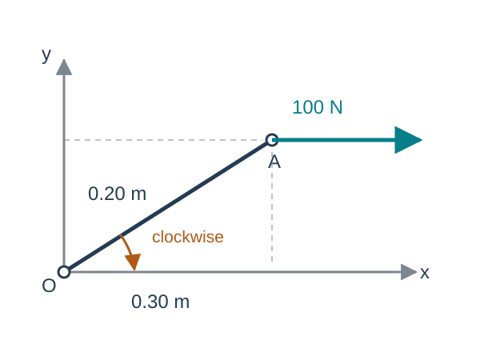
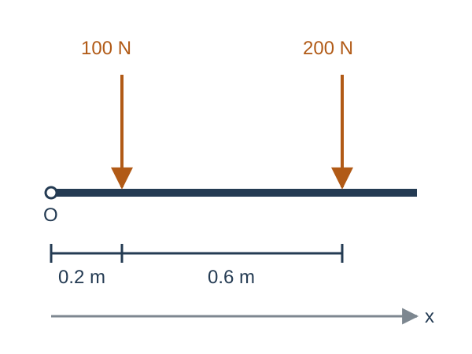
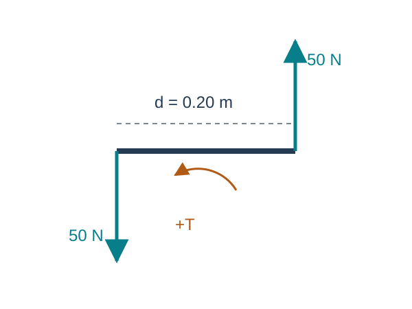
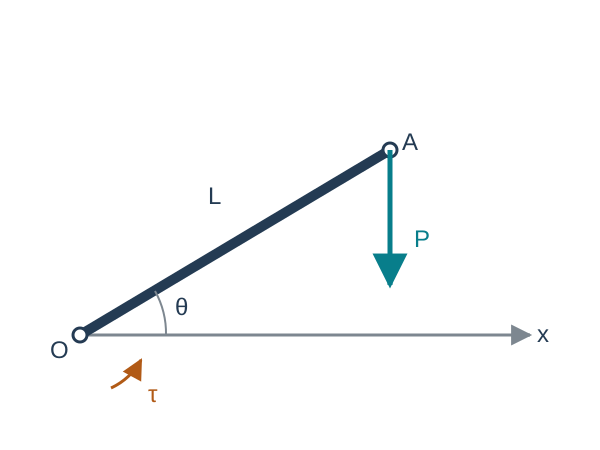

## Chapter overview

1. Lines of action and moments about a point
2. Resultants and moment transfer
3. Couples and torque
4. Equivalent force systems
5. Virtual work and generalized forces

**Goal:** replace a distributed set of loads by a consistent force–moment description.

::: {.notes}
Source: Satici, Kinematics and Machine Dynamics, Fall 2020 compiled notes, Chapter 9, §§9.1–9.3, pp. 59–61. Virtual work is an explicitly added bridge to Chapter 11.
:::

## A force has a line of action

A force acting on a rigid body has a magnitude, direction, and line of action.

For $F$ applied at $A$, its moment about $O$ is

$$\boxed{M_O=r_{OA}\times F.}$$

The source calls a vector with a specified line of action a **bound vector**. A free vector has no specified line of action.

The moment depends on the reference point $O$.

::: {.notes}
Source: Satici, Kinematics and Machine Dynamics, Fall 2020 compiled notes, §9.1, Eq. (9.1), p. 59.
:::

## Sliding along a line of action

Move the application point from $A$ to $B$ along the same line, so $r_{AB}=s\widehat f$ and $F=F\widehat f$.

$$r_{OB}\times F=(r_{OA}+s\widehat f)\times F=r_{OA}\times F.$$

The force and its moment about every point stay unchanged.

This replacement preserves the external rigid-body effect. Internal stresses can depend on where the load enters the actual structure.

::: {.notes}
Source: Satici, Kinematics and Machine Dynamics, Fall 2020 compiled notes, Chapter 9 introduction and §9.1. The stress qualification is added to state the rigid-body scope.
:::

## Worked example: an offset force

:::: {.columns}
::: {.column width="46%"}
{fig-alt="Force of 100 N to the right at A, located 0.3 m right and 0.2 m above O." height="390"}
:::
::: {.column width="54%"}

$$r_{OA}=0.3e_x+0.2e_y\ \mathrm m,$$
$$F=100e_x\ \mathrm N.$$

$$M_O=r_{OA}\times F=-20e_z\ \mathrm{N\,m}.$$

The moment is clockwise. The perpendicular lever arm is $0.2$ m.

:::
::::

::: {.notes}
Source: Satici, Kinematics and Machine Dynamics, Fall 2020 compiled notes, §9.1. Original numerical example and schematic.
:::

## Planar moments and their signs

With counterclockwise positive,

$$\boxed{M_{O,z}=xF_y-yF_x.}$$

Only the perpendicular offset from $O$ to the line of action contributes:

$$|M_O|=F d_\perp.$$

A force passing through $O$ has zero moment about $O$, even if the application point is far away.

::: {.notes}
Source: Satici, Kinematics and Machine Dynamics, Fall 2020 compiled notes, §9.1. Cartesian specialization of Eq. (9.1).
:::

## The resultant and total moment

For forces $F_i$ and applied free couples $T_j$,

$$\boxed{R=\sum_iF_i,\qquad M_O=\sum_i r_{Oi}\times F_i+\sum_jT_j.}$$

The resultant summarizes the force balance. The total moment contains the effect of the lines of action.

Equal resultants alone do not imply equivalent loading.

::: {.notes}
Source: Satici, Kinematics and Machine Dynamics, Fall 2020 compiled notes, §§9.1–9.2, Eq. (9.2), pp. 59–60. Applied couples are included explicitly.
:::

## Transferring the moment to another point

Let $r_{PQ}$ point from $P$ to $Q$.

$$\boxed{M_P=M_Q+r_{PQ}\times R.}$$

For every force, $r_{Pi}=r_{PQ}+r_{Qi}$. Therefore,

$$\sum_i r_{Pi}\times F_i
=r_{PQ}\times\sum_iF_i+\sum_i r_{Qi}\times F_i.$$

The resultant stays the same when the reference point changes.

::: {.notes}
Source: Satici, Kinematics and Machine Dynamics, Fall 2020 compiled notes, §9.1, Eq. (9.3) and derivation, pp. 59–60.
:::

## Worked example: loads on a beam

:::: {.columns}
::: {.column width="46%"}
{fig-alt="Horizontal beam with downward loads of 100 N at 0.2 m and 200 N at 0.8 m from O." height="365"}
:::
::: {.column width="54%"}

Two downward forces act on the beam:

$$R=-300e_y\ \mathrm N.$$

About its left end,

$$M_O=-100(0.2)e_z-200(0.8)e_z,$$
$$\boxed{M_O=-180e_z\ \mathrm{N\,m}.}$$

:::
::::

::: {.notes}
Source: Satici, Kinematics and Machine Dynamics, Fall 2020 compiled notes, §9.1. Original worked example and diagram.
:::

## Beam loads: choosing a new reference point

Choose $Q$ at $x=0.5$ m, so $r_{OQ}=0.5e_x$ m.

$$M_Q=M_O-r_{OQ}\times R$$
$$=-180e_z-(0.5e_x)\times(-300e_y)=-30e_z\ \mathrm{N\,m}.$$

Directly summing moments about $Q$ gives the same result:

$$(-0.3)(-100)+(0.3)(-200)=-30\ \mathrm{N\,m}.$$

::: {.notes}
Source: Satici, Kinematics and Machine Dynamics, Fall 2020 compiled notes, §9.1. Continuation of the beam example. Scalar products in the last line represent xFy.
:::

## A couple has zero resultant

:::: {.columns}
::: {.column width="46%"}
{fig-alt="Equal and opposite vertical forces separated horizontally by distance d, producing a counterclockwise couple." height="350"}
:::
::: {.column width="54%"}

A simple couple consists of two equal, opposite, parallel forces with different lines of action.

$$R=F+(-F)=0,$$
$$T=(r_A-r_B)\times F.$$

Its magnitude is $Fd$, where $d$ is the perpendicular separation.

:::
::::

::: {.notes}
Source: Satici, Kinematics and Machine Dynamics, Fall 2020 compiled notes, §9.2, p. 60. Original diagram.
:::

## The torque of a couple is independent of the point

For a couple, $R=0$. Moment transfer gives

$$M_P=M_Q+r_{PQ}\times0=M_Q.$$

Thus its torque $T$ can be treated as a free vector.

For two 50 N forces separated by 0.20 m,

$$\boxed{|T|=50(0.20)=10\ \mathrm{N\,m}.}$$

The word *couple* denotes the force system. Its *torque* is the moment vector.

::: {.notes}
Source: Satici, Kinematics and Machine Dynamics, Fall 2020 compiled notes, §9.2, p. 60. Numerical example refers to the preceding diagram.
:::

## Equivalent force systems

Two systems are equivalent for rigid-body analysis if they have

$$R'=R,\qquad M'_O=M_O$$

at one chosen point $O$.

Moment transfer then guarantees equal moments at every other point.

For example, two systems with zero resultant and the same couple torque are equivalent even if their force locations differ.

::: {.notes}
Source: Satici, Kinematics and Machine Dynamics, Fall 2020 compiled notes, §9.3, pp. 60–61.
:::

## Replacement by a force and a couple

At any selected point $O$, replace the entire loading by:

- A force $R$ whose line of action passes through $O$.
- A free couple of torque $M_O$.

$$\boxed{\text{Equivalent loading at }O:\quad (R,M_O).}$$

When moving a force to a parallel line through a new point, include the couple required to preserve the moment.

::: {.notes}
Source: Satici, Kinematics and Machine Dynamics, Fall 2020 compiled notes, §9.3, p. 61.
:::

## When one force is enough

A single force $R$ at position $r$ can replace the system only if

$$r\times R=M_O.$$

For $R\ne0$, this requires $M_O\cdot R=0$. Then one solution is

$$r=\frac{R\times M_O}{\|R\|^2},$$

and adding any multiple of $R$ gives the same line of action.

For the beam, $x(-300)=-180$, so the single downward resultant acts at $x=0.60$ m.

::: {.notes}
Source: Satici, Kinematics and Machine Dynamics, Fall 2020 compiled notes, §9.3. Single-force condition and solution derived as an extension of replacement.
:::

## A spatial load may retain a couple

Decompose the moment into parts parallel and perpendicular to $R$:

$$M_O=M_\parallel+M_\perp,\qquad
M_\parallel=\frac{R\cdot M_O}{\|R\|^2}R.$$

A change of line of action can absorb $M_\perp$ into $r\times R$.

The parallel part remains as a couple. This force plus parallel couple is a **wrench**.

If $R=0$ and $M_O\ne0$, the loading is a pure couple.

::: {.notes}
Source: Satici, Kinematics and Machine Dynamics, Fall 2020 compiled notes, §9.3 and Chapter 5 screw geometry. Wrench decomposition is an instructional extension.
:::

## Distributed loads

For a force density $w(x)$ acting downward on a beam,

$$R_y=-\int_0^Lw(x)\,dx,\qquad
M_{O,z}=-\int_0^Lxw(x)\,dx.$$

For $w(x)=w_0x/L$,

$$R_y=-\frac{w_0L}{2},\qquad M_{O,z}=-\frac{w_0L^2}{3}.$$

The equivalent resultant acts at $x_R=2L/3$, toward the heavier end of the triangular load.

::: {.notes}
Source: Satici, Kinematics and Machine Dynamics, Fall 2020 compiled notes, §9.3. Original continuous-load example obtained by integrating the resultant and moment definitions.
:::

## Power provides a consistency check

For a rigid body, $v_i=v_O+\omega\times r_{Oi}$.

The power of all applied forces and couples becomes

$$\boxed{\mathcal P=\sum_iF_i\cdot v_i+\sum_jT_j\cdot\omega
=R\cdot v_O+M_O\cdot\omega.}$$

Equivalent force systems produce the same instantaneous rigid-body power.

Use the force and moment at the same reference point as the translational velocity.

::: {.notes}
Source: Satici, Kinematics and Machine Dynamics, Fall 2020 compiled notes, §9.3 and §7.6. Power identity derived as a bridge to generalized forces.
:::

## Generalized forces from virtual work

Let $q=(q_1,\ldots,q_n)$ describe independent configurations and $p_i=p_i(q)$.

With $J_i=\partial p_i/\partial q$,

$$\delta W=\sum_iF_i^T\delta p_i
=\sum_iF_i^TJ_i\delta q=Q^T\delta q.$$

$$\boxed{Q=\sum_iJ_i^TF_i.}$$

For a rigid-body couple, add $J_\omega^TT$ when $\omega=J_\omega\dot q$.

::: {.notes}
Source: Satici, Kinematics and Machine Dynamics, Fall 2020 compiled notes, Instructional bridge beyond §§9.1–9.3, consistent with the generalized-coordinate formulation in §11.2.1. Assumes independent coordinates and ideal constraints.
:::

## Worked example: one revolute joint

:::: {.columns}
::: {.column width="46%"}
{fig-alt="A link of length L at angle theta above x, carrying a downward tip force P and a positive joint torque tau." height="360"}
:::
::: {.column width="54%"}

For $q=\theta$,

$$p=L\begin{bmatrix}\cos\theta\\\sin\theta\end{bmatrix},\quad
F=\begin{bmatrix}0\\-P\end{bmatrix}.$$

With a positive actuator torque $\tau$,

$$Q_\theta=\tau+\left(\frac{\partial p}{\partial\theta}\right)^TF
=\boxed{\tau-PL\cos\theta}.$$

:::
::::

::: {.notes}
Source: Satici, Kinematics and Machine Dynamics, Fall 2020 compiled notes, Original virtual-work example and schematic. Cross-check: this is exactly the moment of the tip force about the joint plus the actuator torque.
:::

## Force-analysis bookkeeping

Before writing equilibrium or motion equations:

1. Identify the body and all external forces and couples.
2. State the reference point, axes, and positive moment direction.
3. Reduce the loads to $R$ and $M_O$ if that simplifies the calculation.
4. Keep every moment with its reference point.

In Chapter 10, these loads determine mass-center acceleration and angular acceleration.

::: {.notes}
Source: Satici, Kinematics and Machine Dynamics, Fall 2020 compiled notes, Chapter 9 synthesis.
:::

## References and next chapter

**Primary:** Aykut C. Satici, *Kinematics and Machine Dynamics*, Fall 2020 compiled notes, Chapter 9, pp. 59–61.

**Supporting:** Kane and Levinson, *Dynamics: Theory and Applications* (1985), force-system development. Original course Lecture06 covers moments, couples, and replacement.

Virtual work and the numerical examples extend the compiled chapter to connect with equations of motion.

[Next: Chapter 10, Formulation of Equations of Motion](chapter10.html)

::: {.notes}
Source: Satici, Kinematics and Machine Dynamics, Fall 2020 compiled notes, Chapter 9 reference [20].
:::

