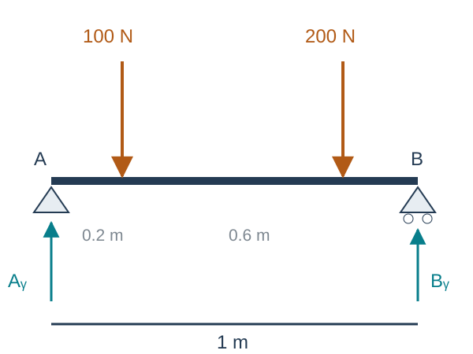
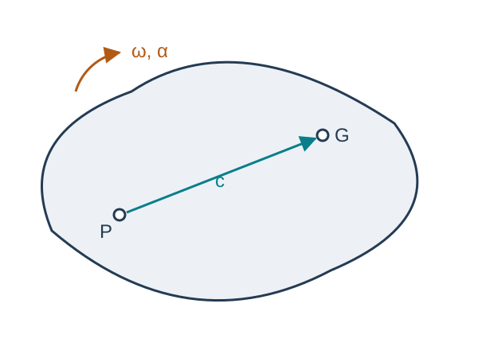
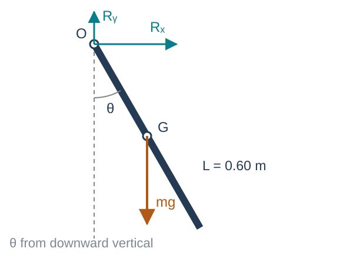

## Chapter overview

1. Static equilibrium and free-body diagrams
2. Linear and angular momentum balances
3. Newton–Euler equations at the mass center
4. Equations about another body-fixed point
5. Planar motion and mechanism force analysis

**Goal:** turn known loads into motion, or known motion into required loads.

::: {.notes}
Source: Satici, Kinematics and Machine Dynamics, Fall 2020 compiled notes, Chapter 10, §§10.1–10.2, pp. 63–67.
:::

## Assumptions of this chapter

Each link is rigid and has constant mass. The reference frame used to measure acceleration is inertial.

Joints are ideal and frictionless unless a load is explicitly included. Contact friction and impact enter in Chapter 11.

A static approximation is appropriate only when inertial loads are small relative to the loads of interest.

Rigid-body force analysis predicts joint reactions and driving torques. Stress and deformation require a separate structural model.

::: {.notes}
Source: Satici, Kinematics and Machine Dynamics, Fall 2020 compiled notes, Chapter 10 introduction, pp. 63–64.
:::

## Free-body diagrams determine the equations

Isolate one body and show all loads exerted on it by its surroundings:

- Applied forces and actuator couples.
- Weight acting at the mass center $G$.
- Joint forces and any moments the joint can transmit.

An ideal planar pin transmits two force components and no couple. A frictionless planar prismatic joint can transmit a normal force and a couple.

Action–reaction pairs act on different bodies.

::: {.notes}
Source: Satici, Kinematics and Machine Dynamics, Fall 2020 compiled notes, §§10.1–10.2. Explicit free-body procedure added.
:::

## Static equilibrium

For a rigid body at rest,

$$\boxed{\sum F=0,\qquad \sum M_O=0.}$$

In three dimensions these are six scalar balance equations.

For planar loading in the $xy$ plane,

$$\boxed{\sum F_x=0,\qquad\sum F_y=0,\qquad\sum M_{O,z}=0.}$$

With zero resultant, the moment balance holds about every point.

::: {.notes}
Source: Satici, Kinematics and Machine Dynamics, Fall 2020 compiled notes, §10.1, Eqs. (10.1)–(10.2), p. 64.
:::

## Worked example: a supported beam

:::: {.columns}
::: {.column width="46%"}
{fig-alt="Pin at A and roller at B on a 1 m beam, with 100 N and 200 N downward loads at 0.2 and 0.8 m." height="350"}
:::
::: {.column width="54%"}

Neglect the beam's weight. The span is 1 m.

$$\sum M_A=0:\quad B_y(1)-100(0.2)-200(0.8)=0.$$

$$B_y=180\ \mathrm N,$$
$$A_y=300-180=120\ \mathrm N,$$
$$A_x=0.$$

:::
::::

::: {.notes}
Source: Satici, Kinematics and Machine Dynamics, Fall 2020 compiled notes, §10.1. Original worked example using the Chapter 9 loading with explicit supports.
:::

## When inertia becomes significant

A mass center at offset $e$ from a fixed spin axis has normal acceleration $e\omega^2$.

The corresponding force scale is

$$F_{\mathrm{inertia}}=me\omega^2.$$

For $m=2$ kg, $e=1$ mm, and $\omega=100$ rad/s,

$$F_{\mathrm{inertia}}=20\ \mathrm N.$$

Doubling the speed gives 80 N. A small eccentricity can matter at high speed.

::: {.notes}
Source: Satici, Kinematics and Machine Dynamics, Fall 2020 compiled notes, Chapter 10 introduction, pp. 63–64. Original numerical illustration of the quadratic speed dependence.
:::

## Linear momentum balance

For constant total mass $m$, the linear momentum is $p=mv_G$.

$$\boxed{\sum F=\left(\frac{dp}{dt}\right)_A=ma_G.}$$

$A$ is an inertial frame. The resultant includes all external forces, wherever they act.

There is no requirement that every applied force pass through $G$.

::: {.notes}
Source: Satici, Kinematics and Machine Dynamics, Fall 2020 compiled notes, §10.2, Eqs. (10.3)–(10.4), p. 65. Clarifies that f is the external resultant, not a force physically applied at G.
:::

## Angular momentum about the mass center

The angular momentum about $G$ is

$$H_G=\int_B r\times(v-v_G)\,dm=I_G\omega.$$

The angular momentum balance is

$$\boxed{\sum M_G=\left(\frac{dH_G}{dt}\right)_A.}$$

The mass center may accelerate. This balance holds about $G$ without a moving-point correction.

Moments about other moving points need more care.

::: {.notes}
Source: Satici, Kinematics and Machine Dynamics, Fall 2020 compiled notes, §10.2, p. 65. Angular momentum definition makes the origin restriction explicit.
:::

## The rotating-basis derivative

In a body basis $B$, $I_G^B$ is constant. The transport theorem gives

$$\left(\frac{dH_G}{dt}\right)_A
=\left(\frac{dH_G}{dt}\right)_B+\omega\times H_G.$$

Since $\omega\times\omega=0$, the body components of angular acceleration satisfy $\alpha_B=\dot\omega_B$.

$$\boxed{M_G^B=I_G^B\dot\omega_B+\omega_B\times(I_G^B\omega_B).}$$

Every vector component and inertia entry in this equation uses the same basis.

::: {.notes}
Source: Satici, Kinematics and Machine Dynamics, Fall 2020 compiled notes, §10.2, Eq. (10.5), and §§7.1, 7.4. Superscripts distinguish observation frame from expression basis.
:::

## Euler equations in principal axes

For $I_G^B=\operatorname{diag}(I_1,I_2,I_3)$,

$$M_1=I_1\dot\omega_1+(I_3-I_2)\omega_2\omega_3,$$
$$M_2=I_2\dot\omega_2+(I_1-I_3)\omega_3\omega_1,$$
$$M_3=I_3\dot\omega_3+(I_2-I_1)\omega_1\omega_2.$$

The cross terms describe how angular momentum changes direction as the body rotates.

For rotation about a principal axis, $\omega$ and $I_G\omega$ are parallel and the cross term vanishes.

::: {.notes}
Source: Satici, Kinematics and Machine Dynamics, Fall 2020 compiled notes, §10.2, Eq. (10.5), combined with §8.7. Component expansion added.
:::

## Worked example: a gyroscopic torque

At an instant, body coordinates give

$$I_G=\operatorname{diag}(0.2,0.3,0.4)\ \mathrm{kg\,m^2},\quad
\omega=\begin{bmatrix}1\\2\\3\end{bmatrix}\ \mathrm{rad/s},\quad\alpha=0.$$

Then $I_G\omega=(0.2,0.6,1.2)^T$ kg·m²/s and

$$\boxed{M_G=\omega\times I_G\omega=
\begin{bmatrix}0.6\\-0.6\\0.2\end{bmatrix}\ \mathrm{N\,m}.}$$

Zero angular acceleration can still require a torque when angular momentum is not parallel to angular velocity.

::: {.notes}
Source: Satici, Kinematics and Machine Dynamics, Fall 2020 compiled notes, §10.2. Original numerical example added.
:::

## Newton–Euler equations at the mass center

Collect translational and rotational balances:

$$\boxed{\begin{bmatrix}F\\M_G\end{bmatrix}
=\begin{bmatrix}m\mathbf1&0\\0&I_G\end{bmatrix}
\begin{bmatrix}a_G\\\alpha\end{bmatrix}
+\begin{bmatrix}0\\\omega\times I_G\omega\end{bmatrix}.}$$

$F$ is the external resultant, $M_G$ its total moment about $G$, and $a_G$ the inertial acceleration of $G$.

All components use one basis. In a body basis, $a_G$ is the inertial acceleration expressed in that basis, not simply $\dot v_G^B$.

::: {.notes}
Source: Satici, Kinematics and Machine Dynamics, Fall 2020 compiled notes, §10.2, Eq. (10.6), pp. 65–66. Distinguishes inertial acceleration from the derivative of velocity coordinates in a rotating basis.
:::

## Moving the reference point to the body

:::: {.columns}
::: {.column width="46%"}
{fig-alt="Body-fixed point P and mass center G joined by vector c, with angular motion omega and alpha." height="350"}
:::
::: {.column width="54%"}

Let $P$ be fixed in the rigid body and $c=\overrightarrow{PG}$.

From Chapter 7,

$$a_G=a_P+\alpha\times c+\omega\times(\omega\times c).$$

From Chapter 9,

$$M_P=M_G+c\times F.$$

These identities give the equations about $P$.

:::
::::

::: {.notes}
Source: Satici, Kinematics and Machine Dynamics, Fall 2020 compiled notes, §10.2, derivation of Eq. (10.7), p. 66. Original schematic.
:::

## Translation referred to a body-fixed point

Substitute $a_G$ into $F=ma_G$:

$$F=ma_P+m\alpha\times c+m\omega\times(\omega\times c).$$

Using $\widehat c\,\alpha=c\times\alpha$,

$$\boxed{F=ma_P-m\widehat c\,\alpha+m\widehat\omega^{\,2}c.}$$

The reference point's acceleration and angular acceleration are coupled whenever $c\ne0$.

::: {.notes}
Source: Satici, Kinematics and Machine Dynamics, Fall 2020 compiled notes, §10.2, first block row of Eq. (10.7), p. 66.
:::

## Rotation referred to a body-fixed point

Start with $M_P=I_G\alpha+\omega\times I_G\omega+c\times F$.

Define the shifted inertia

$$I_P=I_G-m\widehat c^{\,2}.$$

After substitution and collection,

$$\boxed{M_P=m\widehat c\,a_P+I_P\alpha+\omega\times(I_P\omega).}$$

The term $mc\times a_P$ is essential if $P$ accelerates.

::: {.notes}
Source: Satici, Kinematics and Machine Dynamics, Fall 2020 compiled notes, §10.2, second block row of Eq. (10.7), pp. 66–67. Uses c×[ω×(ω×c)]=ω×[(||c||²1−ccᵀ)ω].
:::

## The coupled six-dimensional equation

$$\boxed{\begin{bmatrix}F\\M_P\end{bmatrix}
=\begin{bmatrix}m\mathbf1&-m\widehat c\\m\widehat c&I_P\end{bmatrix}
\begin{bmatrix}a_P\\\alpha\end{bmatrix}
+\begin{bmatrix}m\widehat\omega^{\,2}c\\\widehat\omega I_P\omega\end{bmatrix}.}$$

The matrix is symmetric because $\widehat c^T=-\widehat c$.

At $P=G$, $c=0$ and the equations reduce to the mass-center form.

$F$ remains the sum of all external forces. $M_P$ is the moment about $P$.

::: {.notes}
Source: Satici, Kinematics and Machine Dynamics, Fall 2020 compiled notes, §10.2, Eq. (10.7), p. 66. Retains acceleration-based notation; this is not the time derivative of an arbitrary coordinate twist.
:::

## Planar motion

For motion in the $xy$ plane, $\omega=\omega e_z$ and $\alpha=\alpha e_z$.

$$\boxed{\sum F_x=ma_{G,x},\quad\sum F_y=ma_{G,y},\quad
\sum M_{G,z}=I_{G,zz}\alpha.}$$

The **$z$ component** of $\omega\times I_G\omega$ vanishes.

The whole gyroscopic vector need not vanish unless $z$ is a principal direction. Out-of-plane support moments may still be needed to enforce planar motion.

::: {.notes}
Source: Satici, Kinematics and Machine Dynamics, Fall 2020 compiled notes, §10.2, Eq. (10.8), p. 67, and Lecture06/slides/eom.tex. Corrects the source prose that describes the full gyroscopic term as zero.
:::

## Planar moments about another point

For a body-fixed $P$,

$$\boxed{M_{P,z}=I_{P,zz}\alpha+m(c\times a_P)_z.}$$

Two useful choices are:

- $P=G$: the offset $c$ is zero.
- An inertially fixed pivot: $a_P=0$.

For either choice the moment equation simplifies. For an accelerating joint, the correction generally remains.

::: {.notes}
Source: Satici, Kinematics and Machine Dynamics, Fall 2020 compiled notes, §10.2. Planar projection of Eq. (10.7).
:::

## Worked example: a falling rigid rod

:::: {.columns}
::: {.column width="46%"}
{fig-alt="Uniform rod pivoted at O, with theta measured counterclockwise from downward vertical, mass center G, gravity and pin reactions." height="380"}
:::
::: {.column width="54%"}

Uniform rod: $m=2$ kg and $L=0.60$ m. Let $l=L/2=0.30$ m.

At release, $\theta=30^\circ$ and $\dot\theta=0$. The pivot is frictionless and fixed.

$$I_O=\frac{mL^2}{3}=0.24\ \mathrm{kg\,m^2}.$$

Find the angular acceleration and pin reactions.

:::
::::

::: {.notes}
Source: Satici, Kinematics and Machine Dynamics, Fall 2020 compiled notes, §10.2. Original worked example and free-body diagram. Positive theta is counterclockwise from downward vertical.
:::

## Falling rod: angular acceleration

Taking moments about the fixed pivot removes its reaction forces:

$$-mgl\sin\theta=I_O\ddot\theta.$$

At release,

$$\boxed{\ddot\theta=-\frac{2(9.81)(0.30)\sin30^\circ}{0.24}
=-12.2625\ \mathrm{rad/s^2}.}$$

The negative sign means acceleration toward the downward position.

To hold the rod statically at this angle, the actuator would instead supply $+2.943$ N·m.

::: {.notes}
Source: Satici, Kinematics and Machine Dynamics, Fall 2020 compiled notes, §§10.1–10.2. Continuation of the falling-rod example.
:::

## Falling rod: pin reactions

With $r_{OG}=l(\sin\theta\,e_x-\cos\theta\,e_y)$ and $\omega=0$ at release,

$$a_G=l\ddot\theta(\cos\theta\,e_x+\sin\theta\,e_y)
\approx-3.186e_x-1.839e_y\ \mathrm{m/s^2}.$$

The force balances are

$$R_x=ma_{G,x},\qquad R_y-mg=ma_{G,y}.$$

$$\boxed{R_x\approx-6.372\ \mathrm N,\qquad R_y\approx15.941\ \mathrm N.}$$

The vertical reaction is smaller than the weight because $G$ accelerates downward.

::: {.notes}
Source: Satici, Kinematics and Machine Dynamics, Fall 2020 compiled notes, §10.2. Original numerical reaction calculation. Values rounded only for display.
:::

## A driven physical pendulum

For a fixed pivot, mass-center distance $l$, and actuator torque $\tau$,

$$\boxed{I_O\ddot\theta+mgl\sin\theta=\tau.}$$

**Forward dynamics:** given $\theta,\dot\theta,\tau$, compute $\ddot\theta$.

**Inverse dynamics:** given a desired $\theta(t)$, compute

$$\tau(t)=I_O\ddot\theta(t)+mgl\sin\theta(t).$$

This single equation includes static holding torque and dynamic acceleration torque.

::: {.notes}
Source: Satici, Kinematics and Machine Dynamics, Fall 2020 compiled notes, §10.2. Original synthesis from Newton–Euler balance.
:::

## An energy check on the pendulum equation

For $V=mgl(1-\cos\theta)$,

$$E=\frac12I_O\dot\theta^2+V.$$

Differentiate and use the equation of motion:

$$\dot E=\dot\theta\left(I_O\ddot\theta+mgl\sin\theta\right)
=\boxed{\tau\dot\theta}.$$

With no actuator and no friction, mechanical energy stays constant. A sign error in gravity would fail this check.

::: {.notes}
Source: Satici, Kinematics and Machine Dynamics, Fall 2020 compiled notes, §10.2. Energy identity added as a verification tool, using Chapter 9 power.
:::

## A mechanism needs a balance for each link

For a planar link $i$,

$$\sum F_i=m_i a_{G_i},\qquad\sum M_{G_i,z}=I_{G_i,zz}\alpha_i.$$

A pin force exerted on link 1 appears with the opposite sign on link 2. These forces cancel only when the entire assembly is considered.

Use Chapters 6–7 to obtain the motion of every mass center and each link's angular acceleration before solving an inverse force problem.

::: {.notes}
Source: Satici, Kinematics and Machine Dynamics, Fall 2020 compiled notes, §10.2. Multibody bookkeeping extension of Newton’s third law and individual rigid-body balances.
:::

## Solving an inverse force problem

At a known mechanism configuration and motion:

1. Draw each link's free-body diagram.
2. Compute $a_{G_i}$ and $\alpha_i$ from the kinematics.
3. Write the force and moment equations with shared joint-force unknowns.
4. Assemble $A(q)x=b(q,\dot q,\ddot q)$ and solve for reactions and input torques.

A singular or poorly conditioned matrix can signal a special configuration, redundant constraints, or missing load information.

::: {.notes}
Source: Satici, Kinematics and Machine Dynamics, Fall 2020 compiled notes, Chapter 10 synthesis. Linear algebra formulation added for computational use.
:::

## Generalized-coordinate equations

After eliminating ideal constraint reactions, the same dynamics can be written in independent coordinates:

$$\boxed{M(q)\ddot q+C(q,\dot q)\dot q+\nabla V(q)=Q.}$$

The kinetic energy is $T=\tfrac12\dot q^TM(q)\dot q$.

For the physical pendulum, $M=I_O$, $C=0$, and $Q=\tau$.

Chapter 11 adds unilateral contact forces and velocity jumps to this framework.

::: {.notes}
Source: Satici, Kinematics and Machine Dynamics, Fall 2020 compiled notes, Bridge to §11.2.1, p. 81. Assumes independent local coordinates and ideal constraints. C is not unique; the velocity-quadratic term is what matters.
:::

## References and next chapter

**Primary:** Aykut C. Satici, *Kinematics and Machine Dynamics*, Fall 2020 compiled notes, Chapter 10, pp. 63–67.

**Supporting:** original course Lecture06, equations-of-motion slides. Chapters 7–9 supply the acceleration, inertia, and moment-transfer identities.

[Next: Chapter 11, Rigid-Body Dynamics with Friction and Impact](chapter11.html)

::: {.notes}
Source: Satici, Kinematics and Machine Dynamics, Fall 2020 compiled notes, Chapter 10. Examples and qualifications added to make the balances and assumptions explicit.
:::

