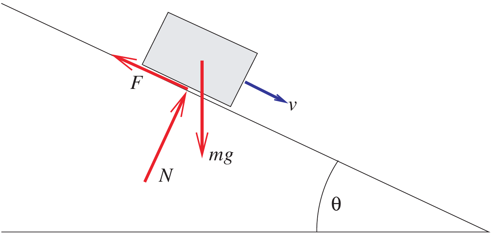
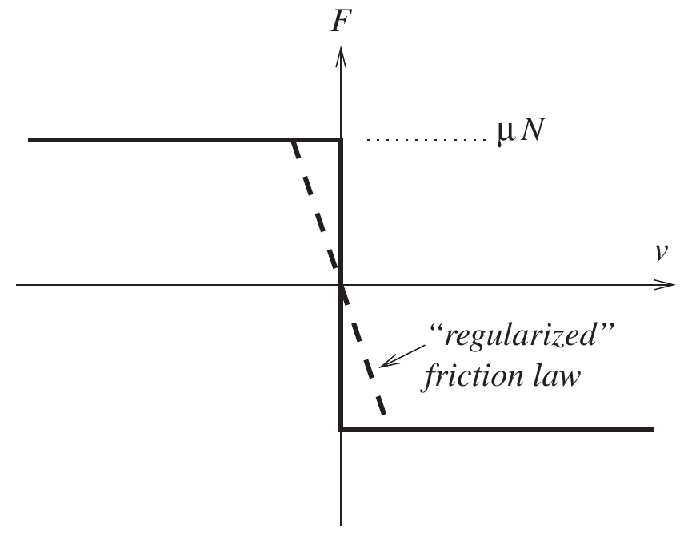
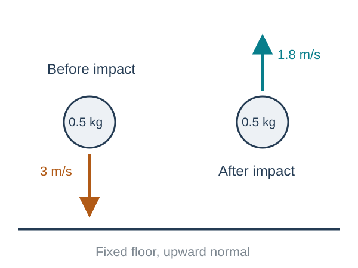
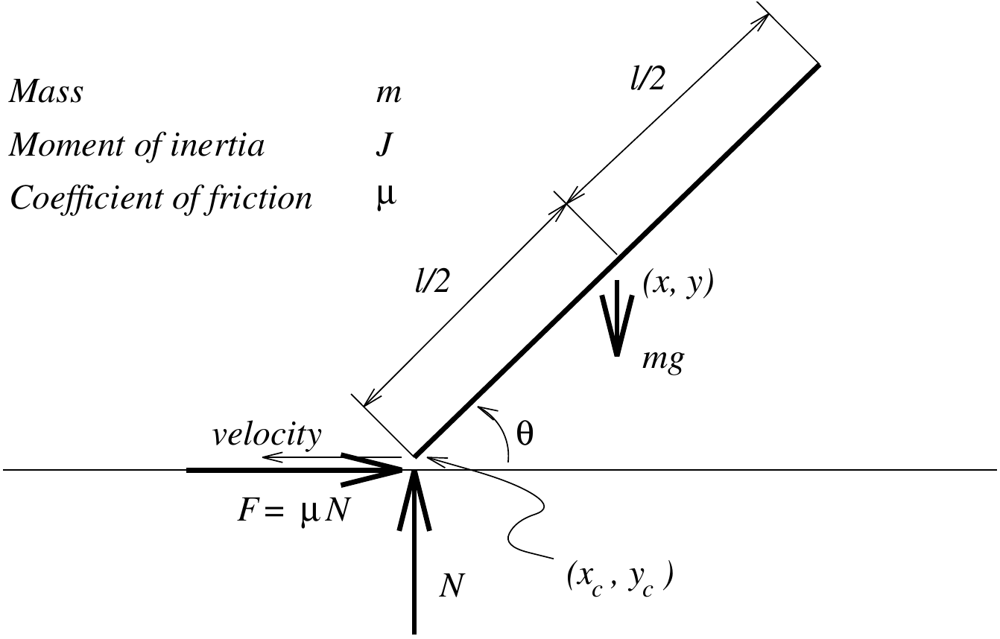
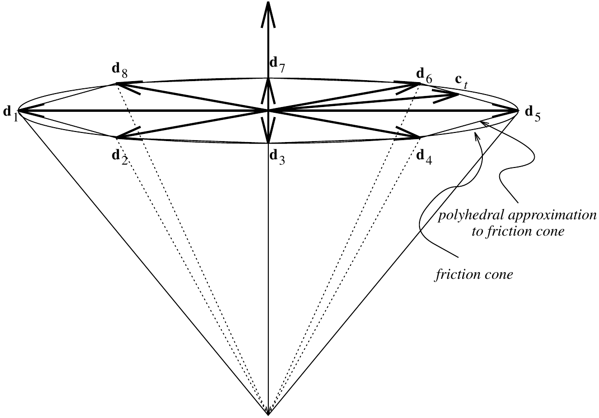

## Chapter overview

**Friction and impact**

- Sticking, sliding, and Coulomb friction.
- Contact impulses and restitution.

**Advanced material**

- Painlevé's problem and complementarity.
- Measure differential inclusions.
- Continuous contact models and time-stepping methods.

**Goal:** distinguish smooth motion, sustained contact, and impact in a rigid-body model.

::: {.notes}
Source: Satici, Kinematics and Machine Dynamics, Fall 2020 compiled notes, Chapter 11, §§11.1–11.2, pp. 69–86.
:::

## What a rigid contact model idealizes

Real bodies deform during contact. A rigid model replaces a short deformation event by an instantaneous change in velocity.

Position remains continuous through an impact:

$$q(t^+)=q(t^-),\qquad v(t^+)\ne v(t^-).$$

A finite velocity jump requires a finite **impulse**. A bounded force acting for zero time cannot produce it.

A separate impact law describes the unresolved deformation and energy loss.

::: {.notes}
Source: Satici, Kinematics and Machine Dynamics, Fall 2020 compiled notes, §11.1, pp. 69–70, and §11.1.2, pp. 72–74.
:::

## The gap and the normal reaction

Let $g(q)$ be a signed gap, positive when bodies are separated. Let $N$ be a compressive normal force.

For nonadhesive rigid contact,

$$g(q)\geq0,\qquad N\geq0,\qquad g(q)N=0.$$

A positive gap means $N=0$. A positive normal reaction requires zero gap.

These conditions permit contact and separation while forbidding penetration and tensile contact forces.

::: {.notes}
Source: Satici, Kinematics and Machine Dynamics, Fall 2020 compiled notes, §11.2.1, Signorini contact condition, pp. 81–83, introduced early to support the elementary material. N denotes an ordinary force in smooth phases.
:::

## Coulomb friction during sliding

Let $v_t$ be the relative tangential velocity at a contact, with $v_t\ne0$.

$$\boxed{f_t=-\mu N\frac{v_t}{\|v_t\|}.}$$

Friction opposes relative sliding. Its power is

$$f_t\cdot v_t=-\mu N\|v_t\|\leq0.$$

The coefficient $\mu$ is a model parameter for the contacting surfaces and operating conditions.

::: {.notes}
Source: Satici, Kinematics and Machine Dynamics, Fall 2020 compiled notes, §11.1.1, pp. 70–72. Isotropic Coulomb law in a two-dimensional contact tangent plane.
:::

## Static friction is a range of possible forces

When $v_t=0$, the friction force can take any value satisfying

$$\boxed{\|f_t\|\leq\mu N.}$$

The force balance determines which value is needed to maintain sticking.

At rest, setting friction to zero can predict motion where sticking should occur.

We use one coefficient $\mu$ for the set-valued model. Engineering models may distinguish static and kinetic coefficients.

::: {.notes}
Source: Satici, Kinematics and Machine Dynamics, Fall 2020 compiled notes, §11.1.1, pp. 70–72. This deck uses the source’s single-coefficient idealization.
:::

## Worked example: a block on a ramp

:::: {.columns}
::: {.column width="46%"}
{fig-alt="Block sliding down a ramp with gravity, normal reaction, and uphill friction." height="350"}
:::
::: {.column width="54%"}

Take positive $v$ downhill. With no normal acceleration,

$$N=mg\cos\theta.$$

During downhill sliding,

$$\dot v=g(\sin\theta-\mu\cos\theta).$$

At rest, sticking is possible when

$$\boxed{\tan\theta\leq\mu.}$$

:::
::::

::: {.notes}
Source: Satici, Kinematics and Machine Dynamics, Fall 2020 compiled notes, §11.1.1, Eq. (11.1), pp. 70–71. Unchanged Fig. 11.1 from Textbook/gfx/brick_on_ramp.png; compiled chapter follows Stewart (2000).
:::

## Ramp example: stopping and sticking

Let $\theta=20^\circ$, $\mu=0.40$, $g=9.81$ m/s², and initial downhill speed $v_0=1$ m/s.

$$\dot v=9.81(\sin20^\circ-0.4\cos20^\circ)
\approx-0.3321\ \mathrm{m/s^2}.$$

$$t_{\mathrm{stop}}\approx3.011\ \mathrm s,\qquad
s_{\mathrm{stop}}\approx1.505\ \mathrm m.$$

Since $\tan20^\circ\approx0.364<0.40$, static friction can hold the block after it stops. The sliding equation stops applying at $v=0$.

::: {.notes}
Source: Satici, Kinematics and Machine Dynamics, Fall 2020 compiled notes, §11.1.1. Original numerical example using the source ramp.
:::

## A set-valued friction law

In one tangential dimension, define

$$\operatorname{Sign}(v)=\begin{cases}
\{1\},&v>0,\\[-2pt]
[-1,1],&v=0,\\[-2pt]
\{-1\},&v<0.
\end{cases}$$

Then

$$\boxed{m\dot v\in F_t-\mu N\operatorname{Sign}(v).}$$

At $v=0$, this relation can select $\dot v=0$ whenever $|F_t|\leq\mu N$.

::: {.notes}
Source: Satici, Kinematics and Machine Dynamics, Fall 2020 compiled notes, §11.1.1, p. 71. Explicit graph completion replaces the single-valued sgn(0)=0 law.
:::

## Smoothing changes the sticking behavior

:::: {.columns}
::: {.column width="46%"}
{fig-alt="Regularized friction curve replacing the jump at zero velocity by a steep continuous transition." height="360"}
:::
::: {.column width="54%"}

A smooth approximation such as

$$f_t=-\mu N\tanh(v/\varepsilon)$$

can simplify an ODE implementation.

For a small nonzero applied load, its equilibrium generally requires a small nonzero velocity: creep.

A smaller $\varepsilon$ sharpens the approximation but can make the ODE stiff.

:::
::::

::: {.notes}
Source: Satici, Kinematics and Machine Dynamics, Fall 2020 compiled notes, §§11.1.1 and 11.2.2, pp. 71–72, 83–84. Unchanged Fig. 11.3 from Textbook/gfx/regularized_Coulomb.png. The tanh example is an addition.
:::

## The friction cone

For a unit normal $n$ and tangential force $f_t\perp n$,

$$f_c=Nn+f_t,\qquad N\geq0,\qquad\|f_t\|\leq\mu N.$$

These admissible forces form the Coulomb friction cone.

- Sticking allows a tangential force inside the disk $\|f_t\|\leq\mu N$.
- Sliding selects its boundary opposite to the sliding velocity.

If contact opens, $N=0$ and the friction force is also zero.

::: {.notes}
Source: Satici, Kinematics and Machine Dynamics, Fall 2020 compiled notes, §11.1.1, Eq. (11.3), p. 72.
:::

## Maximum dissipation

For a given normal force, choose the admissible friction force that dissipates the most power:

$$\boxed{f_t\in\underset{\|f\|\leq\mu N}{\arg\min}\ v_t^Tf.}$$

For $v_t\ne0$, the solution is the Coulomb sliding law.

For $v_t=0$, every admissible force has zero instantaneous power. The motion equations and sticking condition determine the needed reaction.

Other convex friction sets can represent anisotropic resistance.

::: {.notes}
Source: Satici, Kinematics and Machine Dynamics, Fall 2020 compiled notes, §11.1.1, Eq. (11.2), p. 72. Minimum power is equivalent to maximum dissipation.
:::

## Impulse and a velocity jump

Over a short collision, define contact impulse

$$P=\int f_c\,dt.$$

For a particle,

$$\boxed{m(v^+-v^-)=P.}$$

The superscripts $-$ and $+$ denote the limits just before and just after impact.

Impulse has units N·s. It determines the momentum jump without specifying a peak force or contact duration.

::: {.notes}
Source: Satici, Kinematics and Machine Dynamics, Fall 2020 compiled notes, §§11.1–11.1.2, pp. 69–74. Particle impulse balance added as an entry point.
:::

## Newton's normal restitution law

For a single closing contact, take $v_n^-<0$ and a separating normal as positive.

$$\boxed{v_n^+=-e\,v_n^-,\qquad0\leq e\leq1.}$$

- $e=0$: no normal rebound.
- $e=1$: ideal elastic rebound in this isolated normal mode.
- Intermediate $e$: partial rebound.

The velocities are relative contact velocities. Apply this law at an impact, not to a separated body.

::: {.notes}
Source: Satici, Kinematics and Machine Dynamics, Fall 2020 compiled notes, §11.1.2, p. 73. Assumes an isolated closing contact and explicitly states the velocity sign convention.
:::

## Worked example: normal impact on a floor

:::: {.columns}
::: {.column width="46%"}
{fig-alt="A particle approaches a fixed floor downward at 3 m/s and leaves upward at 1.8 m/s." height="340"}
:::
::: {.column width="54%"}

A $0.5$ kg particle hits a fixed floor with $v_n^-=-3$ m/s and $e=0.6$.

$$v_n^+=1.8\ \mathrm{m/s},$$
$$P_n=m(v_n^+-v_n^-)=\boxed{2.4\ \mathrm{N\,s}}.$$

$$T^- =2.25\ \mathrm J,\quad T^+=0.81\ \mathrm J.$$

The kinetic-energy loss is $1.44$ J.

:::
::::

::: {.notes}
Source: Satici, Kinematics and Machine Dynamics, Fall 2020 compiled notes, §11.1.2. Original example and schematic. Gravity impulse is neglected during the instantaneous collision.
:::

## Poisson's compression and restitution phases

Poisson's model separates the normal impulse into compression and restitution parts.

Using **positive impulse magnitudes**,

$$P_n^{\mathrm{rest}}=e_P P_n^{\mathrm{comp}}.$$

Compression removes the approaching normal velocity. Restitution supplies a further impulse as stored deformation energy is released.

For a single frictionless particle impact, the Newton and Poisson laws agree when $e_P=e$. Frictional and coupled impacts require more care.

::: {.notes}
Source: Satici, Kinematics and Machine Dynamics, Fall 2020 compiled notes, §11.1.2, pp. 72–74. Positive magnitudes avoid the source’s signed-impulse ambiguity.
:::

## What the coefficient of restitution leaves out

Restitution can depend on configuration, contact conditions, and energy stored in elastic vibrations.

A single material constant may not describe a slender bar striking at different angles or undergoing repeated impacts.

With friction or multiple simultaneous contacts, independently imposing pairwise restitution laws can give inconsistent or energy-increasing results.

The impact model must be checked together with momentum balance and energy, rather than assuming $0\leq e\leq1$ settles every case.

::: {.notes}
Source: Satici, Kinematics and Machine Dynamics, Fall 2020 compiled notes, §11.1.2, pp. 73–74. Summarizes the modeling limitations discussed in the source without presenting its historical research outlook as current.
:::

## The remaining material is advanced

The rest of this chapter goes beyond the usual undergraduate treatment of friction and impact.

It introduces **complementarity problems, measure differential inclusions, and numerical contact methods**.

The aim is to understand what the models represent and how a simulation step is constructed. Existence and convergence proofs require additional background in convex analysis and measure theory.

The preceding material on friction, impulse, and restitution provides the physical foundation.

::: {.notes}
Source: Satici, Kinematics and Machine Dynamics, Fall 2020 compiled notes, Chapter 11 introduction, p. 69. Transition requested by the instructor; the full advanced sequence is retained.
:::

## Painlevé's problem: a sliding rod

:::: {.columns}
::: {.column width="46%"}
{fig-alt="Rod leaning upward from a left contact, sliding left, with rightward friction and upward normal reaction." height="350"}
:::
::: {.column width="54%"}

The angle $\theta$ is measured from the horizontal. The rod has length $l$, mass $m$, and central inertia $J$.

During leftward sliding, $F=\mu N$ points right.

$$m\ddot x=\mu N,\qquad m\ddot y=N-mg,$$
$$J\ddot\theta=\frac l2(\mu\sin\theta-\cos\theta)N.$$

:::
::::

::: {.notes}
Source: Satici, Kinematics and Machine Dynamics, Fall 2020 compiled notes, §11.1.3, Eqs. (11.4)–(11.6), p. 75. Unchanged Fig. 11.2 from Textbook/gfx/painleve_prob.png.
:::

## The contact-point acceleration

For the illustrated angle convention,

$$g=y_c=y-\frac l2\sin\theta.$$

Differentiating twice and substituting the rod equations gives

$$\boxed{\ddot g=A(\theta)N+b(\theta,\dot\theta),}$$

$$A=\frac1m-\frac{l^2}{4J}\cos\theta(\mu\sin\theta-\cos\theta),$$
$$b=\frac l2\sin\theta\,\dot\theta^2-g_0.$$

Here $g_0$ is gravitational acceleration.

::: {.notes}
Source: Satici, Kinematics and Machine Dynamics, Fall 2020 compiled notes, §11.1.3, pp. 75–76. Re-derived consistently from Fig. 11.2: the PDF incorrectly uses cos(theta) in the gap and centrifugal term despite defining theta from horizontal.
:::

## A sliding mode can fail to have a solution

At a closed contact with zero normal velocity, admissible smooth motion requires

$$0\leq\ddot g\ \perp\ N\geq0.$$

If $A<0$ and $b<0$, then $AN+b<0$ for every $N\geq0$.

For a uniform rod with $m=1$ kg, $l=1$ m, $J=1/12$ kg·m², $\mu=2$, $\theta=45^\circ$, and $\dot\theta=0$,

$$A=-0.5\ \mathrm{kg^{-1}},\qquad b=-9.81\ \mathrm{m/s^2}.$$

No nonnegative normal force sustains this assumed sliding mode.

::: {.notes}
Source: Satici, Kinematics and Machine Dynamics, Fall 2020 compiled notes, §11.1.3, Eq. (11.8), p. 76. Original dimensionally specified numerical illustration.
:::

## Why an impulse can change the conclusion

The contradiction assumes bounded forces and continued sliding with $F=\mu N$.

An impulse can change the tangential velocity to zero, after which the friction relation permits sticking or another contact mode.

Thus a formulation based only on smooth force balances can miss admissible behavior, even without an incoming normal collision.

This motivates a model that admits both ordinary contact forces and impulses. It does not by itself establish uniqueness of the resulting motion.

::: {.notes}
Source: Satici, Kinematics and Machine Dynamics, Fall 2020 compiled notes, §11.1.3, p. 76. Interpretation is restricted to the failure of the assumed smooth sliding mode.
:::

## Complementarity notation

For vectors $z,w$,

$$\boxed{0\leq z\ \perp\ w\geq0}$$

means $z_i\geq0$, $w_i\geq0$, and $z_iw_i=0$ for every component.

A positive gap forces zero reaction, and a positive reaction forces zero gap. Both may be zero.

At closed, nonimpacting contact with zero normal velocity, the acceleration-level version selects lift-off or sustained contact.

::: {.notes}
Source: Satici, Kinematics and Machine Dynamics, Fall 2020 compiled notes, §§11.1.3–11.1.4, Eqs. (11.8)–(11.12), pp. 76–77.
:::

## Linear complementarity problems

An LCP asks for

$$\boxed{0\leq z\ \perp\ Wz+b\geq0.}$$

The map is affine, but deciding which components are zero is nonlinear.

For the scalar problem $w=2z-6$, the solution is $z=3$, $w=0$.

For $w=-z-1$, no $z\geq0$ can make $w\geq0$.

An arbitrary LCP need not have a solution.

::: {.notes}
Source: Satici, Kinematics and Machine Dynamics, Fall 2020 compiled notes, §11.1.4, p. 77. Scalar examples added.
:::

## Complementarity and constrained optimization

For $\min_x f(x)$ subject to $g_i(x)\geq0$, the KKT conditions are

$$\nabla f(x)-\sum_i\lambda_i\nabla g_i(x)=0,$$
$$\boxed{0\leq\lambda\ \perp\ g(x)\geq0.}$$

An inactive constraint has zero multiplier. An active constraint can carry a reaction.

Under a suitable constraint qualification, these are necessary at a local optimum. For a convex problem, they are also sufficient under the usual assumptions.

::: {.notes}
Source: Satici, Kinematics and Machine Dynamics, Fall 2020 compiled notes, §11.1.4, Eqs. (11.9)–(11.12), p. 77.
:::

## Contact geometry in generalized coordinates

Use independent local coordinates $q$ with $v=\dot q$ and gap $g(q)$.

$$J_n=\frac{\partial g}{\partial q},\qquad v_n=J_nv,\qquad v_t=J_tv.$$

The associated generalized contact forces are

$$\boxed{Q_c=J_n^TN+J_t^Tf_t.}$$

The transpose mapping follows from power: $Q_c^Tv=Nv_n+f_t^Tv_t$.

$J_n^T$ is a generalized direction. It need not be a unit vector in coordinate space.

::: {.notes}
Source: Satici, Kinematics and Machine Dynamics, Fall 2020 compiled notes, §11.2.1, Eq. (11.15), p. 81. Jacobian notation replaces n and D to distinguish physical contact directions from generalized vectors.
:::

## Lagrange's equations before contact

With $v=\dot q$, the Lagrangian is

$$L(q,v)=\frac12v^TM(q)v-V(q).$$

For generalized external force $Q_{\mathrm{ext}}$,

$$\boxed{\frac{d}{dt}\frac{\partial L}{\partial v}-\frac{\partial L}{\partial q}=Q_{\mathrm{ext}}.}$$

Expanding the derivatives gives

$$M(q)\dot v+C(q,v)v+\nabla V(q)=Q_{\mathrm{ext}}.$$

The velocity-quadratic term arises from the configuration dependence of $M$.

::: {.notes}
Source: Satici, Kinematics and Machine Dynamics, Fall 2020 compiled notes, §11.2.1, p. 81. Assumes independent local coordinates, ideal constraints, and a time-independent kinetic-energy metric. Contact forces enter through the Jacobian transpose maps on the preceding slide.
:::

## Smooth motion with contact forces

Between impacts,

$$\boxed{M(q)\dot v=f(q,v,t)+J_n^TN+J_t^Tf_t,\qquad\dot q=v.}$$

Here $f=Q_{\mathrm{ext}}-C(q,v)v-\nabla V(q)$ collects the noncontact terms.

Combine this with the gap condition and the Coulomb friction relation.

This equation describes smooth phases, but an ordinary derivative $\dot v$ cannot represent a jump by itself.

::: {.notes}
Source: Satici, Kinematics and Machine Dynamics, Fall 2020 compiled notes, §11.2.1, Eqs. (11.15), (11.18)–(11.19), pp. 81–83. Standard C(q,v)v form avoids the missing velocity factors in the source’s expression for k.
:::

## A velocity of bounded variation

A velocity history has bounded variation on $[0,T]$ if

$$\operatorname{Var}(v)=\sup_{\{t_i\}}\sum_i\|v(t_{i+1})-v(t_i)\|<\infty.$$

It may include jumps as well as smooth changes. Its distributional derivative $Dv$ is a measure.

For a piecewise smooth trajectory,

$$Dv=\dot v\,dt+\sum_k(v_k^+-v_k^-)\delta_{t_k}.$$

The atoms $\delta_{t_k}$ represent changes concentrated at impact times.

::: {.notes}
Source: Satici, Kinematics and Machine Dynamics, Fall 2020 compiled notes, §11.1.5, pp. 78–79. The displayed decomposition is for piecewise smooth trajectories; general BV derivatives may also contain a singular continuous part.
:::

## Momentum balance as a measure equation

Replace instantaneous contact forces by impulse measures $dP_n,dP_t$:

$$\boxed{M(q)\,Dv=f\,dt+J_n^T\,dP_n+J_t^T\,dP_t.}$$

On a smooth interval, $dP_n=N\,dt$ and $dP_t=f_t\,dt$.

At an isolated impact, integrating across its atom gives

$$M(q)(v^+-v^-)=J_n^TP_n+J_t^TP_t.$$

The same momentum balance can therefore describe forces and impulses.

::: {.notes}
Source: Satici, Kinematics and Machine Dynamics, Fall 2020 compiled notes, §§11.1.5 and 11.2.1, pp. 78–83. Explicit measure notation and isolated-jump balance added. Configuration is continuous so M and contact geometry have a single value at impact.
:::

## Complementarity between a gap and a measure

The measure form of nonadhesive contact is

$$g(q(t))\geq0,\qquad dP_n\geq0,\qquad
\boxed{\int_0^Tg(q(t))\,dP_n(t)=0.}$$

The normal impulse measure can act only where the gap is zero.

This relation controls where contact acts. A restitution law is still needed to determine the normal velocity jump.

In particular, a body can touch and immediately separate with no continuing normal force.

::: {.notes}
Source: Satici, Kinematics and Machine Dynamics, Fall 2020 compiled notes, §11.1.4, p. 78, and §11.2.1.1, p. 82. Avoids imposing zero post-impact normal velocity at every touching configuration.
:::

## Measures and friction bounds

For isotropic tangential friction, the force bound extends to measures as

$$\boxed{|dP_t|\leq\mu\,dP_n.}$$

Here $|dP_t|$ denotes the total-variation measure.

Equivalently, $dP_t$ has a density $\eta=dP_t/dP_n$ satisfying $\|\eta\|\leq\mu$ almost everywhere with respect to $dP_n$.

At an isolated impulse, this reduces to $\|P_t\|\leq\mu P_n$.

::: {.notes}
Source: Satici, Kinematics and Machine Dynamics, Fall 2020 compiled notes, §11.2.1.1, p. 82. Isotropic specialization of the source’s homogeneous friction-bound measure.
:::

## Measure differential inclusions

A set-valued acceleration law $\dot v\in F(q,v,t)$ extends to a measure law by separating

$$Dv=a\,dt+d\nu_s.$$

The ordinary part satisfies $a\in F$ almost everywhere in time. The singular part must point along admissible unbounded directions of the set.

For a nonempty closed convex set $K$, its recession cone is

$$K^\infty=\{d:x+sd\in K\text{ for every }x\in K,\ s\geq0\}.$$

Impulse directions belong to the corresponding recession cone, together with the contact and impact conditions.

::: {.notes}
Source: Satici, Kinematics and Machine Dynamics, Fall 2020 compiled notes, §11.1.5, Eqs. (11.13)–(11.14), pp. 78–80. Replaces the source’s malformed limit definition by the standard recession-cone definition.
:::

## A complete single-contact model needs several laws

The model combines:

1. Kinematics $\dot q=v$ and measure momentum balance.
2. Nonpenetration and normal-contact complementarity.
3. An admissible friction set and a dissipation rule.
4. An impact law at closing contacts.
5. Consistent initial position and velocity.

These relations solve for the motion and contact impulses together. Momentum balance alone does not select the collision outcome.

::: {.notes}
Source: Satici, Kinematics and Machine Dynamics, Fall 2020 compiled notes, §11.2.1.2, Eqs. (11.18)–(11.24), pp. 82–83. Separates force support, friction selection, and impact selection.
:::

## Choosing a numerical contact model

| Approach | Main consequence |
|---|---|
| Enumerate smooth contact modes | Many cases and possible Painlevé failures |
| Force-level complementarity | Selects active contacts but still assumes bounded forces |
| Compliant penalty model | Resolves deformation approximately, often with stiff dynamics |
| Impulse time stepping | Solves integrated contact effects over each time step |

The following method uses contact impulses as the step unknowns.

::: {.notes}
Source: Satici, Kinematics and Machine Dynamics, Fall 2020 compiled notes, §11.2, p. 80. Condenses the source’s four categories without claiming a universal best method.
:::

## One impulse-based time step

Freeze $M,J_n,J_t$ at $q_k$, and compute the free velocity

$$v_{\mathrm{free}}=v_k+hM^{-1}f_k.$$

For impulse unknowns $P_n,P_t$,

$$\boxed{v_{k+1}=v_{\mathrm{free}}+M^{-1}(J_n^TP_n+J_t^TP_t),}$$
$$q_{k+1}=q_k+h v_{k+1}.$$

The contact solve determines the impulses. $P/h$ is a step-average force, which need not approach a finite peak during an impact.

::: {.notes}
Source: Satici, Kinematics and Machine Dynamics, Fall 2020 compiled notes, §11.2.2.1, Eqs. (11.25a)–(11.25b), pp. 83–84. Uses a clearly stated frozen-M variant for an algebraic step.
:::

## Normal impulse complementarity

For a candidate contact, let $v_n^-=J_nv_k$.

A velocity-level restitution condition is

$$\boxed{0\leq P_n\ \perp\ J_nv_{k+1}+e v_n^-\geq0.}$$

With $P_n>0$, the equality gives Newton restitution. With $P_n=0$, the step permits separation.

A contact search must first identify closed or imminently closing contacts. Applying this condition to distant bodies would generate premature impulses.

::: {.notes}
Source: Satici, Kinematics and Machine Dynamics, Fall 2020 compiled notes, §11.2.2.1, Eq. (11.25c), p. 84. For the following inelastic time-stepping examples e=0. Event localization is preferable when accurate impact timing is required.
:::

## Worked example: an inelastic contact step

For a 2 kg particle hitting a fixed floor, use $e=0$, $v_n^-=-3$ m/s, $v_t^-=1$ m/s, and $\mu=0.20$.

Normal balance gives $P_n=6$ N·s and $v_n^+=0$.

Stopping tangential motion would require $P_t=-2$ N·s, but the friction bound permits only $|P_t|\leq1.2$ N·s.

Thus

$$\boxed{P_t=-1.2\ \mathrm{N\,s},\qquad v_t^+=1-1.2/2=0.4\ \mathrm{m/s}.}$$

The particle continues sliding. Kinetic energy falls from 10 J to 0.16 J.

::: {.notes}
Source: Satici, Kinematics and Machine Dynamics, Fall 2020 compiled notes, §11.2.2.1. Original isolated-impact example, neglecting ordinary-force impulse during the collision.
:::

## Polyhedral approximation of the friction cone

:::: {.columns}
::: {.column width="46%"}
{fig-alt="Friction cone and an inscribed polyhedral approximation using paired tangent directions." height="380"}
:::
::: {.column width="54%"}

Choose unit tangent directions $d_i$ in positive–negative pairs and set $D=[d_1\ \cdots\ d_s]$.

$$P_t=D\beta,\qquad\beta\geq0,$$
$$\mathbf1^T\beta\leq\mu P_n.$$

More directions improve the approximation to the circular friction disk, at the cost of more unknowns.

:::
::::

::: {.notes}
Source: Satici, Kinematics and Machine Dynamics, Fall 2020 compiled notes, §11.2.2.1, pp. 83–85. Unchanged Fig. 11.4 from Textbook/gfx/polyhedral_fc.png. D here contains physical tangent-plane directions.
:::

## Friction selection as complementarity

For the polyhedral cone, introduce a multiplier $\lambda\geq0$ for its total tangential budget.

$$\boxed{0\leq\beta\ \perp\ D^TJ_tv_{k+1}+\lambda\mathbf1\geq0,}$$
$$\boxed{0\leq\lambda\ \perp\ \mu P_n-\mathbf1^T\beta\geq0.}$$

A used direction has zero reduced cost. If the friction budget is inactive, $\lambda=0$.

Together with momentum balance, these relations enforce the discrete maximum-dissipation law using the post-step velocity.

::: {.notes}
Source: Satici, Kinematics and Machine Dynamics, Fall 2020 compiled notes, §11.2.2.1, Eqs. (11.25d)–(11.25e), p. 84. Uses Pn for impulse and bold 1 for the vector of ones to avoid confusion with restitution e.
:::

## The contact-space matrix

Define $G_n=J_n^T$ and $G_t=J_t^TD$. Then

$$v_{k+1}=v_{\mathrm{free}}+M^{-1}(G_nP_n+G_t\beta).$$

The matrix

$$W=\begin{bmatrix}G_n^T\\G_t^T\end{bmatrix}
M^{-1}\begin{bmatrix}G_n&G_t\end{bmatrix}$$

maps contact impulses to changes in contact velocities.

With positive-definite $M$, $W$ is symmetric positive semidefinite. Contact redundancy can make it singular.

::: {.notes}
Source: Satici, Kinematics and Machine Dynamics, Fall 2020 compiled notes, §11.2.2.1, derivation leading to Eq. (11.26), p. 85.
:::

## The inelastic step as an LCP

For $e=0$, collect $z=(P_n,\beta,\lambda)$ and solve $0\leq z\perp Az+b\geq0$, where

$$A=\begin{bmatrix}
G_n^TM^{-1}G_n&G_n^TM^{-1}G_t&0\\
G_t^TM^{-1}G_n&G_t^TM^{-1}G_t&\mathbf1\\
\mu&-\mathbf1^T&0
\end{bmatrix},$$

$$b=\begin{bmatrix}G_n^Tv_{\mathrm{free}}\\G_t^Tv_{\mathrm{free}}\\0\end{bmatrix}.$$

This freezes the geometry and mass matrix during the step.

::: {.notes}
Source: Satici, Kinematics and Machine Dynamics, Fall 2020 compiled notes, §11.2.2.1, Eq. (11.26), p. 85. Common free velocity explicitly defines both right-hand-side velocity blocks.
:::

## What the LCP solver guarantees

Pivoting algorithms such as Lemke's method search for a complementary solution.

For this single-contact matrix and $z\geq0$,

$$z^TAz=(G_nP_n+G_t\beta)^TM^{-1}(G_nP_n+G_t\beta)
+\mu P_n\lambda\geq0.$$

Thus $A$ is copositive. Existence and algorithmic guarantees also require hypotheses on the contact geometry and right-hand side.

A solver's termination should be checked with residuals, feasibility, and complementarity products.

::: {.notes}
Source: Satici, Kinematics and Machine Dynamics, Fall 2020 compiled notes, §11.1.4 and §11.2.2.1, pp. 77, 85–86. Gives the copositivity calculation without claiming arbitrary copositive LCPs always have solutions.
:::

## Using the exact friction disk

With physical tangential impulse $P_t$, retain $\|P_t\|\leq\mu P_n$ directly.

The optimality conditions become

$$\boxed{0\in J_tv_{k+1}+\lambda\,\partial\|P_t\|,}$$
$$\boxed{0\leq\lambda\ \perp\ \mu P_n-\|P_t\|\geq0.}$$

For $P_t\ne0$, $\partial\|P_t\|=\{P_t/\|P_t\|\}$. At zero it is the unit disk.

The smooth cone removes the directional approximation but yields a nonlinear, nonsmooth contact solve.

::: {.notes}
Source: Satici, Kinematics and Machine Dynamics, Fall 2020 compiled notes, §11.2.2.1, Eqs. (11.27)–(11.29), p. 86. Consistent unscaled KKT convention. The extra mu multiplying velocity in Eqs. (11.17)/(11.21) is not used.
:::

## Position drift and restitution

A velocity-level contact condition does not exactly enforce $g(q_{k+1})\geq0$ for a finite time step.

Monitor the gap and use an appropriate correction or smaller step when penetration accumulates.

Replacing the impact condition by position complementarity alone can change the effective rebound, depending on when impact occurs inside the step.

Position projection should be documented and checked for its effect on constraints and energy.

::: {.notes}
Source: Satici, Kinematics and Machine Dynamics, Fall 2020 compiled notes, §11.2.2.1, pp. 84–85. Distinguishes gap correction from the impact law.
:::

## Time-step accuracy and validation

The presented Euler-type scheme is first order on smooth segments. Impacts and active-set changes require separate convergence checks.

For each step, inspect:

- Momentum-balance residuals and negative gaps.
- Nonnegative normal impulses and friction-cone bounds.
- Complementarity products and energy behavior.
- Sensitivity to step size and friction-cone resolution.

Compare with an analytic case such as free flight, a resting block, or a single normal impact before simulating a mechanism.

::: {.notes}
Source: Satici, Kinematics and Machine Dynamics, Fall 2020 compiled notes, §11.2.2.1, pp. 84–86. Practical validation checks added; no universal smooth-trajectory convergence order is asserted across impacts.
:::

## From a rigid-body model to a simulation

Mass properties determine $M(q)$. Kinematics determines contact gaps and Jacobians. Force models determine the smooth loading.

Contact and impact laws supply the additional conditions needed when motion reaches a boundary.

A simulation predicts the behavior of this combined model. Accurate integration cannot repair an unsuitable friction or restitution law.

The next part of the course returns to mechanism components: gears and cams.

::: {.notes}
Source: Satici, Kinematics and Machine Dynamics, Fall 2020 compiled notes, Chapter 11 synthesis and transition to Part IV.
:::

## References and next part

**Primary:** Aykut C. Satici, *Kinematics and Machine Dynamics*, Fall 2020 compiled notes, Chapter 11, pp. 69–86.

**Underlying reference:** David E. Stewart, [“Rigid-Body Dynamics with Friction and Impact”](https://doi.org/10.1137/S0036144599360110), *SIAM Review* 42(1), 3–39 (2000).

The advanced material follows the compiled chapter. Worked examples, notation clarifications, and corrected derivations are identified in the speaker notes.

[Course home: Gear Trains and Cams](index.qmd)

::: {.notes}
Source: Satici, Kinematics and Machine Dynamics, Fall 2020 compiled notes, Chapter 11 reference [44]. Original numerical examples and corrections are documented in the coverage file.
:::

