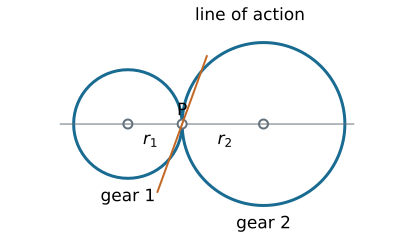
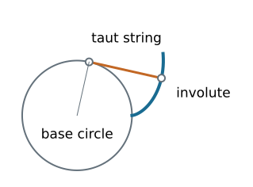
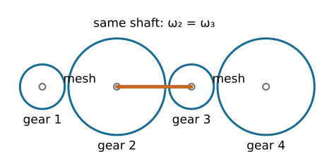
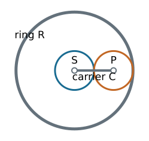

## Chapter overview

1. Rolling contact, conjugate tooth profiles, and involutes
2. Pressure angle, tooth dimensions, backlash, and interference
3. Gear types, belts, and chains
4. Simple, compound, reverted, and planetary trains

::: {.notes}
Source: Satici, compiled Kinematics and Machine Dynamics notes (Fall 2020), Chapter 12, pp. 89–101, following Norton, Design of Machinery. Original diagrams, derivations, and examples extend the source outline; see _planning/remaining-chapters-coverage.md.
:::

## Rolling cylinders

{height=330}

No slip at $P$ requires $r_1\omega_1+r_2\omega_2=0$ for an external pair.

$$\frac{\omega_2}{\omega_1}=-\frac{r_1}{r_2}.$$

::: {.notes}
Source: Satici, compiled Kinematics and Machine Dynamics notes (Fall 2020), Chapter 12, pp. 89–101, following Norton, Design of Machinery. Original diagrams, derivations, and examples extend the source outline; see _planning/remaining-chapters-coverage.md.
:::

## From cylinders to teeth

Smooth cylinders transmit tangential force through friction. Required traction must remain within the available friction limit.

Gear teeth provide positive engagement and preserve shaft phasing.

The original rolling circles become the **pitch circles**. The smaller member is the **pinion**.

Teeth must do more than prevent slip: their geometry determines whether the velocity ratio stays constant.

::: {.notes}
Source: Satici, compiled Kinematics and Machine Dynamics notes (Fall 2020), Chapter 12, pp. 89–101, following Norton, Design of Machinery. Original diagrams, derivations, and examples extend the source outline; see _planning/remaining-chapters-coverage.md.
:::

## Fundamental law of gearing

At every contact point, the common normal to the tooth profiles must pass through a fixed pitch point $P$ on the line of centers.

This gives a constant angular velocity ratio set by $O_1P/O_2P$.

Profiles satisfying this condition are **conjugate**.

An involute tooth profile satisfies the law over its usable contact interval.

::: {.notes}
Source: Satici, compiled Kinematics and Machine Dynamics notes (Fall 2020), Chapter 12, pp. 89–101, following Norton, Design of Machinery. Original diagrams, derivations, and examples extend the source outline; see _planning/remaining-chapters-coverage.md.
:::

## Generating an involute

{height=350}

Unwrap a taut string from a base circle. The end traces an involute; the string is normal to that curve.

::: {.notes}
Source: Satici, compiled Kinematics and Machine Dynamics notes (Fall 2020), Chapter 12, pp. 89–101, following Norton, Design of Machinery. Original diagrams, derivations, and examples extend the source outline; see _planning/remaining-chapters-coverage.md.
:::

## Involute equations

For base radius $r_b$ and unwinding parameter $u\geq0$:

$$x=r_b(\cos u+u\sin u),$$
$$y=r_b(\sin u-u\cos u).$$

The distance to the center is $r=r_b\sqrt{1+u^2}\geq r_b$.

The involute exists outside the base circle. The tooth root below it needs a different connecting profile.

::: {.notes}
Source: Satici, compiled Kinematics and Machine Dynamics notes (Fall 2020), Chapter 12, pp. 89–101, following Norton, Design of Machinery. Original diagrams, derivations, and examples extend the source outline; see _planning/remaining-chapters-coverage.md.
:::

## Pressure angle and line of action

The pressure angle $\phi$ is measured between the common normal and the pitch-circle tangent.

For a spur-gear pair at its reference center distance:

$$r_b=r\cos\phi.$$

Resolve the normal contact force $F_n$:

$$F_t=F_n\cos\phi,\qquad F_r=F_n\sin\phi=F_t\tan\phi.$$

The tangential component supplies torque; the radial component loads the bearings.

::: {.notes}
Source: Satici, compiled Kinematics and Machine Dynamics notes (Fall 2020), Chapter 12, pp. 89–101, following Norton, Design of Machinery. Original diagrams, derivations, and examples extend the source outline; see _planning/remaining-chapters-coverage.md.
:::

## Center distance can change

For an external involute pair with fixed base radii and operating center distance $C$:

$$\boxed{\cos\phi_w=\frac{r_{b1}+r_{b2}}{C}.}$$

Increasing $C$ increases the operating pressure angle $\phi_w$.

The tooth-count velocity ratio stays constant while usable conjugate contact is maintained. Backlash and contact ratio can still change.

::: {.notes}
Source: Satici, compiled Kinematics and Machine Dynamics notes (Fall 2020), Chapter 12, pp. 89–101, following Norton, Design of Machinery. Original diagrams, derivations, and examples extend the source outline; see _planning/remaining-chapters-coverage.md.
:::

## Backlash

Backlash is the tooth-space clearance measured along the pitch circle. Reversing torque moves contact from one flank to the other.

For a small increase $\Delta C$ in center distance,

$$\Delta j_t\approx2\Delta C\tan\phi.$$

The additional angular lost motion at radius $r$ is approximately

$$\Delta\theta\approx\frac{\Delta j_t}{r}$$

in radians. This is a small-change estimate, not the total manufactured backlash.

::: {.notes}
Source: Satici, compiled Kinematics and Machine Dynamics notes (Fall 2020), Chapter 12, pp. 89–101, following Norton, Design of Machinery. Original diagrams, derivations, and examples extend the source outline; see _planning/remaining-chapters-coverage.md.
:::

## Tooth dimensions

- **Addendum:** radial height above the reference pitch circle.
- **Dedendum:** radial depth below it.
- **Root clearance:** gap between a tooth tip and the mating root.
- **Tooth thickness:** arc thickness at the reference pitch circle.
- **Face width:** tooth extent along the gear axis.

Pitch, base, tip, and root circles are different geometric objects.

::: {.notes}
Source: Satici, compiled Kinematics and Machine Dynamics notes (Fall 2020), Chapter 12, pp. 89–101, following Norton, Design of Machinery. Original diagrams, derivations, and examples extend the source outline; see _planning/remaining-chapters-coverage.md.
:::

## Pitch, module, and tooth count

With reference diameter $d$ and tooth count $N$:

$$p_c=\frac{\pi d}{N},\qquad m=\frac{d}{N},\qquad p_c=\pi m.$$

The base pitch is $p_b=p_c\cos\phi$.

Diametral pitch uses $P_d=N/d$ with $d$ in inches:

$$m\ [\mathrm{mm}]=\frac{25.4}{P_d\ [\mathrm{in}^{-1}]}.$$

Mating standard spur gears need compatible module and reference pressure angle.

::: {.notes}
Source: Satici, compiled Kinematics and Machine Dynamics notes (Fall 2020), Chapter 12, pp. 89–101, following Norton, Design of Machinery. Original diagrams, derivations, and examples extend the source outline; see _planning/remaining-chapters-coverage.md.
:::

## Worked example: selecting a pair

Choose $N_1=20$, $N_2=60$, $m=2$ mm, and $\phi=20^\circ$.

$$d_1=40\ \mathrm{mm},\quad d_2=120\ \mathrm{mm},\quad C=80\ \mathrm{mm}.$$

$$p_c=6.283\ \mathrm{mm},\qquad p_b=5.904\ \mathrm{mm}.$$

At $n_1=1200$ rpm, the external gear speed is $n_2=-400$ rpm.

The negative sign denotes opposite rotation when both shaft axes use the same positive direction.

::: {.notes}
Source: Satici, compiled Kinematics and Machine Dynamics notes (Fall 2020), Chapter 12, pp. 89–101, following Norton, Design of Machinery. Original diagrams, derivations, and examples extend the source outline; see _planning/remaining-chapters-coverage.md.
:::

## Power and torque

For ideal steady transmission, input and output power magnitudes agree:

$$|T_{\mathrm{out}}\omega_{\mathrm{out}}|=|T_{\mathrm{in}}\omega_{\mathrm{in}}|.$$

With efficiency $\eta$ in the specified driving direction:

$$\boxed{\frac{|T_{\mathrm{out}}|}{|T_{\mathrm{in}}|}
=\eta\frac{|\omega_{\mathrm{in}}|}{|\omega_{\mathrm{out}}|}.}$$

For the 3:1 reduction with $T_{\mathrm{in}}=10$ N m and assumed $\eta=0.95$, delivered torque is $28.5$ N m.

::: {.notes}
Source: Satici, compiled Kinematics and Machine Dynamics notes (Fall 2020), Chapter 12, pp. 89–101, following Norton, Design of Machinery. Original diagrams, derivations, and examples extend the source outline; see _planning/remaining-chapters-coverage.md.
:::

## Interference and undercutting

**Interference:** a mating tip attempts contact outside the intended conjugate portion of the other tooth.

**Undercutting:** the generating cutter removes root material, which can weaken the tooth and shorten useful contact.

Small tooth counts are particularly susceptible. Remedies include more teeth, suitable profile shift, or a different tooth geometry.

A root below the base circle alone does not prove that the assembled gears interfere; inspect the actual contact path.

::: {.notes}
Source: Satici, compiled Kinematics and Machine Dynamics notes (Fall 2020), Chapter 12, pp. 89–101, following Norton, Design of Machinery. Original diagrams, derivations, and examples extend the source outline; see _planning/remaining-chapters-coverage.md.
:::

## Contact ratio

For a standard external spur pair, with tip radii $r_{a1},r_{a2}$:

$$\epsilon_\alpha=
\frac{\sqrt{r_{a1}^2-r_{b1}^2}+\sqrt{r_{a2}^2-r_{b2}^2}-C\sin\phi_w}{p_b}.$$

The numerator is the usable path of contact under the assumed noninterfering involute geometry.

A transverse contact ratio greater than one provides overlap between successive tooth pairs. Also check interference and manufacturing limits.

::: {.notes}
Source: Satici, compiled Kinematics and Machine Dynamics notes (Fall 2020), Chapter 12, pp. 89–101, following Norton, Design of Machinery. Original diagrams, derivations, and examples extend the source outline; see _planning/remaining-chapters-coverage.md.
:::

## Spur and helical gears

| Type | Geometry and consequences |
|---|---|
| Spur | Straight teeth parallel to axis; parallel shafts; no ideal axial tooth force |
| Parallel helical | Gradual engagement; opposite hands with equal helix-angle magnitudes; axial thrust |
| Crossed helical | Nonparallel, nonintersecting shafts; substantial sliding; localized contact |

Helical gearing requires compatible normal tooth geometry and suitable thrust support.

::: {.notes}
Source: Satici, compiled Kinematics and Machine Dynamics notes (Fall 2020), Chapter 12, pp. 89–101, following Norton, Design of Machinery. Original diagrams, derivations, and examples extend the source outline; see _planning/remaining-chapters-coverage.md.
:::

## Worms and worm wheels

A worm acts like a screw meshing with a worm wheel.

If the worm has $z_w$ starts and the wheel has $N$ teeth,

$$\left|\frac{\omega_{\mathrm{wheel}}}{\omega_{\mathrm{worm}}}\right|=\frac{z_w}{N}.$$

A two-start worm and 40-tooth wheel give a 20:1 reduction.

High sliding affects efficiency, heat, and lubrication. **Not every worm drive is self-locking**; backdrivability depends on lead angle and friction.

::: {.notes}
Source: Satici, compiled Kinematics and Machine Dynamics notes (Fall 2020), Chapter 12, pp. 89–101, following Norton, Design of Machinery. Original diagrams, derivations, and examples extend the source outline; see _planning/remaining-chapters-coverage.md.
:::

## Bevel and hypoid gears

**Bevel gears:** intersecting shaft axes, with tooth geometry on pitch cones.

**Hypoid gears:** offset, nonintersecting axes; the offset introduces additional sliding.

Choose the gear family from the required shaft geometry, ratio, speed, load, and packaging. Tooth-count ratios do not replace stress or thermal design.

::: {.notes}
Source: Satici, compiled Kinematics and Machine Dynamics notes (Fall 2020), Chapter 12, pp. 89–101, following Norton, Design of Machinery. Original diagrams, derivations, and examples extend the source outline; see _planning/remaining-chapters-coverage.md.
:::

## Belts and chains

| Drive | Main kinematic consideration |
|---|---|
| Smooth belt | Friction transmission; creep or slip can alter phasing |
| Timing belt | Teeth maintain nominal phase; compliance remains |
| Chain | Positive engagement; polygonal action produces speed variation |

An open belt or ordinary chain drive rotates shafts in the same sense. A crossed belt reverses the sense.

Belt curvature changes and chain engagement can excite vibration.

::: {.notes}
Source: Satici, compiled Kinematics and Machine Dynamics notes (Fall 2020), Chapter 12, pp. 89–101, following Norton, Design of Machinery. Original diagrams, derivations, and examples extend the source outline; see _planning/remaining-chapters-coverage.md.
:::

## Simple gear trains

Only one gear is fixed to each shaft. For three external gears:

$$\frac{\omega_3}{\omega_1}
=\left(-\frac{N_1}{N_2}\right)\left(-\frac{N_2}{N_3}\right)
=\frac{N_1}{N_3}.$$

The intermediate **idler** changes spacing and the rotation sequence; its tooth count cancels from the overall ratio.

Count external meshes to determine the final sign.

::: {.notes}
Source: Satici, compiled Kinematics and Machine Dynamics notes (Fall 2020), Chapter 12, pp. 89–101, following Norton, Design of Machinery. Original diagrams, derivations, and examples extend the source outline; see _planning/remaining-chapters-coverage.md.
:::

## Compound gear trains

{height=300}

Gears 2 and 3 are fixed to the same shaft, so $\omega_2=\omega_3$.

$$\boxed{\frac{\omega_4}{\omega_1}=\frac{N_1N_3}{N_2N_4}.}$$

::: {.notes}
Source: Satici, compiled Kinematics and Machine Dynamics notes (Fall 2020), Chapter 12, pp. 89–101, following Norton, Design of Machinery. Original diagrams, derivations, and examples extend the source outline; see _planning/remaining-chapters-coverage.md.
:::

## Worked example: a compound reduction

Choose $(N_1,N_2,N_3,N_4)=(20,60,24,72)$.

$$\frac{\omega_4}{\omega_1}=\frac{20}{60}\frac{24}{72}=\frac19.$$

At 1800 rpm input, output is 200 rpm in the same sense.

With $T_1=5$ N m and each stage assumed 96% efficient,

$$|T_4|=(0.96)^2(9)(5)=41.47\ \mathrm{N\,m}.$$

::: {.notes}
Source: Satici, compiled Kinematics and Machine Dynamics notes (Fall 2020), Chapter 12, pp. 89–101, following Norton, Design of Machinery. Original diagrams, derivations, and examples extend the source outline; see _planning/remaining-chapters-coverage.md.
:::

## Reverted trains

In a reverted compound train, input and output shafts are coaxial.

The two external mesh center distances must match:

$$m_{12}(N_1+N_2)=m_{34}(N_3+N_4).$$

For equal modules, tooth-count sums must agree.

Example: $(20,60,20,60)$ gives equal sums of 80 and a 9:1 reduction. Check physical axial placement and clearances as well.

::: {.notes}
Source: Satici, compiled Kinematics and Machine Dynamics notes (Fall 2020), Chapter 12, pp. 89–101, following Norton, Design of Machinery. Original diagrams, derivations, and examples extend the source outline; see _planning/remaining-chapters-coverage.md.
:::

## Planetary train: three accessible members

{height=330}

The sun $S$, ring $R$, and carrier $C$ have concentric accessible shafts. The planet center moves with the carrier.

::: {.notes}
Source: Satici, compiled Kinematics and Machine Dynamics notes (Fall 2020), Chapter 12, pp. 89–101, following Norton, Design of Machinery. Original diagrams, derivations, and examples extend the source outline; see _planning/remaining-chapters-coverage.md.
:::

## Tooth-count geometry

For a simple planetary set of common module:

$$r_R=r_S+2r_P,\qquad\boxed{N_R=N_S+2N_P.}$$

Example: $N_S=30$, $N_P=30$, and $N_R=90$.

One planet is enough for the kinematic relation. Multiple planets share load but add spacing, phasing, and manufacturing requirements.

::: {.notes}
Source: Satici, compiled Kinematics and Machine Dynamics notes (Fall 2020), Chapter 12, pp. 89–101, following Norton, Design of Machinery. Original diagrams, derivations, and examples extend the source outline; see _planning/remaining-chapters-coverage.md.
:::

## Freeze the carrier mathematically

Observe the train in a frame rotating at $\omega_C$.

Sun-to-planet external mesh:

$$N_S(\omega_S-\omega_C)+N_P(\omega_P-\omega_C)=0.$$

Planet-to-ring internal mesh:

$$N_R(\omega_R-\omega_C)-N_P(\omega_P-\omega_C)=0.$$

Eliminate the planet speed to relate the three accessible members.

::: {.notes}
Source: Satici, compiled Kinematics and Machine Dynamics notes (Fall 2020), Chapter 12, pp. 89–101, following Norton, Design of Machinery. Original diagrams, derivations, and examples extend the source outline; see _planning/remaining-chapters-coverage.md.
:::

## Willis relation

$$\boxed{N_S(\omega_S-\omega_C)+N_R(\omega_R-\omega_C)=0.}$$

Equivalently, when the denominator is nonzero,

$$\frac{\omega_S-\omega_C}{\omega_R-\omega_C}=-\frac{N_R}{N_S}.$$

There is one relation among three speeds: **two independent inputs** determine the third. Holding one member fixes one of those inputs to zero.

::: {.notes}
Source: Satici, compiled Kinematics and Machine Dynamics notes (Fall 2020), Chapter 12, pp. 89–101, following Norton, Design of Machinery. Original diagrams, derivations, and examples extend the source outline; see _planning/remaining-chapters-coverage.md.
:::

## Worked example: ring held fixed

Use $N_S=30$, $N_R=90$, $\omega_R=0$, and $n_S=1200$ rpm.

$$30(1200-n_C)+90(0-n_C)=0.$$

$$\boxed{n_C=300\ \mathrm{rpm}.}$$

The reduction is $1+N_R/N_S=4$; carrier and sun rotate in the same direction.

The fixed ring transmits reaction torque even though it transmits zero power.

::: {.notes}
Source: Satici, compiled Kinematics and Machine Dynamics notes (Fall 2020), Chapter 12, pp. 89–101, following Norton, Design of Machinery. Original diagrams, derivations, and examples extend the source outline; see _planning/remaining-chapters-coverage.md.
:::

## Other planetary operating modes

For the same 30/90 tooth counts:

- Carrier fixed: $\omega_R=-\omega_S/3$.
- Sun fixed: $\omega_C=3\omega_R/4$.
- Sun and ring locked together: all members rotate together.

Ideal steady torque and power balances require

$$T_S+T_R+T_C=0,\qquad
T_S\omega_S+T_R\omega_R+T_C\omega_C=0,$$

using signed external torques applied to the assembly.

::: {.notes}
Source: Satici, compiled Kinematics and Machine Dynamics notes (Fall 2020), Chapter 12, pp. 89–101, following Norton, Design of Machinery. Original diagrams, derivations, and examples extend the source outline; see _planning/remaining-chapters-coverage.md.
:::

## Design checks

1. Verify geometry and compatible tooth specifications.
2. Derive the signed speed relation from every mesh.
3. Identify fixed members and shared shafts.
4. Apply power balance with stated efficiency assumptions.
5. Check tooth strength, interference, backlash, bearings, and lubrication separately.

::: {.notes}
Source: Satici, compiled Kinematics and Machine Dynamics notes (Fall 2020), Chapter 12, pp. 89–101, following Norton, Design of Machinery. Original diagrams, derivations, and examples extend the source outline; see _planning/remaining-chapters-coverage.md.
:::

## References and next chapter

Satici, *Kinematics and Machine Dynamics*, Chapter 12, §§12.1–12.8, pp. 89–101, following Norton, *Design of Machinery*.

Supplemental dimension reference: [KHK, Calculation of Gear Dimensions](https://khkgears.net/gear-knowledge/gear-technical-reference/calculation-gear-dimensions/).

**Next:** [Chapter 13: Cams](chapter13.html).

::: {.notes}
Source: Satici, compiled Kinematics and Machine Dynamics notes (Fall 2020), Chapter 12, pp. 89–101, following Norton, Design of Machinery. Original diagrams, derivations, and examples extend the source outline; see _planning/remaining-chapters-coverage.md.
:::

