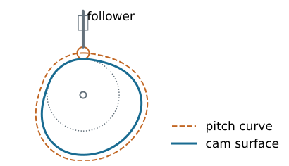
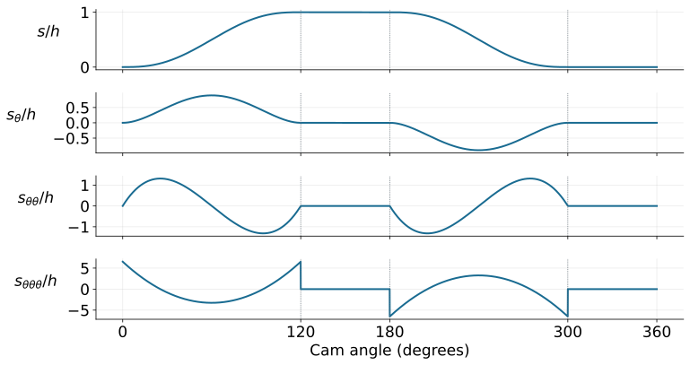

## Chapter overview

- Specify follower motion over a complete cam revolution.
- Construct displacement, velocity, acceleration, and jerk diagrams.
- Derive polynomial motion laws for dwell transitions.
- Size a radial cam using pressure angle and curvature.

::: {.notes}
Source: Satici, compiled Kinematics and Machine Dynamics notes (Fall 2020), Chapter 13, pp. 103–107, following Norton, Design of Machinery. Original diagrams, derivations, and examples extend the source outline; see _planning/remaining-chapters-coverage.md.
:::

## A cam prescribes a motion

{height=340}

The cam profile imposes a follower displacement $s(\theta)$ through contact. Geometry prescribes motion only while contact and the assumed constraints are maintained.

::: {.notes}
Source: Satici, compiled Kinematics and Machine Dynamics notes (Fall 2020), Chapter 13, pp. 103–107, following Norton, Design of Machinery. Original diagrams, derivations, and examples extend the source outline; see _planning/remaining-chapters-coverage.md.
:::

## Cam and follower terminology

| Classification | Examples |
|---|---|
| Follower motion | Translation; oscillation |
| Cam geometry | Radial disk; cylindrical; spatial |
| Contact shape | Roller; flat-faced; curved sliding follower |
| Closure | Force-closed; form-closed |

A force-closed follower uses a spring, gravity, or another applied force to maintain contact. A groove or conjugate pair can provide form closure.

::: {.notes}
Source: Satici, compiled Kinematics and Machine Dynamics notes (Fall 2020), Chapter 13, pp. 103–107, following Norton, Design of Machinery. Original diagrams, derivations, and examples extend the source outline; see _planning/remaining-chapters-coverage.md.
:::

## What must the motion accomplish?

**Critical extreme position (CEP):** the follower must reach specified endpoints; the path between them can be designed.

**Critical path motion (CPM):** the displacement history itself must follow a prescribed function.

Common programs are rise-fall (RF), rise-fall-dwell (RFD), and rise-dwell-fall-dwell (RDFD).

A dwell is an interval of constant follower displacement.

::: {.notes}
Source: Satici, compiled Kinematics and Machine Dynamics notes (Fall 2020), Chapter 13, pp. 103–107, following Norton, Design of Machinery. Original diagrams, derivations, and examples extend the source outline; see _planning/remaining-chapters-coverage.md.
:::

## Start with a timing diagram

Example double-dwell program, one revolution per machine cycle:

| Cam angle | Event | Displacement |
|---|---|---|
| $0$–$120^\circ$ | Rise | $0\to h$ |
| $120$–$180^\circ$ | High dwell | $h$ |
| $180$–$300^\circ$ | Return | $h\to0$ |
| $300$–$360^\circ$ | Low dwell | $0$ |

The intervals must add to $360^\circ$, and the end of the cycle must join its beginning smoothly.

::: {.notes}
Source: Satici, compiled Kinematics and Machine Dynamics notes (Fall 2020), Chapter 13, pp. 103–107, following Norton, Design of Machinery. Original diagrams, derivations, and examples extend the source outline; see _planning/remaining-chapters-coverage.md.
:::

## S–V–A–J: angle versus time

Let primes denote derivatives with respect to **cam angle in radians**.

For constant angular speed $\omega$:

$$v=\omega s',\qquad a=\omega^2s'',\qquad j=\omega^3s'''.$$

A plot of $s'(\theta)$ is not yet a physical velocity plot. The speed scale matters: doubling rpm multiplies acceleration by four and jerk by eight.

::: {.notes}
Source: Satici, compiled Kinematics and Machine Dynamics notes (Fall 2020), Chapter 13, pp. 103–107, following Norton, Design of Machinery. Original diagrams, derivations, and examples extend the source outline; see _planning/remaining-chapters-coverage.md.
:::

## If the cam speed varies

The chain rule gives

$$v=s'\omega,$$
$$a=s''\omega^2+s'\alpha,$$
$$j=s'''\omega^3+3s''\omega\alpha+s'\dot\alpha.$$

Here $\alpha=\dot\omega$. The constant-speed formulas are a special case, not a general identity.

::: {.notes}
Source: Satici, compiled Kinematics and Machine Dynamics notes (Fall 2020), Chapter 13, pp. 103–107, following Norton, Design of Machinery. Original diagrams, derivations, and examples extend the source outline; see _planning/remaining-chapters-coverage.md.
:::

## Continuity at every join

For a cam intended to run beyond very low speeds, use continuous displacement, velocity, and acceleration over the complete cycle.

An acceleration jump creates an impulsive jerk in the ideal model and excites vibration in the real mechanism.

A finite jump in jerk can be acceptable in this kinematic criterion; continuous jerk imposes a stronger smoothness requirement.

These conditions must hold at the $360^\circ/0^\circ$ join as well.

::: {.notes}
Source: Satici, compiled Kinematics and Machine Dynamics notes (Fall 2020), Chapter 13, pp. 103–107, following Norton, Design of Machinery. Original diagrams, derivations, and examples extend the source outline; see _planning/remaining-chapters-coverage.md.
:::

## Why a straight ramp is insufficient

A linear rise joined to a dwell has an abrupt velocity change, hence impulsive acceleration.

Simple harmonic rise has zero endpoint velocity, but its nonzero endpoint acceleration does not match a dwell.

The motion law must be chosen for its **boundary conditions**, not just for a visually smooth displacement plot.

::: {.notes}
Source: Satici, compiled Kinematics and Machine Dynamics notes (Fall 2020), Chapter 13, pp. 103–107, following Norton, Design of Machinery. Original diagrams, derivations, and examples extend the source outline; see _planning/remaining-chapters-coverage.md.
:::

## Normalize the rise interval

For a rise beginning at $\theta_0$ and spanning $\beta$ radians:

$$u=\frac{\theta-\theta_0}{\beta},\qquad0\leq u\leq1,$$
$$s=h f(u).$$

At constant cam speed:

$$v=\frac{h\omega}{\beta}f',\quad
 a=\frac{h\omega^2}{\beta^2}f'',\quad
 j=\frac{h\omega^3}{\beta^3}f'''.$$

Derivatives of $f$ are with respect to $u$.

::: {.notes}
Source: Satici, compiled Kinematics and Machine Dynamics notes (Fall 2020), Chapter 13, pp. 103–107, following Norton, Design of Machinery. Original diagrams, derivations, and examples extend the source outline; see _planning/remaining-chapters-coverage.md.
:::

## Double-dwell boundary conditions

A rise connecting two dwells must satisfy

$$f(0)=0,\quad f(1)=1,$$
$$f'(0)=f'(1)=0,$$
$$f''(0)=f''(1)=0.$$

Six independent conditions determine six coefficients of a polynomial of degree at most five.

::: {.notes}
Source: Satici, compiled Kinematics and Machine Dynamics notes (Fall 2020), Chapter 13, pp. 103–107, following Norton, Design of Machinery. Original diagrams, derivations, and examples extend the source outline; see _planning/remaining-chapters-coverage.md.
:::

## Derive the 3–4–5 polynomial

Let $f(u)=c_0+c_1u+\cdots+c_5u^5$.

The conditions at zero give $c_0=c_1=c_2=0$.

At $u=1$:

$$\begin{bmatrix}1&1&1\\3&4&5\\6&12&20\end{bmatrix}
\begin{bmatrix}c_3\\c_4\\c_5\end{bmatrix}
=\begin{bmatrix}1\\0\\0\end{bmatrix}.$$

Thus $\boxed{f(u)=10u^3-15u^4+6u^5}$.

::: {.notes}
Source: Satici, compiled Kinematics and Machine Dynamics notes (Fall 2020), Chapter 13, pp. 103–107, following Norton, Design of Machinery. Original diagrams, derivations, and examples extend the source outline; see _planning/remaining-chapters-coverage.md.
:::

## Differentiate the motion law

$$f'=30u^2-60u^3+30u^4,$$
$$f''=60u-180u^2+120u^3,$$
$$f'''=60-360u+360u^2.$$

Displacement, velocity, and acceleration match both dwells.

Endpoint jerk is finite but nonzero: $f'''(0)=f'''(1)=60$. It jumps to zero on the dwells.

::: {.notes}
Source: Satici, compiled Kinematics and Machine Dynamics notes (Fall 2020), Chapter 13, pp. 103–107, following Norton, Design of Machinery. Original diagrams, derivations, and examples extend the source outline; see _planning/remaining-chapters-coverage.md.
:::

## The complete double-dwell program

{height=360}

Rise and return use the 3–4–5 polynomial; derivatives are with respect to angle. Jerk has finite jumps at the dwell boundaries.

::: {.notes}
Source: Satici, compiled Kinematics and Machine Dynamics notes (Fall 2020), Chapter 13, pp. 103–107, following Norton, Design of Machinery. Original diagrams, derivations, and examples extend the source outline; see _planning/remaining-chapters-coverage.md.
:::

## Worked example: rise duration and velocity

Use $h=20$ mm, $\beta=120^\circ=2\pi/3$ rad, and 300 rpm.

$$\omega=10\pi\ \mathrm{rad/s},\qquad T_r=\frac{\beta}{\omega}=\frac1{15}\ \mathrm{s}.$$

The normalized peak speed is $\max f'=15/8$ at $u=1/2$:

$$\boxed{v_{\max}=\frac{0.020}{1/15}\frac{15}{8}
=0.5625\ \mathrm{m/s}.}$$

::: {.notes}
Source: Satici, compiled Kinematics and Machine Dynamics notes (Fall 2020), Chapter 13, pp. 103–107, following Norton, Design of Machinery. Original diagrams, derivations, and examples extend the source outline; see _planning/remaining-chapters-coverage.md.
:::

## Worked example: acceleration and jerk

For the 3–4–5 polynomial:

$$\max|f''|=\frac{10\sqrt3}{3},\qquad \max|f'''|=60.$$

With $h=0.020$ m and $T_r=1/15$ s:

$$\boxed{|a|_{\max}=\frac{h}{T_r^2}\frac{10\sqrt3}{3}
=25.98\ \mathrm{m/s^2},}$$
$$\boxed{|j|_{\max}=\frac{60h}{T_r^3}=4050\ \mathrm{m/s^3}.}$$

The acceleration peaks occur at $u=(3\mp\sqrt3)/6$.

::: {.notes}
Source: Satici, compiled Kinematics and Machine Dynamics notes (Fall 2020), Chapter 13, pp. 103–107, following Norton, Design of Machinery. Original diagrams, derivations, and examples extend the source outline; see _planning/remaining-chapters-coverage.md.
:::

## Return and dwell segments

For a return over $\beta_f$ radians beginning at $\theta_f$, let $u_f=(\theta-\theta_f)/\beta_f$.

$$s=h[1-f(u_f)].$$

The displacement decreases; its derivatives acquire a minus sign and the appropriate powers of $1/\beta_f$.

On the high dwell, $s=h$; on the low dwell, $s=0$. All time derivatives vanish during either dwell.

::: {.notes}
Source: Satici, compiled Kinematics and Machine Dynamics notes (Fall 2020), Chapter 13, pp. 103–107, following Norton, Design of Machinery. Original diagrams, derivations, and examples extend the source outline; see _planning/remaining-chapters-coverage.md.
:::

## Continuous-jerk alternative: 4–5–6–7

Add the conditions $f'''(0)=f'''(1)=0$ to the six dwell conditions.

The resulting seventh-degree polynomial is

$$\boxed{f(u)=35u^4-84u^5+70u^6-20u^7.}$$

Its jerk matches the dwells continuously. This improves boundary smoothness but does not automatically minimize peak velocity, acceleration, or cam size.

::: {.notes}
Source: Satici, compiled Kinematics and Machine Dynamics notes (Fall 2020), Chapter 13, pp. 103–107, following Norton, Design of Machinery. Original diagrams, derivations, and examples extend the source outline; see _planning/remaining-chapters-coverage.md.
:::

## Another option: cycloidal rise

$$f(u)=u-\frac{\sin(2\pi u)}{2\pi},$$
$$f'=1-\cos(2\pi u),\quad f''=2\pi\sin(2\pi u).$$

Displacement, velocity, and acceleration satisfy the double-dwell boundary conditions. Jerk remains finite but jumps at the dwell joins.

Compare candidate laws using peak derivatives, pressure angle, curvature, and the actual load requirements.

::: {.notes}
Source: Satici, compiled Kinematics and Machine Dynamics notes (Fall 2020), Chapter 13, pp. 103–107, following Norton, Design of Machinery. Original diagrams, derivations, and examples extend the source outline; see _planning/remaining-chapters-coverage.md.
:::

## Single-dwell programs

For rise-fall-dwell motion, the follower reverses at the top without spending an interval there.

At the rise/fall join, enforce the same displacement, zero velocity at a smooth maximum, and matching acceleration.

The common acceleration need not be zero. Separate polynomial segments can meet prescribed join conditions.

Independent boundary conditions must determine a nonsingular coefficient system.

::: {.notes}
Source: Satici, compiled Kinematics and Machine Dynamics notes (Fall 2020), Chapter 13, pp. 103–107, following Norton, Design of Machinery. Original diagrams, derivations, and examples extend the source outline; see _planning/remaining-chapters-coverage.md.
:::

## A worked single-dwell construction

For one complete rise and fall over $0\leq u\leq1$, use

$$\boxed{\frac{s}{h}=64u^3(1-u)^3.}$$

The displacement is zero at both ends and equals $h$ at $u=1/2$.

Endpoint velocity and acceleration are zero, so it joins a low dwell. At the top, $s_u=0$ and $s_{uu}=-24h$: a smooth reversal with nonzero downward acceleration.

::: {.notes}
Source: Satici, compiled Kinematics and Machine Dynamics notes (Fall 2020), Chapter 13, pp. 103–107, following Norton, Design of Machinery. Original diagrams, derivations, and examples extend the source outline; see _planning/remaining-chapters-coverage.md.
:::

## Base circle, prime circle, and pitch curve

The **base circle** is the largest circle centered on the cam axis that fits inside and is tangent to the cam surface.

For a roller follower, the **pitch curve** is the roller-center locus in the cam-fixed frame.

The **prime circle** is the smallest centered radius attained by that pitch curve.

For an in-line radial roller follower at its low dwell, $R_p=R_b+r_r$, where $r_r$ is roller radius.

::: {.notes}
Source: Satici, compiled Kinematics and Machine Dynamics notes (Fall 2020), Chapter 13, pp. 103–107, following Norton, Design of Machinery. Original diagrams, derivations, and examples extend the source outline; see _planning/remaining-chapters-coverage.md.
:::

## From motion law to pitch curve

For an in-line translating roller follower, define $r(\theta)=R_p+s(\theta)$.

One cam-fixed coordinate convention gives

$$x_p=r\sin\theta,\qquad y_p=r\cos\theta.$$

Generate the physical cam profile by offsetting the pitch curve inward along its normal by the roller radius.

Simply subtracting the roller radius radially gives the correct result on a circular dwell, but generally not on a rise or return.

::: {.notes}
Source: Satici, compiled Kinematics and Machine Dynamics notes (Fall 2020), Chapter 13, pp. 103–107, following Norton, Design of Machinery. Original diagrams, derivations, and examples extend the source outline; see _planning/remaining-chapters-coverage.md.
:::

## Pressure angle sizes the cam

For this in-line translating roller geometry:

$$\boxed{\tan\phi=\frac{s'}{R_p+s}.}$$

A larger $R_p$ reduces the pressure angle for the same motion law. A shorter rise interval increases $|s'|$ and tends to increase pressure angle.

Given an allowed angle $\phi_{\max}$, check the entire cycle:

$$R_p\geq\max_\theta\left(\frac{|s'|}{\tan\phi_{\max}}-s\right).$$

::: {.notes}
Source: Satici, compiled Kinematics and Machine Dynamics notes (Fall 2020), Chapter 13, pp. 103–107, following Norton, Design of Machinery. Original diagrams, derivations, and examples extend the source outline; see _planning/remaining-chapters-coverage.md.
:::

## Worked example: a conservative size bound

For the 20 mm, $120^\circ$ 3–4–5 rise,

$$\max|s'|=\frac{h}{\beta}\frac{15}{8}=17.90\ \mathrm{mm/rad}.$$

Choose $\phi_{\max}=30^\circ$ as a design assumption.

Because $s\geq0$, the sufficient bound

$$R_p\geq\frac{17.90}{\tan30^\circ}=31.02\ \mathrm{mm}$$

is conservative. Select $R_p=35$ mm, then check curvature before accepting the design.

::: {.notes}
Source: Satici, compiled Kinematics and Machine Dynamics notes (Fall 2020), Chapter 13, pp. 103–107, following Norton, Design of Machinery. Original diagrams, derivations, and examples extend the source outline; see _planning/remaining-chapters-coverage.md.
:::

## Curvature of the pitch curve

For a polar pitch curve $r=R_p+s$, the signed curvature radius is

$$\boxed{\rho_p=
\frac{(r^2+r'^2)^{3/2}}{r^2+2r'^2-rr''}.}$$

At convex regions, require $\rho_p>r_r$ for a regular inward roller offset. Equality produces a cusp; too large a roller can undercut the intended profile.

Inflections and concave regions require their own signed-curvature and interference checks.

::: {.notes}
Source: Satici, compiled Kinematics and Machine Dynamics notes (Fall 2020), Chapter 13, pp. 103–107, following Norton, Design of Machinery. Original diagrams, derivations, and examples extend the source outline; see _planning/remaining-chapters-coverage.md.
:::

## Worked example: roller and curvature

Use the complete double-dwell program, $R_p=35$ mm, and $r_r=5$ mm.

Sampling the smooth segments gives approximately:

- peak pressure-angle magnitude $22.1^\circ$;
- minimum positive pitch-curve radius $35.0$ mm;
- base-circle radius $R_b=30$ mm.

The sampled convex curvature exceeds the roller radius. Refine extrema and check the full manufactured profile before final design.

::: {.notes}
Source: Satici, compiled Kinematics and Machine Dynamics notes (Fall 2020), Chapter 13, pp. 103–107, following Norton, Design of Machinery. Original diagrams, derivations, and examples extend the source outline; see _planning/remaining-chapters-coverage.md.
:::

## Contact forces and manufacturing

A spring-loaded follower needs sufficient preload to maintain compressive contact throughout the motion, accounting for follower inertia and external loads.

A form-closed arrangement avoids separation in the ideal geometry but can experience impact across clearance.

Check material stresses, roller bearings, lubrication, tolerances, cutter access, and surface finish. A smooth displacement law alone does not establish dynamic suitability.

::: {.notes}
Source: Satici, compiled Kinematics and Machine Dynamics notes (Fall 2020), Chapter 13, pp. 103–107, following Norton, Design of Machinery. Original diagrams, derivations, and examples extend the source outline; see _planning/remaining-chapters-coverage.md.
:::

## References and course completion

Satici, *Kinematics and Machine Dynamics*, Chapter 13, §§13.1–13.4, pp. 103–107, following Norton, *Design of Machinery*.

Polynomial solutions, plots, numerical examples, and radial roller geometry derivations are instructional additions to the compiled outline.

[Return to the complete course](index.html).

::: {.notes}
Source: Satici, compiled Kinematics and Machine Dynamics notes (Fall 2020), Chapter 13, pp. 103–107, following Norton, Design of Machinery. Original diagrams, derivations, and examples extend the source outline; see _planning/remaining-chapters-coverage.md.
:::

