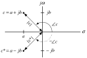
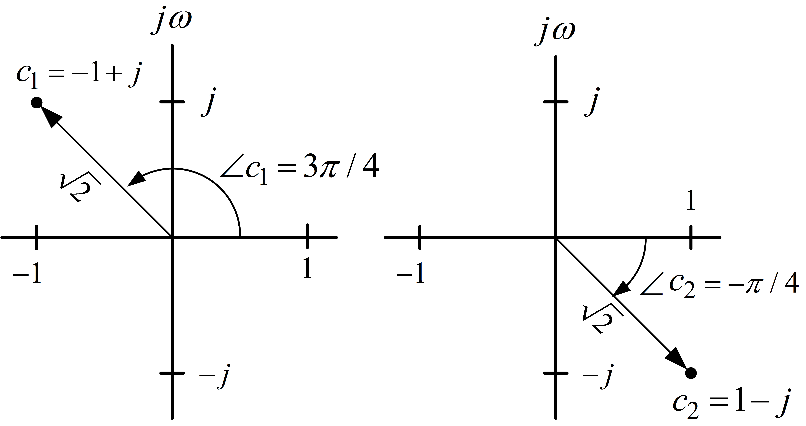
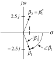
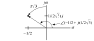
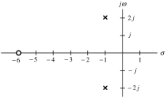
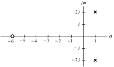
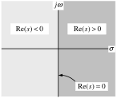

---

::: {.center}
### Chapter 2 Laplace Transforms
:::

- Laplace Transform Definition and Examples

- Laplace Transform Properties

- Partial Fraction Expansion

- Poles and Zeros

- Poles and Partial Fractions

---

::: {.center}
Definition and Examples
:::

**Definition** *Laplace Transform*

Let $f(t)$ for $t\geq0$ denote a time function. Define the Laplace transform $\mathcal{L}
\{f\}$ of $f$ as $$\mathcal{L}
\{f(t)\}\triangleq\int_{0}^{\infty}e^{-st}f(t)dt$$ where $s=\sigma+j\omega\in
\mathbb{C}$ is a complex number.

**Notation**  The symbol "$\triangleq$" means *by definition*.

We also use $F(s)$ to denote the Laplace transform, i.e., $F(s)\triangleq
\int_{0}^{\infty}e^{-st}f(t)dt.$

**Remark** The integral does *not* exist for all $s=\sigma+j\omega$ $\in
\mathbb{C}
.$

The *region of convergence* (ROC) is the set of values of $s$ for which the integral exists.

This is computed in the examples below.

---

**Example:** *Unit Step Function* $u_{s}(t)$

The unit step function $u_{s}(t)$ is defined as $$u_{s}(t)\triangleq\left\{
\begin{array}{ll}
1, & t\geq0,\\
0, & t<0.
\end{array}
\right.$$ Its Laplace transform is then $$\begin{aligned}
\mathcal{L}
\{u_{s}(t)\}=\int_{0}^{\infty}e^{-st}u_{s}(t)dt=\int_{0}^{\infty}
e^{-st}dt=\left.  \frac{e^{-st}}{-s}\right\vert _{t=0}^{\infty}  &
=\lim_{t\rightarrow\infty}\frac{e^{-st}}{-s}-\left.  \frac{e^{-st}}
{-s}\right\vert _{t=0}\\
& =\lim_{t\rightarrow\infty}\frac{e^{-st}}{-s}+\frac{1}{s}.
\end{aligned}$$

Now $\lim_{t\rightarrow\infty}e^{-st}=\lim_{t\rightarrow\infty}e^{-(\sigma
+j\omega)t}=\lim_{t\rightarrow\infty}e^{-\sigma t}e^{-j\omega t}.$

Euler's Formula: $e^{j\omega t}=\cos(\omega t)+j\sin(\omega t)$

We then have $$\begin{aligned}
\lim_{t\rightarrow\infty}e^{-st}=\lim_{t\rightarrow\infty}e^{-\sigma
t}e^{-j\omega t}  & =\lim_{t\rightarrow\infty}e^{-\sigma t}\!\left(
\cos(\omega t)-j\sin(\omega t)\right) \\
& =\left\{
\begin{array}{cl}
0, & \sigma>0\\
\text{does not exist,} & \sigma\leq0.
\end{array}
\right.
\end{aligned}$$ Thus $$\mathcal{L}
\{u_{s}(t)\}=\frac{1}{s}\text{ \ for }\sigma=\operatorname{Re}\{s\}>0.$$

---

**Example:** $f(t)=e^{2t}u_{s}(t)$

$$\begin{aligned}
\mathcal{L}
\{e^{2t}u_{s}(t)\}=\int_{0}^{\infty}e^{-st}e^{2t}dt  & =\int_{0}^{\infty
}e^{-(s-2)t}dt\\
& =\left.  \frac{e^{-(s-2)t}}{-(s-2)}\right\vert _{t=0}^{\infty}\\
& =\lim_{t\rightarrow\infty}\frac{e^{-(s-2)t}}{-(s-2)}-\left.  \frac
{e^{-(s-2)t}}{-(s-2)}\right\vert _{t=0}\\
& =\lim_{t\rightarrow\infty}\frac{e^{-(s-2)t}}{-(s-2)}+\frac{1}{s-2}.
\end{aligned}$$ $$\begin{aligned}
\text{As \ }\lim_{t\rightarrow\infty}e^{-(s-2)t}=\lim_{t\rightarrow\infty
}e^{-(\sigma-2+j\omega)t}  & =\lim_{t\rightarrow\infty}e^{-(\sigma
-2)t}e^{-j\omega t}\\
& =\lim_{t\rightarrow\infty}e^{-(\sigma-2)t}(\cos(-\omega t)+j\sin(-\omega
t))\\
& =\left\{
\begin{array}{cl}
0, & \sigma>2\\
\text{does not exist,} & \sigma\leq2
\end{array}
\right.
\end{aligned}$$ we have $$\mathcal{L}
\{e^{2t}u_{s}(t)\}=\frac{1}{s-2}\text{ \ for\ }\sigma=\operatorname{Re}
\{s\}>2.$$

---

**Example:** $f(t)=e^{(\sigma_{0}+j\omega_{0})t}u_{s}(t)=e^{\sigma
_{0}t}e^{j\omega_{0}t}=e^{\sigma_{0}t}(\cos(\omega_{0}t)+j\sin(\omega
_{0}t))u_{s}(t)$

. $$\begin{aligned}
\!\!\!\!
\mathcal{L}
\{e^{(\sigma_{0}+j\omega_{0})t}u_{s}(t)\!=\!\int_{0}^{\infty}e^{-st}
e^{(\sigma_{0}+j\omega_{0})t}dt\!\!\!\!  & =\!\!\!\!\!\int_{0}^{\infty
}e^{-[s-(\sigma_{0}+j\omega_{0})]t}dt\\
\!\!\!  & =\!\!\!\!\!\left.  \frac{e^{-[s-(\sigma_{0}+j\omega_{0})]t}
}{-[s-(\sigma_{0}+j\omega_{0})]}\right\vert _{0}^{\infty}\\
\!\!\!  & =\!\!\!\!\!\lim_{t\rightarrow\infty}\frac{e^{-[s-(\sigma_{0}
+j\omega_{0})]t}}{-[s-(\sigma_{0}+j\omega_{0})]}-\left.  \frac{e^{-[s-(\sigma
_{0}+j\omega_{0})]t}}{-[s-(\sigma_{0}+j\omega_{0})]}\right\vert _{0}\\
\!\!\!  & =\!\!\!\!\!\underset{=\text{ }0\text{ for }\sigma>\sigma
_{0}}{\underbrace{\lim_{t\rightarrow\infty}\frac{e^{-(s-\sigma_{0}
)t+j\omega_{0}t}}{-[s-(\sigma_{0}+j\omega_{0})]}}}+\frac{1}{s-(\sigma
_{0}+j\omega_{0})}.
\end{aligned}$$ $$\begin{aligned}
\lim_{t\rightarrow\infty}e^{-(s-\sigma_{0})t+j\omega_{0}t}  & =\lim
_{t\rightarrow\infty}e^{-(\sigma-\sigma_{0})t}e^{j(\omega_{0}-\omega)t}\\
& =\lim_{t\rightarrow\infty}e^{-(\sigma-\sigma_{0})t}\left(  \cos((\omega
_{0}-\omega)t)+j\sin((\omega_{0}-\omega)t)\right) \\
& =\left\{
\begin{array}{cc}
0, & \sigma>\sigma_{0},\\
\text{does not exist,} & \sigma\leq\sigma_{0}.
\end{array}
\right.
\end{aligned}$$

---

**Example:** $f(t)=e^{(\sigma_{0}+j\omega_{0})t}u_{s}(t)=e^{\sigma
_{0}t}(\cos(\omega_{0}t)+j\sin(\omega_{0}t))u_{s}(t)$ **(continued)**

So for $\sigma=\operatorname{Re}\{s\}>\sigma_{0}=\operatorname{Re}\{\sigma
_{0}+j\omega_{0}\}$ we have $$\mathcal{L}
\{e^{(\sigma_{0}+j\omega_{0})t}u_{s}(t)\}=\frac{1}{s-(\sigma_{0}+j\omega_{0}
)}=\frac{1}{s-\sigma_{0}-j\omega_{0}}\frac{s-\sigma_{0}+j\omega_{0}}
{s-\sigma_{0}+j\omega_{0}}=\frac{s-\sigma_{0}+j\omega_{0}}{(s-\sigma_{0}
)^{2}+\omega_{0}^{2}}.$$

We may rewrite this as

$$\!\!\!\!\!
\mathcal{L}
\{e^{(\sigma_{0}+j\omega_{0})t}u_{s}(t)\}\!=\!
\mathcal{L}
\{e^{\sigma_{0}t}\cos(\omega_{0}t)u_{s}(t)\!+\!je^{\sigma_{0}t}\sin(\omega
_{0}t)u_{s}(t)\}\!=\!\frac{s-\sigma_{0}}{(s-\sigma_{0})^{2}+\omega_{0}^{2}
}\!+\!j\frac{\omega_{0}}{(s-\sigma_{0})^{2}+\omega_{0}^{2}}$$ This implies that $$\begin{aligned}
\mathcal{L}
\{e^{\sigma_{0}t}\cos(\omega_{0}t)u_{s}(t)\}  & =\frac{s-\sigma_{0}}
{(s-\sigma_{0})^{2}+\omega_{0}^{2}}\\
\mathcal{L}
\{e^{\sigma_{0}t}\sin(\omega_{0}t)u_{s}(t)\}  & =\frac{\omega_{0}}
{(s-\sigma_{0})^{2}+\omega_{0}^{2}}.
\end{aligned}$$ In particular, for $\sigma_{0}=0,$ we have $$\begin{aligned}
\mathcal{L}
\{\cos(\omega_{0}t)u_{s}(t)\}  & =\frac{s}{s^{2}+\omega_{0}^{2}}\\
\mathcal{L}
\{\sin(\omega_{0}t)u_{s}(t)\}  & =\frac{\omega_{0}}{s^{2}+\omega_{0}^{2}}.
\end{aligned}$$

---

::: {.center}
Laplace Transform Properties
:::

Property 1

:   $\mathcal{L}
    \{tf(t)\}=-\dfrac{d}{ds}F(s)$

    Let $$\mathcal{L}
    \{f(t)\}=F(s)$$ then $$\mathcal{L}
    \{tf(t)\}=-\frac{d}{ds}F(s).$$ **Proof:** $$F(s)=\int_{0}^{\infty}e^{-st}f(t)dt$$ then $$\begin{aligned}
    -\frac{d}{ds}F(s)=-\frac{d}{ds}\int_{0}^{\infty}e^{-st}f(t)dt  & =-\int
    _{0}^{\infty}(-t)e^{-st}f(t)dt\\
    & \\
    & =\int_{0}^{\infty}te^{-st}f(t)dt.
    \end{aligned}$$

---

**Example:** $\
\mathcal{L}
\left\{  \dfrac{t^{n}}{n!}u_{s}(t)\right\}  =\dfrac{1}{s^{n+1}}$

$\mathbf{n=0}$   We showed $$\mathcal{L}
\{u_{s}(t)\}=\int_{0}^{\infty}e^{-st}dt=\dfrac{1}{s}\ \text{\ for
}\operatorname{Re}\{s\}>0.$$

$\mathbf{n=1}$   Differentiate $\int_{0}^{\infty}e^{-st}dt=\dfrac{1}{s}$ with respect to $s$ to obtain $$\int_{0}^{\infty}-te^{-st}dt=-\frac{1}{s^{2}}$$ or $$\mathcal{L}
\{tu_{s}(t)\}=\int_{0}^{\infty}te^{-st}dt=\frac{1}{s^{2}}\text{ \ for
}\operatorname{Re}\{s\}>0.$$

$\mathbf{n=2}$   Differentiate $\int_{0}^{\infty}te^{-st}dt=\dfrac{1}{s^{2}
}$ with respect to $s$ to obtain $$\int_{0}^{\infty}(-t)te^{-st}dt=-\frac{2}{s^{3}}$$ or $$\mathcal{L}
\left\{  \dfrac{t^{2}}{2!}u_{s}(t)\right\}  =\int_{0}^{\infty}\frac{t^{2}}
{2}e^{-st}dt=\frac{1}{s^{3}}\text{ \ \ for }\operatorname{Re}\{s\}>0.$$

---

**Example:** $\mathcal{L}
\{t\cos(\omega t)u_{s}(t)\}=\dfrac{s^{2}-\omega^{2}}{\left(  s^{2}+\omega
^{2}\right)  ^{2}}$

We have shown $$\mathcal{L}
\{\cos(\omega t)u_{s}(t)\}=\frac{s}{s^{2}+\omega^{2}}\text{ \ for
}\operatorname{Re}\{s\}>0.$$ By property 1 we have $$\begin{aligned}
\mathcal{L}
\{t\cos(\omega t)u_{s}(t)\}=-\frac{d}{ds}\frac{s}{s^{2}+\omega^{2}}  &
=-\frac{1}{s^{2}+\omega^{2}}+\frac{s(2s)}{(s^{2}+\omega^{2})^{2}}\\
& \\
& =-\frac{s^{2}+\omega^{2}}{(s^{2}+\omega^{2})^{2}}+\frac{s(2s)}{(s^{2}
+\omega^{2})^{2}}\\
& \\
& =\frac{s^{2}-\omega^{2}}{\left(  s^{2}+\omega^{2}\right)  ^{2}}\text{ \ for
}\operatorname{Re}\{s\}>0.
\end{aligned}$$

---

::: {.description}
$\mathcal{L}
\{e^{\alpha t}f(t)\}=F(s-\alpha)$

Let $$\mathcal{L}
\{f(t)\}=F(s)\text{ \ for }\operatorname{Re}\{s\}>\sigma$$ then $$\mathcal{L}
\{e^{\alpha t}f(t)\}=F(s-\alpha)\text{ \ for }\operatorname{Re}\{s\}>\sigma
+\alpha.$$ **Proof:** $$\mathcal{L}
\{e^{\alpha t}f(t)\}=\int_{0}^{\infty}e^{-st}e^{\alpha t}f(t)dt=\int
_{0}^{\infty}e^{-(s-\alpha)t}f(t)dt=F(s-\alpha).$$
:::

**Example** $f(t)=\cos(\omega t)$

Knowing $$\mathcal{L}
\{\cos(\omega t)u_{s}(t)\}=\frac{s}{s^{2}+\omega^{2}}\text{ \ for
}\operatorname{Re}\{s\}>0$$ it follows that $$\mathcal{L}
\{e^{\alpha t}\cos(\omega t)u_{s}(t)\}=\frac{s-\alpha}{(s-\alpha)^{2}
+\omega^{2}}\text{ \ for }\operatorname{Re}\{s\}>\alpha.$$

---

Property 3

:   $\mathcal{L}
    \left\{  \dfrac{d}{dt}f(t)\right\}  =sF(s)-f(0)$ $$\begin{aligned}
    \text{ \ Let }
    \mathcal{L}
    \{f(t)\}  & =F(s)\text{ \ \ \ \ \ \ \ \ \ \ \ for }\operatorname{Re}
    \{s\}>\sigma\\
    \text{then \ }
    \mathcal{L}
    \left\{  \dfrac{d}{dt}f(t)\right\}   & =sF(s)-f(0)\text{ \ for }
    \operatorname{Re}\{s\}>\sigma.
    \end{aligned}$$ **Proof:**  By definition $$\mathcal{L}
    \left\{  \dfrac{d}{dt}f(t)\right\}  \triangleq\int_{0}^{\infty}e^{-st}
    f^{\prime}(t)dt.$$ Integrate by parts: $$\begin{aligned}
    u  & =e^{-st},\text{ \ \ \ \quad\qquad}dv=f^{\prime}(t)dt\\
    du  & =-se^{-st}dt,\text{ \ \qquad}v=f(t)
    \end{aligned}$$ $$\begin{aligned}
    \int_{0}^{\infty}\underset{udv}{\underbrace{e^{-st}f^{\prime}(t)dt}}  &
    =\underset{uv}{\underbrace{e^{-st}f(t)}}|_{0}^{\infty}-\int_{0}^{\infty
    }\underset{vdu}{\underbrace{(-s)e^{-st}f(t)dt}}\\
    & =\underset{=0\text{ \ for }\operatorname{Re}\{s\}>\sigma}{\underbrace{\lim
    _{t\rightarrow\infty}e^{-st}f(t)}}-f(0)+s\underset{F(s)}{\underbrace{\int
    _{0}^{\infty}e^{-st}f(t)dt}}.
    \end{aligned}$$ Then $$\int_{0}^{\infty}e^{-st}f^{\prime}(t)dt=sF(s)-f(0)\text{ \ for }
    \operatorname{Re}\{s\}>\sigma.$$

---

::: {.compact-slide}
**Example**  *Solving a Differential Equation*

Consider $$\frac{dx}{dt}+ax=u_{s}(t),\ u_{s}\text{ is a step input.}$$ With $$X(s)\triangleq
\mathcal{L}
\{x(t)\}$$ we have $$\mathcal{L}
\{\dot{x}(t)\}=sX(s)-x(0)\text{ and }
\mathcal{L}
\{u_{s}(t)\}=\frac{1}{s}.$$ Then $$\mathcal{L}
\left\{  \frac{dx}{dt}+ax\right\}  =
\mathcal{L}
\mathfrak{\{}u_{s}(t)\}$$ or $$sX(s)-x(0)+aX(s)=\frac{1}{s}.$$ Rearranging gives $$X(s)=\frac{x(0)}{s+a}+\frac{1}{s(s+a)}=\frac{x(0)}{s+a}+\frac{1}{a}\frac{1}
{s}-\frac{1}{a}\frac{1}{s+a}.$$ $x(t)$ is then $$x(t)=
\mathcal{L}
^{-1}\left\{  \frac{x(0)}{s+a}+\frac{1}{a}\frac{1}{s}-\frac{1}{a}\frac{1}
{s+a}\right\}  =x(0)e^{-at}+\frac{1}{a}u_{s}(t)-\frac{1}{a}e^{-at}u_{s}(t).$$
:::

---

::: {.center}
Partial Fraction Expansions
:::

**Example** $\ \ F(s)=\dfrac{1}{(s+2)(s+3)}$

Write $$F(s)=\dfrac{1}{(s+2)(s+3)}=\frac{A}{s+2}+\frac{B}{s+3}.$$ Then $$(s+2)F(s)=\dfrac{1}{s+3}=A+B\frac{s+2}{s+3}$$ so that $$\lim_{s\rightarrow-2}(s+2)F(s)=\underset{1}{\underbrace{\lim_{s\rightarrow
-2}\dfrac{1}{s+3}}}=\lim_{s\rightarrow-2}\left(  A+B\frac{s+2}{s+3}\right)
=A.$$ Thus $$A=1.$$

---

**Example** $\ \ F(s)=\dfrac{1}{(s+2)(s+3)}$  **(continued)**

Similarly, $$(s+3)F(s)=\dfrac{1}{s+2}=A\frac{s+3}{s+2}+B$$ so that $$\lim_{s\rightarrow-3}(s+3)F(s)=\underset{-1}{\underbrace{\lim_{s\rightarrow
-3}\dfrac{1}{s+2}}}=\lim_{s\rightarrow-3}\left(  A\frac{s+3}{s+2}+B\right)  =B$$ or $$B=-1.$$ We then have $$F(s)=\dfrac{1}{(s+2)(s+3)}=\frac{1}{s+2}-\frac{1}{s+3}.$$ Table of Laplace transforms: $$\mathcal{L}
\{e^{-at}u_{s}(t)\}=\frac{1}{s+a}$$ and thus $$f(t)=
\mathcal{L}
^{-1}\left\{  \frac{1}{s+2}-\frac{1}{s+3}\right\}  =(e^{-2t}-e^{-3t})u_{s}(t).$$

---

**Example** $\ F(s)=\dfrac{2s+12}{s^{2}+2s+5}$

The roots of $$s^{2}+2s+5=0$$ are $$s=\frac{-2\pm\sqrt{2^{2}-4\times5}}{2}=\frac{-2\pm\sqrt{-16}}{2}=-1\pm j2.$$ Factor the denominator: $$\begin{aligned}
s^{2}+2s+5=[s-(-1+2j)][s-(-1-2j)]  & =(s+1-2j)(s+1+2j)\\
& =(s+1)^{2}+4.
\end{aligned}$$ $$\begin{aligned}
\text{LT table: \ }
\mathcal{L}
\{e^{\sigma t}\sin(\omega t)u_{s}(t)\}  & =\frac{\omega}{(s-\sigma)^{2}
+\omega^{2}}\\
\mathcal{L}
\{e^{\sigma t}\cos(\omega t)u_{s}(t)\}  & =\frac{s-\sigma}{(s-\sigma
)^{2}+\omega^{2}}.
\end{aligned}$$ Identify $\sigma=-1,\omega=2.$ $$\begin{aligned}
F(s)=\dfrac{2s+12}{s^{2}+2s+5}=\frac{2s+12}{(s+1)^{2}+4}  & =\frac
{2(s+1)+10}{(s+1)^{2}+4}\\
& =2\frac{s+1}{(s+1)^{2}+4}+5\frac{2}{(s+1)^{2}+4}.
\end{aligned}$$ $$\text{LT table: \ }f(t)=2e^{-t}\cos(2t)u_{s}(t)+5e^{-t}\sin(2t)u_{s}(t).$$

---

::: {.example}
$F(s)=\dfrac{2s+12}{s^{2}+2s+5}$  **(continued)**

We can check this result using MATLAB:

`%Compute the Inverse Laplace Transform`

`syms F2 s t`

`F2 = (2*s + 12)/(s^2 + 2*s + 5)`

`ilaplace(F2,s,t)`

MATLAB should return:

`exp(-t)*(2*cos(2*t) + 5*sin(2*t))`
:::

---

::: {.center}
**Digression on Complex Numbers**
:::

Complex number: $$c=a+jb,\text{ \ }a,b\in
\mathbb{R}
.$$ Complex conjugate $c^{\ast}$ of $c$: $$c^{\ast}\triangleq a-jb.$$ Note that $$(c^{\ast})^{\ast}=(a-jb)^{\ast}=a+jb=c.$$ Magnitude of $c:$ $$|c|\text{ }=\sqrt{cc^{\ast}}=\sqrt{(a+jb)(a-jb)}=\sqrt{a^{2}+b^{2}}$$ $|c^{\ast}|$ $=|c|$ as $$|c^{\ast}|=\sqrt{c^{\ast}(c^{\ast})^{\ast}}=\sqrt{(a-jb)(a+jb)}=\sqrt
{a^{2}+b^{2}}=|c|.$$

---

::: {.center}
**Digression on Complex Numbers  (continued)**
:::

- $\angle c\triangleq\tan^{-1}(b,a)$ same as the computer language command `atan2(b,a)`.

  ::: {.center}
  {width="42%" fig-alt="Complex number angle in the complex plane"}
  :::

- **Be aware of which quadrant $c$ is in!**

  ::: {.center}
  {width="42%" fig-alt="Complex-plane quadrants and angle conventions"}
  :::

$c_{1}=-1+j$ $\Longrightarrow$ $\angle c_{1}=\tan^{-1}(+1,-1)=3\pi/4$.

$c_{2}=+1-j$ $\Longrightarrow$ $\angle c_{2}=\tan^{-1}(-1,+1)=-\pi/4.$

---

::: {.center}
**Digression on Complex Numbers  (continued)**
:::

Polar Coordinate Representation:

$c=|c|e^{\!\!\!
\begin{array}{c}
j\angle c
\end{array}
}=|c|\cos(\angle c)+j|c|\sin(\angle c).$ $$\begin{aligned}
c^{\ast}=\left(  |c|\cos(\angle c)+j|c|\sin(\angle c)\right)
^{\ast}  & =|c|\cos(\angle c)-j|c|\sin(\angle c)\\
& =|c|\cos(-\angle c)+j|c|\sin(-\angle c)\\
& =|c|e^{\!\!\!
\begin{array}{c}
-j\angle c
\end{array}
}\!.
\end{aligned}$$ That is, $|c^{\ast}|=|c|$  and  $\angle c^{\ast}=-\angle c.$ $$\begin{aligned}
(c_{1}c_{2})^{\ast}=\left(  (a_{1}+jb_{1})(a_{2}+jb_{2})\right)
^{\ast}=\left(  |c_{1}|e^{j\angle c_{1}}|c_{2}|e^{j\angle c_{2}}\right)
^{\ast}  & =\left(  |c_{1}||c_{2}|e^{j(\angle c_{1}+\angle c_{2})}\right)
^{\ast}\\
& =|c_{1}||c_{2}|e^{-j(\angle c_{1}+\angle c_{2})}\\
& =|c_{1}|e^{-j\angle c_{1}}|c_{2}|e^{-j\angle c_{2}}\\
& =c_{1}^{\ast}c_{2}^{\ast}
\end{aligned}$$ Similarly, $$\left(  \frac{c_{1}}{c_{2}}\right)  ^{\ast}=\frac{c_{1}^{\ast}}{c_{2}^{\ast}
}\text{ \ and \ }(c_{1}+c_{2})^{\ast}=c_{1}^{\ast}+c_{2}^{\ast}.$$

**End of Digression**

---

**Example** $F(s)=\dfrac{2s+12}{s^{2}+2s+5}$

Reconsider previous example: $$F(s)=\frac{2s+12}{[s-(-1+2j)][s-(-1-2j)]}=\frac{\beta_{1}}{s-(-1+2j)}
+\frac{\beta_{2}}{s-(-1-2j)}.$$ Then $$[ s-(-1+2j)]F(s)=[s-(-1+2j)]\dfrac{2s+12}{s^{2}+2s+5}=\frac
{2s+12}{s-(-1-2j)}$$ and $$[ s-(-1+2j)]F(s)=\beta_{1}+\frac{\beta_{2}[s-(-1+2j)]}{s-(-1-2j)}.$$ Therefore $$\lim_{s\rightarrow-1+2j}[s-(-1+2j)]F(s)=\beta_{1}$$ and $$\begin{aligned}
\lim_{s\rightarrow-1+2j}[s-(-1+2j)]F(s)=\lim_{s\rightarrow-1+2j}\frac
{2s+12}{s-(-1-2j)}  & =\frac{2(-1+2j)+12}{-1+2j-(-1-2j)}\\
& =\frac{10+4j}{4j}\\
& =1-2.5j.
\end{aligned}$$ Thus $\beta_{1}=1-2.5j.$

---

**Example** $F(s)=\dfrac{2s+12}{s^{2}+2s+5}$ **(continued)**

Similarly, $$\begin{aligned}
\beta_{2}  & =\lim_{s\rightarrow-1-2j}[s-(-1-2j)]F(s)\\
& =\lim_{s\rightarrow-1-2j}[s-(-1-2j)]\frac{2s+12}{[s-(-1+2j)][s-(-1-2j)]}\\
& =\lim_{s\rightarrow-1-2j}\frac{2s+12}{s-(-1+2j)}\\
& =\frac{2(-1-2j)+12}{-1-2j-(-1+2j)}\\
& =\frac{10-4j}{-4j}\\
& =1+2.5j.
\end{aligned}$$ An important point to note here is that $$\beta_{2}=\beta_{1}^{\ast}.$$ This will always be the case!

Finally $$F(s)=\frac{1-2.5j}{s-(-1+2j)}+\frac{1+2.5j}{s-(-1-2j)}.$$

---

::: {.example}
$F(s)=\dfrac{2s+12}{s^{2}+2s+5}$ **(continued)**

This result can be checked using MATLAB:

`%Compute the Partial Fraction Expansion`

`% F2(s) = (2*s + 12)/(s^2 + 2*s + 5)`

`Fnum = [2 12];`

`Fden = [1 2 5];`

`[beta,poles,k] = residue(Fnum,Fden)`

MATLAB should return:

`beta =`

`1.0000 - 2.5000i`

`1.0000 + 2.5000i`

`poles =`

`-1.0000 + 2.0000i`

`-1.0000 - 2.0000i`

`k =`

      ` []`
:::

---

::: {.example}
$F(s)=\dfrac{2s+12}{s^{2}+2s+5}$ **(continued)**

Put $\beta_{1}=1-2.5j$ into polar coordinate form.

::: {.center}
{width="42%" fig-alt="Polar representation of beta one"}
:::

We have $$\begin{aligned}
\beta_{1}=|\beta_{1}|e^{j\angle\beta_{1}}=|1-2.5j|e^{j\angle(1-2.5j)}  &
=\sqrt{1^{2}+(2.5)^{2}}e^{
\begin{array}{c}
j\tan^{-1}(-2.5,1)
\end{array}
}\\
& =2.693e^{-j1.19}\\
& =2.693e^{-j68.2^{\circ}}.
\end{aligned}$$
:::

---

::: {.example}
$F(s)=\dfrac{2s+12}{s^{2}+2s+5}$ **(continued)**

We again check our answers using MATLAB:

`c = 1.0000 - 2.5000i`

`c_mag = abs(c)`

`c_angle = angle(c)`

`c_angle2 = atan2(imag(c),real(c))`

`c_angle3 = c_angle*180/pi`

MATLAB should return:

`c = 1.0000 - 2.5000i`

`c_mag = 2.6926`

`c_angle = -1.1903`

`c_angle2 = -1.1903`

`c_angle3 = -68.1986`
:::

---

::: {.example}
$F(s)=\dfrac{2s+12}{s^{2}+2s+5}$ **(continued)**

Putting $\beta_{1},\beta_{2}=\beta_{1}^{\ast}$ in polar coordinate form we have $$\begin{aligned}
f(t)=
\mathcal{L}
^{-1}\{F(s)\}  & =
\mathcal{L}
^{-1}\left\{  \frac{\beta_{1}}{s-(-1+2j)}+\frac{\beta_{1}^{\ast}}
{s-(-1-2j)}\right\} \\
& =(\beta_{1}e^{(-1+2j)t}+\beta_{1}^{\ast}e^{(-1-2j)t})u_{s}(t)\\
& =(|\beta_{1}|e^{j\angle\beta_{1}}e^{-t}e^{2jt}+|\beta_{1}|e^{-j\angle
\beta_{1}}e^{-t}e^{-2jt})u_{s}(t)\\
& =|\beta_{1}|e^{-t}(e^{j(2t+\angle\beta_{1})}+e^{-j(2t+\angle\beta_{1}
)})u_{s}(t)\\
& =2|\beta_{1}|e^{-t}\cos(2t+\angle\beta_{1})u_{s}(t)\text{ by Euler's
formula}\\
& =2|\beta_{1}|e^{-t}\!\!\cos(2t)\!\cos(\angle\beta_{1})u_{s}(t)-2|\beta
_{1}|e^{-t}\!\!\sin(2t)\!\sin(\angle\beta_{1})u_{s}(t)
\end{aligned}$$ Previously we showed $f(t)=2e^{-t}\cos(2t)+5e^{-t}\sin(2t).$

Use MATLAB to show $$\begin{aligned}
2  & =+2|\beta_{1}|\cos(\angle\beta_{1})=+2\times2.6932\cos(-1.19)\\
5  & =-2|\beta_{1}|\sin(\angle\beta_{1})\text{ }=-2\times2.6932\sin(-1.19)
\end{aligned}$$
:::

---

**Example:** $F(s)=\dfrac{1}{s(s+2)^{2}}.$  The denominator has a double root!

Expand $F(s)$ as $$F(s)=\frac{1}{s(s+2)^{2}}=\frac{A_{0}}{s}+\frac{A_{1}}{s+2}+\frac{A_{2}
}{(s+2)^{2}}.$$ Multiply through by $s(s+2)^{2}$ to obtain $$1=A_{0}(s+2)^{2}+A_{1}s(s+2)+A_{2}s$$ or $$1=(A_{0}+A_{1})s^{2}+(4A_{0}+2A_{1}+A_{2})s+4A_{0}.$$ Equate coefficients of $s:$ $$A_{0}=1/4,A_{1}=-1/4,A_{2}=-1/2.$$ Thus $$\frac{1}{s(s+2)^{2}}=\frac{1/4}{s}-\frac{1/4}{s+2}-\frac{1/2}{(s+2)^{2}}$$ and finally[^1] $$f(t)=\frac{1}{4}u_{s}(t)-\frac{1}{4}e^{-2t}u_{s}(t)-\frac{1}{2}te^{-2t}
u_{s}(t).$$

[^1]: $\mathcal{L}
    \{tu_{s}(t)\}=1/s^{2}$ and $\mathcal{L}
    \{e^{\alpha t}f(t)\}=F(s-\alpha)$ so with $\alpha=-2,$ $\mathcal{L}
    \{te^{-2t}u_{s}(t)\}=1/(s+2)^{2}.$

---

**Example** $\ F(s)=\dfrac{1}{s(s+2)^{2}}$  **(continued)**

Quicker partial expansion: $$F(s)=\frac{1}{s(s+2)^{2}}=\frac{A_{0}}{s}+\frac{A_{1}}{s+2}+\frac{A_{2}
}{(s+2)^{2}}.$$ Multiply through by $(s+2)^{2}$ to get $$\frac{1}{s}=\frac{A_{0}}{s}(s+2)^{2}+A_{1}(s+2)+A_{2}.$$ Set $s=-2$ to obtain $A_{2}=-1/2$.

Continue with $$\frac{1}{s(s+2)^{2}}=\frac{A_{0}}{s}+\frac{A_{1}}{s+2}-\frac{1/2}{(s+2)^{2}}.$$

---

**Example** $\ F(s)=\dfrac{1}{s(s^{2}+s+1)}$

Solve $s^{2}+s+1=0$ to obtain $$s=\frac{-1\pm\sqrt{1^{2}-4(1)(1)}}{2}=-\frac{1}{2}\pm j\frac{\sqrt{3}}{2}.$$ Then $F(s)$ can be written as $$\begin{aligned}
F(s)=\dfrac{1}{s(s^{2}+s+1)}  & =\dfrac{1}{s[s-(-1/2+j\sqrt{3}
/2)][s-(-1/2-j\sqrt{3}/2)]}\!\\
& =\dfrac{1}{s[s+1/2-j\sqrt{3}/2][s+1/2+j\sqrt{3}/2]}\\
& =\dfrac{1}{s[(s+1/2)^{2}+3/4)]}.
\end{aligned}$$ Partial fraction expansion theory says to write $$F(s)=\dfrac{1}{s(s^{2}+s+1)}=B_{0}\frac{1}{s}+\frac{B_{1}s+B_{2}}
{(s+1/2)^{2}+3/4}.$$ However, with $B_{0}=A_{0},B_{1}=A_{1},$ and $B_{2}=A_{1}/2+A_{2}\sqrt{3}/2,$ we write $$F(s)=\dfrac{1}{s\underset{s(s^{2}+s+1)}{\underbrace{((s+1/2)^{2}+3/4)}}}
=A_{0}\frac{1}{s}+A_{1}\!\underset{
\mathcal{L}
\{e^{-(1/2)t}\cos(\sqrt{3}/2t)\}}{\underbrace{\frac{s+1/2}{(s+1/2)^{2}+3/4}}
}\!\!+\text{ }A_{2}\!\underset{
\mathcal{L}
\{e^{-(1/2)t}\sin(\sqrt{3}/2t)\}}{\underbrace{\frac{\sqrt{3}/2}{(s+1/2)^{2}
+3/4}}}.$$

---

**Example** $\ F(s)=\dfrac{1}{s(s^{2}+s+1)}$  **(continued)**

Multiply through by $s(s^{2}+s+1):$ $$1=A_{0}(s^{2}+s+1)+A_{1}s(s+1/2)+A_{2}s\sqrt{3}/2$$ or $$1=A_{0}+\left(  \!A_{0}+\frac{1}{2}A_{1}+\frac{\sqrt{3}}{2}A_{2}\!\right)
\!s+(A_{0}+A_{1})s^{2}.$$ This results in $$A_{0}=1,\text{ \ }A_{1}=-1,\text{ \ }A_{2}=-\frac{A_{0}+A_{1}/2}{\sqrt{3}
/2}=-\frac{1}{\sqrt{3}}.$$ Then

$$F(s)=\dfrac{1}{s\underset{s(s^{2}+s+1)}{\underbrace{[(s+1/2)^{2}+3/4]}}
}=(1)\frac{1}{s}+(-1)\underset{
\mathcal{L}
\{e^{-(1/2)t}\cos(\sqrt{3}/2t)\}}{\underbrace{\frac{s+1/2}{(s+1/2)^{2}+3/4}}
}+(-1/\sqrt{3})\underset{
\mathcal{L}
\{e^{-(1/2)t}\sin(\sqrt{3}/2t)\}}{\underbrace{\frac{\sqrt{3}/2}{(s+1/2)^{2}
+3/4}}}$$ and so

$$f(t)=u_{s}(t)-e^{-(1/2)t}\cos(\sqrt{3}/2t)u_{s}(t)-\sqrt{1/3}e^{-(1/2)t}
\sin(\sqrt{3}/2t)u_{s}(t).$$

---

**Example** $\ F(s)=\dfrac{1}{s(s^{2}+s+1)}$      **Redo** previous example the *hard* way!

$$\begin{aligned}
F(s)  & =\dfrac{1}{s[s-(-1/2+j\sqrt{3}/2)][s-(-1/2-j\sqrt{3}/2)]}\\
& =A\frac{1}{s}+\dfrac{\beta_{1}}{s-(-1/2+j\sqrt{3}/2)}+\dfrac{\beta_{1}
^{\ast}}{s-(-1/2-j\sqrt{3}/2)}.
\end{aligned}$$ Then $A=\lim_{s\rightarrow0}sF(s)=\lim_{s\rightarrow0}\dfrac{1}{s^{2}+s+1}=1$ and $$\begin{aligned}
\beta_{1}  & =\lim_{s\rightarrow-1/2+j\sqrt{3}/2}[s-(-1/2+j\sqrt{3}/2)]F(s)\\
& =\lim_{s\rightarrow-1/2+j\sqrt{3}/2}\dfrac{1}{s[s-(-1/2-j\sqrt{3}/2)]}\\
& =\dfrac{1}{(-1/2+j\sqrt{3}/2)[(-1/2+j\sqrt{3}/2)-(-1/2-j\sqrt{3}/2)]}\\
& =\dfrac{1}{(-1/2+j\sqrt{3}/2)j\sqrt{3}}=\dfrac{1}{-3/2-j\sqrt{3}/2}
\dfrac{-3/2+j\sqrt{3}/2}{-3/2+j\sqrt{3}/2}\\
& =\dfrac{-3/2+j\sqrt{3}/2}{\underset{3}{\underbrace{9/4+3/4}}}=-\frac{1}
{2}+j\frac{1}{2\sqrt{3}}\text{ \ \ \ }\Longrightarrow\beta_{1}^{\ast}
=-\dfrac{1}{2}-j\dfrac{1}{2\sqrt{3}}.
\end{aligned}$$

---

::: {.compact-slide}
**Example** $F(s)=\dfrac{1}{s(s^2+s+1)}$ **(continued)**

We wrote

$$
F(s)
=\frac{1}{s\underbrace{\left((s+1/2)^2+3/4\right)}_{s(s^2+s+1)}}
=A_0\frac{1}{s}
+A_1\underbrace{\frac{s+1/2}{(s+1/2)^2+3/4}}_{\mathcal{L}\{e^{-(1/2)t}\cos(\sqrt{3}t/2)u_s(t)\}}
+A_2\underbrace{\frac{\sqrt{3}/2}{(s+1/2)^2+3/4}}_{\mathcal{L}\{e^{-(1/2)t}\sin(\sqrt{3}t/2)u_s(t)\}}.
$$

Of course, we could have written

$$
F(s)=\frac{1}{s(s^2+s+1)}=B_0\frac{1}{s}+\frac{B_1s+B_2}{(s+1/2)^2+3/4}.
$$

However,

$$
\frac{s}{(s+1/2)^2+3/4}
\qquad\text{and}\qquad
\frac{1}{(s+1/2)^2+3/4}
$$

are **not** in the Laplace transform table!
:::

---

**Example** $\ F(s)=\dfrac{1}{s(s^{2}+s+1)}$  **(continued)**

Convert $\beta_{1}=-\dfrac{1}{2}+j\dfrac{1}{2\sqrt{3}}$ to polar coordinate form: $$\begin{aligned}
|\beta_{1}|  & =\sqrt{1/4+1/12}=\sqrt{4/12}=\sqrt{\frac{1}{3}}\\
\angle\beta_{1}=\tan^{-1}\left(  \frac{1}{2\sqrt{3}},-\frac{1}{2}\right)   &
=90^{\circ}+\tan^{-1}\left(  \frac{\frac{1}{2}}{\frac{1}{2\sqrt{3}}}\right) \\
& =90^{\circ}+\tan^{-1}\left(  \sqrt{3}\right) \\
& =150^{\circ}\text{ or }5\pi/6\text{ radians.}
\end{aligned}$$

::: {.center}
{width="42%" fig-alt="Quadrant used to compute the angle of beta one"}
:::

Recall that $\tan^{-1}(b,a)$ is the same as the computer language command `atan2(b,a)`.

---

**Example** $\ F(s)=\dfrac{1}{s(s^{2}+s+1)}$  **(continued)**

$F(s)=\dfrac{1}{s}+\dfrac{\sqrt{1/3}e^{j5\pi/6}}{s-(-1/2+j\sqrt{3}/2)}
+\dfrac{\sqrt{1/3}e^{-j5\pi/6}}{s-(-1/2-j\sqrt{3}/2)}.$ $$\begin{aligned}
f(t)  & =u_{s}(t)+\sqrt{\frac{1}{3}}e^{j5\pi/6}e^{\left(  -\frac{1}{2}
+j\frac{\sqrt{3}}{2}\right)  t}u_{s}(t)+\sqrt{\frac{1}{3}}e^{-j5\pi
/6}e^{\left(  -\frac{1}{2}-j\frac{\sqrt{3}}{2}\right)  t}u_{s}(t)\\
& =u_{s}(t)+\sqrt{\frac{1}{3}}e^{-(1/2)t}e^{j(\sqrt{3}/2t+5\pi/6)}
u_{s}(t)+\sqrt{\frac{1}{3}}e^{-(1/2)t}e^{-j(\sqrt{3}/2t+5\pi/6)}u_{s}(t)\\
& =u_{s}(t)+\sqrt{\frac{1}{3}}e^{-(1/2)t}\left(  e^{j(\sqrt{3}/2t+5\pi
/6)}+e^{-j(\sqrt{3}/2t+5\pi/6)}\right)  \!u_{s}(t)\\
& =u_{s}(t)+\sqrt{\frac{1}{3}}e^{-(1/2)t}\text{ }2\cos(\sqrt{3}/2t+5\pi
/6)u_{s}(t)\text{ \ \ \ Euler's formula}\\
& =u_{s}(t)+\sqrt{\frac{1}{3}}e^{-(1/2)t}\text{ }2\!\left(  \cos(\sqrt
{3}/2t)\cos(5\pi/6)-\sin(\sqrt{3}/2t)\sin(5\pi/6)\right)  \!u_{s}(t)\\
& =u_{s}(t)+\sqrt{\frac{1}{3}}e^{-(1/2)t}\text{ }2\!\left(  \cos(\sqrt
{3}/2t)\frac{-\sqrt{3}}{2}-\sin(\sqrt{3}/2t)\frac{1}{2}\right)  \!u_{s}(t)\\
& =u_{s}(t)-e^{-(1/2)t}\cos(\sqrt{3}/2t)u_{s}(t)-\sqrt{1/3}e^{-(1/2)t}
\sin(\sqrt{3}/2t)u_{s}(t).
\end{aligned}$$

Same expression as previous example!

---

::: {.center}
**Non Strictly Proper Rational Functions**
:::

All examples so far had *strictly proper* rational functions.

That is, we had $$F(s)=\frac{b(s)}{a(s)},\text{ \ }\deg\{b(s)\}<\deg\{a(s)\}.$$ Consider $$F(s)=\frac{(s+2)(s+3)}{(s+1)(s+4)}=\frac{s^{2}+5s+6}{s^{2}+5s+4}.$$

$F(s)$ is proper as $\deg\{b(s)\}\leq\deg\{a(s)\}.$

$F(s)$ is **not** strictly proper as $\deg\{b(s)\}=\deg\{a(s)\}$.

Proceed as follows: $$\begin{aligned}
F(s)=\frac{s^{2}+5s+6}{s^{2}+5s+4}=\frac{s^{2}+5s+4}{s^{2}+5s+4}+\frac
{2}{s^{2}+5s+4}  & =1+\frac{2}{s^{2}+5s+4}\\
& =1+\frac{2}{(s+1)(s+4)}\\
& =1+\frac{A}{s+1}+\frac{B}{s+4}\\
& =1+\frac{2/3}{s+1}-\frac{2/3}{s+4}.
\end{aligned}$$

---

::: {.center}
**Non Strictly Proper Rational Functions  (continued)**
:::

::: {.example}
In MATLAB we would write the program:

`Fnum = [1 5 6]`

`Fden = [1 5 4]`

`[beta,poles,k] = residue(Fnum,Fden)`

and it should return

`beta = -0.6667 0.6667`

`poles = -4 -1`

`k = 1`

Compare with result from previous slide: $$F(s)=1+\frac{2/3}{s+1}-\frac{2/3}{s+4}.$$
:::

---

**Example** $\ F(s)=\dfrac{s^{3}}{s^{2}+5s+4}$    $F(s)$ is not proper!

Use long division: $$\begin{array}{cl}
& \text{ \ }s-5\\
s^{2}+5s+4 & |\overline{\text{ }s^{3}\qquad\qquad}\\
& \text{ \ }\underline{s^{3}+5s^{2}+4s}\\
& \text{ \ }0\text{ }-5s^{2}-4s\\
& \quad\text{\ }\underline{\ -\text{ }5s^{2}-25s-20}\\
& \quad\quad\quad\quad\quad\text{\ }21s+20
\end{array}$$ Thus $$\begin{aligned}
F(s)=\dfrac{s^{3}}{s^{2}+5s+4}=s-5+\frac{21s+20}{s^{2}+5s+4}  & =s-5+\frac
{A}{s+1}+\frac{B}{s+4}\\
& \\
& =s-5-\frac{1/3}{s+1}+\frac{64/3}{s+4}.
\end{aligned}$$ That is, $$F(s)=\frac{s^{3}}{s^{2}+5s+4}=s-5-\frac{1/3}{s+1}+\frac{64/3}{s+4}.$$

---

::: {.example}
In MATLAB we would write the program

`Fnum = [1 0 0 0]`

`Fden = [1 5 4]`

`[beta,poles,k] = residue(Fnum,Fden)`

and it should return

`beta = 21.3333 -0.3333`

`poles = -4 -1`

`k = 1 -5`

From the previous slide: $$F(s)=\frac{s^{3}}{s^{2}+5s+4}=s-5-\frac{1/3}{s+1}+\frac{64/3}{s+4}.$$

**Remark** In a physical control system $F(s)$ will always be strictly proper.
:::

---

::: {.center}
Poles and Zeros
:::

We have computed the inverse Laplace transforms of $$F_{1}(s)\triangleq\dfrac{1}{(s+2)(s+3)}$$ and $$F_{2}(s)\triangleq\dfrac{2s+12}{s^{2}+2s+5}.$$

- $F_{1}(s),F_{2}(s)$ are both rational functions in $s$ (i.e., the ratio of two polynomials).

- $F_{1}(s),F_{2}(s)$ are both strictly proper.

- In general, we will work with *strictly proper rational functions*, i.e., $$F(s)=\frac{b(s)}{a(s)}$$ where $b(s),a(s)$ are polynomials and $$\deg\{b(s)\}<\deg\{a(s)\}.$$

---

**Definition**  *Poles of* $F(s)=b(s)/a(s)$

The *poles* of $F(s)$ are the roots of $a(s)=0.$

**Definition**  *Zeros of* $F(s)=b(s)/a(s)$

The *zeros* of $F(s)$ are the roots of $b(s)=0.$

**Example** $\ F_{1}(s)\triangleq\dfrac{1}{(s+2)(s+3)}$

The poles of $$F_{1}(s)\triangleq\dfrac{1}{(s+2)(s+3)}$$ are $$s=-2,s=-3.$$ $F_{1}(s)$ has no zeros as the numerator can never be zero.

**Example** $\ F_{2}(s)\triangleq\dfrac{2s+12}{s^{2}+2s+5}$

The poles of $$F_{2}(s)\triangleq\dfrac{2s+12}{s^{2}+2s+5}=\frac{2s+12}
{[s-(-1+2j)][s-(-1-2j)]}$$ are $$s=-1+2j,s=-1-2j.$$ $F_{2}(s)$ has one zero at $$s=-6.$$

---

::: {.center}
Poles and Partial Fractions
:::

**Example** $F(s)=\dfrac{b(s)}{a(s)}=\dfrac{(s-z_{1})(s-z_{2}
)}{(s-p_{1})(s-p_{2})(s-p_{3})}.$

With $p_{1},p_{2},p_{3}$ distinct, the partial fraction expansion is $$F(s)=\frac{A_{1}}{s-p_{1}}+\frac{A_{2}}{s-p_{2}}+\frac{A_{3}}{s-p_{3}}$$ and therefore $$f(t)=A_{1}e^{p_{1}t}u_{s}(t)+A_{2}e^{p_{2}t}u_{s}(t)+A_{3}e^{p_{3}t}u_{s}(t).$$

- The poles of $F(s)$ determine the functions $e^{p_{1}t},e^{p_{2}
  t},e^{p_{3}t}$.

- The zeros only affect values of $A_{1},A_{2},A_{3}$.

**Example** $F(s)=\dfrac{(s-z_{1})(s-z_{2})}{(s-p_{1})(s-p_{2})^{2}}$

The pfe is $$F(s)=\frac{A_{1}}{s-p_{1}}+\frac{A_{2}}{s-p_{2}}+\frac{A_{3}}{(s-p_{2})^{2}}$$ and therefore $$f(t)=A_{1}e^{p_{1}t}u_{s}(t)+A_{2}e^{p_{2}t}u_{s}(t)+A_{3}te^{p_{2}t}u_{s}(t).$$

- Again, the poles of $F(s)$ determine the form of the time response.

---

**Example** $\ F(s)=\dfrac{s+3}{(s+2)(s+6)}$

$$F(s)=\dfrac{(s+3)}{(s+2)(s+6)}=\dfrac{A}{s+2}+\frac{B}{s+6}.$$ Without even evaluating $A,B$ we know that $$f(t)=Ae^{-2t}u_{s}(t)+Be^{-6t}u_{s}(t).$$ We see that $f(t)$ dies out as $t\rightarrow\infty.$

**Example** $\ F(s)=\dfrac{s+3}{(s+2)(s-6)}$

$$F(s)=\dfrac{s+3}{(s+2)(s-6)}=\dfrac{A}{s+2}+\frac{B}{s-6}.$$ Without even evaluating $A,B$ we know that $$f(t)=Ae^{-2t}u_{s}(t)+Be^{6t}u_{s}(t).$$ We see that $f(t)$ does *not* die out as $t\rightarrow\infty.$

---

**Example** $\ F(s)=\dfrac{2s+12}{s^{2}+2s+5}$ $$F(s)=\frac{2s+12}{[s-(-1+2j)][s-(-1-2j)]}=\frac{\beta_{1}}{s-(-1+2j)}
+\frac{\beta_{1}^{\ast}}{s-(-1-2j)}.$$ Without even evaluating $\beta_{1},\beta_{1}^{\ast}$ we know that $$\begin{aligned}
f(t)  & =(\beta_{1}e^{(-1+2j)t}+\beta_{1}^{\ast}e^{(-1-2j)t})u_{s}(t)\\
& \\
& =(|\beta_{1}|e^{j\angle\beta_{1}}e^{-t}e^{2jt}+|\beta_{1}|e^{-j\angle
\beta_{1}}e^{-t}e^{-2jt})u_{s}(t)\\
& \\
& =|\beta_{1}|e^{-t}(e^{j(2t+\angle\beta_{1})}+e^{-j(2t+\angle\beta_{1}
)})u_{s}(t)\\
& \\
& =2|\beta_{1}|e^{-t}\cos(2t+\angle\beta_{1})u_{s}(t).
\end{aligned}$$

- The poles of $F(s)$ are $-1\pm2j$.

  - The real part determines the rate of decay, i.e., $e^{-t}.$

  - The imaginary part determines the oscillation rate, i.e., $\cos
    (2t+\angle\beta_{1}).$

---

**Example** $\ F(s)=\dfrac{2s+12}{s^{2}+2s+5}$ **(continued)**

The figure is a **pole-zero plot** for $F(s).$

The two poles at $-1\pm2j$ are marked by an $\times.$

The zero at $-6$ is marked by an $\bigcirc$.

$f(t)$ dies out as $t\rightarrow\infty$ because the real parts of its poles are negative.

::: {.center}
{width="42%" fig-alt="Pole-zero plot with poles in the left half-plane"}
:::

---

**Example** $\ F(s)=\dfrac{2s+12}{s^{2}-2s+5}$ $$F(s)=\frac{2s+12}{[s-(1+2j)][s-(1-2j)]}=\frac{\beta_{1}}{s-(1+2j)}+\frac
{\beta_{1}^{\ast}}{s-(1-2j)}.$$ $$\begin{aligned}
f(t)=(\beta_{1}e^{(1+2j)t}+\beta_{1}^{\ast}e^{(1-2j)t})u_{s}(t)  &
=(|\beta_{1}|e^{j\angle\beta_{1}}e^{t}e^{2jt}+|\beta_{1}|e^{-j\angle\beta_{1}
}e^{t}e^{-2jt})u_{s}(t)\\
& =|\beta_{1}|e^{t}(e^{j(2t+\angle\beta_{1})}+e^{-j(2t+\angle\beta_{1})}
)u_{s}(t)\\
& =2|\beta_{1}|e^{t}\cos(2t+\angle\beta_{1})u_{s}(t).
\end{aligned}$$

**Pole-Zero Plot**

::: {.center}
{width="42%" fig-alt="Pole-zero plot with poles in the right half-plane"}
:::

- The real parts of the poles are positive (equal to $1$).

- This results in the factor $e^{t}$ in $f(t)$ and thus $f(t)$ does *not* go to zero as $t\rightarrow\infty.$

---

**Definition**  *Open Left Half-Plane*

Let $s=\sigma+j\omega$ so that $\operatorname{Re}\{s\}=\sigma$ and $\operatorname{Im}\{s\}=\omega.$

The *open left half-plane* is defined by $\sigma=\operatorname{Re}
\{s\}<0.$

::: {.center}
{width="42%" fig-alt="The open left half-plane"}
:::

**Theorem**  *Asymptotic Response of  * $f(t)$

Let $F(s)=
\mathcal{L}
\{f(t)\}$ be strictly proper and rational. Then $$f(t)\rightarrow0\text{ as }t\rightarrow\infty$$ if and only if *all* the poles of $F(s)$ are in the open left half-plane.

**Proof:**  By the method of partial fractions.

---

::: {.compact-slide}
::: {.center}
**Laplace Transform Pairs**
:::

$$\begin{array}{lccc}
\mathbf{f(t)} & \mathbf{
\mathcal{L}
\{f(t)\}} & \mathbf{Poles} & \mathbf{Region\ of\ Convergence}\\
&  &  & \\
u_{s}(t) & \dfrac{1}{s} & p=0 & \operatorname{Re}\{s\}>0\\
&  &  & \\
tu_{s}(t) & \dfrac{1}{s^{2}} & p=0,0 & \operatorname{Re}\{s\}>0\\
&  &  & \\
\dfrac{t^{n}}{n!}u_{s}(t) & \dfrac{1}{s^{n+1}} & p=0\text{ (}n+1\text{ times)}
& \operatorname{Re}\{s\}>0\\
&  &  & \\
e^{pt}u_{s}(t) & \dfrac{1}{s-p} & p=\sigma+j\omega & \operatorname{Re}
\{s\}>\sigma\\
&  &  & \\
t^{n}e^{\sigma t}u_{s}(t) & \dfrac{n!}{(s-\sigma)^{n+1}} & p=\sigma\text{
(}n+1\text{ times)} & \operatorname{Re}\{s\}>\sigma\\
&  &  & \\
\sin(\omega t)u_{s}(t) & \dfrac{\omega}{\underset{(s-j\omega)(s+j\omega
)}{\underbrace{s^{2}+\omega^{2}}}} & p=\pm j\omega & \operatorname{Re}
\{s\}>0\\
&  &  & \\
\cos(\omega t)u_{s}(t) & \dfrac{s}{\underset{(s-j\omega)(s+j\omega
)}{\underbrace{s^{2}+\omega^{2}}}} & p=\pm j\omega & \operatorname{Re}\{s\}>0
\end{array}$$
:::

---

::: {.center}
**Laplace Transform Pairs  (Continued)**
:::

$$\begin{array}{lccc}
\mathbf{f(t)} & \mathbf{
\mathcal{L}
\{f(t)\}} & \mathbf{Poles} & \mathbf{Region\ of\ Convergence}\\
&  &  & \\
e^{\sigma t}\sin(\omega t)u_{s}(t) & \dfrac{\omega}{\underset{[s-(\sigma
+j\omega)][s-(\sigma-j\omega)]}{\underbrace{(s-\sigma)^{2}+\omega^{2}}}} &
p=\sigma\pm j\omega & \operatorname{Re}\{s\}>\sigma\\
&  &  & \\
e^{\sigma t}\cos(\omega t)u_{s}(t) & \dfrac{s-\sigma}{\underset{[s-(\sigma
+j\omega)][s-(\sigma-j\omega)]}{\underbrace{(s-\sigma)^{2}+\omega^{2}}}} &
p=\sigma\pm j\omega & \operatorname{Re}\{s\}>\sigma\\
&  &  & \\
t\sin(\omega t)u_{s}(t) & \dfrac{2\omega s}{\underset{(s-j\omega
)^{2}(s+j\omega)^{2}}{\underbrace{\left(  s^{2}+\omega^{2}\right)  ^{2}}}} &
p=\pm j\omega,\pm j\omega & \operatorname{Re}\{s\}>0\\
&  &  & \\
t\cos(\omega t)u_{s}(t) & \dfrac{s^{2}-\omega^{2}}{\underset{(s-j\omega
)^{2}(s+j\omega)^{2}}{\underbrace{\left(  s^{2}+\omega^{2}\right)  ^{2}}}} &
p=\pm j\omega,\pm j\omega & \operatorname{Re}\{s\}>0
\end{array}$$

---

::: {.center}
Laplace Transform Properties
:::

$$\begin{aligned}
\mathcal{L}
\left\{  \int_{0}^{t}f(\tau)d\tau\right\}   & =\frac{1}{s}F(s)\\
& \\
\mathcal{L}
\{\frac{d}{dt}f(t)\}  & =sF(s)-f(0)\\
& \\
\mathcal{L}
\{e^{at}f(t)\}  & =F(s-a)\\
& \\
\mathcal{L}
\{tf(t)\}  & =-\dfrac{d}{ds}F(s)\\
& \\
\mathcal{L}
\left\{
{\textstyle\int_{0}^{\infty}}
f_{2}(t-\tau)f_{1}(\tau)d\tau\right\}   & =F_{2}(s)F_{1}(s)
\end{aligned}$$
