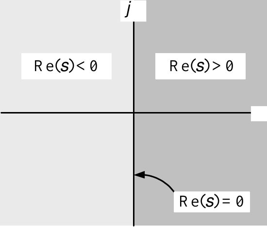

---

::: {.contents-slide .chapter-contents}
::: {.center}
**Contents**
:::

- Differential Equations

- Phasor Method of Solution

- Final Value Theorem

- Stable Transfer Functions

- Routh-Hurwitz Stability Test
:::

---

::: {.center}
Differential Equations
:::

Consider $$\ddot{x}+\dot{x}+x=u.$$

Then $$\begin{aligned}
X(s)  & =
\mathcal{L}
\{x(t)\}\\
\mathcal{L}
\{\dot{x}\}  & =sX(s)-x(0)\\
\mathcal{L}
\{\ddot{x}\}  & =s
\mathcal{L}
\{\dot{x}\}-\dot{x}(0)=s(sX(s)-x(0))-\dot{x}(0)=s^{2}X(s)-sx(0)-\dot{x}(0).
\end{aligned}$$ Take Laplace transform of the differential equation to obtain $$\mathcal{L}
\{\ddot{x}+\dot{x}+x\}=U(s)$$ or $$\underset{
\mathcal{L}
\{\ddot{x}\}}{\underbrace{s^{2}X(s)-sx(0)-\dot{x}(0)}}+\underset{
\mathcal{L}
\{\dot{x}\}}{\underbrace{sX(s)-x(0)}}+X(s)=\underset{
\mathcal{L}
\{u\}}{\underbrace{U(s)}}.$$ Rearrange $$(s^{2}+s+1)X(s)-sx(0)-\dot{x}(0)-x(0)=U(s)$$ or $$X(s)=\underset{G(s)}{\underbrace{\frac{1}{s^{2}+s+1}}}\underset{\text{Input}
}{\underbrace{U(s)}}+\underset{\text{zero input response}}{\underbrace{\frac
{sx(0)+\dot{x}(0)+x(0)}{s^{2}+s+1}}}.$$

---

**Transfer Function**

$$X(s)=\underset{G(s)}{\underbrace{\frac{1}{s^{2}+s+1}}}\underset{\text{Input}
}{\underbrace{U(s)}}+\underset{\text{zero input response}}{\underbrace{\frac
{sx(0)+\dot{x}(0)+x(0)}{s^{2}+s+1}}}.$$

Zero input response: $$\mathcal{L}
^{-1}\left\{  \frac{sx(0)+\dot{x}(0)+x(0)}{s^{2}+s+1}\right\}  .$$

Zero initial condition response: $\dot{x}(0)=x(0)=0$: $$X(s)=\underset{G(s)}{\underbrace{\frac{1}{s^{2}+s+1}}}\underset{\text{Input}
}{\underbrace{U(s)}}.$$

**Definition**  The *transfer function* is defined to be $$G(s)\triangleq\left.  \frac{X(s)}{U(s)}\right\vert _{\dot{x}(0)=x(0)=0}
=\frac{1}{s^{2}+s+1}.$$

**Example**  With $\dot{x}(0)=x(0)=0$ and $u(t)=u_{s}(t)$: $$X(s)=G(s)U(s)=\frac{1}{s^{2}+s+1}\frac{1}{s}$$ so $$x(t)=u_{s}(t)-e^{-(1/2)t}\cos(\sqrt{3}/2t)u_{s}(t)-\sqrt{1/3}e^{-(1/2)t}
\sin(\sqrt{3}/2t)u_{s}(t).$$

---

::: {.compact-slide}
**Example** *Sinusoidal Steady-State Response*

Consider $$\frac{d^{2}x}{dt^{2}}+\frac{dx}{dt}+x=u(t)$$ with $$u(t)=U_{0}\cos(\omega t)u_{s}(t)$$ and $$\dot{x}(0)=x(0)=0.$$ We have $$\mathcal{L}
\{U_{0}\cos(\omega t)u_{s}(t)\}=\frac{U_{0}s}{s^{2}+\omega^{2}}$$ so that $$\mathcal{L}
\left\{  \frac{d^{2}x}{dt^{2}}+\frac{dx}{dt}+x\right\}  =\frac{U_{0}s}
{s^{2}+\omega^{2}}.$$ Then $$(s^{2}+s+1)X(s)=\frac{U_{0}s}{s^{2}+\omega^{2}}$$ or $$X(s)=\underset{G(s)}{\underbrace{\frac{1}{s^{2}+s+1}}}
\underset{U(s)}{\underbrace{\frac{U_{0}s}{s^{2}+\omega^{2}}}}.$$
:::

---

**Example** *Sinusoidal Steady-State Response*  **(continued)**

Partial fraction expansion of $X(s)$: $$\begin{aligned}
X(s)  & =\frac{U_{0}s}{[s-(-1/2+j\sqrt{3}/2)][s-(-1/2-j\sqrt{3}/2)](s-j\omega
)(s+j\omega)}\\
& =\underset{\text{From the poles of }G(s)}{\underbrace{\frac{\beta
}{s-(-1/2+j\sqrt{3}/2)}+\frac{\beta^{\ast}}{s-(-1/2-j\sqrt{3}/2)}}
}+\underset{\text{From the poles of }U(s)}{\underbrace{\frac{k}{s-j\omega
}+\frac{k^{\ast}}{s+j\omega}}}.
\end{aligned}$$ Compute $k$ and $k^{\ast}$: $$\begin{aligned}
k=\lim_{s\rightarrow j\omega}(s-j\omega)X(s)=\lim_{s\rightarrow j\omega
}(s-j\omega)G(s)U(s)  & =\lim_{s\rightarrow j\omega}
(s-j\omega)G(s)\frac{U_{0}s}{(s-j\omega)(s+j\omega)}\\
  & =\lim_{s\rightarrow j\omega}G(s)\frac{U_{0}s}{s+j\omega
}=G(j\omega)\frac{U_{0}j\omega}{2j\omega}\\
  & =\frac{U_{0}}{2}G(j\omega).
\end{aligned}$$ Then $k^{\ast}=\dfrac{U_{0}}{2}G^{\ast}(j\omega)=\dfrac{U_{0}}{2}G(-j\omega)$ as $$\begin{aligned}
G^{\ast}(j\omega)=\left(  \frac{1}{(j\omega)^{2}+j\omega+1}\right)  ^{\ast
}=\frac{1}{\left(  (j\omega)(j\omega)\right)  ^{\ast}+(j\omega)^{\ast}+1}  &
=\frac{1}{(-j\omega)^{2}+(-j\omega)+1}\\
& =G(-j\omega).
\end{aligned}$$

---

**Example** *Sinusoidal Steady-State Response*  **(continued)**

We now have $$\begin{aligned}
X(s)  & =\frac{\beta}{s-(-1/2+j\sqrt{3}/2)}
+\frac{\beta^{\ast}}{s-(-1/2-j\sqrt{3}/2)}+\frac{U_{0}}{2}
G(j\omega)\frac{1}{s-j\omega}+\frac{U_{0}}{2}G^{\ast}(j\omega)\frac
{1}{s+j\omega}.\\
&
\end{aligned}$$ For $t\geq0$ we have $$\begin{aligned}
x(t)  & =\beta e^{(-1/2+j\sqrt{3}/2)t}
+\beta^{\ast}e^{(-1/2-j\sqrt{3}/2)t}+\frac{U_{0}}{2}G(j\omega
)e^{j\omega t}+\frac{U_{0}}{2}G^{\ast}(j\omega)e^{-j\omega t}\\
  & =|\beta|e^{j\angle\beta}e^{-1/2t}e^{j(\sqrt{3}/2)t}
+|\beta|e^{-j\angle\beta}e^{-1/2t}e^{-j(\sqrt{3}/2)t}+\frac{U_{0}}
{2}|G(j\omega)|e^{j\angle G(j\omega)}e^{j\omega t}+\\
& \frac{U_{0}}{2}|G(j\omega)|e^{-j\angle G(j\omega)}e^{-j\omega t}\\
  & =|\beta|e^{-1/2t}\left(  e^{j(\sqrt{3}/2t+\angle
\beta)}+e^{-j(\sqrt{3}/2t+\angle\beta)}\right)  +\frac{U_{0}}
{2}|G(j\omega)|\left(  e^{j(\omega t+\angle G(j\omega))}+e^{-j(\omega t+\angle G(j\omega))}\right) \\
  & =2|\beta|e^{-1/2t}\cos(\sqrt{3}/2t+\angle\beta
)+U_{0}|G(j\omega)|\cos\left(  \omega t+\angle G(j\omega
)\right)  .
\end{aligned}$$

*Sinusoidal Steady-State Response* $$x(t)\rightarrow x_{ss}(t)\triangleq U_{0}|G(j\omega)|\cos\left(  \omega
t+\angle G(j\omega)\right)  u_{s}(t).$$ This result requires the poles of $G(s)$ to have *negative* real parts.

- **Show the Simulink simulation of this differential equation (Chap 3 Sec 2 or Chap 4 Prob 10).**

---

**Example**  *Sinusoidal Response of an Unstable System*

Consider $$\frac{d^{2}x}{dt^{2}}-\frac{dx}{dt}+x=u(t)$$ with $$u(t)=U_{0}\cos(\omega t)u_{s}(t)$$ and $$\dot{x}(0)=x(0)=0.$$ Then $$X(s)=\underset{G(s)}{\underbrace{\frac{1}{s^{2}-s+1}}}
\underset{U(s)}{\underbrace{\frac{U_{0}s}{s^{2}+\omega^{2}}}}.$$ As $s^{2}-s+1=[s-(1/2+j\sqrt{3}/2)][s-(1/2-j\sqrt{3}/2)]$: $$X(s)=\underset{\text{From the poles of }G(s)}{\underbrace{\frac{\beta
}{s-(1/2+j\sqrt{3}/2)}+\frac{\beta^{\ast}}{s-(1/2-j\sqrt{3}/2)}}
}+\underset{\text{From the poles of }U(s)}{\underbrace{\frac{k}{s-j\omega
}+\frac{k^{\ast}}{s+j\omega}}}.$$ Note that the poles $1/2\pm j\sqrt{3}/2$ of $G(s)$ are in the *right* half-plane.

---

**Example**  *Sinusoidal Response of an Unstable System*  **(continued)**

$$X(s)=\underset{\text{From the poles of }G(s)}{\underbrace{\frac{\beta
}{s-(1/2+j\sqrt{3}/2)}+\frac{\beta^{\ast}}{s-(1/2-j\sqrt{3}/2)}}
}+\underset{\text{From the poles of }U(s)}{\underbrace{\frac{k}{s-j\omega
}+\frac{k^{\ast}}{s+j\omega}}}.$$

The time response is given by

$$\begin{aligned}
x(t)  & =(\beta e^{(1/2+j\sqrt{3}/2)t}+\beta^{\ast}e^{(1/2-j\sqrt{3}
/2)t})u_{s}(t)+\left(  \frac{U_{0}}{2}G(j\omega)e^{j\omega t}+\frac{U_{0}
}{2}G^{\ast}(j\omega)e^{-j\omega t}\right)  u_{s}(t)\\
& \\
& =2|\beta|e^{1/2t}\cos(\sqrt{3}/2t+\angle\beta)u_{s}(t)+U_{0}
|G(j\omega)|\cos(\omega t+\angle G(j\omega))u_{s}(t).
\end{aligned}$$

There is **no** sinusoidal steady-state response because $e^{1/2t}$ $\rightarrow\infty$.

As $t\rightarrow\infty$ the term $2|\beta|e^{1/2t}\cos(\sqrt{3}/2t+\angle
\beta)$ eventually oscillates between $\pm\infty!$

- **Show the Simulink simulation of this differential equation (Chap 3 Sec 2 or Chap 4 Prob 11).**

---

::: {.roomy-slide}
::: {.center}
Phasor Method of Solution
:::

- Let the input be $u(t)=U_{0}\cos(\omega t)u_{s}(t).$

- Let the differential equation have transfer function $G(s).$

- In previous examples we showed *part* of the solution to the differential equation was $$U_{0}|G(j\omega)|\cos\left(  \omega t+\angle G(j\omega
  )\right)  u_{s}(t).$$

- If the poles of $G(s)$ have *negative* real parts, this is the *steady-state* solution.

- We do some examples to elaborate on all this.
:::

---

**Example** *Phasor Method of Solution*

Consider $$\begin{aligned}
\frac{d^{2}x}{dt^{2}}+\frac{dx}{dt}+x  & =u(t)\\
u(t)  & =U_{0}\cos(\omega t)\text{ for }-\infty<t<\infty.
\end{aligned}$$

We are looking for a solution for all $t,$ $-\infty<t<\infty$

Change the input to be the *complex phasor* function $$\mathbf{u}(t)=U_{0}e^{j\omega t}=U_{0}\cos(\omega t)+jU_{0}\sin(\omega t).$$

The bold $\mathbf{u}$ is used to signify it is a *complex* valued time function.

Our original input $u(t)$ is simply given by $$u(t)=\operatorname{Re}\{\mathbf{u}(t)\}=\operatorname{Re}\{U_{0}e^{j\omega
t}\}.$$

Let $\mathbf{A}$ be a complex constant (scalar).

We look for a *complex phasor* solution of the form $$\mathbf{x}(t)=\mathbf{A}e^{j\omega t}$$ to $$\frac{d^{2}\mathbf{x}}{dt^{2}}+\frac{d\mathbf{x}}{dt}+\mathbf{x}
=\mathbf{u}(t).$$

---

**Example** *Phasor Method of Solution* **(continued)**

We want to find $\mathbf{A}$ such that $\mathbf{x}(t)=\mathbf{A}e^{j\omega t}$ is a solution to $$\frac{d^{2}\mathbf{x}}{dt^{2}}+\frac{d\mathbf{x}}{dt}+\mathbf{x}
=\mathbf{u}(t).$$ $$\frac{d^{2}}{dt^{2}}\mathbf{A}e^{j\omega t}+\frac{d}{dt}\mathbf{A}e^{j\omega
t}+\mathbf{A}e^{j\omega t}=U_{0}e^{j\omega t}.$$

The derivative of $\mathbf{A}e^{j\omega t}$ is simply $j\omega\mathbf{A}
e^{j\omega t}$ - the reason for the phasor method! $$(j\omega)^{2}\mathbf{A}e^{j\omega t}+j\omega\mathbf{A}e^{j\omega t}
+\mathbf{A}e^{j\omega t}=U_{0}e^{j\omega t}.$$ Rearranging $$\left(  (j\omega)^{2}+j\omega+1\right)  \mathbf{A}e^{j\omega t}=U_{0}
e^{j\omega t}$$ so that finally $$\mathbf{A}=\underset{G(j\omega)}{\underbrace{\frac{1}{(j\omega)^{2}+j\omega
+1}}}U_{0}.$$ $$\begin{aligned}
\mathbf{x}(t)  & =G(j\omega)U_{0}e^{j\omega t}\\
& =\left\vert G(j\omega)\right\vert U_{0}e^{j(\omega t+\angle G(j\omega))}\\
& =\left\vert G(j\omega)\right\vert U_{0}\cos\left(  \omega t+\angle G(j\omega)\right)  +j\left\vert G(j\omega)\right\vert
U_{0}\sin\left(  \omega t+\angle G(j\omega)\right)  .
\end{aligned}$$

---

**Example** *Phasor Method of Solution* **(continued)**

We now show that if $u(t)=U_{0}\cos(\omega t)$ then a solution is $$x(t)=\operatorname{Re}\{G(j\omega)U_{0}e^{j\omega t}
\}=\operatorname{Re}\{\left\vert G(j\omega)\right\vert e^{j\angle
G(j\omega)}U_{0}e^{j\omega t}\}=\left\vert G(j\omega)\right\vert
U_{0}\cos\left(  \omega t+\angle G(j\omega)\right)  .$$

To explain: $$\begin{aligned}
\mathbf{u}(t)  & =U_{0}e^{j\omega t}=u_{R}(t)+ju_{I}(t)=U_{0}\cos(\omega
t)+jU_{0}\sin(\omega t)\\
\mathbf{x}(t)  & =\underset{\mathbf{A}}{\underbrace{G(j\omega)U_{0}}
}e^{j\omega t}=\underset{x_{R}(t)}{\underbrace{\left\vert G(j\omega
)\right\vert U_{0}\cos\left(  \omega t+\angle
G(j\omega)\right)  }}+j\text{ }\underset{x_{I}(t)}{\underbrace{\left\vert
G(j\omega)\right\vert U_{0}\sin\left(  \omega t+\angle
G(j\omega)\right)  }}
\end{aligned}$$ We showed $$\frac{d^{2}}{dt^{2}}\left(  {}\right.  \underset{G(j\omega)U_{0}e^{j\omega
t}}{\underbrace{x_{R}(t)+jx_{I}(t)}}\left.  {}\right)  +\frac{d}{dt}\left(
{}\right.  \underset{G(j\omega)U_{0}e^{j\omega t}}{\underbrace{x_{R}
(t)+jx_{I}(t)}}\left.  {}\right)  +\underset{G(j\omega)U_{0}e^{j\omega
t}}{\underbrace{x_{R}(t)+jx_{I}(t)}}=\underset{U_{0}e^{j\omega t}
}{\underbrace{u_{R}(t)+ju_{I}(t)}}.$$ Equate real and imaginary parts of both sides: $$\begin{aligned}
\frac{d^{2}}{dt^{2}}x_{R}(t)+\frac{d}{dt}x_{R}(t)+x_{R}(t)  & =u_{R}(t)\\
j\left(  \frac{d^{2}}{dt^{2}}x_{I}(t)+\frac{d}{dt}x_{I}(t))+x_{I}
(t)\right)   & =ju_{I}(t).
\end{aligned}$$ $u_{R}(t)=\operatorname{Re}\{\mathbf{u}(t)\}=\operatorname{Re}\{U_{0}
e^{j\omega t}\}=U_{0}\cos(\omega t)$ and $$x_{R}(t)=\operatorname{Re}\{\mathbf{x}(t)\}=\operatorname{Re}\{G(j\omega
)U_{0}e^{j\omega t}\}=\left\vert G(j\omega)\right\vert U_{0}\cos\left(
\omega t+\angle G(j\omega)\right)  .$$

---

**Example** *Phasor Method of Solution* **(continued)**

We just showed that **a solution** to the differential equation $$\begin{aligned}
\frac{d^{2}x}{dt^{2}}+\frac{dx}{dt}+x  & =u(t)\\
u(t)  & =U_{0}\cos(\omega t)
\end{aligned}$$ is $$x(t)=\operatorname{Re}\{G(j\omega)U_{0}e^{j\omega t}\}=\left\vert
G(j\omega)\right\vert U_{0}\cos\left(  \omega t+\angle
G(j\omega)\right)  .$$

Now start at $t=0$ with input $u(t)=U_{0}\cos(\omega t)u_{s}(t).$ Then for $t\geq0$ $$x(t)=\left\vert G(j\omega)\right\vert U_{0}\cos\left(  \omega t+\angle G(j\omega)\right)  u_{s}(t)$$ satisfies $$\frac{d^{2}x}{dt^{2}}+\frac{dx}{dt}+x=u(t).$$ What are the initial conditions? $$\begin{aligned}
x(0)  & =\quad\quad\left\vert G(j\omega)\right\vert U_{0}\cos(\angle
G(j\omega))\\
\dot{x}(0)  & =-\omega\left\vert G(j\omega)\right\vert U_{0}\sin(\angle
G(j\omega)).
\end{aligned}$$ $\boldsymbol{\Rightarrow}$ $$x(t)=\left\vert G(j\omega)\right\vert U_{0}\cos\left(  \omega t+\angle G(j\omega)\right)  u_{s}(t)$$ is the *unique* solution to the differential equation with these initial conditions.

---

**Example** *Phasor Method of Solution*

Consider $$\begin{aligned}
\frac{d^{2}x}{dt^{2}}-\frac{dx}{dt}+x  & =u(t)\\
u(t)  & =U_{0}\cos(\omega t).
\end{aligned}$$ Let $$\mathbf{u}(t)=U_{0}e^{j\omega t}=U_{0}\cos(\omega t)+jU_{0}\sin(\omega t).$$ With $\mathbf{u}(t)=U_{0}e^{j\omega t}$ we solve $$\frac{d^{2}\mathbf{x}}{dt^{2}}-\frac{d\mathbf{x}}{dt}+\mathbf{x}=\mathbf{u}(t)$$ by looking for a solution of the form $\mathbf{x}(t)=\mathbf{A}e^{j\omega t}.$

We have $$\begin{aligned}
\frac{d^{2}}{dt^{2}}\mathbf{A}e^{j\omega t}-\frac{d}{dt}\mathbf{A}e^{j\omega
t}+\mathbf{A}e^{j\omega t}  & =U_{0}e^{j\omega t}\\
(j\omega)^{2}\mathbf{A}e^{j\omega t}-j\omega\mathbf{A}e^{j\omega t}
+\mathbf{A}e^{j\omega t}  & =U_{0}e^{j\omega t}\\
\left(  (j\omega)^{2}-j\omega+1\right)  \mathbf{A}e^{j\omega t}  &
=U_{0}e^{j\omega t}.
\end{aligned}$$ so that $$\mathbf{A}=\underset{G(j\omega)}{\underbrace{\frac{1}{(j\omega)^{2}-j\omega
+1}}}U_{0}.$$

---

**Example** *Phasor Method of Solution* **(continued)**

The solution is simply $$\mathbf{x}(t)=G(j\omega)U_{0}e^{j\omega t}=\left\vert G(j\omega)\right\vert
U_{0}\cos\left(  \omega t+\angle G(j\omega)\right)
+j\left\vert G(j\omega)\right\vert U_{0}\sin\left(  \omega t+\angle G(j\omega)\right)  .$$

With input $u(t)=U_{0}\cos(\omega t)u_{s}(t)$ the solution is $$x(t)=\left\vert G(j\omega)\right\vert U_{0}\cos\left(  \omega
t+\angle G(j\omega)\right)  u_{s}(t).$$ That is, this is the solution to $$\begin{aligned}
\frac{d^{2}x}{dt^{2}}-\frac{dx}{dt}+x  & =U_{0}\cos(\omega t),\\
x(0)  & =\quad\quad\left\vert G(j\omega)\right\vert U_{0}\cos(\angle
G(j\omega)),\\
\dot{x}(0)  & =-\omega\left\vert G(j\omega)\right\vert U_{0}\sin(\angle
G(j\omega)).
\end{aligned}$$

However, if instead the initial conditions were $x(0)=\dot{x}(0)=0$ then $$\begin{aligned}
x(t)  & =(\beta e^{(1/2+j\sqrt{3}/2)t}+\beta^{\ast
}e^{(1/2-j\sqrt{3}/2)t})u_{s}(t)+\left(  \frac{U_{0}}{2}G(j\omega
)e^{j\omega t}+\frac{U_{0}}{2}G^{\ast}(j\omega)e^{-j\omega t}\right)
u_{s}(t)\\
& =2|\beta|e^{1/2t}\cos(\sqrt{3}/2t+\angle\beta)u_{s}(t)+U_{0}
|G(j\omega)|\cos\left(  \omega t+\angle G(j\omega)\right)
u_{s}(t).
\end{aligned}$$

- The response due to the poles of $G(s),$ i.e., $1/2\pm j\sqrt{3}/2,$ does **not** die out!

- In this example the phasor solution is **not** a sinusoidal steady-state solution!

---

::: {.center}
**Summary of the Phasor and Sinusoidal Steady-State Solutions**
:::

The differential equation $$\frac{d^{3}x}{dt^{3}}+a_{2}\frac{d^{2}x}{dt^{2}}+a_{1}\frac{dx}{dt}
+a_{0}x=b_{2}\frac{d^{2}u}{dt^{2}}+b_{1}\frac{du}{dt}+b_{0}u$$ has transfer function $$G(s)=\frac{X(s)}{U(s)}=\frac{b_{2}s^{2}+b_{1}s+b_{0}}{s^{3}+a_{2}s^{2}
+a_{1}s+a_{0}}.$$ With $u(t)=U_{0}\cos(\omega t)u_{s}(t)$, the phasor solution is $$x(t)\triangleq|G(j\omega)|U_{0}\cos(\omega t+\angle G(j\omega))u_{s}(t).$$ This is a solution to the above differential equation with the *special* initial conditions $$\begin{aligned}
x(0)  & =\quad\quad\left\vert G(j\omega)\right\vert U_{0}\cos(\angle
G(j\omega)),\\
\dot{x}(0)  & =-\omega\left\vert G(j\omega)\right\vert U_{0}\sin(\angle
G(j\omega)),\\
\ddot{x}(0)  & =-\omega^{2}\left\vert G(j\omega)\right\vert U_{0}
\cos(\angle G(j\omega)).
\end{aligned}$$

If the poles of $G(s)$ have *negative* real parts, it is *also* the sinusoidal steady-state solution.

In this case, for *arbitrary* initial conditions, as $t\rightarrow
\infty$ $$x(t)\rightarrow x_{ss}(t)=|G(j\omega)|U_{0}\cos(\omega t+\angle G(j\omega
))u_{s}(t).$$

---

::: {.center}
Final Value Theorem
:::

**Example** $F(s)=\dfrac{10}{s(s+1)}$

Look at $f(t)$ as $t\rightarrow\infty.$ As $$F(s)=\dfrac{10}{s(s+1)}=\frac{A}{s}+\frac{B}{s+1}.$$ We know $$f(t)=Au_{s}(t)+Be^{-t}u_{s}(t)$$ and therefore $$\lim_{t\rightarrow\infty}f(t)=A.$$ By the method of partial fractions: $$A=\lim_{s\rightarrow0}sF(s)=\lim_{s\rightarrow0}s\dfrac{10}{s(s+1)}=10$$ and thus $$\lim_{t\rightarrow\infty}f(t)=\lim_{s\rightarrow0}sF(s)=10.$$

---

**Example** $F(s)=\dfrac{-10}{s(s-1)}$

Look at $f(t)$ as $t\rightarrow\infty.$  As

$$F(s)=\dfrac{-10}{s(s-1)}=\frac{A}{s}+\frac{B}{s-1}.$$ we have $$f(t)=Au_{s}(t)+Be^{t}u_{s}(t).$$

- The $\lim_{t\rightarrow\infty}f(t)$ does *not* exist!

By the method of partial fractions: $$A=\lim_{s\rightarrow0}sF(s)=\lim_{s\rightarrow0}s\dfrac{-10}{s(s-1)}=10.$$

- $\lim_{s\rightarrow0}sF(s)=A$ is simply the coefficient of the unit step function.

- The behavior of $f(t)$ as $t\rightarrow\infty$ is dominated by the growing exponential term $e^{t}.$

---

**Example** $F(s)=\dfrac{s+1}{s(s+2)(s+3)}$

Look at $f(t)$ as $t\rightarrow\infty.$  As

$$F(s)=\dfrac{s+1}{s(s+2)(s+3)}=\frac{A}{s}+\frac{B}{s+2}+\frac{C}{s+3}.$$ we have $$f(t)=Au_{s}(t)+Be^{-2t}u_{s}(t)+Ce^{-3t}u_{s}(t).$$ Therefore $$\lim_{t\rightarrow\infty}f(t)=A.$$ By the method of partial fractions: $$A=\lim_{s\rightarrow0}sF(s)=\lim_{s\rightarrow0}s\dfrac{s+1}{s(s+2)(s+3)}
=\frac{1}{6}$$ and thus $$\lim_{t\rightarrow\infty}f(t)=\lim_{s\rightarrow0}sF(s)=1/6.$$

- $\lim_{s\rightarrow0}sF(s)$ is simply the coefficient of the $1/s$ term in the pfe of $F(s)$.

- In this example it is *also* the final value, i.e., $\lim
  _{t\rightarrow\infty}f(t).$

  - This is simply because the responses due to the poles at $s=-2,-3$ die out.

---

**Example** $F(s)=-\dfrac{s+1}{s(s+2)(s-3)}$

Look at $f(t)$ as $t\rightarrow\infty.$  As

$$F(s)=-\dfrac{s+1}{s(s+2)(s-3)}=\frac{A}{s}+\frac{B}{s+2}+\frac{C}{s-3}.$$ we have $$f(t)=Au_{s}(t)+Be^{-2t}u_{s}(t)+Ce^{3t}u_{s}(t).$$

- The $\lim_{t\rightarrow\infty}f(t)$ does *not* exist.

- By the method of partial fractions: $$A=\lim_{s\rightarrow0}sF(s)=\lim_{s\rightarrow0}s\dfrac{-(s+1)}{s(s+2)(s-3)}
  =\frac{1}{6}.$$

- $\lim_{s\rightarrow0}sF(s)$ is simply the coefficient of the $1/s$ term in the pfe of $F(s).$

- The behavior of $f(t)$ as $t\rightarrow\infty$ is dominated by the growing exponential term $e^{3t}.$

---

**Example** $F(s)=\dfrac{2s+12}{s(s^{2}-2s+5)}$

Look at $f(t)$ as $t\rightarrow\infty.$  As $$F(s)=\frac{2s+12}{s[s-(1+2j)][s-(1-2j)]}=\frac{A}{s}+\frac{\beta}
{s-(1+2j)}+\frac{\beta^{\ast}}{s-(1-2j)}$$ we have $$f(t)=Au_{s}(t)+(\beta e^{t}e^{2jt}+\beta^{\ast}e^{t}e^{-2jt})u_{s}
(t)=Au_{s}(t)+2|\beta|e^{t}\cos(2t+\angle\beta)u_{s}(t).$$

- $\lim_{t\rightarrow\infty}f(t)$ does not exist.

- By the pfe method: $$A=\lim_{s\rightarrow0}sF(s)=\lim_{s\rightarrow0}s\dfrac{2s+12}{s(s^{2}
  -2s+5)}=\frac{12}{5}.$$

- $\lim_{s\rightarrow0}sF(s)$ is simply the coefficient of the $1/s$ term in the pfe of $F(s)$.

- However, as $t\rightarrow\infty$, $f(t)$ has the term $2|\beta|e^{t}
  \cos(2t+\angle\beta)$ which does not die out.

---

**Example** $F(s)=\dfrac{s+1}{(s+2)(s+3)}$

$F(s)$ does not have a pole at $s=0.$

As $$F(s)=\dfrac{s+1}{(s+2)(s+3)}=\frac{A}{s+2}+\frac{B}{s+3}$$ we have $$f(t)=Ae^{-2t}u_{s}(t)+Be^{-3t}u_{s}(t).$$

- Thus $\lim_{t\rightarrow\infty}f(t)=0$.

- $\lim_{s\rightarrow0}sF(s)=0$ as there is no pole at $s=0$ in the partial fraction expansion.

---

**Theorem**  *Final Value Theorem (FVT)*

Let $F(s)=\dfrac{b(s)}{a(s)}$ be a strictly proper rational function of $s.$

Let $f(t)=
\mathcal{L}
^{-1}\{F(s)\}$. Then $$\lim_{t\rightarrow\infty}f(t)=\lim_{s\rightarrow0}sF(s)$$ *if and only if* all the poles of $sF(s)$ are in the open left half-plane.

**Proof**  (sketch)  Let $$F(s)=\frac{(s-z_{1})(s-z_{2})}{s(s-p_{1})(s-p_{2})}=\frac{A}{s}+\frac
{\beta_{1}}{s-p_{1}}+\frac{\beta_{2}}{s-p_{2}}.$$ Then $$f(t)=Au_{s}(t)+(\beta_{1}e^{p_{1}t}+\beta_{2}e^{p_{2}t})u_{s}(t).$$

The poles of $sF(s)$ are $p_{1},p_{2}.$  Also $A=\lim_{s\rightarrow
0}sF(s).$

$e^{p_{1}t}\rightarrow0,e^{p_{2}t}\rightarrow0$ if and only if the real parts of $p_{1},p_{2}$ are *negative*.

I.e., if and only if $p_{1},p_{2}$ are in the *open left half-plane*.

---

**Example** $F(s)=\dfrac{10}{s(s+1)}$

$sF(s)=\dfrac{10}{s+1}$ and its pole is $-1$ which is in the open left half-plane.

By the FVT $$\lim_{t\rightarrow\infty}f(t)=\lim_{s\rightarrow0}sF(s).$$

This is simply because the pfe is $$F(s)=\frac{A}{s}+\frac{B}{s+1}$$ so $$f(t)=Au_{s}(t)+Be^{-t}u_{s}(t),\qquad A=\lim_{s\rightarrow0}sF(s).$$

$\lim_{s\rightarrow0}sF(s)$ is also the final value because the $Be^{-t}$ term dies out.

---

**Example** $F(s)=\dfrac{-10}{s(s-1)}$

In this example $sF(s)=-\dfrac{10}{s-1}$ has a pole at 1 which is in the *right* half-plane.

By the FVT $\lim_{t\rightarrow\infty}f(t)$ does *not* exist.

This is simply because the pfe $$F(s)=\frac{A}{s}+\frac{B}{s-1}$$ gives the time function $$f(t)=Au_{s}(t)+Be^{t},\qquad A=\lim_{s\rightarrow0}sF(s).$$ The term $Be^{t}$ does *not* die out.

---

**Example** $F(s)=\dfrac{2s+12}{s^{2}+2s+5}$

We have $$sF(s)=s\frac{2s+12}{[s-(-1+2j)][s-(-1-2j)]}.$$

The poles of $sF(s)$ are in the open left half-plane.

By the FVT $$\lim_{t\rightarrow\infty}f(t)=\lim_{s\rightarrow0}sF(s)=0.$$ This is simply because from the pfe $$F(s)=\frac{\beta}{s-(-1+2j)}+\frac{\beta^{\ast}}{s-(-1-2j)}$$ we have $$f(t)=(\beta e^{(-1+2j)t}+\beta^{\ast}e^{(-1-2j)t})u_{s}(t)=2|\beta|e^{-t}
\cos(2t+\angle\beta)u_{s}(t).$$

- $\lim_{s\rightarrow0}sF(s)=0$ as there is not a $1/s$ term in the partial fraction expansion.

- $\beta e^{(-1+2j)t}+\beta^{\ast}e^{(-1-2j)t}$ die out as the two poles $-1\pm2j$ have negative real parts.

---

**Example** $F(s)=\dfrac{2s+12}{s^{2}-2s+5}$

We have $$sF(s)=s\frac{2s+12}{[s-(1+2j)][s-(1-2j)]}.$$

The poles of $sF(s)$ are *not* in the open left half-plane.

By the FVT $\lim_{t\rightarrow\infty}f(t)$ does *not* exist!

This is simply because the pfe $$F(s)=\frac{\beta}{s-(1+2j)}+\frac{\beta^{\ast}}{s-(1-2j)}$$ gives $$f(t)=(\beta e^{(1+2j)t}+\beta^{\ast}e^{(1-2j)t})u_{s}(t)=2|\beta|e^{t}
\cos(2t+\angle\beta)u_{s}(t).$$

- $\beta e^{(1+2j)t}+\beta^{\ast}e^{(1-2j)t}$ do *not* die out as these poles are in the right half-plane.

- $\lim_{s\rightarrow0}sF(s)=0$ as there is no $1/s$ term in the partial fraction expansion.

---

**Example** $F(s)=\dfrac{s+1}{s^{2}}$

We have $$sF(s)=s\dfrac{s+1}{s^{2}}=\dfrac{s+1}{s}.$$

$sF(s)$ has a pole at $s=0$ which is *not* in the open left half-plane.

By the FVT $\lim_{t\rightarrow\infty}f(t)$ does *not* exist!

This is simply because the pfe $$F(s)=\dfrac{s+1}{s^{2}}=\frac{A}{s}+\frac{B}{s^{2}}$$

results in $$f(t)=Au_{s}(t)+Btu_{s}(t).$$

- $\lim_{t\rightarrow\infty}tu_{s}(t)=\infty.$

- In this case $\lim_{s\rightarrow0}sF(s)=\infty$ is *not* even the coefficient of the $1/s$ term in the pfe!

---

::: {.center}
Stable Transfer Functions
:::

Consider $$\dddot{y}+a_{2}\ddot{y}+a_{1}\dot{y}+a_{0}y=b_{2}\ddot{u}+b_{1}\dot{u}+b_{0}u$$ with zero ICs, i.e., $$y(0)=\dot{y}(0)=\ddot{y}(0)=0,u(0)=\dot{u}(0)=0.$$ Then $$(s^{3}+a_{2}s^{2}+a_{1}s+a_{0})Y(s)=(b_{2}s^{2}+b_{1}s+b_{0})U(s)$$ so the *transfer function* is $$G(s)\triangleq\left.  \frac{Y(s)}{U(s)}\right\vert _{\text{zero ICs}}
=\frac{b_{2}s^{2}+b_{1}s+b_{0}}{s^{3}+a_{2}s^{2}+a_{1}s+a_{0}}.$$

- This is a typical example of a transfer function considered in this book.

- Physical models have *strictly proper rational* transfer functions, i.e.,

  $G(s)=\dfrac{b(s)}{a(s)},$  $a(s)$ & $b(s)$ are polynomials in $s$ and $\deg\{b(s)\}<\deg\{a(s)\}$.

---

**Definition**  *Stable Transfer Functions*

A strictly proper rational transfer function $$G(s)=\frac{b(s)}{a(s)}$$ is *stable* if the poles of $G(s)$ are in the *open left half-plane*.

**Example**  Let $$G_{1}(s)=\frac{1}{s^{2}-s+1}.$$ $G_{1}(s)$ is not stable as its poles are $1/2\pm j\sqrt{3}/2$ which are *not* in the open left half-plane.

**Example**  Let $$G_{2}(s)=\frac{1}{s(s+2)}.$$ $G_{2}(s)$ is not stable as the pole at $0$ is *not* in the open left half-plane.

**Example**  Let $$G_{3}(s)=\frac{1}{s^{2}+s+1}.$$ $G_{3}(s)$ is stable as its poles $-1/2\pm j\sqrt{3}/2$ are in the open left half-plane.

---

::: {.roomy-slide}
**Definition**  *Stable Polynomial*

A polynomial $a(s)$ is *stable* if the roots of $a(s)=0$ are in the open left half-plane.

**Example**  Let $$a_{1}(s)=s^{2}-s+1.$$ $a_{1}(s)$ is *not* stable as its roots are $1/2\pm j\sqrt{3}/2$ which are *not* in the open left half-plane.

**Example**  Let $$a_{2}(s)=s(s+2).$$ $a_{2}(s)$ is *not* stable as its roots are $0,-2$ and the root at $0$ is *not* in the open left half-plane.

**Example**  Let $$a_{3}(s)=s^{2}+s+1.$$ $a_{3}(s)$ is stable as its roots are $-1/2\pm j\sqrt{3}/2$ which are in the open left half-plane.
:::

---

**Final Value Theorem and Stable Transfer Functions**

- Unstable transfer function $$G(s)=\frac{X(s)}{U(s)}=\frac{1}{s(s+2)}\Longleftrightarrow\ddot{x}(t)+2\dot
  {x}(t)=u(t).$$

- With $U(s)=\dfrac{1}{s}$ $$X(s)=G(s)U(s)=\frac{1}{s(s+2)}\frac{1}{s}=\frac{1}{s^{2}(s+2)}=\frac{A}
  {s}+\frac{B}{s^{2}}+\frac{C}{s+2}.$$ $sX(s)=G(s)=\dfrac{1}{s(s+2)}$ has a pole at $s=0.$

  $\Longrightarrow\lim_{t\rightarrow\infty}x(t)$ does *not* exist by the FVT.

---

**Final Value Theorem and Stable Transfer Functions  (continued)**

- Stable transfer function $$G(s)=\frac{1}{s+2}\Longleftrightarrow\dot{x}(t)+2x(t)=u(t).$$

- With $U(s)=1/s$ we have $$X(s)=\frac{1}{s+2}\frac{1}{s}$$ and $$x(\infty)=\lim_{t\rightarrow\infty}x(t)=\lim_{s\rightarrow0}sX(s)=\lim
  _{s\rightarrow}s\frac{1}{s+2}\frac{1}{s}=\frac{1}{2}.$$

- The FVT is applied to the *output* of the differential equation with a step input,i.e., to $X(s)=G(s)U(s)$ with $G(s)$ stable.

- Usually apply the FVT to the output (solution) of a differential equation. This requires the transfer function $G(s)$ of the differential equation to be *stable*.

---

::: {.compact-slide}
::: {.center}
**SUMMARY**
:::

$$\text{Consider}\ddot{y}+a_{1}\dot{y}+a_{0}y=b_{1}\dot{u}+b_{0}u.$$ Laplace transform: $$\begin{aligned}
s^{2}Y(s)-sy(0)-\dot{y}(0)+a_{1}(sY(s)-y(0))+a_{0}Y(s)  & =b_{1}
(sU(s)-u(0))+b_{0}U(s)\\
\text{or}(s^{2}+a_{1}s+a_{0})Y(s)-sy(0)-\dot{y}(0)-a_{1}y(0)  &
=(b_{1}s+b_{0})U(s)-b_{1}u(0)
\end{aligned}$$ where $\mathcal{L}
\{\ddot{y}\}=s
\mathcal{L}
\{\dot{y}\}-\dot{y}(0)=s(sY(s)-y(0))-\dot{y}(0)$.

Rearrange:

$$Y(s)=\underset{G(s)}{\underbrace{\frac{b_{1}s+b_{0}}{s^{2}+a_{1}s+a_{0}}}
}\underset{\text{input}}{\underbrace{U(s)}}+\underset{\text{Same denominator
as }G(s)!}{\underbrace{\frac{sy(0)+\dot{y}(0)+a_{1}y(0)-b_{1}u(0)}{s^{2}
+a_{1}s+a_{0}}}}$$

- Let $G(s)$ be stable, so the roots of $$s^{2}+a_{1}s+a_{0}=(s-p_{1})(s-p_{2})=0$$ are in the *open left half-plane*. By pfe theory

  $$\begin{aligned}
  \mathcal{L}
  ^{-1}\left\{  \dfrac{sy(0)+\dot{y}(0)+a_{1}y(0)-b_{1}u(0)}{s^{2}+a_{1}s+a_{0}
  }\right\}   & =
  \mathcal{L}
  ^{-1}\left\{  \dfrac{sy(0)+\dot{y}(0)+a_{1}y(0)-b_{1}u(0)}{(s-p_{1})(s-p_{2}
  )}\right\} \\
  & =(Ae^{p_{1}t}+Be^{p_{2}t})u_{s}(t)\rightarrow0.
  \end{aligned}$$
:::

---

::: {.center}
**SUMMARY  (continued)**
:::

Apply a step input $u_{s}(t)$: $$\begin{aligned}
Y(s)  & =G(s)\frac{1}{s}+\frac{sy(0)+\dot{y}(0)+a_{1}y(0)-b_{1}u(0)}
{s^{2}+a_{1}s+a_{0}}\\
& \\
& =\frac{b_{1}s+b_{0}}{s^{2}+a_{1}s+a_{0}}\frac{1}{s}+\frac{sy(0)+\dot
{y}(0)+a_{1}y(0)-b_{1}u(0)}{s^{2}+a_{1}s+a_{0}}.
\end{aligned}$$

Then $$sY(s)=s\frac{b_{1}s+b_{0}}{(s-p_{1})(s-p_{2})}\frac{1}{s}+s\left(
\frac{sy(0)+\dot{y}(0)+a_{1}y(0)-b_{1}u(0)}{(s-p_{1})(s-p_{2})}\right)$$ is **stable**. By the FVT $$\lim_{t\rightarrow\infty}y(t)=\lim_{s\rightarrow0}sY(s)=\lim_{s\rightarrow
0}sG(s)\frac{1}{s}=G(0)=\frac{b_{0}}{a_{0}}.$$

- If $G(s)$ is *not* stable then (1) is not valid!

---

::: {.compact-slide}
::: {.center}
**SUMMARY  (continued)**
:::

Apply a sinusoidal input $u(t)=U_{0}\cos(\omega t)u_{s}(t).$ $$Y(s)=\underset{G(s)}{\underbrace{\frac{b_{1}s+b_{0}}{s^{2}+a_{1}s+a_{0}}}
}\underset{\text{input}}{\underbrace{U_{0}\frac{s}{s^{2}+\omega^{2}}}
}+\underset{\frac{A}{s-p_{1}}+\frac{B}{s-p_{2}}}{\underbrace{\frac
{sy(0)+\dot{y}(0)+a_{1}y(0)-b_{1}u(0)}{s^{2}+a_{1}s+a_{0}}}}.$$ Do a PFE of the input term $$\begin{aligned}
\frac{b_{1}s+b_{0}}{s^{2}+a_{1}s+a_{0}}U_{0}\frac{s}{s^{2}+\omega^{2}}  &
=\frac{b_{1}s+b_{0}}{(s-p_{1})(s-p_{2})}U_{0}\frac{s}{s^{2}+\omega^{2}}\\
& =\frac{C}{s-p_{1}}+\frac{D}{s-p_{2}}+\frac{k}{s-j\omega}+\frac{k^{\ast}
}{s+j\omega}
\end{aligned}$$ to obtain the time response

$$\begin{aligned}
\mathcal{L}
^{-1}\left\{  \frac{b_{1}s+b_{0}}{s^{2}+a_{1}s+a_{0}}U_{0}\frac{s}
{s^{2}+\omega^{2}}\right\}    & =(Ce^{p_{1}t}+De^{p_{2}
t})u_{s}(t)+\underset{\text{phasor solution}}{\underbrace{U_{0}|G(j\omega
)|\cos(\omega t+\angle G(j\omega))u_{s}(t)}}\\
& \rightarrow U_{0}|G(j\omega)|\cos(\omega t+\angle G(j\omega))u_{s}(t).
\end{aligned}$$ That is, as $G(s)$ is stable, we have $$y(t)\rightarrow y_{ss}(t)\triangleq\operatorname{Re}\{G(j\omega)U_{0}
e^{j\omega t}\}=|G(j\omega)|U_{0}\cos(\omega t+\angle G(j\omega))u_{s}
(t).$$

- If $G(s)$ is *not* stable then (2) is not valid!
:::

---

::: {.center}
Routh-Hurwitz Stability Test
:::

The transfer function $$G(s)=\frac{b(s)}{a(s)},\qquad \deg\{b(s)\}<\deg\{a(s)\}$$ is *stable* if and only if the roots of $$a(s)=s^{n}+a_{n-1}s^{n-1}+\cdots+a_{1}s+a_{0}$$ are in the open LHP.

Equivalently, $G(s)$ is stable if and only if $$a(s)\neq0\text{ for }\operatorname{Re}\{s\}\geq0.$$

::: {.center}
{width="42%"}
:::

---

**Necessary Condition for Stability**

Second-order polynomial: $a(s)=s^{2}+a_{1}s+a_{0}.$

**Example** Suppose $a(s)$ is stable with roots $p_{i}=-1\pm j2.$

Then $$a(s)=\left(  s-(-1+j2)\right)  \left(  s-(-1-j2)\right)  =s^{2}+2s+5.$$

- Note that both coefficients of $a(s)$ are positive.

**Example** Suppose $a(s)$ is not stable with roots $p_{i}=1\pm j2.$

Then $$a(s)=\left(  s-(1+j2)\right)  \left(  s-(1-j2)\right)  =s^{2}-2s+5.$$

- Note that the coefficient $a_{1}$ is *negative*.

**Example**  Suppose $a(s)$ has the complex conjugate pair of roots $p_{i}=\sigma\pm j\omega.$

Then $$a(s)\triangleq\left(  s-(\sigma+j\omega)\right)  \left(
s-(\sigma-j\omega)\right)  =s^{2}-2\sigma s+\sigma^{2}+\omega
^{2}.$$

- $a(s)$ is stable if and only if $\sigma<0$ so $a_{1}=-2\sigma>0$ and $a_{2}
  =\sigma^{2}+\omega^{2}>0.$

---

**Necessary Condition for Stability**

*A stable polynomial must have all of its coefficients positive.*

- $a(s)=s^{3}+a_{2}s^{2}+a_{1}s+a_{0}$

- Suppose $a(s)$ has one real root $p_{1}$ and one pair of complex conjugate roots $\sigma_{1}\pm j\omega_{1}$.

- Factor $a(s)$: $a(s)=(s-p_{1})(s^{2}-2\sigma_{1}s+\sigma_{1}^{2}
  +\omega_{1}^{2}).$

- If $a(s)$ is *stable*, then $p_{1}<0,$ and $\sigma_{1}<0$.

- Equivalently, $-p_{1}>0,-\sigma_{1}>0.$

- Multiply out: $$\begin{aligned}
  a(s)  & =(s-p_{1})(s^{2}-2\sigma_{1}s+\sigma_{1}
  ^{2}+\omega_{1}^{2})\\
  & \\
    & =s^{3}+\left(  2(-\sigma_{1})+(-p_{1})\right)
  s^{2}+\left(  \sigma_{1}^{2}+2(-p_{1})(-\sigma_{1})+\omega_{1}^{2}\right)
  s+(-p_{1})(\sigma_{1}^{2}+\omega_{1}^{2})\\
  & \\
    & =s^{3}+a_{2}s^{2}+a_{1}s+a_{0}.
  \end{aligned}$$

- The coefficients $a_{i}$ must be positive.

- **Conclusion:** A stable polynomial must have all of its coefficients *positive*.

---

**Necessary Condition for Stability**

**Important Remark**

- The condition $a_{i}>0$ for $i=0,...,n-1$ is *not* sufficient for stability.

**Example**  The polynomial $a(s)=s^{3}+s^{2}+s+1$ has all *positive* coefficients.

It factors as $$a(s)=s^{3}+s^{2}+s+1=(s+1)(s^{2}+1).$$

It is unstable as the two roots at $\pm j$ are on the $j\omega$ axis.

**Example**  The polynomial $a(s)=s^{3}+s^{2}+s+2$ has all *positive* coefficients.

It is *not* stable as its roots are $0.177\pm j1.203$ and $-1.353.$

---

::: {.center}
Routh-Hurwitz Criterion for Stability
:::

**Routh Array**

Consider $a(s)=s^{4}+a_{3}s^{3}+a_{2}s^{2}+a_{1}s+a_{0}.$

Form the Routh array: $$\begin{array}{cllllcc}
s^{4} &  & 1 &  & a_{2} &  & a_{0}\\
&  &  &  &  &  & \\
s^{3} &  & a_{3} &  & a_{1} &  & 0\\
&  &  &  &  &  & \\
s^{2} &  & c_{1}\triangleq\dfrac{a_{3}\cdot a_{2}-a_{1}\cdot1}{a_{3}} &  &
c_{2}\triangleq\dfrac{a_{3}\cdot a_{0}-0\cdot1}{a_{3}} &  & 0\\
&  &  &  &  &  & \\
s &  & d_{1}\triangleq\dfrac{c_{1}\cdot a_{1}-c_{2}\cdot a_{3}}{c_{1}} &
& d_{2}\triangleq\dfrac{c_{1}\cdot0-0\cdot a_{3}}{c_{1}} &  & \\
&  &  &  &  &  & \\
s^{0} &  & e_{1}\triangleq\dfrac{d_{1}\cdot c_{2}-d_{2}\cdot c_{1}}{d_{1}}
&  &  &  &
\end{array}$$

---

**Routh-Hurwitz Stability Criterion**

**Theorem**  *Routh-Hurwitz Stability Criterion*

**Main Result:** Form the Routh array.

$a(s)$ has all its roots in the open left half-plane, i.e., $a(s)\neq0$ for $\operatorname{Re}\{s\}\geq0,$

*if and only if*

all the elements of the first column of the Routh array are *positive* .

**Secondary Result:** Suppose the elements of the $1^{st}$ column are *non zero*.

The number of sign changes in the $1^{st}$ column

*equals*

the number of roots of $a(s)$ in the RHP.

**Remark**  In practice we are only interested in stable control systems.

So the secondary result is not of much interest.

However, the *root locus* technique makes use of this secondary result.

---

**Routh-Hurwitz Stability Criterion**

**Example**  $a(s)=4s^{5}+2s^{4}+9s^{3}+4s^{2}+5s+1.$

Routh array: $$\begin{array}{cllllcc}
s^{5} &  & 4 &  & 9 &  & 5\\
&  &  &  &  &  & \\
s^{4} &  & 2 &  & 4 &  & 1\\
&  &  &  &  &  & \\
s^{3} &  & \dfrac{2\cdot9-4\cdot4}{2}=1 &  & \dfrac{2\cdot5-1\cdot4}
{2}=3 &  & 0\\
&  &  &  &  &  & \\
s^{2} &  & \dfrac{1\cdot4-3\cdot2}{1}=-2 &  & \dfrac{1\cdot1-0\cdot2}
{1}=1 &  & 0\\
&  &  &  &  &  & \\
s &  & \dfrac{-2\cdot3-1\cdot1}{-2}=3.5 &  & \dfrac{-2\cdot0-0\cdot1}
{-2}=0 &  & \\
&  &  &  &  &  & \\
s^{0} &  & \dfrac{3.5\cdot1-0\cdot(-2)}{3.5}=1 &  &  &  &
\end{array}$$

- The element of $1^{st}$ column in the $s^{2}$ row equals $-2$. Thus $a(s)$ is *not* stable.

- $a(s)$ has *two* roots in the RHP as there are two sign changes in the $1^{st}$ column.

- The roots of $a(s)=4s^{5}+2s^{4}+9s^{3}+4s^{2}+5s+1=0$ are $$0.072\pm j1.22,\qquad -0.212\pm j0.849,\qquad -0.22.$$

---

**Routh-Hurwitz Stability Criterion**

**Example**  $a(s)=s^{3}+\alpha s^{2}+s+1.$

Routh array: $$\begin{array}{clll}
s^{3} & 1 &  & 1\\
&  &  & \\
s^{2} & \alpha &  & 1\\
&  &  & \\
s & \dfrac{\alpha\cdot1-1\cdot1}{\alpha}=\dfrac{\alpha-1}{\alpha} &  &
\dfrac{\alpha\cdot0-0\cdot1}{\alpha}=0\\
&  &  & \\
s^{0} & \dfrac{\dfrac{\alpha-1}{\alpha}\cdot1-0\cdot\alpha}{\dfrac
{\alpha-1}{\alpha}}=1 &  &
\end{array}$$

The $1^{st}$ column is positive if and only if $\alpha>0$ and $\dfrac
{\alpha-1}{\alpha}>0.$

Equivalently, $\alpha>0$ and $\alpha-1>0$ or $\alpha>1.$

- For $\alpha>1$, $a(s)$ is stable, that is, all three of its roots are in the open LHP.

- For $0<\alpha<1$ there are two sign changes in the first column.

  $\Longrightarrow$ There are two roots of $a(s)$ in the right half-plane.

---

**Routh-Hurwitz Stability Criterion**

**Example** $a(s)=s^{3}+5s^{2}+2s+K-8$

Routh array $$\begin{array}{clll}
s^{3} & 1 &  & 2\\
&  &  & \\
s^{2} & 5 &  & K-8\\
&  &  & \\
s & \dfrac{5\cdot2-(K-8)\cdot1}{5}=\dfrac{18-K}{5} &  & \dfrac
{5\cdot0-0\cdot1}{5}=0\\
&  &  & \\
s^{0} & \dfrac{\dfrac{18-K}{5}(K-8)-0\cdot5}{\dfrac{18-K}{5}}=K-8 &  &
\end{array}$$

---

**Routh-Hurwitz Stability Criterion**

**Example** $a(s)=s^{3}+5s^{2}+2s+K-8$  **(continued)** $$\begin{array}{clll}
s^{3} & 1 &  & 2\\
&  &  & \\
s^{2} & 5 &  & K-8\\
&  &  & \\
s & \dfrac{5\cdot2-(K-8)\cdot1}{5}=\dfrac{18-K}{5} &  & \dfrac
{5\cdot0-0\cdot1}{5}=0\\
&  &  & \\
s^{0} & \dfrac{\dfrac{18-K}{5}(K-8)-0\cdot5}{\dfrac{18-K}{5}}=K-8 &  &
\end{array}$$

- First column is positive if and only if $\dfrac{18-K}{5}>0$ and $K-8>0$.

  Equivalently, $18>K$ and $K>8$ or finally $8<K<18.$

- For $K>18$ there are two sign changes in the first column.

  $\Longrightarrow$ For $K>18$ there are two roots of $a_{CL}(s)$ in the right half-plane.

---

**Routh-Hurwitz Stability Criterion**

**Example** $a(s)=s^{3}+3Ks^{2}+(K+2)s+4$

Routh array: $$\begin{array}{cllllcc}
s^{3} &  & 1 &  & K+2 &  & 0\\
&  &  &  &  &  & \\
s^{2} &  & 3K &  & 4 &  & 0\\
&  &  &  &  &  & \\
s &  & \dfrac{3K(K+2)-4}{3K}=\dfrac{3(K+2.528)(K-0.528)}{3K} &  &
\dfrac{3K\cdot0-0\cdot1}{3K}=0 &  & 0\\
&  &  &  &  &  & \\
s^{0} &  & \dfrac{\dfrac{3K(K+2)-4}{3K}\cdot4-0\cdot3K}{\dfrac
{3K(K+2)-4}{3K}}=4 &  &  &  &
\end{array}$$

- Stability requires $K>0$ and $\dfrac{3(K+2.528)(K-0.528)}{3K}
  >0.$

  $\Longrightarrow K>0$ *and* $(K+2.528)(K-0.528)>0.$

  $\Longrightarrow K>0.528$

---

**Routh-Hurwitz Stability Criterion**

**Example** $a(s)=s^{3}+3Ks^{2}+(K+2)s+4$  **(continued)**  $$\begin{array}{cllllcc}
s^{3} &  & 1 &  & K+2 &  & 0\\
&  &  &  &  &  & \\
s^{2} &  & 3K &  & 4 &  & 0\\
&  &  &  &  &  & \\
s &  & \dfrac{3(K+2.528)(K-0.528)}{3K} &  & \dfrac{3K\cdot0-0\cdot1}
{3K}=0 &  & 0\\
&  &  &  &  &  & \\
s^{0} &  & 4 &  &  &  &
\end{array}$$

- For $0<K<0.528$ there are two sign changes in the $1^{st}$ column.

  $\Longrightarrow a(s)$ has two roots in the right half-plane.

- $K=0.528$? $a(s)$ has two roots on the $j\omega$ axis!

  For $K$ slightly less than $0.528,$ $a(s)$ has two roots in the right half-plane.

  For $K$ slightly greater than $0.528$ it has no roots in the right half-plane.

  $\Longrightarrow$  At $K=0.528$ the two roots of $a(s)$ are *on* the $j\omega$ axis.

---

**Routh-Hurwitz Stability Criterion**

**Example** $a(s)=s^{2}+a_{1}s+a_{0}$

Routh array: $$\begin{array}{cllll}
s^{2} &  & 1 &  & a_{0}\\
&  &  &  & \\
s &  & a_{1} &  & 0\\
&  &  &  & \\
s^{0} &  & \dfrac{a_{1}\cdot a_{0}-0\cdot1}{a_{1}}=a_{0} &  & 0
\end{array}$$

- The first column is positive if and only if $$a_{1}>0\text{ and }a_{0}>0.$$

- A second-order polynomial is stable if and only if both of its coefficients are positive.

---

**Routh-Hurwitz Stability Criterion**

**Example** $a(s)=s^{3}+a_{2}s^{2}+a_{1}s+a_{0}$

Routh array: $$\begin{array}{cllll}
s^{3} &  & 1 &  & a_{1}\\
&  &  &  & \\
s^{2} &  & a_{2} &  & a_{0}\\
&  &  &  & \\
s &  & \dfrac{a_{2}\cdot a_{1}-a_{0}\cdot1}{a_{2}} &  & 0\\
&  &  &  & \\
s^{0} &  & \dfrac{\dfrac{a_{2}\cdot a_{1}-a_{0}\cdot1}{a_{2}}\cdot
a_{0}-0\cdot a_{2}}{\dfrac{a_{2}\cdot a_{1}-a_{0}\cdot1}{a_{2}}}=a_{0} &  &
\end{array}$$

- The $1^{st}$ column is positive if and only if $$a_{2}>0,\qquad a_{0}>0\text{ and }\dfrac{a_{2}\cdot a_{1}-a_{0}}{a_{2}}>0.$$

- Equivalently, this reduces to $$a_{2}>0,\qquad a_{0}>0\text{ and }a_{2}a_{1}-a_{0}>0.$$

- $a(s)=s^{3}+s^{2}+s+2$ has $a_{2}a_{1}-a_{0}=1\cdot1-2=-1<0$. Not stable!

---

::: {.center}
Special Case - A Row of the Routh Array has all Zeros
:::

**Example** $a(s)=s^{3}+\alpha s^{2}+s+1$

Routh array: $$\begin{array}{ccl}
s^{3} & 1 & 1\\
s^{2} & \alpha & 1\\
s & \dfrac{\alpha-1}{\alpha} & 0\\
s^{0} & 1 &
\end{array}$$

- The first column is positive for $\alpha>1$ and so $a(s)$ is stable for $\alpha>1.$

- It has two right half-plane roots for $0<\alpha<1$.

- What about $\alpha=1$?

  - For $\alpha$ just less than $1$ there are two roots in the open RHP.

  - For $\alpha$ just greater than $1$ all the roots are in the open LHP.

  - We guess that at $\alpha=1$ two of the roots of $a(s)$ are on the $j\omega$ axis.

- Next slide shows how to compute the roots on the $j\omega$ axis for $\alpha=1.$

---

**Example** $a(s)=s^{3}+\alpha s^{2}+s+1$  **(continued)**

With $\alpha=1$ the Routh array becomes $$\begin{array}{cll}
s^{3} & 1 & 1\\
s^{2} & 1 & 1\\
s & 0 & 0\\
s^{0} & 1 &
\end{array}$$

- The $s$ row only has $0$s in it.

- Go to the row above it which is the $s^{2}$ row.

  - The $1^{st}$ element of the $s^{2}$ row is $1$ and corresponds to $s^{2}.$

  - The $2^{nd}$ element of the $s^{2}$ row is also $1$ and corresponds to $s^{0}.$

  - Use these two coefficients to form the *auxiliary polynomial*: $$1\cdot s^{2}+1\cdot s^{0}=s^{2}+1=0.$$

- The roots of the auxiliary polynomial are $s=\pm j$.

- $s=\pm j$ are *also* the locations of the two roots of $a(s)$ which are on the $j\omega$ axis.

- I.e., with $\alpha=1$ we have $$a(s)=s^{3}+s^{2}+s+1=(s+1)(s^{2}+1).$$

**Remarks**

- We are usually interested only if a system is stable or not.

- However, the *root locus* technique makes use of this result.

---

**Example** $a_{CL}(s)\triangleq s^{3}+5s^{2}+2s+K-8$

Routh array: $$\begin{array}{clll}
s^{3} & 1 &  & 2\\
&  &  & \\
s^{2} & 5 &  & K-8\\
&  &  & \\
s & \dfrac{18-K}{5} &  & 0\\
&  &  & \\
s^{0} & K-8 &  &
\end{array}$$

- Stable for $8<K<18.$

- For $K>18$ there are two roots of $a_{CL}(s)$ in the right half-plane.

- What about $K=18?$

  - For $K$ just less than $18$ all the roots of $a_{CL}(s)$ are in the open LHP.

  - For $K$ just greater than $18$ it has two roots in the right half-plane.

  - For $K=18$ we expect to have two roots on the $j\omega$ axis.

---

**Example** $a_{CL}(s)\triangleq s^{3}+5s^{2}+2s+K-8$ **(continued)**

- The Routh array for $K=18$: $$\begin{array}{cll}
  s^{3} & 1 & 2\\
  s^{2} & 5 & 10\\
  s & 0 & 0\\
  s^{0} & 10 &
  \end{array}$$

- The $s$ row only has $0$s in it.

- The row above it is the $s^{2}$ row.

- The $1^{st}$ element in $s^{2}$ row is $5$ corresponding to $s^{2}$.

- The $2^{nd}$ element in the $s^{2}$ row is $10$ corresponding to $s^{0}.$

- Form the *auxiliary polynomial*: $5\cdot s^{2}+10\cdot
  s^{0}=5s^{2}+10=0$

- It has roots $s=\pm j\sqrt{2}.$

- $s=\pm j\sqrt{2}$ are *also* the locations of the two roots of $a_{CL}(s)$ on the $j\omega$ axis!

- For $K=18$: $a_{CL}(s)=s^{3}+5s^{2}+2s+10=(s^{2}+2)(s+5).$

---

**Example** $a_{CL}(s)\triangleq s^{3}+5s^{2}+2s+K-8$ **(continued)**

Routh array: $$\begin{array}{clll}
s^{3} & 1 &  & 2\\
&  &  & \\
s^{2} & 5 &  & K-8\\
&  &  & \\
s & \dfrac{18-K}{5} &  & 0\\
&  &  & \\
s^{0} & K-8 &  &
\end{array}$$

What about $K=8?$ $$\begin{aligned}
a_{CL}(s)\triangleq\left.  s^{3}+5s^{2}+2s+K-8\right\vert _{K=8}  &
=s^{3}+5s^{2}+2s\\
& =s(s^{2}+5s+2).
\end{aligned}$$

- There is one root at $s=0.$

- The other two roots are in the open LHP.

---

**Example** $a(s)=s^{3}+3Ks^{2}+(K+2)s+4$

Routh array: $$\begin{array}{clll}
s^{3} & 1 &  & K+2\\
&  &  & \\
s^{2} & 3K &  & 4\\
&  &  & \\
s & \dfrac{3K(K+2)-4}{3K}=\dfrac{3(K+2.582)(K-0.528)}{3K} &  & 0\\
&  &  & \\
s^{0} & 4 &  &
\end{array}$$

- We showed $a(s)$ is stable for $K>0.528$.

- For  $0<K<0.528$, it was shown that $a(s)$ has two roots in the RHP.

- What about $K=0.528$?

  - As usual, we reason that $a(s)$ has two roots on the $j\omega$ axis.

---

**Example** $a(s)=s^{3}+3Ks^{2}+(K+2)s+4$  **(continued)**

Set $K=0.528$ into the Routh array: $$\begin{array}{cll}
s^{3} & 1 & 2.528\\
s^{2} & 3(0.528) & 4\\
s & 0 & 0\\
s^{0} & 4 &
\end{array}$$

- The auxiliary polynomial is $3(0.528)s^{2}+4=0$ or $s^{2}+2.52=0.$

- This has roots $s=\pm j1.6.$

- $s=\pm j1.6$ are also the locations of the two roots of $a(s)$ on the $j\omega$ axis.

- For $K=0.528$,  $$\begin{aligned}
  a(s)  & =\left.  s^{3}+3Ks^{2}+(K+2)s+4\right\vert _{K=0.528}\\
  & \\
  & =s^{3}+3(0.528)s^{2}+(2.528)s+4\\
  & \\
  & =(s+1.58)(s^{2}+2.52).
  \end{aligned}$$

---

**Example** $a(s)=s^{3}+2s^{2}+s+2$

Routh array: $$\begin{array}{cll}
s^{3} & 1 & 1\\
&  & \\
s^{2} & 2 & 2\\
&  & \\
s & 0 & 0\\
&  & \\
s^{0} &  &
\end{array}$$

- The $s$ row is a row of zeros.

- Form the auxiliary equation: $$2s^{2}+2=0\text{ or }s^{2}+1=0.$$

- The roots are $s=\pm j.$

- $s=\pm j$ are also the roots of $a(s)$ on the $j\omega$ axis.

- In fact $$a(s)=s^{3}+2s^{2}+s+2=(s+2)(s^{2}+1).$$

---

::: {.compact-slide}
::: {.center}
Special Case - Zero in First Column, but Row is Not Identically Zero
:::

**Example**   $a(s)=s^{4}+s^{3}+5s^{2}+5s+2$

Routh array is $$\begin{array}{cllc}
s^{4} & 1 & 5 & 2\\
s^{3} & 1 & 5 & 0\\
s^{2} & 0 & \dfrac{1\cdot2-0\cdot1}{1}=2 & 0\\
s &  &  & \\
s^{0} &  &  &
\end{array}$$

- Due to the zero in the $s^{2}$ row of the $1^{st}$ column we cannot complete the array.

- Replace the $0$ in the first column of the $s^{2}$ row with an $\epsilon>0$ but very small.

- Complete the array with $\epsilon>0$: $$\begin{array}{cllc}
  s^{4} & 1 & 5 & 2\\
  s^{3} & 1 & 5 & 0\\
  s^{2} & \epsilon>0 & \dfrac{1\cdot2-0\cdot1}{1}=2 & 0\\
  s & \dfrac{\epsilon\cdot5-2\cdot1}{\epsilon}=5-\dfrac{2}{\epsilon} & 0 &
  \\
  s^{0} & \dfrac{\dfrac{5}{\epsilon}\cdot2-0\cdot\epsilon}{5/\epsilon}=2 &
  &
  \end{array}$$

- With $\epsilon$ small, $5-2/\epsilon<0$: There are two sign changes in the first column.

  $\Longrightarrow$ $a(s)$ has two roots in the right half-plane.
:::

---

**Example**  $a(s)=s^{3}-3s+2$

Routh array: $$\begin{array}{clr}
s^{3} & 1 & -3\\
s^{2} & 0 & 2\\
s &  & \\
s^{0} &  &
\end{array}$$

- We cannot complete the array due to the zero in $1^{st}$ column of the $s^{2}$ row.

- Replace this $0$ an $\epsilon>0$ and small.

- Complete the array. $$\begin{array}{clr}
  s^{3} & 1 & -3\\
  &  & \\
  s^{2} & \epsilon & 2\\
  &  & \\
  s & \dfrac{\epsilon\cdot(-3)-2\cdot1}{\epsilon}=-3-2/\epsilon & 0\\
  &  & \\
  s^{0} & \dfrac{(-3-2/\epsilon)\cdot2-0\cdot\epsilon}{-3-2/\epsilon}=2  &
  \end{array}$$

- With $\epsilon>0$ there are two sign changes in the first column.

- $a(s)$ has two roots in the right half-plane.

- In fact, $a(s)=s^{3}-3s+2=(s+2)(s-1)^{2}$.

---

**Example**  $a(s)=s^{3}-3s+2$  **(continued)**

Define a new polynomial $$\bar{a}(s)\triangleq(s+3)a(s)=(s+3)(s^{3}-3s+2)=s^{4}+3s^{3}-3s^{2}-7s+6.$$

$\bar{a}(s)$ is not stable as the $s^{2}$ and $s$ terms have negative coefficients.

Routh array: $$\begin{array}{clrcc}
s^{4} & 1 & -3 &  & 6\\
&  &  &  & \\
s^{3} & 3 & -7 &  & 0\\
&  &  &  & \\
s^{2} & \dfrac{3\cdot(-3)-(-7)\cdot1}{3}=-\dfrac{2}{3} & 6 &  & 0\\
&  &  &  & \\
s & \dfrac{-\dfrac{2}{3}\cdot(-7)-6\cdot3}{-\dfrac{2}{3}}=20 & 0 &  & \\
&  &  &  & \\
s^{0} & \dfrac{20\cdot6-0\cdot-\dfrac{2}{3}}{20}=6 &  &  &
\end{array}$$

- There are two sign changes in the first column.

- So $\bar{a}(s)$ and therefore $a(s)$ have two roots in the right half-plane.
