---

::: {.contents-slide .chapter-contents}
::: {.center}
**Contents**
:::

- Mechanical Work

- Mass–Spring–Damper Systems

- Simulation
:::

---

::: {.compact-slide}
::: {.center}
Mechanical Work
:::

- A mass $m$ moves along the $x$-axis with a force $F$ acting on it.

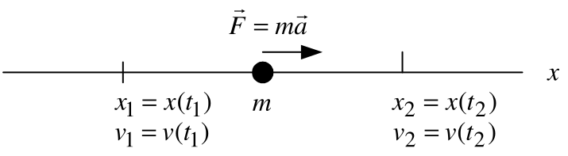{fig-align="center" width="34%"}

- $x(t)$, $v(t)=\dfrac{dx(t)}{dt}$, and $a(t)=\dfrac{d^2x(t)}{dt^2}$ denote position, velocity, and acceleration.

- By Newton's law,
  $$F=ma=m\frac{dv}{dt}=m\frac{d^2x}{dt^2}.$$

- The work $W$ done on $m$ by $F$ from $x_1$ to $x_2$ is
  $$W\triangleq\int_{x_1}^{x_2}F(x)\,dx.$$

- Define $x_1=x(t_1)$, $v_1=v(t_1)$, $x_2=x(t_2)$, and $v_2=v(t_2)$. Then
  $$W=\int_{x_1}^{x_2}F(x)\,dx
  =\int_{t_1}^{t_2}\underbrace{m\frac{dv}{dt}}_{F}\underbrace{v\,dt}_{dx}.$$
:::

---

::: {.roomy-slide}
**Work and Kinetic Energy**

We have

$$\begin{aligned}
W\triangleq\int_{x_1}^{x_2}F(x)\,dx
&=\int_{t_1}^{t_2}m\frac{dv}{dt}v\,dt \\
&=\int_{t_1}^{t_2}\frac{d}{dt}\left(\frac{mv^2}{2}\right)dt \\
&=\left.\frac{mv^2}{2}\right|_{v_1}^{v_2} \\
&=\frac{1}{2}mv_2^2-\frac{1}{2}mv_1^2.
\end{aligned}$$

- The kinetic energy (KE) of the mass is defined to be $\dfrac{1}{2}mv^2$.

- The work done on $m$ equals the change in its kinetic energy:
  $$\int_{x_1}^{x_2}F(x)\,dx
  =\frac{1}{2}mv_2^2-\frac{1}{2}mv_1^2.$$
:::

---

::: {.compact-slide}
**Example** *Horizontal Mass–Spring–Damper System*

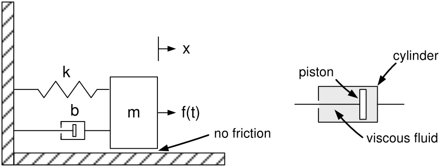{fig-align="center" width="40%"}

- If $x=0$, the spring is neither compressed nor stretched—it is *relaxed*.

- The force on the mass $m$ due to the spring is $F_{mk}=-kx$.

  - If $x>0$, the spring pulls $m$ to the left.
  - If $x<0$, the spring pushes $m$ to the right.

- A damper consists of a piston encased in a sealed, fluid-filled cylinder. The piston's motion is opposed by the viscous fluid.

- The force of the damper on $m$ is $F_{mb}=-b\dot{x}$.

  - If $\dot{x}>0$, the fluid provides a resistive force in the $-x$ direction.
  - If $\dot{x}<0$, the fluid provides a resistive force in the $+x$ direction.
:::

---

::: {.roomy-slide}
**Example** *Horizontal Mass–Spring–Damper System* **(continued)**

$f(t)$ denotes an external force:

$$m\frac{d^2x}{dt^2}=-kx-b\frac{dx}{dt}+f(t),$$

or

$$m\frac{d^2x}{dt^2}+b\frac{dx}{dt}+kx=f(t).$$

With zero initial conditions, the Laplace transform gives

$$(ms^2+bs+k)X(s)=F(s),$$

so

$$X(s)=\frac{1}{ms^2+bs+k}F(s).$$

With nonzero initial conditions,

$$X(s)=
\underbrace{\frac{1}{ms^2+bs+k}}_{\text{transfer function}}
\underbrace{F(s)}_{\text{input}}
+\underbrace{\frac{mx(0)s+bx(0)+m\dot{x}(0)}{ms^2+bs+k}}_{\text{initial-condition response}}.$$
:::

---

::: {.compact-slide}
**Example:** *Vertical Mass–Spring–Damper System*

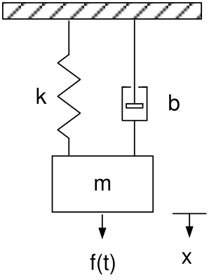{fig-align="center" width="15%"}

Equations of motion:

$$m\frac{d^2x}{dt^2}=-kx-b\frac{dx}{dt}+mg+f(t),$$

or

$$m\frac{d^2x}{dt^2}+b\frac{dx}{dt}+kx=mg+f(t).$$

At $x=0$, the spring is relaxed. With zero initial conditions,

$$(ms^2+bs+k)X(s)=F(s)+\frac{mg}{s},$$

so

$$X(s)=\frac{1}{ms^2+bs+k}\left(F(s)+\frac{mg}{s}\right).$$
:::

---

::: {.compact-slide}
**Example:** *Vertical Mass–Spring–Damper System* **(continued)**

With $f(t)\equiv0$,

$$m\frac{d^2x}{dt^2}+b\frac{dx}{dt}+kx=mg.$$

- Equilibrium means the mass $m$ is at rest: $\dot{x}=\ddot{x}\equiv0$.

- At equilibrium, $kx_0=mg$, so $x_0=mg/k$. With $\Delta x=x-x_0$,

$$\begin{aligned}
m\frac{d^2}{dt^2}(\Delta x+x_0)
+b\frac{d}{dt}(\Delta x+x_0)
+k(\Delta x+x_0)&=mg+f(t),\\
m\frac{d^2\Delta x}{dt^2}
+b\frac{d\Delta x}{dt}
+k\Delta x
+\underbrace{m\frac{d^2x_0}{dt^2}+b\frac{dx_0}{dt}}_{0}
+\underbrace{kx_0}_{mg}&=mg+f(t),\\
m\frac{d^2\Delta x}{dt^2}
+b\frac{d\Delta x}{dt}
+k\Delta x&=f(t).
\end{aligned}$$

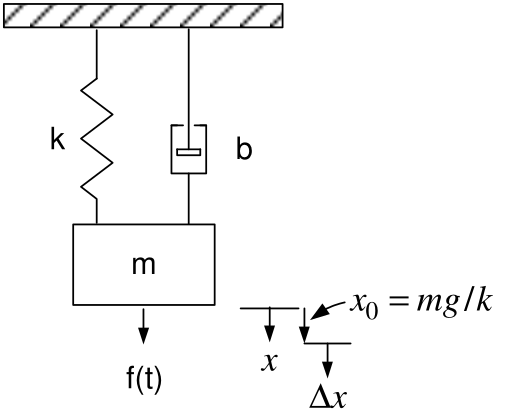{fig-align="center" width="20%"}
:::

---

::: {.compact-slide}
**Example:** *Mass–Spring–Damper System with Two Masses*

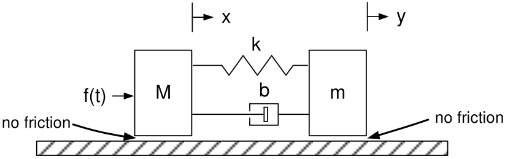{fig-align="center" width="38%"}

- The input is $f(t)$ and the output is $y(t)$. The references $x$ and $y$ locate $M$ and $m$, respectively.

- If $x=y$, the spring is relaxed.

- Spring forces: $F_{mk}=-k(y-x)$ and $F_{Mk}=+k(y-x)$.

  - If $y-x>0$, the spring pulls $m$ in the $-y$ direction and $M$ in the $+x$ direction.

- Damper forces: $F_{mb}=-b(\dot{y}-\dot{x})$ and $F_{Mb}=+b(\dot{y}-\dot{x})$.

  - If $\dot{y}-\dot{x}>0$, the cylinder $m$ moves right faster than the piston $M$.
  - The piston produces a resistive force on the cylinder, while the cylinder drags the piston to the right.
:::

---

::: {.roomy-slide}
**Example:** *Mass–Spring–Damper System with Two Masses* **(continued)**

Equations of motion:

$$\begin{aligned}
m\frac{d^2y}{dt^2}
&=\underbrace{-k(y-x)}_{F_{mk}}-\underbrace{b(\dot{y}-\dot{x})}_{F_{mb}},\\
M\frac{d^2x}{dt^2}
&=\underbrace{k(y-x)}_{F_{Mk}}+\underbrace{b(\dot{y}-\dot{x})}_{F_{Mb}}+f(t).
\end{aligned}$$

Equivalently,

$$\begin{aligned}
m\frac{d^2y}{dt^2}+b\dot{y}+ky&=kx+b\dot{x},\\
M\frac{d^2x}{dt^2}+b\dot{x}+kx&=ky+b\dot{y}+f(t).
\end{aligned}$$

With zero initial conditions, the Laplace transforms are

$$\begin{aligned}
(ms^2+bs+k)Y(s)&=(bs+k)X(s),\\
(Ms^2+bs+k)X(s)&=(bs+k)Y(s)+F(s).
\end{aligned}$$
:::

---

::: {.roomy-slide}
**Example:** *Mass–Spring–Damper System with Two Masses* **(continued)**

From the previous slide,

$$\begin{aligned}
(ms^2+bs+k)Y(s)&=(bs+k)X(s),\\
(Ms^2+bs+k)X(s)&=(bs+k)Y(s)+F(s).
\end{aligned}$$

Eliminate $X(s)$ to solve for $Y(s)$:

$$\begin{aligned}
(Ms^2+bs+k)\frac{ms^2+bs+k}{bs+k}Y(s)&=(bs+k)Y(s)+F(s),\\
(Ms^2+bs+k)(ms^2+bs+k)Y(s)&=(bs+k)^2Y(s)+(bs+k)F(s).
\end{aligned}$$

Then

$$\begin{aligned}
Y(s)&=\frac{bs+k}{(Ms^2+bs+k)(ms^2+bs+k)-(bs+k)^2}F(s)\\
&=\underbrace{\frac{bs+k}{Mms^4+(Mb+mb)s^3+(Mk+mk)s^2}}_{\text{transfer function }G(s)}F(s).
\end{aligned}$$

- $G(s)$ is unstable because it has two poles at $s=0$.
:::

---

::: {.compact-slide}
**Example** *Spring–Mass–Damper System with a Massless Point*

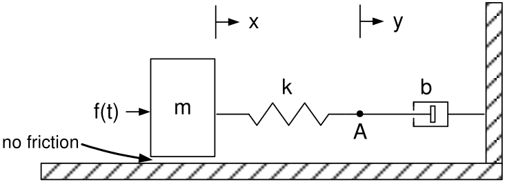{fig-align="center" width="36%"}

- Point $A$ is the massless connection point of the spring and piston; $y(t)$ locates it.

- The input is $f(t)$ and the output is $y(t)$.

- First let point $A$ have a small mass $m_A$; later let $m_A\to0$.

$$\begin{aligned}
m\frac{d^2x}{dt^2}&=k(y-x)+f(t),\\
m_A\frac{d^2y}{dt^2}&=-k(y-x)-b\frac{dy}{dt}.
\end{aligned}$$

Equivalently,

$$\begin{aligned}
m\frac{d^2x}{dt^2}+kx&=ky+f(t),\\
m_A\frac{d^2y}{dt^2}+b\frac{dy}{dt}+ky&=kx.
\end{aligned}$$
:::

---

::: {.roomy-slide}
**Example** *Spring–Mass–Damper System with a Massless Point* **(continued)**

From the previous slide,

$$\begin{aligned}
m\frac{d^2x}{dt^2}+kx&=ky+f(t),\\
m_A\frac{d^2y}{dt^2}+b\frac{dy}{dt}+ky&=kx.
\end{aligned}$$

Let $m_A\to0$ and take Laplace transforms with zero initial conditions:

$$\begin{aligned}
(ms^2+k)X(s)&=kY(s)+F(s),\\
(bs+k)Y(s)&=kX(s).
\end{aligned}$$

Eliminating $X(s)$ gives

$$(ms^2+k)(bs+k)Y(s)=k^2Y(s)+kF(s),$$

and therefore

$$Y(s)=\frac{k}{(ms^2+k)(bs+k)-k^2}F(s)
=\underbrace{\frac{k}{bms^3+kms^2+bks}}_{\text{transfer function }G(s)}F(s).$$

$G(s)$ is unstable because it has a pole at $s=0$.
:::

---

::: {.compact-slide}
**Example:** *Position Input and Massless Point*

::: {.columns}
::: {.column width="57%"}
- The input is the position $y$; the output is the position $x$.

- No mass is shown on the right side of the spring.

  - Let $m_p$ denote the mass of the piston to which the spring is attached.
  - Later, let $m_p\to0$.
  - $z$ denotes the piston position.

- If $y=z$, spring $k_1$ is relaxed; if $x=0$, spring $k_2$ is relaxed.

- The relative velocity between the piston and cylinder is $\dot{z}-\dot{x}$.
:::

::: {.column width="43%"}
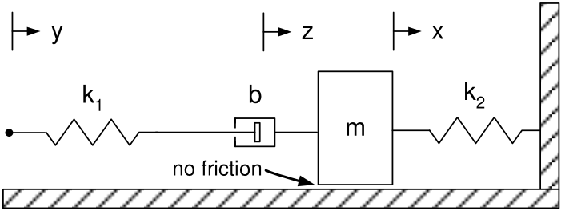{fig-align="center" width="95%"}

Equations of motion:

$$\begin{aligned}
m\ddot{x}&=-k_2x+b(\dot{z}-\dot{x}),\\
m_p\ddot{z}&=-b(\dot{z}-\dot{x})-k_1(z-y).
\end{aligned}$$
:::
:::
:::

---

::: {.roomy-slide}
**Example:** *Position Input and Massless Point* **(continued)**

$$\begin{aligned}
m\ddot{x}&=-k_2x+b(\dot{z}-\dot{x}),\\
m_p\ddot{z}&=-b(\dot{z}-\dot{x})-k_1(z-y).
\end{aligned}$$

Rearrange and take Laplace transforms with zero initial conditions:

$$\begin{aligned}
m\ddot{x}+k_2x+b\dot{x}&=b\dot{z},
& (ms^2+bs+k_2)X(s)&=bsZ(s),\\
m_p\ddot{z}+b\dot{z}+k_1z&=b\dot{x}+k_1y,
& (m_ps^2+bs+k_1)Z(s)&=bsX(s)+k_1Y(s).
\end{aligned}$$

Eliminate $Z(s)$:

$$(m_ps^2+bs+k_1)(ms^2+bs+k_2)X(s)
=b^2s^2X(s)+k_1bsY(s).$$

Let $m_p=0$:

$$\begin{aligned}
X(s)
&=\frac{k_1bs}{(bs+k_1)(ms^2+bs+k_2)-b^2s^2}Y(s)\\
&=\underbrace{\frac{k_1bs}{bms^3+mk_1s^2+(bk_1+bk_2)s+k_1k_2}}_{\text{transfer function}}Y(s).
\end{aligned}$$
:::

---

::: {.compact-slide}
::: {.center}
Simulation
:::

**First-Order System**

$$\frac{dx}{dt}=-ax+bu,\qquad x(0)=x_0.$$

Convert to *discrete time*. Let $x(kT)$ and $u(kT)$ denote the values of $x(t)$ and $u(t)$ at time $kT$.

Approximate $dx/dt$ at time $(k+1)T$ by

$$\left.\frac{dx}{dt}\right|_{t=(k+1)T}
=\frac{x((k+1)T)-x(kT)}{T}.$$

The discrete-time model is

$$\frac{x((k+1)T)-x(kT)}{T}=-ax(kT)+bu(kT),
\qquad x(0)=x_0.$$

Rearranging,

$$x((k+1)T)=(1-aT)x(kT)+Tbu(kT),
\qquad x(0)=x_0.$$
:::

---

::: {.spread-slide}
**Discrete-Time Model**

A digital computer simulates the discrete-time model

$$x((k+1)T)=(1-aT)x(kT)+Tbu(kT),
\qquad x(0)=x_0.$$

For example, let $x_0=1$ and $u(t)=\cos(t)$. Then

$$\begin{aligned}
x(T)&=(1-aT)x(0)+Tb\cos(0),\\
x(2T)&=(1-aT)x(T)+Tb\cos(T),\\
x(3T)&=(1-aT)x(2T)+Tb\cos(2T),\\
&\ \vdots
\end{aligned}$$

That is, digital computers implement recursive algorithms.
:::

---

::: {.compact-slide}
**Simulink Diagram**

$$\frac{dx}{dt}=-ax+bu,\qquad x(0)=x_0.$$

Let $u$ be a *unit-step* input. A **Simulink** diagram for this system is

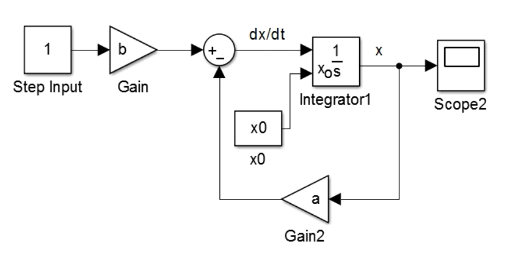{fig-align="center" width="45%"}

**Simulink converts** the block diagram to the discrete-time form

$$x((k+1)T)=(1-aT)x(kT)+Tbu(kT),
\qquad x(0)=x_0.$$

Simulink uses $1/s$ to denote the integration block.
:::

---

::: {.compact-slide}
**Simulink Diagram (continued)**

With zero initial conditions, we can represent

$$\frac{dx}{dt}=-ax+bu$$

by

$$X(s)=\frac{b}{s+a}U(s).$$

The Simulink block diagram is

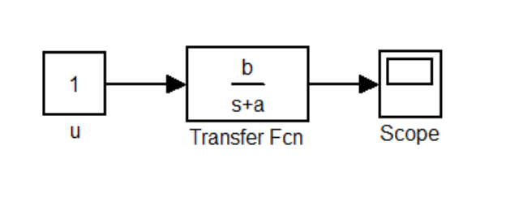{fig-align="center" width="33%"}

- Simulink then **converts** this to
  $$x((k+1)T)=(1-aT)x(kT)+Tbu(kT).$$

- When using a transfer-function block, Simulink assumes zero initial conditions.

- $u$ is a unit-step input, so a “1” is inside the `constant` block.

  - $u(kT)=1$ for $k=0,1,2,\ldots$
  - Do not put $1/s$ in this block.
:::

---

::: {.roomy-slide}
**Example** Simulation of
$m\dfrac{d^2x}{dt^2}=-kx-b\dfrac{dx}{dt}+f(t)$

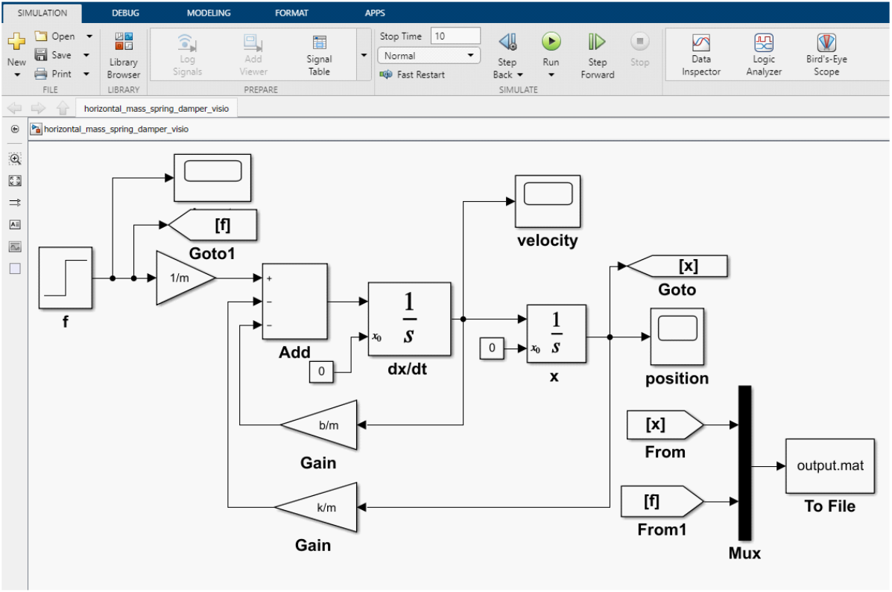{fig-align="center" width="72%"}

- `SIMULATION` is selected at the upper left of the Simulink file.

- Click `MODELING`, then click `Model Settings` (the gear icon).

- This opens the `Configuration Parameters` dialog box.
:::

---

::: {.roomy-slide}
**Example** Simulation of
$m\dfrac{d^2x}{dt^2}=-kx-b\dfrac{dx}{dt}+f(t)$ **(continued)**

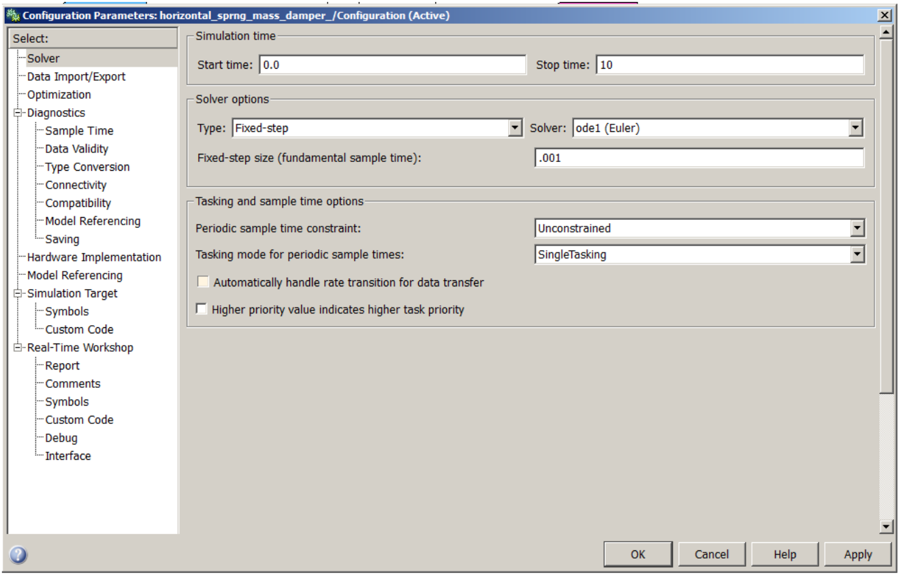{fig-align="center" width="82%"}

::: {.center}
*Dialog box for the Configuration Parameters.*
:::
:::

---

::: {.roomy-slide}
**Example** Simulation of
$m\dfrac{d^2x}{dt^2}=-kx-b\dfrac{dx}{dt}+f(t)$ **(continued)**

::: {.columns}
::: {.column width="60%"}
- The data is stored in a MATLAB data file called `output.mat`.

- Double-click the “To File” block to open it.

  - The data in this file is called `outputdata`.
  - It is an array (matrix) of three rows.
  - The first row is time $t$, the second is position $x$, and the third is the input $f$.
:::

::: {.column width="40%"}
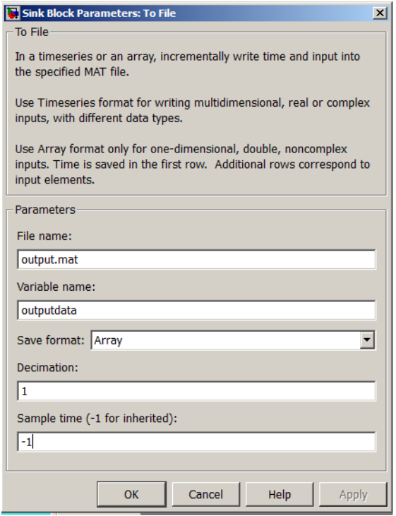{fig-align="center" width="90%"}
:::
:::
:::
