::: {.contents-slide style="box-sizing: border-box; padding-left: 1.7em; padding-right: 1.7em;"}
# Contents

- Moment of Inertia

- Newton’s Law of Rotational Motion

- Gears

- Rolling Cylinder
:::

---

::: {.compact-slide}

Moment of Inertia

Consider a cylinder constrained to rotate about a fixed axis.

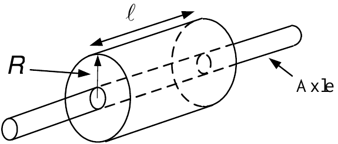

-   $\omega$ denotes the angular speed of the cylinder.

-   $\rho$ denotes the mass density of the material making up the cylinder.

-   $\Delta m_{i}=\rho r_{i}\Delta \theta \Delta \ell \Delta r$ is the mass of a small piece of the cylinder at $r_{i}$ from the axis.

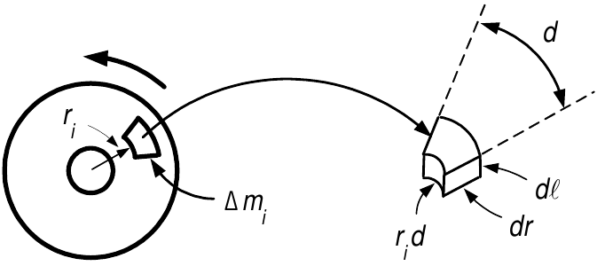

-   Each piece of mass $\Delta m_{i}$ is rotating at the same angular speed $\omega .$

-   The *linear* speed of $\Delta m_{i}$ is $v_{i}=r_{i}\omega .$

-   The kinetic energy of $\Delta m_{i}$ is $KE_{i}=\dfrac{1}{2}\Delta
    m_{i}v_{i}^{2}=\dfrac{1}{2}\Delta m_{i}(r_{i}\omega )^{2}.$
:::

---

::: {.compact-slide}
**Moment of Inertia and Kinetic Energy**

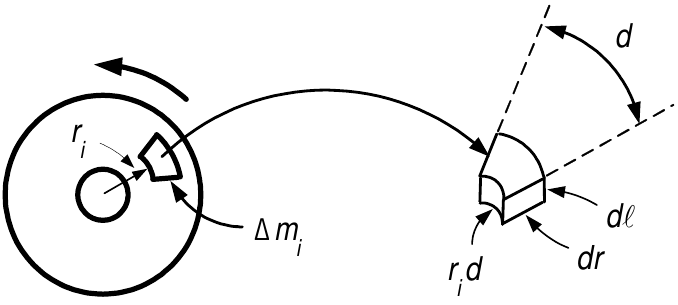

-   The cylinder is made up of $n$ small masses $\Delta m_{i}=\rho
    r_{i}\Delta \theta \Delta \ell \Delta r.$

-   Total kinetic energy:$$KE=\sum_{i=1}^{n}\left( KE\right) _{i}=\sum_{i=1}^{n}\frac{1}{2}\Delta
    m_{i}v_{i}^{2}=\sum_{i=1}^{n}\frac{1}{2}\Delta m_{i}\left( r_{i}\omega
    \right) ^{2}=\frac{1}{2}\omega ^{2}\!\sum_{i=1}^{n}\Delta m_{i}r_{i}^{2}.$$

-   Let $n\rightarrow \infty ,\Delta m_{i}\rightarrow 0$ so$$J=\lim_{\substack{ n\rightarrow \infty  \\ \Delta m_{i}\rightarrow 0}}\text{
    }\sum_{i=1}^{n}\Delta m_{i}r_{i}^{2}=\iiint_{cylinder}r^{2}dm.$$

-   $J$ is the *moment of inertia*.

-   The kinetic energy of the cylinder is $KE=\frac{1}{2}J\omega ^{2}.$

-   With the axle radius taken to be zero: $$J=\int_{0}^{R}\int_{0}^{\ell }\int_{0}^{2\pi }r^{2}\rho rd\theta d\ell dr=\frac{1}{2}(\pi R^{2}\ell \rho )R^{2}=\frac{1}{2}MR^{2}.$$
:::

---

::: {.compact-slide}

Newton's Law of Rotational Motion

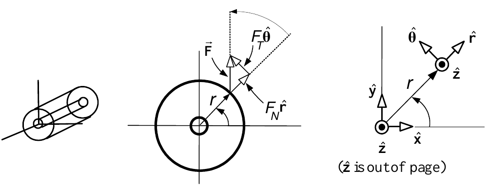

The cylinder is constrained to rotate about the $z$ axis.

${{\vec{\mathbf{F}}}}$ is applied to the cylinder at $(r,\theta ).$

${{\vec{\mathbf{r}}=r}}\mathbf{\hat{r}}$ is the point of application of the force ${{\vec{\mathbf{F}}.}}$

${{\vec{\mathbf{F}}}}=F_{N}\mathbf{\hat{r}}+F_{T}\mathbf{\hat{\theta}.}$

$F_{T}$ is tangent to the rotational motion and $F_{N}$ is normal to the rotational motion.

$\psi$ is the angle from ${{\vec{\mathbf{r}}}}$ to ${{\vec{\mathbf{F}}}}$.

**Definition** *Torque* $${{\vec{\mathbf{\tau }}}}\triangleq {{\vec{\mathbf{r}}}}\times {{\vec{\mathbf{F}}}}=r\mathbf{\hat{r}}\times \left( F_{N}\mathbf{\hat{r}}+F_{T}\mathbf{\hat{\theta}}\right) =rF_{N}\underset{\boldsymbol{\vec{0}}}{\underbrace{\mathbf{\hat{r}}\times \mathbf{\hat{r}}}}+rF_{T}\underset{\mathbf{\hat{z}}}{\underbrace{\mathbf{\hat{r}\times \hat{\theta}}}}=rF_{T}\mathbf{\hat{z}}=r|{{\vec{\mathbf{F}}}}|\sin (\psi )\mathbf{\hat{z}.}$$
:::

---

::: {.compact-slide}
**Torque**

-   The *magnitude* of ${{\vec{\mathbf{r}}}}\times {{\vec{\mathbf{F}}}}$ is $|{{\vec{\mathbf{r}}}}||{{\vec{\mathbf{F}}}}|\sin (\psi )=r|{{\vec{\mathbf{F}}}}|\sin (\psi ).$

-   The *direction* of ${{\vec{\mathbf{r}}}}\times {{\vec{\mathbf{F}}}}$ is perpendicular to both ${{\vec{\mathbf{r}}}}$ and ${{\vec{\mathbf{F}}}}$ along the *axis of rotation* $\mathbf{\hat{z}}$.

-   Right hand rule:

    -   Curl the fingers of your right hand in the direction from ${{\vec{\mathbf{r}}}}$ to ${{\vec{\mathbf{F}}}}$.

    -   Your thumb points in the direction of ${{\vec{\mathbf{r}}}}\times {{\vec{\mathbf{F}}}}$.

-   ${{\vec{\mathbf{\tau }}}}=\tau \mathbf{\hat{z}}=rF_{T}\mathbf{\hat{z}}$ or in scalar form:$$\tau =rF_{T}.$$

-   Rotation about an axis is due to the applied tangential force $F_{T}$.

-   Torque (cause of angular acceleration) increases if either $r$ or $F_{T}$ increases.

    -   For the same $F_{T}$ it easier to accelerate a merry-go-round by pushing at its edge rather than close to its center axis.
:::

---

::: {.compact-slide}
**Newton's Law of Rotational Motion  **

$\mathbf{\tau }=Jd\mathbf{\omega }/dt$

-   Let ${{\vec{\mathbf{F}}}}$ act on the cylinder to move (rotate) it by a displacement $d{{\vec{\mathbf{s}}}}\triangleq ds\mathbf{\hat{\theta}}=rd\theta \mathbf{\hat{\theta}}$.

-   The change in work done by this force is $$dW={{\vec{\mathbf{F}}}}\cdot d{{\vec{\mathbf{s}}}}=F_{T}rd\theta =\tau
    d\theta .$$

-   Dividing by $dt$, the power (rate of work) delivered to the cylinder is $$\frac{dW}{dt}=\tau \frac{d\theta }{dt}=\tau \omega .$$

-   As the rate of work done equals the rate of change of kinetic energy: $$\frac{dW}{dt}=\frac{d}{dt}\left( \frac{1}{2}J\omega ^{2}\right) =\tau \frac{d\theta }{dt}\text{ or }J\omega \frac{d\omega }{dt}=\tau \omega .$$

-   Newton's Law of Rotational Motion: $\tau =J\dfrac{d\omega }{dt}.$
:::

---

::: {.compact-slide}
**Viscous Friction Torque**

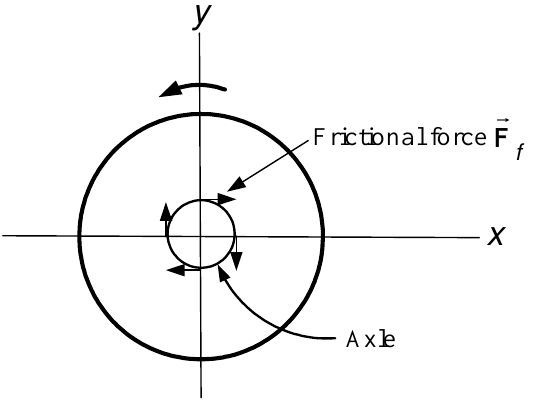

-   There are usually frictional torques acting between the axle and the bearings.

-   *Viscous friction*: This frictional force is proportional to the angular speed $\omega$.

-   Viscous friction is mathematically modeled by$${{\vec{\mathbf{\tau }}}}=-f{{\vec{\mathbf{\omega }}}}=-f\omega \mathbf{\hat{z}}$$or, in scalar form, $$\tau =-f\omega .$$

-   $f>0$ is the *coefficient of viscous friction*.

-   Recall: The angular velocity vector ${{\vec{\mathbf{\omega }}}}=\omega 
    \mathbf{\hat{z}}$ also points along the axis of rotation.
:::

---

::: {.compact-slide}
**Sign Convention for Torque**

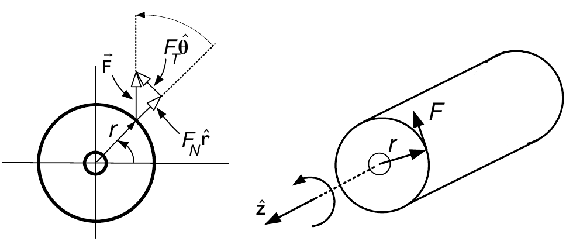

-   Let the axis of rotation be the $z$ axis.

-   ${{\vec{\mathbf{\tau }}}}\triangleq {{\vec{\mathbf{r}}}}\times {{\vec{\mathbf{F}}}}=r|{{\vec{\mathbf{F}}}}|\sin (\psi )\mathbf{\hat{z}}=rF_{T}\mathbf{\hat{z}}=\tau \mathbf{\hat{z}}$

-   $\psi$ is the angle from ${{\vec{\mathbf{r}}}}$ to ${{\vec{\mathbf{F}}}}$.

-   Systems are designed so that the applied force is tangential to the rotational motion.

    -   I.e., $\psi =\pi /2$ so that $F_{T}=|{{\vec{\mathbf{F}}}}|\sin (\psi
        )=|{{\vec{\mathbf{F}}}}|$.

-   In engineering texts, the sign convention for torque is indicated by a curved arrow.

-   If $\tau =rF_{T}>0$ the torque rotates the cylinder in the direction of the curved arrow.

-   If $\tau =rF_{T}<0$ the torque rotates the cylinder in the *opposite* direction.

-   Physics texts prefer to write ${{\vec{\mathbf{\tau }}}}\triangleq \tau 
    \mathbf{\hat{z}.}$
:::

---

::: {.compact-slide}
<strong>Example</strong> <em>Rack and Pinion System</em>

-   Converts rotary motion to linear motion and vice-versa.

-   A torque $\tau$ applied to the shaft causes the pinion wheel to rotate.

-   The pinion moves the rack in the $x$ direction.

-   The input is the torque $\tau$ (produced by a motor).

-   The output is the rack position $x$.

-   The teeth on the pinion wheel and rack are meshed together.

    -   This means that $x=r\theta .$

-   $m$ is the mass of the rack and $J$ is the moment of inertia of the pinion wheel.

-   Let $F$ be the force of the pinion tooth on the rack tooth in the $x$ direction.

-   $-F$ is the reaction force of the rack tooth on the pinion tooth.
:::

---

::: {.compact-slide}
<strong>Example</strong> <em>Rack and Pinion System</em> <strong>(continued)</strong>

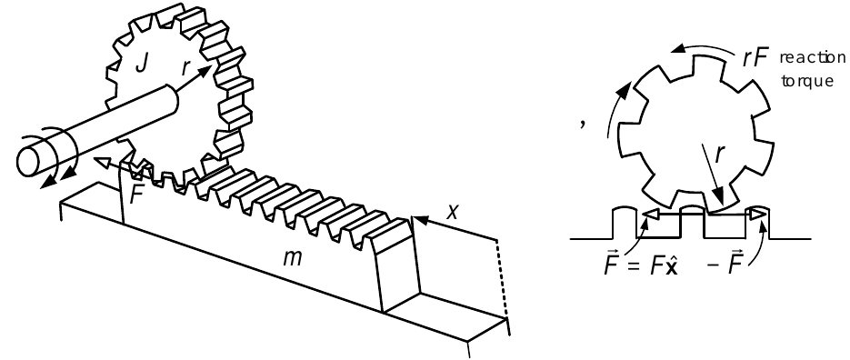

-   Newton's law applied to $m$: $\ $$$m\ddot{x}=F.$$

-   Newton's law of rotational motion applied to the pinion gear: $\ $$$J\ddot{\theta}=\tau -Fr.$$

-   $-Fr$ is the reaction torque on the pinion gear.

-   Multiply 1$^{st}$ eqn by $r$ and add to 2$^{nd}$ eqn: $$J\ddot{\theta}+mr\ddot{x}=\tau .$$

-   Eliminate $\theta$ using $\theta =x/r$ and multiply through by $r$: $\ (J+mr^{2})\ddot{x}=r\tau .$

-   The transfer function is then $\dfrac{X(s)}{\tau (s)}=\dfrac{r}{J+mr^{2}}\dfrac{1}{s^{2}}.$
:::

---

::: {.compact-slide}
<strong>Example</strong> <em>Rack and Pinion System</em> <strong>(continued)</strong>

*Equations of Motion Via Conservation of Energy*

-   $\theta =x/r$ and $\dot{\theta}=\dot{x}/r.$

-   The kinetic energy of the rack and pinion system is $$KE=\frac{1}{2}J\dot{\theta}^{2}+\frac{1}{2}m\dot{x}^{2}=\frac{1}{2}J\frac{\dot{x}^{2}}{r^{2}}+\frac{1}{2}m\dot{x}^{2}=\frac{1}{2}\!\left( \frac{J}{r^{2}}+m\right) \dot{x}^{2}.$$

-   $dW=\tau d\theta$ is the work done on the system by the external torque $\tau$.

-   The rate of work done equals the rate of change of kinetic energy: $$\tau \frac{d\theta }{dt}=\frac{d(KE)}{dt}.$$

Then $$\tau \frac{1}{r}\frac{dx}{dt}=\left( \frac{J}{r^{2}}+m\right) \!\dot{x}\ddot{x}$$or $$r\tau =(J+mr^{2})\ddot{x}.$$

The transfer function is $$\frac{X(s)}{\tau (s)}=\frac{r}{J+mr^{2}}\frac{1}{s^{2}}.$$
:::

---

::: {.compact-slide}
<strong>Example</strong> <em>Rack and Pinion System Connected to a Spring</em>

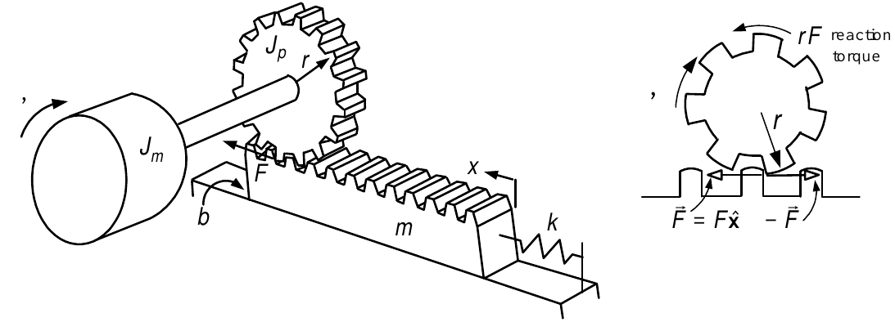

Compared with the previous example:

-   The rack is connected to the wall through a spring with spring constant $k$.

-   There is viscous friction between the rack and the support surface.

    -   $b$ is the viscous friction coefficient.

-   The pinion shaft has an additional moment of inertia $J_{m}.$

*Equations of Motion*

The input is $\tau$ and the output is $x$.

$F$ is the force of the pinion wheel tooth on the rack gear tooth. $$\begin{aligned}
(J_{m}+J_{p})\ddot{\theta} &=&\tau -Fr \\
m\ddot{x} &=&F-b\dot{x}-kx
\end{aligned}$$
:::

---

::: {.compact-slide}
<strong>Example</strong> <em>Rack and Pinion System Connected to a Spring</em> <strong>(continued)</strong>

From the previous slide:$$\begin{aligned}
(J_{m}+J_{p})\ddot{\theta} &=&\tau -Fr \\
m\ddot{x} &=&F-b\dot{x}-kx
\end{aligned}$$To eliminate $F$ we multiply the second equation by $r$ and add to the first:$$(J_{m}+J_{p})\ddot{\theta}+rm\ddot{x}=\tau -r(b\dot{x}+kx).$$

$x$ is the output so we eliminate $\theta$ using $x=r\theta .$$$(J_{m}+J_{p})\ddot{x}/r+rm\ddot{x}=\tau -rb\dot{x}-rkx.$$

Rearrange:$$(J_{m}+J_{p}+mr^{2})\ddot{x}+r^{2}b\dot{x}+kr^{2}x=\tau r.$$

Laplace transform with zero ICs: $$(J_{m}+J_{p}+mr^{2})s^{2}X(s)+r^{2}bsX(s)+kr^{2}X(s)=r\tau (s).$$

Transfer function:$$X(s)=\frac{r}{(J_{m}+J_{p}+mr^{2})s^{2}+r^{2}bs+kr^{2}}\tau (s).$$
:::

---

::: {.compact-slide}
<strong>Example</strong> <em>Rack and Pinion System Connected to a Spring</em> <strong>(continued)</strong>

*Equations of Motion Using Conservation of Energy*

-   $dW=\tau d\theta$ is the work done on the system by the external torque $\tau$.

-   By conservation of energy, this equals

    -   The change in the kinetic energy of $J_{m}+J_{p}$ and $m$

    -   Plus the change in the spring's potential energy

    -   Plus the heat dissipated due to the viscous friction.

In terms of power we have $$\begin{aligned}
\underset{\text{Input Mechanical Power}}{\underbrace{\tau \frac{d\theta }{dt}}} &=&\frac{d}{dt}\left( \underset{\text{KE}}{\underbrace{\frac{1}{2}(J_{m}+J_{p})\dot{\theta}^{2}+\frac{1}{2}m\dot{x}^{2}}}+\underset{\text{PE}}{\underbrace{\frac{1}{2}kx^{2}}}\right) +\underset{\text{Power Dissipated as
Heat}}{\underbrace{\left( b\dot{x}\right) \dot{x}}} \\
&& \\
&=&(J_{m}+J_{p})\dot{\theta}\ddot{\theta}+m\dot{x}\ddot{x}+kx\dot{x}+b\dot{x}^{2}.
\end{aligned}$$Eliminate $\theta$ using $x=r\theta$:$$\tau \frac{d(x/r)}{dt}=(J_{m}+J_{p})\frac{\dot{x}}{r}\frac{\ddot{x}}{r}+m\dot{x}\ddot{x}+kx\dot{x}+b\dot{x}^{2}.$$Multiply through by $r^{2}$ and cancel the common factor $\dot{x}$:$$\tau r=(J_{m}+J_{p}+mr^{2})\ddot{x}+r^{2}b\dot{x}+kr^{2}x$$Gives the same transfer function as before.
:::

---

::: {.compact-slide}
<strong>Example</strong> <em>Satellite with Solar Panels</em>

-   A satellite has solar panels to provide electric power.

-   The panels are flexible in order to make them light.

-   Model as two rigid bodies connected by a torsional spring and rotational damper.

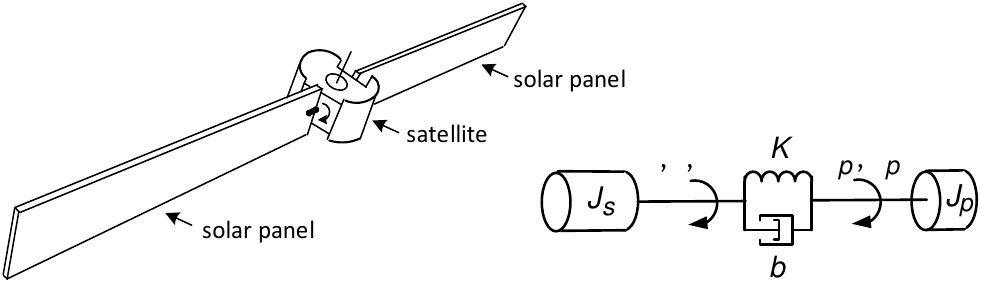

The dynamic equations of this satellite system are $$\begin{aligned}
    J_{s}\frac{d^{2}\theta }{dt^{2}} &=&-K(\theta -\theta _{p})-b\left( \frac{d\theta }{dt}-\frac{d\theta _{p}}{dt}\right) +\tau \\
    J_{p}\frac{d^{2}\theta _{p}}{dt^{2}} &=&K(\theta -\theta _{p})+b\left( \frac{d\theta }{dt}-\frac{d\theta _{p}}{dt}\right) .
    \end{aligned}$$Laplace transforms with zero initial conditions: $$\begin{aligned}
    s^{2}J_{s}\theta (s)+bs\theta (s)+K\theta (s) &=&bs\theta _{p}(s)+K\theta
    _{p}(s)+\tau (s) \\
    s^{2}J_{p}\theta _{p}(s)+bs\theta _{p}(s)+K\theta _{p}(s) &=&bs\theta
    (s)+K\theta (s).
    \end{aligned}$$
:::

---

::: {.compact-slide}
<strong>Example</strong> <em>Satellite with Solar Panels</em> <strong>(continued)</strong>

Previous slide:$$\begin{aligned}
s^{2}J_{s}\theta (s)+bs\theta (s)+K\theta (s) &=&bs\theta _{p}(s)+K\theta
_{p}(s)+\tau (s) \\
s^{2}J_{p}\theta _{p}(s)+bs\theta _{p}(s)+K\theta _{p}(s) &=&bs\theta
(s)+K\theta (s).
\end{aligned}$$

Rearrangement gives $$\begin{aligned}
\theta (s) &=&\frac{bs+K}{s^{2}J_{s}+bs+K}\theta _{p}(s)+\frac{1}{s^{2}J_{s}+bs+K}\tau (s) \\
\theta _{p}(s) &=&\frac{bs+K}{s^{2}J_{p}+bs+K}\theta (s).
\end{aligned}$$Eliminating $\theta _{p}(s)$ to obtain$$\theta (s)=\frac{bs+K}{s^{2}J_{s}+bs+K}\frac{bs+K}{s^{2}J_{p}+bs+K}\theta
(s)+\frac{1}{s^{2}J_{s}+bs+K}\tau (s).$$and rearrange $$\theta (s)=\frac{s^{2}J_{p}+bs+K}{s^{2}(J_{p}J_{s}s^{2}+b(J_{p}+J_{s})s+K(J_{p}+J_{s}))}\tau (s).$$Then $\theta _{p}(s)$ is simply found as $$\theta _{p}(s)=\frac{bs+K}{s^{2}J_{p}+bs+K}\theta (s)=\frac{bs+K}{s^{2}(J_{p}J_{s}s^{2}+b(J_{p}+J_{s})s+K(J_{p}+J_{s}))}\tau (s).$$
:::

---

::: {.compact-slide}
<strong>Example</strong> <em>Satellite with Solar Panels</em> <strong>(continued)</strong>

Summarizing $$\begin{aligned}
\theta (s) &=&\frac{s^{2}J_{p}+bs+K}{s^{2}(J_{p}J_{s}s^{2}+b(J_{p}+J_{s})s+K(J_{p}+J_{s}))}\tau (s) \\
&& \\
\theta _{p}(s) &=&\frac{bs+K}{s^{2}(J_{p}J_{s}s^{2}+b(J_{p}+J_{s})s+K(J_{p}+J_{s}))}\tau (s).
\end{aligned}$$

Collocation: Measure $\theta$

The sensor for $\theta$ of the motor shaft is at the same location as the actuator (motor).

Non Collocation: Measure $\theta _{p}$

Sensor for the solar panel angle $\theta _{p}$ and the actuator are not located next to each other.
:::

---

::: {.compact-slide .margin-safe-slide}

Gears

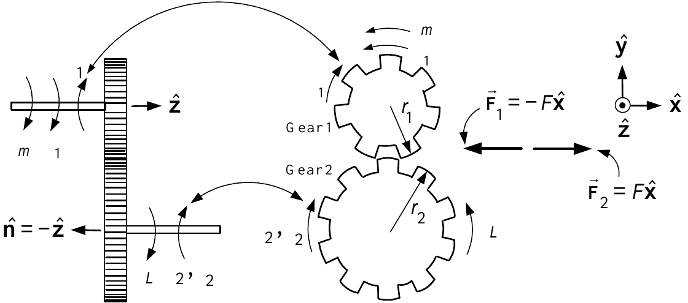

$\tau _{1}$ is the torque exerted on gear $1$ by gear $2.$

$\boldsymbol{\vec{F}}_{1}$ is the force exerted on gear $1$ by gear $2.$

$\tau _{2}$ is the torque exerted on gear $2$ by gear $1.$

$\boldsymbol{\vec{F}}_{2}$ is the force exerted on gear $2$ by gear $1.$

$\theta _{1}$ is the angle rotated by gear $1.$

$\theta _{2}$ is the angle rotated by gear $2.$

$n_{1}$ is the number of teeth on gear $1.$

$n_{2}$ is the number of teeth on gear $2.$

$r_{1}$ is the radius of gear $1.$

$r_{2}$ is the radius of gear $2.$
:::

---

::: {.compact-slide .margin-safe-slide}
**Coordinate Systems for the Two Gears**

-   ${{\vec{\mathbf{F}}}}_{1}=-F\mathbf{\hat{x}}\ $and ${{\vec{\mathbf{F}}}}_{2}\triangleq F\mathbf{\hat{x}}$ as ${{\vec{\mathbf{F}}}}_{1}$ &$\ {{\vec{\mathbf{F}}}}_{2}$ are equal in mag, but opposite in direction.

-   ${{\vec{\mathbf{F}}}}_{1}\triangleq F(-\mathbf{\hat{x}})$ so that if $F>0$, the force is in the $-\mathbf{\hat{x}}$ direction.

-   ${{\vec{\mathbf{r}}}}_{1}\triangleq r_{1}(-\mathbf{\hat{y}})$ so that ${{\vec{\mathbf{\tau }}}}_{1}={{\vec{\mathbf{r}}}}_{1}\times {{\vec{\mathbf{F}}}}_{1}=r_{1}F(-\mathbf{\hat{y}})\times (-\mathbf{\hat{x}})=r_{1}F(-\mathbf{\hat{z}})=r_{1}F\mathbf{\hat{n}}$.

    -   ${{\vec{\mathbf{\tau }}}}_{1}=\tau _{1}\mathbf{\hat{n}}$ where $\tau
        _{1}=r_{1}F$ and $\mathbf{\hat{n}\triangleq }-\mathbf{\hat{z}}$ is a unit vector.

-   ${{\vec{\mathbf{F}}}}_{2}\triangleq F\mathbf{\hat{x}}$ so that if $F>0$ the force is in the $\mathbf{\hat{x}}$ direction.

-   ${{\vec{\mathbf{r}}}}_{2}\triangleq r_{2}\mathbf{\hat{y}}$ and ${{\vec{\mathbf{\tau }}}}_{2}={{\vec{\mathbf{r}}}}_{2}\times {{\vec{\mathbf{F}}}}_{2}=r_{2}F(-\mathbf{\hat{z}})=-\tau _{2}\mathbf{\hat{z}}=\tau _{2}\mathbf{\hat{n}}$ with $\tau _{2}=r_{2}F$.
:::

---

::: {.compact-slide}
**Algebraic Relationships Between Two Gears**

\(1\) The gears have different radii, but the teeth on each gear are the same size.

  Thus the number of teeth on each gear is proportional to the radius of each gear.

  For example, if $r_{2}=2r_{1},$ then $n_{2}=2n_{1}$.

  In general, $$\frac{r_{2}}{r_{1}}=\frac{n_{2}}{n_{1}}\text{.}$$

\(2\)  As $\tau _{1}=r_{1}F$ and $\tau _{2}=r_{2}F$: $$\frac{\tau _{2}}{\tau _{1}}=\frac{r_{2}}{r_{1}}=\frac{n_{2}}{n_{1}}.$$

\(3\) Teeth on each gear are meshed together at the point of contact.

  Thus the distance traveled along the circumference of each gear is the same.

  I.e., $\theta _{1}r_{1}=\theta _{2}r_{2}$ $\Longrightarrow$$$\frac{\theta _{2}}{\theta _{1}}=\frac{r_{1}}{r_{2}}=\frac{n_{1}}{n_{2}}.$$

  This relationship is more easily remembered in the form$$\theta _{1}r_{1}=\theta _{2}r_{2}.$$
:::

---

::: {.compact-slide .margin-safe-slide}
**Dynamic Relationships Between Two Gears**

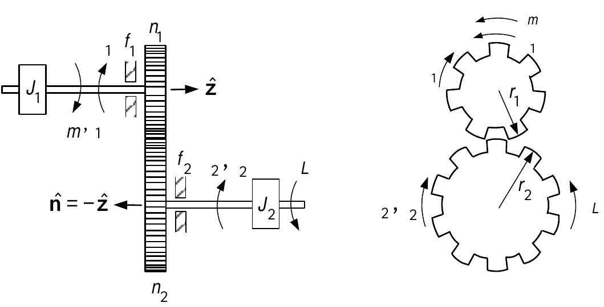

::: {.columns style="align-items: center; margin-top: 0.08em;"}
::: {.column width="68%"}
-   Sign conventions for $\tau _{m},\tau _{1},\tau _{2},\tau _{L}$ are indicated by the curved arrows.

-   If $\tau _{m}>0,\tau _{1}>0$ then they *oppose* each other.

-   If $\tau _{2}>0,$ $\tau _{L}>0$ then they *oppose* each other.

-   Load torque on gear $2$ is $\tau _{L}=r_{2}mg$ with $r_{2}$ the radius of the pick up reel (gear $2$).
:::
::: {.column width="32%"}

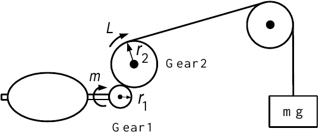

:::
:::
:::

---

::: {.compact-slide}
**Dynamic Relationships Between Two Gears**

$$\begin{aligned}
\tau _{m}-\tau _{1}-f_{1}\omega _{1} &=&J_{1}\frac{d\omega _{1}}{dt} \\
\tau _{2}-\tau _{L}-f_{2}\omega _{2} &=&J_{2}\frac{d\omega _{2}}{dt}.
\end{aligned}$$

-   Typically the motor torque $\tau _{m}$ is known and $\theta
    _{2},\omega _{2}$ are measured.

-   $\theta _{1}n_{1}=\theta _{2}n_{2}\Longrightarrow \omega
    _{1}n_{1}=\omega _{2}n_{2}.$

Substitute $\tau _{2}=\dfrac{n_{2}}{n_{1}}\tau _{1}$ and $\omega _{1}=\dfrac{n_{2}}{n_{1}}\omega _{2}$:$$\begin{aligned}
\tau _{m}-\tau _{1}-f_{1}\frac{n_{2}}{n_{1}}\omega _{2} &=&J_{1}\frac{n_{2}}{n_{1}}\frac{d\omega _{2}}{dt} \\
\frac{n_{2}}{n_{1}}\tau _{1}-\tau _{L}-f_{2}\omega _{2} &=&J_{2}\frac{d\omega _{2}}{dt}.
\end{aligned}$$Multiply $1^{st}$ equation by $\dfrac{n_{2}}{n_{1}}$ and add: $$\dfrac{n_{2}}{n_{1}}\tau _{m}-f_{1}\!\left( \frac{n_{2}}{n_{1}}\right)
^{\!2}\!\omega _{2}-f_{2}\omega _{2}-\tau _{L}=J_{1}\!\left( \frac{n_{2}}{n_{1}}\right) ^{\!2}\!\frac{d\omega _{2}}{dt}+J_{2}\frac{d\omega _{2}}{dt}$$or$$\frac{n_{2}}{n_{1}}\tau _{m}=\underset{J}{\underbrace{\left(
J_{2}+(n_{2}/n_{1})^{2}J_{1}\right) }}\!\frac{d\omega _{2}}{dt}+\underset{f}{\underbrace{\left( f_{2}+(n_{2}/n_{1})^{2}f_{1}\right) }}\omega _{2}+\tau _{L}.$$
:::

---

::: {.roomy-slide}
**Dynamic Relationships Between Two Gears**

From previous slide: $$\frac{n_{2}}{n_{1}}\tau _{m}=\underset{J}{\underbrace{\left(
J_{2}+(n_{2}/n_{1})^{2}J_{1}\right) }}\!\frac{d\omega _{2}}{dt}+\underset{f}{\underbrace{\left( f_{2}+(n_{2}/n_{1})^{2}f_{1}\right) }}\omega _{2}+\tau _{L}.$$

-   $n=\dfrac{n_{2}}{n_{1}}$ is the *gear ratio.*

-   $J\triangleq J_{2}+n^{2}\!J_{1}$ is the total moment of inertia *reflected to the output shaft.*

-   $f\triangleq f_{2}+n^{2}\!f_{1}$ is the total viscous friction coefficient *reflected to the output shaft*.

More succinctly:$$n\tau _{m}=J\frac{d\omega _{2}}{dt}+f\omega _{2}+\tau _{L}.$$

-   The gears increase the torque $\tau _{m}$ on the motor shaft to $n\tau
    _{m}$ on the output shaft.

-   The quantity $n^{2}J_{1}$ is added to the moment of inertia of the output shaft.

-   The viscous friction coefficient of the output shaft is increased by $n^{2}f_{1}.$
:::

---

::: {.compact-slide .margin-safe-slide}
**Rolling Mill**

-   Aluminum goes into the rollers at the thickness $T$ and comes out at thickness $x.$

-   The motor torque $\tau _{m}$ exerted on gear $1$ results in torque $\tau _{2}$ exerted on gear $2$.

-   Gear $2$ produces the force $F$ on the rack and top roller.

-   The force $F$ reduces the aluminum sheet to the thickness $x.$

-   $n=n_{2}/n_{1}=r_{2}/r_{1}$ and $f_{1}=f_{2}=0.$

-   The reaction force by the rolled sheet on the top roller is $F_{L}=k(T-x).$

-   $f_{rack}$ viscous friction coeff between the rack & the structure (not shown) holding it.

-   $-f_{rack}\dfrac{d}{dt}(T-x)$ is the corresponding friction force on the rack.

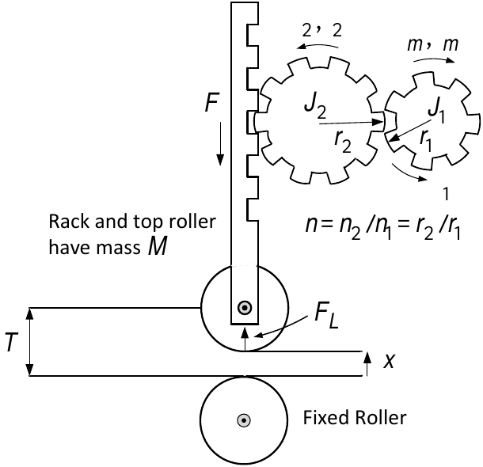

:::

---

::: {.compact-slide .margin-safe-slide}
**Rolling Mill (continued)**

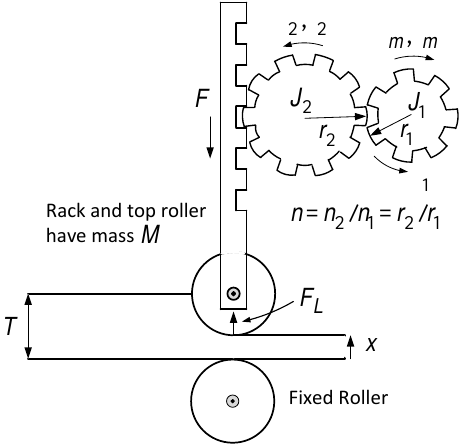

-   The gear equation with $n_{2}/n_{1}=r_{2}/r_{1}$ and $f_{1}=f_{2}=0$ is $$\frac{r_{2}}{r_{1}}\tau _{m}-\tau _{L}=\left( \!J_{2}+(r_{2}/r_{1})^{2}J_{1}\!\right) \frac{d\omega _{2}}{dt}.$$

-   The load torque is $\tau _{L}=r_{2}F.$

-   As $T-x=r_{2}\theta _{2}=r_{1}\theta _{m}$ $$\omega _{2}=\frac{1}{r_{2}}\frac{d}{dt}(T-x),\quad\frac{d\omega _{2}}{dt}=\frac{1}{r_{2}}\frac{d^{2}(T-x)}{dt^{2}}.$$

-   Substituting for $\omega _{2}$ and $\tau _{L}$ into the gear equation gives $$\frac{r_{2}}{r_{1}}\tau _{m}=\left( \!J_{2}+(r_{2}/r_{1})^{2}J_{1}\!\right) \frac{1}{r_{2}}\frac{d^{2}(T-x)}{dt^{2}}+r_{2}F.$$
:::

---

::: {.roomy-slide}
**Rolling Mill (continued)**

-   From previous slide. $$\frac{r_{2}}{r_{1}}\tau _{m}=\left( \!J_{2}+(r_{2}/r_{1})^{2}J_{1}\!\right) \frac{1}{r_{2}}\frac{d^{2}(T-x)}{dt^{2}}+r_{2}F$$

-   Newton's equation applied to the rack of mass $M.$ $$M\frac{d^{2}(T-x)}{dt^{2}}=F-f_{rack}\frac{d}{dt}(T-x)-F_{L}=F-f_{rack}\frac{d}{dt}(T-x)-k(T-x)$$

-   Eliminate $F$ from these two equations.$$\underset{J_{eq}}{\underbrace{\left( \!J_{2}+(r_{2}/r_{1})^{2}J_{1}\!+r_{2}^{2}M\!\right) }}\frac{d^{2}(T-x)}{dt^{2}}+r_{2}^{2}f_{rack}\frac{d}{dt}(T-x)+r_{2}^{2}k(T-x)=\frac{r_{2}^{2}}{r_{1}}\tau _{m}$$
:::

---

::: {.roomy-slide}
**Rolling Mill (continued)**

-   From previous slide$$\underset{J_{eq}}{\underbrace{\left( \!J_{2}+(r_{2}/r_{1})^{2}J_{1}\!+r_{2}^{2}M\!\right) }}\frac{d^{2}(T-x)}{dt^{2}}+r_{2}^{2}f_{rack}\frac{d}{dt}(T-x)+r_{2}^{2}k(T-x)=\frac{r_{2}^{2}}{r_{1}}\tau _{m}$$

-   Set $y=T-x,a_{0}=r_{2}^{2}k/J_{eq},a_{1}=r_{2}^{2}f_{rack}/J_{eq},b_{0}=r_{2}^{2}/(r_{1}J_{eq}),u=\tau _{m}$ to have $$\ddot{y}+a_{1}\dot{y}+a_{0}y=b_{0}u.$$

-   The transfer function is $$G(s)=\frac{Y(s)}{U(s)}=\frac{b_{0}}{s^{2}+a_{1}s+a_{0}}.$$As $a_{1}>0,a_{0}>0$ this transfer function is stable.

-   This rather complex mechanical device is described by a $2^{nd}$ order transfer function.

-   $G(s)$ is used to design a controller to regulate the thickness of the Al sheet.

-   Such controllers are presented in Chapters 9 & 10.
:::

---

::: {.compact-slide}
**Tension**

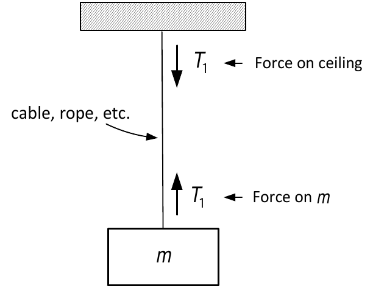

-   Block of mass $m$ tied to a ceiling through a cable.

-   There is a tension (force) $T_{1}$ upward on the mass $m$ by the cable.

-   At the top there is a tension (force) $T_{1}$ downward exerted on the ceiling.

-   Think of tension as a spring that can only be stretched *not* compressed.

    -   The cables "spring constant" is essentially infinite ($k=\infty$).

    -   When the two ends of a cable are pulled apart, the cable doesn't stretch.

    -   However, it produces restoring forces.
:::

---

::: {.compact-slide}
**Mass and Pulley System**

-   Two masses $m_{1}$ and $m_{2}$ connected about a pulley by a rope of length $\ell$.

-   The masses on either side put the rope under tension.

-   The rope stretches imperceptably providing a restoring force (tension).

-   $T_{1}>0$ means there is an upward force on $m_{1}$ and a downward force $T_{1}$ on the rhs of the pulley.

-   $T_{2}>0$ means an upward force on $m_{2}$ and a downward force $T_{2}$ on the lhs side of the pulley.

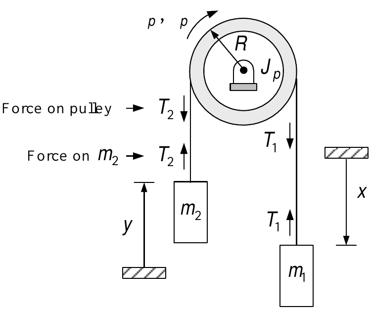

:::

---

::: {.compact-slide .margin-safe-slide}
**Mass and Pulley System (continued)**

-   The rope of length $\ell$ is such that $x=0$ $\Longrightarrow$ $y=0$ and so $y=x$.

-   Take $\theta _{p}=0$ when $x=y=0.$

-   The rope does not slip as the pulley rotates so $y=x=R\theta _{p}.$

::: {.columns style="align-items: center; margin-top: 0.08em;"}
::: {.column width="54%"}

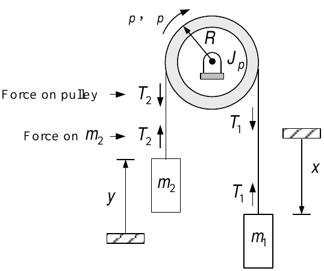

:::
::: {.column width="46%"}
The equations of motion are

$$\begin{aligned}
J_{p}\frac{d\omega _{p}}{dt} &=&RT_{1}-RT_{2} \\
m_{1}\frac{d^{2}x}{dt^{2}} &=&m_{1}g-T_{1} \\
m_{2}\frac{d^{2}y}{dt^{2}} &=&-m_{2}g+T_{2}.
\end{aligned}$$
:::
:::
:::

---

::: {.roomy-slide}
**Mass and Pulley System (continued)**

$$\begin{aligned}
J_{p}\frac{d\omega _{p}}{dt} &=&RT_{1}-RT_{2} \\
m_{1}\frac{d^{2}x}{dt^{2}} &=&m_{1}g-T_{1} \\
m_{2}\frac{d^{2}y}{dt^{2}} &=&-m_{2}g+T_{2}.
\end{aligned}$$

-   Take the pulley to be massless, i.e., set $J_{p}=0$ which gives $T_{1}=T_{2}.$

-   With $y=x$ the equations of motion reduce to $$\begin{aligned}
    m_{1}\frac{d^{2}x}{dt^{2}} &=&m_{1}g-T_{1} \\
    m_{2}\frac{d^{2}x}{dt^{2}} &=&-m_{2}g+T_{1}.
    \end{aligned}$$Adding these two equations to cancel $T_{1}$ we finally obtain $$\frac{d^{2}x}{dt^{2}}=\frac{m_{1}-m_{2}}{m_{1}+m_{2}}g.$$
:::

---

::: {.compact-slide}
**Rolling Cylinder: Combined Translational and Rotational Motion**

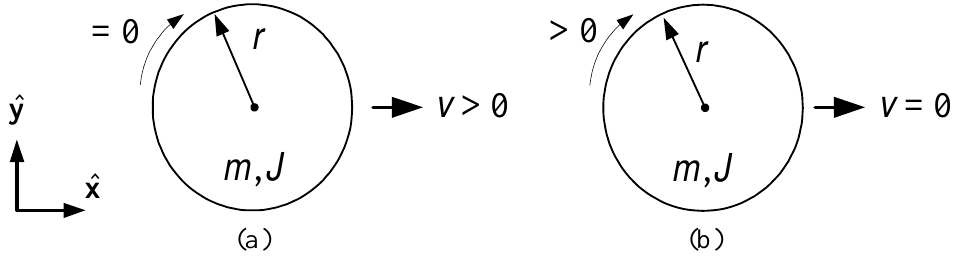

\(a\) A cylinder moving with translational velocity $v$.

-   It has no rotational velocity about its main axis.

-   Its kinetic energy is $\dfrac{1}{2}mv^{2}$.

\(b\) The same cylinder is rotating about its main axis.

-   It has no translational speed.

-   Its kinetic energy is $\dfrac{1}{2}J\omega ^{2}.$
:::

---

::: {.compact-slide}
**Combined Translational and Rotational Motion**

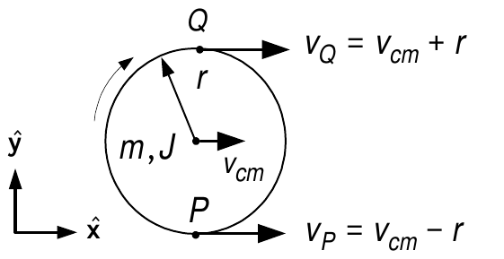

-   The cylinder's axis of rotation (contains the center of mass) has velocity $v_{cm}\mathbf{\hat{x}}.$

-   The cylinder is also rotating about its main axis with angular velocity $\omega$.

-   The point $Q$ of the cylinder has velocity $r\omega \mathbf{\hat{x}}$ *with respect to* the axis of rotation.

The *total velocity* of the point $Q$ is $$v_{Q}\mathbf{\hat{x}}=v_{cm}\mathbf{\hat{x}}+r\omega \mathbf{\hat{x}}.$$

-   The point $P$ of the cylinder has velocity $-r\omega \mathbf{\hat{x}}$ *with respect to* the axis of rotation.

-   Again, the axis of rotation (center of mass) has velocity $v_{cm}\mathbf{\hat{x}}$.

The *total velocity* of the point $P$ is $$v_{P}\mathbf{\hat{x}}=v_{cm}\mathbf{\hat{x}}-r\omega \mathbf{\hat{x}}.$$The *total kinetic energy* of the cylinder is $$\dfrac{1}{2}mv_{cm}^{2}+\dfrac{1}{2}J\omega ^{2}.$$
:::

---

::: {.compact-slide}
**Rolling on a Flat Surface Without Slipping**

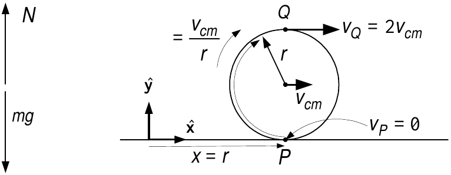

*No Slip Condition*

-   The cylinder rolls on a flat surface.

-   The center of mass of the cylinder is on the axis of rotation.

-   Rolling without slipping means $$x=r\theta .$$

-   $\theta$ is the angle the cylinder has rotated.

-   $x$ is the distance the cylinder has rotated along the surface.

-   Differentiating:$$\frac{dx}{dt}=r\omega \text{.}$$

-   The surface provides an upward normal force $N$ to cancel the force $mg$ of gravity.
:::

---

::: {.compact-slide}
**Rolling on a Flat Surface Without Slipping**

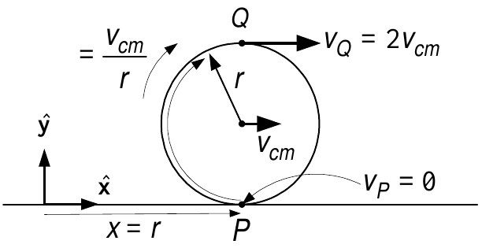

-   $P$ is the point of contact between the cylinder and the surface.

-   The center of mass is directly above the point $P$.

    -   The point of contact $P$ moves along the flat surface at velocity $dx/dt=r\omega .$

    -   So the center of mass (axis of rotation) also has velocity $dx/dt,$ i.e., $$v_{cm}=\frac{dx}{dt}.$$

-   The cylinder rotates about its center of mass with angular rate $$\omega =\frac{d\theta }{dt}=\frac{d(x/r)}{dt}=\frac{\dot{x}}{r}=\frac{v_{cm}}{r}.$$
:::

---

::: {.compact-slide}
**Rolling on a Flat Surface Without Slipping**

From the previous slide: $$v_{cm}=\frac{dx}{dt}\text{ and }\omega =\frac{v_{cm}}{r}.$$

Using the no slip condition we have $$\begin{aligned}
v_{Q} &=&v_{cm}+r\omega =2v_{cm} \\
v_{P} &=&v_{cm}-r\omega =0.
\end{aligned}$$

The *instantaneous* speed of the cylinder's surface at the point of contact $P$ is zero!

The kinetic energy is$$KE=\frac{1}{2}mv_{cm}^{2}+\frac{1}{2}J\omega ^{2}=\frac{1}{2}m\dot{x}^{2}+\frac{1}{2}\frac{J}{r^{2}}\dot{x}^{2}=\frac{1}{2}\!\left( m+\frac{J}{r^{2}}\right) \!\dot{x}^{2}.$$
:::

---

::: {.compact-slide}
**Cylinder Rolling Down an Inclined Plane**

-   The $x$ direction is taken to be positive going up the inclined plane.

-   The $y$ direction is perpendicular to the inclined plane.

-   The component of gravity $mg\sin (\phi )$ pulls the cylinder in the $-x$ direction.

-   There is a static friction force $F_{f}$ on the cylinder by the inclined plane.

    -   $F_{f}$ is the force that causes the cylinder to rotate!

    -   Visualize the interaction of the surfaces as a rack & pinion system.

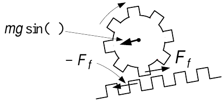

-   The cylinder exerts a force $-F_{f}$ on the surface.

-   $F_{f}$ is *not* viscous friction and so there is no energy loss (see next slide).
:::

---

::: {.compact-slide}
**Cylinder Rolling Down an Inclined Plane**

-   We assume the cylinder rolls without slipping so that $$\begin{aligned}
    x &=&r\theta \\
    && \\
    v_{cm} &=&\frac{dx}{dt}=r\omega .
    \end{aligned}$$

-   In this case $\omega <0$ as it is rolling down the inclined plane with $x$ decreasing.

-   The point of contact between the cylinder and inclined plane has *zero* velocity.

-   As the point of contact has zero velocity, the friction there is *static* not viscous!

-   Think of *viscous* friction as two bodies rubbing/slipping against each other.
:::

---

::: {.compact-slide}
**Digression: Static and Kinetic Friction**

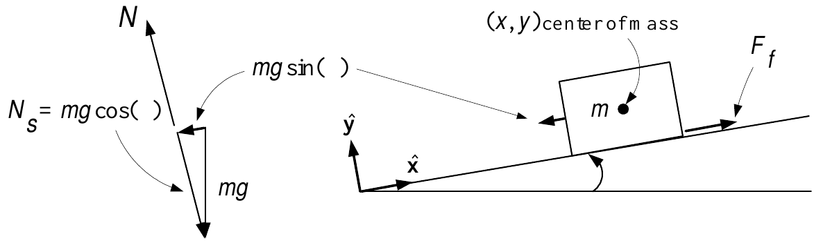

-   Consider a box on an incline.

-   If the angle $\phi$ is too small the box will not slide down the incline.

-   There is a static friction force $F_{f}$ between the surfaces of the box and the incline.

    -   This static friction cancels out the gravitational force $mg\sin (\phi
        )$.

    -   The static friction $F_{f}$ is limited to $0\leq F_{f}\leq F_{f\max }$ where $$F_{f\max }=\mu _{s}N_{s}=\mu _{s}mg\cos (\phi ).$$

    -   $F_{f\max }$ is the maximum static friction between the surfaces.

    -   $N_{s}=mg\cos (\phi )$ is the normal (to the incline) force *on* the box.

    -   $\mu _{s}$ is the empirically determined *coefficient of static friction*.
:::

---

::: {.compact-slide}
**Digression: Static and Kinetic Friction**

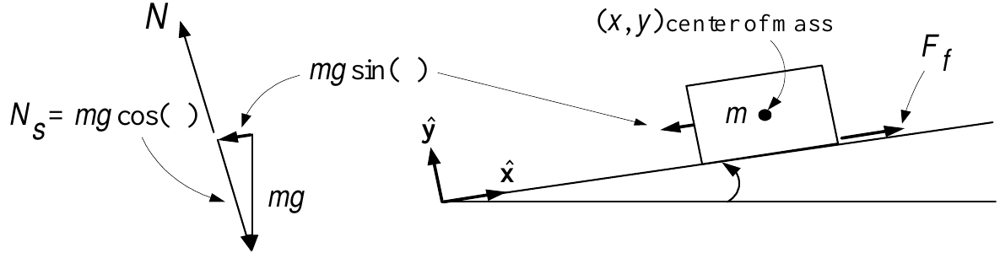

-   Suppose the gravitational force $mg\sin (\phi )$ is less than $F_{f\max }=\mu _{s}mg\cos (\phi )$.

    -   The box will sit on the incline and not move.

-   As the angle $\phi$ increases, $F_{f}$ increases to cancel out the force $mg\sin (\phi )$.

-   If $\phi$ is increased so that $mg\sin (\phi )>F_{f\max }=\mu
    _{s}mg\cos (\phi )$ the box will slide down.

    -   As the box slides down, it is opposed by *kinetic* friction $F_{kf}$ where$$F_{kf}=\mu _{k}mg\cos (\phi ),\quad\mu _{k}<<\mu _{s}$$

    -   This kinetic friction is much less than the static friction.

    -   This kinetic friction is used for two *dry* surfaces sliding against each other.

    -   Viscous friction is used for two *lubricated* surfaces sliding against each other.

        E.g., ball bearings on axels and shock absorbers (dampers).
:::

---

::: {.compact-slide}
**Equations of Motion of the Rolling Cylinder**

-   Newton's laws are valid with respect to *non accelerating* coordinate systems.

-   This is true of rotational law $\tau =Jd\omega /dt$ as well.

-   However, $\tau =Jd\omega /dt$ also holds in an *accelerating* coordinate system **IF**

    the axis of rotation is through the *center of mass*.

-   There is a static friction force $F_{f}$ at the point of contact.

-   $(x,y)$ are the coordinates of the center of mass of the cylinder.$$\begin{aligned}
    m\frac{d^{2}y}{dt^{2}} &=&-mg\cos (\phi )+N=0 \\
    m\frac{d^{2}x}{dt^{2}} &=&-mg\sin (\phi )+F_{f} \\
    J\frac{d^{2}\theta }{dt^{2}} &=&-rF_{f} \\
    x &=&r\theta .
    \end{aligned}$$
:::

---

::: {.compact-slide}
**Equations of Motion of the Rolling Cylinder**

From previous slide:$$\begin{aligned}
m\frac{d^{2}y}{dt^{2}} &=&-mg\cos (\phi )+N=0 \\
m\frac{d^{2}x}{dt^{2}} &=&-mg\sin (\phi )+F_{f} \\
J\frac{d^{2}\theta }{dt^{2}} &=&-rF_{f} \\
x &=&r\theta .
\end{aligned}$$

To eliminate $F_{f}$ multiply the 2$^{nd}$ eqn by $r$ and add it to the 3$^{rd}$:$$rm\frac{d^{2}x}{dt^{2}}+J\frac{d^{2}\theta }{dt^{2}}=-rmg\sin (\phi ).$$

Eliminate $\theta$ using the no slip condition $\theta =x/r$:$$rm\frac{d^{2}x}{dt^{2}}+\frac{J}{r}\frac{d^{2}x}{dt^{2}}=-rmg\sin (\phi ).$$

Rearrange:$$\frac{d^{2}x}{dt^{2}}=-\underset{\text{constant}}{\underbrace{\frac{mr^{2}}{mr^{2}+J}g\sin (\phi )}}.$$
:::

---

::: {.compact-slide}
**Summary of Using Newton's Equations for a Rigid Body**

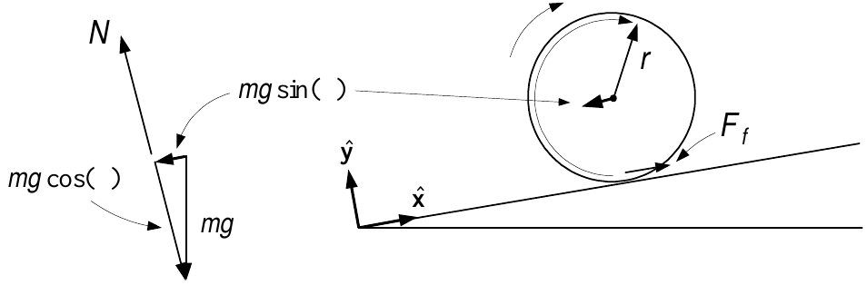

-   Translational motion of a rigid body.

    -   Apply $F=ma$ to the center of mass of the rigid body.

    -   Must be done in an inertial (non accelerating) coordinate system.

    -   $F$ is the sum of *all* forces acting on the rigid body.

        E.g., the two forces on the cylinder are $-mg\sin (\phi )$ and $F_{f}.$

    -   $(x,y)$ are the coordinates of the *center of mass* of the cylinder.

-   Rotational motion of a rigid body.

    -   Apply $\tau =Jd\omega /dt$ where $\tau$ is the sum of all torques about its *center of mass*.

    -   Inertial system not required **if** applied about the center of mass.

    -   The only torque about the center of mass is $-rF_{f}$.

    -   The force $mg$ acts through the center of mass so its moment arm is zero.
:::

---

::: {.compact-slide}
**Equations of Motion Derived from Conservation of Energy**

$$KE=\frac{1}{2}m\dot{x}^{2}+\frac{1}{2}J\omega ^{2}=\frac{1}{2}m\dot{x}^{2}+\frac{1}{2}\frac{J}{r^{2}}\dot{x}^{2}=\frac{1}{2}\!\left( m+\frac{J}{r^{2}}\right) \!\dot{x}^{2}.$$

-   The axis of the cylinder (contains the center of mass) is at $x\boldsymbol{\hat{x}}+y\boldsymbol{\hat{y}}.$

-   The axis is at a height $(x-d\sin (\phi ))\sin (\phi )+d$.

-   The cylinder's PE is $mg(x\sin (\phi )-d\sin ^{2}(\phi )+d).$

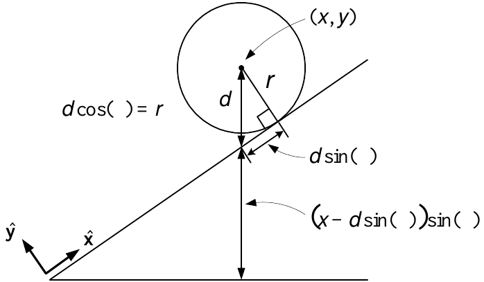

-   Total Energy: $$KE+PE=\dfrac{1}{2}\!\left( m+\dfrac{J}{r^{2}}\right) \!\dot{x}^{2}+mg\!\left( x\sin (\phi )-d\sin ^{2}(\phi )+d\right) .$$
:::

---

::: {.roomy-slide}
**Equations of Motion Derived from Conservation of Energy**

From previous slide:$$KE+PE=\frac{1}{2}\!\left( m+\frac{J}{r^{2}}\right) \!\dot{x}^{2}+mg\!\left(
x\sin (\phi )-d\sin ^{2}(\phi )+d\right) \!.$$

-   As total energy is constant, we have $$\frac{d}{dt}(KE+PE)=\left( m+\frac{J}{r^{2}}\right) \!\dot{x}\ddot{x}+mg\dot{x}\sin (\phi )=0.$$

-   Cancel out $\dot{x}$ and rearrange:$$\frac{d^{2}x}{dt^{2}}=-\underset{\text{constant}}{\underbrace{\frac{mr^{2}}{mr^{2}+J}g\sin (\phi )}}.$$
:::

---

::: {.compact-slide}
**Remark  Sliding Versus Rolling**

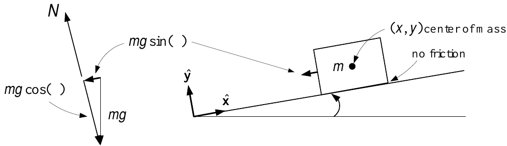

$(x,y)$ denotes the coordinates of the center of mass of the block.

Equations of motion:$$\begin{aligned}
m\frac{d^{2}y}{dt^{2}} &=&-mg\cos (\phi )+N=0 \\
m\frac{d^{2}x}{dt^{2}} &=&-mg\sin (\phi )
\end{aligned}$$

or simply $$\frac{d^{2}x}{dt^{2}}=-g\sin (\phi ).$$

-   A rolling cylinder of the same mass accelerates down at only $-\dfrac{mr^{2}}{mr^{2}+J}g\sin (\phi ).$

-   For the cylinder the PE energy goes into both rotational and translational KE.
:::

---

::: {.compact-slide}
**Motorized Cylinder Going Up an Inclined Plane**

-   The cylinder now has a motor inside to produce a torque $\tau _{m}$.

-   $F_{f}$ is the force of the inclined plane on the cylinder.

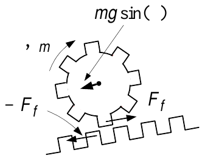

-   It is this force $F_{f}$ that propels the cylinder up the inclined plane.
:::

---

::: {.compact-slide}
**Equations of Motion from Newton's Laws**

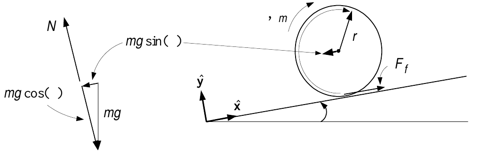

$(x,y)$ are the coordinates of the center of mass of the cylinder.$$\begin{aligned}
m\frac{d^{2}x}{dt^{2}} &=&-mg\sin (\phi )+F_{f} \\
J\frac{d^{2}\theta }{dt^{2}} &=&\tau _{m}-rF_{f} \\
x &=&r\theta .
\end{aligned}$$

Multiply $1^{st}$ eqn by $r,$ add to the $2^{nd}$ eqn and set $\theta =x/r:$ $$rm\frac{d^{2}x}{dt^{2}}+\frac{J}{r}\frac{d^{2}x}{dt^{2}}=\tau _{m}-rmg\sin
(\phi ).$$

Rearrange:$$\frac{d^{2}x}{dt^{2}}=\frac{r}{mr^{2}+J}\tau _{m}-\frac{mr^{2}}{mr^{2}+J}g\sin (\phi )$$
:::

---

::: {.compact-slide}
**Equations of Motion Derived from Conservation of Energy**

The total energy of the cylinder: $$KE+PE=\frac{1}{2}\!\left( m+\frac{J}{r^{2}}\right) \!\dot{x}^{2}+mg(x\sin
(\phi )-d\sin ^{2}(\phi )+d).$$

The power $\tau _{m}\omega$ produced by the motor equals the power put into the cylinder:$$\frac{d}{dt}(KE+PE)=\tau _{m}\omega .$$

Thus$$\frac{d}{dt}(KE+PE)=\left( m+\frac{J}{r^{2}}\right) \!\dot{x}\ddot{x}+mg\dot{x}\sin (\phi )=\tau _{m}\omega =\tau _{m}\frac{\dot{x}}{r}.$$

Cancel out $\dot{x}$ and rearrange: $$\frac{d^{2}x}{dt^{2}}=\frac{\tau _{m}}{r\!\left( m+\dfrac{J}{r^{2}}\right) }-\frac{m}{m+\dfrac{J}{r^{2}}}g\sin (\phi )=\frac{r}{mr^{2}+J}\tau _{m}-\frac{mr^{2}}{mr^{2}+J}g\sin (\phi ).$$
:::

---

::: {.compact-slide}
**Tension**

-   Block of mass $m$ tied to a ceiling through a cable.

-   There is a tension (force) $T_{1}$ upward on the mass $m$ by the cable.

-   At the top there is a tension (force) $T_{1}$ downward exerted on the ceiling.

-   Think of tension as a spring that can only be stretched *not* compressed.

    -   The cables "spring constant" is essentially infinite ($k=\infty$).

    -   When the two ends of a cable are pulled apart, the cable doesn't stretch.

    -   However, it produces restoring forces.
:::

---

::: {.compact-slide}
<strong>Example</strong> <em>Massless Pulley</em>

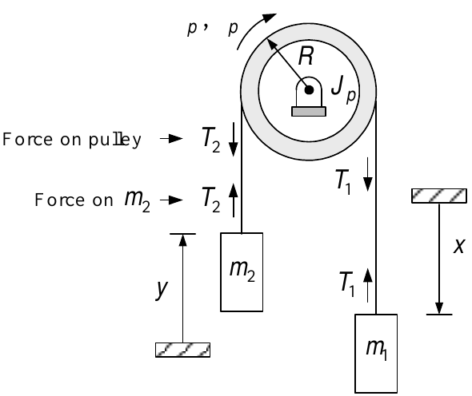

-   The rope length $\ell$ is such that when $x=0$ we have $y=0$ as well.

    $\Longrightarrow \quad y=x$

-   Take $\theta _{p}=0$ when $x=y=0.$

-   Rope does not slip as the pulley rotates.  $\Longrightarrow$$$y=x=R\theta _{p}.$$

-   Pulley Equation: $J_{p}\dfrac{d\omega _{p}}{dt}=RT_{1}-RT_{2}.$

-   Let the pulley be massless, i.e., $J_{p}=0.\quad \Longrightarrow$ $T_{1}=T_{2}.$
:::

---

::: {.roomy-slide}
<strong>Example</strong> <em>Massless Pulley</em> <strong>(continued)</strong>

-   Equations of motion:$$\begin{aligned}
    J_{p}\frac{d\omega _{p}}{dt} &=&RT_{1}-RT_{2} \\
    m_{1}\frac{d^{2}x}{dt^{2}} &=&m_{1}g-T_{1} \\
    m_{2}\frac{d^{2}y}{dt^{2}} &=&-m_{2}g+T_{2}.
    \end{aligned}$$

-   With $T_{1}=T_{2}$ and $y=x$:$$\begin{aligned}
    m_{1}\frac{d^{2}x}{dt^{2}} &=&\quad m_{1}g-T_{1} \\
    m_{2}\frac{d^{2}x}{dt^{2}} &=&-m_{2}g+T_{1}.
    \end{aligned}$$

-   Add to cancel $T_{1}$: $$\frac{d^{2}x}{dt^{2}}=\frac{m_{1}-m_{2}}{m_{1}+m_{2}}g.$$
:::

---

::: {.compact-slide}
<strong>Example</strong> <em>Pulley and Cylinder</em>

-   A solid cylinder rolls down an incline and wraps up a thin paper tape (non sticky).

-   The other end of the tape goes over a cylindrical massless pulley ($m_{p}=J_{p}=0$).

-   The tape is attached to a box of mass $m_{box}$.

-   As the cylinder rolls down it wraps up the thin paper about itself with *no slip*.

-   With $(x,y)$ the position of the *center of mass* of the cylinder: $x=R\theta$ or $\dot{x}=R\omega .$
:::

---

::: {.compact-slide .margin-safe-slide}
<strong>Example</strong> <em>Pulley and Cylinder</em> <strong>(continued)</strong>

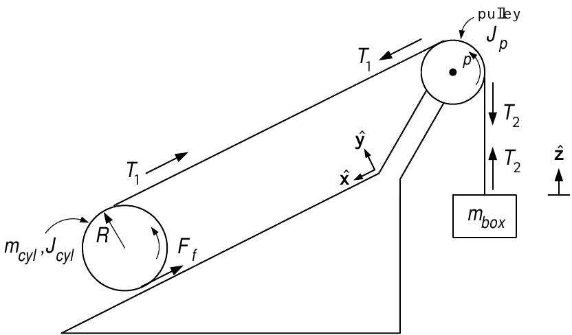

-   The upward speed of $m_{box}$ is $\dot{z}.$

-   This is the same as the linear speed of the tape as it is rolled up.

-   The velocity of the tape at the top of the cylinder is $\dot{x}+R\omega =\dot{x}+R\dot{x}/R=2\dot{x}.$

-   The velocity of $m_{box}$ is given by $\dot{z}=2\dot{x}.$

-   $T_{1}$ and $T_{2}$ are the tensions in the tape on either side of the pulley.

-   The pulley equation is $J_{p}\dfrac{d\omega _{p}}{dt}=R_{p}T_{1}-R_{p}T_{2}.$

-   As $J_{p}=0$, $T_{1}=T_{2}.$
:::

---

::: {.compact-slide}
<strong>Example</strong> <em>Pulley and Cylinder</em> <strong>(continued)</strong>

$$\begin{aligned}
J_{cyl}\frac{d^{2}\theta }{dt^{2}} &=&RF_{f}-RT_{1} \\
m_{cyl}\frac{d^{2}x}{dt^{2}} &=&m_{cyl}g\sin (\phi )-F_{f}-T_{1} \\
m_{box}\frac{d^{2}z}{dt^{2}} &=&T_{1}-m_{box}g.
\end{aligned}$$

-   The axis of rotation of the cylinder is accelerating down the incline.

-   $J\ddot{\theta}=\tau$ is still valid as this axis *contains* the center of mass.

-   Gravity acts through the center of mass of the cylinder.

    -   Does *not* produce torque as its moment arm is zero.
:::

---

::: {.compact-slide}
<strong>Example</strong> <em>Pulley and Cylinder</em> <strong>(continued)</strong>

$$\begin{aligned}
J_{cyl}\frac{d^{2}\theta }{dt^{2}} &=&RF_{f}-RT_{1} \\
m_{cyl}\dfrac{d^{2}x}{dt^{2}} &=&m_{cyl}g\sin (\phi )-F_{f}-T_{1} \\
m_{box}\frac{d^{2}z}{dt^{2}} &=&T_{1}-m_{box}g.
\end{aligned}$$ $\theta =\dfrac{x}{R},$ $\dfrac{dz}{dt}=2\dfrac{dx}{dt},$ $\dfrac{d^{2}z}{dt^{2}}=2\dfrac{d^{2}x}{dt^{2}}$  $\Longrightarrow$ $$\begin{aligned}
\frac{J_{cyl}}{R}\frac{d^{2}x}{dt^{2}} &=&RF_{f}-RT_{1} \\
m_{cyl}\frac{d^{2}x}{dt^{2}} &=&m_{cyl}g\sin (\phi )-F_{f}-T_{1} \\
2m_{box}\frac{d^{2}x}{dt^{2}} &=&T_{1}-m_{box}g.
\end{aligned}$$Eliminate $F_{f}$: $$\begin{aligned}
\left( Rm_{cyl}+\frac{J_{cyl}}{R}\right) \!\frac{d^{2}x}{dt^{2}}
&=&Rm_{cyl}g\sin (\phi )-2RT_{1} \\
2m_{box}\frac{d^{2}x}{dt^{2}} &=&T_{1}-m_{box}g.
\end{aligned}$$
:::

---

::: {.compact-slide}
<strong>Example</strong> <em>Pulley and Cylinder</em> <strong>(continued)</strong>

From previous slide:$$\begin{aligned}
\left( Rm_{cyl}+\frac{J_{cyl}}{R}\right) \frac{d^{2}x}{dt^{2}}
&=&Rm_{cyl}g\sin (\phi )-2RT_{1} \\
2m_{box}\frac{d^{2}x}{dt^{2}} &=&T_{1}-m_{box}g.
\end{aligned}$$

Multiply the $2^{nd}$ eqn by $2R$ and add to the $1^{st}$ eqn:$$\left( 4Rm_{box}+Rm_{cyl}+\frac{J_{cyl}}{R}\right) \frac{d^{2}x}{dt^{2}}=Rm_{cyl}g\sin (\phi )-2Rm_{box}g.$$

Using $J_{cyl}=\dfrac{1}{2}m_{cyl}R^{2}$ and rearrange: $$\begin{aligned}
\frac{d^{2}x}{dt^{2}}=\frac{m_{cyl}R^{2}g\sin (\phi )-2m_{box}R^{2}g}{4m_{box}R^{2}+m_{cyl}R^{2}+J_{cyl}} &=&\frac{m_{cyl}R^{2}\sin (\phi
)-2m_{box}R^{2}}{4m_{box}R^{2}+m_{cyl}R^{2}+\frac{1}{2}m_{cyl}R^{2}}g \\
&& \\
&& \\
&=&\frac{m_{cyl}\sin (\phi )-2m_{box}}{4m_{box}+\dfrac{3}{2}m_{cyl}}g.
\end{aligned}$$
:::

---

::: {.roomy-slide}
<strong>Example</strong> <em>Pulley and Cylinder</em> <strong>(continued)</strong>

-   $m_{cyl}=23$ $kgm$

-   $m_{box}=4.5$ $kgm$

-   $\phi =\pi /6$ ($30^{\circ }$)

-   $R=0.076$ $m,$

-   $J_{cyl}=\frac{1}{2}m_{cyl}R^{2}$

-   $g=9.8$ $m/\sec ^{2}$.

The acceleration is $$\frac{d^{2}x}{dt^{2}}=\frac{m_{cyl}\sin (\phi )-2m_{box}}{4m_{box}+\dfrac{3}{2}m_{cyl}}g=\frac{23\sin (\pi /6)-2\times 4.5}{4\times 4.5+\dfrac{3}{2}\times 23}g=0.04762g=0.467\text{ }m/s^{2}.$$

The tape tension is $$T_{1}=2m_{box}\frac{d^{2}x}{dt^{2}}+m_{box}g=2\times 4.5\times
0.467+4.5\times 9.8=48.3\text{ }N.$$
:::
