::: {.contents-slide}
# Contents

- Magnetic Force

- Faraday's Law

- Dynamic Equations of the DC Motor

- Optical Encoder Model
:::

---

::: {.compact-slide .multi-figure-slide}

Magnetic Force

- Magnetic fields produce *forces* on wires carrying a current.
- The direction of $\vec{\mathbf B}$ at any point is the direction a compass needle points.

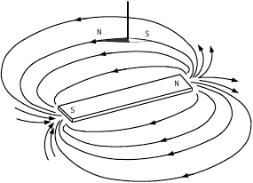

- The magnetic force is proportional to the wire length $\ell$ and current $i$: $F_{\text{magnetic}}\propto \ell i$.

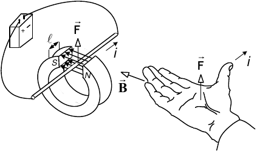

- The field magnitude is $B=\lvert\vec{\mathbf B}\rvert\triangleq F_{\text{magnetic}}/(\ell i)$.
:::

---

::: {.compact-slide .expanded-figure-slide}

Magnetic Force Law

The magnetic force is proportional to the current $i$, wire length $\ell$, field strength $B=\lvert\vec{\mathbf B}\rvert$, and the sine of the angle between $\vec{\mathbf B}$ and the wire.

For $\vec{\ell}$, the magnitude $\ell=\lvert\vec{\ell}\rvert$ is the length of wire in the magnetic field, and its direction is the direction of positive current.

$$
\begin{aligned}
\vec{\mathbf F}_{\text{magnetic}} &= i\vec{\ell}\times\vec{\mathbf B},\\
F_{\text{magnetic}} &= i\ell B\sin\theta=i\ell B_{\perp}.
\end{aligned}
$$

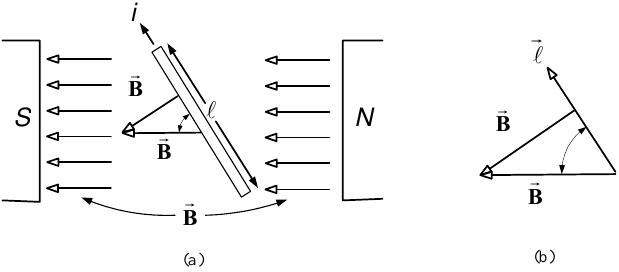

:::

---

::: {.compact-slide .expanded-figure-slide}

<strong>Example</strong> <em>Linear DC Machine</em>

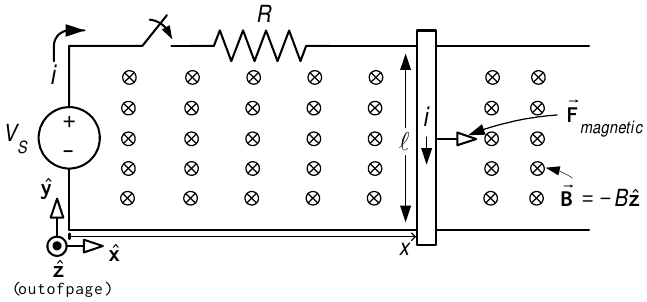

$$
\vec{\mathbf B}=-B\hat{\mathbf z},\quad B>0,
\qquad \vec{\ell}=-\ell\hat{\mathbf y}.
$$

$$
\vec{\mathbf F}_{\text{magnetic}}
=i\vec{\ell}\times\vec{\mathbf B}
=i(-\ell\hat{\mathbf y})\times(-B\hat{\mathbf z})
=i\ell B\hat{\mathbf x}.
$$

- $f$ is the coefficient of viscous sliding friction.
- $m_{\ell}$ is the mass of the bar.
- Equation of motion:
  $$i\ell B-f\frac{dx}{dt}=m_{\ell}\frac{d^{2}x}{dt^{2}}.$$
:::

---

::: {.compact-slide .expanded-figure-slide}

<strong>Example</strong> <em>Single-Loop Motor</em>

- A soft-iron cylindrical core is placed inside a hollowed-out permanent magnet.
- The magnetic field tends to be perpendicular to the surface of magnetic materials.
- The cylindrical shape makes $\vec{\mathbf B}$ radially directed in the air gap.

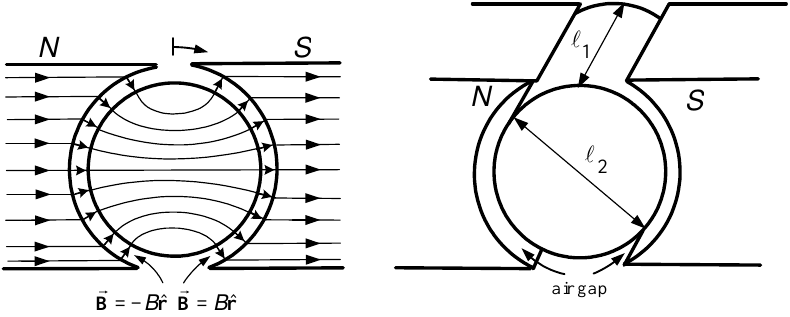

For $B>0$,

$$
\vec{\mathbf B}=
\begin{cases}
+B\hat{\mathbf r}, & 0<\theta<\pi,\\
-B\hat{\mathbf r}, & \pi<\theta<2\pi.
\end{cases}
$$
:::

---

::: {.compact-slide .multi-figure-slide}

Rotor Loop and Slip Rings

- $\hat{\mathbf r}$, $\hat{\boldsymbol\theta}$, and $\hat{\mathbf z}$ denote the cylindrical-coordinate unit vectors.
- $\hat{\mathbf z}$ points along the rotor axis into the page.
- $\hat{\boldsymbol\theta}$ points in the direction of increasing $\theta$; $\hat{\mathbf r}$ points in the direction of increasing $r$.

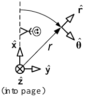

:::

---

::: {.compact-slide .expanded-figure-slide}

Single-Loop Motor: Torque

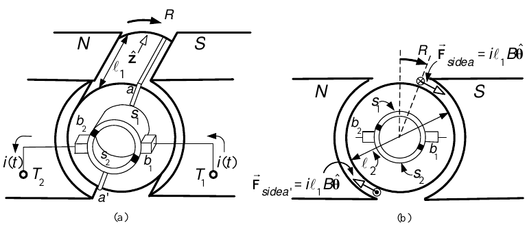

- For $i>0$, current in side $a$ goes into the page, so $\vec{\ell}=\ell_{1}\hat{\mathbf z}$.

$$
\vec{\mathbf F}_{a}
=i(\ell_{1}\hat{\mathbf z})\times(B\hat{\mathbf r})
=i\ell_{1}B\hat{\boldsymbol\theta}.
$$

$$
\begin{aligned}
\vec{\boldsymbol\tau}_{a}
&=\frac{\ell_{2}}{2}\hat{\mathbf r}\times\vec{\mathbf F}_{a}\\
&=\frac{\ell_{2}}{2}i\ell_{1}B
(\hat{\mathbf r}\times\hat{\boldsymbol\theta})
=\frac{\ell_{2}}{2}i\ell_{1}B\hat{\mathbf z}.
\end{aligned}
$$
:::

---

::: {.compact-slide .expanded-figure-slide}

Single-Loop Motor: Total Torque

On side $a'$,

$$
\vec{\mathbf F}_{a'}
=i(-\ell_{1}\hat{\mathbf z})\times(-B\hat{\mathbf r})
=i\ell_{1}B\hat{\boldsymbol\theta},
$$

$$
\vec{\boldsymbol\tau}_{a'}
=\frac{\ell_{2}}{2}\hat{\mathbf r}\times\vec{\mathbf F}_{a'}
=\frac{\ell_{2}}{2}i\ell_{1}B\hat{\mathbf z}.
$$

Thus
$$
\vec{\boldsymbol\tau}_{m}=\ell_{1}\ell_{2}Bi\hat{\mathbf z},
\qquad \tau_{m}=K_{T}i,
\qquad K_{T}\triangleq\ell_{1}\ell_{2}B.
$$
:::

---

::: {.compact-slide .expanded-figure-slide}

Current Commutation

To obtain positive torque $\tau_{m}=K_{T}i>0$:

- Current under the *south pole* must go into the page.
- Current under the *north pole* must come out of the page.
- Every half-turn, the direction of current in the loop must reverse.

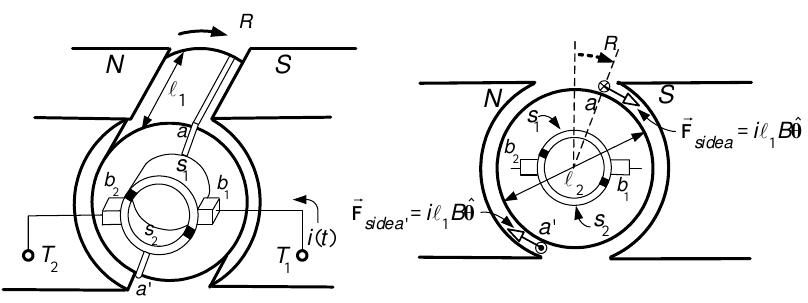

:::

---

::: {.multi-figure-slide .commutation-sequence-slide}

Current Commutation Through One Rotation

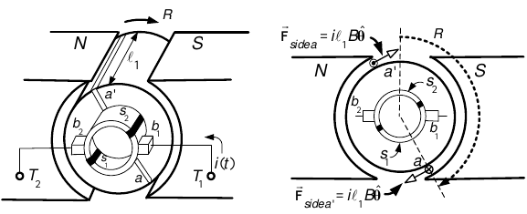

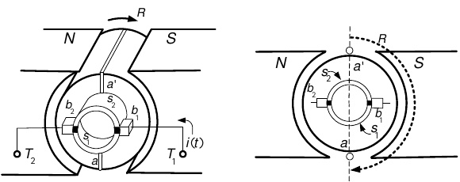

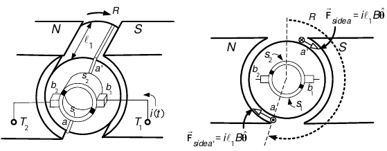

:::

---

::: {.compact-slide .expanded-figure-slide}

Faraday's Law

A *changing* magnetic flux in a loop produces an induced voltage, or *electromotive force* (emf), denoted by $\xi$:

$$
\xi=-\frac{d\phi}{dt},
\qquad \phi=\int_{S}\vec{\mathbf B}\cdot d\vec{\mathbf S}.
$$

Here $S$ is any surface whose boundary is the loop.

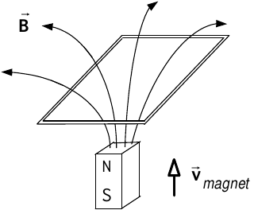

:::

---

::: {.compact-slide .multi-figure-slide}

The Surface-Element Vector $d\vec{\mathbf S}$

The surface-element vector may be oriented in either normal direction:

$$
d\vec{\mathbf S}=dx\,dy\,\hat{\mathbf z}
\qquad\text{or}\qquad
d\vec{\mathbf S}=-dx\,dy\,\hat{\mathbf z}.
$$

The corresponding positive direction around the boundary follows the right-hand rule.

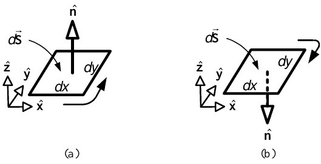

Connecting two surface elements:

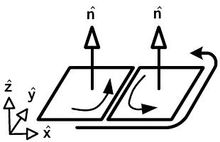

:::

---

::: {.compact-slide .expanded-figure-slide}

Net Direction Around a Surface Boundary

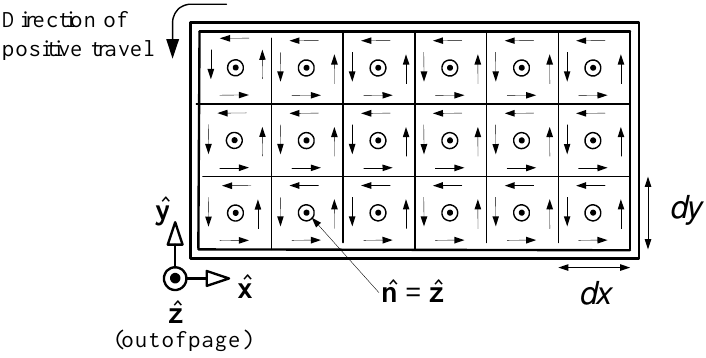

- The normal is $\hat{\mathbf n}=\hat{\mathbf z}$.
- $d\vec{\mathbf S}=dx\,dy\,\hat{\mathbf n}=dx\,dy\,\hat{\mathbf z}$.
- $\odot$ denotes a normal directed out of the page.
- Positive travel around the boundary is counterclockwise.
:::

---

::: {.expanded-short-slide}

Interpreting the Sign of $\xi$

$$
\xi=-\frac{d\phi}{dt},
\qquad \phi=\int_{S}\vec{\mathbf B}\cdot d\vec{\mathbf S}.
$$

- If $\xi>0$, the induced emf drives current in the positive direction of travel.
- If $\xi<0$, the induced emf drives current in the opposite direction.

Simple examples make the sign convention concrete.
:::

---

::: {.compact-slide .expanded-figure-slide}

<strong>Example</strong> <em>Linear DC Machine</em>

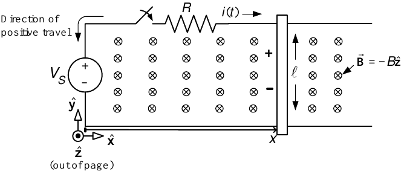

Let $\vec{\mathbf B}=-B\hat{\mathbf z}$, $B>0$, and choose $d\vec{\mathbf S}=dx\,dy\,\hat{\mathbf z}$. Then

$$
\phi=\int_{0}^{\ell}\int_{0}^{x}
(-B\hat{\mathbf z})\cdot(dx\,dy\,\hat{\mathbf z})=-B\ell x.
$$

Therefore
$$
\xi=-\frac{d\phi}{dt}=B\ell\frac{dx}{dt}=B\ell v.
$$
:::

---

::: {.compact-slide .expanded-figure-slide}

<strong>Example</strong> <em>Linear DC Machine</em> <strong>(continued)</strong>

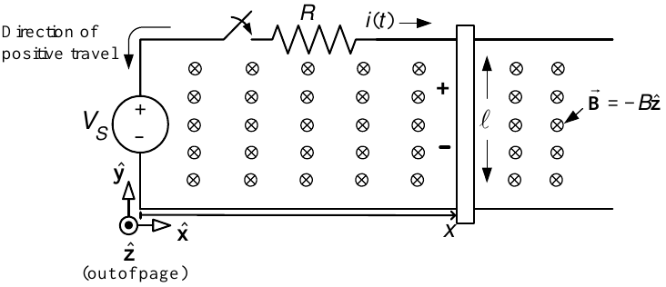

We found $\xi=B\ell v$.

- The magnetic force is $\vec{\mathbf F}_{\text{magnetic}}=i\ell B\hat{\mathbf x}$, so $v=dx/dt>0$.
- The induced voltage $\xi>0$ opposes the source voltage $V_{S}$.
:::

---

::: {.compact-slide .expanded-figure-slide}

Energy Conversion in a Linear DC Machine

- $F_{\text{magnetic}}=i\ell B$.
- Mechanical power produced: $F_{\text{magnetic}}v=i\ell Bv$.
- The back emf $\xi=B\ell v$ opposes current $i$.
- Electrical power absorbed by the back emf: $-i\xi=-iB\ell v$.

The electrical power absorbed reappears as mechanical power:
$$
-i\xi+F_{\text{magnetic}}v=-iB\ell v+i\ell Bv=0.
$$
:::

---

::: {.compact-slide .dense-slide}

Linear DC Machine: Equations of Motion

Take circuit self-inductance as zero. Let $m_{\ell}$ be the bar mass and $f$ the viscous-friction coefficient.

$$
\begin{aligned}
V_{S}-B\ell v &= Ri,\\
m_{\ell}\frac{dv}{dt} &= i\ell B-fv.
\end{aligned}
$$

Eliminating $i$ gives
$$
m_{\ell}\frac{d^{2}x}{dt^{2}}
=-\left(\frac{B^{2}\ell^{2}}{R}+f\right)\frac{dx}{dt}
+\frac{\ell B}{R}V_{S},
$$

or
$$
\frac{dx}{dt}=v,
\qquad
\frac{dv}{dt}
=-\left(\frac{B^{2}\ell^{2}}{m_{\ell}R}+\frac{f}{m_{\ell}}\right)v
+\frac{\ell B}{m_{\ell}R}V_{S}.
$$
:::
---

::: {.compact-slide .multi-figure-slide}

<strong>Example</strong> <em>EMF in the Single-Loop Motor</em>

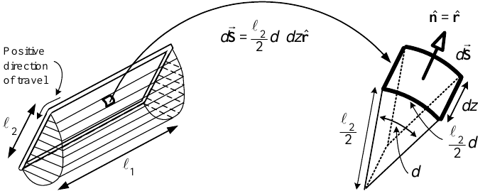

- On the cylindrical surface, $d\vec{\mathbf S}=(\ell_{2}/2)d\theta\,dz\,\hat{\mathbf r}$.
- On the two half-disk ends, $\vec{\mathbf B}\cdot d\vec{\mathbf S}=0$.
:::

---

::: {.compact-slide .dense-slide .expanded-figure-slide}

<strong>Example</strong> <em>EMF in the Single-Loop Motor</em> <strong>(continued)</strong>

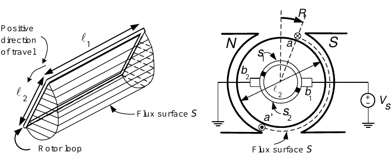

For $0<\theta_{R}<\pi$,

$$
\begin{aligned}
\phi(\theta_{R})
&=\int_{0}^{\ell_{1}}\int_{\theta_{R}}^{\pi}
B\frac{\ell_{2}}{2}\,d\theta\,dz
+\int_{0}^{\ell_{1}}\int_{\pi}^{\pi+\theta_{R}}
(-B)\frac{\ell_{2}}{2}\,d\theta\,dz\\
&=\frac{\ell_{1}\ell_{2}B}{2}(\pi-\theta_{R})
-\frac{\ell_{1}\ell_{2}B}{2}\theta_{R}\\
&=-\ell_{1}\ell_{2}B\left(\theta_{R}-\frac{\pi}{2}\right).
\end{aligned}
$$
:::

---

::: {.compact-slide .multi-figure-slide}

<strong>Example</strong> <em>EMF in the Single-Loop Motor</em> <strong>(continued)</strong>

For $0<\theta_{R}<\pi$,
$$
\phi(\theta_{R})=-\ell_{1}\ell_{2}B
\left(\theta_{R}-\frac{\pi}{2}\right).
$$

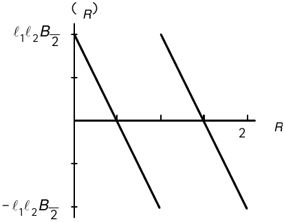

:::

---

::: {.compact-slide .expanded-figure-slide}

<strong>Example</strong> <em>EMF in the Single-Loop Motor</em> <strong>(continued)</strong>

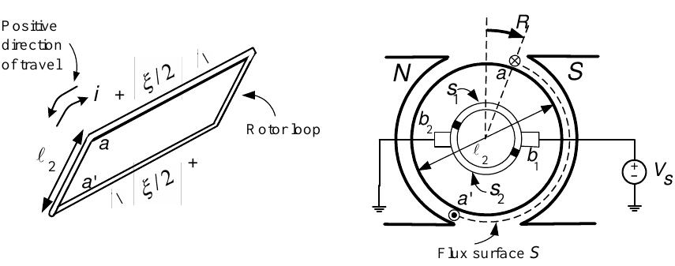

$$
\phi(\theta_{R})=-\ell_{1}\ell_{2}B
\left(\theta_{R}-\frac{\pi}{2}\right),
\qquad 0<\theta_{R}<\pi.
$$

Faraday's law gives
$$
\xi=-\frac{d\phi}{dt}
=(\ell_{1}\ell_{2}B)\frac{d\theta_{R}}{dt}
=K_{b}\omega_{R},
\qquad K_{b}\triangleq\ell_{1}\ell_{2}B.
$$

For $\omega_{R}>0$, $\xi>0$ and the back emf opposes $V_{S}$.
:::

---

::: {.compact-slide .dense-slide .horizontal-spread-slide}

<strong>Example</strong> <em>EMF in the Single-Loop Motor</em> <strong>(continued)</strong>

**Energy Conversion in the Single-Loop Motor**

:::: {.columns}
::: {.column width="48%"}
Mechanical power produced:

$$
\tau_{m}\omega_{R}
=K_{T}i\omega_{R}
=\ell_{1}\ell_{2}Bi\omega_{R}.
$$

Electrical power absorbed by the back emf:

$$
-\xi i
=-K_{b}\omega_{R}i
=-\ell_{1}\ell_{2}B\omega_{R}i.
$$
:::

::: {.column width="48%"}
The electrical power absorbed reappears as mechanical power:

$$
-\xi i+\tau_{m}\omega_{R}=0.
$$

Therefore energy conservation requires

$$
K_{T}=K_{b}.
$$
:::
::::
:::

---

::: {.compact-slide .dense-slide .expanded-figure-slide}

Self-Inductance $L$: Rotor Current Produces Flux

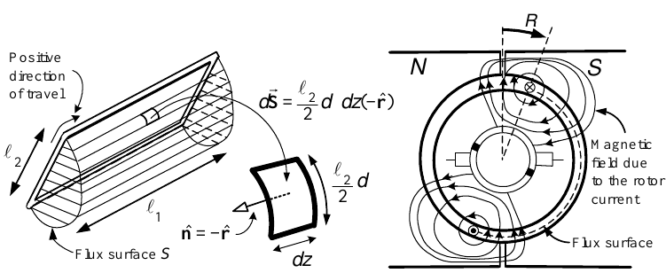

The magnetic field on the flux surface due to armature current has the form
$$
\vec{\mathbf B}(r_{R},\theta-\theta_{R},i)
=-iK(r_{R},\theta-\theta_{R})\hat{\mathbf r},
$$
where
$$
K>0\quad\text{for }0\leq\theta-\theta_{R}\leq\pi,
\qquad
K<0\quad\text{for }\pi\leq\theta-\theta_{R}\leq2\pi.
$$

- The exact expression for $K$ is not needed.
- Choose $d\vec{\mathbf S}=-r_{R}d\theta\,dz\,\hat{\mathbf r}$.
- Positive travel around the surface coincides with positive current $i$.
:::

---

::: {.compact-slide .dense-slide .expanded-figure-slide}

Self-Inductance $L$: Flux Linkage

$$
\begin{aligned}
\psi(i)
&=\int_{S}\vec{\mathbf B}\cdot d\vec{\mathbf S}\\
&=i\int_{0}^{\ell_{1}}\int_{\theta_{R}}^{\theta_{R}+\pi}
K(r_{R},\theta-\theta_{R})r_{R}\,d\theta\,dz\\
&=Li.
\end{aligned}
$$

- If $-d\psi/dt=-L\,di/dt>0$, the induced emf drives current into the page on side $a$ and out of the page on side $a'$.
- $-d\psi/dt$ has the same sign convention as $V_{S}$.
:::

---

::: {.compact-slide .expanded-figure-slide}

Dynamic Equations of the DC Motor

Electrical equation:
$$
V_{S}-K_{b}\omega_{R}-L\frac{di}{dt}=Ri,
\qquad
L\frac{di}{dt}=-Ri-K_{b}\omega_{R}+V_{S}.
$$

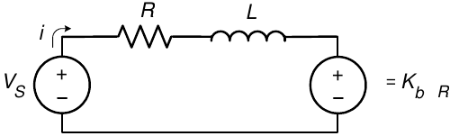

Mechanical equation:
$$
K_{T}i-\tau_{L}-f\omega_{R}=J\frac{d\omega_{R}}{dt}.
$$

- $J$: rotor-assembly moment of inertia.
- $\tau_{L}$: load torque.
- $f$: viscous-friction coefficient.
:::

---

::: {.expanded-short-slide .expanded-figure-slide}

Equations of the DC Motor

$$
\begin{aligned}
L\frac{di}{dt} &= -Ri-K_{b}\omega_{R}+V_{S},\\[0.45em]
J\frac{d\omega_{R}}{dt} &= K_{T}i-f\omega_{R}-\tau_{L},\\[0.45em]
\frac{d\theta_{R}}{dt} &= \omega_{R}.
\end{aligned}
$$

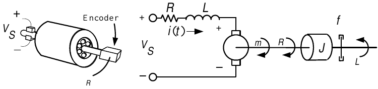

:::

---

::: {.compact-slide .dense-slide .expanded-figure-slide}

Energy Conversion

From the source voltage,
$$
V_{S}=Ri+L\frac{di}{dt}+\xi.
$$

Multiplying by current gives
$$
\begin{aligned}
V_{S}i
&=Ri^{2}+Li\frac{di}{dt}+iK_{b}\omega_{R}\\
&=Ri^{2}+\frac{d}{dt}\left(\frac{1}{2}Li^{2}\right)
+\tau_{m}\omega_{R}.
\end{aligned}
$$

- $Ri^{2}$: heat loss.
- $d(\tfrac12Li^{2})/dt$: power stored in or recovered from the armature field.
- $\tau_{m}\omega_{R}$: mechanical power.
:::

---

::: {.compact-slide .expanded-figure-slide}

Optical Encoder

- The encoder shown has 12 windows.
- Digital circuitry detects each rising and falling pulse edge.
- Twelve pulses produce 24 detectable edges per revolution.
- Resolution: $2\pi/24$ radians, or $360^{\circ}/24=15^{\circ}$.
- Counting the edges determines position to within $15^{\circ}$.

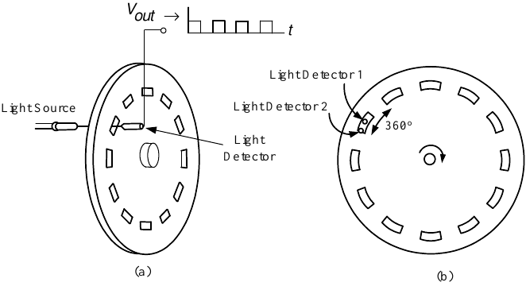

:::

---

::: {.multi-figure-slide .expanded-figure-slide}

Optical Encoder Voltage Waveforms

Voltage waveforms from the encoder:

:::

---

::: {.compact-slide .expanded-figure-slide}

Quadrature Optical Encoder

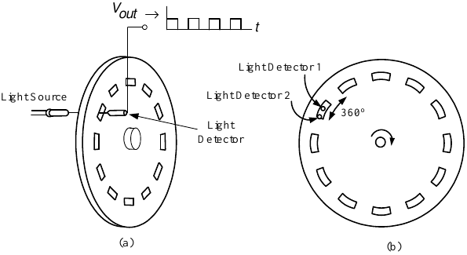

- Window length equals the distance between adjacent windows.
- The two light detectors are separated by half a window length.
- One voltage-waveform period corresponds to the distance from one window's beginning to the next.
- Treating one period as $360^{\circ}$ places the detectors $90^{\circ}$ apart—in *quadrature*.
:::

---

::: {.compact-slide .expanded-figure-slide}

Optical Encoder Direction

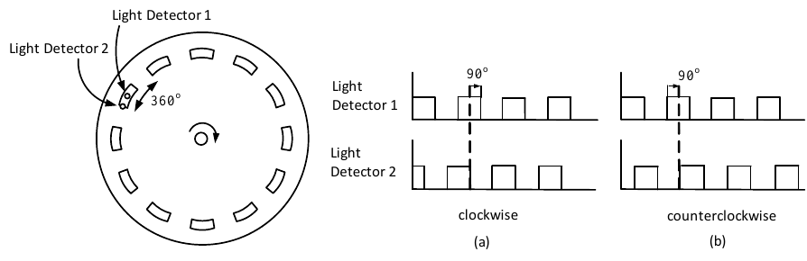

**Clockwise rotation:** detector 1 is $90^{\circ}$ behind detector 2.

**Counterclockwise rotation:** detector 2 is $90^{\circ}$ behind detector 1.

Electronic circuitry detects the relative phase to determine the direction.
:::

---

::: {.compact-slide .dense-slide .expanded-figure-slide}

Encoder Resolution

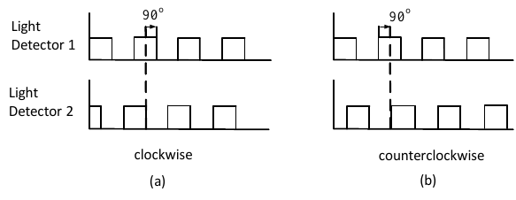

- With $N_{w}$ windows, $2N_{w}$ rising and falling edges per revolution give resolution
  $$\frac{2\pi}{2N_{w}}\text{ radians}.$$
- Counting both detector outputs gives $4N_{w}$ equally spaced edges and resolution
  $$\frac{2\pi}{4N_{w}}\text{ radians}.$$
- For $N_{w}=500$, resolution is $2\pi/2000$ radians, or $0.18^{\circ}$.
:::

---

::: {.compact-slide .dense-slide}

Encoder Model

Let $N_{enc}$ be the number of rising and falling edges from both detectors per revolution, and let $N(t)$ be the encoder count at time $t$.

$$
\theta_{m}(t)=\frac{2\pi}{N_{enc}}N(t)\quad\text{radians}.
$$

**Backward-difference speed estimate**

$$
\omega_{bd}(kT)
\triangleq\frac{2\pi}{N_{enc}}
\left(\frac{N(kT)-N(kT-T)}{T}\right),
$$

where $T$ is the sampling interval.
:::

---

::: {.compact-slide .expanded-figure-slide}

Error in Backward-Difference Speed Estimation

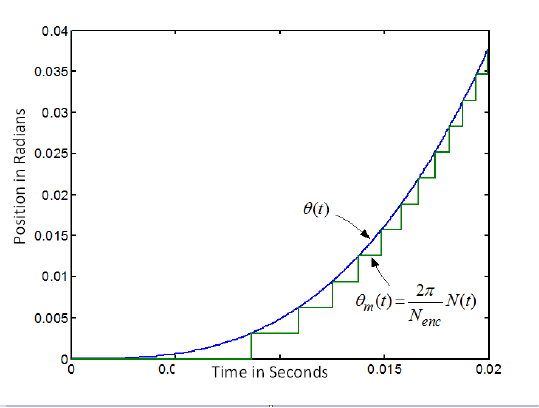

If $\theta(kT)$ is the true position in radians, then
$$
\theta(kT)=\frac{2\pi}{N_{enc}}N(kT)
+\frac{2\pi}{N_{enc}}e(kT),
$$
where $e(kT)$ is the fractional count that the encoder cannot sense.
:::

---

::: {.compact-slide .dense-slide .boundary-safe-slide}

Error in Backward-Difference Speed Estimation

- The fractional count satisfies $0\leq e(kT)<1$.

$$
\omega(kT)
=\frac{2\pi}{N_{enc}}
\left(\frac{N(kT)-N(kT-T)}{T}\right)
+\frac{2\pi}{N_{enc}}
\left(\frac{e(kT)-e(kT-T)}{T}\right).
$$

- Because $\lvert e(kT)-e(kT-T)\rvert\leq1$,
$$
\left\lvert\omega(kT)-\omega_{bd}(kT)\right\rvert
\leq\frac{2\pi/N_{enc}}{T}.
$$

- Thus
$$
\omega(kT)\approx\frac{2\pi}{N_{enc}}
\left(\frac{N(kT)-N(kT-T)}{T}\right).
$$

- Choosing $T$ trades encoder-resolution error against finite-difference accuracy.
:::
