::: {.contents-slide}
# Contents

- Block Diagram Modeling of a DC Motor

- Closed-Loop Output and Error Transfer Functions

- Block Diagram Reduction

- Position Feedback and General Control-System Diagrams

- Current-Command Amplifier for a DC Motor
:::

---

::: {.compact-slide .expanded-body-slide .expanded-figure-slide}

Block Diagram for a DC Motor

**Example** *DC motor*

$$
\begin{aligned}
L\frac{di}{dt}  & =-Ri-K_{b}\omega+V_{S}\\
& \\
J\frac{d\omega}{dt}  & =K_{T}i-f\omega-\tau_{L}\\
& \\
\frac{d\theta}{dt}  & =\omega.
\end{aligned}
$$

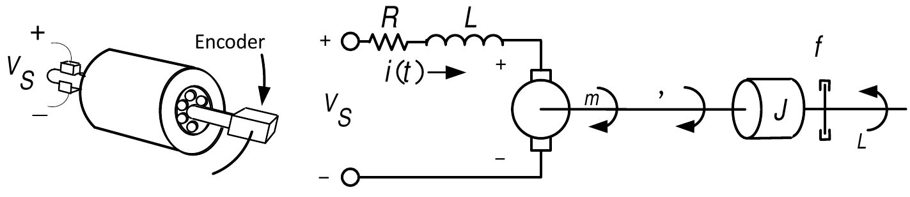

:::

---

::: {.compact-slide .expanded-body-slide}

<strong>Example</strong> <em>DC motor</em>
<strong>(continued)</strong>

$$
\begin{aligned}
L\frac{di}{dt}  & =-Ri-K_{b}\omega+V_{S}\\
J\frac{d\omega}{dt}  & =K_{T}i-f\omega-\tau_{L}\\
\frac{d\theta}{dt}  & =\omega.
\end{aligned}
$$

Laplace transform:

$$
\begin{aligned}
sLI(s)  & =-RI(s)-K_{b}\omega(s)+V_{a}(s)\\
sJ\omega(s)  & =-f\omega(s)+K_{T}I(s)-\tau_{L}(s)\\
s\theta(s)  & =\omega(s)
\end{aligned}
$$

Rearrange:

$$
\begin{aligned}
(sL+R)I(s)  & =V_{a}(s)-K_{b}\omega(s)\\
(sJ+f)\omega(s)  & =K_{T}I(s)-\tau_{L}(s)\\
s\theta(s)  & =\omega(s)
\end{aligned}
$$
:::

---

::: {.compact-slide}

<strong>Example</strong> <em>DC motor</em>
<strong>(continued)</strong>

From previous slide:

$$
\begin{aligned}
(sL+R)I(s)  & =V_{a}(s)-K_{b}\omega(s)\\
(sJ+f)\omega(s)  & =K_{T}I(s)-\tau_{L}(s)\\
s\theta(s)  & =\omega(s).
\end{aligned}
$$

Or

$$
\begin{aligned}
I(s)  & =\frac{1}{sL+R}\left(  V_{a}(s)-K_{b}\omega(s)\right) \\
\omega(s)  & =\frac{1}{sJ+f}\left(  K_{T}I(s)-\tau_{L}(s)\right)
\\
\theta(s)  & =\frac{1}{s}\omega(s).
\end{aligned}
$$

Block Diagram:

-   A graphical illustration of the relationships between $I(s),\theta
    (s),\omega(s),\tau_{L}(s),V_{a}(s)$
:::

---

::: {.compact-slide .multi-figure-slide .dense-multi-slide .expanded-body-slide}

<strong>Example</strong> <em>DC motor</em>
<strong>(continued)</strong>

From previous slide:

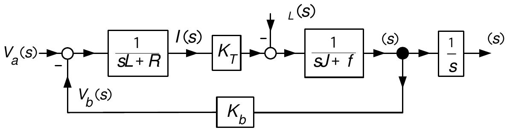

Set $L=0$ (typically negligible).

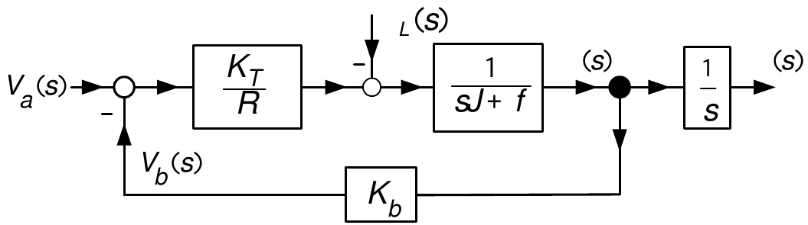

Move $\tau_{L}(s)$ to the left side of the $K_{T}/R$ block.

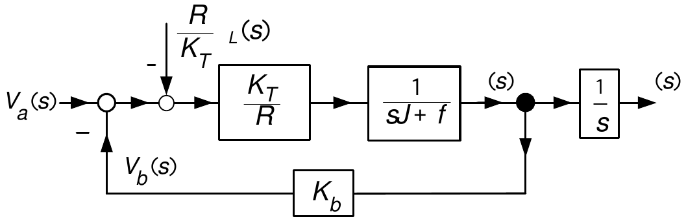

:::

---

::: {.compact-slide .multi-figure-slide .expanded-body-slide}

<strong>Example</strong> <em>DC motor</em>
<strong>(continued)</strong>

From previous slide:

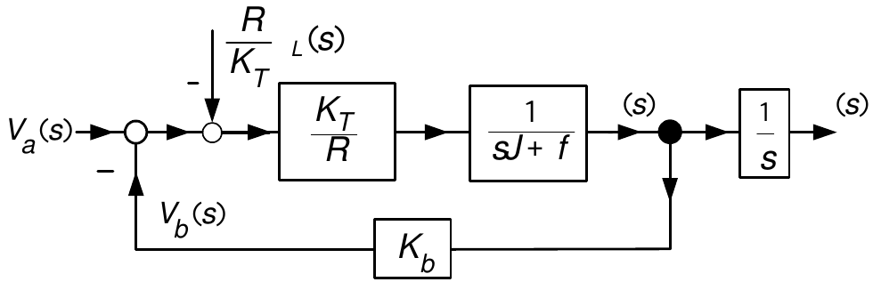

Put $\dfrac{R}{K_{T}}\tau_{L}(s)$ into the same summing junction as
$V_{a}(s)$:

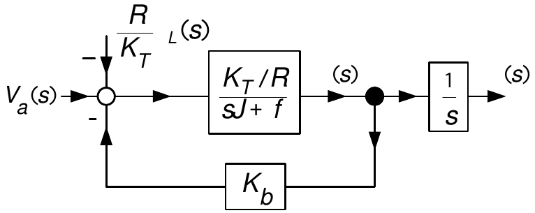

-   This is an *equivalent* block diagram to solve for $\theta
    (s),\omega(s)$ in terms of $V_{a}(s),\tau_{l}(s).$

-   $\dfrac{R}{K_{T}}\tau_{L}$ has the units of
    $\frac{\text{Ohms}\times\text{Nm}}{\text{Nm/Amp}}$ =
    Ohms$\times$Amps = Volts.

-   The equivalent voltage $-\dfrac{R}{K_{T}}\tau_{L}$ input to the
    motor has the same effect on $\omega$ and $\theta$ as the actual
    load load-torque $\tau_{L}.$
:::

---

::: {.compact-slide .multi-figure-slide .expanded-body-slide}

Block Diagram Reduction

Most block diagrams are reducible to the basic block diagram:

E.g., recall the DC motor block diagram:

And make the
identification

$$
G(s)=\frac{K_{T}/R}{sJ+f},\text{  }H(s)=K_{b},\text{  }R(s)=V_{a}(s)-\frac{R}{K_{T}}\tau_{L}(s),\text{  }C(s)=\omega(s).
$$
:::

---

::: {.compact-slide}

<strong>Output Transfer Function Via The Block Diagram</strong>

 Compute:

$$
\begin{aligned}
E(s)  & =R(s)-H(s)C(s)\\
& \\
C(s)  & =G(s)E(s)=G(s)R(s)-G(s)H(s)C(s).
\end{aligned}
$$

Rearrange:

$$
(1+G(s)H(s))C(s)=G(s)R(s)
$$

or

$$
C(s)=\frac{G(s)}{1+G(s)H(s)}R(s).
$$

-   This expression is used over and over again in the study of control
    systems.
:::

---

::: {.compact-slide .boundary-safe-slide}

<strong>Example</strong> <em>Transfer Function of DC motor</em>

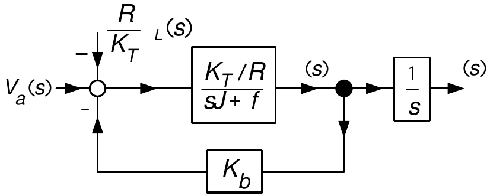

With $G(s)=\dfrac{K_{T}/R}{sJ+f},$ $H(s)=K_{b},$ $R(s)=V_{a}(s)-\dfrac
{R}{K_{T}}\tau_{L}(s),$ $C(s)=\omega(s)$:

$$
\begin{aligned}
\!\omega(s)\!=\!\frac{\dfrac{K_{T}/R}{sJ+f}}{1+K_{b}\dfrac{K_{T}/R}{sJ+f}}\left(  \!V_{a}(s)-\frac{R}{K_{T}}\tau_{L}(s)\!\right)   & =\!\frac{K_{T}/R}{sJ+f+K_{b}K_{T}/R}\!\left(  \!V_{a}(s)-\frac{R}{K_{T}}\tau_{L}(s)\!\right)
\\
& =\frac{\dfrac{K_{T}}{RJ}}{s+\dfrac{f+K_{b}K_{T}/R}{J}}\!\left(
\!V_{a}(s)-\frac{R}{K_{T}}\tau_{L}(s)\right) \\
& =\frac{b}{s+a}\!\left(  \!V_{a}(s)-K_{L}\tau_{L}(s)\!\right)
\!.
\end{aligned}
$$

where $a\triangleq\dfrac{f+K_{b}K_{T}/R}{J},$
$b\triangleq\dfrac{K_{T}}{RJ},$ $K_{L}\triangleq\dfrac{R}{K_{T}}.$
:::

---

::: {.compact-slide .expanded-body-slide}

<strong>Example</strong> <em>Transfer Function of DC motor</em>
<strong>(continued)</strong>

From previous slide:

$$
\begin{aligned}
\!\omega(s)\!  & =\!\frac{b}{s+a}\!\left(  \!V_{a}(s)-K_{L}\tau_{L}(s)\!\right) \\
& \\
a  & \triangleq\dfrac{f+K_{b}K_{T}/R}{J},\text{  }b\triangleq\dfrac{K_{T}}{RJ},\text{  }K_{L}\triangleq\frac{R}{K_{T}}.
\end{aligned}
$$

The block diagram reduces to

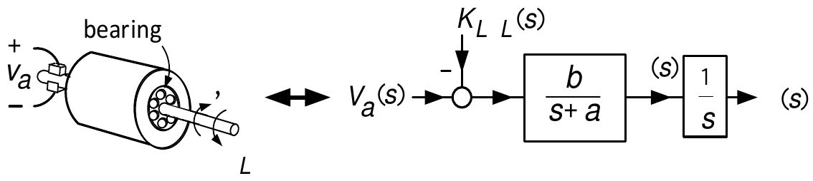

-   Later we describe an experiment to directly estimate the values of
    $a$ and $b$.

    $\Longrightarrow$ We don't need to know the values of the individual
    motor parameters.

-   In practice the load torque $\tau_{L}$ is not known.

-   *Control problem*

    Use $\theta(t)$ to compute $v_{a}(t)$ that forces the motor to a
    final position $\theta_{0}$ at time $t_{f}$.

    It must do this without knowledge of the value of $\tau_{L}$.
:::

---

::: {.compact-slide}

<strong>Error Transfer Function via The Block Diagram</strong>

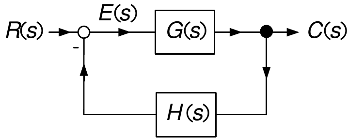

Compute the transfer function $R(s)$ to
$E(s).$

$$
E(s)=R(s)-H(s)C(s)=R(s)-H(s)G(s)E(s).
$$

Rearrange:

$$
(1+H(s)G(s))E(s)=R(s)
$$

or

$$
E(s)=\frac{1}{1+H(s)G(s)}R(s).
$$

-   This expression appears over and over again in the study of control
    systems.
:::

---

::: {.compact-slide}

<strong>Position Feedback for the DC Motor</strong>

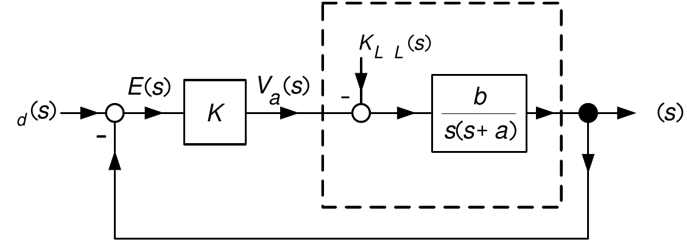

-   Reference input: $\theta_{d}(s)=\dfrac{\theta_{0}}{s}$ or in the
    time domain $\theta_{d}(t)=\theta_{0}u_{s}(t)$.

-   $\theta_{0}$ is the desired final angular position of the motor.

-   $e(t)=\theta_{0}-\theta(t)$ or in the $s$ domain $E(s)=\theta
    _{0}/s-\theta(s)$.

    -   This is the difference or *error* between the desired and actual
        position.

-   A sensor is used to measure $\theta(t)$ and bring its value into the
    computer.

-   The value of $\theta_{0}$ is stored in the computer.

-   The computer calculates $v_{a}(t)=K(\theta_{0}-\theta(t))$.

    -   In the $s$ domain
        $V_{a}(s)=K\!\left(  \dfrac{\theta_{0}}{s}-\theta(s)\right)$.

    -   $v_{a}(t)=Ke(t)$ called *proportional* control - voltage is
        proportional to the error.

-   The value of $v_{a}(t)$ is sent to the amplifier to apply the
    voltage to the motor.
:::

---

::: {.compact-slide .multi-figure-slide .expanded-body-slide}

<strong>General Block Diagram for a Control System</strong>

DC motor: $G(s)=\dfrac{b}{s(s+a)},$ $H(s)=1,$ $G_{c}(s)=K,$
$D(s)=K_{L}\tau_{L}(s),$ $R(s)=\dfrac{\theta_{0}}{s}.$

Equivalent block diagram:

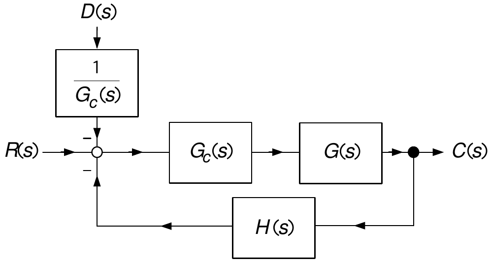

:::

---

::: {.compact-slide}

<strong>General Block Diagram for a Control System</strong>

We have

$$
\begin{aligned}
C(s)  & =\frac{G_{c}(s)G(s)}{1+H(s)G_{c}(s)G(s)}\!\left(  R(s)-\frac{1}{G_{c}(s)}D(s)\right) \\
& =\frac{G_{c}(s)G(s)}{1+H(s)G_{c}(s)G(s)}R(s)-\frac{G(s)}{1+H(s)G_{c}(s)G(s)}D(s).
\end{aligned}
$$

And

$$
\begin{aligned}
\!\!\!\!\!E(s)=R(s)-H(s)C(s)\!\!\!\!  & =\!\!\!R(s)-\!\left(  \!\frac
{H(s)G_{c}(s)G(s)}{1+H(s)G_{c}(s)G(s)}R(s)-\frac{H(s)G(s)}{1+H(s)G_{c}(s)G(s)}D(s)\!\!\right) \\
\!\!\!\!\!  & =\!\!\!\frac{1}{1+H(s)G_{c}(s)G(s)}R(s)+\frac{H(s)G(s)}{1+H(s)G_{c}(s)G(s)}D(s).
\end{aligned}
$$
:::

---

::: {.compact-slide .expanded-body-slide .expanded-figure-slide}

<strong>General Block Diagram for a Control System</strong>

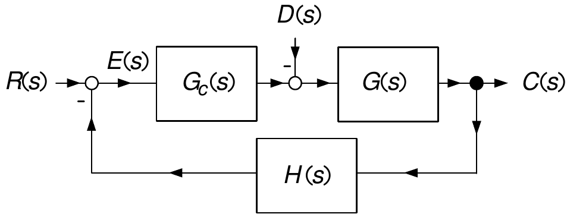

Most often we use *unity feedback*, i.e., $H(s)=1$. Then

$$
\begin{aligned}
C(s)  & =\frac{G_{c}(s)G(s)}{1+G_{c}(s)G(s)}R(s)-\frac{G(s)}{1+G_{c}(s)G(s)}D(s)\\
& \\
E(s)  & =\frac{1}{1+G_{c}(s)G(s)}R(s)+\frac{G(s)}{1+G_{c}(s)G(s)}D(s).
\end{aligned}
$$

-   We will make extensive use of these in the design of the feedback
    controller $G_{c}(s)$.
:::

---

::: {.compact-slide .multi-figure-slide .dense-multi-slide .expanded-body-slide}

<strong>Example</strong> <em>Block Diagram Reduction</em>

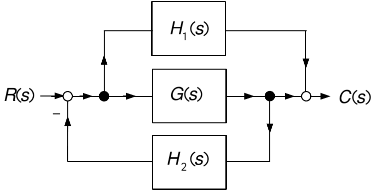

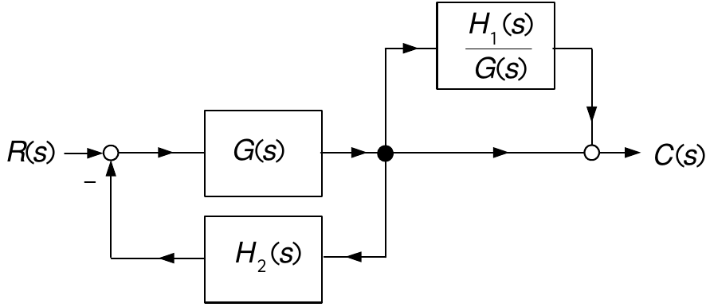

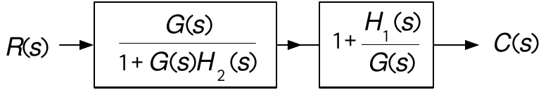

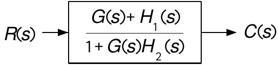

:::

---

::: {.compact-slide .multi-figure-slide .dense-multi-slide .expanded-body-slide .diagram-sequence-slide}

<strong>Example</strong> <em>Block Diagram Reduction</em>

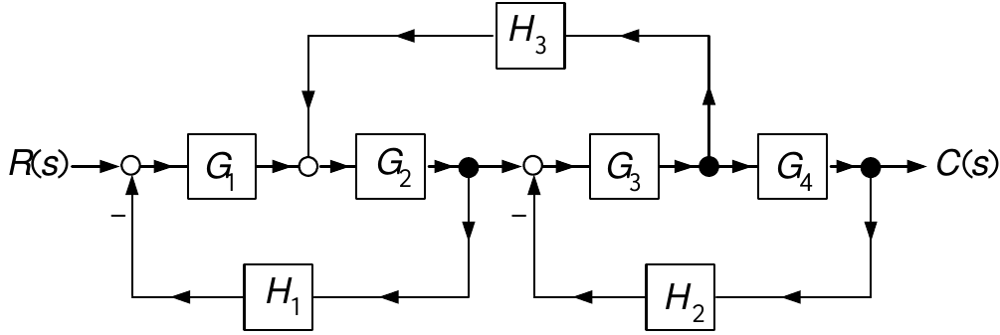
 Remove $H_{3}$
from the feedback loops.

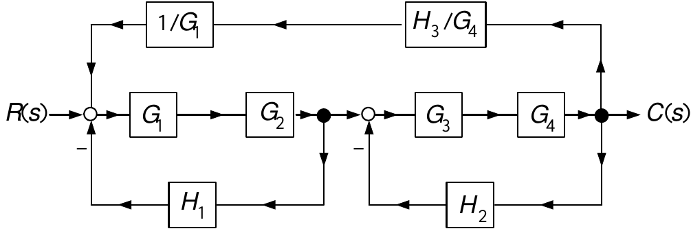
 Simplify the two
bottom feedback loops.

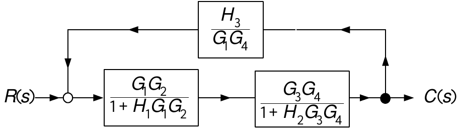

:::

---

::: {.compact-slide .multi-figure-slide .expanded-body-slide}

<strong>Example</strong> <em>Block Diagram Reduction</em>
<strong>(continued)</strong>

From previous slide:

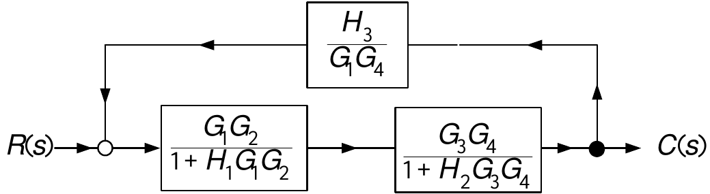

-   Note that a minus sign is missing in the feedback path!

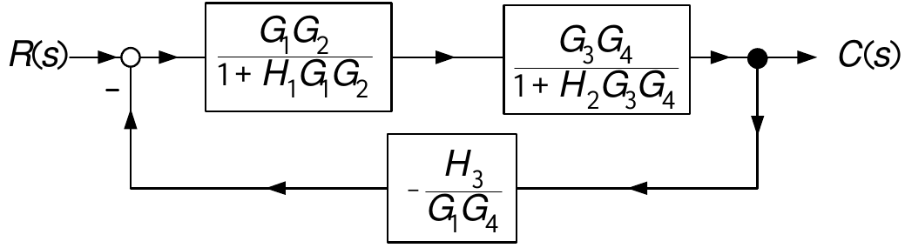

Then

$$
C(s)=\frac{\dfrac{G_{1}G_{2}}{1+H_{1}G_{1}G_{2}}\dfrac{G_{3}G_{4}}{1+H_{2}G_{3}G_{4}}}{1-\dfrac{H_{3}}{G_{1}G_{2}}\dfrac{G_{1}G_{2}}{1+H_{1}G_{1}G_{2}}\dfrac{G_{3}G_{4}}{1+H_{2}G_{3}G_{4}}}R(s).
$$
:::

---

::: {.compact-slide .multi-figure-slide .dense-multi-slide .expanded-body-slide .diagram-sequence-slide}

<strong>Example</strong> <em>Block Diagram Reduction</em>

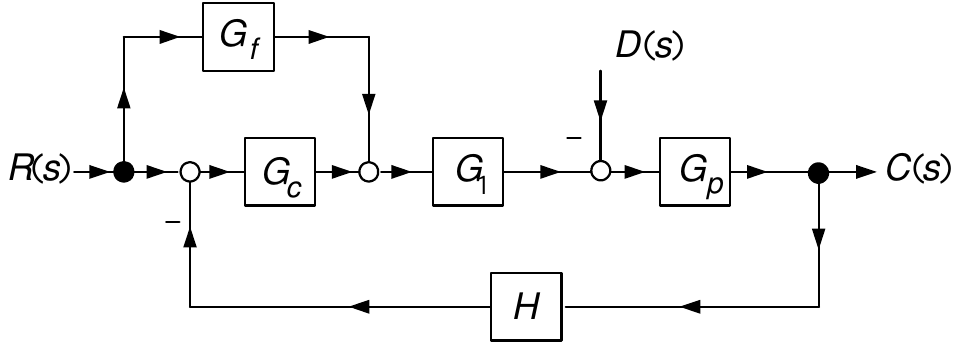

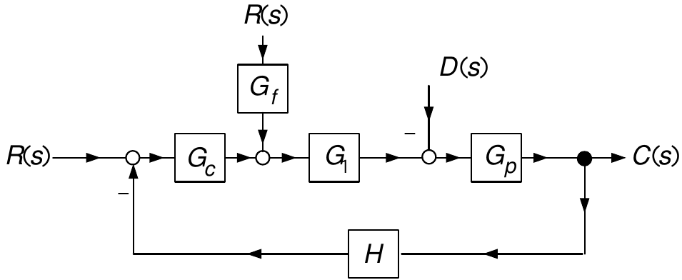

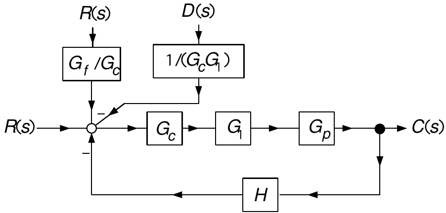

:::

---

::: {.compact-slide .expanded-body-slide .expanded-figure-slide}

<strong>Example</strong> <em>Block Diagram Reduction</em>
<strong>(continued)</strong>

From previous slide:

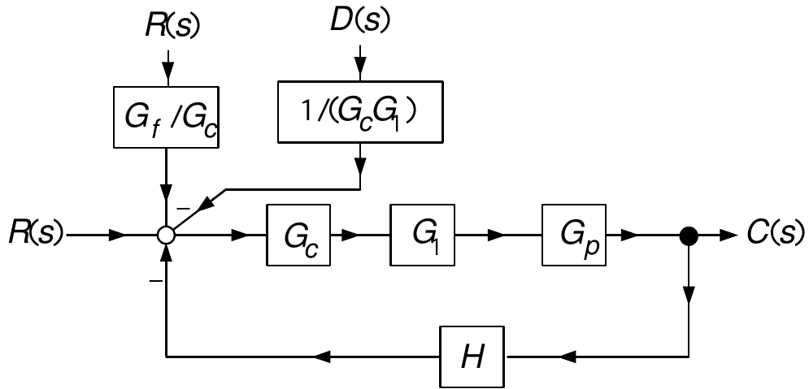

Then

$$
\begin{aligned}
C(s)  & =\frac{G_{c}G_{1}G_{p}}{1+HG_{c}G_{1}G_{p}}\left(  R(s)+\frac{G_{f}}{G_{c}}R(s)-\frac{1}{G_{c}G_{1}}D(s)\right) \\
& \\
& \\
& =\frac{G_{1}G_{p}(G_{c}+G_{f})}{1+HG_{c}G_{1}G_{p}}R(s)-\frac{G_{p}}{1+HG_{c}G_{1}G_{p}}D(s)
\end{aligned}
$$
:::

---

::: {.compact-slide .expanded-body-slide .expanded-figure-slide}

<strong>Example</strong> <em>Current Command Amplifier for a DC
Motor</em>

-   The input to the motor is the voltage $v_{a}$.

-   The motor torque is $K_{T}i.$

-   Use feedback to make current (and therefore torque) the input.

Recall

$$
I(s)=\frac{-K_{b}\omega(s)+V_{a}(s)}{sL+R},\text{   }\omega(s)=\frac
{K_{T}I(s)-\tau_{L}(s)}{sJ+f},\text{   }\theta(s)=\frac{1}{s}\omega(s).
$$

Block diagram with current feedback:

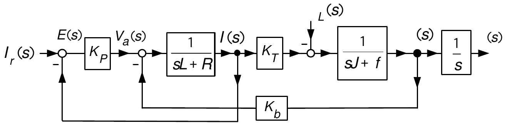

-   $I_{r}(s)$ is the LT of the reference (desired) motor current.

-   $I(s)$ is the LT of the motor current.

-   $K_{P}>0$ is a proportional gain.

-   We do *not* set $L=0.$
:::

---

::: {.compact-slide .multi-figure-slide .dense-multi-slide .expanded-body-slide .diagram-sequence-slide}

<strong>Example</strong> <em>Current Command Amplifier for a DC
Motor</em> <strong>(continued)</strong>

From previous slide:

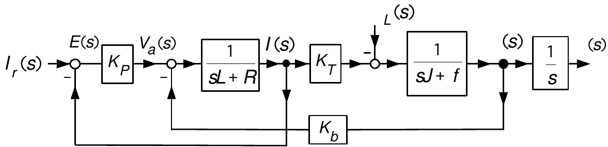

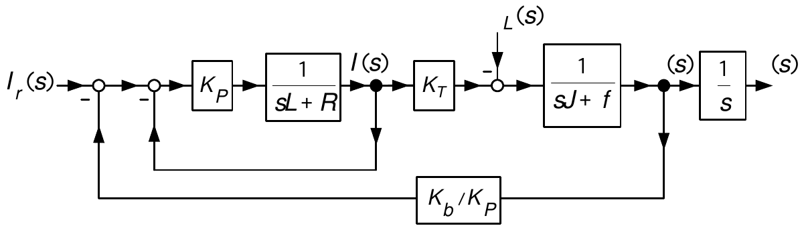

:::

---

::: {.compact-slide .multi-figure-slide .expanded-body-slide .diagram-pair-slide}

<strong>Example</strong> <em>Current Command Amplifier for a DC
Motor</em> <strong>(continued)</strong>

From previous slide:

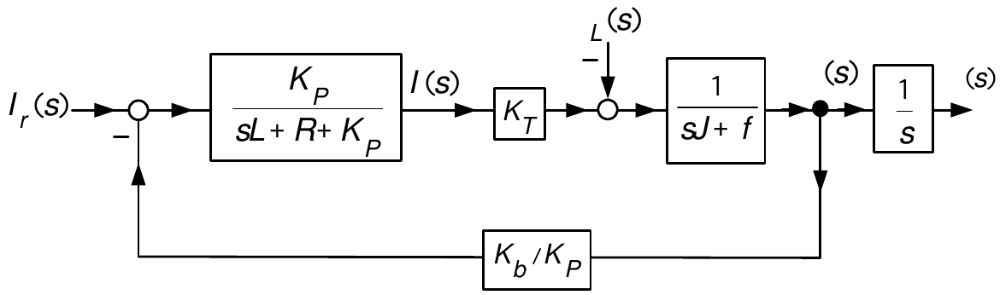

:::

---

::: {.compact-slide .expanded-body-slide}

<strong>Example</strong> <em>Current Command Amplifier for a DC
Motor</em> <strong>(continued)</strong>

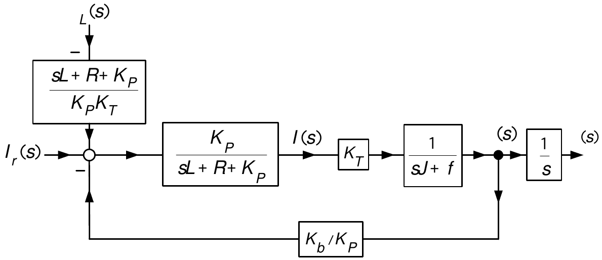

$$
\begin{aligned}
\omega(s)\!  & =\!\!\frac{\dfrac{K_{p}}{sL+R+K_{p}}\dfrac{K_{T}}{sJ+f}}{1+\dfrac{K_{b}}{K_{p}}\dfrac{K_{p}}{sL+R+K_{p}}\dfrac{K_{T}}{sJ+f}}\!\left(
\!I_{r}(s)-\frac{1}{\dfrac{K_{p}K_{T}}{sL+R+K_{p}}}\tau_{L}(s)\!\!\right) \\
& \\
\!\!  & =\!\!\frac{\overset{\rightarrow1\text{ as }K_{p}\rightarrow
\infty}{\overbrace{\dfrac{1}{(sL+R)/K_{p}+1}}}\dfrac{K_{T}}{sJ+f}}{1+\underset{\rightarrow0}{\underbrace{\dfrac{K_{b}}{K_{p}}}}\underset{\rightarrow1\text{ as }K_{p}\rightarrow\infty}{\underbrace{\dfrac
{1}{(sL+R)/K_{p}+1}}}\dfrac{K_{T}}{sJ+f}}\!\left(  \!I_{r}(s)-\frac
{1}{\underset{\rightarrow1\text{ as }K_{p}\rightarrow\infty
}{\underbrace{\dfrac{1}{(sL+R)/K_{p}+1}}}K_{T}}\tau_{L}(s)\!\!\right)
\end{aligned}
$$
:::

---

::: {.compact-slide}

<strong>Example</strong> <em>Current Command Amplifier for a DC
Motor</em> <strong>(continued)</strong>

-   By letting $K_{p}\rightarrow\infty$ we obtain
    $\dfrac{1}{(sL+R)/K_{p}+1}\rightarrow1$ and
    $\dfrac{K_{b}}{K_{p}}\rightarrow0.$

$$
\omega(s)=\frac{\dfrac{K_{T}}{sJ+f}}{1}\!\left(  I_{r}(s)-\frac{1}{K_{T}}\tau_{L}(s)\right)  =\dfrac{K_{T}}{sJ+f}\left(  I_{r}(s)-\frac{1}{K_{T}}\tau_{L}(s)\right)  .
$$

-   Block diagram is simply
    
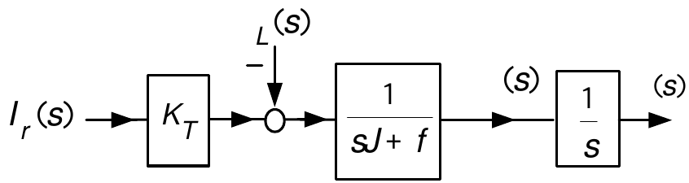

-   If the gain $K_{P}$ is large enough, $i(t)$ is forced to track
    $i_{r}(t).$

    -   We can then assume that $i_{r}$ is essentially equal to $i$.

-   However, $K_{P}$ cannot be arbitrarily large.

-   $v_{a}(t)=K_{P}(i_{r}(t)-i(t))$ which for large $K_{P}$ can make
    $v_{a}$ greater than $V_{\text{max}}$.

-   With a good current controller, $v_{a}(t)$ automatically adjusts to
    force $i(t)\rightarrow i_{r}(t)$.

-   We can now design the feedback controller with $i_{r}(t)$ as the
    input.
:::
