::: {.contents-slide}
# Contents

- First-Order Responses and Motor Identification

- Second-Order Transient Response and Closed-Loop Poles

- Peak Time, Overshoot, Settling Time, and Rise Time

- Gain Selection and Motor-Parameter Identification

- Effects of Zeros and Higher-Order Poles
:::

---

::: {.compact-slide .multi-figure-slide .dense-multi-slide}

First-Order Systems

**Speed Response of a DC motor**

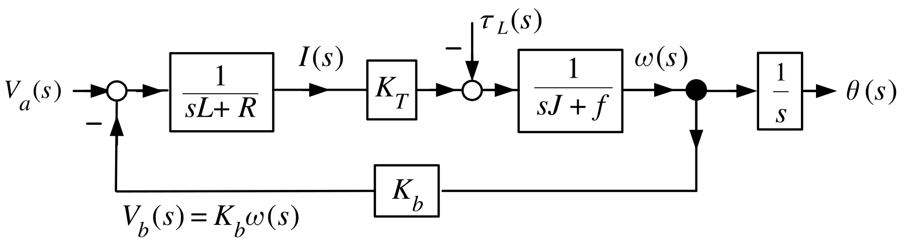

With
$L=0,a\triangleq\dfrac{f+K_{b}K_{T}/R}{J},b\triangleq\dfrac{K_{T}}{RJ},K_{L}=\dfrac{R}{K_{T}}$:

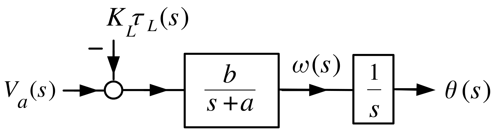
 **Time Constant
Form** 

$T_{m}\triangleq1/a,K_{m}\triangleq b/a.$
:::

---

::: {.compact-slide .expanded-body-slide .boundary-safe-slide}

<strong>Speed Response of a DC motor</strong>

-   Compute $\omega(t)$ due to a step input voltage.

-   $\omega(s)=\dfrac{K_{m}}{T_{m}s+1}V_{a}(s)-\dfrac{K_{m}}{T_{m}s+1}K_{L}\tau_{L}(s).$

-   Let $\tau_{L}=0$ and set

$$
G(s)=\frac{K_{m}}{T_{m}s+1}.
$$

-   A common form for a *first-order* $G(s).$

    -   Normally the leading coefficient in $s$ of the denominator is
        $1$!

-   Step input voltage $V_{a}(s)=\dfrac{V_{0}}{s}$:

$$
\omega(s)=\frac{K_{m}}{T_{m}s+1}\frac{V_{0}}{s}=V_{0}K_{m}\!\left(  \frac
    {1}{s}-\frac{1}{s+1/T_{m}}\right)
$$

and inverse
    LT

$$
\omega(t)=V_{0}K_{m}(1-e^{-t/T_{m}})u_{s}(t).
$$
:::

---

::: {.compact-slide .multi-figure-slide}

<strong>Speed Response of a DC motor</strong>

$$
\begin{array}{c|l}
\hline
t & \frac{\omega(t)}{V_{0}K_{m}}=1-e^{-t/T_{m}}\\\hline
0 & 1-e^{-0}=0\\\hline
T_{m} & 1-e^{-1}=0.632\\\hline
2T_{m} & 1-e^{-2}=0.86\\\hline
3T_{m} & 1-e^{-3}=0.95\\\hline
4T_{m} & 1-e^{-4}=0.98\\\hline
\end{array}
$$

Plot $\omega(t)=V_{0}K_{m}(1-e^{-t/T_{m}})u_{s}(t).$

:::

---

::: {.compact-slide .expanded-body-slide}

<strong>Speed Response of a DC motor</strong>

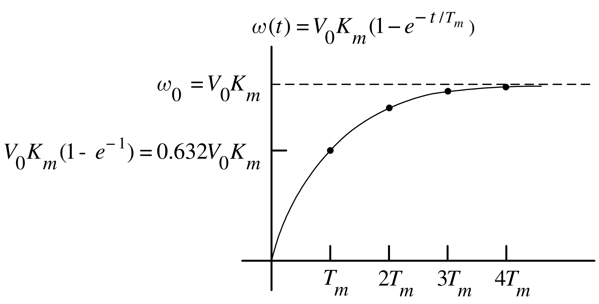

-   $T_{m}$ is the *time constant* and its units are in seconds.

-   The smaller the value of $T_{m}$ the faster the system responds.

**Example** Let $\omega_{0}$ be the desired final angular speed. Set
$V_{0}=\dfrac{\omega_{0}}{K_{m}}.$

With step input voltage of
$v_{a}(t)=\dfrac{\omega_{0}}{K_{m}}u_{s}(t)\rightarrow\omega(t)=\omega_{0}(1-e^{-t/T_{m}})u_{s}(t).$

-   $\left.  \left(  1-e^{-t/T_{m}}\right)  \right\vert _{t=4T_{m}}=0.98\Longrightarrow\omega(t)$
    is within $2\%$ of $\omega_{0}$.

-   That is, for $t\geq4T_{m}$ we have $0.98\omega_{0}\leq\omega
    _{0}(1-e^{-t/T_{m}})\leq\omega_{0}$.

-   The smaller the value of $T_{m}$, the faster $\omega(t)$ is within
    $2\%$ of its final value $\omega_{0}.$
:::

---

::: {.compact-slide .expanded-body-slide .expanded-figure-slide}

<strong>Identification of the Motor Transfer Function
Model</strong>

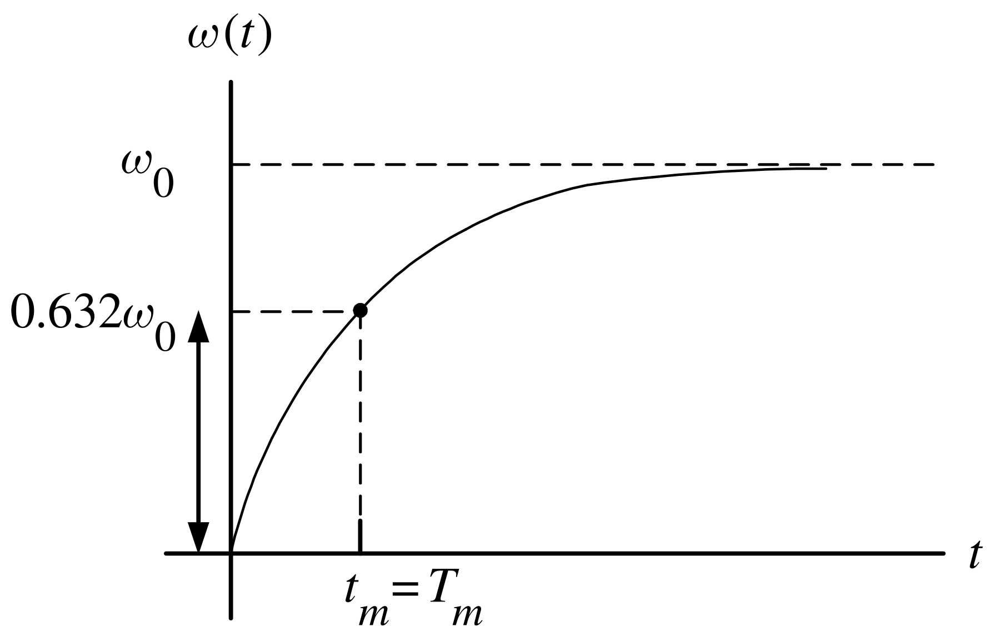

-   Apply a constant voltage $V_{0}$ to the motor and graph its speed
    $\omega(t)$.

-   With $\omega_{0}$ denoting the final speed we have $K_{m}=\omega
    _{0}/V_{0}.$

-   Measure the time $t_{m}$ the speed reaches $1-e^{-1}=0.632$ of its
    final value $\omega_{0}.$

-   Then $T_{m}=t_{m}$.

-   The motor's transfer function is $G(s)=\dfrac{K_{m}}{T_{m}s+1}.$

-   Or $G(s)=\dfrac{b}{s+a}$ with $a=1/T_{m}$ and $b=K_{m}/T_{m}.$
:::

---

::: {.compact-slide .multi-figure-slide}

Second-Order Systems

**Position Control of a DC Motor**

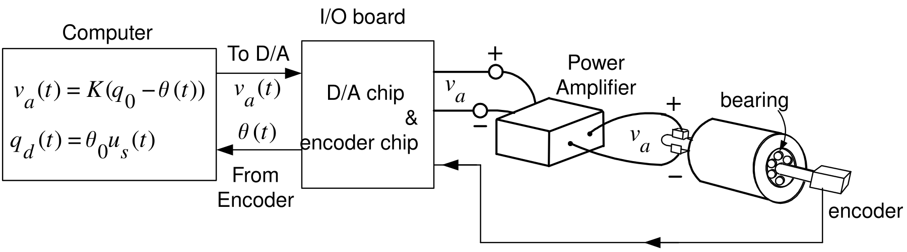

The computer reads in $\theta(t)$ and sends out a value for $v_{a}(t)$
to the D/A.

We want the motor rotate to the angle $\theta_{0}$.

Let the reference (desired) motor angle be
$\theta_{d}(t)=\theta_{0}u_{s}(t).$

Use *proportional* control, i.e.,
$v_{a}(t)=K\!\left(  \theta_{d}(t)-\theta(t)\right)$

**Block diagram model**

-   $a>0,b>0$ and $K>0.$
    
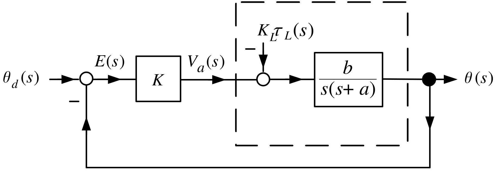

:::

---

::: {.compact-slide .expanded-body-slide .boundary-safe-slide}

<strong>Position Control of a DC Motor</strong>

**Standard notation** $R(s)=\theta_{d}(s)=R_{0}/s$ and $C(s)=\theta(s)$.

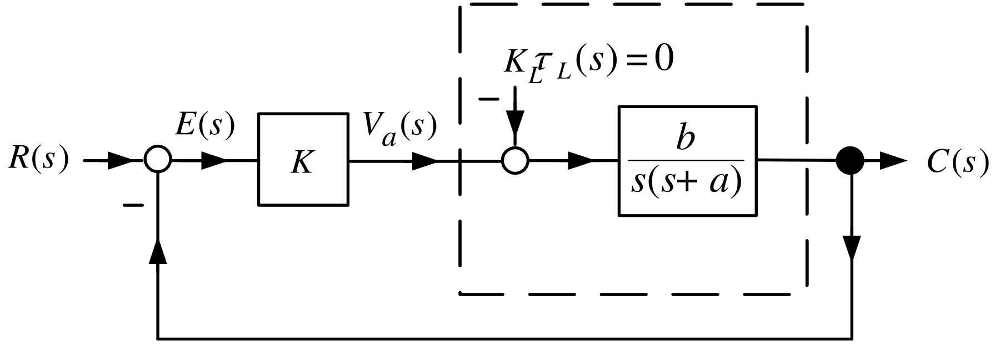

With $\tau_{L}=0$ we have

$$
C(s)=\frac{\dfrac{bK}{s\left(  s+a\right)  }}{1+\dfrac{bK}{s\left(
s+a\right)  }}R(s)=\frac{bK}{s^{2}+as+bK}R(s).
$$

Closed-loop transfer
function

$$
\frac{C(s)}{R(s)}=\frac{bK}{s^{2}+as+bK}
$$

With
$R(s)=R_{0}/s,$ set $\omega_{n}^{2}\triangleq bK>0,$ and
$2\zeta\omega_{n}\triangleq a$ or
$\zeta\triangleq\dfrac{a}{2\omega_{n}}>0$.

$$
C(s)=\frac{\omega_{n}^{2}}{s^{2}+2\zeta\omega_{n}s+\omega_{n}^{2}}\frac{R_{0}}{s}.
$$

$\zeta$ is referred to as the *damping ratio.*

$\omega_{n}$ is the *natural frequency*.
:::

---

::: {.compact-slide .expanded-body-slide}

<strong>Position Control of a DC Motor</strong>

$\zeta>0$ and $\omega_{n}>0$ so that

$$
sC(s)=\frac{\omega_{n}^{2}}{s^{2}+2\zeta\omega_{n}s+\omega_{n}^{2}}R_{0}
$$

is *stable*. By the FVT we
have

$$
c(\infty)\triangleq\lim_{t\rightarrow\infty}c(t)=\lim_{s\rightarrow
0}sC(s)=\lim_{s\rightarrow0}s\frac{\omega_{n}^{2}}{s^{2}+2\zeta\omega
_{n}s+\omega_{n}^{2}}\frac{R_{0}}{s}=R_{0}.
$$

Thus $c(t)\rightarrow R_{0}$ as $t\rightarrow\infty.$
:::

---

::: {.compact-slide .expanded-body-slide}

<strong>Transient Response and Closed-Loop Poles</strong>

$$
C(s)=\underset{G(s)}{\underbrace{\frac{\omega_{n}^{2}}{s^{2}+2\zeta\omega
_{n}s+\omega_{n}^{2}}}}\underset{\text{input}}{\underbrace{\frac{R_{0}}{s}}}
$$

The poles of $G(s)$ are the roots of
$s^{2}+2\zeta\omega_{n}s+\omega_{n}^{2}=0$:

$$
p_{i}=\frac{-2\zeta\omega_{n}\pm\sqrt{(2\zeta\omega_{n})^{2}-4\omega_{n}^{2}}}{2}=-\zeta\omega_{n}\pm\sqrt{(\zeta^{2}-1)\omega_{n}^{2}}=-\zeta\omega_{n}\pm\omega_{n}\sqrt{\zeta^{2}-1}.
$$

Four cases:

$$
\begin{array}
[c]{rll}0<\zeta<1 &  & p_{1},p_{2}=-\zeta\omega_{n}\pm j\omega_{n}\sqrt{1-\zeta^{2}}\\
&  & \\
\zeta=1 &  & p_{1},p_{2}=-\omega_{n}\\
&  & \\
\zeta>1 &  & p_{1}=-\zeta\omega_{n}+\omega_{n}\sqrt{\zeta^{2}-1},\text{
 }p_{2}=-\zeta\omega_{n}-\omega_{n}\sqrt{\zeta^{2}-1}\\
&  & \\
\zeta=0 &  & p_{1},p_{2}=\pm j\omega_{n}\end{array}
$$

-   Both poles in the open LHP for $\zeta>0$ making $G(s)$ stable.

-   If $\zeta=0$, then the poles are on the $j\omega$ axis at $\pm
    j\omega_{n}$.
:::

---

::: {.compact-slide .expanded-body-slide .expanded-figure-slide}

<strong>Transient Response and Closed-Loop Poles</strong>

-   Pole locations for $0<\zeta<1,$ $p_{1},p_{2}=-\zeta\omega_{n}\pm
    j\omega_{n}\sqrt{1-\zeta^{2}}$

-   $\omega_{d}\triangleq\omega_{n}\sqrt{1-\zeta^{2}}$ is the *damped
    frequency*.

$$
\begin{aligned}
    \left\vert p_{i}\right\vert ^{2}=\left\vert -\zeta\omega_{n}\pm j\omega
    _{n}\sqrt{1-\zeta^{2}}\right\vert ^{2}  & =(-\zeta\omega_{n})^{2}+\left(
    \pm\omega_{n}\sqrt{1-\zeta^{2}}\right)  ^{2}\\
    & =\zeta^{2}\omega_{n}^{2}+\omega_{n}^{2}(1-\zeta^{2})\\
    & =\omega_{n}^{2}.
    \end{aligned}
$$

-   For $0\leq\zeta\leq1,$ poles are on a semicircle of radius of
    $\omega_{n}$.

-   $\tan(\phi)=\sqrt{1-\zeta^{2}}/\zeta$.
:::

---

::: {.compact-slide .expanded-body-slide .expanded-figure-slide}

<strong>Transient Response and Closed-Loop Poles</strong>

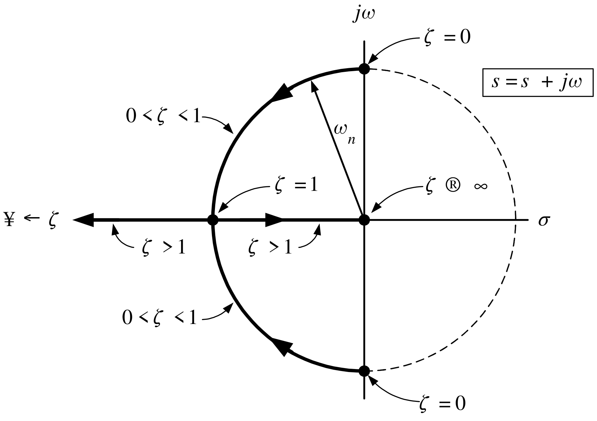

$$
\begin{array}
[c]{cl}0<\zeta<1 & p_{1},p_{2}=-\zeta\omega_{n}\pm j\omega_{n}\sqrt{1-\zeta^{2}}\\
& \\
\zeta=1 & p_{1},p_{2}=-\omega_{n}\\
& \\
\zeta>1 & p_{1}=-\zeta\omega_{n}+\omega_{n}\sqrt{\zeta^{2}-1},\text{  }p_{2}=-\zeta\omega_{n}-\omega_{n}\sqrt{\zeta^{2}-1}\\
& \\
\zeta=0 & p_{1},p_{2}=\pm j\omega_{n}\end{array}
$$
:::

---

::: {.compact-slide}

<strong>Transient Response and Closed-Loop Poles</strong>

Consider $0<\zeta<1$ so
$p_{1},p_{2}=-\zeta\omega_{n}\pm j\omega_{n}\sqrt{1-\zeta^{2}}.$

$$
\begin{aligned}
C(s)  & =\frac{\omega_{n}^{2}}{s^{2}+2\zeta\omega_{n}s+\omega_{n}^{2}}\frac{R_{0}}{s}\\
& =\frac{\omega_{n}^{2}}{\left(  s-(-\zeta\omega_{n}+j\omega_{n}\sqrt
{1-\zeta^{2}})\right)  \!\left(  s-(-\zeta\omega_{n}-j\omega_{n}\sqrt
{1-\zeta^{2}})\right)  }\frac{R_{0}}{s}\\
& =\frac{R_{0}}{s}+\frac{\beta}{s-(-\zeta\omega_{n}+j\omega_{n}\sqrt
{1-\zeta^{2}})}+\frac{\beta^{\ast}}{s-(-\zeta\omega_{n}-j\omega_{n}\sqrt{1-\zeta^{2}})}.\\
& \\
& \\
\text{So }c(t)  & =R_{0}u_{s}(t)+\beta e^{-\zeta\omega_{n}t}e^{+j\omega
_{n}\sqrt{1-\zeta^{2}}t}+\beta^{\ast}e^{-\zeta\omega_{n}t}e^{-j\omega_{n}\sqrt{1-\zeta^{2}}t}\\
& \\
& =R_{0}u_{s}(t)+2|\beta|e^{-\zeta\omega_{n}t}\!\cos\!\left(  \!\omega
_{n}\sqrt{1-\zeta^{2}}t+\angle\beta\right)  .
\end{aligned}
$$

-   Transient dies out according to the *real part* $-\zeta\omega_{n}$
    of the poles.

-   Typically want $0.6\leq\zeta\leq0.8$
:::

---

::: {.compact-slide}

<strong>Transient Response and Closed-Loop Poles</strong>

Compute $c(t)$:

$$
\begin{aligned}
C(s)  & =\frac{\omega_{n}^{2}}{s^{2}+2\zeta\omega_{n}s+\omega_{n}^{2}}\frac{R_{0}}{s}=\frac{R_{0}}{s}+\frac{A_{1}(s+\zeta\omega_{n})+A_{2}\omega
_{n}\sqrt{1-\zeta^{2}}}{(s+\zeta\omega_{n})^{2}+\omega_{n}^{2}(1-\zeta^{2})}.\\
\Longrightarrow\text{  }\omega_{n}^{2}R_{0}  & =\left(  s^{2}+2\zeta
\omega_{n}s+\omega_{n}^{2}\right)  \!R_{0}+s\!\left(
\!A_{1}(s+\zeta\omega_{n})+A_{2}\omega_{n}\sqrt{1-\zeta^{2}}\!\right)
\end{aligned}
$$

Equating powers of $s$:

$$
\begin{array}
[c]{cl}s^{2} & 0=(R_{0}+B)s^{2}\Longrightarrow A_{1}=-R_{0}\\
s^{1} & 0=\left(  2\zeta\omega_{n}R_{0}+A_{1}\zeta\omega_{n}+A_{2}\omega
_{n}\sqrt{1-\zeta^{2}}\right)  \!s\Longrightarrow A_{2}=-R_{0}\zeta
/\sqrt{1-\zeta^{2}}\\
s^{0} & \omega_{n}^{2}R_{0}=\omega_{n}^{2}R_{0}\end{array}
$$

Then

$$
C(s)=\frac{R_{0}}{s}-R_{0}\frac{s+\zeta\omega_{n}}{(s+\zeta\omega_{n})^{2}+\omega_{n}^{2}(1-\zeta^{2})}-\frac{R_{0}\zeta}{\sqrt{1-\zeta^{2}}}\frac{\omega_{n}\sqrt{1-\zeta^{2}}}{(s+\zeta\omega_{n})^{2}+\omega_{n}^{2}(1-\zeta^{2})}
$$
:::

---

::: {.compact-slide}

<strong>Transient Response and Closed-Loop Poles</strong>

From previous
slide:

$$
C(s)=\frac{R_{0}}{s}-R_{0}\frac{s+\zeta\omega_{n}}{(s+\zeta\omega_{n})^{2}+\omega_{n}^{2}(1-\zeta^{2})}-\frac{R_{0}\zeta}{\sqrt{1-\zeta^{2}}}\frac{\omega_{n}\sqrt{1-\zeta^{2}}}{(s+\zeta\omega_{n})^{2}+\omega_{n}^{2}(1-\zeta^{2})}
$$

$$
\begin{aligned}
e^{\sigma t}\sin(\omega t)u_{s}(t)  & \leftrightarrow\frac{\omega}{(s-\sigma)^{2}+\omega^{2}}\\
e^{\sigma t}\cos(\omega t)u_{s}(t)  & \leftrightarrow\frac{s-\sigma}{(s-\sigma)^{2}+\omega^{2}}.
\end{aligned}
$$

For $t>0$ we have

$$
\begin{aligned}
c(t)  & =R_{0}-R_{0}e^{-\zeta\omega_{n}t}\cos\!\left(  \omega_{n}\sqrt
{1-\zeta^{2}}t\right)  -R_{0}\frac{\zeta}{\sqrt{1-\zeta^{2}}}e^{-\zeta\omega_{n}t}\sin\!\left(  \omega_{n}\sqrt{1-\zeta^{2}}t\right) \\
& =R_{0}-R_{0}\frac{e^{-\zeta\omega_{n}t}}{\sqrt{1-\zeta^{2}}}\left(
\sqrt{1-\zeta^{2}}\cos\!\left(  \omega_{n}\sqrt{1-\zeta^{2}}t\right)
+\right.  \left.  \zeta\sin\!\left(  \omega_{n}\sqrt{1-\zeta^{2}}t\right)
\right) \\
& =R_{0}-R_{0}\frac{e^{-\zeta\omega_{n}t}}{\sqrt{1-\zeta^{2}}}\left(
\sin\left(  \phi\right)  \cos\!\left(  \omega_{n}\sqrt{1-\zeta^{2}}t\right)
+\right.  \left.  \cos\left(  \phi\right)  \sin\!\left(  \omega_{n}\sqrt{1-\zeta^{2}}t\right)  \right) \\
& =R_{0}-R_{0}\frac{e^{-\zeta\omega_{n}t}}{\sqrt{1-\zeta^{2}}}\sin\!\left(
\omega_{n}\sqrt{1-\zeta^{2}}t+\phi\right)
\end{aligned}
$$

where
$\sin\left(  \phi\right)  \triangleq\sqrt{1-\zeta^{2}},$ $\cos\left(
\phi\right)  \triangleq\zeta$ so $\phi\triangleq\tan^{-1}\!\left(
\dfrac{\sqrt{1-\zeta^{2}}}{\zeta}\right)  .$
:::

---

::: {.compact-slide .expanded-body-slide .expanded-figure-slide}

<strong>Transient Response and Closed-Loop Poles</strong>

$$
c(t)=R_{0}u_{s}(t)-R_{0}\frac{e^{-\zeta\omega_{n}t}}{\sqrt{1-\zeta^{2}}}\sin\!\left(  \omega_{n}\sqrt{1-\zeta^{2}}t+\phi\right)  \!u_{s}(t)\text{
 for  }0<\zeta<1
$$

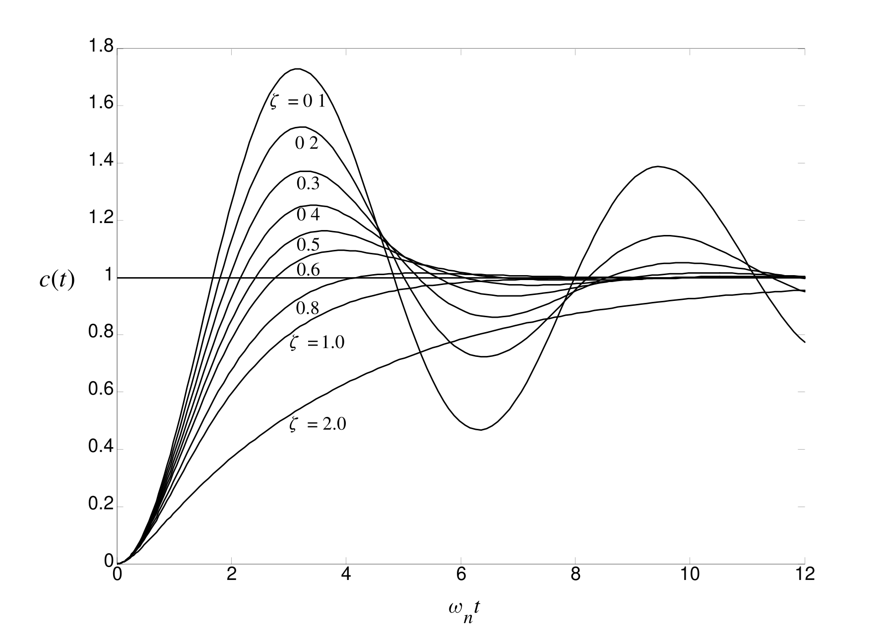

:::

---

::: {.compact-slide .expanded-body-slide .expanded-figure-slide}

<strong>Peak Time</strong> <em>t</em><em>p</em>

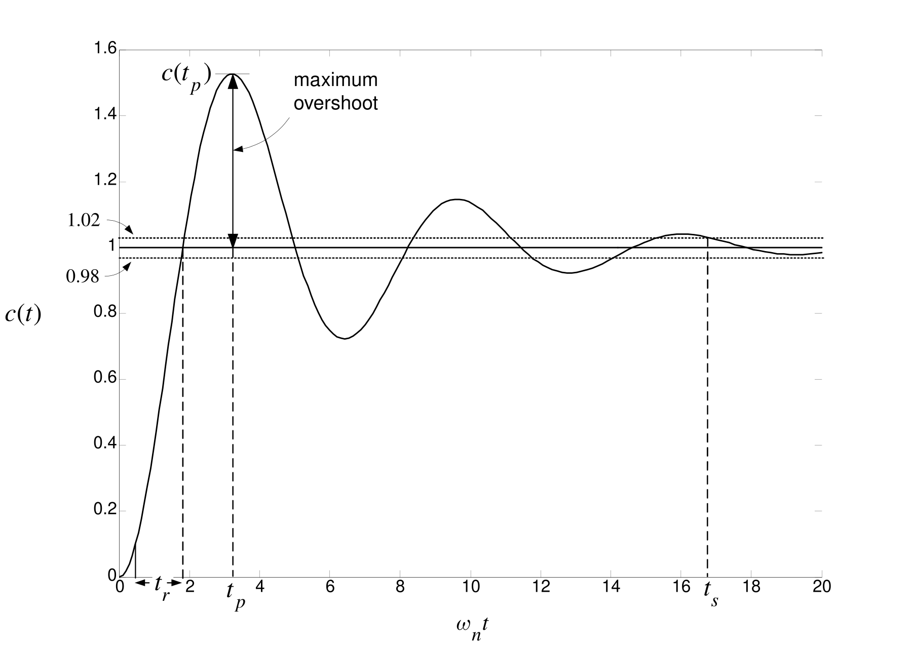

For $0<\zeta<1$ the output response is oscillatory with frequency
$\omega
_{d}=\omega_{n}\sqrt{1-\zeta^{2}}$.

We next compute the peak time $t_{p}$ and the peak value $c(t_{p})$.
:::

---

::: {.compact-slide}

<strong>Peak Time</strong> <em>t</em><em>p</em> <strong>and
Peak Value</strong> <em>c</em>(<em>t</em><em>p</em>)

$$
\begin{aligned}
c(t)  & =R_{0}-R_{0}e^{-\zeta\omega_{n}t}\cos\!\left(  \!\omega_{n}\sqrt{1-\zeta^{2}}t\!\right)  -R_{0}\frac{\zeta}{\sqrt{1-\zeta^{2}}}e^{-\zeta\omega_{n}t}\sin\!\left(  \!\omega_{n}\sqrt{1-\zeta^{2}}t\!\right) \\
& =R_{0}-R_{0}e^{\sigma t}\cos\left(  \omega_{d}t\right)  +R_{0}\frac{\sigma
}{\omega_{d}}e^{\sigma t}\sin\left(  \omega_{d}t\right)  \text{  where
}\sigma=-\zeta\omega_{n}.
\end{aligned}
$$

Differentiate:

$$
\begin{aligned}
\!\!\!\!\!\frac{d}{dt}c(t)\!\!\!\!  & =\!\!\!\!-R_{0}\sigma e^{\sigma t}\cos(\omega_{d}t)+R_{0}\omega_{d}e^{\sigma t}\sin(\omega_{d}t)+R_{0}\frac{\sigma^{2}}{\omega_{d}}e^{\sigma t}\sin(\omega_{d}t)+R_{0}\sigma
e^{\sigma t}\cos(\omega_{d}t)\\
& =R_{0}e^{\sigma t}\!\left(  \frac{\sigma^{2}}{\omega_{d}}+\omega_{d}\right)
\!\sin\left(  \omega_{d}t\right)  .
\end{aligned}
$$

$\dfrac{d}{dt}c(t)=0$ $\Longrightarrow$
$\sin\left(  \omega_{d}t_{p}\right)
=0$ or

$$
t_{p}=\frac{\pi}{\omega_{d}}=\frac{\pi}{\omega_{n}\sqrt{1-\zeta^{2}}}\text{
  }\left(  \Longrightarrow\sigma t_{p}=-\pi\zeta/\sqrt{1-\zeta^{2}}\right)
.
$$

The value of $c(t)$ at $t_{p}$ is

$$
\begin{aligned}
\!\!\!\!\!\!\!\!c(t_{p})=R_{0}-R_{0}e^{\sigma t_{p}}\cos(\omega_{d}t_{p})+R_{0}\frac{\sigma}{\omega_{d}}e^{\sigma t_{p}}\sin(\omega_{d}t_{p})\!\!\!  & =\!\!\!\!\!\!R_{0}-R_{0}e^{\sigma t_{p}}\cos(\pi)\\
\!\!\!\!  & =\!\!\!\!\!\!R_{0}+R_{0}e^{-\pi\zeta/\!\!\!\sqrt{1-\zeta^{2}}}\!.
\end{aligned}
$$
:::

---

::: {.compact-slide .expanded-body-slide}

<strong>Percent Overshoot</strong> <em>M</em><em>p</em>

We just showed

$$
t_{p}=\frac{\pi}{\omega_{d}}=\frac{\pi}{\omega_{n}\sqrt{1-\zeta^{2}}}.
$$

and

$$
\begin{aligned}
c(t_{p})=R_{0}-R_{0}e^{\sigma t_{p}}\cos(\omega_{d}t_{p})+R_{0}\frac{\sigma
}{\omega_{d}}e^{\sigma t_{p}}\sin(\omega_{d}t_{p})  & =R_{0}-R_{0}e^{\sigma
t_{p}}\cos(\pi)\\
& =R_{0}+R_{0}e^{-\pi\zeta/\sqrt{1-\zeta^{2}}}.
\end{aligned}
$$

-   *Fractional Overshoot*
    $M_{p}:$

$$
M_{p}\triangleq\frac{c(t_{p})-c(\infty)}{c(\infty)}=\frac{(R_{0}+R_{0}e^{-\pi\zeta/\sqrt{1-\zeta^{2}}})-R_{0}}{R_{0}}=e^{-\pi\zeta/\sqrt{1-\zeta
    ^{2}}}
$$

-   The *Percent Overshoot* is $100\times M_{p}=100e^{-\pi\zeta
    /\sqrt{1-\zeta^{2}}}.$
:::

---

::: {.compact-slide .expanded-body-slide}

<strong>Identification of Motor Parameters</strong>
$G(s)=\dfrac
{b}{s(s+a)}$

From previous
slide:

$$
M_{p}\triangleq\frac{c(t_{p})-c(\infty)}{c(\infty)}=e^{-\pi\zeta/\sqrt
{1-\zeta^{2}}}
$$

From the step response measure $t_{p}$ and $c(t_{p}).$

Compute $M_{p}\triangleq\dfrac{c(t_{p})-c(\infty)}{c(\infty)}.$

Compute $\zeta$ as follows:

$$
\begin{aligned}
\ln(M_{p})=-\pi\zeta/\sqrt{1-\zeta^{2}}  & \Longrightarrow(1-\zeta^{2})\ln
^{2}(M_{p})=\pi^{2}\zeta^{2}\\
& \Longrightarrow\text{  }\zeta=\sqrt{\frac{\ln^{2}(M_{p})}{\pi^{2}+\ln
^{2}(M_{p})}}.
\end{aligned}
$$

Compute $\omega_{n}$ as follows:

$$
\begin{aligned}
t_{p}  & =\frac{\pi}{\omega_{n}\sqrt{1-\zeta^{2}}}\\
\Longrightarrow\text{  }\omega_{n}  & =\frac{\pi}{t_{p}\sqrt{1-\zeta^{2}}}.
\end{aligned}
$$
:::

---

::: {.compact-slide .expanded-body-slide}

<strong>Identification of Motor Parameters</strong> $G(s)=\dfrac{b}{s(s+a)}$

From previous
slide:

$$
\zeta=\sqrt{\frac{\ln^{2}(M_{p})}{\pi^{2}+\ln^{2}(M_{p})}}\text{  and
 }\omega_{n}=\frac{\pi}{t_{p}\sqrt{1-\zeta^{2}}}
$$

As

$$
C(s)=\frac{Kb}{s^{2}+as+Kb}\frac{R_{0}}{s}=\frac{\omega_{n}^{2}}{s^{2}+2\zeta\omega_{n}s+\omega_{n}^{2}}\frac{R_{0}}{s}
$$

we have

$$
\begin{aligned}
Kb  & =\omega_{n}^{2}\\
& \\
a  & =2\zeta\omega_{n}.
\end{aligned}
$$

Motor Parameters:

$$
\begin{aligned}
b  & =\omega_{n}^{2}/K\\
& \\
a  & =2\zeta\omega_{n}.
\end{aligned}
$$
:::

---

::: {.compact-slide .expanded-body-slide .expanded-figure-slide}

<strong>Settling Time</strong> <em>t</em><em>s</em>

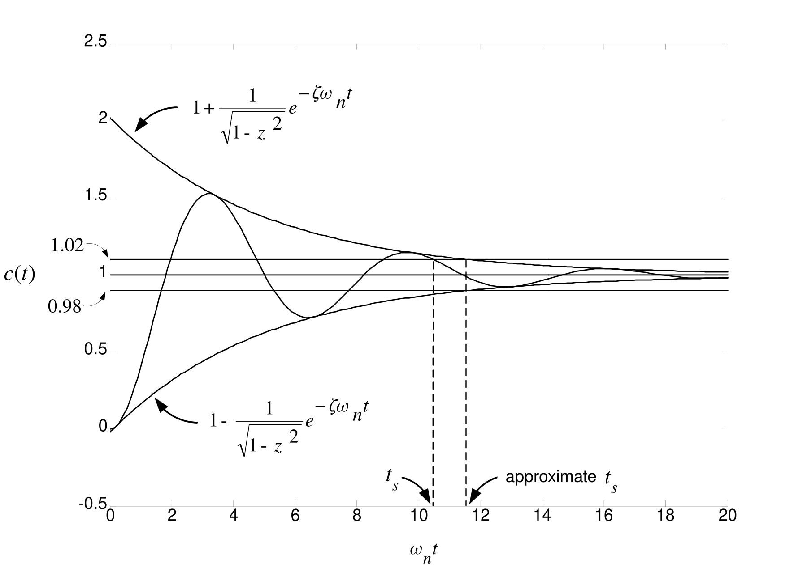

-   $t_{s}$: The first time $c(t)$ stays within $2\%$ of its final
    value.

-   $t_{s}$ approximation: Compute the time the *envelope* of $c(t)$
    intersects $(1\pm0.02)R_{0}$.
:::

---

::: {.compact-slide .expanded-body-slide}

<strong>Settling Time</strong> <em>t</em><em>s</em>

$$
c(t)=R_{0}u_{s}(t)-R_{0}\frac{e^{-\zeta\omega_{n}t}}{\sqrt{1-\zeta^{2}}}\sin\!\left(  \omega_{n}\sqrt{1-\zeta^{2}}t+\phi\right)  u_{s}(t).
$$

The envelope of $c(t)$ is given
by

$$
R_{0}\pm R_{0}\frac{e^{-\zeta\omega_{n}t}}{\sqrt{1-\zeta^{2}}}
$$

An an upper bound $t_{sb}$ on the settling time $t_{s}$ is a solution to

$$
R_{0}+R_{0}\frac{e^{-\zeta\omega_{n}t_{sb}}}{\sqrt{1-\zeta^{2}}}=1.02R_{0}.
$$

Solve for $t_{sb}$ as
follows.

$$
\frac{e^{-\zeta\omega_{n}t_{sb}}}{\sqrt{1-\zeta^{2}}}=0.02\text{   or
 }e^{-\zeta\omega_{n}t_{sb}}=0.02\sqrt{1-\zeta^{2}}\text{   or   }-\zeta\omega_{n}t_{sb}=\ln\!\left(  0.02\sqrt{1-\zeta^{2}}\right)  \!.
$$

Finally

$$
t_{s}\leq t_{sb}=-\frac{\ln\!\left(  0.02\sqrt{1-\zeta^{2}}\right)  }{\zeta\omega_{n}}.
$$
:::

---

::: {.compact-slide .expanded-body-slide}

<strong>Settling Time</strong>

$t_{s}$

From previous
slide:

$$
t_{s}\leq t_{sb}=-\frac{\ln\!\left(  0.02\sqrt{1-\zeta^{2}}\right)  }{\zeta\omega_{n}}.
$$

-   The envelope approach gives an upper bound for the settling time.

-   $t_{sb}$ goes to $+\infty$ as either $\zeta\rightarrow1$ or as
    $\zeta\rightarrow0$.

    $\Longrightarrow$ $t_{sb}$ is *not* a useful approximation for these
    two cases.

-   We want the overshoot to be small which means $\zeta$ is close to
    $1.$

-   Often in textbooks they set $\sqrt{1-\zeta^{2}}\approx1$ (implying
    $\zeta$ small!) to obtain

$$
t_{s}\leq t_{sb}\approx-\frac{\ln(0.02)}{\zeta\omega_{n}}\approx\dfrac
    {4}{\zeta\omega_{n}}.
$$
:::

---

::: {.compact-slide}

<strong>Different Approach to Defining</strong> <em>t</em><em>s</em>

-   Take $\zeta=1$ so there is no overshoot.

-   $C(s)=\dfrac{\omega_{n}^{2}}{s^{2}+2\zeta\omega_{n}s+\omega_{n}^{2}}\dfrac{R_{0}}{s}=\dfrac{\omega_{n}^{2}}{(s+\omega_{n})^{2}}\dfrac{R_{0}}{s}=\dfrac{1}{s}R_{0}-\dfrac{R_{0}}{s+\omega_{n}}-\omega_{n}\dfrac{R_{0}}{\left(  s+\omega_{n}\right)  ^{2}}.$

-   $c(t)=R_{0}-R_{0}(e^{-t\omega_{n}}+t\omega_{n}e^{-t\omega_{n}}).$

-   At
    $t=\left.  \dfrac{4}{\zeta\omega_{n}}\right\vert _{\zeta=1}=\dfrac
    {4}{\omega_{n}}$:

$$
e^{-t_{s}\omega_{n}}+t_{s}\omega_{n}e^{-t_{s}\omega_{n}}=e^{-4}+4e^{-4}=5e^{-4}=0.092\approx0.1
$$

-   $c(t)$ is within $10\%$ of the final value $R_{0}$ (rather than
    $2\%$).

-   Define $t_{s}\triangleq\dfrac{4}{\zeta\omega_{n}}$ even if $\zeta$
    is *not* 1.

-   Define the *time constant* of the complex-conjugate pair of
    closed-loop poles by

$$
\left\vert \dfrac{1}{\sigma}\right\vert =\left\vert \dfrac{1}{-\zeta\omega
    _{n}}\right\vert =\dfrac{1}{\zeta\omega_{n}}.
$$

-   $t_{s}$ is defined to be four time constants long.

-   The further in the LHP the CLPs are located, the faster the
    transients die out and thus the faster the system reaches its final
    value.
:::

---

::: {.compact-slide .expanded-body-slide .expanded-figure-slide}

<strong>Rise Time</strong>

$t_{r}$

$t_{r}$ is the amount of time for $c(t)$ to go from $0.1R_{0}$ to the
*first* time it reaches $R_{0}$.

Note: For $\zeta<0.5,$ $c(t)=0.1R_{0}$ at $\omega_{n}t\approx0.2$ and
$c(t)=R_{0}$ at $\omega_{n}t\approx2.$
:::

---

::: {.compact-slide .expanded-short-slide}

<strong>Rise Time</strong>

$t_{r}$

Typical textbook approximation: For $\zeta<0.5$

$$
\begin{aligned}
c(t_{1})  & =0.1R_{0}\text{  at  }\omega_{n}t_{1}\approx0.2\\
& \\
c(t_{2})  & =R_{0} \text{ at  }\omega_{n}t_{2}\approx2.
\end{aligned}
$$

Then

$$
t_{r}=t_{2}-t_{1}\approx\frac{2-0.2}{\omega_{n}}=\frac{1.8}{\omega_{n}}.
$$

-   Not very useful as we want $\zeta$ to be close to 1 to have small
    overshoot!
:::

---

::: {.compact-slide .expanded-body-slide}

<strong>Summary of</strong>

$M_{p},t_{p},t_{s}$

Second-order system with a step
input:

$$
C(s)=\dfrac{\omega_{n}^{2}}{s^{2}+2\zeta\omega_{n}s+\omega_{n}^{2}}\dfrac{R_{0}}{s}.
$$

Then

$$
\begin{aligned}
M_{p}  & \triangleq\frac{c(t_{p})-c(\infty)}{c(\infty)}=e^{-\pi\zeta
/\sqrt{1-\zeta^{2}}}\text{  with  }t_{p}=\frac{\pi}{\omega_{n}\sqrt
{1-\zeta^{2}}}\\
& \\
t_{s}  & =\frac{4}{\zeta\omega_{n}},\dfrac{5}{\zeta\omega_{n}},\dfrac{6}{\zeta\omega_{n}}\text{  for }10\%,4\%,2\%\text{ of the final value and
}\zeta\text{ close to 1.}\\
& \\
t_{r}  & =\frac{1.8}{\omega_{n}}\text{  for  }\zeta<0.5.
\end{aligned}
$$

-   In general, we are concerned about overshoot, settling time, and
    rise time.

-   However, these expressions are only valid for 2$^{nd}$-order systems
    with no zeros.
:::

---

::: {.compact-slide .expanded-body-slide}

<strong>Choosing the Gain</strong> <em>K</em> <strong>of a Proportional
Controller</strong>

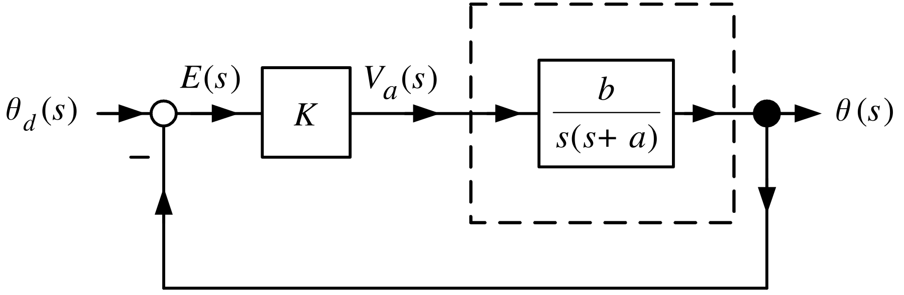

$$
\frac{\theta(s)}{\theta_{d}(s)}=\frac{K\dfrac{b}{s(s+a)}}{1+K\dfrac{b}{s(s+a)}}=\frac{Kb}{s^{2}+as+Kb}.
$$

Let $b=1,$ $a=4$, and $\theta_{d}(s)=\dfrac{\theta_{0}}{s}$ so

$$
\theta(s)=\frac{K}{s^{2}+4s+K}\frac{\theta_{0}}{s}.
$$

For $K>0$ the
quadratic formula shows the roots of $s^{2}+4s+K$ are in the open LHP.

Thus $s\theta(s)=\dfrac{K}{s^{2}+4s+K}\theta_{0}$ is stable.

By the FVT

$$
\theta(\infty)=\lim_{t\rightarrow\infty}\theta(t)=\lim_{s\rightarrow0}s\theta(s)=\theta_{0}.
$$
:::

---

::: {.compact-slide .expanded-body-slide}

<strong>Choosing the Gain</strong> <em>K</em> <strong>of a Proportional
Controller</strong>

The behavior of the $\theta(t)$ as it goes to $\theta_{0}$ is determined
by the location of the CLPs.

Need to find the pole locations as $K$ is varied from $0$ to $\infty$.

Solving $s^{2}+4s+K=0$ gives

$$
s=\frac{-4\pm\sqrt{16-4K}}{2}=-2\pm\sqrt{4-K}.
$$

The closed-loop poles are

$$
p_{i}=\left\{
\begin{array}
[c]{cl}-2\pm\sqrt{4-K}, & 0\leq K\leq4\\
-2\pm j\sqrt{K-4}, & 4<K.
\end{array}
\right.
$$

$$
\begin{array}{c|l}
\hline
K & \text{Closed-Loop Poles}\\\hline
0 & s=0,-4\\\hline
2 & s=-2\pm\sqrt{2}=-3.414,-0.596\\\hline
4 & s=-2,-2\\\hline
8 & s=-2\pm2j\\\hline
13 & s=-2\pm3j\\\hline
\end{array}
$$
:::

---

::: {.compact-slide .expanded-body-slide .expanded-figure-slide .boundary-safe-slide}

<strong>Choosing the Gain</strong> <em>K</em> <strong>of a Proportional
Controller</strong>

$$
\begin{array}{c|l}
\hline
K & \text{Closed-Loop Poles}\\\hline
0 & s=0,-4\\\hline
2 & s=-2\pm\sqrt{2}=-3.414,-0.596\\\hline
4 & s=-2,-2\\\hline
8 & s=-2\pm2j\\\hline
13 & s=-2\pm3j\\\hline
\end{array}
$$

**Root Locus:** Sketch of the closed-loop poles as $K$ varies.

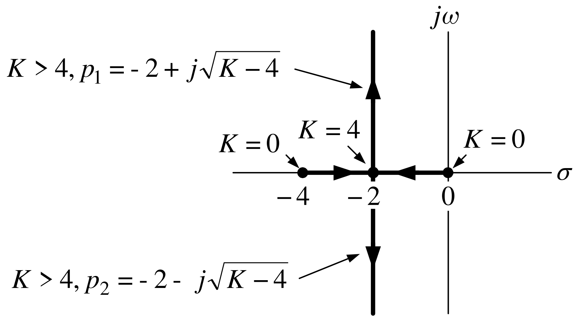

-   Both poles are in the open left half-plane for $K>0.$

-   For $K>4$, complex conjugate closed-loop poles result in an
    oscillatory response.

-   Want poles as far in the LHP as possible so take $K\geq4$.

-   Don't take $K$ too large as this would command a large voltage to
    the amplifier.
:::

---

::: {.compact-slide .expanded-body-slide}

Root Locus Computation

::: example
`% RootLocus_G(s) = K*b/(s2+a*s)`

`% G_cl(s) = KG(s)/(1 + KG(s)) = Kb/(s2 + as + Kb)`

`close all; clear; clc`

`% `

`a = 4;b = 1;`

`% Open loop transfer function G(s) = b/(s*(s+a)) = b/(s2+a*s)`

`den = [1 a 0]; num = [b]; tf_openloop = tf(num,den);`

`% `

`% Plot the CLPs for K going from 0 to 100 in steps of 1. `

`K = [0:1:100]; rlocus(tf_openloop,K)`

`% `

`% Make the linewidth thicker, the marker size and font size bigger.`

`h = findobj(gca, ’Type’, ’line’);`

`set(h, ’LineWidth’, 4); set(h, ’MarkerSize’, 15); set(gca,’FontSize’,20)`

`%`

`% Set range of x-axis [-5,0] and y-axis [-10,10]`

`v = [-5 0 -10 10]; axis(v);`

`% `

`title(’G(s)= b/(s2+as)’,’FontSize’,20)`

`xlabel(’Re(s)’,’FontSize’,20); ylabel (’Im(s)’,’FontSize’,20)`

`% `

`K = 6.25; p = rlocus(num,den,K) % Gives the CLP for this value of K`
:::
:::

---

::: {.compact-slide .expanded-body-slide}

<strong>Choosing the Gain</strong> <em>K</em> <strong>of a Proportional
Controller</strong>

Choose $K$ so the damping ratio $\zeta$ is $0.8$.

$$
\theta(s)=\frac{K}{s^{2}+4s+K}\frac{\theta_{0}}{s}=\frac{\omega_{n}^{2}}{s^{2}+2\zeta\omega_{n}s+\omega_{n}^{2}}\frac{\theta_{0}}{s}
$$

Equate coefficients:

$$
\begin{aligned}
s^{2}+4s+K  & =s^{2}+2\zeta\omega_{n}s+\omega_{n}^{2}\\
\Longrightarrow4  & =2\zeta\omega_{n},\text{  }K=\omega_{n}^{2}\\
\Longrightarrow K  & =\left.  \left(  \frac{4}{2\zeta}\right)  ^{2}\right\vert
_{\zeta=0.8}=6.25.
\end{aligned}
$$

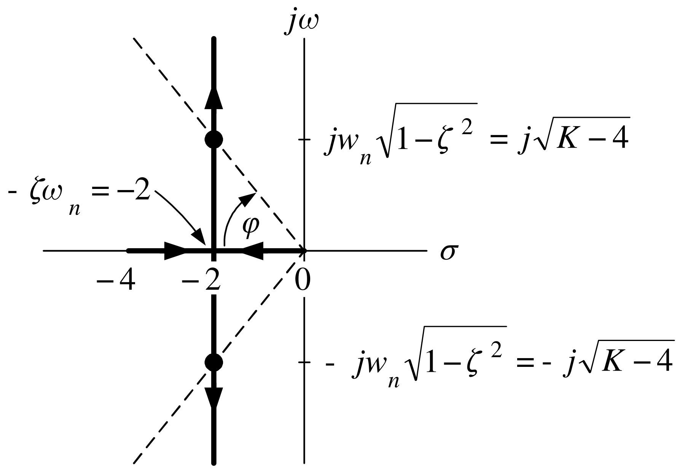

:::

---

::: {.compact-slide .expanded-body-slide}

<strong>Choosing the Gain</strong> <em>K</em> <strong>of a Proportional
Controller - Geometric View</strong>

$$
\begin{aligned}
s^{2}+4s+K  & =s^{2}+2\zeta\omega_{n}s+\omega_{n}^{2}\\
\Longrightarrow s  & =-2\pm j\sqrt{K-4}\\
& =-\zeta\omega_{n}\pm j\omega_{n}\sqrt{1-\zeta^{2}}
\end{aligned}
$$

$$
\begin{aligned}
\tan(\phi)  & =\dfrac{\omega_{n}\sqrt{1-\zeta^{2}}}{\zeta\omega_{n}}=\dfrac{\sqrt{K-4}}{2}\\
\Longrightarrow K  & =4\dfrac{1-\zeta^{2}}{\zeta^{2}}+4=\dfrac{4}{\zeta^{2}}=\dfrac{4}{0.64}=6.25.
\end{aligned}
$$
:::

---

::: {.compact-slide .multi-figure-slide}

Second-Order Systems with Zeros
<strong>Example</strong> <em>Speed Control of a DC Motor</em>

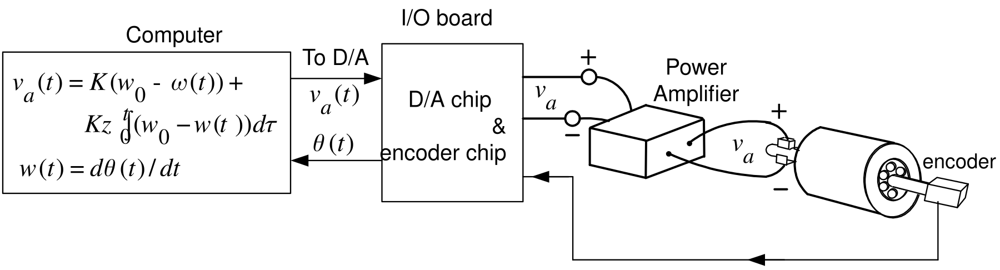

-   $\omega(t)$ is found by numerically differentiating the measured
    $\theta(t).$

-   The controller is
    $v_{a}(t)=K(\omega_{0}-\omega(t))+Kz\int_{0}^{t}(\omega_{0}-\omega(\tau))d\tau$.

-   $\omega_{0}$ is the desired speed.

-   $E(s)=\dfrac{\omega_{0}}{s}-\omega(s)$ and $V_{a}(s)=KE(s)+Kz\dfrac
    {1}{s}E(s)=K\dfrac{s+z}{s}E(s).$
    
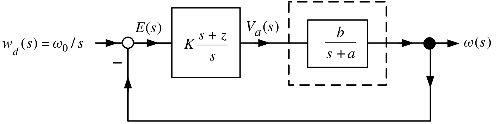

-   This is a *proportional plus integral (PI) controller*.
:::

---

::: {.compact-slide .expanded-body-slide}

<strong>Example</strong> <em>Speed Control of a DC Motor</em>
<strong>(continued)</strong>

$$
\!\!\!\!\!\omega(s)=\frac{\dfrac{K(s+z)}{s}\dfrac{b}{s+a}}{1+\dfrac{K(s+z)}{s}\dfrac{b}{s+a}}\frac{\omega_{0}}{s}=\frac{Kb(s+z)}{s^{2}+as+Kb(s+z)}\frac{\omega_{0}}{s}=\underset{\text{closed-loop transfer function}}{\underbrace{\frac{Kb(s+z)}{s^{2}+(a+Kb)s+Kbz}}}\text{ }\underset{\text{input}}{\underbrace{\frac{\omega_{0}}{s}}}.
$$

-   Recall for the DC motor that $a>0,b>0.$

-   With $K>0,z>0$ the roots of $s^{2}+(a+Kb)s+Kbz=0$ are in the open
    LHP.

-   Thus $s\omega(s)=\dfrac{Kb(s+z)}{s^{2}+(a+Kb)s+Kbz}\omega_{0}$ is
    stable.

-   By the
    FVT

$$
\omega(\infty)=\lim_{s\rightarrow0}s\omega(s)=\omega_{0}.
$$
:::

---

::: {.compact-slide .expanded-body-slide .boundary-safe-slide}

<strong>Digression</strong> <em>Proportional Speed Control of a DC
Motor</em>

Control speed with a simple gain $K.$

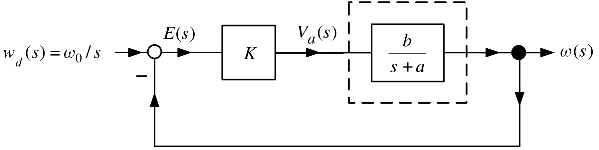

$$
\omega(s)=\frac{K\dfrac{b}{s+a}}{1+K\dfrac{b}{s+a}}\frac{\omega_{0}}{s}=\frac{Kb}{s+a+Kb}\frac{\omega_{0}}{s}.
$$

-   Recall for the DC motor that $a>0,b>0.$

-   With $K>0,$ the roots of $s+a+Kb=0$ are in the open LHP.

-   Thus $s\omega(s)=\dfrac{Kb}{s+a+Kb}\omega_{0}$ is stable.

-   By the
    FVT

$$
\omega(\infty)=\lim_{s\rightarrow0}s\omega(s)=\frac{Kb}{a+Kb}\omega_{0}\neq\omega_{0}.
$$

-   If $K$ is large then $\omega(\infty)\approx\omega_{0}.$

**End of Digression**
:::

---

::: {.compact-slide .expanded-body-slide .boundary-safe-slide}

<strong>Second-Order Systems with Zeros</strong>

$$
\omega(s)=\frac{\dfrac{K(s+z)}{s}\dfrac{b}{s+a}}{1+\dfrac{K(s+z)}{s}\dfrac
{b}{s+a}}\frac{\omega_{0}}{s}=\frac{Kb(s+z)}{s^{2}+(a+Kb)s+Kbz}\frac
{\omega_{0}}{s}.
$$

-   Let $C(s)\triangleq\omega(s)$ and set
    $\omega_{n}^{2}\triangleq Kbz,$ $2\zeta\omega_{n}\triangleq a+Kb,$
    $\alpha\triangleq\dfrac{z}{\zeta
    \omega_{n}}.$

-   $Kb=\dfrac{\omega_{n}^{2}}{z}=\dfrac{\omega_{n}}{\alpha\zeta}.$

-   Write

$$
C(s)=\underset{\text{closed-loop transfer function}}{\underbrace{\frac
    {\omega_{n}}{\alpha\zeta}\frac{s+\alpha\zeta\omega_{n}}{s^{2}+2\zeta\omega
    _{n}s+\omega_{n}^{2}}}}\frac{\omega_{0}}{s}.
$$

-   What is the effect of the zero at $s=-z=-\alpha\zeta\omega_{n}$ on
    the transient response?
:::

---

::: {.compact-slide .expanded-body-slide}

<strong>Second-Order Systems with Zeros</strong>

Pole-Zero plot for $0<\zeta<1.$ As the zero is in the LHP, it is a
*minimum phase* zero.

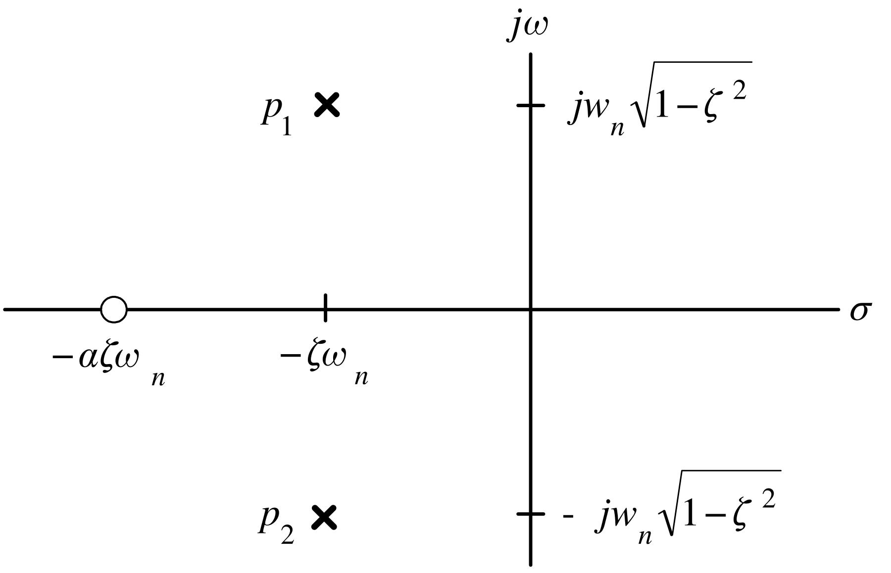
 With
$\omega_{d}(s)=\dfrac{1}{s}$:

$$
\begin{aligned}
C(s)=\frac{\omega_{n}}{\alpha\zeta}\frac{s+\alpha\zeta\omega_{n}}{s^{2}+2\zeta\omega_{n}s+\omega_{n}^{2}}\frac{1}{s}  & =\underset{C_{1}(s)}{\underbrace{\frac{\omega_{n}^{2}}{s^{2}+2\zeta\omega_{n}s+\omega_{n}^{2}}\frac{1}{s}}}+\frac{1}{\alpha\zeta\omega_{n}}\underset{sC_{1}(s)}{\underbrace{s\frac{\omega_{n}^{2}}{s^{2}+2\zeta\omega_{n}s+\omega_{n}^{2}}\frac{1}{s}}}\\
& \rightarrow\frac{\omega_{n}^{2}}{s^{2}+2\zeta\omega_{n}s+\omega_{n}^{2}}\frac{1}{s}\text{  as  }\alpha\rightarrow\infty.
\end{aligned}
$$

-   As $\alpha\rightarrow\infty,$ $C(s)$ reduces to $C_{1}(s)$ which is
    a second-order system *without* a zero.
:::

---

::: {.compact-slide .expanded-body-slide .expanded-figure-slide}

<strong>Second-Order Systems with Zeros</strong>

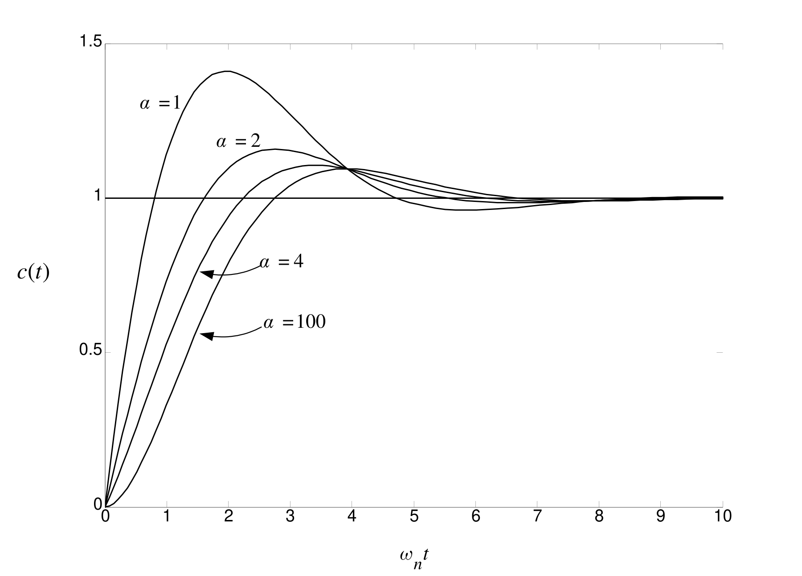

$$
c(t)=\mathcal{L}^{-1}\{C(s)\}=\mathcal{L}^{-1}\!\left\{  \frac{\omega_{n}}{\alpha\zeta}\frac{s+\alpha\zeta\omega_{n}}{s^{2}+2\zeta\omega_{n}s+\omega_{n}^{2}}\frac{1}{s}\right\}
$$

-   For $\alpha>>1$ $C(s)$ is essentially a second-order system
    *without* a zero.

-   Much more overshoot compared to a $2^{nd}$ order system *without* a
    zero.
:::

---

::: {.compact-slide .expanded-body-slide .expanded-figure-slide}

<strong>Second-Order Systems with Zeros</strong>

$$
\begin{aligned}
C(s)  & =\frac{\omega_{n}^{2}}{s^{2}+2\zeta\omega_{n}s+\omega_{n}^{2}}\frac
{1}{s}+\frac{1}{\alpha\zeta\omega_{n}}s\frac{\omega_{n}^{2}}{s^{2}+2\zeta\omega_{n}s+\omega_{n}^{2}}\frac{1}{s}=C_{1}(s)+\frac{1}{\alpha
\zeta\omega_{n}}sC_{1}(s).\\
c(t)  & =c_{1}(t)+\frac{1}{\alpha\zeta\omega_{n}}\frac{dc_{1}(t)}{dt}.
\end{aligned}
$$

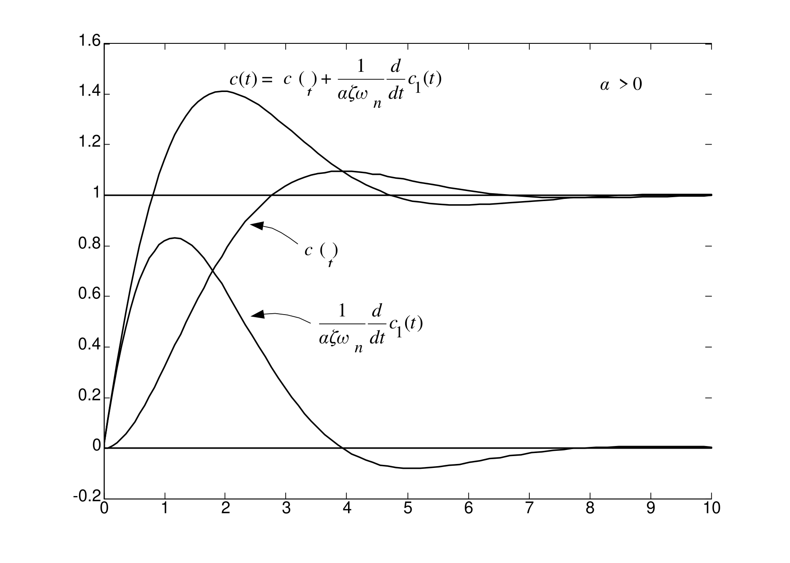

:::

---

::: {.compact-slide .expanded-body-slide .expanded-figure-slide}

<strong>Second-Order Systems with Zeros</strong> <em>Right Half-Plane
Zero</em>

-   Suppose $\alpha<0$ so the zero $-\alpha\zeta\omega_{n}$ is in the
    open RHP.

-   This is called a *non minimum phase* zero.

-   Pole-Zero plot for $0<\zeta<1.$
    
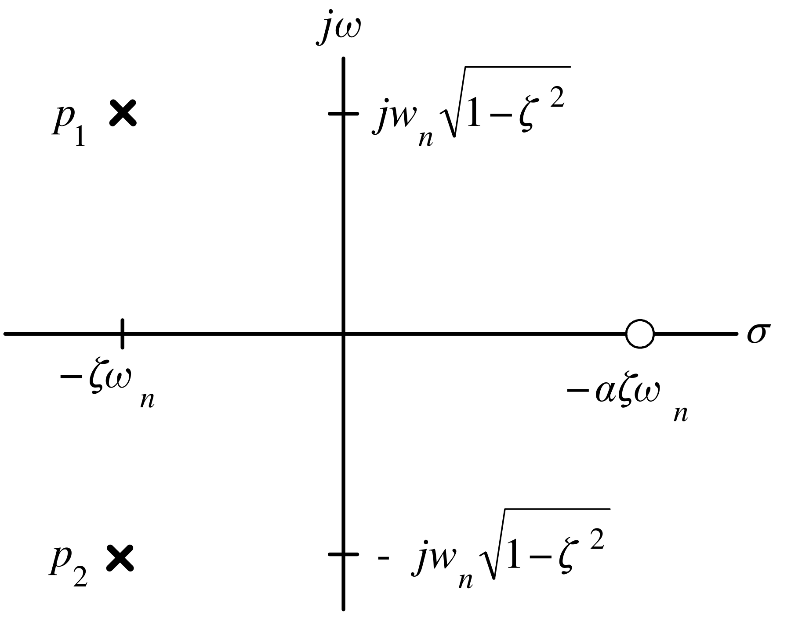

-   This system is still stable as the poles are in the open LHP so
    $c(t)\rightarrow1$ as $t\rightarrow\infty$.

$$
\begin{aligned}
    C(s)\!\!  & =\!\!\frac{\omega_{n}^{2}}{s^{2}+2\zeta\omega_{n}s+\omega_{n}^{2}}\frac{1}{s}+\frac{1}{\alpha\zeta\omega_{n}}s\frac{\omega_{n}^{2}}{s^{2}+2\zeta\omega_{n}s+\omega_{n}^{2}}\frac{1}{s}=C_{1}(s)+\frac{1}{\alpha\zeta\omega_{n}}sC_{1}(s).\\
    c(t)\!\!  & =\!\!c_{1}(t)+\underset{<0}{\underbrace{\frac{1}{\alpha\zeta
    \omega_{n}}}}\frac{dc_{1}(t)}{dt}.
    \end{aligned}
$$
:::

---

::: {.compact-slide .expanded-body-slide .expanded-figure-slide}

<strong>Second-Order Systems with Zeros</strong> <em>Right Half-Plane
Zero</em>

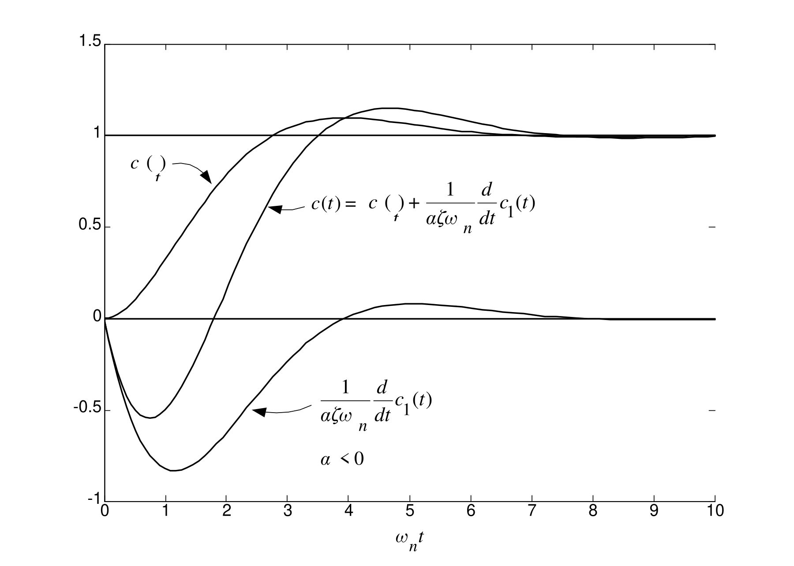

-   $c(t)$ goes negative before coming back positive - called
    *undershoot*.
:::

---

::: {.compact-slide .expanded-body-slide}

<strong>Third-Order Systems</strong>

With $0<\zeta<1$ and $\alpha>0$ let

$$
G(s)=\frac{\alpha\zeta\omega_{n}}{s+\alpha\zeta\omega_{n}}\frac{\omega_{n}^{2}}{s^{2}+2\zeta\omega_{n}s+\omega_{n}^{2}}.
$$

The poles are

$$
\begin{aligned}
p_{1}  & =-\zeta\omega_{n}+j\omega_{n}\sqrt{1-\zeta^{2}}\\
p_{2}  & =-\zeta\omega_{n}-j\omega_{n}\sqrt{1-\zeta^{2}}\\
p_{3}  & =-\alpha\zeta\omega_{n}.
\end{aligned}
$$

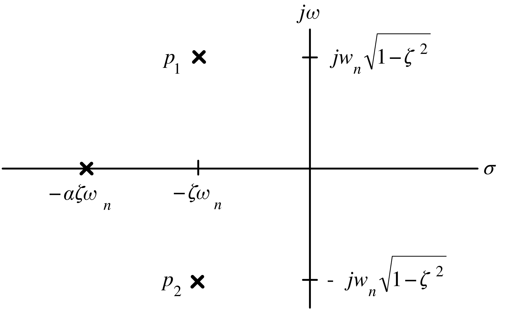

:::

---

::: {.compact-slide .expanded-body-slide .expanded-figure-slide}

<strong>Third-Order Systems</strong> <em>Unit Step Response</em>

-   $C(s)=G(s)\dfrac{1}{s}=\dfrac{\alpha\zeta\omega_{n}}{s+\alpha\zeta
    \omega_{n}}\dfrac{\omega_{n}^{2}}{s^{2}+2\zeta\omega_{n}s+\omega_{n}^{2}}\dfrac{1}{s}.$

-   $\zeta>0,\omega_{n}>0,\alpha>0$ so
    $sC(s)=\dfrac{\alpha\zeta\omega_{n}}{s+\alpha\zeta\omega_{n}}\dfrac{\omega_{n}^{2}}{s^{2}+2\zeta\omega
    _{n}s+\omega_{n}^{2}}$ is stable.

-   By the FVT
    $c(\infty)=\lim_{t\rightarrow\infty}c(t)=\lim_{s\rightarrow
    0}sC(s)=1.$ 
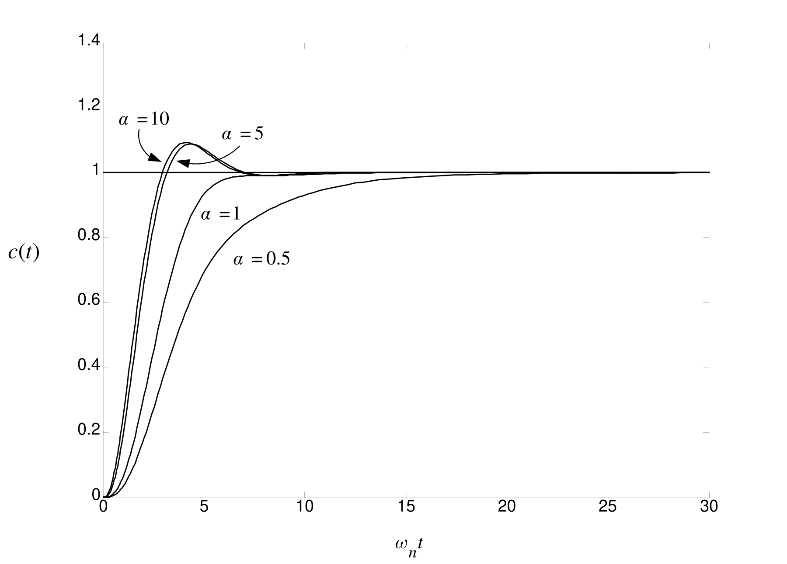

:::

---

::: {.compact-slide .expanded-body-slide .expanded-figure-slide}

<strong>Third-Order Systems</strong> <em>Unit Step Response</em>

$$
C(s)=\frac{\alpha\zeta\omega_{n}}{s+\alpha\zeta\omega_{n}}\frac{\omega_{n}^{2}}{s^{2}+2\zeta\omega_{n}s+\omega_{n}^{2}}\frac{1}{s}=\frac{1}{s/\alpha\zeta\omega_{n}+1}\frac{\omega_{n}^{2}}{s^{2}+2\zeta\omega
_{n}s+\omega_{n}^{2}}\frac{1}{s}
$$

-   As $\alpha\rightarrow\infty,$ $C(s)$ reduces to a $2^{nd}$ order
    system without a zero.

-   As $\alpha$ decreases, the pole at $-\alpha\zeta\omega_{n}$ moves
    closer to the $j\omega$ axis.

    $\Longrightarrow$ The response is more sluggish as the transient
    dies out slower.
    

:::