::: {.contents-slide}
# Contents

- Servomechanism Modeling

- DC Servo Tracking and Disturbance Rejection

- PI and PID Control

- Tracking Theory and the Internal Model Principle

- Aircraft Pitch Control Design
:::

---

::: {.compact-slide .dense-slide .multi-figure-slide}

Servomechanism

*Servomechanisms* are used for positioning applications (robot arms, machine tools, etc.).

::: center

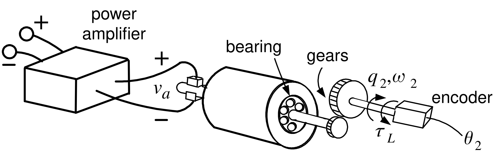

:::

Schematic diagram for a servomechanism.

::: center

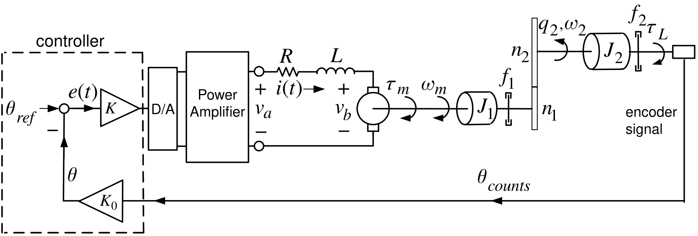

:::

-   Choose the amplifier gain so the $\theta(t)\rightarrow\theta_{ref}.$

-   Equivalently, we want the error $e(t)=\theta_{ref}-\theta\rightarrow0.$
:::

---

::: {.compact-slide .dense-slide}

Modeling a Servomechanism

::: center

:::

$K_{T}$ is the motor torque constant ($\tau_{m}=K_{T}i$).

$K_{b}=K_{T}$ is the back-emf constant ($v_{b}=K_{b}\omega_{m}$).

$K$ is the amplifier gain.

$K_{0}$ is the conversion factor from encoder counts to radians

$J_{1}$ is the moment of inertia of the motor shaft.

$J_{2}$ is the moment of inertia of the output shaft.

$f_{1}$ is the viscous-friction coefficient of the motor shaft.

$f_{2}$ is the viscous-friction coefficient of the output shaft.

$n_{1}$ is the number of gear teeth on the motor shaft.

$n_{2}$ is the number of gear teeth on output shaft.

$n=n_{2}/n_{1}$ is the gear ratio.

$J=J_{1}+n^{2}J_{2}$ is total inertia reflected to motor shaft.

$f=f_{1}+n^{2}f_{2}$ is the total viscous friction coefficient reflected to the motor shaft.
:::

---

::: {.compact-slide}

Modeling a Servomechanism

::: center

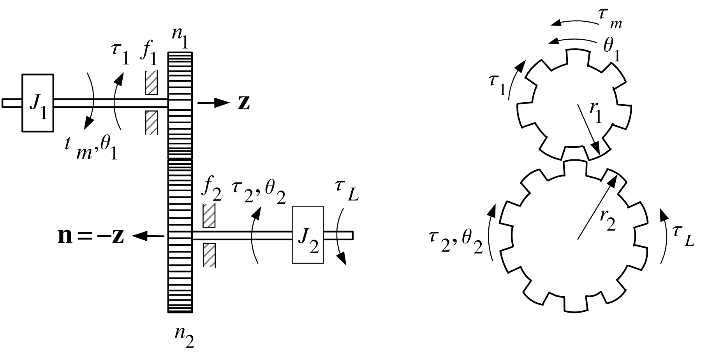

:::

$$
\begin{aligned}
\tau_{m}-\tau_{1}-f_{1}\omega_{1}  &  =J_{1}\frac{d\omega_{1}}{dt}\\
\tau_{2}-\tau_{L}-f_{2}\omega_{2}  &  =J_{2}\frac{d\omega_{2}}{dt}
\end{aligned}
$$

with 

$$
\begin{aligned}
\dfrac{\tau_{2}}{\tau_{1}}  &  =\dfrac{r_{2}}{r_{1}}=\dfrac{n_{2}}{n_{1}}\\
\text{ \ }r_{1}\theta_{1}  &  =r_{2}\theta_{2}\text{ }\Longrightarrow\text{
}r_{1}\omega_{1}=r_{2}\omega_{2}\\
\omega_{m}  &  =\omega_{1}=\frac{n_{2}}{n_{1}}\omega_{2}.
\end{aligned}
$$
:::

---

::: {.compact-slide .expanded-body-slide}

Modeling a Servomechanism

Using $\tau_{1}=\dfrac{n_{1}}{n_{2}}\tau_{2}$  and $\ \tau_{2}-\tau_{L}
-f_{2}\omega_{2}=J_{2}\dfrac{d\omega_{2}}{dt}$:

$$
\begin{aligned}
\tau_{1}=\frac{n_{1}}{n_{2}}\tau_{2}=\frac{n_{1}}{n_{2}}\left(  \tau_{L}
+f_{2}\omega_{2}+J_{2}\frac{d\omega_{2}}{dt}\right)   &  =\frac{n_{1}}{n_{2}
}\!\left(  \tau_{L}+f_{2}\left(  \frac{n_{1}}{n_{2}}\omega_{1}\right)
+J_{2}\frac{d\left(  \dfrac{n_{1}}{n_{2}}\omega_{1}\right)  }{dt}\right) \\
&  =\frac{n_{1}}{n_{2}}\tau_{L}+\left(  \frac{n_{1}}{n_{2}}\right)
^{\!2}\!\!f_{2}\omega_{1}+\left(  \frac{n_{1}}{n_{2}}\right)  ^{\!2}
\!\!J_{2}\frac{d\omega_{1}}{dt}.
\end{aligned}
$$

Using $\tau_{m}-\tau_{1}-f_{1}\omega_{1}=J_{1}\dfrac{d\omega_{1}}{dt}$: 

$$
\tau_{m}=\underset{J}{\underbrace{\left(  \left(  \frac{n_{1}}{n_{2}}\right)
^{\!2}\!\!J_{2}+J_{1}\right)  }}\frac{d\omega_{1}}{dt}
+\underset{f}{\underbrace{\left(  \left(  \frac{n_{1}}{n_{2}}\right)
^{\!2}\!\!f_{2}+f_{1}\right)  }}\omega_{1}+\frac{n_{1}}{n_{2}}\tau_{L}.
$$

With $\omega_{m}=\omega_{1}$: 

$$
\tau_{m}=J\frac{d\omega_{m}}{dt}+f\omega_{m}+\frac{n_{1}}{n_{2}}\tau_{L}.
$$
:::

---

::: {.compact-slide .expanded-body-slide}

Modeling a Servomechanism

$$
\begin{aligned}
L\frac{di(t)}{dt}  &  =-Ri(t)-K_{b}\omega_{m}(t)+v_{a}(t)\\
J\frac{d\omega_{m}(t)}{dt}  &  =\underset{\tau_{m}}{\underbrace{K_{T}i(t)}
}-f\omega_{m}(t)-\frac{n_{1}}{n_{2}}\tau_{L}(t)\\
\frac{d\theta_{m}(t)}{dt}  &  =\omega_{m}(t)\\
\theta(t)  &  \triangleq\theta_{2}(t)=\frac{n_{1}}{n_{2}}\theta_{m}(t)\\
v_{a}(t)  &  =K\!\left(  \theta_{ref}(t)-\theta(t)\right)  .
\end{aligned}
$$

Let $r\triangleq\theta_{ref},c\triangleq\theta$ and compute Laplace Transforms: 

$$
\begin{aligned}
(sL+R)I(s)  &  =V_{a}(s)-K_{b}\omega_{m}(s)\\
(Js+f)\omega_{m}(s)  &  =K_{T}I(s)-\frac{n_{1}}{n_{2}}\tau_{L}(s)\\
s\theta_{m}(s)  &  =\omega_{m}(s)\\
C(s)  &  \triangleq\theta_{2}(s)=\frac{n_{1}}{n_{2}}\theta_{m}(s)\\
V_{a}(s)  &  =K\!\left(  R(s)-C(s)\right)  .
\end{aligned}
$$
:::

---

::: {.compact-slide .dense-slide .multi-figure-slide}

Modeling a Servomechanism

$$
\begin{aligned}
(sL+R)I(s)  &  =V_{a}(s)-K_{b}\omega_{m}(s)\\
(Js+f)\omega_{m}(s)  &  =K_{T}I(s)-\frac{n_{1}}{n_{2}}\tau_{L}(s)\\
s\theta_{m}(s)  &  =\omega_{m}(s)\\
C(s)  &  \triangleq\theta_{2}(s)=\frac{n_{1}}{n_{2}}\theta_{m}(s)\\
V_{a}(s)  &  =K\!\left(  R(s)-C(s)\right)  .
\end{aligned}
$$

::: center

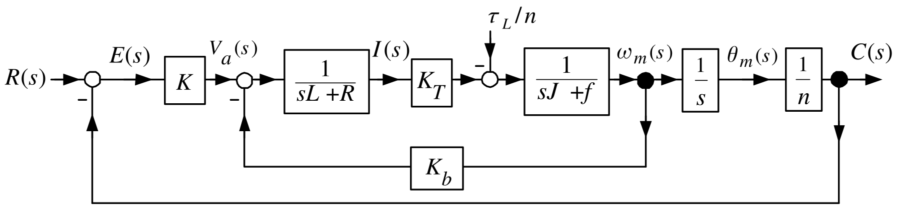

:::

::: center

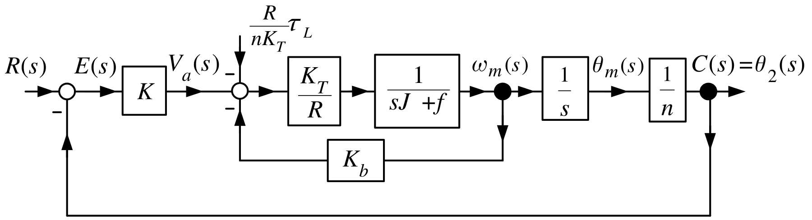

:::
:::

---

::: {.compact-slide .dense-slide .boundary-safe-slide .multi-figure-slide .dense-multi-slide}

Modeling a Servomechanism

::: center

:::

Set $\frac{\tfrac{K_{T}/R}{sJ+f}}{1+K_{b}\tfrac{K_{T}/R}{sJ+f}}=\dfrac
{b^{\prime}}{s+a}$ where  $b^{\prime}\triangleq\dfrac{K_{T}}{RJ},$  $a\triangleq\dfrac{Rf+K_{b}K_{T}}{RJ}.$

::: center

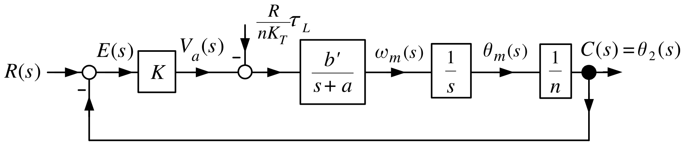

:::

Set $b\triangleq b^{\prime}/n,$  $K_{L}\triangleq R/(nK_{T}).$

::: center

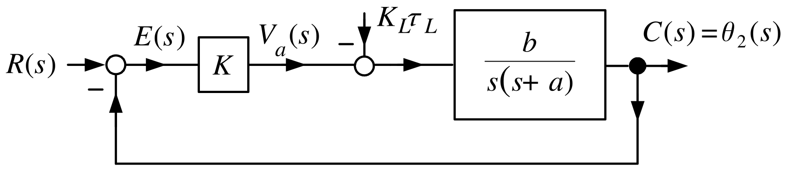

:::
:::

---

::: {.compact-slide .dense-slide .boundary-safe-slide .multi-figure-slide}

Modeling a Servomechanism

The amplifier, motor, gears, and load torque are modeled by a simple block diagram.

::: center

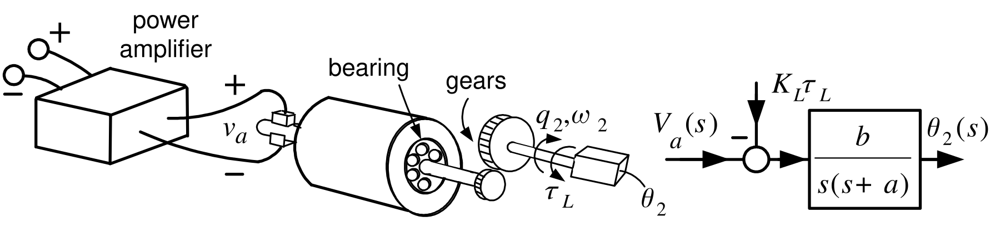

:::

Block diagram for the proportional controlled servomechanism.

::: center

:::

-   $K_{L}=\dfrac{R}{nK_{T}}$ has the units $\frac{\text{Ohms}
    }{\text{Nm/Amp}}=\frac{\text{Ohms-Amp}}{\text{Nm}}=\frac{\text{Volts}
    }{\text{Nm}}$

-   $K_{L}\tau_{L}$ has the units of Volts.

-   A voltage $-K_{L}\tau_{L}$ applied to the motor has same effect on $c(t)$ as $\tau_{L}$.
:::

---

::: {.compact-slide .dense-slide .boundary-safe-slide .multi-figure-slide .dense-multi-slide}

Standard Block Diagram Form

::: center

:::

Let $G_{m}(s)=\dfrac{b}{s\left(  s+a\right)  },$  $D(s)=K_{L}\tau_{L}(s)$:

::: center

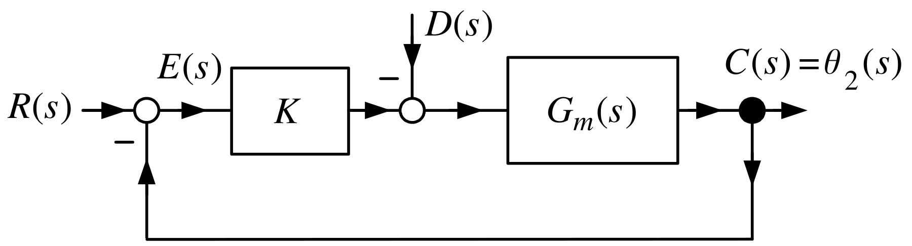

:::

Standard Block Diagram: Replace $K$ by $G_{c}(s)=b_{c}(s)/a_{c}(s).$

::: center

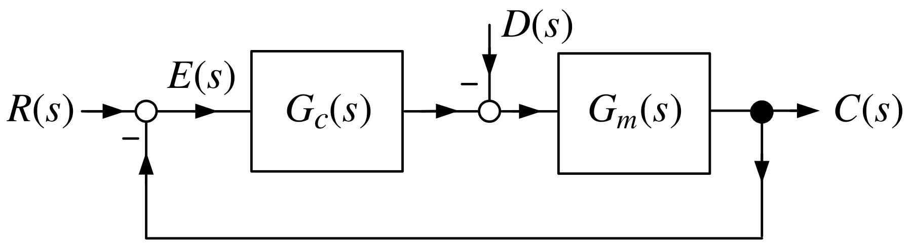

:::
:::

---

::: {.compact-slide .dense-slide .multi-figure-slide}

The Control Problem

::: center

:::

Compute $C(s)$ in terms of $R(s)$ and $D(s)$ via block diagram reduction.

<figure>

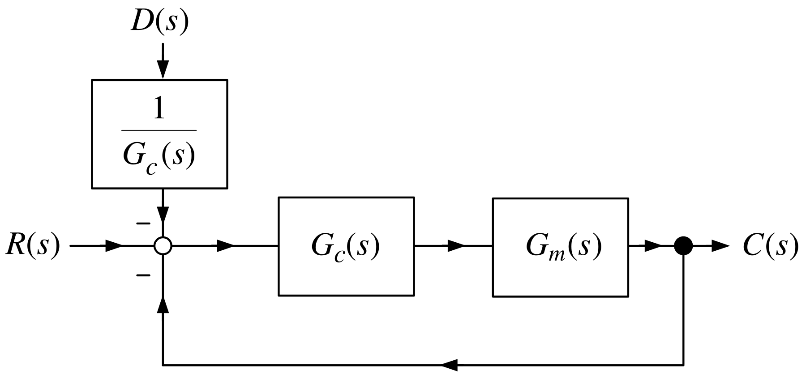

</figure>

$$
C(s)=\frac{G_{c}(s)G_{m}(s)}{1+G_{c}(s)G_{m}(s)}\!\left(  \!R(s)-\frac
{1}{G_{c}(s)}D(s)\!\right)  \!.
$$
:::

---

::: {.compact-slide .dense-slide}

The Control Problem

$$
C(s)=\frac{G_{c}(s)G_{m}(s)}{1+G_{c}(s)G_{m}(s)}\!\left(  \!R(s)-\frac
{1}{G_{c}(s)}D(s)\!\right)
$$

or 

$$
C(s)=\frac{G_{c}(s)G_{m}(s)}{1+G_{c}(s)G_{m}(s)}R(s)-\frac{G_{m}(s)}
{1+G_{c}(s)G_{m}(s)}D(s).
$$

::: center

:::

Error $E(s)$: 

$$
E(s)=R(s)-C(s)=\frac{1}{1+G_{c}(s)G_{m}(s)}R(s)+\frac{G_{m}(s)}{1+G_{c}
(s)G_{m}(s)}D(s)\nonumber
$$

-   *Tracking:*  If $r(t)=R_{0}$, then we want $c(t)\rightarrow R_{0}$ as $t\rightarrow\infty.$

-   *Disturbance Rejection:*  We want $c(t)\rightarrow R_{0}$ despite any load torque on the motor.
:::

---

::: {.compact-slide .dense-slide}

Control of a DC Servo Motor

**Tracking**

**Example**  *Tracking a Step Input*

$R(s)=R_{0}/s,D(s)=0,$ and $G_{m}(s)=\dfrac{1}{s(s+1)}.$

::: center

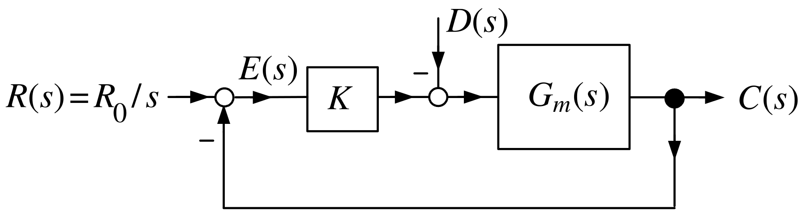

:::

Objective: $c(t)\rightarrow R_{0}$ or equivalently, $e(t)\rightarrow0.$

$$
C(s)=\frac{KG_{m}(s)}{1+KG_{m}(s)}R(s)\text{ \ and \ }E(s)=\frac{1}
{1+KG_{m}(s)}R(s).
$$

$$
E(s)=\frac{1}{1+K\dfrac{1}{s(s+1)}}\frac{R_{0}}{s}=\frac{s(s+1)}
{s(s+1)+K}\frac{R_{0}}{s}=\frac{s+1}{s^{2}+s+K}R_{0}.
$$

-   The poles of $KG_{m}(s)=K\dfrac{1}{s(s+1)}$ reappear in the numerator of $E(s).$

-   After clearing the fractions, the "$s$"  in $K\dfrac{1}{s(s+1)}$ cancelled the "$s$ " in $R(s)$.
:::

---

::: {.compact-slide .dense-slide}

Tracking

**Example**  *Tracking a Step Input*  **(continued)**

From previous slide:

$$
E(s)=\frac{1}{1+K\dfrac{1}{s(s+1)}}\frac{R_{0}}{s}=\frac{s(s+1)}
{s(s+1)+K}\frac{R_{0}}{s}=\frac{s+1}{s^{2}+s+K}R_{0}.
$$

-   For $K>0$, $s^{2}+s+K$ is a stable polynomial so $sE(s)$ is stable.

-   FVT: $\ e(\infty)=\lim_{s\rightarrow0}sE(s)=\lim_{s\rightarrow0}
    s\dfrac{s(s+1)}{s(s+1)+K}\dfrac{R_{0}}{s}=0.$

-   Thus $c(t)\rightarrow R_{0}!$

-   *Where does stability come in?* Let $K=1$ so that 

$$
s^{2}+s+1=\left[  s-\left(  -\frac{1}{2}+\frac{j\sqrt{3}}{2}\right)  \right]
    \left[  s-\left(  -\frac{1}{2}-\frac{j\sqrt{3}}{2}\right)  \right]
    =(s-p_{1})(s-p_{2})
$$

-   PFE: $\ E(s)=\dfrac{s(s+1)}{s(s+1)+K}\dfrac{R_{0}}{s}=\dfrac
    {s+1}{(s-p_{1})(s-p_{2})}R_{0}=\dfrac{\beta}{s-p_{1}}+\dfrac{\beta^{\ast}
    }{s-p_{2}}.$ 

$$
\begin{aligned}
    e(t)=\beta e^{p_{1}t}+\beta^{\ast}e^{p_{2}t}  &  =|\beta|e^{j\angle\beta
    }e^{-(1/2)t+j(\sqrt{3}/2)t}+|\beta|e^{-j\angle\beta}e^{-(1/2)t-j(\sqrt{3}
    /2)t}\\
    &  =2|\beta|e^{-(1/2)t}\cos\!\left(  \!(\sqrt{3}/2)t+\angle\beta\right)
    \rightarrow0\text{ as }t\rightarrow\infty.
    \end{aligned}
$$
:::

---

::: {.compact-slide .dense-slide .boundary-safe-slide .multi-figure-slide}

Example

*Tracking a Ramp Input*

Let $r(t)=\omega_{0}t$ $\Longrightarrow$ $R(s)=\omega_{0}/s^{2}$ and $D(s)=0$.

::: center

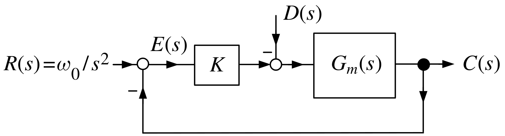

:::

$$
E(s)=\frac{1}{1+K\dfrac{1}{s(s+1)}}\frac{\omega_{0}}{s^{2}}=\frac
{s(s+1)}{s(s+1)+K}\frac{\omega_{0}}{s^{2}}=\frac{s+1}{s^{2}+s+K}\frac
{\omega_{0}}{s}.
$$

-   The pole of $KG_{m}(s)$ at $s=0$ cancelled one of the poles $R(s)$.

-   For $K>0$ it follows that $s^{2}+s+K$ is stable and thus $sE(s)$ is stable.

-   FVT: $\ e(\infty)=\lim_{s\rightarrow0}sE(s)=\lim_{s\rightarrow0}
    \dfrac{s+1}{s(s+1)+K}\omega_{0}=\dfrac{\omega_{0}}{K}.$

-   Asymptotic tracking is *not* achieved as $e(t)\nrightarrow0$ as $t\rightarrow\infty$.

    ::: center
    
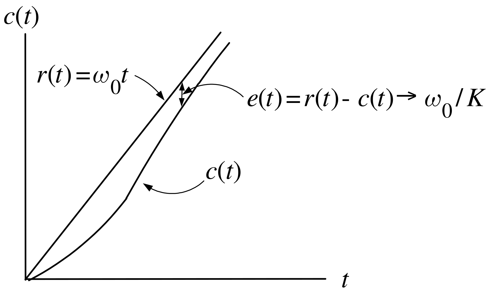

    :::
:::

---

::: {.compact-slide .dense-slide}

Example

*Tracking a Ramp Input* **(continued)**

::: center

:::

*Where does stability come in?* Let $K=1$ so that

$$
\begin{aligned}
E(s)=\frac{s(s+1)}{s(s+1)+K}\frac{\omega_{0}}{s^{2}} &  =\frac{s+1}
{s(s-p_{1})(s-p_{2})}\omega_{0},\text{ \ }p_{i}=-\frac{1}{2}\pm j\frac
{\sqrt{3}}{2}\\
&  =\frac{A}{s}+\frac{\beta}{s-p_{1}}+\frac{\beta^{\ast}}{s-p_{2}}\\
&  =\frac{\omega_{0}}{s}+\frac{\beta}{s-p_{1}}+\frac{\beta^{\ast}}{s-p_{2}
},\text{ \ }\omega_{0}=\lim_{s\rightarrow0}sE(s).
\end{aligned}
$$

Then as $t\rightarrow\infty$ 

$$
e(t)=\omega_{0}u_{s}(t)+\beta e^{p_{1}t}+\beta^{\ast}e^{p_{2}t}\rightarrow
\omega_{0}.
$$

-   A proportional controller will *not* track $r(t)=\omega_{0}t$ with zero steady-state error.

-   Try a different controller!
:::

---

::: {.compact-slide .dense-slide .boundary-safe-slide}

Tracking

**Example**  *Integral Controller*

New controller: $\ G_{c}(s)=K/s$.

::: center

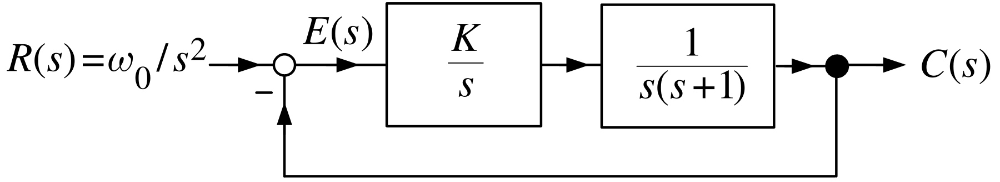

:::

$$
E(s)=\frac{1}{1+\dfrac{K}{s}\dfrac{1}{s(s+1)}}\frac{\omega_{0}}{s^{2}}
=\frac{s^{2}(s+1)}{s^{2}(s+1)+K}\frac{\omega_{0}}{s^{2}}=\frac{s+1}
{s^{3}+s^{2}+K}\omega_{0}
$$

-   The denominator of $\dfrac{K}{s}\dfrac{1}{s(s+1)}$ reappears in the numerator of $E(s)$.

-   The factor $s^{2}$ in the numerator of $E(s)$ cancels the $s^{2}$ in denominator of $R(s)$.

-   **If**

    $\ s^{3}+s^{2}+K$ was stable, by the FVT 

$$
e(\infty)=\lim_{s\rightarrow0}sE(s)=\lim_{s\rightarrow0}s\frac{s+1}
    {s^{3}+s^{2}+K}\omega_{0}=0.
$$

-   $s^{3}+s^{2}+K$ is

    **not**

    stable for any value of $K$!

-   This controller will *not* work!
:::

---

::: {.compact-slide .dense-slide .boundary-safe-slide}

Tracking

**Example**  *Integral Controller* **(continued)**

::: center

:::

-   E.g., let $K=1$ for which $s^{3}+s^{2}+1$ has roots $-1.47,0.23\pm
    j0.79$.

$$
\begin{aligned}
    E(s)  &  =\left.  \frac{s+1}{s^{3}+s^{2}+K}\omega_{0}\right\vert _{K=1}\\
    &  =\frac{s+1}{(s+1.47)[s-(0.23+j0.79)][s-(0.23-j0.79)]}\omega_{0}\\
    &  =\frac{A}{s+1.47}+\frac{\beta}{s-(0.23+j0.79)}+\frac{\beta^{\ast}
    }{s-(0.23-j0.79)}.\\
    & \\
    e(t)  &  =Ae^{-1.47t}+\beta e^{0.23t}e^{j0.79t}+\beta^{\ast}e^{0.23t}
    e^{-j0.79t}\\
    &  =Ae^{-1.47t}+2\left\vert \beta\right\vert e^{0.23t}\cos(0.79t+\angle\beta).
    \end{aligned}
$$

-   $e(t)\nrightarrow0$ due to the complex-conjugate pair of unstable poles at $0.23\pm j0.79$.

-   $\lim\limits_{s\rightarrow0}sE(s)=0$ says nothing about the final value unless $sE(s)$ is stable!
:::

---

::: {.compact-slide .dense-slide}

Tracking

**Example**  *Proportional Plus Integral Controller*

New controller: $G_{c}(s)=K\dfrac{s+\alpha}{s}=K+\dfrac{\alpha K}{s}$  and  $R(s)=\dfrac{\omega_{0}}{s^{2}}$

::: center

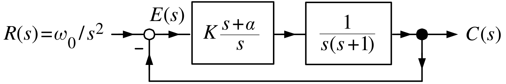

:::

$$
E(s)=\frac{1}{1+K\dfrac{s+\alpha}{s}\dfrac{1}{s(s+1)}}R(s)=\frac{s^{2}
(s+1)}{s^{2}(s+1)+K(s+\alpha)}\frac{\omega_{0}}{s^{2}}=\frac{s+1}{s^{3}
+s^{2}+Ks+\alpha K}\omega_{0}.
$$

The denominator of $K\dfrac{s+\alpha}{s}\dfrac{1}{s(s+1)}$ reappears in the numerator of $E(s)$.

The "$s^{2}$" in the numerator of $E(s)$ cancels the "$s^{2}$" in the denominator of $R(s)$.

**If** $s^{3}+s^{2}+Ks+\alpha K$ is stable, the FVT gives 

$$
e(\infty)=\lim_{s\rightarrow0}sE(s)=\lim_{s\rightarrow0}s\frac{s+1}
{s^{3}+s^{2}+Ks+\alpha K}\omega_{0}=0.
$$
:::

---

::: {.compact-slide .dense-slide}

Tracking

**Example**  *Proportional Plus Integral Controller* **(continued)**

Check stability of $\dfrac{s+1}{s^{3}+s^{2}+Ks+\alpha K}\omega_{0}$:

$$
\begin{array}{ccc}
s^{3} & 1 & K\\
s^{2} & 1 & \alpha K\\
s & \dfrac{K-\alpha K}{1} & 0\\
s^{0} & \alpha K &
\end{array}
$$

Stability requires 

$$
\alpha K>0\text{ \ and \ }K-\alpha K=K(1-\alpha)>0
$$

or 

$$
K>0\text{ and }0<\alpha<1.
$$

E.g., let $K=1$ and $\alpha=1/2$: 

$$
s^{3}+s^{2}+s+1/2=(s+0.65)(s-[-0.176+j0.861])(s-[-0.176-j0.861]).
$$

$$
E(s)=\frac{s+1}{(s-r)(s-p_{1})(s-p_{2})}\omega_{0}=\frac{A}{s-r}+\frac{\beta
}{s-p_{1}}+\frac{\beta^{\ast}}{s-p_{2}}.
$$

$$
\begin{aligned}
e(t)  &  =Ae^{-0.65t}+\beta e^{-0.176t}e^{j0.861t}+\beta^{\ast}e^{-0.176t}
e^{-j0.861t}\\
&  =Ae^{-0.65t}+2|\beta|e^{-0.176t}\cos(0.861t+\angle\beta)\rightarrow0\text{
as }t\rightarrow\infty.
\end{aligned}
$$
:::

---

::: {.compact-slide .dense-slide .multi-figure-slide}

Disturbance Rejection

**Example**  *Constant Load Torque with a Proportional Controller*

Let $G_{m}(s)=\dfrac{1}{s(s+1)}$ and $\tau_{L}(t)=\tau_{L0}u_{s}(t)$ so $D(s)=K_{L}\tau_{L}(s)=K_{L}\tau_{L0}/s$.

::: center

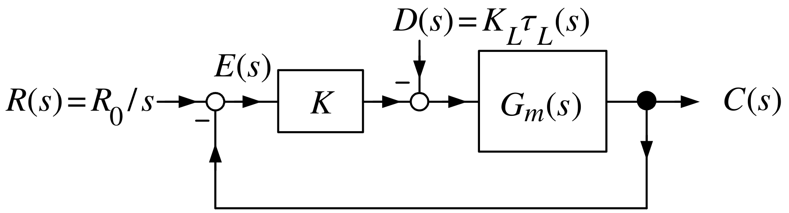

:::

::: center

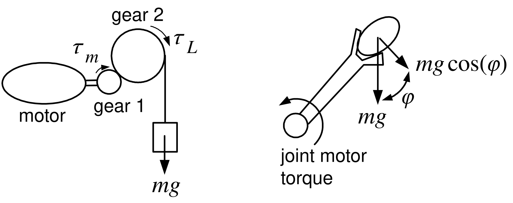

:::

$$
E(s)=\underset{E_{R}(s)}{\underbrace{\frac{1}{1+KG_{m}(s)}R(s)}}
+\underset{E_{D}(s)}{\underbrace{\frac{G_{m}(s)}{1+KG_{m}(s)}D(s)}}
$$

For $K>0$ and $R(s)=R_{0}/s$ we saw $\mathcal{L}^{-1}\{E_{R}(s)\}=e_{R}(t)\rightarrow0.$

Does $e_{D}(t)=\mathcal{L}^{-1}\{E_{D}(s)\}\rightarrow0$ as $t\rightarrow\infty?$
:::

---

::: {.compact-slide .dense-slide}

Disturbance Rejection

**Example**  *Constant Load Torque with a Proportional Controller*  **(continued)**

$$
E_{D}(s)=\frac{G_{m}(s)}{1+KG_{m}(s)}D(s)=\frac{\dfrac{1}{s(s+1)}}
{1+K\dfrac{1}{s(s+1)}}K_{L}\tau_{L}(s)=\frac{K_{L}}{s^{2}+s+K}\frac{\tau_{L0}
}{s}.
$$

As $s^{2}+s+K$ is stable for $K>0$ it follows that $sE_{D}(s)$ is stable so 

$$
e_{D}(\infty)=\lim_{s\rightarrow0}sE_{D}(s)=\lim_{s\rightarrow0}s\frac{K_{L}
}{s^{2}+s+K}\frac{\tau_{L0}}{s}=\frac{K_{L}\tau_{L0}}{K}.
$$

The error 

$$
r(t)-c(t)=e(t)=e_{R}(t)+e_{D}(t)\rightarrow e(\infty)=e_{R}(\infty
)+e_{D}(\infty)=0+K_{L}\tau_{L0}/K.
$$

Rearranging, we have 

$$
c(\infty)=r(\infty)-e(\infty)=R_{0}-K_{L}\tau_{L0}/K.
$$

-   The final output position depends on the value of the load torque $\tau_{L0}$.

-   It is usually important to precisely position the motor regardless of the load.

-   Try a different controller!
:::

---

::: {.compact-slide .dense-slide .boundary-safe-slide}

Disturbance Rejection

**Example** *Constant Load Torque with a PI Controller*

Let $G_{c}(s)=K_{p}+K_{I}/s=K\dfrac{s+\alpha}{s}$ where $K_{p}=K,K_{I}=\alpha
K.$

::: center

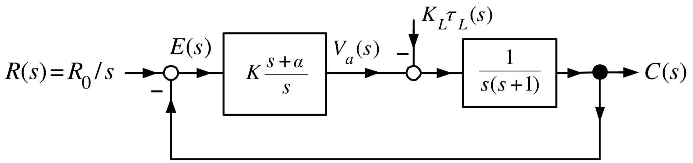

:::

$$
\begin{aligned}
\!\!\!\!\!\!E_{D}(s)=\frac{G_{m}(s)}{1+G_{c}(s)G_{m}(s)}D(s)=\frac{\dfrac
{1}{s(s+1)}}{1+K\dfrac{s+\alpha}{s}\dfrac{1}{s(s+1)}}\frac{K_{L}\tau_{L0}}
{s}\! &  =\frac{s}{s^{2}(s+1)+K(s+\alpha)}\frac{K_{L}\tau_{L0}}{s}\\
\! &  =\frac{1}{s^{3}+s^{2}+Ks+\alpha K}K_{L}\tau_{L0}.
\end{aligned}
$$

-   Only the denominator of $G_{c}(s),$ i.e., " $s$" reappears in the numerator.

-   This "$s$" cancels the $1/s$ in $\tau_{L}(s)$.

-   $s^{3}+s^{2}+Ks+\alpha K$ is stable for $K>0$ and $0<\alpha<1$, and so $sE_{D}(s)$ is also stable.

    $\qquad\Longrightarrow$ $\ e_{D}(\infty)=\lim_{s\rightarrow0}sE_{D}
    (s)=\lim_{s\rightarrow0}s\dfrac{{}}{s^{3}+s^{2}+Ks+\alpha K}K_{L}\tau
    _{L0}=0.$

-   The load torque $\tau_{L0}$ has *no* effect on the final position.
:::

---

::: {.compact-slide .dense-slide .boundary-safe-slide .multi-figure-slide}

Interpretation of the PI Controller

::: center

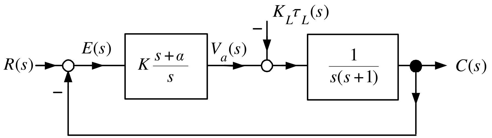

:::

$R(s)=R_{0}/s,\tau_{L}(s)=\tau_{L0}/s,$ and $K,\alpha$ chosen so $e(\infty)=\lim_{s\rightarrow0}sE(s)=0.$

$$
\begin{aligned}
V_{a}(s) &  =K\dfrac{s+\alpha}{s}E(s)=KE(s)+\dfrac{\alpha K}{s}E(s)=\mathcal{L}\left\{  Ke(t)+\alpha K\int_{0}^{t}e(\tau)d\tau\right\}  .\\
E(s) &  =\underset{E_{R}(s)}{\underbrace{\frac{s^{2}(s+1)}{s^{3}
+s^{2}+Ks+\alpha K}\frac{R_{0}}{s}}}+\underset{E_{D}(s)}{\underbrace{\frac
{s}{s^{3}+s^{2}+Ks+\alpha K}\frac{K_{L}\tau_{L0}}{s}}}.
\end{aligned}
$$

$E(s)$ is stable for $K>0$ and $0<\alpha<1$. Also, $E(0)=\dfrac{K_{L}\tau
_{L0}}{\alpha K}.$ 

$$
\Longrightarrow v_{a}(\infty)=\lim_{t\rightarrow\infty}v_{a}(t)=\lim
_{s\rightarrow0}sV_{a}(s)=\lim_{s\rightarrow0}\left(  sKE(s)+\alpha
KE(s)\right)  =\alpha KE(0)=K_{L}\tau_{L0}
$$

::: center

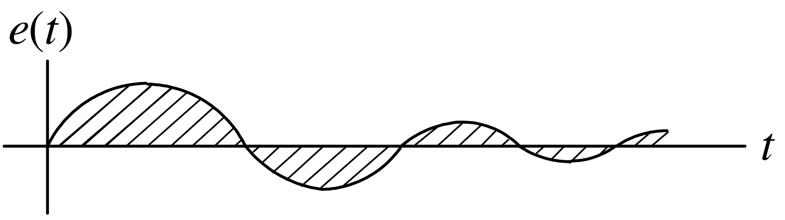

:::

Shaded area is $\int_{0}^{\infty}e(t)dt$ and $v_{a}(\infty)=\alpha K\int
_{0}^{\infty}e(t)dt=K_{L}\tau_{L0}.$
:::

---

::: {.compact-slide .dense-slide}

Summary of the PI Controller for a DC Servo

::: center

:::

$R(s)=R_{0}/s+\omega_{0}/s^{2}=\mathcal{L}\{R_{0}+\omega_{0}t\}$ and $\tau_{L}(s)=\tau_{L0}/s.$

$$
\begin{aligned}
C(s) &  =\frac{G_{c}(s)G_{m}(s)}{1+G_{c}(s)G_{m}(s)}R(s)-\frac{G_{m}
(s)}{1+G_{c}(s)G_{m}(s)}K_{L}\tau_{L}(s)\\
E(s) &  =\frac{1}{1+G_{c}(s)G_{m}(s)}R(s)+\frac{G_{m}(s)}{1+G_{c}(s)G_{m}
(s)}K_{L}\tau_{L}(s).
\end{aligned}
$$

$$
E(s)=\frac{s^{2}(s+1)}{s^{3}+s^{2}+Ks+\alpha K}\left(  \frac{R_{0}}{s}
+\frac{\omega_{0}}{s^{2}}\right)  +\frac{s}{s^{3}+s^{2}+Ks+\alpha K}
\frac{K_{L}\tau_{L0}}{s}.
$$

$K,\alpha$ chosen so $s^{3}+s^{2}+Ks+\alpha K=(s-r)(s-p_{1})(s-p_{2})$ is stable. 

$$
E(s)=\frac{(s+1)(R_{0}s+\omega_{0})}{(s-r)(s-p_{1})(s-p_{2})}+\frac
{1}{(s-r)(s-p_{1})(s-p_{2})}K_{L}\tau_{L0}
$$

$$
e(t)=Ae^{rt}+Be^{p_{1}t}+B^{\ast}e^{p_{2}t}+(Ce^{rt}+De^{p_{1}t}+D^{\ast
}e^{p_{2}t})K_{L}\tau_{L0}\rightarrow0\text{ as }t\rightarrow\infty.
$$
:::

---

::: {.compact-slide .dense-slide}

Proportional Plus Integral Plus Derivative (PID) Control

::: center

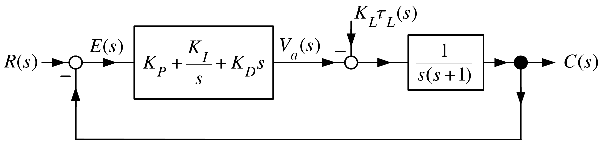

:::

Proportional plus integral plus derivative (PID) controller:

$$
G_{c}(s)=K_{P}+\frac{K_{I}}{s}+K_{D}s=\frac{K_{D}s^{2}+K_{P}s+K_{I}}{s}.
$$

Time domain: 

$$
v_{a}(t)=K_{P}e(t)+K_{I}\int_{0}^{t}e(\tau)d\tau+K_{D}\frac{de}{dt}.
$$

-   The derivative control term $K_{D}s$ usually helps to make the system more stable.

    -   I.e., allows one to put the closed-loop poles *further* in the left half-plane.
:::

---

::: {.compact-slide .dense-slide}

Practical Problem with Derivative Controllers

::: center

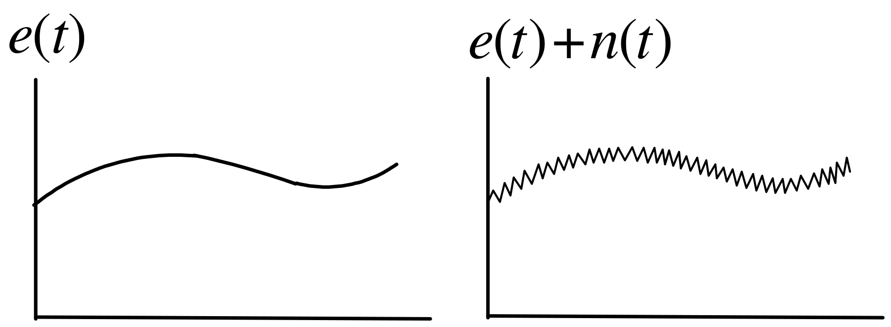

:::

-   Differentiation of a signal with noise amplifies the noise!!

-   Most signals contain high-frequency low-amplitude noise. 

**Example**  *Full-Wave Rectification*  

A power supply takes a $60$ Hz AC signal and (full wave) rectifies it into a DC voltage.

This results in a small amplitude 120 Hz signal (i.e., noise) on the DC output.

The error signal $e(t)$ is actually $e(t)+n(t)$ where $n(t)=0.01\sin
(2\pi(120t)).$

$\dot{e}(t)+\dot{n}(t)=\dot{e}(t)+7.54\cos(754t)$.

The noise is small, but its derivative is large!
:::

---

::: {.compact-slide .dense-slide .boundary-safe-slide .multi-figure-slide}

Practical Implementation of Derivative Feedback

To mitigate differentiation amplifying high frequency noise, replace $K_{D}s$ with

$$
\frac{K_{D}s}{\tau s+1}\approx\left\{
\begin{array}{cc}
K_{D}s, & |s|<<1/\tau\\
K_{D}/\tau, & |s|>>1/\tau
\end{array}
\right.  \text{ \ where }\tau>0\text{ is small.}
$$

-   At low frequencies $K_{D}s/(\tau s+1)$ is a differentiator.

-   At high frequencies $K_{D}s/(\tau s+1)$ is a proportional gain.

    <figure>
    

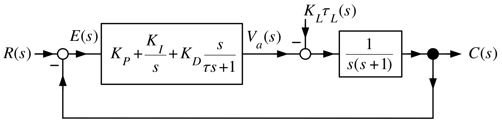

    </figure>

-   $r(t)$ is often a step input, i.e., $u_{s}(t)$ which is not differentiable at $t=0.$

-   To avoid differentiating $r(t)$ we use the feedback control architecture shown below.

    <figure>
    

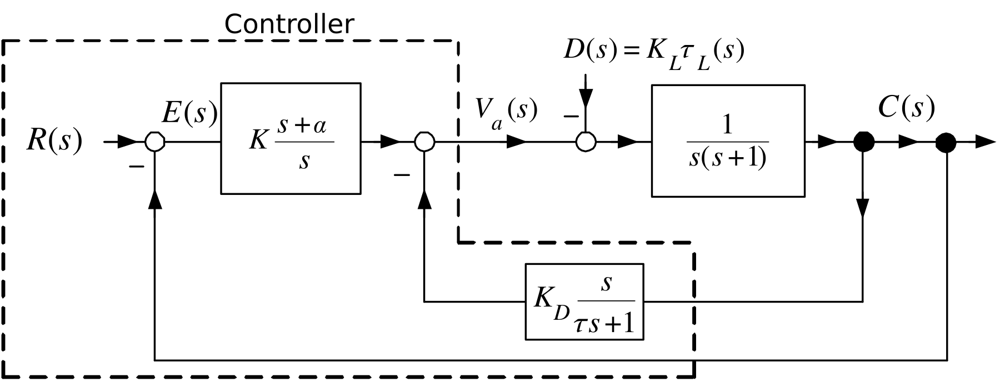

    </figure>
:::

---

::: {.compact-slide .dense-slide .multi-figure-slide}

Practical Implementation of Derivative Feedback

We do a simple block diagram manipulation on

<figure>

</figure>

to obtain

<figure>

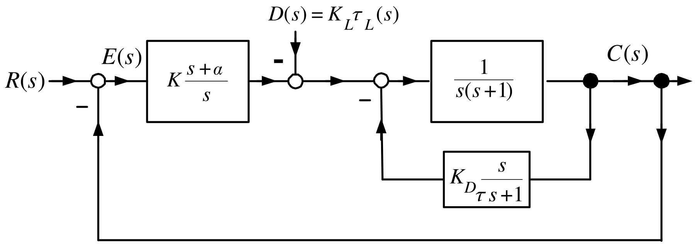

</figure>
:::

---

::: {.compact-slide .dense-slide .multi-figure-slide}

Practical Implementation of Derivative Feedback

We then do some block diagram reduction so that

<figure>

</figure>

becomes (with $\tau=0$)

<figure>

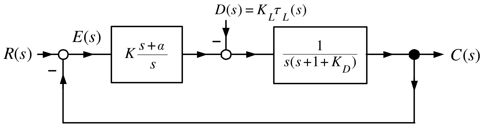

</figure>
:::

---

::: {.compact-slide .dense-slide}

Practical Implementation of Derivative Feedback

<figure>

</figure>

-   In order to set the values of $K,\alpha,$ and $K_{D},$ we take $\tau=0$ as it is small.

-   Of course, in the implementation $K_{D}s/(\tau s+1)$ must be used.

Now

$$
E_{R}(s)=\frac{1}{1+K\dfrac{s+\alpha}{s}\dfrac{1}{s+1+K_{D}}\dfrac{1}{s}
}R(s)=\frac{s^{2}(s+1+K_{D})}{s^{3}+(1+K_{D})s^{2}+Ks+\alpha K}R(s)
$$

and 

$$
E_{D}(s)=\frac{\dfrac{1}{s+1+K_{D}}\dfrac{1}{s}}{1+K\dfrac{s+\alpha}{s}
\dfrac{1}{s+1+K_{D}}\dfrac{1}{s}}D(s)=\frac{s}{s^{3}+(1+K_{D})s^{2}+Ks+\alpha
K}D(s).
$$

-   $K_{D},K$ and $\alpha$ are then used to arbitrarily set the coefficients of 

$$
s^{3}+(1+K_{D})s^{2}+Ks+\alpha K.
$$
:::

---

::: {.compact-slide}

Placement of the Closed-Loop Poles

A PID controller for a DC servomotor achieves:

\(1\) Tracking of step and ramp inputs

\(2\) Rejection of constant load torque disturbances

\(3\) Placement of the closed-loop poles in any desired location.

Where do we place the closed-loop poles?

 

As far as possible in the left half-plane so the transients die out quickly.

Consider the previous example: The error $E_{R}(s)$ is given by

$$
E_{R}(s)=\frac{s^{2}\left(  s+1+K_{D}\right)  }{s^{3}+(1+K_{D})s^{2}+Ks+\alpha
K}R(s).
$$

Suppose it is desired to put the closed-loop poles at $-10,-10+j10$ and $-10-j10$.

Set 

$$
\begin{aligned}
s^{3}+(1+K_{D})s^{2}+Ks+\alpha K  & =(s+10)(s-(-10+j10))(s-(-10-j10))\\
& =(s+10)(s^{2}+20s+200)\\
& =s^{3}+30s^{2}+400s+2000.
\end{aligned}
$$

Choose $1+K_{D}=30$ or $K_{D}=29,K=400$, and $\alpha K=2000$ or $\alpha=5$.
:::

---

::: {.compact-slide .dense-slide .boundary-safe-slide}

Placement of the Closed-Loop Poles

-   Let $\theta(0)=0$ and $\omega(0)=0$ and $r(t)=R_{0}u_{s}(t).$

-   At $t=0^{+},$ $c(0^{+})=\theta(0^{+})=0,\omega(0^{+})=0$ so

$$
e(0^{+})=r(0^{+})-c(0^{+})=R_{0}.
$$

<figure>
    

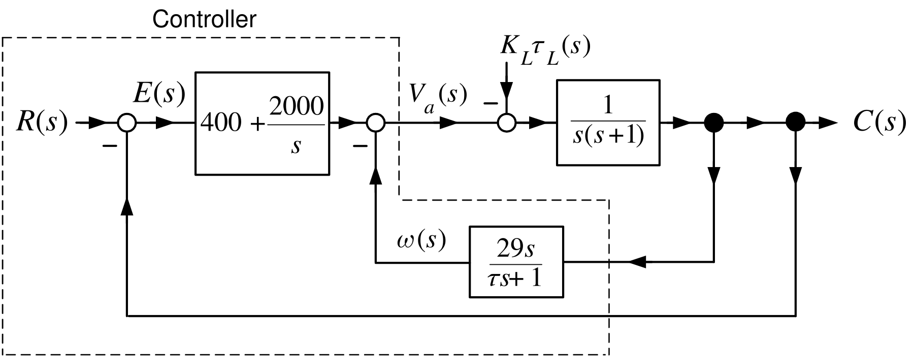

    </figure>

    The voltage at $t=0^{+}$ is 

$$
v_{a}(0^{+})=400e(0^{+})+2000\int_{0}^{0^{+}}e(t)dt-29\omega(0^{+}
    )=400e(0^{+})=400R_{0}.
$$

-   Right after $r(t)=R_{0}u_{s}(t)$ is applied, the output of the amplifier is $400R_{0}$.

-   In particular, if $R_{0}=1$ radian, then the amplifier is required to put out $400$ volts!

-   The further the poles are in the left half-plane, the larger the gains $K,K_{D},\alpha$.

    The larger the gains, the more likely the actuator (amplifier) saturates.
:::

---

::: {.compact-slide}

Definition

::: center
Theory of Tracking and Disturbance Rejection
:::

 *Type Number of a Transfer Function*

Let

$$
G(s)=\frac{b(s)}{s^{j}\bar{a}(s)},\text{ \ }\bar{a}(0)\neq0.
$$

Then $G(s)$ is said to be a type $j$ system.

That is, it has $j$ poles at the origin.

**Example** *Transfer Functions and Their Type Numbers*

$$
\begin{array}{lcl}
G(s)=\dfrac{1}{s^{2}} & \text{Type 2} & \bar{a}(s)=1\\
&  & \\
G(s)=\dfrac{1}{s(s+1)^{2}} & \text{Type 1} & \bar{a}(s)=(s+1)^{2}\\
&  & \\
G(s)=\dfrac{1}{s+2} & \text{Type 0} & \bar{a}(s)=s+2\\
&  & \\
G(s)=\dfrac{s+1}{s(s^{2}+2s+2)} & \text{Type 1} & \bar{a}(s)=s^{2}+2s+2
\end{array}
$$
:::

---

::: {.compact-slide .expanded-body-slide}

Definition

*Type Number of Inputs*

Let the reference input $R(s)$ be given by

$$
R(s)=\frac{R_{0}}{s^{j}}.
$$

Then $R(s)$ is said to be a type $j$ reference input.

Let the disturbance input $D(s)$ be given by 

$$
D(s)=\frac{D_{0}}{s^{j}}.
$$

Then $D(s)$ is said to be a type $j$ disturbance input.

**Remark**

$R(s)$ or $D(s)$ have a type number *only* if they are of the form ([\[eq1\]](#eq1){reference-type="ref" reference="eq1"}) or ([\[eq2\]](#eq2){reference-type="ref" reference="eq2"}), respectively.

For example, the type number is *not* defined for 

$$
R(s)=\dfrac{R_{0}}{s(s+1)}\text{ \ or \ }D(s)=\dfrac{D_{0}}{s(s-2)}.
$$
:::

---

::: {.compact-slide .dense-slide}

Theorem

*Tracking with Zero Steady-State Error*

The reference input is type $j$ for some positive integer $j.$

::: center

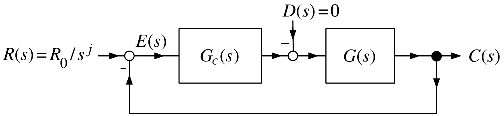

:::

$G(s)=\dfrac{b(s)}{a(s)}$ strictly proper, $G_{c}(s)=\dfrac{b_{c}(s)}
{a_{c}(s)}$ proper.

$$
E_{R}(s)=\frac{1}{1+G_{c}(s)G(s)}R(s)=\frac{1}{1+\dfrac{b_{c}(s)}{a_{c}
(s)}\dfrac{b(s)}{a(s)}}R(s)=\frac{a_{c}(s)a(s)}{a_{c}(s)a(s)+b_{c}
(s)b(s)}R(s).
$$

**If**

\(1\) $\ a_{c}(s)a(s)+b_{c}(s)b(s)$ has all of its roots in the open LHP.

\(2\) The type number of $G_{c}(s)G(s)$ is $j$ or greater.

**Then** 

$$
\lim_{t\rightarrow\infty}e_{R}(t)=\lim_{t\rightarrow\infty}\left(
r(t)-c(t)\right)  =0.
$$

-   If $R(s)=\dfrac{R_{0}}{s^{j}}$ then $G_{c}(s)G(s)$ must contain at least a factor of $\dfrac{1}{s^{j}}.$
:::

---

::: {.compact-slide .dense-slide}

Proof

Given: The closed-loop system is stable and $G_{c}(s)G(s)$ is at least type $j.$*  *

::: center

:::

$$
\begin{aligned}
\!\!\!E_{R}(s)=\frac{1}{1+G_{c}(s)G(s)}R(s)=\frac{1}{1+\dfrac{b_{c}(s)}
{a_{c}(s)}\dfrac{b(s)}{a(s)}}\frac{R_{0}}{s^{j}} &  =\frac{a_{c}(s)a(s)}
{a_{c}(s)a(s)+b_{c}(s)b(s)}\frac{R_{0}}{s^{j}}\\
&  =\frac{s^{j}\bar{a}(s)}{a_{c}(s)a(s)+b_{c}(s)b(s)}\frac{R_{0}}{s^{j}}\\
&  =\frac{\bar{a}(s)}{a_{c}(s)a(s)+b_{c}(s)b(s)}R_{0}\\
&  =\frac{\bar{a}(s)}{(s-p_{1})\cdots(s-p_{n})}R_{0}\\
&  =\frac{A_{1}}{s-p_{1}}+\frac{A_{2}}{s-p_{2}}+\cdots+\frac{A_{n}}{s-p_{n}}.
\end{aligned}
$$

$e_{R}(t)=A_{1}e^{p_{1}t}+\cdots+A_{n}e^{p_{n}t}\rightarrow0\ \ $as $\ \operatorname{Re}(p_{i})<0\ $for$\ i=1,...,n.$
:::

---

::: {.compact-slide .dense-slide}

Theorem

*Disturbance Rejection with Zero Steady-State Error*

The disturbance is type $j$ for some positive integer $j.$

::: center

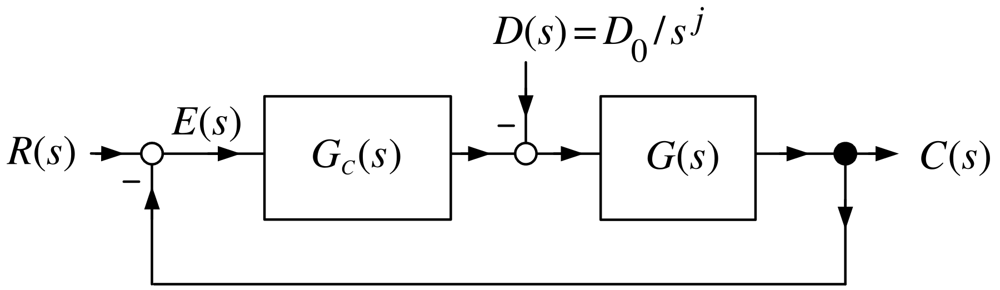

:::

$G(s)=\dfrac{b(s)}{a(s)}$ strictly proper and $G_{c}(s)=\dfrac{b_{c}(s)}
{a_{c}(s)}$ proper.

$$
E_{D}(s)=\frac{G(s)}{1+G_{c}(s)G(s)}D(s)=\frac{\dfrac{b(s)}{a(s)}}
{1+\dfrac{b_{c}(s)}{a_{c}(s)}\dfrac{b(s)}{a(s)}}D(s)=\frac{a_{c}(s)b(s)}
{a_{c}(s)a(s)+b_{c}(s)b(s)}D(s)
$$

**If**

\(1\) $a_{c}(s)a(s)+b_{c}(s)b(s)$ has all of its roots in the open LHP.

\(2\) The type number of $G_{c}(s)$ is $j$ or greater.

**Then** 

$$
e_{D}(t)\triangleq\mathcal{L}^{-1}\!\{E_{D}(s)\}\rightarrow0
$$

-   $G_{c}(s)$ *by itself* must be type $j.$
:::

---

::: {.compact-slide .dense-slide}

Proof

Given: The closed-loop system is stable and $G_{c}(s)$ is at least type $j.$

::: center

:::

$$
\begin{aligned}
E_{D}(s)=\frac{a_{c}(s)b(s)}{a_{c}(s)a(s)+b_{c}(s)b(s)}\frac{D_{0}}{s^{j}} &
=\frac{s^{j}\bar{a}_{c}(s)b(s)}{a_{c}(s)a(s)+b_{c}(s)b(s)}\frac{D_{0}}{s^{j}
}\\
& \\
&  =\frac{\bar{a}_{c}(s)b(s)}{a_{c}(s)a(s)+b_{c}(s)b(s)}D_{0}\\
& \\
&  =\frac{\bar{a}_{c}(s)b(s)}{(s-p_{1})\cdots(s-p_{n})}D_{0}\\
& \\
&  =\frac{A_{1}}{s-p_{1}}+\frac{A_{2}}{s-p_{2}}+\cdots+\frac{A_{n}}{s-p_{n}}.
\end{aligned}
$$

$\hspace{0.25in}e_{D}(t)=A_{1}e^{p_{1}t}+\cdots+A_{n}e^{p_{n}t}\rightarrow0$  as  $\operatorname{Re}(p_{i})<0$ for $i=1,...,n.$
:::

---

::: {.compact-slide}

Internal Model Principle

* *

::: center

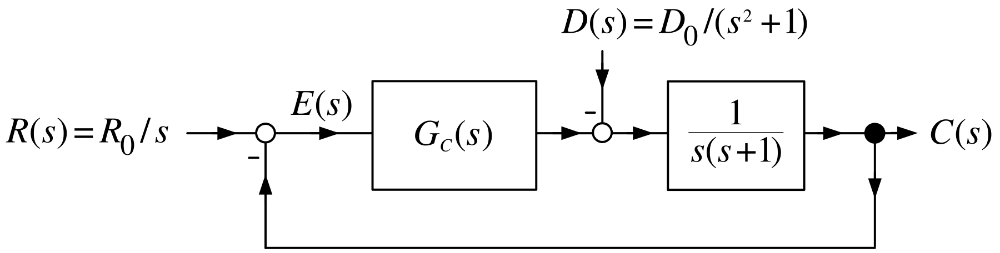

:::

$D(s)=\dfrac{D_{0}}{s^{2}+1}$ so $d(t)=D_{0}\sin(t)$.

Let $G_{c}(s)=K\dfrac{s+\alpha}{s^{2}+1}.$  

$G_{c}(s)$ was chosen so its poles contained the poles of $D(s).$

$$
\begin{aligned}
E_{D}(s)=\frac{G(s)}{1+G_{c}(s)G(s)}D(s)  &  =\frac{\dfrac{1}{s(s+1)}
}{1+K\dfrac{s+\alpha}{s^{2}+1}\dfrac{1}{s(s+1)}}\frac{D_{0}}{s^{2}+1}\\
&  =\frac{s^{2}+1}{s^{4}+s^{3}+s^{2}+(K+1)s+\alpha K}\frac{D_{0}}{s^{2}+1}.
\end{aligned}
$$
:::

---

::: {.compact-slide .dense-slide .boundary-safe-slide}

Example

*Rejecting a Sinusoidal Disturbance* **(continued)**

::: center

:::

$$
E_{D}(s)=\frac{s^{2}+1}{s^{4}+s^{3}+s^{2}+(K+1)s+\alpha K}\frac{D_{0}}
{s^{2}+1}=\frac{1}{s^{4}+s^{3}+s^{2}+(K+1)s+\alpha K}D_{0}.
$$

-   The factor of $s^{2}+1$ in $G_{c}(s)$ cancels the factor $s^{2}+1$ in $D(s).$

-   For $e_{D}(t)\rightarrow0$ we must find $K,\alpha$ so $s^{4}+s^{3}
    +s^{2}+(K+1)s+\alpha K$ is stable. 

$$
\begin{array}{clcc}
    s^{4} & 1 & 1 & \alpha K\\
    &  &  & \\
    s^{3} & 1 & K+1 & 0\\
    &  &  & \\
    s^{2} & \dfrac{1-(K+1)}{1}=-K & \alpha K & 0\\
    &  &  & \\
    s & \dfrac{-K(K+1)-\alpha K}{-K}=\dfrac{K(K+1+\alpha)}{K} & 0 & \\
    &  &  & \\
    s^{0} & \alpha K &  &
    \end{array}
$$
:::

---

::: {.compact-slide .dense-slide}

Example

*Rejecting a Sinusoidal Disturbance* **(continued)**

::: center

:::

Stability requires $-K>0,K+1+\alpha>0$ and $\alpha K>0$ or

$$
K<0,\text{ }-(K+\alpha)<1,\text{ }\alpha<0.
$$

E.g., let $\alpha=-0.25,K=-0.6$ so $s^{4}+s^{3}+s^{2}+(K+1)s+\alpha K$ becomes 

$$
s^{4}+s^{3}+s^{2}+0.4s+0.15
$$

with roots 

$$
-0.17\pm j0.63,\text{ }-0.33\pm j0.49.
$$

The error response is 

$$
e_{D}(t)=4.7e^{-0.17t}\sin(0.63t+0.37)-4.1e^{-0.33t}\sin(0.49t+0.4)\rightarrow
0
$$

-   The transients die out slowly.
:::

---

::: {.compact-slide .dense-slide}

Example

*Rejecting a Sinusoidal Disturbance* **(continued)**

::: center

:::

We also have

$$
\begin{aligned}
E_{R}(s)=\frac{1}{1+G_{c}(s)G(s)}R(s)  &  =\frac{1}{1+K\dfrac{s+\alpha}
{s^{2}+1}\dfrac{1}{s(s+1)}}\frac{R_{0}}{s}\\
&  =\frac{s(s+1)(s^{2}+1)}{s^{4}+s^{3}+s^{2}+(K+1)s+\alpha K}\frac{R_{0}}{s}\\
&  =\frac{(s+1)(s^{2}+1)}{s^{4}+s^{3}+s^{2}+(K+1)s+\alpha K}R_{0}.
\end{aligned}
$$

-   $E_{R}(s)$ has the same denominator as $E_{D}(s)$.

    $\Longrightarrow$ $\ E_{R}(s)$ is stable for $\alpha=-0.25,K=-0.6$

    $\Longrightarrow$ $\ e_{R}(t)\rightarrow0$ as well (but slowly).
:::

---

::: {.compact-slide .expanded-body-slide .expanded-short-slide}

Internal Model Principle

*Disturbance Rejection*

$\quad G_{c}(s)$ must contain the unstable poles of $D(s)$

$\quad$and

$\quad$the closed-loop system must be stable.

*Tracking*

$\quad G(s)G_{c}(s)$ must contain the unstable poles of $R(s)$

$\quad$and

$\quad$the closed-loop system must be stable.
:::

---

::: {.compact-slide .dense-slide}

Example

*Disturbance Rejection*

::: center

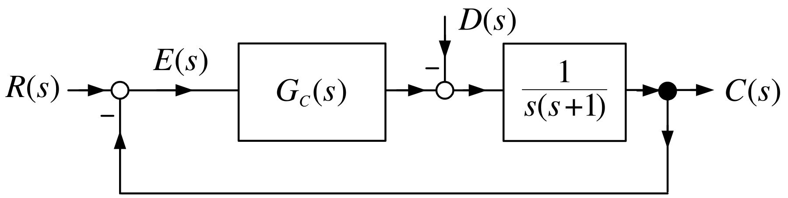

:::

Let $G_{c}(s)=K\dfrac{s+\alpha}{s^{2}+1},$ $R(s)=\dfrac{R_{0}}{s},$ but $D(s)=\dfrac{D_{0}}{s}.$

$$
\begin{aligned}
E_{D}(s)=\frac{G(s)}{1+G_{c}(s)G(s)}D(s)  &  =\frac{\dfrac{1}{s(s+1)}
}{1+K\dfrac{s+\alpha}{s^{2}+1}\dfrac{1}{s(s+1)}}\frac{D_{0}}{s}\\
&  =\frac{s^{2}+1}{s^{4}+s^{3}+s^{2}+(K+1)s+\alpha K}\frac{D_{0}}{s}.
\end{aligned}
$$

-   $G_{c}(s)$ does *not* contain a pole at $s=0$ so the pole of $D(s)$ is not cancelled!

-   $s^{4}+s^{3}+s^{2}+(K+1)s+\alpha K$ is stable for $\alpha=-0.25,K=-0.6$.

-   So $sE_{D}(s)$ is stable and by the FVT: 

$$
e_{D}(\infty)=\lim_{s\rightarrow0}sE_{D}(s)=\lim_{s\rightarrow0}\frac{s^{2}
    +1}{s^{4}+s^{3}+s^{2}+(K+1)s+\alpha K}D_{0}=\frac{D_{0}}{\alpha K}.
$$
:::

---

::: {.compact-slide .dense-slide .boundary-safe-slide}

Problem 11

*Rejecting a Sinusoidal Disturbance with Pole Placement*

::: center

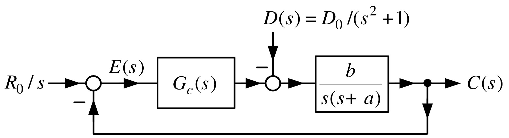

:::

-   $G_{c}(s)=\dfrac{b_{c}(s)}{a_{c}(s)}=\underset{\bar{G}_{c}
    (s)}{\underbrace{\dfrac{b_{3}s^{3}+b_{2}s^{2}+b_{1}s+b_{0}}{s+a_{0}}}}
    \dfrac{1}{s^{2}+1}.$

-   $G_{c}(s)$ is proper, but not strictly proper.

-   $G_{c}(s)$ must have the factor $\dfrac{1}{s^{2}+1}$ as required by the IMP.

-   $\bar{G}_{c}(s)$ is now used to place the closed-loop poles in any desired location.

$$
\begin{aligned}
    \!\!\!\!\!\!\!\!E_{D}(s)  &  =\dfrac{G(s)}{1+G_{c}(s)G(s)}D(s)=\frac{\dfrac
    {b}{s(s+a)}}{1+\dfrac{b_{3}s^{3}+b_{2}s^{2}+b_{1}s+b_{0}}{s+a_{0}}\dfrac
    {1}{s^{2}+1}\dfrac{b}{s(s+a)}}\frac{D_{0}}{s^{2}+1}\\
    \!\!\!  &  =\!\!\!\frac{(s+a_{0})(s^{2}+1)b}{(s+a_{0})s(s+a)(s^{2}
    +1)+bb_{3}s^{3}+bb_{2}s^{2}+bb_{1}s+bb_{0}}\frac{D_{0}}{s^{2}+1}.
    \end{aligned}
$$
:::

---

::: {.compact-slide .dense-slide .boundary-safe-slide}

Problem 11

*Rejecting a Sinusoidal Disturbance with Pole Placement*  **(cont.)**

::: center

:::

$$
\begin{aligned}
\!\!\!\!\!E_{D}(s)\! &  =\!\frac{(s+a_{0})(s^{2}+1)b}{(s+a_{0})s(s+a)(s^{2}
+1)+bb_{3}s^{3}+bb_{2}s^{2}+bb_{1}s+bb_{0}}\frac{D_{0}}{s^{2}+1}\\
\! &  =\!\frac{(s+a_{0})b}{s^{5}+(a+a_{0})s^{4}+(aa_{0}+bb_{3}+1)s^{3}
+(a+a_{0}+bb_{2})s^{2}+(aa_{0}+bb_{1})s+bb_{0}}D_{0}.
\end{aligned}
$$

-   Desired closed-loop characteristic polynomial: $\ s^{5}+f_{4}s^{4}
    +f_{3}s^{3}+f_{2}s^{2}+f_{1}s+f_{0}.$

-   Equate coefficients: 

$$
\begin{aligned}
    bb_{0}  &  =f_{0}\\
    a_{0}+a  &  =f_{4}\\
    aa_{0}+bb_{1}  &  =f_{1}\\
    a+a_{0}+bb_{2}  &  =f_{2}\\
    aa_{0}+bb_{3}+1  &  =f_{3}.
    \end{aligned}
$$
:::

---

::: {.compact-slide .dense-slide}

Problem 11

*Rejecting a Sinusoidal Disturbance with Pole Placement*  **(cont.)**

$$
\begin{aligned}
bb_{0} &  =f_{0}\\
a_{0}+a &  =f_{4}\\
aa_{0}+bb_{1} &  =f_{1}\\
a+a_{0}+bb_{2} &  =f_{2}\\
aa_{0}+bb_{3}+1 &  =f_{3}.
\end{aligned}
$$

$\Longrightarrow$ 

$$
\begin{aligned}
b_{0} &  =\frac{f_{0}}{b}\\
& \\
a_{0} &  =f_{4}-a\\
& \\
b_{1} &  =\frac{f_{1}-aa_{0}}{b}=\frac{f_{1}-af_{4}+a^{2}}{b}\\
& \\
b_{2} &  =\frac{f_{2}-a-a_{0}}{b}=\frac{f_{2}-f_{4}}{b}\\
& \\
b_{3} &  =\frac{f_{3}-aa_{0}-1}{b}=\frac{f_{3}-af_{4}+a^{2}+1}{b}.
\end{aligned}
$$
:::

---

::: {.compact-slide .dense-slide}

Problem 11

*Rejecting a Sinusoidal Disturbance with Pole Placement*  **(cont.)**

::: center

:::

Desired closed-loop poles: $-r_{1},-r_{2},...,-r_{5}$ where $r_{1}
>0,r_{2}>0,...,r_{5}>0.$

$$
\begin{aligned}
&  \!\!\!\!\!\!\!\!\!(s+r_{1})(s+r_{2})(s+r_{3})(s+r_{4})(s+r_{5})=
&  s^{5}+\underset{f_{4}}{\underbrace{(r_{1}+r_{2}+r_{3}+r_{4}+r_{5})}}s^{4}\\
\!\!\! &  +\text{ }\underset{f_{3}}{\underbrace{(r_{1}r_{2}+r_{1}r_{3}
+r_{1}r_{4}+r_{1}r_{5}+r_{2}r_{3}+r_{2}r_{4}+r_{2}r_{5}+r_{3}r_{4}+r_{3}
r_{5}+r_{4}r_{5})}}s^{3}\\
\!\!\! &  +\text{ }\underset{f_{2}}{\underbrace{(r_{1}r_{2}r_{3}+r_{1}
r_{2}r_{4}+r_{1}r_{2}r_{5}+r_{1}r_{3}r_{4}+r_{1}r_{3}r_{5}+r_{1}r_{4}
r_{5}+r_{2}r_{3}r_{4}+r_{2}r_{3}r_{5}+r_{2}r_{4}r_{5}+r_{3}r_{4}r_{5})}}
s^{2}\\
&  \!+\text{ }\underset{f_{1}}{\underbrace{(r_{1}r_{2}r_{3}r_{4}+r_{1}
r_{2}r_{3}r_{5}+r_{1}r_{2}r_{4}r_{5}+r_{1}r_{3}r_{4}r_{5}+r_{2}r_{3}r_{4}
r_{5})}}s\\
\!\!\! &  +\text{ }\underset{f_{0}}{\underbrace{r_{1}r_{2}r_{3}r_{4}r_{5}}}
\end{aligned}
$$
:::

---

::: {.compact-slide .dense-slide}

Problem 11

*Rejecting a Sinusoidal Disturbance with Pole Placement*  **(cont.)**

::: center

:::

Finally

$$
\begin{aligned}
\!\!\!E_{D}(s) &  =\frac{(s+a_{0})b}{s^{5}+(a+a_{0})s^{4}+(aa_{0}
+bb_{3}+1)s^{3}+(a+a_{0}+bb_{2})s^{2}+(aa_{0}+bb_{1})s+bb_{0}}D_{0}\\
& \\
&  =\frac{(s+a_{0})b}{(s+r_{1})(s+r_{2})(s+r_{3})(s+r_{4})(s+r_{5})}D_{0}.
\end{aligned}
$$

$\Longrightarrow$

$$
e_{D}(t)=A_{1}e^{-r_{1}t}+A_{2}e^{-r_{2}t}+A_{3}e^{-r_{3}t}+A_{4}e^{-r_{4}
t}+A_{5}e^{-r_{5}t}\rightarrow0.
$$

We also have (why?) 

$$
e_{R}(t)=B_{1}e^{-r_{1}t}+B_{2}e^{-r_{2}t}+B_{3}e^{-r_{3}t}+B_{4}e^{-r_{4}
t}+B_{5}e^{-r_{5}t}\rightarrow0.
$$
:::

---

::: {.compact-slide}

Design Example: Control of Aircraft Pitch

::: center

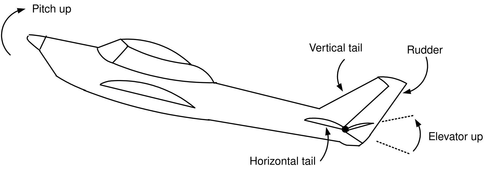

:::

$$
\frac{\theta(s)}{\delta(s)}=G(s)=\dfrac{1.51s+0.1774}{s^{3}+0.739s^{2}
+0.921s}.
$$

**Actuator Constraint:** Elevator deflection is restricted to $-25^{\circ}\leq\delta\leq25^{\circ}.$

**Design specifications:**

\(1\) Overshoot less than 10%.

\(2\) Rise time less than 2 seconds.

\(3\) Settling time less than 10 seconds.

\(4\) Steady-state error less than 2%.
:::

---

::: {.compact-slide .dense-slide}

PI-D Control of Aircraft Pitch

$$
\frac{\theta(s)}{\delta(s)}=G(s)=\dfrac{1.51s+0.1774}{s^{3}+0.739s^{2}
+0.921s}.
$$

::: center

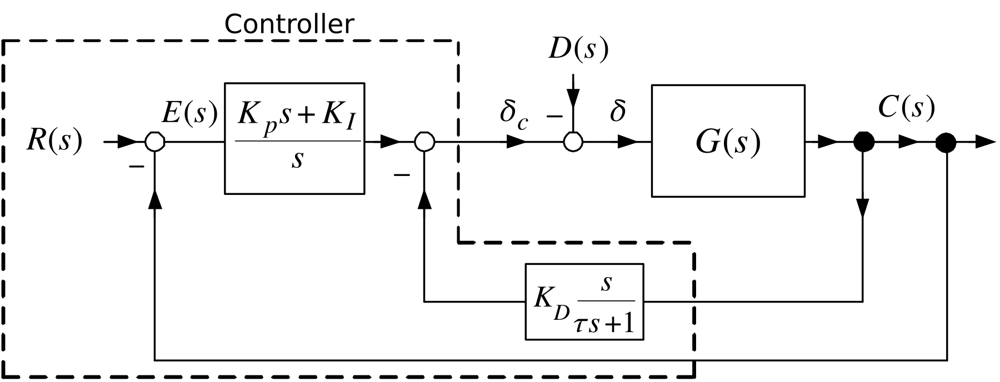

:::

-   $R(s)=R_{0}/s$ with $R_{0}=0.2$ radians ($11.\,5$ degrees)

-   Air turbulence on the aircraft body and wings causes its pitch to change.

-   Disturbance modeled as an equivalent (unknown) deflection of the elevator angle.

-   Use the PI-D controller ($\tau=0$ to simplify the presentation) 

$$
\delta_{c}(t)=K_{p}e(t)+K_{I}\int_{0}^{t}e(t^{\prime})dt^{\prime}+K_{D}
    \frac{dc(t)}{dt}.
$$
:::

---

::: {.compact-slide .expanded-body-slide}

PI-D Control of Aircraft Pitch

With

$$
\delta_{c}(t)=K_{p}e(t)+K_{I}\int_{0}^{t}e(t^{\prime})dt^{\prime}+K_{D}
\frac{dc(t)}{dt}
$$

at $t=0$ this becomes 

$$
\begin{aligned}
\delta_{c}(0+)  & =K_{p}e(0+)+K_{I}\int_{0}^{0^{+}}e(t^{\prime})dt^{\prime
}+K_{D}\dot{c}(0+)\\
& \\
& =K_{p}(R_{0}-c(0+))\\
& \\
& =K_{p}R_{0.}
\end{aligned}
$$

$R_{0}=0.2$ radians ($11.5^{\circ})$ and $|\delta|\leq0.436$ radians ($25^{\circ})$ requires 

$$
K_{p}\leq0.436/0.2=2.18\text{.}
$$
:::

---

::: {.compact-slide}

PI-D Control of Aircraft Pitch

::: center

:::

$$
G_{2}(s)=\frac{\dfrac{1.51s+0.1774}{s^{3}+0.739s^{2}+0.921s}}{1+K_{D}
s\dfrac{1.51s+0.1774}{s^{3}+0.739s^{2}+0.921s}}=\dfrac{1.51s+0.1774}
{s^{3}+(1.51K_{D}+0.739)s^{2}+(0.1774K_{D}+0.921)s}
$$

$$
\begin{aligned}
G_{CL}(s) &  =\frac{\left(  \dfrac{K_{p}s+K_{I}}{s}\right)  \dfrac
{1.51s+0.1774}{s^{3}+(1.51K_{D}+0.739)s^{2}+(0.1774K_{D}+0.921)s}}{1+\left(
\dfrac{K_{p}s+K_{I}}{s}\right)  \dfrac{1.51s+0.1774}{s^{3}+(1.51K_{D}
+0.739)s^{2}+(0.1774K_{D}+0.921)s}}\\
& \\
&  =\frac{(K_{p}s+K_{I})(1.51s+0.1774)}{s[s^{3}+(1.51K_{D}+0.739)s^{2}
+(0.1774K_{D}+0.921)s]+(K_{p}s+K_{I})(1.51s+0.1774)}
\end{aligned}
$$
:::

---

::: {.compact-slide .dense-slide}

PI-D Control of Aircraft Pitch

::: center

:::

$$
\begin{aligned}
\!\!\!\!\!\!\!G_{CL}(s) &  =\frac{(K_{p}s+K_{I})(1.51s+0.1774)}{s[s^{3}
+(1.51K_{D}+0.739)s^{2}+(0.1774K_{D}+0.921)s]+(K_{p}s+K_{I})(1.51s+0.1774)}\\
& \\
&  =\frac{(K_{p}s+K_{I})(1.51s+0.1774)}{a_{CL}(s)}
\end{aligned}
$$

where 

$$
\begin{aligned}
\!\!\!\!\!\!\!\!\!\!\!\!\!\!a_{CL}(s)  & =s^{4}+s^{3}(1.51K_{D}+0.739)\,+s^{2}
(1.51K_{p}+0.1774K_{D}+0.921)+\\
& s(0.1774K_{p}+1.51K_{I})+0.1774K_{I}.
\end{aligned}
$$

-   Zeros of $G_{CL}(s)$ are $-K_{I}/K_{P}$ and $-0.1774/1.51=-0.118$
:::

---

::: {.compact-slide .dense-slide .boundary-safe-slide}

PI-D Control of Aircraft Pitch

::: center

:::

$$
\begin{aligned}
\!\!\!\!\!\!\!\!\!\!\!\!\!\!a_{CL}(s)  & =s^{4}+s^{3}(1.51K_{D}+0.739)\,+s^{2}
(1.51K_{p}+0.1774K_{D}+0.921)+\\
& s(0.1774K_{p}+1.51K_{I})+0.1774K_{I}.
\end{aligned}
$$

How do we set the gains $K_{p},K_{I},K_{D}?$

**One Possible Procedure**

\(1\)

:   With $K_{I}=K_{D}=0$ adjust the value of $K_{p}$ " until the response oscillates".

    (Assumes the closed-loop system is stable for small values of $K_{p}>0)$.

\(2\)

:   Next adjust the value of $K_{I}$ so that the steady-state error goes to zero.

    (Typically the response becomes more oscillatory as $K_{I}$ is increased.)

\(3\)

:   Finally, adjust the value of $K_{D}$ to damp out the oscillatory response.

No reason to expect that this procedure will result in a satisfactory response.
:::

---

::: {.compact-slide}

PI-D Control of Aircraft Pitch

Recall $\delta_{c}(0)=K_{p}R_{0}$ so $K_{p}\leq\delta_{\max}/R_{0}
=0.436/0.2=2.18$ to avoid actuator saturation.

-   Take $K_{p}=2.18$ (largest possible value avoiding saturation).

-   With $K_{p}$ fixed at $2.18$, $K_{I}$ is varied from $0.2$ to $2.$

-   $K_{I}=1$ is chosen.

    ::: center
    
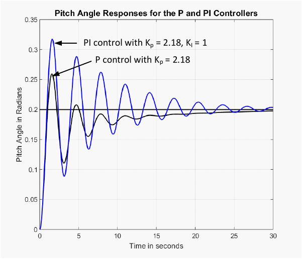

    :::
:::

---

::: {.compact-slide .dense-slide}

PI-D Control of Aircraft Pitch

$K_{D}$ was varied from 1 to 2 (with $\tau=0.05$). I chose $K_{D}=1.5$.

::: center

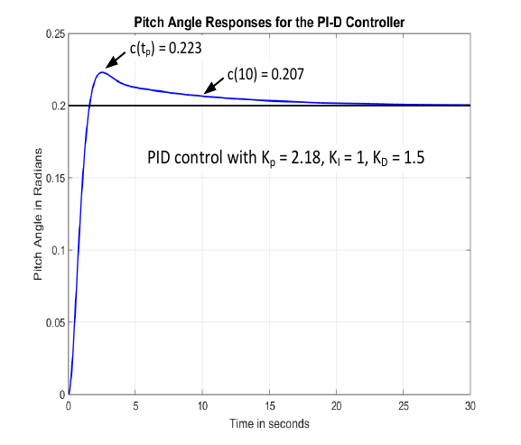

:::

-   $M_{p}=(0.223-0.2)/0.2=0.115$ or $11.5\%.$ (NOT the specified $10\%.$)

-   $c(10)=0.207$ or $(0.207-0.2)/0.2=0.035\,$which is $3.5\%$ of the final value.

    (NOT the specified $2\%.$)

-   The rise time is about $1.6$ seconds which is within the 2 second specification.
:::

---

::: {.compact-slide .expanded-body-slide .expanded-figure-slide}

PI-D Control of Aircraft Pitch

The corresponding elevator command $\delta_{c}$ does not saturate.

::: center

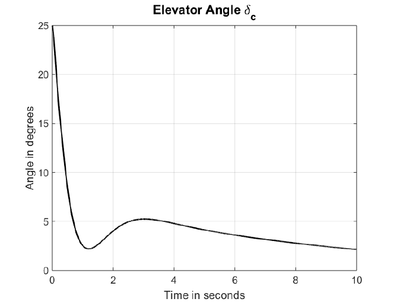

:::
:::

---

::: {.compact-slide .dense-slide}

Ramp Reference Input

-   $K_{p}\leq\delta_{\max}/R_{0}=2.18$ makes the specifications difficult to achieve.

-   The specs can be met by increasing the gains, but allowing saturation.

    However, if the pilot pitched up and then needed to immediately pitch down instead,

    the plane would not react to his new command until the actuator left saturation.

Use a ramp reference input (Specifications are easily met!).

$$
r(t)=\left\{
\begin{array}{rl}
(0.2/1.5)t, & \text{for }0\leq t\leq1.5\\
0.2, & \text{for }t>0.2
\end{array}
\right.
$$

Set $K_{P}=12,K_{I}=0.25,K_{D}=2.$

::: center

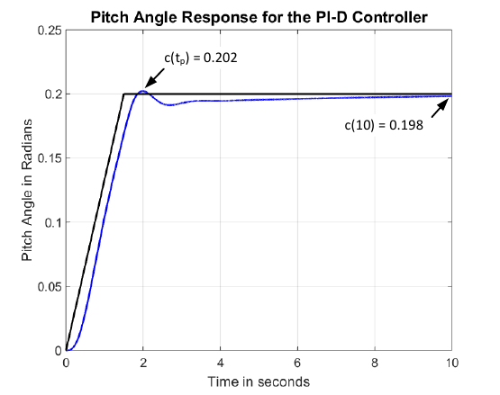

:::
:::

---

::: {.compact-slide .expanded-body-slide}

PI-D Control of Aircraft Pitch

Recall the closed-loop transfer function

$$
G_{CL}(s)=\frac{(K_{p}s+K_{I})(1.51s+0.1774)}{s^{4}+s^{3}(1.51K_{D}
+0.739)+s^{2}(1.51K_{p}+0.1774K_{D}+0.921)+s(0.1774K_{p}+1.51K_{I}
)+0.1774K_{I}}.
$$

Note that $G_{CL}(0)=1$ and so 

$$
\lim_{t\rightarrow\infty}c(t)=\lim_{s\rightarrow0}sC(s)=\lim_{s\rightarrow
0}sG_{CL}(s)\frac{0.2}{s}=0.2.
$$

With $K_{P}=12,K_{I}=0.25,K_{D}=2$ 

$$
\begin{aligned}
G_{CL}(s)  & =\frac{(12s+0.25)(1.51s+0.1774)}{s^{4}+3.759s^{3}+19.396s^{2}
+2.5063s+0.04435}\\
& \\
& =\frac{18.12(s+0.0208)(s+0.1175)}{(s^{2}+3.627s+18.92)(s+0.111)(s+0.0211)}.
\end{aligned}
$$
:::

---

::: {.compact-slide}

PI-D Control of Aircraft Pitch

$$
\begin{aligned}
G_{CL}(s)  & =\frac{(12s+0.25)(1.51s+0.1774)}{s^{4}+3.759s^{3}+19.396s^{2}
+2.5063s+0.04435}\\
& \\
& =\frac{18.12(s+0.0208)(s+0.1175)}{(s^{2}+3.627s+18.92)(s+0.111)(s+0.0211)}.
\end{aligned}
$$

**Observation**

The zeros at $-0.0208,-0.1175$ (essentially) cancel the poles at $-0.0211$ and $-0.111.$ 

$$
\begin{aligned}
c(t)=\mathcal{L}^{-1}\left\{  G_{CL}(s)\frac{0.2}{s}\right\}   & =0.2u_{s}
(t)+0.0029e^{-0.0211t}-0.0115e^{-0.111t}\\
& -0.191e^{-1.81t}\!\!\left(  \cos(3.95t)+0.460\sin
(3.95t)\right)
\end{aligned}
$$

The coefficients of $e^{-0.0211t}$ and $e^{-0.111t}$ are 20 times smaller the coefficient $e^{-1.81t}.$

Though $0.0029e^{-0.0211t},-0.0115e^{-0.111t}$ die out slowly, they have small values.

Maintaining $G_{CL}(0)=1$ a pretty good approximation is 

$$
G_{CL}(s)\approx\frac{18.92}{s^{2}+3.627s+18.92}.
$$
:::

---

::: {.compact-slide .expanded-body-slide .expanded-figure-slide}

PI-D Control of Aircraft Pitch

$$
G_{CL}(s)=\frac{18.12(s+0.0208)(s+0.1175)}{(s^{2}
+3.627s+18.92)(s+0.111)(s+0.0211)}\approx\frac{18.92}{(s^{2}+3.627s+18.92)}.
$$

::: center

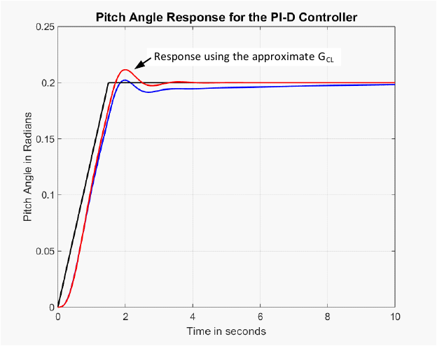

:::
:::

---

::: {.compact-slide .expanded-body-slide .expanded-figure-slide}

Pitch Control - Feedback and Parametric Uncertainty (Robustness)

The PI-D gains $K_{P},K_{I},K_{D}$ gains were set based on simulations using

$$
\frac{\theta(s)}{\delta(s)}=G(s)=\dfrac{1.51s+0.1774}{s^{3}+0.739s^{2}
+0.921s}.
$$

::: center

:::

Suppose the Pitch Model is actually closer to 

$$
G_{truth}(s)=\frac{\theta(s)}{\delta(s)}=\dfrac{s+0.12}{s^{3}+0.4s^{2}+s}.
$$

Will the response still meet specifications?
:::

---

::: {.compact-slide .dense-slide}

Pitch Control - Feedback and Parametric Uncertainty (Robustness)

$$
G(s)=\dfrac{1.51s+0.1774}{s^{3}+0.739s^{2}+0.921s}\text{ \ and \ }
G_{truth}(s)=\dfrac{s+0.12}{s^{3}+0.4s^{2}+s}.
$$

-   The PI-D gains $K_{P},K_{I},K_{D}$ gains were set based on simulations using $G(s).$

-   Response $c(t)$ using $G(s)$ and $G_{truth}(s)$ are shown.

    <figure>
    

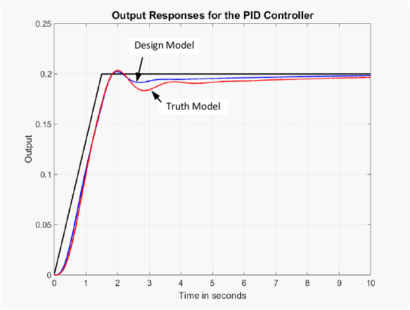

    </figure>

-   The two responses are **close** even though $G(s)$ & $G_{truth}(s)$ are quite different.

-   This is a **fundamental advantage** of using closed-loop feedback!
:::

---

::: {.compact-slide .expanded-body-slide .expanded-figure-slide}

Pitch Control - Feedback and Parametric Uncertainty (Robustness)

The corresponding elevator command angles are shown below.

::: center

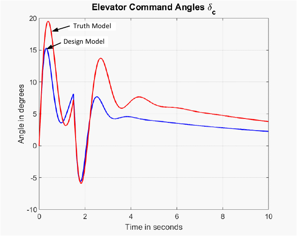

:::
:::
