::: {.contents-slide}
# Contents

- Output Pole Placement

- Two-Degree-of-Freedom Controllers

- Internal Stability

- Two-DOF Control of Aircraft Pitch
:::

---

::: {.compact-slide .expanded-body-slide}

Pole Placement

-   The internal model principle:

    -   For tracking $G_{c}(s)G(s)$ must contain the unstable poles of $R(s).$

    -   For disturbance rejection $G_{c}(s)$ must contain the unstable poles of $D(s).$

    -   In either case, the closed-loop system must be stable.

-   The hard part is how to design $G_{c}(s)$ to make the closed-loop system stable!

-   We now show how to find $G_{c}(s)$ to place the CLPs at any desired location.
:::

---

::: {.compact-slide .dense-slide}

Example

*Pole Placement for a Second-Order Control System*

::: center

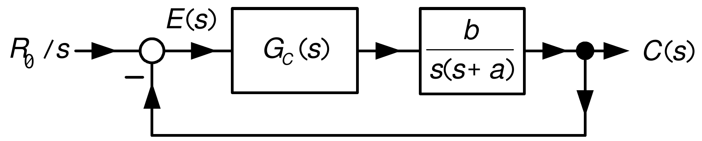

:::

Objective:  Track a step reference input.

The open-loop system is type 1.

$G_{c}(s)$ must make the closed-loop system stable.

Let $G_{c}(s)=\dfrac{b_{c}(s)}{a_{c}(s)}=\dfrac{b_{1}s+b_{0}}{s+a_{0}}.$

$$
\begin{aligned}
E(s)=\frac{1}{1+\dfrac{b_{1}s+b_{0}}{s+a_{0}}\dfrac{b}{s(s+a)}}\frac{R_{0}
}{s}  & =\frac{(s+a_{0})s(s+a)}{s(s+a)(s+a_{0})+(b_{1}s+b_{0})b}\frac{R_{0}
}{s}\\
& =\frac{(s+a_{0})(s+a)}{s^{3}+\underset{f_{2}}{\underbrace{(a+a_{0})}}
s^{2}+\underset{f_{1}}{\underbrace{(aa_{0}+bb_{1})}}s+\underset{f_{0}
}{\underbrace{bb_{0}}}}R_{0}.
\end{aligned}
$$

-   $s^{3}+f_{2}s^{2}+f_{1}s+f_{0}$ is the desired denominator of $E(s).$
:::

---

::: {.compact-slide .dense-slide .ch10-tight-slide}

Example

*Pole Placement for a Second-Order Control System*  **(continued)**

::: center

:::

Set $s^{3}+(a+a_{0})s^{2}+(aa_{0}+bb_{1})s+bb_{0}=s^{3}+f_{2}s^{2}
+f_{1}s+f_{0}.$

Equate powers of $s$:

$$
\begin{aligned}
bb_{0}  & =f_{0}\\
aa_{0}+bb_{1}  & =f_{1}\\
a+a_{0}  & =f_{2}
\end{aligned}
$$

or

$$
\begin{aligned}
b_{0}  & =f_{0}/b\\
a_{0}  & =f_{2}-a\\
b_{1}  & =\frac{f_{1}-aa_{0}}{b}=\frac{f_{1}-af_{2}+a^{2}}{b}.
\end{aligned}
$$
:::

---

::: {.compact-slide .dense-slide}

Example

*Pole Placement for a Second-Order Control System*  **(continued)**

::: center

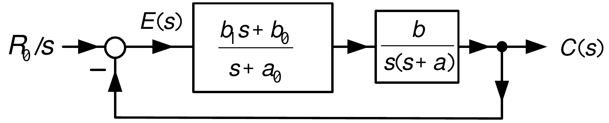

:::

To put the closed-loop poles at $-r_{1},-r_{2},-r_{3}$ set

$$
\begin{aligned}
s^{3}+f_{2}s^{2}+f_{1}s+f_{0}  & =(s+r_{1})(s+r_{2})(s+r_{3})\\
& \\
& =s^{3}+\underset{f_{2}}{\underbrace{(r_{1}+r_{2}+r_{3})}}s^{2}
+\underset{f_{1}}{\underbrace{(r_{1}r_{2}+r_{1}r_{3}+r_{2}r_{3})}
}s+\underset{f_{0}}{\underbrace{r_{1}r_{2}r_{3}}}.
\end{aligned}
$$

That is,

$$
\begin{aligned}
f_{2}  & =r_{1}+r_{2}+r_{3}\\
& \\
f_{1}  & =r_{1}r_{2}+r_{1}r_{3}+r_{2}r_{3}\\
& \\
f_{0}  & =r_{1}r_{2}r_{3}.
\end{aligned}
$$
:::

---

::: {.compact-slide .dense-slide .boundary-safe-slide}

Example

*Disturbance Rejection for a Second-Order Control System*

::: center

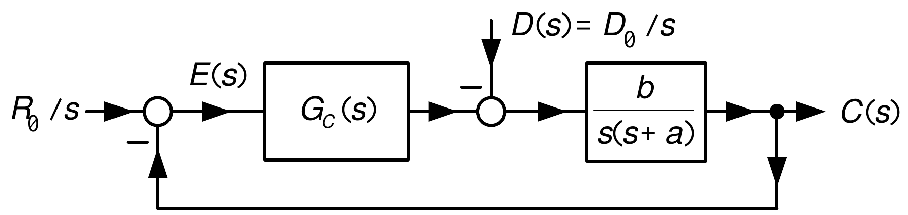

:::

Set $G_{c}(s)=\dfrac{b_{c}(s)}{a_{c}(s)}=\underset{\bar{G}_{c}
(s)}{\underbrace{\dfrac{b_{2}s^{2}+b_{1}s+b_{0}}{s+a_{0}}}}\dfrac{1}{s}.$

-   $G_{c}(s)$ must have the factor $1/s$ to satisfy the internal model principle.

-   The denominator of $\bar{G}_{c}(s)$ has degree one less than the denominator of $G(s).$

-   The numerator of $G_{c}(s)$ has the same degree as its denominator.

$$
\begin{aligned}
    E_{D}(s)=\frac{G(s)}{1+G_{c}(s)G(s)}\frac{D_{0}}{s}  & =\frac{\dfrac
    {b}{s(s+a)}}{1+\dfrac{b_{2}s^{2}+b_{1}s+b_{0}}{s+a_{0}}\dfrac{1}{s}\dfrac
    {b}{s(s+a)}}\frac{D_{0}}{s}\\
    & =\frac{s(s+a_{0})b}{s^{2}(s+a_{0})(s+a)+bb_{2}s^{2}+bb_{1}s+bb_{0}}
    \frac{D_{0}}{s}\\
    & =\frac{(s+a_{0})b}{s^{4}+(a+a_{0})s^{3}+(aa_{0}+bb_{2})s^{2}+bb_{1}s+bb_{0}
    }D_{0}.
    \end{aligned}
$$
:::

---

::: {.compact-slide .dense-slide}

Example

*Disturbance Rejection for a Second-Order Control System* **(continued)**

::: center

:::

-   $E_{D}(s)=\dfrac{(s+a_{0})b}{s^{4}+\underset{f_{3}}{\underbrace{(a+a_{0}
    )}}s^{3}+\underset{f_{2}}{\underbrace{(aa_{0}+bb_{2})}}s^{2}+\underset{f_{1}
    }{\underbrace{bb_{1}}}s+\underset{f_{0}}{\underbrace{bb_{0}}}}D_{0}.$

-   $s^{4}+f_{3}s^{3}+f_{2}s^{2}+f_{1}s+f_{0}$ is the desired denominator of $E_{D}(s).$

-   Solve $s^{4}+(a+a_{0})s^{3}+(aa_{0}+bb_{2})s^{2}+bb_{1}s+bb_{0}
    =s^{4}+f_{3}s^{3}+f_{2}s^{2}+f_{1}s+f_{0}$:

$$
\begin{aligned}
    b_{0}  & =f_{0}/b\\
    b_{1}  & =f_{1}/b\\
    a_{0}  & =f_{3}-a\\
    b_{2}  & =\frac{f_{2}-aa_{0}}{b}=\frac{f_{2}-af_{3}+a^{2}}{b}.
    \end{aligned}
$$
:::

---

::: {.compact-slide .dense-slide .ch10-tight-slide}

Example

*Tracking a Sinusoid*

$r(t)=R_{0}\sin(t)$ or $R(s)=\dfrac{R_{0}}{s^{2}+1}$.

::: center

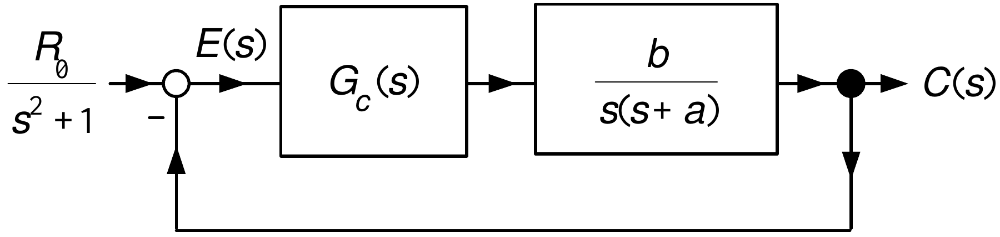

:::

$G_{c}(s)=\dfrac{b_{c}(s)}{a_{c}(s)}=\underset{\bar{G}_{c}
(s)}{\underbrace{\dfrac{b_{3}s^{3}+b_{2}s^{2}+b_{1}s+b_{0}}{s+a_{0}}}}
\dfrac{1}{s^{2}+1}.$

-   $G_{c}(s)$ must have factor $\dfrac{1}{s^{2}+1}$ to satisfy the internal model principle.

-   The denominator of $\bar{G}_{c}(s)$ has degree one less than the denominator of $G(s).$

-   The numerator of $G_{c}(s)$ has the same degree as its denominator.
:::

---

::: {.compact-slide .dense-slide .ch10-tight-slide}

Example

*Tracking a Sinusoid*  **(continued)**

::: center

:::

$$
\begin{aligned}
\!\!\!\!\!E(s)\!\!\!  & =\!\!\!\frac{1}{1+G_{c}(s)G(s)}R(s)\\
& \\
\!\!\!  & =\!\!\!\frac{1}{1+\dfrac{b_{3}s^{3}+b_{2}s^{2}+b_{1}s+b_{0}}
{s+a_{0}}\dfrac{1}{s^{2}+1}\dfrac{b}{s(s+a)}}\frac{R_{0}}{s^{2}+1}\\
& \\
\!\!\!  & =\!\!\!\frac{(s+a_{0})s(s+a)(s^{2}+1)}{(s+a_{0})s(s+a)(s^{2}
+1)+bb_{3}s^{3}+bb_{2}s^{2}+bb_{1}s+bb_{0}}\frac{R_{0}}{s^{2}+1}\\
& \\
\!\!\!  & =\!\!\!\frac{(s+a_{0})s(s+a)}{s^{5}+(a+a_{0})s^{4}+(aa_{0}
+bb_{3}+1)s^{3}+(a+a_{0}+bb_{2})s^{2}+(aa_{0}+bb_{1})s+bb_{0}}R_{0}.
\end{aligned}
$$

$s^{5}+f_{4}s^{4}+f_{3}s^{3}+f_{2}s^{2}+f_{1}s+f_{0}$ is the desired denominator of $E(s).$
:::

---

::: {.compact-slide .dense-slide .ch10-tight-slide}

Example

*Tracking a Sinusoid*  **(continued)**

::: center

:::

$$
\begin{aligned}
&
\!\!\!\!\!\!\!\!\!\!\!\!\!\!\!\!\!\!\!\!\!\!\!\!\!\!\!\!\!\!\!\!\!\!\!\!\!\!\!\!\!\!s^{5}
+(a+a_{0})s^{4}+(aa_{0}+bb_{3}+1)s^{3}+(a+a_{0}+bb_{2})s^{2}+(aa_{0}
+bb_{1})s+bb_{0}\\
& \\
& \quad\qquad\qquad=\quad s^{5}+f_{4}s^{4}+f_{3}s^{3}+f_{2}s^{2}+f_{1}s+f_{0}.
\end{aligned}
$$

This requires setting

$$
\begin{aligned}
b_{0}  & =\frac{f_{0}}{b}\\
a_{0}  & =f_{4}-a\\
b_{1}  & =\frac{f_{1}-aa_{0}}{b}=\frac{f_{1}-af_{4}+a^{2}}{b}\\
b_{2}  & =\frac{f_{2}-a-a_{0}}{b}=\frac{f_{2}-f_{4}}{b}\\
b_{3}  & =\frac{f_{3}-aa_{0}-1}{b}=\frac{f_{3}-af_{4}+a^{2}+1}{b}.
\end{aligned}
$$
:::

---

::: {.compact-slide .dense-slide}

Example

*Pole Placement*

::: center

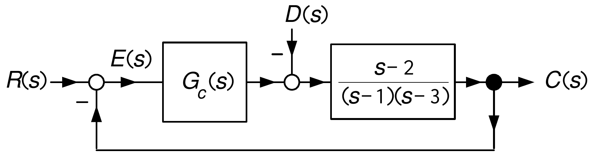

:::

$R(s)=\dfrac{R_{0}}{s},D(s)=\dfrac{D_{0}}{s}$  and $G_{c}(s)=\underset{\bar
{G}_{c}(s)}{\underbrace{\dfrac{b_{2}s^{2}+b_{1}s+b_{0}}{s+a_{0}}}}\dfrac{1}
{s}.$

-   $G_{c}(s)$ must have factor $\dfrac{1}{s}$ to satisfy the internal model principle.

-   The denominator of $\bar{G}_{c}(s)$ has degree one less than the denominator of $G(s).$

-   The numerator of $G_{c}(s)$ has the same degree as its denominator.

$$
\begin{aligned}
\!\!\!E_{R}(s)=\frac{1}{1+G_{c}(s)G(s)}R(s)  & =\!\!\!\frac{1}{1+\dfrac
{b_{2}s^{2}+b_{1}s+b_{0}}{s+a_{0}}\dfrac{1}{s}\dfrac{s-2}{(s-1)(s-3)}}
\frac{R_{0}}{s}\\
& \\
& =\!\!\!\frac{s(s+a_{0})(s-1)(s-3)}{s(s+a_{0})(s-1)(s-3)+(b_{2}s^{2}
+b_{1}s+b_{0})(s-2)}\frac{R_{0}}{s}.
\end{aligned}
$$
:::

---

::: {.compact-slide .dense-slide .boundary-safe-slide}

Example

*Pole Placement*  **(continued)**

::: center

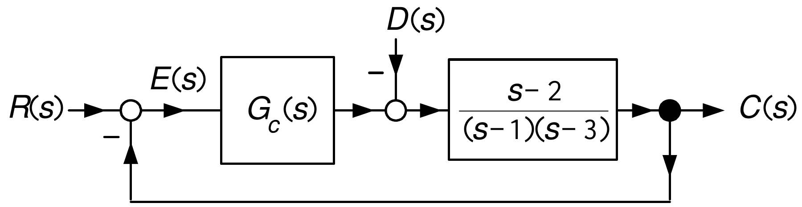

:::

$$
\begin{aligned}
E_{R}(s)  & =\frac{s(s+a_{0})(s-1)(s-3)}{s(s+a_{0})(s-1)(s-3)+(b_{2}
s^{2}+b_{1}s+b_{0})(s-2)}\frac{R_{0}}{s}\\
& \\
& =\frac{(s+a_{0})(s-1)(s-3)}{s^{4}+(b_{2}+a_{0}-4)s^{3}+(b_{1}-2b_{2}
-4a_{0}+3)s^{2}+(3a_{0}+b_{0}-2b_{1})s-2b_{0}}R_{0}.
\end{aligned}
$$

Set

$$
s^{4}+(b_{2}+a_{0}-4)s^{3}+(b_{1}-2b_{2}-4a_{0}+3)s^{2}+(3a_{0}+b_{0}
-2b_{1})s-2b_{0}=
$$

$\quad\quad\quad\!\!\!s^{4}+f_{3}s^{3}+f_{2}s^{2}+f_{1}s+f_{0}.$

In matrix form: $\left[
\begin{array}{c}
f_{3}\\
f_{2}\\
f_{1}\\
f_{0}
\end{array}
\right]  =\left[
\begin{array}{rrrr}
1 & 0 & 0 & 1\\
-2 & 1 & 0 & -4\\
0 & -2 & 1 & 3\\
0 & 0 & -2 & 0
\end{array}
\right]  \!\left[
\begin{array}{c}
b_{2}\\
b_{1}\\
b_{0}\\
a_{0}
\end{array}
\right]  +\left[
\begin{array}{r}
-4\\
3\\
0\\
0
\end{array}
\right]  .$
:::

---

::: {.compact-slide .dense-slide .boundary-safe-slide}

Example

*Pole Placement*  **(continued)**

::: center

:::

Solve to obtain

$$
\begin{aligned}
\left[
\begin{array}{c}
b_{2}\\
b_{1}\\
b_{0}\\
a_{0}
\end{array}
\right]   & =\left[
\begin{array}{rrrr}
1 & 0 & 0 & 1\\
-2 & 1 & 0 & -4\\
0 & -2 & 1 & 3\\
0 & 0 & -2 & 0
\end{array}
\right]  ^{-1}\left(  \left[
\begin{array}{c}
f_{3}\\
f_{2}\\
f_{1}\\
f_{0}
\end{array}
\right]  -\left[
\begin{array}{r}
-4\\
3\\
0\\
0
\end{array}
\right]  \right) \\
& =\left[
\begin{array}{rrrr}
5 & 2 & 1 & 1/2\\
-6 & -3 & -2 & -1\\
0 & 0 & 0 & -1/2\\
-4 & -2 & -1 & -1/2
\end{array}
\right]  \left(  \left[
\begin{array}{c}
f_{3}\\
f_{2}\\
f_{1}\\
f_{0}
\end{array}
\right]  -\left[
\begin{array}{r}
-4\\
3\\
0\\
0
\end{array}
\right]  \right) \\
& =\left[
\begin{array}{l}
f_{0}/2+f_{1}+2f_{2}+5f_{3}+14\\
-f_{0}-2f_{1}-3f_{2}-6f_{3}-15\\
-f_{0}/2\\
-f_{0}/2-f_{1}-2f_{2}-4f_{3}-10
\end{array}
\right]  .
\end{aligned}
$$
:::

---

::: {.compact-slide .dense-slide}

Example

*Pole Placement* **(continued)**

::: center

:::

To put the closed-loop poles at $-r_{1},-r_{2},-r_{3},-r_{4}$ we simply set

$$
\begin{aligned}
s^{4}+f_{3}s^{3}+f_{2}s^{2}+f_{1}s+f_{0}  & =(s+r_{1})(s+r_{2})(s+r_{3}
)(s+r_{4})\\
& \\
& =s^{4}+\underset{f_{3}}{\underbrace{(r_{1}+r_{2}+r_{3}+r_{4})}}s^{3}+\\
& \underset{f_{2}}{\underbrace{(r_{1}r_{2}+r_{1}r_{3}+r_{1}r_{4}+r_{2}
r_{3}+r_{2}r_{4}+r_{3}r_{4})}}s^{2}+\\
& \underset{f_{1}}{\underbrace{\left(  r_{1}r_{2}r_{3}+r_{1}r_{2}r_{4}
+r_{1}r_{3}r_{4}+r_{2}r_{3}r_{4}\right)  }}s+\underset{f_{0}
}{\underbrace{r_{1}r_{2}r_{3}r_{4}}}
\end{aligned}
$$
:::

---

::: {.compact-slide .dense-slide .multi-figure-slide .ch10-tight-slide}

Example

*Pole Placement* **(continued)**

::: center

:::

$\!\!\!\!\!\!$Closed-loop response $C_{R}(s)=\dfrac{G_{c}
(s)G(s)}{1+G_{c}(s)G(s)}R(s).$

Let $R(s)=1/s$ with the closed-loop poles placed at $-1.$

Too much overshoot in the step response!

::: center

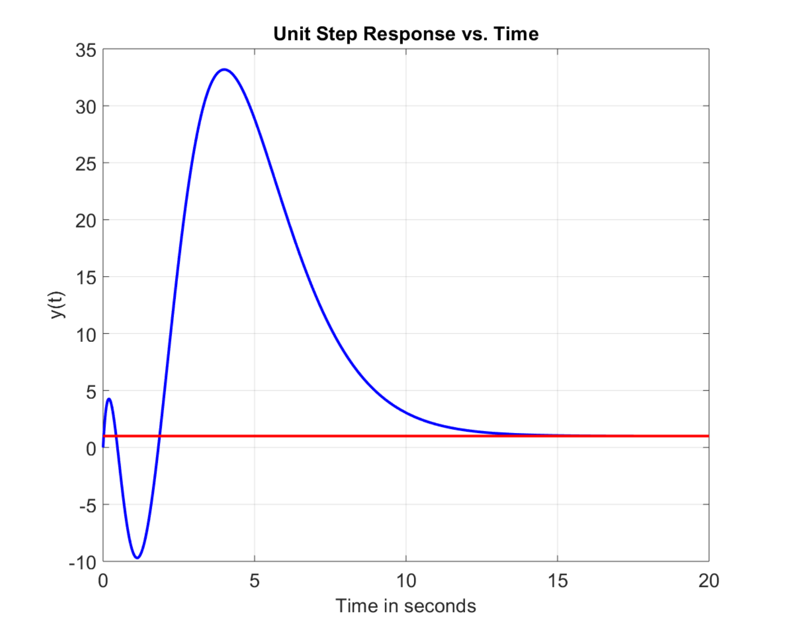

:::
:::

---

::: {.compact-slide .dense-slide}

Effect of the Initial Conditions on the Control Design

-   We have always taken the initial conditions to be zero!

-   What happens if they are not zero?

    Consider

$$
\ddot{y}-2\dot{y}+2y=\dot{u}-u
$$

where

$$
s^{2}Y(s)-sy(0)-\dot{y}(0)-2sY(s)+2y(0)+2Y(s)=sU(s)-u(0)-U(s)
$$

or

$$
Y(s)=\underset{G(s)}{\underbrace{\frac{s-1}{s^{2}-2s+2}}}U(s)+\frac
    {sy(0)+\dot{y}(0)-2y(0)-u(0)}{s^{2}-2s+2}.
$$

-   **Key observation**

    $G(s)$ and the initial condition term always have the *same* denominator.

    ::: center
    
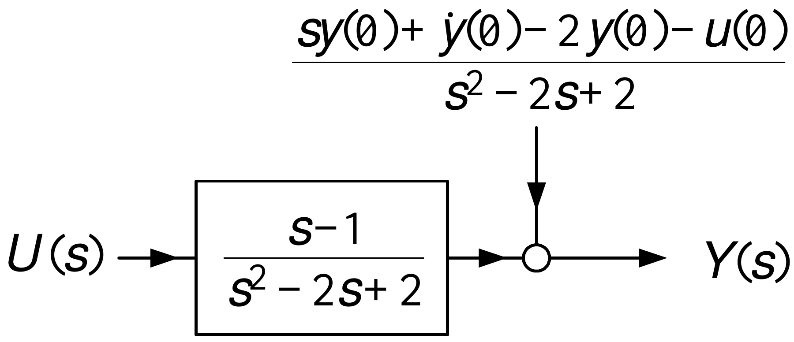

    :::
:::

---

::: {.compact-slide .dense-slide}

Effect of the Initial Conditions on the Control Design

::: center

:::

Let $G_{c}(s)=\dfrac{-2s+13}{s+7}$ to put all 3 closed-loop poles at $-1.$

$$
\begin{aligned}
Y(s)  & =G(s)U(s)+\frac{sy(0)+\dot{y}(0)-2y(0)-u(0)}{s^{2}-2s+2}\\
& \\
& =G(s)G_{c}(s)\!\left(  R(s)-Y(s)\right)  +\frac{sy(0)+\dot
{y}(0)-2y(0)-u(0)}{s^{2}-2s+2}
\end{aligned}
$$

$$
\begin{aligned}
& \Longrightarrow\left(  1+G(s)G_{c}(s)\right)
\!\!Y(s)=G(s)G_{c}(s)R(s)+\frac{sy(0)+\dot{y}(0)-2y(0)-u(0)}{s^{2}-2s+2}\\
& \\
& \Longrightarrow Y(s)=\frac{G(s)G_{c}(s)}{1+G(s)G_{c}(s)}
R(s)+\underset{Y_{IC}(s)}{\underbrace{\frac{1}{1+G(s)G_{c}(s)}\frac
{sy(0)+\dot{y}(0)-2y(0)-u(0)}{s^{2}-2s+2}}}.
\end{aligned}
$$
:::

---

::: {.compact-slide .dense-slide}

Effect of the Initial Conditions on the Control Design

::: center

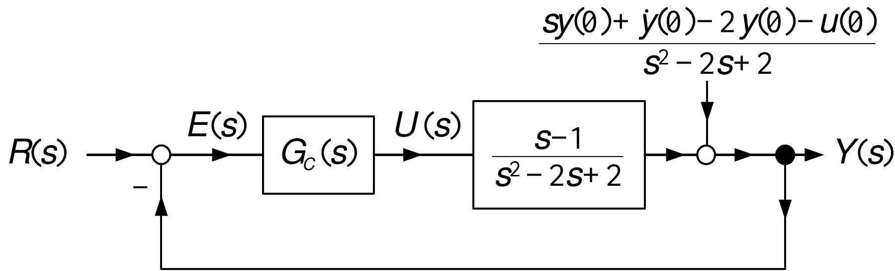

:::

As $G_{c}(s)=\dfrac{-2s+13}{s+7}$, the initial condition response $Y_{IC}(s)$ simplifies to

$$
\begin{aligned}
Y_{IC}(s)  & \triangleq\frac{1}{1+\dfrac{s-1}{s^{2}-2s+2}\dfrac{-2s+13}{s+7}
}\frac{sy(0)+\dot{y}(0)-2y(0)-u(0)}{s^{2}-2s+2}\\
& \\
& \\
& =\frac{(s^{2}-2s+2)(s+7)}{s^{3}+3s^{2}+3s+1}\frac{sy(0)+\dot{y}
(0)-2y(0)-u(0)}{s^{2}-2s+2}\\
& \\
& \\
& =\frac{(s+7)(sy(0)+\dot{y}(0)-2y(0)-u(0))}{(s+1)(s+1)(s+1)}.
\end{aligned}
$$
:::

---

::: {.compact-slide .dense-slide .ch10-tight-slide}

Effect of the Initial Conditions on the Control Design

::: center

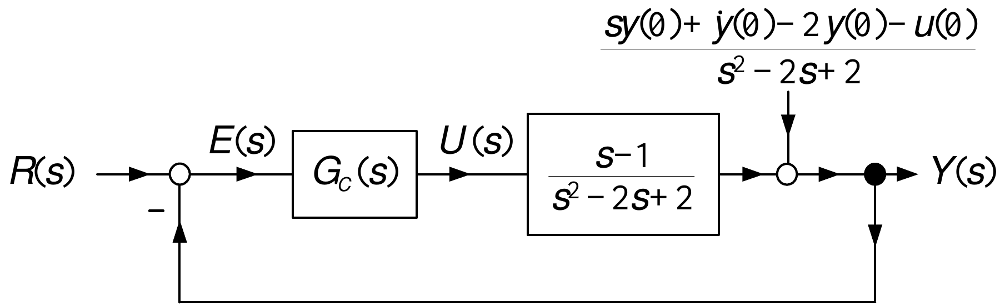

:::

$$
y_{IC}(t)=\mathcal{L}^{-1}\{Y_{IC}(s)\}=\mathcal{L}^{-1}\left\{  \frac{(s+7)(sy(0)+\dot{y}(0)-2y(0)-u(0))}{(s+1)(s+1)(s+1)}
\right\}  \rightarrow0.
$$

$$
\begin{aligned}
Y_{R}(s)=\underset{G_{CL}(s)}{\underbrace{\frac{G(s)G_{c}(s)}{1+G(s)G_{c}(s)}
}}R(s)  & =\frac{\dfrac{s-1}{s^{2}-2s+2}\dfrac{-2s+13}{s+7}}{1+\dfrac
{s-1}{s^{2}-2s+2}\dfrac{-2s+13}{s+7}}R(s)\\
& =\frac{(s-1)(-2s+13)}{s^{3}+3s^{2}+3s+1}R(s)\\
& =\frac{(s-1)(-2s+13)}{(s+1)(s+1)(s+1)}R(s)
\end{aligned}
$$

-   $Y_{IC}(s)$ and $Y_{R}(s)/R(s)=G_{CL}(s)$ always have the **same** denominator.

-   As long as the closed-loop system is stable, the initial condition response asymptotically goes to zero.
:::

---

::: {.compact-slide .dense-slide}

Example

*Inverted Pendulum*

-   The *center of mass* of the rod is at $(x+\ell\sin(\theta
    ),y)\approx(x+\ell\theta,y)$ for $\theta$ small.

    ::: center
    
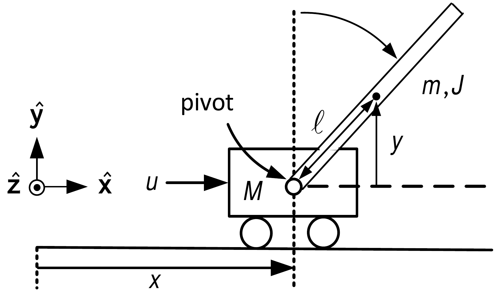

    :::

-   With an abuse of notation we also let $y\triangleq x+\left(  \ell
    +\dfrac{J}{m\ell}\right)  \theta.$

-   Then

$$
Y(s)=X(s)+\left(  \ell+\frac{J}{m\ell}\right)  \theta(s)=\text{ }
    \underset{G_{Y}(s)}{\underbrace{-\kappa\frac{mg\ell}{s^{2}(s^{2}-\alpha^{2})}
    }}U(s)+\frac{p_{Y}(s)}{s^{2}(s^{2}-\alpha^{2})}
$$

where

$$
\begin{aligned}
    p_{Y}(s)  & \triangleq(J/(m\ell)+\ell)s^{2}-\kappa g(m\ell)^{2})(s\theta
    (0)+\dot{\theta}(0))+(s^{2}-\alpha^{2})(sx(0)+\dot{x}(0)),\\
    \alpha^{2}  & =\frac{mg\ell(M+m)}{Mm\ell^{2}+J(M+m)},\\
    \kappa & =\frac{1}{Mm\ell^{2}+J(M+m)}.
    \end{aligned}
$$
:::

---

::: {.compact-slide .dense-slide}

Example

*Inverted Pendulum*  **(continued)**

::: center

:::

-   Stabilize $y\triangleq x+\left(  \ell+\dfrac{J}{m\ell}\right)
    \theta\rightarrow0.$

-   Find $G_{c}(s)=\dfrac{b_{c}(s)}{a_{c}(s)}$ so $U(s)=-G_{c}(s)Y(s)$ stabilizes the pendulum to $y=0$.

-   This *linear* model is only valid for $(x,\dot{x},\theta
    ,\dot{\theta})$ close to $(0,0,0,0).$

    $\qquad\Longrightarrow$ $\ \ (x(0),\dot{x}(0),\theta(0),\dot{\theta}(0))$ must be close to $(0,0,0,0)$.

-   With $U(s)=-G_{c}(s)Y(s)$ we have

$$
Y(s)=-G_{Y}(s)G_{c}(s)Y(s)+\frac{p(s)}{s^{2}(s^{2}-\alpha^{2})}.
$$
:::

---

::: {.compact-slide .dense-slide .ch10-ultra-tight-slide}

Example

*Inverted Pendulum*  **(continued)**

::: center

:::

Previous slide:

$$
Y(s)=-G_{Y}(s)G_{c}(s)Y(s)+\frac{p_{Y}(s)}{s^{2}(s^{2}-\alpha^{2})}.
$$

Solve for $Y(s)$ to obtain

$$
\begin{aligned}
Y(s)  & =\frac{1}{1+G_{Y}(s)G_{c}(s)}\frac{p_{Y}(s)}{s^{2}(s^{2}-\alpha^{2}
)}\\
& =\frac{1}{1+\dfrac{b_{3}s^{3}+b_{2}s^{2}+b_{1}s+b_{0}}{s^{3}+a_{2}
s^{2}+a_{1}s+a_{0}}\dfrac{-\kappa mg\ell}{s^{2}(s^{2}-\alpha^{2})}}\frac
{p_{Y}(s)}{s^{2}(s^{2}-\alpha^{2})}\\
& =\frac{(s^{3}+a_{2}s^{2}+a_{1}s+a_{0})p_{Y}(s)}{(s^{3}+a_{2}s^{2}
+a_{1}s+a_{0})s^{2}(s^{2}-\alpha^{2})+\left(  -\kappa mg\ell\right)
(b_{3}s^{3}+b_{2}s^{2}+b_{1}s+b_{0})}.
\end{aligned}
$$
:::

---

::: {.compact-slide .dense-slide}

Example

*Inverted Pendulum*  **(continued)**

Collecting terms in $s$ the denominator of $Y(s)$ is rewritten as

$$
\begin{aligned}
&
\!\!\!\!\!\!\!\!\!\!\!\!\!\!\!\!\!\!\!\!\!\!\!\!\!\!\!\!\!\!\!\!\!\!\!\!\!s^{7}
+a_{2}s^{6}+\left(  a_{1}-\alpha^{2}\right)  s^{5}+\left(  a_{0}-\alpha
^{2}a_{2}\right)  s^{4}+\left(  -a_{1}\alpha^{2}-\kappa mg\ell b_{3}\right)
s^{3}+\\
& \left(  -a_{0}\alpha^{2}-\kappa mg\ell b_{2}\right)  s^{2}-\kappa mg\ell
b_{1}s-\kappa mg\ell b_{0}
\end{aligned}
$$

Let the desired denominator polynomial of $Y(s)$ be

$$
s^{7}+f_{6}s^{6}+f_{5}s^{5}+f_{4}s^{4}+f_{3}s^{3}+f_{2}s^{2}+f_{1}s+f_{0}.
$$

Set

$$
\begin{aligned}
-\kappa mg\ell b_{0}  & =f_{0}\\
-\kappa mg\ell b_{1}  & =f_{1}\\
-a_{0}\alpha^{2}-\kappa mg\ell b_{2}  & =f_{2}\\
-a_{1}\alpha^{2}-\kappa mg\ell b_{3}  & =f_{3}\\
a_{0}-a_{2}\alpha^{2}  & =f_{4}\\
a_{1}-\alpha^{2}  & =f_{5}\\
a_{2}  & =f_{6}
\end{aligned}
$$
:::

---

::: {.compact-slide .dense-slide .boundary-safe-slide}

Example

*Inverted Pendulum*  **(continued)**

::: center

:::

In matrix form we have

$$
\left[
\begin{array}{ccccccc}
-\kappa mg\ell & 0 & 0 & 0 & 0 & 0 & 0\\
0 & -\kappa mg\ell & 0 & 0 & 0 & 0 & 0\\
0 & 0 & -\kappa mg\ell & 0 & -\alpha^{2} & 0 & 0\\
0 & 0 & 0 & -\kappa mg\ell & 0 & -\alpha^{2} & 0\\
0 & 0 & 0 & 0 & 1 & 0 & -\alpha^{2}\\
0 & 0 & 0 & 0 & 0 & 1 & 0\\
0 & 0 & 0 & 0 & 0 & 0 & 1
\end{array}
\right]  \left[
\begin{array}{c}
b_{0}\\
b_{1}\\
b_{2}\\
b_{3}\\
a_{0}\\
a_{1}\\
a_{2}
\end{array}
\right]  =\left[
\begin{array}{c}
f_{0}\\
f_{1}\\
f_{2}\\
f_{3}\\
f_{4}\\
f_{5}+\alpha^{2}\\
f_{6}
\end{array}
\right]  .
$$

This matrix is invertible so we can solve for $a_{0},a_{1},a_{2},b_{0}
,b_{1},b_{2},b_{3}.$
:::

---

::: {.compact-slide .dense-slide .boundary-safe-slide}

Example

*Inverted Pendulum*  **(continued)**

::: center

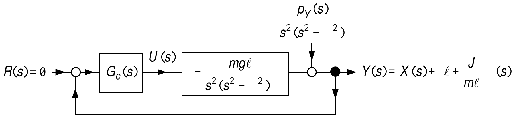

:::

[Quanser]{.smallcaps} inverted pendulum: $\kappa mg\ell=36.5705,\alpha^{2}=29.256$ so

$$
G_{Y}(s)=\frac{-36.5705}{s^{2}(s^{2}-29.256)}=\frac{-36.5705}{s^{2}
(s+5.4089)(s-5.4089)}.
$$

Choosing the seven closed-loop poles to be at $-5$ results in

$$
\begin{aligned}
G_{c}(s)  & =-\frac{1041.6s^{3}+6113.7s^{2}+2990.8s+2136.3}{s^{3}
+35s^{2}+554.3s+5399}\\
& \\
& =-\frac{1041.6(s+5.4088)(s^{2}+0.4308s+0.3792)}{(s+20.833)(s^{2}
+14.1672s+259.1533)}.
\end{aligned}
$$

-   This controller has small *stability margins* making it very *sensitve* to disturbances.

    -   Small disturbances can cause $\theta(t)$ to go far from $0.$

    -   $G_{Y}(s)$ is then no longer a valid approximation of the nonlinear IP model.

    -   $G_{c}(s)$ will not be able to bring $\theta(t)$ back to $0.$
:::

---

::: {.compact-slide .expanded-body-slide}

Example

::: center
Two Degrees of Freedom (2 DOF) Controllers
:::

-   A PI controller typically results in the closed-loop TF having a left half-plane zero.

-   Zeros can cause or increase the amount of overshoot.

-   A *two degrees of freedom* controller can often be used to eliminate overshoot.
:::

---

::: {.compact-slide .dense-slide .multi-figure-slide}

Two Degrees of Freedom Controllers

Consider the PID control system.

::: center

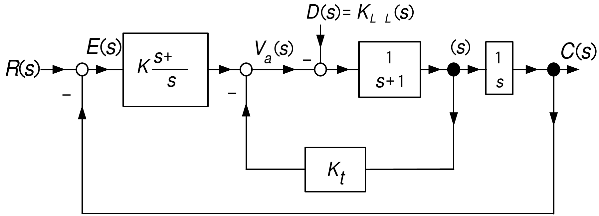

:::

Block diagram reduction:

::: center

:::
:::

---

::: {.compact-slide .dense-slide}

Two Degrees of Freedom Controllers

::: center

:::

-   Let's first look at making the closed-loop system stable.

$$
E_{R}(s)=\frac{1}{1+K\dfrac{s+\alpha}{s}\dfrac{1}{s+1+K_{t}}\dfrac{1}{s}
    }R(s)=\frac{s^{2}(s+1+K_{t})}{s^{3}+(1+K_{t})s^{2}+Ks+\alpha K}R(s)
$$

Choose the closed-loop poles to be $-r_{1},-r_{2},-r_{3}$  with  $r_{1}>0,r_{2}>0,r_{3}>0.$

$$
\begin{aligned}
    s^{3}+(1+K_{t})s^{2}+Ks+\alpha K\!\!\!  & =\!\!\!(s+r_{1})(s+r_{2})(s+r_{3})\\
    \!\!\!  & =\!\!\!s^{3}+(r_{1}+r_{2}+r_{3})s^{2}+(r_{1}r_{2}+r_{1}r_{3}
    +r_{2}r_{3})s+r_{1}r_{2}r_{3}.
    \end{aligned}
$$

$$
\Longrightarrow\quad{}K_{t}=r_{1}+r_{2}+r_{3}-1,\quad{}K=r_{1}
    r_{2}+r_{1}r_{3}+r_{2}r_{3},\text{ }\alpha=\frac{r_{1}r_{2}r_{3}}{K}
    =\frac{r_{1}r_{2}r_{3}}{r_{1}r_{2}+r_{1}r_{3}+r_{2}r_{3}}.
$$
:::

---

::: {.compact-slide}

Two Degrees of Freedom Controllers

::: center

:::

$$
\begin{aligned}
C_{R}(s)=\frac{K\dfrac{s+\alpha}{s}\dfrac{1}{s+1+K_{t}}\dfrac{1}{s}}
{1+K\dfrac{s+\alpha}{s}\dfrac{1}{s+1+K_{t}}\dfrac{1}{s}}\frac{R_{0}}{s}  &
=\frac{K(s+\alpha)}{s^{3}+(1+K_{t})s^{2}+Ks+\alpha K}\frac{R_{0}}{s}\\
& =\frac{K(s+\alpha)}{(s+r_{1})(s+r_{2})(s+r_{3})}\frac{R_{0}}{s}.
\end{aligned}
$$

$sC_{R}(s)$ is stable so by the FVT

$$
c_{R}(\infty)=\lim_{s\rightarrow0}sC_{R}(s)=\lim_{s\rightarrow0}
s\frac{K(s+\alpha)}{s^{3}+(1+K_{t})s^{2}+Ks+\alpha K}\frac{R_{0}}{s}=R_{0}.
$$

-   Problem:  $c_{R}(t)$ will exhibit *overshoot*.
:::

---

::: {.compact-slide .dense-slide .multi-figure-slide}

Two Degrees of Freedom Controllers

::: center

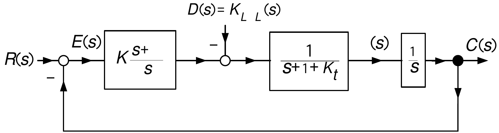

:::

$$
C_{R}(s)=\frac{K\dfrac{s+\alpha}{s}\dfrac{1}{s+1+K_{t}}\dfrac{1}{s}}
{1+K\dfrac{s+\alpha}{s}\dfrac{1}{s+1+K_{t}}\dfrac{1}{s}}\frac{R_{0}}{s}
=\frac{K(s+\alpha)}{(s+r_{1})(s+r_{2})(s+r_{3})}\frac{R_{0}}{s}.
$$

<figure>

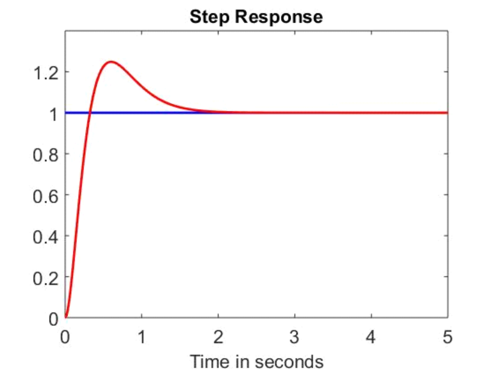

</figure>

-   With this control architecture, there will always be *overshoot* as we explain next.
:::

---

::: {.compact-slide .dense-slide}

Stable Type 2 Systems Have Overshoot

::: center

:::

-   $L(s)\triangleq K\dfrac{s+\alpha}{s}\dfrac{1}{s+1+K_{t}}\dfrac{1}{s}$  is a type 2 system.

-   The closed-loop system is $G_{CL}(s)=\dfrac{L(s)}{1+L(s)}$ is stable.

-   We chose the gains $\alpha,K,K_{t}$ to put the poles at $-r_{1}
    ,-r_{2},-r_{3}.$

**Theorem**  *Stable Type 2 Systems Have Overshoot*

The step response of any stable type 2 system has overshoot.

**Proof:**  See Appendix.
:::

---

::: {.compact-slide .ch10-tight-slide}

Stable Systems with Real Poles and No Zeros Do Not Have Overshoot

::: center

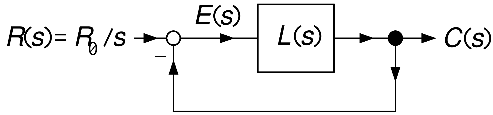

:::

**Theorem**  *Stable Systems with Real Poles and No Zeros Do Not Have Overshoot*

Let a system satisfy the following conditions:

\(1\) The closed-loop transfer function is *stable*.

\(2\) The closed-loop transfer function has *real* poles.

\(3\) The closed-loop transfer function has *no* zeros.

Then its step response has no overshoot.

**Proof:**  See Appendix.
:::

---

::: {.compact-slide .dense-slide}

Stable Systems with Real Poles and No Zeros Do Not Have Overshoot

$$
C_{R}(s)=\frac{K(s+\alpha)}{s^{3}+(1+K_{t})s^{2}+Ks+\alpha K}\frac{R_{0}}
{s}=\underset{\text{closed-loop transfer function}}{\underbrace{\frac
{K(s+\alpha)}{(s+r_{1})(s+r_{2})(s+r_{3})}}}\frac{R_{0}}{s}.
$$

The poles $-r_{1},-r_{2},-r_{3}$ are real and in the open LHP.

Need to get rid of the zero at $-\alpha$ where $\alpha=\dfrac{r_{1}r_{2}r_{3}
}{r_{1}r_{2}+r_{1}r_{3}+r_{2}r_{3}}.$

$\alpha>0$ so the transfer function $\dfrac{\alpha}{s+\alpha}$ is *stable*.

2 DOF controller:

::: center

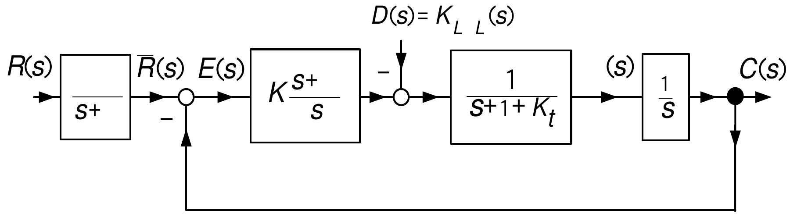

:::

$\dfrac{\alpha}{s+\alpha}$ is the *reference input filter*.

$$
C_{R}(s)=\frac{K\dfrac{s+\alpha}{s}\dfrac{1}{s+1+K_{t}}\dfrac{1}{s}}
{1+K\dfrac{s+\alpha}{s}\dfrac{1}{s+1+K_{t}}\dfrac{1}{s}}\frac{\alpha}
{s+\alpha}\frac{R_{0}}{s}=\frac{K(s+\alpha)}{s^{3}+(1+K_{t})s^{2}+Ks+\alpha
K}\frac{\alpha}{s+\alpha}\frac{R_{0}}{s}.
$$
:::

---

::: {.compact-slide .dense-slide .multi-figure-slide}

Stable Systems with Real Poles and No Zeros Do Not Have Overshoot

::: center

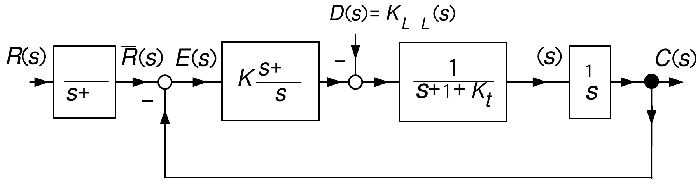

:::

-   $c_{R}(\infty)=\lim_{s\rightarrow0}sC_{R}(s)=\lim_{s\rightarrow
    0}\underset{\rightarrow1}{\underbrace{\dfrac{K(s+\alpha)}{s^{3}+(1+K_{t}
    )s^{2}+Ks+\alpha K}}}\underset{\rightarrow1}{\underbrace{\dfrac{\alpha
    }{s+\alpha}}}R_{0}=R_{0}.$

    <figure>
    

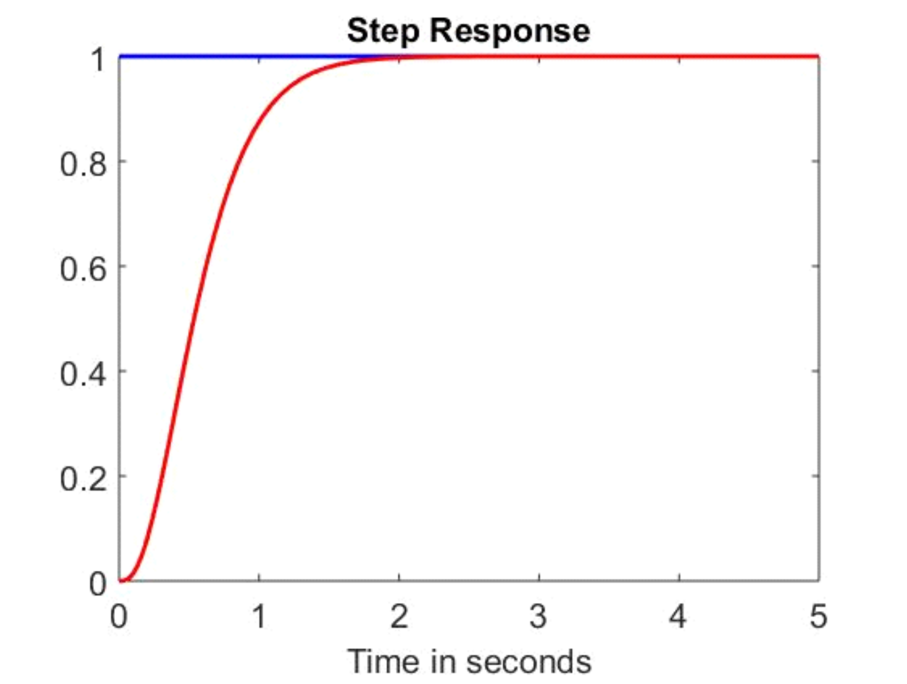

    </figure>
:::

---

::: {.compact-slide .dense-slide}

Right Half-Plane Zeros

**Example**  *Right Half-Plane Zero*

$R(s)=\dfrac{R_{0}}{s},G(s)=-\dfrac{s-1}{s(s+2)}$ and $G_{c}
(s)=\dfrac{b_{1}s+b_{0}}{s+a_{0}}.$

::: center

:::

$$
\begin{aligned}
E(s)=\frac{1}{1+G(s)G_{c}(s)}R(s)  & =\frac{1}{1-\dfrac{s-1}{s(s+2)}
\dfrac{b_{1}s+b_{0}}{s+a_{0}}}\frac{R_{0}}{s}\\
& =\frac{s(s+2)(s+a_{0})}{s(s+2)(s+a_{0})-(s-1)(b_{1}s+b_{0})}\frac{R_{0}}
{s}\\
& =\frac{s(s+2)(s+a_{0})}{s^{3}+(a_{0}-b_{1}+2)s^{2}+(2a_{0}-b_{0}
+b_{1})s+b_{0}}\frac{R_{0}}{s}\\
& =\frac{(s+2)(s+a_{0})}{s^{3}+(a_{0}-b_{1}+2)s^{2}+(2a_{0}-b_{0}
+b_{1})s+b_{0}}R_{0}.
\end{aligned}
$$
:::

---

::: {.compact-slide .dense-slide .boundary-safe-slide}

Example

*Right Half-Plane Zero* **(continued)**

$R(s)=\dfrac{R_{0}}{s},G_{c}(s)=\dfrac{b_{1}s+b_{0}}{s+a_{0}}.$

::: center

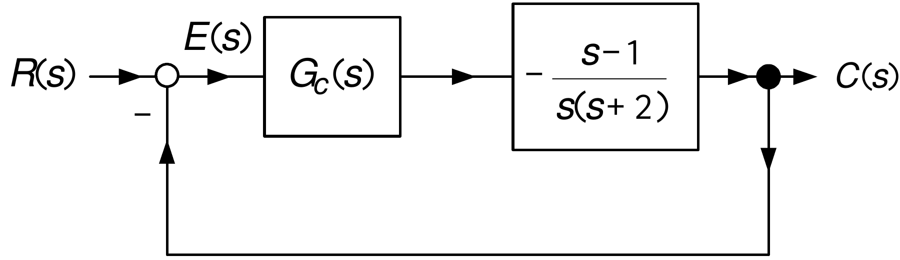

:::

$E(s)=\dfrac{(s+2)(s+a_{0})}{s^{3}+(a_{0}-b_{1}+2)s^{2}+(2a_{0}-b_{0}
+b_{1})s+b_{0}}R_{0}.$

Let the desired closed-loop poles be at $-r_{1},-r_{2},-r_{3}.$

$$
\begin{aligned}
&
\!\!\!\!\!\!\!\!\!\!\!\!\!\!\!\!\!\!\!\!\!\!\!\!\!\!\!\!\!\!\!\!\!\!\!\!\!\!\!\!\!\!\!\!\!\!s^{3}
+(a_{0}-b_{1}+2)s^{2}+(2a_{0}-b_{0}+b_{1})s+b_{0}\\
& =(s+r_{1})(s+r_{2})(s+r_{3})\\
& =s^{3}+(r_{1}+r_{2}+r_{3})s^{2}+(r_{1}r_{2}+r_{1}r_{3}+r_{2}r_{3}
)s+r_{1}r_{2}r_{3}.
\end{aligned}
$$

Solve:

$$
\begin{aligned}
a_{0}-b_{1}+2  & =r_{1}+r_{2}+r_{3}\\
2a_{0}+b_{1}-b_{0}  & =r_{1}r_{2}+r_{1}r_{3}+r_{2}r_{3}\\
b_{0}  & =r_{1}r_{2}r_{3}
\end{aligned}
$$
:::

---

::: {.compact-slide .dense-slide .ch10-tight-slide}

Example

*Right Half-Plane Zero* **(continued)**

$$
\begin{aligned}
b_{1}  & =\frac{-2(r_{1}+r_{2}+r_{3})+r_{1}r_{2}+r_{1}r_{3}+r_{2}r_{3}
+r_{1}r_{2}r_{3}+4}{3}\\
a_{0}  & =\frac{r_{1}+r_{2}+r_{3}+r_{1}r_{2}+r_{1}r_{3}+r_{2}r_{3}+r_{1}
r_{2}r_{3}-2}{3}\\
b_{0}  & =r_{1}r_{2}r_{3}.
\end{aligned}
$$

$$
C(s)=\frac{G(s)G_{c}(s)}{1+G(s)G_{c}(s)}R(s)=\frac{-\dfrac{s-1}{s(s+2)}
\dfrac{b_{1}s+b_{0}}{s+a_{0}}}{1-\dfrac{s-1}{s(s+2)}\dfrac{b_{1}s+b_{0}
}{s+a_{0}}}\frac{R_{0}}{s}=\frac{-(s-1)b_{1}(s+b_{0}/b_{1})}{(s+r_{1}
)(s+r_{2})(s+r_{3})}\frac{R_{0}}{s}.
$$

-   Suppose the zero at $-b_{0}/b_{1}$ is in the open LHP so that $\dfrac{b_{0}/b_{1}}{s+b_{0}/b_{1}}$ is a stable filter.

    Put $R(s)$ through this filter as shown.

::: center

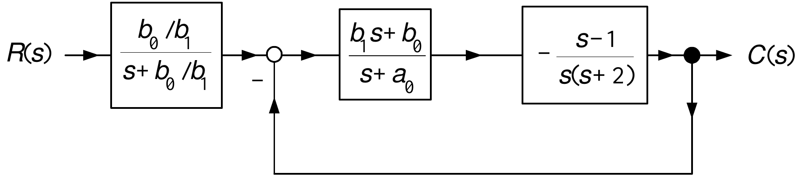

:::
:::

---

::: {.compact-slide .dense-slide .boundary-safe-slide .ch10-tight-slide}

Example

*Right Half-Plane Zero* **(continued)**

::: center

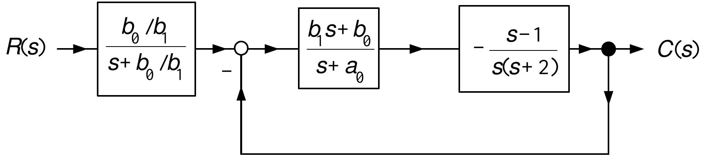

:::

$$
\begin{aligned}
\!\!\!\!\!C(s)  & =\!\!\!\!\frac{-\dfrac{s-1}{s(s+2)}\dfrac{b_{1}s+b_{0}
}{s+a_{0}}}{1-\dfrac{s-1}{s(s+2)}\dfrac{b_{1}s+b_{0}}{s+a_{0}}}\frac
{b_{0}/b_{1}}{s+b_{0}/b_{1}}R(s)\\
& \\
& =\!\!\!\!\frac{-(s-1)b_{1}(s+b_{0}/b_{1})}{s^{3}+(a_{0}-b_{1}+2)s^{2}
+(2a_{0}+b_{1}-b_{0})s+b_{0}}\frac{b_{0}/b_{1}}{s+b_{0}/b_{1}}\frac{R_{0}}
{s}\\
& \\
& =\!\!\!\!\underset{G_{CL}(s)}{\underbrace{-\frac{(s-1)b_{0}}{(s+r_{1}
)(s+r_{2})(s+r_{3})}}\frac{R_{0}}{s}}.
\end{aligned}
$$

-   $G_{CL}(s)$ is stable with all *real* poles and only one *right half-plane* zero.

-   A theorem guarantees the step response will not have overshoot.

-   However, recall that the system will have *undershoot*.
:::

---

::: {.compact-slide .dense-slide .boundary-safe-slide}

Example

*Two Right Half-Plane Zeros*

<figure>

</figure>

With $\dfrac{b_{2}s^{2}+b_{1}s+b_{0}}{s+a_{0}}\dfrac{1}{s}$ we previously showed that

$$
\begin{aligned}
C(s)  & =\frac{G_{c}(s)G(s)}{1+G_{c}(s)G(s)}R(s)\\
& =\frac{(b_{2}s^{2}+b_{1}s+b_{0})(s-2)}{s^{4}+(a_{0}+b_{2}-4)s^{3}
+(b_{1}-4a_{0}-2b_{2}+3)s^{2}+(3a_{0}+b_{0}-2b_{1})s-2b_{0}}\frac{R_{0}}{s}\\
& =\frac{(b_{2}s^{2}+b_{1}s+b_{0})(s-2)}{s^{4}+f_{3}s^{3}+f_{2}s^{2}
+f_{1}s+f_{0}}\frac{R_{0}}{s}.
\end{aligned}
$$

where

$$
\left[
\begin{array}{c}
b_{2}\\
b_{1}\\
b_{0}\\
a_{0}
\end{array}
\right]  =\left[
\begin{array}{l}
f_{0}/2+f_{1}+2f_{2}+5f_{3}+14\\
-f_{0}-2f_{1}-3f_{2}-6f_{3}-15\\
-f_{0}/2\\
-f_{0}/2-f_{1}-2f_{2}-4f_{3}-10
\end{array}
\right]  .
$$
:::

---

::: {.compact-slide .dense-slide .ch10-ultra-tight-slide}

Example

*Two Right Half-Plane Zeros* **(continued)**

<figure>

</figure>

$$
C(s)=\frac{(b_{2}s^{2}+b_{1}s+b_{0})(s-2)}{s^{4}+f_{3}s^{3}+f_{2}s^{2}
+f_{1}s+f_{0}}\frac{R_{0}}{s}=\frac{(b_{2}s^{2}+b_{1}s+b_{0})(s-2)}{(s+r)^{4}
}\frac{R_{0}}{s}
$$

where

$$
\begin{aligned}
f_{3}  & =r_{1}+r_{2}+r_{3}+r_{4}\\
f_{2}  & =r_{1}r_{2}+r_{1}r_{3}+r_{1}r_{4}+r_{2}r_{3}+r_{2}r_{4}+r_{3}r_{4}\\
f_{1}  & =r_{1}r_{2}r_{3}+r_{1}r_{2}r_{4}+r_{1}r_{3}r_{4}+r_{2}r_{3}r_{4}\\
f_{0}  & =r_{1}r_{2}r_{3}r_{4}
\end{aligned}
$$

and $r_{1}=r_{2}=r_{3}=r_{4}=r.$
:::

---

::: {.compact-slide .dense-slide .ch10-tight-slide}

Example

*Two Right Half-Plane Zeros* **(continued)**

<figure>

</figure>

$$
C(s)=\frac{(b_{2}s^{2}+b_{1}s+b_{0})(s-2)}{(s+r)^{4}}\frac{R_{0}}{s}.
$$

With $r=1$ it turns out that

$$
b_{2}=50.5,\quad{}b_{1}=-66,\quad{}b_{0}=-0.5.
$$

The zeros of the controller are the solutions to

$$
b_{2}s^{2}+b_{1}s+b_{0}=50.5s^{2}-66s-0.5=0
$$

or

$$
1.3145,\quad{}-0.0075.
$$

So

$$
C(s)=\frac{50.5(s-1.3145)(s+0.0075)(s-2)}{(s+1)^{4}}\frac{R_{0}}{s}.
$$
:::

---

::: {.compact-slide .dense-slide}

Example

*Two Right Half-Plane Zeros* **(continued)**

$$
C(s)=\frac{50.5(s-1.3145)(s+0.0075)(s-2)}{(s+1)^{4}}\frac{R_{0}}{s}.
$$

**Reference filter for the two RHP zeros:**

Two right half-plane zeros at $z_{1}=2$ and $z_{2}=1.3145.$  Form the polynomial

$$
\begin{aligned}
(s-z_{1})(s-z_{2})  & =(s-1.3145)(s-2)=s^{2}-3.3145s+\underset{\omega_{0}
^{2}}{\underbrace{2.629}}\\
& \Longrightarrow G_{fz_{1}z_{2}}=\left(  \frac{\omega_{0}}{s+\omega_{0}
}\right)  ^{2}\!\text{ where }\omega_{0}^{2}=2.629.
\end{aligned}
$$

**Reference filter for the one LHP zero:**

One left half-plane zero at $z_{3}=-0.0075.$ Set $\alpha=-z_{3}=0.0075.$

$$
G_{fz_{3}}=\frac{\alpha}{s+\alpha}=\frac{0.0075}{s+0.0075}.
$$

::: center

:::
:::

---

::: {.compact-slide .dense-slide .multi-figure-slide}

Example

*Two Right Half-Plane Zeros* **(continued)**

::: center

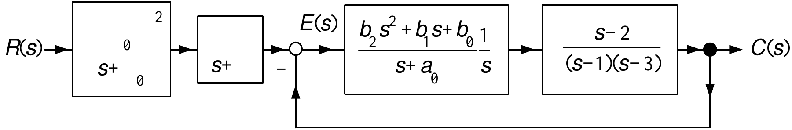

:::

Step response with closed-loop poles set at $-1$ and using an input reference filter.

<figure>

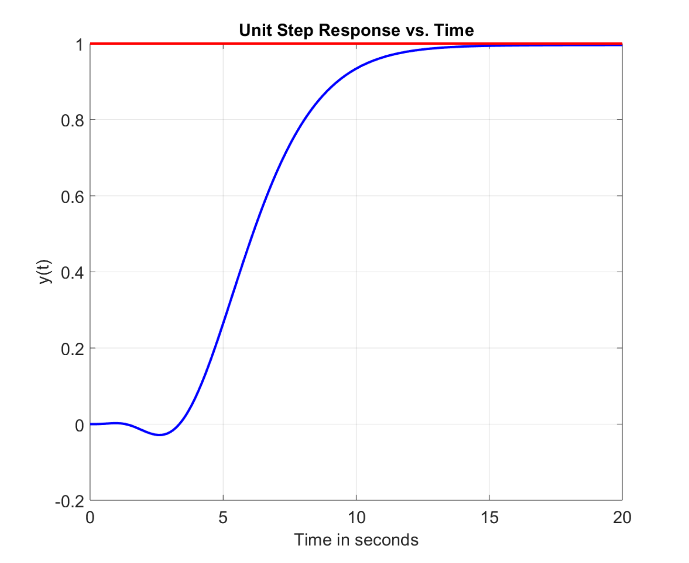

</figure>
:::

---

::: {.compact-slide .dense-slide .boundary-safe-slide}

Example

*Two Right Half-Plane Zeros* **(continued)**

::: center

:::

-   The transfer function $G(s)=\dfrac{s-2}{(s-1)(s-3)}$ is a toy example!

-   The poles and zeros of a physical system are never known exactly.

-   If the TF was really $G(s)=\dfrac{s-2}{(s-0.9)(s-3)}$ then, using the above controller,

    the closed-loop system would be **unstable**!

-   If small changes in the model result in the CL system being unstable,

    we say it is **not** robust.

-   When a system has poles in the **open** **right half-plane**,

    it may not be possible to find a robust controller!

-   **Nyquist theory** provides the insight into this problem.
:::

---

::: {.compact-slide .dense-slide .ch10-tight-slide}

Eliminating Overshoot with a 2 DOF Controller

::: center
:::

::: center

:::

Let $G_{c}(s)G(s)$ be at least type 1 and

$$
G_{CL}(s)=\frac{G_{c}(s)G(s)}{1+G_{c}(s)G(s)}=\frac{n(s)}{d(s)}\quad{}\text{stable with real poles}
$$

**(a)** **No right half-plane zeros**

-   $n(s)$ has all of its roots in the open left half-plane.

$$
G_{f}(s)\triangleq\frac{n(0)}{n(s)}.
$$

Then the inverse Laplace transform of

$$
C(s)=G_{f}(s)G_{CL}(s)\frac{R_{0}}{s}
$$

will *not* have overshoot and $c(\infty)=R_{0}$.
:::

---

::: {.compact-slide .dense-slide .ch10-tight-slide}

Eliminating Overshoot with a 2 DOF Controller

::: center
:::

::: center

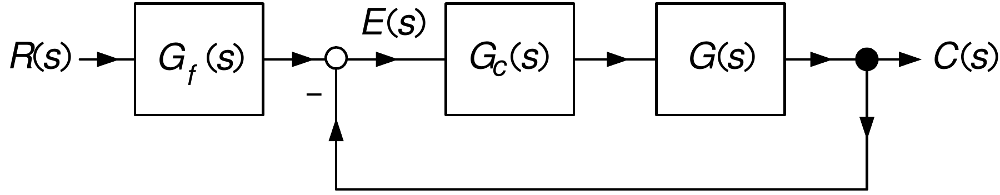

:::

Let $G_{c}(s)G(s)$ be at least type 1 and

$$
G_{CL}(s)=\frac{G_{c}(s)G(s)}{1+G_{c}(s)G(s)}=\frac{n(s)}{d(s)}\quad{}\text{stable with real poles}
$$

**(b) One right half-plane zero**

-   $n(s)=\bar{n}(s)(s-z).$

-   $\bar{n}(s)$ has all its roots in the open left half-plane.

-   $z>0$.

$$
G_{f}(s)\triangleq\frac{\bar{n}(0)}{\bar{n}(s)}.
$$

Then the inverse Laplace transform of

$$
C(s)=G_{f}(s)G_{CL}(s)\frac{R_{0}}{s}
$$

will *not* have overshoot and $c(\infty)=R_{0}$ (It will have undershoot).
:::

---

::: {.compact-slide .dense-slide .boundary-safe-slide}

Eliminating Overshoot with a 2 DOF Controller

::: center
:::

::: center

:::

Let $G_{c}(s)G(s)$ be at least type 1 and

$$
G_{CL}(s)=\frac{G_{c}(s)G(s)}{1+G_{c}(s)G(s)}=\frac{n(s)}{d(s)}\quad{}\text{stable with real poles}
$$

**(c)** **Two right half-plane zeros**

-   $n(s)=\bar{n}(s)(s-z_{1})(s-z_{2})=\bar{n}(s)(s^{2}-(z_{1}+z_{2}
    )s+z_{1}z_{2}).$

-   $\bar{n}(s)$ has all of its roots in the open left half-plane.

-   $\operatorname{Re}\{z_{1}\}>0,\operatorname{Re}\{z_{2}\}>0$ and $\omega_{0}\triangleq\sqrt{z_{1}z_{2}}.$

$$
G_{f}(s)\triangleq\frac{\bar{n}(0)}{\bar{n}(s)}\left(  \frac{\omega_{0}
    }{s+\omega_{0}}\right)  ^{2}.
$$

Then the inverse Laplace transform of

$$
C(s)=G_{f}(s)G_{CL}(s)\frac{R_{0}}{s}
$$

will *not* have overshoot and $c(\infty)=R_{0}$.
:::

---

::: {.compact-slide .dense-slide .ch10-ultra-tight-slide}

Definition

::: center
Internal Stability
:::

::: center

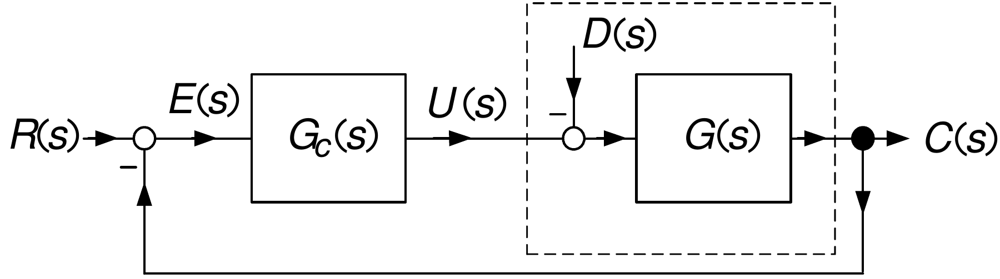

:::

Two external inputs: $R(s)$ and $D(s)$.

We are interested in the responses $E(s),U(s),C(s).$

$$
\begin{aligned}
E(s)  & =\frac{1}{1+G_{c}(s)G(s)}R(s)+\frac{G(s)}{1+G_{c}(s)G(s)}D(s)\\
C(s)  & =\frac{G_{c}(s)G(s)}{1+G_{c}(s)G(s)}R(s)-\frac{G(s)}{1+G_{c}
(s)G(s)}D(s)\\
U(s)  & =\frac{G_{c}(s)}{1+G_{c}(s)G(s)}R(s)+\frac{G_{c}(s)G(s)}
{1+G_{c}(s)G(s)}D(s).
\end{aligned}
$$

*Internal Stability*

The system is said to be *internally stable* if these six transfer functions are stable.
:::

---

::: {.compact-slide .dense-slide}

Closed-Loop Characteristic Polynomial

$$
\begin{aligned}
E(s)  & =\frac{1}{1+G_{c}(s)G(s)}R(s)+\frac{G(s)}{1+G_{c}(s)G(s)}D(s)\\
C(s)  & =\frac{G_{c}(s)G(s)}{1+G_{c}(s)G(s)}R(s)-\frac{G(s)}{1+G_{c}
(s)G(s)}D(s)\\
U(s)  & =\frac{G_{c}(s)}{1+G_{c}(s)G(s)}R(s)+\frac{G_{c}(s)G(s)}
{1+G_{c}(s)G(s)}D(s).
\end{aligned}
$$

$G(s)=\dfrac{b(s)}{a(s)}$ is strictly proper$,$  $G_{c}(s)=\dfrac{b_{c}
(s)}{a_{c}(s)}$ is proper.

$$
\begin{aligned}
E(s)  & =\frac{a_{c}(s)a(s)}{a_{c}(s)a(s)+b_{c}(s)b(s)}R(s)+\frac
{a_{c}(s)b(s)}{a_{c}(s)a(s)+b_{c}(s)b(s)}D(s)\\
& \\
C(s)  & =\frac{b_{c}(s)b(s)}{a_{c}(s)a(s)+b_{c}(s)b(s)}R(s)-\frac
{a_{c}(s)b(s)}{a_{c}(s)a(s)+b_{c}(s)b(s)}D(s)\\
& \\
U(s)  & =\frac{a(s)b_{c}(s)}{a_{c}(s)a(s)+b_{c}(s)b(s)}R(s)+\frac
{b_{c}(s)b(s)}{a_{c}(s)a(s)+b_{c}(s)b(s)}D(s).
\end{aligned}
$$

-   The *closed-loop characteristic polynomial* is $a_{CL}(s)\triangleq
    a_{c}(s)a(s)+b_{c}(s)b(s)$.

-   The six transfer functions are stable iff $a_{CL}(s)\neq0$ for $\operatorname{Re}\{s\}\geq0.$
:::

---

::: {.compact-slide .expanded-body-slide}

Polynomials

**Definition**  *Coprime Polynomials*

$a(s),b(s)$ are *coprime* if there is no $s_{0}$ such that $a(s_{0}
)=b(s_{0})=0.$

**Example** $a(s)=(s+1)(s-1)$  and $b(s)=s-1$

Not coprime as $a(1)=b(1)=0.$

They both have the factor $s-1.$

**Example  **$a(s)=(s+1)(s^{2}+1)$ and$\ b(s)=s-1.$

$a(s)$ and $b(s)$ are coprime as $b(s)=0$ only if $s=1$ and $a(1)\neq
0.$

$a(s)$ and $b(s)$ do *not* have a factor in common.

-   $a(s)$ and $b(s)$ are coprime if and only if they do *not* have a common factor.
:::

---

::: {.compact-slide .expanded-body-slide .ch10-tight-slide}

Definition

*Coprime Transfer Functions*

A transfer function $G(s)=\dfrac{b(s)}{a(s)}$ is *coprime* if $a(s)$ and $b(s)$ are coprime.

-   We will always assume $G(s)$ and $G_{c}(s)$ are each coprime transfer functions.

**Remark**  Suppose the transfer function of a physical system is

$$
G(s)=\frac{s+3}{s(s+1)(s+2)}.
$$

There is no sense in writing this as

$$
G(s)=\frac{(s+3)(s+4)}{s(s+1)(s+2)(s+4)}
$$

Similarly for $G_{c}(s)$.
:::

---

::: {.compact-slide .dense-slide .ch10-tight-slide}

Unstable Pole-Zero Cancellation

$$
\begin{aligned}
E(s)  & =\frac{a_{c}(s)a(s)}{a_{c}(s)a(s)+b_{c}(s)b(s)}R(s)+\frac
{a_{c}(s)b(s)}{a_{c}(s)a(s)+b_{c}(s)b(s)}D(s)\\
& \\
C(s)  & =\frac{b_{c}(s)b(s)}{a_{c}(s)a(s)+b_{c}(s)b(s)}R(s)-\frac
{a_{c}(s)b(s)}{a_{c}(s)a(s)+b_{c}(s)b(s)}D(s)\\
& \\
U(s)  & =\frac{a(s)b_{c}(s)}{a_{c}(s)a(s)+b_{c}(s)b(s)}R(s)+\frac
{b_{c}(s)b(s)}{a_{c}(s)a(s)+b_{c}(s)b(s)}D(s).
\end{aligned}
$$

All six transfer functions of the control system are stable if

$$
a_{c}(s)a(s)+b_{c}(s)b(s)\neq0\qquad{}\text{for}\qquad{}\operatorname{Re}\{s\}\geq0.
$$

-   However, this can be tricky!

-   Don't just look at the denominator of one of the six transfer functions.

-   The problem is pole-zero cancellation between $G(s)$ and $G_{c}(s).$
:::

---

::: {.compact-slide .dense-slide .ch10-tight-slide}

Example

*Unstable Pole-Zero Cancellation  *

::: center

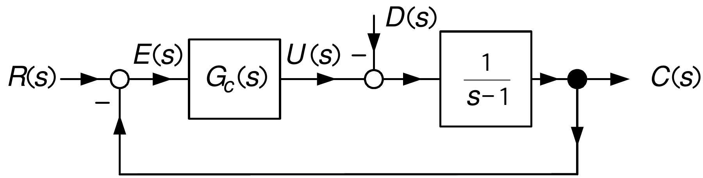

:::

$E(s)=\dfrac{1}{1+G_{c}(s)G(s)}R(s)+\dfrac{G(s)}{1+G_{c}(s)G(s)}D(s).$

Let $G_{c}(s)=\dfrac{b_{c}(s)}{a_{c}(s)}=\dfrac{s-1}{s(s+1)}.$

$$
\begin{aligned}
E_{R}(s)  & =\frac{1}{1+\dfrac{s-1}{s(s+1)}\dfrac{1}{s-1}}R(s)\\
& \\
& =\frac{s(s+1)(s-1)}{s(s+1)(s-1)+(s-1)}R(s)\\
& \\
& =\frac{s(s+1)(s-1)}{(s^{2}+s+1)(s-1)}R(s)\\
& \\
& =\frac{s(s+1)}{s^{2}+s+1}R(s).
\end{aligned}
$$
:::

---

::: {.compact-slide .dense-slide}

Example

*Unstable Pole-Zero Cancellation* **(continued)*** *

::: center

:::

$G_{c}(s)=\dfrac{s-1}{s(s+1)},G(s)=\dfrac{1}{s-1}$  and

$$
a_{c}(s)a(s)+b_{c}(s)b(s)=s(s+1)(s-1)+(s-1)=(s^{2}+s+1)(s-1)
$$

From the previous slide:

$$
E_{R}(s)=\frac{1}{1+\underset{G_{c}(s)}{\underbrace{\dfrac{s-1}{s(s+1)}}
}\underset{G(s)}{\underbrace{\dfrac{1}{s-1}}}}R(s)=\frac{s(s+1)(s-1)}
{(s^{2}+s+1)(s-1)}\frac{R_{0}}{s}=\frac{s+1}{s^{2}+s+1}R_{0}
$$

-   The transfer function $\dfrac{E_{R}(s)}{R(s)}=\dfrac{s(s+1)}{s^{2}+s+1}$ is stable *after* the cancellation.

-   Note this was an *unstable *pole-zero cancellation.

-   Such *unstable* pole-zero cancellations will *not* work in physical systems.
:::

---

::: {.compact-slide .dense-slide}

Example

*Unstable Pole-Zero Cancellation* **(continued)*** *

::: center

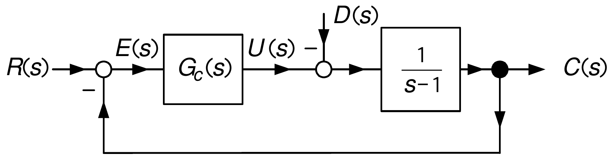

:::

$$
\!\!\!\!\!E_{D}(s)=\frac{\dfrac{1}{s-1}}{1+\dfrac{s-1}{s(s+1)}\dfrac{1}{s-1}
}D(s)=\frac{s(s+1)}{s(s+1)(s-1)+(s-1)}\frac{D_{0}}{s}=\frac{s(s+1)}
{(s^{2}+s+1)(s-1)}\frac{D_{0}}{s}.
$$

-   The TF $\dfrac{E_{D}(s)}{D(s)}=\dfrac{s(s+1)}{(s^{2}+s+1)(s-1)}$ is *unstable* due to the pole at $s=1.$

-   This results in $|e_{D}(t)|\rightarrow\infty.$

-   This system is *not* internally stable.

-   $\dfrac{E_{R}(s)}{R(s)}$ is stable (due to unstable pole-zero cancellation), but $\dfrac{E_{D}(s)}{D(s)}$ is *not* stable.
:::

---

::: {.compact-slide .dense-slide .ch10-tight-slide}

Example

*Unstable Pole-Zero Cancellation*

::: center

:::

Let $G_{c}(s)=\dfrac{s-1}{s(s+1)}$.  Even with $D(s)=0$ this controller will not work.

Any model is an *approximation* of the physical system.

Though we write $G(s)\triangleq\dfrac{1}{s-1}$ it is really $G(s)\triangleq
\dfrac{1}{s-p}$ where $p\approx1.$

$$
E_{R}(s)=\frac{1}{1+\dfrac{s-1}{s(s+1)}\dfrac{1}{s-p}}R(s)=\frac{s(s+1)\left(
s-p\right)  }{s^{3}+(1-p)s^{2}+(1-p)s-1}\frac{R_{0}}{s}.
$$

-   For $p\neq1$ there is no cancellation!

-   $s^{3}+(1-p)s^{2}+(1-p)s-1$ is unstable for all $p$!

-   $\left.  s^{3}+(1-p)s^{2}+(1-p)s-1\right\vert _{p=1}=(s^{2}
    +s+1)(s-1)$

$\qquad\blacktriangleright$  Only if $p$ is *exactly* $1$ is there cancellation.  This won't happen!
:::

---

::: {.compact-slide .dense-slide}

Example

*Unstable Pole-Zero Cancellation*

::: center

:::

$G_{c}(s)=\dfrac{K}{s-1}$ and suppose we have (unrealistic) exact cancellation.

$$
\begin{aligned}
E(s)  & =\frac{1}{1+\dfrac{K}{s-1}\dfrac{s-1}{s(s+1)}}R(s)+\frac{\dfrac
{s-1}{s(s+1)}}{1+\dfrac{K}{s-1}\dfrac{s-1}{s(s+1)}}D(s)\\
& \\
& =\frac{s(s+1)(s-1)}{(s^{2}+s+K)(s-1)}\frac{R_{0}}{s}+\frac{(s-1)^{2}}
{(s^{2}+s+K)(s-1)}\frac{D_{0}}{s}\\
& \\
& =\frac{s+1}{s^{2}+s+K}R_{0}+\frac{s-1}{s^{2}+s+K}\frac{D_{0}}{s}.
\end{aligned}
$$

With this " perfect" unstable pole-zero cancellation and $K>0,$ $sE(s)$ is stable.

$\Longrightarrow$ $e(\infty)=-\dfrac{D_{0}}{K}.$  Won't work! (See next slide.)
:::

---

::: {.compact-slide .dense-slide}

Example

*Unstable Pole-Zero Cancellation*  **(continued)**

::: center

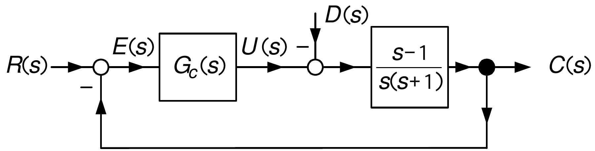

:::

$G_{c}(s)=\dfrac{K}{s-1}.$

$$
\begin{aligned}
U(s)  & =\frac{G_{c}(s)}{1+G_{c}(s)G(s)}R(s)+\frac{G_{c}(s)G(s)}
{1+G_{c}(s)G(s)}D(s)\\
& =\frac{\dfrac{K}{s-1}}{1+\dfrac{K}{s-1}\dfrac{s-1}{s(s+1)}}R(s)+\frac
{\dfrac{K}{s-1}\dfrac{s-1}{s(s+1)}}{1+\dfrac{K}{s-1}\dfrac{s-1}{s(s+1)}}D(s)\\
& =\frac{s(s+1)K}{(s^{2}+s+K)(s-1)}\frac{R_{0}}{s}+\frac{K}{s^{2}+s+K}
\frac{D_{0}}{s}.
\end{aligned}
$$

-   $R(s)=R_{0}/s$ will cause the input $u(t)$ to the physical system to be unbounded.

-   Even with perfect (impossible) pole-zero cancellation, $G_{c}
    (s)=\dfrac{K}{s-1}$ is not viable.
:::

---

::: {.compact-slide .ch10-ultra-tight-slide}

Example

*Unstable Pole-Zero Cancellation*

::: center

:::

*More Realistic View*

In reality $G(s)=\dfrac{b(s)}{a(s)}=\dfrac{s-z}{s(s+1)}$ with $z\approx1,$ but $z\neq1.$

$$
E_{R}(s)=\frac{1}{1+\dfrac{1}{s-1}\dfrac{s-z}{s(s+1)}}R(s)=\frac
{s(s+1)(s-1)}{s^{3}-z}R_{0}
$$

-   Only if $z=1$ does $s^{3}-z$ equal $(s-1)(s^{2}+s+1)$.
:::

---

::: {.compact-slide .dense-slide .boundary-safe-slide .ch10-ultra-tight-slide}

Pole–Zero Cancellation Between $G_{CL}(s)$ and $R(s),D(s)$

$G_{CL}(s)$** and** $R(s),D(s)$

-   Unstable pole-zero cancellation between $G(s)$ and $G_{c}(s)$ never works.

-   We do unstable pole-zero cancellations between $G_{CL}(s)=\dfrac
    {G_{c}(s)G(s)}{1+G_{c}(s)G(s)}$ and $R(s),D(s)!$

    ::: center
    
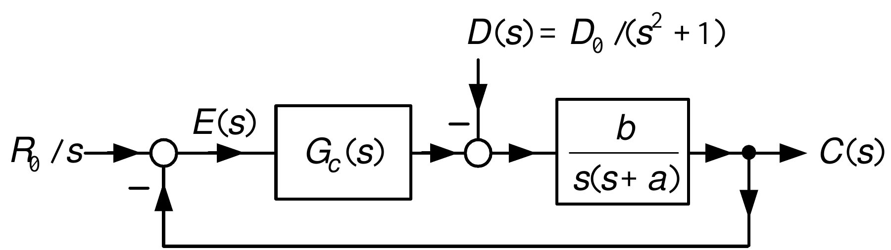

    :::

$$
\begin{aligned}
    \!\!\!\!\!\!\!\!\!\!\!\!\!\!E_{D}(s)  & =\!\!\!\frac{G(s)}{1+G_{c}
    (s)G(s)}D(s)=\frac{\dfrac{b}{s(s+a)}}{1+\underset{G_{c}(s)}{\underbrace{\dfrac
    {b_{3}s^{3}+b_{2}s^{2}+b_{1}s+b_{0}}{s+a_{0}}\dfrac{1}{s^{2}+1}}}\dfrac
    {b}{s(s+a)}}\frac{D_{0}}{s^{2}+1}\\
    & \\
    \!\!\!\!\!\!\!\!\!\!\!\!\!\!  & =\!\!\!\underset{G_{CL}(s)}{\underbrace{\frac
    {(s+a_{0})(s^{2}+1)b}{s^{5}+(a+a_{0})s^{4}+(aa_{0}+bb_{3}+1)s^{3}
    +(a+a_{0}+bb_{2})s^{2}+(aa_{0}+bb_{1})s+bb_{0}}}}\frac{D_{0}}{s^{2}+1}\\
    & \\
    \!\!\!\!\!\!\!\!\!\!\!\!\!\!  & =\!\!\!\frac{(s+a_{0})b}{s^{5}+f_{4}
    s^{4}+f_{3}s^{3}+f_{2}s^{2}+f_{1}s+f_{0}}D_{0}.
    \end{aligned}
$$
:::

---

::: {.compact-slide .dense-slide .ch10-tight-slide}

Pole–Zero Cancellation Between $G_{CL}(s)$ and $R(s),D(s)$

$G_{CL}(s)$** and** $R(s)$** &** $D(s)$

$$
\begin{aligned}
\!\!\!\!\!E_{D}(s)  & =\underset{G_{CL}(s)}{\underbrace{\frac{(s+a_{0}
)(s^{2}+1)b}{s^{5}+(a+a_{0})s^{4}+(aa_{0}+bb_{3}+1)s^{3}+(a+a_{0}+bb_{2}
)s^{2}+(aa_{0}+bb_{1})s+bb_{0}}}}\frac{D_{0}}{s^{2}+1}\\
& \\
& =\frac{(s+a_{0})b}{s^{5}+f_{4}s^{4}+f_{3}s^{3}+f_{2}s^{2}+f_{1}s+f_{0}}
D_{0}.
\end{aligned}
$$

Cancelled the $1/(s^{2}+1)$ of $D(s)$ with the $s^{2}+1$ in the numerator of $E_{D}(s)/D(s)=G_{CL}(s).$

Now suppose the disturbance is really

$$
D(s)=\frac{D_{0}}{s^{2}+1+\epsilon}.
$$

Then

$$
\begin{aligned}
E_{D}(s)  & =\frac{(s+a_{0})(s^{2}+1)b}{s^{5}+f_{4}s^{4}+f_{3}s^{3}+f_{2}
s^{2}+f_{1}s+f_{0}}\frac{D_{0}}{s^{2}+1+\epsilon}\\
& =\frac{(s+a_{0})(s^{2}+1+\epsilon-\epsilon)b}{s^{5}+f_{4}s^{4}+f_{3}
s^{3}+f_{2}s^{2}+f_{1}s+f_{0}}\frac{D_{0}}{s^{2}+1+\epsilon}\\
& =\frac{(s+a_{0})b}{s^{5}+f_{4}s^{4}+f_{3}s^{3}+f_{2}s^{2}+f_{1}s+f_{0}}
D_{0}-\underset{H(s)}{\underbrace{\frac{(s+a_{0})b}{s^{5}+f_{4}s^{4}
+f_{3}s^{3}+f_{2}s^{2}+f_{1}s+f_{0}}}}\frac{\epsilon D_{0}}{s^{2}+1+\epsilon}.
\end{aligned}
$$
:::

---

::: {.compact-slide .ch10-ultra-tight-slide}

Pole–Zero Cancellation Between $G_{CL}(s)$ and $R(s),D(s)$

$G_{CL}(s)$** and** $R(s),D(s)$

$$
E_{D}(s)=\frac{(s+a_{0})b}{s^{5}+f_{4}s^{4}+f_{3}s^{3}+f_{2}s^{2}+f_{1}
s+f_{0}}D_{0}-\underset{H(s)}{\underbrace{\frac{(s+a_{0})b}{s^{5}+f_{4}
s^{4}+f_{3}s^{3}+f_{2}s^{2}+f_{1}s+f_{0}}}}\frac{\epsilon D_{0}}
{s^{2}+1+\epsilon}.
$$

As $H(s)$ is stable

$$
e_{D}(t)\rightarrow-\epsilon D_{0}|H(j\sqrt{1+\epsilon})|\sin\!\left(
(\sqrt{1+\epsilon})t+
\angle H(j\sqrt{1+\epsilon})\right)  \!.
$$

-   The error $e_{D}(t)\nrightarrow0$, but does remain *bounded* and small (assuming $\epsilon$ is small).

-   The six closed-loop system transfer functions are stable with closed-loop characteristic polynomial

$$
\begin{aligned}
    & \!\!\!\!\!\!\!\!\!\!\!\!\!\!\!\!\!\!\!\!s^{5}+(a+a_{0})s^{4}+(aa_{0}
    +bb_{3}+1)s^{3}+(a+a_{0}+bb_{2})s^{2}+(aa_{0}+bb_{1})s+bb_{0}\\
    & \\
    & =s^{5}+f_{4}s^{4}+f_{3}s^{3}+f_{2}s^{2}+f_{1}s+f_{0}
    \end{aligned}
$$
:::

---

::: {.compact-slide .dense-slide .boundary-safe-slide}

Pole–Zero Cancellation Between $G_{CL}(s)$ and $R(s),D(s)$

$G_{CL}(s)$** and** $R(s),D(s)$

-   No physical system can handle unbounded reference or disturbance inputs.

    We take them to be bounded in applications.

-   Bounded disturbances $D(s)$ have simple poles on the $j\omega$ axis.

    E.g., $D(s)=D_{0}/s,D(s)=D_{0}/(s^{2}+\omega^{2}).$

-   An inexact cancellation between $\dfrac{E_{D}(s)}{D(s)}=\dfrac
    {G(s)}{1+G_{c}(s)G(s)}$ and $D(s)$

    still results in a bounded error signal.

-   Bounded reference inputs also have simple poles on the $j\omega$ axis.

    E.g., $R(s)=R_{0}/s,R(s)=R_{0}/(s^{2}+\omega^{2}).$

-   An inexact cancellation between $\dfrac{E_{R}(s)}{R(s)}=\dfrac
    {1}{1+G_{c}(s)G(s)}$ and $R(s)$

    results in bounded error signal.

**Remark**  Ramp reference inputs are unbounded, i.e., $R(s)=\omega
_{0}/s^{2}$ or $r(t)=tu_{s}(t).$

In any application the ramp will only be applied for a finite time. For example

$$
r(t)=\left\{
\begin{array}{ll}
\omega_{0}t, & 0\leq t\leq\theta_{0}/\omega_{0},\\
\theta_{0}, & \theta_{0}/\omega_{0}<t.
\end{array}
\right.
$$

This is a bounded reference signal.
:::

---

::: {.compact-slide .dense-slide}

Control of Aircraft Pitch - 2 DOF Approach

$$
\frac{\theta(s)}{\delta(s)}=G(s)=\dfrac{1.51s+0.1774}{s^{3}+0.739s^{2}
+0.921s}.
$$

::: center

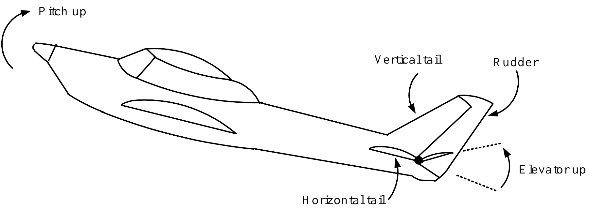

:::

**Reference Step Input**: $r(t)=0.2u_{s}(t)$ radians ($11$ degrees) to pitch up.

**Actuator Constraint:** Elevator deflection is restricted to $-25^{\circ}\leq\delta\leq25^{\circ}.$

**Design Specifications:**

\(1\) Overshoot less than 10%.

\(2\) Rise time less than 2 seconds.

\(3\) Settling time less than 10 seconds.

\(4\) Steady-state error less than 2%.

**Disturbances** due to wind gusts are modeled as an equivalent input to the elevator.
:::

---

::: {.compact-slide .dense-slide}

Control of Aircraft Pitch - 2 DOF Approach

::: center

:::

$$
\frac{\theta(s)}{\delta(s)}=G(s)=\dfrac{1.51s+0.1774}{s^{3}+0.739s^{2}
+0.921s}\qquad{}\text{and}\qquad{}G_{c}(s)=\dfrac{b_{3}s^{3}+b_{2}s^{2}+b_{1}s+b_{0}
}{s^{2}+a_{1}s+a_{0}}\dfrac{1}{s}.
$$

$$
\begin{aligned}
\frac{C(s)}{R(s)}\!\!\!\!\!  & =\!\!\!\!\!\!\frac{\dfrac{b_{3}s^{3}+b_{2}
s^{2}+b_{1}s+b_{0}}{s^{2}+a_{1}s+a_{0}}\dfrac{1}{s}\dfrac{1.51s+0.1774}
{s^{3}+0.739s^{2}+0.921s}}{1+\dfrac{b_{3}s^{3}+b_{2}s^{2}+b_{1}s+b_{0}}
{s^{2}+a_{1}s+a_{0}}\dfrac{1}{s}\dfrac{1.51s+0.1774}{s^{3}+0.739s^{2}+0.921s}
}\\
& \\
\!\!\!\!\!  & =\!\!\!\!\!\!\!\frac{(b_{2}s^{2}+b_{1}s+b_{0})(1.51s+0.1774)}
{s(s^{2}+a_{1}s+a_{0})(s^{3}+0.739s^{2}+0.921s)+(b_{3}s^{3}+b_{2}s^{2}
+b_{1}s+b_{0})(1.51s+0.1774)}\\
& \\
\!\!\!\!\!  & =\!\!\!\!\!\!\frac{(b_{2}s^{2}+b_{1}s+b_{0})(1.51s+0.1774)}
{a_{CL}(s)}
\end{aligned}
$$
:::

---

::: {.compact-slide .dense-slide .boundary-safe-slide .ch10-ultra-tight-slide}

Control of Aircraft Pitch - 2 DOF Approach

::: center

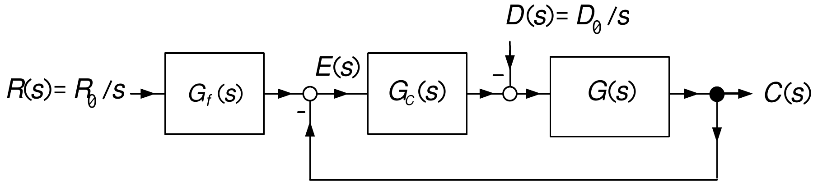

:::

$$
\begin{aligned}
\frac{C(s)}{R(s)}  & =\frac{(b_{2}s^{2}+b_{1}s+b_{0})(1.51s+0.1774)}
{a_{CL}(s)}\\
a_{CL}(s)\!\!\!  & =\!\!\!s^{6}+(a_{1}+\!0.739)s^{5}+(a_{0}+\!0.739a_{1}
+\!1.51b_{3}+\!0.921)s^{4}+\\
& \!\!(0.739a_{0}+\!0.921a_{1}+\!1.51b_{2}+\!0.1774b_{3})s^{3}\!+(0.921a_{0}
+1.51b_{1}+0.1774b_{2})s^{2}+\\
& (1.51b_{0}+0.1774b_{1})s+0.1774b_{0}.\\
a_{CL}(s)  & =s^{6}+f_{5}s^{5}+f_{4}s^{4}+f_{3}s^{3}+f_{2}s^{2}+f_{1}s+f_{0}
\end{aligned}
$$

$$
\left[
\begin{array}{c}
f_{5}\\
f_{4}\\
f_{3}\\
f_{2}\\
f_{1}\\
f_{0}
\end{array}
\right]  =\left[
\begin{array}{cccccc}
0 & 0 & 0 & 0 & 1 & 0\\
1.51 & 0 & 0 & 0 & 0.739 & 1\\
0.1774 & 1.51 & 0 & 0 & 0.921 & 0.739\\
0 & 0.1774 & 1.51 & 0 & 0 & 0.921\\
0 & 0 & 0.1774 & 1.51 & 0 & 0\\
0 & 0 & 0 & 0.1774 & 0 & 0
\end{array}
\right]  \left[
\begin{array}{c}
b_{3}\\
b_{2}\\
b_{1}\\
b_{0}\\
a_{1}\\
a_{0}
\end{array}
\right]  +\left[
\begin{array}{c}
0.739\\
0.921\\
0\\
0\\
0\\
0
\end{array}
\right]
$$
:::

---

::: {.compact-slide .dense-slide .boundary-safe-slide .ch10-ultra-tight-slide}

Control of Aircraft Pitch - 2 DOF Approach

How do we choose $a_{CL}(s)=s^{6}+f_{5}s^{5}+f_{4}s^{4}+f_{3}s^{3}+f_{2}
s^{2}+f_{1}s+f_{0}?$

$$
\left[
\begin{array}{c}
b_{3}\\
b_{2}\\
b_{1}\\
b_{0}\\
a_{1}\\
a_{0}
\end{array}
\right]  \!\!=\!\!\left[  \!\!
\begin{array}{cccccc}
0 & 0 & 0 & 0 & 1 & 0\\
1.51 & 0 & 0 & 0 & 0.739 & 1\\
0.1774 & 1.51 & 0 & 0 & 0.921 & 0.739\\
0 & 0.1774 & 1.51 & 0 & 0 & 0.921\\
0 & 0 & 0.1774 & 1.51 & 0 & 0\\
0 & 0 & 0 & 0.1774 & 0 & 0
\end{array}
\!\!\right]  ^{-1}\!\!\left(  \!\!\left[
\begin{array}{c}
f_{5}\\
f_{4}\\
f_{3}\\
f_{2}\\
f_{1}\\
f_{0}
\end{array}
\right]  \!\!-\!\!\left[
\begin{array}{c}
0.739\\
0.921\\
0\\
0\\
0\\
0
\end{array}
\right]  \!\!\right)
$$

**Important Comments on Pole Placement**

-   The choice of location for the closed-loop poles is crucial for good performance.

-   Want the closed-loop poles far in the left half-plane for a fast response.

-   The zeros of the controller *cannot* be chosen.

-   If possible, avoid controllers with zeros in the right half-plane (undershoot).

-   Zeros in the LHP can be eliminated by $G_{f}(s).$

-   Do not saturate the actuator.

Typically not any easy task to choose the location of the closed-loop poles.
:::

---

::: {.compact-slide .dense-slide .boundary-safe-slide}

Control of Aircraft Pitch - 2 DOF Approach

-   Put one of the closed-loop poles at $-0.1774/1.51=-0.1175$

    to cancel the zero of $G(s)$ at this location.

-   Then $a_{CL}(s)$ has the form

$$
a_{CL}(s)=(s+0.1175)(s+r)(s^{2}+2\zeta_{1}\omega_{n1}s+\omega_{n1}^{2}
    )(s^{2}+2\zeta_{2}\omega_{n2}s+\omega_{n2}^{2}).
$$

-   The " tuning" process now consists of varying $r,\zeta_{1},\omega_{n1},\zeta_{2},\omega_{n2}.$

-   After each choice check if the zeros of $G_{c}(s)$ are in the open LHP.

    -   If not, then a new set of values for $r,\zeta_{1},\omega_{n1},\zeta
        _{2},\omega_{n2}$ are chosen.

-   With the zeros of $G_{c}(s)$ in the open LHP check:

    -   If the specifications are met.

    -   If the actuator does not saturate.

-   Tried choosing all the CLP to be real and negative.

    -   Kept resulting in zeros of $G_{c}(s)$ in the open *right-half* plane.

-   After quite a bit of trial and error $a_{CL}(s)$ was chosen to be

$$
a_{CL}(s)=(s+0.1175)(s+1.6)(s^{2}+5s+25)(s^{2}+5s+25).
$$
:::

---

::: {.compact-slide .dense-slide}

Control of Aircraft Pitch - 2 DOF Approach

::: center

:::

$$
\begin{aligned}
G_{c}(s)  & =\frac{54.34s^{3}+238.4s^{2}+678.8s+662.3}{s^{2}+10.98s+1.28}
\frac{1}{s}\\
& \\
& =\frac{54.34(s+1.49)(s-[-1.45+j2.47])(s-[-1.45-j2.47])}{(s+0.1175)(s+10.86)}
\frac{1}{s}.
\end{aligned}
$$

-   The zeros of $G_{c}(s)$ are all in the open *left-half* plane.

-   $G_{c}(s)$ has one pole at $-0.1175$ to cancel the zero of $G(s)$ at $-0.1175.$

-   $G_{f}(s)\triangleq\dfrac{b_{0}}{b_{3}s^{3}+b_{2}s^{2}+b_{1}s+b_{0}
    }=\dfrac{662.3}{54.34s^{3}+238.4s^{2}+678.8s+662.3}$
:::

---

::: {.compact-slide .expanded-body-slide .expanded-figure-slide}

Control of Aircraft Pitch - 2 DOF Approach

::: center

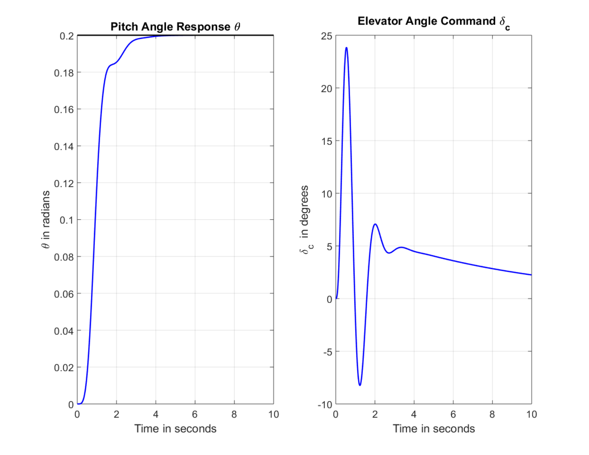

:::

-   The rise time is about $1.5$ seconds.

-   The overshoot is zero.

-   The $2\%$ settling time is $3.1$ seconds with zero steady-state error.
:::
