::: {.contents-slide}
# Contents

- Bode Diagrams

- Nyquist Theory

- Relative Stability: Gain and Phase Margins

- Closed-Loop Bandwidth

- Lead and Lag Compensation
:::

---

::: {.compact-slide .expanded-body-slide .expanded-short-slide}

Bode Diagrams

Write the transfer function of some system in polar coordinate form, i.e., as

$$G(j\omega )=|G(j\omega )|e^{j\angle G(j\omega )}.$$

The **Bode Diagram** is a plot of

$$20\log _{10}|G(j\omega )|\;\text{versus}\;\log _{10}\omega$$

along with a plot of 

$$\angle G(j\omega )\;\text{versus}\;\log _{10}\omega .$$

-   The units of $20\log _{10}|G(j\omega )|$ are decibels (dB).

-   The units of $\angle G(j\omega )$ are degrees.
:::

---

::: {.compact-slide .expanded-body-slide}

<strong>Example</strong> <em> First-Order System</em>

$$G(j\omega )=\frac{1}{\tau j\omega +1},\;\left\vert G(j\omega
)\right\vert =\left\vert \frac{1}{\tau j\omega +1}\right\vert =\frac{1}{\sqrt{(\tau \omega )^{2}+1}}.$$

**Bode Magnitude Plot**

$$\begin{array}{|l|l|l|}
\hline
\omega  & \log _{10}(\omega ) & 20\log _{10}|G(j\omega )|\;\text{in dB}\; \\ \hline
0 & -\infty  & 20\log _{10}|1/1|=0 \\ 
\hline
(0.1)/\tau  & -1+\log _{10}(1/\tau ) & 20\log _{10}|\tfrac{1}{0.1j+1}|\approx 0 \\ \hline
1/\tau  & \log _{10}(1/\tau ) & 20\log
_{10}|\tfrac{1}{j+1}|=20\log _{10}|1/\sqrt{2}|=-3 \\ \hline
10/\tau  & 1+\log _{10}(1/\tau ) & 20\log
_{10}|\tfrac{1}{10j+1}|=20\log _{10}|1/\sqrt{101}|\approx -20 \\ \hline
100/\tau  & 2+\log _{10}(1/\tau ) & 20\log
_{10}|\tfrac{1}{100j+1}|\approx 20\log _{10}|1/100|=-40 \\ \hline
1000/\tau  & 3+\log _{10}(1/\tau ) & 20\log
_{10}|\tfrac{1}{1000j+1}|\approx 20\log _{10}|1/1000|=-60 \\ \hline
\infty  & \infty  & 20\log _{10}|\tfrac{1}{\infty j+1}|=20\log
_{10}\left\vert 0\right\vert =-\infty  \\ \hline
\end{array}$$
:::

---

::: {.compact-slide .expanded-figure-slide}

<strong>Example</strong> <em> First-Order System</em><strong>(continued)</strong>

Magnitude plot:  $20\log _{10}|G(j\omega )|$ versus $\log _{10}\omega$

This plot is a *semilog* graph, i.e., the horizontal axis is $\log
_{10}(\omega )$.

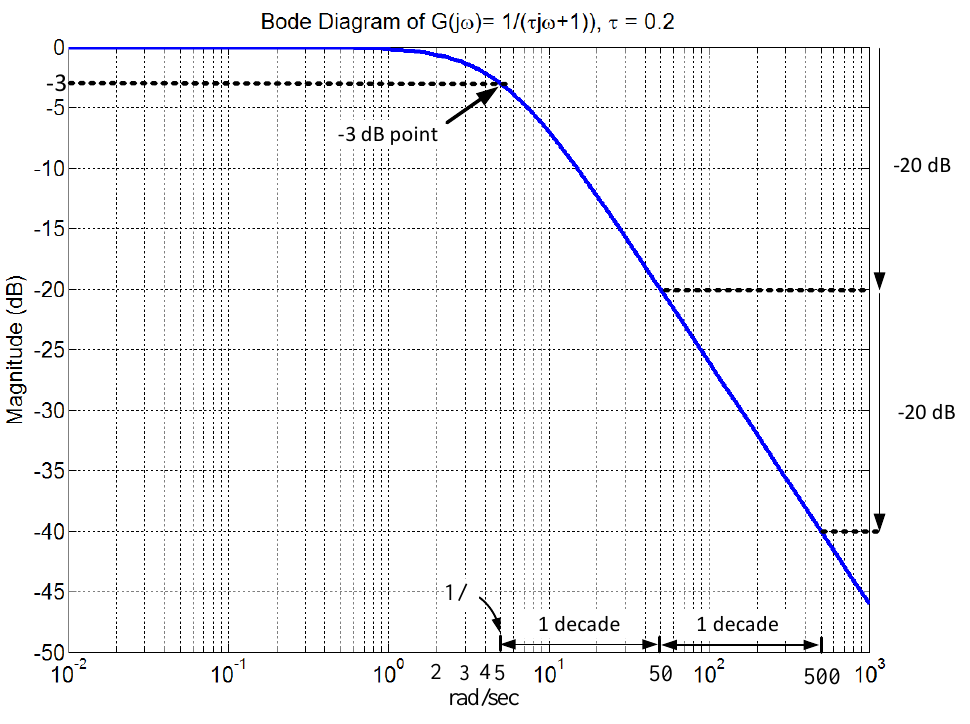

:::

---

::: {.compact-slide}

<strong>Asymptotic Magnitude Plot</strong>

$G(j\omega )=\dfrac{1}{\tau j\omega +1}$

$$20\log _{10}\!\left\vert \frac{1}{\tau j\omega +1}\right\vert \approx
\left\{ 
\begin{array}{ll}
\quad \!0, & \omega <1/\tau \\ 
-3, & \omega =1/\tau \\ 
20\log _{10}\!\left( \dfrac{1}{\omega \tau }\right) =-20\log _{10}\!\left( 
\dfrac{\omega }{1/\tau }\right) , & \omega >1/\tau .\end{array}\right.$$

-   Every factor of 10 is referred to as *decade*.

-   $10^{2}(1/\tau )$ is two decades *above* $1/\tau .$

-   $10^{-1}(1/\tau )$ is one decade *below* $1/\tau .$

-   With $\omega =10^{k}(1/\tau ),$  $k\geq 1$ we have

    $$-20\log _{10}\!\left( \dfrac{\omega }{1/\tau }\right) =-20\log _{10}\!\left( 
    \dfrac{10^{k}(1/\tau )}{1/\tau }\right) =-20k\;\text{dB}\;$$

    and

    $$\log _{10}\omega =k+\log _{10}\!\left( \frac{1}{\tau }\right) \text{.}$$

-   For every decade above $1/\tau$ the magnitude goes down by 20 dB.
:::

---

::: {.compact-slide}

<strong>Asymptotic Magnitude Plot(continued)</strong>

$G(j\omega )=\dfrac{1}{\tau j\omega +1}$

$$20\log _{10}|G(j\omega )|\;\approx \left\{ 
\begin{array}{cl}
0 & \;\text{for}\;\omega <1/\tau \\ 
-20\log _{10}\!\left( \dfrac{\omega }{1/\tau }\right) & \;\text{for}\;\omega
>1/\tau .\end{array}\right.$$

:::

---

::: {.compact-slide .dense-figure-slide}

<strong>Bode Phase Plot</strong>

$G(j\omega )=\dfrac{1}{\tau j\omega +1}$

  Plot $\angle G(j\omega )$ versus $\log _{10}\omega$.

$$\begin{array}{|l|l|l|}
\hline
\omega  & \log _{10}(\omega ) & \angle G(j\omega )=\angle \dfrac{1}{\tau j\omega +1}=-\tan ^{-1}\!\left( \dfrac{\omega }{1/\tau }\right)  \\ 
\hline
0 & -\infty  & -\tan ^{-1}(0)=0^{\circ } \\ \hline
(0.1)(1/\tau ) & -1+\log _{10}(1/\tau ) & -\tan ^{-1}(0.1)\approx
-5.7^{\circ } \\ \hline
1/\tau  & \log _{10}(1/\tau ) & -\tan ^{-1}(1)=-45^{\circ } \\ \hline
10(1/\tau ) & 1+\log _{10}(1/\tau ) & -\tan ^{-1}(10)=-84.3^{\circ }
\\ \hline
100(1/\tau ) & 2+\log _{10}(1/\tau ) & -\tan ^{-1}(100)\approx
-90^{\circ } \\ \hline
\end{array}$$

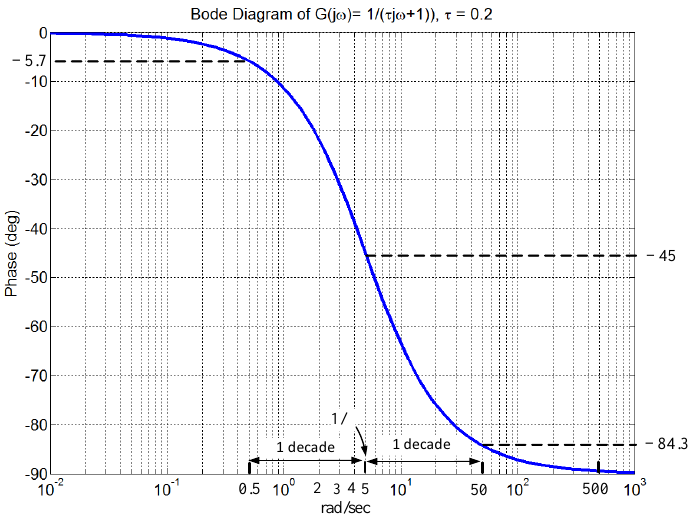

:::

---

::: {.compact-slide}

<strong>Bode Diagram</strong>

$G(j\omega )=\dfrac{1}{-\tau j\omega +1}$

 with $\tau =0.2$ so $1/\tau =5$.

$$\begin{aligned}
\left\vert G(j\omega )\right\vert &=&\left\vert \frac{1}{-\tau j\omega +1}\right\vert =\frac{1}{\sqrt{(\tau \omega )^{2}+1}} \\
\angle G(j\omega ) &=&\angle \dfrac{1}{-\tau j\omega +1}=-\tan ^{-1}\!\left(
-\dfrac{\omega }{1/\tau }\right) =\tan ^{-1}\!\left( \dfrac{\omega }{1/\tau }\right)
\end{aligned}$$

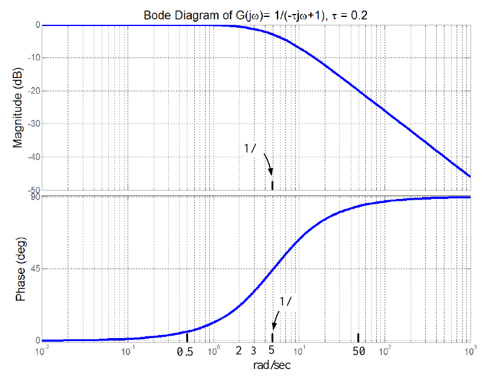

:::

---

::: {.compact-slide}

<strong>Bode Diagram</strong>

$G(j\omega )=\tau j\omega +1$

 with $\tau =0.2$ so $1/\tau =5$.

$$\begin{aligned}
20\log _{10}\left\vert G(j\omega )\right\vert &=&20\log _{10}\left\vert \tau
j\omega +1\right\vert =20\log _{10}\!\left\vert \sqrt{(\tau \omega )^{2}+1}\right\vert =-20\log _{10}\!\frac{1}{\sqrt{(\tau \omega )^{2}+1}} \\
\angle G(j\omega ) &=&\angle \left( \tau j\omega +1\right) =\tan
^{-1}\!\left( \dfrac{\omega }{1/\tau }\right)
\end{aligned}$$

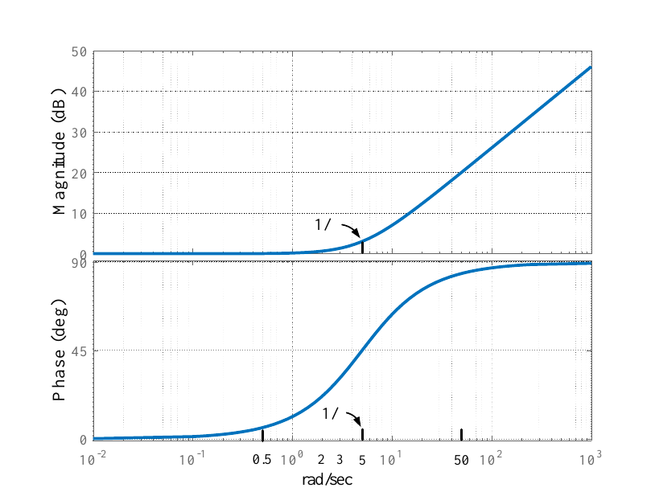

:::

---

::: {.compact-slide}

<strong>Bode Plot</strong>

$G(j\omega )=1/j\omega$

$$\begin{aligned}
20\log _{10}|G(j\omega )| &=&20\log _{10}\!\left\vert 1/j\omega \right\vert
=-20\log _{10}\omega \\
\angle G(j\omega ) &=&-90^{\circ }.
\end{aligned}$$

-   Start at $\omega =10^{0}=1$ as $20\log _{10}|G(j1)|=-20\log
    _{10}\left\vert 1\right\vert =0.$

-   Go to $\omega =10$ as $20\log _{10}|G(j\omega )|=-20\log
    _{10}\left\vert 10\right\vert =-20.$

-   Then just draw a straight line going through these two points.

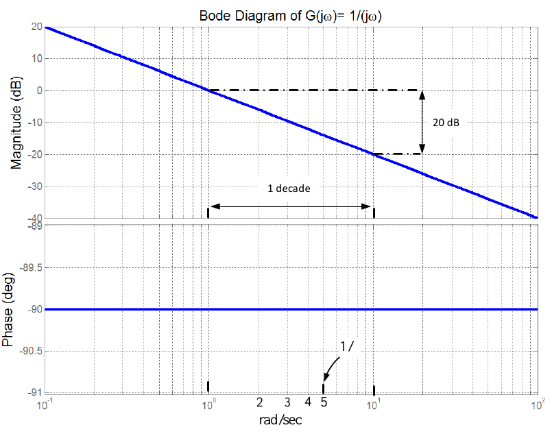

:::

---

::: {.compact-slide}

<strong>Bode Plot</strong>

$G(j\omega )=\dfrac{1}{j\omega (j\omega +5)}=\dfrac{1}{5}\dfrac{1}{j\omega (j\omega /5+1)},$

 $\tau =1/5=0.2$

$$20\log _{10}\!\left\vert \frac{1}{5}\frac{1}{j\omega (0.2j\omega +1)}\right\vert =20\log _{10}\!\left\vert \frac{1}{5}\right\vert +20\log
_{10}\!\left\vert \frac{1}{j\omega }\right\vert +20\log _{10}\!\left\vert 
\frac{1}{j\omega /5+1}\right\vert .$$

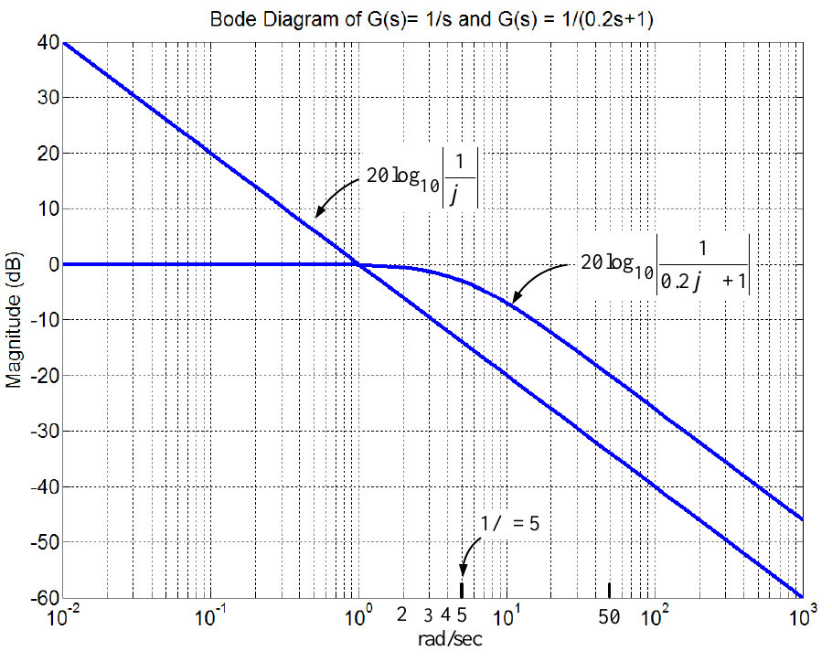

:::

---

::: {.compact-slide}

<strong>Bode Plot</strong>

$G(j\omega )=\dfrac{1}{j\omega (j\omega +5)}=\dfrac{1}{5}\dfrac{1}{j\omega (j\omega /5+1)},\ \ \tau =1/5=0.2$

First do the Bode plot of $-20\log _{10}\left\vert \dfrac{1}{j\omega }\right\vert -20\log _{10}\left\vert \dfrac{1}{j\omega /5+1}\right\vert .$

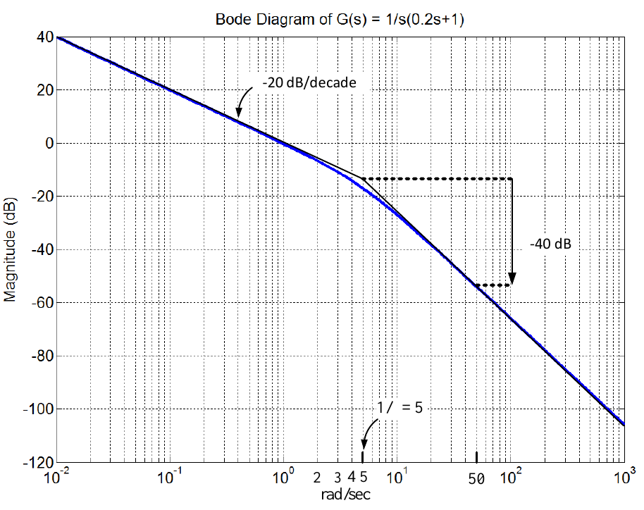

:::

---

::: {.compact-slide}

<strong>Bode Plot</strong>

$G(j\omega )=\dfrac{1}{j\omega (j\omega +5)}=\dfrac{1}{5}\dfrac{1}{j\omega (j\omega /5+1)},\ \ \tau =1/5=0.2$

Finish the plot by simply adding the constant term $20\log _{10}\!\left\vert
1/5\right\vert =-14$ dB.

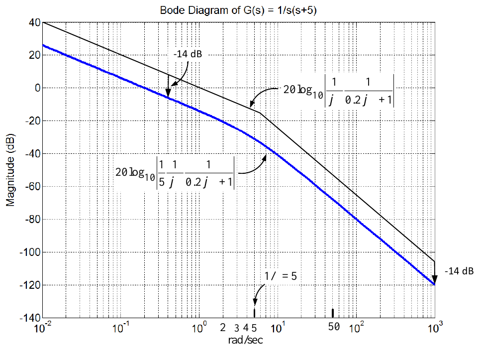

:::

---

::: {.compact-slide}

<strong>Bode Phase Plot</strong>

$G(j\omega )=\dfrac{1}{j\omega (j\omega +5)}=\dfrac{1}{5}\dfrac{1}{j\omega (j\omega /5+1)},\ \ \tau =1/5=0.2$

$$\angle \frac{1}{5}\dfrac{1}{j\omega (j\omega /5+1)}=\angle \frac{1}{5}+\angle \dfrac{1}{j\omega }+\angle \dfrac{1}{j\omega /5+1}=0^{\circ
}-90^{\circ }+\angle \dfrac{1}{j\omega /5+1}.$$

-   At $\omega =\dfrac{1}{10}\dfrac{1}{\tau }$ we have $\angle G(j\omega
    )=-90^{\circ }-5.7^{\circ }=-95.7^{\circ }.$

-   At the break point $1/\tau =5$ we have $\angle G(j\omega )=-90^{\circ
    }-45^{\circ }=-135^{\circ }.$

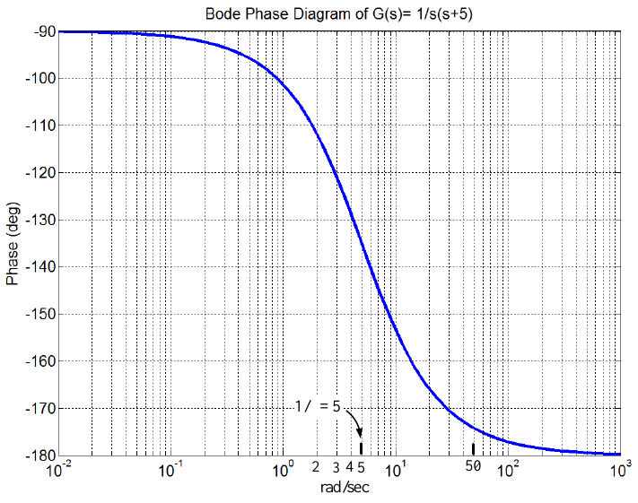

:::

---

::: {.compact-slide}

<strong>Bode Plot</strong>

$G_{c}(j\omega )=\dfrac{j\omega +0.1}{j\omega +0.01}$

$$\begin{aligned}
20\log _{10}|G_{c}(j\omega )| &=&20\log _{10}\left\vert \frac{0.1}{0.01}\frac{j\omega /0.1+1}{j\omega /0.01+1}\right\vert \\
&=&\underset{20\;\text{dB}\;}{\underbrace{20\log _{10}\left\vert 10\right\vert }}+20\log _{10}\left\vert j\omega /0.1+1\right\vert +20\log _{10}\left\vert 
\frac{1}{j\omega /0.01+1}\right\vert .
\end{aligned}$$

Asymptotic approximations:

$$\begin{aligned}
20\log _{10}|10| &=&20\;\text{dB}\; \\
20\log _{10}\left\vert \frac{1}{j\omega /0.01+1}\right\vert &=&\left\{ 
\begin{array}{cc}
0, & \omega <0.01 \\ 
-20\log _{10}\left( \dfrac{\omega }{0.01}\right) , & \omega >0.01\end{array}\right. \\
20\log _{10}\left\vert j\omega /0.1+1\right\vert &=&\left\{ 
\begin{array}{cc}
0, & \quad \;\omega <0.1 \\ 
20\log _{10}\left( \dfrac{\omega }{0.1}\right) , & \quad \;\omega >0.1\end{array}\right.
\end{aligned}$$

Asymptotic magnitude plot:

$$20\log _{10}|G_{c}(j\omega )|=\left\{ 
\begin{array}{ll}
20\log _{10}|10|, & \omega <0.01 \\ 
20\log _{10}|10|-20\log _{10}\left( \dfrac{\omega }{0.01}\right) , & 0.01<\omega <0.1 \\ 
\underset{0\;\text{dB}\;}{\underbrace{20\log _{10}|10|-20\log _{10}\left( 
\dfrac{\omega }{0.01}\right) +20\log _{10}\left( \dfrac{\omega }{0.1}\right) 
}}, & 0.1<\omega\end{array}\right.$$
:::

---

::: {.compact-slide}

<strong>Bode Plot</strong> <strong>Magnitude plot</strong>

$G_{c}(j\omega )=\dfrac{j\omega +0.1}{j\omega +0.01}$

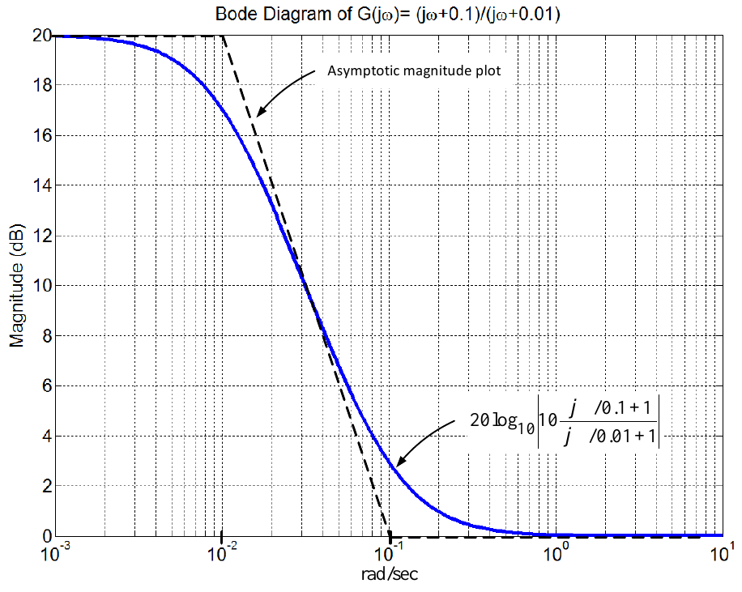

:::

---

::: {.compact-slide}

<strong>Bode Phase Plot</strong>

$\angle G_{c}(j\omega )=\angle (j\omega
/0.1+1)+\angle \dfrac{1}{j\omega /0.01+1}$

$$\begin{array}{llll}
\omega & \angle (j\omega /0.1+1) & \angle 1/(j\omega /0.01+1) & \angle
(j\omega /0.1+1)+\angle \dfrac{1}{j\omega /0.01+1} \\ 
0.001 & \approx 0 & \approx -5.7^{\circ } & \approx -5.7^{\circ } \\ 
0.01 & \approx 5.7^{\circ } & \approx -45^{\circ } & \approx -39.3^{\circ }
\\ 
0.1 & \approx 45^{\circ } & \approx -90^{\circ } & \approx -45^{\circ } \\ 
1 & \approx 90^{\circ } & \approx -90^{\circ } & \approx 0^{\circ }\end{array}$$

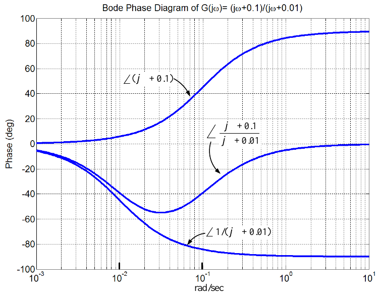

:::

---

::: {.compact-slide}

<strong>Example</strong>

$\ G_{c}(j\omega )=\dfrac{j\omega +2}{j\omega +4}$

$$\begin{aligned}
20\log _{10}|G_{c}(j\omega )| &=&20\log _{10}\left\vert \frac{2}{4}\frac{j\omega /2+1}{j\omega /4+1}\right\vert \\
&=&\underset{-6\;\text{dB}\;}{\underbrace{20\log _{10}\left\vert \frac{1}{2}\right\vert }}+20\log _{10}\left\vert j\omega /2+1\right\vert +20\log
_{10}\left\vert \frac{1}{j\omega /4+1}\right\vert .
\end{aligned}$$

Asymptotic approximations:

$$\begin{aligned}
20\log _{10}|1/2| &=&-6\;\text{dB}\; \\
20\log _{10}\left\vert j\omega /2+1\right\vert &=&\left\{ 
\begin{array}{ll}
0, & \omega <2 \\ 
20\log _{10}\left( \dfrac{\omega }{2}\right) , & \omega >2\end{array}\right. \\
20\log _{10}\left\vert \frac{1}{j\omega /4+1}\right\vert &=&\left\{ 
\begin{array}{cc}
0, & \omega <4 \\ 
-20\log _{10}\left( \dfrac{\omega }{4}\right) , & \omega >4\end{array}\right.
\end{aligned}$$

Asymptotic magnitude plot:

$$20\log _{10}|G_{c}(j\omega )|=\left\{ 
\begin{array}{ll}
20\log _{10}|1/2|, & \omega <2 \\ 
20\log _{10}|1/2|+20\log _{10}\left( \omega /2\right) , & 2<\omega <4 \\ 
\underset{0}{\underbrace{20\log _{10}|1/2|+20\log _{10}\left( \omega
/2\right) -20\log _{10}\left( \omega /4\right) }}, & \omega >4\end{array}\right.$$
:::

---

::: {.compact-slide}

<strong>Example</strong>

$$20\log _{10}\left\vert \dfrac{1}{2}\dfrac{j\omega /2+1}{j\omega /4+1}\right\vert =\left\{ 
\begin{array}{ll}
20\log _{10}|1/2|, & \omega <2 \\ 
20\log _{10}|1/2|+20\log _{10}\left( \omega /2\right) , & 2<\omega <4 \\ 
\underset{0}{\underbrace{20\log _{10}|1/2|+20\log _{10}\left( \omega
/2\right) -20\log _{10}\left( \omega /4\right) }}, & \omega >4\end{array}\right.$$

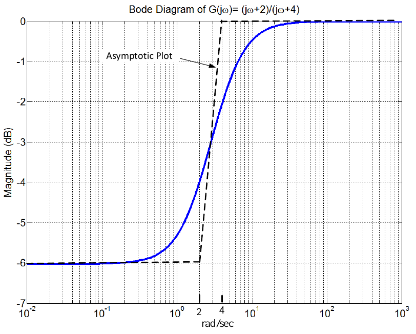

:::

---

::: {.compact-slide}

<strong>Example</strong>

$\ \angle G_{c}(j\omega )=\angle \dfrac{j\omega +2}{j\omega
+4}=\angle (j\omega /2+1)+\angle \dfrac{1}{j\omega /4+1}$

$$\begin{array}{lllll}
\omega &  & \angle (j\omega /2+1) & \angle (j\omega /4+1) & \angle (j\omega
/2+1)+\angle \dfrac{1}{j\omega /4+1} \\ 
0.2 &  & 5.7^{\circ } & 0 & 5.7^{\circ } \\ 
2 &  & 45^{\circ } & \tan ^{-1}(1/2)=26.6^{\circ } & 18.4^{\circ } \\ 
4 &  & \tan ^{-1}(2)=63.2^{\circ } & 45^{\circ } & 18.2 \\ 
20 &  & 84.3^{\circ } & \tan ^{-1}(5)=78.7^{\circ } & 5.6^{\circ } \\ 
40 &  & 90^{\circ } & 84.3^{\circ } & 5.7^{\circ } \\ 
\infty &  & 90^{\circ } & 90^{\circ } & 0^{\circ }\end{array}$$

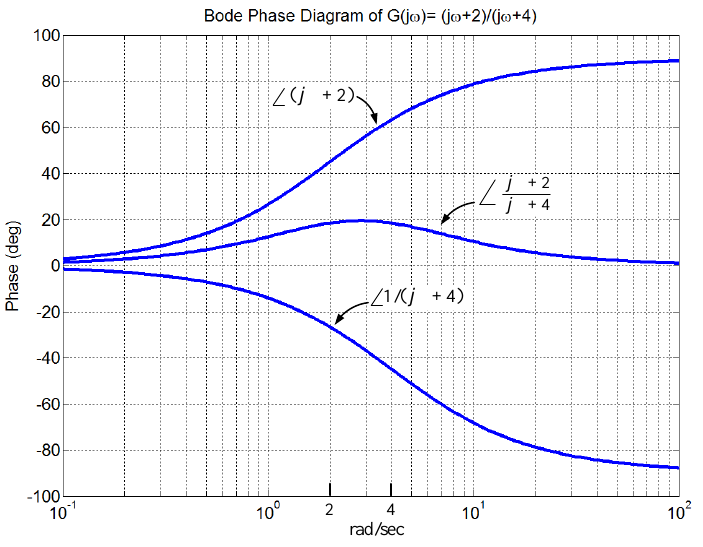

:::

---

::: {.compact-slide}

<strong>Example</strong>

$\ $ $G(j\omega )=\dfrac{(j\omega +40)(j\omega /0.4+1)}{(j\omega /400+1)(j\omega
+4)^{3}}=\dfrac{40}{4^{3}}\dfrac{(j\omega /40+1)(j\omega /0.4+1)}{(j\omega
/400+1)(j\omega /4+1)^{3}}.$

$$\begin{aligned}
20\log _{10}|G(j\omega )| &=&20\log _{10}\left\vert 40/64\right\vert +20\log
_{10}|j\omega /0.4+1|+60\log _{10}|1/(j\omega /4+1)| \\
&&+20\log _{10}|j\omega /40+1|+20\log _{10}|1/(j\omega /400+1)|
\end{aligned}$$

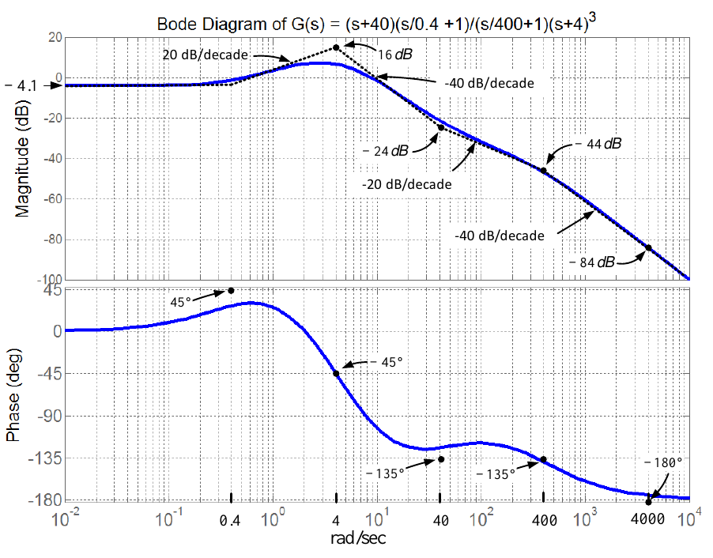

:::

---

::: {.compact-slide}

<strong>Example</strong>

$\ $ $\angle G(j\omega )=\angle \dfrac{(j\omega +40)(j\omega /0.4+1)}{(j\omega
/400+1)(j\omega +4)^{3}}=\angle \dfrac{(j\omega /40+1)(j\omega /0.4+1)}{(j\omega /400+1)(j\omega /4+1)^{3}}$

$$\begin{array}{|l|l|}
\hline
\omega  & \angle G(j\omega ) \\ \hline
&  \\ 
0.04 & 0 \\ \hline
0.4 & \approx \angle (j\omega /0.4+1)|_{\omega =0.4}=45^{\circ } \\ 
\hline
4 & \approx \angle (j\omega /0.4+1)|_{\omega =4}-3\angle (j\omega
/4+1)_{|\omega =4} \\ 
& =90^{\circ }-3\times 45^{\circ }=-45^{\circ } \\ \hline
40 & \approx \angle (j\omega /0.4+1)|_{\omega =40}-3\angle (j\omega
/4+1)_{|\omega =40}+\angle (j\omega /40+1)|_{\omega =40} \\ 
& =90^{\circ }-3\times 90^{\circ }+45^{\circ }=-135^{\circ } \\ \hline
400 & \approx \angle (j\omega /0.4+1)|_{\omega =400}-3\angle (j\omega
/4+1)_{|\omega =400}+\angle (j\omega /40+1)|_{\omega =400} \\ 
& \quad -\angle (j\omega /400+1)|_{\omega =400}=90^{\circ }-3\times
90^{\circ }+90^{\circ }-45^{\circ }=-135^{\circ } \\ \hline
4000 & \approx \angle (j\omega /0.4+1)|_{\omega =4000}-3\angle (j\omega
/4+1)_{|\omega =4000}+\angle (j\omega /40+1)|_{\omega =4000} \\ 
& \quad -\angle (j\omega /400+1)|_{\omega =4000}=90^{\circ }-3\times
90^{\circ }+90^{\circ }-90^{\circ }=-180^{\circ } \\ \hline
\end{array}$$
:::

---

::: {.compact-slide}

<strong>Example</strong>

$\ $

$$\begin{array}{|c|r|r|r|r|r|r|}
\hline
\omega  & 0.04 & 0.4 \  & 4\quad  & 40\quad  & 400 \ \  & 4000
\\ \hline
\angle G(j\omega ) & 0^{\circ } \  & 45^{\circ } & -45^{\circ } & -135^{\circ } & -135^{\circ } & -180^{\circ } \\ \hline
\end{array}$$

:::

---

::: {.compact-slide .expanded-body-slide}

<strong>Bode Diagram with Complex Poles </strong>

$G(s)=\dfrac{\omega _{n}^{2}}{s^{2}+2\zeta \omega _{n}s+\omega _{n}^{2}}$

  $0<\zeta <1$

-   $G(j\omega )=\dfrac{1}{(j\omega /\omega _{n})^{2}+2\zeta j\omega
    /\omega _{n}+1}=\dfrac{1}{1-(\omega /\omega _{n})^{2}+j2\zeta \omega /\omega
    _{n}}.$

-   $G(j0)=1,$  $G(j\omega _{n})=\dfrac{1}{2\zeta j}$

-   $G(j\omega )\approx \dfrac{1}{(j\omega /\omega _{n})^{2}},$  $\omega
    >>\omega _{n}$

**Asymptotic magnitude plot**

$$20\log _{10}\left\vert \frac{1}{(j\omega /\omega _{n})^{2}}\right\vert
=\left\{ 
\begin{array}{ll}
0, & \omega <\omega _{n} \\ 
20\log _{10}\left\vert \dfrac{1}{(j\omega /\omega _{n})^{2}}\right\vert
=-40\log _{10}\left\vert \omega /\omega _{n}\right\vert , & \omega >\omega
_{n}.\end{array}\right.$$
:::

---

::: {.compact-slide}

<strong>Bode Diagram with Complex Poles </strong>

$G(s)=\dfrac{\omega _{n}^{2}}{s^{2}+2\zeta \omega _{n}s+\omega _{n}^{2}}$

  $0<\zeta <1$

$$20\log _{10}\left\vert \frac{1}{(j\omega /\omega _{n})^{2}}\right\vert
=\left\{ 
\begin{array}{ll}
0, & \omega <\omega _{n} \\ 
20\log _{10}\left\vert \dfrac{1}{(j\omega /\omega _{n})^{2}}\right\vert
=-40\log _{10}\left\vert \omega /\omega _{n}\right\vert , & \omega >\omega
_{n}.\end{array}\right.$$

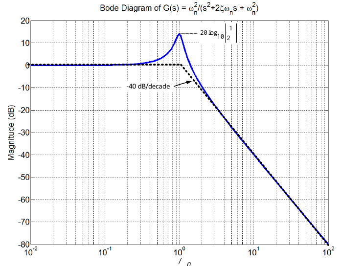

-   $\omega _{n}$ is a (double) breakpoint.

-   The asymptotic magnitude plot decreases at $-40$ dB/decade after the breakpoint.
:::

---

::: {.compact-slide}

<strong>Bode Diagrams</strong>

$G(s)=\omega _{n}^{2}/(s^{2}+2\zeta \omega
_{n}s+\omega ^{2})$

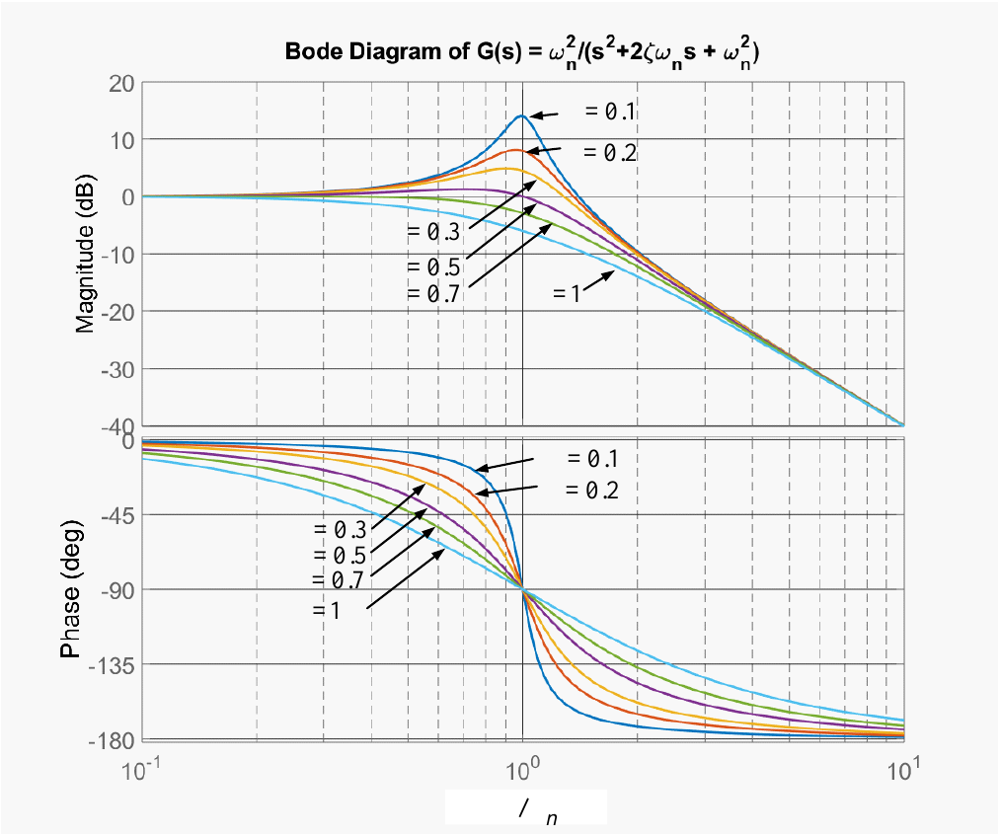

:::

---

::: {.compact-slide .expanded-body-slide}

<strong>Peak and Resonant Values</strong>

$$\begin{aligned}
G(j\omega ) &=&\dfrac{\omega _{n}^{2}}{(j\omega )^{2}+2\zeta \omega
_{n}j\omega +\omega _{n}^{2}}=\dfrac{1}{(j\omega /\omega _{n})^{2}+2\zeta
j\omega /\omega _{n}+1} \\
G(j0) &=&1,\ G(j\omega _{n})=\dfrac{1}{2\zeta j}
\end{aligned}$$

Setting

$$\frac{d}{d\omega }20\log _{10}\left\vert G(j\omega )\right\vert =\frac{d}{d\omega }20\log _{10}\left\vert \dfrac{1}{(j\omega /\omega _{n})^{2}+2\zeta
j\omega /\omega _{n}+1}\right\vert =0$$

gives

$$\begin{aligned}
\omega _{r} &\triangleq &\omega _{n}\sqrt{1-2\zeta ^{2}}\;\text{for}\;0<\zeta <1/\sqrt{2}=0.707 \\
|G(j\omega _{r})| &=&\frac{1}{2\zeta \sqrt{1-\zeta ^{2}}}.
\end{aligned}$$

-   For $\zeta <<1$ we have $\omega _{r}\approx \omega _{n}$ and $|G(j\omega _{r})|\approx \dfrac{1}{2\zeta }.$
:::

---

::: {.compact-slide .dense-figure-slide}

<strong>Phase Plot with Complex Poles</strong>

$$\angle G(j\omega )=\angle \dfrac{1}{(j\omega /\omega _{n})^{2}+2\zeta
j\omega /\omega _{n}+1}=-\tan ^{-1}\!\left( \frac{2\zeta (\omega /\omega
_{n})}{1-(\omega /\omega _{n})^{2}}\right) .$$

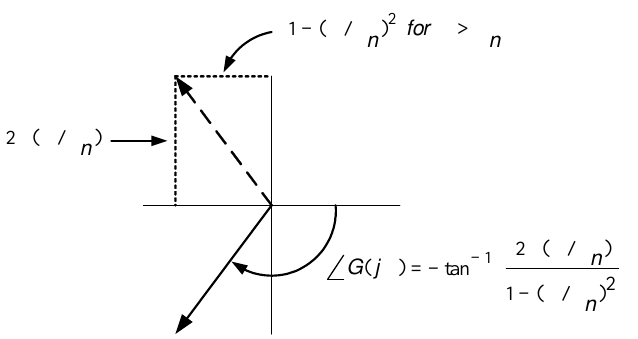

$$\begin{array}{|l|l|l|}
\hline
\omega  & \log _{10}\omega  & \angle G(j\omega )=-\tan ^{-1}\!\left( 
\dfrac{2\zeta (\omega /\omega _{n})}{1-(\omega /\omega _{n})^{2}}\right) 
\\ \hline
0 & -\infty  & 0 \\ \hline
0.1\omega _{n} & -1+\log _{10}\omega _{n} & -\tan ^{-1}\!\left( \dfrac{2\zeta /10}{1-1/100}\right) \approx -\tan ^{-1}(\zeta /5) \\ \hline
\omega _{n} & \log _{10}\omega _{n} & -\tan ^{-1}\!\left( \dfrac{2\zeta 
}{0}\right) =-90^{\circ } \\ \hline
10\omega _{n} & 1+\log _{10}\omega _{n} & -\tan ^{-1}\!\left( \dfrac{20\zeta }{1-100}\right) \approx -180^{\circ }+\tan ^{-1}(\zeta /5) \\ \hline
\infty  & \infty  & -180^{\circ } \\ \hline
\end{array}$$
:::

---

::: {.compact-slide}

<strong>Phase Plot with Complex Poles</strong>

The phase plot where $\omega _{n}=1$ and $\zeta =0.1.$

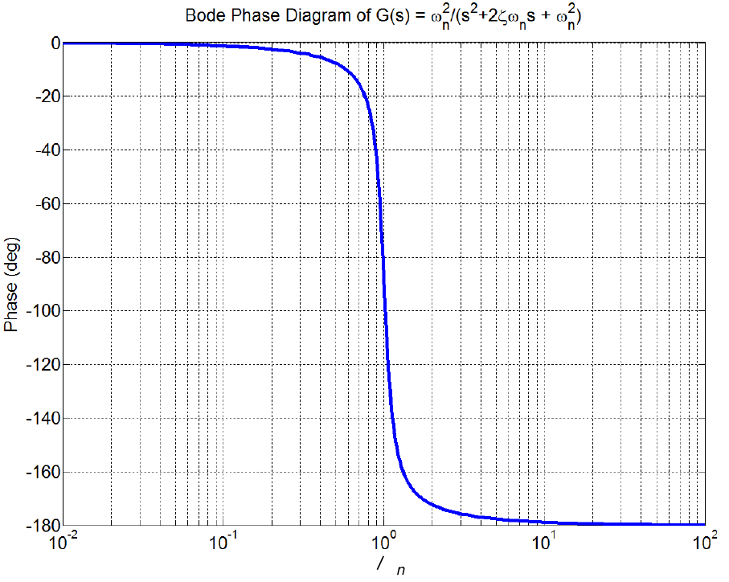

:::

---

::: {.compact-slide}

<strong>Example </strong>

$G(j\omega )=\dfrac{j\omega /3+1}{(j\omega )^{2}/2+j\omega /2+1}=\dfrac{j\omega /3+1}{(j\omega /\omega _{n})^{2}+2\zeta j\omega /\omega _{n}+1}$ $\Longrightarrow \omega _{n}^{2}=2,$

 $2\zeta /\omega _{n}=1/2$ or $\omega
_{n}=\sqrt{2},\ \ \zeta =1/(2\sqrt{2})=0.35.$

For $\omega >\sqrt{2}$ the magnitude $\downarrow$ at $-40$ dB/decade.

For $\omega >3$ after breakpoint of the zero, magnitude $\downarrow$ at only $-20$ dB/decade.

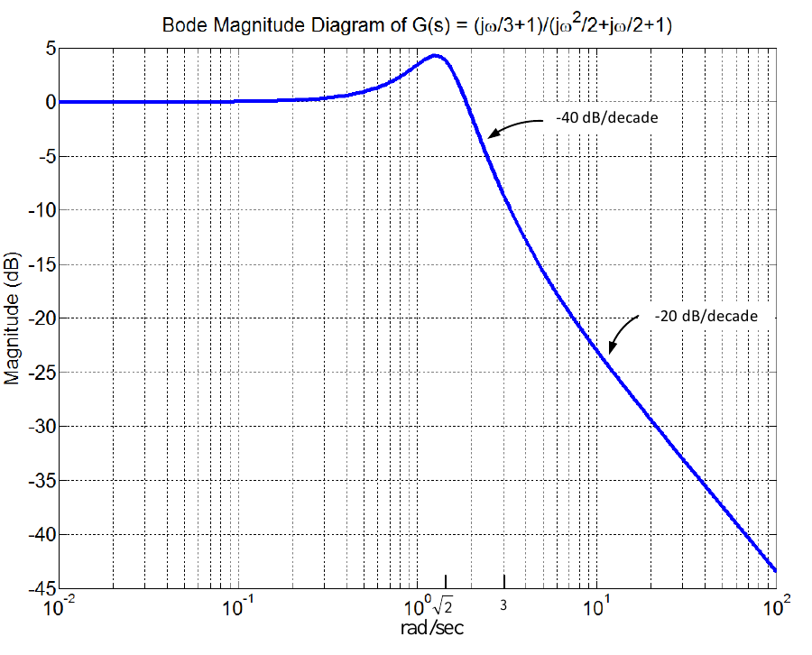

:::

---

::: {.compact-slide}

<strong>Example </strong>

$G(j\omega )=\dfrac{j\omega /3+1}{(j\omega
)^{2}/2+j\omega /2+1}$

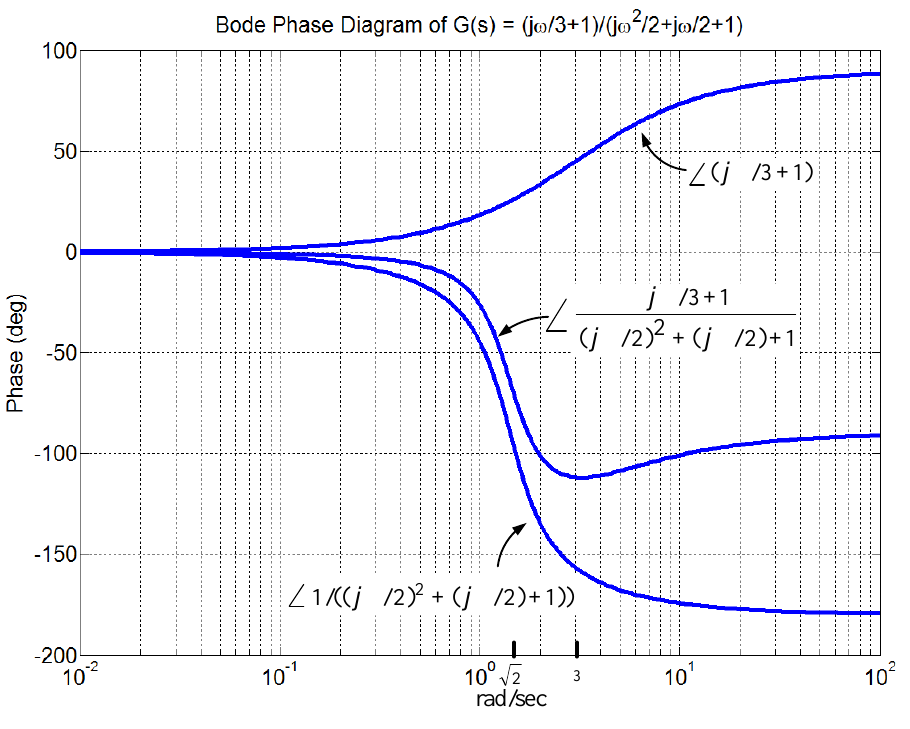

:::

---

::: {.compact-slide}

<strong>Nyquist Theory</strong>

-   Gives a method to determine stability from the open-loop Bode diagram.

**Principle of the Argument**  Let

$$G(s)=s+1=s-(-1)=|s+1|e^{j\angle (s+1)}.$$

-   Let "$s$" go around $\mathcal{C}$ once in the *clockwise* direction.

-   "$s$" successively goes through $s_{0},s_{1},s_{2},s_{3}$ and back to $s_{0}.$

-   $\angle G(s_{i})=\angle (s_{i}+1)=0,-\pi /2,-\pi ,-3\pi /2,-2\pi ,$ respectively.

-   I.e., the image $G(s)$ goes around the *origin* once in the *clockwise* direction.

:::

---

::: {.compact-slide}

<strong>Principle of the Argument</strong>

Let

$$G(s)=\frac{1}{s+1}=\frac{1}{|s+1|}e^{-j\angle (s+1)}$$

-   Let "$s$" go around $\mathcal{C}$ once in the *clockwise* direction.

-   "$s$" successively goes through $s_{0},s_{1},s_{2},s_{3}$ and back to $s_{0}.$

-   $\angle G(s_{i})=-\angle (s_{i}+1)=0,\pi /2,\pi ,3\pi /2,2\pi ,$ respectively.

-   The image $G(s)$ goes around the *origin* once in the *counterclockwise* direction.

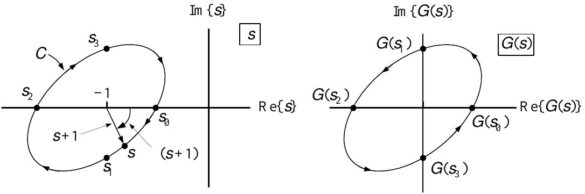

:::

---

::: {.compact-slide}

<strong>Principle of the Argument</strong>

Let

$$G(s)=s+1=s-(-1)=|s+1|e^{j\angle (s+1)}$$

-   The zero at $s=-1$ is **not** inside the curve $\mathcal{C}$.

-   Let "$s$" travel around closed curve $\mathcal{C}$ once in the counterclockwise direction.

-   "$s$" successively goes through $s_{0},s_{1},s_{2},s_{3}$ and back to $s_{0}$.

-   The image $G(s)$ does *not* go around the *origin*.

-   This is because $\angle (s+1)$ does not change by $2\pi$ as we go around $\mathcal{C}$.

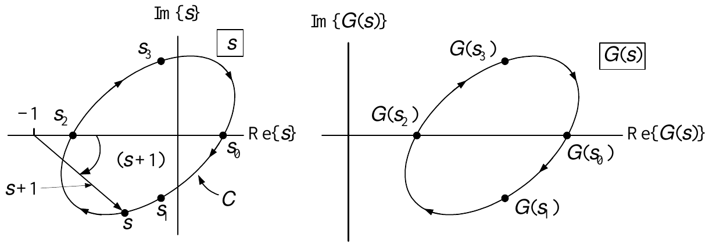

:::

---

::: {.compact-slide}

<strong>Principle of the Argument</strong>

$$\begin{aligned}
G(s)=\frac{(s-z_{1})(s-z_{2})}{(s-p_{1})(s-p_{2})} &=&\frac{|s-z_{1}|e^{j\angle (s-z_{1})}|s-z_{2}|e^{j\angle (s-z_{2})}}{|s-p_{1}|e^{j\angle (s-p_{1})}|s-p_{2}|e^{j\angle (s-p_{2})}} \\
&=&\frac{|s-z_{1}||s-z_{2}|}{|s-p_{1}||s-p_{2}|}e^{j\angle
(s-z_{1})}e^{j\angle (s-z_{2})}e^{-j\angle (s-p_{1})}e^{-j\angle (s-p_{2})}.
\end{aligned}$$

-   $z_{2}$ is **outside** the curve

-   $z_{1},p_{1},p_{2}$ are **inside** the curve.

:::

---

::: {.compact-slide}

<strong>Principle of the Argument</strong>

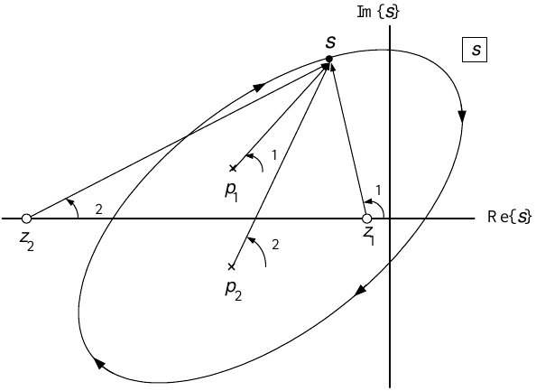

$$\begin{array}{|l|l|l|}
\hline
Pole/Zero & Change in angle & Causes G(s) to go around the origin \\ \hline
\angle \dfrac{1}{s-p_{1}}=-\phi _{1} & +2\pi  & Once in the CCW direction \\ \hline
\angle \dfrac{1}{s-p_{2}}=-\phi _{2}  & +2\pi  & Once in the CCW direction \\ \hline
\angle (s-z_{1})=\theta _{1} & -2\pi  & Once
in the CW direction \\ \hline
\angle (s-z_{2})=\theta _{2} & \quad 0 & Zero
\\ \hline
\end{array}$$

As "$s$" goes around the closed curve once in the **clockwise** direction, the image $G(s)$ goes around the origin once in the **counterclockwise** direction.
:::

---

::: {.compact-slide}

<strong>Principle of the Argument</strong>

**Theorem  ***Principle of the Argument*

Let $G(s)$ be a rational function of $s$ (ratio of two polynomials in $s$). E.g.,

$$G(s)=\frac{(s-z_{1})(s-z_{2})}{(s-p_{1})(s-p_{2})}.$$

Let $\mathcal{C}$ be a simple closed curve in the complex plane.

Let $s$ go around the curve $\mathcal{C}$ once in the clockwise direction.

$Z$ is the number of zeros $G(s)$ **inside** the closed curve $\mathcal{C}$ .

$P$ is the number of poles **inside** the closed curve $\mathcal{C}.$

Then the number of times $N$ the image $G(s)$ of the curve

goes around the origin in the clockwise direction is

$$N=Z-P.$$

**Proof:**  Omitted
:::

---

::: {.compact-slide}

<strong>Example</strong>

*Principle of the Argument* $G(s)=\dfrac{1}{(s+1)(s+3)}.$

For $\omega \geq 0$ we have

$$G(j\omega )=\frac{1}{(j\omega +1)(j\omega +3)}=\frac{(1-j\omega )(3-j\omega )}{(1+\omega ^{2})(9+\omega ^{2})}=\frac{3-\omega ^{2}-j4\omega }{(1+\omega
^{2})(9+\omega ^{2})}$$

so that

$$G(j0)=1/3,\;G(j\sqrt{3})=\frac{-j4\sqrt{3}}{(4)(12)}=-j0.144,\;G(j\omega )\approx -\frac{1}{\omega ^{2}}\;\text{for}\;\omega \;\text{large.}\;$$
:::

---

::: {.compact-slide}

<strong>Example</strong>

*Principle of the Argument  *$G(s)=\dfrac{1}{(s+1)(s+3)}$ $.$

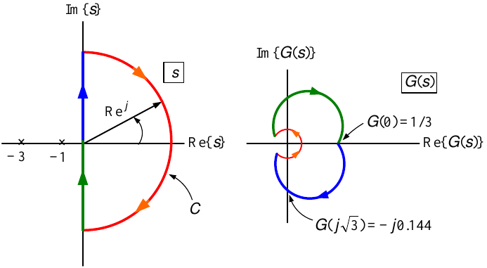

On the semicircle $s=Re^{j\theta },$ $-\pi /2\leq \theta \leq \pi /2$

$$G(Re^{j\theta })=\frac{1}{(Re^{j\theta }+1)(Re^{j\theta }+3)}\approx \frac{1}{R^{2}}e^{-j2\theta }\;\text{as}\;R\;\text{is large.}\;\begin{array}{|c|l|}
\hline
\theta  & G(Re^{j\theta })\approx e^{-j2\theta }/R^{2} \\ \hline
\pi /2 & e^{-j\pi }/R^{2}=-1/R^{2} \\ \hline
\pi /4 & e^{-j\pi /2}/R^{2}=-j/R^{2} \\ \hline
0 & e^{j0}/R^{2}=1/R^{2} \\ \hline
-\pi /4 & e^{j\pi /2}/R^{2}=j/R^{2} \\ \hline
-\pi /2 & e^{j\pi }/R^{2}=-1/R^{2} \\ \hline
\end{array}$$
:::

---

::: {.compact-slide}

<strong>Example</strong>

*Principle of the Argument  *$G(s)=\dfrac{1}{(s+1)(s+3)}$

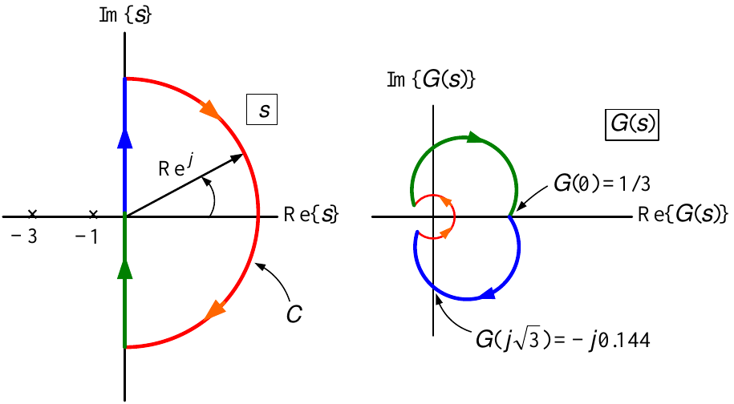

For $\omega \leq 0$ the image $G(j\omega )$ is simply the complex conjugate of the image for $\omega \geq 0.$

-   No poles nor zeros of $G(s)$ **inside** the closed curve $\mathcal{C}$ so $P=Z=0.$

-   By inspection the image of $G(s)$ on $\mathcal{C}$ does **not** go around the origin so $N=0.$

-   This verifies the principle of the argument, i.e.,

    $$N=Z-P.$$
:::

---

::: {.compact-slide}

<strong>Example</strong>

*Principle of the Argument  *$G(s)=\dfrac{1}{(s+1)(s+3)}$ Choose $\mathcal{C}$ to enclose the left half-plane.

For $-\infty <\omega <\infty$ the image $G(j\omega )$ is the same as in the previous example.

On the semicircle $s=Re^{j\theta },$ $-\pi /2\leq \theta \leq -3\pi /2$

$$G(Re^{j\theta })=\frac{1}{(Re^{j\theta }+1)(Re^{j\theta }+3)}\approx \frac{1}{R^{2}}e^{-j2\theta }\;\text{as}\;R\;\text{is large.}\;$$
:::

---

::: {.compact-slide}

<strong>Example</strong>

*Principle of the Argument  *$G(s)=\dfrac{1}{(s+1)(s+3)}$

$$\begin{array}{|c|c|}
\hline
\theta  & G(Re^{j\theta })\approx \dfrac{1}{R^{2}}e^{-j2\theta } \\ \hline
-\pi /2 & e^{j\pi
}/R^{2}=-1/R^{2} \\ \hline
-3\pi /4 & e^{j3\pi
/2}/R^{2}=-j/R^{2} \\ \hline
-\pi  & e^{j2\pi
}/R^{2}=1/R^{2} \\ \hline
-5\pi /4 & e^{j5\pi
/2}/R^{2}=j/R^{2} \\ \hline
-3\pi /2 & e^{j3\pi
}/R^{2}=-1/R^{2} \\ \hline
\end{array}$$
:::

---

::: {.compact-slide}

<strong>Example</strong>

*Principle of the Argument  *$G(s)=\dfrac{1}{(s+1)(s+3)}$

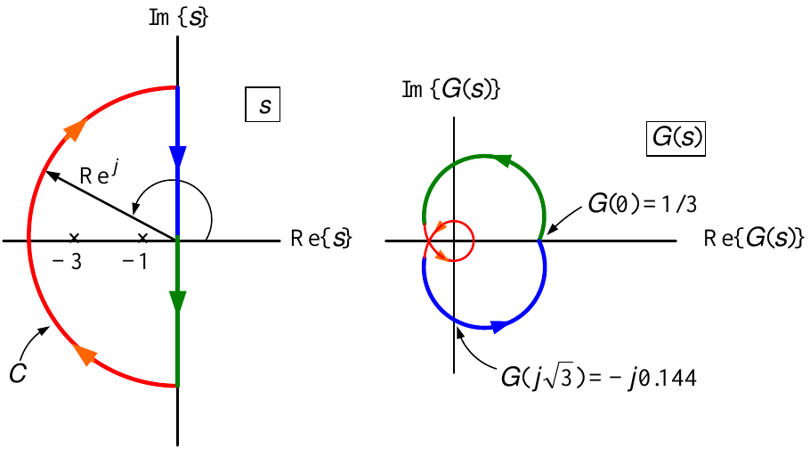

-   There are two poles of $G(s)$ **inside** the closed curve $\mathcal{C}$ so $P=2.$

-   There are no zeros of $G(s)$ **inside** the closed curve $\mathcal{C}$ so $Z=0.$

-   By inspection the image of $G(s)$ on this curve goes around the origin **twice**

    in the **counterclockwise** direction so $N=-2.$

-   We have thus verified that

    $$N=Z-P.$$
:::

---

::: {.compact-slide .dense-figure-slide}

<strong>Example</strong>

*Principle of the Argument  *$G(s)=\dfrac{10(s+1)}{s(s-10)}=-\dfrac{s+1}{s(-s/10+1)}$

The closed curve $\mathcal{C}$ is taken to **enclose** the right half-plane.

-   Let $s=Re^{j\theta }$ with $-\pi /2\leq \theta \leq \pi /2$ and let $R\rightarrow \infty .$

-   Avoid pole at $s=0$ by letting $s=re^{j\theta },$ $-\pi /2\leq \theta
    \leq \pi /2$ with $r\rightarrow 0.$

-   For $s=j\omega$ we have

    $$\begin{aligned}
    G(j\omega )=-\frac{j\omega +1}{j\omega (-j\omega /10+1)} &=&-\frac{(j\omega
    +1)(-j\omega )(j\omega /10+1)}{\omega ^{2}(\omega ^{2}/100+1)} \\
    &=&\frac{-\omega ^{2}(1+1/10)+j\omega (1-\omega ^{2}/10)}{\omega ^{2}(\omega
    ^{2}/100+1)}.
    \end{aligned}$$
:::

---

::: {.compact-slide}

<strong>Example</strong>

*Principle of the Argument  *$G(s)=\dfrac{10(s+1)}{s(s-10)}=-\dfrac{s+1}{s(-s/10+1)}$

$$\begin{aligned}
G(j\omega ) &=&\frac{-\omega ^{2}(1+1/10)+j\omega (1-\omega ^{2}/10)}{\omega
^{2}(\omega ^{2}/100+1)} \\
G(j\omega ) &\approx &-1.1+\frac{j}{\omega }\;\text{for}\;0<\omega <<1 \\
G(j\sqrt{10}) &=&-\frac{10(1+1/10)}{10(10/100+1)}=-1 \\
G(j\omega ) &\approx &-\frac{j10}{\omega }\;\text{for}\;\omega >>1.
\end{aligned}$$
:::

---

::: {.compact-slide}

<strong>Example</strong>

*Principle of the Argument  *$G(s)=\dfrac{10(s+1)}{s(s-10)}=-\dfrac{s+1}{s(-s/10+1)}$

$$G(re^{j\theta })=\frac{10(re^{j\theta }+1)}{re^{j\theta }(re^{j\theta }-10)}\approx \frac{10}{re^{j\theta }(-10)}=-e^{-j\theta }/r.\begin{array}{|c|c|}
\hline
\ \ \theta  & G(re^{j\theta })\approx -\dfrac{1}{r}e^{-j\theta } \\ 
\hline
-\pi /2 & -e^{j\pi /2}/r=-j/r
\\ \hline
-\pi /4 & -e^{j\pi /4}/r \\ 
\hline
0 \ \  & -1/r \\ \hline
\pi /4 & -e^{-j\pi /4}/r \\ 
\hline
\pi /2 & -e^{-j\pi /2}/r=j/r
\\ \hline
\end{array}$$
:::

---

::: {.compact-slide}

<strong>Example</strong>

*Principle of the Argument  *$G(s)=\dfrac{10(s+1)}{s(s-10)}=-\dfrac{s+1}{s(-s/10+1)}$

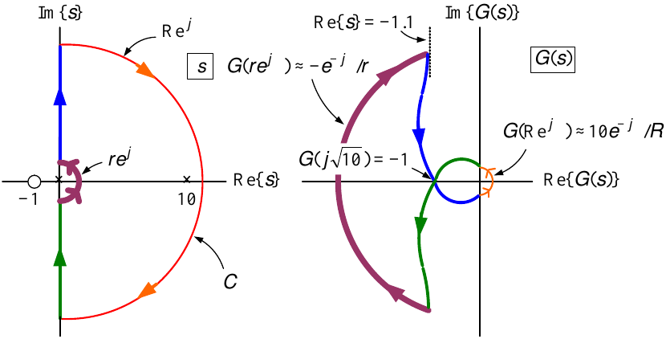

$s=Re^{j\theta },$ $-\pi /2\leq \theta \leq \pi /2$

$$G(Re^{j\theta })=\frac{10(Re^{j\theta }+1)}{Re^{j\theta }(Re^{j\theta }-10)}\approx \frac{10Re^{j\theta }}{Re^{j\theta }Re^{j\theta }}=10e^{-j\theta }/R.\begin{array}{|c|c|}
\hline
\theta  & G(Re^{j\theta })\approx \dfrac{10}{R}e^{-j\theta } \\ \hline
\pi /2 & -j10/R \\ \hline
0 &  \ \ \ 10/R \\ \hline
\!\!\!-\pi /2 &  \ \ j10/R \\ \hline
\end{array}$$
:::

---

::: {.compact-slide}

<strong>Example</strong>

*Principle of the Argument  *$G(s)=\dfrac{10(s+1)}{s(s-10)}=-\dfrac{s+1}{s(-s/10+1)}$

-   $G(s)$ has one pole **inside** the closed curve $\mathcal{C}$ so $P=1.$

-   $G(s)$ has no zeros of $G(s)$ **inside** the closed curve $\mathcal{C}$ so $Z=0.$

-   By inspection the image of $G(s)$ on $\mathcal{C}$ goes around the origin **once**

    in the **counterclockwise** direction. I.e., $N=-1.$

-   We have thus verified that $N=Z-P$ as both sides equal $-1.$
:::

---

::: {.compact-slide}

<strong>Nyquist Contour</strong> <strong>Definition</strong>

*Nyquist Contour*

A simple closed-curve enclosing the right half-plane.

The direction of travel is the *clockwise* direction.

**Examples**  *Nyquist Contour*

In both examples below let $R\rightarrow \infty .$

An open-loop pole on the $j\omega$ axis is bypassed using a semicircular detour with $r\rightarrow 0.$

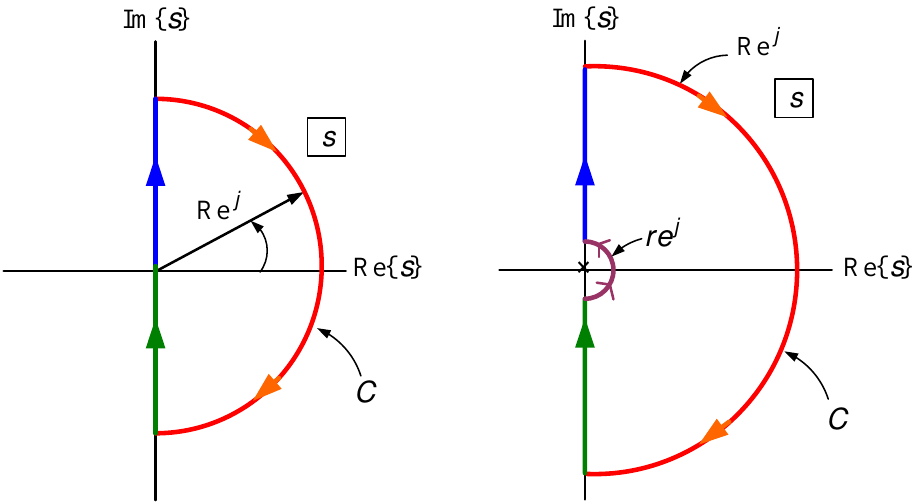

:::

---

::: {.compact-slide}

<strong>Nyquist Polar Plots</strong> <strong>Definition</strong>

*Nyquist Polar Plot*

The Nyquist polar plot is a plot of $G(s)$ as $s$ goes around the Nyquist contour in a clockwise fashion.

**Example**  *Nyquist Polar Plot  *$G(s)=\dfrac{1}{(s+1)(s+3)}$

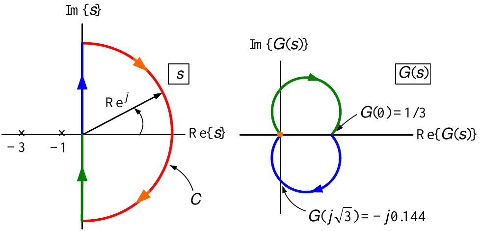

**Key observation:** The part of the Nyquist polar plot due to the $j\omega$ axis is found from the Bode diagram of $G(j\omega )$.
:::

---

::: {.compact-slide .multi-figure-slide}

<strong>Nyquist Polar Plots </strong>

$G(j\omega )=\dfrac{1}{(j\omega +1)(j\omega
+3)}=\dfrac{1}{3}\dfrac{1}{(j\omega +1)(j\omega /3+1)}$

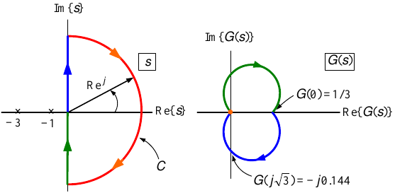

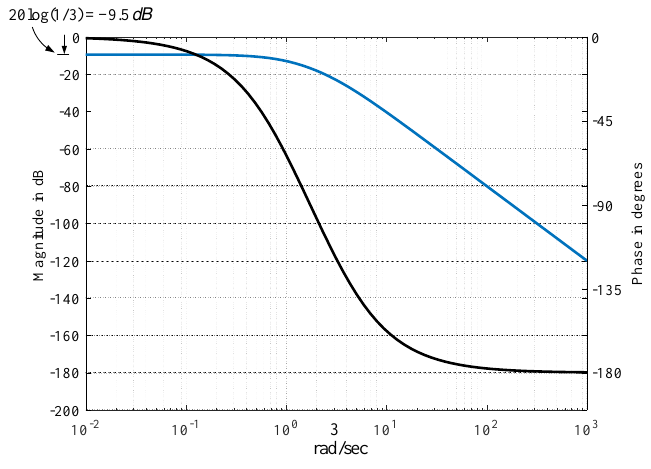

:::

---

::: {.compact-slide .multi-figure-slide}

<strong>Example </strong><em>Nyquist Polar Plots</em>

$G(s)=\dfrac{10(s+1)}{s(s-10)}=-\dfrac{s+1}{s(-s/10+1)}$

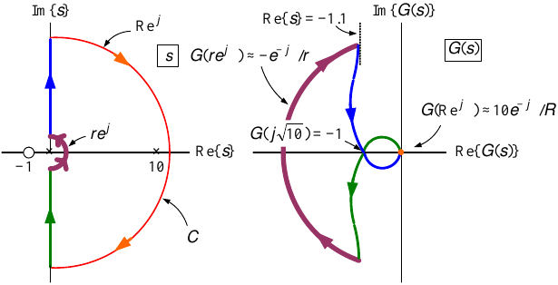

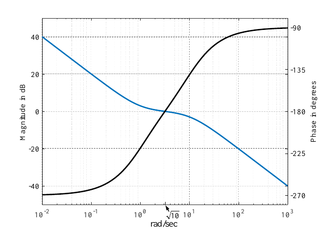

:::

---

::: {.compact-slide}

<strong>Example </strong><em>Nyquist Polar Plots</em>

$G(s)=\dfrac{10(s+1)}{s(s-10)}=-\dfrac{s+1}{s(-s/10+1)}$

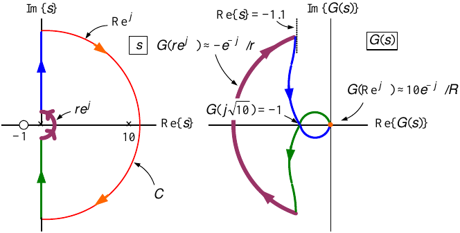

-   $G(Re^{j\theta })=\dfrac{10(Re^{j\theta }+1)}{Re^{j\theta
    }(Re^{j\theta }-10)}\approx \dfrac{10Re^{j\theta }}{Re^{j\theta }Re^{j\theta
    }}=\dfrac{10e^{-j\theta }}{R}\rightarrow 0$  as $R\rightarrow \infty
    .$

-   $G(re^{j\theta })=\dfrac{10(re^{j\theta }+1)}{re^{j\theta
    }(re^{j\theta }-10)}\approx \dfrac{10}{re^{j\theta }(-10)}=-\dfrac{e^{-j\theta }}{r}$  

    where $-\pi /2\leq \theta \leq \pi /2$ and $r\rightarrow 0.$
:::

---

::: {.compact-slide}

<strong>Nyquist Test for Stability</strong>

Open-loop transfer function: $G(s)=\dfrac{1}{(s+1)(s+3)}$

Proportional controller:

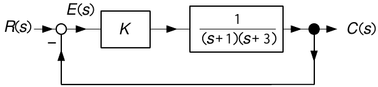

Closed-loop transfer function:

$$\frac{C(s)}{R(s)}=\frac{KG(s)}{1+KG(s)}=\frac{\dfrac{K}{(s+1)(s+3)}}{1+\dfrac{K}{(s+1)(s+3)}}=\frac{K}{(s+1)(s+3)+K}.$$

**Closed-loop poles** are the **zeros** of the **Return Difference**:

$$1+KG(s)=1+\dfrac{K}{(s+1)(s+3)}=\frac{(s+1)(s+3)+K}{(s+1)(s+3)}=0$$

Closed-loop system is **stable** if and only if

$$1+KG(s)\neq 0\;\text{for}\;\operatorname{Re}\{s\}\geq 0$$

or equivalently,

$$\frac{1}{K}+G(s)\neq 0\;\text{for}\;\operatorname{Re}\{s\}\geq 0.$$
:::

---

::: {.compact-slide}

<strong>Nyquist Test for Stability</strong>

-   $1+KG(s)=1+\dfrac{K}{(s+1)(s+3)}=\dfrac{(s+1)(s+3)+K}{(s+1)(s+3)}=0$

-   Nyquist stability test:  Apply the **principle of the argument** to

    $$\frac{1}{K}+G(s).$$

-   The curve $\mathcal{C}$ encloses the right half-plane.

-   Draw the corresponding polar plot.

:::

---

::: {.compact-slide .multi-figure-slide}

<strong>Nyquist Test for Stability</strong>

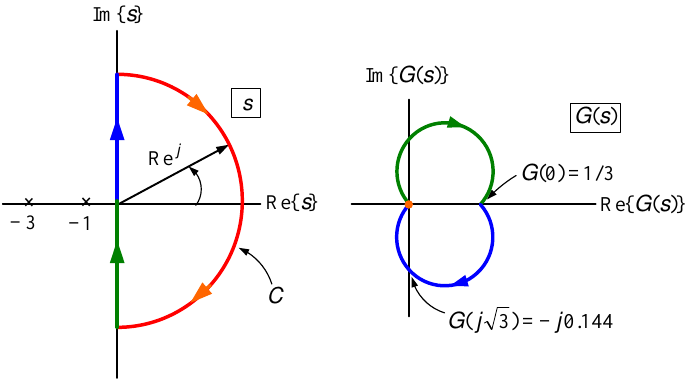

With $K>0$ shift the polar plot to the right by $1/K$.

:::

---

::: {.compact-slide}

<strong>Nyquist Test for Stability </strong>

$\dfrac{1}{K}+G(s)=\dfrac{1}{K}\dfrac{(s+1)(s+3)+K}{(s+1)(s+3)}$

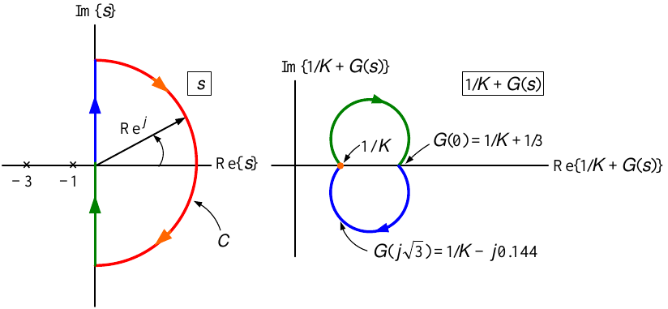

-   The poles of $1/K+G(s)$ are the poles of $G(s)$.

    These are not inside the curve $\mathcal{C}$ so $P=0.$

-   With $K>0$ the image of $1/K+G(s)$ does **not** go around the origin so $N=0.$

-   By the principle of the argument we have

    $$N=Z-P$$

    or

    $$Z=N+P=0+0=0.$$

-   So $1/K+G(s)$ has no roots in the RHP $\Longrightarrow$ closed-loop system is stable.
:::

---

::: {.compact-slide .multi-figure-slide .dense-figure-slide}

<strong>Slightly Easier Procedure: </strong>

$\dfrac{1}{K}+G(s)=\dfrac{1}{K}\left(
1+KG(s)\!\right) =\dfrac{1}{K}\dfrac{(s+1)(s+3)+K}{(s+1)(s+3)}$

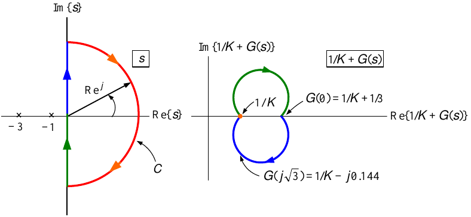

-   $1/K+G(s)$ goes around the origin if and only if $G(s)$ goes around $-1/K.$

-   Draw the Nyquist plot of $G(s)$ and mark the $-1/K$ point on the plot.

-   With $K>0$ the polar plot of $G(s)$ does not go around $-1/K$ $\Longrightarrow N=0.$

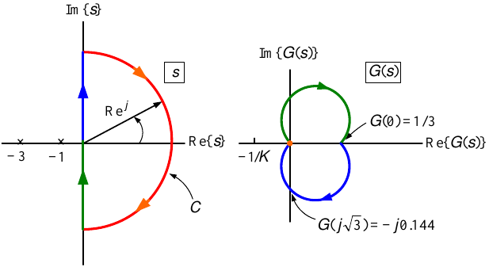

:::

---

::: {.compact-slide .dense-figure-slide}

<strong>Nyquist Test for Stability </strong>

$G(s)=\dfrac{10(s+1)}{s(s-10)}=-\dfrac{s+1}{s(-s/10+1)}$

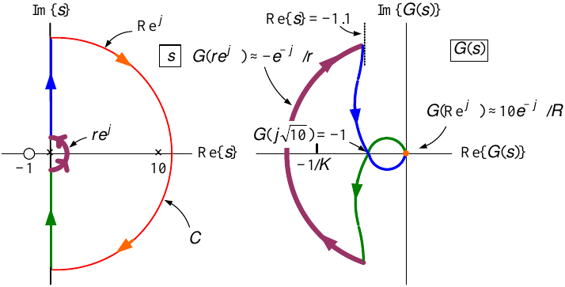

-   $\dfrac{1}{K}\left( 1+KG(s)\!\right) =\dfrac{1}{K}\left(
    1+K\dfrac{10(s+1)}{s(s-10)}\right) =\dfrac{1}{K}\dfrac{s(s-10)+K10(s+1)}{s(s-10)}.$

-   The pole of $G(s)$ at $s=10$ is inside the curve $\mathcal{C}$ so $P=1.$

-   The number of times $1/K+G(s)$ goes around the origin is the **same** as the number of times $G(s)$ goes around $-1/K.$

**Case (1)** Suppose $-\infty <-1/K<-1$ which means $0<K<1.$

Then $N=1$ as $G(s)$ goes around $-1/K$ once in the clockwise direction. As $N=Z-P$

$$Z=N+P=1+1=2$$

$1/K+G(s)=0$ has two zeros in the right half-plane.

The closed-loop system is unstable for $0<K<1.$
:::

---

::: {.compact-slide}

<strong>Nyquist Test for Stability </strong>

$G(s)=\dfrac{10(s+1)}{s(s-10)}=-\dfrac{s+1}{s(-s/10+1)}$

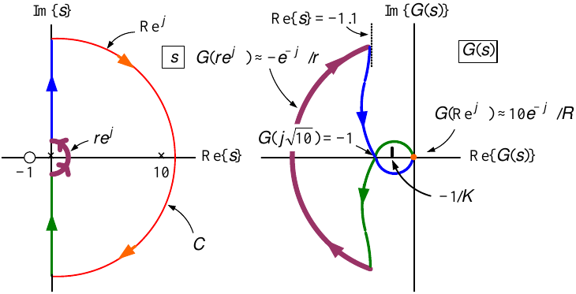

**Case (2)  **Suppose $-1<-1/K<0$ which means $K>1.$

$N=-1$ as $G(s)$ goes around $-1/K$ once in the counterclockwise direction.

By the mapping theorem we have

$$Z=N+P=-1+1=0$$

$1/K+G(s)=0$ has no zeros in the right half-plane.

The closed-loop system is stable for $K>1.$

**Check:** Apply the Routh-Hurwitz test to $s(s-10)+10K(s+1)=0.$
:::

---

::: {.compact-slide .multi-figure-slide}

<strong>Example</strong>

$G(s)=\dfrac{1}{(s+1)(s^{2}+\sqrt{2}s+1)}$ $=\dfrac{1}{(s+1)(s-[-1/\sqrt{2}+j/\sqrt{2}])(s-[-1/\sqrt{2}-j/\sqrt{2}])}$

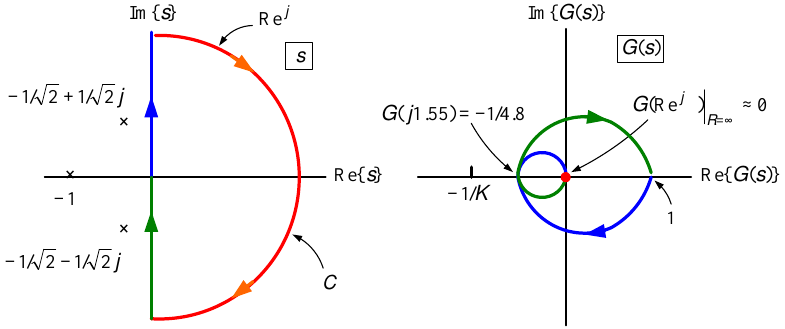

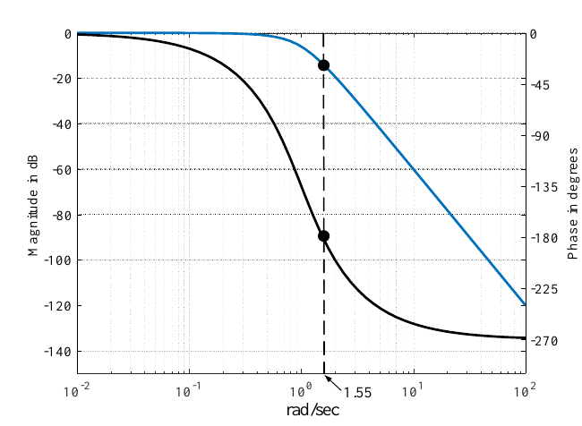

:::

---

::: {.compact-slide}

<strong>Example</strong>

$G(s)=\dfrac{1}{(s+1)(s^{2}+\sqrt{2}s+1)}$ $=\dfrac{1}{(s+1)(s-[-1/\sqrt{2}+j/\sqrt{2}])(s-[-1/\sqrt{2}-j/\sqrt{2}])}$

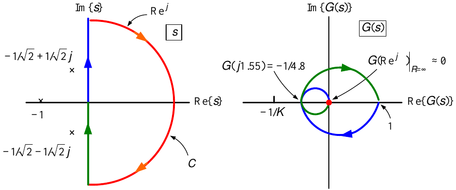

-   For what values of $K>0$ are the **zeros** of $\dfrac{1}{K}+G(s)=0$ in the open LHP?

**Case (1)** Let $-1/K<-1/4.8$ so $0<K<4.8.$

$P=0$ and we see above that $N=0$ so

$$Z=N+P=0.$$

Thus $1/K+G(s)$ has **no** zeros in the right half-plane for $0<K<4.8$

$\Longrightarrow$ Closed-loop system is **stable**.
:::

---

::: {.compact-slide}

<strong>Example</strong>

$G(s)=\dfrac{1}{(s+1)(s^{2}+\sqrt{2}s+1)}$ $=\dfrac{1}{(s+1)(s-[-1/\sqrt{2}+j/\sqrt{2}])(s-[-1/\sqrt{2}-j/\sqrt{2}])}$

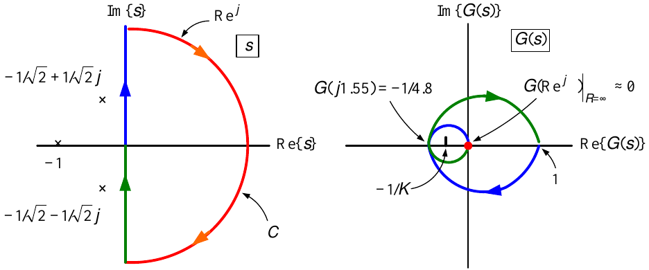

**Case (2)** Let $-1/4.8<-1/K$ so $K>4.8$.

$P=0$ and from the above plot we see $N=2.$  Thus

$$Z=N+P=2+0=2.$$

Thus $1/K+G(s)$ has **two** zeros in the right half-plane for $K>4.8.$

$\Longrightarrow$ Closed-loop system is **unstable**.

**Check:** Apply the Routh-Hurwitz test to $(s+1)(s^{2}+\sqrt{2}s+1)+K=0.$
:::

---

::: {.compact-slide .multi-figure-slide}

<strong>Example</strong>

*Nyquist Stability Test   *$G(s)=\dfrac{1}{s(s+1)^{2}}$

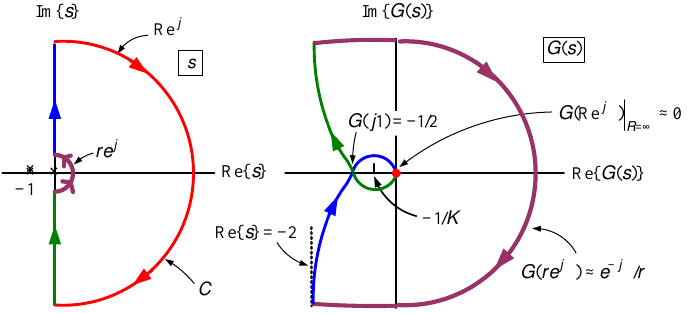

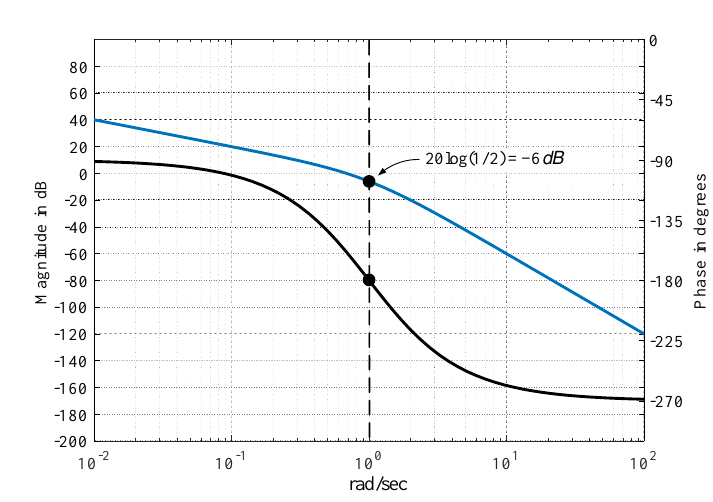

:::

---

::: {.compact-slide}

<strong>Example</strong>

*Nyquist Stability Test   *$G(s)=\dfrac{1}{s(s+1)^{2}}$

Let $s=re^{j\theta }$ for $-\pi /2\leq \theta \leq \pi /2$. Then

$$G(re^{j\theta })=\dfrac{1}{re^{j\theta }(re^{j\theta }+1)^{2}}\approx \dfrac{1}{re^{j\theta }}=\frac{1}{r}e^{-j\theta }\begin{array}{|c|c|}
\hline
\theta  & G(re^{j\theta })\approx \dfrac{1}{r}e^{-j\theta } \\ \hline
-\pi /2 & e^{j\pi /2}/r=j/r
\\ \hline
-\pi /4 & e^{j\pi /4}/r \\ 
\hline
\quad 0 & 1/r \\ \hline
+\pi /4 & e^{-j\pi /4}/r \\ 
\hline
+\pi /2 & e^{-j\pi /2}/r=-j/r
\\ \hline
\end{array}$$
:::

---

::: {.compact-slide}

<strong>Example</strong>

*Nyquist Stability Test   *$G(s)=\dfrac{1}{s(s+1)^{2}}$

**Case (1)** Let $-1/2<-1/K<0$ so $K>2.$

$P=0$ and from the above plot that $N=2,P=0$ so

$$Z=N+P=2.$$

Thus $1/K+G(s)$ has **two** zeros in the right half-plane for $K>2.$

$\Longrightarrow$  Closed-loop system is unstable.
:::

---

::: {.compact-slide}

<strong>Example</strong>

*Nyquist Stability Test   *$G(s)=\dfrac{1}{s(s+1)^{2}}$

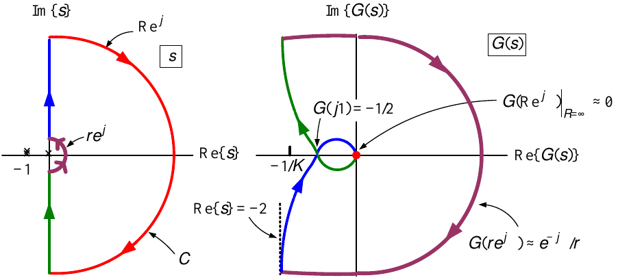

**Case (2)** Let $-1/K<-1/2$ so $0<K<2.$

$P=0$ and the above plot shows $N=0$ so

$$Z=N+P=0.$$

Thus $1/K+G(s)$ has **no** zeros in the right half-plane for $0<K<2.$

$\Longrightarrow$  Closed-loop system is stable.
:::

---

::: {.compact-slide .multi-figure-slide}

<strong>Example</strong>

$G(s)=\dfrac{100(s/10+1)}{s(s-1)(s/100+1)}=-\dfrac{100(s/10+1)}{s(-s+1)(s/100+1)}$

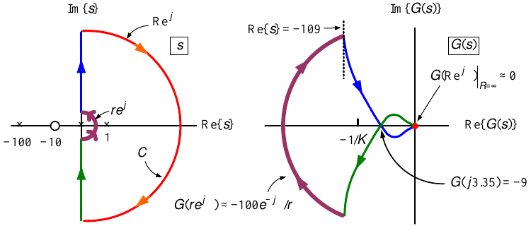

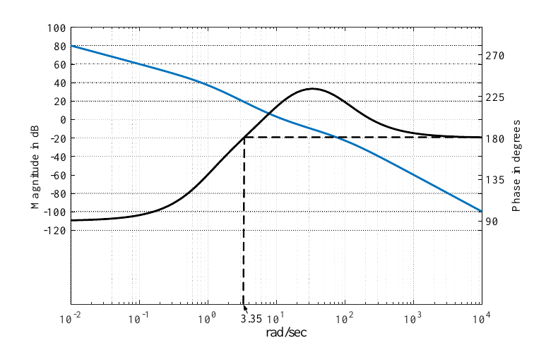

:::

---

::: {.compact-slide}

<strong>Example</strong>

$G(s)=\dfrac{100(s/10+1)}{s(s-1)(s/100+1)}=-\dfrac{100(s/10+1)}{s(-s+1)(s/100+1)}$

Let $s=re^{j\theta }$ for $-\pi /2\leq \theta \leq \pi /2$. Then

$$G(re^{j\theta })=\dfrac{100(re^{j\theta }/10+1)}{re^{j\theta }(re^{j\theta
}-1)(re^{j\theta }/100+1)}\approx -\dfrac{100}{re^{j\theta }}=-\frac{100}{r}e^{-j\theta }.\begin{array}{|c|c|}
\hline
\theta  & G(re^{j\theta })\approx -\dfrac{100}{r}e^{-j\theta } \\ \hline
-\pi /2 & -100e^{j\pi
/2}/r=-j100/r \\ \hline
-\pi /4 & -100e^{j\pi /4}/r
\\ \hline
0 & -100/r \\ \hline
\pi /4 & -100e^{-j\pi /4}/r
\\ \hline
\pi /2 & -100e^{-j\pi
/2}/r=j100/r \\ \hline
\end{array}$$
:::

---

::: {.compact-slide}

<strong>Example</strong>

$G(s)=\dfrac{100(s/10+1)}{s(s-1)(s/100+1)}=-\dfrac{100(s/10+1)}{s(-s+1)(s/100+1)}$

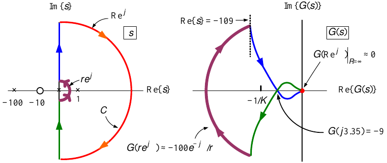

**Case (1)** $-1/K<-9$ ($0<K<1/9$).

$P=1$ and from the above plot $N=1.$ Thus $Z=N+P=2$.

$1/K+G(s)$ has **two** zeros in the right half-plane.

$\Longrightarrow$  Closed-loop system is **unstable** for $0<K<1/9.$

**Case (2)** $-9<-1/K<0$ ($K>1/9$).

$P=1$ and $N=-1.$ Thus $Z=N+P=-1+1=0$.

$1/K+G(s)$ has **no** zeros in the right half-plane.

$\Longrightarrow$  Closed-loop system is **stable** for $K>1/9.$
:::

---

::: {.compact-slide .dense-figure-slide}

<strong>Relative Stability: Gain and Phase Margins</strong>

-   Closed-loop transfer function $\dfrac{C(s)}{R(s)}=\dfrac{KG(s)}{1+KG(s)}.$ 

-   Closed-loop system is stable **iff** the **zeros** of $1+KG(s)$ are in the open LHP.

The following statements are equivalent:

**(1)** $\ G(j\omega ),-\infty <\omega <\infty$ goes around the $-1/K+j0$ point $N$ times.

**(2)** $\ 1/K+G(j\omega ),-\infty <\omega <\infty$ goes around the origin $N$ times.

**(3)** $\ 1+KG(j\omega ),-\infty <\omega <\infty$ goes around the origin $N$ times.

**(4)** $\ KG(j\omega ),-\infty <\omega <\infty$ goes around the $-1+j0$ point $N$ times.

For the concept of **gain and phase margins** we use statement $\mathbf{(4)}.$
:::

---

::: {.compact-slide .multi-figure-slide .dense-figure-slide}

<strong>Example</strong>

$G(s)=\dfrac{2}{(s+1)(s^{2}+\sqrt{2}s+1)}$ $=\dfrac{2}{(s+1)(s-[-1/\sqrt{2}+j/\sqrt{2}])(s-[-1/\sqrt{2}-j/\sqrt{2}])}$

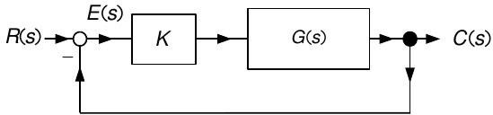

-   $\angle G(j1.55)=180^{\circ },$ $\ G(j1.55)=-1/2.4$

$P=0$ and the Nyquist plot does not encircle the $-1+j0$ point for $0<K<2.4$.

$\Longrightarrow 1+KG(s)=0$ does not have any zeros in the right half-plane for $0<K<2.4$.
:::

---

::: {.compact-slide}

<strong>Example</strong>

$G(s)=\dfrac{2}{(s+1)(s^{2}+\sqrt{2}s+1)}$ $=\dfrac{2}{(s+1)(s-[-1/\sqrt{2}+j/\sqrt{2}])(s-[-1/\sqrt{2}-j/\sqrt{2}])}$

We just showed the closed-loop system is stable for $0<K<2.4.$

The gain $K$ can be increased to 2.4 before the system becomes unstable.

We say the **gain margin** is 2.4 or, in decibels, it is $20\log
_{10}2.4=7.6$ dB.
:::

---

::: {.compact-slide .dense-figure-slide}

<strong>Example</strong>

$G(s)=\dfrac{2}{(s+1)(s^{2}+\sqrt{2}s+1)},$  $G(j1)=\dfrac{2}{\sqrt{2}e^{j\pi /4}(\sqrt{2}j)}=1e^{-j3\pi /4}$

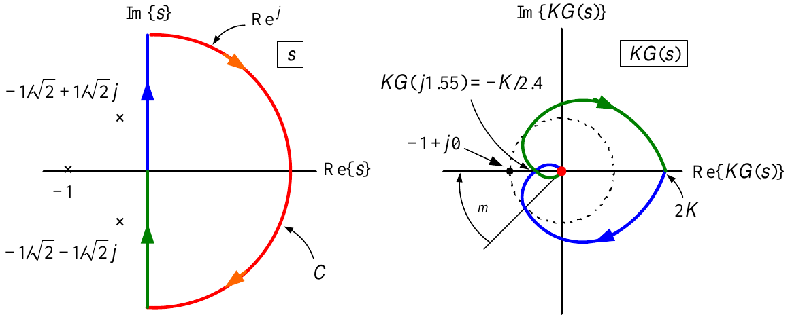

-   Note the (dashed) circle of radius 1 centered at the origin.

-   $\omega _{g}$ is the value of $\omega$ for which $|G(j\omega
    _{g})|=1.$  Here $\omega _{g}=1$ and $G(j\omega _{g})=1e^{-j3\pi /4}.$

-   The angle $\phi _{m}$ between $G(j\omega _{g})$ and the neg real axis is the **phase margin**, i.e.,

    $$\phi _{m}=\angle G(j\omega _{g})+180^{\circ }=-135^{\circ }+180^{\circ
    }=45^{\circ }.$$

-   The phase margin is how much the Nyquist plot can be rotated before it encloses the $-1+j0$ point.
:::

---

::: {.compact-slide}

<strong>Example</strong>

$G(s)=\dfrac{2}{(s+1)(s^{2}+\sqrt{2}s+1)}$ $=\dfrac{2}{(s+1)(s-[-1/\sqrt{2}+j/\sqrt{2}])(s-[-1/\sqrt{2}-j/\sqrt{2}])}$

**Definition**  *Gain Crossover Frequency* $\omega _{g}$

A *gain crossover* frequency is a frequency $\omega _{g}$ at which

$$|G(j\omega _{g})|=1\;\iff \;20\log |G(j\omega _{g})|=0.$$

**Definition**  *Phase Crossover Frequency* $\omega _{\phi }$

A *phase crossover* frequency is a frequency $\omega _{\phi }$ at which

$$\angle G(j\omega _{\phi })=-180^{\circ }.$$
:::

---

::: {.compact-slide}

<strong>Gain and Phase Margins from the Bode Diagram </strong>

$G(s)=\dfrac{2}{(s+1)(s^{2}+\sqrt{2}s+1)}$

The phase crossover frequency is $\omega _{\phi }=1.55.$

$20\log _{10}|G(j1.55)|=20\log _{10}|-1/2.4|=-7.6$ dB.

$\Longrightarrow$ **Gain margin** is $7.6$ dB.

The gain crossover frequency is $\omega _{g}=1$ and $G(j\omega
_{g})=G(j1)=1e^{-j3\pi /4}=1e^{-j135^{\circ }}.$

$\Longrightarrow$ **Phase margin** is $45^{\circ }.$

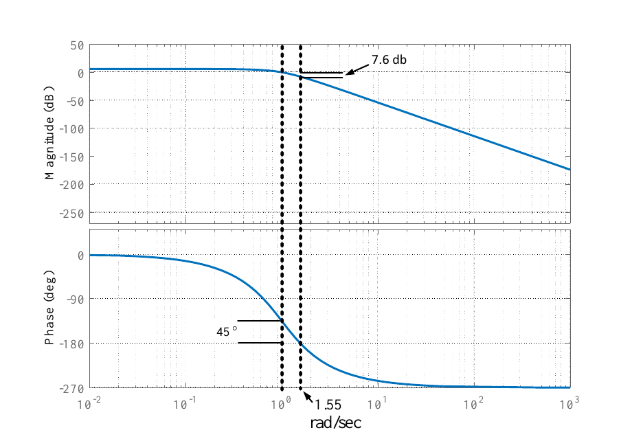

:::

---

::: {.compact-slide}

<strong>Gain and Phase Margins </strong>

$G(s)=\dfrac{1}{s(s+1)^{2}}$

-   $\omega _{g}=1$ and $G(j\omega _{g})=G(j1)=-1/2.$

-   $\omega _{\phi }=0.68$ and $G(j\omega _{\phi
    })=G(j0.68)=1e^{-j159^{\circ }}$

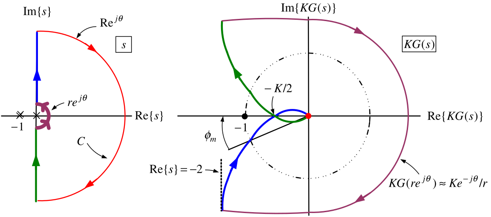

-   $P=0$

-   For $0<K<2,$ we have $N=0$ and thus $Z=N+P=0.$ **Stable!**

-   For $K>2$ we have $N=2$ and thus $Z=N+P=2.$ **Unstable!**

The **gain margin** is $20\log _{10}2=6.02$ dB$.$

The **phase margin** is $\phi _{m}=\angle G(j\omega
_{g})+180=-159^{\circ }+180^{\circ }=21^{\circ }.$
:::

---

::: {.compact-slide}

<strong>Gain and Phase Margins from the Bode Diagram </strong>

$G(s)=\dfrac{1}{s(s+1)^{2}}$

.

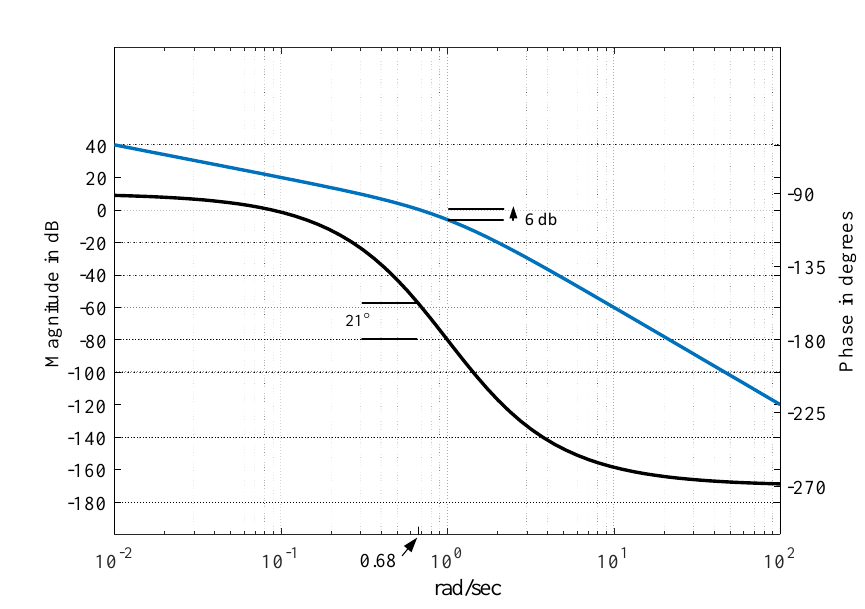

**Important information at the crossover frequencies:**

$$\begin{array}{|l|l|l|}
\hline
\omega _{g}=0.68 & 20\log _{10}|G(j\omega _{g})|=0 dB & \angle
G(j\omega _{g})=-159^{\circ } \\ \hline
\omega _{\phi }=1 & 20\log _{10}|G(j\omega _{\phi })|=20\log
_{10}(1/2)=-6  dB & \angle G(j\omega _{\phi })=-180^{\circ } \\ \hline
\end{array}$$
:::

---

::: {.compact-slide}

<strong>Gain and Phase Margins </strong>

$G(s)=\dfrac{100(s/10+1)}{s(s-1)(s/100+1)},$ $\ G(j3.35)=-9,$ $\ G(j12.6)=1e^{-j140^{\circ }}$

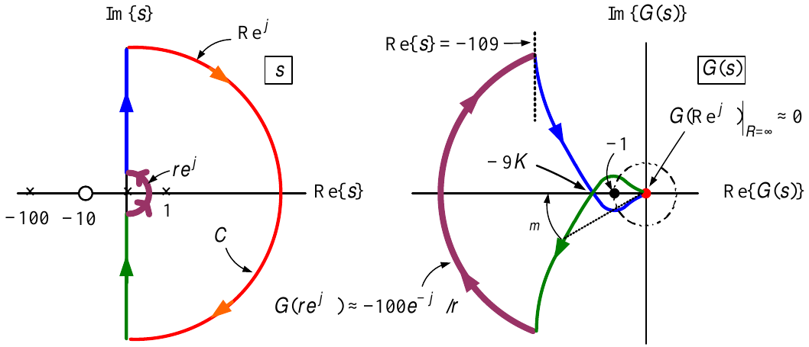

$$\begin{array}{|l|l|l|}
\hline
\omega _{g}=12.6 & 20\log _{10}|G(j\omega _{g})|=0 dB & \angle
G(j\omega _{g})=-140^{\circ } \\ \hline
\omega _{\phi }=3.35 & 20\log _{10}|G(j\omega _{\phi })|=20\log
_{10}(|-9|)=19.1 dB & \angle G(j\omega _{\phi })=-180^{\circ }. \\ \hline
\end{array}$$

-   $P=1$

-   For $K>1/9$ we have $N=-1$ and thus $Z=N+P=-1+1=0.$  **Stable!**

-   For $K<1/9$ we have $N=+1$ and thus $Z=N+P=\quad \!1+1=2.$  **Unstable!**
:::

---

::: {.compact-slide}

<strong>Gain and Phase Margins from the Bode Diagram </strong>

$G(s)=\dfrac{100(s/10+1)}{s(s-1)(s/100+1)}$

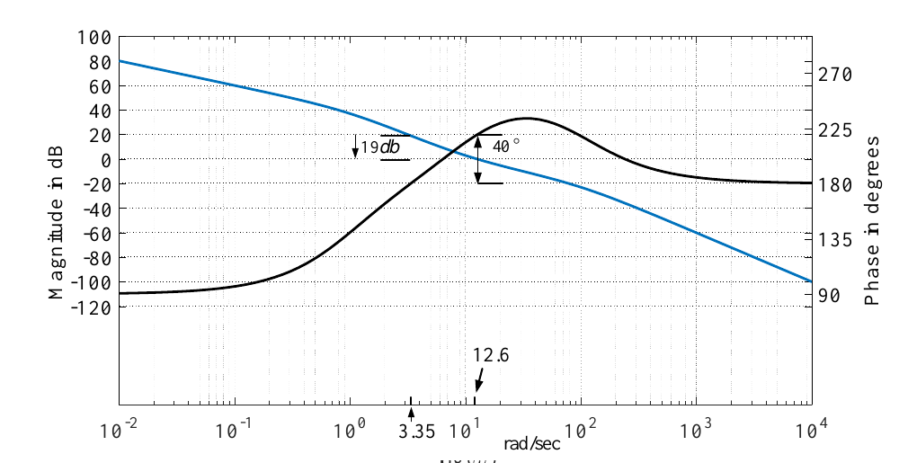

-   Here the gain margin is the amount $K$ can **reduced** before becoming **unstable**.

    The **gain margin** is $20\log _{10}(1/9)=-19.1$ dB

-   At the gain crossover frequency $\omega _{g}=12.6$ and $\angle
    G(j\omega _{g})=\angle G(j12.6)=-140^{\circ }.$

    Nyquist plot can be rotated by $40^{\circ }$ before becoming unstable.

    The **phase margin** is $40^{\circ }.$
:::

---

::: {.compact-slide .expanded-body-slide}

<strong>Closed-Loop Bandwidth</strong>

A system $G(s)$ has controller $G_{c}(s).$

The **closed-loop** transfer function $T(s)$ is

$$\frac{Y(s)}{R(s)}=T(s)=\frac{G_{c}(s)G(s)}{1+G_{c}(s)G(s)}.$$

Objective: Design a controller based on the frequency response $G(j\omega
).$

To explain we need the **Fourier transform**. Let

$$\frac{Y(s)}{R(s)}=T(s)=\frac{b_{2}s^{2}+b_{1}s+b_{0}}{s^{3}+a_{2}s^{2}+a_{1}s+a_{0}},$$

with corresponding DiffyQ is

$$\frac{d^{3}}{dt^{2}}y(t)+a_{2}\frac{d^{2}}{dt}y(t)+a_{1}\frac{d}{dt}y(t)+a_{0}y(t)=b_{2}\frac{d^{2}}{dt}r(t)+a_{1}\frac{d}{dt}r(t)+a_{0}r(t).$$

The Fourier transform of $y(t)$ and $r(t)$ are, respectively, defined by

$$Y(j\omega )\triangleq \int_{-\infty }^{+\infty }y(t)e^{-j\omega t}dt\;\text{and}\;R(j\omega )\triangleq \int_{-\infty }^{+\infty }r(t)e^{-j\omega t}dt.$$
:::

---

::: {.compact-slide .expanded-body-slide}

<strong>Closed-Loop Bandwidth</strong>

Fourier Transform of $r(t)$ and $y(t).$

$$Y(j\omega )\triangleq \int_{-\infty }^{+\infty }y(t)e^{-j\omega t}dt\;\text{and}\;R(j\omega )\triangleq \int_{-\infty }^{+\infty }r(t)e^{-j\omega t}dt.$$

-   Continue to take all signals to be zero for $t<0.$

-   That is, $r(t)=0$ for $t<0$ and $y(t)=0$ for $t<0.$

-   With this convention we have

    $$Y(j\omega )=Y(s)|_{s=j\omega }\;\text{and}\;R(j\omega )=R(s)|_{s=j\omega }.$$

-   $y(t)$ and $r(t)$ are recovered using the *inverse Fourier transform.*

    $$\begin{aligned}
    y(t) &=&\frac{1}{2\pi }\int_{-\infty }^{+\infty }Y(j\omega )e^{j\omega
    t}d\omega \\
    r(t) &=&\frac{1}{2\pi }\int_{-\infty }^{+\infty }R(j\omega )e^{j\omega
    t}d\omega .
    \end{aligned}$$
:::

---

::: {.compact-slide .expanded-body-slide}

<strong>Closed-Loop Bandwidth</strong> <strong>Inverse Fourier transform</strong>

$$\begin{aligned}
y(t) &=&\frac{1}{2\pi }\int_{-\infty }^{+\infty }Y(j\omega )e^{j\omega
t}d\omega \\
r(t) &=&\frac{1}{2\pi }\int_{-\infty }^{+\infty }R(j\omega )e^{j\omega
t}d\omega .
\end{aligned}$$

-   $y(t)$ is made up of the sum (integral) of the pure sinusoids $Y(j\omega )e^{j\omega t}d\omega .$

-   $Y(j\omega )d\omega$ is the *frequency content* of $y(t)$ between $\omega$ and $\omega +d\omega .$

    Similarly for $r(t).$

-   Differentiating with respect to $t$ gives

    $$\begin{aligned}
    \frac{d}{dt}y(t) &=&\frac{1}{2\pi }\int_{-\infty }^{+\infty }j\omega
    Y(j\omega )e^{j\omega t}d\omega \\
    \frac{d}{dt}r(t) &=&\frac{1}{2\pi }\int_{-\infty }^{+\infty }j\omega
    R(j\omega )e^{j\omega t}d\omega .
    \end{aligned}$$

-   Fourier transform of $\dfrac{dy}{dt}$ is $j\omega Y(j\omega ).$

-   Fourier transform of $\dfrac{dr}{dt}$ is $j\omega R(j\omega ).$
:::

---

::: {.compact-slide .expanded-body-slide}

<strong>Closed-Loop Bandwidth</strong>

$$\begin{aligned}
y(t) &=&\frac{1}{2\pi }\int_{-\infty }^{+\infty }Y(j\omega )e^{j\omega
t}d\omega ,\;\dfrac{dy}{dt}\Leftrightarrow j\omega Y(j\omega ) \\
r(t) &=&\frac{1}{2\pi }\int_{-\infty }^{+\infty }R(j\omega )e^{j\omega
t}d\omega ,\;\dfrac{dr}{dt}\Leftrightarrow j\omega R(j\omega ).
\end{aligned}$$

The Fourier transform of

$$\frac{d^{3}}{dt^{2}}y(t)+a_{2}\frac{d^{2}}{dt}y(t)+a_{1}\frac{d}{dt}y(t)+a_{0}y(t)=b_{2}\frac{d^{2}}{dt}r(t)+a_{1}\frac{d}{dt}r(t)+a_{0}r(t).$$

is

$$\!(j\omega )^{3}Y(j\omega )\!+\!a_{2}(j\omega )^{2}Y(j\omega
)\!+\!a_{1}(j\omega )Y(j\omega )\!+\!a_{0}Y(j\omega )=b_{2}(j\omega
)^{2}R(j\omega )\!+\!a_{1}(j\omega )^{2}R(j\omega )\!+\!a_{0}R(j\omega ).$$

Then

$$\frac{Y(j\omega )}{R(j\omega )}=\frac{b_{2}(j\omega )^{2}+b_{1}(j\omega
)+b_{0}}{(j\omega )^{3}+a_{2}(j\omega )^{2}+a_{1}(j\omega )+a_{0}}=T(j\omega
).$$

-   This is simply the transfer function $T(s)$ evaluated at $s=j\omega .$
:::

---

::: {.compact-slide .dense-figure-slide}

<strong>Closed-Loop Bandwidth</strong>

$y(t)$

may be written as

$$y(t)=\frac{1}{2\pi }\int_{-\infty }^{+\infty }Y(j\omega )e^{j\omega
t}d\omega =\frac{1}{2\pi }\int_{-\infty }^{+\infty }T(j\omega )R(j\omega
)e^{j\omega t}d\omega .$$

-   $R(j\omega )d\omega$ is the *frequency content* of $r(t)$ between $\omega$ and $\omega +d\omega .$

-   The *frequency content* of $y(t)$ in this same interval is $T(j\omega )R(j\omega )d\omega .$

-   $y(t)$ is the sum (integral) of the pure sinusoids $T(j\omega
    )R(j\omega )e^{j\omega t}d\omega .$

-   The goal is to have $y(t)$ track $r(t)$.

-   Need to find $G_{c}(j\omega )$ so that the closed-loop transfer function

    $$T(j\omega )=\dfrac{G_{c}(j\omega )G(j\omega )}{1+G_{c}(j\omega )G(j\omega )}$$

    satisfies

    $$T(j\omega )\approx \left\{ 
    \begin{array}{cl}
    1, & |\omega |\leq \omega _{B} \\ 
    0, & |\omega |>\omega _{B}.\end{array}\right.$$

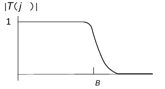

:::

---

::: {.compact-slide .dense-figure-slide}

<strong>Closed-Loop Bandwidth</strong>

-   $\omega _{B}$ is the *bandwidth* of the closed-loop system.

    $$T(j\omega )=\dfrac{G_{c}(j\omega )G(j\omega )}{1+G_{c}(j\omega )G(j\omega )}\;\text{with}\;T(j\omega )\approx \left\{ 
    \begin{array}{cl}
    1, & |\omega |\leq \omega _{B} \\ 
    0, & |\omega |>\omega _{B}.\end{array}\right.$$

-   Tracking: Suppose $R(j\omega )\approx 0$  for  $|\omega |>\omega
    _{B}$.

    $$\begin{aligned}
    \!\!\!\!y(t)=\frac{1}{2\pi }\!\!\int\limits_{-\infty }^{+\infty
    }\!\!\!T(j\omega )R(j\omega )e^{j\omega t}d\omega \!\!\!\!\! &\!\!\approx
    \!\!\!\!\!&\!\!\frac{1}{2\pi }\!\!\int\limits_{-\omega _{B}}^{+\omega
    _{B}}\!\!\!T(j\omega )R(j\omega )e^{j\omega t}d\omega \;\text{as}\;R(j\omega
    )\approx 0\;\text{for}\;|\omega |\!>\omega _{B} \\
    &\approx &\frac{1}{2\pi }\int\limits_{-\omega _{B}}^{+\omega _{B}}R(j\omega
    )e^{j\omega t}d\omega \;\text{as}\;T(j\omega )\approx 1\;\text{for}\;|\omega
    |\leq \omega _{B} \\
    &\approx &\frac{1}{2\pi }\int\limits_{-\infty }^{+\infty }R(j\omega
    )e^{j\omega t}d\omega \;\text{as}\;R(j\omega )\approx 0\;\text{for}\;|\omega
    |>\omega _{B} \\
    &\approx &r(t).
    \end{aligned}$$
:::

---

::: {.compact-slide .dense-figure-slide .expanded-mixed-slide}

<strong>Closed-Loop Bandwidth</strong>

-   Design the controller so $T(j\omega )\approx 1$ for $|\omega |\leq
    \omega _{B}$ and $T(j\omega )\approx 0$ for $|\omega |>\omega _{B}.$

-   If $R(j\omega )\approx 0$ for $|\omega |>\omega _{B}$, then should have good tracking.

-   With $T(s)$ stable and $r(t)=R_{0}\cos (\omega t)$,

    $$y(t)\rightarrow y_{ss}(t)=|T(j\omega )|R_{0}\cos (\omega t+\angle T(j\omega
    ))\approx R_{0}\cos (\omega t)\;\text{for}\;|\omega |\leq \omega _{B}.$$

-   A typical reference is a step input. Unit step does not have a Fourier transform.

    $$\int_{-\infty }^{\infty }u_{s}(t)e^{-j\omega t}dt=\int_{0}^{\infty
    }u_{s}(t)e^{-j\omega t}dt=\left. \frac{e^{-j\omega t}}{-j\omega }\right\vert
    _{0}^{\infty }=\underset{\text{does not converge}}{\underbrace{\lim_{t\rightarrow \infty }\frac{e^{-j\omega t}}{-j\omega }}}+\frac{1}{j\omega }\text{.}$$
:::

---

::: {.compact-slide}

<strong>Closed-Loop Bandwidth</strong>

-   Replace $r(t)=u_{s}(t)$ with $r(t)=e^{-\alpha t}u_{s}(t)$ with $\alpha$ very small.

-   $e^{-\alpha t}u_{s}(t)\approx 1$ for $0\leq t\leq \dfrac{0.01}{\alpha }$ ($e^{-0.01}=0.99).$  The FT of $e^{-\alpha t}u_{s}(t)$ is

    $$\int_{-\infty }^{\infty }e^{-\alpha t}u_{s}(t)e^{-j\omega t}dt=\frac{1}{\alpha +j\omega }.$$

-   With $\omega _{B}=10,$ for $|\omega |>\omega _{B}$ we have

    $$\left\vert R(j\omega )\right\vert =\left\vert \dfrac{1}{\alpha +j\omega }\right\vert \leq \dfrac{1}{10}<<\dfrac{1}{\alpha }$$

-   $\dfrac{1}{\alpha }$ is the peak value of $\left\vert R(j\omega
    )\right\vert$ ($\alpha$ is very small).

-   If the controller provides a CL bandwidth of $10$, good tracking of step functions.

**Definition** *Closed-Loop Bandwidth*

Let $T(j\omega )$ be stable with $T(j0)=1,|T(j\omega )|\approx 1$ for $|\omega |\leq \omega _{B},$

and $|T(j\omega )|\rightarrow 0$ rapidly for $|\omega |>\omega _{B}.$

The closed-loop bandwidth $\omega _{B}$ is the frequency $\omega _{B}$ that satisfies

$$|T(j\omega _{B})|=|T(0)|/\sqrt{2}=1/\sqrt{2}.$$

Equivalently, $20\log _{10}|T(j\omega _{B})|=20\log _{10}(1/\sqrt{2})=-3$ dB.
:::

---

::: {.compact-slide}

<strong>Closed-Loop Bandwidth</strong>

Bode Diagam of $T(j\omega )=\dfrac{1}{\tau j\omega +1}=\dfrac{1/\tau }{j\omega +1/\tau }.$

-   $\tau =0.2$

-   $\omega _{b}=1/\tau =5$ as $|T(j5)|=1/\sqrt{2}$ or  $20\log
    _{10}(|T(j5)|)=$ $-3$ dB.

-   $p=-1/\tau =-5.$ The further in the LFP the pole resides, the larger the bandwidth.

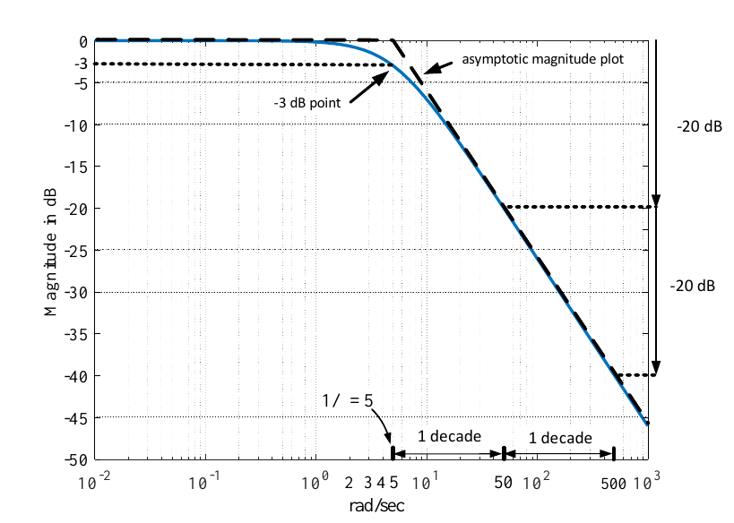

:::

---

::: {.compact-slide}

<strong>Closed-Loop Bandwidth</strong>

Bode Diagam of $\angle T(j\omega )=\angle \dfrac{1}{\tau j\omega +1}=\angle 
\dfrac{1/\tau }{j\omega +1/\tau }.$

-   $\tau =0.2$

-   $\omega _{b}=1/\tau =5$ as $|T(j5)|=1/\sqrt{2}$ or  $20\log
    _{10}(|T(j5)|)=$ $-3$ dB.

-   The angle plot shows the frequency must be below $0.1\omega _{B}$ for $\angle T(j\omega )\approx 0.$

-   That is, $T(j\omega )\approx 1$ is only reasonable for $|\omega
    |<0.1\omega _{B}.$

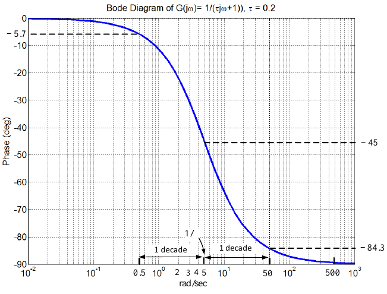

:::

---

::: {.compact-slide}

<strong>Closed-Loop Bandwidth</strong>

Bode diagram of $T(s)=\dfrac{\omega _{n}^{2}}{s^{2}+2\zeta \omega
_{n}s+\omega _{n}^{2}}$  with $\omega _{n}=1,\zeta =0.1$.

-   The closed-loop poles are at $p_{i}=-\zeta \omega _{n}\pm j\omega _{n}\sqrt{1-\zeta ^{2}}.$

-   Normally the CL poles are placed so that $\zeta \geq 0.6$.

-   At $\omega _{n}$ we have $|G(j\omega _{n})|=1/(2\zeta ).$

-   At $\omega _{n}$ with $\zeta$ to $1,$ the magnitude plot is down by $1/2$ ($-6$ dB)

-   At $\omega _{n}$ with $\zeta =0.6,$ the magnitude plot is down by $1/1.2$ ($-1.6$ dB).

-   For convenience just take the bandwidth to be $\omega _{B}=\omega
    _{n}.$

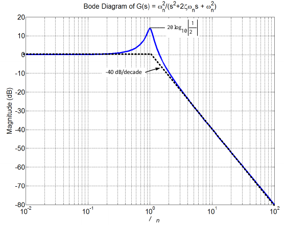

:::

---

::: {.compact-slide}

<strong>Closed-Loop Bandwidth</strong>

Bode diagram of $T(s)=\dfrac{\omega _{n}^{2}}{s^{2}+2\zeta \omega
_{n}s+\omega _{n}^{2}}$  with $\omega _{n}=1$.

-   For convenience just take the bandwidth to be $\omega _{B}=\omega
    _{n}.$

-   The phase plot shows $\omega \leq 0.1\omega _{B}=0.1\omega _{n}$ for $\angle T(j\omega )\approx 0.$

-   That is, $T(j\omega )\approx 1$ is only reasonable for $|\omega
    |<0.1\omega _{B}.$

-   The further the poles are in the left half-plane and the larger the bandwidth.

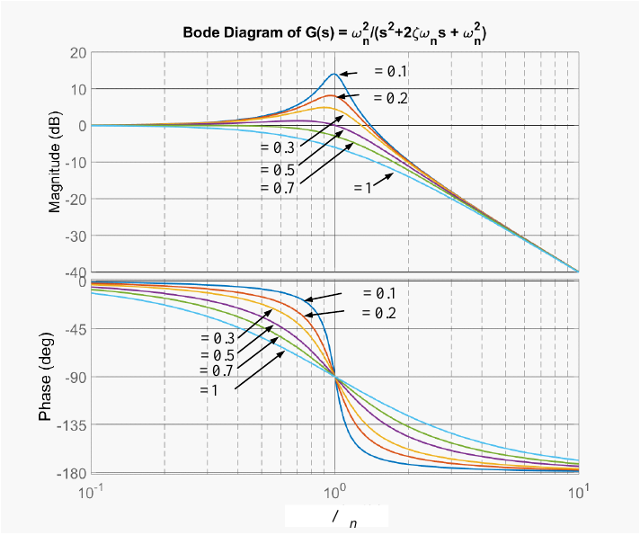

:::

---

::: {.compact-slide .dense-figure-slide}

<strong>Closed-Loop Bandwidth</strong>

Choose $G_{c}(s)$ so $T(s)=\dfrac{G_{c}(s)G(s)}{1+G_{c}(s)G(s)}$ has the desired shape.

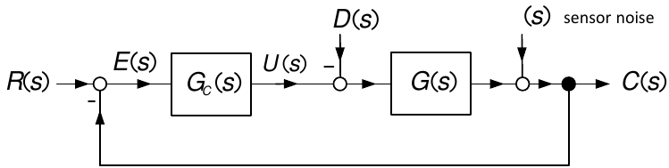

$$C(s)=\underset{T(s)}{\underbrace{\frac{G_{c}(s)G(s)}{1+G_{c}(s)G(s)}}}R(s)-\frac{G(s)}{1+G_{c}(s)G(s)}D(s)+\underset{S(s)}{\underbrace{\frac{1}{1+G_{c}(s)G(s)}}}\eta (s).$$

-   $G(s)$ strictly proper and $G_{c}(s)$ (at least) proper.

    $$|G_{c}(j\omega )G(j\omega )|\rightarrow 0\;\text{as}\;|\omega |\rightarrow
    \infty .$$

-   Need $|G_{c}(j\omega )G(j\omega )|>>1$ for $|\omega |\leq \omega _{B}$ so that

    $$T(j\omega )=\frac{G_{c}(j\omega )G(j\omega )}{1+G_{c}(j\omega )G(j\omega )}\approx \frac{G_{c}(j\omega )G(j\omega )}{G_{c}(j\omega )G(j\omega )}=1\;\text{for}\;|\omega |\leq \omega _{B}.$$

-   If the controller has an integrator then $|G_{c}(j\omega )G(j\omega
    )|\rightarrow \infty$ as $|\omega |\rightarrow 0.$

-   Need $|G_{c}(j\omega )G(j\omega )|\rightarrow 0$ fast for $|\omega
    |>\omega _{B}$ so that

    $$T(j\omega )=\frac{G_{c}(j\omega )G(j\omega )}{1+G_{c}(j\omega )G(j\omega )}\approx 0\;\text{for}\;|\omega |>\omega _{B}.$$
:::

---

::: {.compact-slide .dense-figure-slide}

<strong>Closed-Loop Bandwidth</strong>

$$C(s)=\underset{T(s)}{\underbrace{\frac{G_{c}(s)G(s)}{1+G_{c}(s)G(s)}}}R(s)-\frac{G(s)}{1+G_{c}(s)G(s)}D(s)+\underset{S(s)}{\underbrace{\frac{1}{1+G_{c}(s)G(s)}}}\eta (s).$$

-   Want the bandwidth $\omega _{B}$ large enough so that $R(j\omega
    )\approx 0$ for $|\omega |>\omega _{B}.$

    Then

    $$C_{R}(j\omega )\triangleq \frac{G_{c}(j\omega )G(j\omega )}{1+G_{c}(j\omega
    )G(j\omega )}R(j\omega )\approx R(j\omega ).$$

-   Disturbance rejection follows if $|G_{c}(j\omega )|>>1$ for $|\omega
    |<\omega _{B}$ as

    $$C_{D}(j\omega )\triangleq -\frac{G(j\omega )}{1+G_{c}(j\omega )G(j\omega )}D(s)\approx -\frac{1}{G_{c}(j\omega )}D(j\omega )\approx 0\;\text{for}\;|\omega |<\omega _{B}.$$

-   As $|G_{c}(j\omega )G(j\omega )|\rightarrow 0$ as $|\omega
    |\rightarrow \infty ,$ we also have $|C_{D}(j\omega )|\rightarrow 0$ as $|\omega |\rightarrow \infty .$

-   Tracking and dist rej achievable using a strictly proper stabilizing controller $G_{c}(j\omega )$

    with $|G_{c}(j\omega )|>>1$ for $|\omega |<\omega _{B}$ and $|G_{c}(j\omega
    )|\rightarrow 0$ rapidly for $|\omega |>\omega _{B}$
:::

---

::: {.compact-slide}

<strong>Closed-Loop Bandwidth</strong>

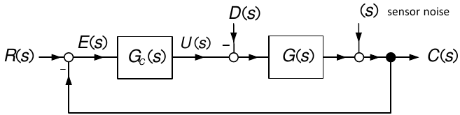

$$C(s)=\underset{T(s)}{\underbrace{\frac{G_{c}(s)G(s)}{1+G_{c}(s)G(s)}}}R(s)-\frac{G(s)}{1+G_{c}(s)G(s)}D(s)+\underset{S(s)}{\underbrace{\frac{1}{1+G_{c}(s)G(s)}}}\eta (s).$$

-   Effect of the measurement noise on output.

    $$C_{\eta }(j\omega )\triangleq \frac{1}{1+G_{c}(j\omega )G(j\omega )}\eta
    (j\omega )\approx \left\{ 
    \begin{array}{cl}
    0 & |\omega |\leq \omega _{B} \\ 
    \eta (j\omega ) & |\omega |>\omega _{B}.\end{array}\right.$$

-   Low-frequency noise is attenuated by feedback.

-   High frequency noise is essentially unchanged.
:::

---

::: {.compact-slide .dense-figure-slide}

<strong>Closed-Loop Bandwidth</strong>

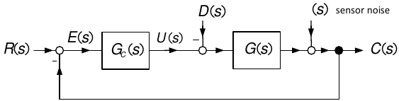

-   Low-frequency sensor noise is a problem for the **actuator!**.

-   The output of the controller $U_{\eta }(s)$ (actuator command) due to $\eta (s)$ is

    $$U_{\eta }(s)\triangleq -\frac{G_{c}(j\omega )}{1+G_{c}(j\omega )G(j\omega )}\eta (j\omega )\approx \left\{ 
    \begin{array}{ll}
    -\dfrac{1}{G(j\omega )}\eta (j\omega ) & |\omega |\leq \omega _{B} \\ 
    -G_{c}(j\omega )\eta (j\omega )\rightarrow 0 & |\omega |>\omega _{B}.\end{array}\right.$$

-   As $G(s)$ is strictly proper, $1/G(s)$ is non proper resulting in the low-frequency noise being differentiated.

-   E.g., $G(s)=\dfrac{b}{s(s+a)},$ $-\eta (s)/G(s)=-\dfrac{1}{b}(s^{2}+as)\eta (s)$ so $\eta (s)$ is differentiated twice.

-   Important to have sensors with essentially no noise for $|\omega |\leq
    \omega _{B}.$

-   The closed-loop bandwidth must be chosen so that it

    does **not** contain any significant frequency content of $\eta
    (j\omega ).$
:::

---

::: {.compact-slide}

<strong>Lead and Lag Compensation</strong>

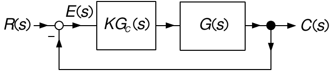

Let $G_{c}(s)=1$ so it is simply a **proportional** feedback control problem.

Let

$$G(s)=\frac{1}{(s+1)(s+2)(s+4)},\;R(s)=\frac{1}{s}.$$

If the closed-loop system is stable then

$$\begin{aligned}
e(\infty )=\lim_{s\rightarrow 0}s\frac{1}{1+K\dfrac{1}{(s+1)(s+2)(s+4)}}\frac{1}{s} &=&\lim_{s\rightarrow 0}\frac{1}{1+K\dfrac{1}{(s+1)(s+2)(s+4)}}
\\
&=&\frac{1}{1+K/8}.
\end{aligned}$$

-   The larger the gain the smaller the steady-state error.

-   However, increasing the open-loop gain $K$ usually *decreases* the phase margin.
:::

---

::: {.compact-slide .expanded-figure-slide}

<strong>Lead and Lag Compensation </strong>

$G(s)=\dfrac{1}{(s+1)(s+2)(s+4)}$

-   Increasing the gain too much makes the closed-loop system unstable.

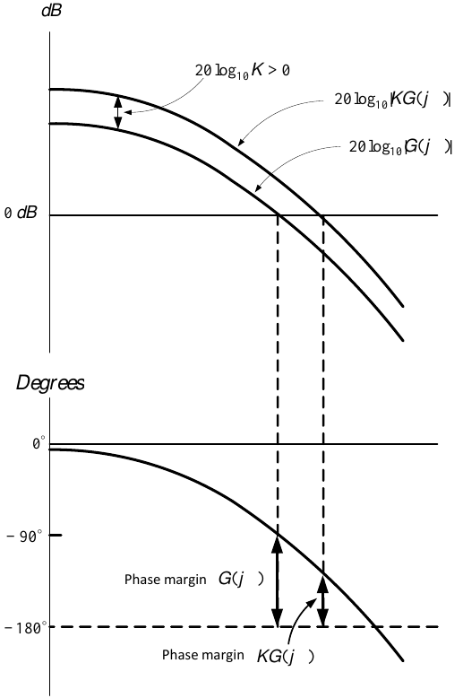

:::

---

::: {.compact-slide}

<strong>Lag Compensation</strong>

$G_{c}(s)=\dfrac{0.01}{0.1}\dfrac{s+0.1}{s+0.01}=\dfrac{s/0.1+1}{s/0.01+1}$

-   $KG_{c}(0)=K$  and  $KG_{c}(j\omega )\rightarrow \dfrac{K}{10}$ as $\omega \rightarrow \infty .$

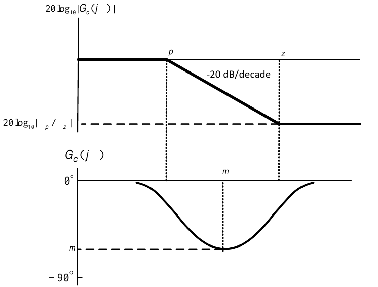

-   $\omega _{p}=0.01,$  $\omega _{z}=0.1$  and $\ \omega _{p}<\omega
    _{z}<<\omega _{g}.$
:::

---

::: {.compact-slide .expanded-figure-slide}

<strong>Lag Compensation</strong>

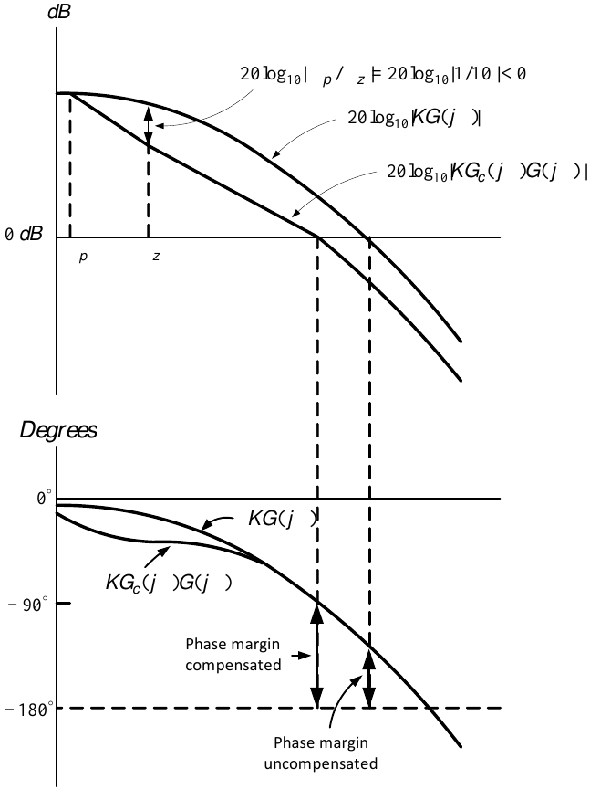

:::

---

::: {.compact-slide}

<strong>Lead Compensation</strong> <strong> PD Controller</strong>

$\mathbf{\approx }$

Lead compensator $KG_{c}(s)$ is of the form

$$KG_{c}(s)=K\frac{s/\omega _{z}+1}{s/\omega _{p}+1}=K\frac{1}{\omega _{z}}\frac{s+\omega _{z}}{s/\omega _{p}+1}\;\text{where}\;\omega _{z}<\omega
_{p}.$$

At low frequencies where $|s/\omega _{p}|<<1$ we have

$$KG_{c}(s)=K\frac{1}{\omega _{z}}\frac{s+\omega _{z}}{s/\omega _{p}+1}\approx
K\frac{1}{\omega _{z}}(s+\omega _{z})=\underset{K_{D}}{\underbrace{K\frac{1}{\omega _{z}}}}s+\underset{K_{P}}{\underbrace{K}}$$

This is approximately a proportional plus derivative controller.

At high frequencies we have

$$KG_{c}(s)=K\frac{s/\omega _{z}+1}{s/\omega _{p}+1}\approx K\frac{\omega _{p}}{\omega _{z}},$$

which becomes a proportional controller.

The amplification of high-frequency noise by a pure derivative controller is avoided.

**Summarizing:** The lead compensator is an approximate PD controller.
:::

---

::: {.compact-slide}

<strong>Bode Diagram of a Lead Compensator</strong>

$$\begin{aligned}
G_{c}(s) &=&\frac{s/\omega _{z}+1}{s/\omega _{p}+1}=\frac{\omega _{p}}{\omega _{z}}\frac{s+\omega _{z}}{s+\omega _{p}}\;\text{where}\;\omega
_{z}<\omega _{p} \\
KG_{c}(0) &=&K \\
KG_{c}(j\omega ) &\rightarrow &\frac{\omega _{p}}{\omega _{z}}K>K\;\text{as}\;\omega \rightarrow \infty .
\end{aligned}$$

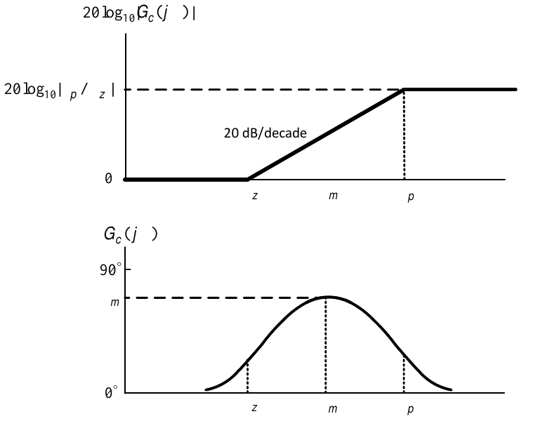

:::

---

::: {.compact-slide .expanded-figure-slide}

<strong>Bode Diagram of a Lead Compensator</strong>

-   Key Requirement of Lead Compensators: $\omega _{z}<\omega _{g}<\omega
    _{p}$

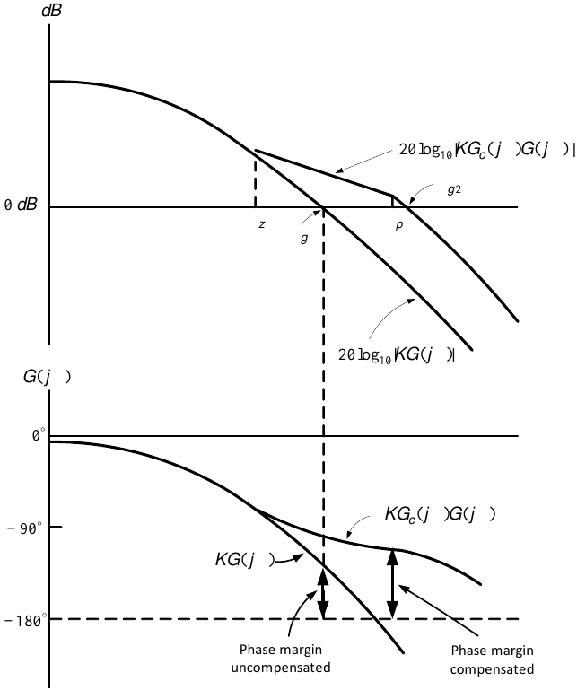

:::

---

::: {.compact-slide .multi-figure-slide}

<strong>Double Integrator Control via Lead-Lag Compensation</strong>

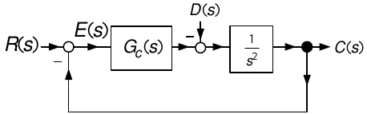

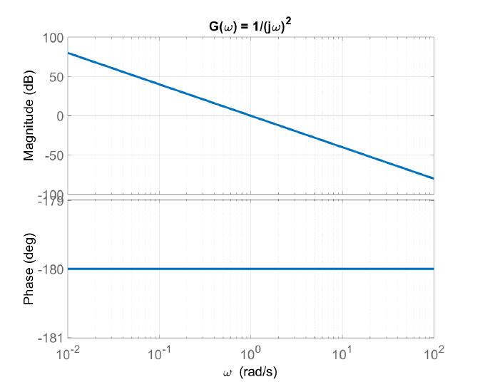

-   The gain crossover frequency is $\omega _{cg}=1$ rad/sec
:::

---

::: {.compact-slide .expanded-body-slide .expanded-short-slide}

<strong>Double Integrator Control via Lead-Lag Compensation</strong>

-   Consider a lead controller $G_{c}(s)=K\dfrac{s+z_{c}}{s+p_{c}}$.  

-   Choose $z_{c}=0.1$ (decade below $\omega _{cg}=1$ rad/sec).

-   Choose $p_{c}=10$ (decade above $\omega _{cg}=1$ rad/sec).

-   Then $\dfrac{s+0.1}{s+10}$ contributes about $90^{\circ }$ (actually only $78.6^{\circ }$) at $\omega =\omega _{cg}=1.$

-   As $\left\vert \dfrac{j\omega +0.1}{j\omega +10}\right\vert _{\omega
    =\omega _{cg}=1}=0.1$ choose $K=10$ to keep $\omega _{cg}$ at $1.$

This results in the lead controller given by

$$G_{c}(s)=10\dfrac{s+0.1}{s+10}.$$
:::

---

::: {.compact-slide}

<strong>Double Integrator Control via Lead-Lag Compensation</strong>

-   Bode diagram of $G_{c}(s)G(s)=10\dfrac{s+0.1}{s+10}\dfrac{1}{s^{2}}$.

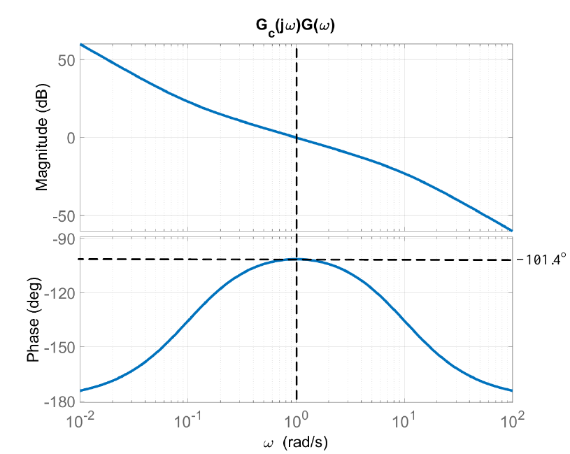

-   At $\omega =\omega _{cg}=1,G_{c}(j\omega )G(j\omega
    )=1e^{-j101.4^{\circ }}$ so the PM is $180^{\circ }-101.4^{\circ
    }=78.6^{\circ }.$
:::

---

::: {.compact-slide .dense-figure-slide}

<strong>Double Integrator Control via Lead-Lag Compensation</strong>

The Nyquist contour for $G_{c}(s)G(s)=10\dfrac{s+0.1}{s+10}\dfrac{1}{s^{2}}$.

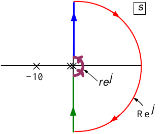

-   Nyquist contour shows $P=0.$

-   For $s=re^{j\theta }$ with $r$ small $\ G_{c}(re^{j\theta
    })G(re^{j\theta })=10\dfrac{re^{j\theta }+0.1}{re^{j\theta }+10}\dfrac{1}{r^{2}e^{j2\theta }}\approx \dfrac{0.1}{r^{2}}e^{-j2\theta }.$

    $$\begin{array}{|c|l|}
    \hline
    \theta  & G(re^{j\theta })G_{c}(re^{j\theta })\approx 0.1e^{-j2\theta
    }/r^{2} \\ \hline
    -\pi /2 & 0.1e^{j180^{\circ }}/r^{2} \\ \hline
    -\pi /4 & 0.1e^{j90^{\circ }}/r^{2} \\ \hline
    0 & 0.1/r^{2} \\ \hline
    +\pi /4 & 0.1e^{-j90^{\circ }}/r^{2} \\ \hline
    +\pi /2 & 0.1e^{-j180^{\circ }}/r^{2} \\ \hline
    \end{array}$$

    .
:::

---

::: {.compact-slide}

<strong>Double Integrator Control via Lead-Lag Compensation</strong>

Polar plot for $G_{c}(s)G(s)=10\dfrac{s+0.1}{s+10}\dfrac{1}{s^{2}}.$

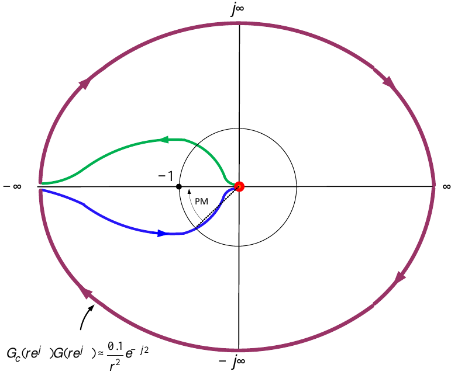

:::

---

::: {.compact-slide}

<strong>Double Integrator Control via Lead-Lag Compensation</strong>

-   $P=0$ and $N=0$ $\ \Longrightarrow$ $\ \ Z=N+P=0.$

-   By inspection the gain margin is infinite.

-   The phase margin is $78.6^{\circ }$ (via [Matlab]{.smallcaps})
:::

---

::: {.compact-slide}

<strong>Step response</strong>

$$C(s)=\underset{G_{CL}(s)}{\underbrace{\frac{G_{c}(s)G(s)}{1+G_{c}(s)G(s)}}}R(s)=\frac{10\dfrac{s+0.1}{s+10}\dfrac{1}{s^{2}}}{1+10\dfrac{s+0.1}{s+10}\dfrac{1}{s^{2}}}\frac{1}{s}=\frac{10(s+0.1)}{(s+1)(s+0.11)(s+8.9)}\frac{1}{s}$$

Then

$$c(t)=u_{s}(t)+0.116e^{-0.11t}-1.3e^{-1.0t}+0.14e^{-8.9t}.$$

The coefficient of the slow decaying term $Ae^{-0.11t}$ is small

due to the zero at $-0.1,$ that is,

$$\begin{aligned}
A &=&\lim_{s\rightarrow -0.11}(s+0.11)\frac{10(s+0.1)}{(s+1)(s+8.9)(s+0.11)}\frac{1}{s} \\
&& \\
&=&\left. \frac{10(s+0.1)}{(s+1)(s+8.9)}\frac{1}{s}\right\vert _{s=-0.11} \\
&& \\
&=&0.116.
\end{aligned}$$
:::

---

::: {.compact-slide}

<strong>Response due to a Disturbance</strong>

$$E_{D}(s)=\frac{\dfrac{1}{s^{2}}}{1+10\dfrac{s+0.1}{s+10}\dfrac{1}{s^{2}}}\frac{D_{0}}{s}=\frac{s+10}{s^{3}+10s^{2}+10s+1}\frac{D_{0}}{s}$$

As $sE_{D}(s)$ is stable

$$e_{D}(\infty )=\lim_{s\rightarrow 0}sE_{D}(s)=\lim_{s\rightarrow 0}s\frac{s+10}{s^{3}+10s^{2}+10s+1}\frac{D_{0}}{s}=10D_{0}.\;\text{Large!}\;$$

Add the lag compensator $\dfrac{s+0.1}{s+0.01}$ for disturbance attenuation

$$\left. \dfrac{s+0.1}{s+0.01}\right\vert _{s=0}=10\;\text{and}\;\dfrac{j\omega +0.1}{j\omega +0.01}\approx 1\;\text{for}\;j\omega >>0.1.$$

-   It provides a gain of 10 at low frequencies.

-   Does not change the gain crossover point or phase margin (CL is still **stable!).**

-   The (lead-lag) controller is now $G_{c}(j\omega )=\dfrac{s+0.1}{s+0.01}10\dfrac{s+0.1}{s+10}.$
:::

---

::: {.compact-slide}

<strong>Response due to a Disturbance</strong>

Lead-Lag controller $G_{c}(j\omega )=\dfrac{s+0.1}{s+0.01}10\dfrac{s+0.1}{s+10}.$

$$E_{D}(s)=\frac{\dfrac{1}{s^{2}}}{1+\dfrac{s+0.1}{s+0.01}10\dfrac{s+0.1}{s+10}\dfrac{1}{s^{2}}}\frac{D_{0}}{s}=\frac{1}{s^{2}+\dfrac{s+0.1}{s+0.01}10\dfrac{s+0.1}{s+10}}\frac{D_{0}}{s}$$

As $sE_{D}(s)$ is stable

$$e_{D}(\infty )=\lim_{s\rightarrow 0}s\frac{1}{s^{2}+\dfrac{s+0.1}{s+0.01}10\dfrac{s+0.1}{s+10}}\frac{D_{0}}{s}=D_{0}.$$

Disturbance error is reduced by a factor of 10!

$$\begin{aligned}
C(s)=\frac{\dfrac{s+0.1}{s+0.01}10\dfrac{s+0.1}{s+10}\dfrac{1}{s^{2}}}{1+\dfrac{s+0.1}{s+0.01}10\dfrac{s+0.1}{s+10}\dfrac{1}{s^{2}}}\frac{1}{s} &=&\frac{10s^{2}+2s+0.1}{s^{4}+10.01s^{3}+10.1s^{2}+2s+0.1}\frac{1}{s} \\
&=&\frac{10(s+0.1)^{2}}{(s+0.08)(s+0.16)(s+0.87)(s+8.9)}\frac{1}{s}.
\end{aligned}$$
:::

---

::: {.compact-slide}

<strong>Closed-Loop Gain and Phase Margins</strong>

$\ G_{c}(s)G(s)=\dfrac{s+0.1}{s+0.01}10\dfrac{s+0.1}{s+10}\dfrac{1}{s^{2}}$

Phase margin is $73.5^{\circ }.$

$\left\vert \dfrac{j\omega +0.1}{j\omega +0.01}\right\vert _{\omega =\omega
_{cg}=1}=1.005$  and  $\left. \angle \dfrac{j\omega +0.1}{j\omega +0.01}\right\vert _{\omega =\omega _{cg}=1}=-5.1^{\circ }$.

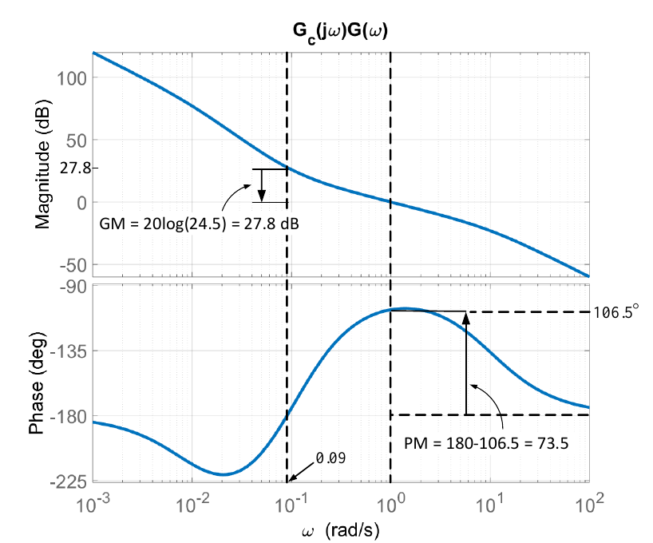

:::

---

::: {.compact-slide}

<strong>Nyquist Plot</strong>

$\ G_{c}(s)G(s)=\dfrac{s+0.1}{s+0.01}10\dfrac{s+0.1}{s+10}\dfrac{1}{s^{2}}$

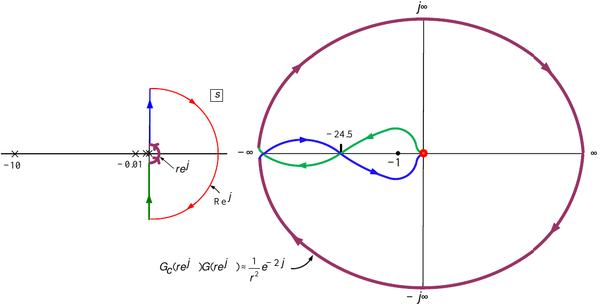

-   $G(re^{j\theta })G_{c}(re^{j\theta })=\dfrac{re^{j\theta }+0.1}{re^{j\theta }+0.01}10\dfrac{re^{j\theta }+0.1}{re^{j\theta }+10}\dfrac{1}{r^{2}e^{j2\theta }}\approx \dfrac{1}{r^{2}}e^{-j2\theta }$.

-   $P=0,Z=0\rightarrow N=Z-P=0.\ $

-   Phase margin is $73.5^{\circ }.$

-   Gain margin $1/24.5=0.0408$ or $20\log (0.0408)=-27.8$ dB.

-   The lag compensator has decreased the phase and gain margins.
:::

---

::: {.compact-slide}

<strong>Pitch Control</strong>

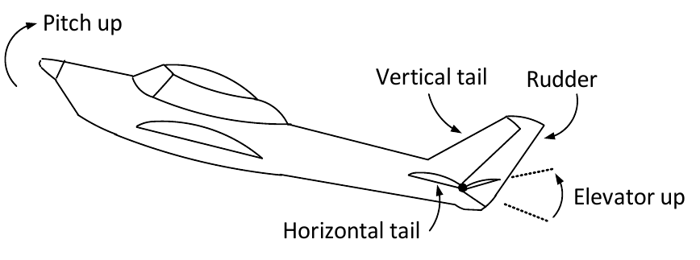

$$G(s)=\frac{\theta (s)}{\delta (s)}=\dfrac{1.51s+0.1774}{s^{3}+0.739s^{2}+0.921s}=\dfrac{1.51s+0.1774}{s(s^{2}+0.739s+0.9597)}.$$

**Design specifications**

\(1\) Overshoot less than $10\%$

\(2\) Rise time less than $2$ seconds

\(3\) Settling time less than $10$ seconds

\(4\) Steady-state error less than $2\%$ for a step input.

\(5\) Maximum elevator deflection is $25^{\circ }$ ($0.436$ radians), i.e., $-25^{\circ }\leq \delta \leq 25^{\circ }.$
:::

---

::: {.compact-slide}

<strong>Pitch Control</strong>

Consider a *cascade* PID controller

$$G_{c}(s)=K\frac{T_{D}s+1}{\tau s+1}\frac{s+1/T_{I}}{s}.$$

Then

$$20\log (|G_{c}(j\omega )|)=20\log (K)+20\log \left( \left\vert \frac{T_{D}j\omega +1}{\tau j\omega +1}\right\vert \right) +20\log \left(
\left\vert \frac{j\omega +1/T_{I}}{j\omega }\right\vert \right) .$$

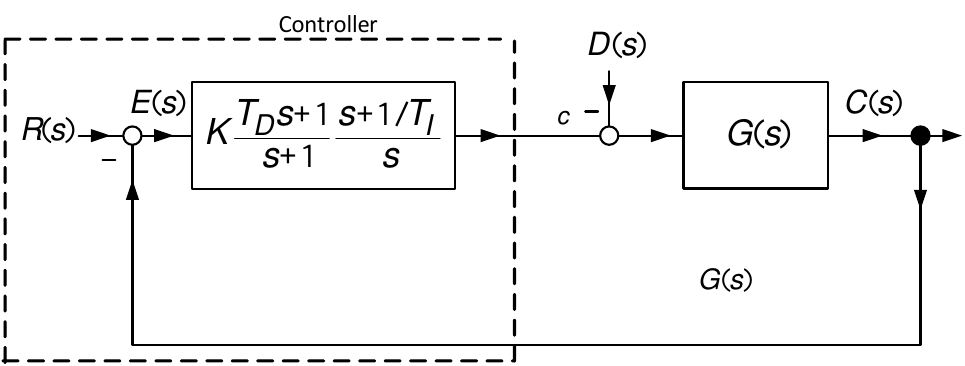

:::

---

::: {.compact-slide}

<strong>Pitch Control</strong>&nbsp;(continued)

$G(s)=\dfrac{1.51s+0.1774}{s^{3}+0.739s^{2}+0.921s}=\dfrac{1.51(s+0.1175)}{s(s^{2}+2\zeta \omega _{n}s+\omega _{n}^{2})},$  $\zeta =0.377$  & $\omega _{n}=0.9796$

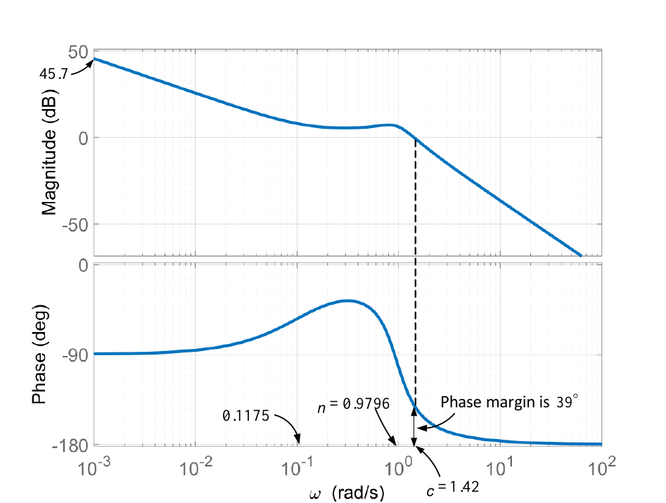

If $G_{c}(s)=K=1$ then the gain crossover frequency is $\omega _{cg}=1.42.$

$G(j1.42)=1e^{-141^{\circ }}$ giving a phase margin of $39^{\circ }.$
:::

---

::: {.compact-slide}

<strong>Nyquist &amp; Polar Plot</strong>

$G(s)=\dfrac{1.51s+0.1774}{s^{3}+0.739s^{2}+0.921s}\rightarrow \dfrac{1.51}{0.921}+\dfrac{0.1774}{0.921}\dfrac{1}{s}$

 as $|s|\rightarrow 0.$

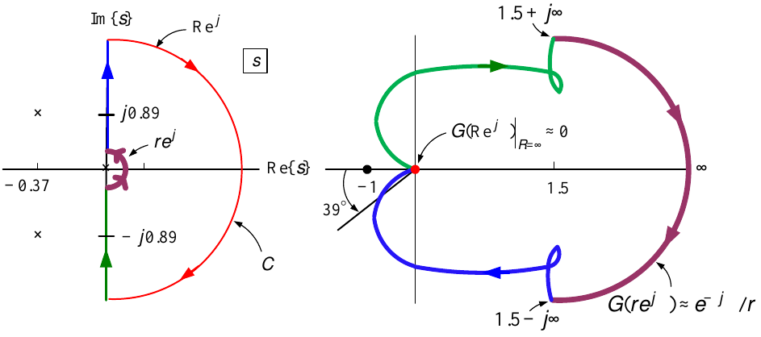

Consider $G_{c}(s)=\dfrac{s+1/T_{I}}{s}.$

Require $1/T_{I}<<\omega _{c}=1.42$ so that at the crossover frequency $\omega _{c}=1.42$.

$$\dfrac{s+1/T_{I}}{s}|_{s=j\omega _{c}}\approx 1.$$

Set $T_{I}=10$ so $1/T_{I}=0.1<<\omega _{c}=1.42$  so $\ G_{c}(s)=\dfrac{s+0.1}{s}.$
:::

---

::: {.compact-slide}

<strong>Bode Diagram</strong>

$G_{c}(s)G(s)=\dfrac{s+0.1}{s}\dfrac{1.51s+0.1774}{s^{3}+0.739s^{2}+0.921s}$

The crossover frequency is still at $1.42.$

The phase margin is reduced to $35^{\circ }.$

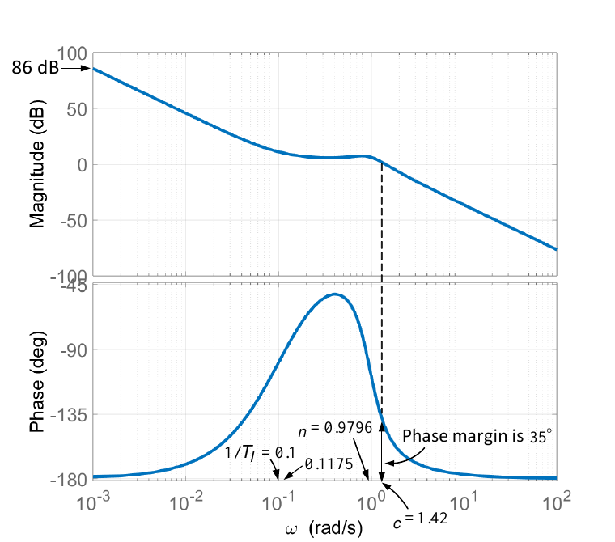

:::

---

::: {.compact-slide}

<strong>Nyquist Plot</strong>

$G_{c}(s)G(s)=\dfrac{s+0.1}{s}\dfrac{1.51s+0.1774}{s^{3}+0.739s^{2}+0.921s}$

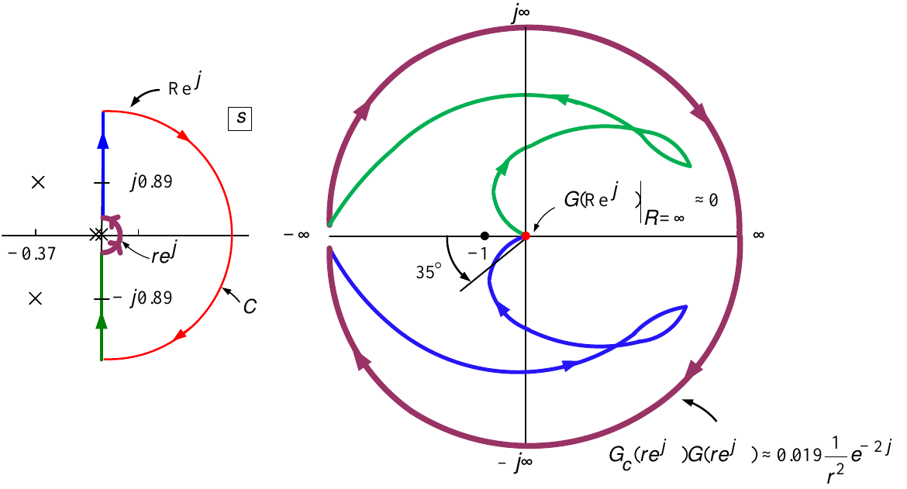

$G_{c}(re^{j\theta })G(re^{j\theta })\overset{r\rightarrow 0}{\rightarrow }0.1\dfrac{1}{re^{j\theta }}\dfrac{0.1774}{0.921}\dfrac{1}{re^{j\theta }}=0.019\dfrac{1}{r^{2}}e^{-j2\theta }$.
:::

---

::: {.compact-slide}

<strong>Add the PD Compensator</strong>

$T_{D}s+1$

-   $\angle (T_{D}j\omega +1)|_{\omega =1/T_{D}}=45^{\circ }$ and $20\log
    |T_{D}j\omega +1)|_{\omega =1/T_{D}}=3$ dB $\approx 0$.

-   Set $1/T_{D}$ of $T_{D}s+1$ close to $\omega _{c}=1.42$ to increase the phase margin.

-   Set $T_{D}=1/1.42=0.704$ so $G_{c}(s)=(0.704s+1)\dfrac{s+0.1}{s}.$

Bode diagram for $G_{c}(s)G(s)=(0.704s+1)\dfrac{s+0.1}{s}\dfrac{1.51s+0.1774}{s^{3}+0.739s^{2}+0.921s}.$

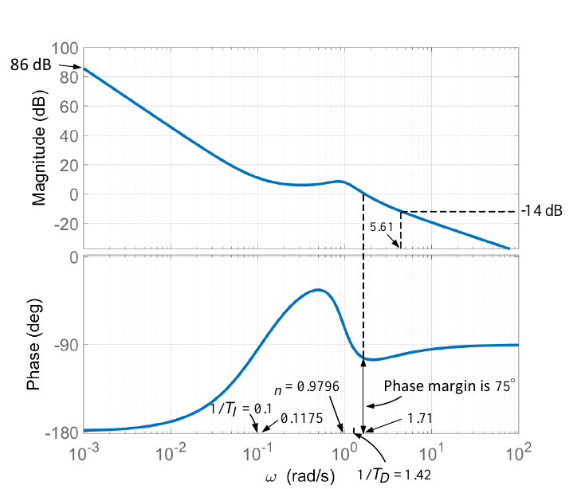

:::

---

::: {.compact-slide}

<strong>Nyquist plot</strong>

$G_{c}(s)G(s)=(0.704s+1)\dfrac{s+0.1}{s}\dfrac{1.51s+0.1774}{s^{3}+0.739s^{2}+0.921s}$

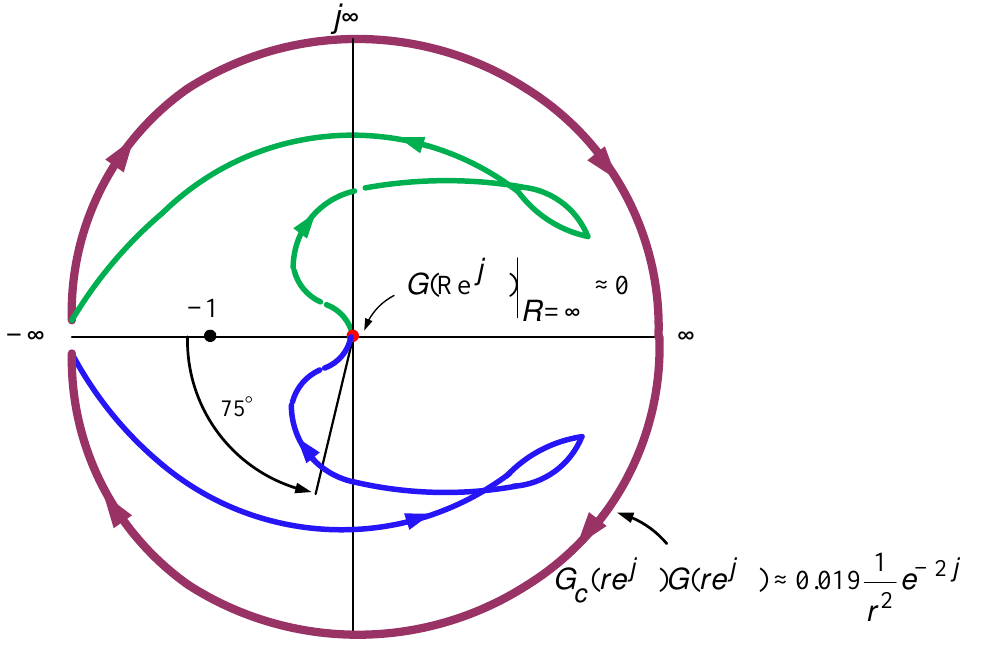

:::

---

::: {.compact-slide}

<strong>Nyquist plot</strong>&nbsp;(continued)

$G_{c}(s)G(s)=\mathbf{K}(0.704s+1)\dfrac{s+0.1}{s}\dfrac{1.51s+0.1774}{s^{3}+0.739s^{2}+0.921s}$

-   Set $K=5$ so $20\log (5)=14$ dB

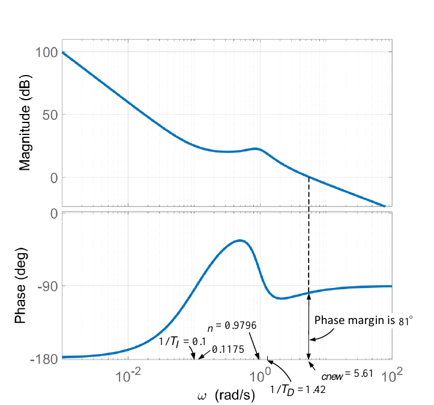

-   Gain crossover frequency is now $\omega _{cnew}=5.61$ rad/sec.

-   The phase margin is now $81^{\circ }.$
:::

---

::: {.compact-slide}

<strong>Pitch Response</strong>

$G_{c}(s)=5(0.704s+1)\dfrac{s+0.1}{s}$

(i.e., $K=5$).

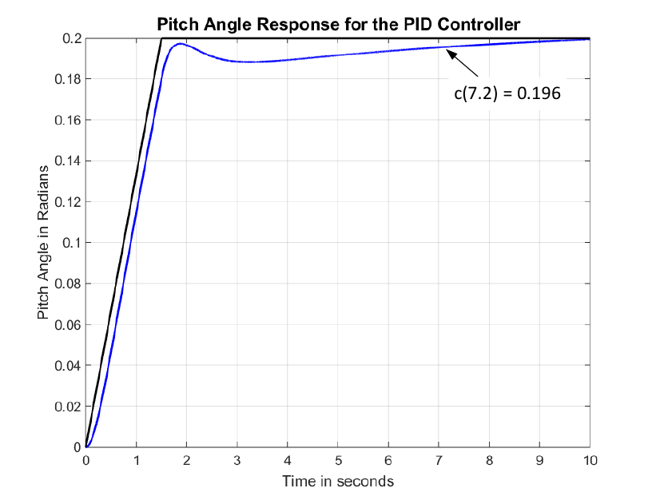

No overshoot,  $2\%$ settling time is $t=7.2$ $\sec$,  rise time $<2\sec$.
:::

---

::: {.compact-slide}

<strong>Elevator Angle Response</strong>

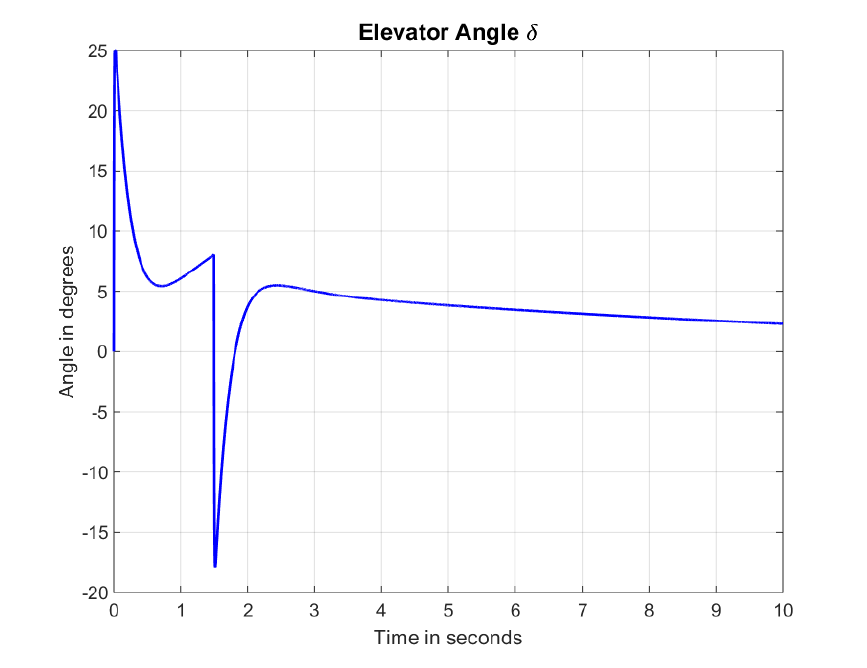

:::
