::: {.contents-slide}
# Contents

- Root Locus and the Angle Condition

- Root Locus Construction Rules

- Asymptotes, Breakaway Points, and Departure Angles

- Effects of Open-Loop Poles and Zeros

- Satellite Control Design Example
:::

---

::: {.compact-slide}

Chapter 12 Root Locus

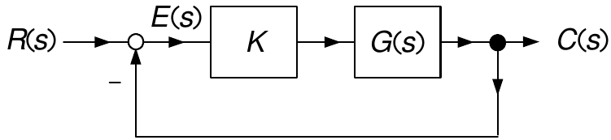

-   Let $G(s)$ be given by
    $$G(s)=\frac{b(s)}{a(s)}=\frac{b_{m}s^{m}+b_{m-1}s^{m-1}+\cdots+b_{1}s+b_{0}}{s^{n}+a_{n-1}s^{n-1}+\cdots+a_{1}s+a_{0}},\text{  }m<n$$
    The closed-loop transfer function is
    $$\frac{C(s)}{R(s)}=\frac{KG(s)}{1+KG(s)}=\frac{Kb(s)\!/\!a(s)}{1+Kb(s)\!/\!a(s)}=\frac{Kb(s)}{a(s)+Kb(s)}.$$

-   As $K$ is varied from $0$ to $\infty$ we want to know the location
    of the roots of $$a(s)+Kb(s)=0.$$

-   $a(s)+Kb(s)$ is the *closed-loop characteristic* polynomial.

-   The roots of $a(s)+Kb(s)=0$ are the *closed-loop poles*.

-   The *root locus* is a plot of the roots of $a(s)+Kb(s)=0$ as $K$
    goes from $0$ to $\infty.$
:::

---

::: {.compact-slide .expanded-body-slide}

<strong>Root Locus for</strong> $\dfrac{1}{s(s+4)}$

With $G(s)=\dfrac{1}{s(s+4)}$ we have
$$\frac{C(s)}{R(s)}=\frac{KG(s)}{1+KG(s)}=\frac{K\dfrac{1}{s(s+4)}}{1+K\dfrac {1}{s(s+4)}}=\frac{K}{s^{2}+4s+K}.$$

For $K\geq0$ compute the roots of $$s^{2}+4s+K=0.$$

By the quadratic
formula$$s=\dfrac{-4\pm\sqrt{16-4K}}{2}=-2\pm\sqrt{4-K}$$ or
$$p_{1},p_{2}=\left\{
\begin{array}{ll}
-2+\sqrt{4-K},\text{  }-2-\sqrt{4-K}, & 0\leq K\leq4 \\
&  \\
-2\pm j\sqrt{K-4}, & 4\leq K.\end{array}
\right.$$
:::

---

::: {.compact-slide}

<strong>Root Locus for</strong> $\dfrac{1}{s(s+4)}$
<strong>(continued)</strong>

From previous slide: $$p_{1},p_{2}=\left\{
\begin{array}{ll}
-2+\sqrt{4-K},\text{  }-2-\sqrt{4-K}, & 0\leq K\leq4 \\
&  \\
-2\pm j\sqrt{K-4}, & 4\leq K.\end{array}
\right.$$

For $K=0,2,4,8$ we have$$\begin{array}{|c|c|}
\hline
K & p_{1},p_{2} \\ \hline
0 & 0,-4 \\ \hline
2 & -2+\sqrt{2},-2-\sqrt{2} \\
\hline
4 & -2,-2 \\ \hline
8 & -2\pm j2 \\ \hline
\end{array}$$

Sketch the *root locus*.

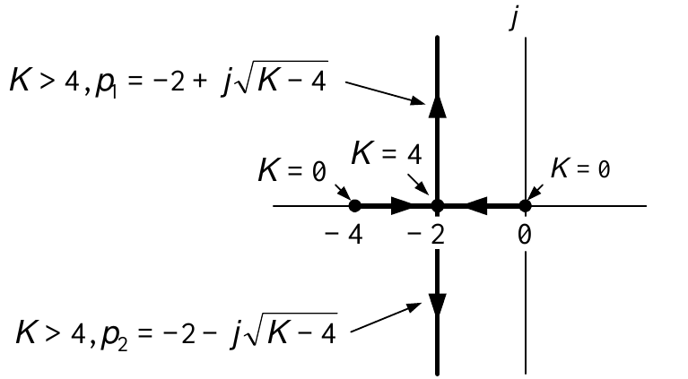

:::

---

::: {.compact-slide .expanded-body-slide}

Angle Condition and Root Locus Rules

-   Sketch the root locus *without* having to solve for all the roots.

    A computer can be used to numerically find the roots.

    By sketching the root locus we gain insight into the information it
    contains.

-   Sketching the root locus is based on the *angle condition*.

Define the **return difference** by
$$1+KG(s)=1+K\dfrac{b(s)}{a(s)}=\dfrac{a(s)+Kb(s)}{a(s)}.$$

-   The **zeros** of the return difference are the roots of
    $a(s)+Kb(s)=0.$

    These are the **closed-loop** poles.

-   The **poles** of the return difference are the roots of $a(s)=0.$

    These are **open-loop** poles.

-   The root locus is a plot of the *zeros* of $1+KG(s)=0$ for $K\geq0.$

-   If $s_{0}$ satisfies $$1+KG(s_{0})=0$$ for some $K>0$ then it
    satisfies $$G(s_{0})=-\frac{1}{K}.$$
:::

---

::: {.compact-slide .expanded-body-slide}

Angle Condition

From previous slide: If $s_{0}$ satisfies
$$1+KG(s_{0})=1+K\dfrac{b(s_{0})}{a(s_{0})}=\dfrac{a(s_{0})+Kb(s_{0})}{a(s_{0})}=0$$

for some $K>0$ then it satisfies $$G(s_{0})=-\frac{1}{K}.$$

-   In general, $s_{0}$ is a complex number.

-   For $s_{0}$ to be *on* the root locus, $G(s_{0})$ equal to a
    **negative real** number.

-   That is, in polar coordinates, $s_{0}$ must satisfy
    $$|G(s_{0})|e^{j\angle G(s_{0})}=-\frac{1}{K}=\frac{1}{K}e^{j\pi}.$$

-   Thus for $s_{0}$ to be on the root locus, $G(s_{0})$ satisfies the
    **angle condition** given by
    $$\angle G(s_{0})=\pi(2\ell+1),\ell=0,\pm1,\pm2,...$$

-   The corresponding value of $K$ is given by
    $$K=\frac{1}{|G(s_{0})|}.$$

-   Only need the **open-loop** transfer function $G(s)$ to see if
    $s_{0}$ is a **closed-loop** pole.
:::

---

::: {.compact-slide}

<strong>Angle Condition for</strong> $\dfrac{1}{s(s+4)}$

$$\begin{aligned}
G(s) & =\dfrac{1}{s(s+4)}=\dfrac{1}{\underset{s}{\underbrace{|s|e^{j\angle s}}}\text{ }\underset{s+4}{\underbrace{|s+4|e^{j\angle(s+4)}}}}=\dfrac {1}{|s||s+4|}e^{-j\angle s}e^{-j\angle(s+4)} \\
& \\
\Longrightarrow\text{  }\angle G(s) & =-\angle s-\angle(s+4).
\end{aligned}$$

-   Let the point "$s$" be on the root locus.

-   $s+4=s-(-4)$ is a vector from $-4$ to $s.$

-   $s$ is a vector from $0$ to $s.$

    

-   The figure shows $\angle s+\angle(s+4)=\pi,$ i.e.,
    $$\angle G(s)=-\angle s-\angle(s+4)=-\pi.$$
:::

---

::: {.compact-slide}

<strong>Angle Condition for</strong>  $\dfrac{1}{s(s+4)}$
<strong>(continued)</strong>

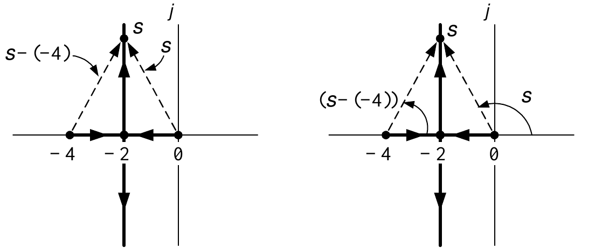

-   For example, $s=-2+2j$ is **on** the root locus and
    $$\begin{aligned}
    G(-2+2j) & =\dfrac{1}{(-2+j2)(-2+2j+4)}=\frac{1}{(-2+2j)(2+2j)}=-\frac{1}{8}
    \\
    & \\
    \Longrightarrow\angle G(-2+2j) & =\angle(-1/8)=\pi.
    \end{aligned}$$

-   On the other hand $s=-4+2j$ is **not** on the root locus and
    $$\begin{aligned}
    G(-4+2j) & =\dfrac{1}{(-4+j2)(-4+2j+4)}=\frac{1}{(-4+2j)(2j)}=-\frac {1}{4+8j} \\
    & \\
    \Longrightarrow\angle G(-4+2j) & \neq\pi(2\ell+1),\text{  }\ell=0,\pm
    1,\pm2,.....
    \end{aligned}$$
:::

---

::: {.compact-slide .expanded-body-slide}

<strong>Angle Condition for</strong>  $\dfrac{1}{s(s+4)}$
<strong>(continued)</strong>

-   Let $s=-1$ which is **on** on the root locus with
    $$\angle s=\pi  \text{and  }\angle(s-(-1))=0.$$

    Thus $$\angle G(s)=-\angle s-\angle(s+4)=-\pi$$ so that $s=-1$
    **satisfies** the angle condition.

-   On the other hand, let $s=-5$, so
    $$\angle s=\pi \quad \text{and} \quad \angle(s-(-5))=\pi.$$

    Thus $$\angle G(s)=-\angle s-\angle(s-(-5))=-2\pi$$ showing $s=-5$
    does **not** satisfy the angle condition.
:::

---

::: {.compact-slide .expanded-body-slide}

<strong>EXAMPLE</strong> <strong>Root Locus for</strong>
$\dfrac{1}{s(s+4)}$

The **return difference** is
$$1+KG(s)=1+K\dfrac{b(s)}{a(s)}=\dfrac{a(s)+Kb(s)}{a(s)}=\frac{s(s+4)+K}{s(s+4)}.$$

Its **zeros** are the closed-loop poles.

**(1)** The root locus starts on the open-loop poles.

I.e., for $K=0$ the closed-loop poles are the roots of
$$a(s)+Kb(s)=a(s)=s(s+4)=0.$$

**(2)** The number of branches of the root locus is 2.

This is because $a(s)+Kb(s)=s^{2}+4s+K=0$ has two roots.

**(3)** The root locus is symmetric with respect to the real axis.

This is simply because the complex roots of $$a(s)+Kb(s)=s^{2}+4s+K=0$$

come in complex conjugate pairs.
:::

---

::: {.compact-slide .expanded-short-slide}

<strong>Root Locus for</strong>  $\dfrac{1}{s(s+4)}$
<strong>(continued)</strong>

**(4)** For any $s_{0}$ **on** the root locus,
$$\angle G(s_{0})=\angle\dfrac{1}{s_{0}(s_{0}+4)}=\pi(2\ell+1),\ell=0,\pm
1,\pm2,....$$
:::

---

::: {.compact-slide}

<strong>Root Locus for</strong>  $\dfrac{1}{s(s+4)}$
<strong>(continued)</strong>

**(5)** A **breakaway point** occurs at $s=-2$ for $K=4.$

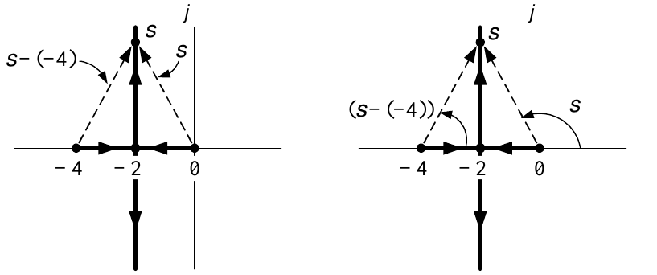

This is where $a(s)+Kb(s)=s^{2}+4s+K=0$ has a **double** root, that
is,
$$\left. 1+K\frac{1}{s(s+4)}\right\vert _{K=4}=\left. \dfrac{s^{2}+4s+K}{s(s+4)}\right\vert _{K=4}=\dfrac{(s+2)^{2}}{s(s+4)}$$

$$\begin{aligned}
\!\!\!\!\!\!\!\left. \frac{d}{ds}\left( 1+4\frac{1}{s(s+4)}\right)
\right\vert _{s=-2}\!\!\!\!\!\!\! & =\!\!\!\!\left. \frac{d}{ds}\left(
\dfrac{(s+2)^{2}}{s(s+4)}\right) \right\vert _{s=-2} \\
\!\!\!\!\!\!\! & =\!\!\!\!\left. -\dfrac{1}{s(s+4)}\left( \dfrac{d}{ds}(s^{2}+4s)\right) (s+2)^{2}\right\vert _{s=-2}\!\!\!\!+\left. \left( \dfrac{1}{s(s+4)}\dfrac{d}{ds}(s+2)^{2}\right) \right\vert _{s=-2} \\
\!\!\!\!\!\!\! & =\!\!\!\!0.
\end{aligned}$$
:::

---

::: {.compact-slide .expanded-body-slide .expanded-figure-slide}

<strong>Example</strong> <strong>Root Locus for</strong>
$\dfrac{1}{s(s+2)(s+4)}$

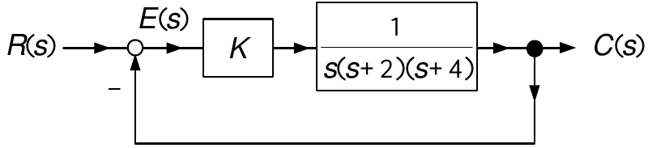

-   $G(s)=\dfrac{1}{s(s+2)(s+4)}=\dfrac{1}{|s||s+2||s+4|}e^{-j\left(
    \angle s+\angle(s+2)+\angle(s+4)\right) }.$

-   $1+KG(s)=1+K\dfrac{1}{s(s+2)(s+4)}=\dfrac{s(s+2)(s+4)+K}{s(s+2)(s+4)}=0.$

-   $G(s)=-\dfrac{1}{K}\Longrightarrow\angle G(s)=\pi(2\ell+1),\ell
    =0,\pm1,\pm2,....$

**Sketch the root locus.**

**(1)** With $K=0$ we have $s(s+2)(s+4)+K=s(s+2)(s+4)=0$ or $s=0,-2,-4.$

-   The root locus starts on the open-loop poles.

**(2)** $1+KG(s)=0$ or $G(s)=\dfrac{1}{s(s+2)(s+4)}=-\dfrac{1}{K}.$

-   As $K\rightarrow\infty,$ the 3 roots go to infinity, i.e.,
    $|s|\rightarrow\infty.$
:::

---

::: {.compact-slide}

<strong>Root Locus for</strong>  $\dfrac{1}{s(s+2)(s+4)}=\dfrac{1}{|s||s+2||s+4|}e^{-j\left(
\angle s+\angle(s+2)+\angle
(s+4)\right) }=-\dfrac{1}{K}$

**(3)** *Real Axis Root Locus*

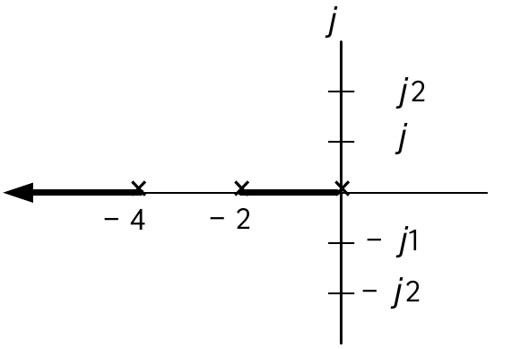

**(i)** Consider $s$ real with $-2<s<0$ so $\angle s=\pi,\angle
(s+2)=0,\angle(s+4)=0.$

Then $$\angle G(s)=-\angle s-\angle(s+2)-\angle(s+4)=-\pi.$$

These values of $s$ are **on** the root locus.

**(ii)** Consider $s$ real with $-4<s<-2$ so $\angle s=\pi,\angle
(s+2)=\pi,\angle(s+4)=0.$

Then $$\angle G(s)=-\angle s-\angle(s+2)-\angle(s+4)=-2\pi.$$

These values of $s$ are **not** on the root locus.
:::

---

::: {.compact-slide}

<strong>Root Locus for</strong>  $\dfrac{1}{s(s+2)(s+4)}=\dfrac{1}{|s||s+2||s+4|}e^{-j\left(
\angle s+\angle(s+2)+\angle
(s+4)\right) }=-\dfrac{1}{K}$

**(3)** *Real Axis Root Locus (continued)*

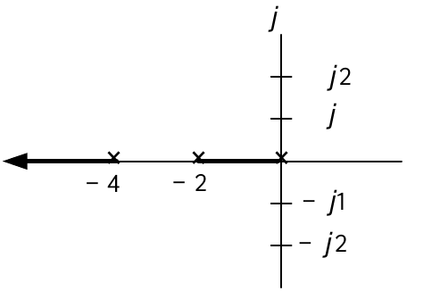

**(iii)** Consider $s$ real with $s<-4$ so $\angle s=\pi,\angle
(s+2)=\pi,\angle(s+4)=\pi.$

Then $$\angle G(s)=-\angle s-\angle(s+2)-\angle(s+4)=-3\pi.$$

These values of $s$ are **on** the root locus.

**(iv)** Finally, consider $s$ real with $s>0$ so $\angle s=0,\angle
(s+2)=0,\angle(s+4)=0.$

Then $$\angle G(s)=-\angle s-\angle(s+2)-\angle(s+4)=0.$$

These values of $s$ are **not** on the root locus.
:::

---

::: {.compact-slide}

<strong>Root Locus for</strong>  $\dfrac{1}{s(s+2)(s+4)}$
<strong>(continued)</strong>

**(4)** *Breakaway Point*

A breakaway point occurs at a value of $K$ for which
$$1+K\dfrac{1}{s(s+2)(s+4)}=\dfrac{s(s+2)(s+4)+K}{s(s+2)(s+4)}=0$$ has
*multiple* zeros.

-   That is, $s_{b}$ is a breakaway point for a value of $K_{b}$ such
    that
    $$1+K_{b}\dfrac{1}{s(s+2)(s+4)}=\dfrac{s(s+2)(s+4)+K_{b}}{s(s+2)(s+4)}=\frac{(s-s_{b})^{2}(s-s_{1})}{s(s+2)(s+4)}.$$

-   Two branches breaking away from the real axis come together as a
    double root.

    They then leave the real axis as a complex conjugate pair.

-   Thus at a breakaway point we have
    $$\frac{d}{ds}\underset{\frac{(s-s_{b})^{2}(s-s_{1})}{s(s+2)(s+4)}}{\underbrace{\left( \right. 1+K_{b}\dfrac{1}{s(s+2)(s+4)}\left.
    \right) }}\left. \right\vert _{s=s_{b}}=K_{b}\dfrac{d}{ds}\underset{G(s)}{\underbrace{\left( \dfrac{1}{s(s+2)(s+4)}\right) }}=0.$$
    Summarizing, a breakaway point $s_{b}$ must be a solution to
    $\left. \dfrac{d}{ds}G(s)\right\vert _{s=s_{b}}=0.$
:::

---

::: {.compact-slide}

<strong>Root Locus for</strong>  $\dfrac{1}{s(s+2)(s+4)}$
<strong>(continued)</strong>

**(4)** *Breakaway Point (continued)* $$\begin{aligned}
\frac{d}{ds}G(s) & =-\left( \dfrac{1}{s(s+2)(s+4)}\right) ^{2}\frac{d}{ds}\left( s(s+2)(s+4)\right) \\
& =-\left( \dfrac{1}{s(s+2)(s+4)}\right) ^{2}\frac{d}{ds}\left( s^{3}+6s^{2}+8s\right) .
\end{aligned}$$

$\dfrac{d}{ds}G(s)=0$ requires solving $3s^{2}+12s+8=0$
$\Longrightarrow$
$$s=\frac{-12\pm\sqrt{(12)^{2}-4(3)(8)}}{6}=-2\pm\frac{2}{\sqrt{3}}=-0.845,-3.146$$

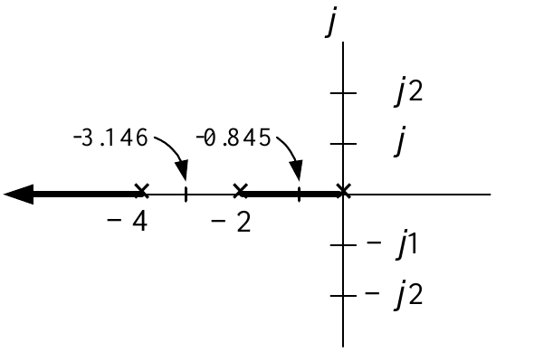

Only $s=-0.845$ is on the real axis root locus and is therefore the only
breakaway point.
:::

---

::: {.compact-slide}

<strong>Root Locus for</strong>  $\dfrac{1}{s(s+2)(s+4)}$
<strong>(continued)</strong>

**(5)** $j\omega$ *axis intercepts*

Apply the Routh-Hurwitz test to $$s(s+2)(s+4)+K=s^{3}+6s^{2}+8s+K.$$ The
Routh table is$$\begin{array}{cccccc}
s^{3} &  & 1 &  & 8 &  \\
s^{2} &  & 6 &  & K &  \\
s &  & (48-K)/6 &  & 0 &  \\
1 &  & K &  &  &
\end{array}$$

-   Stable for $0<K<48.$

-   Two right half-plane poles for $K>48.$

-   $\Longrightarrow$ At $K=48$ there are two poles **on** the $j\omega$
    axis.

To find these poles solve the auxiliary equation $6s^{2}+48=0$ to obtain
$s=\pm j2\sqrt{2}=\pm j2.83.$

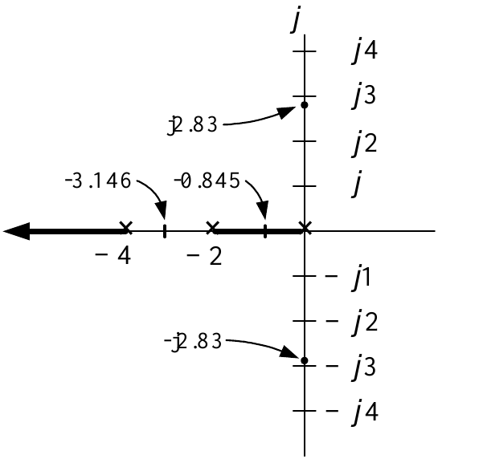

:::

---

::: {.compact-slide .expanded-body-slide .expanded-figure-slide}

<strong>Root Locus for</strong>  $\dfrac{1}{s(s+2)(s+4)}$
<strong>(continued)</strong>

Using the above results we ([Matlab!]{.smallcaps}) can sketch the root
locus as shown below.

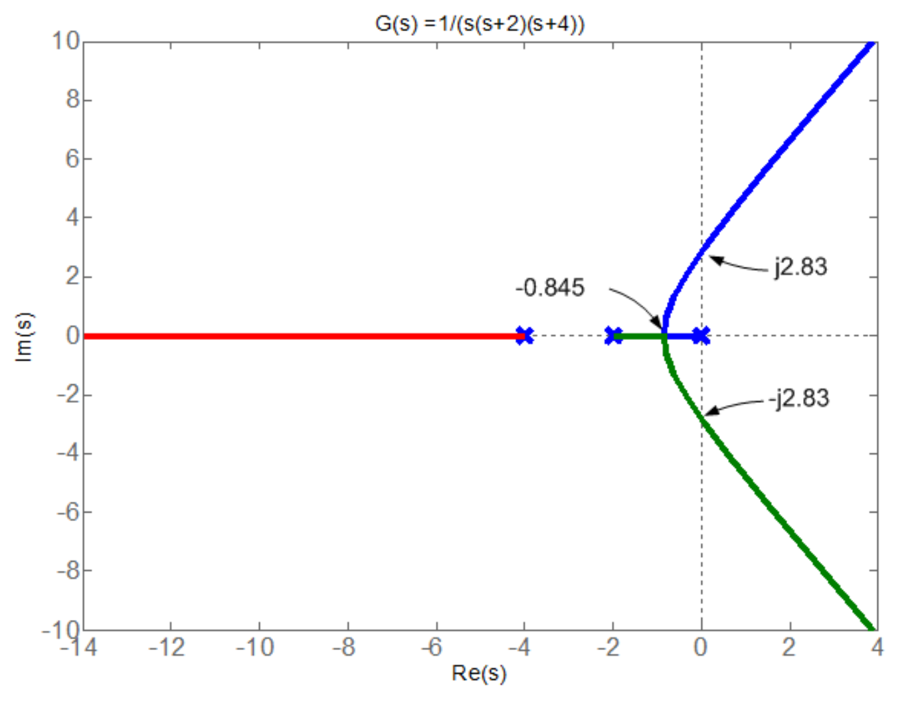

:::

---

::: {.compact-slide .expanded-body-slide}

<strong>Root Locus for</strong>  $\dfrac{1}{s(s+2)(s+4)}$
<strong>(continued)</strong>

`% Root Locus of G(s) = 1/(s(s+2)(s+4)) = 1/(s3+6s2+8s)`

`den = [1 6 8 0];`

`num = [1];`

`rlocus(tf(num,den))`

`% Pretty up the plot by making the linewidth thicker,`

`%`` ``the marker size and`` font size bigger.`

`h = findobj(gca, ’Type’, ’line’);`

`set(h, ’LineWidth’, 6)`

`set(h, ’MarkerSize’, 20)`

`set(gca,’FontSize’,24)`

`% Set range of x-axis [-10,0] and y-axis [-2,2]`

`v = [-10 10 -10 10];`

`axis(v)`

`axis square`

`% Title the plot and label the axes`

`str_G = ’G(s) = 1/(s(s+2)(s+4))’;`

`title(str_G,’FontSize’,20)`

`xlabel(’Re(s)’,’FontSize’,20)`

`ylabel (’Im(s)’,’FontSize’,20)`
:::

---

::: {.compact-slide .expanded-body-slide}

Root Locus Rules

The previous examples used the following **root locus rules**.

**(1)** The root locus starts on the open-loop poles ($K=0$).

**(2)** The root locus ends on the open-loop zeros ($K=\infty$).

**(3)** The root locus is symmetric with respect to the real axis.

**(4)** Any $s_{0}$ on the root locus satisfies the angle condition,
i.e., $$\angle G(s_{0})=\pm(2\ell+1)\pi\text{  for  }\ell=0,1,2,...$$

(used to find the *real-axis* root locus)

**(5)** A breakaway point from the real axis is a solution to
$dG(s)/ds=0.$

**(6)** The $j\omega$ axis intercepts may be found using the
Routh-Hurwitz test.
:::

---

::: {.compact-slide .expanded-body-slide}

Asymptotes and Their Intercept

$$\begin{aligned}
G(s)=\frac{b(s)}{a(s)} & =\frac{b_{m}s^{m}+b_{m-1}s^{m-1}+\cdots
+b_{1}s+b_{0}}{s^{n}+a_{n-1}s^{n-1}+\cdots+a_{1}s+a_{0}} \\
& =\frac{b_{m}\!\left( s^{m}+\dfrac{b_{m-1}}{b_{m}}s^{m-1}+\cdots +\dfrac{b_{1}}{b_{m}}s+\dfrac{b_{0}}{b_{m}}\right) }{s^{n}+a_{n-1}s^{n-1}+\cdots+a_{1}s+a_{0}}.
\end{aligned}$$

-   For $|s|$ large the branches of the root locus are **asymptotic** to
    straight lines.

-   These straight lines are called **asymptotes**.

-   These asymptotes intersect the real axis at angles given by
    $$\theta_{\ell}=\frac{2\ell+1}{n-m}\pi,\text{  }\ell=0,1,2,...,n-m-1.$$

-   Further these asymptotes intersect on the real line at
    $$\sigma_{1}=-\frac{a_{n-1}-b_{m-1}/b_{m}}{n-m}.$$
:::

---

::: {.compact-slide .expanded-body-slide}

Asymptotes and Their Intercept

$$\begin{aligned}
G(s)=\frac{b(s)}{a(s)} & =\frac{b_{m}s^{m}+b_{m-1}s^{m-1}+\cdots
+b_{1}s+b_{0}}{s^{n}+a_{n-1}s^{n-1}+\cdots+a_{1}s+a_{0}} \\
& =\frac{b_{m}\!\left( s^{m}+\dfrac{b_{m-1}}{b_{m}}s^{m-1}+\cdots +\dfrac{b_{1}}{b_{m}}s+\dfrac{b_{0}}{b_{m}}\right) }{s^{n}+a_{n-1}s^{n-1}+\cdots+a_{1}s+a_{0}}.
\end{aligned}$$ In the special case where $m=0,$ that is,
$$G(s)=\frac{b_{0}}{s^{n}+a_{n-1}s^{n-1}+\cdots+a_{1}s+a_{0}}$$ we take
$b_{-1}=0$ so that
$$\sigma_{1}=-\frac{a_{n-1}-b_{-1}/b_{0}}{n-m}=-\frac{a_{n-1}-0}{n-m}.$$

This rule is best explained by an example.
:::

---

::: {.compact-slide}

<strong>Asymptotes and their Intersection for</strong>
$G(s)=\dfrac {1}{s(s+2)(s+4)}$

$G(s)=\dfrac{1}{s(s+2)(s+4)}=\dfrac{1}{s^{3}+6s^{2}+8s}$

Then the *angles of the asymptotes* with respect to the real axis are
($n=3,m=0$) $$\begin{aligned}
\theta_{\ell} & =\frac{(2\ell+1)\pi}{3-0},\ell=0,1,2 \\
& =\frac{\pi}{3},\frac{3\pi}{3},\frac{5\pi}{3} \\
& =\frac{\pi}{3},\pi,-\frac{\pi}{3}
\end{aligned}$$ and these asymptotes intersect at$$\begin{aligned}
\sigma_{1} & =-\frac{a_{n-1}-0}{n-m},\text{ }n=3,m=0 \\
& =-\frac{6-0}{3-0},\text{ }a_{2}=6 \\
& =-2.
\end{aligned}$$
:::

---

::: {.compact-slide .multi-figure-slide .expanded-body-slide}

<strong>Asymptotes and their Intersection for</strong>
$G(s)=\dfrac {1}{s(s+2)(s+4)}$

$G(s)=\dfrac{1}{s(s+2)(s+4)}=\dfrac{1}{s^{3}+6s^{2}+8s}.$

$\theta_{\ell}=\dfrac{\pi}{3},\pi,-\dfrac{\pi}{3}$ and $\sigma_{1}=-2.$

The asymptotes intersect the $j\omega$ axis at
$\pm j2\tan(\pi/3)=\pm2\sqrt {3}=\pm j3.46.$

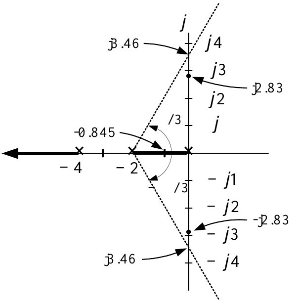

:::

---

::: {.compact-slide .expanded-body-slide .expanded-figure-slide}

<strong>Asymptotes and their Intersection for</strong>
$G(s)=\dfrac {1}{s(s+2)(s+4)}$

-   [Matlab]{.smallcaps} plot of the root locus (See slide ).

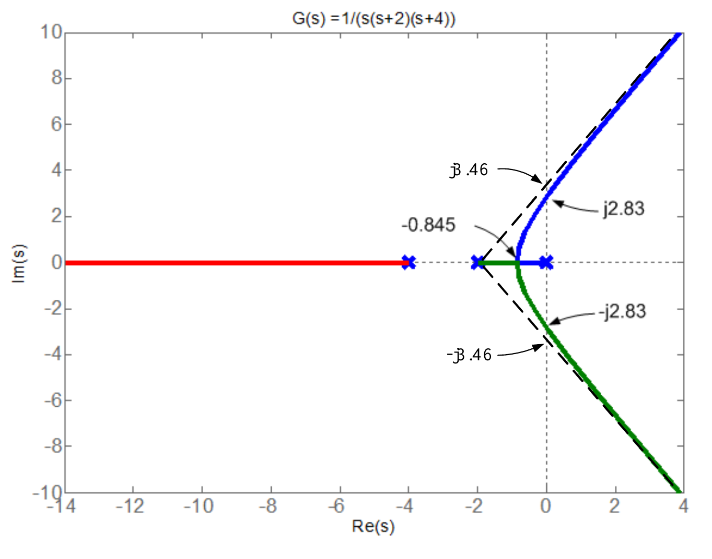

:::

---

::: {.compact-slide}

<strong>Root Locus of</strong>  $G(s)=\dfrac{s+4}{s(s+2)}=\dfrac{|s+4|}{|s||s+2|}e^{j\left(
\angle(s+4)-\angle s-\angle(s+2)\right)
}.$

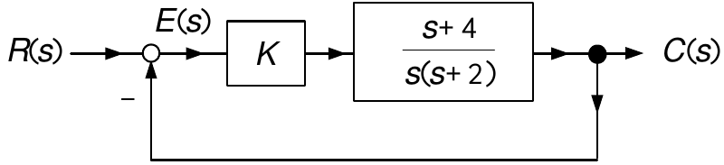

**Return Difference**

$$1+KG(s)=1+K\dfrac{s+4}{s(s+2)}=\dfrac{s(s+2)+K(s+4)}{s(s+2)}$$
**Angle Condition** $G(s)=-\dfrac{1}{K}$ $\Longrightarrow$
$$\angle(s+4)-\angle s-\angle(s+2)=\pi(2\ell+1),\ell=0,\pm
1,\pm2,....$$

**(1)** $K=0.$ Then $s(s+2)+K(s+4)=s(s+2)=0$ $\Longrightarrow$ $\
s=0,-2.$

**(2)** $K=\infty.$ From $G(s)=\dfrac{s+4}{s(s+2)}=-\dfrac{1}{K}$ $\
\Longrightarrow$ $s\rightarrow-4$ or $|s|\rightarrow\infty$ as
$K\rightarrow\infty$.

$G(s)$ has one zero at $-4$ and one zero at $|s|=\infty$.

The root locus ends on the open-loop zeros.
:::

---

::: {.compact-slide}

<strong>Root Locus of</strong>  $G(s)=\dfrac{s+4}{s(s+2)}=\dfrac{|s+4|}{|s||s+2|}e^{j\left(
\angle(s+4)-\angle s-\angle(s+2)\right) }.$

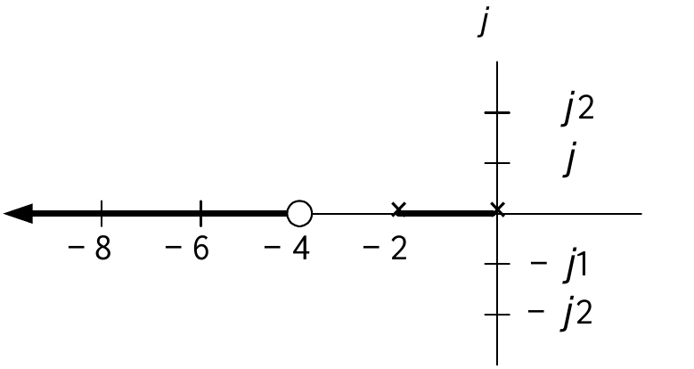

**(3)** *Real Axis Root Locus*

*(i)* Consider $s$ real with $-2<s<0$ so $\angle s=\pi,\angle
(s+2)=0,\angle(s+4)=0.$

Then $$\angle G(s)=\angle(s+4)-\angle s-\angle(s+2)=-\pi.$$

These values of $s$ are **on** the root locus.

*(ii)* Consider $s$ real with $-4<s<-2$ so $\angle s=\pi,\angle
(s+2)=\pi,\angle(s+4)=0.$

Then $$\angle G(s)=\angle(s+4)-\angle s-\angle(s+2)=0.$$

These values of $s$ are **not** on the root locus.
:::

---

::: {.compact-slide}

<strong>Root Locus of</strong>  $G(s)=\dfrac{s+4}{s(s+2)}=\dfrac{|s+4|}{|s||s+2|}e^{j\left(
\angle(s+4)-\angle s-\angle(s+2)\right) }.$

**(3)** *Real Axis Root Locus (continued)*

*(iii)* Consider $s$ real with $s<-4$ so $\angle s=\pi,\angle
(s+2)=\pi,\angle(s+4)=\pi.$

Then $$\angle G(s)=\angle(s+4)-\angle s-\angle(s+2)=-\pi.$$

These values of $s$ are **on** the root locus.

*(iv)* Finally, consider $s$ real with $s>0$ so $\angle s=0,\angle
(s+2)=0,\angle(s+4)=0.$

Then $$\angle G(s)=-\angle s-\angle(s+2)-\angle(s+4)=0.$$

These values of $s$ are **not** on the root locus.
:::

---

::: {.compact-slide .boundary-safe-slide}

<strong>Root Locus of</strong>  $G(s)=\dfrac{s+4}{s(s+2)}$

*Breakaway Point*

Solve
$$\frac{d}{ds}\underset{G(s)}{\underbrace{\left( \dfrac{s+4}{s(s+2)}\right) }}=0.$$

$$\frac{d}{ds}G(s)=\dfrac{1}{s(s+2)}-\dfrac{s+4}{\left[ s(s+2)\right]
^{2}}\frac{d}{ds}\left( s^{2}+2s\right) =\frac{s(s+2)-(s+4)(2s+2)}{\left[
s(s+2)\right] ^{2}}=-\frac{s^{2}+8s+8}{\left[ s(s+2)\right] ^{2}}$$

$\dfrac{d}{ds}G(s)=0$ requires $s^{2}+8s+8=0$, or
$$s=\frac{-8\pm\sqrt{64-32}}{2}=-4\pm2\sqrt{2}=-6.828,-1.172$$

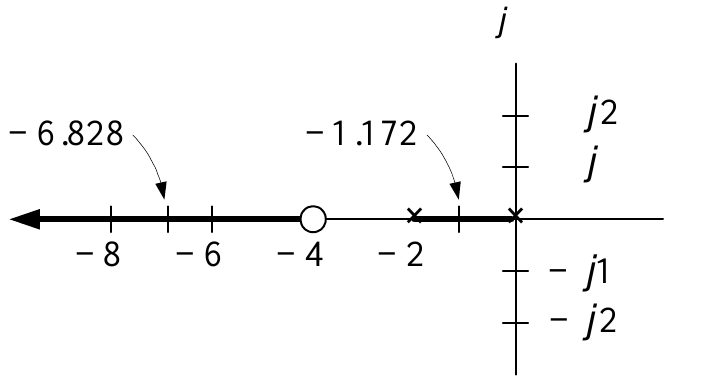

-   Both roots of $dG/ds=0$ are on the real axis root locus and so are
    breakaway pts.
:::

---

::: {.compact-slide .expanded-short-slide}

<strong>Root Locus of</strong>  $G(s)=\dfrac{s+4}{s(s+2)}$

$j\omega$ *axis
intercepts*$$1+K\dfrac{s+4}{s(s+2)}=\dfrac{s(s+2)+K(s+4)}{s(s+2)}=0$$

The closed-loop poles are the roots of
$$s(s+2)+K(s+4)=s^{2}+(K+2)s+4K=0.$$

-   Are there values of $K\geq0$ for which the roots are on the
    $j\omega$ axis?

-   This is a second-order polynomial which is stable for $K>-2.$

    $\Longrightarrow$ There is no value of $K\geq0$ for which the root
    locus intercepts the $j\omega$ axis.
:::

---

::: {.compact-slide .expanded-short-slide}

<strong>Root Locus of</strong>  $G(s)=\dfrac{s+4}{s(s+2)}$

*Asymptotes* $n=2,m=1$

Asymptote angles: $$\begin{aligned}
\theta_{\ell} & =\frac{\pi(2\ell+1)}{n-m},\text{ }\ell=0,1,...,n-m-1 \\
& =\frac{\pi(2\ell+1)}{2-1},\text{ }\ell=0.
\end{aligned}$$

That is, $\theta_{0}=\pi.$

Asymptote intersection with the real axis $$\begin{aligned}
\sigma_{1} & =-\frac{a_{n-1}-b_{m-1}/b_{m}}{n-m},\text{ }n=3,m=1 \\
& =-\frac{2-4/1}{2-1}\text{ as }a_{2}=2 \\
& =2.
\end{aligned}$$

That is, $\sigma_{1}=2.$

-   There is only one asymptote whose angle is $\pi.$
:::

---

::: {.compact-slide .multi-figure-slide .expanded-body-slide}

<strong>Root Locus of</strong>  $G(s)=\dfrac{s+4}{s(s+2)}$

*Sketch* Previously

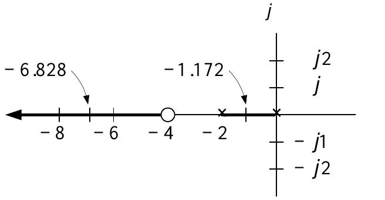

The full sketch is then

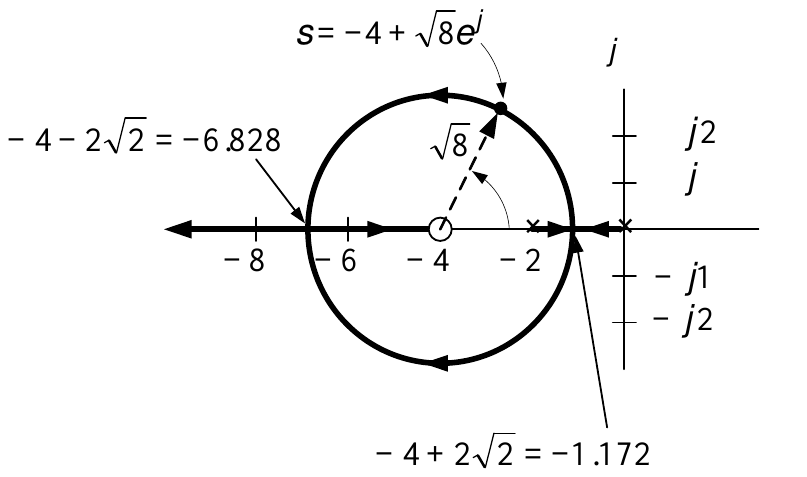

Using the angle condition we show that the root locus that is off the
real axis is a circle!
:::

---

::: {.compact-slide .expanded-body-slide}

<strong>Root Locus of</strong>  $G(s)=\dfrac{s+4}{s(s+2)}$

Show $s=-4+\sqrt{8}e^{j\theta}$ is on the root locus for $0\leq\theta
\leq2\pi.$ $$\begin{aligned}
\left. G(s)\right\vert _{s=-4+\sqrt{8}e^{j\theta}}=\left. \dfrac {s+4}{s(s+2)}\right\vert _{s=-4+\sqrt{8}e^{j\theta}} & =\frac{\sqrt {8}e^{j\theta}}{(-4+\sqrt{8}e^{j\theta})(-2+\sqrt{8}e^{j\theta})} \\
& =\frac{\sqrt{8}e^{j\theta}}{8-6\sqrt{8}e^{j\theta}+8e^{2j\theta}} \\
& =\frac{\sqrt{8}}{8e^{-j\theta}-6\sqrt{8}+8e^{j\theta}} \\
& =\frac{\sqrt{8}}{16\cos(\theta)-6\sqrt{8}} \\
& =-\frac{\sqrt{8}}{\underset{16.97}{\underbrace{6\sqrt{8}}}-16\cos(\theta)}.
\end{aligned}$$ That is, $G(-4+\sqrt{8}e^{j\theta})=-$
$\underset{>\text{ }0\text{ for all }\theta}{\underbrace{\dfrac{\sqrt{8}}{16.97-16\cos(\theta)}}}$.

-   $\angle G(-4+\sqrt{8}e^{j\theta})=\pi$ for all
    $0\leq\theta\leq2\pi$.
:::

---

::: {.compact-slide}

Angles of Departure

$G(s)=\dfrac{1}{s(s^{2}+2s+2)}=\dfrac{|s+4|}{|s||s-(-1+j)||s-(-1-j)|}e^{-j\left( \angle s+\angle(s-(-1+j))+\angle s-(-1-j)\right) }.$

The denominator $G(s)$ factors as $s(s^{2}+2s+2)=s[s-(-1+j)][s-(-1-j)].$

The pair of complex conjugate open-loop poles leads to the **angles of
departure**.

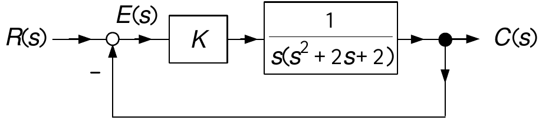

The closed-loop poles are the *zeros* of
$$1+KG(s)=1+K\dfrac{1}{s(s^{2}+2s+2)}=\dfrac{s^{3}+2s^{2}+2s+K}{s(s^{2}+2s+2)}.$$
By the angle condition CL poles satisfy
$$G(s)=-\frac{1}{K}\text{  }\Longrightarrow\angle G(s)=\pi(2\ell+1),\ell
=0,\pm1,\pm2,....$$ or
$$-\angle s-\angle\lbrack(s-(-1+j)]-\angle\lbrack s-(-1-j)]=\pi
(2\ell+1),\ell=0,\pm1,\pm2,....$$
:::

---

::: {.compact-slide .expanded-body-slide}

<strong>Root Locus of</strong> <em>s</em>3 + 2<em>s</em>2 + 2<em>s</em> + <em>K</em> = 0

$G(s)=\dfrac{1}{s(s^{2}+2s+2)}=\dfrac{|s+4|}{|s||s-(-1+j)||s-(-1-j)|}e^{-j\left( \angle s+\angle(s-(-1+j))+\angle s-(-1-j)\right) }$

**(1)** $K=0.$ Then
$$s^{3}+2s^{2}+2s+K=s(s^{2}+2s+2)=s[s-(-1+j)][s-(-1-j)]=0$$

The root locus starts on the open-loop **poles** $s=0,-1\pm j.$

**(2)** $K=\infty.$ From $G(s)=\dfrac{1}{s(s^{2}+2s+2)}=-\dfrac{1}{K}$
we have $|s|\rightarrow\infty$ as $K\rightarrow\infty.$

$G(s)$ has three zeros at $|s|=\infty$ since
$$G(s)=\dfrac{1}{s(s^{2}+2s+2)}\approx\frac{1}{|s|^{3}}\text{  for  }|s|\rightarrow\infty.$$

The root locus ends on the open-loop **zeros**.
:::

---

::: {.compact-slide .multi-figure-slide}

<strong>Root Locus of</strong> <em>s</em>3 + 2<em>s</em>2 + 2<em>s</em> + <em>K</em> = 0

**(3)** *Real Axis Root Locus*

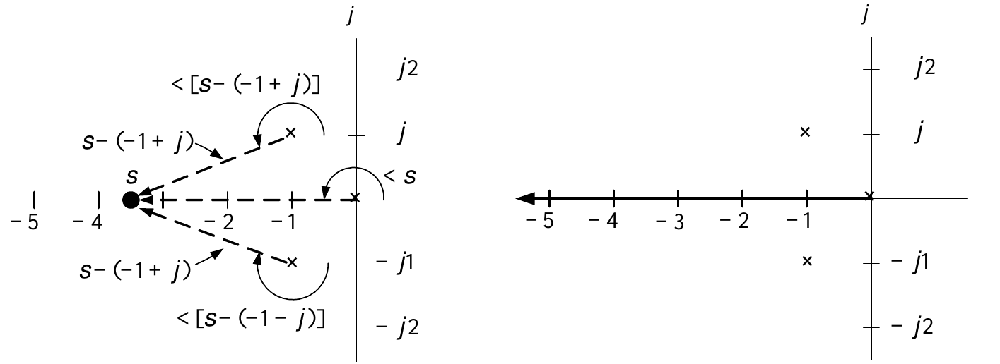
 *(i)* $s$ real with
$-\infty<s<0$ so $\angle s=\pi,\angle
\lbrack(s-(-1+j)]=-\angle\lbrack(s-(-1-j)]$.
$$\angle G(s)=-\angle s\underset{0}{\underbrace{-\angle
\lbrack(s-(-1+j)]-\angle\lbrack s-(-1-j)]}}\text{ }=-\angle s=-\pi$$

These values of $s$ are **on** the root locus.

*(ii)* $s$ real with $s>0$ so $\angle s=0,\angle\lbrack
(s-(-1+j)]=-\angle\lbrack(s-(-1-j)].$
$$\angle G(s)=-\angle s\underset{0}{\underbrace{-\angle
\lbrack(s-(-1+j)]-\angle\lbrack s-(-1-j)]}}\text{ }=-\angle s=0$$

These values of $s$ are **not** on the root locus.

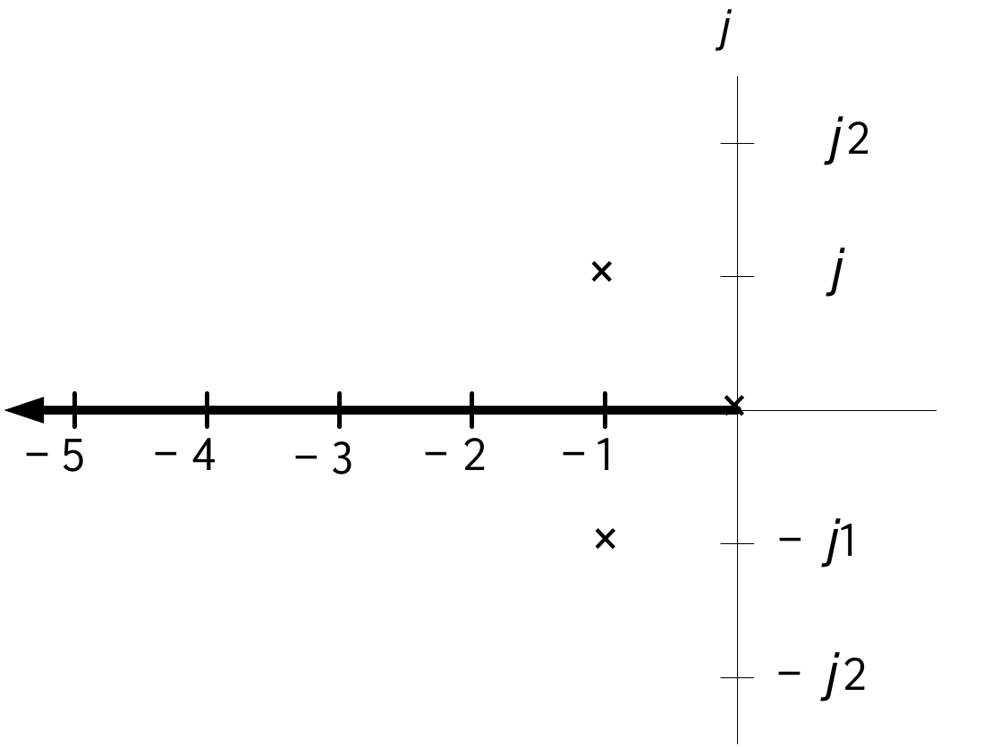

:::

---

::: {.compact-slide .expanded-body-slide}

<strong>Root Locus of</strong> <em>s</em>3 + 2<em>s</em>2 + 2<em>s</em> + <em>K</em> = 0

**(4)** *Breakaway Point*

Check where the return difference has *multiple* zeros.
$$1+K\dfrac{1}{s(s^{2}+2s+2)}=\dfrac{s^{3}+2s^{2}+2s+K}{s(s^{2}+2s+2)}=0.$$

A breakaway point must satisfy
$$\frac{d}{ds}\underset{G(s)}{\underbrace{\left( \dfrac{1}{s(s^{2}+2s+2)}\right) }}\text{ }=0$$

or
$$\frac{d}{ds}G(s)=-\dfrac{1}{[s(s^{2}+2s+2)]^{2}}\frac{d}{ds}(s^{3}+2s^{2}+2s)=-\dfrac{1}{[s(s^{2}+2s+2)]^{2}}(3s^{2}+4s+2)=0.$$

Solving $3s^{2}+4s+2=0$ gives
$$s=\frac{-4\pm\sqrt{16-24}}{6}=-\frac{2}{3}-\pm j\frac{\sqrt{2}}{3}$$

These roots are **not** on the real axis. Thus there are no breakaway
points.
:::

---

::: {.compact-slide .expanded-body-slide .expanded-figure-slide}

<strong>Root Locus of</strong> <em>s</em>3 + 2<em>s</em>2 + 2<em>s</em> + <em>K</em> = 0

**(5)** $j\omega$ *axis intercepts* The Routh table for
$s^{3}+2s^{2}+2s+K=0$ is $$\begin{array}{cccccc}
s^{3} &  & 1 &  & 2 &  \\
s^{2} &  & 2 &  & K &  \\
s &  & (4-K)/2 &  & 0 &  \\
1 &  & K &  &  &
\end{array}$$

-   Closed-loop system is stable for $0<K<4.$

-   There are two right half-plane roots for $K>4.$

    $\Longrightarrow$ For $K=4$ there are two roots on the $j\omega$
    axis.

-   The auxiliary equation $2s^{2}+K=2s^{2}+4=0$ then gives
    $s=\pm j\sqrt {2}.$

    
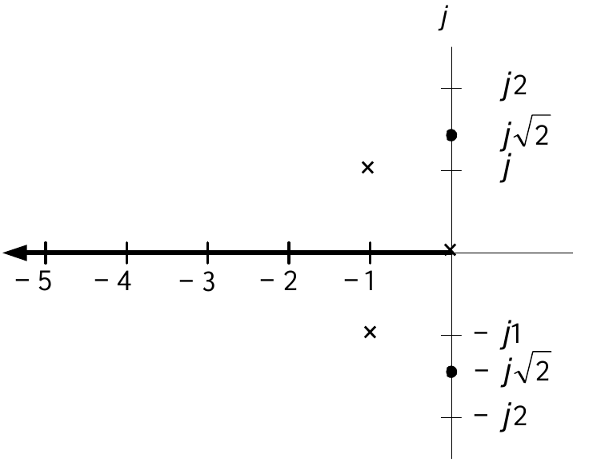

:::

---

::: {.compact-slide}

<strong>Root Locus of</strong> $G(s)=\dfrac{1}{s(s^{2}+2s+2)}$

**(6)** *Asymptotes* The angles of the asymptotes are ($n=3,m=0$)
$$\theta_{\ell}=\frac{\pi(2\ell+1)}{n-m},\text{ }\ell=0,1,...,n-m-1=\frac {\pi(2\ell+1)}{3-0},\text{ }\ell=0,1,2.$$

I.e., $\theta_{0}=\pi/3,\theta_{1}=\pi,\theta_{2}=5\pi/3$ $(-\pi /3).$

Their intercept on the real axis is$$\begin{aligned}
\sigma_{1}=-\frac{a_{n-1}-b_{m-1}/b_{m}}{n-m},\text{ }n=3,m=0 & =-\frac {2-0}{3-0}\text{ as }a_{2}=2,b_{0}=1 \\
& =-2/3.
\end{aligned}$$

Two of these asymptotes intersect the $j\omega$ axis at $\pm j(2/3)\tan
(\pi/3)=\pm j1.155.$

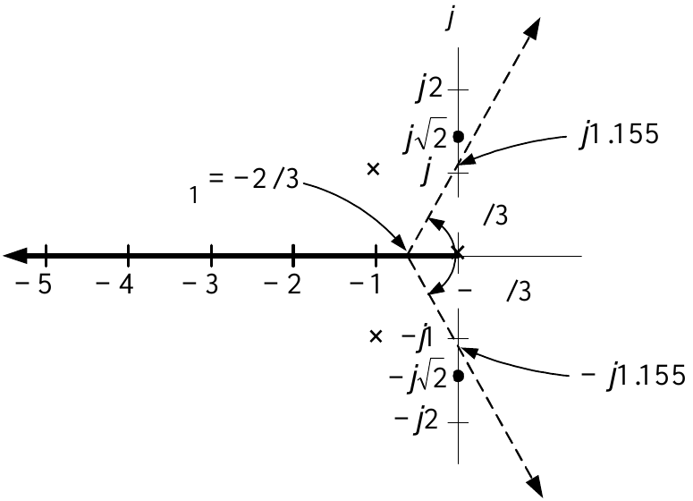

:::

---

::: {.compact-slide .expanded-body-slide .expanded-figure-slide}

<strong>Root Locus of</strong> $G(s)=\dfrac{1}{s(s^{2}+2s+2)}$

**(7)** *Angles of Departure*

-   For $K=0$ the roots are at $s=0,s=-1+j,$ and $s=-1-j.$

-   As $K$ is increased slightly, the closed-loop poles will leave these
    roots.

-   The branch that starts at $-1+j$ is slightly away from this point.

Then, under these conditions, $$\begin{aligned}
\angle s & \approx\pi/2+\pi/2=3\pi/4 \\
\angle\lbrack s-(-1-j)] & \approx\pi/2.
\end{aligned}$$ 

:::

---

::: {.compact-slide}

<strong>Root Locus of</strong> $G(s)=\dfrac{1}{s(s^{2}+2s+2)}$

**(7)** *Angles of Departure* For $K$ slightly positive we
have$$\angle s\approx3\pi/4\text{  and  }\angle\lbrack s-(-1-j)]\approx\pi/2.$$

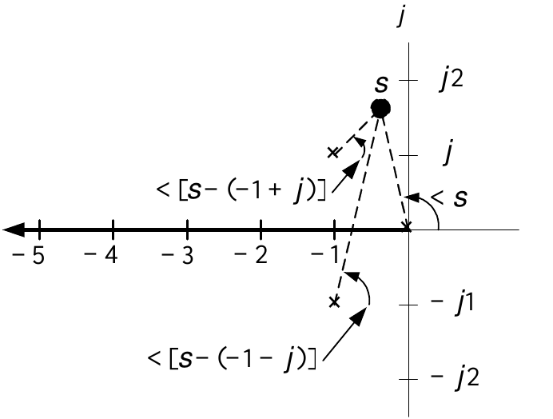

For$s$ close to $-1+j$ and on the root locus it must satisfy the angle
condition:$$-\angle s-\underset{\text{unknown}}{\underbrace{\angle\lbrack(s-(-1+j)]}}-\angle\lbrack s-(-1-j)]=\pi(2\ell+1),\ell=0,\pm1,\pm2,....$$

Or, with $\ell=0$, we have $-\pi/2-\angle\lbrack(s-(-1+j)]-3\pi/4=\pi$.
$$\Longrightarrow\text{  }\angle\lbrack(s-(-1+j)]=-5\pi/4-\pi=-\pi/4-2\pi
=-\pi/4\text{ }\operatorname{mod}2\pi.$$

By symmetry we have $\angle\lbrack(s-(-1-j)]=\pi/4.$
:::

---

::: {.compact-slide .expanded-body-slide .expanded-figure-slide}

<strong>Root Locus of</strong>

$G(s)=\dfrac{1}{s(s^{2}+2s+2)}$

-   The root locus starts on the open-loop poles.

-   The branch starting at $s=0$ continues out along the negative real
    axis to $-\infty.$

-   The branch that starts at $-1+j$ leaves that point at an angle of
    $-\pi/4.$

    As $K$ increases this branch intercepts the $j\omega$ axis at
    $j\sqrt{2}$.

    As $K\rightarrow\infty$ this branch approaches its asymptote.

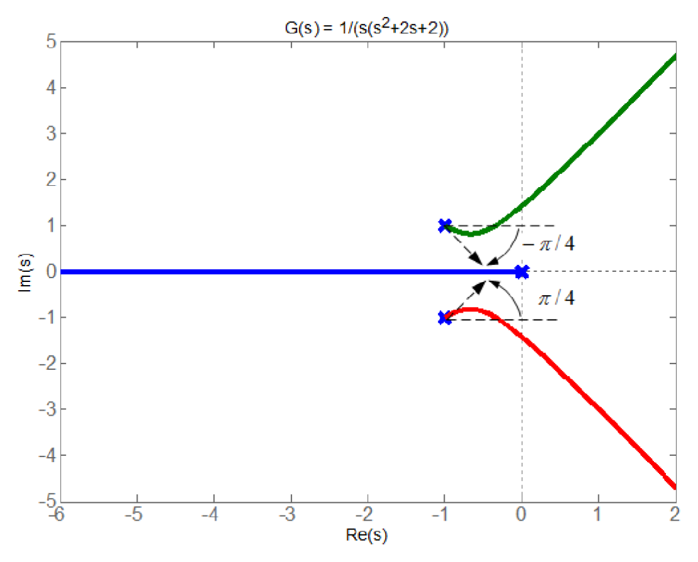

:::

---

::: {.compact-slide .expanded-body-slide .expanded-figure-slide}

Effect of Open-Loop Poles on the Root Locus

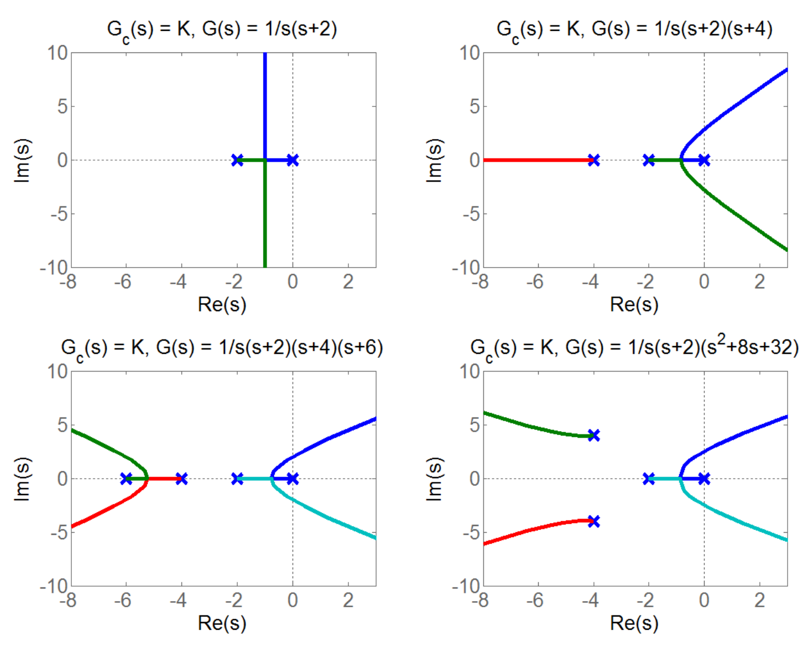

:::

---

::: {.compact-slide .expanded-body-slide .expanded-figure-slide}

Effect of Open-Loop Zeros on the Root Locus

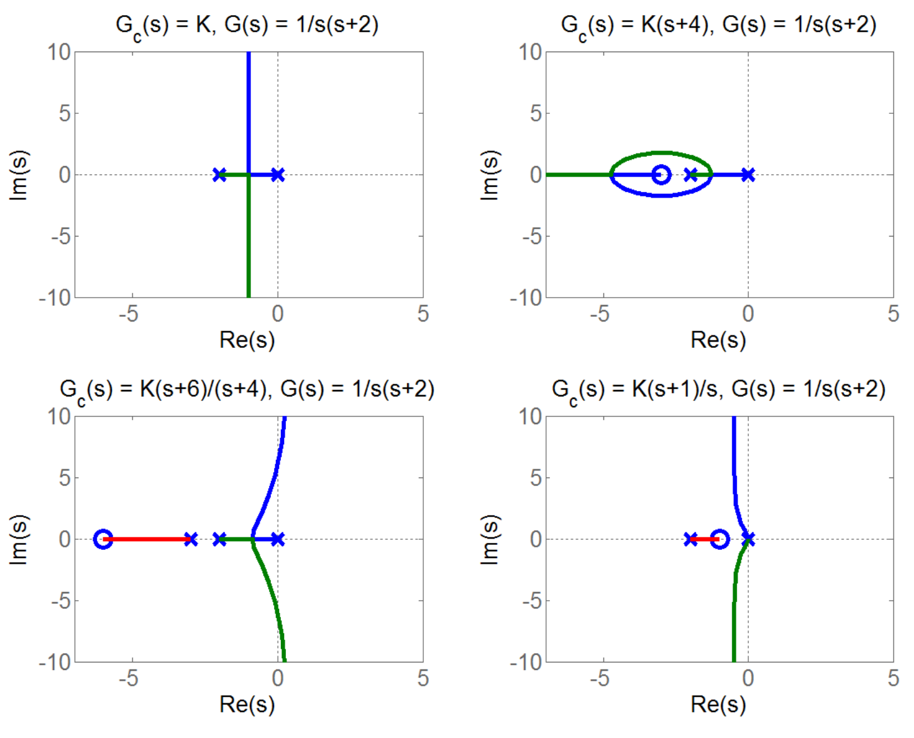

:::

---

::: {.compact-slide .expanded-body-slide .expanded-figure-slide}

Effect of the Breakaway Point on the Root Locus

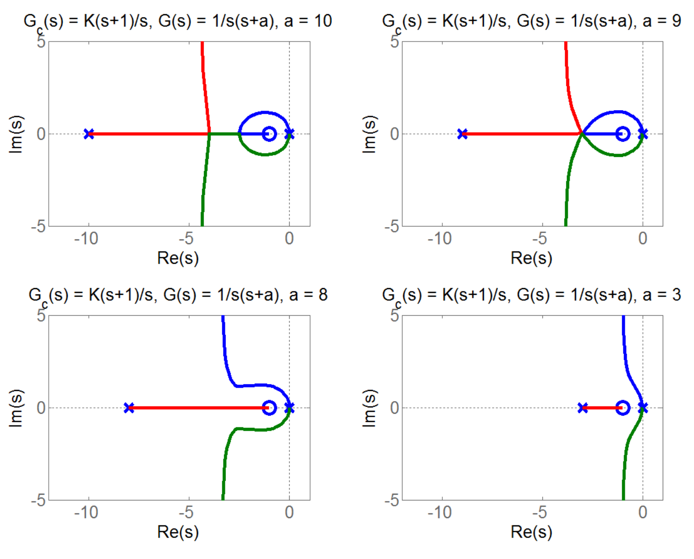

:::

---

::: {.compact-slide}

Design Example Satellite Control

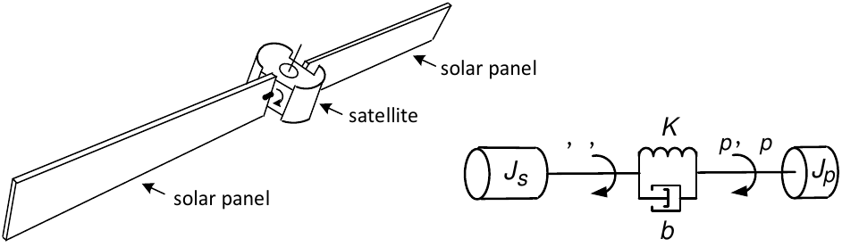

$$\begin{aligned}
\theta(s) & =\frac{bs+K}{J_{s}s^{2}+bs+K}\theta_{p}(s)+\frac{1}{J_{s}s^{2}+bs+K}\tau(s) \\
\theta_{p}(s) & =\frac{bs+K}{J_{p}s^{2}+bs+K}\theta(s).
\end{aligned}$$

Non collocated case: $\theta_{p}$ is measured
$$G_{p}(s)=\frac{\theta_{p}(s)}{\tau(s)}=\frac{(b/(J_{s}J_{p}))s+K/(J_{s}J_{p})}{s^{2}(s^{2}+b\left( 1/J_{p}+1/J_{s}\right) s+K\left(
1/J_{p}+1/J_{s}\right) )}.$$ With $J_{s}=5$ $Kg-m^{2},$ $J_{p}=1$
$Kg-m^{2},$ $K=0.15$ $N-m/radian,$ $b=0.05$ $Nm/rad/sec,$ $|\tau|\leq5,$
$$G_{p}(s)=\frac{0.01(s+3)}{s^{2}+0.06s+0.18}\frac{1}{s^{2}}.$$
:::

---

::: {.compact-slide}

Design Example Satellite Control

**Notch Filter**
$$G_{notch}(s)\triangleq\frac{s^{2}+0.06s+0.18}{(s+3)^{2}}.$$ Then
$$G_{notch}(s)G_{p}(s)\triangleq\frac{s^{2}+0.06s+0.18}{(s+3)^{2}}\frac{0.01(s+3)}{s^{2}+0.06s+0.18}\frac{1}{s^{2}}=\frac{0.01(s+3)}{(s+3)^{2}}\frac{1}{s^{2}}=\frac{0.01}{(s+3)s^{2}}.$$

-   $G_{notch}(s)$ is used to cancel the two lightly-damped poles of
    $G_{p}(s)$ at $-0.03\pm j0.42$.

-   Replace them with two real poles at $-3.$

-   The location $-3$ was chosen simply to cancel the zero of
    $G_{p}(s).$

-   $G_{p}(s)$ is not known precisely so these stable pole-zero
    cancellations are **not** exact.
:::

---

::: {.compact-slide}

Design Example Satellite Control

$$G_{notch}(s)G_{p}(s)\triangleq\frac{s^{2}+0.06s+0.18}{(s+3)^{2}}\frac{0.01(s+3)}{s^{2}+0.06s+0.18}\frac{1}{s^{2}}=\frac{0.01}{(s+3)s^{2}}.$$

-   A lead compensator of the form $G_{lead}(s)=\dfrac{s+0.1}{s+1}$
    stabilizes $\dfrac{1}{s^{2}}.$

-   Try this lead commpensator to stabilize
    $G_{notch}(s)G_{p}(s)=\dfrac{0.01}{(s+3)s^{2}}.$

-   The proposed controller is then
    $$G_{c}(s)=\dfrac{s+0.1}{s+1}\frac{s^{2}+0.06s+0.18}{(s+3)^{2}}.$$
:::

---

::: {.compact-slide}

Design Example Satellite Control

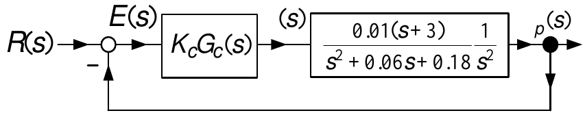

$$G_{c}(s)=\dfrac{s+0.1}{s+1}\frac{s^{2}+0.06s+0.18}{(s+3)^{2}}.$$

-   First must deal with the fact that the cancellation is **not**
    exact.

-   Modify the notch filter to be
    $$G_{notch}(s)=\frac{s^{2}+g(0.06)s+g(0.18)}{(s+3.3)^{2}}.$$

-   Nominal value of $g$ is $1.$

-   Put the poles of $G_{notch}(s)$ at $-3.3$ to be a little further in
    the left half-plane.

-   Consider $g=0.8$ and $g=1.2$ to see the effect of $g.$
:::

---

::: {.compact-slide .expanded-body-slide .expanded-figure-slide}

Design Example Satellite Control

-   Take $g=0.8$ so
    $G_{c}(s)=\dfrac{s+0.1}{s+1}\dfrac{s^{2}+0.048s+0.144}{(s+3.3)^{2}}.$

-   Root locus of $K_{c}G_{c}(s)G_{p}(s)$ for $0\leq K_{c}\leq1500.$

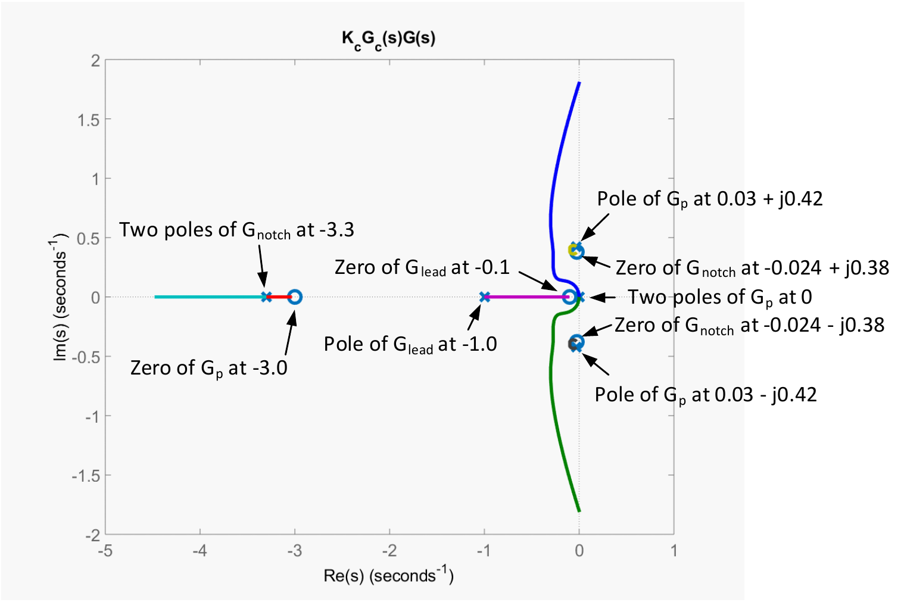

:::

---

::: {.compact-slide .expanded-body-slide .expanded-figure-slide}

Design Example Satellite Control

-   Take $g=0.8$ so
    $G_{c}(s)=\dfrac{s+0.1}{s+1}\dfrac{s^{2}+0.048s+0.144}{(s+3.3)^{2}}.$

-   The 2 CL poles which start at $-0.03\pm j0.42$ (OL poles of
    $G_{p}(s)$).

    migrate to the zeros of the notch filter at $-0.024+j0.38.$

-   As $K_{c}$ increases, they **stay** in the left half-plane.

    

:::

---

::: {.compact-slide .expanded-body-slide .expanded-figure-slide}

Design Example Satellite Control

With $K_{c}=50$ and $g=0.8$ the closed--loop poles are at
$$3.46,-3.19,-0.82,-0.044\pm j0.43,-0.054\pm j0.1.$$

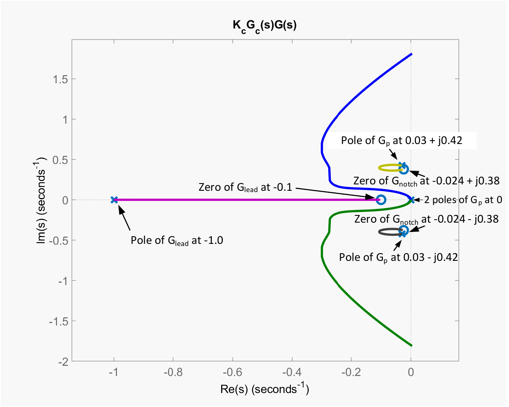

:::

---

::: {.compact-slide .expanded-body-slide .expanded-figure-slide}

Design Example Satellite Control

-   Redo root locus with $g=1.2.$
    $G_{c}(s)=\dfrac{s+0.1}{s+1}\dfrac{s^{2}+0.072s+0.216}{(s+3.3)^{2}}.$

-   The zeros of $G_{notch}$ are now $-0.036\pm j0.46.$

-   The 2 CL poles which start at $-0.03\pm j0.42$ (OL poles of
    $G_{p}(s)$).

    migrate to the zeros of the notch filter at $-0.036+j0.46.$

-   As $K_{c}$ increases two poles cross into the RHP!

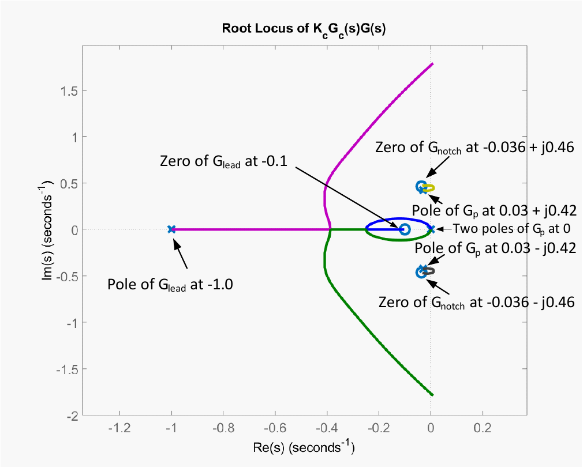

:::

---

::: {.compact-slide .expanded-body-slide .expanded-figure-slide}

Design Example Satellite Control

-   Set $g=0.8,$ $K_{c}=50.$

-   CL poles at $3.46,-3.19,-0.82,-0.044\pm j0.43,-0.054\pm j0.1.$

-   Plot of $\theta_{p}(t)$ and $\theta(t)$ along with $r(t)$.

-   The difference $|\theta _{p}(t)-\theta (t)|$ is small and $|\tau
    (t)|<0.1.$

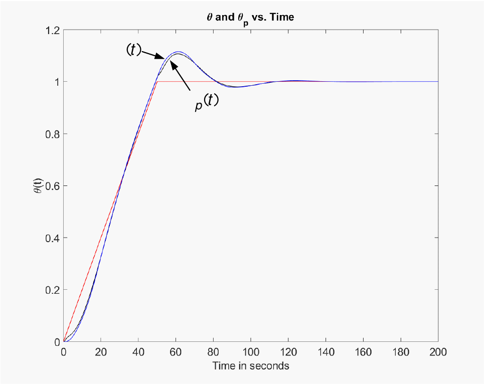

:::
