::: {.contents-slide}
# Contents

- Inverted-Pendulum Modeling

- Linearization About Equilibrium Points

- Magnetic-Levitation Modeling

- Linear and Transfer-Function Models

- Cart-on-a-Track Modeling
:::

---

::: {.compact-slide}

Inverted Pendulum

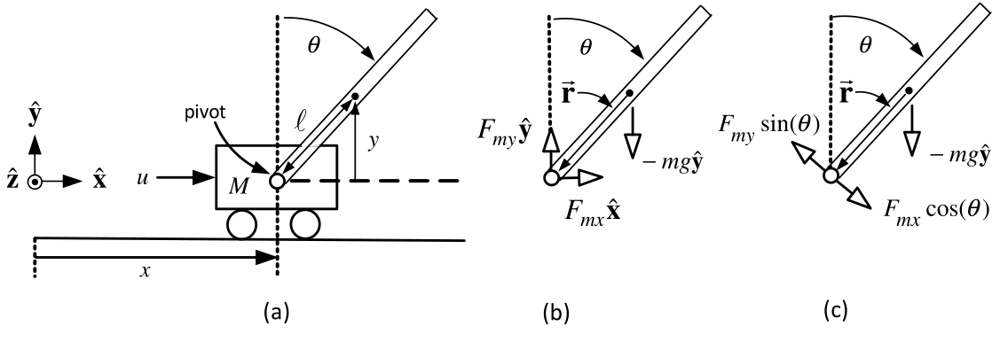

**Control Objective**

-   Keep the pendulum rod upright (vertical so that $\theta =0$).

-   The input force $u(t)$ is to be used to keep $\theta =0.$

-   In this chapter we derive the mathematical model of the inverted pendulum.

-   Control of the pendulum is considered using nested PD controllers.
:::

---

::: {.compact-slide .dense-slide}

Mathematical Model of the Inverted Pendulum

-   $u(t)$ is the force on the cart in the horizontal direction.

-   The center of mass (CoM) of the pendulum rod is at $(x+\ell \sin (\theta ),y).$

-   The pendulum rod of length $2\ell$ is free to rotate about the pivot.

-   $M$ is the cart's mass and $m$ is the mass of the pendulum rod.

-   There is a sensor to measure the angle $\theta$ between the rod and the vertical.
:::

---

::: {.compact-slide .dense-slide}

Mathematical Model of the Inverted Pendulum

-   The pivot exerts a force $\boldsymbol{F}_{m}$ on $m$ through the rod. $$\boldsymbol{F}_{m}=F_{mx}\mathbf{\hat{x}}+F_{my}\mathbf{\hat{y}}$$

-   $-\boldsymbol{F}_{m}=-F_{mx}\mathbf{\hat{x}}-F_{my}\mathbf{\hat{y}}$ is the reaction force of the rod on the cart.

-   The center of mass (CoM) of the pendulum rod is at $(x+\ell \sin (\theta ),y).$

-   The **axis of rotation** for the rod is in the $-\mathbf{\hat{z}}$ direction through its CoM.
:::

---

::: {.compact-slide .expanded-body-slide .expanded-figure-slide}

Mathematical Model of the Inverted Pendulum

Equations of linear motion for $m$: $$\begin{aligned}
m\frac{d^{2}}{dt^{2}}\left( x+\ell \sin (\theta )\right)
&=F_{mx} \\
m\frac{d^{2}}{dt^{2}}\left( \ell \cos (\theta )\right)
&=F_{my}-mg
\end{aligned}$$
:::

---

::: {.compact-slide .dense-slide}

Mathematical Model of the Inverted Pendulum

-   The **axis of rotation** for the rod is in the $-\mathbf{\hat{z}}$ direction through its CoM.

-   If your right thumb is pointing in the $-\mathbf{\hat{z}}$ direction, then your fingers

    are pointing in the positive $\theta$ direction.

-   $J=m\ell ^{2}/3$ is the moment of inertia of rod with respect to its axis of rotation.

-   The rod is accelerating, but $$\tau =J\dfrac{d^{2}\theta }{dt^{2}}$$ is still valid as the rotation axis is through the CoM.
:::

---

::: {.compact-slide .dense-slide}

Mathematical Model of the Inverted Pendulum

-   The gravitational force $-mg\mathbf{\hat{y}}$ does* not* produce any *torque* on the rod$.$

    -   It acts through the center of mass so its moment arm zero.

-   The force $F_{my}\mathbf{\hat{y}}$ has the component $F_{my}\sin (\theta )$ perpendicular to the rod.

-   The force $F_{mx}\mathbf{\hat{x}}$ has the component $F_{mx}\cos (\theta )$ perpendicular to the rod. $.$

Eqn of rotational motion: $\ J\dfrac{d^{2}\theta }{dt^{2}}=\ell F_{my}\sin (\theta )-\ell F_{mx}\cos (\theta ).$

Eqn of motion of the cart: $\ M\dfrac{d^{2}x}{dt^{2}}=u(t)-F_{mx}.$
:::

---

::: {.compact-slide .dense-slide}

Mathematical Model of the Inverted Pendulum

Complete set of equations of motion: $$\begin{aligned}
m\frac{d^{2}}{dt^{2}}\left( x+\ell \sin (\theta )\right)
&=F_{mx} \\
m\frac{d^{2}}{dt^{2}}\left( \ell \cos (\theta )\right)
&=F_{my}-mg \\
J\frac{d^{2}\theta }{dt^{2}} &=\ell F_{my}\sin (\theta )-\ell F_{mx}\cos
(\theta ) \\
M\frac{d^{2}x}{dt^{2}} &=u(t)-F_{mx}.
\end{aligned}$$
:::

---

::: {.compact-slide .dense-slide .boundary-safe-slide .equation-flow-slide .spread-equations-slide}

Mathematical Model of the Inverted Pendulum

$$\begin{aligned}
m\frac{d^{2}}{dt^{2}}\left( x+\ell \sin (\theta )\right)
&=F_{mx} \\
m\frac{d^{2}}{dt^{2}}\left( \ell \cos (\theta )\right)
&=F_{my}-mg \\
J\frac{d^{2}\theta }{dt^{2}} &=\ell F_{my}\sin (\theta )-\ell F_{mx}\cos
(\theta ) \\
M\frac{d^{2}x}{dt^{2}} &=u(t)-F_{mx}.
\end{aligned}$$ Expand: $$\begin{aligned}
m\frac{d^{2}x}{dt^{2}}-m\ell \sin (\theta )\left( \frac{d\theta }{dt}
\right) ^{2}+m\ell \cos (\theta )\frac{d^{2}\theta }{dt^{2}} &=F_{mx} \\
-m\ell \cos (\theta )\left( \frac{d\theta }{dt}\right) ^{2}-m\ell \sin
(\theta )\frac{d^{2}\theta }{dt^{2}} &=F_{my}-mg \\
\ell F_{my}\sin (\theta )-\ell F_{mx}\cos (\theta ) &=J\frac{d^{2}\theta }{
dt^{2}} \\
u(t)-F_{mx} &=M\frac{d^{2}x}{dt^{2}}.
\end{aligned}$$
:::

---

::: {.compact-slide .dense-slide .boundary-safe-slide .equation-flow-slide .spread-equations-slide}

Mathematical Model of the Inverted Pendulum

$$\begin{aligned}
m\frac{d^{2}x}{dt^{2}}-m\ell \sin (\theta )\left( \frac{d\theta }{dt}
\right) ^{2}+m\ell \cos (\theta )\frac{d^{2}\theta }{dt^{2}} &=F_{mx} \\
-m\ell \cos (\theta )\left( \frac{d\theta }{dt}\right) ^{2}-m\ell \sin
(\theta )\frac{d^{2}\theta }{dt^{2}} &=F_{my}-mg \\
\ell F_{my}\sin (\theta )-\ell F_{mx}\cos (\theta ) &=J\frac{d^{2}\theta }{
dt^{2}} \\
u(t)-F_{mx} &=M\frac{d^{2}x}{dt^{2}}.
\end{aligned}$$

Eliminate the reaction forces $F_{mx},F_{my}$. $$\begin{aligned}
mg\ell \sin (\theta )-m\ell \cos (\theta )\frac{d^{2}x}{dt^{2}} &=(J+m\ell
^{2})\frac{d^{2}\theta }{dt^{2}} \\
(M+m)\frac{d^{2}x}{dt^{2}}+m\ell \cos (\theta )\frac{d^{2}\theta }{dt^{2}}
-m\ell \omega ^{2}\sin (\theta ) &=u(t). \\
\end{aligned}$$ Or $$\left[
\begin{array}{cc}
J+m\ell ^{2} & m\ell \cos (\theta ) \\
m\ell \cos (\theta ) & M+m
\end{array}
\right] \left[
\begin{array}{c}
d^{2}\theta /dt^{2} \\
d^{2}x/dt^{2}
\end{array}
\right] =\left[
\begin{array}{c}
mg\ell \sin (\theta ) \\
m\ell \omega ^{2}\sin (\theta )+u(t)
\end{array}
\right] .$$
:::

---

::: {.compact-slide .dense-slide .boundary-safe-slide .equation-flow-slide .spread-equations-slide}

Mathematical Model of the Inverted Pendulum

Define
$$\begin{aligned}
H(\theta)&\triangleq
\begin{bmatrix}
J+m\ell^2 & m\ell\cos\theta\\
m\ell\cos\theta & M+m
\end{bmatrix},\\
D(\theta)&\triangleq\det H(\theta)
=JM+Jm+Mm\ell^2+m^2\ell^2\sin^2\theta.
\end{aligned}$$

The acceleration vector is
$$\begin{aligned}
\begin{bmatrix}\ddot\theta\\\ddot x\end{bmatrix}
&=H(\theta)^{-1}
\begin{bmatrix}
mg\ell\sin\theta\\
m\ell\omega^2\sin\theta+u
\end{bmatrix}\\[0.4em]
&=\frac{1}{D(\theta)}
\left\{
\begin{bmatrix}
gm\ell(M+m)\sin\theta-m^2\ell^2\omega^2\cos\theta\sin\theta\\
m\ell(J+m\ell^2)\omega^2\sin\theta-gm^2\ell^2\cos\theta\sin\theta
\end{bmatrix}
+\begin{bmatrix}
-m\ell\cos\theta\\
J+m\ell^2
\end{bmatrix}u
\right\}.
\end{aligned}$$
:::

---

::: {.compact-slide .dense-slide .equation-flow-slide .spread-equations-slide}

Mathematical Model in Statespace Form

$v\triangleq \dfrac{dx}{dt},\quad \omega =\dot{\theta}=\dfrac{d\theta }{dt}$.

Define
$$D(\theta)\triangleq JM+Jm+Mm\ell ^2+m^2\ell ^2\sin^2\theta.$$

Then
$$\begin{aligned}
\frac{dx}{dt} &=v \\
\frac{dv}{dt} &=\frac{m\ell (J+m\ell ^2)\omega^2\sin\theta
-gm^2\ell^2\cos\theta\sin\theta}{D(\theta)}
+\frac{J+m\ell^2}{D(\theta)}u \\
\frac{d\theta }{dt} &=\omega \\
\frac{d\omega }{dt} &=\frac{gm\ell (M+m)\sin\theta
-m^2\ell^2\omega^2\cos\theta\sin\theta}{D(\theta)}
-\frac{m\ell\cos\theta}{D(\theta)}u.
\end{aligned}$$
:::

---

::: {.compact-slide .equation-flow-slide .spread-equations-slide}

Mathematical Model in Statespace Form

-   The *state* $z$ is simply the vector $$z\triangleq \left[
    \begin{array}{c}
    x \\
    v \\
    \theta \\
    \omega
    \end{array}
    \right]$$

-   $x,v,\theta ,$ and $\omega$ are called the *state variables* .

*Statespace Form*

-   The left-hand side contains only a first-order derivative.

-   The right-hand side of each eqn has only state variables and no derivatives.
:::

---

::: {.compact-slide .dense-slide .boundary-safe-slide .equation-flow-slide .spread-equations-slide}

Linear Approximate Model of the Inverted Pendulum

-   The statespace model is nonlinear for which a control design is not known.

-   We simplify the model in order to be able to design a controller.

-   The objective is to keep the pendulum upright, i.e., $\theta \approx 0,\omega =\dot{\theta}\approx 0$.

-   Make these approximations in the model by setting $$\begin{aligned}
    \sin (\theta ) &\approx &\theta \\
    \cos (\theta ) &\approx &1 \\
    \omega ^{2}\sin (\theta ) &\approx &\omega ^{2}\theta \approx 0 \\
    \cos \theta \sin \theta &\approx &1\cdot \theta =\theta \\
    \sin ^{2}(\theta ) &\approx &\theta ^{2}\approx 0 \\
    \omega ^{2}\cos \theta \sin \theta &\approx &\omega ^{2}\cdot 1\cdot \theta
    \approx 0.
    \end{aligned}$$

-   E.g., if $\omega =0.01$ (small), then $\omega ^{2}=0.0001$ is very small.

    -   So keep terms with just $\omega ,$ but discard the really small terms $\omega ^{2}$.
:::

---

::: {.compact-slide .dense-slide .boundary-safe-slide .equation-flow-slide .spread-equations-slide}

Linear Approximate Model of the Inverted Pendulum

$$\begin{aligned}
\frac{dv}{dt} &=\frac{m\ell (J+m\ell ^{2})\omega ^{2}\sin \theta
-gm^{2}\ell ^{2}\cos \theta \sin \theta }{JM+Jm+Mm\ell ^{2}+m^{2}\ell
^{2}\sin ^{2}(\theta )}+ \\
&&\frac{J+m\ell ^{2}}{JM+Jm+Mm\ell ^{2}+m^{2}\ell ^{2}\sin ^{2}(\theta )}u \\
\frac{d\omega }{dt} &=\frac{gm\ell (M+m)\sin \theta -m^{2}\ell ^{2}\omega
^{2}\cos \theta \sin \theta }{JM+Jm+Mm\ell ^{2}+m^{2}\ell ^{2}\sin
^{2}(\theta )}- \\
&&\frac{m\ell \cos \theta }{JM+Jm+Mm\ell ^{2}+m^{2}\ell ^{2}\sin ^{2}(\theta
)}u.
\end{aligned}$$

Use the above approximations to obtain: $$\begin{aligned}
\frac{dv}{dt} &=\frac{-gm^{2}\ell ^{2}}{JM+Jm+Mm\ell ^{2}}\theta +\frac{
J+m\ell ^{2}}{JM+Jm+Mm\ell ^{2}}u \\
\frac{d\omega }{dt} &=\frac{gm\ell (M+m)}{JM+Jm+Mm\ell ^{2}}\theta -\frac{
m\ell }{JM+Jm+Mm\ell ^{2}}u.
\end{aligned}$$
:::

---

::: {.compact-slide .dense-slide .boundary-safe-slide .equation-flow-slide .spread-equations-slide}

Linear Approximate Model of the Inverted Pendulum

$$\begin{aligned}
\frac{dx}{dt} &=v \\
\frac{dv}{dt} &=-\frac{gm^{2}\ell ^{2}}{JM+Jm+Mm\ell ^{2}}\theta +\frac{
J+m\ell ^{2}}{JM+Jm+Mm\ell ^{2}}u \\
\frac{d\theta }{dt} &=\omega \\
\frac{d\omega }{dt} &=\frac{mg\ell (M+m)}{JM+Jm+Mm\ell ^{2}}\theta -\frac{
m\ell }{JM+Jm+Mm\ell ^{2}}u.
\end{aligned}$$

In matrix form $$\underset{dz/dt}{\underbrace{\left[
\begin{array}{c}
dx/dt \\
dv/dt \\
d\theta /dt \\
d\omega /dt
\end{array}
\right] }}=\underset{A}{\underbrace{\left[
\begin{array}{cccc}
0 & 1 & 0 & 0 \\
0 & 0 & -\dfrac{gm^{2}\ell ^{2}}{Mm\ell ^{2}+J(M+m)} & 0 \\
0 & 0 & 0 & 1 \\
0 & 0 & \dfrac{mg\ell (M+m)}{Mm\ell ^{2}+J(M+m)} & 0
\end{array}
\right] }}\underset{z}{\underbrace{\left[
\begin{array}{c}
x \\
v \\
\theta \\
\omega
\end{array}
\right] }}+\underset{b}{\underbrace{\left[
\begin{array}{c}
0 \\
\dfrac{J+m\ell ^{2}}{Mm\ell ^{2}+J(M+m)} \\
0 \\
-\dfrac{m\ell }{Mm\ell ^{2}+J(M+m)}
\end{array}
\right] }}u.$$
:::

---

::: {.compact-slide .dense-slide .boundary-safe-slide .equation-flow-slide .spread-equations-slide}

Linear Approximate Model of the Inverted Pendulum

$$\underset{dz/dt}{\underbrace{\left[
\begin{array}{c}
dx/dt \\
dv/dt \\
d\theta /dt \\
d\omega /dt
\end{array}
\right] }}=\underset{A}{\underbrace{\left[
\begin{array}{cccc}
0 & 1 & 0 & 0 \\
0 & 0 & -\dfrac{gm^{2}\ell ^{2}}{Mm\ell ^{2}+J(M+m)} & 0 \\
0 & 0 & 0 & 1 \\
0 & 0 & \dfrac{mg\ell (M+m)}{Mm\ell ^{2}+J(M+m)} & 0
\end{array}
\right] }}\underset{z}{\underbrace{\left[
\begin{array}{c}
x \\
v \\
\theta \\
\omega
\end{array}
\right] }}+\underset{b}{\underbrace{\left[
\begin{array}{c}
0 \\
\dfrac{J+m\ell ^{2}}{Mm\ell ^{2}+J(M+m)} \\
0 \\
-\dfrac{m\ell }{Mm\ell ^{2}+J(M+m)}
\end{array}
\right] }}u.$$

-   Standard linear approximate model of the inverted pendulum.

-   We show with $u(t)$ of the form $$u(t)=-k_{1}x(t)-k_{2}v(t)-k_{3}\theta (t)-k_{4}\omega (t)$$ $k_{1},k_{2},k_{3},k_{4}$ can be chosen so that $(x(t),v(t),\theta (t),\omega (t))$ stays close to $(0,0,0,0). \ \Longrightarrow$  The pendulum stays upright and the cart stays at $x=0.$

-   The above is called a *linear* statespace model.

-   The adjective "linear" refers to the form $$\frac{dz}{dt}=Az+bu.$$ I.e., $Az$ is linear in $z$ and $bu$ is linear in $u$.
:::

---

::: {.compact-slide .dense-slide .boundary-safe-slide .equation-flow-slide .spread-equations-slide}

Transfer Function Model of the Inverted Pendulum

Take the Laplace transform of $$\frac{d\omega }{dt}=\frac{d^{2}\theta }{dt^{2}}=\frac{mg\ell (M+m)}{
JM+Jm+Mm\ell ^{2}}\theta -\frac{m\ell }{JM+Jm+Mm\ell ^{2}}u$$ to obtain $$s^{2}\theta (s)-s\theta (0)-\dot{\theta}(0)=\underset{\alpha ^{2}}{
\underbrace{\dfrac{mg\ell (M+m)}{Mm\ell ^{2}+J(M+m)}}}\theta (s)-\underset{
\kappa m\ell }{\underbrace{\dfrac{m\ell }{Mm\ell ^{2}+J(M+m)}}}U(s).$$ With the definitions $$\alpha ^{2}\triangleq \dfrac{mg\ell (M+m)}{Mm\ell ^{2}+J(M+m)},
\kappa =\frac{1}{Mm\ell ^{2}+J(M+m)}$$ we have $$s^{2}\theta (s)-\alpha ^{2}\theta (s)=-\kappa m\ell U(s)+s\theta (0)+\dot{
\theta}(0)$$ or $$\theta (s)=\text{}\underset{\text{transfer function}}{\underbrace{-\frac{
\kappa m\ell }{s^{2}-\alpha ^{2}}}}U(s)+\frac{s\theta (0)+\dot{\theta}(0)
}{s^{2}-\alpha ^{2}}.$$

-   $\mathcal{L}\{\ddot{\theta}(t)\}=s\mathcal{L}\{\dot{\theta}(t)\}-\dot{\theta}(0)=s\left(s\mathcal{L}\{\theta(t)\}-\theta(0)\right)-\dot{\theta}(0).$
:::

---

::: {.compact-slide .equation-flow-slide .spread-equations-slide}

Transfer Function Model of the Inverted Pendulum

$$\theta (s)=\text{}\underset{\text{transfer function}}{\underbrace{-\frac{
\kappa m\ell }{s^{2}-\alpha ^{2}}}}U(s)+\frac{s\theta (0)+\dot{\theta}(0)
}{s^{2}-\alpha ^{2}}.$$

-   Open-loop poles at $s=-\alpha <0,\alpha >0.$

-   Open-loop system is unstable.
:::

---

::: {.compact-slide .dense-slide .boundary-safe-slide .equation-flow-slide .spread-equations-slide}

Transfer Function Model of the Inverted Pendulum

From the statespace model $$\frac{dv}{dt}=\frac{d^{2}x}{dt^{2}}=-\frac{mgm\ell ^{2}}{Mm\ell ^{2}+J(M+m)}
\theta +\dfrac{J+m\ell ^{2}}{Mm\ell ^{2}+J(M+m)}u.$$ Laplace transform: $$s^{2}X(s)-sx(0)-\dot{x}(0)=-\kappa mgm\ell ^{2}\theta (s)+\kappa (J+m\ell
^{2})U(s)$$ or $$\begin{aligned}
X(s) &=-\kappa mgm\ell ^{2}\frac{1}{s^{2}}
\theta (s)+\kappa (J+m\ell ^{2})\frac{1}{s^{2}}U(s)+\frac{sx(0)+\dot{x}(0)}{
s^{2}} \\
&=-\kappa mgm\ell ^{2}\frac{1}{s^{2}}\left( -\frac{\kappa m\ell }{
s^{2}-\alpha ^{2}}U(s)+\frac{s\theta (0)+\dot{\theta}(0)}{s^{2}-\alpha ^{2}}
\right) +\kappa (J+m\ell ^{2})\frac{1}{s^{2}}U(s)+\frac{sx(0)+\dot{x}(0)}{
s^{2}} \\
&=\kappa mgm\ell ^{2}\frac{1}{s^{2}}\frac{\kappa m\ell }{
s^{2}-\alpha ^{2}}U(s)+\kappa (J+m\ell ^{2})\frac{1}{s^{2}}
U(s)-\kappa mgm\ell ^{2}\frac{1}{s^{2}}\frac{s\theta (0)+\dot{\theta}
(0)}{s^{2}-\alpha ^{2}}+\frac{sx(0)+\dot{x}(0)}{s^{2}} \\
&=\frac{\kappa mgm\ell ^{2}\kappa m\ell +\kappa (J+m\ell
^{2})(s^{2}-\alpha ^{2})}{s^{2}(s^{2}-\alpha ^{2})}U(s)-\kappa mgm\ell ^{2}
\frac{1}{s^{2}}\frac{s\theta (0)+\dot{\theta}(0)}{s^{2}-\alpha ^{2}}+\frac{
sx(0)+\dot{x}(0)}{s^{2}} \\
&&
\end{aligned}$$
:::

---

::: {.compact-slide .dense-slide .boundary-safe-slide}

Transfer Function Model of the Inverted Pendulum

From previous slide: $$X(s)=\frac{\kappa mgm\ell ^{2}\kappa m\ell +\kappa (J+m\ell
^{2})(s^{2}-\alpha ^{2})}{s^{2}(s^{2}-\alpha ^{2})}U(s)-\kappa mgm\ell ^{2}
\frac{1}{s^{2}}\frac{s\theta (0)+\dot{\theta}(0)}{s^{2}-\alpha ^{2}}+\frac{
sx(0)+\dot{x}(0)}{s^{2}}$$

Again using $$\alpha ^{2}\triangleq \dfrac{mg\ell (M+m)}{Mm\ell ^{2}+J(M+m)},
\kappa =\frac{1}{Mm\ell ^{2}+J(M+m)}$$

the expression for $X(s)$ simplifies to $$X(s)=\underset{G_{X}(s)}{\underbrace{\kappa \frac{\left( J+m\ell ^{2}\right)
s^{2}-mg\ell }{s^{2}(s^{2}-\alpha ^{2})}}}U(s)+\frac{p(s,\theta (0),\dot{
\theta}(0),x(0),\dot{x}(0))}{s^{2}(s^{2}-\alpha ^{2})}$$ $$\begin{aligned}
p(s,\theta (0),\dot{\theta}(0),x(0),\dot{x}(0)) &=x(0)s^{3}+\dot{x}
(0)s^{2}+\left( -\kappa mgm\ell ^{2}\theta (0)-\alpha ^{2}x(0)\right) s \\
&\quad-\left( \kappa mgm\ell ^{2}\dot{\theta}(0)+\dot{x}(0)\alpha ^{2}\right) .
\end{aligned}$$

-   $G_{X}(s)$ has poles at $0,0,\alpha ,-\alpha$ and zeros at $\pm \sqrt{ \dfrac{mg\ell }{J+m\ell ^{2}}}=\pm \sqrt{\dfrac{g}{\ell }}\sqrt{\dfrac{1}{ J/(m\ell ^{2})+1}}.$
:::

---

::: {.compact-slide .dense-slide .boundary-safe-slide}

Nested Loop (State Feedback) Controller for the Inverted Pendulum

$$\frac{X(s)}{U(s)}=\frac{\kappa (J+m\ell ^{2})s^{2}-\kappa mg\ell }{
s^{2}(s^{2}-\alpha ^{2})}=\underset{\theta (s)/U(s)}{\underbrace{\frac{
-\kappa m\ell }{s^{2}-\alpha ^{2}}}}\underset{X(s)/\theta (s)}{\underbrace{
\frac{-1}{m\ell }\frac{(J+m\ell ^{2})s^{2}-mg\ell }{s^{2}}}}.$$ Nested Loop Control Structure

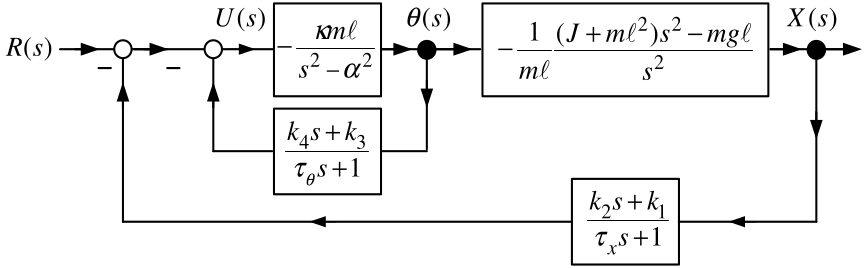

-   $\theta$ and $x$ are each fed back through a PD controller with low pass filtering.

-   The time constants $\tau _{\theta }$ and $\tau _{x}$ are small.

-   Then $$\begin{aligned}
    U(s) &=-\frac{k_{1}X(s)+k_{2}sX(s)}{\tau _{x}s+1}-\frac{k_{3}\theta
    (s)+k_{4}s\theta (s)}{\tau _{\theta }s+1}+R(s) \\
    &\approx -k_{1}X(s)-k_{2}sX(s)-k_{3}\theta (s)-k_{4}s\theta (s)+R(s)
    \end{aligned}$$

-   In the time domain (state feedback) $$u(t)\approx -k_{1}x(t)-k_{2}\dot{x}(t)-k_{3}\theta (t)-k_{4}\dot{\theta}
    (t)+r(t).$$
:::

---

::: {.compact-slide .dense-slide .multi-figure-slide}

Nested Loop (State Feedback) Controller for the Inverted Pendulum

Nested Loop Control Structure

Set $\tau _{\theta }=0,\tau _{x}=0$ as they are small. The Inner loop reduces to $$\frac{-\dfrac{\kappa m\ell }{s^{2}-\alpha ^{2}}}{1-\dfrac{\kappa m\ell }{
s^{2}-\alpha ^{2}}(k_{4}s+k_{3})}=-\frac{\kappa m\ell }{s^{2}-\kappa m\ell
k_{4}s-(\alpha ^{2}+\kappa m\ell k_{3})}.$$

Equivalent block diagram

:::

---

::: {.compact-slide .dense-slide .boundary-safe-slide}

Nested Loop (State Feedback) Controller for the Inverted Pendulum

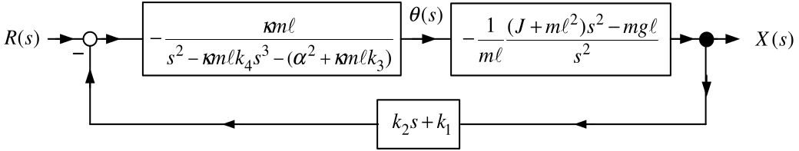

Closed-loop transfer function $X(s)/R(s)$

$$\begin{aligned}
\frac{X(s)}{R(s)} &=\frac{\dfrac{\kappa m\ell }{
s^{2}-m\kappa \ell k_{4}s-(\alpha ^{2}+m\kappa \ell k_{3})}\dfrac{1}{m\ell }
\dfrac{(J+m\ell ^{2})s^{2}-mg\ell }{s^{2}}}{1+\dfrac{\kappa m\ell }{
s^{2}-m\kappa \ell k_{4}s-(\alpha ^{2}+m\kappa \ell k_{3})}\dfrac{1}{m\ell }
\dfrac{(J+m\ell ^{2})s^{2}-mg\ell }{s^{2}}(k_{2}s+k_{1})} \\
 &=\frac{\kappa (J+m\ell ^{2})s^{2}-\kappa mg\ell }{
s^{4}-\kappa m\ell k_{4}s^{3}-(\alpha ^{2}+\kappa m\ell k_{3})s^{2}+\kappa
((J+m\ell ^{2})s^{2}-mg\ell )(k_{2}s+k_{1})} \\
 &=\frac{\kappa (J+m\ell ^{2})s^{2}-\kappa mg\ell }{
s^{4}+(\kappa k_{2}(m\ell ^{2}+J)-m\kappa \ell k_{4})s^{3}+(\kappa
k_{1}(m\ell ^{2}+J)-\alpha ^{2}-m\kappa \ell k_{3})s^{2}-\kappa gm\ell
k_{2}s-\kappa gm\ell k_{1}}.
\end{aligned}$$
:::

---

::: {.compact-slide .dense-slide .boundary-safe-slide .equation-flow-slide .spread-equations-slide}

Nested Loop (State Feedback) Controller for the Inverted Pendulum

$$\frac{X(s)}{R(s)}=\frac{\kappa (J+m\ell ^{2})s^{2}-\kappa
mg\ell }{s^{4}+(\kappa k_{2}(m\ell ^{2}+J)-m\kappa \ell k_{4})s^{3}+(\kappa
k_{1}(m\ell ^{2}+J)-\alpha ^{2}-m\kappa \ell k_{3})s^{2}-\kappa gm\ell
k_{2}s-\kappa gm\ell k_{1}}.$$

To obtain the closed-loop characteristic polynomial $s^{4}+f_{3}s^{3}+f_{2}s^{2}+f_{1}s+f_{0}$ set $$\begin{aligned}
f_{3} &=\kappa k_{2}(m\ell ^{2}+J)-\kappa m\ell k_{4} \\
f_{2} &=\kappa k_{1}(m\ell ^{2}+J)-\alpha ^{2}-\kappa m\ell k_{3} \\
f_{1} &=-g\kappa m\ell k_{2} \\
f_{0} &=-g\kappa m\ell k_{1}
\end{aligned}$$ or $$\left[
\begin{array}{c}
f_{3} \\
f_{2} \\
f_{1} \\
f_{0}
\end{array}
\right] =\left[
\begin{array}{cccc}
0 & \kappa (m\ell ^{2}+J) & 0 & -\kappa m\ell \\
\kappa (m\ell ^{2}+J) & 0 & -\kappa m\ell & 0 \\
0 & -\kappa mg\ell & 0 & 0 \\
-\kappa mg\ell & 0 & 0 & 0
\end{array}
\right] \left[
\begin{array}{c}
k_{1} \\
k_{2} \\
k_{3} \\
k_{4}
\end{array}
\right] +\left[
\begin{array}{c}
0 \\
-\alpha ^{2} \\
0 \\
0
\end{array}
\right] .$$
:::

---

::: {.compact-slide .dense-slide .boundary-safe-slide .equation-flow-slide .spread-equations-slide}

Nested Loop (State Feedback) Controller for the Inverted Pendulum

Solve to get $$\left[
\begin{array}{c}
k_{1} \\
k_{2} \\
k_{3} \\
k_{4}
\end{array}
\right] =\left[
\begin{array}{cccc}
0 & \kappa (m\ell ^{2}+J) & 0 & -\kappa m\ell \\
\kappa (m\ell ^{2}+J) & 0 & -\kappa m\ell & 0 \\
0 & -\kappa mg\ell & 0 & 0 \\
-\kappa mg\ell & 0 & 0 & 0
\end{array}
\right] ^{-1}\left[
\begin{array}{c}
f_{3} \\
f_{2}+\alpha ^{2} \\
f_{1} \\
f_{0}
\end{array}
\right] .$$ Desired closed-loop poles are $-r_{1},-r_{2},-r_{3},-r_{4}$, with $r_i>0$. Set
$$\begin{aligned}
s^{4}+f_{3}s^{3}+f_{2}s^{2}+f_{1}s+f_{0}
&=(s+r_{1})(s+r_{2})(s+r_{3})(s+r_{4}).
\end{aligned}$$

Matching coefficients gives
$$\begin{aligned}
f_{3}&=r_{1}+r_{2}+r_{3}+r_{4},\\
f_{2}&=r_{1}r_{2}+r_{1}r_{3}+r_{1}r_{4}
      +r_{2}r_{3}+r_{2}r_{4}+r_{3}r_{4},\\
f_{1}&=r_{1}r_{2}r_{3}+r_{1}r_{2}r_{4}
      +r_{1}r_{3}r_{4}+r_{2}r_{3}r_{4},\\
f_{0}&=r_{1}r_{2}r_{3}r_{4}.
\end{aligned}$$
:::

---

::: {.compact-slide .multi-figure-slide .dense-multi-slide}

Nested Loop Controller: Tracking Step and Ramp Inputs

The forward path is type 2.

**Not** in unity feedback form.

Add the reference input filter $G_{f}(s)=\dfrac{k_{2}s+k_{1}}{\tau _{x}s+1}.$

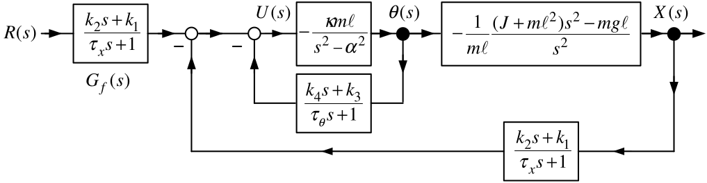

Equivalently it has the unity feedback form.

:::

---

::: {.compact-slide .dense-slide .boundary-safe-slide}

Nested Loop Controller: Tracking Step and Ramp Inputs

Unity feedback form

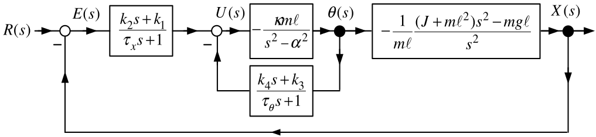

The error $E(s)$ is given by $$\begin{aligned}
E(s) &=\frac{1}{1+(k_{2}s+k_{1})\dfrac{
\kappa m\ell }{s^{2}-m\kappa \ell k_{4}s-(\alpha ^{2}+m\kappa \ell k_{3})}
\dfrac{1}{m\ell }\dfrac{(J+m\ell ^{2})s^{2}-mg\ell }{s^{2}}}R(s) \\
 &=\frac{(s^{2}-m\kappa \ell k_{4}s-\alpha
^{2}-m\kappa \ell k_{3})s^{2}}{s^{4}+(\kappa k_{2}(m\ell ^{2}+J)-m\kappa
\ell k_{4})s^{3}+(\kappa k_{1}(m\ell ^{2}+J)-\alpha ^{2}-m\kappa \ell
k_{3})s^{2}-\kappa gm\ell k_{2}s-\kappa gm\ell k_{1}}R(s) \\
 &=\frac{(s^{2}-m\kappa \ell k_{4}s-\alpha
^{2}-m\kappa \ell k_{3})s^{2}}{(s+r_{1})(s+r_{2})(s+r_{3})(s+r_{4})}R(s).
\end{aligned}$$

-   With $R(s)=1/s$ or $R(s)=1/s^{2}$ we have $sE(s)$ is stable (poles are at $-r_{1},-r_{2},-r_{3},-r_{4}).$

-   By the final value theorem it follows that $\lim\limits_{t\rightarrow \infty }e(t)=\lim\limits_{s\rightarrow 0}sE(s)=0.$
:::

---

::: {.compact-slide .dense-slide .quality-slide}

Linearization of Nonlinear Models

-   Often we don't know how to design controllers based on a nonlinear model.

-   However, for *linear* models a complete theory of controller design is known.

-   We have already found a linear approximate model for the inverted pendulum.

    That linear model is valid for $$(x(t),v(t),\theta (t),\omega (t))\ \ \text{close to}\ (0,0,0,0).$$

    $\qquad (0,0,0,0)$ is an *equilibrium point* of the inverted pendulum.

-   Finding a linear approximate model is referred to as *linearizing* the system.

-   In general, the linear approximate model is valid around an equilibrium point.
:::

---

::: {.compact-slide .equation-flow-slide .spread-equations-slide}

Example

*Equilibrium Point of a Nonlinear System* $$\frac{dx}{dt}=\sin (x)$$

An *equilibrium point* or *operating point* is a value of $x$ for which $\sin (x)=0$.

Equilibrium points are *solutions* to the DiffyQ.

That is, $x(t)=x_{eq}$ (constant) is a solution to the DiffyQ.

The possible equilibrium points $x_{eq}$ are $$x_{eq}=0,\pm \pi ,\pm 2\pi ,...$$
:::

---

::: {.compact-slide .dense-slide .equation-flow-slide .spread-equations-slide}

Equilibrium (Operating) Points

**Definition** *Equilibrium Point*

Consider the differential equation $$\frac{dx}{dt}=f(x).$$

An *equilibrium (operating) point* is any value $x_{eq}$ such that $f(x_{eq})=0$.

**Remark**  If $x_{eq}$ is an eq pt, then $x(t)=x_{eq}$ is a solution to the DiffyQ with I.C. $x(0)=x_{eq}$.

**Example**  *Equilibrium Point* $$\frac{dx}{dt}=-x^{3}+1.$$

$x_{eq}=1$ is the only equilibrium point.

**Example**  *Equilibrium Point* $$\frac{dx}{dt}=-e^{-x}+1.$$

$x_{eq}=0$ is the only equilibrium point.
:::

---

::: {.compact-slide .dense-slide .equation-flow-slide .spread-equations-slide}

Equilibrium (Operating) Points

**Example**  *Equilibrium Point for a System with an Input* $$\frac{dx}{dt}=f(x,u)=-x^{3}+u$$ Suppose it is desired to have the system operate at $x_{eq}=2.$

Choose $u$ so that $$f(2,u)=-(2)^{3}+u=0$$ or $$u_{eq}=8.$$

$x_{eq}=2$ is an eq pt with the constant input $u_{eq}=8$.

Equivalently, $x(t)=x_{eq}=2$ is a solution to $$\begin{aligned}
\frac{dx}{dt} &=-x^{3}+u \\
u(t) &=8 \\
x(0) &=2.
\end{aligned}$$
:::

---

::: {.compact-slide .dense-slide .boundary-safe-slide .equation-flow-slide .spread-equations-slide}

Linear Approximate Models About Equilibrium Points

**Example** $\ \dfrac{dx}{dt}=-x^{3}+1$

Equilibrium point is $x_{eq}=1$.

Do a Taylor series expansion of $f(x)=-x^{3}+1$ about $x_{eq}=1$: $$\begin{aligned}
f(x) &=f(x_{eq})+f^{\prime }(x_{eq})(x-x_{eq})+\underset{\text{Higher-Order
Terms}}{\underbrace{f^{\prime \prime }(x_{eq})\frac{(x-x_{eq})^{2}}{2!}
+\cdots }} \\
&=\underset{0}{\underbrace{-x_{eq}^{3}+1}}
+(-3x_{eq}^{2})(x-x_{eq})+(-6x_{eq})\frac{(x-x_{eq})^{2}}{2!}+\cdots
\end{aligned}$$

-   The first term $f(x_{eq})$ is zero because $x_{eq}$ is an equilibrium point.

-   We want an approximate model for $x$ close to $x_{eq}$.

-   If $x-x_{eq}$ is small, then $(x-x_{eq})^{2},(x-x_{eq})^{3},$ etc. are very small.

-   Set higher-order terms to zero to obtain $$f(x)\approx f^{\prime }(x_{eq})(x-x_{eq})=(-3x_{eq}^{2})(x-x_{eq}).$$ Then $$\frac{d}{dt}(x-x_{eq})=f(x)-f(x_{eq})\approx f^{\prime
    }(x_{eq})(x-x_{eq})=(-3x_{eq}^{2})(x-x_{eq})$$
:::

---

::: {.compact-slide .equation-flow-slide .spread-equations-slide}

Linear Approximate Models About Equilibrium Points

**Example** $\ \dfrac{dx}{dt}=-x^{3}+1$  **(continued)**

From previous slide: $$\frac{d}{dt}(x-x_{eq})=f(x)-f(x_{eq})\approx f^{\prime
}(x_{eq})(x-x_{eq})=(-3x_{eq}^{2})(x-x_{eq})$$

Set $$z\triangleq x-x_{eq}$$ so that the linear model is now $$\frac{dz}{dt}=-3z.$$
:::

---

::: {.compact-slide .dense-slide .boundary-safe-slide .equation-flow-slide .spread-equations-slide}

Example

*Linearization of a Nonlinear System* $$\frac{dx}{dt}=f(x,u)=-x^{3}+2u^{2}$$

-   Desire system to operate at $x_{eq}=2$ so $u_{eq}=2.$ $$\begin{aligned}
    f(x,u) &=\underset{0}{\underbrace{f(x_{eq},u_{eq})}}+\frac{\partial
    f(x_{eq},u_{eq})}{\partial x}(x-x_{eq})+\frac{\partial f(x_{eq},u_{eq})}{
    \partial u}(u-u_{eq}) \\
    &&+\underset{\text{Higher-Order Terms}}{\underbrace{\frac{1}{2!}\frac{
    \partial ^{2}f(x_{eq},u_{eq})}{\partial x^{2}}(x-x_{eq})^{2}+\frac{\partial
    ^{2}f(x_{eq},u_{eq})}{\partial x\partial u}(x-x_{eq})(u-u_{eq})+\cdots }}
    \end{aligned}$$

-   Neglect higher-order terms: $$\begin{aligned}
    \frac{d}{dt}(x-x_{eq})=f(x,u)-f(x_{eq},u_{eq}) &\approx
    &\frac{\partial f(x_{eq},u_{eq})}{\partial x}(x-x_{eq})+\frac{\partial
    f(x_{eq},u_{eq})}{\partial u}(u-u_{eq}) \\
    &=(-3x_{eq}^{2})(x-x_{eq})+(4u_{eq})(u-u_{eq}) \\
    &=-12(x-x_{eq})+8(u-u_{eq}).
    \end{aligned}$$

-   With $z\triangleq x-x_{eq},\ w=u-u_{eq}$: $$\frac{dz}{dt}=-12z+8w.$$
:::

---

::: {.compact-slide .dense-slide .boundary-safe-slide .equation-flow-slide .spread-equations-slide}

Linear Approximate Models About Equilibrium Points

**Example**  *Linearization of a Nonlinear System*

$$\frac{dx}{dt}=-x^{2}u^{2}+1$$

-   Desired eq pt is $x_{eq}=2$ which requires $u_{eq}=1/2.$

-   Do a Taylor series expansion of $f(x,u)=-x^{2}u^{2}+1$ about $(x_{eq},u_{eq})$: $$f(x,u)=\underset{0}{\underbrace{f(x_{eq},u_{eq})}}+\frac{\partial
    f(x_{eq},u_{eq})}{\partial x}(x-x_{eq})+\frac{\partial f(x_{eq},u_{eq})}{
    \partial u}(u-u_{eq})+\cdots$$

-   Neglecting higher-order terms: $$\begin{aligned}
    \frac{d}{dt}(x-x_{eq})=f(x,u)-f(x_{eq},u_{eq}) &=\frac{
    \partial f(x_{eq},u_{eq})}{\partial x}(x-x_{eq})+\frac{\partial
    f(x_{eq},u_{eq})}{\partial u}(u-u_{eq}) \\
    &=(-2x_{eq}u_{eq}^{2})(x-x_{eq})+(-2x_{eq}^{2}u_{eq})(u-u_{eq}) \\
    &=-(x-x_{eq})-4(u-u_{eq}).
    \end{aligned}$$

-   Set $z\triangleq x-x_{eq},$  $w=u-u_{eq}$ to have $$\frac{dz}{dt}=-z-4w.$$
:::

---

::: {.compact-slide .multi-figure-slide}

Magnetic Levitation

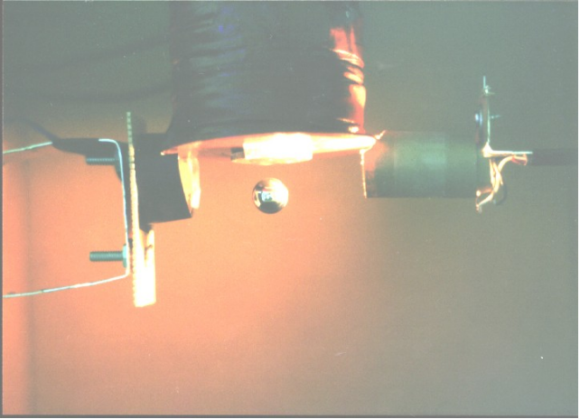

:::

---

::: {.compact-slide .dense-slide}

Mathematical Model of the Levitated Steel Ball

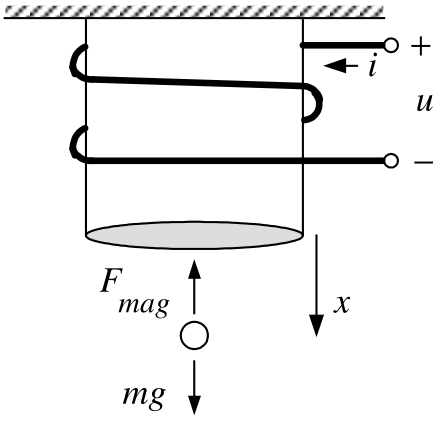

-   Magnetically levitate a steel ball under an electromagnet.

-   The electromagnet consists of a wire (coil) wrapped around a core of soft iron.

-   A voltage $u$ applied to the coil produces current in the coil.

-   The magnetic field of the coil's current magnetizes the soft iron.

-   The magnetized iron produces a strong magnetic field to keep a steel ball up.

-   Total flux (flux linkage) in the coil windings due to the current: $\ \lambda (x,i)\triangleq L(x)i$

-   $L(x)=L_{0}+\dfrac{rL_{1}}{x}$ where $x$ is the CoM of the steel ball.

    -   This expression is justified later.
:::

---

::: {.compact-slide .dense-slide}

Mathematical Model of the Levitated Steel Ball

-   Flux linkage is$\ \lambda (x,i)\triangleq L(x)i$  where $L(x)=L_{0}+ \dfrac{rL_{1}}{x}.$

-   It turns out that $L_{1}\ll L_{0}$.

-   By Faraday's law and Ohm's law: $$u-\frac{d}{dt}\underset{\lambda }{\underbrace{\left( L(x)i\right) }}-Ri=0.$$

-   Magnetic force: $$F_{mag}=-C\frac{i^{2}}{x^{2}},C\text{is a constant.}$$
:::

---

::: {.compact-slide .expanded-body-slide .expanded-figure-slide}

Mathematical Model of the Levitated Steel Ball

DiffyQ Model: $$\begin{aligned}
\frac{d}{dt}\left( L(x)i\right) +Ri &=u \\
\frac{dx}{dt} &=v \\
m\frac{dv}{dt} &=mg-C\frac{i^{2}}{x^{2}}.
\end{aligned}$$
:::

---

::: {.compact-slide .dense-slide .boundary-safe-slide .equation-flow-slide .spread-equations-slide}

Conservation of Energy

$$\begin{aligned}
\frac{d}{dt}\left( L(x)i\right) +Ri &=u \\
\frac{dx}{dt} &=v \\
m\frac{dv}{dt} &=mg-C\frac{i^{2}}{x^{2}}.
\end{aligned}$$

Electrical power into the electromagnet: $$iu=i\frac{d}{dt}\left( L(x)i\right) +Ri^{2}=L(x)i\frac{di}{dt}+i^{2}\frac{
\partial L(x)}{\partial x}v+Ri^{2}.$$ $\dfrac{1}{2}L(x)i^{2}$ is the energy stored in the magnetic field of the coil & steel ball.

$\dfrac{d}{dt}\left( \dfrac{1}{2}L(x)i^{2}\right) =L(x)i\dfrac{di}{dt}+ \dfrac{1}{2}i^{2}\dfrac{\partial L(x)}{\partial x}v.$

Then $$\begin{aligned}
iu &=\frac{d}{dt}\left( \frac{1}{2}L(x)i^{2}\right) -\frac{1}{2}i^{2}\frac{
\partial L(x)}{\partial x}v+i^{2}\frac{\partial L(x)}{\partial x}v+Ri^{2} \\
&=\frac{d}{dt}\left( \frac{1}{2}L(x)i^{2}\right) +Ri^{2}+\frac{1}{2}i^{2}
\frac{\partial L(x)}{\partial x}v.
\end{aligned}$$
:::

---

::: {.compact-slide .dense-slide .boundary-safe-slide .equation-flow-slide .spread-equations-slide}

Conservation of Energy

The electrical-power balance is
$$iu=\frac{d}{dt}\left(\frac{1}{2}L(x)i^{2}\right)
+Ri^{2}+\frac{1}{2}i^{2}\frac{\partial L(x)}{\partial x}v.$$

The supplied power $iu$ goes into:

1. changing the magnetic-field energy $\dfrac{1}{2}L(x)i^{2}$,
2. dissipation as heat $Ri^{2}$, and
3. mechanical power $\dfrac{1}{2}i^{2}\dfrac{\partial L(x)}{\partial x}v$.

By conservation of energy, the third term is the mechanical power supplied to the steel ball.

Using the mechanical equation gives
$$\begin{aligned}
m\frac{dv}{dt}&=mg-C\frac{i^{2}}{x^{2}},\\
mv\frac{dv}{dt}-mgv&=-C\frac{i^{2}}{x^{2}}v,\\
\frac{d}{dt}\left(\frac{1}{2}mv^{2}-mgx\right)
&=-C\frac{i^{2}}{x^{2}}v.
\end{aligned}$$
:::

---

::: {.compact-slide .dense-slide .equation-flow-slide .spread-equations-slide}

Conservation of Energy

$V(x)=-mgx$ is the ball's potential energy.

The rate of change of its total energy is
$$\frac{d}{dt}\left(\frac{1}{2}mv^{2}+V(x)\right)
=\frac{d}{dt}\left(\frac{1}{2}mv^{2}-mgx\right)
=-C\frac{i^{2}}{x^{2}}v.$$

By conservation of energy, this equals the electrical power
$\dfrac{1}{2}i^{2}\dfrac{\partial L(x)}{\partial x}v$:
$$\begin{aligned}
    \frac{1}{2}i^{2}\frac{\partial L(x)}{\partial x}v
    &=-C\frac{i^{2}}{x^{2}}v,\\
    \frac{1}{2}i^{2}\frac{\partial}{\partial x}
    \left(L_{0}+\frac{rL_{1}}{x}\right)v
    &=-C\frac{i^{2}}{x^{2}}v,\\
    -\frac{1}{2}i^{2}\frac{rL_{1}}{x^{2}}v
    &=-C\frac{i^{2}}{x^{2}}v,\\
C &=rL_{1}/2.
\end{aligned}$$
:::

---

::: {.compact-slide .dense-slide .boundary-safe-slide .equation-flow-slide .spread-equations-slide}

Nonlinear Statespace Model

-   Flux linkage is$\ \lambda (x,i)\triangleq L(x)i$  where $L(x)=L_{0}+ \dfrac{rL_{1}}{x},\dfrac{\partial L(x)}{\partial x}=-\dfrac{rL_{1}}{x^{2}}.$

-   Magnetic Force:  $F_{mag}=-C\dfrac{i^{2}}{x^{2}}.$

-   Conservation of Energy:  $C=\dfrac{rL_{1}}{2}.$

The model is now $$\begin{aligned}
\frac{d\left( L(x)i\right) }{dt}+Ri=L(x)\frac{di}{dt}+i\frac{\partial L(x)}{
\partial x}v+Ri &=u \\
\frac{dx}{dt} &=v \\
m\frac{dv}{dt} &=mg-\frac{rL_{1}}{2}\frac{i^{2}}{x^{2}}.
\end{aligned}$$ Rearrange: $$\begin{aligned}
\frac{di}{dt} &=-i\frac{1}{L(x)}\left( -\frac{rL_{1}}{x^{2}}\right) v-\frac{
R}{L(x)}i+\frac{1}{L(x)}u \\
\frac{dx}{dt} &=v \\
\frac{dv}{dt} &=g-\frac{rL_{1}}{2m}\frac{i^{2}}{x^{2}}
\end{aligned}$$
:::

---

::: {.compact-slide .dense-slide .equation-flow-slide .spread-equations-slide}

Nonlinear Statespace Model

$$\begin{aligned}
\frac{di}{dt} &=-i\frac{1}{L(x)}\left( -\frac{rL_{1}}{x^{2}}\right) v-\frac{
R}{L(x)}i+\frac{1}{L(x)}u \\
\frac{dx}{dt} &=v \\
\frac{dv}{dt} &=g-\frac{rL_{1}}{2m}\frac{i^{2}}{x^{2}}
\end{aligned}$$ The *state variables* are $i,x,v$ and the *state* is $$\left[
\begin{array}{c}
i \\
x \\
v
\end{array}
\right] .$$ Recall $L_{1}\ll L_{0}$ and $x\geq r$, so $L(x)=L_{0}+\dfrac{rL_{1}}{x}\leq L_{0}+L_{1}\approx L_{0}.$

Replace $L(x)$ with $L_{0}$: $$\begin{aligned}
\frac{di}{dt} &=\frac{rL_{1}}{L_{0}}\frac{i}{x^{2}}v-\frac{R}{L_{0}}i+\frac{
1}{L_{0}}u \\
\frac{dx}{dt} &=v \\
\frac{dv}{dt} &=g-\frac{rL_{1}}{2m}\frac{i^{2}}{x^{2}}.
\end{aligned}$$
:::

---

::: {.compact-slide .dense-slide}

Current Command Statespace Model

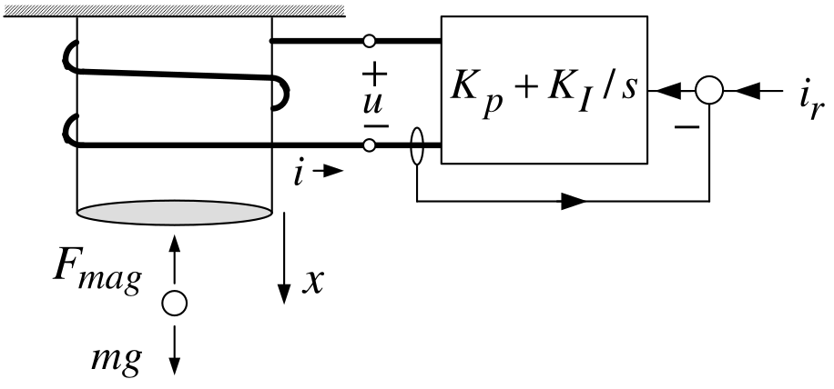

-   We send a current command $i_{r}$ to the amplifier.

-   With high-gains $K_{P},K_{I}$ the amplifier quickly forces $i(t)\rightarrow i_{r}(t).$

-   So we can consider the current $i(t)$ as the input. $$\begin{aligned}
    \frac{dx}{dt} &=v \\
    \frac{dv}{dt} &=g-\frac{rL_{1}}{2m}\frac{i^{2}}{x^{2}}.
    \end{aligned}$$

-   This is still a nonlinear statespace model.
:::

---

::: {.compact-slide .dense-slide .equation-flow-slide .spread-equations-slide}

Linearization about an Equilibrium Point

$$\begin{aligned}
\frac{dx}{dt} &=v \\
\frac{dv}{dt} &=g-\frac{rL_{1}}{2m}\frac{i^{2}}{x^{2}}.
\end{aligned}$$

-   Let $x=x_{eq},v=v_{eq}=0$ be the desired equilibrium point. $$\begin{aligned}
    \frac{dx_{eq}}{dt} &=v_{eq} \\
    \frac{dv_{eq}}{dt} &=g-\frac{rL_{1}}{2m}\frac{i_{eq}^{2}}{x_{eq}^{2}}.
    \end{aligned}$$

-   The $1^{st}$ eqn holds because $x_{eq}$ is a constant and $v_{eq}=0$.

-   The 2$^{nd}$ eqn requires $g=\dfrac{rL_{1}}{2m}\dfrac{i_{eq}^{2}}{ x_{eq}^{2}}$ or $$i_{eq}=x_{eq}\sqrt{\dfrac{2mg}{rL_{1}}}.$$
:::

---

::: {.compact-slide .dense-slide .boundary-safe-slide .equation-flow-slide .spread-equations-slide}

Linearization about an Equilibrium Point

$$\begin{aligned}
\frac{dx}{dt} &=v \\
\frac{dv}{dt} &=f(x,i)=g-\frac{rL_{1}}{2m}\frac{i^{2}}{x^{2}}.
\end{aligned}$$ Taylor series expansion (drop higher-order terms): $$\begin{aligned}
f(x,i) &\approx &f(x_{eq},i_{eq})+\left. \frac{\partial f(x,i)}{\partial x}
\right\vert _{(x_{eq},i_{eq})}(x-x_{eq})+\left. \frac{\partial f(x,i)}{
\partial i}\right\vert _{(x_{eq},i_{eq})}(i-i_{eq}) \\
&=\underset{0}{\underbrace{g-\frac{rL_{1}}{2m}\frac{i_{eq}^{2}}{x_{eq}^{2}}}
}+\frac{rL_{1}}{m}\frac{i_{eq}^{2}}{x_{eq}^{3}}(x-x_{eq})-\frac{rL_{1}}{m}
\frac{i_{eq}}{x_{eq}^{2}}(i-i_{eq}) \\
&=\frac{rL_{1}}{m}\frac{i_{eq}^{2}}{x_{eq}^{3}}(x-x_{eq})-\frac{rL_{1}}{m}
\frac{i_{eq}}{x_{eq}^{2}}(i-i_{eq}) \\
&=\dfrac{2g}{x_{eq}}(x-x_{eq})-\dfrac{2g}{i_{eq}}(i-i_{eq})
\end{aligned}$$

-   We used $\dfrac{2g}{x_{eq}}=\dfrac{rL_{1}}{m}\dfrac{i_{eq}^{2}}{ x_{eq}^{3}}$  and $\ \dfrac{2g}{i_{eq}}=\dfrac{rL_{1}}{m}\dfrac{i_{eq}}{ x_{eq}^{2}}.$
:::

---

::: {.compact-slide .dense-slide .boundary-safe-slide .equation-flow-slide .spread-equations-slide}

Linear Statespace Model

$$\begin{aligned}
\dfrac{dx}{dt} &=v \\
\dfrac{dv}{dt} &=\frac{2g}{x_{eq}}(x-x_{eq})-\frac{2g}{i_{eq}}(i-i_{eq}).
\end{aligned}$$ $\dfrac{dv_{eq}}{dt}=0,\dfrac{dx_{eq}}{dt}=0\Longrightarrow$ $$\begin{aligned}
\frac{d}{dt}(x-x_{eq}) &=v-v_{eq} \\
\frac{d}{dt}(v-v_{eq}) &=\frac{2g}{x_{eq}}(x-x_{eq})-\frac{2g}{i_{eq}}
(i-i_{eq}).
\end{aligned}$$

Set $\Delta x\triangleq x-x_{eq},\Delta v\triangleq v-v_{eq},\Delta i\triangleq i-i_{eq}$: $$\begin{aligned}
\frac{d}{dt}\Delta x &=\Delta v \\
\frac{d}{dt}\Delta v &=\frac{2g}{x_{eq}}\Delta x-\frac{2g}{i_{eq}}\Delta i
\end{aligned}$$ or $$\frac{d}{dt}\left[
\begin{array}{c}
\Delta x \\
\Delta v
\end{array}
\right] =\underset{A}{\underbrace{\left[
\begin{array}{cc}
0 & 1 \\
\dfrac{2g}{x_{eq}} & 0
\end{array}
\right] }}\left[
\begin{array}{c}
\Delta x \\
\Delta v
\end{array}
\right] +\underset{b}{\underbrace{\left[
\begin{array}{c}
0 \\
-\dfrac{2g}{i_{eq}}
\end{array}
\right] }}\Delta i.$$
:::

---

::: {.compact-slide .dense-slide .equation-flow-slide .spread-equations-slide}

Linear Statespace Model

$$\frac{d}{dt}\left[
\begin{array}{c}
\Delta x \\
\Delta v
\end{array}
\right] =\underset{A}{\underbrace{\left[
\begin{array}{cc}
0 & 1 \\
\dfrac{2g}{x_{eq}} & 0
\end{array}
\right] }}\left[
\begin{array}{c}
\Delta x \\
\Delta v
\end{array}
\right] +\underset{b}{\underbrace{\left[
\begin{array}{c}
0 \\
-\dfrac{2g}{i_{eq}}
\end{array}
\right] }}\Delta i.$$ More compactly:

$$\frac{d}{dt}\left[
\begin{array}{c}
\Delta x \\
\Delta v
\end{array}
\right] =A\left[
\begin{array}{c}
\Delta x \\
\Delta v
\end{array}
\right] +b\Delta i$$

-   This is a *linear* statespace model.

-   $\Delta x=x-x_{eq}$ and $\Delta v=v-v_{eq}$ are the *state variables*.

-   $\Delta i=i-i_{eq}$ is the input.
:::

---

::: {.compact-slide .dense-slide .boundary-safe-slide .equation-flow-slide .spread-equations-slide}

Transfer Function Model

$$\begin{aligned}
\frac{d}{dt}\left[
\begin{array}{c}
\Delta x \\
\Delta v
\end{array}
\right] &=\underset{A}{\underbrace{\left[
\begin{array}{cc}
0 & 1 \\
\dfrac{2g}{x_{eq}} & 0
\end{array}
\right] }}\left[
\begin{array}{c}
\Delta x \\
\Delta v
\end{array}
\right] +\underset{b}{\underbrace{\left[
\begin{array}{c}
0 \\
-\dfrac{2g}{i_{eq}}
\end{array}
\right] }}\Delta i \\
\Longrightarrow \frac{d\Delta v}{dt} &=\frac{d^{2}}{dt^{2}}\Delta x=\frac{2g
}{x_{eq}}\Delta x-\frac{2g}{i_{eq}}\Delta i.
\end{aligned}$$ Laplace transform: $$s^{2}\Delta X(s)-s\Delta x(0)-\Delta \dot{x}(0)=\frac{2g}{x_{eq}}\Delta X(s)-
\frac{2g}{i_{eq}}\Delta I(s)$$ or $$\Delta X(s)=\underset{\text{transfer function}}{\underbrace{-\frac{\dfrac{2g
}{i_{eq}}}{s^{2}-\dfrac{2g}{x_{eq}}}}}\Delta I(s)+\frac{s\Delta x(0)+\Delta
\dot{x}(0)}{s^{2}-\dfrac{2g}{x_{eq}}}.$$

-   Note the similarity to the transfer function of the inverted pendulum!

-   The TF has poles at $\pm \sqrt{\dfrac{2g}{x_{eq}}}$ and is therefore unstable.
:::

---

::: {.compact-slide .expanded-body-slide .expanded-figure-slide}

Block Diagram of the Transfer Function Model

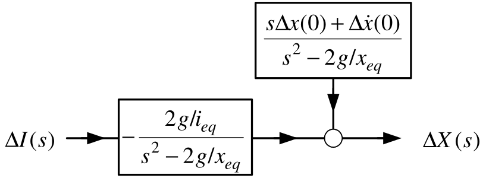

$$\Delta X(s)=\underset{\text{transfer function}}{\underbrace{-\frac{2g/i_{eq}
}{s^{2}-2g/x_{eq}}}}\Delta I(s)+\frac{s\Delta x(0)+\Delta \dot{x}(0)}{
s^{2}-2g/x_{eq}}.$$
:::

---

::: {.compact-slide .dense-slide}

Cart on a Track System

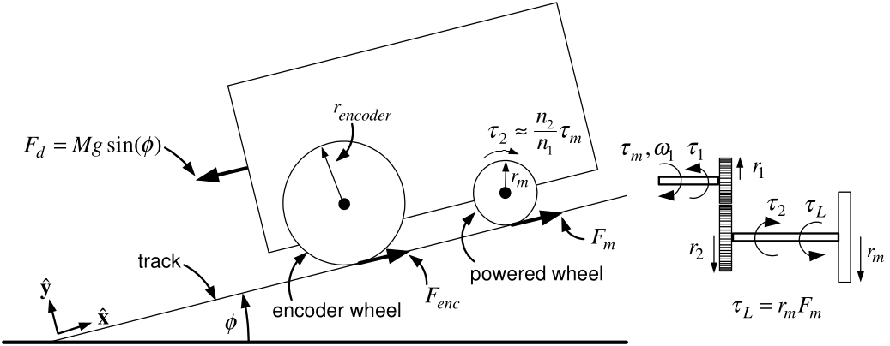

Motor shaft with gear 1 has moment of inertia $J_{1}.$

Wheel shaft with gear 2 has moment of inertia $J_{2}$.

$\quad F_{m}\mathbf{\hat{x}}$ is the force exerted on the powered wheels by the track.

$-F_{m}\mathbf{\hat{x}}$ is the force exerted on the track by the powered wheels.

$\quad$Set $F_{enc}=0$ as it is neglible.

$\quad \tau _{1}$ is the torque exerted on gear 1 by gear 2

$\quad \tau _{2}$ is the (reaction) torque exerted on gear 2 by gear 1.
:::

---

::: {.compact-slide .dense-slide}

Cart on a Track System

**Mechanical Equations**

$$\begin{aligned}
J_{1}\frac{d\omega _{1}}{dt} &=\tau _{m}-\tau _{1} \\
J_{2}\frac{d\omega _{2}}{dt} &=\tau _{2}-r_{m}F_{m}
\end{aligned}$$

Use $\omega _{1}=\dfrac{n_{2}}{n_{1}}\omega _{2}$ and $\tau _{2}=\dfrac{ n_{2}}{n_{1}}\tau _{1}$ to obtain $$\underset{J}{\underbrace{\left( J_{1}\left( \frac{n_{2}}{n_{1}}\right)
^{2}+J_{2}\right) }}\frac{d\omega _{2}}{dt}=\frac{n_{2}}{n_{1}}\tau
_{m}-F_{m}r_{m}$$
:::

---

::: {.compact-slide .dense-slide}

Cart on a Track System

**Mechanical Equations**

$$\begin{aligned}
J\frac{d\omega _{2}}{dt} &=\frac{n_{2}}{n_{1}}\tau _{m}-F_{m}r_{m} \\
M\frac{dv}{dt} &=F_{m}-F_{d}.
\end{aligned}$$ **No slip condition** $\ r_{enc}\omega _{enc}=r_{m}\omega _{2}=v.$

With $\omega _{2}=v/r_{m}$ and eliminating $F_{m}$ we have $$\left( \frac{J}{r_{m}^{2}}+M\right) \frac{dv}{dt}=\frac{1}{r_{m}}\frac{n_{2}
}{n_{1}}\tau _{m}-F_{d}.$$
:::

---

::: {.compact-slide .multi-figure-slide}

Cart on a Track System

**Electrical Equations**

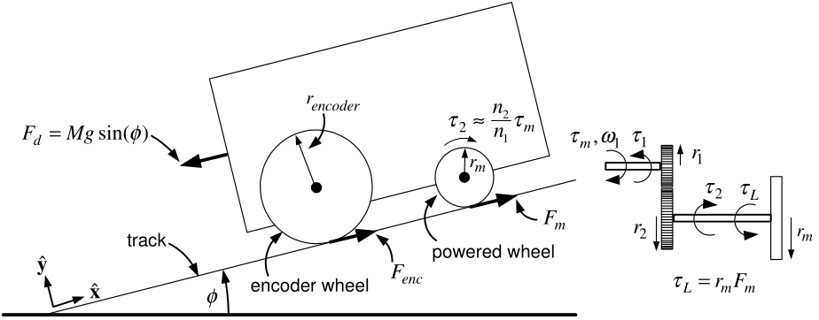

** **

$$\begin{aligned}
L\frac{di}{dt} &=-Ri(t)-K_{b}\omega _{1}(t)+v_{a}(t) \\
\tau _{m} &=K_{T}i(t).
\end{aligned}$$
:::

---

::: {.compact-slide .dense-slide}

Cart on a Track System

**Electrical Equations**

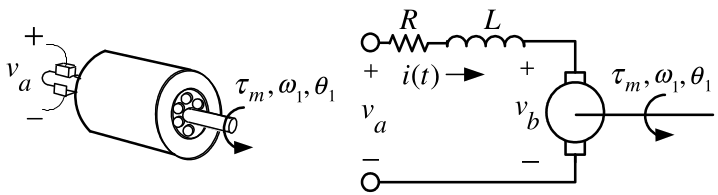

$$\begin{aligned}
L\frac{di}{dt} &=-Ri(t)-K_{b}\omega _{1}(t)+v_{a}(t) \\
\tau _{m} &=K_{T}i(t).
\end{aligned}$$ With $\omega _{1}=\dfrac{n_{2}}{n_{1}}\omega _{2}=\dfrac{n_{2}}{n_{1}}\dfrac{ v}{r_{m}}$ we have $$\begin{aligned}
L\frac{di}{dt} &=-Ri(t)-\underset{v_{b}(t)}{\underbrace{\frac{K_{b}}{r_{m}}
\frac{n_{2}}{n_{1}}v(t)}}+v_{a}(t) \\
\tau _{m} &=K_{T}i(t).
\end{aligned}$$
:::

---

::: {.compact-slide .dense-slide .equation-flow-slide .spread-equations-slide}

Cart on a Track System

**Equations of Motion** $$\begin{aligned}
L\frac{di}{dt} &=-Ri(t)-\frac{K_{b}}{r_{m}}\frac{n_{2}}{n_{1}}v(t)+v_{a}(t)
\left( \frac{J}{r_{m}^{2}}+M\right) \frac{dv}{dt} &=\left( \frac{n_{2}}{
n_{1}}\frac{1}{r_{m}}\right) K_{T}i(t)-F_{d} \\
\frac{dx}{dt} &=v.
\end{aligned}$$ **Laplace Transform** $$\begin{aligned}
I(s) &=\frac{V_{a}(s)-V_{b}(s)}{sL+R} \\
V_{b}(s) &=\underset{K_{b}^{\prime }}{\underbrace{K_{b}\frac{n_{2}}{n_{1}}
\frac{1}{r_{m}}}}v(s) \\
s\underset{M^{\prime }}{\underbrace{\left( \frac{J}{r_{m}^{2}}+M\right) }}
v(s) &=\underset{K_{T}^{\prime }}{\underbrace{\frac{n_{2}}{n_{1}}\frac{1}{
r_{m}}K_{T}}}I(s)-\frac{F_{d}}{s}.
\end{aligned}$$
:::

---

::: {.compact-slide .dense-slide .multi-figure-slide}

Cart on a Track System

-   $K_{T}^{\prime }\triangleq K_{T}\dfrac{n_{2}}{n_{1}}\dfrac{1}{r_{m}},$  $K_{b}^{\prime }\triangleq K_{b}\dfrac{n_{2}}{n_{1}}\dfrac{1}{r_{m}},$  $M^{\prime }\triangleq \dfrac{J}{r_{m}^{2}}+M$

    
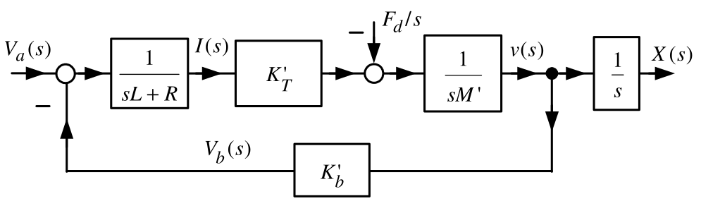

-   Set $L=0$  and $K_{D}\triangleq \dfrac{R}{K_{T}^{\prime }}=\dfrac{R}{ K_{T}\dfrac{n_{2}}{n_{1}}\dfrac{1}{r_{m}}}$

    
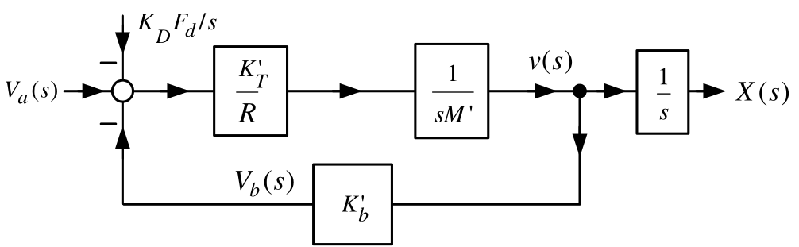

:::

---

::: {.compact-slide .dense-slide .multi-figure-slide}

Cart on a Track System

**Define** $$G(s)\triangleq \frac{\dfrac{K_{T}^{\prime }}{R}\dfrac{1}{sM^{\prime }}}{
1+K_{b}^{\prime }\dfrac{K_{T}^{\prime }}{R}\dfrac{1}{sM^{\prime }}}\frac{1}{s
}=\frac{K_{T}^{\prime }}{sRM^{\prime }+K_{b}^{\prime }K_{T}^{\prime }}\frac{1
}{s}=\frac{\dfrac{K_{T}^{\prime }}{RM^{\prime }}}{s+\dfrac{K_{b}^{\prime
}K_{T}^{\prime }}{RM^{\prime }}}\frac{1}{s}=\frac{b}{s\left( s+a\right) }$$

**Simplified block diagram**

:::

---

::: {.compact-slide .dense-slide}

Cart on a Track System

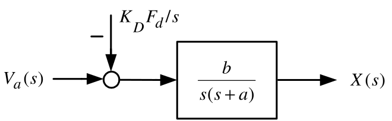

$$X(s)=\frac{b}{s\left( s+a\right) }V_{a}(s)-\frac{b}{s\left( s+a\right) }K_{D}
\frac{F_{d}}{s}.$$

-   $K_{D}F_{d}$ is an input voltage disturbance.

-   Equivalent to the actual disturbance $F_{d}$.

-   $K_{D}F_{d}=\dfrac{R}{K_{T}\dfrac{n_{2}}{n_{1}}\dfrac{1}{r_{m}}}F_{d}= \dfrac{n_{2}}{n_{1}}\dfrac{r_{m}F_{D}}{K_{T}}R$ has units of Volts.

-   $bK_{D}F_{d}=\dfrac{K_{T}^{\prime }}{RM^{\prime }}\dfrac{R}{ K_{T}^{\prime }}Mg\sin (\phi )=\dfrac{Mg\sin (\phi )}{M^{\prime }}=\dfrac{ Mg\sin (\phi )}{J/r_{m}^{2}+M}$. $$\frac{d^{2}x(t)}{dt^{2}}=-ax(t)+bv_{a}(t)-\dfrac{Mg\sin (\phi )}{
    J/r_{m}^{2}+M}u_{s}(t).$$
:::
