::: {.contents-slide}
# Contents

- Statespace Form

- Transfer Function to Statespace

- Laplace Transform of the Statespace Equations

- Fundamental and Exponential Matrices
:::

---

::: {.compact-slide .boundary-safe-slide}

Statespace Form

Consider a mass–spring-damper system.

Equations of motion: $$m\frac{d^{2}y}{dt^{2}}=-ky-b\frac{dy}{dt}+u(t).$$ Let $$\begin{aligned}
x_{1} &=&y \\
x_{2} &=&\dot{y}
\end{aligned}$$ so that $$\begin{aligned}
\frac{dx_{1}}{dt} &=&x_{2} \\
\frac{dx_{2}}{dt} &=&-\frac{k}{m}x_{1}-\frac{b}{m}x_{2}+\frac{1}{m}u.
\end{aligned}$$ This is called the *statespace* form.
:::

---

::: {.compact-slide}

Statespace Form

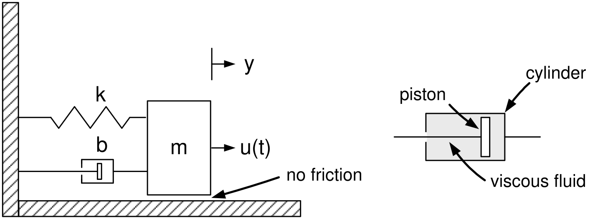

$$\begin{aligned}
\frac{dx_{1}}{dt} &=&x_{2} \\
\frac{dx_{2}}{dt} &=&-\frac{k}{m}x_{1}-\frac{b}{m}x_{2}+\frac{1}{m}u.
\end{aligned}$$

- Statespace form

  Left-side of the equation has only first-order derivatives.

  Right-side has no derivatives.

- As these equations are linear, we can write them in matrix form as $$\frac{d}{dt}\left[
  \begin{array}{c}
  x_{1} \\
  x_{2}
  \end{array}
  \right] =\underset{A}{\underbrace{\left[
  \begin{array}{cc}
  0 & 1 \\
  -k/m & -b/m
  \end{array}
  \right] }}\underset{x}{\underbrace{\left[
  \begin{array}{c}
  x_{1} \\
  x_{2}
  \end{array}
  \right] }}+\underset{b}{\underbrace{\left[
  \begin{array}{c}
  0 \\
  1/m
  \end{array}
  \right] }}u$$
:::

---

::: {.compact-slide}

Statespace Form

The output equation is $y=x_{1}.$ $$\begin{aligned}
\frac{d}{dt}\left[
\begin{array}{c}
x_{1} \\
x_{2}
\end{array}
\right] &=&\underset{A}{\underbrace{\left[
\begin{array}{cc}
0 & 1 \\
-k/m & -b/m
\end{array}
\right] }}\underset{x}{\underbrace{\left[
\begin{array}{c}
x_{1} \\
x_{2}
\end{array}
\right] }}+\underset{b}{\underbrace{\left[
\begin{array}{c}
0 \\
1/m
\end{array}
\right] }}u \\
y &=&\underset{c}{\underbrace{\left[
\begin{array}{cc}
1 & 0
\end{array}
\right] }}\left[
\begin{array}{c}
x_{1} \\
x_{2}
\end{array}
\right]
\end{aligned}$$ More compactly we write $$\begin{aligned}
\frac{dx}{dt} &=&Ax+bu \\
y &=&cx.
\end{aligned}$$ The quantities $x_{1}$ and $x_{2}$ are called the *state variables* and $$x\triangleq \left[
\begin{array}{c}
x_{1} \\
x_{2}
\end{array}
\right]$$ is called the *state* of the system.
:::

---

::: {.compact-slide}

Example

*DC Motor*

Equations of motion: $$\begin{aligned}
V_{a} &=&Ri+L\frac{di}{dt}+V_{b},\text{  }V_{b}=K_{b}\omega \\
J\frac{d\omega }{dt} &=&\tau _{m}-f\omega -\tau _{L},\text{  }\tau
_{m}=K_{T}i \\
\frac{d\theta }{dt} &=&\omega
\end{aligned}$$ or $$\begin{aligned}
L\frac{di}{dt} &=&-Ri-K_{b}\omega +V_{a} \\
J\frac{d\omega }{dt} &=&K_{T}i-f\omega -\tau _{L} \\
\frac{d\theta }{dt} &=&\omega .
\end{aligned}$$
:::

---

::: {.compact-slide}

Example

*DC Motor* **(continued)**

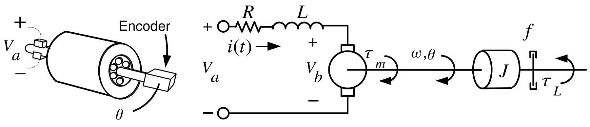

Rewrite $$\begin{aligned}
L\frac{di}{dt} &=&-Ri-K_{b}\omega +V_{a} \\
J\frac{d\omega }{dt} &=&K_{T}i-f\omega -\tau _{L} \\
\frac{d\theta }{dt} &=&\omega
\end{aligned}$$ in *statespace form* as $$\begin{aligned}
\frac{di}{dt} &=&-\frac{R}{L}i-\frac{K_{b}}{L}\omega +\frac{1}{L}V_{a} \\
\frac{d\omega }{dt} &=&\frac{K_{T}}{J}i-\frac{f}{J}\omega -\frac{1}{J}\tau
_{L} \\
\frac{d\theta }{dt} &=&\omega .
\end{aligned}$$
:::

---

::: {.compact-slide .boundary-safe-slide}

Example

*DC Motor* **(continued)**

Matrix notation: $$\frac{d}{dt}\left[
\begin{array}{c}
i \\
\omega \\
\theta
\end{array}
\right] =\underset{A}{\underbrace{\left[
\begin{array}{ccc}
-R/L & -K_{b}/L & 0 \\
K_{T}/J & -f/J & 0 \\
0 & 1 & 0
\end{array}
\right] }}\underset{x}{\underbrace{\left[
\begin{array}{c}
i \\
\omega \\
\theta
\end{array}
\right] }}+\underset{b}{\underbrace{\left[
\begin{array}{c}
1/L \\
0 \\
0
\end{array}
\right] }}V_{a}+\underset{p}{\underbrace{\left[
\begin{array}{c}
0 \\
-1/J \\
0
\end{array}
\right] }}\tau _{L}.$$

- Control input is $u\triangleq V_{a}.$

- Disturbance input is $\tau _{L}.$

- State variables are $i,\omega ,\theta .$

- System state is $x\triangleq \left[
  \begin{array}{c}
  i \\
  \omega \\
  \theta
  \end{array}
  \right] \!.$

- In compact notation: $$\frac{d}{dt}x=Ax+bu+p\tau _{L}.$$
:::

---

::: {.compact-slide}

Transfer Function to Statespace

$$G(s)=\frac{Y(s)}{U(s)}=\frac{1}{s^{2}+3s+2}.$$ Clearing fractions $$(s^{2}+3s+2)Y(s)=U(s)$$ so that in the time domain $$\frac{d^{2}y}{dt^{2}}+3\frac{dy}{dt}+2y=u(t).$$

- This is referred to as an *input-output* representation.

Let $$\begin{aligned}
x_{1} &=&y \\
x_{2} &=&\dot{y}
\end{aligned}$$ to obtain the statespace form $$\begin{aligned}
dx_{1}/dt &=&x_{2} \\
dx_{2}/dt &=&-2x_{1}-3x_{2}+u \\
y &=&x_{1}.
\end{aligned}$$
:::

---

::: {.compact-slide .boundary-safe-slide}

Transfer Function to Statespace

The statespace model $$\begin{aligned}
dx_{1}/dt &=&x_{2} \\
dx_{2}/dt &=&-2x_{1}-3x_{2}+u \\
y &=&x_{1}.
\end{aligned}$$ is equivalent to the block diagram

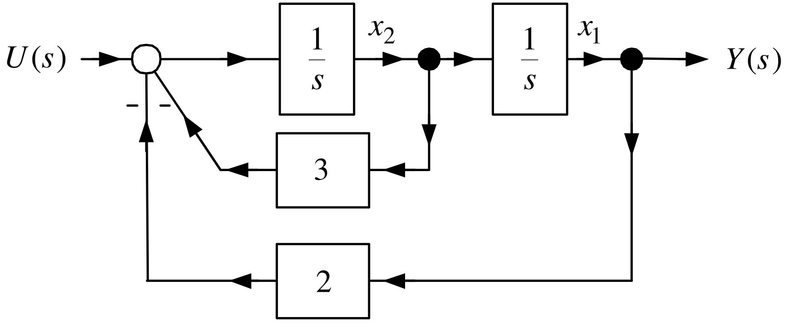

- The state variables $x_{1},x_{2}$ are the outputs of the integrators.

- In matrix notation: $$\begin{aligned}
  \frac{d}{dt}\left[
  \begin{array}{c}
  x_{1} \\
  x_{2}
  \end{array}
  \right] &=&\underset{A}{\underbrace{\left[
  \begin{array}{rr}
  0 & 1 \\
  -2 & -3
  \end{array}
  \right] }}\underset{x}{\underbrace{\left[
  \begin{array}{c}
  x_{1} \\
  x_{2}
  \end{array}
  \right] }}+\underset{b}{\underbrace{\left[
  \begin{array}{c}
  0 \\
  1
  \end{array}
  \right] }}u \\
  y &=&\underset{c}{\underbrace{\left[
  \begin{array}{cc}
  1 & 0
  \end{array}
  \right] }}\left[
  \begin{array}{c}
  x_{1} \\
  x_{2}
  \end{array}
  \right] \!.
  \end{aligned}$$
:::

---

::: {.compact-slide}

Transfer Function to Statespace

Now let $$G(s)=\frac{Y(s)}{U(s)}\triangleq \frac{s+1}{s^{2}+3s+2}.$$

Clearing fractions $$(s^{2}+3s+2)Y(s)=(s+1)U(s)$$ or in the time domain $$\frac{d^{2}y}{dt^{2}}+3\frac{dy}{dt}+2y=u(t)+\frac{du}{dt}.$$

If we let $x_{1}=y$ and $x_{2}=\dot{y}$ we end up with $$\begin{aligned}
\frac{dx_{1}}{dt} &=&x_{2} \\
\frac{dx_{2}}{dt} &=&-2x_{1}-3x_{2}+u+\frac{du}{dt} \\
y &=&x_{1}.
\end{aligned}$$ In matrix form: $$\begin{aligned}
\frac{d}{dt}\left[
\begin{array}{c}
x_{1} \\
x_{2}
\end{array}
\right] &=&\left[
\begin{array}{rr}
0 & 1 \\
-2 & -3
\end{array}
\right] \left[
\begin{array}{c}
x_{1} \\
x_{2}
\end{array}
\right] +\left[
\begin{array}{c}
0 \\
1
\end{array}
\right] u+\left[
\begin{array}{c}
0 \\
1
\end{array}
\right] \frac{du}{dt} \\
y &=&\left[
\begin{array}{cc}
1 & 0
\end{array}
\right] \left[
\begin{array}{c}
x_{1} \\
x_{2}
\end{array}
\right] .
\end{aligned}$$

- This is *not* in statespace form due to the $\dfrac{du}{dt}$ on the right-hand side.
:::

---

::: {.compact-slide .boundary-safe-slide}

Control Canonical Form

Consider transfer function $$G(s)=\frac{Y(s)}{U(s)}=\frac{b_{2}s^{2}+b_{1}s+b_{0}}{
s^{3}+a_{2}s^{2}+a_{1}s+a_{0}}.$$

Let $$\frac{X_{1}(s)}{U(s)}\triangleq \frac{1}{s^{3}+a_{2}s^{2}+a_{1}s+a_{0}}.$$

Draw the *simulation* diagram for $X_{1}(s)/U(s).$

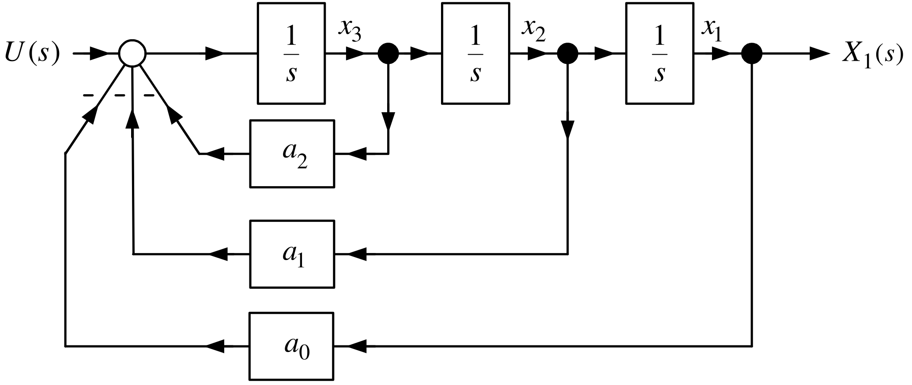

- Some block diagram reduction shows $X_{1}(s)/U(s)=\dfrac{1}{
  s^{3}+a_{2}s^{2}+a_{1}s+a_{0}}.$

- $X_{1}(s)=\dfrac{1}{s}X_{2}(s)\Longrightarrow X_{2}(s)=sX_{1}(s)$ and $X_{2}(s)=\dfrac{1}{s}X_{3}(s)\Longrightarrow
  X_{3}(s)=sX_{2}(s)=s^{2}X_{1}(s)$
:::

---

::: {.compact-slide}

Control Canonical Form

From previous slide: $X_{2}(s)=sX_{1}(s),$ $X_{3}(s)=sX_{2}(s)=s^{2}X_{1}(s).$

As $$X_{1}(s)\triangleq \frac{1}{s^{3}+a_{2}s^{2}+a_{1}s+a_{0}}U(s)$$

and $$Y(s)=\left( b_{2}s^{2}+b_{1}s+b_{0}\right) X_{1}(s)=\frac{
b_{2}s^{2}+b_{1}s+b_{0}}{s^{3}+a_{2}s^{2}+a_{1}s+a_{0}}U(s)$$ we have $$Y(s)=b_{2}s^{2}X_{1}(s)+b_{1}sX_{1}(s)+b_{0}X_{1}(s)=b_{2}X_{3}(s)+b_{1}X_{2}(s)+b_{0}X_{1}(s).$$

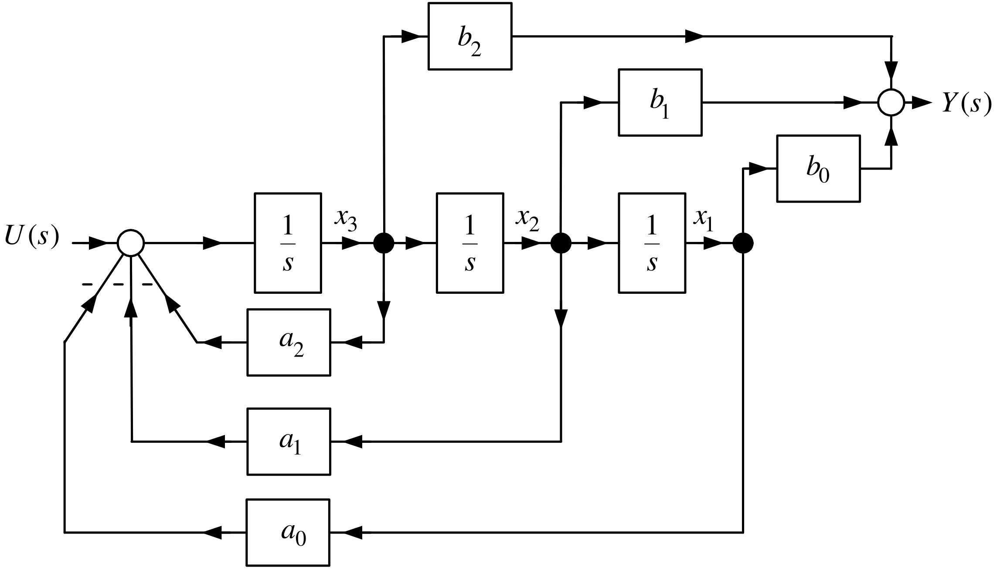

:::

---

::: {.compact-slide .boundary-safe-slide}

Control Canonical Form

From the simulation diagram we have $$\begin{aligned}
\frac{dx_{1}}{dt} &=&x_{2} \\
\frac{dx_{2}}{dt} &=&x_{3} \\
\frac{dx_{3}}{dt} &=&-a_{0}x_{1}-a_{1}x_{2}-a_{2}x_{3}+u \\
y &=&b_{0}x_{1}+b_{1}x_{2}+b_{2}x_{3}
\end{aligned}$$
:::

---

::: {.compact-slide}

Control Canonical Form

$$\begin{aligned}
\frac{dx_{1}}{dt} &=&x_{2} \\
\frac{dx_{2}}{dt} &=&x_{3} \\
\frac{dx_{3}}{dt} &=&-a_{0}x_{1}-a_{1}x_{2}-a_{2}x_{3}+u \\
y &=&b_{0}x_{1}+b_{1}x_{2}+b_{2}x_{3}
\end{aligned}$$ In matrix form $$\begin{aligned}
\frac{d}{dt}\left[
\begin{array}{c}
x_{1} \\
x_{2} \\
x_{3}
\end{array}
\right] &=&\underset{A}{\underbrace{\left[
\begin{array}{ccc}
0 & 1 & 0 \\
0 & 0 & 1 \\
-a_{0} & -a_{1} & -a_{2}
\end{array}
\right] }}\underset{x}{\underbrace{\left[
\begin{array}{c}
x_{1} \\
x_{2} \\
x_{3}
\end{array}
\right] }}+\underset{b}{\underbrace{\left[
\begin{array}{c}
0 \\
0 \\
1
\end{array}
\right] }}u \\
y &=&\underset{c}{\underbrace{\left[
\begin{array}{ccc}
b_{0} & b_{1} & b_{2}
\end{array}
\right] }}\left[
\begin{array}{c}
x_{1} \\
x_{2} \\
x_{3}
\end{array}
\right] .
\end{aligned}$$

- This statespace representation is called a *realization* of $G(s)$ .

  This is because the statespace model can be implemented (realized) on a digital

  computer.

- The special form of the $A$ and $b$ matrices is the *control canonical* form.
:::

---

::: {.compact-slide .boundary-safe-slide}

Example

*Transfer Function Realization*

Let $$\frac{Y(s)}{U(s)}=\frac{10s+8}{s^{2}+5s+6}$$ and $$\frac{X_{1}(s)}{U(s)}=\frac{1}{s^{2}+5s+6}.$$

- Draw the simulation diagram for $X_{1}(s)/U(s).$

- Then use the outputs of the two integrators to form $$Y(s)=10sX_{1}(s)+8X_{1}(s).$$

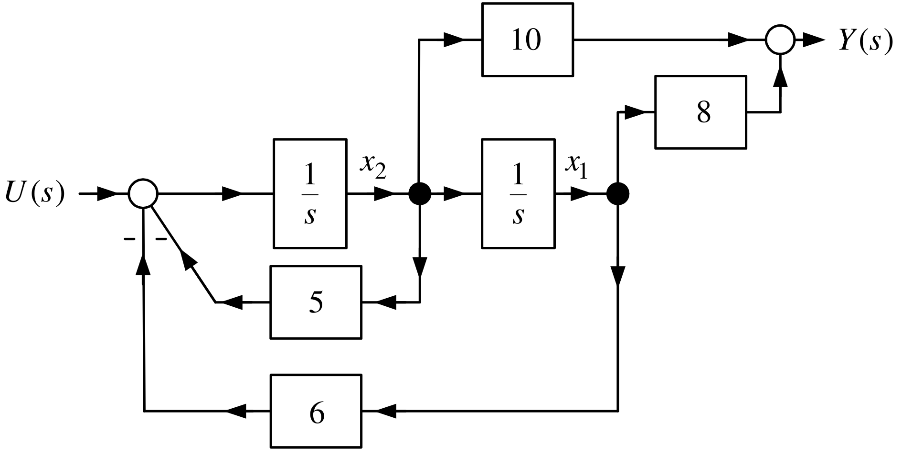

:::

---

::: {.compact-slide}

Example

*Transfer Function Realization* **(continued)**

$$\begin{aligned}
\frac{dx_{1}}{dt} &=&x_{2} \\
\frac{dx_{2}}{dt} &=&-6x_{1}-5x_{2}+u \\
y &=&8x_{1}+10x_{2}.
\end{aligned}$$ $$\begin{aligned}
\frac{d}{dt}\left[
\begin{array}{c}
x_{1} \\
x_{2}
\end{array}
\right] &=&\underset{A}{\underbrace{\left[
\begin{array}{rr}
0 & 1 \\
-6 & -5
\end{array}
\right] }}\underset{x}{\underbrace{\left[
\begin{array}{c}
x_{1} \\
x_{2}
\end{array}
\right] }}+\underset{b}{\underbrace{\left[
\begin{array}{c}
0 \\
1
\end{array}
\right] }}u \\
y &=&\underset{c}{\underbrace{\left[
\begin{array}{cc}
8 & 10
\end{array}
\right] }}\left[
\begin{array}{c}
x_{1} \\
x_{2}
\end{array}
\right]
\end{aligned}$$
:::

---

::: {.compact-slide}

Example

*Discrete -Time Implementation of a Transfer Function*

$$\frac{d}{dt}\left[
\begin{array}{c}
x_{1} \\
x_{2}
\end{array}
\right] =\underset{A}{\underbrace{\left[
\begin{array}{rr}
0 & 1 \\
-6 & -5
\end{array}
\right] }}\underset{x}{\underbrace{\left[
\begin{array}{c}
x_{1} \\
x_{2}
\end{array}
\right] }}+\underset{b}{\underbrace{\left[
\begin{array}{c}
0 \\
1
\end{array}
\right] }}u$$

The *Euler* approximation for the derivatives is $$\left[
\begin{array}{c}
dx_{1}(t)/dt \\
\\
dx_{2}(t)/dt
\end{array}
\right] _{t=kT}\approx \frac{1}{T}\left[
\begin{array}{c}
x_{1}((k+1)T)-x_{1}(kT) \\
\\
x_{2}((k+1)T)-x_{2}(kT)
\end{array}
\right] .$$

Then $$\begin{aligned}
\frac{1}{T}\left( x((k+1)T)-x(kT)\right) &=&Ax(kT)+bu(kT) \\
\Longrightarrow \text{  }x((k+1)T) &=&\left( I_{2\times 2}+
TA\right) x(kT)+Tbu(kT).
\end{aligned}$$ More explicitly $$\begin{aligned}
\left[
\begin{array}{c}
x_{1}((k+1)T) \\
x_{2}((k+1)T)
\end{array}
\right] &=&\left( \left[
\begin{array}{rr}
1 & 0 \\
0 & 1
\end{array}
\right] +T\left[
\begin{array}{rr}
0 & 1 \\
-6 & -5
\end{array}
\right] \right) \!\left[
\begin{array}{c}
x_{1}(kT) \\
x_{2}(kT)
\end{array}
\right] +T\!\left[
\begin{array}{c}
0 \\
1
\end{array}
\right] \!u(kT) \\
y(kT) &=&\left[
\begin{array}{cc}
1 & 0
\end{array}
\right] \left[
\begin{array}{c}
x_{1}(kT) \\
x_{2}(kT)
\end{array}
\right] .
\end{aligned}$$

- Simulink converts $\dfrac{10s+8}{s^{2}+5s+6}$ into this *recursive* equation to run in software.
:::

---

::: {.compact-slide .multi-figure-slide}

Example

*Block Diagram Reduction*

Take “ $10$” outside the feedback loop to obtain

:::

---

::: {.compact-slide .multi-figure-slide}

Example

*Block Diagram Reduction* **(continued)**

From the previous slide

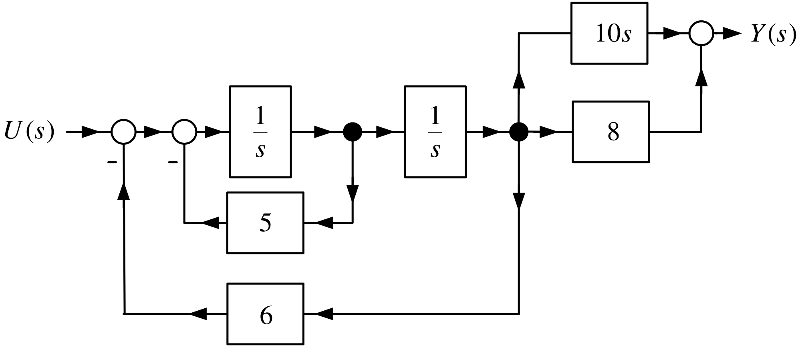

Simplify the inner feedback loop to obtain

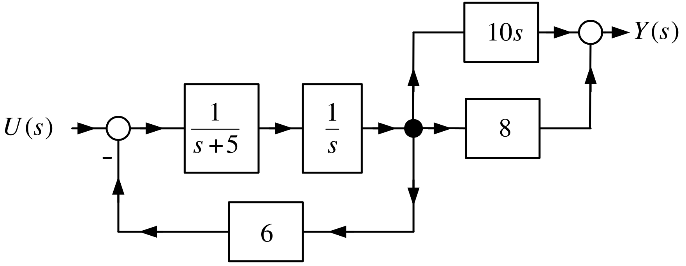

:::

---

::: {.compact-slide .multi-figure-slide}

Example

*Block Diagram Reduction* **(continued)**

From the previous slide

Simplify the feedback loop and the output.

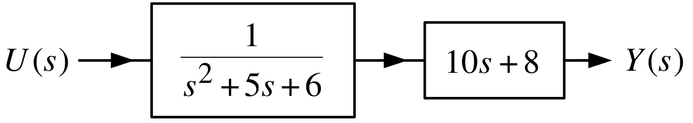

which shows $$\frac{Y(s)}{U(s)}=\dfrac{10s+8}{s^{2}+5s+6}.$$
:::

---

::: {.compact-slide}

Digression -

*Computation of the Inverse of a* $2\times 2$ *Matrix*

Let $$A=\left[
\begin{array}{rr}
a & b \\
c & d
\end{array}
\right] .$$ Assume $$\det A=\det \left[
\begin{array}{rr}
a & b \\
c & d
\end{array}
\right] =ad-bc\neq 0.$$ The inverse of $A$ is $$A^{-1}=\frac{1}{\det A}\left[
\begin{array}{rr}
d & -b \\
-c & a
\end{array}
\right] =\frac{1}{ad-bc}\left[
\begin{array}{rr}
d & -b \\
-c & a
\end{array}
\right] .$$ To check this we simply compute $$\begin{aligned}
A^{-1}A=\frac{1}{ad-bc}\left[
\begin{array}{rr}
d & -b \\
-c & a
\end{array}
\right] \left[
\begin{array}{rr}
a & b \\
c & d
\end{array}
\right] &=&\frac{1}{ad-bc}\left[
\begin{array}{rr}
ad-bc & db-bd \\
-ac+ac & -bc+ad
\end{array}
\right] \\
&=&\frac{1}{ad-bc}\left[
\begin{array}{cc}
ad-bc & 0 \\
0 & ad-bc
\end{array}
\right] \\
&=&\left[
\begin{array}{cc}
1 & 0 \\
0 & 1
\end{array}
\right] .
\end{aligned}$$ **End of Digression**
:::

---

::: {.compact-slide}

Computation of the Transfer Function from the Statespace Model

Consider $$\begin{aligned}
\frac{d}{dt}\left[
\begin{array}{c}
x_{1} \\
x_{2}
\end{array}
\right] &=&\left[
\begin{array}{rr}
0 & 1 \\
-6 & -5
\end{array}
\right] \!\left[
\begin{array}{c}
x_{1} \\
x_{2}
\end{array}
\right] +\left[
\begin{array}{c}
0 \\
1
\end{array}
\right] u \\
&& \\
y &=&\left[
\begin{array}{cc}
8 & 10
\end{array}
\right] \!\left[
\begin{array}{c}
x_{1} \\
x_{2}
\end{array}
\right] .
\end{aligned}$$ By the Laplace transform $$\begin{aligned}
\left[
\begin{array}{c}
sX_{1}(s)-x_{1}(0) \\
sX_{2}(s)-x_{2}(0)
\end{array}
\right] &=&\left[
\begin{array}{rr}
0 & 1 \\
-6 & -5
\end{array}
\right] \!\left[
\begin{array}{c}
X_{1}(s) \\
X_{2}(s)
\end{array}
\right] +\left[
\begin{array}{c}
0 \\
1
\end{array}
\right] U(s) \\
&& \\
Y(s) &=&\left[
\begin{array}{cc}
8 & 10
\end{array}
\right] \!\left[
\begin{array}{c}
X_{1}(s) \\
X_{2}(s)
\end{array}
\right] .
\end{aligned}$$ Let $x_{1}(0)=x_{2}(0)=0$. $$\left( s\underset{I}{
\underbrace{\left[
\begin{array}{rr}
1 & 0 \\
0 & 1
\end{array}
\right] }}-\underset{A}{\underbrace{\left[
\begin{array}{rr}
0 & 1 \\
-6 & -5
\end{array}
\right] }}\right) \!\left[
\begin{array}{c}
X_{1}(s) \\
X_{2}(s)
\end{array}
\right] =\underset{b}{\underbrace{\left[
\begin{array}{c}
0 \\
1
\end{array}
\right] }}U(s)$$
:::

---

::: {.compact-slide}

Computation of the Transfer Function from the Statespace Model

$$\left( s\underset{I}{
\underbrace{\left[
\begin{array}{rr}
1 & 0 \\
0 & 1
\end{array}
\right] }}-\underset{A}{\underbrace{\left[
\begin{array}{rr}
0 & 1 \\
-6 & -5
\end{array}
\right] }}\right) \!\left[
\begin{array}{c}
X_{1}(s) \\
X_{2}(s)
\end{array}
\right] =\underset{b}{\underbrace{\left[
\begin{array}{c}
0 \\
1
\end{array}
\right] }}U(s).$$

Then $$\begin{aligned}
\left[
\begin{array}{c}
X_{1}(s) \\
X_{2}(s)
\end{array}
\right] &=&\underset{(sI-A)^{-1}}{\underbrace{\left( s\left[
\begin{array}{rr}
1 & 0 \\
0 & 1
\end{array}
\right] -\left[
\begin{array}{rr}
0 & 1 \\
-6 & -5
\end{array}
\right] \right) ^{-1}}}\underset{b}{\underbrace{\left[
\begin{array}{c}
0 \\
1
\end{array}
\right] }}U(s) \\
&& \\
&=&\left[
\begin{array}{cc}
s & -1 \\
6 & s+5
\end{array}
\right] ^{-1}\left[
\begin{array}{c}
0 \\
1
\end{array}
\right] U(s) \\
&& \\
&=&\frac{1}{s^{2}+5s+6}\left[
\begin{array}{cc}
s+5 & 1 \\
-6 & s
\end{array}
\right] \left[
\begin{array}{c}
0 \\
1
\end{array}
\right] U(s) \\
&& \\
&=&\frac{1}{s^{2}+5s+6}\left[
\begin{array}{c}
1 \\
s
\end{array}
\right] U(s).
\end{aligned}$$ Finally, $$Y(s)=\left[
\begin{array}{cc}
8 & 10
\end{array}
\right] \!\left[
\begin{array}{c}
X_{1}(s) \\
X_{2}(s)
\end{array}
\right] =\left[
\begin{array}{cc}
8 & 10
\end{array}
\right] \frac{1}{s^{2}+5s+6}\left[
\begin{array}{c}
1 \\
s
\end{array}
\right] \!U(s)=\frac{8+10s}{s^{2}+5s+6}U(s).$$
:::

---

::: {.compact-slide .boundary-safe-slide}

Example

*Transfer Function Realization*

$$G(s)=\frac{s^{2}+10s+5}{s^{2}+5s+6}$$ This is proper, but not strictly proper. $$G(s)=\frac{s^{2}+5s+6-(5s+6)+10s+5}{s^{2}+5s+6}=\frac{s^{2}+5s+6+5s-1}{
s^{2}+5s+6}=1+\underset{G_{sp}}{\underbrace{\frac{5s-1}{s^{2}+5s+6}}}.$$ We let $$G_{sp}(s)=\frac{Y_{sp}(s)}{U(s)}\triangleq \frac{5s-1}{s^{2}+5s+6}$$ Do a realization of $G_{sp}(s)$.

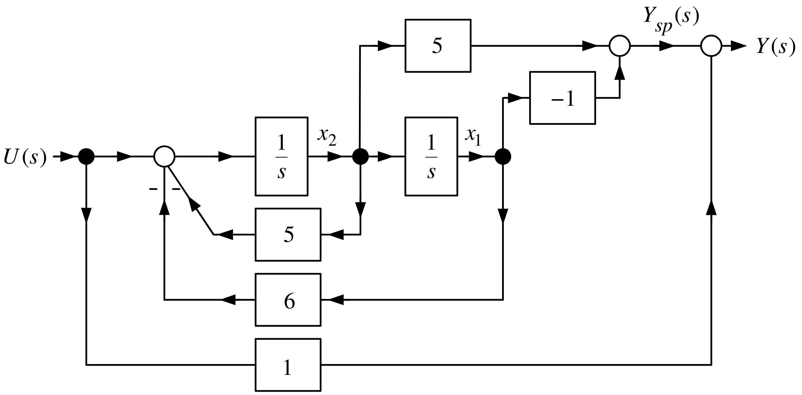

:::

---

::: {.compact-slide .boundary-safe-slide}

Example

*Transfer Function Realization* **(continued)**

Including the feedforward signal from the input $U(s)$ to the output $Y(s)$: $$Y(s)=G_{sp}(s)U(s)+U(s).$$

Statespace Realization: $$\begin{aligned}
\frac{dx_{1}}{dt} &=&x_{2} \\
\frac{dx_{2}}{dt} &=&-6x_{1}-5x_{2}+u \\
y &=&-x_{1}+5x_{2}+u
\end{aligned}$$
:::

---

::: {.compact-slide}

Example

*Transfer Function Realization* **(continued)**

From the previous slide: $$\begin{aligned}
\frac{dx_{1}}{dt} &=&x_{2} \\
\frac{dx_{2}}{dt} &=&-6x_{1}-5x_{2}+u \\
y &=&-x_{1}+5x_{2}+u
\end{aligned}$$ In matrix form: $$\begin{aligned}
\frac{d}{dt}\left[
\begin{array}{c}
x_{1} \\
x_{2}
\end{array}
\right] &=&\left[
\begin{array}{rr}
0 & 1 \\
-6 & -5
\end{array}
\right] \left[
\begin{array}{c}
x_{1} \\
x_{2}
\end{array}
\right] +\left[
\begin{array}{c}
0 \\
1
\end{array}
\right] \!u \\
y &=&\left[
\begin{array}{cc}
-1 & 5
\end{array}
\right] \left[
\begin{array}{c}
x_{1} \\
x_{2}
\end{array}
\right] +u.
\end{aligned}$$ Check: $$\begin{aligned}
\left[
\begin{array}{c}
sX_{1}(s)-\underset{0}{\underbrace{x_{1}(0)}} \\
sX_{2}(s)-\underset{0}{\underbrace{x_{2}(0)}}
\end{array}
\right] &=&\left[
\begin{array}{rr}
0 & 1 \\
-6 & -5
\end{array}
\right] \left[
\begin{array}{c}
X_{1}(s) \\
X_{2}(s)
\end{array}
\right] +\left[
\begin{array}{c}
0 \\
1
\end{array}
\right] \!U(s) \\
Y(s) &=&\left[
\begin{array}{cc}
-1 & 5
\end{array}
\right] \left[
\begin{array}{c}
X_{1}(s) \\
X_{2}(s)
\end{array}
\right] +U(s).
\end{aligned}$$
:::

---

::: {.compact-slide}

Example

*Transfer Function Realization* **(continued)**

From the previous slide: $$\begin{aligned}
\left[
\begin{array}{c}
sX_{1}(s) \\
sX_{2}(s)
\end{array}
\right] &=&\left[
\begin{array}{rr}
0 & 1 \\
-6 & -5
\end{array}
\right] \left[
\begin{array}{c}
X_{1}(s) \\
X_{2}(s)
\end{array}
\right] +\left[
\begin{array}{c}
0 \\
1
\end{array}
\right] \!U(s) \\
Y(s) &=&\left[
\begin{array}{cc}
-1 & 5
\end{array}
\right] \left[
\begin{array}{c}
X_{1}(s) \\
X_{2}(s)
\end{array}
\right] +U(s).
\end{aligned}$$ or $$\begin{aligned}
\left[
\begin{array}{c}
X_{1}(s) \\
X_{2}(s)
\end{array}
\right] &=&\left( s\left[
\begin{array}{rr}
1 & 0 \\
0 & 1
\end{array}
\right] -\left[
\begin{array}{rr}
0 & 1 \\
-6 & -5
\end{array}
\right] \right) ^{-1}\left[
\begin{array}{c}
0 \\
1
\end{array}
\right] \!U(s) \\
&=&\frac{1}{s^{2}+5s+6}\left[
\begin{array}{c}
1 \\
s
\end{array}
\right] \!U(s).
\end{aligned}$$ so that $$\begin{aligned}
Y(s)=\left[
\begin{array}{cc}
-1 & 5
\end{array}
\right] \left[
\begin{array}{c}
X_{1}(s) \\
X_{2}(s)
\end{array}
\right] +U(s) &=&\left[
\begin{array}{cc}
-1 & 5
\end{array}
\right] \frac{1}{s^{2}+5s+6}\left[
\begin{array}{c}
1 \\
s
\end{array}
\right] \!U(s)+U(s) \\
&=&\frac{5s-1}{s^{2}+5s+6}U(s)+U(s) \\
&=&\frac{s^{2}+10s+5}{s^{2}+5s+6}U(s).
\end{aligned}$$
:::

---

::: {.compact-slide .dense-multi-slide}

Example

*Implementing a Feedback Controller*

Consider the feedback system:

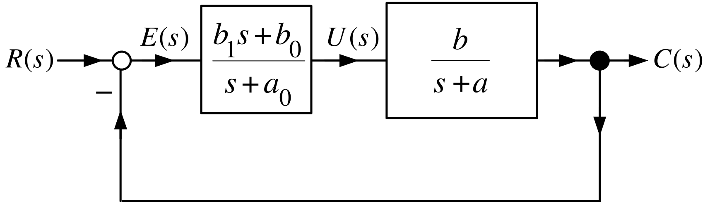

$G_{c}(s)$ is proper, but not strictly proper. $$G_{c}(s)=\dfrac{b_{1}s+b_{0}}{s+a_{0}}=\dfrac{b_{1}(s+a_{0})-b_{1}a_{0}+b_{0}
}{s+a_{0}}=b_{1}+\dfrac{b_{0}-b_{1}a_{0}}{s+a_{0}}$$

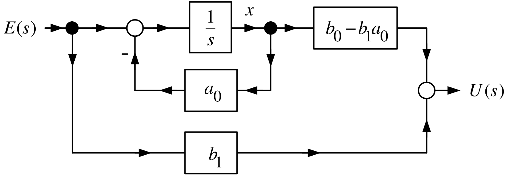

Statepace equations: $$\begin{aligned}
\frac{dx(t)}{dt} &=&-a_{0}x(t)+e(t) \\
u(t) &=&(b_{0}-b_{1}a_{0})x(t)+b_{1}e(t) \\
e(t) &=&r(t)-c(t).
\end{aligned}$$
:::

---

::: {.compact-slide}

Example

*Implementing a Feedback Controller* **(continued)**

$$\begin{aligned}
\frac{dx(t)}{dt} &=&-a_{0}x(t)+e(t) \\
u(t) &=&(b_{0}-b_{1}a_{0})x(t)+b_{1}e(t) \\
e(t) &=&r(t)-c(t).
\end{aligned}$$

Convert to a discrete-time model to implement on a digital computer

Set $$\left. \frac{dx}{dt}\right\vert _{t=kT}\approx \frac{x((k+1)T)-x(kT)}{T}$$ With $t=kT$, the discrete-time model is $$\begin{aligned}
x((k+1)T) &=&(1-a_{0}T)x(kT)+Te(kT) \\
u(kT) &=&(b_{0}-b_{1}a_{0})x(kT)+b_{1}e(kT) \\
e(kT) &=&r(kT)-c(kT).
\end{aligned}$$

- These recursive equations can be implemented in the $C$ programming language.

- The value of $c(kT)$ comes from the output sensor

- $r(kT)$ is stored in the computer’s memory.
:::

---

::: {.compact-slide}

Example

*Implementing a Transfer Function*

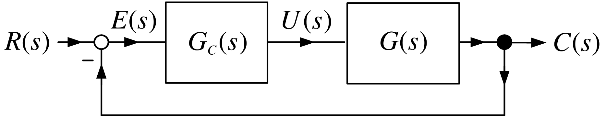

Let $$\frac{U(s)}{E(s)}=G_{c}(s)=\frac{b_{c2}s^{2}+b_{c1}s+b_{c0}}{
s^{3}+a_{c2}s^{2}+a_{c1}s+a_{c0}}.$$ A state space realization of $G_{c}(s)$ is given by $$\begin{aligned}
\frac{d}{dt}\left[
\begin{array}{c}
x_{1} \\
x_{2} \\
x_{3}
\end{array}
\right] &=&\underset{A_{c}}{\underbrace{\left[
\begin{array}{ccc}
0 & 1 & 0 \\
0 & 0 & 1 \\
-a_{c0} & -a_{c1} & -a_{c2}
\end{array}
\right] }}\underset{x}{\underbrace{\left[
\begin{array}{c}
x_{1} \\
x_{2} \\
x_{3}
\end{array}
\right] }}+\underset{b_{c}}{\underbrace{\left[
\begin{array}{c}
0 \\
0 \\
1
\end{array}
\right] }}e \\
u &=&\underset{c_{c}}{\underbrace{\left[
\begin{array}{ccc}
b_{c0} & b_{c1} & b_{c2}
\end{array}
\right] }}\left[
\begin{array}{c}
x_{1} \\
x_{2} \\
x_{3}
\end{array}
\right] .
\end{aligned}$$
:::

---

::: {.compact-slide}

Example

*Implementing a Transfer Function* **(continued)**

$$\begin{aligned}
\frac{d}{dt}\left[
\begin{array}{c}
x_{1} \\
x_{2} \\
x_{3}
\end{array}
\right] &=&\underset{A_{c}}{\underbrace{\left[
\begin{array}{ccc}
0 & 1 & 0 \\
0 & 0 & 1 \\
-a_{c0} & -a_{c1} & -a_{c2}
\end{array}
\right] }}\underset{x}{\underbrace{\left[
\begin{array}{c}
x_{1} \\
x_{2} \\
x_{3}
\end{array}
\right] }}+\underset{b_{c}}{\underbrace{\left[
\begin{array}{c}
0 \\
0 \\
1
\end{array}
\right] }}e \\
u &=&\underset{c_{c}}{\underbrace{\left[
\begin{array}{ccc}
b_{c0} & b_{c1} & b_{c2}
\end{array}
\right] }}\left[
\begin{array}{c}
x_{1} \\
x_{2} \\
x_{3}
\end{array}
\right] .
\end{aligned}$$

Set $$\left[
\begin{array}{c}
\dfrac{dx_{1}(kT)}{dt} \\
\\
\dfrac{dx_{2}(kT)}{dt} \\
\\
\dfrac{dx_{3}(kT)}{dt}
\end{array}
\right] \approx \left[
\begin{array}{c}
\dfrac{x_{1}((k+1)T)-x_{1}(kT)}{T} \\
\\
\dfrac{x_{2}((k+1)T)-x_{2}(kT)}{T} \\
\\
\dfrac{x_{3}((k+1)T)-x_{3}(kT)}{T}
\end{array}
\right] .$$ Then $$\!\!\!\!\!\frac{1}{T}\!\left( \!\left[ \!
\begin{array}{c}
x_{1}((k+1)T) \\
x_{2}((k+1)T) \\
x_{3}((k+1)T)
\end{array}
\!\right] \!-\!\left[ \!
\begin{array}{c}
x_{1}(kT) \\
x_{2}(kT) \\
x_{3}(kT)
\end{array}
\!\right] \!\right) \!=\!\left[ \!\!
\begin{array}{ccc}
0 & 1 & 0 \\
0 & 0 & 1 \\
-a_{c0} & -a_{c1} & -a_{c2}
\end{array}
\!\!\right] \!\!\!\left[ \!
\begin{array}{c}
x_{1}(kT) \\
x_{2}(kT) \\
x_{3}(kT)
\end{array}
\!\right] \!+\!\left[ \!
\begin{array}{c}
0 \\
0 \\
1
\end{array}
\!\right] \!\!e(kT)\!.$$
:::

---

::: {.compact-slide}

Example

*Implementing a Transfer Function* **(continued)**

Rearrange $$\!\!\!\!\!\frac{1}{T}\!\left( \!\left[ \!
\begin{array}{c}
x_{1}((k+1)T) \\
x_{2}((k+1)T) \\
x_{3}((k+1)T)
\end{array}
\!\right] \!-\!\left[ \!
\begin{array}{c}
x_{1}(kT) \\
x_{2}(kT) \\
x_{3}(kT)
\end{array}
\!\right] \!\right) \!=\!\left[ \!\!
\begin{array}{ccc}
0 & 1 & 0 \\
0 & 0 & 1 \\
-a_{c0} & -a_{c1} & -a_{c2}
\end{array}
\!\!\right] \!\!\!\left[ \!
\begin{array}{c}
x_{1}(kT) \\
x_{2}(kT) \\
x_{3}(kT)
\end{array}
\!\right] \!+\!\left[ \!
\begin{array}{c}
0 \\
0 \\
1
\end{array}
\!\right] \!\!e(kT)$$ to obtain $$\begin{aligned}
\left[
\begin{array}{c}
x_{1}((k+1)T) \\
x_{2}((k+1)T) \\
x_{3}((k+1)T)
\end{array}
\right] &=&\underset{I_{3\times 3}+TA_{c}}{\underbrace{\left[
\begin{array}{ccc}
1 & T & 0 \\
0 & 1 & T \\
-Ta_{c0} & -Ta_{c1} & 1-Ta_{c2}
\end{array}
\right] }}\left[
\begin{array}{c}
x_{1}(kT) \\
x_{2}(kT) \\
x_{3}(kT)
\end{array}
\right] +T\!\left[
\begin{array}{c}
0 \\
0 \\
1
\end{array}
\right] \!e(kT) \\
u(kT) &=&\left[
\begin{array}{ccc}
b_{c0} & b_{c1} & b_{c2}
\end{array}
\right] \left[
\begin{array}{c}
x_{1}(kT) \\
x_{2}(kT) \\
x_{3}(kT)
\end{array}
\right] \\
e(kT) &=&r(kT)-y(kT).
\end{aligned}$$

- $y(kT)$ is the measured output brought into the computer (e.g., an A/D, optical encoder, etc.).

- $r(kT)$ is stored in the computer memory.

- This is a recursive algorithm implementable in software using $C$.
:::

---

::: {.compact-slide}

Laplace Transform of the Statespace Equations

Consider $$\frac{d}{dt}\left[
\begin{array}{c}
x_{1} \\
x_{2}
\end{array}
\right] =\underset{A}{\underbrace{\left[
\begin{array}{rr}
a_{11} & a_{12} \\
a_{21} & a_{22}
\end{array}
\right] }}\underset{x(t)}{\underbrace{\left[
\begin{array}{c}
x_{1} \\
x_{2}
\end{array}
\right] }}+\underset{b}{\underbrace{\left[
\begin{array}{c}
b_{1} \\
b_{2}
\end{array}
\right] }}u,\text{  }\left[
\begin{array}{c}
x_{1}(0) \\
x_{2}(0)
\end{array}
\right] =\underset{x_{0}}{\underbrace{\left[
\begin{array}{c}
x_{01} \\
x_{02}
\end{array}
\right] }}.$$ Take the Laplace transform: $$\left[
\begin{array}{c}
sX_{1}(s)-x_{1}(0) \\
sX_{2}(s)-x_{2}(0)
\end{array}
\right] =\left[
\begin{array}{rr}
a_{11} & a_{12} \\
a_{21} & a_{22}
\end{array}
\right] \left[
\begin{array}{c}
X_{1}(s) \\
X_{2}(s)
\end{array}
\right] +\left[
\begin{array}{c}
b_{1} \\
b_{2}
\end{array}
\right] \!U(s)$$ Rearrange: $$\underset{sI-A}{\underbrace{\left( s\left[
\begin{array}{rr}
1 & 0 \\
0 & 1
\end{array}
\right] -\left[
\begin{array}{rr}
a_{11} & a_{12} \\
a_{21} & a_{22}
\end{array}
\right] \right) }}\underset{X(s)}{\underbrace{\left[
\begin{array}{c}
X_{1}(s) \\
X_{2}(s)
\end{array}
\right] }}=\underset{x_{0}}{\underbrace{\left[
\begin{array}{c}
x_{1}(0) \\
x_{2}(0)
\end{array}
\right] }}+\underset{b}{\underbrace{\left[
\begin{array}{c}
b_{1} \\
b_{2}
\end{array}
\right] }}U(s)$$ or $$\begin{aligned}
\left[
\begin{array}{c}
X_{1}(s) \\
X_{2}(s)
\end{array}
\right] &=&\left( s\left[
\begin{array}{rr}
1 & 0 \\
0 & 1
\end{array}
\right] -\left[
\begin{array}{rr}
a_{11} & a_{12} \\
a_{21} & a_{22}
\end{array}
\right] \right) ^{-1}\left[
\begin{array}{c}
x_{1}(0) \\
x_{2}(0)
\end{array}
\right] + \\
&& \\
&&\left( s\left[
\begin{array}{rr}
1 & 0 \\
0 & 1
\end{array}
\right] -\left[
\begin{array}{rr}
a_{11} & a_{12} \\
a_{21} & a_{22}
\end{array}
\right] \right) ^{-1}\left[
\begin{array}{c}
b_{1} \\
b_{2}
\end{array}
\right] \!U(s).
\end{aligned}$$
:::

---

::: {.compact-slide}

Laplace Transform of the Statespace Equations

Recall $$\begin{aligned}
\underset{(sI-A)^{-1}}{\underbrace{\left( s\left[
\begin{array}{rr}
1 & 0 \\
0 & 1
\end{array}
\right] -\left[
\begin{array}{rr}
a_{11} & a_{12} \\
a_{21} & a_{22}
\end{array}
\right] \right) ^{-1}}} &=&\!\left[ \!
\begin{array}{cc}
s-a_{11} & -a_{12} \\
-a_{21} & s-a_{22}
\end{array}
\!\right] ^{-1}\!\! \\
&=&\frac{1}{\det (sI-A)}\!\left[ \!
\begin{array}{cc}
s-a_{22} & a_{12} \\
a_{21} & s-a_{11}
\end{array}
\!\right]
\end{aligned}$$ where $$\det (sI-A)=\det \left[
\begin{array}{cc}
s-a_{11} & -a_{12} \\
-a_{21} & s-a_{22}
\end{array}
\right] =s^{2}+(-a_{11}-a_{22})s+a_{11}a_{22}-a_{12}a_{21}.$$ Then $$\begin{aligned}
\left[
\begin{array}{c}
X_{1}(s) \\
X_{2}(s)
\end{array}
\right] &=&\left( s\left[
\begin{array}{rr}
1 & 0 \\
0 & 1
\end{array}
\right] -\left[
\begin{array}{rr}
a_{11} & a_{12} \\
a_{21} & a_{22}
\end{array}
\right] \right) ^{-1}\left[
\begin{array}{c}
x_{1}(0) \\
x_{2}(0)
\end{array}
\right] + \\
&& \\
&&\left( s\left[
\begin{array}{rr}
1 & 0 \\
0 & 1
\end{array}
\right] -\left[
\begin{array}{rr}
a_{11} & a_{12} \\
a_{21} & a_{22}
\end{array}
\right] \right) ^{-1}\left[
\begin{array}{c}
b_{1} \\
b_{2}
\end{array}
\right] \!U(s)
\end{aligned}$$ is compactly written as $$X(s)=(sI-A)^{-1}x(0)+(sI-A)^{-1}bU(s).$$
:::

---

::: {.compact-slide}

Example

*Inverse LT of the Statespace Equations*

Consider the statespace model $$\frac{d}{dt}\left[
\begin{array}{c}
x_{1} \\
x_{2}
\end{array}
\right] =\left[
\begin{array}{rr}
0 & 2 \\
-2 & -5
\end{array}
\right] \left[
\begin{array}{c}
x_{1} \\
x_{2}
\end{array}
\right] +\left[
\begin{array}{c}
0 \\
1
\end{array}
\right] \!\!u.$$ Then $$X(s)=\left[
\begin{array}{c}
X_{1}(s) \\
X_{2}(s)
\end{array}
\right] =(sI-A)^{-1}x(0)+(sI-A)^{-1}bU(s).$$ Now as $$(sI-A)^{-1}=\left[
\begin{array}{cc}
s & -2 \\
2 & s+5
\end{array}
\right] ^{-1}=\frac{1}{\underset{\det (sI-A)}{\underbrace{(s+5)s+4}}}\left[
\begin{array}{cc}
s+5 & 2 \\
-2 & s
\end{array}
\right] =\dfrac{1}{\underset{(s+4)(s+1)}{\underbrace{s^{2}+5s+4}}}\left[
\begin{array}{cc}
s+5 & 2 \\
-2 & s
\end{array}
\right]$$ we have $$\mathcal{L} ^{-1}\{(sI-A)^{-1}\}=\left[
\begin{array}{cc}
\mathcal{L} ^{-1}\left\{ \dfrac{s+5}{(s+4)(s+1)}\right\} & \mathcal{L}
^{-1}\left\{ \dfrac{2}{(s+4)(s+1)}\right\} \\
&  \\
\mathcal{L} ^{-1}\left\{ -\dfrac{2}{(s+4)(s+1)}\right\} & \mathcal{L}
^{-1}\left\{ \dfrac{s}{(s+4)(s+1)}\right\}
\end{array}
\right] \!.$$
:::

---

::: {.compact-slide}

Example

*Inverse LT of the Statespace Equations* **(continued)**

Partial fraction expansion: $$\begin{aligned}
\dfrac{s+5}{(s+4)(s+1)} &=&\frac{A}{s+4}+\frac{B}{s+1}=-\frac{1/3}{s+4}+
\frac{4/3}{s+1} \\
\dfrac{2}{(s+4)(s+1)} &=&\frac{A}{s+4}+\frac{B}{s+1}=-\frac{2/3}{s+4}+\frac{
2/3}{s+1} \\
\dfrac{s}{(s+4)(s+1)} &=&\frac{A}{s+4}+\frac{B}{s+1}=\frac{4/3}{s+4}-\frac{
1/3}{s+1}
\end{aligned}$$ Thus $$\begin{aligned}
\Phi (t)\triangleq \mathcal{L} ^{-1}\{(sI-A)^{-1}\} &=&\left[
\begin{array}{cc}
\mathcal{L} ^{-1}\!\left\{ -\dfrac{1/3}{s+4}+\dfrac{4/3}{s+1}\right\} &
\mathcal{L} ^{-1}\!\left\{ -\dfrac{2/3}{s+4}+\dfrac{2/3}{s+1}\right\} \\
&  \\
\mathcal{L} ^{-1}\!\left\{ \dfrac{2/3}{s+4}-\dfrac{2/3}{s+1}\right\} &
\mathcal{L} ^{-1}\!\left\{ \dfrac{4/3}{s+4}-\dfrac{1/3}{s+1}\right\}
\end{array}
\right] \\
&& \\
&& \\
&=&\left[
\begin{array}{cc}
-\dfrac{1}{3}e^{-4t}+\dfrac{4}{3}e^{-t} & -\dfrac{2}{3}e^{-4t}+\dfrac{2}{3}
e^{-t} \\
&  \\
\dfrac{2}{3}e^{-4t}-\dfrac{2}{3}e^{-t} & \dfrac{4}{3}e^{-4t}-\dfrac{1}{3}
e^{-t}
\end{array}
\right] .
\end{aligned}$$
:::

---

::: {.compact-slide}

Example

*Inverse LT of the Statespace Equations* **(continued)**

With $u(t)=0$ we have $$\begin{aligned}
x(t)=\mathcal{L} ^{-1}\{(sI-A)^{-1}x(0)\} &=&\mathcal{L}
^{-1}\{(sI-A)^{-1}\}x(0) \\
&& \\
&& \\
&& \\
&=&\underset{\Phi (t)}{\underbrace{\left[
\begin{array}{cc}
-\dfrac{1}{3}e^{-4t}+\dfrac{4}{3}e^{-t} & -\dfrac{2}{3}e^{-4t}+\dfrac{2}{3}
e^{-t} \\
&  \\
\dfrac{2}{3}e^{-4t}-\dfrac{2}{3}e^{-t} & \dfrac{4}{3}e^{-4t}-\dfrac{1}{3}
e^{-t}
\end{array}
\right] }}\left[
\begin{array}{c}
x_{1}(0) \\
\\
x_{2}(0)
\end{array}
\right] \!.
\end{aligned}$$

This is the solution to $$\frac{d}{dt}\left[
\begin{array}{c}
x_{1} \\
x_{2}
\end{array}
\right] =\left[
\begin{array}{rr}
0 & 2 \\
-2 & -5
\end{array}
\right] \left[
\begin{array}{c}
x_{1} \\
x_{2}
\end{array}
\right] \text{  with initial state }\left[
\begin{array}{c}
x_{1}(0) \\
x_{2}(0)
\end{array}
\right]$$
:::

---

::: {.compact-slide}

Example

*Inverse LT of the Statespace Equations* **(continued)**

Next let $x_{1}(0)=x_{2}(0)=0$ and choose $$u(t)=u_{s}(t)=\left\{
\begin{array}{cc}
1, & t\geq 0 \\
0, & t<0
\end{array}
\right. \text{  or  }U(s)=\frac{1}{s}.$$ $$\begin{aligned}
X(s)=(sI-A)^{-1}bU(s) &=&\dfrac{1}{(s+4)(s+1)}\left[
\begin{array}{cc}
s+5 & 2 \\
-2 & s
\end{array}
\right] \!\!\left[
\begin{array}{c}
0 \\
1
\end{array}
\right] \!\frac{1}{s} \\
&& \\
&=&\frac{1}{s^{2}+5s+4}\left[
\begin{array}{c}
2 \\
s
\end{array}
\right] \!\frac{1}{s} \\
&& \\
&=&\left[
\begin{array}{c}
\dfrac{2}{s(s+4)(s+1)} \\
\\
\dfrac{1}{(s+4)(s+1)}
\end{array}
\right] \\
&& \\
&=&\left[
\begin{array}{c}
\dfrac{1/2}{s}-\dfrac{2/3}{s+1}+\dfrac{1/6}{s+4} \\
\\
\dfrac{1/3}{s+1}-\dfrac{1/3}{s+4}
\end{array}
\right] .
\end{aligned}$$
:::

---

::: {.compact-slide}

Example

*Inverse LT of the Statespace Equations* **(continued)**

Thus $$\begin{aligned}
x(t)=\mathcal{L} ^{-1}\{(sI-A)^{-1}b\underset{1/s}{\underbrace{U(s)}}\}
&=&\mathcal{L} ^{-1}\left\{ \left[
\begin{array}{c}
\dfrac{1/2}{s}-\dfrac{2/3}{s+1}+\dfrac{1/6}{s+4} \\
\\
\dfrac{1/3}{s+1}-\dfrac{1/3}{s+4}
\end{array}
\right] \right\} \\
&& \\
&=&\left[
\begin{array}{c}
\dfrac{1}{2}u_{s}(t)-\dfrac{2}{3}e^{-t}+\dfrac{1}{6}e^{-4t} \\
\\
\dfrac{1}{3}e^{-t}-\dfrac{1}{3}e^{-4t}
\end{array}
\right] .
\end{aligned}$$ Let $x_{1}(0)=1,x_{2}(0)=2$ and $u(t)=u_{s}(t)$. $$\begin{aligned}
x(t) &=&\mathcal{L} ^{-1}\{(sI-A)^{-1}x(0)\}+\mathcal{L}
^{-1}\{(sI-A)^{-1}bU(s)\} \\
&& \\
&=&\!\!\underset{\Phi (t)}{\underbrace{\left[ \!\!
\begin{array}{cc}
-\dfrac{1}{3}e^{-4t}+\dfrac{4}{3}e^{-t} & -\dfrac{2}{3}e^{-4t}+\dfrac{2}{3}
e^{-t} \\
&  \\
\dfrac{2}{3}e^{-4t}-\dfrac{2}{3}e^{-t} & \dfrac{4}{3}e^{-4t}-\dfrac{1}{3}
e^{-t}
\end{array}
\!\right] }}\!\left[ \!
\begin{array}{c}
1 \\
\\
2
\end{array}
\!\right] +\left[ \!
\begin{array}{c}
\dfrac{1}{2}u_{s}(t)-\dfrac{2}{3}e^{-t}+\dfrac{1}{6}e^{-4t} \\
\\
\dfrac{1}{3}e^{-t}-\dfrac{1}{3}e^{-4t}
\end{array}
\!\!\right] \!.
\end{aligned}$$
:::

---

::: {.compact-slide}

Fundamental Matrix

$\Phi (t)=\mathcal{L} ^{-1}\{(sI-A)^{-1}\}$

The solution to $$\frac{dx}{dt}=Ax, x(0)=x_{0}$$ is $$x(t)=\mathcal{L} ^{-1}\{(sI-A)^{-1}x(0)\}=\underset{\Phi (t)}{\underbrace{
\mathcal{L} ^{-1}\{(sI-A)^{-1}\}}}x(0)=\Phi (t)x(0).$$ So, for *any* $x(0)$, $$\frac{d}{dt}\underset{x(t)}{\underbrace{\Phi (t)x(0)}}=A\underset{x(t)}{
\underbrace{\Phi (t)x(0)}}$$ The quantity $$\Phi (t)\triangleq \mathcal{L} ^{-1}\{(sI-A)^{-1}\}$$ is called the **fundamental matrix**.

We now derive an explicit expression for it.
:::

---

::: {.compact-slide}

Exponential Matrix

$\Phi (t)=e^{At}$

Recall the Taylor series expansion for $e^{at}:$ $$e^{at}=1+at+a^{2}\frac{t^{2}}{2!}+a^{3}\frac{t^{3}}{3!}+a^{4}\frac{t^{4}}{4!}
+\cdots =\sum_{j=0}^{\infty }\frac{(at)^{j}}{j!}.$$ Note that $$\begin{aligned}
\frac{d}{dt}e^{at} &=&\frac{d}{dt}\!\left( 1+at+a^{2}\frac{t^{2}}{2!}+a^{3}
\frac{t^{3}}{3!}+a^{4}\frac{t^{4}}{4!}+\cdots \right) \\
&=&0+a+a^{2}t+a^{3}\frac{t^{2}}{2!}+a^{4}\frac{t^{3}}{3!}+\ldots \\
&=&a\!\left( 1+at+a^{2}\frac{t^{2}}{2!}+a^{3}\frac{t^{3}}{3!}+\ldots \right)
\\
&=&a\sum_{j=0}^{\infty }\frac{(at)^{j}}{j!} \\
&=&ae^{at}.
\end{aligned}$$ For $A\in
\mathbb{R}
^{n\times n}$, define the *exponential matrix* $e^{At}$ by $$e^{At}\triangleq I_{n\times n}+At+A^{2}\frac{t^{2}}{2!}+A^{3}\frac{t^{3}}{3!}
+A^{4}\frac{t^{4}}{4!}+\cdots =\sum_{j=0}^{\infty }A^{j}\frac{t^{j}}{j!}$$

- Recall: $0!\triangleq 1$ and $A^{0}\triangleq I_{n\times n}$.
:::

---

::: {.compact-slide}

Exponential Matrix

$\Phi (t)=e^{At}$

With $$e^{At}\triangleq I_{n\times n}+At+A^{2}\frac{t^{2}}{2!}+A^{3}\frac{t^{3}}{3!}
+A^{4}\frac{t^{4}}{4!}+\cdots =\sum_{j=0}^{\infty }A^{j}\frac{t^{j}}{j!}$$

we have $$\begin{aligned}
\frac{d}{dt}e^{At} &\triangleq &\frac{d}{dt}\!\left( I_{n\times n}+At+A^{2}
\frac{t^{2}}{2!}+A^{3}\frac{t^{3}}{3!}+A^{4}\frac{t^{4}}{4!}+\cdots \right)
\\
&=&0_{n\times n}+A+A^{2}\frac{t}{1!}+A^{3}\frac{t^{2}}{2!}+A^{4}\frac{t^{3}}{
3!}+\cdots \\
&=&A\!\left( I_{n\times n}+A\frac{t}{1!}+A^{2}\frac{t^{2}}{2!}+A^{3}\frac{
t^{3}}{3!}+\cdots \right) \\
&=&A\sum_{j=0}^{\infty }A^{j}\frac{t^{j}}{j!} \\
&=&Ae^{At}.
\end{aligned}$$ Also note that $$\left. e^{At}\right\vert _{t=0}=\left. I_{n\times n}+At+A^{2}\frac{t^{2}}{2!}
+A^{3}\frac{t^{3}}{3!}+\cdots \right\vert _{t=0}=I_{n\times n}.$$
:::

---

::: {.compact-slide}

Exponential Matrix

$\Phi (t)=e^{At}$

We just showed that $$e^{At}\triangleq I_{n\times n}+At+A^{2}\frac{t^{2}}{2!}+A^{3}\frac{t^{3}}{3!}
+A^{4}\frac{t^{4}}{4!}+\cdots =\sum_{j=0}^{\infty }A^{j}\frac{t^{j}}{j!}$$ satisfies $$\frac{d}{dt}e^{At}=Ae^{At}\text{  with }e^{At}|_{t=0}=I_{n\times n}.$$ Recall that $\Phi (t)=\mathcal{L} ^{-1}\!\{(sI-A)^{-1}\}$ satisfies $$\frac{d}{dt}\Phi (t)=A\Phi (t)\text{  with }\Phi (0)=I_{n\times n}.$$ This means that $$\Phi (t)=\mathcal{L} ^{-1}\!\{(sI-A)^{-1}\}=e^{At}$$
:::

---

::: {.compact-slide}

Example

*Exponential Matrix* $e^{At}$

Let $$A=\left[
\begin{array}{cc}
0 & 1 \\
0 & 0
\end{array}
\right] .$$ Then $$\begin{aligned}
e^{At} &=&\left[
\begin{array}{cc}
1 & 0 \\
0 & 1
\end{array}
\right] +\left[
\begin{array}{cc}
0 & 1 \\
0 & 0
\end{array}
\right] \!t+\underset{0_{2\times 2}}{\underbrace{\left[
\begin{array}{cc}
0 & 1 \\
0 & 0
\end{array}
\right] ^{2}}}\frac{t^{2}}{2!}+\underset{0_{2\times 2}}{\underbrace{\left[
\begin{array}{cc}
0 & 1 \\
0 & 0
\end{array}
\right] ^{3}}}\frac{t^{3}}{3!}+\cdots \\
&=&\left[
\begin{array}{cc}
1 & 0 \\
0 & 1
\end{array}
\right] +\left[
\begin{array}{cc}
0 & 1 \\
0 & 0
\end{array}
\right] \!t \\
&=&\left[
\begin{array}{cc}
1 & t \\
0 & 1
\end{array}
\right] .
\end{aligned}$$ Note that $$\frac{d}{dt}\underset{e^{At}}{\underbrace{\left[
\begin{array}{cc}
1 & t \\
0 & 1
\end{array}
\right] }}=\left[
\begin{array}{cc}
0 & 1 \\
0 & 0
\end{array}
\right] =\underset{A}{\underbrace{\left[
\begin{array}{cc}
0 & 1 \\
0 & 0
\end{array}
\right] }}\underset{e^{At}}{\underbrace{\left[
\begin{array}{cc}
1 & t \\
0 & 1
\end{array}
\right] }}.$$
:::

---

::: {.compact-slide}

Example

*Exponential Matrix* $e^{At}$

$$A=\left[
\begin{array}{cc}
2 & 0 \\
0 & 3
\end{array}
\right] .$$ $$\begin{aligned}
e^{At} &=&\left[
\begin{array}{cc}
1 & 0 \\
0 & 1
\end{array}
\right] +\left[
\begin{array}{cc}
2 & 0 \\
0 & 3
\end{array}
\right] t+\left[
\begin{array}{cc}
2 & 0 \\
0 & 3
\end{array}
\right] ^{2}\frac{t^{2}}{2!}+\left[
\begin{array}{cc}
2 & 0 \\
0 & 3
\end{array}
\right] ^{3}\frac{t^{3}}{3!}+\cdots \\
&& \\
&=&\left[
\begin{array}{cc}
1 & 0 \\
0 & 1
\end{array}
\right] +\left[
\begin{array}{cc}
2 & 0 \\
0 & 3
\end{array}
\right] t+\left[
\begin{array}{cc}
2^{2} & 0 \\
0 & 3^{2}
\end{array}
\right] \frac{t^{2}}{2!}+\left[
\begin{array}{cc}
2^{3} & 0 \\
0 & 3^{3}
\end{array}
\right] \frac{t^{3}}{3!}+\cdots \\
&& \\
&=&\left[
\begin{array}{cc}
1+2t+\dfrac{(2t)^{2}}{2!}+\dfrac{(2t)^{3}}{3!}+\cdots & 0 \\
0 & 1+3t+\dfrac{(3t)^{2}}{2!}+\dfrac{(3t)^{3}}{3!}+\cdots
\end{array}
\right] \\
&& \\
&=&\left[
\begin{array}{cc}
e^{2t} & 0 \\
0 & e^{3t}
\end{array}
\right] \!.
\end{aligned}$$ Note that $$\frac{d}{dt}\underset{e^{At}}{\underbrace{\left[
\begin{array}{cc}
e^{2t} & 0 \\
0 & e^{3t}
\end{array}
\right] }}=\left[
\begin{array}{cc}
2e^{2t} & 0 \\
0 & 3e^{3t}
\end{array}
\right] =\underset{A}{\underbrace{\left[
\begin{array}{cc}
2 & 0 \\
0 & 3
\end{array}
\right] }}\underset{e^{At}}{\underbrace{\left[
\begin{array}{cc}
e^{2t} & 0 \\
0 & e^{3t}
\end{array}
\right] }}.$$
:::

---

::: {.compact-slide}

Example

*Exponential Matrix* $e^{At}, A=\left[
\begin{array}{cc}
\lambda & 1 \\
0 & \lambda
\end{array}
\right]$

$$e^{At}=\left[
\begin{array}{cc}
1 & 0 \\
0 & 1
\end{array}
\right] +\left[
\begin{array}{cc}
\lambda & 1 \\
0 & \lambda
\end{array}
\right] t+\left[
\begin{array}{cc}
\lambda & 1 \\
0 & \lambda
\end{array}
\right] ^{2}\frac{t^{2}}{2!}+\left[
\begin{array}{cc}
\lambda & 1 \\
0 & \lambda
\end{array}
\right] ^{3}\frac{t^{3}}{3!}+\cdots$$ Now $$\begin{aligned}
\left[
\begin{array}{cc}
\lambda & 1 \\
0 & \lambda
\end{array}
\right] ^{2} &=&\left[
\begin{array}{cc}
\lambda ^{2} & 2\lambda \\
0 & \lambda ^{2}
\end{array}
\right] \\
\left[
\begin{array}{cc}
\lambda & 1 \\
0 & \lambda
\end{array}
\right] ^{3} &=&\left[
\begin{array}{cc}
\lambda ^{2} & 2\lambda \\
0 & \lambda ^{2}
\end{array}
\right] \left[
\begin{array}{cc}
\lambda & 1 \\
0 & \lambda
\end{array}
\right] =\left[
\begin{array}{cc}
\lambda ^{3} & 3\lambda ^{2} \\
0 & \lambda ^{3}
\end{array}
\right] \\
\left[
\begin{array}{cc}
\lambda & 1 \\
0 & \lambda
\end{array}
\right] ^{4} &=&\left[
\begin{array}{cc}
\lambda ^{3} & 3\lambda ^{2} \\
0 & \lambda ^{3}
\end{array}
\right] \left[
\begin{array}{cc}
\lambda & 1 \\
0 & \lambda
\end{array}
\right] =\left[
\begin{array}{cc}
\lambda ^{4} & 4\lambda ^{3} \\
0 & \lambda ^{4}
\end{array}
\right] .
\end{aligned}$$ In general: $$\left[
\begin{array}{cc}
\lambda & 1 \\
0 & \lambda
\end{array}
\right] ^{k}=\left[
\begin{array}{cc}
\lambda ^{k} & k\lambda ^{k-1} \\
0 & \lambda ^{k}
\end{array}
\right] .$$
:::

---

::: {.compact-slide}

Example

*Exponential Matrix* $e^{At}, A=\left[
\begin{array}{cc}
\lambda & 1 \\
0 & \lambda
\end{array}
\right]$ **(continued)**

$$\begin{aligned}
e^{At}=\sum_{k=0}^{\infty }\left[
\begin{array}{cc}
\lambda ^{k} & k\lambda ^{k-1} \\
0 & \lambda ^{k}
\end{array}
\right] \frac{t^{k}}{k!} &=&\left[
\begin{array}{cc}
\sum\limits_{k=0}^{\infty }\dfrac{(\lambda t)^{k}}{k!} &
\sum\limits_{k=0}^{\infty }kt\dfrac{(\lambda t)^{k-1}}{k!} \\
&  \\
0 & \sum\limits_{k=0}^{\infty }\dfrac{(\lambda t)^{k}}{k!}
\end{array}
\right] \\
&& \\
&=&\left[
\begin{array}{cc}
\sum\limits_{k=0}^{\infty }\dfrac{(\lambda t)^{k}}{k!} &
t\sum\limits_{k=1}^{\infty }\dfrac{(\lambda t)^{k-1}}{(k-1)!} \\
&  \\
0 & \sum\limits_{k=0}^{\infty }\dfrac{(\lambda t)^{k}}{k!}
\end{array}
\right] \\
&& \\
&=&\left[
\begin{array}{cc}
\sum\limits_{k=0}^{\infty }\dfrac{(\lambda t)^{k}}{k!} &
t\sum\limits_{m=0}^{\infty }\dfrac{(\lambda t)^{m}}{m!} \\
&  \\
0 & \sum\limits_{k=0}^{\infty }\dfrac{(\lambda t)^{k}}{k!}
\end{array}
\right] \\
&& \\
&=&\left[
\begin{array}{cc}
e^{\lambda t} & te^{\lambda t} \\
0 & e^{\lambda t}
\end{array}
\right] .
\end{aligned}$$
:::

---

::: {.compact-slide}

Example

*Exponential Matrix* $e^{At}, A=\left[
\begin{array}{cc}
\lambda & 1 \\
0 & \lambda
\end{array}
\right]$ **(continued)**

We showed $$e^{At}=\left[
\begin{array}{cc}
e^{\lambda t} & te^{\lambda t} \\
0 & e^{\lambda t}
\end{array}
\right] .$$ Note that $$\frac{d}{dt}\underset{e^{At}}{\underbrace{\left[
\begin{array}{cc}
e^{\lambda t} & te^{\lambda t} \\
0 & e^{\lambda t}
\end{array}
\right] }}=\left[
\begin{array}{cc}
\lambda e^{\lambda t} & e^{\lambda t}+\lambda te^{\lambda t} \\
0 & \lambda e^{\lambda t}
\end{array}
\right] =\underset{A}{\underbrace{\left[
\begin{array}{cc}
\lambda & 1 \\
0 & \lambda
\end{array}
\right] }}\underset{e^{At}}{\underbrace{\left[
\begin{array}{cc}
e^{\lambda t} & te^{\lambda t} \\
0 & e^{\lambda t}
\end{array}
\right] }}.$$
:::

---

::: {.compact-slide}

Example

*Exponential Matrix* $e^{At}$ *via the Laplace Transform*

$$A=\left[
\begin{array}{cc}
\lambda & 1 \\
0 & \lambda
\end{array}
\right] .$$ $$\begin{aligned}
\Phi (t) &=&e^{At}=\mathcal{L} ^{-1}\{(sI-A)^{-1}\} \\
&& \\
sI-A &=&s\left[
\begin{array}{cc}
1 & 0 \\
0 & 1
\end{array}
\right] -\left[
\begin{array}{cc}
\lambda & 1 \\
0 & \lambda
\end{array}
\right] =\left[
\begin{array}{cc}
s-\lambda & -1 \\
0 & s-\lambda
\end{array}
\right] .
\end{aligned}$$ $$\!\!(sI-A)^{-1}=\left[
\begin{array}{cc}
s-\lambda & -1 \\
0 & s-\lambda
\end{array}
\right] ^{-1}=\frac{1}{(s-\lambda )^{2}}\left[ \!
\begin{array}{cc}
s-\lambda & 1 \\
0 & s-\lambda
\end{array}
\!\right] =\left[ \!\!
\begin{array}{cc}
\dfrac{1}{s-\lambda } & \dfrac{1}{(s-\lambda )^{2}} \\
0 & \dfrac{1}{s-\lambda }
\end{array}
\!\!\right] \!.$$ Then $$\mathcal{L} ^{-1}\{(sI-A)^{-1}\}=\left[
\begin{array}{cc}
\mathcal{L} ^{-1}\!\left\{ \dfrac{1}{s-\lambda }\right\} & \mathcal{L}
^{-1}\!\left\{ \dfrac{1}{(s-\lambda )^{2}}\right\} \\
&  \\
0 & \mathcal{L} ^{-1}\!\left\{ \dfrac{1}{s-\lambda }\right\}
\end{array}
\right] =\left[
\begin{array}{cc}
e^{\lambda t} & te^{\lambda t} \\
0 & e^{\lambda t}
\end{array}
\right] .$$

- $\mathcal{L} \{e^{\lambda t}\}=\int_{0}^{\infty }e^{-st}e^{\lambda
  t}dt=\int_{0}^{\infty }e^{-(s-\lambda )t}=\dfrac{1}{s-\lambda }$ for $\operatorname{Re}\{s\}>\operatorname{Re}\{\lambda \}.$

- $\dfrac{d}{ds}\int_{0}^{\infty }e^{-st}e^{\lambda t}dt=\dfrac{d}{ds}
  \dfrac{1}{s-\lambda }\Longrightarrow \mathcal{L} \{te^{\lambda
  t}\}=\int_{0}^{\infty }e^{-st}te^{\lambda t}dt=\dfrac{1}{(s-\lambda )^{2}}.$
:::

---

::: {.compact-slide}

Properties of the Exponential Matrix

\(1\)

$Ae^{At}=e^{At}A.$

\(2\)

$e^{At}e^{Bt}=e^{Bt}e^{At}=e^{(A+B)t}$ if and only if $AB=BA.$

\(3\)

$\left( e^{At}\right) ^{-1}=e^{-At}.$

**Proof of Property (2)**

$$\begin{aligned}
\!\!\!\!\!e^{At}e^{Bt}\!\!\!\!\! &=&\!\!\!\!\!\left( I_{n\times n}+At+A^{2}
\frac{t^{2}}{2!}+A^{3}\frac{t^{3}}{3!}+A^{4}\frac{t^{4}}{4!}+\cdots \right)
\!\!\left( I_{n\times n}+Bt+B^{2}\frac{t^{2}}{2!}+B^{3}\frac{t^{3}}{3!}+B^{4}
\frac{t^{4}}{4!}+\cdots \!\!\right) \\
&=&\!\!\!\!\!I_{n\times n}+tB+tA+\frac{t^{2}}{2!}B^{2}+t^{2}AB+\frac{t^{2}}{
2!}A^{2}+\frac{t^{3}}{3!}B^{3}+\frac{t^{3}}{2!}AB^{2}+\frac{t^{3}}{2!}
A^{2}B+A^{3}\frac{t^{3}}{3!}+\cdots \\
&=&\!\!\!\!\!I_{n\times n}+(A+B)t+\left( A^{2}+2AB+B^{2}\right) \frac{t^{2}}{
2!}+\left( A^{3}+3A^{2}B+3AB^{2}+B^{3}\right) \frac{t^{3}}{3!}+\cdots
\end{aligned}$$ While $$e^{(A+B)t}\triangleq I_{n\times n}+(A+B)t+(A+B)^{2}\frac{t^{2}}{2!}+(A+B)^{3}
\frac{t^{3}}{3!}+(A+B)^{4}\frac{t^{4}}{4!}+\cdots$$ For $$e^{At}e^{Bt}=e^{(A+B)t}$$ the matrix coefficients of $t^{n}/n!$ must be equal for all $n$ (why?).
:::

---

::: {.compact-slide}

Proof of Property (2)

So $e^{At}e^{Bt}=e^{(A+B)t}$ requires $$\begin{aligned}
A^{2}+2AB+B^{2} &=&(A+B)^{2} \\
A^{3}+3A^{2}B+3AB^{2}+B^{3} &=&(A+B)^{3} \\
\vdots \qquad &=&\qquad \vdots
\end{aligned}$$ For $n=2$ the matrix coefficients are equal if and only if $$\begin{aligned}
A^{2}+2AB+B^{2} &=&(A+B)^{2} \\
\Longrightarrow A^{2}+2AB+B^{2} &=&(A+B)(A+B)=A^{2}+AB+BA+B^{2} \\
\Longrightarrow 2AB &=&AB+BA \\
\Longrightarrow AB &=&BA
\end{aligned}$$ Similarly, with $AB=BA$ it follows that $$\begin{aligned}
(A+B)^{3} &=&(A+B)(A^{2}+2AB+B^{2}) \\
&=&A^{3}+2A^{2}B+AB^{2}+BA^{2}+2BAB+B^{3} \\
&=&A^{3}+3A^{2}B+3AB^{2}+B^{3} \\
&& \\
(A+B)^{4} &=&A^{4}+4A^{3}B+6A^{2}B^{2}+4AB^{3}+B^{4} \\
\vdots \qquad &=&\qquad \vdots
\end{aligned}$$
:::

---

::: {.compact-slide .expanded-proof-slide}

Proof of Property (2)

So $$\!\!\!\!\!e^{At}e^{Bt}=I_{n\times n}+(A+B)t+(A^{2}+2AB+B^{2})\frac{t^{2}}{2!}
+(A^{3}+3A^{2}B+3AB^{2}+B^{3})\frac{t^{3}}{3!}+\cdots$$ and $$e^{(A+B)t}\triangleq I_{n\times n}+(A+B)t+(A+B)^{2}\frac{t^{2}}{2!}+(A+B)^{3}
\frac{t^{3}}{3!}+(A+B)^{4}\frac{t^{4}}{4!}+\cdots$$

With $AB=BA$ the coefficients of $\dfrac{t^{n}}{n!}$ are equal so that $$e^{At}e^{Bt}=e^{(A+B)t}$$
:::
