::: {.contents-slide}
# Contents

- Two Examples and Trajectory Tracking

- General State Feedback Trajectory Tracking

- Matrix Inverses and the Cayley–Hamilton Theorem

- Stabilization, Disturbance Rejection, and Similarity Transformations

- Pole Placement and Equilibrium-Point Tracking
:::

---

::: {.compact-slide .dense-slide}

Two Examples

**Stabilization of an Inverted Pendulum**

$$\theta (s)=-\frac{\kappa m\ell }{s^{2}-\alpha ^{2}}U(s).$$ where $$\alpha ^{2}\triangleq \frac{mg\ell (M+m)}{Mm\ell ^{2}+J(M+m)},
\kappa \triangleq \frac{1}{Mm\ell ^{2}+J(M+m)}.$$

With $x_{1}=\theta ,$  $x_{2}=\dot{\theta}$: $$\frac{d}{dt}\left[
\begin{array}{c}
x_{1} \\
x_{2}
\end{array}
\right] =\left[
\begin{array}{cc}
0 & 1 \\
\alpha ^{2} & 0
\end{array}
\right] \left[
\begin{array}{c}
x_{1} \\
x_{2}
\end{array}
\right] +\left[
\begin{array}{c}
\text{}0 \\
-\kappa m\ell
\end{array}
\right] u.$$
:::

---

::: {.compact-slide .dense-slide .boundary-safe-slide}

Stabilization of an Inverted Pendulum

$$\frac{d}{dt}\left[
\begin{array}{c}
x_{1} \\
x_{2}
\end{array}
\right] =\underset{A}{\underbrace{\left[
\begin{array}{cc}
0 & 1 \\
\alpha ^{2} & 0
\end{array}
\right] }}\left[
\begin{array}{c}
x_{1} \\
x_{2}
\end{array}
\right] +\underset{b}{\underbrace{\left[
\begin{array}{c}
0 \\
-\kappa m\ell
\end{array}
\right] }}u.$$

Objective: Keep $\theta =0$ and $\dot{\theta}=0$ using the input $u.$

Try a *state feedback* controller given by $$u=-\underset{k}{\underbrace{\left[
\begin{array}{cc}
k_{1} & k_{2}
\end{array}
\right] }}\left[
\begin{array}{c}
\theta (t) \\
\dot{\theta}(t)
\end{array}
\right] =-\left[
\begin{array}{cc}
k_{1} & k_{2}
\end{array}
\right] \left[
\begin{array}{c}
x_{1} \\
x_{2}
\end{array}
\right] .$$
:::

---

::: {.compact-slide .dense-slide .boundary-safe-slide}

Stabilization of an Inverted Pendulum

$$\begin{aligned}
\frac{d}{dt}\left[
\begin{array}{c}
x_{1} \\
x_{2}
\end{array}
\right] &=\left[
\begin{array}{cc}
0 & 1 \\
\alpha ^{2} & 0
\end{array}
\right] \left[
\begin{array}{c}
x_{1} \\
x_{2}
\end{array}
\right] -\left[
\begin{array}{c}
0 \\
-\kappa m\ell
\end{array}
\right] \left[
\begin{array}{cc}
k_{1} & k_{2}
\end{array}
\right] \left[
\begin{array}{c}
x_{1} \\
x_{2}
\end{array}
\right] \\
&=\underset{A-bk}{\underbrace{\left( \left[
\begin{array}{cc}
0 & 1 \\
\alpha ^{2} & 0
\end{array}
\right] -\left[
\begin{array}{cc}
0 & 0 \\
-\kappa m\ell k_{1} & -\kappa m\ell k_{2}
\end{array}
\right] \right) }}\left[
\begin{array}{c}
x_{1} \\
x_{2}
\end{array}
\right] \\
&=\left[
\begin{array}{cc}
0 & 1 \\
\alpha ^{2}+\kappa m\ell k_{1} & \kappa m\ell k_{2}
\end{array}
\right] \left[
\begin{array}{c}
x_{1} \\
x_{2}
\end{array}
\right] .
\end{aligned}$$

$\qquad \qquad \qquad \mathbf{\Longrightarrow }$ $$\left[
\begin{array}{c}
x_{1}(t) \\
x_{2}(t)
\end{array}
\right] =e^{(A-bk)t}\left[
\begin{array}{c}
x_{1}(0) \\
x_{2}(0)
\end{array}
\right] .$$
:::

---

::: {.compact-slide .dense-slide}

Stabilization of an Inverted Pendulum

For *any* initial conditions we want $$\left[
\begin{array}{c}
x_{1}(t) \\
x_{2}(t)
\end{array}
\right] =e^{(A-bk)t}\left[
\begin{array}{c}
x_{1}(0) \\
x_{2}(0)
\end{array}
\right] \rightarrow \left[
\begin{array}{c}
0 \\
0
\end{array}
\right] .$$ Equivalently, we require $$e^{(A-bk)t}\rightarrow \left[
\begin{array}{cc}
0 & 0 \\
0 & 0
\end{array}
\right] .$$ Must choose $k$ to make this happen!
:::

---

::: {.compact-slide .dense-slide .boundary-safe-slide}

Stabilization of an Inverted Pendulum

Recall $$\begin{aligned}
e^{(A-bk)t} &=\mathcal{L}^{-1}\left\{ \left( sI-
(A-bk)\right) ^{-1}\right\} \\
&=\mathcal{L}^{-1}\left\{ \left( s\left[
\begin{array}{cc}
1 & 0 \\
0 & 1
\end{array}
\right] -\left[
\begin{array}{cc}
0 & 1 \\
\alpha ^{2}+\kappa m\ell k_{1} & \kappa m\ell k_{2}
\end{array}
\right] \right) ^{-1}\right\} \\
&=\mathcal{L}^{-1}\left\{ \left[
\begin{array}{cc}
s & -1 \\
-(\alpha ^{2}+\kappa m\ell k_{1}) & s-\kappa m\ell k_{2}
\end{array}
\right] ^{-1}\right\} \\
&=\mathcal{L}^{-1}\left\{ \frac{1}{\det \left( sI-
(A-bk)\right) }\left[
\begin{array}{cc}
s-\kappa m\ell k_{2} & 1 \\
\alpha ^{2}+\kappa m\ell k_{1} & s
\end{array}
\right] \right\} .
\end{aligned}$$ and $$\begin{aligned}
\det \left( sI-(A-bk)\right) &=\det \left[
\begin{array}{cc}
s & -1 \\
-(\alpha ^{2}+\kappa m\ell k_{1}) & s-\kappa m\ell k_{2}
\end{array}
\right] \\
&=s(s-\kappa m\ell k_{2})-(\alpha ^{2}+\kappa m\ell k_{1}) \\
&=s^{2}-\kappa m\ell k_{2}s-(\alpha ^{2}+\kappa m\ell k_{1}).
\end{aligned}$$
:::

---

::: {.compact-slide .dense-slide .boundary-safe-slide}

Stabilization of an Inverted Pendulum

$$e^{(A-bk)t}=\mathcal{L}^{-1}\left\{ \frac{1}{s^{2}-\kappa m\ell
k_{2}s-(\alpha ^{2}+\kappa m\ell k_{1})}\left[
\begin{array}{cc}
s-\kappa m\ell k_{2} & 1 \\
\alpha ^{2}+\kappa m\ell k_{1} & s
\end{array}
\right] \right\}$$ With $r_{1}>0,r_{2}>0$, choose $k_{1},k_{2}$ so that $$s^{2}-\kappa m\ell k_{2}s-\alpha ^{2}-\kappa m\ell
k_{1}=(s+r_{1})(s+r_{2})=s^{2}+(r_{1}+r_{2})s+r_{1}r_{2}.$$ That is, $$\begin{aligned}
k_{1} &=-\frac{\alpha ^{2}+r_{1}r_{2}}{\kappa m\ell } \\
k_{2} &=-\frac{r_{1}+r_{2}}{\kappa m\ell }.
\end{aligned}$$

Then $$\begin{aligned}
\left. e^{(A-bk)t}\right\vert _{\substack{ k_{1}=-(r_{1}r_{2}+
\alpha ^{2})/\kappa m\ell  \\ k_{2}=-(r_{1}+r_{2})/\kappa
m\ell }} &=\mathcal{L}^{-1}\left\{ \frac{1}{(s+r_{1})(s+r_{2})}\left[
\begin{array}{cc}
s-\kappa m\ell k_{2} & 1 \\
\alpha ^{2}+\kappa m\ell k_{1} & s
\end{array}
\right] \right\} \\
&=\mathcal{L}^{-1}\left\{ \left[
\begin{array}{cc}
\dfrac{s-\kappa m\ell k_{2}}{(s+r_{1})(s+r_{2})} & \dfrac{1}{
(s+r_{1})(s+r_{2})} \\
&  \\
\dfrac{\alpha ^{2}+\kappa m\ell k_{1}}{(s+r_{1})(s+r_{2})} & \dfrac{s}{
(s+r_{1})(s+r_{2})}
\end{array}
\right] \right\}
\end{aligned}$$
:::

---

::: {.compact-slide .dense-slide .boundary-safe-slide}

Stabilization of an Inverted Pendulum

$$\left. e^{(A-bk)t}\right\vert _{\substack{ k_{1}=-(r_{1}r_{2}+
\alpha ^{2})/\kappa m\ell  \\ k_{2}=-(r_{1}+r_{2})/\kappa
m\ell }}=\mathcal{L}^{-1}\left\{ \left[
\begin{array}{cc}
\dfrac{s-\kappa m\ell k_{2}}{(s+r_{1})(s+r_{2})} & \dfrac{1}{
(s+r_{1})(s+r_{2})} \\
&  \\
\dfrac{\alpha ^{2}+\kappa m\ell k_{1}}{(s+r_{1})(s+r_{2})} & \dfrac{s}{
(s+r_{1})(s+r_{2})}
\end{array}
\right] \right\}$$

Do a partial fraction expansion to obtain $$\left. e^{(A-bk)t}\right\vert _{\substack{ k_{1}=-(r_{1}r_{2}+
\alpha ^{2})/\kappa m\ell  \\ k_{2}=-(r_{1}+r_{2})/\kappa
m\ell }}=\left[
\begin{array}{cc}
A_{11}e^{-r_{1}t}+B_{11}e^{-r_{2}t} & A_{12}e^{-r_{1}t}+B_{12}e^{-r_{2}t} \\
A_{21}e^{-r_{1}t}+B_{21}e^{-r_{2}t} & A_{22}e^{-r_{1}t}+B_{22}e^{-r_{2}t}
\end{array}
\right] \rightarrow \left[
\begin{array}{cc}
0 & 0 \\
0 & 0
\end{array}
\right] .$$ **Key Observation**: Chose $k_{1}$ and $k_{2}$ so that $$\left. \det \left( sI-(A-bk)\right) \right\vert _{\substack{
k_{1}=-(r_{1}r_{2}+\alpha ^{2})/\kappa m\ell  \\
k_{2}=-(r_{1}+r_{2})/\kappa m\ell }}=(s+r_{1})(s+r_{2}).$$

-   Every component of the $2\times 2$ matrix $\left( sI- (A-bk)\right) ^{-1}$ has its poles at $-r_{1},-r_{2}$.

-   $\Longrightarrow \ e^{(A-bk)t}=\mathcal{L}^{-1}\{\left( sI-\frac{{} }{{}}(A-bk)\right) ^{-1}\}\rightarrow 0_{2\times 2}.$

-   $A-bk$ is called a *stable* matrix if its poles are in the *open* left half-plane.
:::

---

::: {.compact-slide .dense-slide}

Trajectory Tracking of a Cart on a Track

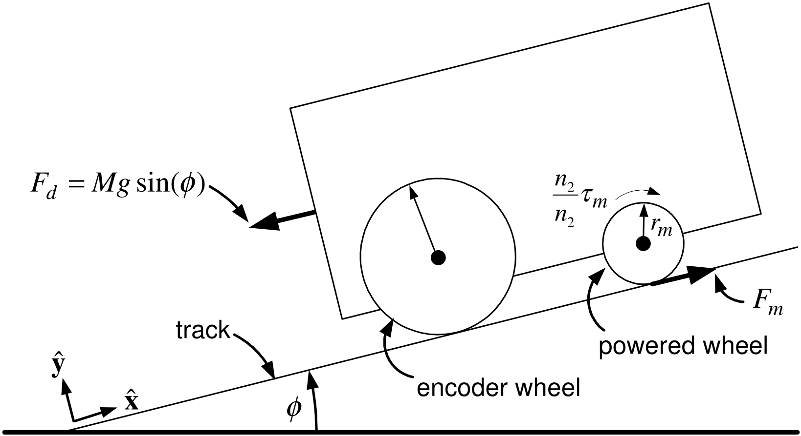

**Motor Parameters**

-   $K_{T}=K_{b}$ the torque constant (back-emf constant).

-   $R$ the armature resistance of the DC motor.

-   $n_{2}/n_{1}$ is the gear ratio.

-   Etc.

**Motor Variables**

-   $V(t)$ is the voltage applied to the DC motor of the cart's powered wheel.

-   $x$ is the cart position along the track.

-   $v=dx/dt$ is the cart's velocity.

-   $F_{d}(t)=Mg\sin (\phi )$ is the force (disturbance) on the cart due to gravity.
:::

---

::: {.compact-slide .dense-slide}

Trajectory Tracking of a Cart on a Track

**Transfer Function Model**

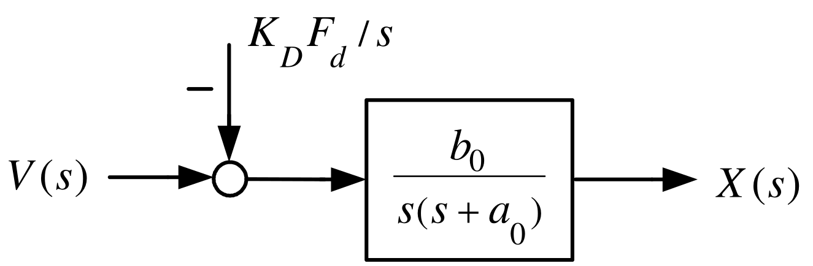

$$a_{0}\triangleq \frac{K_{b}K_{T}\left( \dfrac{n_{2}}{n_{1}}\dfrac{1}{r_{m}}
\right) ^{2}}{RJ/r_{m}^{2}+RM},b_{0}\triangleq \frac{K_{T}\dfrac{
n_{2}}{n_{1}}\dfrac{1}{r_{m}}}{RJ/r_{m}^{2}+RM},K_{D}\triangleq
\frac{R}{K_{T}\dfrac{n_{2}}{n_{1}}\dfrac{1}{r_{m}}},\text{}b_{0}K_{D}=
\dfrac{1}{J/r_{m}^{2}+M}$$

-   $K_{D}F_{d}=K_{D}Mg\sin (\phi )$ is an input voltage.

    It produces the same effect on the cart's position $x(t)$ and speed $v(t)$ as $F_{d}.$

-   $b_{0}K_{D}F_{d}=\dfrac{Mg\sin (\phi )}{J/r_{m}^{2}+M}$ is the acceleration of the cart due to gravity.
:::

---

::: {.compact-slide .dense-slide}

Trajectory Tracking of a Cart on a Track

**Statespace Model** $$\begin{aligned}
\frac{dx}{dt} &=v \\
\frac{dv}{dt} &=-a_{0}v+b_{0}V(t)-\underset{d}{\underbrace{b_{0}K_{D}F_{d}}}
.
\end{aligned}$$ where $$d\triangleq b_{0}K_{D}F_{d}=\frac{Mg\sin (\phi )}{J/r_{m}^{2}+M}.$$

With $u\triangleq V(t)$ and $F_{d}=0$ this becomes $$\begin{aligned}
\frac{dx}{dt} &=v \\
\frac{dv}{dt} &=-a_{0}v+b_{0}u.
\end{aligned}$$

**Objective:**  Have the cart follow (track) a specified trajectory $(x_{ref}(t),v_{ref}(t))$.
:::

---

::: {.compact-slide .dense-slide}

Trajectory for $x_{ref}(t),v_{ref}(t)$

**Trajectory Specifications:** $$\begin{array}{lcl}
v_{ref}(0)\;=0 &  & \dot{v}_{ref}(0)\;=0 \\
v_{ref}(t_{1})=v_{\max } &  & \dot{v}_{ref}(t_{1})=0 \\
v_{ref}(t)\;\,=v_{\max } &  & t_{1}\leq t\leq t_{2} \\
v_{ref}(t_{2})=v_{\max } &  & \dot{v}_{ref}(t_{2})=0 \\
v_{ref}(t_{3})=0 &  & \dot{v}_{ref}(t_{3})=0.
\end{array}$$ and $$\begin{aligned}
v_{ref}(t) &=v_{ref}(t_{3}-t)\text{for}t_{2}\leq t\leq t_{3} \\
\int_{0}^{t_{3}}v_{ref}(\tau )d\tau &=x_{f}.
\end{aligned}$$
:::

---

::: {.compact-slide .dense-slide}

Trajectory for $x_{ref}(t),v_{ref}(t)$

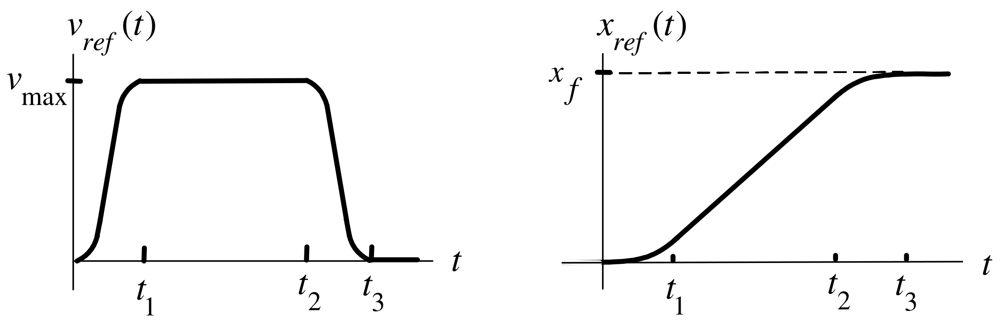

Try $$\begin{aligned}
v_{ref}(t) &=c_{1}t^{2}+c_{2}t^{3}\text{for}0\leq t\leq t_{1} \\
v_{ref}(0) &=0 \\
\dot{v}_{ref}(0) &=0.
\end{aligned}$$ At $t_{1}$ $$\begin{aligned}
v_{ref}(t_{1}) &=c_{1}t_{1}^{2}+c_{2}t_{1}^{3}=v_{\max } \\
\dot{v}_{ref}(t_{1}) &=2c_{1}t_{1}+3c_{2}t_{1}^{2}=0\text{}
\end{aligned}$$ or $$\left[
\begin{array}{cc}
t_{1}^{2} & t_{1}^{3} \\
2t_{1} & 3t_{1}^{2}
\end{array}
\right] \left[
\begin{array}{c}
c_{1} \\
c_{2}
\end{array}
\right] =\left[
\begin{array}{c}
v_{\max } \\
0
\end{array}
\right] .$$
:::

---

::: {.compact-slide .dense-slide .boundary-safe-slide}

Trajectory for $x_{ref}(t),v_{ref}(t)$

From previous slide: $$\left[
\begin{array}{cc}
t_{1}^{2} & t_{1}^{3} \\
2t_{1} & 3t_{1}^{2}
\end{array}
\right] \left[
\begin{array}{c}
c_{1} \\
c_{2}
\end{array}
\right] =\left[
\begin{array}{c}
v_{\max } \\
0
\end{array}
\right] .$$ $\Longrightarrow$ $$\left[
\begin{array}{c}
c_{1} \\
c_{2}
\end{array}
\right] =\frac{1}{t_{1}^{4}}\left[
\begin{array}{rr}
3t_{1}^{2} & -t_{1}^{3} \\
-2t_{1} & t_{1}^{2}
\end{array}
\right] \left[
\begin{array}{c}
v_{\max } \\
0
\end{array}
\right] =\left[
\begin{array}{c}
+3v_{\max }/t_{1}^{2} \\
-2v_{\max }/t_{1}^{3}
\end{array}
\right] .$$ $v_{ref}(t):$ $$v_{ref}(t)=\left\{
\begin{array}{lcl}
c_{1}t^{2}+c_{2}t^{3}\text{,} &  & 0\leq t\leq t_{1} \\
v_{\text{max}}, &  & t_{1}\leq t\leq t_{2} \\
c_{1}(t_{3}-t)^{2}+c_{2}(t_{3}-t)^{3}, &  & t_{2}\leq t\leq t_{3}
\end{array}
\right.$$
:::

---

::: {.compact-slide .dense-slide .boundary-safe-slide}

Trajectory for $x_{ref}(t),v_{ref}(t)$

**At time** $t_{1}$**:** $$x_{ref}(t_{1})=\int_{0}^{t_{1}}v_{ref}(\tau )d\tau =c_{1}\frac{t_{1}^{3}}{3}
+c_{2}\frac{t_{1}^{4}}{4}=\frac{3v_{\max }}{t_{1}^{2}}\frac{t_{1}^{3}}{3}-
\frac{2v_{\max }}{t_{1}^{3}}\frac{t_{1}^{4}}{4}=\frac{v_{\max }t_{1}}{2}.$$ **Total distance traveled:** $$x_{f}=\int_{0}^{t_{3}}v_{ref}(\tau )d\tau =2x_{ref}(t_{1})+v_{\max
}(t_{2}-t_{1})=2\frac{v_{\max }t_{1}}{2}+v_{\max }(t_{2}-t_{1})=v_{\max
}t_{2}.$$

$\mathbf{x}_{\mathbf{ref}}\mathbf{(t):}$ $$x_{ref}(t)=\left\{
\begin{array}{lcl}
c_{1}t^{3}/3+c_{2}t^{4}/4, &  & 0\leq t\leq t_{1} \\
v_{\text{max}}t_{1}/2+v_{\text{max}}(t-t_{1}), &  & t_{1}\leq t\leq t_{2} \\
v_{\text{max}}t_{2}-c_{1}(t_{3}-t)^{3}/3-c_{2}(t_{3}-t)^{4}/4, &  &
t_{2}\leq t\leq t_{3}.
\end{array}
\right.$$
:::

---

::: {.compact-slide .multi-figure-slide}

Trajectory for $\alpha _{ref}(t),j_{ref}(t)$

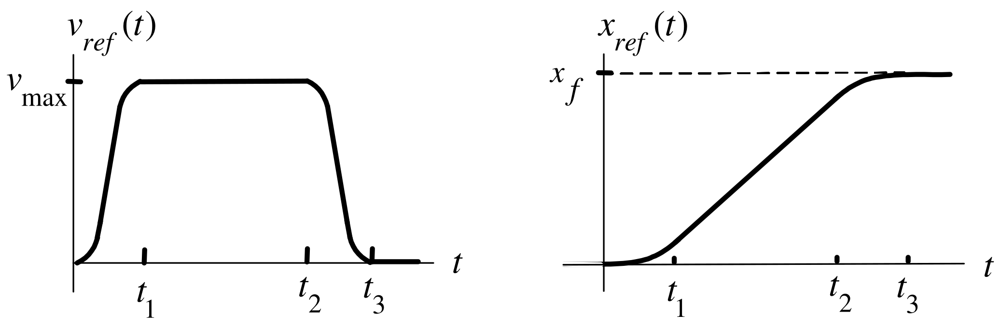

$$\alpha _{ref}(t)=\left\{
\begin{array}{lcl}
2c_{1}t+3c_{2}t^{2}, &  & 0\leq t\leq t_{1} \\
0, &  & t_{1}\leq t\leq t_{2} \\
-2c_{1}(t_{3}-t)-3c_{2}(t_{3}-t)^{2}, &  & t_{2}\leq t\leq t_{3}.
\end{array}
\right.$$

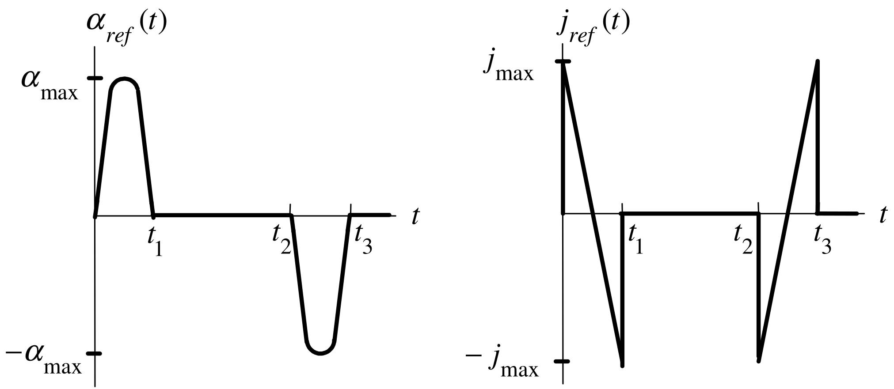

:::

---

::: {.compact-slide .dense-slide}

Full Trajectory for the Cart

The equations for the cart are $$\begin{aligned}
\frac{dx}{dt} &=v \\
\frac{dv}{dt} &=-a_{0}v+b_{0}u.
\end{aligned}$$ The trajectory $x_{ref}(t),v_{ref}(t)$ along with the input reference $u_{ref}(t)$ must satisfy $$\begin{aligned}
\frac{dx_{ref}}{dt} &=v_{ref} \\
\underset{\alpha _{ref}}{\underbrace{\frac{dv_{ref}}{dt}}}
&=-a_{0}v_{ref}+b_{0}u_{ref}.
\end{aligned}$$ Choose $u_{ref}$ as $$u_{ref}(t)\triangleq \frac{\alpha _{ref}(t)+a_{0}v_{ref}(t)}{b_{0}}.$$
:::

---

::: {.compact-slide .dense-slide}

Design of a State Feedback Tracking Controller

**Cart Model:** $d\triangleq b_{0}K_{D}F_{d}=Mg\sin (\phi )/(J/r_{m}^{2}+M)$. $$\begin{aligned}
dx/dt &=v \\
dv/dt &=-a_{0}v+b_{0}u(t)-d
\end{aligned}$$

**Reference trajectory and input:** $$\begin{aligned}
dx_{ref}/dt &=v_{ref} \\
dv_{ref}/dt &=-a_{0}v_{ref}+b_{0}u_{ref}(t)
\end{aligned}$$

**Error State Model:** $$\begin{aligned}
\epsilon _{1}(t) &\triangleq &x_{ref}(t)-x(t) \\
\epsilon _{2}(t) &\triangleq &v_{ref}(t)-v(t) \\
d\epsilon _{1}/dt &=\epsilon _{2} \\
d\epsilon _{2}/dt &=-a_{0}\epsilon _{2}+b_{0}w+d
\end{aligned}$$ where $$w(t)\triangleq u_{ref}(t)-u(t).$$
:::

---

::: {.compact-slide .dense-slide}

Design of a State Feedback Tracking Controller

$$\begin{aligned}
\epsilon _{1}(t) &\triangleq &x_{ref}(t)-x(t) \\
\epsilon _{2}(t) &\triangleq &v_{ref}(t)-v(t) \\
d\epsilon _{1}/dt &=\epsilon _{2} \\
d\epsilon _{2}/dt &=-a_{0}\epsilon _{2}+b_{0}w+d
\end{aligned}$$

In matrix form: $$\frac{d}{dt}\left[
\begin{array}{c}
\epsilon _{1} \\
\epsilon _{2}
\end{array}
\right] =\underset{A}{\underbrace{\left[
\begin{array}{cc}
0 & 1 \\
0 & -a_{0}
\end{array}
\right] }}\left[
\begin{array}{c}
\epsilon _{1} \\
\epsilon _{2}
\end{array}
\right] +\underset{b}{\underbrace{\left[
\begin{array}{c}
0 \\
b_{0}
\end{array}
\right] }}w+\left[
\begin{array}{c}
0 \\
1
\end{array}
\right] d.$$

With $d=0$: $$\frac{d\epsilon }{dt}=A\epsilon +bw$$
:::

---

::: {.compact-slide .dense-slide}

Design of a State Feedback Tracking Controller

**Control Problem:** With $$\frac{d\epsilon }{dt}=A\epsilon +bw$$ find $k$ such that $$w=-\left[
\begin{array}{cc}
k_{1} & k_{2}
\end{array}
\right] \left[
\begin{array}{c}
\epsilon _{1} \\
\epsilon _{2}
\end{array}
\right]$$ results in $$\frac{d\epsilon }{dt}=(A-bk)\epsilon$$ being *stable*, i.e., $$\epsilon (t)=e^{(A-bk)t}\left[
\begin{array}{c}
\epsilon _{1}(0) \\
\epsilon _{2}(0)
\end{array}
\right] \rightarrow \left[
\begin{array}{c}
0 \\
0
\end{array}
\right] .$$

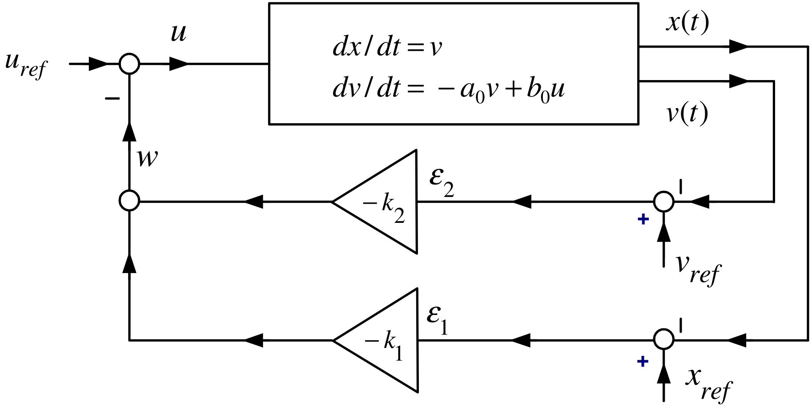

:::

---

::: {.compact-slide .dense-slide .boundary-safe-slide}

Design of a State Feedback Tracking Controller

**Choosing** $k$ $$\begin{aligned}
e^{(A-bk)t} &=\mathcal{L}^{-1}\left\{ \left( sI-
(A-bk)\right) ^{-1}\right\} \\
&=\mathcal{L}^{-1}\left\{ \left( s\left[
\begin{array}{cc}
1 & 0 \\
0 & 1
\end{array}
\right] -\left( \left[
\begin{array}{cc}
0 & 1 \\
0 & -a_{0}
\end{array}
\right] -\left[
\begin{array}{c}
0 \\
b_{0}
\end{array}
\right] \left[
\begin{array}{cc}
k_{1} & k_{2}
\end{array}
\right] \right) \right) ^{-1}\right\} \\
&=\mathcal{L}^{-1}\left\{ \left[
\begin{array}{cc}
s & -1 \\
b_{0}k_{1} & s+a_{0}+b_{0}k_{2}
\end{array}
\right] ^{-1}\right\} \\
&=\mathcal{L}^{-1}\left\{ \frac{1}{\det \left( sI-
(A-bk)\right) }\left[
\begin{array}{cc}
s+a_{0}+b_{0}k_{2} & 1 \\
-b_{0}k_{1} & s
\end{array}
\right] \right\} .
\end{aligned}$$ Now $$\begin{aligned}
\det \left( sI-(A-bk)\right) =\det \left[
\begin{array}{cc}
s & -1 \\
b_{0}k_{1} & s+a_{0}+b_{0}k_{2}
\end{array}
\right] &=s(s+a_{0}+b_{0}k_{2})+b_{0}k_{1} \\
&=s^{2}+(a_{0}+b_{0}k_{2})s+b_{0}k_{1}.
\end{aligned}$$ With $r_{1}>0,r_{2}>0$, choose $k_{1},k_{2}$ so that $$s^{2}+(a_{0}+b_{0}k_{2})s+b_{0}k_{1}=(s+r_{1})(s+r_{2})=s^{2}+(r_{1}+r_{2})s+r_{1}r_{2}.$$
:::

---

::: {.compact-slide .dense-slide .boundary-safe-slide}

Design of a State Feedback Tracking Controller

**Choosing** $k$

Then $$s^{2}+(a_{0}+b_{0}k_{2})s+b_{0}k_{1}=(s+r_{1})(s+r_{2})=s^{2}+(r_{1}+r_{2})s+r_{1}r_{2}.$$

requires $$k_{1}=\frac{r_{1}r_{2}}{b_{0}},k_{2}=\frac{r_{1}+r_{2}-a_{0}}{b_{0}
}.$$ We have $$\begin{aligned}
\left. e^{(A-bk)t}\right\vert _{\substack{
k_{1}=r_{1}r_{2}/b_{0}  \\
k_{2}=(r_{1}+r_{2}-a_{0})/b_{0} }} &=\mathcal{L}^{-1}\left\{ \frac{1}{
(s+r_{1})(s+r_{2})}\left[
\begin{array}{cc}
s+a_{0}+b_{0}k_{2} & 1 \\
-b_{0}k_{1} & s
\end{array}
\right] \right\} \\
&=\mathcal{L}^{-1}\left\{ \left[
\begin{array}{cc}
\dfrac{s+a_{0}+b_{0}k_{2}}{(s+r_{1})(s+r_{2})} & \dfrac{1}{(s+r_{1})(s+r_{2})
} \\
&  \\
\dfrac{-b_{0}k_{1}}{(s+r_{1})(s+r_{2})} & \dfrac{s}{(s+r_{1})(s+r_{2})}
\end{array}
\right] \right\}
\end{aligned}$$ $\Longrightarrow$ $$\begin{aligned}
\left. e^{(A-bk)t}\right\vert _{\substack{
k_{1}=r_{1}r_{2}/b_{0}  \\
k_{2}=(r_{1}+r_{2}-a_{0})/b_{0} }} &=\left[
\begin{array}{cc}
A_{11}e^{-r_{1}t}+B_{11}e^{-r_{2}t} & A_{12}e^{-r_{1}t}+B_{12}e^{-r_{2}t} \\
A_{21}e^{-r_{1}t}+B_{21}e^{-r_{2}t} & A_{22}e^{-r_{1}t}+B_{22}e^{-r_{2}t}
\end{array}
\right] \\
&\rightarrow &0_{2\times 2}.
\end{aligned}$$
:::

---

::: {.compact-slide .dense-slide .boundary-safe-slide}

Design of a State Feedback Tracking Controller

**Key observation**

Chose $k_{1}$ and $k_{2}$ so that $$\left. \det \left( sI-(A-bk)\right) \right\vert _{\substack{
k_{1}=r_{1}r_{2}/b_{0}  \\
k_{2}=(r_{1}+r_{2}-a_{0})/b_{0}}}=(s+r_{1})(s+r_{2}).$$

$\Longrightarrow$ Every component of the $2\times 2$ matrix $$\left( sI-(A-bk)\right) ^{-1}=\frac{1}{(s+r_{1})(s+r_{2})}\left[
\begin{array}{cc}
s+a_{0}+b_{0}k_{2} & 1 \\
-b_{0}k_{1} & s
\end{array}
\right]$$

has its poles at $-r_{1},-r_{2}$.

$\Longrightarrow$ $$e^{(A-bk)t}=\mathcal{L}^{-1}\left\{ \frac{1}{(s+r_{1})(s+r_{2})}\left[
\begin{array}{cc}
s+a_{0}+b_{0}k_{2} & 1 \\
-b_{0}k_{1} & s
\end{array}
\right] \right\} \rightarrow 0_{2\times 2}.$$

-   The row vector $k$ must be chosen so that the roots of $$\det \left( sI-(A-bk)\right) =0$$ are in the *open* left half-plane resulting in $A-bk\in \mathbb{R} ^{2\times 2}$ being a *stable* matrix.
:::

---

::: {.compact-slide .dense-slide}

General State Feedback Trajectory Tracking

**Model** $$\frac{dx}{dt}=Ax+bu,A\in
\mathbb{R}
^{n\times n},b\in
\mathbb{R}
^{n}.$$

**Trajectory** $x_{d}$** and reference input** $u_{d}$** satisfy** $$\frac{dx_{d}}{dt}=Ax_{d}+bu_{d}.$$

**Error State** $$\epsilon \triangleq x_{d}-x$$

**Input Error** $$w\triangleq u_{d}-u$$

**Error Dynamics** $$\frac{d}{dt}(x_{d}-x)=A(x_{d}-x)+b(u_{d}-u)$$ or $$\frac{d}{dt}\epsilon =A\epsilon +bw.$$
:::

---

::: {.compact-slide .dense-slide}

General State Feedback Trajectory Tracking

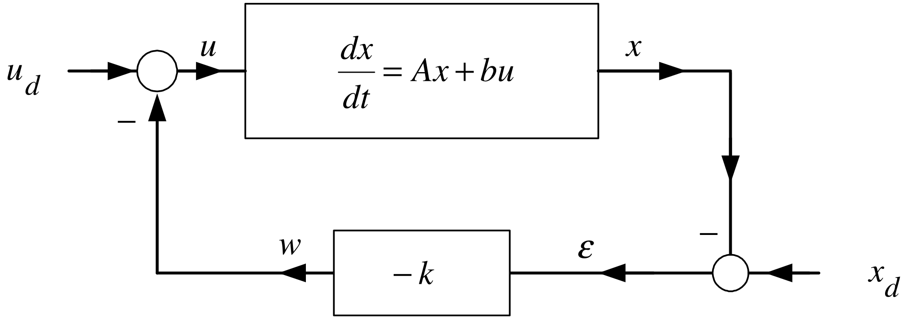

With $\epsilon \triangleq x_{d}-x$ and $w\triangleq u_{d}-u$ $$\frac{d}{dt}\epsilon =A\epsilon +bw.$$

Choose $w=-k\epsilon$ to obtain $$\begin{aligned}
\frac{d}{dt}\epsilon &=(A-bk)\epsilon  \\
\Longrightarrow \left[
\begin{array}{c}
\epsilon (t) \\
\end{array}
\right] &=\left[
\begin{array}{ccc}
&  &  \\
& e^{(A-bk)t} &  \\
&  &
\end{array}
\right] \left[
\begin{array}{c}
\epsilon (0) \\
\end{array}
\right] .
\end{aligned}$$

Need to find $k$ such that $$e^{(A-bk)t}\rightarrow 0_{n\times n}.$$
:::

---

::: {.compact-slide}

General State Feedback Trajectory Tracking

Recall that $$e^{(A-bk)t}\rightarrow 0_{n\times n}$$

if and only if the roots of $$\det (sI-(A-bk))=0$$ are in the *open left half-plane*.

**Equivalent Formulation**  With $$r(t)\triangleq u_{d}(t)+kx_{d}(t)$$ the block diagram

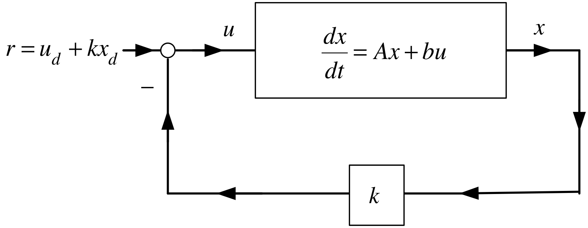

is equivalent to the block diagram on the previous slide.
:::

---

::: {.compact-slide}

Matrix Inverse

Define $A\in \mathbb{R} ^{3\times 3}$ $$A\triangleq \left[
\begin{array}{ccc}
a_{11} & a_{12} & a_{13} \\
a_{21} & a_{22} & a_{23} \\
a_{31} & a_{32} & a_{33}
\end{array}
\right]$$

Define the *sign* matrix $S$ as $$S\triangleq \left[
\begin{array}{rrr}
1 & -1 & 1 \\
-1 & 1 & -1 \\
1 & -1 & 1
\end{array}
\right] .$$

That is, the $(i,j)$ component $s_{ij}$ of $S$ is given by $s_{ij}=(-1)^{i+j}$.
:::

---

::: {.compact-slide .dense-slide .boundary-safe-slide}

Cofactor Matrix

$$A\triangleq \left[
\begin{array}{ccc}
a_{11} & a_{12} & a_{13} \\
a_{21} & a_{22} & a_{23} \\
a_{31} & a_{32} & a_{33}
\end{array}
\right] \text{define}cof(A)\triangleq \left[
\begin{array}{ccc}
b_{11} & b_{12} & b_{13} \\
b_{21} & b_{22} & b_{23} \\
b_{31} & b_{32} & b_{33}
\end{array}
\right] \in
\mathbb{R}
^{3\times 3}$$ $$\begin{aligned}
b_{11} &=\underset{s_{11}}{\underbrace{1}}\cdot \det \left[
\begin{array}{cc}
a_{22} & a_{23} \\
a_{32} & a_{33}
\end{array}
\right] ,b_{12}=\underset{s_{12}}{\underbrace{-1}}\cdot \det
\left[
\begin{array}{cc}
a_{21} & a_{23} \\
a_{31} & a_{33}
\end{array}
\right] , \\
b_{13} &=\underset{s_{13}}{\underbrace{1}}\cdot \det \left[
\begin{array}{cc}
a_{21} & a_{22} \\
a_{31} & a_{32}
\end{array}
\right] \\
b_{21} &=\underset{s_{21}}{\underbrace{-1}}\cdot \det \left[
\begin{array}{cc}
a_{12} & a_{13} \\
a_{32} & a_{33}
\end{array}
\right] ,b_{22}=\underset{s_{22}}{\underbrace{1}}\cdot \det
\left[
\begin{array}{cc}
a_{11} & a_{13} \\
a_{31} & a_{33}
\end{array}
\right] , \\
b_{23} &=\underset{s_{23}}{\underbrace{-1}}\cdot \det \left[
\begin{array}{cc}
a_{11} & a_{12} \\
a_{31} & a_{32}
\end{array}
\right] \\
b_{31} &=\underset{s31}{\underbrace{1}}\cdot \det \left[
\begin{array}{cc}
a_{12} & a_{13} \\
a_{22} & a_{23}
\end{array}
\right] ,b_{32}=\underset{s_{32}}{\underbrace{-1}}\cdot \det
\left[
\begin{array}{cc}
a_{11} & a_{13} \\
a_{21} & a_{23}
\end{array}
\right] , \\
b_{33} &=\underset{s_{33}}{\underbrace{1}}\cdot \det \left[
\begin{array}{cc}
a_{11} & a_{12} \\
a_{21} & a_{22}
\end{array}
\right] .
\end{aligned}$$
:::

---

::: {.compact-slide .dense-slide .boundary-safe-slide}

Adjoint Matrix

$$adj(A)\triangleq cof^{T}(A)\in
\mathbb{R}
^{3\times 3}$$

**Inverse Matrix**

$$A\triangleq \left[
\begin{array}{ccc}
a_{11} & a_{12} & a_{13} \\
a_{21} & a_{22} & a_{23} \\
a_{31} & a_{32} & a_{33}
\end{array}
\right]$$

$$\det A=\underset{s_{11}}{\underbrace{1}}\cdot a_{11}\det \left[
\begin{array}{cc}
a_{22} & a_{23} \\
a_{32} & a_{33}
\end{array}
\right] +\underset{s_{12}}{\underbrace{-1}}\cdot a_{12}\det \left[
\begin{array}{cc}
a_{21} & a_{23} \\
a_{31} & a_{33}
\end{array}
\right] +\underset{s_{13}}{\underbrace{1}}\cdot a_{13}\det \left[
\begin{array}{cc}
a_{21} & a_{22} \\
a_{31} & a_{32}
\end{array}
\right]$$ $$\begin{aligned}
A^{-1} &=\frac{1}{\det A}adj(A). \\
&&
\end{aligned}$$

-   We are assuming that $\det (A)\neq 0$.

    If $\det (A)=0$ then $A$ does *not* have an inverse.

-   This computation of $A^{-1}$ *not* numerically efficient. It is for *theoretical* purposes.
:::

---

::: {.compact-slide .dense-slide .boundary-safe-slide}

Example

*Inverse of a Matrix*

$$A=\left[
\begin{array}{ccc}
0 & 1 & 0 \\
0 & 0 & 1 \\
-\alpha _{0} & -\alpha _{1} & -\alpha _{2}
\end{array}
\right] \qquad{}S\triangleq \left[
\begin{array}{rrr}
1 & -1 & 1 \\
-1 & 1 & -1 \\
1 & -1 & 1
\end{array}
\right]$$

Compute $(sI-A)^{-1}.$ $$sI-A=s\left[
\begin{array}{ccc}
1 & 0 & 0 \\
0 & 1 & 0 \\
0 & 0 & 1
\end{array}
\right] -\left[
\begin{array}{ccc}
0 & 1 & 0 \\
0 & 0 & 1 \\
-\alpha _{0} & -\alpha _{1} & -\alpha _{2}
\end{array}
\right] =\left[
\begin{array}{ccc}
s & -1 & 0 \\
0 & s & -1 \\
\alpha _{0} & \alpha _{1} & s+\alpha _{2}
\end{array}
\right] .$$

Evaluate $\det (sI-A)$ via the $1^{st}$ column: $$\begin{aligned}
\det (sI-A) &=\underset{s_{11}}{\underbrace{(1)}}(s)\det \left[
\begin{array}{cc}
s & -1 \\
\alpha _{1} & s+\alpha _{2}
\end{array}
\right] +\underset{s_{21}}{\underbrace{(-1)}}(0)\det \left[
\begin{array}{cc}
-1 & 0 \\
\alpha _{1} & s+\alpha _{2}
\end{array}
\right] \\
&&+\underset{s_{31}}{\underbrace{(1)}}(\alpha _{0})\det \left[
\begin{array}{cc}
-1 & 0 \\
s & -1
\end{array}
\right] \\
&=s^{3}+\alpha _{2}s^{2}+\alpha _{1}s+\alpha _{0}.
\end{aligned}$$
:::

---

::: {.compact-slide .dense-slide .boundary-safe-slide}

Example

*Inverse of a Matrix*  **(continued)**

Adjoint of $sI-A=\left[ \begin{array}{ccc} s & -1 & 0 \\ 0 & s & -1 \\ \alpha _{0} & \alpha _{1} & s+\alpha _{2} \end{array} \right] .\qquad{}S\triangleq \left[ \begin{array}{rrr} 1 & -1 & 1 \\ -1 & 1 & -1 \\ 1 & -1 & 1 \end{array} \right] .$ $$\begin{aligned}
&&b_{11}=1\cdot \det \left[
\begin{array}{cc}
s & -1 \\
\alpha _{1} & s+\alpha _{2}
\end{array}
\right] ,\text{}b_{12}=-1\cdot \det \left[
\begin{array}{cc}
0 & -1 \\
\alpha _{0} & s+\alpha _{2}
\end{array}
\right] ,\text{}b_{13}=1\cdot \det \left[
\begin{array}{cc}
0 & s \\
\alpha _{0} & \alpha _{1}
\end{array}
\right] \\
&&b_{21}=-1\cdot \det \left[
\begin{array}{cc}
-1 & 0 \\
\alpha _{1} & s+\alpha _{2}
\end{array}
\right] ,\text{}b_{22}=1\cdot \det \left[
\begin{array}{cc}
s & 0 \\
\alpha _{0} & s+\alpha _{2}
\end{array}
\right] ,\text{}b_{23}=-1\cdot \det \left[
\begin{array}{cc}
s & -1 \\
\alpha _{0} & \alpha _{1}
\end{array}
\right] \\
&&b_{31}=1\cdot \det \left[
\begin{array}{cc}
-1 & 0 \\
s & -1
\end{array}
\right] ,b_{32}=-1\cdot \det \left[
\begin{array}{cc}
s & 0 \\
0 & -1
\end{array}
\right] ,b_{33}=1\cdot \det \left[
\begin{array}{cc}
s & -1 \\
0 & s
\end{array}
\right] .
\end{aligned}$$ $$\begin{aligned}
\Longrightarrow cof(sI-A) &=\left[
\begin{array}{ccc}
s^{2}+\alpha _{2}s+\alpha _{1} & -\alpha _{0} & -\alpha _{0}s \\
s+\alpha _{2} & s^{2}+\alpha _{2}s & -\alpha _{1}s-\alpha _{0} \\
1 & s & s^{2}
\end{array}
\right] \\
\Longrightarrow adj(sI-A)=cof^{T}(sI-A) &=\left[
\begin{array}{ccc}
s^{2}+\alpha _{2}s+\alpha _{1} & s+\alpha _{2} & 1 \\
-\alpha _{0} & s^{2}+\alpha _{2}s & s \\
-\alpha _{0}s & -\alpha _{1}s-\alpha _{0} & s^{2}
\end{array}
\right] .
\end{aligned}$$
:::

---

::: {.compact-slide .dense-slide .boundary-safe-slide}

Example

*Inverse of a Matrix*  **(continued)**

$$\begin{aligned}
(sI-A)^{-1} &=\frac{1}{\det (sI-A)}adj(sI-A) \\
&=\frac{1}{s^{3}+\alpha _{2}s^{2}+\alpha _{1}s+\alpha _{0}}\left[
\begin{array}{ccc}
s^{2}+\alpha _{2}s+\alpha _{1} & s+\alpha _{2} & 1 \\
-\alpha _{0} & s^{2}+\alpha _{2}s & s \\
-\alpha _{0}s & -\alpha _{1}s-\alpha _{0} & s^{2}
\end{array}
\right] .
\end{aligned}$$

**Alternative Expression** $$\begin{aligned}
(sI-A)^{-1} &=\frac{1}{s^{3}+\alpha _{2}s^{2}+\alpha _{1}s+\alpha _{0}}
\times \\
&&\left( \underset{N_{2}}{\underbrace{\left[
\begin{array}{ccc}
1 & 0 & 0 \\
0 & 1 & 0 \\
0 & 0 & 1
\end{array}
\right] }}s^{2}+\underset{N_{1}}{\underbrace{\left[
\begin{array}{ccc}
\alpha _{2} & 1 & 0 \\
0 & \alpha _{2} & 1 \\
-\alpha _{0} & -\alpha _{1} & 0
\end{array}
\right] }}s+\underset{N_{0}}{\underbrace{\left[
\begin{array}{ccc}
\alpha _{1} & \alpha _{2} & 1 \\
-\alpha _{0} & 0 & 0 \\
0 & -\alpha _{0} & 0
\end{array}
\right] }}\right) \\
&=\frac{1}{\det (sI-A)}(N_{2}s^{2}+N_{1}s+N_{0}).
\end{aligned}$$
:::

---

::: {.compact-slide .dense-slide}

Properties of Matrix Inverses

**(1)** Let $A\in \mathbb{R} ^{n\times n},B\in \mathbb{R} ^{n\times n}$ be two matrices. Then $$\det (AB)=\det (A)\det (B).$$

**Proof omitted**

**(2)** Let $A\in \mathbb{R} ^{n\times n},B\in \mathbb{R} ^{n\times n}$ be invertible, that is, $\det (A)\neq 0,\det (B)\neq 0$. Then $$(AB)^{-1}=B^{-1}A^{-1}.$$

This is because $$(AB)(B^{-1}A^{-1})=A(BB^{-1})A^{-1}=AIA^{-1}=AA^{-1}=I$$

**(3)** Let $A\in \mathbb{R} ^{n\times n}$ with $\det (A)\neq 0$. Then $$\det (A^{-1})=\frac{1}{\det A}.$$

As $AA^{-1}=I\Longrightarrow (\det A)(\det A^{-1})=\det I=1\Longrightarrow \det (A^{-1})=1/\det A$
:::

---

::: {.compact-slide .dense-slide}

Cayley-Hamilton Theorem

Let $A\in \mathbb{R} ^{3\times 3}$ with $$\det (sI-A)=s^{3}+\alpha _{2}s^{2}+\alpha _{1}s+\alpha _{0}$$ write $$(sI-A)^{-1}=\frac{1}{\det (sI-A)}adj(sI-A)=\frac{1}{\det (sI-A)}
(N_{2}s^{2}+N_{1}s+N_{0})$$ or $$\det (sI-A)I=(sI-A)(N_{2}s^{2}+N_{1}s+N_{0})$$ or $$\begin{aligned}
(s^{3}+\alpha _{2}s^{2}+\alpha _{1}s+\alpha _{0})I
&=(sI-A)(N_{2}s^{2}+N_{1}s+N_{0}) \\
&=s^{3}N_{2}+(N_{1}-AN_{2})s^{2}+(N_{0}-AN_{1})s-AN_{0}.
\end{aligned}$$
:::

---

::: {.compact-slide .dense-slide}

Cayley-Hamilton Theorem

From previous slide: $$(s^{3}+\alpha _{2}s^{2}+\alpha _{1}s+\alpha
_{0})I=s^{3}N_{2}+(N_{1}-AN_{2})s^{2}+(N_{0}-AN_{1})s-AN_{0}.$$

Equate powers of $s$ $$\begin{aligned}
I &\mathbf{=}&N_{2} \\
\alpha _{2}I &\mathbf{=}&N_{1}-AN_{2} \\
\alpha _{1}I &\mathbf{=}&N_{0}-AN_{1} \\
\alpha _{0}I &=-AN_{0}.
\end{aligned}$$ Then $$\begin{aligned}
\alpha _{0}I=-AN_{0}=-A\left( \alpha _{1}I\mathbf{+}AN_{1}\right) =-\alpha
_{1}A\mathbf{-}A^{2}N_{1} &=-\alpha _{1}A-A^{2}\left( \alpha _{2}I\mathbf{+}
AN_{2}\right) \\
&=-\alpha _{1}A-\alpha _{2}A^{2}-A^{3}
\end{aligned}$$ or $$A^{3}+\alpha _{2}A^{2}+\alpha _{1}A+\alpha _{0}I=0_{3\times 3}.$$

-   This is the *Cayley-Hamilton* Theorem.
:::

---

::: {.compact-slide .dense-slide .boundary-safe-slide}

Example

*Cayley-Hamilton Theorem*

$$A=\left[
\begin{array}{ccc}
0 & 1 & 0 \\
0 & 0 & 1 \\
-\alpha _{0} & -\alpha _{1} & -\alpha _{2}
\end{array}
\right] ,\text{}\det (sI-A)=s^{3}+\alpha _{2}s^{2}+\alpha _{1}s+\alpha
_{0}.$$

$$\begin{aligned}
&&\left[
\begin{array}{ccc}
0 & 1 & 0 \\
0 & 0 & 1 \\
-\alpha _{0} & -\alpha _{1} & -\alpha _{2}
\end{array}
\right] ^{3}+\alpha _{2}\left[
\begin{array}{ccc}
0 & 1 & 0 \\
0 & 0 & 1 \\
-\alpha _{0} & -\alpha _{1} & -\alpha _{2}
\end{array}
\right] ^{2}+\alpha _{1}\left[
\begin{array}{ccc}
0 & 1 & 0 \\
0 & 0 & 1 \\
-\alpha _{0} & -\alpha _{1} & -\alpha _{2}
\end{array}
\right] +\alpha _{0}\left[
\begin{array}{ccc}
1 & 0 & 0 \\
0 & 1 & 0 \\
0 & 0 & 1
\end{array}
\right] \\
&=\left[
\begin{array}{ccc}
-\alpha _{0} & -\alpha _{1} & -\alpha _{2} \\
\alpha _{0}\alpha _{2} & \alpha _{1}\alpha _{2}-\alpha _{0} & \alpha
_{2}^{2}-\alpha _{1} \\
\alpha _{0}\alpha _{1}-\alpha _{0}\alpha _{2}^{2} & \alpha _{1}^{2}-\alpha
_{1}\alpha _{2}^{2}+\alpha _{0}\alpha _{2} & -\alpha _{2}^{3}+2\alpha
_{1}\alpha _{2}-\alpha _{0}
\end{array}
\right] + \\
&&\alpha _{2}\left[
\begin{array}{ccc}
0 & 0 & 1 \\
-\alpha _{0} & -\alpha _{1} & -\alpha _{2} \\
\alpha _{0}\alpha _{2} & \alpha _{1}\alpha _{2}-\alpha _{0} & \alpha
_{2}^{2}-\alpha _{1}
\end{array}
\right] +\alpha _{1}\left[
\begin{array}{ccc}
0 & 1 & 0 \\
0 & 0 & 1 \\
-\alpha _{0} & -\alpha _{1} & -\alpha _{2}
\end{array}
\right] +\alpha _{0}\left[
\begin{array}{ccc}
1 & 0 & 0 \\
0 & 1 & 0 \\
0 & 0 & 1
\end{array}
\right] \\
&=\left[
\begin{array}{ccc}
0 & 0 & 0 \\
0 & 0 & 0 \\
0 & 0 & 0
\end{array}
\right] .
\end{aligned}$$
:::

---

::: {.compact-slide .dense-slide}

Characteristic Polynomial and Eigenvalues

Let $A\in \mathbb{R} ^{n\times n}$.

**Definition** *Characteristic Polynomial*

$\det (sI-A)$ is called the *characteristic polynomial* of $A$.

**Definition** *Eigenvalues*

The roots of $$\det (sI-A)=0$$ are called the *characteristic values* or *eigenvalues* of $A$ .

**Remark** The word "eigen" is German for "characteristic".

**Definition** *Stable Matrix*

If the eigenvalues of $A$ are in the open left-half plane, then $A$ is a *stable* matrix.
:::

---

::: {.compact-slide .dense-slide .boundary-safe-slide}

Stabilization and State Feedback

$$\frac{d}{dt}\left[
\begin{array}{c}
x_{1} \\
x_{2} \\
x_{3}
\end{array}
\right] =\underset{A}{\underbrace{\left[
\begin{array}{ccc}
a_{11} & a_{12} & a_{13} \\
a_{21} & a_{22} & a_{23} \\
a_{31} & a_{32} & a_{33}
\end{array}
\right] }}\left[
\begin{array}{c}
x_{1} \\
x_{2} \\
x_{3}
\end{array}
\right] +\underset{b}{\underbrace{\left[
\begin{array}{c}
b_{1} \\
b_{2} \\
b_{3}
\end{array}
\right] }}u$$

Let $$u=-\underset{k}{\underbrace{\left[
\begin{array}{ccc}
k_{1} & k_{2} & k_{3}
\end{array}
\right] }}\left[
\begin{array}{c}
x_{1} \\
x_{2} \\
x_{3}
\end{array}
\right] .$$

Then $$\frac{dx}{dt}=(A-bk)x\Longrightarrow
x(t)=e^{(A-bk)t}x(0).$$

Note that $$\begin{aligned}
\left( sI-(A-bk)\right) ^{-1} &=\frac{1}{\det \left( sI-
(A-bk)\right) }adj\left( sI-(A-bk)\right) \in
\mathbb{R}
^{3\times 3} \\
e^{(A-bk)t} &=\mathcal{L}^{-1}\left\{ \frac{1}{\det \left( sI-\frac{{}}{
{}}(A-bk)\right) }adj\left( sI-(A-bk)\right) \right\} .
\end{aligned}$$
:::

---

::: {.compact-slide}

Stabilization and State Feedback

$$e^{(A-bk)t}=\mathcal{L}^{-1}\left\{ \frac{1}{\det \left( sI-
(A-bk)\right) }adj\left( sI-(A-bk)\right) \right\} .$$ Then $$e^{(A-bk)t}\rightarrow \left[
\begin{array}{ccc}
0 & 0 & 0 \\
0 & 0 & 0 \\
0 & 0 & 0
\end{array}
\right]$$

if and only if the roots of $$\det \left( sI-(A-bk)\right) =0$$

are in the *open left-half* plane, i.e., $A-bk$ is a stable matrix.
:::

---

::: {.compact-slide .dense-slide .boundary-safe-slide}

Example

*Control Canonical Form*

$$\frac{d}{dt}\left[
\begin{array}{c}
x_{1} \\
x_{2} \\
x_{3}
\end{array}
\right] =\underset{A}{\underbrace{\left[
\begin{array}{ccc}
0 & 1 & 0 \\
0 & 0 & 1 \\
-\alpha _{0} & -\alpha _{1} & -\alpha _{2}
\end{array}
\right] }}\left[
\begin{array}{c}
x_{1} \\
x_{2} \\
x_{3}
\end{array}
\right] +\underset{b}{\underbrace{\left[
\begin{array}{c}
0 \\
0 \\
1
\end{array}
\right] }}u$$

Recall that $$\det (sI-A)=s^{3}+\alpha _{2}s^{2}+\alpha _{1}s+\alpha _{0}.$$ Let $$u=-kx=-\left[
\begin{array}{ccc}
k_{1} & k_{2} & k_{3}
\end{array}
\right] \left[
\begin{array}{c}
x_{1} \\
x_{2} \\
x_{3}
\end{array}
\right] .$$

Then $$\frac{dx}{dt}=(A-bk)x\Longrightarrow
x(t)=e^{(A-bk)t}x(0).$$

-   Choose $k$ so that eigenvalues of $A-bk$ are in the open left-half plane.

    Then $$e^{(A-bk)t}\rightarrow 0_{3\times 3}.$$
:::

---

::: {.compact-slide .dense-slide .boundary-safe-slide}

Example

*Control Canonical Form*  **(continued)**

-   Choose $k$ so that eigenvalues of $A-bk$ are in the open left-half plane.

$$\begin{aligned}
sI-(A-bk) &=s\left[
\begin{array}{ccc}
1 & 0 & 0 \\
0 & 1 & 0 \\
0 & 0 & 1
\end{array}
\right] -\left( \left[
\begin{array}{ccc}
0 & 1 & 0 \\
0 & 0 & 1 \\
-\alpha _{0} & -\alpha _{1} & -\alpha _{2}
\end{array}
\right] -\left[
\begin{array}{c}
0 \\
0 \\
1
\end{array}
\right] \left[
\begin{array}{ccc}
k_{1} & k_{2} & k_{3}
\end{array}
\right] \right) \\
&=s\left[
\begin{array}{ccc}
1 & 0 & 0 \\
0 & 1 & 0 \\
0 & 0 & 1
\end{array}
\right] +\left[
\begin{array}{ccc}
0 & -1 & 0 \\
0 & 0 & -1 \\
\alpha _{0} & \alpha _{1} & \alpha _{2}
\end{array}
\right] +\left[
\begin{array}{ccc}
0 & 0 & 0 \\
0 & 0 & 0 \\
k_{1} & k_{2} & k_{3}
\end{array}
\right] \\
&=s\left[
\begin{array}{ccc}
1 & 0 & 0 \\
0 & 1 & 0 \\
0 & 0 & 1
\end{array}
\right] +\left[
\begin{array}{ccc}
0 & -1 & 0 \\
0 & 0 & -1 \\
k_{1}+\alpha _{0} & k_{2}+\alpha _{1} & k_{3}+\alpha _{2}
\end{array}
\right] \\
&=\left[
\begin{array}{ccc}
s & -1 & 0 \\
0 & s & -1 \\
k_{1}+\alpha _{0} & k_{2}+\alpha _{1} & s+k_{3}+\alpha _{2}
\end{array}
\right] .
\end{aligned}$$
:::

---

::: {.compact-slide .dense-slide .boundary-safe-slide}

Example

*Control Canonical Form*  **(continued)**

$$\begin{aligned}
\det \left( sI-(A-bk)\right)  &=\det
\left[
\begin{array}{ccc}
s & -1 & 0 \\
0 & s & -1 \\
k_{1}+\alpha _{0} & k_{2}+\alpha _{1} & s+k_{3}+\alpha _{2}
\end{array}
\right] \\
&=s\det \left[
\begin{array}{cc}
s & -1 \\
k_{2}+\alpha _{1} & s+k_{3}+\alpha _{2}
\end{array}
\right] -(-1)\det \left[
\begin{array}{cc}
0 & -1 \\
k_{1}+\alpha _{0} & s+k_{3}+\alpha _{2}
\end{array}
\right] \\
&=s\left( s(s+k_{3}+\alpha _{2})+k_{2}+\alpha _{1}\right)
+k_{1}+\alpha _{0} \\
&=s^{3}+(k_{3}+\alpha _{2})s^{2}+(k_{2}+\alpha _{1})s+k_{1}+\alpha _{0}.
\end{aligned}$$

With $r_{1}>0,r_{2}>0,r_{3}>0$ choose $k$ so that $$\begin{aligned}
\det \left( sI-(A-bk)\right) &=(s+r_{1})(s+r_{2})(s+r_{3}) \\
&=s^{3}+(r_{1}+r_{2}+r_{3})s^{2}+(r_{1}r_{2}+r_{1}r_{3}+r_{2}r_{3})s+r_{1}r_{2}r_{3}.
\end{aligned}$$
:::

---

::: {.compact-slide .dense-slide}

Example

*Control Canonical Form*  **(continued)**

$$\begin{aligned}
\det \left( sI-(A-bk)\right) &=s^{3}+(k_{3}+\alpha
_{2})s^{2}+(k_{2}+\alpha _{1})s+k_{1}+\alpha _{0} \\
&=s^{3}+(r_{1}+r_{2}+r_{3})s^{2}+(r_{1}r_{2}+r_{1}r_{3}+r_{2}r_{3})s+r_{1}r_{2}r_{3}
\end{aligned}$$

Set $$\begin{aligned}
k_{3}+\alpha _{2} &=r_{1}+r_{2}+r_{3} \\
k_{2}+\alpha _{1} &=r_{1}r_{2}+r_{1}r_{3}+r_{2}r_{3} \\
k_{1}+\alpha _{0} &=r_{1}r_{2}r_{3}
\end{aligned}$$ or $$\begin{aligned}
k_{3} &=r_{1}+r_{2}+r_{3}-\alpha _{2} \\
k_{2} &=r_{1}r_{2}+r_{1}r_{3}+r_{2}r_{3}-\alpha _{1} \\
k_{1} &=r_{1}r_{2}r_{3}-\alpha _{0}.
\end{aligned}$$
:::

---

::: {.compact-slide .dense-slide .boundary-safe-slide}

Example

*Control Canonical Form*  **(continued)**

Tedious calculations give

$\left( sI-(A-bk)\right) ^{-1}$ $$\begin{aligned}
&=\frac{1}{\det (sI-(A-bk))}\left[
\begin{array}{ccc}
s^{2}+s(\alpha _{2}+k_{3})+\alpha _{1}+k_{2} & s+\alpha _{2}+k_{3} & 1 \\
-\alpha _{0}-k_{1} & s^{2}+s(\alpha _{2}+k_{3}) & s \\
-s\alpha _{0}-sk_{1} & -s(\alpha _{1}+k_{2})-\alpha _{0}-k_{1} & s^{2}
\end{array}
\right] \\
&=\frac{1}{(s+r_{1})(s+r_{2})(s+r_{3})}\left[
\begin{array}{ccc}
s^{2}+s(\alpha _{2}+k_{3})+\alpha _{1}+k_{2} & s+\alpha _{2}+k_{3} & 1 \\
-\alpha _{0}-k_{1} & s^{2}+s(\alpha _{2}+k_{3}) & s \\
-s\alpha _{0}-sk_{1} & -s(\alpha _{1}+k_{2})-\alpha _{0}-k_{1} & s^{2}
\end{array}
\right] .
\end{aligned}$$

-   Each *component* of $\mathcal{L} ^{-1}\{\left( sI- (A-bk)\right) ^{-1}\}$ will be of the form $$Ae^{-r_{1}t}+Be^{-r_{2}t}+Ce^{-r_{3}t}.$$

-   Therefore $$e^{(A-bk)t}=\mathcal{L}^{-1}\left\{ \left( sI-(A-bk)\right)
    ^{-1}\right\} \rightarrow 0_{3\times 3}$$
:::

---

::: {.compact-slide .dense-slide .boundary-safe-slide}

Example

*Magnetic Levitation*

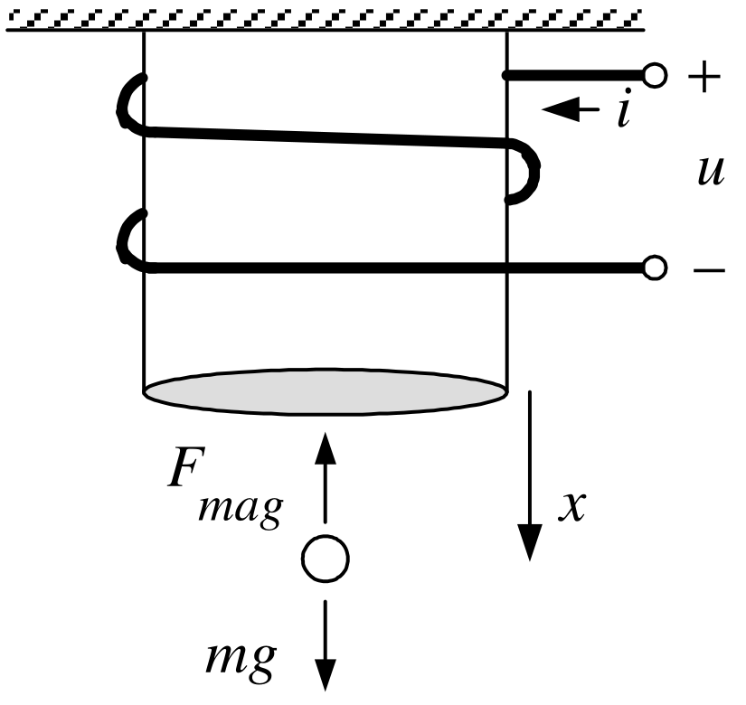

**Linear statespace model** $$\frac{d}{dt}\left[
\begin{array}{c}
i-i_{eq} \\
x-x_{eq} \\
v-v_{eq}
\end{array}
\right] =\underset{A}{\underbrace{\left[
\begin{array}{ccc}
-\dfrac{R}{L_{0}} & 0 & \dfrac{rL_{1}}{L_{0}}\dfrac{i_{eq}}{x_{eq}^{2}} \\
0 & 0 & 1 \\
-\dfrac{2g}{i_{eq}} & \dfrac{2g}{x_{eq}} & 0
\end{array}
\right] }}\left[
\begin{array}{c}
i-i_{eq} \\
x-x_{eq} \\
v-v_{eq}
\end{array}
\right] +\underset{b}{\underbrace{\left[
\begin{array}{c}
\dfrac{1}{L_{0}} \\
0 \\
0
\end{array}
\right] }}(u-u_{eq})$$

Set $$\left[
\begin{array}{c}
z_{1} \\
z_{2} \\
z_{3}
\end{array}
\right] \triangleq \left[
\begin{array}{c}
i-i_{eq} \\
x-x_{eq} \\
v-v_{eq}
\end{array}
\right] ,w=u-u_{eq}\text{and}A=\left[
\begin{array}{ccc}
a_{11} & 0 & a_{13} \\
0 & 0 & 1 \\
a_{31} & a_{32} & 0
\end{array}
\right] ,b=\left[
\begin{array}{c}
b_{1} \\
0 \\
0
\end{array}
\right]$$
:::

---

::: {.compact-slide .dense-slide}

Example

*Magnetic Levitation*  * ***(continued)**

$$\frac{d}{dt}\left[
\begin{array}{c}
z_{1} \\
z_{2} \\
z_{3}
\end{array}
\right] =\left[
\begin{array}{ccc}
a_{11} & 0 & a_{13} \\
0 & 0 & 1 \\
a_{31} & a_{32} & 0
\end{array}
\right] \left[
\begin{array}{c}
z_{1} \\
z_{2} \\
z_{3}
\end{array}
\right] +\left[
\begin{array}{c}
b_{1} \\
0 \\
0
\end{array}
\right] w$$

With $$w=-\left[
\begin{array}{ccc}
k_{1} & k_{2} & k_{3}
\end{array}
\right] \left[
\begin{array}{c}
z_{1} \\
z_{2} \\
z_{3}
\end{array}
\right]$$ the closed-loop system is $$\frac{dz}{dt}=(A-bk)z\Longrightarrow
z(t)=e^{(A-bk)t}z(0).$$
:::

---

::: {.compact-slide .dense-slide .boundary-safe-slide}

Example

*Magnetic Levitation*  * ***(continued)**

$$A-bk=\left[
\begin{array}{ccc}
a_{11} & 0 & a_{13} \\
0 & 0 & 1 \\
a_{31} & a_{32} & 0
\end{array}
\right] -\left[
\begin{array}{c}
b_{1} \\
0 \\
0
\end{array}
\right] \left[
\begin{array}{ccc}
k_{1} & k_{2} & k_{3}
\end{array}
\right] =\left[
\begin{array}{ccc}
a_{11}-b_{1}k_{1} & -b_{1}k_{2} & a_{13}-b_{1}k_{3} \\
0 & 0 & 1 \\
a_{31} & a_{32} & 0
\end{array}
\right]$$ $$sI-(A-bk)=\left[
\begin{array}{ccc}
s-(a_{11}-b_{1}k_{1}) & b_{1}k_{2} & -(a_{13}-b_{1}k_{3}) \\
0 & s & -1 \\
-a_{31} & -a_{32} & s
\end{array}
\right]$$ Find $k$ so that $$z(t)=\left[
\begin{array}{c}
z_{1}(t) \\
z_{2}(t) \\
z_{3}(t)
\end{array}
\right] \triangleq \left[
\begin{array}{c}
i(t)-i_{eq} \\
x(t)-x_{eq} \\
v(t)-v_{eq}
\end{array}
\right] \rightarrow \left[
\begin{array}{c}
0 \\
0 \\
0
\end{array}
\right]$$
:::

---

::: {.compact-slide .dense-slide}

Example

*Magnetic Levitation  ***(continued)**

$$\begin{aligned}
\det \left( sI-(A-bk)\right)  &=\det
\left[
\begin{array}{ccc}
s+b_{1}k_{1}-a_{11} & b_{1}k_{2} & b_{1}k_{3}-a_{13} \\
0 & s & -1 \\
-a_{31} & -a_{32} & s
\end{array}
\right] \\
 &=(s+b_{1}k_{1}-a_{11})\det \left[
\begin{array}{cc}
s & -1 \\
-a_{32} & s
\end{array}
\right] +(-a_{31})\det \left[
\begin{array}{cc}
b_{1}k_{2} & b_{1}k_{3}-a_{13} \\
s & -1
\end{array}
\right] \\
 &=(s+b_{1}k_{1}-a_{11})(s^{2}-a_{32})-a_{31}\left(
-b_{1}k_{2}-s(b_{1}k_{3}-a_{13})\right) \\
&=
s^{3}+(b_{1}k_{1}-a_{11})s^{2}+(b_{1}k_{3}a_{31}-a_{13}a_{31}-a_{32})s+ \\
&&a_{11}a_{32}-b_{1}k_{1}a_{32}+b_{1}k_{2}a_{31}.
\end{aligned}$$
:::

---

::: {.compact-slide .dense-slide .boundary-safe-slide}

Example

*Magnetic Levitation  ***(continued)**

$$\begin{aligned}
\det \left( sI-(A-bk)\right)
&=s^{3}+(b_{1}k_{1}-a_{11})s^{2}+(b_{1}k_{3}a_{31}-a_{13}a_{31}-a_{32})s+ \\
&&\left( a_{11}a_{32}-b_{1}k_{1}a_{32}+b_{1}k_{2}a_{31}\right) .
\end{aligned}$$

Choose $k$ so that $$\begin{aligned}
\det (sI-(A-bk)) &=(s+r_{1})(s+r_{2})(s+r_{3}) \\
&=s^{3}+(r_{1}+r_{2}+r_{3})s^{2}+(r_{1}r_{2}+r_{1}r_{3}+r_{2}r_{3})s+r_{1}r_{2}r_{3}.
\end{aligned}$$ That is, $$\begin{aligned}
b_{1}k_{1}-a_{11} &=r_{1}+r_{2}+r_{3} \\
b_{1}k_{3}a_{31}-a_{13}a_{31}-a_{32} &=r_{1}r_{2}+r_{1}r_{3}+r_{2}r_{3} \\
a_{11}a_{32}-b_{1}k_{1}a_{32}+b_{1}k_{2}a_{31} &=r_{1}r_{2}r_{3}
\end{aligned}$$ or $$\begin{aligned}
k_{1} &=\frac{r_{1}+r_{2}+r_{3}+a_{11}}{b_{1}} \\
k_{3} &=\frac{r_{1}r_{2}+r_{1}r_{3}+r_{2}r_{3}+a_{13}a_{31}+a_{32}}{
b_{1}a_{31}} \\
k_{2} &=\frac{r_{1}r_{2}r_{3}-a_{11}a_{32}+b_{1}k_{1}a_{32}}{b_{1}a_{31}}=
\frac{r_{1}r_{2}r_{3}-a_{11}a_{32}+(r_{1}+r_{2}+r_{3}+a_{11})a_{32}}{
b_{1}a_{31}}.
\end{aligned}$$
:::

---

::: {.compact-slide .dense-slide}

Example

*Magnetic Levitation  ***(continued)**

With these values of the gains $k_{i}$ we have $$\begin{aligned}
e^{(A-bk)t} &=\mathcal{L}^{-1}\left\{ \left( sI-
(A-bk)\right) ^{-1}\right\} \\
&=\mathcal{L}^{-1}\left\{ \frac{1}{(s+r_{1})(s+r_{2})(s+r_{3})}
adj\left( sI-(A-bk)\right) \right\} \\
&\rightarrow &0_{3\times 3}.
\end{aligned}$$ I.e., $$z(t)=\left[
\begin{array}{c}
i(t)-i_{eq} \\
x(t)-x_{eq} \\
v(t)-v_{eq}
\end{array}
\right] =e^{(A-bk)t}\left[
\begin{array}{c}
i(0)-i_{eq} \\
x(0)-x_{eq} \\
v(0)-v_{eq}
\end{array}
\right] \rightarrow \left[
\begin{array}{c}
0 \\
0 \\
0
\end{array}
\right] .$$ As $$w=u-u_{eq}=-kz$$

the actual voltage applied to the coil is $$u(t)=-kz(t)+u_{eq}.$$
:::

---

::: {.compact-slide .dense-slide}

State Feedback and Disturbance Rejection

**Cart on track system** $\ \$ $$\begin{aligned}
dx/dt &=v \\
dv/dt &=-a_{0}v+b_{0}u(t)-\underset{d}{\underbrace{b_{0}K_{D}F_{d}}}
\end{aligned}$$

where $d=b_{0}K_{D}F_{d}=Mg\sin (\phi )/(J/r_{m}^{2}+M).$

**Reference Trajectory  **$x_{ref}(t),v_{ref}(t),u_{ref}(t)$ $$\begin{aligned}
dx_{ref}/dt &=v_{ref} \\
dv_{ref}/dt &=-a_{0}v_{ref}+b_{0}u_{ref}.
\end{aligned}$$

**Error state variables** $$\begin{aligned}
\epsilon _{1}(t) &=x_{ref}(t)-x(t) \\
\epsilon _{2}(t) &=v_{ref}(t)-v(t)
\end{aligned}$$

**Error state model** $$\begin{aligned}
d\epsilon _{1}/dt &=\epsilon _{2} \\
d\epsilon _{2}/dt &=-a_{0}\epsilon _{2}+b_{0}w+d
\end{aligned}$$ where $w(t)\triangleq u_{ref}(t)-u(t).$
:::

---

::: {.compact-slide .dense-slide .boundary-safe-slide}

State Feedback and Disturbance Rejection

Matrix form $$\frac{d}{dt}\left[
\begin{array}{c}
\epsilon _{1} \\
\epsilon _{2}
\end{array}
\right] =\underset{A}{\underbrace{\left[
\begin{array}{cc}
0 & 1 \\
0 & -a_{0}
\end{array}
\right] }}\underset{\epsilon }{\underbrace{\left[
\begin{array}{c}
\epsilon _{1} \\
\epsilon _{2}
\end{array}
\right] }}+\underset{b}{\underbrace{\left[
\begin{array}{c}
0 \\
b_{0}
\end{array}
\right] }}w+\underset{p}{\underbrace{\left[
\begin{array}{c}
0 \\
1
\end{array}
\right] }}d.$$

Define $$\epsilon _{0}(t)\triangleq \int_{0}^{t}\epsilon _{1}(\tau )d\tau .$$

to obtain $$\frac{d}{dt}\left[
\begin{array}{c}
\epsilon _{0} \\
\epsilon _{1} \\
\epsilon _{2}
\end{array}
\right] =\underset{A_{a}}{\underbrace{\left[
\begin{array}{ccc}
0 & 1 & 0 \\
0 & 0 & 1 \\
0 & 0 & -a_{0}
\end{array}
\right] }}\underset{\epsilon _{a}}{\underbrace{\left[
\begin{array}{c}
\epsilon _{0} \\
\epsilon _{1} \\
\epsilon _{2}
\end{array}
\right] }}+\underset{b_{a}}{\underbrace{\left[
\begin{array}{c}
0 \\
0 \\
b_{0}
\end{array}
\right] }}w+\underset{p_{a}}{\underbrace{\left[
\begin{array}{c}
0 \\
0 \\
1
\end{array}
\right] }}d.$$ $$\text{Set}w(t)=-\left( k_{0}\int_{0}^{t}\epsilon _{1}(\tau )d\tau
+k_{1}\epsilon _{1}(t)+k_{2}\epsilon _{2}(t)\right) =-\underset{k_{a}}{
\underbrace{\left[
\begin{array}{ccc}
k_{0} & k_{1} & k_{2}
\end{array}
\right] }}\underset{\epsilon _{a}}{\underbrace{\left[
\begin{array}{c}
\epsilon _{0} \\
\epsilon _{1} \\
\epsilon _{2}
\end{array}
\right] }}.$$ **Closed-Loop System** $$\frac{d\epsilon _{a}}{dt}=A_{a}\epsilon _{a}-b_{a}k_{a}\epsilon
_{a}+p_{a}d=(A_{a}-b_{a}k_{a})\epsilon _{a}+p_{a}d.$$
:::

---

::: {.compact-slide .dense-slide .boundary-safe-slide}

State Feedback and Disturbance Rejection

**Closed-Loop System** $$\frac{d\epsilon _{a}}{dt}=A_{a}\epsilon _{a}-b_{a}k_{a}\epsilon
_{a}+p_{a}d=(A_{a}-b_{a}k_{a})\epsilon _{a}+p_{a}d.$$ With $$E(s)=\left[
\begin{array}{c}
E_{0}(s) \\
E_{1}(s) \\
E_{2}(s)
\end{array}
\right] \triangleq \left[
\begin{array}{c}
\mathcal{L}\{\epsilon _{0}(t)\} \\
\mathcal{L}\{\epsilon _{1}(t)\} \\
\mathcal{L}\{\epsilon _{2}(t)\}
\end{array}
\right] =\mathcal{L}\{\epsilon _{a}(t)\}$$ we have $$E(s)=\left( sI-(A_{a}-b_{a}k_{a})\right) ^{-1}\epsilon
_{a}(0)+\left( sI-(A_{a}-b_{a}k_{a})\right) ^{-1}p_{a}\frac{
d}{s}.$$ Find $k_{a}$ such that $$\det \left( sI-(A_{a}-b_{a}k_{a})\right) =(s+r_{1})(s+r_{2})(s+r_{3})\text{with}r_{1}>0,r_{2}>0,r_{3}>0.$$ Then $$\begin{aligned}
sE(s) &=s\left( sI-(A_{a}-b_{a}k_{a})\right)
^{-1}\epsilon _{a}(0)+s\left( sI-(A_{a}-b_{a}k_{a})
\right) ^{-1}p_{a}\frac{d}{s} \\
&=s\left( sI-(A_{a}-b_{a}k_{a})\right) ^{-1}\epsilon
_{a}(0)+\left( sI-(A_{a}-b_{a}k_{a})\right) ^{-1}p_{a}d
\end{aligned}$$ is *stable*.
:::

---

::: {.compact-slide .dense-slide}

State Feedback and Disturbance Rejection

$$\begin{aligned}
\epsilon _{a}(\infty )=\lim_{s\rightarrow 0}sE(s) &=\lim_{s\rightarrow
0}s\left( sI-(A_{a}-b_{a}k_{a})\right)
^{-1}\epsilon _{a}(0)+\left( sI-
(A_{a}-b_{a}k_{a})\right) ^{-1}p_{a}d \\
&=-\left( A_{a}-b_{a}k_{a}\right) ^{-1}p_{a}d.
\end{aligned}$$

It is shown below that $$\epsilon _{1}(\infty )=x_{ref}(\infty )-x(\infty )=0,\epsilon
_{2}(\infty )=v_{ref}(\infty )-v(\infty )=0,\text{\ and}\epsilon
_{0}(\infty )=\dfrac{d}{b_{0}k_{0}}.$$

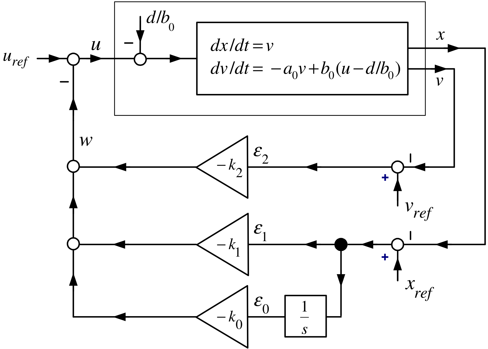

:::

---

::: {.compact-slide .dense-slide .boundary-safe-slide}

State Feedback and Disturbance Rejection

As $$\underset{sI-(A_{a}-b_{a}k_{a})}{\underbrace{\left[
\begin{array}{ccc}
s & -1 & 0 \\
0 & s & -1 \\
b_{0}k_{0} & b_{0}k_{1} & s+a_{0}+b_{0}k_{2}
\end{array}
\right] }}\left[
\begin{array}{c}
E_{0}(s) \\
E_{1}(s) \\
E_{2}(s)
\end{array}
\right] =\left[
\begin{array}{c}
\epsilon _{0}(0) \\
\epsilon _{1}(0) \\
\epsilon _{2}(0)
\end{array}
\right] +\left[
\begin{array}{c}
0 \\
0 \\
\dfrac{d}{s}
\end{array}
\right] .$$ Then $$\begin{aligned}
\left( sI-(A_{a}-b_{a}k_{a})\right) ^{-1} &=\frac{1}{\underset{
\det \left( sI-(A_{a}-b_{a}k_{a})\right) }{\underbrace{
s^{3}+(b_{0}k_{2}+a_{0})s^{2}+b_{0}k_{1}s+b_{0}k_{0}}}}\times \\
&&\underset{adj\left( sI-(A_{a}-b_{a}k_{a})\right) }{\underbrace{
\left[
\begin{array}{ccc}
s^{2}+(b_{0}k_{2}+a_{0})s+b_{0}k_{1} & s+b_{0}k_{2}+a_{0} & 1 \\
-b_{0}k_{0} & s^{2}+(b_{0}k_{2}+a_{0})s & s \\
-b_{0}k_{0}s & -\left( b_{0}k_{1}s+b_{0}k_{0}\right) & s^{2}
\end{array}
\right] }}.
\end{aligned}$$
:::

---

::: {.compact-slide .dense-slide .boundary-safe-slide}

State Feedback and Disturbance Rejection

$$\begin{aligned}
E_{0}(s) &=\frac{(s^{2}+(b_{0}k_{2}+a_{0})s+b_{0}k_{1})\epsilon
_{0}(0)+(s+b_{0}k_{2}+a_{0})\epsilon _{1}(0)+\epsilon _{2}(0)+
\mathbf{d/s}
}{s^{3}+(b_{0}k_{2}+a_{0})s^{2}+b_{0}k_{1}s+b_{0}k_{0}} \\
E_{1}(s) &=\frac{-b_{0}k_{0}\epsilon
_{0}(0)+(s^{2}+(b_{0}k_{2}+a_{0})s)\epsilon _{1}(0)+s\epsilon _{2}(0)+s
\mathbf{(d/s)}
}{s^{3}+(b_{0}k_{2}+a_{0})s^{2}+b_{0}k_{1}s+b_{0}k_{0}} \\
E_{2}(s) &=\frac{-b_{0}k_{0}s\epsilon
_{0}(0)-(b_{0}k_{1}s+b_{0}k_{0})\epsilon _{1}(0)+s^{2}\epsilon _{2}(0)+s^{2}
\mathbf{(d/s)}
}{\underset{\det \left( sI-(A_{a}-b_{a}k_{a})\right) }{\underbrace{
s^{3}+(b_{0}k_{2}+a_{0})s^{2}+b_{0}k_{1}s+b_{0}k_{0}}}}
\end{aligned}$$

Choose $k$ so that $$\begin{aligned}
\det \left( sI-(A_{a}-b_{a}k_{a})\right) &=(s+r_{1})(s+r_{2})(s+r_{3}) \\
&=s^{3}+(r_{1}+r_{2}+r_{3})s^{2}+(r_{1}r_{2}+r_{1}r_{3}+r_{2}r_{3})s+r_{1}r_{2}r_{3}.
\end{aligned}$$ That is, $$\begin{aligned}
k_{2} &=\frac{r_{1}+r_{2}+r_{3}-a_{0}}{b_{0}} \\
k_{1} &=\frac{r_{1}r_{2}+r_{1}r_{3}+r_{2}r_{3}}{b_{0}} \\
k_{0} &=\frac{r_{1}r_{2}r_{3}}{b_{0}}.
\end{aligned}$$
:::

---

::: {.compact-slide .dense-slide}

State Feedback and Disturbance Rejection

$$\begin{aligned}
E_{1}(s) &=\frac{-b_{0}k_{0}\epsilon _{0}(0)+\left(
s^{2}+(b_{0}k_{2}+a_{0})s\right) \epsilon _{1}(0)+s\epsilon _{2}(0)+d}{
s^{3}+(b_{0}k_{2}+a_{0})s^{2}+b_{0}k_{1}s+b_{0}k_{0}} \\
&=\frac{A_{1}}{s+r_{1}}+\frac{B_{1}}{s+r_{2}}+\frac{C_{1}}{s+r_{3}} \\
\Longrightarrow x_{ref}(t)-x(t) &=\epsilon
_{1}(t)=A_{1}e^{-r_{1}t}+B_{1}e^{-r_{2}t}+C_{1}e^{-r_{3}t}\rightarrow 0.
\end{aligned}$$

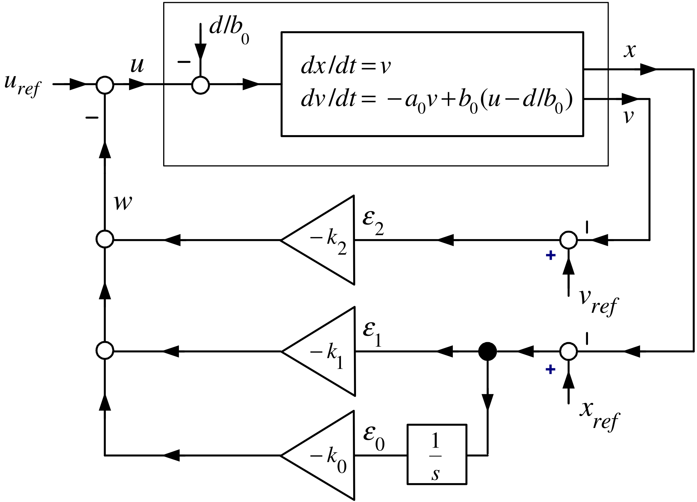

:::

---

::: {.compact-slide .dense-slide}

State Feedback and Disturbance Rejection

$$\begin{aligned}
E_{2}(s) &=\frac{-b_{0}k_{0}s\epsilon
_{0}(0)-(b_{0}k_{1}s+b_{0}k_{0})\epsilon _{1}(0)+s^{2}\epsilon _{2}(0)+sd}{
s^{3}+(b_{0}k_{2}+a_{0})s^{2}+b_{0}k_{1}s+b_{0}k_{0}} \\
&=\frac{A_{2}}{s+r_{1}}+\frac{B_{2}}{s+r_{2}}+\frac{C_{2}}{s+r_{3}} \\
\Longrightarrow v_{ref}(t)-v(t) &=\epsilon
_{2}(t)=A_{2}e^{-r_{1}t}+B_{2}e^{-r_{2}t}+C_{2}e^{-r_{3}t}\rightarrow 0. \\
&&
\end{aligned}$$

:::

---

::: {.compact-slide .dense-slide}

State Feedback and Disturbance Rejection

$$\begin{aligned}
\lim_{s\rightarrow 0}sE_{0}(s)
&=\lim_{s\rightarrow 0}s\frac{
(s^{2}+(b_{0}k_{2}+a_{0})s+b_{0}k_{1})\epsilon
_{0}(0)+(s+b_{0}k_{2}+a_{0})\epsilon _{1}(0)+\epsilon _{2}(0)+
\mathbf{(d/s)}
}{s^{3}+(b_{0}k_{2}+a_{0})s^{2}+b_{0}k_{1}s+b_{0}k_{0}} \\
&=\frac{d}{b_{0}k_{0}}.
\end{aligned}$$

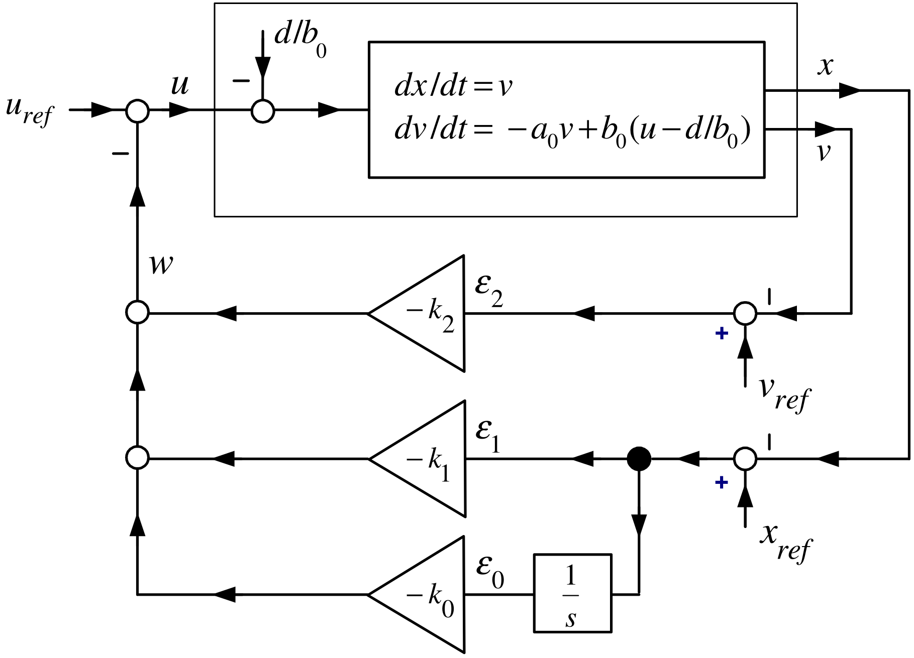

$$V(t)=u(t)=u_{ref}(t)+\left( k_{0}\int_{0}^{t}\epsilon _{1}(\tau )d\tau
+k_{1}\epsilon _{1}(t)+k_{2}\epsilon _{2}(t)\right)$$
:::

---

::: {.compact-slide .dense-slide .boundary-safe-slide}

Similarity Transformations

**Motivation**

Consider a general $3^{rd}$ statespace system: $$\frac{d}{dt}\left[
\begin{array}{c}
x_{1} \\
x_{2} \\
x_{3}
\end{array}
\right] =\underset{A}{\underbrace{\left[
\begin{array}{ccc}
a_{11} & a_{12} & a_{13} \\
a_{21} & a_{22} & a_{23} \\
a_{31} & a_{32} & a_{33}
\end{array}
\right] }}\left[
\begin{array}{c}
x_{1} \\
x_{2} \\
x_{3}
\end{array}
\right] +\underset{b}{\underbrace{\left[
\begin{array}{c}
b_{1} \\
b_{2} \\
b_{3}
\end{array}
\right] }}u$$

We want to transform it into the *control canonical* form $$\frac{d}{dt}\left[
\begin{array}{c}
x_{c1} \\
x_{c2} \\
x_{c3}
\end{array}
\right] =\underset{A_{c}}{\underbrace{\left[
\begin{array}{ccc}
0 & 1 & 0 \\
0 & 0 & 1 \\
-\alpha _{0} & -\alpha _{1} & -\alpha _{2}
\end{array}
\right] }}\left[
\begin{array}{c}
x_{c1} \\
x_{c2} \\
x_{c3}
\end{array}
\right] +\underset{b_{c}}{\underbrace{\left[
\begin{array}{c}
0 \\
0 \\
1
\end{array}
\right] }}u$$

using a statespace transformation $$x_{c}=Tx,\text{}T\in
\mathbb{R}
^{3\times 3},\det T\neq 0.$$
:::

---

::: {.compact-slide .dense-slide .boundary-safe-slide}

Similarity Transformations

$$\frac{d}{dt}\left[
\begin{array}{c}
x_{1} \\
x_{2} \\
x_{3}
\end{array}
\right] =\underset{A}{\underbrace{\left[
\begin{array}{ccc}
a_{11} & a_{12} & a_{13} \\
a_{21} & a_{22} & a_{23} \\
a_{31} & a_{32} & a_{33}
\end{array}
\right] }}\left[
\begin{array}{c}
x_{1} \\
x_{2} \\
x_{3}
\end{array}
\right] +\underset{b}{\underbrace{\left[
\begin{array}{c}
b_{1} \\
b_{2} \\
b_{3}
\end{array}
\right] }}u.$$

Consider a general transformation given by $$x^{\prime }=Tx,\det T\neq 0.$$

Then $$\frac{d}{dt}x^{\prime }=T\frac{d}{dt}x=T(Ax+bu)=TAx+Tbu.$$

As $\det T\neq 0$, we have $x=T^{-1}x^{\prime }$ and $$\frac{d}{dt}x^{\prime }=\underset{A^{\prime }}{\underbrace{TAT}}
^{-1}x^{\prime }+\underset{b^{\prime }}{\underbrace{Tb}}u.$$

-   $T$ is an example of a *similarity* transformation.
:::

---

::: {.compact-slide .dense-slide .boundary-safe-slide}

Example

*Similarity Transformation*

Let $$\frac{d}{dt}\left[
\begin{array}{c}
x_{1} \\
x_{2} \\
x_{3}
\end{array}
\right] =\underset{A}{\underbrace{\left[
\begin{array}{ccc}
a_{11} & a_{12} & a_{13} \\
a_{21} & a_{22} & a_{23} \\
a_{31} & a_{32} & a_{33}
\end{array}
\right] }}\left[
\begin{array}{c}
x_{1} \\
x_{2} \\
x_{3}
\end{array}
\right] +\underset{b}{\underbrace{\left[
\begin{array}{c}
b_{1} \\
b_{2} \\
b_{3}
\end{array}
\right] }}u.$$

Define the *controllability* matrix by $$\mathcal{C}\triangleq \left[
\begin{array}{ccc}
b & Ab & A^{2}b
\end{array}
\right] \in
\mathbb{R}
^{3\times 3}.$$

Suppose that $\det \mathcal{C}\neq 0$ so that $\mathcal{C}$ has an inverse.

Define the transformation $T_{1}$ by $$T_{1}\triangleq \mathcal{C}^{-1}=\left[
\begin{array}{ccc}
b & Ab & A^{2}b
\end{array}
\right] ^{-1}.$$
:::

---

::: {.compact-slide .dense-slide .boundary-safe-slide}

Example

*Similarity Transformation*  **(continued)**

The transformation $$T_{1}\triangleq \mathcal{C}^{-1}=\left[
\begin{array}{ccc}
b & Ab & A^{2}b
\end{array}
\right] ^{-1}$$

with $x^{\prime }\triangleq T_{1}x$ transforms $$\frac{d}{dt}x=Ax+bu$$

to $$\frac{d}{dt}x^{\prime }=\underset{A^{\prime }}{\underbrace{T_{1}AT_{1}^{-1}}}
x^{\prime }+\underset{b^{\prime }}{\underbrace{T_{1}b}}u.$$

That is, $$A^{\prime }=T_{1}AT_{1}^{-1}\text{and}b^{\prime }=T_{1}b$$ or $$T_{1}^{-1}A^{\prime }=AT_{1}^{-1}\text{\ and}T_{1}^{-1}b^{\prime }=b.$$ Finally, $$\begin{aligned}
&&\left[
\begin{array}{ccc}
b & Ab & A^{2}b
\end{array}
\right] A^{\prime }=A\left[
\begin{array}{ccc}
b & Ab & A^{2}b
\end{array}
\right] =\left[
\begin{array}{ccc}
Ab & A^{2}b & A^{3}b
\end{array}
\right] \\
&&\text{and} \\
&&\left[
\begin{array}{ccc}
b & Ab & A^{2}b
\end{array}
\right] b^{\prime }=b.
\end{aligned}$$
:::

---

::: {.compact-slide .dense-slide .boundary-safe-slide}

Example

*Similarity Transformation*  **(continued)**

From previous slide: $$\begin{aligned}
\left[
\begin{array}{ccc}
b & Ab & A^{2}b
\end{array}
\right] A^{\prime } &=\left[
\begin{array}{ccc}
Ab & A^{2}b & A^{3}b
\end{array}
\right] \\
\left[
\begin{array}{ccc}
b & Ab & A^{2}b
\end{array}
\right] b^{\prime } &=b.
\end{aligned}$$

By inspection $A^{\prime }$ and $b^{\prime }$ have the forms $$A^{\prime }=\left[
\begin{array}{ccc}
0 & 0 & a_{13}^{\prime } \\
1 & 0 & a_{23}^{\prime } \\
0 & 1 & a_{33}^{\prime }
\end{array}
\right] ,b^{\prime }=\left[
\begin{array}{c}
1 \\
0 \\
0
\end{array}
\right] .$$ Inserting $A^{\prime }$ into the top equation above shows $a_{13}^{\prime },a_{23}^{\prime },a_{33}^{\prime }$ must satisfy $$a_{13}^{\prime }b+a_{23}^{\prime }Ab+a_{33}^{\prime }A^{2}b=A^{3}b.$$ Denote the characteristic polynomial as $$\det (sI-A)=s^{3}+\alpha _{2}s^{2}+\alpha _{1}s+\alpha _{0}.$$ We have by the Cayley-Hamilton theorem $$A^{3}+\alpha _{2}A^{2}+\alpha _{1}A+\alpha _{0}I=0_{3\times 3}
\Longrightarrow A^{3}b=-\alpha _{0}b-\alpha _{1}Ab-\alpha
_{2}A^{2}b.$$
:::

---

::: {.compact-slide .dense-slide .boundary-safe-slide}

Example

*Similarity Transformation*  **(continued)**

We have shown that the transformation $$T_{1}\triangleq \mathcal{C}^{-1}=\left[
\begin{array}{ccc}
b & Ab & A^{2}b
\end{array}
\right] ^{-1}$$ takes $$\frac{d}{dt}x=Ax+bu$$ to $$\frac{d}{dt}x^{\prime }=A^{\prime }x^{\prime }+b^{\prime }u$$ where $$A^{\prime }=T_{1}AT_{1}^{-1}=\left[
\begin{array}{ccc}
0 & 0 & -\alpha _{0} \\
1 & 0 & -\alpha _{1} \\
0 & 1 & -\alpha _{2}
\end{array}
\right] ,\text{}b^{\prime }=T_{1}b=\left[
\begin{array}{c}
1 \\
0 \\
0
\end{array}
\right] .$$

-   This is *not* control canonical form.

-   Note that $A_{c}=(A^{\prime })^{T}$.

-   A direct calculation shows (or see theorem below) $$\det (sI-A^{\prime })=s^{3}+\alpha _{2}s^{2}+\alpha _{1}s+\alpha _{0}=\det
    (sI-A).$$
:::

---

::: {.compact-slide .dense-slide .boundary-safe-slide}

Example

*Similarity Transformation*

Now suppose the system starts in *control canonical* form, i.e., $$\frac{d}{dt}\underset{x_{c}}{\underbrace{\left[
\begin{array}{c}
x_{c1} \\
x_{c2} \\
x_{c3}
\end{array}
\right] }}=\underset{A_{c}}{\underbrace{\left[
\begin{array}{ccc}
0 & 1 & 0 \\
0 & 0 & 1 \\
-\alpha _{0} & -\alpha _{1} & -\alpha _{2}
\end{array}
\right] }}\underset{x_{c}}{\underbrace{\left[
\begin{array}{c}
x_{c1} \\
x_{c2} \\
x_{c3}
\end{array}
\right] }}+\underset{b_{c}}{\underbrace{\left[
\begin{array}{c}
0 \\
0 \\
1
\end{array}
\right] }}u$$ We know that $$\det (sI-A_{c})=\det \left[
\begin{array}{ccc}
s & -1 & 0 \\
0 & s & -1 \\
\alpha _{0} & \alpha _{1} & s+\alpha _{2}
\end{array}
\right] =s^{3}+\alpha _{2}s^{2}+\alpha _{1}s+\alpha _{0}.$$ The *controllability* matrix is $$\mathcal{C}_{c}\triangleq \left[
\begin{array}{ccc}
b_{c} & A_{c}b_{c} & A_{c}^{2}b_{c}
\end{array}
\right] \in
\mathbb{R}
^{3\times 3}.$$

By the previous example with $T_{2}\triangleq \mathcal{C}_{c}^{-1}$ and $x^{\prime }=T_{2}x_{c}$: $$\frac{d}{dt}x^{\prime }=\underset{A^{\prime }}{\underbrace{
T_{2}A_{c}T_{2}^{-1}}}x^{\prime }+\underset{b^{\prime }}{\underbrace{
T_{2}b_{c}}}u=\left[
\begin{array}{ccc}
0 & 0 & -\alpha _{0} \\
1 & 0 & -\alpha _{1} \\
0 & 1 & -\alpha _{2}
\end{array}
\right] x^{\prime }+\left[
\begin{array}{c}
1 \\
0 \\
0
\end{array}
\right] u.$$
:::

---

::: {.compact-slide .dense-slide .boundary-safe-slide}

Example

*Similarity Transformation  ***(continued)**

From the previous slide with $T_{2}=\mathcal{C}_{c}^{-1}=\left[ \begin{array}{ccc} b_{c} & A_{c}b_{c} & A_{c}^{2}b_{c} \end{array} \right] ^{-1},$ $$\frac{d}{dt}x^{\prime }=\underset{A^{\prime }}{\underbrace{
T_{2}A_{c}T_{2}^{-1}}}x^{\prime }+\underset{b^{\prime }}{\underbrace{
T_{2}b_{c}}}u=\left[
\begin{array}{ccc}
0 & 0 & -\alpha _{0} \\
1 & 0 & -\alpha _{1} \\
0 & 1 & -\alpha _{2}
\end{array}
\right] x^{\prime }+\left[
\begin{array}{c}
1 \\
0 \\
0
\end{array}
\right] u.$$

The inverse transformation $x_{c}=T_{2}^{-1}x^{\prime }=\mathcal{C} _{c}x^{\prime }$ gives back the original system, i.e., $$\frac{d}{dt}x_{c}=T_{2}^{-1}\frac{d}{dt}x^{\prime }=T_{2}^{-1}(A^{\prime
}x^{\prime }+b^{\prime }u)=T_{2}^{-1}(T_{2}A_{c}T_{2}^{-1}x^{\prime
}+T_{2}b_{c}u)=A_{c}x_{c}+b_{c}u.$$ That is, if a system is in the form $$\frac{d}{dt}x^{\prime }=\left[
\begin{array}{ccc}
0 & 0 & -\alpha _{0} \\
1 & 0 & -\alpha _{1} \\
0 & 1 & -\alpha _{2}
\end{array}
\right] x^{\prime }+\left[
\begin{array}{c}
1 \\
0 \\
0
\end{array}
\right] u$$ then $x_{c}=T_{2}^{-1}x^{\prime }=\mathcal{C}_{c}x^{\prime }$ takes it into the *control canonical* form $$\frac{d}{dt}\underset{x_{c}}{\underbrace{\left[
\begin{array}{c}
x_{c1} \\
x_{c2} \\
x_{c3}
\end{array}
\right] }}=\underset{A_{c}}{\underbrace{\left[
\begin{array}{ccc}
0 & 1 & 0 \\
0 & 0 & 1 \\
-\alpha _{0} & -\alpha _{1} & -\alpha _{2}
\end{array}
\right] }}\underset{x_{c}}{\underbrace{\left[
\begin{array}{c}
x_{c1} \\
x_{c2} \\
x_{c3}
\end{array}
\right] }}+\underset{b_{c}}{\underbrace{\left[
\begin{array}{c}
0 \\
0 \\
1
\end{array}
\right] }}u.$$
:::

---

::: {.compact-slide .dense-slide .boundary-safe-slide}

Theorem

*Transformation to Control Canonical Form*

Let a system be given by $$\frac{d}{dt}\left[
\begin{array}{c}
x_{1} \\
x_{2} \\
x_{3}
\end{array}
\right] =\underset{A}{\underbrace{\left[
\begin{array}{ccc}
a_{11} & a_{12} & a_{13} \\
a_{21} & a_{22} & a_{23} \\
a_{31} & a_{32} & a_{33}
\end{array}
\right] }}\left[
\begin{array}{c}
x_{1} \\
x_{2} \\
x_{3}
\end{array}
\right] +\underset{b}{\underbrace{\left[
\begin{array}{c}
b_{1} \\
b_{2} \\
b_{3}
\end{array}
\right] }}u.$$

*Controllability Matrix:        *$\mathcal{C}\triangleq \left[ \begin{array}{ccc} b & Ab & A^{2}b \end{array} \right] .$

*Characteristic Polynomial:   *$\det (sI-A)=s^{3}+\alpha _{2}s^{2}+\alpha _{1}s+\alpha _{0}.$

If $\det \mathcal{C}\neq 0$ then the above system is transformed to the control canonical form $$\frac{d}{dt}\underset{x_{c}}{\underbrace{\left[
\begin{array}{c}
x_{c1} \\
x_{c2} \\
x_{c3}
\end{array}
\right] }}=\underset{A_{c}}{\underbrace{\left[
\begin{array}{ccc}
0 & 1 & 0 \\
0 & 0 & 1 \\
-\alpha _{0} & -\alpha _{1} & -\alpha _{2}
\end{array}
\right] }}\underset{x_{c}}{\underbrace{\left[
\begin{array}{c}
x_{c1} \\
x_{c2} \\
x_{c3}
\end{array}
\right] }}+\underset{b_{c}}{\underbrace{\left[
\begin{array}{c}
0 \\
0 \\
1
\end{array}
\right] }}u$$ by the transformation $$x_{c}=\mathcal{C}_{c}\mathcal{C}^{-1}x$$ where $$\mathcal{C}_{c}\triangleq \left[
\begin{array}{ccc}
b_{c} & A_{c}b_{c} & A_{c}^{2}b_{c}
\end{array}
\right] .$$

**Proof**  By the previous two examples.
:::

---

::: {.compact-slide .dense-slide}

Definition

*Similarity Transformation*

Consider a linear statespace system $$\frac{dx}{dt}=Ax+bu,A\in
\mathbb{R}
^{n\times n},b\in
\mathbb{R}
^{n}$$ and an invertible matrix $T\in \mathbb{R} ^{n\times n},$ i.e., $\det (T)\neq 0$.

Then $$x^{\prime }=Tx$$ gives $$\frac{dx^{\prime }}{dt}=TAT^{-1}x^{\prime }+Tbu.$$ The transformation $$\begin{aligned}
A &\rightarrow &TAT^{-1} \\
b &\rightarrow &Tb
\end{aligned}$$ is called a **similarity** transformation.
:::

---

::: {.compact-slide .dense-slide}

Theorem

*Characteristic Function is Invariant Under a Similarity Transformation*

Let $$A^{\prime }=TAT^{-1}.$$ Then $$\det (sI-A^{\prime })=\det (sI-A).$$ **Proof**  We have $$sI-A^{\prime }=TsT^{-1}-TAT^{-1}=T(sI-A)T^{-1}$$ so $$\begin{aligned}
\det (sI-A^{\prime }) &=\det (T(sI-A)T^{-1}) \\
&=\det T\det (sI-A)\det T^{-1} \\
&=\det (sI-A)
\end{aligned}$$ as $(\det T)(\det T^{-1})=1$.
:::

---

::: {.compact-slide .dense-slide}

Pole Placement

Let $$\frac{dx_{c}}{dt}=A_{c}x_{c}+b_{c}u$$ with $A_{c},b_{c}$ in *control canonical* form, i.e., $$A_{c}=\left[
\begin{array}{ccc}
0 & 1 & 0 \\
0 & 0 & 1 \\
-\alpha _{0} & -\alpha _{1} & -\alpha _{2}
\end{array}
\right] ,b_{c}=\left[
\begin{array}{c}
0 \\
0 \\
1
\end{array}
\right] .$$ We know that the characteristic polynomial of $A_{c}$ is $$\det (sI-A_{c})=s^{3}+\alpha _{2}s^{2}+\alpha _{1}s+\alpha _{0}.$$ With $$k_{c}=\left[
\begin{array}{ccc}
k_{c1} & k_{c2} & k_{c3}
\end{array}
\right] ,$$ use the state feedback $$u=-k_{c}x_{c}=-\left[
\begin{array}{ccc}
k_{c1} & k_{c2} & k_{c3}
\end{array}
\right] \left[
\begin{array}{c}
x_{c1} \\
x_{c2} \\
x_{c3}
\end{array}
\right] .$$
:::

---

::: {.compact-slide .dense-slide .boundary-safe-slide}

Pole Placement

Closed-Loop System: $$\frac{dx_{c}}{dt}=(A_{c}-b_{c}k_{c})x_{c}$$ $$\begin{aligned}
A_{c}-b_{c}k_{c} &=\left[
\begin{array}{ccc}
0 & 1 & 0 \\
0 & 0 & 1 \\
-\alpha _{0} & -\alpha _{1} & -\alpha _{2}
\end{array}
\right] -\left[
\begin{array}{c}
0 \\
0 \\
1
\end{array}
\right] \left[
\begin{array}{ccc}
k_{c1} & k_{c2} & k_{c3}
\end{array}
\right] \\
&=\left[
\begin{array}{ccc}
0 & 1 & 0 \\
0 & 0 & 1 \\
-\alpha _{0}-k_{c1} & -\alpha _{1}-k_{c2} & -\alpha _{2}-k_{c3}
\end{array}
\right] .
\end{aligned}$$

The *closed-loop* characteristic polynomial is $$\begin{aligned}
\det \left( sI-(A_{c}-b_{c}k_{c})\right) & =\det
\left( s\left[
\begin{array}{ccc}
1 & 0 & 0 \\
0 & 1 & 0 \\
0 & 0 & 1
\end{array}
\right] -\left[
\begin{array}{ccc}
0 & 1 & 0 \\
0 & 0 & 1 \\
-\alpha _{0}-k_{c1} & -\alpha _{1}-k_{c2} & -\alpha _{2}-k_{c3}
\end{array}
\right] \right) \\
& \\
& =s^{3}+(\alpha _{2}+k_{c3})s^{2}+(\alpha _{1}+k_{c2})s+\alpha _{0}+k_{c1}.
\end{aligned}$$
:::

---

::: {.compact-slide .dense-slide .boundary-safe-slide}

Pole Placement

Pole Placement

Choose $$k_{c1}=\alpha _{d0}-\alpha _{0},k_{c2}=\alpha _{d1}-\alpha _{1},
k_{c3}=\alpha _{d2}-\alpha _{2}$$ so $$\begin{aligned}
\det \left( sI-(A_{c}-b_{c}k_{c})\right) &=s^{3}+(\alpha
_{2}+k_{c3})s^{2}+s(\alpha _{1}+k_{c2})+\alpha _{0}+k_{c1} \\
&=s^{3}+\alpha _{d2}s^{2}+\alpha _{d1}s+\alpha _{d0}.
\end{aligned}$$

E.g. with $r_{1}>0,r_{2}>0,r_{3}>0$, set $$\begin{aligned}
s^{3}+\alpha _{d2}s^{2}+\alpha _{d1}s+\alpha _{d0}
&=(s+r_{1})(s+r_{2})(s+r_{3}) \\
&&s^{3}+\underset{\alpha _{d2}}{\underbrace{(r_{1}+r_{2}+r_{3})}}s^{2}+
\underset{\alpha _{d1}}{\underbrace{(r_{1}r_{2}+r_{1}r_{3}+r_{2}r_{3})}}s+
\underset{\alpha _{d0}}{\underbrace{r_{1}r_{2}r_{3}}}
\end{aligned}$$

-   If the system is in control canonical form then pole placement is easy.
:::

---

::: {.compact-slide .dense-slide .boundary-safe-slide}

Pole Placement

Consider the system $$\frac{d}{dt}x=Ax+bu,A\in
\mathbb{R}
^{3\times 3},b\in
\mathbb{R}
^{3}$$

with $$\det (sI-A)=s^{3}+\alpha _{2}s^{2}+\alpha _{1}s+\alpha _{0}$$

and $$\det \mathcal{C}=\det \left[
\begin{array}{ccc}
b & Ab & A^{2}b
\end{array}
\right] \neq 0.$$

Then $$x_{c}=\mathcal{C}_{c}\mathcal{C}^{-1}x$$ results in $$\frac{d}{dt}\underset{x_{c}}{\underbrace{\left[
\begin{array}{c}
x_{c1} \\
x_{c2} \\
x_{c3}
\end{array}
\right] }}=\underset{A_{c}}{\underbrace{\left[
\begin{array}{ccc}
0 & 1 & 0 \\
0 & 0 & 1 \\
-\alpha _{0} & -\alpha _{1} & -\alpha _{2}
\end{array}
\right] }}\underset{x_{c}}{\underbrace{\left[
\begin{array}{c}
x_{c1} \\
x_{c2} \\
x_{c3}
\end{array}
\right] }}+\underset{b_{c}}{\underbrace{\left[
\begin{array}{c}
0 \\
0 \\
1
\end{array}
\right] }}u.$$
:::

---

::: {.compact-slide .dense-slide .boundary-safe-slide}

Pole Placement

$$\frac{d}{dt}\underset{x_{c}}{\underbrace{\left[
\begin{array}{c}
x_{c1} \\
x_{c2} \\
x_{c3}
\end{array}
\right] }}=\underset{A_{c}}{\underbrace{\left[
\begin{array}{ccc}
0 & 1 & 0 \\
0 & 0 & 1 \\
-\alpha _{0} & -\alpha _{1} & -\alpha _{2}
\end{array}
\right] }}\underset{x_{c}}{\underbrace{\left[
\begin{array}{c}
x_{c1} \\
x_{c2} \\
x_{c3}
\end{array}
\right] }}+\underset{b_{c}}{\underbrace{\left[
\begin{array}{c}
0 \\
0 \\
1
\end{array}
\right] }}u.$$ The feedback $$u=-k_{c}x_{c}=-\left[
\begin{array}{ccc}
\alpha _{d0}-\alpha _{0} & \alpha _{d1}-\alpha _{1} & \alpha _{d2}-\alpha
_{2}
\end{array}
\right] \left[
\begin{array}{c}
x_{c1} \\
x_{c2} \\
x_{c3}
\end{array}
\right]$$ results in $$\det (sI-(A_{c}-b_{c}k_{c}))=s^{3}+\alpha _{d2}s^{2}+\alpha _{d1}s+\alpha
_{d0}.$$

In the original coordinate system the feedback $$u=-k_{c}x_{c}=-\underset{k}{\underbrace{k_{c}\mathcal{C}_{c}\mathcal{C}^{-1}}
}x$$ results in $$\det (sI-(A-bk))=s^{3}+\alpha _{d2}s^{2}+\alpha _{d1}s+\alpha _{d0}.$$
:::

---

::: {.compact-slide .dense-slide .boundary-safe-slide}

Example

*Cart on the Track System* $$\begin{aligned}
\frac{d}{dt}\left[
\begin{array}{c}
\epsilon _{1} \\
\epsilon _{2}
\end{array}
\right] &=\underset{A}{\underbrace{\left[
\begin{array}{cc}
0 & 1 \\
0 & -a_{0}
\end{array}
\right] }}\left[
\begin{array}{c}
\epsilon _{1} \\
\epsilon _{2}
\end{array}
\right] +\underset{b}{\underbrace{\left[
\begin{array}{c}
0 \\
b_{0}
\end{array}
\right] }}w+\left[
\begin{array}{c}
0 \\
1
\end{array}
\right] d \\
\det (sI-A) &=s(s+a_{0})=s^{2}+a_{0}s=s^{2}+\alpha _{1}s+\alpha _{0}
\end{aligned}$$ We compute $$\begin{aligned}
\mathcal{C} &\mathcal{=}&\left[
\begin{array}{cc}
b & Ab
\end{array}
\right] =\left[
\begin{array}{cr}
0 & b_{0} \\
b_{0} & -a_{0}b_{0}
\end{array}
\right] \\
\mathcal{C}^{-1} &=-\frac{1}{b_{0}^{2}}\left[
\begin{array}{cr}
-a_{0}b_{0} & -b_{0} \\
-b_{0} & 0
\end{array}
\right] =\frac{1}{b_{0}}\left[
\begin{array}{cr}
a_{0} & 1 \\
1 & 0
\end{array}
\right] .
\end{aligned}$$ and $$\begin{aligned}
A_{c} &=\left[
\begin{array}{cc}
0 & 1 \\
-\alpha _{0} & -\alpha _{1}
\end{array}
\right] =\left[
\begin{array}{cc}
0 & 1 \\
0 & -a_{0}
\end{array}
\right] ,b_{c}=\left[
\begin{array}{c}
0 \\
1
\end{array}
\right] \\
\mathcal{C}_{c} &=\left[
\begin{array}{cc}
b_{c} & A_{c}b_{c}
\end{array}
\right] =\left[
\begin{array}{cc}
0 & 1 \\
1 & -a_{0}
\end{array}
\right] .
\end{aligned}$$
:::

---

::: {.compact-slide .dense-slide .boundary-safe-slide}

Example

*Cart on the Track System*   **(continued)**

Desired closed-loop characteristic polynomial: $$(s+r_{1})(s+r_{2})=s^{2}+\underset{\alpha _{d1}}{\underbrace{(r_{1}+r_{2})}}
s+\underset{\alpha _{d0}}{\underbrace{r_{1}r_{2}}}$$

Feedback gain: $$\begin{aligned}
k &=k_{c}\mathcal{C}_{c}\mathcal{C}^{-1} \\
&=\left[
\begin{array}{cc}
r_{1}r_{2}-0 & r_{1}+r_{2}-a_{0}
\end{array}
\right] \left[
\begin{array}{cc}
0 & 1 \\
1 & -a_{0}
\end{array}
\right] \frac{1}{b_{0}}\left[
\begin{array}{cr}
a_{0} & 1 \\
1 & 0
\end{array}
\right] \\
&=\left[
\begin{array}{cc}
\dfrac{r_{1}r_{2}}{b_{0}} & \dfrac{r_{1}+r_{2}-a_{0}}{b_{0}}
\end{array}
\right] .
\end{aligned}$$

Same result as previously found! **See slide the earlier derivation.**
:::

---

::: {.compact-slide .dense-slide .boundary-safe-slide}

Example

*Magnetic Levitation* $$\frac{d}{dt}\left[
\begin{array}{c}
i-i_{eq} \\
x-x_{eq} \\
v-v_{eq}
\end{array}
\right] =\underset{A}{\underbrace{\left[
\begin{array}{ccc}
-\dfrac{R}{L_{0}} & 0 & \dfrac{rL_{1}}{L_{0}}\dfrac{i_{eq}}{x_{eq}^{2}} \\
0 & 0 & 1 \\
-\dfrac{2g}{i_{eq}} & \dfrac{2g}{x_{eq}} & 0
\end{array}
\right] }}\left[
\begin{array}{c}
i-i_{eq} \\
x-x_{eq} \\
v-v_{eq}
\end{array}
\right] +\underset{b}{\underbrace{\left[
\begin{array}{c}
\dfrac{1}{L_{0}} \\
0 \\
0
\end{array}
\right] }}(u-u_{eq})$$ Set $$A=\left[
\begin{array}{ccc}
a_{11} & 0 & a_{13} \\
0 & 0 & 1 \\
a_{31} & a_{32} & 0
\end{array}
\right] ,b=\left[
\begin{array}{c}
b_{1} \\
0 \\
0
\end{array}
\right]$$ so that $$\begin{aligned}
\det \left( sI-A\right) &=\det \left[
\begin{array}{ccc}
s-a_{11} & 0 & -a_{13} \\
0 & s & -1 \\
-a_{31} & -a_{32} & s
\end{array}
\right] \\
&=s^{3}-a_{11}s^{2}-(a_{13}a_{31}+a_{32})s+a_{11}a_{32} \\
&=s^{3}+\alpha _{2}s^{2}+\alpha _{1}s+\alpha _{0}.
\end{aligned}$$
:::

---

::: {.compact-slide .dense-slide .boundary-safe-slide}

Example

*Magnetic Levitation*  **(continued)**

*Controllability Matrix* $$\begin{aligned}
\mathcal{C} &\mathcal{=}&\left[
\begin{array}{ccc}
b & Ab & A^{2}b
\end{array}
\right] =\left[
\begin{array}{crr}
b_{1} & a_{11}b_{1} & b_{1}a_{11}^{2}+b_{1}a_{13}a_{31} \\
0 & 0 & b_{1}a_{31} \\
0 & a_{31}b_{1} & b_{1}a_{11}a_{31}
\end{array}
\right] \\
\mathcal{C}^{-1} &=-\frac{1}{b_{1}^{3}a_{31}^{2}}\left[
\begin{array}{ccc}
-b_{1}^{2}a_{31}^{2} & b_{1}^{2}a_{13}a_{31}^{2} & b_{1}^{2}a_{11}a_{31} \\
&  &  \\
0 & b_{1}^{2}a_{11}a_{31} & -b_{1}^{2}a_{31} \\
&  &  \\
0 & -b_{1}^{2}a_{31} & 0
\end{array}
\right] \\
&=\left[
\begin{array}{ccc}
\dfrac{1}{b_{1}} & -\dfrac{a_{13}}{b_{1}} & -\dfrac{a_{11}}{b_{1}a_{31}} \\
&  &  \\
0 & -\dfrac{a_{11}}{b_{1}a_{31}} & \dfrac{1}{b_{1}a_{31}} \\
&  &  \\
0 & \dfrac{1}{b_{1}a_{31}} & 0
\end{array}
\right] .
\end{aligned}$$
:::

---

::: {.compact-slide .dense-slide .boundary-safe-slide}

Example

*Magnetic Levitation*  **(continued)**

We showed $\det \left( sI-A\right) =s^{3}-a_{11}s^{2}-(a_{13}a_{31}+a_{32})s+a_{11}a_{32}.$

*Control Canonical Form* $$A_{c}=\left[
\begin{array}{ccc}
0 & 1 & 0 \\
0 & 0 & 1 \\
-\alpha _{0} & -\alpha _{1} & -\alpha _{2}
\end{array}
\right] ,b_{c}=\left[
\begin{array}{c}
0 \\
0 \\
1
\end{array}
\right]$$ $$\begin{aligned}
\mathcal{C}_{c}\mathcal{=}\left[
\begin{array}{ccc}
b_{c} & A_{c}b_{c} & A_{c}^{2}b_{c}
\end{array}
\right] &=\left[
\begin{array}{ccc}
0 & 0 & 1 \\
0 & 1 & -\alpha _{2} \\
1 & -\alpha _{2} & \alpha _{2}^{2}-\alpha _{1}
\end{array}
\right] \\
&=\left[
\begin{array}{ccc}
0 & 0 & 1 \\
0 & 1 & a_{11} \\
1 & a_{11} & a_{11}^{2}+a_{13}a_{31}+a_{32}
\end{array}
\right] .
\end{aligned}$$ Set $$\begin{aligned}
s^{3}+\alpha _{d2}s^{2}+\alpha _{d1}s+\alpha _{d0} &=s^{3}+\underset
{\alpha _{d2}}{\underbrace{(r_{1}+r_{2}+r_{3})}}s^{2}+\underset{\alpha
_{d1}}{\underbrace{(r_{1}r_{2}+r_{1}r_{3}+r_{2}r_{3})}}s+\underset{\alpha
_{d0}}{\underbrace{r_{1}r_{2}r_{3}}} \\
&=(s+r_{1})(s+r_{2})(s+r_{3}).
\end{aligned}$$
:::

---

::: {.compact-slide .dense-slide .boundary-safe-slide}

Example

*Magnetic Levitation*  **(continued)** $$\begin{aligned}
k &=k_{c}\mathcal{C}_{c}\mathcal{C}^{-1} \\
&=\left[
\begin{array}{ccc}
r_{1}r_{2}r_{3}-a_{11}a_{32} &
r_{1}r_{2}+r_{1}r_{3}+r_{2}r_{3}+a_{13}a_{31}+a_{32} &
r_{1}+r_{2}+r_{3}+a_{11}
\end{array}
\right] \\
&&\times \left[
\begin{array}{ccc}
0 & 0 & 1 \\
&  &  \\
0 & 1 & a_{11} \\
&  &  \\
1 & a_{11} & a_{11}^{2}+a_{13}a_{31}+a_{32}
\end{array}
\right] \left[
\begin{array}{ccc}
\dfrac{1}{b_{1}} & -\dfrac{a_{13}}{b_{1}} & -\dfrac{a_{11}}{b_{1}a_{31}} \\
&  &  \\
0 & -\dfrac{a_{11}}{b_{1}a_{31}} & \dfrac{1}{b_{1}a_{31}} \\
&  &  \\
0 & \dfrac{1}{b_{1}a_{31}} & 0
\end{array}
\right] \\
&=\left[
\begin{array}{cc}
\dfrac{r_{1}+r_{2}+r_{3}+a_{11}}{b_{1}} & \dfrac{
r_{1}r_{2}r_{3}+(r_{1}+r_{2}+r_{3})a_{32}}{b_{1}a_{31}}
\end{array}
\right. \\
&&\left.
\begin{array}{c}
\dfrac{r_{1}r_{2}+r_{1}r_{3}+r_{2}r_{3}+a_{13}a_{31}+a_{32}}{b_{1}a_{31}}
\end{array}
\right] .
\end{aligned}$$

Same gain (row) vector $k$ as calculated before! **See slide the earlier derivation**
:::

---

::: {.compact-slide .dense-slide}

Asymptotic Tracking of Equilibrium Points

We are given the linear system $$\frac{dx}{dt}=Ax+bu.$$ Let $x_{eq}$ be an eq pt with corresponding input $u_{eq}$, i.e., $$0=\frac{dx_{eq}}{dt}=Ax_{eq}+bu_{eq}.$$ Use state feedback to force $x(t)\rightarrow x_{eq}.$

**Error Dynamics** $$\frac{d}{dt}(x-x_{eq})=Ax+bu-(Ax_{eq}+bu_{eq})=A(x-x_{eq})+b(u-u_{eq}).$$

The **state feedback  ** $$u-u_{eq}=-k(x-x_{eq})$$ results in $$\frac{d}{dt}(x-x_{eq})=(A-bk)(x-x_{eq}).$$ With $(A,b)$ controllable, $k$ can be (and is) chosen so $(A-bk)$ is stable. Then $$x(t)-x_{eq}=e^{(A-bk)t}(x(0)-x_{eq})\rightarrow 0.$$ The input $u$ is given by $u(t)=-k(x(t)-x_{eq})+u_{eq}\rightarrow u_{eq}.$
:::

---

::: {.compact-slide .dense-slide .boundary-safe-slide}

Example Inverted Pendulum

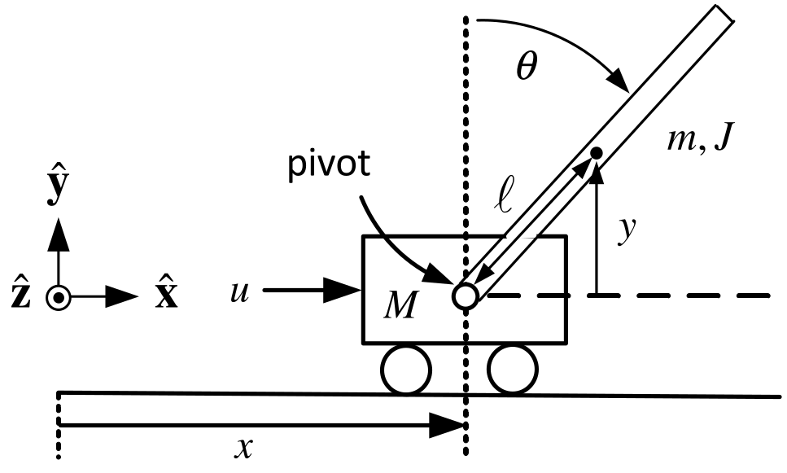

**Statespace Model and Equilibrium Points** $$\begin{aligned}
\underset{dz/dt}{\underbrace{\left[
\begin{array}{c}
dx/dt \\
dv/dt \\
d\theta /dt \\
d\omega /dt
\end{array}
\right] }} &=\underset{A}{\underbrace{\left[
\begin{array}{cccc}
0 & 1 & 0 & 0 \\
0 & 0 & -\dfrac{gm^{2}\ell ^{2}}{Mm\ell ^{2}+J(M+m)} & 0 \\
0 & 0 & 0 & 1 \\
0 & 0 & \dfrac{mg\ell (M+m)}{Mm\ell ^{2}+J(M+m)} & 0
\end{array}
\right] }}\underset{z}{\underbrace{\left[
\begin{array}{c}
x \\
v \\
\theta \\
\omega
\end{array}
\right] }}+\underset{b}{\underbrace{\left[
\begin{array}{c}
0 \\
\dfrac{J+m\ell ^{2}}{Mm\ell ^{2}+J(M+m)} \\
0 \\
-\dfrac{m\ell }{Mm\ell ^{2}+J(M+m)}
\end{array}
\right] }}u \\
z_{eq} &=\left[
\begin{array}{c}
x_{0} \\
0 \\
0 \\
0
\end{array}
\right] ,u_{eq}=0\text{and}(A,b)\text{is controllable.}
\end{aligned}$$

We can find $k\in \mathbb{R} ^{1\times 4}$ so $u=u_{eq}-k(z-z_{eq})=-k(z-z_{eq})$ gives

$\dfrac{d}{dt}(z-z_{eq})=(A-bk)(z-z_{eq})$ with $A-bk$ stable so $z(t)\rightarrow z_{eq}.$
:::

---

::: {.compact-slide .dense-slide .boundary-safe-slide}

Inv Pendulum: Tracking Step Inputs via State Feedback

**Can we make the cart position** $x(t)\rightarrow x_{ref}$** where** $x_{ref}$** is arbitrary?** $$\begin{aligned}
\underset{dz/dt}{\underbrace{\left[
\begin{array}{c}
dx/dt \\
dv/dt \\
d\theta /dt \\
d\omega /dt
\end{array}
\right] }} &=\underset{A}{\underbrace{\left[
\begin{array}{cccc}
0 & 1 & 0 & 0 \\
0 & 0 & -\dfrac{gm^{2}\ell ^{2}}{Mm\ell ^{2}+J(M+m)} & 0 \\
0 & 0 & 0 & 1 \\
0 & 0 & \dfrac{mg\ell (M+m)}{Mm\ell ^{2}+J(M+m)} & 0
\end{array}
\right] }}\underset{z}{\underbrace{\left[
\begin{array}{c}
x \\
v \\
\theta \\
\omega
\end{array}
\right] }}+\underset{b}{\underbrace{\left[
\begin{array}{c}
0 \\
\dfrac{J+m\ell ^{2}}{Mm\ell ^{2}+J(M+m)} \\
0 \\
-\dfrac{m\ell }{Mm\ell ^{2}+J(M+m)}
\end{array}
\right] }}u \\
y &=\underset{c}{\underbrace{\left[
\begin{array}{cccc}
1 & 0 & 0 & 0
\end{array}
\right] }}\underset{z}{\underbrace{\left[
\begin{array}{c}
x \\
v \\
\theta \\
\omega
\end{array}
\right] }}.
\end{aligned}$$ **Transfer Function** $$G(s)=\frac{X(s)}{U(s)}=\frac{\kappa (J+m\ell ^{2})s^{2}-\kappa mg\ell }{
s^{2}(s^{2}-\alpha ^{2})}$$ $$\alpha ^{2}=\frac{mg\ell (M+m)}{Mm\ell ^{2}+J(M+m)},\kappa =\frac{1
}{Mm\ell ^{2}+J(M+m)}.$$
:::

---

::: {.compact-slide .multi-figure-slide .dense-multi-slide}

Inv Pendulum: Tracking Step Inputs via State Feedback

Choose $u=-kz$ to place the closed-loop poles.

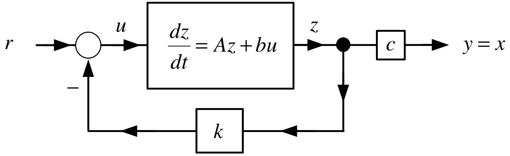

*Equivalent block diagram*

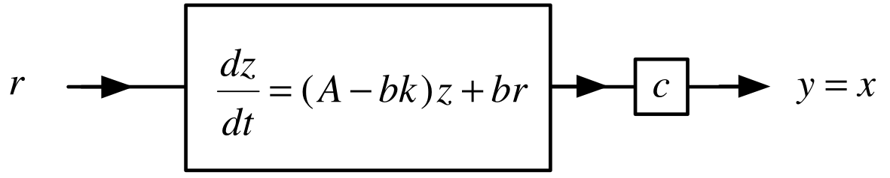

*Transfer function representation*

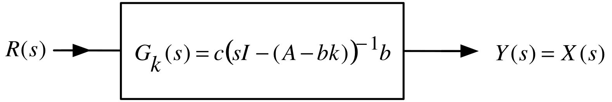

*Add integrator to track step inputs*

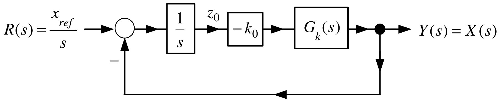

:::

---

::: {.compact-slide .dense-slide .boundary-safe-slide}

Inv Pendulum: Tracking Step Inputs via State Feedback

If $k_{0}$ can be chosen so that the closed-loop system is stable then $x(t)\rightarrow x_{ref}.$ $$\begin{aligned}
\frac{dz}{dt} &=Az+bu \\
u &=-kz-k_{0}z_{0} \\
y &=cz=x \\
\frac{dz_{0}}{dt} &=x_{ref}-x
\end{aligned}$$ or $$\begin{aligned}
\frac{d}{dt}\underset{\in
\mathbb{R}
^{5}}{\underbrace{\left[
\begin{array}{c}
z \\
z_{0}
\end{array}
\right] }} &=\underset{A_{a}\in
\mathbb{R}
^{5\times 5}}{\underbrace{\left[
\begin{array}{cc}
A & 0_{4\times 1} \\
-c & 0
\end{array}
\right] }}\underset{\in
\mathbb{R}
^{5}}{\underbrace{\left[
\begin{array}{c}
z \\
z_{0}
\end{array}
\right] }}+\underset{b_{a}\in
\mathbb{R}
^{5}}{\underbrace{\left[
\begin{array}{c}
b \\
0
\end{array}
\right] }}u+\underset{p\in
\mathbb{R}
^{5}}{\underbrace{\left[
\begin{array}{c}
0_{4\times 1} \\
1
\end{array}
\right] }}x_{ref} \\
u &=-\underset{\in
\mathbb{R}
^{1\times 5}}{\underbrace{\left[
\begin{array}{cc}
k & k_{0}
\end{array}
\right] }}\left[
\begin{array}{c}
z \\
z_{0}
\end{array}
\right] .
\end{aligned}$$
:::

---

::: {.compact-slide .dense-slide .boundary-safe-slide}

Inv Pendulum: Tracking Step Inputs via State Feedback

$$\begin{aligned}
\frac{d}{dt}\underset{\in
\mathbb{R}
^{5}}{\underbrace{\left[
\begin{array}{c}
z \\
z_{0}
\end{array}
\right] }} &=\underset{A_{a}\in
\mathbb{R}
^{5\times 5}}{\underbrace{\left[
\begin{array}{cc}
A & 0_{4\times 1} \\
-c & 0
\end{array}
\right] }}\underset{\in
\mathbb{R}
^{5}}{\underbrace{\left[
\begin{array}{c}
z \\
z_{0}
\end{array}
\right] }}+\underset{b_{a}\in
\mathbb{R}
^{5}}{\underbrace{\left[
\begin{array}{c}
b \\
0
\end{array}
\right] }}u+\underset{\in
\mathbb{R}
^{5}}{\underbrace{\left[
\begin{array}{c}
0_{4\times 1} \\
1
\end{array}
\right] }}x_{ref} \\
u &=-\underset{\in
\mathbb{R}
^{1\times 5}}{\underbrace{\left[
\begin{array}{cc}
k & k_{0}
\end{array}
\right] }}\underset{\in
\mathbb{R}
^{5}}{\underbrace{\left[
\begin{array}{c}
z \\
z_{0}
\end{array}
\right] }}.
\end{aligned}$$ $$\begin{aligned}
\frac{d}{dt}\left[
\begin{array}{c}
z \\
z_{0}
\end{array}
\right] &=\left[
\begin{array}{cc}
A & 0_{4\times 1} \\
-c & 0
\end{array}
\right] \left[
\begin{array}{c}
z \\
z_{0}
\end{array}
\right] -\left[
\begin{array}{c}
b \\
0
\end{array}
\right] \left[
\begin{array}{cc}
k & k_{0}
\end{array}
\right] \left[
\begin{array}{c}
z \\
z_{0}
\end{array}
\right] +\left[
\begin{array}{c}
0_{4\times 1} \\
1
\end{array}
\right] x_{ref} \\
&=\left( \left[
\begin{array}{cc}
A & 0_{4\times 1} \\
-c & 0
\end{array}
\right] -\left[
\begin{array}{lc}
bk & bk_{0} \\
0_{4\times 1} & 0
\end{array}
\right] \right) \left[
\begin{array}{c}
z \\
z_{0}
\end{array}
\right] +\left[
\begin{array}{c}
0_{4\times 1} \\
1
\end{array}
\right] x_{ref} \\
&=\left[
\begin{array}{cc}
A-bk & -bk_{0} \\
-c & 0
\end{array}
\right] \left[
\begin{array}{c}
z \\
z_{0}
\end{array}
\right] +\left[
\begin{array}{c}
0_{4\times 1} \\
1
\end{array}
\right] x_{ref}
\end{aligned}$$ Find $k\in \mathbb{R} ^{1\times 4},k_{0}\in \mathbb{R}$ such that $$\left[
\begin{array}{cc}
A-bk & -bk_{0} \\
-c & 0
\end{array}
\right]$$ is a *stable* matrix.
:::

---

::: {.compact-slide .dense-slide .boundary-safe-slide}

Inv Pendulum: Tracking Step Inputs via State Feedback

**Theorem** *Controllability of the Augmented System*

Let $(A,b)$ be controllable. Further, suppose $$G(s)=\frac{n(s)}{d(s)}\triangleq c(sI-A)^{-1}b$$ is such that $n(0)\neq 0.$ Then the augmented system $(A_{a},b_{a})$ defined as $$A_{a}\triangleq \left[
\begin{array}{cc}
A & 0_{4\times 1} \\
-c & 0
\end{array}
\right] \in
\mathbb{R}
^{5\times 5},b_{a}\triangleq \left[
\begin{array}{c}
b \\
0
\end{array}
\right] \in
\mathbb{R}
^{5}$$ is *controllable*.

**Proof**  See Appendix.

In the case of the inverted pendulum $(A,b)$ is controllable and $$G(s)=\frac{n(s)}{d(s)}=\frac{\kappa (J+m\ell ^{2})s^{2}-\kappa mg\ell }{
s^{2}(s^{2}-\alpha ^{2})}\text{\ satisfies}n(0)=-\kappa mg\ell \neq 0.$$ $\Longrightarrow$ Can choose $\left[ \begin{array}{cc} k & k_{0} \end{array} \right] \in \mathbb{R} ^{1\times 5}$ to place the eigenvalues of $$\left[
\begin{array}{cc}
A & 0_{4\times 1} \\
-c & 0
\end{array}
\right] -\left[
\begin{array}{c}
b \\
0
\end{array}
\right] \left[
\begin{array}{cc}
k & k_{0}
\end{array}
\right] =\left[
\begin{array}{cc}
A-bk & -bk_{0} \\
-c & 0
\end{array}
\right] .$$
:::

---

::: {.compact-slide .dense-slide .boundary-safe-slide}

Inv Pendulum: Tracking Step Inputs via State Feedback

$x(t)\rightarrow x_{ref},$ **but do** $v(t),\theta (t)\mathbf{,}$ ** and** $\omega (t)$** go to zero?** $$\frac{d}{dt}\underset{\in
\mathbb{R}
^{5}}{\underbrace{\left[
\begin{array}{c}
z \\
z_{0}
\end{array}
\right] }}=\underset{A_{a}\in
\mathbb{R}
^{5\times 5}}{\underbrace{\left[
\begin{array}{cc}
A & 0_{4\times 1} \\
-c & 0
\end{array}
\right] }}\underset{\in
\mathbb{R}
^{5}}{\underbrace{\left[
\begin{array}{c}
z \\
z_{0}
\end{array}
\right] }}+\underset{b_{a}\in
\mathbb{R}
^{5}}{\underbrace{\left[
\begin{array}{c}
b \\
0
\end{array}
\right] }}u+\underset{\in
\mathbb{R}
^{5}}{\underbrace{\left[
\begin{array}{c}
0_{4\times 1} \\
1
\end{array}
\right] }}x_{ref}$$ In compact form $$\frac{dz_{a}}{dt}=A_{a}z_{a}+b_{a}u+p_{a}x_{ref}.$$ **Equilibrium points** $$0_{5\times 1}=\frac{dz_{a_eq}}{dt}=A_{a}z_{a_eq}+b_{a}u_{eq}+p_{a}x_{ref}$$ Equilibrium points have the form (see next slide) $$z_{a_eq}=\left[
\begin{array}{c}
z_{eq} \\
z_{0_eq}
\end{array}
\right] =\left[
\begin{array}{c}
x_{ref} \\
0 \\
0 \\
0 \\
z_{0_eq}
\end{array}
\right] ,u_{eq}=0$$
:::

---

::: {.compact-slide .dense-slide .boundary-safe-slide}

Inv Pendulum: Tracking Step Inputs via State Feedback

**Equilibrium points** $$z_{a_eq}=\left[
\begin{array}{c}
z_{eq} \\
z_{0_eq}
\end{array}
\right] =\left[
\begin{array}{c}
x_{ref} \\
0 \\
0 \\
0 \\
z_{0_eq}
\end{array}
\right] ,u_{eq}=0$$ **Verification** $$\begin{aligned}
\left[
\begin{array}{c}
0 \\
0 \\
0 \\
0 \\
0
\end{array}
\right]  &=\underset{A_{a}}{\underbrace{\left[
\begin{array}{ccccc}
0 & 1 & 0 & 0 & 0 \\
0 & 0 & -\dfrac{gm^{2}\ell ^{2}}{Mm\ell ^{2}+J(M+m)} & 0 & 0 \\
0 & 0 & 0 & 1 & 0 \\
0 & 0 & \dfrac{mg\ell (M+m)}{Mm\ell ^{2}+J(M+m)} & 0 & 0 \\
-1 & 0 & 0 & 0 & 0
\end{array}
\right] }}\underset{z_{a_eq}}{\underbrace{\left[
\begin{array}{c}
x_{ref} \\
0 \\
0 \\
0 \\
z_{0_eq}
\end{array}
\right] }}+\underset{b_{a}}{\underbrace{\left[
\begin{array}{c}
0 \\
\dfrac{J+m\ell ^{2}}{Mm\ell ^{2}+J(M+m)} \\
0 \\
-\dfrac{m\ell }{Mm\ell ^{2}+J(M+m)} \\
0
\end{array}
\right] }}u_{eq} \\
&&+\left[
\begin{array}{c}
0 \\
0 \\
0 \\
0 \\
1
\end{array}
\right] x_{ref}.
\end{aligned}$$
:::

---

::: {.compact-slide .dense-slide}

Inv Pendulum: Tracking Step Inputs via State Feedback

**Error System**   

Subtract the equilibrium equations $$0_{5\times 1}=A_{a}z_{a_eq}+b_{a}u_{eq}+p_{a}x_{ref}$$ from the system model $$\frac{dz_{a}}{dt}=A_{a}z_{a}+b_{a}u+p_{a}x_{ref}$$ to obtain $$\begin{aligned}
\frac{d}{dt}(z_{a}-z_{a_eq})
&=A_{a}z_{a}+b_{a}u+p_{a}x_{ref}-(A_{a}z_{a_eq}+bu_{eq}+p_{a}x_{ref}) \\
&=A_{a}(z_{a}-z_{a_eq})+b_{a}(u-u_{eq}).
\end{aligned}$$

As the pair $(A_{a},b_{a})$ is **controllable**, $k_{a}$ can then be chosen so that $A_{a}-b_{a}k_{a}$ is stable.

The feedback $$u-u_{eq}=u=-k_{a}(z_{a}-z_{a_eq})$$ results in $$\frac{d}{dt}(z_{a}-z_{a_eq})=(A_{a}-b_{a}k_{a})(z_{a}-z_{a_eq})$$ so $$z_{a}(t)-z_{a_eq}=e^{(A_{a}-b_{a}k_{a})t}(z_{a}(0)-z_{a_eq})\rightarrow 0.$$
:::

---

::: {.compact-slide .dense-slide .boundary-safe-slide}

Inv Pendulum: Tracking Step Inputs via State Feedback

**What about the value of** $z_{0_eq}\mathbf{?}$

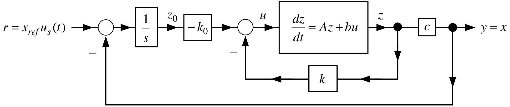

In the figure $$u=-\left[
\begin{array}{cc}
k & k_{0}
\end{array}
\right] \left[
\begin{array}{c}
z \\
z_{0}
\end{array}
\right]$$ **not** $$u=-\left[
\begin{array}{cc}
k & k_{0}
\end{array}
\right] \left( \left[
\begin{array}{c}
z \\
z_{0}
\end{array}
\right] -\left[
\begin{array}{c}
z_{eq} \\
z_{0_eq}
\end{array}
\right] \right) .$$ These are the same if $$\begin{aligned}
\left[
\begin{array}{cc}
k & k_{0}
\end{array}
\right] \left[
\begin{array}{c}
z_{eq} \\
z_{0_eq}
\end{array}
\right] &=\underset{k_{a}}{\underbrace{\left[
\begin{array}{ccccc}
k_{1} & k_{2} & k_{3} & k_{4} & k_{0}
\end{array}
\right] }}\left[
\begin{array}{c}
x_{ref} \\
0 \\
0 \\
0 \\
z_{0_eq}
\end{array}
\right] =0 \\
\text{or}z_{0_eq} &=-(k_{1}/k_{0})x_{ref}.
\end{aligned}$$
:::

---

::: {.compact-slide .dense-slide}

Inv Pendulum: Tracking Step Inputs via State Feedback

**The value of** $z_{0_eq}\mathbf{.}$

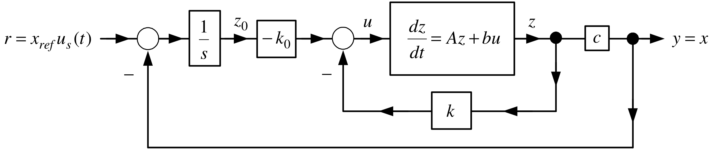

That is, the feedback $u=-k_{a}z_{a}$ applied to $$\frac{dz_{a}}{dt}=A_{a}z_{a}+b_{a}u+p_{a}x_{ref}$$

results in $$z_{a}(t)\rightarrow z_{a_eq}=\left[
\begin{array}{c}
x_{ref} \\
0 \\
0 \\
0 \\
-(k_{1}/k_{0})x_{ref}
\end{array}
\right] \text{and so}k_{a}z_{a_eq}=0.$$
:::
