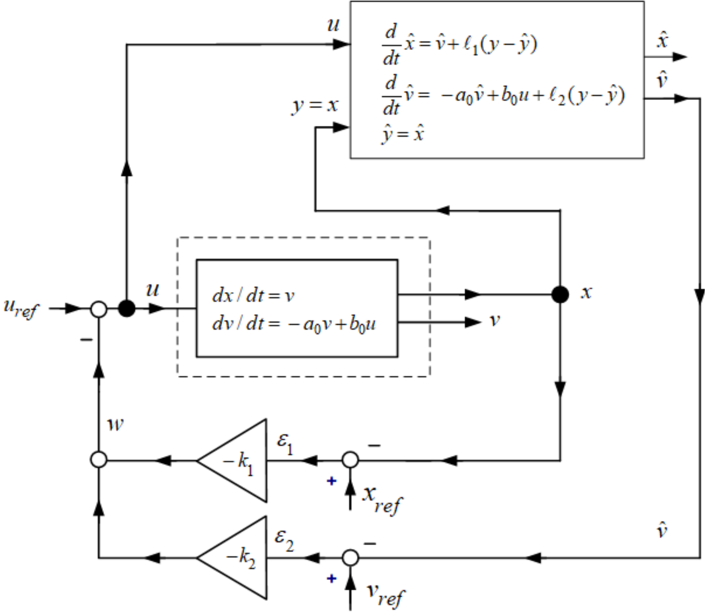
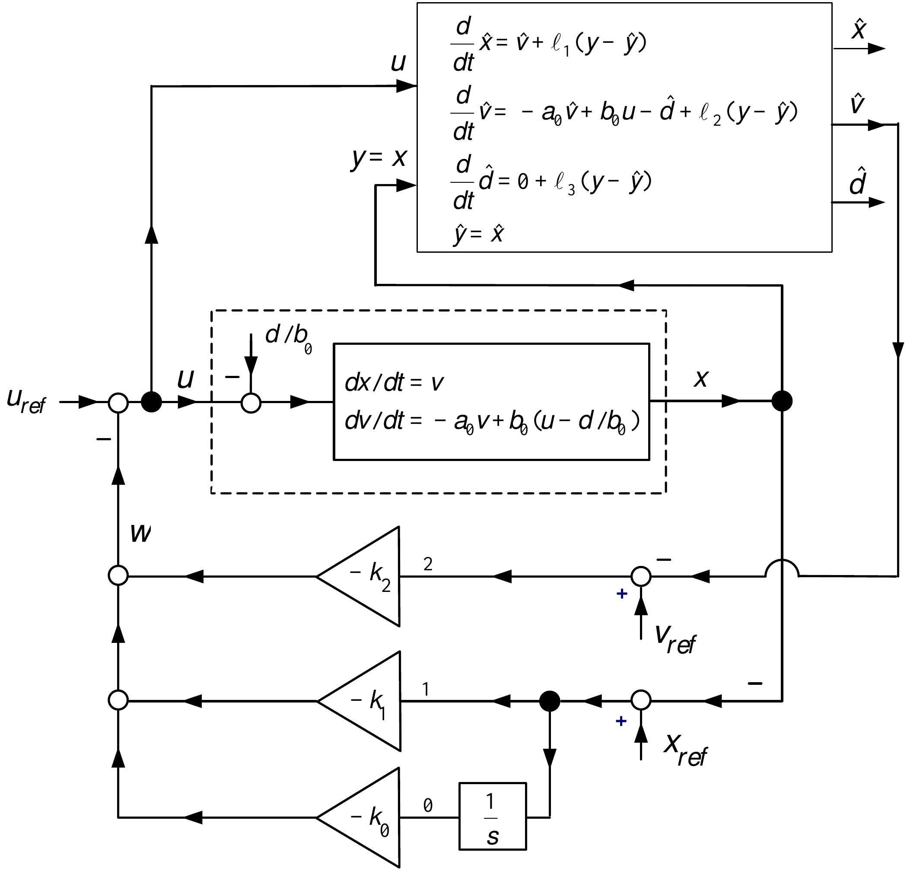
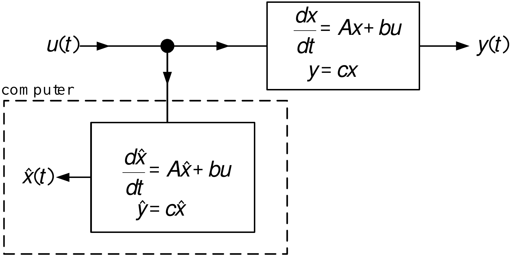
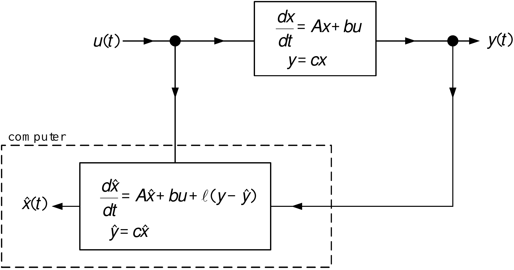

::: {.contents-slide}
# Contents

- State Estimators and Observer Design

- Observability, Duality, and Canonical Forms

- Multi-Output Observers and State Feedback

- Least-Squares Parameter Identification

- Matrix Facts and the Least-Squares Solution
:::

---

::: {.compact-slide .dense-slide .boundary-safe-slide}

State Estimators

-   Typically all of the state variables are not available for feedback.

-   A way to estimate the state variables is needed.

**Example**  *Speed Estimator for the Cart System* $$\begin{aligned}
\frac{d}{dt}x(t) &=v \\
\frac{d}{dt}v(t) &=-a_{0}v(t)+b_{0}u(t).
\end{aligned}$$ or $$\begin{aligned}
\frac{d}{dt}\underset{z}{\underbrace{\left[
\begin{array}{c}
x \\
v
\end{array}
\right] }} &=\underset{A}{\underbrace{\left[
\begin{array}{rc}
0 & \text{}1 \\
0 & -a_{0}
\end{array}
\right] }}\text{}\underset{z}{\underbrace{\left[
\begin{array}{c}
x \\
v
\end{array}
\right] }}+\underset{b}{\underbrace{\left[
\begin{array}{c}
0 \\
b_{0}
\end{array}
\right] }}u \\
y &=\underset{c}{\underbrace{\left[
\begin{array}{cc}
1 & 0
\end{array}
\right] }}\left[
\begin{array}{c}
x \\
v
\end{array}
\right] .
\end{aligned}$$
:::

---

::: {.compact-slide .dense-slide .boundary-safe-slide}

Example

*Speed Estimator for the Cart System* ** (continued)**

A speed and disturbance *observer* is defined by $$\begin{aligned}
\frac{d}{dt}\underset{\hat{z}}{\underbrace{\left[
\begin{array}{c}
\hat{x} \\
\hat{v}
\end{array}
\right] }} &=\underset{A}{\underbrace{\left[
\begin{array}{rc}
0 & \text{}1 \\
0 & -a_{0}
\end{array}
\right] }}\text{}\underset{\hat{z}}{\underbrace{\left[
\begin{array}{c}
\hat{x} \\
\hat{v}
\end{array}
\right] }}+\underset{b}{\underbrace{\left[
\begin{array}{c}
0 \\
b_{0}
\end{array}
\right] }}u+\underset{\ell }{\underbrace{\left[
\begin{array}{c}
\ell _{1} \\
\ell _{2}
\end{array}
\right] }}(y-\hat{y}) \\
\hat{y} &=\underset{c}{\underbrace{\left[
\begin{array}{cc}
1 & 0
\end{array}
\right] }}\left[
\begin{array}{c}
\hat{x} \\
\hat{v}
\end{array}
\right] .
\end{aligned}$$

-   Sample the output $y=x$ and the input $u$.

-   Integrate the above set of equations in real-time.

-   If $\ell$ is the zero vector, then the observer is simply a real-time simulation.

-   Choosing $\ell \neq 0$ appropriately can result in an accurate estimate of the state.
:::

---

::: {.compact-slide .expanded-body-slide .expanded-figure-slide}

Example

:::

---

::: {.compact-slide .dense-slide .boundary-safe-slide}

Example

*Speed Estimator for the Cart System* ** (continued)** $$\begin{aligned}
\frac{dz}{dt} &=Az+bu \\
\frac{d\hat{z}}{dt} &=A\hat{z}+bu+\ell (y-\hat{y})
\end{aligned}$$ Define $\varepsilon \triangleq z-\hat{z}$ to obtain $$\frac{d}{dt}(z-\hat{z})=A(z-\hat{z})-\ell (y-\hat{y})=A(z-\hat{z})-\ell c(z-
\hat{z})$$ or $$\begin{aligned}
\frac{d}{dt}\left[
\begin{array}{c}
\varepsilon _{1} \\
\varepsilon _{2}
\end{array}
\right] &=\left[
\begin{array}{rc}
0 & \text{}1 \\
0 & -a_{0}
\end{array}
\right] \left[
\begin{array}{c}
\varepsilon _{1} \\
\varepsilon _{2}
\end{array}
\right] -\left[
\begin{array}{c}
\ell _{1} \\
\ell _{2}
\end{array}
\right] (y-\hat{y}) \\
&=\left[
\begin{array}{rc}
0 & \text{}1 \\
0 & -a_{0}
\end{array}
\right] \left[
\begin{array}{c}
\varepsilon _{1} \\
\varepsilon _{2}
\end{array}
\right] -\left[
\begin{array}{c}
\ell _{1} \\
\ell _{2}
\end{array}
\right] \left[
\begin{array}{cc}
1 & 0
\end{array}
\right] \left[
\begin{array}{c}
\varepsilon _{1} \\
\varepsilon _{2}
\end{array}
\right] \\
&=\left[
\begin{array}{rc}
-\ell _{1} & \text{}1 \\
-\ell _{2} & -a_{0}
\end{array}
\right] \left[
\begin{array}{c}
\varepsilon _{1} \\
\varepsilon _{2}
\end{array}
\right] .
\end{aligned}$$
:::

---

::: {.compact-slide .dense-slide .boundary-safe-slide}

Example

*Speed Estimator for the Cart System* ** (continued)** $$\frac{d}{dt}\left[
\begin{array}{c}
\varepsilon _{1} \\
\varepsilon _{2}
\end{array}
\right] =\underset{A-\ell c}{\underbrace{\left[
\begin{array}{rc}
-\ell _{1} & \text{}1 \\
-\ell _{2} & -a_{0}
\end{array}
\right] }}\left[
\begin{array}{c}
\varepsilon _{1} \\
\varepsilon _{2}
\end{array}
\right] .$$

-   Choose the gains $\ell _{1},\ell _{2}$ so that $$\begin{aligned}
    \varepsilon _{1} &=x-\hat{x}\rightarrow 0 \\
    \varepsilon _{2} &=v-\hat{v}\rightarrow 0.
    \end{aligned}$$

-   We need to choose $\ell$ so that $A-\ell c$ is stable which gives $$\left[
    \begin{array}{c}
    \varepsilon _{1}(t) \\
    \varepsilon _{2}(t)
    \end{array}
    \right] =e^{(A-\ell c)t}\left[
    \begin{array}{c}
    \varepsilon _{1}(0) \\
    \varepsilon _{2}(0)
    \end{array}
    \right] \rightarrow \left[
    \begin{array}{c}
    0 \\
    0
    \end{array}
    \right] .$$
:::

---

::: {.compact-slide .dense-slide .boundary-safe-slide}

Example

*Speed and Disturbance Estimate ** (continued)***

A direct way to determine the observer gains $\ell _{1},\ell _{2}$ is to simply compute $$\begin{aligned}
\det (sI-(A-\ell c)) &=\det \left( \left[
\begin{array}{rr}
s & 0 \\
0 & s
\end{array}
\right] -\left[
\begin{array}{rc}
-\ell _{1} & \text{}1 \\
-\ell _{2} & -a_{0}
\end{array}
\right] \right) \\
&=\det \left[
\begin{array}{cc}
s+\ell _{1} & -1 \\
\ell _{2} & s+a_{0}
\end{array}
\right] \\
&=s^{2}+(\ell _{1}+a_{0})s+\ell _{2}.
\end{aligned}$$ Set the poles at $-r_{1},-r_{2}$: $$s^{2}+(\ell _{1}+a_{0})s+\ell
_{2}=(s+r_{1})(s+r_{2})=s^{2}+(r_{1}+r_{2})s+r_{1}r_{2}$$ which requires $$\begin{aligned}
\ell _{1} &=-a_{0}+r_{1}+r_{2} \\
\ell _{2} &=r_{1}r_{2}.
\end{aligned}$$
:::

---

::: {.compact-slide .dense-slide .boundary-safe-slide}

Example

*Position Cannot be Estimated from Speed*

Suppose we can measure speed, but not position. Position is calculated as $$x(t)=\underset{\text{unknown}}{\underbrace{x(0)}}+\int_{0}^{t}v(\tau )d\tau ,$$ but $$\dfrac{d}{dt}\left( c+\int_{0}^{t}v(\tau )d\tau \right) =v(t)$$

-   There are an infinite number of position signals with the same speed signal.

**Model:** $$\begin{aligned}
\frac{d}{dt}\left[
\begin{array}{c}
x \\
v
\end{array}
\right] &=\left[
\begin{array}{rc}
0 & \text{}1 \\
0 & -a_{0}
\end{array}
\right] \left[
\begin{array}{c}
x \\
v
\end{array}
\right] +\left[
\begin{array}{c}
0 \\
b_{0}
\end{array}
\right] u \\
y &=\left[
\begin{array}{cc}
0 & 1
\end{array}
\right] \left[
\begin{array}{c}
x \\
v
\end{array}
\right]
\end{aligned}$$

**Observer:** $$\begin{aligned}
\frac{d}{dt}\left[
\begin{array}{c}
\hat{x} \\
\hat{v}
\end{array}
\right] &=\left[
\begin{array}{rc}
0 & \text{}1 \\
0 & -a_{0}
\end{array}
\right] \left[
\begin{array}{c}
\hat{x} \\
\hat{v}
\end{array}
\right] +\left[
\begin{array}{c}
0 \\
b_{0}
\end{array}
\right] u+\left[
\begin{array}{c}
\ell _{1} \\
\ell _{2}
\end{array}
\right] (y-\hat{y}) \\
\hat{y} &=\left[
\begin{array}{cc}
0 & 1
\end{array}
\right] \left[
\begin{array}{c}
\hat{x} \\
\hat{v}
\end{array}
\right] .
\end{aligned}$$
:::

---

::: {.compact-slide .dense-slide .boundary-safe-slide}

Example

*Position Cannot be Estimated from Speed*

With $\varepsilon _{1}=x-\hat{x},\varepsilon _{2}=v-\hat{v}$ $$\begin{aligned}
\frac{d}{dt}\left[
\begin{array}{c}
\varepsilon _{1} \\
\varepsilon _{2}
\end{array}
\right] &=\left[
\begin{array}{rc}
0 & \text{}1 \\
0 & -a_{0}
\end{array}
\right] \left[
\begin{array}{c}
\varepsilon _{1} \\
\varepsilon _{2}
\end{array}
\right] -\left[
\begin{array}{c}
\ell _{1} \\
\ell _{2}
\end{array}
\right] (y-\hat{y}) \\
&=\left( \left[
\begin{array}{rc}
0 & \text{}1 \\
0 & -a_{0}
\end{array}
\right] -\left[
\begin{array}{c}
\ell _{1} \\
\ell _{2}
\end{array}
\right] \left[
\begin{array}{cc}
0 & 1
\end{array}
\right] \right) \left[
\begin{array}{c}
\varepsilon _{1} \\
\varepsilon _{2}
\end{array}
\right] \\
&=\left[
\begin{array}{cc}
0 & -\ell _{1} \\
0 & -a_{0}-\ell _{2}
\end{array}
\right] \left[
\begin{array}{c}
\varepsilon _{1} \\
\varepsilon _{2}
\end{array}
\right]
\end{aligned}$$ Then $$\det \left( sI-(A-\ell c)\right) =\det \left[
\begin{array}{cc}
s & \ell _{1} \\
0 & s+a_{0}+\ell _{2}
\end{array}
\right] =s^{2}+(a_{0}+\ell _{2})s$$

-   Not stable for any choice of the observer gains $\ell _{1},\ell _{2}.$
:::

---

::: {.compact-slide .dense-slide .boundary-safe-slide}

State Estimators

**Example**  *Speed and Disturbance Estimator for the Cart System* $$\begin{aligned}
\frac{d}{dt}x(t) &=v \\
\frac{d}{dt}v(t) &=-a_{0}v(t)+b_{0}u(t)-\underset{d}{\underbrace{
b_{0}K_{D}F_{d}}} \\
\frac{d}{dt}d(t) &=0.
\end{aligned}$$ or $$\begin{aligned}
\frac{d}{dt}\underset{z}{\underbrace{\left[
\begin{array}{c}
x \\
v \\
d
\end{array}
\right] }} &=\underset{A}{\underbrace{\left[
\begin{array}{rcr}
0 & \text{}1 & 0 \\
0 & -a_{0} & -1 \\
0 & \text{}0 & 0
\end{array}
\right] }}\underset{z}{\underbrace{\left[
\begin{array}{c}
x \\
v \\
d
\end{array}
\right] }}+\underset{b}{\underbrace{\left[
\begin{array}{c}
0 \\
b_{0} \\
0
\end{array}
\right] }}u \\
y &=\underset{c}{\underbrace{\left[
\begin{array}{ccc}
1 & 0 & 0
\end{array}
\right] }}\left[
\begin{array}{c}
x \\
v \\
d
\end{array}
\right] .
\end{aligned}$$
:::

---

::: {.compact-slide .dense-slide .boundary-safe-slide}

Example

*Speed and Disturbance Estimator for the Cart System* ** (continued)**

A speed and disturbance *observer* is defined by $$\begin{aligned}
\frac{d}{dt}\underset{\hat{z}}{\underbrace{\left[
\begin{array}{c}
\hat{x} \\
\hat{v} \\
\hat{d}
\end{array}
\right] }} &=\underset{A}{\underbrace{\left[
\begin{array}{rcr}
0 & \text{}1 & 0 \\
0 & -a_{0} & -1 \\
0 & \text{}0 & 0
\end{array}
\right] }}\text{}\underset{\hat{z}}{\underbrace{\left[
\begin{array}{c}
\hat{x} \\
\hat{v} \\
\hat{d}
\end{array}
\right] }}+\underset{b}{\underbrace{\left[
\begin{array}{c}
0 \\
b_{0} \\
0
\end{array}
\right] }}u+\underset{\ell }{\underbrace{\left[
\begin{array}{c}
\ell _{1} \\
\ell _{2} \\
\ell _{3}
\end{array}
\right] }}(y-\hat{y}) \\
\hat{y} &=\underset{c}{\underbrace{\left[
\begin{array}{ccc}
1 & 0 & 0
\end{array}
\right] }}\left[
\begin{array}{c}
\hat{x} \\
\hat{v} \\
\hat{d}
\end{array}
\right] .
\end{aligned}$$

-   Sample the output $y=x$ and the input $u$ into the computer.

-   Integrate this set of equations in real-time.

-   If $\ell$ is the zero vector, then the observer is simply a real-time simulation.

-   Choosing $\ell \neq 0$ appropriately can result in an accurate estimate of the state.
:::

---

::: {.compact-slide .expanded-body-slide .expanded-figure-slide}

Example

:::

---

::: {.compact-slide .dense-slide .boundary-safe-slide}

Example

*Speed and Disturbance Estimator for the Cart System* ** (continued)** $$\begin{aligned}
\frac{dz}{dt} &=Az+bu \\
\frac{d\hat{z}}{dt} &=A\hat{z}+bu+\ell (y-\hat{y}).
\end{aligned}$$ Define $\varepsilon \triangleq z-\hat{z}$ to obtain $$\frac{d}{dt}(z-\hat{z})=A(z-\hat{z})-\ell (y-\hat{y})=A(z-\hat{z})-\ell c(z-
\hat{z})$$ or $$\begin{aligned}
\frac{d}{dt}\left[
\begin{array}{c}
\varepsilon _{1} \\
\varepsilon _{2} \\
\varepsilon _{3}
\end{array}
\right] &=\left[
\begin{array}{rcr}
0 & \text{}1 & 0 \\
0 & -a_{0} & -1 \\
0 & \text{}0 & 0
\end{array}
\right] \left[
\begin{array}{c}
\varepsilon _{1} \\
\varepsilon _{2} \\
\varepsilon _{3}
\end{array}
\right] -\left[
\begin{array}{c}
\ell _{1} \\
\ell _{2} \\
\ell _{3}
\end{array}
\right] (y-\hat{y}) \\
&=\left[
\begin{array}{rcr}
0 & \text{}1 & 0 \\
0 & -a_{0} & -1 \\
0 & \text{}0 & 0
\end{array}
\right] \left[
\begin{array}{c}
\varepsilon _{1} \\
\varepsilon _{2} \\
\varepsilon _{3}
\end{array}
\right] -\left[
\begin{array}{c}
\ell _{1} \\
\ell _{2} \\
\ell _{3}
\end{array}
\right] \left[
\begin{array}{ccc}
1 & 0 & 0
\end{array}
\right] \left[
\begin{array}{c}
\varepsilon _{1} \\
\varepsilon _{2} \\
\varepsilon _{3}
\end{array}
\right] \\
&=\left[
\begin{array}{rcr}
-\ell _{1} & \text{}1 & 0 \\
-\ell _{2} & -a_{0} & -1 \\
-\ell _{3} & \text{}0 & 0
\end{array}
\right] \left[
\begin{array}{c}
\varepsilon _{1} \\
\varepsilon _{2} \\
\varepsilon _{3}
\end{array}
\right] .
\end{aligned}$$
:::

---

::: {.compact-slide .dense-slide .boundary-safe-slide}

Example

*Speed and Disturbance Estimator for the Cart System* ** (continued)** $$\frac{d}{dt}\left[
\begin{array}{c}
\varepsilon _{1} \\
\varepsilon _{2} \\
\varepsilon _{3}
\end{array}
\right] =\underset{A-\ell c}{\underbrace{\left[
\begin{array}{rcr}
-\ell _{1} & \text{}1 & 0 \\
-\ell _{2} & -a_{0} & -1 \\
-\ell _{3} & \text{}0 & 0
\end{array}
\right] }}\left[
\begin{array}{c}
\varepsilon _{1} \\
\varepsilon _{2} \\
\varepsilon _{3}
\end{array}
\right] .$$

-   Choose the gains $\ell _{1},\ell _{2},\ell _{3}$ so that $$\begin{aligned}
    \varepsilon _{1} &=x-\hat{x}\rightarrow 0 \\
    \varepsilon _{2} &=v-\hat{v}\rightarrow 0 \\
    \varepsilon _{3} &=d-\hat{d}\rightarrow 0.
    \end{aligned}$$

-   We need to choose $\ell$ so that $A-\ell c$ is stable which gives $$\left[
    \begin{array}{c}
    \varepsilon _{1}(t) \\
    \varepsilon _{2}(t) \\
    \varepsilon _{3}(t)
    \end{array}
    \right] =e^{(A-\ell c)t}\left[
    \begin{array}{c}
    \varepsilon _{1}(0) \\
    \varepsilon _{2}(0) \\
    \varepsilon _{3}(0)
    \end{array}
    \right] \rightarrow \left[
    \begin{array}{c}
    0 \\
    0 \\
    0
    \end{array}
    \right] .$$
:::

---

::: {.compact-slide .dense-slide .boundary-safe-slide}

Example

*Speed and Disturbance Estimate*

A direct way to determine the observer gains $\ell _{1},\ell _{2},\ell _{3}$ is to simply compute $$\begin{aligned}
\det (sI-(A-\ell c)) &=\det \left( \left[
\begin{array}{rrr}
s & 0 & 0 \\
0 & s & 0 \\
0 & 0 & s
\end{array}
\right] -\left[
\begin{array}{rcr}
-\ell _{1} & 1 & 0 \\
-\ell _{2} & -a_{0} & -1 \\
-\ell _{3} & 0 & 0
\end{array}
\right] \right) \\
&=\det \left[
\begin{array}{ccc}
s+\ell _{1} & -1 & 0 \\
\ell _{2} & s+a_{0} & 1 \\
\ell _{3} & 0 & s
\end{array}
\right] \\
&=s^{3}+(\ell _{1}+a_{0})s^{2}+(\ell _{2}+a_{0}\ell _{1})s-\ell _{3}.
\end{aligned}$$ Set the poles at $-r_{1},-r_{2},-r_{3}$: $$\begin{aligned}
&&
s^{3}+(\ell _{1}+a_{0})s^{2}+(\ell _{2}+a_{0}\ell _{1})s-\ell
_{3} \\
&=(s+r_{1})(s+r_{2})(s+r_{3}) \\
&=s^{3}+(r_{1}+r_{2}+r_{3})s^{2}+(r_{1}r_{2}+r_{1}r_{3}+r_{2}r_{3})s+r_{1}r_{2}r_{3}
\end{aligned}$$ which requires $$\begin{aligned}
\ell _{1} &=-a_{0}+r_{1}+r_{2}+r_{3} \\
\ell _{2} &=-a_{0}\ell _{1}+r_{1}r_{2}+r_{1}r_{3}+r_{2}r_{3} \\
\ell _{3} &=-r_{1}r_{2}r_{3}.
\end{aligned}$$
:::

---

::: {.compact-slide .dense-slide}

General Procedure for State Estimation

$$\begin{aligned}
\frac{dx}{dt} &=Ax+bu,A\in
\mathbb{R}
^{n\times n},b\in
\mathbb{R}
^{n} \\
y &=cx,c\in
\mathbb{R}
^{1\times n}.
\end{aligned}$$

$$\begin{aligned}
\frac{dx}{dt} &=Ax+bu \\
\frac{d\hat{x}}{dt} &=A\hat{x}+bu \\
\Longrightarrow \frac{d}{dt}(x-\hat{x}) &=A(x-\hat{x}).
\end{aligned}$$
:::

---

::: {.compact-slide .dense-slide}

General Procedure for State Estimation

$$\frac{d}{dt}(x-\hat{x})=A(x-\hat{x}).$$

If $A$ is stable, then $$\hat{x}(t)-x(t)=e^{At}(\hat{x}(0)-x(0))\rightarrow 0.$$

-   If $A$ is unstable this estimator won't work.

-   Even if $A$ is stable the rate that $\hat{x}(t)-x(t)\rightarrow 0$ is fixed by the eigenvalues of $A$.

Consider $$\begin{aligned}
\frac{dx}{dt} &=Ax+bu,A\in
\mathbb{R}
^{n\times n},b\in
\mathbb{R}
^{n} \\
y &=cx,c\in
\mathbb{R}
^{1\times n}.
\end{aligned}$$

with $\det (sI-A)=s^{n}+\beta _{1}s^{n-1}+\beta _{2}s^{n-2}+\cdots +\beta _{n}.$

Define the *state estimator* $$\begin{aligned}
\frac{d\hat{x}}{dt} &=A\hat{x}+bu+\ell (y-\hat{y})=A\hat{x}+bu+\ell c(x-
\hat{x}) \\
\hat{y} &=c\hat{x}
\end{aligned}$$
:::

---

::: {.compact-slide .dense-slide}

General Procedure for State Estimation

Error System: $$\frac{d}{dt}\underset{\varepsilon }{\underbrace{(x-\hat{x})}}=A(x-\hat{x}
)-\ell c(x-\hat{x})=(A-\ell c)\underset{\varepsilon }{\underbrace{(x-\hat{x})
}}$$

-   Solution $\varepsilon (t)=e^{(A-\ell c)t}\varepsilon (0).$

-   Find $\ell \in \mathbb{R} ^{n}$ such that $A-\ell c$ is stable.
:::

---

::: {.compact-slide .dense-slide}

Example

*System Matrices in Observer Canonical Form*

Let $$A_{o}=\left[
\begin{array}{ccc}
0 & 0 & -\beta _{0} \\
1 & 0 & -\beta _{1} \\
0 & 1 & -\beta _{2}
\end{array}
\right] ,\text{}c_{o}=\left[
\begin{array}{ccc}
0 & 0 & 1
\end{array}
\right]$$ Then $$\det (sI-A_{o})=\det \left[
\begin{array}{ccc}
s & 0 & \beta _{0} \\
-1\text{} & s & \beta _{1} \\
0 & -1\text{} & s+\beta _{2}
\end{array}
\right] =s^{3}+\beta _{2}s^{2}+\beta _{1}s+\beta _{0}.$$ We say that the pair $(c_{o},A_{o})$ are in *observer canonical* form. With $$\ell =\left[
\begin{array}{c}
\ell _{0} \\
\ell _{1} \\
\ell _{2}
\end{array}
\right]$$ we compute $\det (sI-(A_{o}-\ell c_{o})).$
:::

---

::: {.compact-slide .dense-slide .boundary-safe-slide}

Example

*System Matrices in Observer Canonical Form  * **(continued)**

$$\begin{aligned}
\det (sI-(A_{o}-\ell c_{o})) &=\det \left( \left[
\begin{array}{ccc}
s & 0 & 0 \\
0 & s & 0 \\
0 & 0 & s
\end{array}
\right] -\left( \left[
\begin{array}{ccc}
0 & 0 & -\beta _{0} \\
1 & 0 & -\beta _{1} \\
0 & 1 & -\beta _{2}
\end{array}
\right] -\left[
\begin{array}{c}
\ell _{0} \\
\ell _{1} \\
\ell _{2}
\end{array}
\right] \left[
\begin{array}{ccc}
0 & 0 & 1
\end{array}
\right] \right) \right) \\
&=\det \left( \left[
\begin{array}{ccc}
s & 0 & 0 \\
0 & s & 0 \\
0 & 0 & s
\end{array}
\right] -\left( \left[
\begin{array}{ccc}
0 & 0 & -\beta _{0} \\
1 & 0 & -\beta _{1} \\
0 & 1 & -\beta _{2}
\end{array}
\right] -\left[
\begin{array}{ccc}
0 & 0 & \ell _{0} \\
0 & 0 & \ell _{1} \\
0 & 0 & \ell _{2}
\end{array}
\right] \right) \right) \\
&=\det \left( \left[
\begin{array}{ccc}
s & 0 & 0 \\
0 & s & 0 \\
0 & 0 & s
\end{array}
\right] -\left[
\begin{array}{ccc}
0 & 0 & -\beta _{0}-\ell _{0} \\
1 & 0 & -\beta _{1}-\ell _{1} \\
0 & 1 & -\beta _{2}-\ell _{2}
\end{array}
\right] \right) \\
&=\det \left( \left[
\begin{array}{ccc}
s & 0 & \beta _{0}+\ell _{0} \\
1 & s & \beta _{1}+\ell _{1} \\
0 & 1 & s+\beta _{2}+\ell _{2}
\end{array}
\right] \right) \\
&=s^{3}+(\beta _{2}+\ell _{2})s^{2}+(\beta _{1}+\ell _{1})s+\beta
_{0}+\ell _{0}.
\end{aligned}$$
:::

---

::: {.compact-slide .dense-slide}

Example

*System Matrices in Observer Canonical Form  * **(continued)**

Previous slide: $$\det (sI-(A_{o}-\ell c_{o}))=s^{3}+(\beta _{2}+\ell _{2})s^{2}+(\beta
_{1}+\ell _{1})s+\beta _{0}+\ell _{0}.$$

Desired CL characteristic polynomial: $$s^{3}+\beta _{d2}s^{2}+\beta _{d1}s+\beta _{d0}$$

Choosing $$\ell =\left[
\begin{array}{c}
\ell _{0} \\
\ell _{1} \\
\ell _{2}
\end{array}
\right] =\left[
\begin{array}{c}
\beta _{d0}-\beta _{0} \\
\beta _{d1}-\beta _{1} \\
\beta _{d2}-\beta _{2}
\end{array}
\right]$$

results in $$\det (sI-(A_{o}-\ell c_{o}))=s^{3}+\beta _{d2}s^{2}+\beta _{d1}s+\beta _{d0}.$$

-   Conclusion: Put the system in observer canonical form!
:::

---

::: {.compact-slide .expanded-body-slide}

Digression on Matrix Multiplication

$$\begin{aligned}
rT &\triangleq &\left[
\begin{array}{ccc}
r_{1} & r_{2} & r_{3}
\end{array}
\right] \left[
\begin{array}{ccc}
t_{11} & t_{12} & t_{13} \\
t_{21} & t_{22} & t_{23} \\
t_{31} & t_{32} & t_{33}
\end{array}
\right] \\
&=r_{1}\left[
\begin{array}{ccc}
t_{11} & t_{12} & t_{13}
\end{array}
\right] +r_{2}\left[
\begin{array}{ccc}
t_{21} & t_{22} & t_{23}
\end{array}
\right] +r_{3}\left[
\begin{array}{ccc}
t_{31} & t_{32} & t_{33}
\end{array}
\right]
\end{aligned}$$

-   $rT$ is simply a *linear combination* of the *rows* of $T.$

Similarly, we also have $$\begin{aligned}
RT &\triangleq &\left[
\begin{array}{ccc}
r_{11} & r_{12} & r_{13} \\
r_{21} & r_{22} & r_{23} \\
r_{31} & r_{32} & r_{33}
\end{array}
\right] \left[
\begin{array}{ccc}
t_{11} & t_{12} & t_{13} \\
t_{21} & t_{22} & t_{23} \\
t_{31} & t_{32} & t_{33}
\end{array}
\right] \\
&=\left[
\begin{array}{c}
r_{11}\left[
\begin{array}{ccc}
t_{11} & t_{12} & t_{13}
\end{array}
\right] +r_{12}\left[
\begin{array}{ccc}
t_{21} & t_{22} & t_{23}
\end{array}
\right] +r_{13}\left[
\begin{array}{ccc}
t_{31} & t_{32} & t_{33}
\end{array}
\right] \\
r_{21}\left[
\begin{array}{ccc}
t_{11} & t_{12} & t_{13}
\end{array}
\right] +r_{22}\left[
\begin{array}{ccc}
t_{21} & t_{22} & t_{23}
\end{array}
\right] +r_{23}\left[
\begin{array}{ccc}
t_{31} & t_{32} & t_{33}
\end{array}
\right] \\
r_{31}\left[
\begin{array}{ccc}
t_{11} & t_{12} & t_{13}
\end{array}
\right] +r_{32}\left[
\begin{array}{ccc}
t_{21} & t_{22} & t_{23}
\end{array}
\right] +r_{33}\left[
\begin{array}{ccc}
t_{31} & t_{32} & t_{33}
\end{array}
\right]
\end{array}
\right]
\end{aligned}$$
:::

---

::: {.compact-slide .dense-slide .boundary-safe-slide}

Example

*System Matrices NOT in Observer Canonical Form*

$$\begin{aligned}
\frac{dx}{dt} &=Ax+bu,A\in
\mathbb{R}
^{3\times 3},b\in
\mathbb{R}
^{3} \\
y &=cx,c\in
\mathbb{R}
^{1\times 3} \\
\det (sI-A) &=s^{3}+\beta _{2}s^{2}+\beta _{1}s+\beta _{0}.
\end{aligned}$$

Suppose the *observability matrix* $$\mathcal{O}\triangleq \left[
\begin{array}{l}
c \\
cA \\
cA^{2}
\end{array}
\right] \text{satisfies}\det \mathcal{O}\neq 0.$$

Let $x^{\prime }\triangleq \mathcal{O}x$ to obtain $$\begin{aligned}
\frac{dx^{\prime }}{dt} &=\underset{A^{\prime }}{\underbrace{\mathcal{O}A
\mathcal{O}^{-1}}}x^{\prime }+\underset{b^{\prime }}{\underbrace{\mathcal{O}b
}}u \\
y &=\underset{c^{\prime }}{\underbrace{c\mathcal{O}^{-1}}}x^{\prime }.
\end{aligned}$$ That is, $$\begin{aligned}
A^{\prime } &=\mathcal{O}A\mathcal{O}^{-1} \\
c^{\prime } &=c\mathcal{O}^{-1}.
\end{aligned}$$
:::

---

::: {.compact-slide .dense-slide .boundary-safe-slide}

Example

*System Matrices NOT in Observer Canonical Form  * **(continued)**

Rewrite $$\begin{aligned}
A^{\prime } &=\mathcal{O}A\mathcal{O}^{-1} \\
c^{\prime } &=c\mathcal{O}^{-1}
\end{aligned}$$ as $$\begin{aligned}
A^{\prime }\mathcal{O} &\mathcal{=}&\mathcal{O}A \\
c^{\prime }\mathcal{O} &=c
\end{aligned}$$ or $$\left[
\begin{array}{ccc}
a_{11}^{\prime } & a_{12}^{\prime } & a_{13}^{\prime } \\
a_{21}^{\prime } & a_{22}^{\prime } & a_{23}^{\prime } \\
a_{31}^{\prime } & a_{32}^{\prime } & a_{33}^{\prime }
\end{array}
\right] \underset{\mathcal{O}}{\underbrace{\left[
\begin{array}{l}
c \\
cA \\
cA^{2}
\end{array}
\right] }}=\underset{\mathcal{O}A}{\underbrace{\left[
\begin{array}{l}
cA \\
cA^{2} \\
cA^{3}
\end{array}
\right] }}\text{ and }\left[
\begin{array}{ccc}
c_{1}^{\prime } & c_{2}^{\prime } & c_{3}^{\prime }
\end{array}
\right] \left[
\begin{array}{l}
c \\
cA \\
cA^{2}
\end{array}
\right] =c.$$

By the above matrix multiplication digression $$\underset{A^{\prime }\mathcal{O}}{\underbrace{\left[
\begin{array}{c}
a_{11}^{\prime }c+a_{12}^{\prime }cA+a_{13}^{\prime }cA^{2} \\
a_{21}^{\prime }c+a_{22}^{\prime }cA+a_{23}^{\prime }cA^{2} \\
a_{31}^{\prime }c+a_{32}^{\prime }cA+a_{33}^{\prime }cA^{2}
\end{array}
\right] }}=\underset{\mathcal{O}A}{\underbrace{\left[
\begin{array}{l}
cA \\
cA^{2} \\
cA^{3}
\end{array}
\right] }}\text{ and }\underset{c^{\prime }\mathcal{O}}{\underbrace{
c_{1}^{\prime }c+c_{2}^{\prime }cA+c_{3}^{\prime }cA^{2}}}=c.$$
:::

---

::: {.compact-slide .dense-slide .boundary-safe-slide}

Example

*System Matrices NOT in Observer Canonical Form  * **(continued)**

From the previous slide:

$$\underset{A^{\prime }\mathcal{O}}{\underbrace{\left[
\begin{array}{c}
a_{11}^{\prime }c+a_{12}^{\prime }cA+a_{13}^{\prime }cA^{2} \\
a_{21}^{\prime }c+a_{22}^{\prime }cA+a_{23}^{\prime }cA^{2} \\
a_{31}^{\prime }c+a_{32}^{\prime }cA+a_{33}^{\prime }cA^{2}
\end{array}
\right] }}=\underset{\mathcal{O}A}{\underbrace{\left[
\begin{array}{l}
cA \\
cA^{2} \\
cA^{3}
\end{array}
\right] }}\text{ and }\underset{c^{\prime }\mathcal{O}}{\underbrace{
c_{1}^{\prime }c+c_{2}^{\prime }cA+c_{3}^{\prime }cA^{2}}}=c.$$

By inspection we see that $$A^{\prime }=\left[
\begin{array}{ccc}
0 & 1 & 0 \\
0 & 0 & 1 \\
a_{31}^{\prime } & a_{32}^{\prime } & a_{33}^{\prime }
\end{array}
\right] ,\text{}c^{\prime }=\left[
\begin{array}{ccc}
1 & 0 & 0
\end{array}
\right] .$$

We still need to determine $a_{31}^{\prime },a_{32}^{\prime },a_{33}^{\prime }$ where $$a_{31}^{\prime }c+a_{32}^{\prime }cA+a_{33}^{\prime }cA^{2}=cA^{3}.$$
:::

---

::: {.compact-slide .dense-slide .boundary-safe-slide}

Example

*System Matrices NOT in Observer Canonical Form  * **(continued)**

Previous slide: $$A^{\prime }=\left[
\begin{array}{ccc}
0 & 1 & 0 \\
0 & 0 & 1 \\
a_{31}^{\prime } & a_{32}^{\prime } & a_{33}^{\prime }
\end{array}
\right] ,\text{}c^{\prime }=\left[
\begin{array}{ccc}
1 & 0 & 0
\end{array}
\right] .$$

As $\det (sI-A)=s^{3}+\beta _{2}s^{2}+\beta _{1}s+\beta _{0}$: $$s^{3}+\beta _{2}s^{2}+\beta _{1}s+\beta _{0}=\det (sI-A)=\det (sI-A^{\prime
})=s^{3}-a_{33}^{\prime }s^{2}-a_{32}^{\prime }s-a_{31}^{\prime }.$$ That is, $$A^{\prime }=\left[
\begin{array}{ccc}
0 & 1 & 0 \\
0 & 0 & 1 \\
-\beta _{0} & -\beta _{1} & -\beta _{2}
\end{array}
\right] ,\text{}c^{\prime }=\left[
\begin{array}{ccc}
1 & 0 & 0
\end{array}
\right] .$$

-   Not observer canonical form yet.
:::

---

::: {.compact-slide .dense-slide .boundary-safe-slide}

Example

*System Matrices NOT in Observer Canonical Form  * **(continued)**

$$A_{o}=\left[
\begin{array}{ccc}
0 & 0 & -\beta _{0} \\
1 & 0 & -\beta _{1} \\
0 & 1 & -\beta _{2}
\end{array}
\right] ,\text{}c_{o}=\left[
\begin{array}{ccc}
0 & 0 & 1
\end{array}
\right] \text{and}\mathcal{O}_{o}\triangleq \left[
\begin{array}{l}
c_{o} \\
c_{o}A_{o} \\
c_{o}A_{o}^{2}
\end{array}
\right] .$$ $$\begin{aligned}
\frac{dx_{o}}{dt} &=A_{o}x_{o}+b_{o}u,A_{o}\in
\mathbb{R}
^{3\times 3},b_{o}\in
\mathbb{R}
^{3} \\
y &=c_{o}x_{o},c_{o}\in
\mathbb{R}
^{1\times 3}.
\end{aligned}$$ $x^{\prime }=O_{o}x_{o}\Longrightarrow$ $$\begin{aligned}
\frac{dx^{\prime }}{dt} &=\underset{A^{\prime }}{\underbrace{\mathcal{O}
_{o}A_{o}\mathcal{O}_{o}^{-1}}}x^{\prime }+\mathcal{O}_{o}b_{o}u \\
y &=\underset{c^{\prime }}{\underbrace{c_{o}\mathcal{O}_{o}^{-1}}}x^{\prime
}
\end{aligned}$$ with $$\begin{aligned}
A^{\prime } &=\mathcal{O}_{o}A_{o}\mathcal{O}_{o}^{-1}=\left[
\begin{array}{ccc}
0 & 1 & 0 \\
0 & 0 & 1 \\
-\beta _{0} & -\beta _{1} & -\beta _{2}
\end{array}
\right] ,b^{\prime }=\mathcal{O}_{o}b_{o}=\left[
\begin{array}{c}
b_{1}^{\prime } \\
b_{2}^{\prime } \\
b_{3}^{\prime }
\end{array}
\right]  \\
\text{}c^{\prime } &=c_{o}\mathcal{O}_{o}^{-1}=\left[
\begin{array}{ccc}
1 & 0 & 0
\end{array}
\right] .
\end{aligned}$$
:::

---

::: {.compact-slide .dense-slide .boundary-safe-slide}

Example

*System Matrices NOT in Observer Canonical Form  * **(continued)**

Thus the *inverse* transformation $$x_{o}=\mathcal{O}_{o}^{-1}x^{\prime }$$ must take $$\begin{aligned}
\frac{dx^{\prime }}{dt} &=\underset{A^{\prime }}{\underbrace{\left[
\begin{array}{ccc}
0 & 1 & 0 \\
0 & 0 & 1 \\
-\beta _{0} & -\beta _{1} & -\beta _{2}
\end{array}
\right] }}x^{\prime }+\underset{b^{\prime }}{\underbrace{\left[
\begin{array}{c}
b_{1}^{\prime } \\
b_{2}^{\prime } \\
b_{3}^{\prime }
\end{array}
\right] }}u \\
y &=\underset{c^{\prime }}{\underbrace{\left[
\begin{array}{ccc}
1 & 0 & 0
\end{array}
\right] }}x^{\prime }
\end{aligned}$$ to the observer canonical form $$\begin{aligned}
\frac{dx_{o}}{dt} &=\underset{A_{o}}{\underbrace{\left[
\begin{array}{ccc}
0 & 0 & -\beta _{0} \\
1 & 0 & -\beta _{1} \\
0 & 1 & -\beta _{2}
\end{array}
\right] }}x_{o}+\underset{b_{o}}{\underbrace{\left[
\begin{array}{c}
b_{1} \\
b_{2} \\
b_{3}
\end{array}
\right] }}u \\
y &=\underset{c_{o}}{\underbrace{\left[
\begin{array}{ccc}
0 & 0 & 1
\end{array}
\right] }}x_{o}.
\end{aligned}$$
:::

---

::: {.compact-slide .dense-slide .boundary-safe-slide}

Theorem

*Transformation to Observer Canonical Form*

Given $$\begin{aligned}
\frac{dx}{dt} &=Ax+bu,A\in
\mathbb{R}
^{3\times 3},b\in
\mathbb{R}
^{3} \\
y &=cx,c\in
\mathbb{R}
^{1\times 3} \\
\det (sI-A) &=s^{3}+\beta _{2}s^{2}+\beta _{1}s+\beta _{0}
\end{aligned}$$ with $\mathcal{O}\triangleq \left[ \begin{array}{l} c \\ cA \\ cA^{2} \end{array} \right] ,\det \mathcal{O}\neq 0.$

With $\mathcal{O}_{o}\triangleq \left[ \begin{array}{l} c_{o} \\ c_{o}A_{o} \\ c_{o}A_{o}^{2} \end{array} \right]$ the transformation $x_{o}=\mathcal{O}_{o}^{-1}\mathcal{O}x$ results in $$\begin{aligned}
\frac{dx_{o}}{dt} &=\underset{A_{o}}{\underbrace{\left[
\begin{array}{ccc}
0 & 0 & -\beta _{0} \\
1 & 0 & -\beta _{1} \\
0 & 1 & -\beta _{2}
\end{array}
\right] }}x_{o}+\underset{b_{o}}{\underbrace{\left[
\begin{array}{c}
b_{o1} \\
b_{o2} \\
b_{o3}
\end{array}
\right] }}u \\
y &=\underset{c_{o}}{\underbrace{\left[
\begin{array}{ccc}
0 & 0 & 1
\end{array}
\right] }}x_{o}.
\end{aligned}$$

This follows from the previous two examples.
:::

---

::: {.compact-slide .dense-slide .boundary-safe-slide}

Theorem

*Placement of the Observer Poles*

Given $$\begin{aligned}
\frac{dx}{dt} &=Ax+bu,A\in
\mathbb{R}
^{3\times 3},b\in
\mathbb{R}
^{3} \\
y &=cx,c\in
\mathbb{R}
^{1\times 3} \\
\det (sI-A) &=s^{3}+\beta _{2}s^{2}+\beta _{1}s+\beta _{0}
\end{aligned}$$ with $$\mathcal{O}\triangleq \left[
\begin{array}{l}
c \\
cA \\
cA^{2}
\end{array}
\right] ,\text{}\det \mathcal{O}\neq 0.$$ Set $$A_{o}=\left[
\begin{array}{ccc}
0 & 0 & -\beta _{0} \\
1 & 0 & -\beta _{1} \\
0 & 1 & -\beta _{2}
\end{array}
\right] \mathbf{},c_{o}=\left[
\begin{array}{ccc}
0 & 0 & 1
\end{array}
\right] \mathbf{},\mathcal{O}_{o}\triangleq \left[
\begin{array}{l}
c_{o} \\
c_{o}A_{o} \\
c_{o}A_{o}^{2}
\end{array}
\right] .$$ Let the desired closed-loop characteristic polynomial be $$s^{3}+\beta _{d2}s^{2}+\beta _{d1}s+\beta _{d0}.$$
:::

---

::: {.compact-slide .dense-slide .boundary-safe-slide}

Theorem

*Placement of the Observer Poles  * **(continued)**

The observer is $$\begin{aligned}
\frac{d\hat{x}}{dt} &=A\hat{x}+bu+\ell (y-\hat{y})   \\
\hat{y} &=c\hat{x}.
\end{aligned}$$ Using the transformation $\hat{x}_{o}=\mathcal{O}_{o}^{-1}\mathcal{O}\hat{x}$ this becomes $$\begin{aligned}
\frac{d\hat{x}_{o}}{dt} &=\underset{A_{o}}{\underbrace{(\mathcal{O}_{o}^{-1}
\mathcal{O})A(\mathcal{O}_{o}^{-1}\mathcal{O})^{-1}}}\hat{x}_{o}+\underset{
b_{o}}{\underbrace{(\mathcal{O}_{o}^{-1}\mathcal{O})b}}u+\underset{\ell _{o}}
{\underbrace{(\mathcal{O}_{o}^{-1}\mathcal{O})\ell }}(y-\hat{y})   \\
\hat{y} &=\underset{c_{o}}{\underbrace{c(\mathcal{O}_{o}^{-1}\mathcal{O})
^{-1}}}\hat{x}_{o}.
\end{aligned}$$ Thus $$\ell _{o}=(\mathcal{O}_{o}^{-1}\mathcal{O})\ell \text{or}\ell =
\mathcal{O}^{-1}\mathcal{O}_{o}\ell _{o}$$ with $$\ell _{o}=\beta _{d}-\beta =\left[
\begin{array}{c}
\beta _{d0}-\beta _{0} \\
\beta _{d1}-\beta _{1} \\
\beta _{d2}-\beta _{2}
\end{array}
\right] .$$

-   That is,  $\ell =\mathcal{O}^{-1}\mathcal{O}_{o}\ell _{o}$  makes $\det (sI-(A-\ell c))=s^{3}+\beta _{d2}s^{2}+\beta _{d1}s+\beta _{d0}$.
:::

---

::: {.compact-slide .dense-slide .boundary-safe-slide}

Example

*Observer for the Inverted Pendulum* $y=x+\left( \ell + \dfrac{J}{m\ell }\right) \theta$

$$\begin{aligned}
\underset{dz/dt}{\underbrace{\left[
\begin{array}{c}
dx/dt \\
dv/dt \\
d\theta /dt \\
d\omega /dt
\end{array}
\right] }} &=\underset{A}{\underbrace{\left[
\begin{array}{cccc}
0 & 1 & 0 & 0 \\
0 & 0 & -\dfrac{gm^{2}\ell ^{2}}{Mm\ell ^{2}+J(M+m)} & 0 \\
0 & 0 & 0 & 1 \\
0 & 0 & \dfrac{mg\ell (M+m)}{Mm\ell ^{2}+J(M+m)} & 0
\end{array}
\right] }}\underset{z}{\underbrace{\left[
\begin{array}{c}
x \\
v \\
\theta \\
\omega
\end{array}
\right] }}+ \\
&&\underset{b}{\underbrace{\left[
\begin{array}{c}
0 \\
\dfrac{J+m\ell ^{2}}{Mm\ell ^{2}+J(M+m)} \\
0 \\
-\dfrac{m\ell }{Mm\ell ^{2}+J(M+m)}
\end{array}
\right] }}u. \\
y &=\underset{c}{\underbrace{\left[
\begin{array}{cccc}
1 & 0 & \ell +\dfrac{J}{m\ell } & 0
\end{array}
\right] }}\underset{z}{\underbrace{\left[
\begin{array}{c}
x \\
v \\
\theta \\
\omega
\end{array}
\right] }}
\end{aligned}$$
:::

---

::: {.compact-slide .dense-slide .boundary-safe-slide}

Example

*Observer for the Inverted Pendulum* $y=x+\left( \ell + \dfrac{J}{m\ell }\right) \theta$

**Observability Matrix** $$\begin{aligned}
c &=\left[
\begin{array}{cccc}
1 & 0 & \ell +\dfrac{J}{m\ell } & 0
\end{array}
\right] \\
cA &=\left[
\begin{array}{cccc}
1 & 0 & \ell +\dfrac{J}{m\ell } & 0
\end{array}
\right] \left[
\begin{array}{cccc}
0 & 1 & 0 & 0 \\
0 & 0 & -\dfrac{gm^{2}\ell ^{2}}{Mm\ell ^{2}+J(M+m)} & 0 \\
0 & 0 & 0 & 1 \\
0 & 0 & \dfrac{mg\ell (M+m)}{Mm\ell ^{2}+J(M+m)} & 0
\end{array}
\right] =\left[
\begin{array}{cccc}
0 & 1 & 0 & \ell +\dfrac{J}{m\ell }
\end{array}
\right] \\
cA^{2} &=\left[
\begin{array}{cccc}
0 & 1 & 0 & \ell +\dfrac{J}{m\ell }
\end{array}
\right] \left[
\begin{array}{cccc}
0 & 1 & 0 & 0 \\
0 & 0 & -\dfrac{gm^{2}\ell ^{2}}{Mm\ell ^{2}+J(M+m)} & 0 \\
0 & 0 & 0 & 1 \\
0 & 0 & \dfrac{mg\ell (M+m)}{Mm\ell ^{2}+J(M+m)} & 0
\end{array}
\right] =\left[
\begin{array}{cccc}
0 & 0 & g & 0
\end{array}
\right] \\
cA^{3} &=\left[
\begin{array}{cccc}
0 & 0 & g & 0
\end{array}
\right] \left[
\begin{array}{cccc}
0 & 1 & 0 & 0 \\
0 & 0 & -\dfrac{gm^{2}\ell ^{2}}{Mm\ell ^{2}+J(M+m)} & 0 \\
0 & 0 & 0 & 1 \\
0 & 0 & \dfrac{mg\ell (M+m)}{Mm\ell ^{2}+J(M+m)} & 0
\end{array}
\right] =\left[
\begin{array}{cccc}
0 & 0 & 0 & g
\end{array}
\right]
\end{aligned}$$
:::

---

::: {.compact-slide .expanded-body-slide}

Example

*Observer for the Inverted Pendulum* $y=x+\left( \ell + \dfrac{J}{m\ell }\right) \theta$

**Observability Matrix** $$\begin{aligned}
\mathcal{O} &=\left[
\begin{array}{cccc}
1 & 0 & \ell +\dfrac{J}{m\ell } & 0 \\
0 & 1 & 0 & \ell +\dfrac{J}{m\ell } \\
0 & 0 & g & 0 \\
0 & 0 & 0 & g
\end{array}
\right] \\
\det \mathcal{O} &=g^{2}
\end{aligned}$$
:::

---

::: {.compact-slide .dense-slide .boundary-safe-slide}

Example

*Observer for the Inverted Pendulum* $y=x+\left( \ell + \dfrac{J}{m\ell }\right) \theta$

**Open-Loop Characteristic Polynomial** - $\det (sI-A)=s^{4}+\beta _{3}s^{3}+\beta _{2}s^{2}+\beta _{1}s+\beta _{0}$ $$\begin{aligned}
A &=\left[
\begin{array}{cccc}
0 & 1 & 0 & 0 \\
0 & 0 & -\dfrac{gm^{2}\ell ^{2}}{Mm\ell ^{2}+J(M+m)} & 0 \\
0 & 0 & 0 & 1 \\
0 & 0 & \dfrac{mg\ell (M+m)}{Mm\ell ^{2}+J(M+m)} & 0
\end{array}
\right] ,\text{}b=\left[
\begin{array}{c}
0 \\
\dfrac{J+m\ell ^{2}}{Mm\ell ^{2}+J(M+m)} \\
0 \\
-\dfrac{m\ell }{Mm\ell ^{2}+J(M+m)}
\end{array}
\right] \\
c &=\left[
\begin{array}{cccc}
1 & 0 & \ell +\dfrac{J}{m\ell } & 0
\end{array}
\right] ,\alpha ^{2}\triangleq \frac{mg\ell (M+m)}{Mm\ell
^{2}+J(M+m)}
\end{aligned}$$ we have $$\det (sI-A)=\det \left[
\begin{array}{cccc}
s & -1 & 0 & 0 \\
0 & s & \dfrac{gm^{2}\ell ^{2}}{Mm\ell ^{2}+J(M+m)} & 0 \\
0 & 0 & s & -1 \\
0 & 0 & -\dfrac{mg\ell (M+m)}{Mm\ell ^{2}+J(M+m)} & s
\end{array}
\right] =s^{4}-\alpha ^{2}s^{2}$$ $$\beta _{3}=0,\beta _{2}=-\alpha ^{2},\beta _{1}=0,\beta _{0}=0.$$
:::

---

::: {.compact-slide .dense-slide .boundary-safe-slide}

Example

*Observer for the Inverted Pendulum* $y=x+\left( \ell + \dfrac{J}{m\ell }\right) \theta$

**Observer Canonical Form** $$\begin{aligned}
A_{o} &=\left[
\begin{array}{cccc}
0 & 0 & 0 & -\beta _{0} \\
1 & 0 & 0 & -\beta _{1} \\
0 & 1 & 0 & -\beta _{2} \\
0 & 0 & 1 & -\beta _{3}
\end{array}
\right] =\left[
\begin{array}{cccc}
0 & 0 & 0 & 0 \\
1 & 0 & 0 & 0 \\
0 & 1 & 0 & \alpha ^{2} \\
0 & 0 & 1 & 0
\end{array}
\right] \\
c_{o} &=\left[
\begin{array}{cccc}
0 & 0 & 0 & 1
\end{array}
\right]
\end{aligned}$$

**Observability Matrix** $\mathcal{O}_{o}$ **for** $(c_{o},A_{o}).$

$$\mathcal{O}_{o}=\left[
\begin{array}{c}
c_{o} \\
c_{o}A_{o} \\
c_{o}A_{o}^{2} \\
c_{o}A_{o}^{3}
\end{array}
\right] =\left[
\begin{array}{cccc}
0 & 0 & 0 & 1 \\
0 & 0 & 1 & 0 \\
0 & 1 & 0 & \alpha ^{2} \\
1 & 0 & \alpha ^{2} & 0
\end{array}
\right] ,\det \mathcal{O}_{o}=1.$$
:::

---

::: {.compact-slide .dense-slide .boundary-safe-slide}

Example

*Observer for the Inverted Pendulum* $y=x+\left( \ell + \dfrac{J}{m\ell }\right) \theta$

$$\begin{aligned}
&&(s+\gamma _{1})(s+\gamma
_{2})(s+\gamma _{3})(s+\gamma _{4}) \\
&=s^{4}+\underset{\beta _{d3}}{\underbrace{\left( \gamma _{1}+\gamma
_{2}+\gamma _{3}+\gamma _{4}\right) }}s^{3}+\underset{\beta _{d2}}{
\underbrace{\left( \gamma _{1}\gamma _{2}+\gamma _{1}\gamma _{3}+\gamma
_{1}\gamma _{4}+\gamma _{2}\gamma _{3}+\gamma _{2}\gamma _{4}+\gamma
_{3}\gamma _{4}\right) }}s^{2} \\
&&+\text{}\underset{\beta _{d1}}{\underbrace{\left( \gamma _{1}\gamma
_{2}\gamma _{3}+\gamma _{1}\gamma _{2}\gamma _{4}+\gamma _{1}\gamma
_{3}\gamma _{4}+\gamma _{2}\gamma _{3}\gamma _{4}\right) }}s+\underset{\beta
_{d0}}{\underbrace{\gamma _{1}\gamma _{2}\gamma _{3}\gamma _{4}}}
\end{aligned}$$

Set the observer gain as $$\ell =\mathcal{O}^{-1}\mathcal{O}_{o}\underset{\ell _{o}}{\underbrace{\left[
\begin{array}{c}
\beta _{d0}-\beta _{0} \\
\beta _{d1}-\beta _{1} \\
\beta _{d2}-\beta _{2} \\
\beta _{d3}-\beta _{3}
\end{array}
\right] }}$$

to place the closed-loop observer poles at $-\gamma _{1},-\gamma _{2},-\gamma _{3},-\gamma _{4}.$

**Observer** $$\begin{aligned}
\frac{d\hat{z}}{dt} &=A\hat{z}+bu+\ell (y-\hat{y}) \\
\hat{y} &=c\hat{z}
\end{aligned}$$
:::

---

::: {.compact-slide .dense-slide .boundary-safe-slide}

Multi-Output Observer for the Inverted Pendulum

-   The observer design procedure above is for single outputs.

-   In the case of the inverted pendulum we measure $x$ and $\theta$.

-   Design an observer using the *vector* output measurement $y=\left[ \begin{array}{c} x \\ \theta \end{array} \right] .$

Linear Model of the Inv Pend about $(x_{eq},v_{eq},\theta _{eq},\omega _{eq})=(0,0,0,0,0)$ is $$\begin{aligned}
\underset{dz/dt}{\underbrace{\left[
\begin{array}{c}
dx/dt \\
dv/dt \\
d\theta /dt \\
d\omega /dt
\end{array}
\right] }} &=\underset{A}{\underbrace{\left[
\begin{array}{cccc}
0 & 1 & 0 & 0 \\
0 & 0 & -\kappa gm^{2}\ell ^{2} & 0 \\
0 & 0 & 0 & 1 \\
0 & 0 & \alpha ^{2} & 0
\end{array}
\right] }}\underset{z}{\underbrace{\left[
\begin{array}{c}
x \\
v \\
\theta  \\
\omega
\end{array}
\right] }}+\underset{b}{\underbrace{\left[
\begin{array}{c}
0 \\
\kappa (J+m\ell ^{2}) \\
0 \\
-\kappa m\ell
\end{array}
\right] }}u. \\
y &=\underset{C}{\underbrace{\left[
\begin{array}{cccc}
1 & 0 & 0 & 0 \\
0 & 0 & 1 & 0
\end{array}
\right] }}\underset{z}{\underbrace{\left[
\begin{array}{c}
x \\
v \\
\theta  \\
\omega
\end{array}
\right] }}
\end{aligned}$$ where $\kappa =\dfrac{1}{Mm\ell ^{2}+J(M+m)},\ \alpha ^{2}=\dfrac{mg\ell (M+m)}{Mm\ell ^{2}+J(M+m)}.$
:::

---

::: {.compact-slide .dense-slide .boundary-safe-slide}

Multi-Output Observer for the Inverted Pendulum

$$\begin{aligned}
\underset{dz/dt}{\underbrace{\left[
\begin{array}{c}
dx/dt \\
dv/dt \\
d\theta /dt \\
d\omega /dt
\end{array}
\right] }} &=\underset{A}{\underbrace{\left[
\begin{array}{cccc}
0 & 1 & 0 & 0 \\
0 & 0 & -\kappa gm^{2}\ell ^{2} & 0 \\
0 & 0 & 0 & 1 \\
0 & 0 & \alpha ^{2} & 0
\end{array}
\right] }}\underset{z}{\underbrace{\left[
\begin{array}{c}
x \\
v \\
\theta  \\
\omega
\end{array}
\right] }}+\underset{b}{\underbrace{\left[
\begin{array}{c}
0 \\
\kappa (J+m\ell ^{2}) \\
0 \\
-\kappa m\ell
\end{array}
\right] }}u. \\
y &=\left[
\begin{array}{c}
y_{1}(t) \\
y_{2}(t)
\end{array}
\right] =\underset{C}{\underbrace{\left[
\begin{array}{cccc}
1 & 0 & 0 & 0 \\
0 & 0 & 1 & 0
\end{array}
\right] }}\underset{z}{\underbrace{\left[
\begin{array}{c}
x \\
v \\
\theta  \\
\omega
\end{array}
\right] }},L\triangleq \left[
\begin{array}{cc}
l_{11} & l_{12} \\
l_{21} & l_{22} \\
l_{31} & l_{32} \\
l_{41} & l_{42}
\end{array}
\right] \in
\mathbb{R}
^{4\times 2}.
\end{aligned}$$ The observer for this system has the form $$\begin{aligned}
\frac{d\hat{z}}{dt} &=A\hat{z}+bu+L(y-\hat{y}) \\
\hat{y} &=C\hat{z}.
\end{aligned}$$
:::

---

::: {.compact-slide .expanded-body-slide}

Multi-Output Observer for the Inverted Pendulum

With $$\begin{aligned}
\frac{d\hat{z}}{dt} &=A\hat{z}+bu+L(y-\hat{y}) \\
\hat{y} &=C\hat{z}
\end{aligned}$$ subtract the system model $$\begin{aligned}
\frac{dz}{dt} &=Az+bu \\
y &=Cz
\end{aligned}$$ to obtain $$\frac{d}{dt}(z-\hat{z})=A(z-\hat{z})-LC(z-\hat{z})=(A-LC)(z-\hat{z}).$$ If the eigenvalues of $A-LC$ are in the open left-half plane, $$z(t)-\hat{z}(t)=e^{(A-LC)t}(z(0)-\hat{z}(0))\rightarrow 0_{4\times 1}.$$
:::

---

::: {.compact-slide .dense-slide .boundary-safe-slide}

Multi-Output Observer for the Inverted Pendulum

Need to find $L\in \mathbb{R} ^{4\times 2}$ to place the poles of $A-LC.$ $$\begin{aligned}
A-LC &=\left[
\begin{array}{cccc}
0 & 1 & 0 & 0 \\
0 & 0 & -\kappa gm^{2}\ell ^{2} & 0 \\
0 & 0 & 0 & 1 \\
0 & 0 & \alpha ^{2} & 0
\end{array}
\right] -\left[
\begin{array}{cc}
l_{11} & l_{12} \\
l_{21} & l_{22} \\
l_{31} & l_{32} \\
l_{41} & l_{42}
\end{array}
\right] \left[
\begin{array}{cccc}
1 & 0 & 0 & 0 \\
0 & 0 & 1 & 0
\end{array}
\right]  \\
&=\left[
\begin{array}{cccc}
-l_{11} & 1 & -l_{12} & 0 \\
-l_{21} & 0 & -g\kappa m^{2}\ell ^{2}-l_{22} & 0 \\
-l_{31} & 0 & -l_{32} & 1 \\
-l_{41} & 0 & \alpha ^{2}-l_{42} & 0
\end{array}
\right] .
\end{aligned}$$ Next choose $l_{12}=0,l_{22}=-g\kappa m^{2}\ell ^{2},l_{31}=0,l_{41}=0$ so that $A-LC$ becomes $$A-LC=\left[
\begin{array}{cccc}
-l_{11} & 1 & 0 & 0 \\
-l_{21} & 0 & 0 & 0 \\
0 & 0 & -l_{32} & 1 \\
0 & 0 & \alpha ^{2}-l_{42} & 0
\end{array}
\right] .$$ $A-LC$ is now block diagonal.
:::

---

::: {.compact-slide .dense-slide .boundary-safe-slide}

Multi-Output Observer for the Inverted Pendulum

With $$A-LC=\left[
\begin{array}{cccc}
-l_{11} & 1 & 0 & 0 \\
-l_{21} & 0 & 0 & 0 \\
0 & 0 & -l_{32} & 1 \\
0 & 0 & \alpha ^{2}-l_{42} & 0
\end{array}
\right] .$$ we have $$\begin{aligned}
\det (sI-(A-LC)) &=\det \left[
\begin{array}{cccc}
s+l_{11} & -1 & 0 & 0 \\
l_{21} & s & 0 & 0 \\
0 & 0 & s+l_{32} & -1 \\
0 & 0 & l_{42}-\alpha ^{2} & s
\end{array}
\right]  \\
&=\det \left[
\begin{array}{cc}
s+l_{11} & -1 \\
l_{21} & s
\end{array}
\right] \det \left[
\begin{array}{cc}
s+l_{32} & -1 \\
l_{42}-\alpha ^{2} & s
\end{array}
\right]  \\
&=(s^{2}+l_{11}s+l_{21})(s^{2}+l_{32}s+l_{42}-\alpha ^{2})
\end{aligned}$$ Setting $l_{11}=r_{1}+r_{2},l_{21}=r_{1}r_{2},l_{32}=r_{3}+r_{4}, l_{42}=\alpha ^{2}+r_{3}r_{4}$ $$\det (sI-(A-LC))=(s+r_{1})(s+r_{2})(s+r_{3})(s+r_{4})$$
:::

---

::: {.compact-slide .dense-slide .boundary-safe-slide}

Multi-Output Observer for the Inverted Pendulum

**Summary** The observer gain matrix $$L=\left[
\begin{array}{cc}
r_{1}+r_{2} & 0 \\
r_{1}r_{2} & -g\kappa m^{2}\ell ^{2} \\
0 & r_{3}+r_{4} \\
0 & \alpha ^{2}+r_{3}r_{4}
\end{array}
\right]$$ places the poles of $A-LC$ at $-r_{1},-r_{2},-r_{3},-r_{4}.$

**State Estimator** $$\begin{aligned}
\frac{d\hat{z}}{dt} &=A\hat{z}+bu+L(y-\hat{y}) \\
\hat{y} &=C\hat{z}
\end{aligned}$$ $$y(t)=\left[
\begin{array}{c}
x(t) \\
\theta (t)
\end{array}
\right] \in
\mathbb{R}
^{2},\hat{z}(t)=\left[
\begin{array}{c}
\hat{x}(t) \\
\hat{v}(t) \\
\hat{\theta}(t) \\
\hat{\omega}(t)
\end{array}
\right] .$$

-   This is a *multi-output* observer.

-   Able to choose $L$ to arbitrarily place the closed-loop poles.

-   We did not change to a new coordinate system in order to do this!

    -   Possible as $(C,A)$ was in multi-output observer canonical form (lucky!).
:::

---

::: {.compact-slide .dense-slide .boundary-safe-slide}

Least Squares Parameter Identification

**Cart Model:** $$\begin{aligned}
\frac{dx}{dt} &=v \\
\frac{d^{2}x}{dt^{2}} &=-a\frac{dx}{dt}+bV(t)
\end{aligned}$$

Use experimental data to compute (identify) the parameters $a$ and $b.$

Rewrite the second equation as $$\left[
\begin{array}{cc}
-\dfrac{dx(t)}{dt} & V(t)
\end{array}
\right] \underset{\text{unknowns}}{\underbrace{\left[
\begin{array}{c}
a \\
b
\end{array}
\right] }}=\frac{d^{2}x(t)}{dt^{2}}$$

-   $V(t),x(t),dx(t)/dt,d^{2}x(t)/dt^{2}$ are measured/calculated.

-   This equation holds for all time $t$ for some *unknown* constants $a$ and $b.$

-   $T$ is the sample period. $$\frac{dx(nT)}{dt}\triangleq \left. \frac{dx(t)}{dt}\right\vert _{t=nT},\frac{d^{2}x(nT)}{dt^{2}}\triangleq \left. \frac{d^{2}x(t)}{dt^{2}}
    \right\vert _{t=nT},V(nT)\triangleq \left. V(t)\right\vert _{t=nT}.$$
:::

---

::: {.compact-slide .dense-slide}

Least Squares Parameter Identification

We have

$$\underset{W(nT)}{\underbrace{\left[
\begin{array}{cc}
-\dfrac{dx(nT)}{dt} & V(nT)
\end{array}
\right] }}\text{}\underset{K}{\underbrace{\left[
\begin{array}{c}
a \\
b
\end{array}
\right] }}=\underset{y(nT)}{\underbrace{\frac{d^{2}x(nT)}{dt^{2}}}}$$ or $$W(nT)K=y(nT).$$

-   $W$ is referred to as the *regressor* matrix.

-   Find the *constant* vector $K$ that satisfies this for all $n$!

To proceed, multiply both sides $W^{T}(nT)$ to obtain $$W^{T}(nT)W(nT)K=W^{T}(nT)y(nT)$$
:::

---

::: {.compact-slide .dense-slide}

Least Squares Parameter Identification

From previous slide: $$W^{T}(nT)W(nT)K=W^{T}(nT)y(nT).$$

Here $$\begin{aligned}
W^{T}(nT)W(nT) &=\left[
\begin{array}{c}
-\dfrac{dx(nT)}{dt} \\
V(nT)
\end{array}
\right] \left[
\begin{array}{cc}
-\dfrac{dx(nT)}{dt} & V(nT)
\end{array}
\right] \\
&=\left[
\begin{array}{cr}
\left( \dfrac{dx(nT)}{dt}\right) ^{2} & -\dfrac{dx(nT)}{dt}V(nT) \\
&  \\
-\dfrac{dx(nT)}{dt}V(nT) & V^{2}(nT)
\end{array}
\right]
\end{aligned}$$ and $$W^{T}(nT)y(nT)=\left[
\begin{array}{c}
-\dfrac{dx(nT)}{dt} \\
V(nT)
\end{array}
\right] \frac{d^{2}x(nT)}{dt^{2}}=\left[
\begin{array}{c}
-\dfrac{dx(nT)}{dt}\dfrac{d^{2}x(nT)}{dt^{2}} \\
V(nT)\dfrac{d^{2}x(nT)}{dt^{2}}
\end{array}
\right] .$$
:::

---

::: {.compact-slide .dense-slide .boundary-safe-slide}

Least Squares Parameter Identification

More explicitly, $W^{T}(nT)W(nT)K=W^{T}(nT)y(nT)$ becomes $$\underset{W^{T}(nT)W(nT)}{\underbrace{\left[
\begin{array}{cc}
\left( \dfrac{dx(nT)}{dt}\right) ^{2} & -\dfrac{dx(nT)}{dt}V(nT) \\
&  \\
-\dfrac{dx(nT)}{dt}V(nT) & V^{2}(nT)
\end{array}
\right] }}\left[
\begin{array}{c}
a \\
b
\end{array}
\right] =\left[
\begin{array}{c}
-\dfrac{dx(nT)}{dt}\dfrac{d^{2}x(nT)}{dt^{2}} \\
V(nT)\dfrac{d^{2}x(nT)}{dt^{2}}
\end{array}
\right] .$$

-   $W^{T}(nT)W(nT)$ is *never* invertible as $$\begin{aligned}
    &&\det \left[
    \begin{array}{cc}
    \left( \dfrac{dx(nT)}{dt}\right) ^{2} & -\dfrac{dx(nT)}{dt}V(nT) \\
    &  \\
    -\dfrac{dx(nT)}{dt}V(nT) & V^{2}(nT)
    \end{array}
    \right] \\
    &=\left( \dfrac{dx(nT)}{dt}\right) ^{2}V^{2}(nT)-\dfrac{dx(nT)}{dt}V(nT)
    \dfrac{dx(nT)}{dt}V(nT) \\
    &\equiv &0.
    \end{aligned}$$
:::

---

::: {.compact-slide}

Least Squares Parameter Identification

To obtain an invertible matrix **sum** both sides of $$W^{T}(nT)W(nT)K=W^{T}(nT)y(nT)$$

to obtain $$\underset{R_{W}\in
\mathbb{R}
^{2\times 2}}{\underbrace{\left( \sum_{n=1}^{N}W^{T}(nT)W(nT)\right) }}K=
\underset{R_{Wy}\in
\mathbb{R}
^{2}}{\underbrace{\sum_{n=1}^{N}W^{T}(nT)y(nT)}}$$ or $$R_{W}K=R_{Wy}.$$

Suppose $R_{W}\triangleq \sum\limits_{n=1}^{N}W^{T}(nT)W(nT)$ is invertible. Then $$K=R_{W}^{-1}R_{Wy}.$$

-   This value for $K$ is called the *least-squares* solution (explained below).

-   Main Issue:  Make sure $R_{W}$ is invertible.
:::

---

::: {.compact-slide .dense-slide .boundary-safe-slide}

Least Squares Parameter Identification

**Least-Squares Approximation**

For all $n$ we assumed that the following equation held: $$\underset{W(nT)}{\underbrace{\left[
\begin{array}{cc}
-\dfrac{dx(nT)}{dt} & V(t)
\end{array}
\right] }}\underset{K}{\underbrace{\left[
\begin{array}{c}
a \\
b
\end{array}
\right] }}=\underset{y(nT)}{\underbrace{\frac{d^{2}x(t)}{dt^{2}}}}$$

We then derived $K=R_{W}^{-1}R_{Wy}$.

-   In the "real-world", this is never true.

-   The model of the cart is not exact.

-   The voltage $V(t)$, and position $x(t)$ cannot be measured perfectly.

-   The derivatives $dx(t)/dt,d^{2}x/dt^{2}$ cannot be computed exactly.

*Conclusion:* There will *not* be a single fixed parameter vector $K$ such that for all $n$ $$W(nT)K=y(nT).$$
:::

---

::: {.compact-slide .dense-slide .boundary-safe-slide}

Least Squares Parameter Identification

Run an experiment and collect the data $x(t),V(t).$

Compute $$\hat{K}=R_{W}^{-1}R_{Wy}.$$

How well does $\hat{K}=R_{W}^{-1}R_{Wy}$ satisfy $$\underset{W(nT)}{\underbrace{\left[
\begin{array}{cc}
-\dfrac{dx(nT)}{dt} & V(t)
\end{array}
\right] }}\underset{K}{\underbrace{\left[
\begin{array}{c}
a \\
b
\end{array}
\right] }}=\underset{y(nT)}{\underbrace{\frac{d^{2}x(t)}{dt^{2}}}}$$

for all $n$? Define $$e(nT)=y(nT)-\underset{\hat{y}(nT)}{\underbrace{W(nT)K}}\in
\mathbb{R}$$

Compute the value of $K$ that minimizes $$\begin{aligned}
E^{2}(K) &\triangleq &\sum_{n=1}^{N}\underset{e^{T}(nT)}{\underbrace{\left(
y(nT)-W(nT)K\right) ^{T}}}\underset{e(nT)}{\underbrace{
\left( y(nT)-W(nT)K\right) }} \\
&=\sum_{n=1}^{N}\left( y(nT)-\hat{y}(nT)\right)
^{T}\left( y(nT)-\hat{y}(nT)\right)
=\sum_{n=1}^{N}e^{2}(nT).
\end{aligned}$$
:::

---

::: {.compact-slide}

Least Squares Parameter Identification

-   $y(nT)$ is considered the *output.*

-   $\hat{y}(nT)=W(nT)K$ is the *predicted output* based on $K.$

-   $e(nT)$ is the *error* and the total *squared error* is $$E^{2}(K)\triangleq \sum_{n=1}^{N}\left( y(nT)-W(nT)K\right)
    ^{T}\left( y(nT)-W(nT)K\right) .$$

-   If $K$ minimizes $E^{2}(K)$ then it is the *least-squares* estimate.

-   We next show that $\hat{K}\triangleq R_{W}^{-1}R_{Wy}$ is the least-squares estimate.
:::

---

::: {.compact-slide .dense-slide}

Least Squares Parameter Identification

-   $\hat{K}\triangleq R_{W}^{-1}R_{Wy}$ is the least-squares estimate.

$$\begin{aligned}
&&E^{2}(K) \\
 &=\sum_{n=1}^{N}\left(
y^{T}(nT)-K^{T}W^{T}(nT)\right) \left( y(nT)-
W(nT)K\right) \\
 &=\sum_{n=1}^{N}\left(
y^{T}(nT)y(nT)-y^{T}(nT)W(nT)K-K^{T}W^{T}(nT)y(nT)+K^{T}W^{T}
(nT)W(nT)K\right) \\
 &=\underset{R_{y}}{
\underbrace{\sum_{n=1}^{N}\left( y^{T}(nT)y(nT)\right) }}-
\underset{R_{yW}}{\underbrace{\sum_{n=1}^{N}\left(
y^{T}(nT)W(nT)\right) }}K-K^{T}\underset{R_{Wy}}{\underbrace{\left(
\sum_{n=1}^{N}W^{T}(nT)y(nT)\right) }}+ \\
&&K^{T}\underset{R_{W}}{\underbrace{\sum_{n=1}^{N}\left(
W^{T}(nT)W(nT)\right) }}K
\end{aligned}$$

-   $R_{yW}=R_{Wy}^{T}$
:::

---

::: {.compact-slide}

Least Squares Parameter Identification

-   We have shown $$E^{2}(K)=R_{y}-R_{yW}K-K^{T}R_{Wy}+K^{T}R_{W}K.$$

-   We want to show $$E^{2}(K)=\underset{\geq 0}{\underbrace{R_{y}-R_{yW}R_{W}^{-1}R_{Wy}}}+
    \underset{\geq 0}{\underbrace{\left( K-R_{W}^{-1}R_{Wy}\right)
    ^{T}R_{W}\left( K-R_{W}^{-1}R_{Wy}\right) }}.$$

-   We also want to show $E^{2}(K)$ is minimized by taking $K=R_{W}^{-1}R_{Wy}.$

-   We need to digress to go over some matrix facts.
:::

---

::: {.compact-slide}

Digression - Matrix Facts

*Transposes*

For any two matrices, we have $$(AB)^{T}=B^{T}A^{T}.$$

**Example** $$A=\left[
\begin{array}{cc}
1 & 2 \\
3 & 4
\end{array}
\right] ,B=\left[
\begin{array}{cc}
5 & 6 \\
7 & 8
\end{array}
\right]$$

$$(AB)^{T}=\left( \left[
\begin{array}{cc}
1 & 2 \\
3 & 4
\end{array}
\right] \left[
\begin{array}{cc}
5 & 6 \\
7 & 8
\end{array}
\right] \right) ^{T}=\left( \left[
\begin{array}{cc}
19 & 22 \\
43 & 50
\end{array}
\right] \right) ^{T}=\left[
\begin{array}{cc}
19 & 43 \\
22 & 50
\end{array}
\right]$$

$$B^{T}A^{T}=\left( \left[
\begin{array}{cc}
5 & 6 \\
7 & 8
\end{array}
\right] \right) ^{T}\left( \left[
\begin{array}{cc}
1 & 2 \\
3 & 4
\end{array}
\right] \right) ^{T}=\left[
\begin{array}{cc}
5 & 7 \\
6 & 8
\end{array}
\right] \left[
\begin{array}{cc}
1 & 3 \\
2 & 4
\end{array}
\right] =\left[
\begin{array}{cc}
19 & 43 \\
22 & 50
\end{array}
\right]$$
:::

---

::: {.compact-slide}

Digression - Matrix Facts

*Transposes*

**Example**

$$A=\left[
\begin{array}{cc}
1 & 2
\end{array}
\right] ,B=\left[
\begin{array}{cc}
5 & 6 \\
7 & 8
\end{array}
\right]$$

$$(AB)^{T}=\left( \left[
\begin{array}{cc}
1 & 2
\end{array}
\right] \left[
\begin{array}{cc}
5 & 6 \\
7 & 8
\end{array}
\right] \right) ^{T}=\left( \left[
\begin{array}{cc}
19 & 22
\end{array}
\right] \right) ^{T}=\left[
\begin{array}{c}
19 \\
22
\end{array}
\right]$$ and $$B^{T}A^{T}=\left( \left[
\begin{array}{cc}
5 & 6 \\
7 & 8
\end{array}
\right] \right) ^{T}\left( \left[
\begin{array}{cc}
1 & 2
\end{array}
\right] \right) ^{T}=\left[
\begin{array}{cc}
5 & 7 \\
6 & 8
\end{array}
\right] \left[
\begin{array}{c}
1 \\
2
\end{array}
\right] =\left[
\begin{array}{c}
19 \\
22
\end{array}
\right]$$

-   For any two matrices of the same dimensions: $$(A+B)^{T}=A^{T}+B^{T}.$$
:::

---

::: {.compact-slide}

Digression - Matrix Facts

*Transposes and Inverses*

Let $A$ be an invertible matrix. That is, $\det A\neq 0$. Then $$\left( A^{T}\right) ^{-1}=\left( A^{-1}\right) ^{T}.$$

**Example** $$A=\left[
\begin{array}{cc}
1 & 2 \\
3 & 4
\end{array}
\right]$$ $$\begin{aligned}
(A^{T})^{-1} &=\left( \left[
\begin{array}{cc}
1 & 2 \\
3 & 4
\end{array}
\right] ^{T}\right) ^{-1}=\left( \left[
\begin{array}{cc}
1 & 3 \\
2 & 4
\end{array}
\right] \right) ^{-1}=-\frac{1}{2}\left[
\begin{array}{rr}
4 & -3 \\
-2 & 1
\end{array}
\right] \\
(A^{-1})^{T} &=\left( \left[
\begin{array}{cc}
1 & 2 \\
3 & 4
\end{array}
\right] ^{-1}\right) ^{T}=\left( -\frac{1}{2}\left[
\begin{array}{rr}
4 & -2 \\
-3 & 1
\end{array}
\right] \right) ^{T}=-\frac{1}{2}\left[
\begin{array}{rr}
4 & -3 \\
-2 & 1
\end{array}
\right]
\end{aligned}$$

-   With $\det A\neq 0,\det B\neq 0$ we have $(AB)^{-1}=B^{-1}A^{-1}.$ $$(AB)(B^{-1}A^{-1})=ABB^{-1}A^{-1}=AA^{-1}=I$$
:::

---

::: {.compact-slide .expanded-body-slide}

Digression - Matrix Facts

*Symmetric and Positive Definite Matrices*

A matrix $Q$ is *symmetric* if $$Q^{T}=Q.$$ A symmetric matrix $Q\in \mathbb{R} ^{m\times m}$ is *positive semidefinite* if for all $x\in \mathbb{R} ^{m}$, $$x^{T}Qx\geq 0.$$ A symmetric matrix $Q\in \mathbb{R} ^{m\times m}$ is *positive definite* if for all $x\in \mathbb{R} ^{m}$ $$x^{T}Qx\geq 0$$  *and* $$x^{T}Qx=0$$ if and only if $x$ is the zero vector, i.e., $x=0_{m\times 1}$.
:::

---

::: {.compact-slide .expanded-body-slide}

Digression - Matrix Facts

**Example** *Positive Definite Matrix* $$Q_{1}=\left[
\begin{array}{cc}
1 & 0 \\
0 & 2
\end{array}
\right] ,Q_{1}=Q_{1}^{T}$$

-   For all $x\in \mathbb{R} ^{2}$ $$x^{T}Q_{1}x=\left[
    \begin{array}{cc}
    x_{1} & x_{2}
    \end{array}
    \right] ^{T}\left[
    \begin{array}{cc}
    1 & 0 \\
    0 & 2
    \end{array}
    \right] \left[
    \begin{array}{c}
    x_{1} \\
    x_{2}
    \end{array}
    \right] =x_{1}^{2}+2x_{2}^{2}\geq 0$$

-   $x^{T}Q_{1}x=0$ only if $x_{1}=0,x_{2}=0$.

-   $Q_{1}$ is positive definite.
:::

---

::: {.compact-slide .expanded-body-slide}

Digression - Matrix Facts

**Example** *Positive Semi Definite Matrix* $$Q_{2}=\left[
\begin{array}{cc}
0 & 0 \\
0 & 2
\end{array}
\right]$$

-   $Q_{2}=Q_{2}^{T}$.

-   For all $x\in \mathbb{R} ^{2}$ $$x^{T}Q_{2}x=\left[
    \begin{array}{cc}
    x_{1} & x_{2}
    \end{array}
    \right] ^{T}\left[
    \begin{array}{cc}
    0 & 0 \\
    0 & 2
    \end{array}
    \right] \left[
    \begin{array}{c}
    x_{1} \\
    x_{2}
    \end{array}
    \right] =2x_{2}^{2}\geq 0.$$

-   $Q_{2}$ is positive semidefinite.

-   With $x=\left[ \begin{array}{c} 1 \\ 0 \end{array} \right]$ we have $x^{T}Q_{2}x=0.\Longrightarrow Q_{2}$ is *not* positive definite.
:::

---

::: {.compact-slide .expanded-body-slide}

Digression - Matrix Facts

**Example  ***Non Definite Matrix*

$$Q_{3}=\left[
\begin{array}{cc}
-1 & 0 \\
0 & 2
\end{array}
\right]$$

-   $Q_{3}=Q_{3}^{T}$

-   We compute $$x^{T}Q_{3}x=\left[
    \begin{array}{cc}
    x_{1} & x_{2}
    \end{array}
    \right] ^{T}\left[
    \begin{array}{cc}
    -1 & 0 \\
    0 & 2
    \end{array}
    \right] \left[
    \begin{array}{c}
    x_{1} \\
    x_{2}
    \end{array}
    \right] =-x_{1}^{2}+2x_{2}^{2}$$

-   $x^{T}Q_{3}x>0$ if $x=\left[ \begin{array}{c} 0 \\ 1 \end{array} \right] .$

-   $x^{T}Q_{3}x<0$ if $x=\left[ \begin{array}{c} 1 \\ 0 \end{array} \right]$.

    $\Longrightarrow Q_{3}$ is **neither** positive definite nor positive semidefinite.
:::

---

::: {.compact-slide .expanded-body-slide}

Least Squares Parameter Identification

We have shown $$E^{2}(K)=R_{y}-R_{yW}K-K^{T}R_{Wy}+K^{T}R_{W}K$$

-   We want to show $$E^{2}(K)=R_{y}-R_{yW}R_{W}^{-1}R_{Wy}+\left( K-R_{W}^{-1}R_{Wy}\right)
    ^{T}R_{W}\left( K-R_{W}^{-1}R_{Wy}\right)$$

-   We still want to show this is minimized by taking $K=R_{W}^{-1}R_{Wy}.$

-   We first show that $$R_{W}\triangleq \sum_{n=1}^{N}W^{T}(nT)W(nT)\in
    \mathbb{R}
    ^{2\times 2}$$ is a *symmetric positive semidefinite* matrix.
:::

---

::: {.compact-slide .expanded-body-slide}

Least Squares Parameter Identification

As $$R_{W}\triangleq \sum_{n=1}^{N}W^{T}(nT)W(nT)\in
\mathbb{R}
^{2\times 2}$$ we have

$$\begin{aligned}
R_{W}^{T}\triangleq \left( \sum_{n=1}^{N}W^{T}(nT)W(nT)\right) ^{T}
&=\sum_{n=1}^{N}\left( W^{T}(nT)W(nT)\right) ^{T} \\
&=\sum_{n=1}^{N}W^{T}(nT)\left( W^{T}(nT)\right) ^{T} \\
&=\sum_{n=1}^{N}W^{T}(nT)W(nT) \\
&=R_{W}.
\end{aligned}$$

-   $R_{W}$ is symmetric.
:::

---

::: {.compact-slide}

Least Squares Parameter Identification

$$\begin{aligned}
x^{T}R_{W}x\triangleq \sum_{n=1}^{N}x^{T}W^{T}(nT)W(nT)x
&=\sum_{n=1}^{N}\left( W(nT)x\right) ^{T}\left( W(nT)x\right) \\
&=\sum_{n=1}^{N}||W(nT)x||^{2}\geq 0
\end{aligned}$$

-   $R_{W}$ is *positive semidefinite*.

As $$R_{Wy}\triangleq \sum_{n=1}^{N}W^{T}(nT)y(nT)\in
\mathbb{R}
^{2}$$ we have $$R_{Wy}^{T}\triangleq \left( \sum_{n=1}^{N}W^{T}(nT)y(nT)\right)
^{T}=\sum_{n=1}^{N}y^{T}(nT)W(nT)=R_{yW}\in
\mathbb{R}
^{1\times 2}.$$
:::

---

::: {.compact-slide}

Least Squares Parameter Identification

Assume $R_{W}^{-1}$ exists. We now show $$\begin{aligned}
E^{2}(K) &=R_{y}-R_{yW}K-K^{T}R_{Wy}+K^{T}R_{W}K \\
&=R_{y}-R_{yW}R_{W}^{-1}R_{Wy}+(K-R_{W}^{-1}R_{Wy})^{T}R_{W}(K-R_{W}^{-1}R_{Wy}).
\end{aligned}$$ We have $$\begin{aligned}
&&
(K-R_{W}^{-1}R_{Wy})^{T}R_{W}(K-R_{W}^{-1}R_{Wy}) \\
&=(K^{T}-R_{Wy}^{T}(R_{W}^{-1})^{T})R_{W}(K-R_{W}^{-1}R_{Wy}) \\
&=(K^{T}-R_{yW}R_{W}^{-1})R_{W}(K-R_{W}^{-1}R_{Wy}) \\
&=K^{T}R_{W}(K-R_{W}^{-1}R_{Wy})-R_{yW}R_{W}^{-1}R_{W}(K-R_{W}^{-1}R_{Wy})
&=K^{T}R_{W}K-K^{T}R_{W}R_{W}^{-1}R_{Wy}-R_{yW}R_{W}^{-1}R_{W}K+R_{yW}R_{W}^{-1}R_{W}R_{W}^{-1}R_{Wy}
&=K^{T}R_{W}K-K^{T}R_{Wy}-R_{yW}K+R_{yW}R_{W}^{-1}R_{Wy}.
\end{aligned}$$
:::

---

::: {.compact-slide .dense-slide .boundary-safe-slide}

Least Squares Parameter Identification

Then $$\begin{aligned}
&&
R_{y}-R_{yW}R_{W}^{-1}R_{Wy}+(K-R_{W}^{-1}R_{Wy})^{T}R_{W}(K-R_{W}^{-1}R_{Wy})
&=R_{y}-R_{yW}R_{W}^{-1}R_{Wy}+K^{T}R_{W}K-K^{T}R_{Wy}-R_{yW}K+R_{yW}R_{W}^{-1}R_{Wy}
&=R_{y}+K^{T}R_{W}K-K^{T}R_{Wy}-R_{yW}K \\
&=E^{2}(K).
\end{aligned}$$

-   Must specify $v(t),i(t)$ so that $R_{W}$ is invertible.

-   $R_{W}$ positive semidefinite and invertible $\Longrightarrow R_{W}$ is *positive definite.*

-   Choose $K$ so that $$E^{2}(K)=R_{y}-R_{yW}R_{W}^{-1}R_{Wy}+\underset{\in
    \mathbb{R}
    ^{1\times 2}}{\underbrace{(K-R_{W}^{-1}R_{Wy})^{T}}}\underset{\in
    \mathbb{R}
    ^{2\times 2}}{\underbrace{R_{W}}}\underset{\in
    \mathbb{R}
    ^{2}}{\underbrace{(K-R_{W}^{-1}R_{Wy})}}.$$ is as small as possible.
:::

---

::: {.compact-slide}

Least Squares Parameter Identification

-   Choose $K$ to minimize $$E^{2}(K)=R_{y}-R_{yW}R_{W}^{-1}R_{Wy}+\underset{\in
    \mathbb{R}
    ^{1\times 2}}{\underbrace{(K-R_{W}^{-1}R_{Wy})^{T}}}\underset{\in
    \mathbb{R}
    ^{2\times 2}}{\underbrace{R_{W}}}\underset{\in
    \mathbb{R}
    ^{2}}{\underbrace{(K-R_{W}^{-1}R_{Wy})}}.$$

-   $R_{W}$ positive definite.

    $\qquad$So for all $K\in \mathbb{R} ^{2}$ we have $$(K-R_{W}^{-1}R_{Wy})^{T}R_{W}(K-R_{W}^{-1}R_{Wy})\geq 0$$

    *and* this equals zero if and only if $K-R_{W}^{-1}R_{Wy}=\left[ \begin{array}{c} 0 \\ 0 \end{array} \right]$.

-   $E^{2}(K)$ is minimized for $K=\hat{K}\triangleq R_{W}^{-1}R_{Wy}$!

-   $K=\hat{K}=R_{W}^{-1}R_{Wy}$ results in the *least* squared error.
:::

---

::: {.compact-slide}

Least Squares Parameter Identification

-   How good is the least-squares estimate?

-   The true value of $K$ is not known!

-   With $K=\hat{K}\triangleq R_{W}^{-1}R_{Wy}$ we have $$E^{2}(K)_{\mid K=\hat{K}\triangleq
    R_{W}^{-1}R_{Wy}}=R_{y}-R_{yW}R_{W}^{-1}R_{Wy}.$$

-   As $E^{2}(K)=R_{y}+K^{T}R_{W}K-K^{T}R_{Wy}-R_{yW}K,$ we have $$E^{2}(K)_{\mid K=0}=R_{y}.$$

-   $R_{W},R_{W}^{-1}$ are both positive definite so we also have $$E^{2}(\hat{K})=R_{y}-R_{yW}R_{W}^{-1}R_{Wy}\leq R_{y}=E^{2}(0)$$

-   If $K=\hat{K}\triangleq R_{W}^{-1}R_{Wy}$ is to be a good estimate then we must have $$\frac{E^{2}(\hat{K})}{E^{2}(0)}=\frac{R_{y}-R_{yW}R_{W}^{-1}R_{Wy}}{R_{y}}
    <<1.$$
:::

---

::: {.compact-slide .expanded-body-slide}

Least Squares Parameter Identification

-   Compare the minimum squared error $E^{2}(K)_{\mid K=R_{W}^{-1}R_{Wy}}$ to $E^{2}(0)$:

$$\mathbf{Error\ Index}\triangleq \sqrt{\frac{E^{2}(\hat{K})}{E^{2}(0)}}=
\sqrt{\frac{R_{y}-R_{yW}R_{W}^{-1}R_{Wy}}{R_{y}}}\leq 1$$

-   If this error index is close to $1$, then $K=R_{W}^{-1}R_{Wy}$

    is not much better than choosing $K=0!$

-   If $\sqrt{\dfrac{E^{2}(\hat{K})}{E^{2}(0)}}\approx 1$ then probably the model is incorrect.
:::
