::: {.contents-slide}
# Contents

- Output Feedback of the Cart Position

- Robustness, Sensitivity, and Disturbance Rejection

- Right-Half-Plane Poles and Zeros

- Bode and Poisson Sensitivity Integrals

- State Feedback, Integral Action, and State Estimation
:::

---

::: {.compact-slide .dense-slide .boundary-safe-slide}

Chapter 17 Robustness & Sensitivity of Feedback

-   Robustness - Small changes in the model parameters make the CL system unstable.

-   Sensitivity - Small disturbances cause the outputs to vary far from their final values.

    
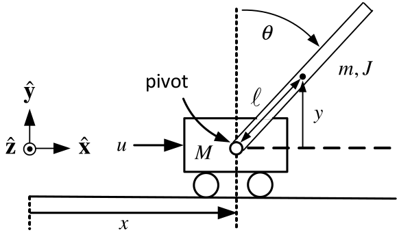

    $$\begin{aligned}
    X(s) &=\text{}\underset{G_{X}(s)}{\underbrace{\frac{\kappa (J+m\ell
    ^{2})s^{2}-\kappa mg\ell }{s^{2}(s^{2}-\alpha ^{2})}}}U(s)+\frac{-\kappa
    g(m\ell )^{2}(s\theta (0)+\dot{\theta}(0))+(s^{2}-\alpha
    ^{2})(sx(0)+\dot{x}(0))}{s^{2}(s^{2}-\alpha ^{2})} \\
    \theta (s) &=\text{}\underset{G_{\theta }(s)}{\underbrace{-\frac{\kappa
    m\ell }{s^{2}-\alpha ^{2}}}}U(s)+\frac{s\theta (0)+\dot{\theta}(0)}{
    s^{2}-\alpha ^{2}} \\
    \alpha ^{2} &=\frac{mg\ell (M+m)}{Mm\ell ^{2}+J(M+m)},\kappa =
    \frac{1}{Mm\ell ^{2}+J(M+m)}.
    \end{aligned}$$
:::

---

::: {.compact-slide .dense-slide}

Inverted Pendulum with Output Feedback of $\mathbf{x}$

Feedback of only the cart position $x$.

The inverted pendulum has an open-loop pole $p$ and an open-loop zero $z.$ $$p=\alpha =\sqrt{\frac{mg\ell (M+m)}{Mm\ell ^{2}+J(M+m)}},z=\sqrt{
\frac{mg\ell }{J+m\ell ^{2}}}.$$ With $J=m\ell ^{2}/3$ these become $$\begin{aligned}
p &=\sqrt{\frac{mg\ell (M+m)}{Mm\ell ^{2}+(m\ell ^{2}/3)(M+m)}}=\sqrt{\frac{
3}{4}\frac{g}{\ell }}\sqrt{\frac{M+m}{M+m/4}} \\
z &=\sqrt{\frac{mg\ell }{m\ell ^{2}/3+m\ell ^{2}}}=\sqrt{\frac{3}{4}\frac{g
}{\ell }}.
\end{aligned}$$

-   The [Quanser]{.smallcaps} values $M=0.57,m=0.23,\ell =0.3207. \Longrightarrow \sqrt{\dfrac{M+m}{M+m/4}}=\sqrt{\dfrac{0.57+0.23}{ 0.57+0.23/4}}=1.129$
:::

---

::: {.compact-slide .dense-slide .boundary-safe-slide}

Inverted Pendulum with Output Feedback of $\mathbf{x}$

**Open-Loop Model** $$G_{X}(s)=\frac{\kappa (J+m\ell ^{2})s^{2}-\kappa mg\ell }{s^{2}(s^{2}-\alpha
^{2})}=\frac{1.59s^{2}-36.57}{s^{2}(s^{2}-29.25)}=1.59\frac{
(s-4.7958)(s+4.7958)}{s^{2}(s-5.408)(s+5.408)}$$

**Pole Placement Controller** $$G_{c}(s)=\frac{b_{3}s^{3}+b_{2}s^{2}+b_{1}s+b_{0}}{
s^{3}+a_{2}s^{2}+a_{1}s+a_{0}}$$

Placing the seven closed-loop poles at $-5$ results in $$\begin{aligned}
G_{c}(s) &=\frac{4262s^{3}+22579s^{2}-2991s-2137}{s^{3}+35s^{2}-6240s-30583}
\\[0.3em]
&=4262\frac{(s+5.4086)(s-0.3668)(s+0.2533)}
{(s+96.4235)(s-66.2137)(s+4.7902)}.
\end{aligned}$$

-   $G_{c}(re^{j\theta })G_{X}(re^{j\theta })\approx \dfrac{-2137}{-30583} \dfrac{-36.57}{-29.25}\dfrac{e^{-j2\theta }}{r^{2}}=0.087\dfrac{e^{-j2\theta }}{r^{2}}$
:::

---

::: {.compact-slide}

Inverted Pendulum with Output Feedback of $\mathbf{x}$

$$G_{c}(s)G_{X}(s)=4262\frac{(s+5.4086)(s-0.3668)(s+0.2533)}{
(s+96.4235)(s-66.2137)(s+4.7902)}1.59\frac{(s-4.7958)(s+4.7958)}{
s^{2}(s-5.408)(s+5.408)}.$$

**Nyquist Plot**

-   $P=2$  and  $N=-2\Longrightarrow Z=N+P=-2+2=0.$

-   The closed-loop system is stable (We already knew this!).
:::

---

::: {.compact-slide .dense-slide}

Inverted Pendulum with Output Feedback of $\mathbf{x}$

**Gain and Phase Margins**

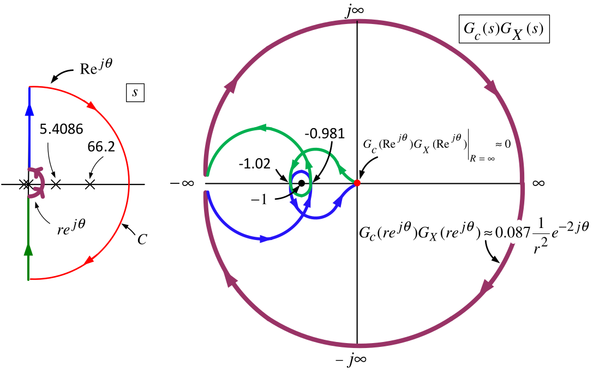

The closed-loop system $\dfrac{KG_{c}(s)G_{X}(s)}{1+KG_{c}(s)G_{X}(s)}$ is stable only when

$$\begin{aligned}
-1.02&<-\frac{1}{K}<-0.981,\\[0.3em]
0.980=\frac{1}{1.02}&<K<\frac{1}{0.981}=1.019.
\end{aligned}$$

The phase margin is only of the order $\tan ^{-1}(0.02/1)=0.02$ radians, or $1.15$ degrees.
:::

---

::: {.compact-slide .expanded-short-slide}

Inverted Pendulum with Output Feedback of $\mathbf{x}$

**Robustness**

-   The controller can be implemented accurately using a microprocessor.

-   Is our model $G_{X}(s)$ accurate enough?

-   E.g., the approximate linearized model might be closer to $0.98G_{X}(s).$

    -   If so, our controller $G_{c}(s)$ will result in an **unstable** CL system!

-   This controller is **not** robust to small uncertainty in the IP model.
:::

---

::: {.compact-slide .dense-slide}

Inverted Pendulum with Output Feedback of $\mathbf{x}$

**Sensitivity**

-   Suppose the model $G_{X}(s)$ is very accurate around the (pendulum up) operating point.

-   The controller $G_{c}(s)$ would (in all likelihood) still **not** work in practice!

    Zoom in on the Nyquist plot to understand why.

    
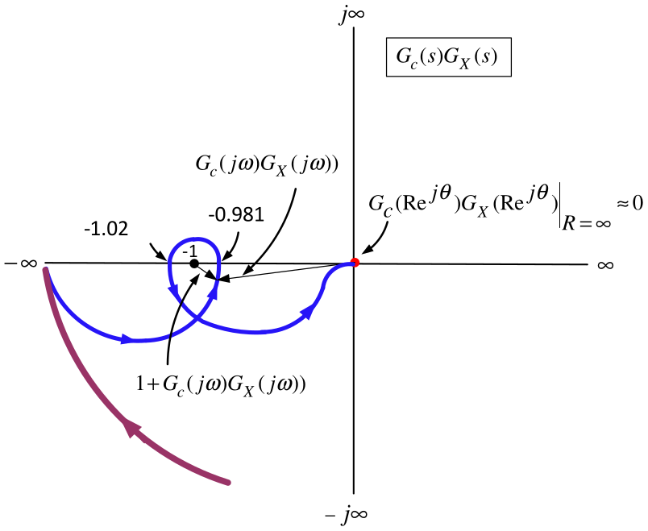

-   $1+G_{c}(j\omega )G_{X}(j\omega )$ is a vector (complex number) from $-1+j0$ to $G_{c}(j\omega )G_{X}(j\omega ).$

-   For some frequencies the length of this vector is very small (about $0.02$).
:::

---

::: {.compact-slide}

Inverted Pendulum with Output Feedback of $\mathbf{x}$

Bode diagram for $G_{c}(j\omega )G_{X}(j\omega )$.

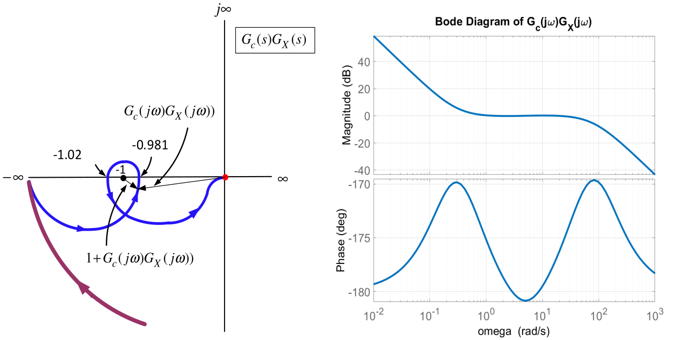

-   $G_{c}(j\omega )G_{X}(j\omega )$ is very close to $-1+j0$ for the frequency range $0.8\leq \omega \leq 12$.

-   Equivalently, $|1+G_{c}(j\omega )G_{X}(j\omega )|$ is quite small for the frequency range $0.8\leq \omega \leq 12$.
:::

---

::: {.compact-slide .dense-slide}

Inverted Pendulum with Output Feedback of $\mathbf{x}$

The **sensitivity** is defined to be $$S(j\omega )\triangleq \frac{1}{1+G_{c}(j\omega )G_{X}(j\omega )}.$$

**Bode diagram**

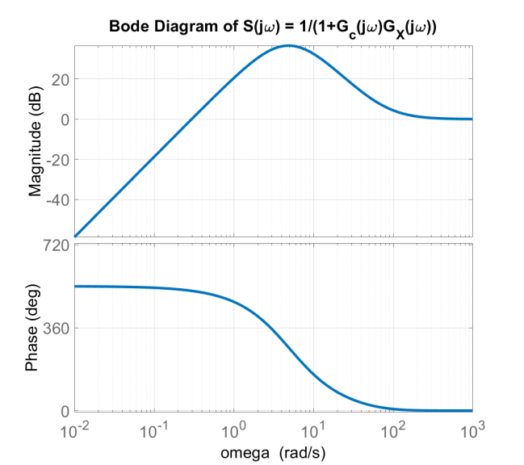

$$\begin{aligned}
|S(j\omega )|&>1\;(0\,\mathrm{dB})
&&\text{for }\omega >0.25,\\
|S(j\omega )|&>10\;(20\,\mathrm{dB})
&&\text{for }1<\omega <25,\\
\max_{\omega}|S(j\omega )|&=66.8\;(36.5\,\mathrm{dB})
&&\text{at }\omega =5.
\end{aligned}$$
:::

---

::: {.compact-slide .dense-slide .expanded-short-slide}

Inverted Pendulum with Output Feedback of $\mathbf{x}$

**Sensitivity of the Cart Position** $\mathbf{x}$ $$X(s)=\underset{G_{CL}(s)}{\underbrace{\frac{G_{c}(s)G_{X}(s)}{
1+G_{c}(s)G_{X}(s)}}}X_{ref}(s).$$

-   In the frequency range $0.8<\omega <12$ $$|S(j\omega )|=\left\vert \dfrac{1}{1+G_{c}(j\omega )G_{X}(j\omega )}
    \right\vert >10.$$

-   Thus $\left\vert 1+G_{c}(j\omega )G_{X}(j\omega )\right\vert <0.1$  and $\ 0.9<|G_{c}(j\omega )G_{X}(j\omega )|<1.1$  $\Longrightarrow$

    $$\left\vert \dfrac{G_{c}(j\omega )G_{X}(j\omega )}{1+G_{c}(j\omega
    )G_{X}(j\omega )}\right\vert >(10)(0.9)=9.$$

-   With $R_{0}=0.1$ and $\omega =0.8$ ($0.13$ Hz) set $r(t)=R_{0}\sin (\omega t)$.

-   Then $$x(t)\rightarrow x_{ss}(t)=0.1\underset{9}{\underbrace{|G_{CL}(j0.8)|}}\sin
    (0.8t+\angle G_{CL}(j0.8))=0.9\sin (0.8t+\angle G_{CL}(j0.8)).$$

-   In the freq range where $|S(j\omega )|$ is large, the steady-state response will be large.
:::

---

::: {.compact-slide .dense-slide .boundary-safe-slide}

Inverted Pendulum with Output Feedback of $\mathbf{x}$

**Sensitivity of the Pendulum Rod Angle** $\mathbf{\theta }$

$$X(s)=\text{}\underset{G_{X}(s)}{\underbrace{\frac{\kappa (J+m\ell
^{2})s^{2}-\kappa mg\ell }{s^{2}(s^{2}-\alpha ^{2})}}}U(s),\qquad
\theta (s)=\text{}\underset{G_{\theta }(s)}{\underbrace{-\frac{\kappa m\ell
}{s^{2}-\alpha ^{2}}}}U(s)$$

The transfer function from $\theta (s)$ to $X(s)$ is $$\begin{aligned}
X(s)=G_{X}(s)U(s)=G_{X}(s)\frac{1}{G_{\theta }(s)}\theta (s) &=\frac{\dfrac{
\kappa (J+m\ell ^{2})s^{2}-\kappa mg\ell }{s^{2}(s^{2}-\alpha ^{2})}}{-
\dfrac{\kappa m\ell }{s^{2}-\alpha ^{2}}}\theta (s) \\
&=-\frac{(J+m\ell ^{2})s^{2}-mg\ell }{m\ell s^{2}}\theta (s).
\end{aligned}$$

Solve for $\theta (s)$ and use $X(s)=\dfrac{G_{c}(s)G_{X}(s)}{ 1+G_{c}(s)G_{X}(s)}X_{ref}(s)$ to obtain $$\theta (s)=\underset{G_{\theta X}(s)}{\text{}\underbrace{-\frac{m\ell
s^{2}}{\left( J+m\ell ^{2}\right) s^{2}-mg\ell }}}X(s)=\text{}\underset{
G_{\theta X_{ref}}(s)}{\underbrace{G_{\theta X}(s)\frac{G_{c}(s)G_{X}(s)}{
1+G_{c}(s)G_{X}(s)}}}X_{ref}(s).$$
:::

---

::: {.compact-slide}

Inverted Pendulum with Output Feedback of $\mathbf{x}$

$$\theta (s)=\text{}\underset{G_{\theta X_{ref}}(s)}{\underbrace{G_{\theta
X}(s)\frac{G_{c}(s)G_{X}(s)}{1+G_{c}(s)G_{X}(s)}}}X_{ref}(s).$$

**Bode Magnitude Plot  **(closed-loop poles at -5)

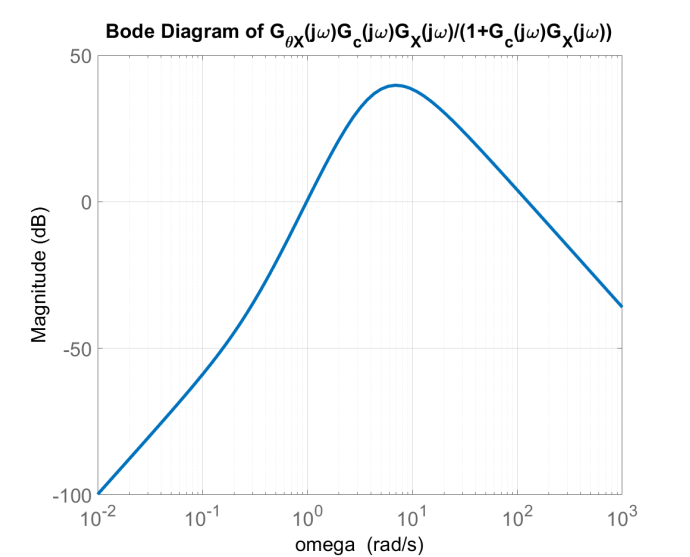

-   For $1.9<\omega <39$ the Bode diagram shows $|G_{\theta X_{ref}}(j\omega )|>10.$

-   $\max\limits_{\omega }|G_{\theta X_{ref}}(j\omega )|=96.7$ ($39.7$ dB) for $\omega =7.$
:::

---

::: {.compact-slide .dense-slide .boundary-safe-slide .expanded-short-slide}

Inverted Pendulum with Output Feedback of $\mathbf{x}$

$$\theta (s)=\text{}\underset{G_{\theta X_{ref}}(s)}{\underbrace{G_{\theta
X}(s)\frac{G_{c}(s)G_{X}(s)}{1+G_{c}(s)G_{X}(s)}}}X_{ref}(s).$$

-   $X_{ref}(t)=R_{0}\sin (\omega t)$ results in $$\theta (t)\rightarrow \theta _{ss}(t)=R_{0}|G_{\theta X_{ref}}(j\omega
    )|\sin (\omega t+\angle G_{\theta X_{ref}}(j\omega )).$$

-   E.g., $R_{0}=0.02$ meter & $\omega =7$ ($1.1$ Hz) $$\theta _{ss}(t)=R_{0}\underset{96.7}{\underbrace{|G_{\theta X_{ref}}(j7)|}}
    \sin (7t+\angle G_{\theta X_{ref}}(j7))=1.93\sin (7t+\angle G_{\theta
    X_{ref}}(j7)).$$

-   $\theta _{ss}(t)$ is oscillating between $\pm 1.93$ rads or $\pm 111^{\circ }!$

-   The linear models $G_{X}(s),G_{\theta }(s)$ are valid for a variation in $\theta$ of perhaps $\pm 20^{\circ }$.

-   If $\theta (t)$ varies too far from $0$ then the linear models $G_{X}(s),G_{\theta }(s)$

    no longer accurately represent the nonlinear model of the pendulum.

-   $G_{c}(s)$ in all likelihood won't stabilize the actual (nonlinear) inverted pendulum.
:::

---

::: {.compact-slide .dense-slide .multi-figure-slide}

Inverted Pendulum with Output Feedback of $\mathbf{x}$

** - Disturbances**

The small gear wheel is powered by a DC motor and interacts with the track.

Let $D(s)$ denote any disturbance due to slippage/backlash between the gear teeth.

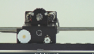

$$\begin{aligned}
X(s) &=\text{}\underset{G_{XD}(s)}{\underbrace{-\frac{G_{X}(s)}{
1+G_{c}(s)G_{X}(s)}}}D(s) \\
\theta _{D}(s) &=\underset{G_{\theta X}(s)}{\text{}\underbrace{-\frac{
m\ell s^{2}}{\left( J+m\ell ^{2}\right) s^{2}-mg\ell }}}X(s)=\text{}
\underset{G_{\theta D}(s)}{\underbrace{-\frac{G_{\theta X}G_{X}(s)}{
1+G_{c}(s)G_{X}(s)}}}D(s).
\end{aligned}$$
:::

---

::: {.compact-slide .expanded-body-slide .expanded-figure-slide}

Inverted Pendulum with Output Feedback of $\mathbf{x}$

** - Disturbances**

-   $G_{XD}(s)=X(s)/D(s)$ & $G_{\theta D}(s)=\theta (s)/D(s)$ are stable by design.

-   The sensitivity $S(s)\triangleq \dfrac{1}{1+G_{c}(s)G_{X}(s)}$ is a factor of both.

-   Bode diagram shows for $0\leq \omega <1$ ($0\leq f\leq 0.16$) that $|G_{XD}(j\omega )|=14$ ($23$ dB$).$ 

    
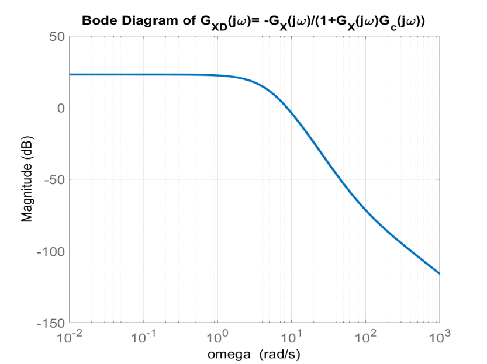

:::

---

::: {.compact-slide}

Output Feedback of the Cart Position - Disturbances

For $2.8<\omega <4.6$ ($0.45<f<0.73$), $|G_{\theta D}(j\omega )|>5$ (14 dB).

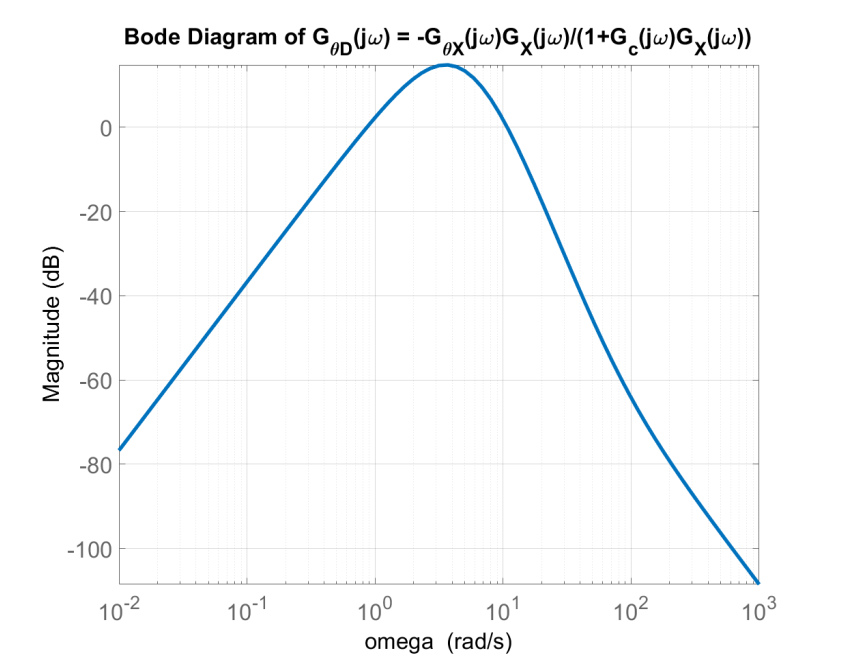

If $d(t)=0.05\sin (2.8t)$ then $$\theta _{ss}(t)=|G_{\theta D}(j2.8)|(0.05)\sin (2.8t+\angle G_{\theta
D}(j2.8))$$

-   $|G_{\theta D}(j2.8)|(0.05)>5(0.05)=0.25$ radians or $14.8^{\circ }.$

-   A small disturbance can cause the pendulum angle to swing far from $\theta =0.$
:::

---

::: {.compact-slide .dense-slide .boundary-safe-slide}

Right Half-Plane Poles & Zeros and the Control Problem

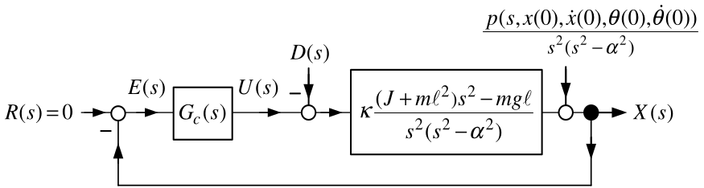

-   Surprisingly, as shown below, **no** $G_{c}(s)$ can fix this sensitivity problem!

-   The fundamental problem is trying to control the inverted pendulum using only $x.$

    With $x$ as output, the transfer function model is $$\frac{X(s)}{U(s)}=G_{X}(s)=\frac{1.59s^{2}-36.57}{s^{2}(s^{2}-29.25)}=1.59
    \frac{(s-4.7958)(s+4.7958)}{s^{2}(s-5.408)(s+5.408)}.$$

-   The inverted pendulum has a pole at $5.408$ and a zero at $4.7958$ .

-   These are in the **open right-half plane** and are **close together** in value.

-   **Any** stabilizing controller will result in the closed-loop system being

    very sensitive to modeling errors, disturbance inputs, reference inputs, etc.

-   We explain all this in what follows.
:::

---

::: {.compact-slide .dense-slide .expanded-short-slide}

Right Half-Plane Poles & Zeros and the Control Problem

-   We need to present some theorems on sensitivity.

**Theorem** $\int_{0}^{\infty }\log _{10}|S(j\omega )|d\omega =0$ *   (Bode)*

Let $$S(j\omega )=\frac{1}{1+G_{c}(j\omega )G(j\omega )}.$$ If

\(a\) $S(j\omega )$ is stable

\(b\) $G_{c}(j\omega )G(j\omega )$ has no poles in the *open* right half-plane.

\(c\) $G_{c}(j\omega )G(j\omega )=\dfrac{b_{c}(j\omega )b(j\omega )}{ a_{c}(j\omega )a(j\omega )}$ has relative degree of at least 2, i.e., $$\deg \{a_{c}(s)a(s)\}-\deg \{b_{c}(s)b(s)\}\geq 2.$$

Then $$\int_{0}^{\infty }\log _{10}|S(j\omega )|d\omega =0.$$

We work a simple example to illustrate this theorem.
:::

---

::: {.compact-slide .expanded-body-slide .expanded-figure-slide}

Example

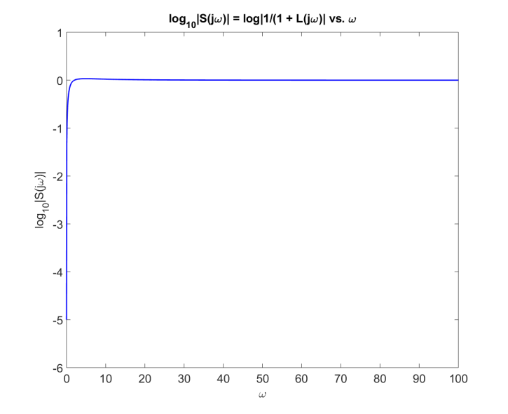

:::

---

::: {.compact-slide .expanded-body-slide .expanded-figure-slide}

Example

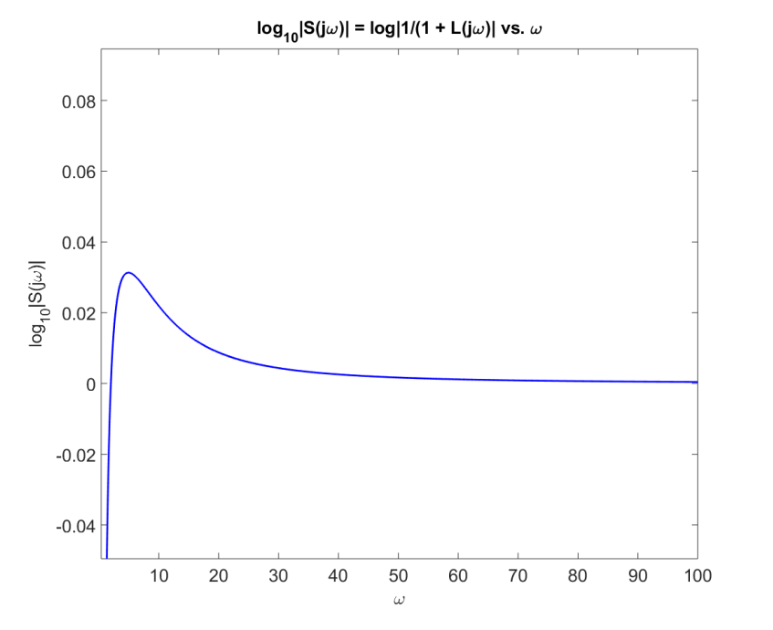

:::

---

::: {.compact-slide .dense-slide .boundary-safe-slide}

Inverted Pendulum

* *$G_{X}(s)=\dfrac{1.59s^{2}-36.57}{ s^{2}(s^{2}-29.25)}$

With $G_{c}(s)$ designed to place the closed-loop poles at $-5, G_{c}(s)G(s)$ is $$G_{c}(s)G(s)=4262\frac{(s+5.4086)(s-0.3668)(s+0.2533)}{
(s+96.4235)(s-66.2137)(s+4.7902)}1.59\frac{(s-4.7958)(s+4.7958)}{
s^{2}(s-5.408)(s+5.408)}.$$

-   The relative degree of $G_{c}(s)G(s)$ is two.

-   $S(s)=\dfrac{1}{1+G_{c}(s)G_{X}(s)}$ is stable by our choice $G_{c}(s).$

-   $G_{c}(s)G(s)$ has **right half-plane** poles at $s=5.408$ and $66.2137.$

**Theorem** $\ \int_{0}^{\infty }\log _{10}|S(j\omega )|d\omega =\pi \log _{10}(e)\sum_{i=1}^{N_{p}}\operatorname{Re}\{p_{i}\}$    (*Freudenberg and Looze)*

Let $$S(j\omega )=\frac{1}{1+\underset{L(j\omega )}{\underbrace{G_{c}(j\omega
)G(j\omega )}}}.$$

\(a\) $S(j\omega )$ is stable

\(b\) $G_{c}(j\omega )G(j\omega )$ has $n_{p}$ poles in the open right half-plane at $p_{1},p_{2},...,p_{n_{p}}$.

\(c\) $G_{c}(j\omega )G(j\omega )=\dfrac{b_{c}(j\omega )b(j\omega )}{ a_{c}(j\omega )a(j\omega )}$ has relative degree of at least 2, i.e., $$\deg \{a_{c}(s)a(s)\}-\deg \{b_{c}(s)b(s)\}\geq 2.$$

Then $$\int_{0}^{\infty }\log _{10}|S(j\omega )|d\omega =\pi \underset{0.434}{
\underbrace{\log _{10}(e)}}\sum_{i=1}^{n_{p}}\operatorname{Re}\{p_{i}\}.$$
:::

---

::: {.compact-slide .expanded-body-slide .expanded-figure-slide}

Inverted Pendulum

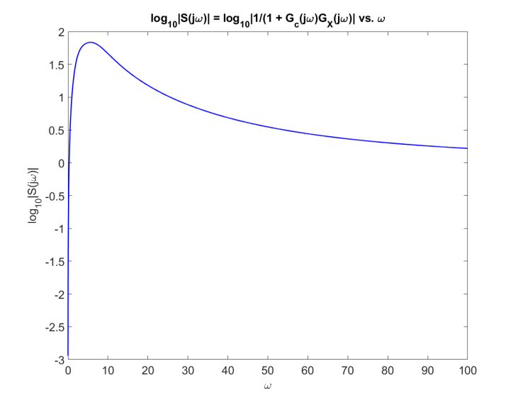

:::

---

::: {.compact-slide .dense-slide .boundary-safe-slide}

Inverted Pendulum

* *$S(j\omega )=\dfrac{1}{1+G_{c}(j\omega )G_{X}(j\omega )}$

-   $S(j\omega )=\dfrac{1}{1+G_{c}(j\omega )G_{X}(j\omega )}$

-   $G_{c}(j\omega )$ proper & $G_{X}(j\omega )$ strictly proper $\implies \lim_{\omega \rightarrow \infty }|G_{c}(j\omega )G_{X}(j\omega )|=0$ and so $$\lim_{\omega \rightarrow \infty }\log _{10}|S(j\omega )|=\lim_{\omega
    \rightarrow \infty }\log _{10}\left\vert \dfrac{1}{1+G_{c}(j\omega
    )G_{X}(j\omega )}\right\vert =0.$$

-   $\lim_{\omega \rightarrow 0}|G_{X}(j\omega )|=\infty \implies \lim_{\omega \rightarrow 0}|G_{c}(j\omega )G_{X}(j\omega )|=\infty$ and so $$\lim_{\omega \rightarrow 0}\log _{10}|S(j\omega )|=\lim_{\omega \rightarrow
    0}\log _{10}\left\vert \dfrac{1}{1+G_{c}(j\omega )G_{X}(j\omega )}
    \right\vert =-\infty .$$

-   The theorem tells us that $|S(j\omega )|=\left\vert \dfrac{1}{ 1+G_{c}(j\omega )G_{X}(j\omega )}\right\vert$ has more positive area than negative area.

-   This positive area must be at lower frequencies as $\lim_{\omega \rightarrow \infty }\log _{10}|S(j\omega )|=0$.

-   **Any** stabilizing controller $G_{c}(s)$ must result in $$\int_{0}^{\infty }\log _{10}|S(j\omega )|d\omega \geq \pi \log
    _{10}(e)(5.408)=7.38.$$

-   The sensitivity integral gives a **fundamental limitation** to design a $G_{c}(s)$ to reduce $|S(j\omega )|.$

**Summary**

Any unity feedback controller (slide the earlier derivation) for $G_{X}(s)=\dfrac{ 1.59s^{2}-36.57}{s^{2}(s^{2}-29.25)}$ will result in a large sensitivity. In practice this system is impossible to control!
:::

---

::: {.compact-slide .dense-slide .boundary-safe-slide}

Poisson Integral for Sensitivity

-   Right half-plane poles result in the closed-loop sensitivity being large.

-   Right half-plane zeros **close** to right half-plane poles demonstrate this as well.

Recall $G_{c}(s)G_{X}(s)$ for the inverted pendulum is $$G_{c}(s)G_{X}(s)=4262\frac{(s+5.4086)(s-0.3668)(s+0.2533)}{
(s+96.4235)(s-66.2137)(s+4.7902)}1.59\frac{(s-4.7958)(s+4.7958)}{
s^{2}(s-5.408)(s+5.408)}.$$

-   $G_{c}(s)G_{X}(s)$ has an open RHP pole at $p_{1}=5.408$ from $G_{X}(s)$ and

    an open RHP pole at $p_{2}=66.2137$ from $G_{c}(s)$.

-   $G_{c}(s)G_{X}(s)$ has an open RHP zero at $z_{1}=4.7958$ from $G_{X}(s)$ and

    an open RHP zero at $z_{2}=0.3668$ from $G_{c}(s)$.

There is a **Poisson integral** for each zero in the open RHP:

$$\begin{aligned}
I(z_1)&\triangleq \int_{0}^{\infty }\log _{10}|S(j\omega )|
\frac{z_{1}}{z_{1}^{2}+\omega ^{2}}\,d\omega \\
&=-\pi \log _{10}(e)\left[
\log _{10}\left\vert \frac{z_{1}-p_{1}}{z_{1}+p_{1}}\right\vert
+\log _{10}\left\vert \frac{z_{1}-p_{2}}{z_{1}+p_{2}}\right\vert
\right],\\[0.35em]
I(z_2)&\triangleq \int_{0}^{\infty }\log _{10}|S(j\omega )|
\frac{z_{2}}{z_{2}^{2}+\omega ^{2}}\,d\omega \\
&=-\pi \log _{10}(e)\left[
\log _{10}\left\vert \frac{z_{2}-p_{1}}{z_{2}+p_{1}}\right\vert
+\log _{10}\left\vert \frac{z_{2}-p_{2}}{z_{2}+p_{2}}\right\vert
\right].
\end{aligned}$$
:::

---

::: {.compact-slide .dense-slide .boundary-safe-slide .expanded-short-slide}

Poisson Integral for Sensitivity

Evaluating the Poisson integral for $z_{1}$ gives $$\begin{aligned}
\int_{0}^{\infty }\log _{10}|S(j\omega )|\frac{4.7958}{
(4.7958)^{2}+\omega ^{2}}d\omega  &=-\pi \log
_{10}(e)\left( \log _{10}\left\vert \frac{4.7958-5.408}{4.7958+5.408}
\right\vert +\log _{10}\left\vert \frac{4.7958-66.2137}{4.7958+66.2137}
\right\vert \right) \\
 &=-\pi \log _{10}(e)\left( -1.222-0.063\right)
=1.753.
\end{aligned}$$

Multiplying both sides by $z_{1}=4.7958$ to obtain $$\int_{0}^{\infty }\log _{10}|S(j\omega )|\frac{1}{1+(\omega /4.7958)^{2}}
d\omega =(1.753)(4.7958)=8.41.$$

-   No matter what (stabilizing) controller is designed we have $$\int_{0}^{\infty }\log _{10}|S(j\omega )|\frac{1}{1+(\omega /4.7958)^{2}}
    d\omega \geq -\pi \log _{10}(e)\left( -1.222\right) (4.7958)=7.996.$$

    due to the RHP pole and zero of $G_{X}(s).$

-   Further, as $\dfrac{1}{1+(\omega /4.7958)^{2}}$ drops off rapidly towards $0$ for $\omega >z_{1}=4.7958,|S(j\omega )|$ must be large at the lower frequencies in order to satisfy the inequality.

-   A different scheme (i.e., not just feedback of $x$) is needed to control the inverted pendulum.
:::

---

::: {.compact-slide .dense-slide .expanded-figure-slide}

Inverted Pendulum with Output

$y(t)=x(t)+\left( \ell +\frac{J}{ m\ell }\right) \theta (t)$

$$\begin{aligned}
Y(s) &=X(s)+\left( \ell +\frac{J}{m\ell }\right) \theta (s) \\
&=\frac{\kappa (J+m\ell ^{2})s^{2}-\kappa mg\ell }{s^{2}(s^{2}-\alpha ^{2})}U(s)
-\kappa \left( \ell +\frac{J}{m\ell }\right)
\frac{m\ell s^{2}}{s^{2}(s^{2}-\alpha ^{2})}U(s) \\
&\quad+\frac{\left( (J/(m\ell )+\ell )s^{2}-\kappa g(m\ell )^{2}\right)
(s\theta (0)+\dot{\theta}(0))+(s^{2}-\alpha ^{2})(sx(0)+\dot{x}(0))}
{s^{2}(s^{2}-\alpha ^{2})} \\
&=\underset{G_{Y}(s)}{\underbrace{-\frac{\kappa mg\ell }{s^{2}(s^{2}-\alpha
^{2})}}}U(s)+\frac{p_{Y}(s)}{s^{2}(s^{2}-\alpha ^{2})}.
\end{aligned}$$

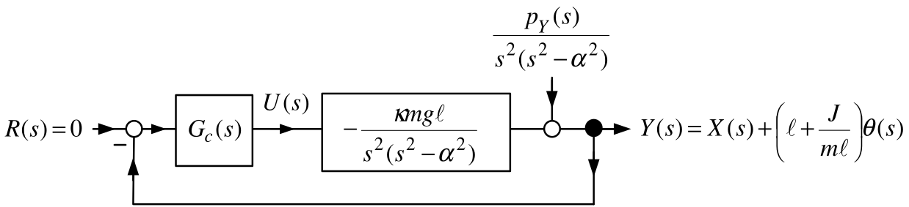

-   Note that $G_{Y}(s)$ has no right half-plane zeros.
:::

---

::: {.compact-slide .dense-slide .boundary-safe-slide .expanded-short-slide}

Inverted Pendulum with Output

$y(t)=x(t)+\left( \ell +\frac{J}{ m\ell }\right) \theta (t)$

Using the [Quanser]{.smallcaps} parameter values ($\kappa mg\ell =36.57,\alpha ^{2}=29.26$) $$G_{Y}(s)=\frac{-36.57}{s^{2}(s^{2}-29.26)}=\frac{-36.57}{
s^{2}(s+5.409)(s-5.409)}.$$

To arbitrarily place the closed-loop poles let $G_{c}(s)$ have the form $$G_{c}(s)=\dfrac{b_{c}(s)}{a_{c}(s)}=\frac{b_{3}s^{3}+b_{2}s^{2}+b_{1}s+b_{0}
}{s^{3}+a_{2}s^{2}+a_{1}s+a_{0}}.$$

Choosing the closed-loop poles to be at $-5$ results in $$\begin{aligned}
G_{c}(s) &=-\frac{1041.6s^{3}+6113.7s^{2}+2990.8s+2136.3}{
s^{3}+35s^{2}+554.3s+5399} \\
&=-1041.6\frac{(s+5.409)(s^{2}+0.46s+0.3792)}{
(s+20.835)(s^{2}+14.17s+259.13)}.
\end{aligned}$$

-   Note that $G_{c}(s)$ also has no RHP poles or zeros.
:::

---

::: {.compact-slide .dense-slide}

Inverted Pendulum with Output

$y(t)=x(t)+\left( \ell +\frac{J}{ m\ell }\right) \theta (t)$

$$G_{c}(s)G_{Y}(s)=-1041.6\frac{(s+5.409)(s^{2}+0.46s+0.3792)}{
(s+20.835)(s^{2}+14.17s+259.13)}\frac{-36.57}{s^{2}(s+5.409)(s-5.409)}.$$

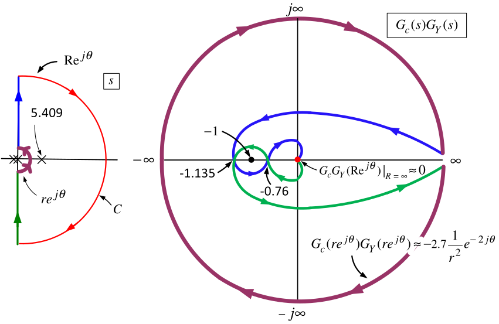

The closed-loop transfer function $\dfrac{KG_{c}(s)G_{Y}(s)}{ 1+KG_{c}(s)G_{Y}(s)}$ is stable for $$-1.135<-\dfrac{1}{K}<-0.78\qquad\text{or}\qquad 0.881=\frac{1}{1.135}<K<\frac{1}{
0.78}=1.282,$$

Gain margin is still small (compare with $0.980\,<K<1.019$ using $x$ as output).

The phase margin turns out to be about $7^{\circ }$ ($1.15^{\circ }$ using $x$ as output).
:::

---

::: {.compact-slide .dense-slide}

Inverted Pendulum with Output

$y(t)=x(t)+\left( \ell +\frac{J}{ m\ell }\right) \theta (t)$

$$G_{c}(s)G_{Y}(s)=-1041.6\frac{(s+5.409)(s^{2}+0.46s+0.3792)}{
(s+20.835)(s^{2}+14.17s+259.13)}\frac{-36.57}{s^{2}(s+5.409)(s-5.409)}.$$

-   Only one pole in the open RHP. 

-   No zeros in the open RHP.

-   $\int_{0}^{\infty }\log _{10}|S(j\omega )|d\omega =\pi \log _{10}(e)\left( 5.409\right) =\pi \log _{10}(e)\left( 5.409\right) =7.38.$

-   $\max\limits_{\omega \geq 0}\{\log _{10}|S(j\omega )|\}=0.94$, or $\max\limits_{\omega \geq 0}\{|S(j\omega )|\}=8.7.$

    
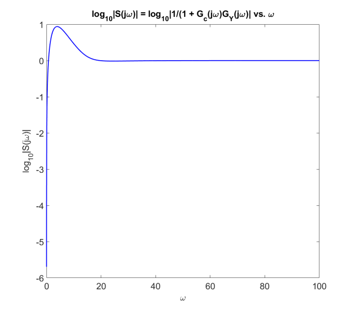

:::

---

::: {.compact-slide .dense-slide .boundary-safe-slide}

Inverted Pendulum with State Feedback

$$\begin{aligned}
\underset{dz/dt}{\underbrace{\left[
\begin{array}{c}
dx/dt \\
dv/dt \\
d\theta /dt \\
d\omega /dt
\end{array}
\right] }} &=\underset{A}{\underbrace{\left[
\begin{array}{cccc}
0 & 1 & 0 & 0 \\
0 & 0 & -\kappa gm^{2}\ell ^{2} & 0 \\
0 & 0 & 0 & 1 \\
0 & 0 & \kappa mg\ell (M+m) & 0
\end{array}
\right] }}\underset{z}{\underbrace{\left[
\begin{array}{c}
x \\
v \\
\theta \\
\omega
\end{array}
\right] }}+\underset{b}{\underbrace{\left[
\begin{array}{c}
0 \\
\kappa (J+m\ell ^{2}) \\
0 \\
-\kappa m\ell
\end{array}
\right] }}u \\
u(t) &=-\left[
\begin{array}{cccc}
k_{1} & k_{2} & k_{3} & k_{4}
\end{array}
\right] \underset{z(t)}{\underbrace{\left[
\begin{array}{c}
x(t) \\
v(t) \\
\theta (t) \\
\omega (t)
\end{array}
\right] }}
\end{aligned}$$

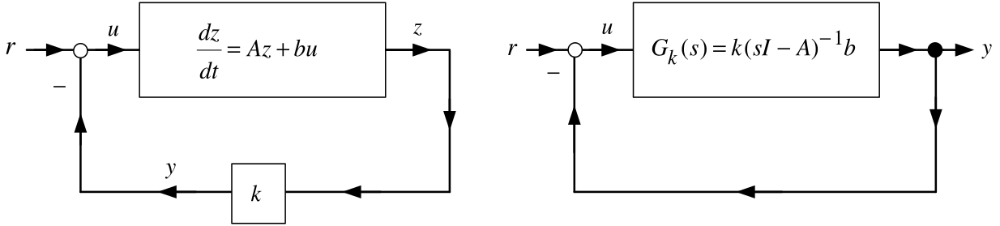

:::

---

::: {.compact-slide .dense-slide}

Inverted Pendulum with State Feedback

-   Let $y=kz$ and $G_{k}(s)\triangleq k(sI-A)^{-1}b.$

-   Choose $k\in \mathbb{R} ^{1\times 5}$ to place the closed-loop poles at $-5.$ $$\begin{aligned}
    k &=\left[
    \begin{array}{cccc}
    -29.0255 & -23.2204 & -56.4917 & -12.0901
    \end{array}
    \right] \\
    G_{k}(s)=k(sI-A)^{-1}b &=\frac{20s^{3}+179.3s^{2}+500s+625}{s^{4}-29.3s^{2}}
    &=\frac{20(s+5.41)(s^{2}+3.55s+5.777)}{s^{2}(s+5.409)(s-5.409)}.
    \end{aligned}$$

-   Note that $G_{k}(s)$ has no right half-plane zeros.

-   $G_{k}(s)$ has a single pole in the *open* right-half plane at $5.409$.
:::

---

::: {.compact-slide .dense-slide}

Inverted Pendulum with State Feedback

$$G_{k}(s)=k(sI-A)^{-1}b=\frac{20(s+5.41)(s^{2}+3.55s+5.777)}{
s^{2}(s+5.409)(s-5.409)}.$$

-   The pole at $5.409$ of $G_{c}(s)G_{k}(s)$ is inside the Nyquist contour so $P=1.$

-   The Nyquist plot goes around $-1+j0$ once in the CCW direction so $N=-1.$

-   $Z=N+P=0$ showing the closed-loop system is stable (as we already knew!).

-   $\dfrac{K_{gain}G_{k}(s)}{1+K_{gain}G_{k}(s)}$ is stable for $-2.83<-1/K_{gain}<0$  or  $K_{gain}>1/2.83=0.353.$

-   Using [Matlab]{.smallcaps} the phase margin is $64^{\circ }.$
:::

---

::: {.compact-slide .dense-slide}

Inverted Pendulum with State Feedback

$$G_{k}(s)=k(sI-A)^{-1}b=\frac{20(s+5.41)(s^{2}+3.55s+5.777)}{
s^{2}(s+5.409)(s-5.409)}.$$

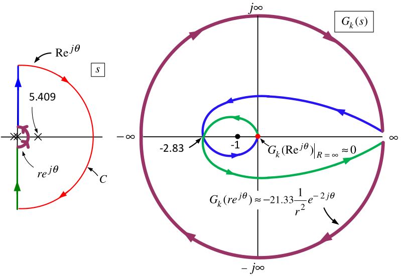

-   The sensitivity function is $S_{k}(j\omega )=\dfrac{1}{1+G_{k}(j\omega )}.$

-   $G_{k}(s)$ has one right half-plane pole and no right half-plane zeros.

-   However $G_{k}(s)$ has relative degree 1 so the previous sensitivity theorems do not apply!
:::

---

::: {.compact-slide .dense-slide .boundary-safe-slide .expanded-short-slide}

Inverted Pendulum with State Feedback

**Theorem** $\ \int_{0}^{\infty }\log _{10}|S(j\omega )|d\omega =\log _{10}(e)\left( -\eta \dfrac{\pi }{2}+\pi \sum\nolimits_{i=1}^{N_{p}}\operatorname{Re} \{p_{i}\}\right)$  

Define $$\begin{aligned}
S(j\omega ) &\triangleq &\frac{1}{1+\underset{L(j\omega )}{\underbrace{
G_{c}(j\omega )G(j\omega )}}} \\
\eta &\triangleq &\lim_{s\rightarrow \infty }sG_{c}(s)G(s).
\end{aligned}$$ Suppose

\(a\) $S(j\omega )$ is stable,

\(b\) $L(j\omega )=G_{c}(j\omega )G(j\omega )$ has $n_{p}$ poles in the open RHP at $p_{1},p_{2},...,p_{n_{p}}$ and

\(c\) $L(j\omega )=G_{c}(j\omega )G(j\omega )=\dfrac{b_{c}(j\omega )b(j\omega ) }{a_{c}(j\omega )a(j\omega )}$ has relative degree 1 or greater.

Then $$\int_{0}^{\infty }\log _{10}|S(j\omega )|d\omega =\log _{10}(e)\left( -\eta
\dfrac{\pi }{2}+\pi \sum\limits_{i=1}^{N_{p}}\operatorname{Re}\{p_{i}\}\right) .$$ Note $\log _{10}(e)=0.434$.
:::

---

::: {.compact-slide .dense-slide .boundary-safe-slide .expanded-short-slide}

Inverted Pendulum with State Feedback

$$G_{k}(s)=\frac{20s^{3}+179.3s^{2}+500s+625}{s^{4}-29.3s^{2}}=\frac{
20(s+5.41)(s^{2}+3.55s+5.777)}{s^{2}(s+5.409)(s-5.409)}.$$

-   The sensitivity function is $S_{k}(j\omega )=\dfrac{1}{1+G_{k}(j\omega )}.$

-   $G_{k}(s)$ has one right half-plane pole and no right half-plane zeros.

-   $G_{k}(s)$ has relative degree 1.

-   $\eta \triangleq \lim_{s\rightarrow \infty }sG_{k}(s)=20$. $$\int_{0}^{\infty }\log _{10}|S_{k}(j\omega )|d\omega =\log _{10}(e)\left( -20
    \dfrac{\pi }{2}+\pi (5.409)\right) =-6.264.$$

-   The integral of the logarithm of the sensitivity is *negative*!

-   We do not expect $|S_{k}(j\omega )|$ to be large. If fact, $\max\limits_{\omega \geq 0}|S_{k}(j\omega )|\leq 1!$

-   However this is the sensitivity of the output $$y=kz=k_{1}x+k_{2}v+k_{3}\theta +k_{4}\omega .$$

-   We are really interested in the sensitivity of the output $\theta !$
:::

---

::: {.compact-slide .dense-slide .boundary-safe-slide}

Inverted Pendulum with State Feedback

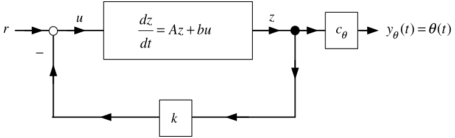

$$\frac{dz}{dt}=Az+bu,u=-kz+r,y_{\theta }=\underset{
c_{\theta }}{\underbrace{\left[
\begin{array}{cccc}
0 & 0 & 1 & 0
\end{array}
\right] }}\underset{z}{\underbrace{\left[
\begin{array}{c}
x \\
v \\
\theta \\
\omega
\end{array}
\right] }}$$ $$\frac{\theta (s)}{R(s)}=G_{\theta }(s)=c_{\theta }\left( sI-
(A-bk)\right) ^{-1}b=-\frac{m\kappa \ell s^{2}}{(s+5)^{4}}.$$

-   With the [Quanser]{.smallcaps} values for $m,\kappa ,\ell$ it turns out that $\max\limits_{\omega \geq 0}|G_{\theta }(j\omega )|\leq 0.032.$

-   Disturbances $d(t)$ acting at the input $u(t)$ result in small changes in $\theta (t).$

-   If there is a step disturbance $d(t)=D_{0}u_{s}(t)$ at the input then $$\lim_{t\rightarrow \infty }\theta (t)=\lim_{s\rightarrow 0}sG_{\theta }(s)
    \frac{D_{0}}{s}=\lim_{s\rightarrow 0}-\frac{m\kappa \ell s}{(s+5)^{4}}
    D_{0}=0.$$

-   The pendulum rod angle is still kept at $\theta =0!$
:::

---

::: {.compact-slide .dense-slide .multi-figure-slide}

Inverted Pendulum with an Integrator and State Feedback

Let's look at the sensitivity of adding an integrator to the state feedback scheme.

With $c=\left[ \begin{array}{cccc} 1 & 0 & 0 & 0 \end{array} \right]$ and $G_{k}(s)\triangleq c(sI-(A-bk))^{-1}b$ we have

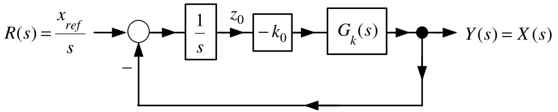

$k_{a}=\left[ \begin{array}{cc} k & k_{0} \end{array} \right] =\left[ \begin{array}{ccccc} -85.4514 & -37.9043 & -111.4406 & -22.9103 & 85.4514 \end{array} \right]$

puts all of the CL poles at $-5$ and $$\begin{aligned}
G_{k}(s)=c(sI-(A-bk))^{-1}b &=\frac{1.59s^{2}-36.57}{
s^{4}+25s^{3}+250s^{2}+1386s+3125} \\
&=1.59\frac{(s+4.7958)(s-4.7958)}{
(s+13.5367)(s+1.2474)(s^{2}+10.216s+9.0599)}.
\end{aligned}$$
:::

---

::: {.compact-slide .expanded-body-slide .expanded-figure-slide}

Inverted Pendulum with an Integrator and State Feedback

With $G_{k_{0}}(s)\triangleq -\dfrac{k_{0}}{s},$ the sensitivity function is $$S(s)=\frac{1}{1+G_{k_{0}}(s)G_{k}(s)}=\frac{1}{1+\dfrac{-k_{0}}{s}G_{k}(s)}.$$

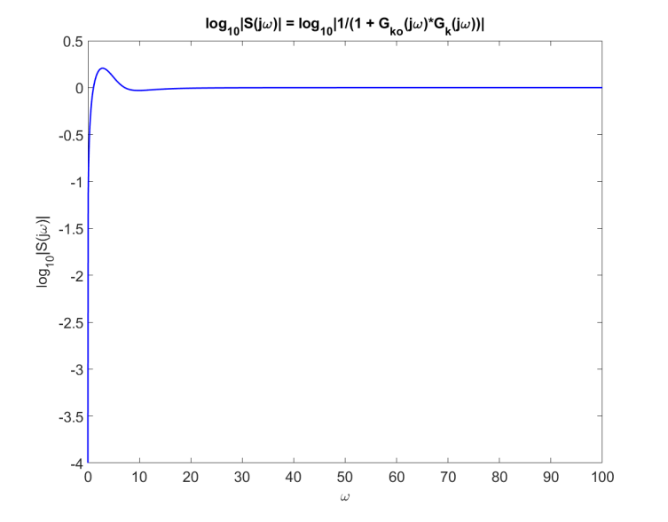

-   $\max_{\omega }|S(j\omega )|=1.6092$  ($0.2066$ dB) at $\omega =2.88.$
:::

---

::: {.compact-slide .dense-slide .boundary-safe-slide}

Inverted Pendulum with an Integrator and State Feedback

Let's compute the closed-loop transfer function from $R(s)$ to $\theta (s)$.

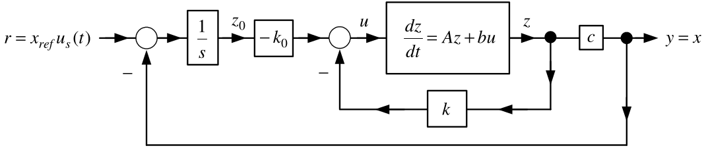

The statespace setup is $$\begin{aligned}
\frac{d}{dt}\underset{z_{a}\in
\mathbb{R}
^{5}}{\underbrace{\left[
\begin{array}{c}
z \\
z_{0}
\end{array}
\right] }} &=\underset{A_{a}\in
\mathbb{R}
^{5\times 5}}{\underbrace{\left[
\begin{array}{rl}
A & 0_{4\times 1} \\
-c & 0
\end{array}
\right] }}\underset{z_{a}\in
\mathbb{R}
^{5}}{\underbrace{\left[
\begin{array}{c}
z \\
z_{0}
\end{array}
\right] }}+\underset{b_{a}\in
\mathbb{R}
^{5}}{\underbrace{\left[
\begin{array}{c}
b \\
0
\end{array}
\right] }}u \\
u &=-\underset{k_{a}\in
\mathbb{R}
^{1\times 5}}{\underbrace{\left[
\begin{array}{cc}
k & k_{0}
\end{array}
\right] }}\underset{z_{a}\in
\mathbb{R}
^{5}}{\underbrace{\left[
\begin{array}{c}
z \\
z_{0}
\end{array}
\right] }}+r. \\
y_{\theta } &=\theta =\underset{c_{\theta a}\in
\mathbb{R}
^{1\times 5}}{\underbrace{\left[
\begin{array}{ccccc}
0 & 0 & 1 & 0 & 0
\end{array}
\right] }}\left[
\begin{array}{c}
z \\
z_{0}
\end{array}
\right] .
\end{aligned}$$
:::

---

::: {.compact-slide .dense-slide .expanded-short-slide}

Inverted Pendulum with an Integrator and State Feedback

The CL TF from $R(s)$ to $\theta (s)$ is ($m\kappa \ell =3.728$) $$G_{\theta }(s)=\frac{Y_{\theta }(s)}{R(s)}=c_{\theta a}\left(
sI_{5\times 5}-(A_{a}-b_{a}k_{a})\right) ^{-1}b_{a}=
\frac{-m\kappa \ell s^{3}}{\left( s+5\right) ^{5}}.$$

-   Using [Matlab]{.smallcaps} one finds $\max_{\omega \geq 0}|G_{\theta }(j\omega )|\leq 0.028.$

-   The pendulum rod angle $\theta$ is *not* sensitive to step reference inputs.
:::

---

::: {.compact-slide .dense-slide .boundary-safe-slide}

Inverted Pendulum with State Feedback via State Estimation

The output is $y=x+\left( \ell +\dfrac{J}{m\ell }\right) \theta .$   An observer estimates $z=\left[ \begin{array}{cccc} x & v & \theta & \omega \end{array} \right] ^{T}.$

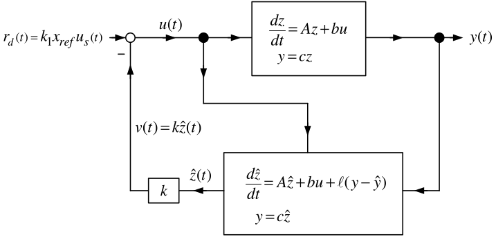

$$\begin{aligned}
\underset{dz/dt}{\underbrace{\left[
\begin{array}{c}
dx/dt \\
dv/dt \\
d\theta /dt \\
d\omega /dt
\end{array}
\right] }} &=\underset{A}{\underbrace{\left[
\begin{array}{cccc}
0 & 1 & 0 & 0 \\
0 & 0 & -\dfrac{gm^{2}\ell ^{2}}{Mm\ell ^{2}+J(M+m)} & 0 \\
0 & 0 & 0 & 1 \\
0 & 0 & \dfrac{mg\ell (M+m)}{Mm\ell ^{2}+J(M+m)} & 0
\end{array}
\right] }}\underset{z}{\underbrace{\left[
\begin{array}{c}
x \\
v \\
\theta \\
\omega
\end{array}
\right] }}+\underset{b}{\underbrace{\left[
\begin{array}{c}
0 \\
\dfrac{J+m\ell ^{2}}{Mm\ell ^{2}+J(M+m)} \\
0 \\
-\dfrac{m\ell }{Mm\ell ^{2}+J(M+m)}
\end{array}
\right] }}u \\
y &=\left[
\begin{array}{cccc}
1 & 0 & \ell +\dfrac{J}{m\ell } & 0
\end{array}
\right] \left[
\begin{array}{c}
x \\
v \\
\theta \\
\omega
\end{array}
\right] .
\end{aligned}$$
:::

---

::: {.compact-slide .dense-slide}

Inverted Pendulum with State Feedback via State Estimation

In the Laplace domain the block diagram becomes

$$\begin{aligned}
G(s) &=\frac{b(s)}{a(s)}=c(sI-A)^{-1}b, \\
G_{c1}(s) &=\frac{n(s)}{\delta (s)}=k(sI-(A-\ell c))^{-1}b, \\
G_{c2}(s) &=\frac{m(s)}{\delta (s)}=k(sI-(A-\ell c))^{-1}\ell .
\end{aligned}$$

Choose $k$ to place all four poles of $A-bk$ at $-5.$

Choose $\ell$ to place the four poles of $A-\ell c$ at $-10.$
:::

---

::: {.compact-slide .dense-slide .multi-figure-slide}

Inverted Pendulum with State Feedback via State Estimation

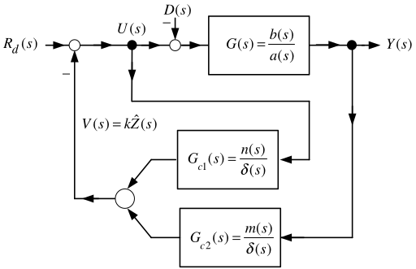

$$\begin{aligned}
G(s) &=c(sI-A)^{-1}b=\frac{b(s)}{a(s)}=\frac{-36.5705}{s^{4}-29.2564s^{2}}, \\[0.35em]
G_{c1}(s) &=k(sI-(A-\ell c))^{-1}b=\frac{n(s)}{\delta (s)}=\frac{
20s^{3}+979.2564s^{2}+2.0255+236830}{s^{4}+40s^{3}+600s^{2}+4000s+10000} \\
G_{c2}(s) &=k(sI-(A-\ell c))^{-1}\ell =\frac{m(s)}{\delta (s)}=\frac{
-50167s^{3}-303420s^{2}-205080s-170900}{s^{4}+40s^{3}+600s^{2}+4000s+10000}.
\end{aligned}$$ Block diagram reduction gives

:::

---

::: {.compact-slide .dense-slide}

Inverted Pendulum with State Feedback via State Estimation

$$\begin{aligned}
G_{c}(s)&=\frac{\delta (s)}{\delta (s)+n(s)} \\
&=\frac{s^{4}+40s^{3}+600s^{2}+4000s+10000}
{s^{4}+60s^{3}+1579.3s^{2}+4000s+246830} \\
&=\frac{s^{4}+40s^{3}+600s^{2}+4000s+10000}
{(s^{2}+63.3642s+1642.2)(s^{2}-3.364s+150.31)}.
\end{aligned}$$

The transfer function from $D(s)$ to $Y(s)$ is

$$\begin{aligned}
\frac{Y(s)}{D(s)}
&=-\frac{G(s)}{1+G_{c}(s)G_{c2}(s)G(s)} \\
&=-\frac{b(s)/a(s)}{1+\dfrac{m(s)}{\delta (s)+n(s)}\dfrac{b(s)}{a(s)}}
=S(s)\frac{b(s)}{a(s)}.
\end{aligned}$$
:::

---

::: {.compact-slide .dense-slide .boundary-safe-slide}

Inverted Pendulum with State Feedback via State Estimation

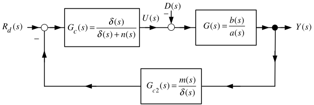

The sensitivity function is

$$\begin{aligned}
S(s)&\triangleq \frac{1}{1+\dfrac{m(s)}{\delta (s)+n(s)}\dfrac{b(s)}{a(s)}} \\
&=\frac{1}{1+
\dfrac{(s+5.408854)(s^{2}+0.63934s+0.62982)}
{(s^{2}+63.3642s+1642.2)(s^{2}-3.364s+150.31)}
\dfrac{36.5705}{s^{2}(s^{2}-29.2564)}}, \\[0.4em]
\int_{0}^{\infty }\log _{10}|S(j\omega )|d\omega
&=\pi \log _{10}(e)\left(
3.364+\sqrt{29.2564}\right) =16.6.
\end{aligned}$$

-   The output $y=x+\left( \ell +\dfrac{J}{m\ell }\right) \theta$ is very sensitive to input disturbances.

-   Using an observer to estimate the state is still an output feedback controller.

-   The RHP poles of $G_{c}(s)G_{c2}(s)=\dfrac{m(s)}{\delta (s)+n(s)}$ and $G(s)=\dfrac{b(s)}{a(s)}$ tell us to expect the sensitivity to be large.
:::
